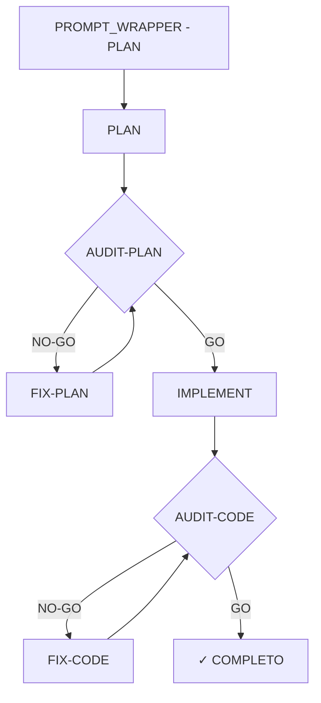
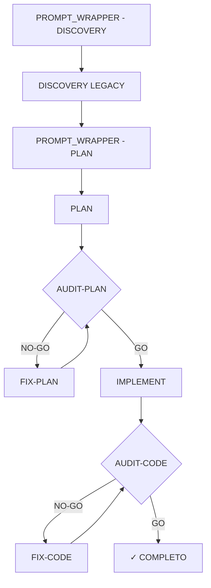

Toda generación de código en este repositorio debe seguir AECF.
PLAN aprobado + AUDIT GO son obligatorios.

Ciclo completo para funcionalidad nueva:

Empieza siempre por PROMPT_WRAPPER - 01 - PLAN, está para ayudar en la secuencia de órdenes y fases

Ciclo completo para funcionalidad legacy (existente en un proyecto ya desarrollado anteriormente):

Empieza siempre por PROMPT_WRAPPER - 00 - DISCOVERY_LEGACY, está para ayudar en la secuencia de órdenes y fases

COMO REGLA GENERAL
- Para funcionalidad nueva, se inicia el flujo con PROMPT_WRAPPER - PLAN.
- Para funcionalidad existente, se inicia el flujo con PROMPT_WRAPPER - DISCOVERY.
- El output de DISCOVERY se usa como contexto congelado de entrada al PLAN.
- PLAN es único y soberano.
