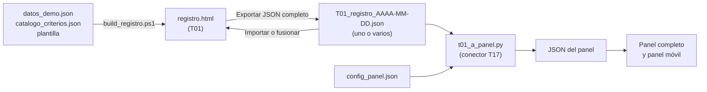

# T01 · Registro de iniciativas

## Aviso legal y exención de responsabilidad

SEVEN-G y esta herramienta se ofrecen «tal cual» y con fines exclusivamente informativos. No constituyen asesoramiento jurídico, regulatorio, financiero ni profesional, ni garantizan el cumplimiento de ninguna norma. Los criterios, clasificaciones y referencias a regulación general (Reglamento Europeo de IA, RGPD, DORA, NIS2…) o sectorial pueden ser incompletos, no aplicar a un caso concreto o quedar desactualizados por cambios normativos. Cada organización que use la herramienta es la única responsable de identificar la normativa que le aplica, verificar su vigencia y certificar su propio cumplimiento regulatorio, con el asesoramiento cualificado que corresponda. El autor no asume responsabilidad alguna por el uso de la herramienta ni por las decisiones adoptadas con ella. Los datos de demostración son ficticios.

En la interfaz, este aviso figura en el pie de todas las vistas, se muestra destacado en la primera carga (al descartarlo se recuerda en el navegador) y está siempre accesible desde el enlace «Aviso legal» de la cabecera y del pie. Junto a la clasificación regulatoria (ficha, alta y edición, inventario T02 y determinación de intensidad T04) se indica que es orientativa y que debe realizarla la organización con criterio jurídico cualificado.

Herramienta de referencia de **SEVEN-G** (ola 1 · núcleo) para gestionar la cartera de IA como un embudo: fases, estados, eventos con fecha, criterios de *gate*, condiciones, valor y métricas. Incluye como módulos **T02** (inventario de sistemas de IA), **T03** (gestor de *gates*), **T04** (determinación de intensidad) y **T05** (clasificador de ambición).

Especificación: documento 03 (§3 y §4), documento 01 (§6–§9), documento 00 (§5.2 y §6) y documento 21 (criterios de *gate*).

## Ficheros

| Fichero | Contenido |
|---|---|
| `registro.html` | Aplicación completa en un único fichero (HTML, CSS y JavaScript sin dependencias). **Se genera** con `build_registro.ps1` a partir de los JSON; nunca se edita a mano. |
| `datos_demo.json` | Fuente de los datos de demostración (ficticios) con los que se abre la aplicación, válidos contra el esquema. |
| `catalogo_criterios.json` | Fuente del catálogo de 128 criterios de *gate* del documento 21, en español e inglés (un criterio por línea). |
| `esquema_registro.schema.json` | JSON Schema 2020-12 del modelo de datos común (03 §4), con listas cerradas y patrones de código. Versión 0.5. |
| `build_registro.ps1` | Construye `registro.html` incrustando los JSON en la plantilla. Comprueba las fuentes antes de generar. |
| `_fuentes/registro.plantilla.html` | La aplicación sin datos: lo único que se edita a mano. No se publica. |
| `README.md` · `README_en.md` | Este documento, en español e inglés. |

## Cómo se construye: de los JSON al registro y del registro al panel

El registro sigue el mismo patrón que el panel del consejo (T17): **los datos viven en JSON y el HTML se genera incrustándolos**, para que funcione abriendo el fichero desde el disco.

- `pwsh -File build_registro.ps1` genera `registro.html` con los datos de demostración. Con `-Datos mi_registro.json` la aplicación arranca con ese registro en lugar de la demostración, y con `-Salida` se elige el fichero de salida.
- El script valida que los JSON se leen, que el catálogo no repite códigos, que iniciativas, eventos, importes y decisiones apuntan a entidades que existen y que el panel de ejemplo enlazado existe.
- **Por qué importa.** El registro es la única entrada de datos: cada iniciativa se da de alta una vez, como una oportunidad en un CRM, y de ese mismo JSON salen el embudo del registro y el panel del consejo. No hay cifras escritas a mano en ningún HTML, de modo que el panel se puede reconstruir en cualquier momento desde el o los JSON del registro.

## Cómo se abre

1. Doble clic en `registro.html`. Funciona desde el disco (`file://`), sin servidor, sin instalación y sin conexión.
2. La primera vez se cargan los datos de demostración: una banda avisa de que las **iniciativas son de ejemplo** y enlaza, igual que la cabecera, al **panel del consejo generado con esas mismas iniciativas** (T17). Con datos propios, el enlace lleva a la página del conector. A partir de ahí, cada cambio se guarda automáticamente en el almacenamiento local del navegador (`localStorage`), asociado a ese navegador y a esa ruta de fichero.
3. Arriba a la derecha se elige idioma (ES/EN) y tema (automático, claro u oscuro). La preferencia se recuerda.
4. En **Datos** se fija la *fecha de referencia* (fecha de corte para días y alertas). Los datos de demostración la fijan en 16-09-2026; vacía significa «hoy».
5. El botón **«Datos: …»** de la barra dice dónde están los datos (ejemplo, este navegador, un fichero del equipo o el servidor de la compañía) y abre el diálogo «Dónde están mis datos» con las tres formas de guardarlos (documento 03 §2.1): solo en este navegador (por defecto; la primera vez que se cambia algo, una banda lo avisa); en un **fichero JSON del equipo** que la herramienta reescribe con cada cambio y vuelve a leer al abrirla (Edge o Chrome; el fichero es el mismo que descarga «Exportar»); o, en una copia del sitio servida por http en la compañía, el fichero `herramientas/datos/T01_registro.json`, que sustituye a los datos de ejemplo para toda la compañía. En el sitio público esa carpeta no existe.

La aplicación no envía datos a terceros ni carga recursos externos (usa las fuentes del sistema; no se enlaza Google Fonts para no ceder datos de navegación).

## Vistas (03 §3.7)

| Vista | Qué hace |
|---|---|
| **Embudo** | Indicadores de cartera, embudo por fase con desglose por estado, estancadas y valor esperado, y tabla de iniciativas con días en fase frente al plazo y alertas. Filtros por esfera, ambición, intensidad, clasificación regulatoria, tecnología, exposición, tipo de valor, área, estado, fase, proveedor, etiqueta libre y texto. |
| **Tablero** | Tarjetas por fase (0–7) y columna de cerradas. Las tarjetas cambian de columna cuando se registra la decisión del *gate*. |
| **Ficha** | Pestañas: resumen (identificación, responsables con incompatibilidades, clasificación, ciclo de vida, valor, riesgo y cumplimiento, y datos para el panel del consejo), *gate* en curso (T03), condiciones, valor (validado, declarado o estimado), riesgos (T06: matriz y registro de la iniciativa), línea de tiempo de eventos e historial de *gates* con sus criterios. Desde G3, la pestaña del *gate* resume la matriz de riesgos. |
| **Gates pendientes** | Solicitudes a la espera de verificación o decisión, con días hábiles frente al plazo, bloqueantes y evidencias sin verificar; revisiones de continuidad próximas o caducadas. |
| **Alertas** | Estancadas, decisión fuera de plazo, condiciones vencidas, revisiones de continuidad caducadas, evidencias pendientes de verificación, tercera iteración (elevación), reanudación vencida, roles incompatibles, no conformidades fuera de plazo, adopción baja y observaciones de la matriz de riesgos (T06). |
| **Riesgos (T06)** | Matriz y registro de riesgos de las iniciativas que dejan pasar los filtros: matriz 5 × 5 de probabilidad por impacto, residual o inherente, con el número de riesgos por celda (pulsar una celda filtra el registro); resumen por nivel y por las diez categorías del documento 33; observaciones de la metodología; registro con valoración inherente y residual, controles y su eficacia, respuesta, responsable, aceptación, estado y revisión; alta y edición; exportación CSV. Filtros propios por categoría, nivel residual y estado, e inclusión de los cerrados. |
| **Análisis** | Métricas de 03 §3.5 segmentables con los filtros (ver más abajo). |
| **Inventario (T02)** | Sistemas propios, de terceros y de uso corporativo, con clasificación, intensidad, autonomía, proveedores, responsable y revisión; avisos de coherencia con el registro. |
| **Datos** | Exportación, pasos para generar el panel del consejo, importación de uno o varios JSON (sustituir o fusionar), preferencias, plazos de referencia (C2/C5), personas y proveedores. |

## Reglas que aplica la herramienta

**Eventos.** Toda modificación (alta, entrada y salida de fase, solicitud, verificación, decisión, elevación, condiciones, espera y reanudación, cambios de clasificación, edición de campos, valor, evidencias, retirada) genera un evento con fecha del hecho, autor, motivo obligatorio y, cuando procede, campo, valor anterior y nuevo. Los eventos no se editan ni se borran desde la interfaz.

**Gestor de gates (T03).**
- Catálogo embebido de los criterios G0.01–G7.12 y R6.01–R6.16 del documento 21, en español e inglés (texto y nota por ambición de las versiones española e inglesa del documento, con los mismos códigos), con obligatoriedad (Sí, Sí ◆, Condicionable; «Rec.» en la columna de intensidad se trata como recomendado), aplicación Lite/Enterprise y nota por ambición.
- *No aplica* automático y justificado por intensidad, etiquetas [GEN], [AG] y [TER], criterios solo de Transformar y criterios de resultado (Escalar, Iterar, Retirar) según el resultado propuesto. Un *No aplica* manual sin justificación se trata como *No cumple*.
- Grado de cumplimiento (cumplen ÷ aplicables), bloqueantes, condicionables abiertos y recomendados omitidos.
- Impide **Continuar** (y Continuar la operación o Escalar) con obligatorios en *No cumple* o *Pendiente*, o con condicionables abiertos; **Continuar con condiciones** solo sobre condicionables abiertos y sin bloqueantes; ningún resultado sin verificación conforme; solo **Parar** con práctica prohibida (G3.08); con condiciones vencidas no cabe continuar; en G5 Enterprise, continuar exige las cuatro firmas conformes y sin veto.
- Separación de funciones: el verificador no puede ser patrocinador ni del equipo (producto, técnico, operación) ni autor de evidencias; el decisor no puede ser del equipo, ni el verificador, ni autor de evidencias; en Lite G3–G5 exige conformidad de riesgos de alguien ajeno al equipo.
- A partir de la tercera decisión en el mismo *gate* obliga a marcar la elevación y a elegir órgano superior o consejo; en Transformar, G2 (continuar) y G7 (escalar) exigen decisión del consejo.
- Condiciones con descripción, responsable, plazo posterior a la decisión y forma de verificación; alerta al vencer; se pueden marcar cumplidas, anuladas o vencidas.
- Resultados por puerta (21 §5.3): G0 y G4–G5 sin Pivotar; G1–G3 con Pivotar (vuelta a la fase 2); **R6**: Continuar la operación · Continuar con condiciones · Adelantar G7 (casilla de desviación que obliga a adelantar); **G7**: Escalar (vuelve a fase 6 y abre el alta de la nueva iniciativa de alcance ampliado) · Iterar (fase de vuelta, por defecto 6) · Retirar (motivo codificado, plan ejecutado o pendiente de registrar).
- Quién verifica y decide según 01 §7.5 (en Lite, G3–G5: patrocinador con conformidad de riesgos).

**T04 · Intensidad.** Ocho criterios de 01 §9.2 con Sí/No/Sin dato; basta uno para Enterprise. Si no hay ningún sí pero hay criterios sin dato, el resultado se marca como Lite provisional.

**T05 · Ambición.** Cinco preguntas de 00 §5.2: 1 o 4 → Transformar; 2 o 3 → Aumentar; 1–4 negativas → Optimizar. Según el momento actualiza la ambición propuesta (fase 1), confirmada (fase 2) o real (fase 7). Transformar fuerza intensidad Enterprise.

**Espera.** Requiere causa (presupuesto, dependencia, proveedor, datos u otra) y fecha prevista de reanudación; el tiempo en espera no cuenta en el tiempo en fase.

**«Sin dato» no es cero.** Los importes vacíos se guardan como `null`, se muestran como «Sin dato», no suman y se cuentan aparte. El valor neto anual es eficiencias + retorno − coste recurrente y solo se calcula si hay al menos un beneficio y el coste recurrente con importe; la capacidad liberada, el riesgo evitado y el cumplimiento no suman.

**T06 · Matriz y registro de riesgos** (documento 33 y plantilla P12).
- Escalas comunes: probabilidad e impacto de 1 a 5; el impacto es el mayor de cinco ejes (económico, personas y derechos, regulatorio, operativo, reputacional). Nivel = probabilidad × impacto: Bajo 1–4 · Medio 5–9 · Alto 10–15 · Crítico 16–25. Los niveles se calculan; `nivel_inherente` y `nivel_residual` se conservan para los riesgos que solo tienen el nivel.
- Residual **objetivo** (con los controles previstos, G3 y G4) o **verificado** (con la eficacia de los controles probada, G5 y R6). El órgano que acepta el residual depende de su nivel: Bajo, responsable de producto; Medio, patrocinador; Alto, comité de IA; Crítico, solo el consejo o su comisión delegada. Con impacto 5 en personas y derechos o regulatorio, se acepta como Alto como mínimo (regla de impacto extremo, 33 §4.3).
- Observaciones (informativas; no impiden guardar ni decidir, pero alimentan las alertas y la pestaña del *gate*): residual Crítico sin aprobación del consejo (bloquea G3 y G5); Alto o Crítico sin plan de contingencia (G3.13); Medio o superior sin respuesta (G3.14); sin responsable; sin valorar o sin residual; aceptación por un órgano inferior, por quien construye la iniciativa o caducada; sin aceptación desde la fase 3 (G3.12); revisión vencida; control ineficaz en un riesgo Alto o Crítico (no conformidad); residual verificado que reduce más niveles de los que admite la eficacia de los controles (2 eficaz, 1 parcialmente eficaz, 0 el resto); iniciativa en fase 3 o posterior sin registro (G3.11).
- Cada alta o cambio de un riesgo genera un evento de edición con fecha, autor y motivo. Los riesgos no se borran: se cierran con el estado «Cerrado».
- Si el mayor residual de los riesgos abiertos no coincide con el **riesgo residual principal** de la ficha (el dato que usa el panel del consejo), la pestaña lo indica y ofrece actualizarlo, con su evento.

**Por qué importa.** La matriz de riesgos es evidencia obligatoria de G3, la principal puerta de parada, y se revisa en G5 y en cada R6. Llevarla dentro del registro evita que viva en una hoja aparte que nadie actualiza: el mismo sitio que mueve la iniciativa por el embudo muestra qué riesgos quedan sin tratar, quién debe aceptarlos y qué bloquea la decisión.

## Métricas del análisis (03 §3.5)

| Métrica | Cálculo |
|---|---|
| Tiempo en fase | Intervalos entre eventos `entrada_fase` y `salida_fase`, menos los días entre `espera_inicio` y `espera_fin`. Mediana y percentil 80 (interpolación lineal) de los intervalos cerrados; se indican los que están en curso. |
| Tiempo de decisión | Días hábiles (lunes a viernes, sin festivos) entre `fecha_solicitud` y `fecha_decision`, por *gate*. |
| Tiempo hasta producción | Días naturales registro → primera decisión G3 que continúa → primera entrada en fase 6. |
| Conversión por gate | Distribución de resultados; «continúan» = Continuar, Continuar con condiciones, Continuar la operación y Escalar. |
| Iteraciones por gate | Media y máximo de iteraciones previas en las decisiones finales (resultado distinto de Iterar). |
| Cumplimiento | Grado medio por *gate* de las decisiones tomadas y criterios que más veces bloquean. |
| Estancadas | Días en fase sin espera por encima del plazo de referencia de la fase y la intensidad (la fase 6 no tiene plazo). |
| Tiempo en espera y motivos de parada/retirada | Episodios y días por causa; distribución de motivos codificados. |
| Mezcla de ambición y valor por fase | Iniciativas activas por fase según ambición confirmada (o propuesta) y suma de su valor esperado con recuento aparte de las que no tienen dato. |
| Valor ponderado | Para las fases 0–5: valor esperado × probabilidad histórica de llegar a producción (iniciativas del registro que pasaron por la fase y llegaron a producción ÷ las resueltas, en producción o cerradas). Solo se muestra si hay al menos `historial_minimo_ponderado` resueltas (5 por defecto); el valor de las fases sin historial se informa como excluido. |
| Cohortes | Por trimestre de registro: registradas, superan G3, llegan a producción, cerradas sin producción y mediana hasta producción. |

## Importar y exportar

- **Exportar JSON completo**: todo el registro en el formato de `esquema_registro.schema.json`. Es la copia de seguridad, el medio para compartir datos y **la entrada del panel del consejo (T17)**. Incluye el campo raíz `aviso_legal` con el aviso legal en el idioma de la interfaz.
- **Exportar CSV de iniciativas**: una fila por iniciativa con clasificación, ciclo de vida, responsables, valor, condiciones, cierre y alertas. Separador punto y coma, UTF-8 con BOM; listas separadas por `|`; celda vacía = sin dato; los códigos de las listas cerradas se exportan sin traducir. **No incluye el aviso legal**: el CSV no admite líneas de comentario y una primera línea añadida rompería la cabecera al abrirlo en una hoja de cálculo o importarlo; quien distribuya el CSV debe acompañarlo del aviso.
- **Exportar riesgos (CSV)** (vista Riesgos): una fila por riesgo con los campos de P12 y 33 §8.1, puntuaciones y niveles calculados, nivel a efectos de aceptación, órgano requerido y códigos de las observaciones. Es la «plantilla de hoja de cálculo» de T06. Mismo formato y misma advertencia sobre el aviso legal que el CSV de iniciativas.
- **Panel del consejo (T17)**: el panel se regenera solo en el navegador con este registro (D101): el enlace de la cabecera y el de la vista Datos lo abren, y el panel lee el registro guardado en este navegador (mismo sitio). «Descargar el JSON del panel» produce `dashboard_data.json` con el conector `t01_a_panel.js`, incrustado aquí: hay una sola correspondencia T01 → panel, la del conector T17 (idéntica en JavaScript y en Python, comprobado en cada verificación). El generador con Python solo hace falta para publicar el panel como ficheros estáticos.
- **Importar JSON**: selector de **uno o varios ficheros** (por ejemplo, un registro por área o por periodo). Cada fichero se valida (estructura, patrones de código, listas cerradas, fechas, referencias y resultados admitidos por *gate*); después se unen por código (si un código se repite, prevalece el del último fichero; `meta` es la del primero, con las áreas de todos) y se valida el resultado. **Validar e importar** sustituye los datos actuales; **Validar y fusionar** añade los ficheros a los datos actuales. Siempre se pide confirmación.
- **Restaurar demostración** y **borrar datos locales** piden confirmación.

## Modelo de datos

Un único objeto JSON con `version_esquema` (`0.5`; los ficheros `0.1` a `0.4` se aceptan y se actualizan al cargarlos, porque cada versión posterior a la `0.1` solo añade campos opcionales), `aviso_legal` (texto, opcional al importar), `meta` (organización, fecha de referencia, moneda, configuración de plazos) y una lista por entidad de 03 §4. `null` significa «sin dato». Fechas `AAAA-MM-DD`.

| Lista | Entidad | Código |
|---|---|---|
| `iniciativas` | Iniciativa: identificación, responsables, clasificación (taxonomía controlada), T04, T05, ciclo de vida (fase, estado, entrada, iteración, espera, próxima revisión), cierre, riesgo residual, evaluaciones de impacto, inversión, datos para el panel (`panel`, opcional), etiquetas libres, sistemas | `IA-AAAA-NNN` |
| `sistemas` | Sistema de IA (T02) | `SIA-AAAA-NNN` |
| `eventos` | Evento con fecha, autor, motivo y cambio. Los que cambian el estado de la iniciativa (alta, entrada en fase, parada y retirada) guardan además las `cifras` de ese momento: inversión, coste recurrente, eficiencias y retorno, esperados y realizados | `EVT-NNNNNN` |
| `decisiones_gate` | Solicitud, verificación, decisión, órgano, elevación, resultado propuesto y resultado, firmas G5, criterios evaluados (`codigo`, `estado`, `justificacion`, `evidencias`) | `DG-AAAA-NNN` |
| `condiciones` | Condición con decisión, criterio, responsable, plazo, verificación y estado | `CND-AAAA-NNN` |
| `evidencias` | Enlace, plantilla, versión, autor, fecha y verificación (se enlaza, no se copia) | `EVI-AAAA-NNNN` |
| `valores` | Importe esperado o realizado por tipo, fórmula, estado (validado, declarado, estimado), periodo, fuente, concepto del panel (`concepto`, opcional) y unidad de negocio (`area`, opcional, iniciativas transversales) | `VAL-NNNN` |
| `riesgos` | Riesgo (T06): descripción, categoría, riesgo tipo, sistema, responsable, valoración inherente y residual, controles y su eficacia, respuesta, contingencia, estado, tendencia, revisión y aceptación | `IA-AAAA-NNN · Rnn` |
| `no_conformidades` · `incidentes` · `proveedores` · `recomendaciones` | Entidades relacionadas (en esta versión se muestran y se exportan; su gestión completa corresponde a T08 y T09; las recomendaciones se gestionan en la vista Consejo, T18) | `NC-AAAA-NNN` · `INC-AAAA-NNN` · `PRV-NNN` · `REC-AAAA-NNN` |
| `personas` | Personas asignables a roles, verificación, decisión y condiciones | `PER-NN` |

Listas cerradas (valores en el esquema): esfera `01`–`09`; ambición `optimizar · aumentar · transformar`; intensidad `lite · enterprise`; clasificación regulatoria `prohibido · alto_riesgo · transparencia · riesgo_minimo · fuera_ambito · pendiente`; tecnología `ml_predictivo · ia_generativa · agente · lenguaje_documentos · vision · optimizacion · ia_terceros_embebida · reglas`; exposición `interna · empleados · clientes_indirecta · clientes_directa`; tipo de valor `eficiencia · retorno · riesgo_evitado · cumplimiento`; motivo de parada o retirada (10 códigos); estados (8); resultados (9); estados de criterio (4); tipos de evento (18); autonomía `A0`–`A3`.

## Qué aporta el registro al panel del consejo (T17)

El conector `../T17_panel_consejo/t01_a_panel.py` convierte el JSON completo de este registro en el JSON del panel y genera el panel completo y el móvil. La tabla de correspondencia campo a campo está en el [README de T17](../T17_panel_consejo/README.md). Lo esencial:

| Qué muestra el panel | De dónde sale en T01 |
|---|---|
| **Estado del caso y embudo** (Propuesto → Hipótesis de valor → POC → En desarrollo → En uso; salidas: No aprobado, Descartado, Desenganchado) | Fase y cierre de la iniciativa: fases 0–1 → Propuesto; 2 → Hipótesis de valor; 3 → POC; 4–5 → En desarrollo; 6–7 → En uso. Parada en fases 0–1 → No aprobado; en fases 2–5 → Descartado; retirada → Desenganchado. La correspondencia se configura en `config_panel.json` de T17. |
| **Ciclo de vida y tiempos por etapa**, como en un CRM (`historial_estados`) | Alta y eventos `entrada_fase` (incluidas las vueltas atrás por pivotar o iterar) y fecha del cierre. Nunca se estiman. Cada cambio de estado lleva las cifras que tenía la iniciativa en ese momento (`eventos[].cifras`): el panel las muestra en el embudo, en sus tablas y en la ficha del caso. |
| **Inversión, eficiencias y retorno**, actual y potencial | `valores` realizados y esperados, con su estado (validado, declarado, estimado) y, si se informa, su `concepto` (línea del panel). |
| **Clasificación y controles** | Clasificación regulatoria, evaluaciones de impacto (EIPD, EIDF) y `panel.controles` (seguridad, manual de uso y control, riesgo de ataques con IA). |
| **Complejidad, prioridad, plazo del valor esperado y observaciones del consejo** | Bloque opcional `panel` de la iniciativa (en la ficha: «Datos para el panel del consejo»). |
| **Movimientos, incidentes y recomendaciones (T18)** | Eventos de alta, parada, retirada y cambio de clasificación, revisiones R6, `incidentes` y `recomendaciones`. |

**Campos añadidos en el esquema 0.2 para el panel** (todos opcionales; vacío = «sin dato»):

| Campo | Valores | Uso en el panel |
|---|---|---|
| `iniciativas[].panel.complejidad` | `baja` · `media` · `alta` | Límite de días en desarrollo. |
| `iniciativas[].panel.prioridad` | `alta` · `media` · `baja` | Etiqueta y filtro de prioridad. |
| `iniciativas[].panel.plazo_potencial` | `AAAA-MM` | Plazo del valor potencial. |
| `iniciativas[].panel.observaciones_consejo` | texto | Observaciones del consejo asesor en la ficha del caso. |
| `iniciativas[].panel.controles` | `seguridad`, `muc`, `ia_ofensiva`: `hecho` · `pendiente` · `no_aplica` | Controles completos por caso. |
| `valores[].concepto` | Eficiencias: `personas` · `herramientas` · `siniestros` · `operativo` · `penalizaciones`. Retorno: `venta_nueva` · `venta_cruzada` · `retencion` · `precio_margen` · `cobros` · `otros` | Línea del panel en la que suma el importe; sin concepto va a `operativo` u `otros`. |
| `meta.panel.consejo_sigla` | texto | Nombre o siglas del consejo asesor en los textos del panel. |
| `eventos[].cifras` | `esperado` y `realizado`, cada uno con `inversion`, `coste_recurrente`, `eficiencias` y `retorno` | Cifras al entrar en cada estado: evolución del caso a lo largo del embudo. Las guarda la herramienta sola. |

**Campos añadidos en el esquema 0.3: iniciativas transversales y plataformas habilitadoras** (documento 40 §7.2; todos opcionales, un registro 0.1 o 0.2 sigue siendo válido):

| Campo | Valores | Uso |
|---|---|---|
| `iniciativas[].alcance.tipo` | `unidad` · `transversal` · `plataforma` | Sin el bloque, la iniciativa es de una unidad. **Transversal**: herramienta que usan varias unidades de negocio (por ejemplo, un asistente generativo en la suite ofimática). **Plataforma**: capacidad habilitadora cuyo valor se imputa a los casos que la usan. Se edita en la ficha («Alcance») y se filtra por él. |
| `iniciativas[].alcance.reparto[]` | `area`, `estado` (`previsto` · `piloto` · `en_uso` · `retirado`), `desde`, `licencias_asignadas`, `licencias_activas`, `usuarios_activos_semanales`, `horas_liberadas_mes`, `fuente`, `fecha_dato` | Despliegue y adopción de cada unidad (botón «Editar despliegue y adopción por unidad» de la pestaña Valor). Las horas son declaradas: nunca se validan ni suman como ahorro. |
| `iniciativas[].alcance.umbral_adopcion_pct` | 0–100 | Alerta «Adopción baja» cuando una unidad en uso tiene menos licencias activas sobre asignadas. |
| `iniciativas[].alcance.habilita[]` | códigos `IA-AAAA-NNN` | Plataforma: casos a los que se imputa su valor. |
| `valores[].area` | una unidad de negocio | Coste y valor de cada unidad; sin `area`, lo común de la iniciativa (gobierno, formación). La pestaña Valor muestra la escalera por unidad: coste, adopción, horas declaradas, capacidad liberada y valor materializado. |

**Campos añadidos en el esquema 0.4: matriz y registro de riesgos (T06)** (documento 33 §8.1; todos opcionales en `riesgos[]`, un registro 0.1, 0.2 o 0.3 sigue siendo válido):

| Campo | Valores | Uso |
|---|---|---|
| `eje_impacto` | `economico` · `personas` · `regulatorio` · `operativo` · `reputacional` | Eje que determina el impacto; aplica la regla de impacto extremo. |
| `eficacia_controles` | `eficaz` · `parcial` · `ineficaz` · `no_probado` | Reducción máxima admitida en el residual verificado (33 §5.3). |
| `probabilidad_residual` · `impacto_residual` | 1–5 | Posición del riesgo en la matriz residual. |
| `tipo_residual` | `objetivo` · `verificado` | Residual con controles previstos o con eficacia probada. |
| `contingencia` | texto | Disparador, acciones y quién la activa; obligatoria en Alto y Crítico. |
| `estado` | `identificado` · `en_tratamiento` · `aceptado` · `materializado` · `cerrado` | Los cerrados no cuentan en la matriz salvo que se incluyan. |
| `tendencia` | `sube` · `estable` · `baja` | Seguimiento (Enterprise). |
| `fecha_alta` · `proxima_revision` | `AAAA-MM-DD` | Alta del riesgo y próxima revisión (33 §7.3). |
| `aceptacion` | `organo` (`producto` · `patrocinador` · `comite_ia` · `consejo`), `persona`, `fecha`, `vigencia`, `referencia` | Aceptación del residual por el órgano de su nivel. |

El panel del consejo (T17) no lee estos campos: sigue usando el riesgo residual principal de la iniciativa.

**Campos añadidos en el esquema 0.5: evidencia del índice de transformación (T14) y registro del consejo (T18)** (documentos 12 y 62; todos opcionales, un registro 0.1 a 0.4 sigue siendo válido):

| Campo | Valores | Uso |
|---|---|---|
| `iniciativas[].indice.itp2` · `itp3` | `estado` (`pendiente` · `verificada` · `no_verificada`), `gate` (`G2` · `G5` · `R6` · `G7`), `fecha`, `verificador`, `evidencia`; en `itp3`, `supervision_p17` | Verificación en un *gate* de las respuestas IT-P2 e IT-P3 (señales 4 y 5 del documento 12). Un cambio de roles sin supervisión humana verificada no cuenta. |
| `iniciativas[].indice.unidad_completa` | sí o no | Rediseño de una unidad organizativa completa (nivel 3 de la señal 5). |
| `iniciativas[].indice.capacidad` | `horas_liberadas`, `horas_materializadas`, `horas_reasignadas`, `actividad_destino`, `roles_redisenados`, `fecha` | Capacidad liberada y convertida (T20, señal 3). Las horas reasignadas exigen su actividad de destino. |
| `valores[].oferta_habilitada_ia` | sí o no | Retorno de una oferta que no existiría sin la IA (prueba contrafactual; señal 6). |
| `meta.indice` | `ingresos_totales`, `periodo_ingresos`, `it_d3`, `it_d3_evidencia` | Denominador de la señal 6 y condición IT-D3 de la declaración de transformación. |
| `decisiones_consejo[]` | `DEC-AAAA-NNN` con `fecha`, `organo`, `acta`, `tipo`, `asunto` (tesis, apuesta de Transformar en G2, escalado en G7, revisión de una apuesta, decisión de etapa, riesgo Crítico, revisión C5, toma de conocimiento, otra), `texto`, `resultado`, `iniciativas`, `esferas_transformar`, `limite_inversion_etapa`, `etapa`, `decision_etapa`, `vigencia`, `responsable`, `recomendaciones` | Decisiones del consejo del documento 62 §10: fuente de la señal 8 y de la condición IT-D1. |

La ficha muestra la evidencia del índice en su resumen («Editar evidencia del índice») y la vista **Consejo (T18)** registra las decisiones y las recomendaciones, con la lectura de la señal 8 y los datos de la compañía. La calculadora del índice (T14) lee todo ello del JSON completo del registro; el conector de T17 no lo lee.

**Por qué importa.** Dar de alta una iniciativa en T01 equivale a registrar una oportunidad en un CRM: a partir de ahí, cada entrada de fase, decisión de *gate*, importe y cierre que se anota en el registro mueve el caso por el embudo del panel sin que nadie vuelva a escribir el dato. El consejo ve lo mismo que gestiona la Oficina de IA.

Lo que T01 no registra (adopción global de las suites de productividad fuera de una iniciativa transversal, ficha de identidad y permisos de los agentes, proveedor DORA, métricas de operación) queda «sin dato» en el panel.

## Datos de demostración

Compañía ficticia (*Compañía Ejemplo Industrial, S.A.*), 21 personas y 4 proveedores ficticios, 15 iniciativas registradas entre 2025 y 2026 en todas las fases (0–7) y en los ocho estados: una registrada, en fase, pendientes de *gate* (una en tercera iteración, elevada al órgano superior), una en espera con reanudación vencida, en producción (una con revisión de continuidad caducada), una pendiente de G7 adelantado por R6, una **parada** en G3 por riesgo inaceptable y una **retirada** tras G7 por sustitución. Hay iniciativas estancadas, dos **condiciones vencidas**, un pivotaje, decisiones con condiciones, una firma multinivel G5 Enterprise, importes validados, declarados, estimados y sin dato, 9 sistemas (incluido uno de uso corporativo), incidentes y no conformidades, y 21 riesgos en nueve iniciativas con códigos del catálogo del documento 33: aceptados por el órgano de su nivel, uno cerrado en la iniciativa parada, uno Alto sin plan de contingencia en la iniciativa pendiente de G3 y una aceptación caducada con la revisión vencida en la iniciativa transversal. Una es **transversal** (asistente generativo en la suite ofimática, desplegado por olas en cinco unidades: dos en uso, una en piloto y dos previstas, con Comercial por debajo del umbral de adopción, valor materializado y validado en Finanzas y capacidad liberada declarada que no suma). Catorce iniciativas llevan datos para el panel del consejo (complejidad, prioridad, controles y, en cuatro, observaciones del consejo asesor) y una no, para que el panel muestre también el «sin dato»; los importes de eficiencias y retorno llevan su concepto salvo los que aún no tienen hipótesis. Con estos datos se genera el panel de ejemplo de T17. Los datos son ilustrativos: cualquier parecido con una compañía o persona real es casual.

## Limitaciones

- Días hábiles de lunes a viernes, sin calendario de festivos. La periodicidad de R6 se aproxima en días (182 Lite y 91 Enterprise, configurable).
- Herramienta monousuario y local: sin autenticación, control de acceso, firma electrónica ni sellado de tiempo; el autor de cada evento es declarativo. Los datos de `localStorage` no se comparten entre navegadores ni equipos; hay que exportar el JSON.
- La importación valida la estructura principal, no el JSON Schema completo. La fusión une entidades por código: sirve para registros con códigos distintos (por área o por periodo) o para versiones actualizadas de los mismos registros; si dos registros se han editado por separado desde una misma base, los códigos nuevos pueden coincidir y prevalece el del último fichero.
- El panel del consejo mide el tiempo en cada etapa con las fechas de entrada en fase; no descuenta los periodos en espera, que sí descuenta el análisis del registro.
- Si el navegador guarda datos de una versión anterior, los riesgos de ejemplo nuevos no aparecen hasta pulsar «Restaurar datos de demostración» en la vista Datos.
- La vista de riesgos no calcula aún la concentración ni la correlación de la cartera (33 §10) ni los indicadores de riesgo clave (33 §11).
- No conformidades e incidentes (T08), proveedores (T09), realización de valor por periodos (T12), retiradas (T22) y recomendaciones (T18) se muestran, generan alertas y se exportan, pero su gestión completa corresponde a esas herramientas (olas 2 y 3).
- Las puertas agrupadas en Lite (G0–G2, G4–G5) se registran como decisiones separadas del mismo día; no hay una sesión conjunta.
- Escalar abre el alta de la nueva iniciativa con la etiqueta «Escalado de IA-…», sin vínculo formal entre ambas.
- La probabilidad histórica no se segmenta por intensidad, ambición ni cohorte.
- Probada en Microsoft Edge (Chromium). Debería funcionar en otros navegadores actuales con soporte de `<dialog>`, pero no se ha probado.

## Licencia

Código bajo licencia **MIT**. Contenidos (textos, catálogo de criterios, modelo y datos de demostración) bajo **CC BY 4.0**.

© 2026 Fernando García Varela · Metodología SEVEN-G
