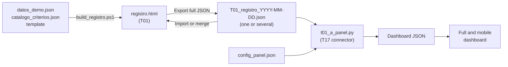

# T01 · Initiative register

## Legal notice and disclaimer

SEVEN-G and this tool are provided “as is” and for information purposes only. They do not constitute legal, regulatory, financial or professional advice, nor do they guarantee compliance with any regulation. The criteria, classifications and references to general regulation (EU AI Act, GDPR, DORA, NIS2…) or sector-specific regulation may be incomplete, may not apply to a specific case or may become outdated as a result of regulatory changes. Each organisation that uses the tool is solely responsible for identifying the regulation that applies to it, verifying that it is current and certifying its own regulatory compliance, with the appropriate qualified advice. The author and SEACHAD accept no liability whatsoever for the use of the tool or for decisions taken with it. The demo data is fictitious.

In the interface, this notice appears in the footer of every view, is shown prominently on first load (dismissing it is remembered in the browser) and is always available from the “Legal notice” link in the header and footer. Next to the regulatory classification (record, registration and edit, T02 inventory and T04 intensity determination) the interface states that it is indicative and must be carried out by the organisation with qualified legal judgement.

**SEVEN-G** reference tool (wave 1 · core) for managing the AI portfolio as a funnel: phases, statuses, dated events, decision gate criteria, conditions, value and metrics. It includes, as modules, **T02** (AI system inventory), **T03** (gate manager), **T04** (intensity determination) and **T05** (ambition classifier).

Specification: document 03 (§3 and §4), document 01 (§6–§9), document 00 (§5.2 and §6) and document 21 (gate criteria).

## Files

| File | Content |
|---|---|
| `registro.html` | Complete single-file application (HTML, CSS and JavaScript, no dependencies). **It is generated** by `build_registro.ps1` from the JSON files; it is never edited by hand. |
| `datos_demo.json` | Source of the (fictitious) demo data the application opens with, valid against the schema. |
| `catalogo_criterios.json` | Source of the catalogue of 128 gate criteria from document 21, in Spanish and English (one criterion per line). |
| `esquema_registro.schema.json` | JSON Schema 2020-12 of the common data model (03 §4), with closed lists and code patterns. Version 0.3. |
| `build_registro.ps1` | Builds `registro.html` by embedding the JSON files in the template. It checks the sources before generating. |
| `_fuentes/registro.plantilla.html` | The application without data: the only thing edited by hand. It is not published. |
| `README.md` · `README_en.md` | This document, in Spanish and English. |

## How it is built: from the JSON files to the register and from the register to the dashboard

The register follows the same pattern as the board dashboard (T17): **data lives in JSON and the HTML is generated by embedding it**, so that it works when the file is opened from disk.

- `pwsh -File build_registro.ps1` generates `registro.html` with the demo data. With `-Datos my_register.json` the application starts with that register instead of the demo, and `-Salida` sets the output file.
- The script checks that the JSON files can be read, that the catalogue has no repeated codes, that initiatives, events, amounts and decisions point to entities that exist, and that the linked example dashboard exists.
- **Why it matters.** The register is the single data entry point: each initiative is entered once, like an opportunity in a CRM, and both the register funnel and the board dashboard come from that same JSON. No figure is hand-written in any HTML, so the dashboard can be rebuilt at any time from the register JSON file or files.

## How to open it

1. Double-click `registro.html`. It works from disk (`file://`), without a server, installation or connection.
2. The first time, the demo data is loaded: a banner states that the **initiatives are examples** and links, as the header does, to the **board dashboard generated from those same initiatives** (T17). With your own data, the link leads to the connector page. From then on, every change is saved automatically in the browser’s local storage (`localStorage`), tied to that browser and that file path.
3. Language (ES/EN) and theme (auto, light or dark) are selected at the top right. The preference is remembered.
4. In **Data**, set the *reference date* (cut-off date for days and alerts). The demo data sets it to 16-09-2026; empty means “today”.

The application does not send data to third parties or load external resources (it uses system fonts; Google Fonts is not linked so that no browsing data is shared).

## Views (03 §3.7)

| View | What it does |
|---|---|
| **Funnel** | Portfolio indicators, funnel by phase broken down by status, stalled initiatives and expected value, and an initiative table with days in phase against the limit and alerts. Filters by sphere, ambition, intensity, regulatory classification, technology, exposure, value type, area, status, phase, supplier, free tag and text. |
| **Kanban board** | Cards by phase (0–7) and a closed column. Cards change column when the gate decision is recorded. |
| **Record** | Tabs: summary (identification, owners with incompatibilities, classification, lifecycle, value, risk and compliance, and data for the board dashboard), current gate (T03), conditions, value (validated, declared or estimated), event timeline and gate history with criteria. |
| **Pending gates** | Requests awaiting verification or decision, with working days against the limit, blocking criteria and unverified evidence; upcoming or overdue continuity reviews. |
| **Alerts** | Stalled, decision overdue, expired conditions, overdue continuity reviews, evidence pending verification, third iteration (escalation), resumption overdue, incompatible roles and overdue nonconformities. |
| **Analysis** | Metrics from 03 §3.5, segmentable with the filters (see below). |
| **Inventory (T02)** | In-house, third-party and corporate-use systems, with classification, intensity, autonomy, suppliers, owner and review; consistency warnings against the register. |
| **Data** | Export, steps to generate the board dashboard, import of one or several JSON files (replace or merge), preferences, reference time limits (C2/C5), people and suppliers. |

## Rules enforced by the tool

**Events.** Every change (registration, phase entry and exit, request, verification, decision, escalation, conditions, hold and resumption, classification changes, field edits, value, evidence, retirement) generates an event with the date of the fact, author, a mandatory reason and, where relevant, field, previous value and new value. Events cannot be edited or deleted from the interface.

**Gate manager (T03).**
- Embedded catalogue of criteria G0.01–G7.12 and R6.01–R6.16 from document 21, in Spanish and English (criterion text and ambition note from the Spanish and English versions of the document, with the same codes), with obligation (Yes, Yes ◆, Conditionable; “Rec.” in the intensity column is treated as recommended), Lite/Enterprise applicability and ambition note.
- Automatic, justified *Not applicable* by intensity, [GEN], [AG] and [TER] tags, Transform-only criteria and outcome criteria (Scale, Iterate, Retire) according to the proposed outcome. A manual *Not applicable* without justification is treated as *Not met*.
- Degree of compliance (met ÷ applicable), blocking criteria, open conditionable criteria and omitted recommended criteria.
- Prevents **Proceed** (and Continue operation or Scale) with mandatory criteria *Not met* or *Pending*, or with open conditionable criteria; **Proceed with conditions** only on open conditionable criteria and without blocking criteria; no outcome without conformant verification; only **Stop** with a prohibited practice (G3.08); no proceeding with expired conditions; at G5 Enterprise, proceeding requires all four sign-offs conformant and no veto.
- Segregation of duties: the verifier cannot be the sponsor, a team member (product, technical, operations) or an evidence author; the decision-maker cannot be a team member, the verifier or an evidence author; at Lite G3–G5, risk clearance must come from someone outside the team.
- From the third decision at the same gate, escalation must be marked and the higher body or the board chosen; for Transform, G2 (proceed) and G7 (scale) require a board decision.
- Conditions with description, owner, deadline after the decision and verification method; alert on expiry; they can be marked met, cancelled or expired.
- Outcomes by gate (21 §5.3): G0 and G4–G5 without Pivot; G1–G3 with Pivot (return to phase 2); **R6**: Continue operation · Proceed with conditions · Bring G7 forward (deviation checkbox that forces bringing it forward); **G7**: Scale (returns to phase 6 and opens registration of the new extended-scope initiative) · Iterate (return phase, 6 by default) · Retire (coded reason, plan executed or pending recording).
- Who verifies and who decides according to 01 §7.5 (at Lite, G3–G5: sponsor with risk clearance).

**T04 · Intensity.** Eight criteria from 01 §9.2 with Yes/No/No data; one is enough for Enterprise. If there is no yes but some criteria have no data, the outcome is flagged as provisional Lite.

**T05 · Ambition.** Five questions from 00 §5.2: 1 or 4 → Transform; 2 or 3 → Augment; 1–4 negative → Optimise. Depending on the moment it updates proposed (phase 1), confirmed (phase 2) or actual (phase 7) ambition. Transform forces Enterprise intensity.

**Hold.** Requires a cause (budget, dependency, supplier, data or other) and a planned resumption date; time on hold does not count towards time in phase.

**“No data” is not zero.** Empty amounts are stored as `null`, shown as “No data”, never summed and counted separately. Annual net value is efficiencies + return − recurring cost and is only calculated when at least one benefit and the recurring cost have an amount; released capacity, avoided risk and compliance are not added.

## Analysis metrics (03 §3.5)

| Metric | Calculation |
|---|---|
| Time in phase | Intervals between `entrada_fase` and `salida_fase` events, minus days between `espera_inicio` and `espera_fin`. Median and 80th percentile (linear interpolation) of closed intervals; intervals in progress are reported. |
| Decision time | Working days (Monday to Friday, no holidays) between `fecha_solicitud` and `fecha_decision`, by gate. |
| Time to production | Calendar days registration → first G3 decision that proceeds → first entry into phase 6. |
| Conversion by gate | Distribution of outcomes; “proceed” = Proceed, Proceed with conditions, Continue operation and Scale. |
| Iterations by gate | Average and maximum prior iterations in final decisions (outcome other than Iterate). |
| Compliance | Average degree by gate of decisions taken and the criteria that block most often. |
| Stalled | Days in phase excluding hold above the reference limit for the phase and intensity (phase 6 has no limit). |
| Time on hold and stop/retirement reasons | Episodes and days by cause; distribution of coded reasons. |
| Ambition mix and value by phase | Active initiatives by phase according to confirmed (or proposed) ambition, and the sum of their expected value with a separate count of those without data. |
| Weighted value | For phases 0–5: expected value × historical probability of reaching production (register initiatives that went through the phase and reached production ÷ resolved ones, in production or closed). Only shown with at least `historial_minimo_ponderado` resolved initiatives (5 by default); value in phases without history is reported as excluded. |
| Cohorts | By registration quarter: registered, pass G3, reach production, closed without production and median time to production. |

## Import and export

- **Export full JSON**: the whole register in the `esquema_registro.schema.json` format. It is the backup, the way to share data and **the input of the board dashboard (T17)**. It includes the root field `aviso_legal` with the legal notice in the interface language.
- **Export initiatives CSV**: one row per initiative with classification, lifecycle, owners, value, conditions, closure and alerts. Semicolon separator, UTF-8 with BOM; lists separated by `|`; empty cell = no data; closed-list codes are exported untranslated. **It does not include the legal notice**: CSV has no comment lines, and an extra first line would break the header when the file is opened in a spreadsheet or imported; whoever distributes the CSV must accompany it with the notice.
- **Board dashboard (T17)**: the view lists the steps (export the full JSON and run the `t01_a_panel.py` connector) and links to the example dashboard and to the connector page. The dashboard JSON is not built in the browser: there is a single T01 → dashboard mapping, the connector's.
- **Import JSON**: picker for **one or several files** (for example, one register per area or per period). Each file is validated (structure, code patterns, closed lists, dates, references and outcomes allowed by gate); the files are then joined by code (if a code is repeated, the one in the last file prevails; `meta` is that of the first file, with the areas of all of them) and the result is validated. **Validate and import** replaces the current data; **Validate and merge** adds the files to the current data. Confirmation is always requested.
- **Restore demo** and **delete local data** ask for confirmation.

## Data model

A single JSON object with `version_esquema` (`0.3`; `0.1` and `0.2` files are accepted and upgraded on load, because `0.2` and `0.3` only add optional fields), `aviso_legal` (text, optional on import), `meta` (organisation, reference date, currency, time-limit configuration) and one list per entity from 03 §4. `null` means “no data”. Dates `YYYY-MM-DD`. Field names and closed-list codes are in Spanish, as in the rest of the SEVEN-G library.

| List | Entity | Code |
|---|---|---|
| `iniciativas` | Initiative: identification, owners, classification (controlled taxonomy), T04, T05, lifecycle (phase, status, entry, iteration, hold, next review), closure, residual risk, impact assessments, investment, data for the dashboard (`panel`, optional), free tags, systems | `IA-AAAA-NNN` |
| `sistemas` | AI system (T02) | `SIA-AAAA-NNN` |
| `eventos` | Event with date, author, reason and change. Events that change the status of the initiative (registration, phase entry, stop and retirement) also store the `cifras` (figures) at that time: investment, recurring cost, efficiencies and return, expected and realised | `EVT-NNNNNN` |
| `decisiones_gate` | Request, verification, decision, body, escalation, proposed outcome and outcome, G5 sign-offs, evaluated criteria (`codigo`, `estado`, `justificacion`, `evidencias`) | `DG-AAAA-NNN` |
| `condiciones` | Condition with decision, criterion, owner, deadline, verification and status | `CND-AAAA-NNN` |
| `evidencias` | Link, template, version, author, date and verification (linked, not copied) | `EVI-AAAA-NNNN` |
| `valores` | Expected or realised amount by type, formula, status (validated, declared, estimated), period, source, dashboard line (`concepto`, optional) and business unit (`area`, optional, cross-unit initiatives) | `VAL-NNNN` |
| `riesgos` · `no_conformidades` · `incidentes` · `proveedores` · `recomendaciones` | Related entities (in this version they are displayed and exported; full management belongs to T06, T08, T09 and T18) | `IA-AAAA-NNN · Rnn` · `NC-AAAA-NNN` · `INC-AAAA-NNN` · `PRV-NNN` · `REC-AAAA-NNN` |
| `personas` | People assignable to roles, verification, decision and conditions | `PER-NN` |

Closed lists (values in the schema): sphere `01`–`09`; ambition `optimizar · aumentar · transformar`; intensity `lite · enterprise`; regulatory classification `prohibido · alto_riesgo · transparencia · riesgo_minimo · fuera_ambito · pendiente`; technology `ml_predictivo · ia_generativa · agente · lenguaje_documentos · vision · optimizacion · ia_terceros_embebida · reglas`; exposure `interna · empleados · clientes_indirecta · clientes_directa`; value type `eficiencia · retorno · riesgo_evitado · cumplimiento`; stop or retirement reason (10 codes); statuses (8); outcomes (9); criterion statuses (4); event types (18); autonomy `A0`–`A3`.

## What the register provides to the board dashboard (T17)

The connector `../T17_panel_consejo/t01_a_panel.py` converts the full JSON of this register into the dashboard JSON and generates the full and mobile dashboards. The field-by-field mapping table is in the [T17 README](../T17_panel_consejo/README_en.md). The essentials (state names are in Spanish, as in the dashboard):

| What the dashboard shows | Where it comes from in T01 |
|---|---|
| **Case state and funnel** (Propuesto → Hipótesis de valor → POC → En desarrollo → En uso; exits: No aprobado, Descartado, Desenganchado) | Phase and closure of the initiative: phases 0–1 → Propuesto; 2 → Hipótesis de valor; 3 → POC; 4–5 → En desarrollo; 6–7 → En uso. Stopped in phases 0–1 → No aprobado; in phases 2–5 → Descartado; retired → Desenganchado. The mapping is configured in `config_panel.json` of T17. |
| **Lifecycle and time per stage**, as in a CRM (`historial_estados`) | Registration and `entrada_fase` events (including steps back after a pivot or an iteration) and the closure date. Never estimated. Each status change carries the figures the initiative had at that time (`eventos[].cifras`): the dashboard shows them in the funnel, in its tables and in the case record. |
| **Investment, efficiencies and return**, current and potential | Realised and expected `valores`, with their status (validated, declared, estimated) and, if provided, their `concepto` (dashboard line). |
| **Classification and controls** | Regulatory classification, impact assessments (DPIA, FRIA) and `panel.controles` (security, use and control manual, risk of AI-enabled attacks). |
| **Complexity, priority, expected value deadline and board remarks** | Optional `panel` block of the initiative (in the record: “Data for the board dashboard”). |
| **Movements, incidents and recommendations (T18)** | Registration, stop, retirement and classification change events, R6 reviews, `incidentes` and `recomendaciones`. |

**Fields added in schema 0.2 for the dashboard** (all optional; empty = “no data”):

| Field | Values | Use in the dashboard |
|---|---|---|
| `iniciativas[].panel.complejidad` | `baja` · `media` · `alta` | Limit of days in development. |
| `iniciativas[].panel.prioridad` | `alta` · `media` · `baja` | Priority tag and filter. |
| `iniciativas[].panel.plazo_potencial` | `YYYY-MM` | Deadline of the potential value. |
| `iniciativas[].panel.observaciones_consejo` | text | Advisory board remarks in the case record. |
| `iniciativas[].panel.controles` | `seguridad`, `muc`, `ia_ofensiva`: `hecho` · `pendiente` · `no_aplica` | Complete controls per case. |
| `valores[].concepto` | Efficiencies: `personas` · `herramientas` · `siniestros` · `operativo` · `penalizaciones`. Return: `venta_nueva` · `venta_cruzada` · `retencion` · `precio_margen` · `cobros` · `otros` | Dashboard line where the amount adds up; without it, `operativo` or `otros`. |
| `meta.panel.consejo_sigla` | text | Name or acronym of the advisory board in the dashboard texts. |
| `eventos[].cifras` | `esperado` and `realizado`, each with `inversion`, `coste_recurrente`, `eficiencias` and `retorno` | Figures on entering each status: how the case evolves along the funnel. Stored automatically by the tool. |

**Fields added in schema 0.3: cross-unit initiatives and enabling platforms** (document 40 §7.2; all optional, a 0.1 or 0.2 register remains valid):

| Field | Values | Use |
|---|---|---|
| `iniciativas[].alcance.tipo` | `unidad` · `transversal` · `plataforma` | Without the block, the initiative belongs to a single unit. **Cross-unit** (`transversal`): a tool used by several business units (for example, a generative assistant in the office suite). **Platform** (`plataforma`): an enabling capability whose value is allocated to the cases that use it. Edited in the record (“Scope”) and available as a filter. |
| `iniciativas[].alcance.reparto[]` | `area`, `estado` (`previsto` · `piloto` · `en_uso` · `retirado`), `desde`, `licencias_asignadas`, `licencias_activas`, `usuarios_activos_semanales`, `horas_liberadas_mes`, `fuente`, `fecha_dato` | Roll-out and adoption of each unit (“Edit roll-out and adoption by unit” button in the Value tab). Hours are declared: they are never validated and never count as savings. |
| `iniciativas[].alcance.umbral_adopcion_pct` | 0–100 | “Low adoption” alert when a unit in use has fewer active over assigned licences. |
| `iniciativas[].alcance.habilita[]` | `IA-YYYY-NNN` codes | Platform: cases to which its value is allocated. |
| `valores[].area` | a business unit | Cost and value of each unit; without `area`, what is shared across the initiative (governance, training). The Value tab shows the ladder by unit: cost, adoption, declared hours, released capacity and realised value. |

**Why it matters.** Entering an initiative in T01 is the equivalent of logging an opportunity in a CRM: from then on, every phase entry, gate decision, amount and closure recorded in the register moves the case through the dashboard funnel without anyone typing the data again. The board sees the same thing the AI Office manages.

Anything T01 does not record (overall adoption of productivity suites outside a cross-unit initiative, agent identity and permissions record, DORA provider, operating metrics) is left as “no data” in the dashboard.

## Demo data

Fictitious company (*Compañía Ejemplo Industrial, S.A.*), 21 fictitious people and 4 fictitious suppliers, 15 initiatives registered in 2025 and 2026 across all phases (0–7) and all eight statuses: one registered, in phase, awaiting gate (one at its third iteration, escalated to the higher body), one on hold with resumption overdue, in production (one with an overdue continuity review), one awaiting G7 brought forward by R6, one **stopped** at G3 for unacceptable risk and one **retired** after G7 because it was replaced. There are stalled initiatives, two **expired conditions**, a pivot, decisions with conditions, a G5 Enterprise multi-level sign-off, validated, declared, estimated and no-data amounts, 9 systems (including one for corporate use), incidents and nonconformities. One is **cross-unit** (a generative assistant in the office suite, rolled out in waves across five units: two in use, one in pilot and two planned, with Commercial below the adoption threshold, realised and validated value in Finance and declared released capacity that does not add up). Fourteen initiatives carry data for the board dashboard (complexity, priority, controls and, in four of them, advisory board remarks) and one does not, so that the dashboard also shows “no data”; efficiency and return amounts carry their dashboard line except those with no hypothesis yet. The T17 example dashboard is generated from this data. The data is illustrative: any resemblance to a real company or person is coincidental.

## Limitations

- Working days are Monday to Friday, with no holiday calendar. R6 frequency is approximated in days (182 Lite and 91 Enterprise, configurable).
- Single-user, local tool: no authentication, access control, electronic signature or time-stamping; the author of each event is declarative. `localStorage` data is not shared across browsers or devices; export the JSON.
- Import validates the main structure, not the full JSON Schema. Merging joins entities by code: it suits registers with different codes (per area or per period) or updated versions of the same records; if two registers have been edited separately from the same base, new codes may collide and the one in the last file prevails.
- The board dashboard measures the time in each stage with the phase-entry dates; it does not deduct periods on hold, which the register analysis does deduct.
- Risks (T06), nonconformities and incidents (T08), suppliers (T09), value realisation by period (T12), retirements (T22) and recommendations (T18) are displayed, raise alerts and are exported, but their full management belongs to those tools (waves 2 and 3).
- Gates grouped in Lite (G0–G2, G4–G5) are recorded as separate decisions on the same day; there is no joint session.
- Scale opens registration of the new initiative with the tag “Escalado de IA-…”, without a formal link between the two.
- Historical probability is not segmented by intensity, ambition or cohort.
- Tested in Microsoft Edge (Chromium). It should work in other current browsers supporting `<dialog>`, but has not been tested.

## Licence

Code under the **MIT** licence. Content (texts, criteria catalogue, model and demo data) under **CC BY 4.0**.

© 2026 Fernando García · SEACHAD · Metodología SEVEN-G
