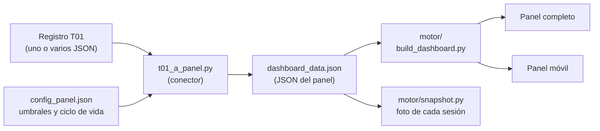

# T17 · Regenerar el panel del consejo

## Aviso legal y exención de responsabilidad

SEVEN-G y esta herramienta se ofrecen «tal cual» y con fines exclusivamente informativos. No constituyen asesoramiento jurídico, regulatorio, financiero ni profesional, ni garantizan el cumplimiento de ninguna norma. Los criterios, clasificaciones y referencias a regulación general (Reglamento Europeo de IA, RGPD, DORA, NIS2…) o sectorial pueden ser incompletos, no aplicar a un caso concreto o quedar desactualizados por cambios normativos. Cada organización que use la herramienta es la única responsable de identificar la normativa que le aplica, verificar su vigencia y certificar su propio cumplimiento regulatorio, con el asesoramiento cualificado que corresponda. El autor no asume responsabilidad alguna por el uso de la herramienta ni por las decisiones adoptadas con ella. Los datos de demostración son ficticios.

Todo lo que genera el conector (panel completo, panel móvil y registro de recomendaciones) lleva este aviso: en la banda de avisos y el pie del panel completo, antes del pie del panel móvil y en el pie del registro.

---

Convierte el **JSON completo** que exporta el registro de iniciativas **T01** de SEVEN-G (esquema `esquema_registro.schema.json`, versiones `0.1` a `0.6`; la 0.4 añade campos de los riesgos y la 0.5 la evidencia del índice y las decisiones del consejo, que el conector no lee; la 0.6 la lista `madurez[]` que escribe T15 y que el conector lleva al bloque opcional `madurez` del panel, tarjeta «Madurez de la compañía (D1–D7)» en «Cartera y valor» y bloque del panel móvil, D100) en el JSON del panel (`motor/ESQUEMA.md`) y genera con el motor del panel, incluido en `motor/`:

- el **panel completo** y el **panel móvil** (T17), sincronizados (misma huella de datos);
- el **JSON del panel**, para inspeccionarlo o guardarlo como foto con `motor/snapshot.py`;
- el **registro de recomendaciones** (T18), si T01 trae recomendaciones.

Especificación: documento 03 (§5.4, T17 y T18; §2, principios) y documento 60 (paquete del consejo).

## Patrón: del registro al panel



- **El registro T01 es la única entrada de datos.** Cada iniciativa se da de alta en T01 como una oportunidad en un CRM; el conector no añade ni estima nada.
- **`config_panel.json` es la configuración general** del panel: umbrales del semáforo de los indicadores (`umbrales_kpi`) y reglas del ciclo de vida (`ciclo_vida`: etapas del embudo, salidas, límites de días por etapa y correspondencia con las fases 0–7 de SEVEN-G). El conector la copia en `meta`; las claves que empiezan por `_` son comentarios.
- **Todo lo que muestra el panel sale del JSON del panel**; los HTML nunca se editan a mano y se pueden reconstruir en cualquier momento desde el registro.
- **Por qué importa.** El consejo ve el mismo dato que gestiona la Oficina de IA: una iniciativa que entra en una fase, supera un *gate* o se para en T01 se mueve por el embudo del panel con la fecha real del evento, sin doble captura ni cifras escritas a mano.

[English version](README_en.md) · [Página del conector](index.html)

## Ficheros

| Fichero | Contenido |
|---|---|
| `t01_a_panel.py` | El conector: mapeo T01 → esquema del panel y generación con el motor. Solo biblioteca estándar. |
| `config_panel.json` | Configuración general del panel: `navegacion` (sin página «Todo», página inicial, tarjetas desplegadas al entrar, filtros en diálogo modal con la consulta aplicada en píldoras y, para un panel alojado dentro de un sitio, `tema_sitio` —clave de `localStorage` con el tema general del sitio, que el panel sigue y actualiza— y `sitio` —enlaces de vuelta al sitio en el menú lateral, con rutas relativas a la carpeta de salida— y `codigos` —ruta al índice de códigos del sitio, `codigos.js`: con ella, los códigos escritos en el panel completo, en el móvil y en el registro de recomendaciones (documento 40, T01, P12, G3.05…) pasan a ser enlaces a donde se explican y su barra ofrece «Buscador de documentos» y «Citados aquí» (D99, D104), sin medición de visitas; un panel generado fuera del sitio quita esas claves—), `umbrales_kpi` y `ciclo_vida` (embudo, salidas, límites de días y etapa de cada fase de SEVEN-G). Valores de partida, a calibrar por cada organización. |
| `motor/` | El motor del panel, **versión 8** (embudo y ciclo de vida, umbrales configurables): `build_dashboard.py` (panel completo), `panel_movil.py`, `panel_core.py` (núcleo JavaScript común), `economia.py`, `glosario.py`, `snapshot.py`, `ESQUEMA.md` (esquema del JSON) y `demo_lib.py` (plantilla del registro de recomendaciones). Copia mantenida en AI_CONSULTING; origen: `AI_en_el_consejo/motor` (MIT, mismo autor). |
| `publicacion_panel.py` | Aviso legal, pie de autoría, inserción del aviso en el panel móvil y página del registro de recomendaciones. Lo importa el conector desde esta carpeta. |
| `index.html` | Página del conector (ES/EN, sin servidor ni recursos externos) con los enlaces a la demo y el aviso legal. |
| `ejemplo/salida/` | Demo generada con los datos ficticios de T01. Nunca se editan a mano los HTML: se regeneran con el conector. |
| `PROPUESTA_MOTOR.md` | Documento de trabajo: cambios propuestos al motor del panel para leer los datos de SEVEN-G. Para el proyecto de origen del motor; no se aplica en la copia pública. |
| `README.md` · `README_en.md` | Este documento, en español e inglés. |

## Requisitos

- **Python 3.11 o superior** con [`uv`](https://docs.astral.sh/uv/). Solo biblioteca estándar; no instala paquetes.
- Nada más: el **motor del panel está incluido** en `motor/` y no hace falta ningún otro repositorio. El conector añade a `sys.path` esta carpeta y `./motor`.
- Opcional: `--panel <ruta>` usa otro motor, indicando un checkout del repositorio [AI en el Consejo](https://github.com/Seachad-TEAM/AI_en_el_consejo) (`<ruta>/motor` y `<ruta>/demos/fuente`). Si falta algo, el conector se detiene con un mensaje claro.

## Uso

Desde esta carpeta:

```bash
uv run python t01_a_panel.py --t01 export_t01.json --salida carpeta [--sigla CA] [--organizacion "Nombre"] [--prefijo t01_] [--panel ruta] [--indice t14.json]
```

| Opción | Qué hace |
|---|---|
| `--t01` | JSON completo exportado desde T01 (**Datos → Exportar JSON completo**). No sirve el CSV. Por defecto, `../T01_registro_iniciativas/datos_demo.json` (datos ficticios). |
| `--salida` | Carpeta de salida. Se crea si no existe. Por defecto, `./ejemplo/salida`. |
| `--sigla` | Siglas del consejo asesor que aparecen en los textos. Por defecto, «consejo asesor». |
| `--organizacion` | Nombre de la organización. Por defecto, `meta.organizacion` de T01. |
| `--prefijo` | Prefijo de los ficheros. Por defecto, `t01_`. |
| --panel | Opcional: usar otro motor, indicando un checkout del repositorio *AI en el Consejo*. Por defecto, ./motor. |
| --indice | Opcional: JSON exportado por la calculadora del índice de transformación (T14). Añade al panel la tarjeta «Índice de transformación de la compañía» en «Cartera y valor» (perfil, condiciones de base, señales, tendencia frente al cálculo anterior, alertas y qué movería el perfil). El conector no recalcula el índice: toma el cálculo más reciente con resultado. En el ejemplo, ./ejemplo/t14_indice.json, que se genera desde los mismos datos de T01 con `pwsh -File ../T14_indice_transformacion/build_indice.ps1 -DesdeT01 ../T01_registro_iniciativas/datos_demo.json -Exportar ejemplo/t14_indice.json`. |

Ficheros que genera: `<prefijo>Dashboard_Casos_Uso_IA_v8.html`, `<prefijo>Dashboard_Movil_IA_v8.html`, `<prefijo>dashboard_data.json` y, si hay recomendaciones, `<prefijo>Registro_Recomendaciones.html`.

Si `meta.datos_ilustrativos` de T01 es `true`, los textos dicen que los datos son ficticios; si no, llevan una versión del aviso legal para datos propios.

El conector no escribe `__pycache__` (`sys.dont_write_bytecode`).

## Demo

`uv run python t01_a_panel.py` sin argumentos convierte `../T01_registro_iniciativas/datos_demo.json` (compañía, personas y proveedores ficticios) en `ejemplo/salida/` y enlaza los pies a `index.html` y al registro T01. Es el panel de ejemplo que abren el registro de iniciativas (cabecera y banda de «iniciativas de ejemplo») y la página del conector. Si cambian los datos de demostración o `config_panel.json`, se regenera. Nunca se editan a mano los HTML generados.

## Principios del mapeo

1. **«Sin dato» no es cero.** Lo que T01 no registra queda a `null` (o lista vacía) y el panel lo muestra como «sin dato» (documento 03 §2, principio 7).
2. **El conector no modifica el motor.** Se usan sus claves heredadas: `estimado_cati` para los importes estimados y `acciones_estimadas_cati` (a `null`). Las etapas del embudo, los límites de días y los umbrales se adaptan a SEVEN-G con `config_panel.json`, sin tocar el motor. Los cambios internos pendientes (renombrar claves, leer `seveng`, aviso legal nativo) están propuestos en `PROPUESTA_MOTOR.md`.
3. **Una sola fuente y una sola correspondencia.** Todo sale del JSON de T01; no se añaden estimaciones (documento 03 §2, principio 1). El registro no construye el JSON del panel en el navegador: la única correspondencia T01 → panel es la de este conector.
4. **El tiempo nunca se estima.** El ciclo de vida de cada caso (`historial_estados`) se construye con las fechas de los eventos de T01.

## Estado del panel

El estado de cada caso es una etapa del embudo o una salida, definidas en `config_panel.json` (`ciclo_vida`). Cada fase de SEVEN-G corresponde a una etapa (`ciclo_vida.fases_seven_g`):

| Fase en T01 | Etapa del embudo | Por qué |
|---|---|---|
| 0 Contexto y restricciones · 1 Descubrimiento | `Propuesto` | La idea está registrada y se explora; aún no hay hipótesis de valor. |
| 2 Hipótesis de valor | `Hipótesis de valor` | Superado G1: se formula y aprueba la hipótesis (G2). |
| 3 Viabilidad y riesgo | `POC` | Superado G2: se comprueba que es viable (datos, técnica, riesgo) antes de construir. |
| 4 Diseño de la solución · 5 Entrega y validación | `En desarrollo` | Superado G3: se diseña, construye y valida. |
| 6 Operación y gobierno · 7 Evolución o retirada | `En uso` | Superado G5: está operando. Es una de las dos terminales paralelas del embudo, junto con `Desenganchado` cuando se retira. |

Una iniciativa cerrada (estado `parada` o `retirada`, o con `cierre`) pasa a la salida prevista para la etapa en la que estaba. En la práctica, `En uso` y `Desenganchado` son terminales paralelos del embudo: uno representa producción y el otro retirada, no una progresión lineal dentro del embudo:

| Cierre en T01 | Salida del panel |
|---|---|
| Parada en las fases 0–1 | `No aprobado` |
| Parada en las fases 2–5 | `Descartado` |
| Retirada (o parada) en las fases 6–7 | `Desenganchado` |

**Ciclo de vida como en un CRM (`reporte_compania.historial_estados`).** El conector genera un cambio de estado por cada vez que la iniciativa entra en una etapa: el alta (fecha de registro), cada evento `entrada_fase` de T01 —incluidas las vueltas atrás por pivotar o iterar, que el panel señala— y, si está cerrada, la fecha del cierre. Las entradas consecutivas en la misma etapa se agrupan (fases 0 y 1, 4 y 5, 6 y 7). Con ese historial el panel calcula el tiempo en cada etapa (media, mediana y desviación de cada caso), la conversión a producción, los casos atascados frente a `ciclo_vida.dias_limite` y las entradas, ganados y perdidos por trimestre. El último estado del historial coincide siempre con el estado del caso.

La fase y el estado originales se conservan en `casos[].seveng`.

## Tabla de mapeo

### `meta`

| Panel | Origen en T01 | Nota |
|---|---|---|
| `organizacion`, `compania_principal` | `--organizacion` o `meta.organizacion` | |
| `consejo_sigla` | `--sigla`; si no, `meta.panel.consejo_sigla` | Por defecto «consejo asesor». |
| `navegacion`, `umbrales_kpi`, `ciclo_vida` | `config_panel.json` | Configuración general del panel, copiada tal cual (sin las claves de comentario `_…`). `ciclo_vida.fases_seven_g` la usa el conector; el motor la ignora. |
| `generado`, `ejercicio_valor`, `periodo` | `meta.fecha_referencia` (o `meta.generado`) | Etiqueta «Registro de iniciativas T01 · corte dd-mm-aaaa»; trimestre calculado de la fecha. `periodo.anterior` sin dato. |
| `prefijo_ficheros` | `--prefijo` | |
| `demo` | `meta.datos_ilustrativos` | |
| `textos` | Generados por el conector | Aviso legal, aviso de valor, pie con autoría, textos de «sin dato» y rótulos de los conceptos de eficiencias y retorno neutros respecto al sector. |
| `glosario_extra` | Generado por el conector | SEVEN-G, T01, G3, G5, R6, ambición y correspondencia entre etapas del embudo y fases. |
| `origen` | `version_esquema` y versión del conector | Bloque propio; el panel no lo lee. |

### `casos[]` (una por iniciativa)

| Panel | Origen en T01 | Nota |
|---|---|---|
| `id`, `nombre` | `id`, `nombre` | |
| `que_es` | `descripcion` | |
| `area`, `unidad` | `area` | |
| `compania` | organización | T01 no tiene grupo de compañías. |
| `estado` | `ciclo.fase` y `ciclo.estado` | Tabla anterior. |
| `descripcion` | `panel.observaciones_consejo` | Observaciones del consejo asesor; sin dato si no se informan. |
| `inicio_estimado` | — | Sin dato. Excepción técnica: `""` en casos en uso o cerrados sin fecha de producción, para que el motor no escriba «null (año estimado)». |
| `tags.tecnologia` | `clasificacion.tecnologia` | Una etiqueta para filtrar: `agente` si está; si no, `ia_generativa`; si no, la primera. Vocabulario del panel (`Agéntico`, `GenAI`, `ML predictivo`, `NLP / IDP`, `Visión artificial`, `Optimización`, `IA de tercero`, `Reglas (no es IA)`), que el motor usa para detectar agentes. |
| `tags.naturaleza` | Derivada de la tecnología principal | |
| `tags.exposicion` | `clasificacion.exposicion` | `interna` → Interno · `empleados` → Empleado · `clientes_indirecta` → Cliente (indirecta) · `clientes_directa` → Cliente / persona externa (directa). |
| `tags.riesgo`, `detalle.aiact` | `clasificacion.regulatoria` | Prohibido · Alto riesgo · Transparencia (art. 50) · Riesgo mínimo · Fuera de ámbito · Por confirmar (`pendiente`). **Es la clasificación del registro**, no una estimación independiente del consejo asesor, aunque el panel la rotule así. |
| `tags.funcion` | `clasificacion.esfera_principal` | «04 Operaciones», etc. |
| `tags.ambicion` | `ambicion_real`, si no `ambicion_confirmada`, si no `ambicion_propuesta` | Optimizar · Aumentar · Transformar. |
| `tags.prioridad` | `panel.prioridad` | Alta · Media · Baja; sin dato si no se informa. |
| `tags.alcance`, `alcance` | `alcance` (esquema 0.3) | Solo en iniciativas transversales (`Transversal`) y plataformas (`Plataforma habilitadora`); las de una unidad no llevan ni la etiqueta ni el bloque. `alcance.unidades` lleva por unidad de negocio el despliegue y la adopción de `alcance.reparto` y el coste, el valor materializado (y cuánto está validado) y la capacidad liberada de los importes con esa `area` (el más reciente por tipo y concepto); una fila sin unidad recoge lo común. En una transversal, `unidad` pasa a «Varias unidades (transversal)». |
| `detalle.tipo` | `clasificacion.tecnologia` (todas) | |
| `detalle.proveedores` | `clasificacion.proveedores` → `proveedores[].nombre` | |
| `detalle.valor_tipo` | `clasificacion.tipo_valor` | |
| `detalle.es_ia` | Naturaleza de la tecnología principal | |
| `detalle.decision`, `datos`, `acciones_estimadas_cati` | — | Sin dato. |
| `valor` (bloque heredado) | — | Todo sin dato salvo `medido` (hay algún importe realizado) y `fuente`. |
| `seveng` | `ciclo`, `clasificacion`, decisiones pendientes | Bloque propio (fase, estado, iteración, espera, *gate* pendiente, intensidad, esferas, ambiciones, autonomía, etiquetas, sistemas). El panel actual no lo lee. |

### `casos[].economia`

Cada importe de `valores` pasa a un *item* con `importe`, `formula`, `estado`, `fuente` y `fecha`; `atribucion` e `hipotesis` quedan sin dato. Si hay varios importes del mismo momento y tipo, se usa el más reciente; si llevan unidad de negocio (`area`, esquema 0.3), el más reciente de cada unidad, y se suman con el estado más prudente de los sumados y una fórmula que enumera las unidades. Estado: `validado` y `declarado` iguales; `estimado` → `estimado_cati` (clave heredada del motor; en T01 lo estima el equipo de la iniciativa, no el consejo asesor, y el aviso del panel lo explica).

| Panel | Origen en T01 | Nota |
|---|---|---|
| `inversion.construccion` | Valor `inversion` realizado; si no, `inversion.realizada` de la ficha (declarado); si no, valor `inversion` esperado | |
| `inversion.recurrente_anual` | Valor `coste_recurrente` realizado | |
| `inversion.recurrente_potencial` | Valor `coste_recurrente` esperado | |
| `inversion.adicional_potencial` | `inversion.pendiente` de la ficha (declarado) | |
| `inversion.desglose_recurrente` | — | Sin dato: T01 no desglosa el coste. |
| `eficiencias[]`, una línea por concepto | Valores `eficiencias` (realizado → `actual`, esperado → `potencial`) agrupados por `concepto`: `personas`, `herramientas`, `siniestros` (fraude, recobros y sobrecostes), `operativo`, `penalizaciones` | Sin `concepto` (o en registros 0.1), todo va a `operativo`. |
| `eficiencias[]` concepto `capacidad_liberada` | Valores `capacidad_liberada` | No suma en el neto. |
| `retorno[]`, una línea por concepto | Valores `retorno` agrupados por `concepto`: `venta_nueva`, `venta_cruzada`, `retencion`, `precio_margen`, `cobros`, `otros` | Sin `concepto`, todo va a `otros`. |
| `hipotesis_potencial` | Fórmulas de los valores esperados | |
| `nota_caso` | Fase y estado de T01; importes de `riesgo_evitado` y `cumplimiento` | Se informan como texto: no suman en el neto (regla de T01). |
| `moneda` | `meta.moneda` | |
| `plazo_potencial` | `panel.plazo_potencial` (`AAAA-MM`) | Sin dato si no se informa o si la iniciativa está cerrada. |
| `clave_reparto` | `alcance.tipo` | Transversal: coste por licencias de cada unidad y gobierno común sin unidad. Plataforma: su valor se imputa a los casos que la usan y `comparte_valor_con` lleva `alcance.habilita`. En las demás, sin dato y `comparte_valor_con` vacío. |

En las iniciativas **cerradas** (paradas o retiradas) solo se conserva la construcción; sus demás importes se citan en `nota_caso` y no suman en el panel.

### `casos[].reporte_compania`

| Panel | Origen en T01 | Nota |
|---|---|---|
| `propietario_negocio`, `responsable_tecnico` | `responsables.patrocinador`, `responsables.tecnico` → nombre de la persona | |
| `empresa_grupo` | organización | |
| `fechas.idea` | `fecha_registro` | |
| `fechas.aprobacion` | Primera decisión de **G3** con resultado Continuar o Continuar con condiciones | |
| `fechas.inicio` | Primera entrada en la fase 4 | Empieza el diseño de la solución. |
| `fechas.piloto` | Primera entrada en la fase 5 | Entrega y validación. |
| `fechas.produccion` | Primera decisión de **G5** que continúa; si no hay, primera entrada en la fase 6 | |
| `fechas.ultima_revision` | Última decisión de R6 | |
| `fechas.retirada` | `cierre.fecha` | Fecha de parada o de retirada. |
| `retirada` | `cierre`: tipo, *gate*, motivo codificado y comentario; `organo`; `sustituto`; `lecciones` | El embudo muestra en la tarjeta de cada caso perdido o desenganchado **por qué** salió y **qué se aprendió**; si el motivo no consta, lo señala. |
| `historial_estados` | `fecha_registro`, eventos `entrada_fase` y `cierre.fecha` | Ver «Estado del panel». Fuente de cada cambio: «Registro de iniciativas T01»; la nota indica la fase o el cierre. Cada cambio lleva `cifras` (`previsto` y `actual`: inversión, coste recurrente, eficiencias y retorno) tomadas de `eventos[].cifras`. El embudo muestra en cada etapa y tarjeta las cifras de sus casos —lo actual y, si el caso aún no produce, lo previsto, marcado «prev.»—, también en la tabla que se abre al pulsar una etapa y en el ciclo de vida de la ficha. |
| `complejidad` | `panel.complejidad` | `baja` · `media` · `alta`; sin dato se aplica el límite `sin_dato` de `ciclo_vida.dias_limite`. |
| `tier_riesgo` | `riesgo_residual_principal` | `critico` → `alto`. |
| `clasificacion_ria` | `clasificacion.regulatoria` | `riesgo_minimo` → `minimo` · `fuera_ambito` → `no_es_ia` · `pendiente` → sin dato. |
| `controles.RIA` | `clasificacion.regulatoria` | `pendiente` → pendiente; cualquier otra → hecho. |
| `controles.FRIA` | `evaluaciones_impacto` tipo `eidf` | hecha → hecho · pendiente · no_aplica. |
| `controles.DPIA` | `evaluaciones_impacto` tipo `eipd` | Igual. |
| `controles.seguridad`, `MUC`, `IA_ofensiva` | `panel.controles.seguridad`, `muc`, `ia_ofensiva` | `hecho` · `pendiente` · `no_aplica`; sin dato si no se informan. |
| `valor_validado.actual`, `metodo_atribucion`, `validado_por`, `fecha_validacion` | Valores realizados validados de eficiencias y retorno (todas las líneas) | |
| `valor_validado.objetivo` | Suma de eficiencias y retorno esperados | |
| `valor_validado.base`, `recurrente`; `coste_real` | — | Sin dato. |
| `operacion`, `agente`, `proveedor_dora` | — | Sin dato. |

### `seguimiento`

| Panel | Origen en T01 | Nota |
|---|---|---|
| `movimientos[]` tipo `alta` | Eventos `alta` | Decisor = autor del evento. |
| `movimientos[]` tipo `retirada` | Eventos `parada` y `retirada` | El motivo empieza por «Parada en G3» o «Retirada en G7»: el panel solo cuenta altas, retiradas y reevaluaciones. Decisor = órgano del cierre; sustituto del cierre. |
| `movimientos[]` tipo `reevaluacion` | Eventos `cambio_clasificacion` y decisiones de **R6** | |
| `incidentes[]` | `incidentes` | `tipo` = «Severidad S1–S4»; `horas_detectar`, `horas_contener`, descripción, notificaciones y estado. `resolucion_horas`, `rto_horas`, `origen`, `vector`, brecha, afectados y plazos de notificación: sin dato. |
| `adopcion`, `agilidad`, `ia_ofensiva`, `cdm_compania` | — | Sin dato. La agilidad idea → aprobación → producción la calcula el panel con las fechas de cada caso. |

Los movimientos incluyen **todo el historial** del registro, no solo el último periodo.

### `historico[]`

Vacío: T01 no guarda fotos del panel. Al cierre de cada sesión, desde esta carpeta: `uv run python motor/snapshot.py --datos <prefijo>dashboard_data.json --etiqueta "Sesión N"`.

### Registro de recomendaciones (T18)

| Registro | Origen en T01 | Nota |
|---|---|---|
| `id`, `texto`, `destinatario` | `recomendaciones[]` | Al texto se añaden las iniciativas vinculadas. |
| `estado` | `estado` | `abierta` → pendiente · `en_curso` → en curso · `cerrada` → cumplida · `descartada`. |
| Sesión | `fecha` | Una sesión por fecha distinta. |
| Ámbito | Esfera principal de las iniciativas vinculadas | «General» si no hay. |
| Evidencia | `evidencia` | |
| Enlace al panel | Inventario, si hay iniciativas vinculadas | |
| Fecha comprometida, valoración del consejo asesor | — | Sin dato. |

## Qué de T01 no llega al panel

Decisiones y criterios de *gate*, condiciones, evidencias, iteraciones, esperas, plazos y estancadas, T04 y T05, métricas del embudo (conversión, tiempo de decisión, valor ponderado, cohortes), riesgos, no conformidades, proveedores (salvo el nombre), sistemas (salvo su código en `seveng`) y personas (salvo los nombres de responsables y decisores). El motor no tiene dónde mostrarlos. Las esperas tampoco: el panel cuenta el tiempo en cada etapa sin descontarlas, mientras que el análisis de T01 sí las descuenta. La fase, el estado, la intensidad, las esferas y la ambición viajan en `casos[].seveng` (`PROPUESTA_MOTOR.md`).

## Limitaciones conocidas

- **Motor heredado.** `motor/` es la copia de la versión 8 del motor de *AI en el Consejo* (17-09-2026; versión de datos 6) y se mantiene aquí con independencia de aquel repositorio. Conserva claves y rótulos pensados para el consejo asesor (`estimado_cati`, magnitudes VNB y fraude, que aquí quedan sin dato); `PROPUESTA_MOTOR.md` recoge lo pendiente.
- **Límites de días por complejidad, no por intensidad.** El panel fija el límite de la etapa «En desarrollo» por la complejidad del caso; los plazos de referencia de T01 van por fase e intensidad (Lite o Enterprise). Los valores de `config_panel.json` parten de la suma de los plazos Enterprise de T01 y están por calibrar.
- **Aviso legal en el móvil.** El motor no muestra `meta.textos` en el panel móvil. `publicacion_panel.py` añade el aviso al HTML ya generado, antes del pie, sin cambiar los datos ni la huella. En el panel completo el aviso va en la banda de avisos de la cabecera (`aviso_previo`) y, en versión corta, en el pie.
- **`tags.riesgo`.** El panel la rotula como estimación del consejo asesor; aquí es la clasificación registrada en T01.
- **Estado «estimado».** El panel lo atribuye al consejo asesor; en T01 lo estima el equipo. El aviso de valor lo aclara.
- **Una tecnología por caso** en los filtros; la lista completa está en la ficha (`detalle.tipo`).
- **Textos en español**, como el motor; la página del conector y los README están en español e inglés.

## Licencia

Código bajo licencia **MIT**, incluido el motor de `motor/` (derivado de [AI en el Consejo](https://github.com/Seachad-TEAM/AI_en_el_consejo), MIT, mismo autor). Contenidos (documentación, página del conector y datos de ejemplo) bajo **CC BY 4.0**.

© 2026 Fernando García Varela · Metodología SEVEN-G
