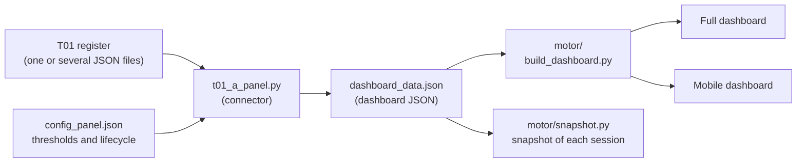

# T17 · Connector from the T01 register to the board dashboard

## Legal notice and disclaimer

SEVEN-G and this tool are provided “as is” and for information purposes only. They do not constitute legal, regulatory, financial or professional advice, nor do they guarantee compliance with any regulation. The criteria, classifications and references to general regulation (EU AI Act, GDPR, DORA, NIS2…) or sector-specific regulation may be incomplete, may not apply to a specific case or may become outdated as a result of regulatory changes. Each organisation that uses the tool is solely responsible for identifying the regulation that applies to it, verifying that it is current and certifying its own regulatory compliance, with the appropriate qualified advice. The author and SEACHAD accept no liability whatsoever for the use of the tool or for decisions taken with it. The demo data is fictitious.

Everything the connector generates (full dashboard, mobile dashboard and recommendations log) carries this notice: in the notice band and footer of the full dashboard, before the footer of the mobile dashboard and in the footer of the log.

---

Converts the **full JSON** exported by the SEVEN-G **T01** initiative register (schema `esquema_registro.schema.json`, versions `0.1` and `0.2`) into the dashboard JSON (`motor/ESQUEMA.md`) and, using the dashboard engine included in `motor/`, generates:

- the **full dashboard** and the **mobile dashboard** (T17), in sync (same data fingerprint);
- the **dashboard JSON**, to inspect it or save it as a snapshot with `motor/snapshot.py`;
- the **recommendations log** (T18), if T01 contains recommendations.

Specification: document 03 (§5.4, T17 and T18; §2, principles) and document 60 (board package). Field names and on-screen texts are in Spanish, as in the engine.

## Pattern: from the register to the dashboard



- **The T01 register is the single data entry point.** Each initiative is entered in T01 like an opportunity in a CRM; the connector adds and estimates nothing.
- **`config_panel.json` is the general configuration** of the dashboard: traffic-light thresholds of the indicators (`umbrales_kpi`) and lifecycle rules (`ciclo_vida`: funnel stages, exits, day limits per stage and mapping to SEVEN-G phases 0–7). The connector copies it into `meta`; keys starting with `_` are comments.
- **Everything the dashboard shows comes from the dashboard JSON**; the HTML files are never edited by hand and can be rebuilt at any time from the register.
- **Why it matters.** The board sees the same data the AI Office manages: an initiative that enters a phase, passes a gate or is stopped in T01 moves through the dashboard funnel with the real date of the event, with no double entry and no hand-written figures.

[Versión en español](README.md) · [Connector page](index.html)

## Files

| File | Content |
|---|---|
| `t01_a_panel.py` | The connector: T01 → dashboard schema mapping and generation with the engine. Standard library only. |
| `config_panel.json` | General configuration of the dashboard: `navegacion` (no “Todo” page, initial page, cards expanded on entry and filters in a modal dialog with the applied query shown as pills), `umbrales_kpi` and `ciclo_vida` (funnel, exits, day limits and the stage of each SEVEN-G phase). Starting values, to be calibrated by each organisation. |
| `motor/` | The dashboard engine, **version 8** (funnel and lifecycle, configurable thresholds): `build_dashboard.py` (full dashboard), `panel_movil.py`, `panel_core.py` (shared JavaScript core), `economia.py`, `glosario.py`, `snapshot.py`, `ESQUEMA.md` (JSON schema) and `demo_lib.py` (recommendations log template). Copy maintained in AI_CONSULTING; origin: `AI_en_el_consejo/motor` (MIT, same author). |
| `publicacion_panel.py` | Legal notice, authorship footer, insertion of the notice into the mobile dashboard and the recommendations log page. Imported by the connector from this folder. |
| `index.html` | Connector page (ES/EN, no server, no external resources) with links to the demo and the legal notice. |
| `ejemplo/salida/` | Demo generated from the T01 fictitious data. Generated HTML files are never edited by hand: they are regenerated with the connector. |
| `PROPUESTA_MOTOR.md` | Working document (Spanish): proposed changes to the dashboard engine so that it reads SEVEN-G data. For the engine's source project; not applied to the public copy. |
| `README.md` · `README_en.md` | This document, in Spanish and English. |

## Requirements

- **Python 3.11 or later** with [`uv`](https://docs.astral.sh/uv/). Standard library only; no packages are installed.
- Nothing else: the **dashboard engine is included** in `motor/` and no other repository is needed. The connector adds this folder and `./motor` to `sys.path`.
- Optional: `--panel <path>` uses another engine, pointing to a checkout of the [AI en el Consejo](https://github.com/Seachad-TEAM/AI_en_el_consejo) repository (`<path>/motor` and `<path>/demos/fuente`). If anything is missing, the connector stops with a clear message.

## Usage

From this folder:

```bash
uv run python t01_a_panel.py --t01 export_t01.json --salida folder [--sigla CA] [--organizacion "Name"] [--prefijo t01_] [--panel path]
```

| Option | What it does |
|---|---|
| `--t01` | Full JSON exported from T01 (**Datos → Exportar JSON completo**). The CSV is not a valid input. Default: `../T01_registro_iniciativas/datos_demo.json` (fictitious data). |
| `--salida` | Output folder. Created if missing. Default: `./ejemplo/salida`. |
| `--sigla` | Advisory board acronym used in the texts. Default: "consejo asesor". |
| `--organizacion` | Organisation name. Default: T01 `meta.organizacion`. |
| `--prefijo` | File prefix. Default: `t01_`. |
| `--panel` | Optional: use another engine, pointing to a checkout of the *AI en el Consejo* repository. Default: `./motor`. |

Output files: `<prefix>Dashboard_Casos_Uso_IA_v8.html`, `<prefix>Dashboard_Movil_IA_v8.html`, `<prefix>dashboard_data.json` and, if there are recommendations, `<prefix>Registro_Recomendaciones.html`.

If T01 `meta.datos_ilustrativos` is `true`, the texts state that the data are fictitious; otherwise they carry a legal notice for own data.

The connector does not write `__pycache__` (`sys.dont_write_bytecode`).

## Demo

`uv run python t01_a_panel.py` with no arguments converts `../T01_registro_iniciativas/datos_demo.json` (fictitious company, people and suppliers) into `ejemplo/salida/` and links the footers to `index.html` and to the T01 register. It is the example dashboard opened from the initiative register (header and “example initiatives” banner) and from the connector page. If the demo data or `config_panel.json` change, it is regenerated. Generated HTML files are never edited by hand.

## Mapping principles

1. **"No data" is not zero.** Anything T01 does not record is `null` (or an empty list) and the dashboard shows "sin dato" (document 03 §2, principle 7).
2. **The connector does not modify the engine.** Its legacy keys are used: `estimado_cati` for estimated amounts and `acciones_estimadas_cati` (set to `null`). Funnel stages, day limits and thresholds are adapted to SEVEN-G through `config_panel.json`, without touching the engine. Pending internal changes (renaming keys, reading `seveng`, native legal notice) are proposed in `PROPUESTA_MOTOR.md`.
3. **Single source and single mapping.** Everything comes from the T01 JSON; no estimates are added (document 03 §2, principle 1). The register does not build the dashboard JSON in the browser: the only T01 → dashboard mapping is this connector's.
4. **Time is never estimated.** The lifecycle of each case (`historial_estados`) is built from the dates of the T01 events.

## Dashboard status

The status of each case is a funnel stage or an exit, both defined in `config_panel.json` (`ciclo_vida`). Each SEVEN-G phase maps to a stage (`ciclo_vida.fases_seven_g`):

| T01 phase | Funnel stage | Why |
|---|---|---|
| 0 Context and constraints · 1 Discovery | `Propuesto` | The idea is registered and being explored; there is no value hypothesis yet. |
| 2 Value hypothesis | `Hipótesis de valor` | G1 passed: the hypothesis is formulated and approved (G2). |
| 3 Feasibility and risk | `POC` | G2 passed: feasibility (data, technology, risk) is checked before building. |
| 4 Solution design · 5 Delivery and validation | `En desarrollo` | G3 passed: being designed, built and validated. |
| 6 Operation and governance · 7 Evolution or retirement | `En uso` | G5 passed: in operation. It is the “won” stage of the funnel. |

A closed initiative (status `parada` or `retirada`, or with `cierre`) moves to the exit defined for the stage it was in:

| Closure in T01 | Dashboard exit |
|---|---|
| Stopped in phases 0–1 | `No aprobado` |
| Stopped in phases 2–5 | `Descartado` |
| Retired (or stopped) in phases 6–7 | `Desenganchado` |

**Lifecycle as in a CRM (`reporte_compania.historial_estados`).** The connector generates one status change each time the initiative enters a stage: registration (registration date), every T01 `entrada_fase` event —including steps back after a pivot or an iteration, which the dashboard flags— and, if it is closed, the closure date. Consecutive entries into the same stage are grouped (phases 0 and 1, 4 and 5, 6 and 7). From that history the dashboard computes the time in each stage (mean, median and deviation of each case), conversion to production, stuck cases against `ciclo_vida.dias_limite`, and entries, won and lost cases per quarter. The last status in the history always matches the status of the case.

Original phase and status are kept in `casos[].seveng`.

## Mapping table

### `meta`

| Dashboard | T01 source | Note |
|---|---|---|
| `organizacion`, `compania_principal` | `--organizacion` or `meta.organizacion` | |
| `consejo_sigla` | `--sigla`; else `meta.panel.consejo_sigla` | Default "consejo asesor". |
| `navegacion`, `umbrales_kpi`, `ciclo_vida` | `config_panel.json` | General configuration of the dashboard, copied as is (without the `_…` comment keys). `ciclo_vida.fases_seven_g` is used by the connector; the engine ignores it. |
| `generado`, `ejercicio_valor`, `periodo` | `meta.fecha_referencia` (or `meta.generado`) | Label "Registro de iniciativas T01 · corte dd-mm-yyyy"; quarter derived from the date. `periodo.anterior`: no data. |
| `prefijo_ficheros` | `--prefijo` | |
| `demo` | `meta.datos_ilustrativos` | |
| `textos` | Generated by the connector | Legal notice, value notice, footer with authorship, "no data" texts and sector-neutral labels for the efficiency and return lines. |
| `glosario_extra` | Generated by the connector | SEVEN-G, T01, G3, G5, R6, ambition and the mapping between funnel stages and phases. |
| `origen` | `version_esquema` and connector version | Own block; not read by the dashboard. |

### `casos[]` (one per initiative)

| Dashboard | T01 source | Note |
|---|---|---|
| `id`, `nombre` | `id`, `nombre` | |
| `que_es` | `descripcion` | |
| `area`, `unidad` | `area` | |
| `compania` | organisation | T01 has no group of companies. |
| `estado` | `ciclo.fase` and `ciclo.estado` | Table above. |
| `descripcion` | `panel.observaciones_consejo` | Advisory board remarks; no data if not provided. |
| `inicio_estimado` | — | No data. Technical exception: `""` for cases in use or closed without a production date, so that the engine does not print "null (año estimado)". |
| `tags.tecnologia` | `clasificacion.tecnologia` | One label for filtering: `agente` if present; otherwise `ia_generativa`; otherwise the first one. Dashboard vocabulary (`Agéntico`, `GenAI`, `ML predictivo`, `NLP / IDP`, `Visión artificial`, `Optimización`, `IA de tercero`, `Reglas (no es IA)`), which the engine uses to detect agents. |
| `tags.naturaleza` | Derived from the main technology | |
| `tags.exposicion` | `clasificacion.exposicion` | `interna` → Interno · `empleados` → Empleado · `clientes_indirecta` → Cliente (indirecta) · `clientes_directa` → Cliente / persona externa (directa). |
| `tags.riesgo`, `detalle.aiact` | `clasificacion.regulatoria` | Prohibido · Alto riesgo · Transparencia (art. 50) · Riesgo mínimo · Fuera de ámbito · Por confirmar (`pendiente`). **It is the register's classification**, not an independent advisory board estimate, although the dashboard labels it that way. |
| `tags.funcion` | `clasificacion.esfera_principal` | "04 Operaciones", etc. |
| `tags.ambicion` | `ambicion_real`, else `ambicion_confirmada`, else `ambicion_propuesta` | Optimizar · Aumentar · Transformar. |
| `tags.prioridad` | `panel.prioridad` | Alta · Media · Baja; no data if not provided. |
| `detalle.tipo` | `clasificacion.tecnologia` (all) | |
| `detalle.proveedores` | `clasificacion.proveedores` → `proveedores[].nombre` | |
| `detalle.valor_tipo` | `clasificacion.tipo_valor` | |
| `detalle.es_ia` | Nature of the main technology | |
| `detalle.decision`, `datos`, `acciones_estimadas_cati` | — | No data. |
| `valor` (legacy block) | — | All no data except `medido` (some realised amount exists) and `fuente`. |
| `seveng` | `ciclo`, `clasificacion`, pending decisions | Own block (phase, status, iteration, hold, pending gate, intensity, spheres, ambitions, autonomy, tags, systems). Not read by the current dashboard. |

### `casos[].economia`

Each amount in `valores` becomes an *item* with `importe`, `formula`, `estado`, `fuente` and `fecha`; `atribucion` and `hipotesis` are left empty. If there are several amounts for the same moment and type, the most recent one is used. Status: `validado` and `declarado` unchanged; `estimado` → `estimado_cati` (engine legacy key; in T01 the initiative team estimates it, not the advisory board, and the dashboard notice says so).

| Dashboard | T01 source | Note |
|---|---|---|
| `inversion.construccion` | Realised `inversion` value; else sheet `inversion.realizada` (declared); else expected `inversion` value | |
| `inversion.recurrente_anual` | Realised `coste_recurrente` value | |
| `inversion.recurrente_potencial` | Expected `coste_recurrente` value | |
| `inversion.adicional_potencial` | Sheet `inversion.pendiente` (declared) | |
| `inversion.desglose_recurrente` | — | No data: T01 does not break down cost. |
| `eficiencias[]`, one line per concept | `eficiencias` values (realised → `actual`, expected → `potencial`) grouped by `concepto`: `personas`, `herramientas`, `siniestros` (fraud, recoveries and overcharges), `operativo`, `penalizaciones` | Without `concepto` (or in 0.1 registers), everything goes to `operativo`. |
| `eficiencias[]` concept `capacidad_liberada` | `capacidad_liberada` values | Not added to net value. |
| `retorno[]`, one line per concept | `retorno` values grouped by `concepto`: `venta_nueva`, `venta_cruzada`, `retencion`, `precio_margen`, `cobros`, `otros` | Without `concepto`, everything goes to `otros`. |
| `hipotesis_potencial` | Formulas of expected values | |
| `nota_caso` | T01 phase and status; `riesgo_evitado` and `cumplimiento` amounts | Reported as text: not added to net value (T01 rule). |
| `moneda` | `meta.moneda` | |
| `plazo_potencial` | `panel.plazo_potencial` (`YYYY-MM`) | No data if not provided or if the initiative is closed. |
| `clave_reparto` | — | No data. `comparte_valor_con` empty. |

For **closed** initiatives (stopped or retired) only construction is kept; their other amounts are quoted in `nota_caso` and not added in the dashboard.

### `casos[].reporte_compania`

| Dashboard | T01 source | Note |
|---|---|---|
| `propietario_negocio`, `responsable_tecnico` | `responsables.patrocinador`, `responsables.tecnico` → person name | |
| `empresa_grupo` | organisation | |
| `fechas.idea` | `fecha_registro` | |
| `fechas.aprobacion` | First **G3** decision with result Continue or Continue with conditions | |
| `fechas.inicio` | First entry into phase 4 | Solution design starts. |
| `fechas.piloto` | First entry into phase 5 | Delivery and validation. |
| `fechas.produccion` | First **G5** decision that continues; if none, first entry into phase 6 | |
| `fechas.ultima_revision` | Last R6 decision | |
| `fechas.retirada` | `cierre.fecha` | Stop or retirement date. |
| `retirada` | `cierre`: type, gate, coded reason and comment; `organo`; `sustituto`; `lecciones` | The funnel shows, in the card of each lost or disengaged case, **why** it left and **what was learned**; if the reason is missing, it says so. |
| `historial_estados` | `fecha_registro`, `entrada_fase` events and `cierre.fecha` | See "Dashboard status". Source of each change: "Registro de iniciativas T01"; the note states the phase or the closure. |
| `complejidad` | `panel.complejidad` | `baja` · `media` · `alta`; with no data the `sin_dato` limit of `ciclo_vida.dias_limite` applies. |
| `tier_riesgo` | `riesgo_residual_principal` | `critico` → `alto`. |
| `clasificacion_ria` | `clasificacion.regulatoria` | `riesgo_minimo` → `minimo` · `fuera_ambito` → `no_es_ia` · `pendiente` → no data. |
| `controles.RIA` | `clasificacion.regulatoria` | `pendiente` → pending; anything else → done. |
| `controles.FRIA` | `evaluaciones_impacto` type `eidf` | done · pending · not applicable. |
| `controles.DPIA` | `evaluaciones_impacto` type `eipd` | Same. |
| `controles.seguridad`, `MUC`, `IA_ofensiva` | `panel.controles.seguridad`, `muc`, `ia_ofensiva` | `hecho` · `pendiente` · `no_aplica`; no data if not provided. |
| `valor_validado.actual`, `metodo_atribucion`, `validado_por`, `fecha_validacion` | Validated realised efficiency and return values (all lines) | |
| `valor_validado.objetivo` | Sum of expected efficiencies and return | |
| `valor_validado.base`, `recurrente`; `coste_real` | — | No data. |
| `operacion`, `agente`, `proveedor_dora` | — | No data. |

### `seguimiento`

| Dashboard | T01 source | Note |
|---|---|---|
| `movimientos[]` type `alta` | `alta` events | Decision maker = event author. |
| `movimientos[]` type `retirada` | `parada` and `retirada` events | Reason starts with "Parada en G3" or "Retirada en G7": the dashboard only counts additions, retirements and re-assessments. Decision maker = closing body; substitute from the closure. |
| `movimientos[]` type `reevaluacion` | `cambio_clasificacion` events and **R6** decisions | |
| `incidentes[]` | `incidentes` | `tipo` = "Severidad S1–S4"; `horas_detectar`, `horas_contener`, description, notifications and status. `resolucion_horas`, `rto_horas`, `origen`, `vector`, breach, affected people and notification deadlines: no data. |
| `adopcion`, `agilidad`, `ia_ofensiva`, `cdm_compania` | — | No data. Idea → approval → production agility is computed by the dashboard from each case's dates. |

Movements include the **whole register history**, not only the last period.

### `historico[]`

Empty: T01 does not store dashboard snapshots. At the end of each session, from this folder: `uv run python motor/snapshot.py --datos <prefix>dashboard_data.json --etiqueta "Session N"`.

### Recommendations log (T18)

| Log | T01 source | Note |
|---|---|---|
| `id`, `texto`, `destinatario` | `recomendaciones[]` | Linked initiatives are appended to the text. |
| `estado` | `estado` | `abierta` → pending · `en_curso` → in progress · `cerrada` → fulfilled · `descartada` → discarded. |
| Session | `fecha` | One session per distinct date. |
| Scope | Main sphere of the linked initiatives | "General" if none. |
| Evidence | `evidencia` | |
| Link to the dashboard | Inventory, if there are linked initiatives | |
| Committed date, advisory board assessment | — | No data. |

## What in T01 does not reach the dashboard

Gate decisions and criteria, conditions, evidence, iterations, holds, deadlines and stalled initiatives, T04 and T05, funnel metrics (conversion, decision time, weighted value, cohorts), risks, non-conformities, suppliers (except their name), systems (except their code in `seveng`) and people (except the names of owners and decision makers). The engine has nowhere to show them. Nor holds: the dashboard counts the time in each stage without deducting them, whereas the T01 analysis does deduct them. Phase, status, intensity, spheres and ambition travel in `casos[].seveng` (`PROPUESTA_MOTOR.md`).

## Known limitations

- **Inherited engine.** `motor/` is the copy of version 8 of the *AI en el Consejo* engine (17-09-2026; data version 6) and is maintained here independently of that repository. It keeps keys and labels designed for the advisory board (`estimado_cati`, the VNB and fraud magnitudes, left here with no data); `PROPUESTA_MOTOR.md` (Spanish) lists what is pending.
- **Day limits by complexity, not by intensity.** The dashboard sets the limit of the "En desarrollo" stage by the complexity of the case; the T01 reference time limits go by phase and intensity (Lite or Enterprise). The values in `config_panel.json` start from the sum of the T01 Enterprise limits and are yet to be calibrated.
- **Legal notice on mobile.** The engine does not show `meta.textos` in the mobile dashboard. `publicacion_panel.py` adds the notice to the generated HTML, before the footer, without changing data or fingerprint. In the full dashboard the notice is in the header notice band (`aviso_previo`) and, in short form, in the footer.
- **`tags.riesgo`.** The dashboard labels it as the advisory board estimate; here it is the classification recorded in T01.
- **"Estimated" status.** The dashboard attributes it to the advisory board; in T01 the team estimates it. The value notice clarifies this.
- **One technology per case** in filters; the full list is in the case sheet (`detalle.tipo`).
- **Texts in Spanish**, as in the engine; the connector page and the READMEs are in Spanish and English.

## Licence

Code under the **MIT** licence, including the engine in `motor/` (derived from [AI en el Consejo](https://github.com/Seachad-TEAM/AI_en_el_consejo), MIT, same author). Contents (documentation, connector page and sample data) under **CC BY 4.0**.

© 2026 Fernando García · SEACHAD · SEVEN-G methodology
