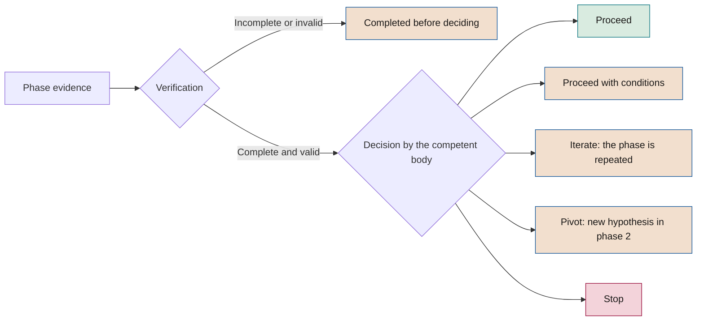

# SEVEN-G foundational methodology

**Model, principles, governance cycles, decision gates and roles**

| | |
|---|---|
| Document | Document 01 · Foundational methodology |
| Version | 0.1 (working draft) |
| Date | 16-09-2026 |
| Author | Fernando García · SEACHAD |
| Status | Draft for review. The framework's normative reference document. |

<!-- cifras: 10 | principles ; 2 | governance levels ; 8 | phases per initiative ; 6 | roles with segregation of duties -->

---

> **Legal notice and disclaimer.** SEVEN-G is a reference methodological framework provided "as is" and for information purposes only. It does not constitute legal, regulatory, financial or professional advice, nor does it guarantee compliance with any law or standard. References to general regulation (such as the EU AI Act, the GDPR, DORA or NIS2), to technical standards and to regulation specific to each sector or jurisdiction may be incomplete, may not apply to a particular case or may become out of date as a result of regulatory changes, interpretations or supervisory positions after their consultation date. **Each organisation that uses SEVEN-G is solely responsible for identifying the regulation that applies to it, verifying that it is current and certifying its own regulatory compliance**, with the appropriate qualified advice. The author and SEACHAD accept no liability for any use made of this content or for any decisions taken on the basis of it. The data, figures, companies and cases in the examples are fictitious or illustrative.

## 1. Purpose and scope

This document defines the SEVEN-G model and the rules that an organisation must apply in order to declare that it governs its artificial intelligence with this framework. It is the normative reference for all the other documents: the manuals, criteria, templates and tools develop what is established here and cannot contradict it.

### 1.1 What it contains

- The framework model: governance levels, components and the relationship between them.
- The principles and how they are verified.
- The corporate cycle, which governs AI in the company.
- The lifecycle of each initiative, with its phases, evidence and decision gates.
- The decision rules, including the differences by ambition level.
- Roles, bodies and segregation of duties.
- The application intensity (Lite or Enterprise) and how it is determined.
- The integration of risk, measurement, nonconformities and regulation.

The operational detail of each topic is developed in the related documents (section 15).

### 1.2 Compatibility and modular adoption

SEVEN-G is compatible with governance structures that are already in place, with in-house or external consulting teams, and with pre-existing corporate frameworks for risk, control, technology or transformation. The framework does not require replacement; its function is to provide a common language, decision traceability and verifiable evidence to coordinate what the company already does with what it needs to strengthen.

Its design is modular: it can be implemented in full or by components. An organisation may start with one specific element (for example inventory, *gates*, measurement or board oversight) and progressively expand scope without breaking methodological coherence.

### 1.3 What is governed with SEVEN-G

| Type of AI use | Examples | Treatment in SEVEN-G |
|---|---|---|
| **AI initiatives** | Predictive models, generative AI solutions, agents, AI-enabled automations developed or adapted by the company. | Full lifecycle (phases 0–7) at the appropriate intensity. |
| **Third-party AI embedded in processes** | Supplier software with AI functions that play a part in decisions, operations or customer relationships. | Full lifecycle; the design and delivery phases focus on the selection, integration, contract and controls of the supplier. |
| **Corporate use of general-purpose AI** | AI-enabled assistants and productivity suites used by employees. | Inventory, acceptable use policy, training and technical controls. It moves to the full cycle if it meets any Enterprise criterion (section 9). |
| **Unauthorised use** | AI tools used without approval. | It is detected, recorded and regularised (authorisation, replacement or blocking) as a nonconformity. |

### 1.4 Language conventions

| Term | Meaning |
|---|---|
| **must** | Mandatory requirement. Failure to meet it is a nonconformity. |
| **should** | Recommendation. It may be omitted if the omission is justified and recorded. |
| **may** | Permitted option. |

---

## 2. The SEVEN-G model

**SEVEN-G** stands for *Seven-phase Enterprise Value & Governance*. The name expresses the three ideas of the framework:

- **Seven value phases** that each initiative goes through, preceded by a phase 0 that authorises it.
- **Enterprise value** as the criterion for all decisions.
- **Governance** present in every phase and in the company as a whole.

<!-- figura: arquitectura -->

The framework is organised into **two governance levels** and **four cross-cutting components**:

| Element | What it is | Who uses it |
|---|---|---|
| **Corporate cycle** | Diagnosis, direction, portfolio, oversight and review of AI in the company. | Board, senior management, AI Committee. |
| **Initiative lifecycle** | Phases 0–7 with auditable decision gates. | Initiative teams, risk, AI Auditor, AI Committee. |
| **A · Impact map** | Nine spheres of impact and three ambition levels. | Board and management to decide where and how much to bet; teams to classify initiatives. |
| **B · Governance system** | Roles, bodies, risks, regulation, third parties and nonconformities. | All levels. |
| **C · Measurement system** | Value rules, indicators, maturity and transformation index. | Board, AI Committee, management control, teams. |
| **D · Tools** | Templates, checklists, board dashboard and register of recommendations. | All levels. |

The two cycles are connected: **the corporate cycle authorises and funds** initiatives within a portfolio, and **each initiative reports evidence** that feeds oversight and the annual review.

---

## 3. Principles

The principles guide decisions in situations that the rules do not cover. Each principle has a way of being verified.

| # | Principle | What it means in practice | How it is verified |
|---|---|---|---|
| 1 | **Value before technology** | Every initiative starts from a business problem or opportunity and is linked to a measurable outcome. | An approved value hypothesis exists before investing in construction. |
| 2 | **Governance is not optional** | Controls are designed in from the start and make it possible to move faster with less risk. | No initiative under construction lacks an approved phase 0. |
| 3 | **Production is the only truth** | Value is demonstrated under real conditions, not in proofs of concept. | Value declared in production has a validation status. |
| 4 | **Reversibility** | Every solution can be stopped, rolled back or retired without compromising operations. | A tested rollback plan exists before go-live. |
| 5 | **Risk is systemic** | Risk is managed at portfolio level, as well as case by case. | The AI Committee reviews the concentration of risks in the portfolio. |
| 6 | **Evolve or retire** | No initiative remains without evidence to justify it. | All initiatives in production have a current continuity review. |
| 7 | **Segregation of duties** | Whoever builds does not control, and no one approves their own work. | *Gate* decisions record a decision-maker and a verifier who are not part of the team. |
| 8 | **Evidence, not declaration** | What is not documented and verified is not considered done. | Evidence has an author, date, version and verification. |
| 9 | **A conscious decision on ambition** | Efficiency and transformation are chosen, measured and decided separately. | Every initiative has a classified and confirmed ambition level. |
| 10 | **People at the centre of change** | AI is also assessed by its effect on work, capabilities and responsibilities. | Augment and Transform initiatives have an adoption and people plan. |

---

## 4. Basic concepts

The full definitions are in document 02 (Glossary).

| Concept | Definition in SEVEN-G |
|---|---|
| **AI system** | A machine-based system that, with varying levels of autonomy, infers from the input it receives how to generate outputs —predictions, content, recommendations or decisions— that can influence physical or virtual environments. It is aligned with the definition in the EU AI Act. |
| **Initiative** | A body of work that pursues a value hypothesis through one or more AI systems. It is the unit that goes through the lifecycle. |
| **Use case** | A specific application of an AI system to a process or decision. An initiative may include several use cases. |
| **Portfolio** | The set of authorised initiatives, with their budget, priority and balance of ambition. |
| **Sphere** | A domain of AI impact in the organisation. There are nine (document 10). |
| **Ambition level** | Type of bet: Optimise, Augment or Transform. |
| **Intensity** | The degree of rigour with which the cycle is applied: Lite or Enterprise. |
| **Gate** | A decision gate at the end of a phase, at which it is decided whether the initiative proceeds and under what conditions. |
| **Evidence** | A verifiable document, record or result that demonstrates that a criterion has been met. |
| **Dual validation** | The rule whereby a *gate* requires both tangible results and verified documentation. |
| **Nonconformity** | Failure to meet a requirement of the framework, classified as minor, major or critical. |

---

## 5. Company level · Corporate cycle

The corporate cycle is the mechanism through which the board and senior management exercise their responsibility for AI. It runs annually, with continuous oversight.

### 5.1 Stages

| Stage | Objective | Mandatory outputs | Owner | Approves |
|---|---|---|---|---|
| **C1 · Diagnosis** | Understand the real situation of AI in the company. | AI system inventory; maturity assessment with evidence; current sphere map; transformation index profile; current validated value and cost. | AI Office | AI Committee; presented to the board |
| **C2 · Direction** | Decide where to play, with what ambition and with what risk appetite. | AI thesis; ambition level per sphere; risk appetite and thresholds (including those for Enterprise intensity and the return horizon); corporate AI policy; framework budget. | Senior management | Board |
| **C3 · Portfolio** | Select, prioritise and balance initiatives. | Prioritised portfolio with ambition level, sphere, intensity, budget and owners; retirement criteria; available capacity. | AI Committee | AI Committee; the board approves Transform initiatives |
| **C4 · Oversight** | Check that what was decided is being delivered and act on deviations. | Board dashboard; register of recommendations and decisions; outcomes of relevant *gates*; incidents and nonconformities; main portfolio risks. | AI Office | AI Committee (monthly); board or board committee (quarterly) |
| **C5 · Review** | Assess progress and adjust direction. | Review of maturity and the transformation index; delivery against the thesis; lessons learned; proposed adjustments for the new cycle. | AI Office with internal audit | Board |

### 5.2 Governance calendar

| Body | Frequency | What it reviews |
|---|---|---|
| **Board of directors** | Annual (C2, C5) and quarterly (C4) | Thesis, ambition, risk appetite, Transform initiatives, board dashboard, transformation profile. |
| **Board committee** (audit, risk or technology) | Quarterly | Risks, regulatory compliance, incidents, major and critical nonconformities, audits. |
| **AI Committee** | Monthly | Portfolio, Enterprise *gates*, value and cost deviations, concentrated risks, retirements. |
| **AI Office** | Continuous | Inventory, methodology, consolidation of measurement, support for teams, preparation of information. |
| **AI Auditor** | At every Enterprise *gate* and by sampling in Lite | Verification of evidence and closure of nonconformities. |

### 5.3 First implementation

An organisation adopting SEVEN-G for the first time should concentrate C1 to C3 into ninety days:

| Period | Objective | Output |
|---|---|---|
| **Month 1** | Diagnosis | Initial inventory, maturity with evidence and transformation profile. |
| **Month 2** | Risks and opportunities | Main risks and opportunities by sphere, with owner, economic impact and timeframe. |
| **Month 3** | Governance structure | Bodies, roles, thresholds, *gates*, metrics and reporting cadence approved. |

The detail is in document 90 (Implementation guide).

---

## 6. Initiative level · Lifecycle

Each initiative goes through eight phases. At the end of each one there is a decision gate (*gate*); in phase 6 the gate is replaced by a periodic continuity review.

<!-- figura: ciclo -->

### 6.1 Summary of phases and gates

| Phase | Name | Question it answers | Decision gate |
|---|---|---|---|
| 0 | **Context and constraints** | Is the initiative authorised, and within what framework? | G0 · Authorisation |
| 1 | **Opportunity discovery** | Is there a business opportunity that requires AI? | G1 · Opportunity |
| 2 | **Value hypothesis** | What value do we expect, how will we measure it and how will we know it has failed? | G2 · Hypothesis |
| 3 | **Feasibility and risk** | Is it technically, economically, regulatorily and organisationally feasible, with acceptable risk? | G3 · Feasibility (main stop gate) |
| 4 | **Solution design** | How is it built with control, human oversight and reversibility? | G4 · Design |
| 5 | **Delivery and validation** | Does it work and deliver value under real conditions? | G5 · Go-live |
| 6 | **Operation and governance** | Is it still working, delivering value and under control? | R6 · Continuity review (periodic) |
| 7 | **Evolution or retirement** | Do we scale, iterate or retire? | G7 · Scale or retire |

### 6.2 Phase 0 · Context and constraints

| | |
|---|---|
| **Objective** | Formally authorise the initiative and set the framework within which it will be developed. |
| **Activities** | Identify the strategic objective and the sphere; declare regulatory, ethical, data, budgetary and time constraints; assign the roles; determine the intensity (Lite or Enterprise); register the initiative in the inventory. |
| **Mandatory evidence** | Initiative charter · Context and constraints statement · Role assignment record · Intensity determination · Inventory registration. |
| **Exit criterion** | Committed sponsor, roles assigned without incompatibilities, fit with the AI thesis and the portfolio, and known constraints. |
| **Specific rule** | Without an approved G0, the initiative is not authorised: it cannot consume budget or access production data. |

### 6.3 Phase 1 · Opportunity discovery

| | |
|---|---|
| **Objective** | Identify opportunities from the business and discard those that do not require AI or have no plausible value. |
| **Activities** | Analyse the affected process or decision; identify non-AI alternatives; estimate the order of magnitude of the value; propose a sphere and ambition level using the criteria in document 12. |
| **Mandatory evidence** | Opportunity portfolio with screening notes · Non-AI alternatives considered · Proposed sphere and ambition level. |
| **Exit criterion** | The opportunity arises from a business need, AI contributes something that the alternatives do not, and the potential value justifies formulating a hypothesis. |

### 6.4 Phase 2 · Value hypothesis

| | |
|---|---|
| **Objective** | Formulate a measurable and falsifiable value hypothesis. A hypothesis that cannot fail is not valid. |
| **Activities** | Define the primary and secondary metrics; measure the baseline; set the target and the success threshold; choose the attribution method (control group, before and after, or another justified method); estimate value in money with a formula; confirm the ambition level; define the stop criteria. |
| **Mandatory evidence** | Value hypothesis canvas · Baseline metrics · Attribution method · Ambition level confirmation · Stop criteria. |
| **Exit criterion** | Falsifiable hypothesis, measured baseline (not estimated unless justified), value expressed in money with a formula, and stop criteria defined before investing. |
| **Specific rule** | In Transform initiatives, the hypothesis may carry greater uncertainty, but must include learning milestones, an investment limit per stage and an explicit decision by the board. |

### 6.5 Phase 3 · Feasibility and risk

| | |
|---|---|
| **Objective** | Decide whether the initiative is feasible with acceptable risk. This is the main stop gate of the cycle. |
| **Activities** | Assess technical feasibility and the availability and quality of the data; estimate full costs (build, recurring and adoption); classify the initiative under the applicable regulation; carry out the relevant impact assessments (data protection, fundamental rights); identify and assess risks; assess suppliers; assess the impact on people. |
| **Mandatory evidence** | Feasibility assessment · Regulatory classification · Applicable impact assessments · Risk matrix and register · Mitigation and contingency plan · Supplier assessment, where there are suppliers. |
| **Exit criterion** | Feasibility demonstrated with real data; no critical risk without accepted mitigation; regulatory classification carried out with legal judgement; expected net value consistent with the risk appetite and the horizon set in C2. |
| **Specific rule** | Practices prohibited by regulation do not proceed beyond this phase under any circumstances. |

### 6.6 Phase 4 · Solution design

| | |
|---|---|
| **Objective** | Design a solution that is controllable, subject to oversight and reversible. |
| **Activities** | Define the architecture; document data and model lineage; design human oversight (what the system decides, what a person validates and what is never delegated); design security controls, including agent identity, permissions and limits of action; define monitoring; prepare the rollback plan; design adoption. |
| **Mandatory evidence** | Architecture record · Data and model lineage · Governance and human oversight design · Security design · Rollback plan · Adoption plan. |
| **Exit criterion** | The design covers the controls required by the risk classification; human oversight is defined; a stop mechanism exists; the phase 3 risks have a designed control. |

### 6.7 Phase 5 · Delivery and validation

| | |
|---|---|
| **Objective** | Build, test and demonstrate value under real conditions before final go-live. |
| **Activities** | Build or integrate the solution; carry out functional, performance, bias, robustness and security testing (including prompt injection testing for generative AI and agents); run a pilot with measurement according to the attribution method; test the rollback plan; train users. |
| **Mandatory evidence** | Delivery report · Validation and test results · Pilot results against the hypothesis · Rollback plan test · Updated risk register · Go-live sign-off record. |
| **Exit criterion** | The pilot results meet the success threshold, or do so with accepted conditions; critical controls work; operations are ready. |
| **Specific rule** | The go-live of an Enterprise initiative requires **multi-level sign-off with veto power**: technical owner, risk and compliance, information security and data protection. Each sign-off is recorded. |

### 6.8 Phase 6 · Operation and governance

| | |
|---|---|
| **Objective** | Operate stably, maintain control and keep measuring value. |
| **Activities** | Monitor performance, degradation, bias, costs and security; manage incidents; carry out the post-market monitoring required by regulation; measure realised value; manage changes. |
| **Mandatory evidence** | Operations manual · Monitoring and alerting configuration · Incident response plan · Incident and change log · Value realisation tracking. |
| **Continuity review (R6)** | At least quarterly in Enterprise and half-yearly in Lite. It checks realised value against the hypothesis, stability, incidents, compliance and whether the risk classification is still valid. If it detects significant deviations, it brings forward the G7 *gate*. |

### 6.9 Phase 7 · Evolution or retirement

| | |
|---|---|
| **Objective** | Decide, on the basis of evidence, whether the initiative is scaled, iterated or retired. |
| **Activities** | Consolidate realised value and its validation status; review the actual ambition level against the declared one; assess accumulated risks; if it is retired, plan the retirement. |
| **Mandatory evidence** | Value realisation tracking · Scaling or retirement decision record · Lessons learned · Retirement plan, where applicable. |
| **Possible outcomes** | **Scale** (new phase 0 for the extended scope), **Iterate** (return to the relevant phase; if kept unchanged, return to phase 6) or **Retire**. |
| **Specific rule** | Every retirement records the date, reason, deciding body, replacement if any, treatment of data and models, and communication to those affected. |

### 6.10 Evidence map

| Phase | Mandatory evidence |
|---|---|
| 0 | Initiative charter · Context and constraints statement · Role assignment record · Intensity determination · Inventory registration |
| 1 | Opportunity portfolio and screening notes · Non-AI alternatives · Proposed sphere and ambition level |
| 2 | Value hypothesis canvas · Baseline · Attribution method · Ambition confirmation · Stop criteria |
| 3 | Feasibility assessment · Regulatory classification · Impact assessments · Risk matrix and register · Mitigation and contingency plan · Supplier assessment |
| 4 | Architecture record · Data and model lineage · Governance and human oversight design · Security design · Rollback plan · Adoption plan |
| 5 | Delivery report · Validation and test results · Pilot results · Rollback test · Updated risk register · Go-live sign-off |
| 6 | Operations manual · Monitoring and alerting · Incident response plan · Incident and change log · Value tracking |
| 7 | Value realisation tracking · Scaling or retirement decision · Lessons learned · Retirement plan |

The templates for each piece of evidence form part of block H of the documentation library.

### 6.11 Lifecycle traceability

The AI portfolio is managed as a funnel, in the same way that a sales organisation manages its opportunities. To this end, every initiative must be registered in the **initiative register** (document 03, tool T01), and the register must retain, as a minimum:

- The **entry and exit date of each phase**, and the periods on hold with their reason.
- The **request, verification and decision for each *gate***, with its outcome, iteration, decision-maker and verifier.
- The **status of each *gate* criterion** (met, not met, not applicable or pending) with the linked evidence.
- The **conditions** imposed, with deadline, owner and status.
- The **controlled taxonomy tags**: sphere, ambition level, intensity, regulatory classification, technology, exposure and value type.
- The **coded reason** for every stop or retirement.

In C2 the company approves the **reference time limits per phase** and the maximum decision time for a *gate*. Initiatives that exceed them are flagged as stalled and reviewed by the AI Committee.

---

## 7. Decision gates

### 7.1 How a gate works

Each *gate* follows the same sequence: the team provides the evidence, the verifier checks that it is complete and valid, and the competent body decides.

<!-- grafico: Logic of a decision gate | Decisions are only taken on verified evidence -->

### 7.2 Dual validation

A *gate* can only be passed if two conditions are met at the same time:

1. **Tangible results**: the phase criteria are met with real data, tests or results.
2. **Verified documentation**: the mandatory evidence exists, is traceable (author, date and version) and has been verified by the appropriate person.

Results without documentation, or documentation without results, do not pass the *gate*.

### 7.3 Possible outcomes

| Outcome | When it applies | Consequence |
|---|---|---|
| **Proceed** | All criteria are met and all evidence is verified. | The initiative moves on to the next phase. |
| **Proceed with conditions** | The essential criteria are met and non-critical aspects remain pending. | It moves on to the next phase with explicit conditions, a deadline and an owner. The conditions are verified at the next *gate*. Not permitted for critical security, legal compliance or human oversight controls. |
| **Iterate** | The results are insufficient but the hypothesis remains plausible. | The phase activities are repeated and the initiative returns to the same *gate*. |
| **Pivot** | The hypothesis does not hold, but a reasonable alternative exists. Only at G1, G2 and G3. | The initiative returns to phase 2 with a new hypothesis, keeping the approved context. |
| **Stop** | There is no plausible value, feasibility is not demonstrated or the risk is unacceptable. | The initiative is closed, lessons learned are recorded and resources are released. |
| **Scale** | Only at G7: value demonstrated and risk under control. | New phase 0 for the extended scope. |
| **Retire** | Only at G7: the value is not sustained, the risk has increased or a better alternative exists. | Planned and recorded retirement. |
| **Proceed with operation · Proceed with conditions · Bring G7 forward** | Only at R6: the initiative keeps delivering value under control, does so with correctable deviations, or shows relevant deviations in value, risk or compliance. | Remains in production; with conditions, deadline and owner; or G7 is opened without waiting for the schedule. |

A well-founded decision to **stop** is a valid outcome of the method. Avoiding a bad investment also creates value.

### 7.4 Decision rules

1. **No one decides on their own work.** Whoever provides evidence neither verifies it nor decides on it.
2. **No mandatory evidence, no decision.** The competent body cannot decide on incomplete evidence.
3. **Evidence must exist before the *gate*.** Documentation produced after the fact to justify progress already made invalidates the *gate* and constitutes a major nonconformity.
4. **Conditions have a deadline and an owner.** A condition that expires unmet turns the outcome into **Iterate**.
5. **Iteration limit.** After two iterations at the same *gate*, the decision is escalated to the higher body.
6. **Stop criteria are set in advance.** They cannot be relaxed during the phase to avoid a decision to stop without the approval of the body that authorised the initiative.
7. **Every decision is recorded** in the *gate* decision record, with outcome, reason, conditions, decision-maker and verifier.

### 7.5 Who verifies and who decides

| Gate | Verifies (Lite) | Decides (Lite) | Verifies (Enterprise) | Decides (Enterprise) |
|---|---|---|---|---|
| **G0 · Authorisation** | AI Office | Sponsor | AI Auditor | AI Committee |
| **G1 · Opportunity** | AI Office | Sponsor | AI Auditor | Sponsor, informing the committee |
| **G2 · Hypothesis** | AI Office | Sponsor | AI Auditor | AI Committee |
| **G3 · Feasibility** | AI Office | Sponsor with risk clearance | AI Auditor | AI Committee |
| **G4 · Design** | AI Office | Sponsor with risk clearance | AI Auditor | AI Committee |
| **G5 · Go-live** | AI Office | Sponsor with risk clearance | AI Auditor | AI Committee after multi-level sign-off |
| **R6 · Continuity** | AI Office | Sponsor | AI Auditor | AI Committee |
| **G7 · Scale or retire** | AI Office | Sponsor | AI Auditor | AI Committee |

**Transform** initiatives additionally require board approval at G2 (authorisation of the bet) and at G7 when the decision is to scale. At **Lite** intensity, G0, G1 and G2 may be resolved in a single session, as may G4 and G5, provided that each piece of evidence is verified.

### 7.6 Criteria differentiated by ambition level

Applying the same return criteria to an efficiency initiative and to a transformation bet blocks the latter or inflates the former. That is why the key *gates* are assessed differently:

| Gate | Optimise | Augment | Transform |
|---|---|---|---|
| **G2 · Hypothesis** | Baseline for cost, time or errors; expected savings with a formula. | Performance and cost metrics; adoption target. | Return hypothesis with learning milestones; investment limit per stage; board approval. |
| **G3 · Feasibility** | Positive expected annual net value and NPV ≥ 0 within the horizon and at the rate set in C2 (document 40). | Feasibility of adoption and of the role change, in addition to the expected net value. | Feasibility of the first stage; stop criteria per stage; documented option value. |
| **G5 · Go-live** | Efficiency validated against the baseline; plan to realise the released capacity. | Actual adoption and performance improvement measured. | Market or customer evidence: usage, conversion, initial revenue or verified operational change. |
| **G7 · Scale or retire** | Realised savings, not just released capacity. | Sustained performance and reassigned capacity. | Measured return and verified change in the operating model or the offering. |

---

## 8. Roles, bodies and segregation of duties

### 8.1 Initiative roles

| Role | Function | Responsibility | Cannot |
|---|---|---|---|
| **AI Sponsor** | Decides | Accountable for value and investment; champions the initiative before the decision-making bodies. | Verify evidence or act as risk owner or auditor of their own initiative. |
| **AI Product Owner** | Builds | Accountable for the value hypothesis, actual use and adoption. | Verify evidence or decide *gates* for their own initiative. |
| **AI Technical Owner** | Builds | Accountable for the solution, the data, the models and their technical documentation. | Verify evidence or decide *gates* for their own initiative. |
| **AI Operations Owner** | Builds | Accountable for stability, monitoring, incidents and changes in production. | Verify evidence of their own operations. |
| **AI Risk Owner** | Controls | Accountable for the assessment and monitoring of risk and compliance, and issues clearance. | Be part of the team that builds the initiative. |
| **AI Auditor** | Controls | Verifies evidence at Enterprise *gates* and closes nonconformities. | Take part in the design, construction or operation of the initiative, or report hierarchically to the sponsor. |

One person may take on more than one role if the roles are not incompatible (section 8.2). In small organisations, the AI Auditor may be external or come from internal audit.

### 8.2 Incompatibilities

| | Sponsor | Product | Technical | Operations | Risk | Auditor |
|---|---|---|---|---|---|---|
| **Sponsor** | — | Compatible in Lite | Compatible in Lite | Compatible in Lite | Incompatible | Incompatible |
| **Product** | | — | Compatible | Compatible | Incompatible | Incompatible |
| **Technical** | | | — | Compatible | Incompatible | Incompatible |
| **Operations** | | | | — | Incompatible | Incompatible |
| **Risk** | | | | | — | Incompatible in Enterprise |
| **Auditor** | | | | | | — |

### 8.3 Company bodies

| Body | Indicative composition | Functions in SEVEN-G |
|---|---|---|
| **Board of directors** or board committee | Directors; may be supported by a director or adviser with AI experience. | Approves the AI thesis, the ambition, the risk appetite and Transform initiatives; exercises quarterly oversight; reviews progress annually. |
| **AI Committee** | Senior management from business, technology, data, risk, compliance, security, data protection and people. | Manages the portfolio; decides Enterprise *gates*; reviews portfolio risks; decides retirements; escalates to the board as appropriate. |
| **AI Office** | Small methodology, portfolio and measurement team. | Maintains the inventory and the methodology; verifies in Lite; consolidates measurement; prepares information for the bodies. |
| **Second line** | Risk, compliance, information security, data protection. | Provides the risk owners; issues clearances; signs off Enterprise go-live. |
| **Third line** | Internal audit or external auditor. | Provides or supervises the AI Auditors; audits compliance with the framework. |

SEVEN-G does not create a parallel governance structure: the bodies may be existing committees with an extended mandate.

### 8.4 Responsibilities by phase

**A** is accountable for the outcome · **R** does the work · **C** is consulted · **I** is informed · **V** verifies the evidence at the *gate*.

| Phase | Sponsor | Product | Technical | Operations | Risk | Auditor |
|---|---|---|---|---|---|---|
| 0 · Context | A | R | C | I | C | V |
| 1 · Discovery | A | R | C | I | C | V |
| 2 · Value hypothesis | A | R | C | I | C | V |
| 3 · Feasibility and risk | A | R | R | C | R | V |
| 4 · Design | I | C | A/R | C | C | V |
| 5 · Delivery and validation | I | A | R | C | C | V |
| 6 · Operation | I | C | C | A/R | C | V |
| 7 · Evolution or retirement | A | R | C | C | C | V |

---

## 9. Application intensity: Lite and Enterprise

### 9.1 How it is determined

Intensity is determined in phase 0 and reviewed at G3 and at every continuity review. Meeting a single Enterprise criterion is enough for that intensity to apply.

<!-- figura: intensidad -->

### 9.2 Enterprise criteria

| Criterion | Description |
|---|---|
| **High regulatory risk** | The system is classified as high-risk under the applicable regulation. |
| **Decisions about people** | The output significantly influences decisions that affect people (employment, credit, insurance, access to services, among others). |
| **Direct exposure** | Customers, patients, citizens or other external persons interact directly with the system. |
| **Agents with the ability to act** | The system executes actions —writing to systems, sending communications, making payments— without a person validating each action before it is executed (autonomy A2 or A3, document 35), and those actions affect third parties, money, personal data or production systems. |
| **Specially protected data** | It processes special categories of personal data or critical confidential information. |
| **Critical function** | It supports a critical or important business function, or one subject to sector-specific operational resilience regulation. |
| **Transform level** | The initiative is classified as Transform. |
| **Investment** | The investment exceeds the threshold approved by the board in C2. |

### 9.3 What changes between intensities

| Aspect | Lite | Enterprise |
|---|---|---|
| **Gates** | G0–G2 and G4–G5 may be grouped | All separately |
| **Evidence** | Simplified templates | Full templates |
| **Verification** | AI Office; AI Auditor by sampling | AI Auditor at all *gates* |
| **Decision** | Sponsor, with risk clearance at G3, G4 and G5 | AI Committee; board for Transform |
| **Go-live** | Risk clearance | Multi-level sign-off with veto |
| **Continuity review** | Half-yearly | Quarterly |
| **Visibility** | Aggregated board dashboard | Board dashboard by initiative |

---

## 10. Risks

SEVEN-G manages risks at two levels: in each initiative (phase 3 and continuous monitoring) and in the portfolio (AI Committee). The full methodology is in document 33.

| Category | Examples |
|---|---|
| **Strategic** | Misalignment with the AI thesis; dependence on a single bet; missed opportunity. |
| **Technical** | Insufficient performance; degradation; lack of robustness; hallucinations in generative AI. |
| **Data** | Quality, availability, bias, legal basis for use. |
| **Economic** | Cost overruns; unrealised value; rising recurring costs. |
| **Legal and compliance** | Incorrect regulatory classification; failure to meet transparency, oversight or data protection obligations. |
| **Organisational** | Lack of adoption; loss of knowledge; unmanaged effect on people. |
| **Reputational** | Discriminatory outcomes; errors visible to customers; use perceived as inappropriate. |

These categories are complemented by three areas that require specific controls:

- **Generative AI and agents**: prompt injection, information leakage, excessive permissions, unauthorised actions, lack of traceability of the intent behind each action.
- **Exposure to attacks that use AI**: impersonation, attack automation, accelerated exploitation of vulnerabilities. The detail is in document 35.
- **AI third parties and suppliers**: technological dependency, use of data by the supplier, uncommunicated model changes, concentration and exit. The detail is in document 36.

---

## 11. Measurement

Measurement is integrated into the lifecycle and the corporate cycle. The value measurement rules (document 00, section 6, and document 40) apply in all cases.

| Moment | What is measured | Purpose |
|---|---|---|
| **Phase 2** | Baseline, target and success threshold; expected value in money with a formula. | Make the hypothesis falsifiable. |
| **Phase 3** | Full costs and expected net value. | Decide on economic feasibility. |
| **Phase 5** | Pilot results using the attribution method. | Demonstrate value before production. |
| **Phase 6** | Realised value, actual costs, performance, incidents, adoption. | Maintain control and detect deviations. |
| **Phase 7** | Validated realised value; actual versus declared ambition. | Decide on scaling or retirement. |
| **C1 and C5** | Maturity with evidence; transformation index; portfolio value and cost. | Diagnose and review direction. |
| **C4** | Board dashboard; decision agility (time from idea to approval and to production). | Oversee. |
| **Continuous** | Funnel metrics: time in phase, decision time, conversion per *gate*, iterations, stalled initiatives, expired conditions and stop reasons (document 03). | Manage the portfolio as a funnel and detect bottlenecks. |

Every declared amount has one of three statuses: **validated** (by management control or audit), **declared** (by the responsible area) or **estimated** (by the committee, the board or the assessment team).

---

## 12. Nonconformities

A nonconformity is any failure to meet a mandatory requirement of the framework. It is managed through a single process; the detail is in document 37.

<!-- figura: no-conformidades -->

| Type | Examples | Containment | Action plan | Reports to |
|---|---|---|---|---|
| **Critical** | System in production without an approved *gate*; prohibited practice; unreported serious incident; critical control disabled. | Immediate (within 48 hours at most), including shutting down the system if necessary. | Within 10 days at most. | AI Committee and board committee. |
| **Major** | Evidence produced after the fact; self-approval; expired condition on a relevant control; omitted continuity review. | Within 10 days at most. | Within 30 days at most. | AI Committee. |
| **Minor** | Incomplete evidence with no impact on the decision; delay in updating records. | Not required. | Before the next *gate* or review. | AI Office. |

The time limits are for reference and the company may adjust them in C2, without exceeding those set by the applicable regulation.

---

## 13. Regulation and reference standards

SEVEN-G **maps** regulation instead of embedding it: each obligation is linked to a phase, a role and a piece of evidence. In this way, when a regulation changes, the mapping is updated without rebuilding the framework. The detailed mapping is in document 34.

| Reference | Main fit in SEVEN-G |
|---|---|
| **EU AI Act** | Classification by risk level and prohibited practices (phase 3); risk management, data governance, technical documentation, record-keeping, transparency, human oversight, accuracy and robustness (phases 3 to 6); AI literacy of staff (C2 and people); post-market monitoring and reporting of serious incidents (phase 6). |
| **ISO/IEC 42001** (AI management system) | The corporate cycle acts as the management system: context and leadership (C1–C2), planning (C2–C3), operation (lifecycle), performance evaluation (C4–C5) and improvement (C5 and nonconformities). |
| **NIST AI RMF** | Govern (corporate cycle and roles), map (phases 1–3), measure (phases 2, 5 and 6) and manage (phases 3–7). |
| **GDPR** | Legal basis and data minimisation (phase 3), data protection impact assessment (phases 3–4), data subject rights and automated decisions (phases 4–6). |
| **DORA and NIS2**, where applicable | Technology supplier risk (phases 3–4), incident management and reporting (phase 6), resilience of critical functions (Enterprise criterion). |
| **Sector-specific regulation** | Incorporated into the context statement (phase 0) and the company's regulatory mapping. |

This document does not constitute legal advice. The regulatory classification of each system must be carried out with qualified legal judgement.

---

## 14. How to declare that SEVEN-G is applied

An organisation may declare that it applies SEVEN-G when it meets, as a minimum, the following conditions:

1. It has completed C1 and C2, and the board has approved the AI thesis, the ambition per sphere and the risk appetite.
2. It maintains an AI system inventory with regulatory classification, intensity and owner, and an initiative register with the traceability described in section 6.11.
3. It has assigned the roles and bodies in line with the incompatibilities in section 8.2.
4. All new initiatives go through the lifecycle with their *gates* recorded.
5. All initiatives in production have a current continuity review.
6. It applies the value measurement rules and reports to the board with the oversight dashboard.
7. It manages nonconformities using the process in section 12.

The declaration is drafted with P61 and audited in accordance with 38 §11.

Initiatives in production that predate the adoption of the framework must be regularised within a time limit approved in C2, by undergoing a continuity review equivalent to G7.

---

## 15. Related documents

| Document | Relationship to this document |
|---|---|
| **00 · What SEVEN-G is and how it helps companies** | Framework overview and value measurement rules. |
| **02 · Glossary** | Full definitions of the terms. |
| **03 · Tools and initiative register** | Initiative register, funnel metrics, data model and tool catalogue. |
| **10 · Sphere map and ambition levels** | Component A. |
| **11 · Maturity model** | Diagnosis in C1 and C5. |
| **12 · Transformation index** | Ambition classification and company profile. |
| **13 · AI thesis and risk appetite** | C2 outputs. |
| **14 · Portfolio management** | C3 outputs and retirement criteria. |
| **20 · Phase manuals** | Operational development of phases 0–7. |
| **21 · *Gate* and audit criteria** | Detailed criteria by gate, intensity and ambition. |
| **22 · Checklists** | Binary controls per *gate*. |
| **30 · Governance model** | Development of roles, bodies and escalation. |
| **33 · AI risk methodology** | Matrix, register and typical risks. |
| **34 · Regulatory mapping** | Obligation by obligation. |
| **35 · AI and agent security** | Agent-specific controls and exposure to attacks. |
| **37 · Nonconformities and incidents** | Development of the process in section 12. |
| **40 · Value measurement rules** | Development of the measurement system. |
| **90 · Implementation guide** | First ninety days and regularisation. |

---

## 16. Version control

| Version | Date | Changes |
|---|---|---|
| 0.1 | 16-09-2026 | First version. Consolidates the previous foundational methodology and the *gate* criteria into a single model; incorporates the corporate cycle, the criteria differentiated by ambition level, intensity determination, multi-level go-live sign-off, the incompatibility table, nonconformity time limits, regulatory fit and lifecycle traceability as a funnel. |
