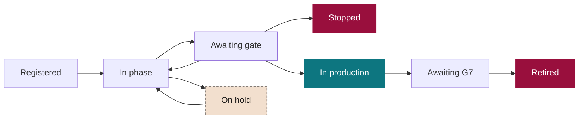

# SEVEN-G tools and initiative register

**The AI portfolio managed as a funnel: phases, timings, compliance and tags**

| | |
|---|---|
| Document | Document 03 · Tools and initiative register |
| Version | 0.1 (working draft) |
| Date | 16-09-2026 |
| Author | Fernando García Varela |
| Status | Draft for review. Living catalogue: it is updated every time a tool is built or modified. |

<!-- cifras: 1 | common data model ; 8 | phases tracked with dates ; 22 | catalogued tools ; 3 | build waves -->

---

> **Legal notice and disclaimer.** SEVEN-G is a reference methodological framework provided "as is" and for information purposes only. It does not constitute legal, regulatory, financial or professional advice, nor does it guarantee compliance with any law or standard. References to general regulation (such as the EU AI Act, the GDPR, DORA or NIS2), to technical standards and to regulation specific to each sector or jurisdiction may be incomplete, may not apply to a particular case or may become out of date as a result of regulatory changes, interpretations or supervisory positions after their consultation date. **Each organisation that uses SEVEN-G is solely responsible for identifying the regulation that applies to it, verifying that it is current and certifying its own regulatory compliance**, with the appropriate qualified advice. The author accepts no liability for any use made of this content or for any decisions taken on the basis of it. The data, figures, companies and cases in the examples are fictitious or illustrative.

<!-- esencial: siempre | Every initiative is registered in the initiative register (T01 or a spreadsheet with the data model in section 4), with the dates of each phase, the decision of each gate, the status of each criterion, the conditions, the taxonomy tags and the coded stop or retirement reason. The tool catalogue (section 5) is for consultation. -->

## 1. Purpose

This document serves two functions:

1. It defines the **initiative register**, the central SEVEN-G tool. It manages each AI initiative the way a salesperson manages an opportunity in a CRM: it knows which phase the initiative is in, how long it has been there, which criteria it meets and which it does not, what value is expected and why it was stopped if it did not move forward.
2. It maintains the framework's **tool catalogue**: which tools exist or are needed, what they are for, at what point in the cycle they are used, which document they depend on and when they should be built.

---

## 2. Tool design principles

| # | Principle | What it means |
|---|---|---|
| 1 | **A single data model** | All tools read from and write to the same model (section 4). The board dashboard, reports and alerts are fed from the register, without re-entering data. |
| 2 | **Every change is a dated event** | Phase entries and exits, decisions and classification changes are recorded with date, author and reason. Without a history there is no measurement of timings and no audit. |
| 3 | **Controlled taxonomy** | The main tags use closed lists defined in the framework, so that the portfolio can be filtered, compared and aggregated. Free tags are allowed as a complement. |
| 4 | **Evidence linked, not copied** | The tools record the link, version and verification status of each piece of evidence; the document itself lives in the company's document repository. |
| 5 | **Portability** | The reference tools work without a server, in HTML with data in JSON, and export to spreadsheet. The data model can be implemented in the CRM, risk management tool or project management platform that the company already uses. |
| 6 | **The data belongs to the company** | The tools do not send data to third parties. Demonstrations always use fictitious data. |
| 7 | **"No data" is not zero** | A missing value is shown as missing and is never replaced by an undeclared estimate. |

### 2.1 Where the data of the tools lives

The reference applications (T01, T11 with T13, T14 and T15) are published with **fictitious sample data that nobody can change on the site**: the site is static and has no application server or database. What each person enters is saved in one of three places, and the **"Data: …"** button in the bar of each tool says which one it is and opens the "Where my data is" dialog to change it:

| Where | What it is for | What to know |
|---|---|---|
| **Only in the browser** (default) | Trying the tool with your own data without installing anything. | Every change is saved in the local storage of that browser on that computer; nobody else sees it. It is lost if the browser is cleared and it is not available from another computer. The first time something is changed, the tool says so. |
| **A JSON file on the computer** | Real work by one person or a small team. | The tool rewrites the file with every change and reads it again when opened (Microsoft Edge or Google Chrome; in other browsers, export and import by hand). The file is the same one that "Export" downloads: it can be copied, shared, imported into another tool or used to regenerate the board dashboard (T17). It can live in a synchronised company folder. |
| **A copy of the site on the company's server** | The whole company seeing the same version of the portfolio. | The whole site (documents, templates and tools) is copied to an internal server. If that copy has the folder `herramientas/datos/` with a tool's file, the tool loads it instead of the sample data. Changes are still saved in each browser or in a file; publishing a new version means replacing the file in the folder. |

**Why it matters.** Without this rule, someone entering the public site could believe they are editing a shared portfolio, or fear that their data stays on the site. Neither happens: nothing entered leaves the computer of the person who enters it, and the only thing that can be shared is a JSON file that the company keeps wherever it decides. Principle 6 (the data belongs to the company) holds by construction.

**How to set up the company copy.**

1. Download the whole site (the published repository or its generated folder) and serve it **over http** from an internal server: any static file server will do; no database or application server is needed. HTML files opened directly (double click) work, but they do not consult the data folder.
2. Create the folder `SEVEN-G/herramientas/datos/` and put in it the JSON files exported by the tools you use: `T01_registro.json` (initiative register), `T11_calculadora.json` (value hypothesis and costs), `T14_indice.json` (transformation index) and `T15_madurez.json` (maturity diagnosis).
3. The board dashboard (T17) **regenerates itself in the browser**: it embeds the connector and, served over http, reads `T01_registro.json` from that folder and shows it to the whole company; in each browser where someone works with T01 it shows that browser's register. No Python and nothing to install. Only if the company wants to publish the dashboard as static files (to send them by e-mail, with the no-JavaScript view) does it use the `t01_a_panel.py` generator (Python 3.11 and `uv`, optional).
4. In each working session: export from the tool and replace the file in the folder. Whoever has changes in their browser or in their file keeps them; the "Where my data is" dialog shows them that the server holds a version and lets them load it.
5. No data leaves the company: the copy sends nothing to third parties. The aggregated visit measurement (document 04 §6.2) only acts on the public site's domains, never on an internal domain.

---

## 3. The initiative register

### 3.1 The CRM analogy

| In a sales CRM | In the SEVEN-G initiative register |
|---|---|
| Opportunity | **AI initiative** |
| Funnel stage | **Lifecycle phase** (0–7) |
| Stage transition | **Decision gate** (*gate*) with recorded outcome |
| Days in stage | **Time in phase** and decision time for each gate |
| Requirements to advance | **Gate criteria**: met, not met, not applicable or pending, with evidence |
| Opportunity amount | **Expected value**; later, declared, estimated and validated value |
| Probability of closing | **Historical probability of reaching production** from each phase, calculated with the company's own data |
| Sales forecast | **Weighted portfolio value** |
| Loss reason | **Stop or retirement reason**, coded |
| Owner | **Sponsor and product owner** |
| Account or segment | **Area, sphere, ambition level, technology** and other tags |
| Activities | Linked **evidence, decisions, conditions, risks and incidents** |
| Stalled opportunities | **Initiatives that exceed the reference time limit** for their phase |

### 3.2 Initiative statuses

In addition to the phase, each initiative has a status that indicates what is happening to it.

<!-- grafico: Initiative statuses | The phase shows where it is; the status, what is happening to it -->

| Status | Meaning | Counts towards time in phase |
|---|---|---|
| **Registered** | Idea registered, without an approved phase 0 yet. | No |
| **In phase** | The phase activities are being carried out. | Yes |
| **Awaiting gate** | Evidence submitted; awaiting verification and decision. | Yes, and decision time is also counted |
| **On hold** | Halted for a recorded external cause (budget, dependency, supplier, data). Requires a reason and an expected resumption date. | Measured separately |
| **In production** | G5 passed; in operation with continuity reviews. | Time in production is measured |
| **Awaiting G7** | Decision on scaling, iteration or retirement under way. | Yes |
| **Stopped** | Halted at a *gate* with a coded reason. | Closure |
| **Retired** | Retired after G7 with the retirement plan executed. | Closure |

### 3.3 What is recorded

**Initiative record**

| Block | Main fields |
|---|---|
| **Identification** | Unique code (IA-AAAA-NNN), name, plain-language description of what it is and what it is used for, area, registration date. |
| **Owners** | Sponsor, product owner, technical owner, operations owner, risk owner and assigned auditor. |
| **Classification** | Primary and secondary sphere; proposed, confirmed and actual ambition level; intensity; regulatory classification; technology; exposure; suppliers. |
| **Lifecycle** | Current phase, status, phase entry date, reference time limit, current iteration. |
| **Value** | Expected value (efficiencies, return, recurring cost) with formula; realised value with validated, declared or estimated status; investment made and pending. |
| **Risk and compliance** | Main residual risk level, impact assessments carried out, open conditions, open nonconformities, incidents. |
| **Free tags** | Programme, strategic initiative, internal customer or other company-specific groupings. |

**Controlled taxonomy**

| Tag | Values |
|---|---|
| **Sphere** | 01 Customer · 02 Product and service · 03 People · 04 Operations · 05 Data · 06 Knowledge · 07 Decision · 08 Regulation, ethics and accountability · 09 AI governance |
| **Ambition level** | Optimise · Augment · Transform |
| **Intensity** | Lite · Enterprise |
| **Regulatory classification** | Prohibited · High risk · Transparency obligations · Minimal risk · Out of scope · Pending classification |
| **Technology** | Predictive ML · Generative AI · Agent · Language and document processing · Vision · Optimisation · Embedded third-party AI · Rules (not AI) |
| **Exposure** | Internal · Employees · Customers indirectly · Customers or external persons directly |
| **Value type** | Efficiency · Return · Avoided risk · Compliance |
| **Stop or retirement reason** | No plausible value · Hypothesis refuted · Insufficient data · Technically unfeasible · Cost exceeds value · Unacceptable risk · Regulation · No adoption · Replaced by another solution · Change in strategic priority |

**Events**

Each of the following occurrences generates an event with date, author and comment: registration; phase entry and exit; *gate* request; verification; decision with outcome; creation, fulfilment or expiry of conditions; placing on hold and resumption; change of classification (ambition, intensity, regulatory); incident; nonconformity; stop; retirement.

### 3.4 Decision gate compliance

Each *gate* is recorded as a list of criteria. Each criterion has one of four statuses:

| Status | Meaning |
|---|---|
| **Met** | The criterion is met and the linked evidence is verified. |
| **Not met** | The criterion is not met or the evidence is not valid. |
| **Not applicable** | The criterion does not apply because of the intensity, technology or classification, with justification. |
| **Pending** | The evidence or the verification is missing. |

Based on these statuses, the register calculates the **gate compliance rate** (criteria met out of those applicable), shows **which criteria are blocking** the decision and prevents **Proceed** from being recorded if any mandatory criteria are *Not met* or *Pending*. The conditions of a **Proceed with conditions** outcome are recorded with a deadline and an owner, and trigger an alert when they expire.

### 3.5 Funnel metrics

<!-- figura: embudo -->

| Metric | Definition | Purpose | Who uses it |
|---|---|---|---|
| **Time in phase** | Days between entry into and exit from the phase, excluding time on hold. Median and 80th percentile. | Detect bottlenecks. | AI Office, committee |
| **Decision time** | Days between the *gate* request and the decision. | Measure the agility of governance itself. | Committee, board |
| **Time to production** | Days from registration to G5; broken down into idea → feasibility approval (G3) → production. | Measure the real speed of the portfolio. | Committee, board |
| **Conversion per gate** | Percentage of initiatives that proceed at each *gate* versus those that iterate, pivot or stop. | Know where the portfolio is filtered and whether the filter is in the right place. | Committee |
| **Iterations per gate** | Average number of iterations before the decision. | Detect poorly prepared evidence or unclear criteria. | AI Office |
| **Stalled initiatives** | Initiatives that exceed the reference time limit for their phase. | Act before they turn into cost with no return. | Committee |
| **Time on hold** | Days on hold and reasons. | Distinguish internal delays from external dependencies. | Committee |
| **Stop and retirement reasons** | Distribution of the coded reasons. | Learn which types of initiative should not enter the portfolio. | Committee, C5 |
| **Gate compliance** | Average compliance rate and the criteria that block most often. | Improve evidence preparation. | AI Office |
| **Expired conditions** | Open conditions past their deadline. | Prevent "with conditions" from becoming "without control". | Committee, audit |
| **Value by phase** | Expected value of the initiatives in each phase. | See where the portfolio's value lies. | Committee, board |
| **Weighted value** | Sum of the expected value multiplied by the historical probability of reaching production from the current phase. Shown only when there is sufficient history. | Estimate the future value of the portfolio prudently. | Board |
| **Ambition mix by phase** | Distribution of Optimise, Augment and Transform in each phase. | Detect whether transformation bets get stuck before production (a transformation index signal). | Board |
| **Cohorts** | The above metrics by quarter of registration. | Check whether the system improves over time. | C5 |

All metrics can be segmented by any taxonomy tag: sphere, ambition, intensity, technology, area or supplier.

### 3.6 Reference time limits per phase

The time limits make it possible to identify stalled initiatives. The company approves them in C2 and recalibrates them in C5 with its own data. The following values are **indicative, as a starting point**:

| Phase | Lite | Enterprise |
|---|---|---|
| 0 · Context and constraints | 10 days | 20 days |
| 1 · Discovery | 20 days | 30 days |
| 2 · Value hypothesis | 20 days | 30 days |
| 3 · Feasibility and risk | 20 days | 45 days |
| 4 · Solution design | 20 days | 45 days |
| 5 · Delivery and validation | 60 days | 90 days |
| 7 · Evolution or retirement | 15 days | 30 days |
| **Gate decision** (from the request) | 5 working days | 10 working days |

Phase 6 has no time limit; it is controlled through the frequency of the continuity review.

### 3.7 Views

| View | What it shows |
|---|---|
| **Funnel** | Initiatives by phase and status, with time-limit alerts; can be filtered by tags. |
| **Kanban board** | Cards by phase that move when the *gate* decision is recorded. |
| **Record** | Initiative data, event timeline, criteria for the current *gate*, conditions, risks and value. |
| **Pending gates** | Requests awaiting verification or decision, with days elapsed. |
| **Alerts** | Stalled initiatives, expired conditions, overdue continuity reviews, evidence awaiting verification. |
| **Analysis** | Funnel metrics, cohorts and segmentation. |
| **Data** | Import of one or several JSON files (replacing or merging by code) and export of the full register. The full JSON is the input of the board dashboard (T17): the connector converts it into the dashboard JSON, with the funnel and the time spent in each stage taken from the phases and events of the register. |

---

## 4. Common data model

The model is the foundation of all the tools. Its full specification (fields, types, lists and validation rules) will be published as a schema together with the first version of the register.

| Entity | What it represents | Related to |
|---|---|---|
| **Initiative** | The unit that goes through the lifecycle. Its scope states whether it belongs to one business unit, is cross-unit (with roll-out and adoption by unit) or is an enabling platform (with the use cases that rely on it); document 40 §7.2. From T01 schema 0.5, also the evidence for the transformation index: verification of IT-P2 and IT-P3 at a *gate*, verified human oversight, entire organisational unit redesigned and released, materialised and reassigned capacity (12 §4.4). | All the others |
| **AI system** | Each system in the inventory, in-house or third-party, including corporate use. | Initiatives, suppliers, risks, incidents |
| **Event** | Any change with date, author and reason. | Initiative |
| **Gate decision** | Request, verification, decision, outcome and iteration. | Initiative, criteria, conditions |
| **Assessed criterion** | Status of each criterion in a *gate* decision. | Gate decision, evidence |
| **Condition** | Condition imposed with deadline, owner and status. | Gate decision |
| **Evidence** | Link, type, version, author, date and verification. | Criteria, initiative |
| **Value** | Amounts by type (efficiency, return, cost), formula, validation status, period and, in cross-unit initiatives, business unit; from schema 0.5, whether the return comes from an AI-enabled offering (signal 6 of 12). | Initiative |
| **Risk** | Risk with probability, impact, inherent and residual level, owner and controls; from T01 schema 0.4, also impact axis, control effectiveness, target or verified residual, contingency, status, trend, next review and acceptance (33 §8.1). | Initiative, system |
| **Nonconformity** | Type, detection, containment, root cause, action, closure. | Initiative, system |
| **Incident** | Date, severity, detection, containment, notifications. | System, initiative |
| **Supplier** | Third party, services, criticality, contract, assessment. | Systems, initiatives |
| **Recommendation** | Board recommendation with persistent identifier, addressee, status and evidence. | Initiatives, systems |
| **Board decision** | Decision of the board or its committee (DEC-YYYY-NNN) with body, type, subject, outcome, stage investment cap, stage decision, spheres with Transform as target and links (62 §10); schema 0.5. It is the source of signal 8 and condition IT-D1 of the index. | Initiatives, recommendations |

---

## 5. Tool catalogue

**Priority:** 1 = core, built first · 2 = needed for full governance · 3 = complement.
**Status:** Available (HTML application in `herramientas/`) · Applied with templates or documents (no dedicated application; the template or document indicated contains the full procedure).

### 5.1 Portfolio and lifecycle management

| Code | Tool | Purpose | Where it is used | Format | Depends on | Priority | Status |
|---|---|---|---|---|---|---|---|
| **T01** | **Initiative register** | CRM-style funnel: phases, statuses, events, tags, value and metrics. | Entire cycle; C3 and C4 | HTML + JSON; export to spreadsheet | 01, 02 | 1 | Available v0.1 |
| **T02** | AI system inventory | Register of all systems, including third-party systems and corporate use. | C1, phase 0, C4 | T01 module | 01, 32 | 1 | Available v0.1 |
| **T03** | Gate manager | Criteria with status, evidence, verification, decision and conditions. | All *gates* | T01 module | 01, 21, 22 | 1 | Available v0.1 (128 criteria from document 21) |
| **T04** | Intensity determination | Lite or Enterprise questionnaire with recorded result. | Phase 0, G3, R6 | T01 module | 01 | 1 | Available v0.1 |
| **T05** | Ambition classifier | Five questions for Optimise, Augment or Transform. | Phases 1, 2 and 7 | T01 module | 00, 12 | 1 | Available v0.1 |

### 5.2 Risk, security and compliance

| Code | Tool | Purpose | Where it is used | Format | Depends on | Priority | Status |
|---|---|---|---|---|---|---|---|
| **T06** | Risk matrix and register | Probability and impact assessment, heat map, inherent and residual risk, controls and their effectiveness, response, contingency and acceptance by the body for its level, with observations from the methodology (Critical without board approval, High without contingency, acceptance expired or by a lower body, review overdue) and CSV export for spreadsheets. | Phase 3, phase 6, portfolio | T01 module ("Risks" view and record tab) | 33 | 2 | Available v0.1. Documented with P12 and P13 |
| **T07** | Regulatory classifier | Guided questionnaire for classification under the AI Act and the assessments required. | Phases 0 and 3 | HTML | 34 | 2 | Applied with P11 |
| **T08** | Nonconformity and incident register | Full process with time limits and alerts. | Phase 6, C4 | T01 module | 37 | 2 | Applied with P50 (nonconformity register), P51 (notifications and communications) and P52 (root cause), together with P26 and P27 |
| **T09** | AI supplier register | Third parties, criticality, contracts, assessment and dependency. | Phases 3–4, C4 | T01 module | 36 | 3 | Applied with P57 (supplier register and exit plan), P55 (due diligence), P56 (contract clauses) and P14 |
| **T10** | Agent security assessment | Identity, permissions, intent-based access control, kill switch, injection testing. | Phases 4–6 | Checklist in T03 | 35 | 3 | Applied with P18, P53 (adversarial testing), P54 (non-human identities and components) and the [AG] criteria in document 22 |

### 5.3 Value and measurement

| Code | Tool | Purpose | Where it is used | Format | Depends on | Priority | Status |
|---|---|---|---|---|---|---|---|
| **T11** | Value hypothesis canvas and calculator | Baseline, value lines with formula (F1), annual net value, NPV, ROI, payback and F3 with the C2 horizon and rate; scenarios; C2 economic criterion as information; imports the initiative from T01. Documented with P08, P09 and P10. | Phases 2, 3 and 7 | HTML + JSON; CSV export | 40 | 2 | Available v0.1 |
| **T12** | Value realisation tracking | Validated, declared and estimated value by period and by use case. | Phases 6–7, C4 | T01 module | 40, 43 | 2 | Applied with P28 and P62 (benefits realisation plan) |
| **T13** | Cost calculator per use case | Full and incremental cost, total cost of ownership, allocation of shared costs, consumption forecast with alerts, cost per unit, cost of stopping and reconciliation. Documented with P10 and P63. | Phases 3 and 6 | Module of T11 ("Cost per use case" view); CSV export | 42 | 3 | Available v0.1 |
| **T14** | Transformation index calculator | Baseline conditions, eight signals, company profile, alerts, coverage and evolution, with threshold version; starts from the T01 register JSON, from which it calculates the eight signals when it holds the schema 0.5 evidence, and its result feeds the index card of the board dashboard (T17). | C1, C4, C5 | HTML + JSON | 12 | 2 | Available v0.1 |

### 5.4 Strategy and board

| Code | Tool | Purpose | Where it is used | Format | Depends on | Priority | Status |
|---|---|---|---|---|---|---|---|
| **T15** | Maturity diagnosis | 84-question questionnaire with evidence and verification; level by dimension and overall level capped by D1 and D6; comparison between assessments and report for the board. Template P34. | C1, C5 | HTML + JSON; CSV export | 11 | 2 | Available v0.1 |
| **T16** | Portfolio sphere map | Heat map of spheres × ambition levels with investment and value. | C2, C3 | Board dashboard view | 10 | 2 | Applied with document 10 |
| **T17** | Board AI dashboard | Oversight: value, cost, risk, compliance, incidents, agility, adoption. | C4 | Full and mobile HTML + JSON | 60 | 1 | Available. Fed from T01 through the connector `herramientas/T17_panel_consejo`: register (JSON) plus `config_panel.json` (indicator thresholds and lifecycle) → dashboard JSON → full and mobile dashboard, with a funnel and time per stage as in a CRM |
| **T18** | Board recommendations register | Recommendations with persistent identifier, status, evidence and assessment. | C4 | T01 module and HTML | 62 | 1 | Available v0.1: "Board (T18)" view of the T01 register, with decisions (DEC) and recommendations (REC); the T17 connector generates the register page from the recommendations in T01 |
| **T19** | AI thesis and risk appetite template | Board decision document, with thresholds and reference time limits. | C2 | Document template | 13 | 3 | Applied with P35 (AI thesis and risk appetite) |

### 5.5 People and operations

| Code | Tool | Purpose | Where it is used | Format | Depends on | Priority | Status |
|---|---|---|---|---|---|---|---|
| **T20** | Adoption and capacity plan | Adoption, training and reassignment of released capacity. | Phases 4–7 | Template and T01 module | 23, 50 | 3 | Applied with P20 and P45 (AI literacy and training plan and register); the released, materialised and reassigned capacity of each initiative is recorded in T01 (schema 0.5) |
| **T21** | Corporate AI use monitor | Assigned and active licences, unauthorised use, data leakage controls. | C4 | Board dashboard view | 31 | 3 | Applied with P43 (catalogue of authorised tools and requests) |
| **T22** | Retirement manager | Retirement plan, replacement, data and models, communication. | Phase 7 | T01 module | 14 | 3 | Applied with P30 |

---

## 6. Build order

| Wave | Tools | When | Result |
|---|---|---|---|
| **Wave 1 · Core** | T01 with T02, T03, T04 and T05; adaptation of T17 and T18 to be fed from the register. | After document 02 (Glossary), which sets names and lists. | Portfolio managed as a funnel, with tracked *gates* and a connected board dashboard. |
| **Wave 2 · Full governance** | T06, T07, T08, T11, T12, T14, T15, T16. | As documents 11, 12, 33, 34, 37 and 40 are completed. | Risk, compliance, value, maturity and transformation index operational. |
| **Wave 3 · Complements** | T09, T10, T13, T19, T20, T21, T22. | With documents 13, 14, 23, 31, 35, 36, 42 and 50. | Full coverage of the framework. |

Working rule: **every document that defines a process involving a register, a calculation or a questionnaire specifies the associated tool**, and the tool is built or updated when that document is closed.

---

## 7. Related documents

| Document | Relationship |
|---|---|
| **01 · Foundational methodology** | Phases, statuses, *gates*, roles and intensity tracked by the register. |
| **02 · Glossary** | Names and lists for the controlled taxonomy. |
| **12 · Transformation index** | Signals calculated with register data. |
| **21 and 22 · Gate criteria and checklists** | Content of the *gate* manager. |
| **40 · Value measurement rules** | Rules applied by the value modules. |
| **60 and 62 · Board pack and register of recommendations** | Outputs to the board. |

---

## 8. Version control

| Version | Date | Changes |
|---|---|---|
| 0.1 | 16-09-2026 | First version. Defines the initiative register as a managed funnel, with its taxonomy, events, metrics and reference time limits; the common data model; the catalogue of 22 tools; and the build order. |
| 0.2 | 19-09-2026 | Catalogue brought up to date: T11 (with T13 as a module) and T15 available; tools without an application of their own are applied with their corresponding templates P32–P71 (D68). |
