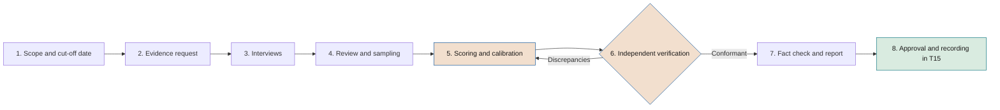

# Maturity model

**Seven dimensions, six levels and an evidence-based questionnaire to diagnose how the company governs its AI**

| | |
|---|---|
| Document | Document 11 · Maturity model |
| Version | 0.1 (working draft) |
| Date | 16-09-2026 |
| Author | Fernando García · SEACHAD |
| Status | Draft for review. Develops decision D10. Sample sizes, weights and reference targets are initial and will be calibrated through practical application. |

<!-- cifras: 7 | maturity dimensions ; 6 | levels, from 0 to 5 ; 84 | questions with required evidence ; 10 | questions that substantiate the declaration of application -->

---

> **Legal notice and disclaimer.** SEVEN-G is a reference methodological framework provided "as is" and for information purposes only. It does not constitute legal, regulatory, financial or professional advice, nor does it guarantee compliance with any law or standard. References to general regulation (such as the EU AI Act, the GDPR, DORA or NIS2), to technical standards and to regulation specific to each sector or jurisdiction may be incomplete, may not apply to a particular case or may become out of date as a result of regulatory changes, interpretations or supervisory positions after their consultation date. **Each organisation that uses SEVEN-G is solely responsible for identifying the regulation that applies to it, verifying that it is current and certifying its own regulatory compliance**, with the appropriate qualified advice. The author and SEACHAD accept no liability for any use made of this content or for any decisions taken on the basis of it. The data, figures, companies and cases in the examples are fictitious or illustrative.

## 1. Purpose and scope

This document defines how to measure a **company's maturity to govern artificial intelligence and obtain verifiable value from it**. It is the instrument of the measurement system (component C) that produces one of the mandatory outputs of stage **C1 · Diagnosis** —"maturity assessment with evidence" (01 §5.1)— and that is repeated in **C5 · Review** to check progress.

The document contains the seven dimensions and the six levels, the rubric and questionnaire for each dimension, the assessment method, the calculation, the structure of the report, the links with the rest of the framework, the maturity targets according to ambition and an illustrative example. The supporting tool is **T15 · Maturity diagnosis** (document 03).

### 1.1 What it measures and what it does not

| The model measures | The model does not measure |
|---|---|
| The organisation's capability —bodies, practices, controls, data, people and measurement— to decide on, build, operate and oversee AI under control. | How much AI the company uses or how advanced its technology is. |
| Whether that capability is in place and working, with observable evidence. | Whether the company is transforming or merely becoming more efficient: that is measured by the transformation index (document 12). |
| The company's progress over time using a consistent method. | Its position relative to other companies. SEVEN-G does not publish market comparisons. |
| The maturity of the company as a whole or of a declared scope. | The quality of a specific initiative: that is decided by the *gates*. |

The model is not a certification. A maturity result does not replace the framework audit (document 38) or attest to regulatory compliance. This document does not constitute legal advice.

### 1.2 Assessment principles

1. **Evidence, not assertion.** A criterion is only met if there is observable and verified evidence (principle 8 in 01 §3).
2. **Cumulative levels.** To be at a level, all the criteria of that level and of the lower levels are met.
3. **Whole levels.** The level of a dimension and the overall level are always expressed as a whole number. Decimals give a false sense of precision; progress towards the next level is reported separately.
4. **The weakest link sets the limit.** A company cannot present high overall maturity if its strategy and governance (D1) or its risk control (D6) are weak.
5. **Independence.** Whoever is accountable for a dimension does not assess it, and no assessment without independent verification is used in C1, C5 or in the declaration of application.
6. **Comparable over time.** Two results are only compared if they were obtained with the same version of the questionnaire and with a verified assessment type.

---

## 2. Model structure

### 2.1 Dimensions

| Code | Dimension | Question it answers | Related spheres and documents |
|---|---|---|---|
| **D1** | **Strategy and governance** | Does the company make decisions on AI with a thesis, bodies, roles and board oversight? | Sphere 09 · documents 13, 30, 31, 60, 62 |
| **D2** | **Value and portfolio** | Does it select, prioritise, control and retire initiatives with a traced lifecycle? | Spheres 01–04 · documents 03, 14, 20, 21 |
| **D3** | **Data and knowledge** | Does it have data and knowledge with an owner, quality, legal basis and lineage in order to use them in AI? | Spheres 05 and 06 · document 51 |
| **D4** | **Technology and operations** | Does it operate AI in production with stability, monitoring, reversibility and known costs? | Sphere 04 · documents 42, 52, 53 |
| **D5** | **People and adoption** | Does it prepare people, achieve actual usage and manage the effect of AI on work? | Sphere 03 · documents 23, 50 |
| **D6** | **Risk, security and compliance** | Does it identify, control and audit the risks, security, third parties and regulation of AI? | Spheres 08 and 09 · documents 32–38 |
| **D7** | **Measurement and evidence** | Does it measure value and cost according to rules, and does its evidence withstand verification? | Documents 12, 40–43, 60 |

### 2.2 Levels

| Level | Name | General description | Typical observable feature |
|---|---|---|---|
| **0** | **Non-existent** | There is no recognisable practice or owner. | Not all the criteria of level 1 are met. |
| **1** | **Initial** | Isolated practices that depend on specific people. | There are identified owners and some written record, without a common method. |
| **2** | **Developing** | The practice is partly defined and applied in some cases or areas. | Approved documents and records started, with incomplete coverage. |
| **3** | **Defined** | The practice is common, approved and applied across the whole assessed scope. | Systematic evidence in all the relevant initiatives or systems. |
| **4** | **Managed** | The practice is measured with indicators, reviewed with data and deviations are acted upon. | Indicator series and decisions recorded for at least **two consecutive quarters**. |
| **5** | **Optimised** | The practice improves continuously using the company's own data. | At least **one complete C5 cycle** with changes decided on the basis of evidence and already applied. |

Level 0 has no criteria of its own. The time requirements of levels 4 and 5 prevent a newly implemented practice from being presented as managed.

### 2.3 Model rules

1. **Accumulation.** The level of a dimension is the highest level for which all the criteria of that level and of all lower levels are met.
2. **Evidence.** Each criterion requires the evidence indicated in the questionnaire. Without verified evidence, the criterion is not met.
3. **Overall level.** It is the weighted average of the levels of the seven dimensions, **rounded down** and **capped at the lower of the D1 and D6 levels plus one**.
4. **Weights.** Equal by default. The company may set others in C2; it must declare them in the report and keep them unchanged between two assessments it wishes to compare. No dimension should weigh less than 10 % or more than 25 %.

---

## 3. Rubrics and questionnaire by dimension

### 3.1 How to read them

- The **rubric** summarises, level by level, the observable criteria and the required evidence.
- The **questionnaire** turns those criteria into verifiable questions. Each dimension has 12 questions: 2 at level 1, 2 at level 2, 4 at level 3, 2 at level 4 and 2 at level 5. If a rubric and its questionnaire differ, **the questionnaire prevails**.
- Each question is answered **Yes**, **Partial** or **No** using the rules in section 4.5. Only questions marked **(if applicable)** allow *Not applicable*, with verified justification.
- Questions marked **(§14)** substantiate a condition of the SEVEN-G declaration of application (01 §14). All of them are at level 3.
- The template (P) and tool (T) codes indicate where the evidence is usually found; the company may provide equivalent evidence from its own systems.

### 3.2 D1 · Strategy and governance

**Scope.** AI thesis, ambition by sphere and risk appetite; corporate and acceptable use policy; bodies (board or board committee, AI Committee, AI Office); initiative roles and segregation of duties; corporate cycle C1–C5; board oversight and follow-up of its recommendations. **Interviewees:** chair or chief executive officer, member of the board or of the board committee, chair of the AI Committee, head of the AI Office, board secretary.

| Level | Observable criteria | Required evidence |
|---|---|---|
| **1** | A member of senior management is accountable in writing for AI. AI has been discussed by the management committee or the board in the last 12 months. | Appointment or resolution; minutes or agenda. |
| **2** | There is a body with a written mandate on AI that meets. There is a strategy or thesis document, even if not approved by the board, and an approved acceptable use policy. | Mandate; minutes; dated and versioned document; approved and communicated policy. |
| **3** | C1 and C2 completed: the board has approved the thesis, the ambition by sphere, the risk appetite and the thresholds. Bodies operating according to the calendar in 01 §5.2. Roles assigned without incompatibilities. | Board minutes; approved thesis (T19); mandates and minutes; role assignment records (P03). |
| **4** | The board has exercised oversight with the dashboard for at least two quarters. The board's recommendations are tracked with an identifier and status. The decision time of the bodies is measured. | Dashboards (T17) and minutes; register of recommendations (T18); agility report. |
| **5** | The thesis has been reviewed in a C5 with evidence and the changes have been applied. The bodies assess their own effectiveness and close their improvement actions. | C5 report; versioned thesis; self-assessment of the bodies with closed plan. |

| Code | Question | Level | Required evidence |
|---|---|---|---|
| D1.01 | Is there a member of senior management with responsibility for the company's AI assigned in writing? | 1 | Appointment, approved organisation chart or management resolution. |
| D1.02 | Has AI been discussed by the management committee or the board in the last 12 months, as recorded in the minutes? | 1 | Minutes or agenda. |
| D1.03 | Is there an AI Committee, or an existing committee with an extended mandate, with a written mandate and at least two meetings held? | 2 | Approved mandate; minutes. |
| D1.04 | Is there a dated and versioned AI strategy or thesis document, and an AI acceptable use policy approved and communicated to staff? | 2 | Document; approved policy; record of the communication. |
| D1.05 | Has the board approved the AI thesis, the ambition level by sphere and the risk appetite on the basis of a C1 diagnosis? **(§14)** | 3 | Board minutes; approved thesis; C1 report. |
| D1.06 | Have the C2 thresholds been approved: Enterprise investment criterion, return horizon, reference time limits by phase and nonconformity time limits? | 3 | Thresholds document with its approval. |
| D1.07 | Have the AI Committee, the AI Office and the board committee been set up with the functions in 01 §8.3, and do they meet according to the calendar in 01 §5.2? **(§14)** | 3 | Mandates; minutes for the last six months. |
| D1.08 | Do all active initiatives have the roles in 01 §8.1 assigned, without any of the incompatibilities in 01 §8.2? **(§14)** | 3 | Sample of P03; check in T01. |
| D1.09 | Does the board or its board committee review the AI dashboard at least quarterly, as recorded in the minutes for two consecutive quarters? | 4 | Dashboards (T17); minutes. |
| D1.10 | Are the board's recommendations tracked with a persistent identifier, owner, deadline, status and evidence, and is the decision time of the bodies measured? | 4 | Register of recommendations (T18); decision time metrics (T01). |
| D1.11 | Has the AI thesis been reviewed in a C5 with the evidence on maturity, transformation index and portfolio, and have the approved changes been applied? | 5 | C5 report; versioned thesis; board minutes. |
| D1.12 | Do the AI Committee and the AI Office assess their own effectiveness at least once a year and close the resulting improvement actions? | 5 | Self-assessment; action plan with closure. |

### 3.3 D2 · Value and portfolio

**Scope.** Initiative register and funnel management; lifecycle with *gates*; prioritisation and ambition balance; stage-based budgeting; value hypothesis and stop criteria; tracking of realised value; stops and retirements. **Interviewees:** AI Committee, AI Office, sponsors and product owners of a sample of initiatives, management control.

| Level | Observable criteria | Required evidence |
|---|---|---|
| **1** | There is a list of AI initiatives with owners. Some initiative has a written business objective before building. | Dated list; proposal or record predating the start. |
| **2** | Initiative register with phase, status and owner covering the known initiatives. There are documented *gate* decisions in some of the initiatives. | Register; *gate* decision records (P29). |
| **3** | All new initiatives are in the register with the traceability in 01 §6.11 and go through the *gates*. Portfolio prioritised with a documented method. Falsifiable hypotheses and stop criteria before investing. | Register with events (T01); P29 predating the spending; portfolio minutes; P07, P08, P09. |
| **4** | Funnel metrics reviewed monthly and portfolio balance quarterly for two quarters. Realised value compared with the hypothesis in all initiatives in production. Stops and retirements carried out according to procedure. | Reports and minutes; P28; retirement register (T22). |
| **5** | Historical probability and weighted value calculated with the company's own data. Entry or prioritisation criteria modified on the basis of stop reasons and cohorts. | Analysis in T01; versioned method; C5 report. |

| Code | Question | Level | Required evidence |
|---|---|---|---|
| D2.01 | Is there a list of ongoing AI initiatives with an identified owner for each one? | 1 | Dated list. |
| D2.02 | Does at least one initiative have a written business objective dated before construction started? | 1 | Dated proposal or record. |
| D2.03 | Does the company maintain an initiative register with phase, status and owner covering all known initiatives? | 2 | Register; cross-check against the inventory (T02). |
| D2.04 | Are there documented *gate* decisions, with decision-maker and outcome, in some of the initiatives of the last 12 months? | 2 | *Gate* decision records (P29). |
| D2.05 | Are all new initiatives registered with phase dates, waiting periods, *gates*, criteria, conditions, tags and stop reasons (01 §6.11)? **(§14)** | 3 | Sample of records with event history in T01. |
| D2.06 | Do all new initiatives go through the lifecycle with their *gates* recorded before consuming the budget for the next phase? **(§14)** | 3 | Sample: P29 dated before the spending. |
| D2.07 | Is the portfolio prioritised with a documented method that uses additional net value per euro and ambition balance, approved by the AI Committee? | 3 | Method (document 14 or equivalent); minutes approving the portfolio. |
| D2.08 | Do all initiatives that pass G2 have a falsifiable hypothesis, baseline, confirmed ambition and stop criteria set before investing? | 3 | Sample of P07, P08 and P09. |
| D2.09 | Does the AI Committee review funnel metrics (stalled initiatives, expired conditions, conversion) monthly and portfolio balance quarterly, with recorded decisions? | 4 | Reports and minutes for two quarters. |
| D2.10 | At each R6, is realised value compared with the hypothesis in all initiatives in production, and are the stops and retirements decided carried out using the procedure in document 14? | 4 | P28; P30; retirement register (T22). |
| D2.11 | Does the company calculate, with its own data, the historical probability of reaching production from each phase and the weighted portfolio value? | 5 | Analysis in T01 with sufficient history. |
| D2.12 | Have the entry or prioritisation criteria been modified on the basis of stop reasons and cohort analysis, with observable improvement? | 5 | Versioned method; cohort analysis. |

### 3.4 D3 · Data and knowledge

**Scope.** Identification and ownership of the data used by AI; quality; legal basis and minimisation; data and model lineage; knowledge sources for generative AI and agents (documents, knowledge bases, indexes); usage rights; critical knowledge that depends on a few people. **Interviewees:** head of data, data protection officer, data owners, technical owners, knowledge management owners.

| Level | Observable criteria | Required evidence |
|---|---|---|
| **1** | The data sources of the AI systems in production are known and there are reference persons for the main ones. | List of sources by system; reference persons. |
| **2** | Register of datasets and knowledge sources used by AI, with an owner. Quality and legal basis reviewed in some of the initiatives. | Register or catalogue; dated reviews. |
| **3** | Formal owner for each dataset. Legal basis, minimisation and impact assessments verified in phase 3. Lineage in all Enterprise initiatives. Knowledge sources with an owner, validity, permissions and rights. | Appointments; P11; P16; register of knowledge sources. |
| **4** | Data quality monitored in production with thresholds, alerts and incidents for two quarters. Delays attributable to data measured. Plan for critical knowledge. | Configuration (P25); incident register; metrics in T01; plan. |
| **5** | Data and knowledge reused across initiatives with measured usage. Data preparation cost and time measured and improving over two cycles. | Reuse register; indicator series (T13). |

| Code | Question | Level | Required evidence |
|---|---|---|---|
| D3.01 | Can the company identify the data sources used by each AI system in production? | 1 | List of sources by system. |
| D3.02 | Is there a reference person for each main data source used by AI? | 1 | List with owners. |
| D3.03 | Is there a register of datasets and knowledge sources used by AI, with an assigned owner? | 2 | Register or catalogue. |
| D3.04 | Have data quality and legal basis been reviewed before building in some of the initiatives of the last 12 months? | 2 | Dated review reports. |
| D3.05 | Does each dataset used by AI in production have a formal owner with responsibilities for quality and access? | 3 | Appointments; data policy. |
| D3.06 | Are the legal basis, minimisation and, where applicable, the data protection impact assessment verified in phase 3 for all personal data? | 3 | Sample of P11 and of assessments. |
| D3.07 | Do all Enterprise initiatives have documented data and model lineage, updated after the latest change? | 3 | Sample of P16. |
| D3.08 | Do the knowledge sources used by generative AI and agents have an owner, a validity date, access permissions consistent with the users and verified usage rights? **(if applicable)** | 3 | Register of sources; permissions configuration; licences or contracts. |
| D3.09 | Is the quality of input data monitored in production with thresholds and alerts, and are incidents recorded and resolved? | 4 | P25; incident register for two quarters. |
| D3.10 | Are waiting periods and stops attributable to data measured, and is there an approved plan for critical knowledge that depends on a few people? | 4 | Metrics in T01; plan with owners. |
| D3.11 | Are prepared datasets or knowledge sources reused across initiatives, with measured usage? | 5 | Reuse register. |
| D3.12 | Are the cost and time of data preparation measured per initiative, with improvement over at least two annual cycles? | 5 | Indicator series (T13). |

### 3.5 D4 · Technology and operations

**Scope.** Environments and platforms; architecture; deployment and change management; monitoring of performance, degradation and operational security; operations manual; rollback and kill switch; continuity review (R6); evaluation of generative AI and agents; activity logs; recurring cost per use case. **Interviewees:** technical and operations owners, architecture, information security, management control or finance (costs).

| Level | Observable criteria | Required evidence |
|---|---|---|
| **1** | Each AI system in production or pilot has a technical owner. Deployments leave a written record. | Inventory (T02); deployment log. |
| **2** | Separate environments with controlled access to production data. Availability and error monitoring. Changes recorded. | Architecture; access policy; configuration; change log. |
| **3** | All systems in production have an operations owner, a manual, performance and degradation monitoring, a tested rollback plan, a kill switch when they take actions and a current R6. Generative AI is evaluated before each change. | P24, P25, P19, P27; R6 dates in T01; evaluation reports. |
| **4** | Operational indicators reviewed monthly and recurring cost per use case known, for two quarters. | Operational reports; cost report (T13). |
| **5** | Common platforms or components reused with a measured reduction in time to production. Periodic resilience tests and lessons from incidents incorporated into standards. | Cohort metrics (03 §3.5); test reports; versioned standards. |

| Code | Question | Level | Required evidence |
|---|---|---|---|
| D4.01 | Does each AI system in production or in pilot have an identified technical owner? | 1 | Inventory (T02). |
| D4.02 | Is there a written record of each deployment to production, with date, version and owner? | 1 | Deployment log. |
| D4.03 | Are the development, testing and production environments of AI systems separated, with controlled access to production data? | 2 | Architecture document; access policy and logs. |
| D4.04 | Are at least the availability and errors of AI systems in production monitored, and are changes recorded? | 2 | Monitoring configuration; change log. |
| D4.05 | Do all systems in production have an operations owner, an operations manual and performance and degradation monitoring with alerts? | 3 | Sample of P24 and P25. |
| D4.06 | Do all systems in production have a rollback plan tested before go-live and, when they act with A2 or A3 autonomy, a tested kill switch? | 3 | Sample of P19 with the test result; T10. |
| D4.07 | Do all initiatives in production have a current continuity review (R6) according to their intensity? **(§14)** | 3 | Date of the latest R6 against its periodicity in T01. |
| D4.08 | Are generative AI systems and agents evaluated with a defined test set before each change of model, instructions or tools, and are their activity logs retained? **(if applicable)** | 3 | Evaluation reports; log retention policy. |
| D4.09 | Are operational indicators (availability, degradation, incidents, time to restore) reviewed monthly, with recorded actions? | 4 | Reports for two quarters. |
| D4.10 | Is the actual recurring cost of each use case in production known, with allocation of licences, model consumption, compute and people? | 4 | Cost report (T13) for two quarters. |
| D4.11 | Are common platforms or components reused, and has time to production been reduced in a measured way? | 5 | Time to production by cohort (T01). |
| D4.12 | Are periodic resilience or rollback tests carried out in production, and are lessons from incidents incorporated into technical standards? | 5 | Test reports; versioned standards. |

### 3.6 D5 · People and adoption

**Scope.** AI literacy; role-based training; adoption plans; actual usage; released capacity realised or reassigned; communication, information and consultation of employee representatives; changes to roles and structures; internal capabilities and dependence on external parties. **Interviewees:** human resources, training managers, product owners, managers of user areas, employee representatives where appropriate.

Article 4 of the EU AI Act requires providers and deployers to take measures to ensure a sufficient level of AI literacy among their staff; it has applied since 2 February 2025. At the date of consultation (September 2026) there are proposed amendments to the Act going through the legislative process, so the validity of this and the other regulatory references must be verified.

| Level | Observable criteria | Required evidence |
|---|---|---|
| **1** | There have been training or awareness activities on AI. Some initiative that changes work involves the user area. | Attendance records; minutes or initiative charter. |
| **2** | Approved literacy programme. Adoption plans in some of the initiatives. | Programme; P20. |
| **3** | AI literacy appropriate to their function for all staff who use or oversee AI. Training for SEVEN-G roles. Adoption plan in all Augment and Transform initiatives. Released capacity recorded separately. Information and consultation where required. | Training register by group; P20 predating G4; T12 or T20; minutes. |
| **4** | Actual adoption and use of released capacity measured for two quarters. | Usage indicators; T20 reports. |
| **5** | Roles or structures redesigned with oversight and subsequent evaluation. Dependence on external parties for critical capabilities reduced in a measured way. | Organisation charts and job descriptions; evaluation; indicator series. |

| Code | Question | Level | Required evidence |
|---|---|---|---|
| D5.01 | Has any AI training or awareness activity been carried out in the last 12 months? | 1 | Attendance records. |
| D5.02 | Does the user area or human resources take part in any initiative that changes people's work? | 1 | Minutes; initiative charter (P01). |
| D5.03 | Is there an approved AI literacy programme, with target audiences, content and schedule? | 2 | Approved programme. |
| D5.04 | Do some of the initiatives have an adoption plan with training and communication? | 2 | P20. |
| D5.05 | Have all staff who use or oversee AI systems received literacy training appropriate to their function, with a record? | 3 | Training register; coverage by group. |
| D5.06 | Have people in SEVEN-G roles (sponsors, risk owners, AI auditors, committee members) received training on their responsibilities? | 3 | Training register by role. |
| D5.07 | Do all Augment and Transform initiatives have an adoption and people plan approved before G4? | 3 | Sample of dated P20. |
| D5.08 | Is released capacity recorded separately from savings, and are employee representatives informed and consulted where regulations or agreements require it? | 3 | Records in T12 or T20; minutes or communications. |
| D5.09 | Is actual adoption (active users and usage against plan) measured for all initiatives in production? | 4 | Indicators for two quarters. |
| D5.10 | Is it tracked quarterly how much released capacity has been realised as lower cost or reassigned, with an explicit destination? | 4 | T20 or T12 reports. |
| D5.11 | Have roles or structures been redesigned as a result of AI initiatives, with defined oversight and subsequent evaluation? | 5 | Organisation charts; job descriptions; evaluation. |
| D5.12 | Has dependence on external suppliers been reduced in a measured way for the AI capabilities that the thesis defines as internal? | 5 | Indicator series; capability plan. |

### 3.7 D6 · Risk, security and compliance

**Scope.** Inventory and regulatory classification; prohibited practices; impact assessments; risk management (document 33); AI and agent security (35); third parties (36); nonconformities and incidents (37); audit (38); unauthorised use; second and third line. **Interviewees:** AI Risk Owner, compliance, legal counsel, information security, data protection officer, internal audit, procurement or supplier management.

| Level | Observable criteria | Required evidence |
|---|---|---|
| **1** | Legal counsel, compliance or security are consulted before using AI in some cases. Some AI risk appears in the risk register. | Dated formal reports or consultations; corporate risk register. |
| **2** | Inventory started that includes in-house systems, third-party systems and corporate use. AI Risk Owner independent of those who build. Risks assessed in some of the initiatives. | Inventory (T02); appointment; risk matrices. |
| **3** | Complete inventory with classification, intensity and owner, and prohibited practices ruled out. Matrix and impact assessments in all initiatives from phase 3. Nonconformity process in 01 §12. Suppliers assessed and agent controls. | T02, P05, P11, P12; T08 register; P14, P18, T09, T10. |
| **4** | Risk concentration reviewed quarterly and control indicators at the board committee for two quarters. Framework audit by the third line in the last 12 months. Periodic specific security testing. | Minutes; reports; audit report; test reports. |
| **5** | Effectiveness of key controls tested with drills. Recurrence of nonconformities reduced. New obligations incorporated before their application date. | Drill reports; series by cause; versioned regulatory mapping. |

| Code | Question | Level | Required evidence |
|---|---|---|---|
| D6.01 | Are legal counsel, compliance or security consulted before AI systems are put into use, at least in some cases? | 1 | Dated formal reports or consultations. |
| D6.02 | Does any AI risk appear in the company's risk register? | 1 | Corporate risk register. |
| D6.03 | Has an AI system inventory been started that includes in-house systems, third-party systems and corporate use of general-purpose AI? | 2 | Inventory (T02). |
| D6.04 | Has an AI Risk Owner been appointed, independent of the teams that build, and are risks assessed in some of the initiatives? | 2 | Appointment; risk matrices. |
| D6.05 | Does the inventory include all AI systems with regulatory classification, intensity and owner, and has the use of prohibited practices been ruled out in a documented way? **(§14)** | 3 | T02; P05; P11; statement of completeness signed by each area. |
| D6.06 | Do all initiatives in phase 3 or later have a risk matrix and register using the scale in document 33, and the applicable impact assessments? | 3 | Sample of P12 and P11. |
| D6.07 | Are nonconformities managed using the process in 01 §12: classification, containment, root cause, corrective action, closure and time limits? **(§14)** | 3 | Register (T08); sample of case files. |
| D6.08 | Are AI suppliers assessed with levels N1–N3, and do agents with A2 or A3 autonomy have their own identity, least privilege, a kill switch and prompt injection testing before production? **(if applicable, for the agents part)** | 3 | P14; T09; P18; T10. |
| D6.09 | Does the AI Committee review the portfolio's risk concentration quarterly, and does the board committee receive indicators on nonconformities, S1–S4 incidents and detected unauthorised use? | 4 | Minutes and reports for two quarters. |
| D6.10 | Has the third line or an external auditor audited compliance with the framework in the last 12 months, and is AI-specific security testing (prompt injection, information leakage, permission abuse) carried out periodically? | 4 | Audit report; test reports. |
| D6.11 | Has the effectiveness of key controls been tested with tests or drills, including a serious incident, and has the recurrence of nonconformities by cause been reduced? | 5 | Drill reports; T08 series. |
| D6.12 | Is the regulatory mapping reviewed at least every six months, and have controls been adapted before the application date of new obligations? | 5 | Versioned mapping (document 34); dated plans. |

### 3.8 D7 · Measurement and evidence

**Scope.** Value measurement rules (00 §6 and document 40); validated, declared and estimated statuses; baseline and attribution; full costs; benefits realisation; board dashboard; transformation index; quality and traceability of evidence; decision agility. **Interviewees:** management control, AI Office, AI Auditor, product owners, board secretary.

| Level | Observable criteria | Required evidence |
|---|---|---|
| **1** | Some initiative declares expected or obtained benefits in writing. There is an identifiable figure for the cost of AI. | Proposals or reports; budget. |
| **2** | Some of the initiatives have a measured baseline and value with a formula. Management receives a periodic AI report. | P08, P09; reports for two periods. |
| **3** | The measurement rules are applied to all amounts. The board receives the dashboard with the proportion of validated value. Evidence is traceable and verified. The transformation index has been calculated. | T12; dashboard (T17) and minutes; sample in T03; T14 result. |
| **4** | Independent validation of value in each period, agility measured by risk and ambition, and measurement audited by sampling, for two quarters. | Validation reports; P28; T01 metrics; audit report. |
| **5** | Thresholds recalibrated with the company's own data. Value and cost series from two cycles used in financial planning. | C5 minutes; versioned parameters; budget. |

| Code | Question | Level | Required evidence |
|---|---|---|---|
| D7.01 | Does any initiative declare expected or obtained benefits in writing? | 1 | Proposal or report. |
| D7.02 | Is there an identifiable figure for the company's cost of or investment in AI? | 1 | Budget or report. |
| D7.03 | Do some of the initiatives have a measured baseline and value expressed with a formula? | 2 | P09; P08. |
| D7.04 | Does management receive a periodic report on AI with initiatives, costs and results? | 2 | Reports for two periods. |
| D7.05 | Do all amounts have a formula, incremental nature and status, with efficiencies, return and recurring cost separated and released capacity reported separately? **(§14)** | 3 | Sample in T12; report to the board. |
| D7.06 | Does the company report to the board with the oversight dashboard, showing the proportion of validated value and missing data as "no data"? **(§14)** | 3 | Dashboard (T17); minutes. |
| D7.07 | Does *gate* evidence have an author, date, version and verification, and does the verifier check that it was not prepared after the fact? | 3 | Sample in T03; verifier reports. |
| D7.08 | Has the transformation index been calculated with its eight signals in the latest C1 or C5? | 3 | T14 result. |
| D7.09 | Does management control or another independent function validate the declared value in each reporting period, and is realisation tracked against the hypothesis? | 4 | Validation reports for two quarters; P28. |
| D7.10 | Is the time from idea to approval and to production measured by risk and ambition level, and is the measurement audited by sampling? | 4 | T01 metrics; audit report. |
| D7.11 | Have the transformation index thresholds or the reference time limits been recalibrated with the company's own data, with approval? | 5 | C5 minutes; versioned parameters. |
| D7.12 | Are value and cost series from at least two annual cycles used in financial and budget planning? | 5 | Budget; planning document. |

---

## 4. Assessment method

### 4.1 Assessment types

| Type | Who carries it out | Valid use |
|---|---|---|
| **Self-assessment** | Any area or the AI Office, without verification. | Indicative and preparatory. It is labelled "unverified self-assessment" and is **not** used in C1, C5, the board dashboard or the declaration of application. |
| **Verified assessment** | Assessment team of the AI Office, with independent verification (section 4.2). | Minimum required in C1 and C5. |
| **Independent assessment** | Third line or external assessor with no involvement in the implementation. | It should be carried out at least every two years in companies with an Enterprise implementation scope (document 90) and before publicly declaring that SEVEN-G is applied. |

### 4.2 Roles and independence

| Role | Who | Responsibility |
|---|---|---|
| **Promoter** | Chair of the AI Committee | Approves the scope, cut-off date and team; guarantees access to information. |
| **Lead assessor** | Head of the AI Office or external assessor | Leads the assessment, proposes the answers and drafts the report. |
| **Assessment team** | At least two people | Conducts interviews and reviews evidence. Nobody assesses a dimension whose practices they lead. |
| **Independent verifier** | Internal audit, AI Auditor or third party | Reviews the sample of answers in section 4.6 and may modify answers. |
| **Approving body** | AI Committee; presented to the board | Approves the report. It does not modify answers: it may only request a new verification. |

If the AI Office leads D1, D2 or D7 practices, those dimensions are assessed by another member of the team or by a third party. Self-assessment without verification does not produce a valid level.

### 4.3 Process

<!-- grafico: Maturity assessment process | No answer reaches the report without verified evidence -->

The **cut-off date** delimits the admissible evidence: only evidence that exists and is applied on that date counts. Indicative duration: three to four weeks for a Lite scope and six to eight for Enterprise.

### 4.4 Interviews

- Each dimension is covered by at least two interviews with people from different functions (section 3).
- 45–60 minute script: role and decisions taken; actual practice in the last 12 months; where the evidence is; cases in which the practice was not applied; improvements under way.
- **An interview is an indication, not evidence.** It serves to locate evidence and corroborate the practice. A "Yes" requires triangulation: an approved document, a record or system showing its application and, where appropriate, testimony from whoever applies it.
- Answers are anonymised by role in the report.

### 4.5 Valid evidence and answers

Evidence is valid if it **exists**, is **traceable** (author, date and version), is **approved** by whoever is responsible, is **current** (in force or from the last 12 months), shows **application** and **predates the cut-off date**. Presentations without approval, drafts (except where requested), verbal statements and documents prepared for the assessment are not evidence: these are noted as actions under way.

| Answer | When |
|---|---|
| **Yes** | The evidence is valid and, if the question refers to a practice, the sample complies in full. |
| **Partial** | There is valid evidence but coverage is incomplete: the sample complies at 80 % or more, or a non-essential element is missing. It counts as not met for the level. |
| **No** | There is no valid evidence or the sample complies below 80 %. The report distinguishes "No, no evidence" from "No, contrary evidence". |
| **Not applicable** | Only for questions marked **(if applicable)**, with verified justification. It counts as met. |

### 4.6 Evidence sampling

Questions about practices that must be applied to "all" initiatives or systems are verified on a sample from the register (T01) or the inventory (T02):

| Population in scope | Minimum sample size |
|---|---|
| 1–5 | All |
| 6–20 | 5 |
| 21–60 | 8 |
| More than 60 | 12 |

The sample is **stratified**: it includes, where they exist, at least one Enterprise initiative, one in production, one Augment or Transform initiative, one third-party initiative and one generative AI or agent initiative. It is selected by the assessment team, not by the assessed area.

The independent verifier reviews **all** "Yes" answers in D1 and D6 (because of their effect on the overall level), all **(§14)** questions and at least 25 % of the other "Yes" answers, chosen by the verifier.

### 4.7 Calibration, fact check and approval

1. **Calibration.** In a joint session, the team reviews doubtful answers using the same criterion for all dimensions.
2. **Fact check.** The owners of each dimension may correct factual errors and provide evidence predating the cut-off date. They do not negotiate answers.
3. **Approval.** The AI Committee approves the report and presents it to the board. The result, the answers and the links to evidence are recorded in T15.

---

## 5. Calculation

### 5.1 Level by dimension

**Dimension level = N**, where N is the highest level for which all questions at levels 1 to N are "Yes" or "Not applicable". If a level 1 question fails, the level is 0. Questions met at higher levels do not raise the level and are reported as "criteria met in advance".

### 5.2 Progress towards the next level

**Progress = (number of Yes + 0.5 × number of Partial) ÷ applicable questions at level N + 1.** It is expressed as a percentage, never as a decimal of the level. It is accompanied by the **blocking criteria**: questions at levels 1 to N + 1 that are not "Yes".

### 5.3 Overall level

1. Weighted average = Σ (dimension weight × dimension level), calculated to two decimal places.
2. It is rounded down to the whole number.
3. Cap = min (D1 level, D6 level) + 1.
4. **Overall level = min (average rounded down, cap).** The report states whether the cap has been applied.

---

## 6. Maturity report

| Section | Content |
|---|---|
| **1. Summary for the board** | Overall level and level by dimension; whether the D1 or D6 cap has been applied; three key messages; status of the declaration of application. One page maximum. |
| **2. Scope and method** | Scope, assessment type, cut-off date, questionnaire version, team, verifier, weights, interviews by role, sample sizes and limitations. |
| **3. Results by dimension** | Level, progress, blocking criteria, criteria met in advance, strengths and gaps with reference to the evidence. |
| **4. Cross-reading** | Relationship with the transformation index (section 7.2) and with the **(§14)** questions. |
| **5. Comparison** | Changes compared with the previous verified assessment, only if the questionnaire version is the same or there is a correspondence table. |
| **6. Targets and improvement plan** | Target by dimension set in C2; actions with owner, deadline and closure criterion. Actions that the board asks to be tracked are added to the register of recommendations (T18). |
| **7. Annexes** | Answers with evidence, samples, interviews by role and verifier adjustments. |

---

## 7. Links with the rest of the framework

### 7.1 With C1 and C5

In **C1**, the verified assessment sets the baseline and feeds the thesis, the ambition and the risk appetite of C2. In **C5**, it is repeated with the same questionnaire version, compared with the baseline, and a check is made as to whether the maturity targets set in C2 have been achieved. Between C1 and C5, the AI Office may update answers in T15 as a self-assessment, with no level value.

### 7.2 With the transformation index (document 12)

Maturity measures the **capability** to govern and capture value; the index measures **what type of value** is obtained. They are independent and are read together:

| Situation | Reading |
|---|---|
| Maturity 3 or higher and an efficiency at scale profile | A solid, well-governed result, which is not transformation. |
| Transformation under way profile with D7 below 2 | The signals are not reliable. The index should be presented with a low-reliability warning. |
| Transform bets with D1 or D6 below 2 | Risk of uncontrolled transformation: it is escalated to the board. |
| High maturity with a scattered exploration profile | Unused capability: the thesis and the portfolio are reviewed. |

### 7.3 With the declaration of application (01 §14)

The ten **(§14)** questions substantiate the seven conditions in 01 §14. A company may declare that it applies SEVEN-G when **all of them are "Yes" in a verified assessment** and the initiatives that predate the framework are being regularised within the time limit approved in C2. As all of them are at level 3, **a company with a verified level 3 in D1, D2, D4, D6 and D7 meets the conditions**; the declaration is nevertheless based on the questions and not on the overall level.

### 7.4 With the dashboard and the bodies

The overall level and the level by dimension are published in the board dashboard (T17) after each C1 or C5, with the assessment type and the cut-off date. The AI Committee reviews progress on the improvement actions quarterly.

---

## 8. Maturity targets by ambition

The company sets its maturity targets in C2. Level 5 is not a default target: the requirement must be proportionate to ambition and risk. Initial references, to be calibrated:

| Company situation (C2) | 12-month reference target | 24-month reference target |
|---|---|---|
| Optimise predominates | Level 2 in all dimensions; level 3 in D2 and D7. | Level 3 in D1, D2, D4, D6 and D7. |
| Significant weight of Augment | In addition, level 3 in D5. | In addition, level 3 in D3 and level 4 in D5. |
| Transform bets | Level 3 in D1, D2, D6 and D7 before scaling a bet at G7. | Level 4 in D1, D2 and D7. |
| Enterprise scope or regulated sector | Level 3 in D6. | Level 4 in D6. |
| Agents with A2 or A3 autonomy in production | Level 3 in D4 and D6 before the first go-live. | Level 4 in D4 and D6. |

The board should not approve Transform bets at G2 with D1 or D6 below 2 unless there is an explicit improvement condition, deadline and owner.

---

## 9. Illustrative example

*Illustrative data. Fictitious services company, Enterprise scope, verified assessment with equal weights.*

| Dimension | Level | Progress to the next | Main blocking criterion |
|---|---|---|---|
| D1 · Strategy and governance | 3 | 25 % | D1.09: the dashboard has only been reviewed in one quarter. |
| D2 · Value and portfolio | 3 | 50 % | D2.10: two initiatives in production without comparison with their hypothesis. |
| D3 · Data and knowledge | 3 | 0 % | D3.09: no quality monitoring in production. |
| D4 · Technology and operations | 4 | 25 % | D4.11: no measurement by cohort. |
| D5 · People and adoption | 3 | 50 % | D5.10: released capacity has no recorded destination. |
| D6 · Risk, security and compliance | 1 | 75 % | D6.03 (Partial): the inventory does not include third parties or corporate use. |
| D7 · Measurement and evidence | 4 | 0 % | D7.11: no recalibration with the company's own data. |

**Calculation.** Average = (3 + 3 + 3 + 4 + 3 + 1 + 4) ÷ 7 = 3.00 → 3. Cap = min (3, 1) + 1 = 2. **Overall level = 2**, with the cap applied.

**Reading.** The company has good technical and measurement capability, and has organised its portfolio without building risk control. It cannot declare that it applies SEVEN-G: D6.05 and D6.07 are "No". Proposed target for C2: level 3 in D6 within 12 months, which would raise the overall level to 3.

---

## 10. Associated tools and templates

| Code | Use in this document |
|---|---|
| **T15 · Maturity diagnosis** | Questionnaire in section 3, links to evidence, samples, verifier adjustments, calculation in section 5, report in section 6 and comparison between assessments. Records assessment type, cut-off date, questionnaire version and weights. Proposal for the data model in 03 §4: entities *Maturity assessment* and *Answer*. |
| T01, T02, T03, T08, T12 | Sources of evidence and samples. |
| T14 | Cross-reading with the transformation index. |
| T17, T18 | Publication of the result and tracking of the actions requested by the board. |
| P03, P05, P07–P09, P11, P12, P14, P16, P18–P20, P24, P25, P28–P30 | Usual evidence. The model has no template of its own in block H: the report is generated by T15. |

---

## 11. Related documents

| Document | Relationship |
|---|---|
| **00 · What SEVEN-G is** | Maturity with observable evidence (§3.3 and §4.5). |
| **01 · Foundational methodology** | C1 and C5 (§5), roles (§8), nonconformities (§12) and declaration of application (§14). |
| **03 · Tools and initiative register** | T15 and sources of evidence. |
| **12 · Transformation index** | Cross-reading. |
| **13 · AI thesis and risk appetite** | Maturity targets and weights. |
| **14 · Portfolio management** | Prioritisation method and retirements (D2). |
| **38 · AI audit framework** | Independent assessment. |
| **60 · Board pack** | Presentation of the result. |
| **90 · Implementation guide** | Use of the model in the first month. |

---

## 12. Version control

| Version | Date | Changes |
|---|---|---|
| 0.1 | 16-09-2026 | First version. Confirms the seven dimensions and the six levels (D10); defines rubrics, an 84-question questionnaire, assessment types, sampling, calculation with a cap based on D1 and D6, report, links with the transformation index and with 01 §14, and reference targets by ambition. |
