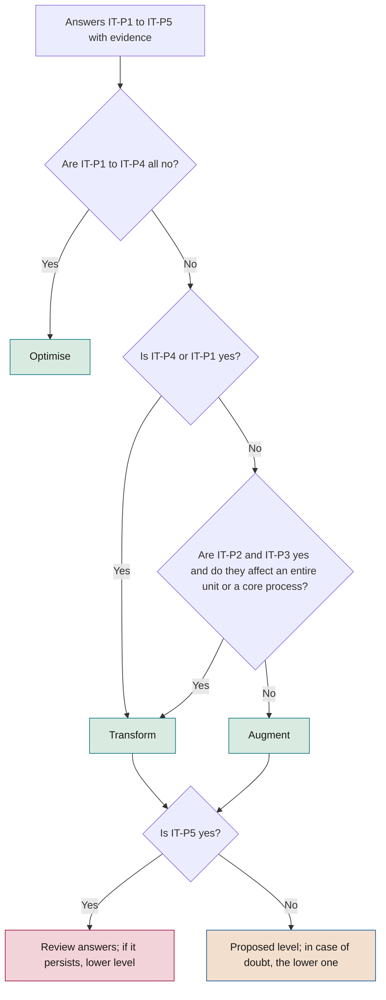
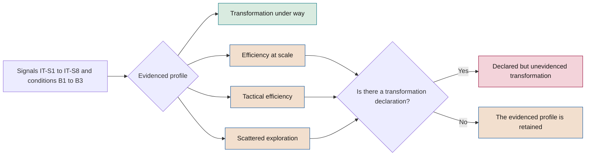

# Transformation index

**How to know, with evidence, whether an initiative and a company are being transformed by AI or are merely becoming more efficient**

| | |
|---|---|
| Document | Document 12 · Transformation index |
| Version | 0.1 (working draft) |
| Date | 16-09-2026 |
| Author | Fernando García · SEACHAD |
| Status | Draft for review. The numerical thresholds are initial and must be calibrated through practical application. |

<!-- cifras: 5 | classification questions ; 8 | observable signals ; 0–3 | score per signal ; 5 | company profiles -->

---

> **Legal notice and disclaimer.** SEVEN-G is a reference methodological framework provided "as is" and for information purposes only. It does not constitute legal, regulatory, financial or professional advice, nor does it guarantee compliance with any law or standard. References to general regulation (such as the EU AI Act, the GDPR, DORA or NIS2), to technical standards and to regulation specific to each sector or jurisdiction may be incomplete, may not apply to a particular case or may become out of date as a result of regulatory changes, interpretations or supervisory positions after their consultation date. **Each organisation that uses SEVEN-G is solely responsible for identifying the regulation that applies to it, verifying that it is current and certifying its own regulatory compliance**, with the appropriate qualified advice. The author and SEACHAD accept no liability for any use made of this content or for any decisions taken on the basis of it. The data, figures, companies and cases in the examples are fictitious or illustrative.

## 1. Purpose and scope

This document develops section 5 of document 00. It defines two connected instruments:

1. **The ambition classification of each initiative** (Optimise, Augment or Transform): five questions, decision rules, treatment of borderline cases, owners and the cycle of proposed, confirmed and actual ambition.
2. **The company transformation index**: eight signals with formula, data source and a score from 0 to 3; baseline conditions; rules for assigning one of the five profiles; treatment of "no data"; frequency; calibration; a complete example and limitations.

It applies in phases 1, 2 and 7 of the lifecycle and in stages C1, C4 and C5 of the corporate cycle. The associated tools are the ambition classifier (T05) and the index calculator (T14); the evidence for the classification is documented with template P07.

All the numerical thresholds in this document are **initial and marked "to be calibrated"**. They do not come from market studies: they are reasonable starting points that each company reviews in C5 with its own data (section 8).

---

## 2. Principle

Efficiency and transformation **are not distinguished by technology**, but by **what changes in the business and where the value appears**. A generative AI agent that drafts responses faster is optimisation; a classical statistical model that makes it possible to launch a service with personalised pricing may be transformation.

The index is not a value judgement. **Efficiency is a legitimate outcome**, and many companies should start with it in order to fund their later bets. What SEVEN-G requires is that the choice be conscious, measured and made by the appropriate person (principle 9 of document 01). Above all, the index serves to detect one specific situation: **declared transformation that the signals do not confirm**.

---

## 3. Ambition classification of an initiative

### 3.1 The five questions

Each question is answered **yes** or **no**, with a brief justification and the available evidence. A yes answer without evidence is treated as **no** for classification purposes.

| # | Question | What counts as yes | What does not count as yes | Points to |
|---|---|---|---|---|
| **IT-P1** | Does the value proposition received by the customer or end user change? | The customer receives something different: a new service, a benefit that did not exist before, a different mode of relationship or a price constructed in a different way. | The same service, faster, cheaper or with fewer errors. | Transform |
| **IT-P2** | Is the process redesigned end to end, and not just a task within the process? | The steps, decision points and handovers of the entire process change, from input to outcome. | One or more steps are automated or accelerated while the process design is maintained. | Augment or Transform |
| **IT-P3** | Do roles, the organisational structure or who makes which decisions change? | Jobs or teams are redesigned, or decisions previously made by people are made by systems (A2 or A3) with defined oversight, or people take on tasks they could not do before. | The number of people doing the same thing is reduced; a tool is delivered without changing the content of the job. | Augment or Transform |
| **IT-P4** | Does it generate revenue, services or markets that did not exist? | Revenue or customers coming from an offering, channel or market that would not exist without AI. | More sales of the existing offering through better conversion or retention. | Transform |
| **IT-P5** | Could it be retired without affecting the business model, simply reverting to the previous cost? | If it is switched off, the company carries on doing the same thing at the previous cost or time. | If it is switched off, an offering, a capability of people or a way of organising is lost. | Optimise |

### 3.2 Decision rules

The rules are applied **in order**. The first one that is met determines the level, except for the cross-check rules (6 to 10), which always apply.

| Rule | Condition | Result |
|---|---|---|
| **1 · Optimise by default** | IT-P1, IT-P2, IT-P3 and IT-P4 are **no**. | **Optimise**, regardless of how the initiative has been presented. |
| **2 · New revenue** | IT-P4 is **yes**. | **Transform**. |
| **3 · New value proposition** | IT-P1 is **yes**. | **Transform**. |
| **4 · New operating model** | IT-P2 and IT-P3 are **yes** and the change affects an entire organisational unit or a core business process (not a partial support process). | **Transform**. |
| **5 · Augmentation** | IT-P2 or IT-P3 is **yes** and rule 4 is not met. | **Augment**. |
| **6 · Cross-check with IT-P5** | The result is Augment or Transform and IT-P5 is **yes**. | Inconsistency: the answers are reviewed. If it persists, the next lower level is assigned and the reason is recorded. |
| **7 · Dependency in Optimise** | The result is Optimise and IT-P5 is **no**. | The level does not change. It is checked whether the initiative supports a critical function (Enterprise criterion in document 01, section 9.2). |
| **8 · Prudence in case of doubt** | After applying the rules, reasonable doubt persists between two levels. | The **lower level** is assigned. Whoever proposes the higher level provides the evidence to resolve the doubt. The doubt **does not lower the controls**: if it affects an Enterprise criterion, Enterprise applies. |
| **9 · Mixed initiatives** | The initiative has components at different levels. | It is split into separate initiatives or classified according to the component that accounts for more than half of the investment. Levels are not averaged. |
| **10 · Irrelevance of form** | — | The level is not influenced by the technology (generative AI, agents), the amount of investment, the technical novelty or the name of the programme. |

<!-- grafico: Ambition classification of an initiative | The rules are applied in order and cross-checked against question 5 -->

### 3.3 Borderline cases

*Generic, illustrative examples.*

| Case | Classification | Reasoning |
|---|---|---|
| Generative AI assistant that drafts responses for the customer service team | **Optimise** | Same service, same role; saves time (IT-P1–IT-P4 no). |
| Copilot that enables analysts to review more complex transactions that were previously referred to specialists | **Augment** | The content of the job changes (IT-P3 yes); the business is the same. |
| Licences for an AI-enabled productivity suite for all employees | **Optimise**, unless a change of role is demonstrated | Without an adoption plan or job redesign, IT-P3 is no. |
| Agent-based automation of an entire back-office process, with a headcount reduction and the same remaining jobs | **Optimise** | Reducing the number of people doing the same thing is not a change of role; if the process is redesigned (IT-P2 yes) but roles do not change, it would be **Augment**. |
| Redesign of the planning function: allocation decisions move to an A2 system and planners oversee exceptions | **Transform** (rule 4) | IT-P2 and IT-P3 yes across an entire unit. If it only affects part of planning, **Augment**. |
| AI-driven dynamic pricing for the existing offering | **Augment** or **Transform** | If the customer receives a new form of pricing (IT-P1 yes), Transform; if rates are merely adjusted within the current model, Augment (IT-P3: the decision moves to a system). |
| Paid service for customers based on a proprietary model | **Transform** (rule 2) | Revenue that did not exist (IT-P4 yes). |
| Common data platform for several initiatives | **Optimise** by default | It is classified by its own effect. It does not inherit the ambition of the initiatives it enables; its contribution is declared as a dependency. |
| Exploratory pilot of a new service idea | According to the hypothesis at scale | It is classified by what would change if it succeeded; the actual ambition is assessed at G7. |
| AI system for monitoring regulatory obligations (primary sphere 08) | **Optimise** as a general rule | It is classified like any other; its level does not qualify sphere 08 (document 10, section 4.2). |

### 3.4 Proposed, confirmed and actual ambition

| Status | When | What it represents | Evidence |
|---|---|---|---|
| **Proposed** | Phase 1 | Level proposed by the team using the five questions on the opportunity. | P07 with answers and justification. |
| **Confirmed** | Phase 2 (G2) | Level verified against the value hypothesis: metrics, baseline and type of expected value consistent with the level. | Updated P07, P08. |
| **Actual** | Phase 7 (G7) and, where applicable, R6 | Level demonstrated by the evidence in production. | P07 with evidence of results, P28, P30. |

Criteria for recording the **actual ambition** (consistent with the G7 criteria in document 01, section 7.6):

| Actual ambition | Minimum evidence |
|---|---|
| **Transform** | Validated return attributable to the initiative, or a verified change in the offering or the operating model (IT-P1, IT-P4 or rule 4 confirmed by facts). |
| **Augment** | Effective adoption equal to or above the target in the hypothesis, measured performance improvement and verified change of role or reassigned capacity. |
| **Optimise** | Any other case with measured value. |

If the initiative is **stopped before G5**, no actual ambition is recorded: the confirmed ambition is retained and the stop counts in signal 7.

### 3.5 Who classifies, confirms and reviews

| Moment | Proposes or records | Verifies | Decides | Remarks |
|---|---|---|---|---|
| **Phase 1 · Proposal** | AI Product Owner | AI Office (consistency of answers) | Sponsor, at G1 | The event is recorded in T01. |
| **Phase 2 · Confirmation (Lite)** | AI Product Owner | AI Office | Sponsor, at G2 | If the confirmed level is Transform, the intensity becomes Enterprise. |
| **Phase 2 · Confirmation (Enterprise)** | AI Product Owner | AI Auditor | AI Committee, at G2 | Transform also requires board approval. |
| **R6 · Continuity review** | AI Product Owner | AI Office or AI Auditor | R6 body | If there are indications that the actual level differs from the confirmed level, G7 is brought forward. |
| **Phase 7 · Actual ambition** | AI Product Owner, with data from T12 | AI Office (Lite) or AI Auditor (Enterprise) | G7 body | Scaling an initiative with an actual ambition of Transform requires board approval. |

No one verifies or decides on the classification of their own initiative (document 01, section 7.4).

### 3.6 What to do if the actual ambition differs from the declared ambition

| Situation | Action | Owner |
|---|---|---|
| **Actual lower than confirmed** | 1) Record the change as an event with its reason. 2) Recalculate the heat map and the index. 3) Analyse the cause: initial overstatement, incomplete execution or change of scope. 4) At G7, choose between **Iterate** to reach the confirmed level, with a new time limit and investment cap, or **accept the actual level** and assess continuity against the criteria for that level (for example, materialised savings if it moves to Optimise). 5) Review whether Enterprise intensity is still justified by another criterion. 6) Record the lessons learned. | G7 body; if the confirmed ambition was Transform, the board is informed at the next C4 session. |
| **Actual higher than confirmed** | It is treated as a new classification: the criteria and approvals for the new level are applied before scaling. If it reaches Transform, board approval is required and Enterprise applies. | G7 body; the board if it reaches Transform. |
| **Operating as Transform without approval** | If the initiative has already introduced changes typical of Transform without board approval, a **major nonconformity** is raised and regularised within the time limit approved in C2. | AI Committee. |
| **Classification without answers or without evidence** | **Minor nonconformity**, which must be corrected before the next *gate*. | AI Office. |
| **Classification modified to circumvent a control or an approval** | **Major nonconformity**. | AI Committee. |

The difference between confirmed and actual ambition **is not in itself a nonconformity**: bets may not pay off. What is controlled is how often this happens:

**Ambition overstatement rate** = initiatives with actual ambition lower than confirmed ÷ initiatives with recorded actual ambition × 100, over the last 24 months.

| Value (to be calibrated) | Action |
|---|---|
| 30% or more across the portfolio as a whole | Alert to the AI Committee and review of the quality of classification in phase 2. |
| 50% or more among initiatives confirmed as Transform | The board is informed and it is taken into account when reading the profile (section 5.3). |

---

## 4. Company transformation index

### 4.1 Structure

The index is made up of **eight** observable **signals**. Each signal is scored from **0 to 3**:

| Score | General meaning |
|---|---|
| **0** | No data, or an exploration situation (there is not enough portfolio, production or recording to measure). |
| **1** | Efficiency reading. |
| **2** | Intermediate reading. |
| **3** | Transformation reading. |

The **sum** (0 to 24) is shown for reference, but **the profile is not assigned by the sum**; it is assigned with the rules in section 5, which combine specific signals and baseline conditions. A measured value that turns out to be zero (for example, 0% of enabled revenue) scores **1**, not 0: it has been measured and its reading is one of efficiency.

### 4.2 Scope and common calculation rules

| Aspect | Rule |
|---|---|
| **Initiatives included** | All those in the initiative register (T01) whose primary sphere is 01 to 07. Those with primary sphere 08 or 09 are excluded from signals 1, 2 and 7 and reported separately as investment in governance and compliance enablement (document 10, section 4.2). |
| **Corporate use of general-purpose AI** | Its cost counts in signal 1 as **Optimise**, unless it forms part of an initiative with a higher confirmed ambition and an approved adoption plan. |
| **Ambition level used** | Actual if it exists; otherwise, confirmed. Initiatives with only a proposed ambition are counted as **unclassified**. |
| **Window** | Rolling twelve months up to the cut-off date, except for signal 7 (twenty-four months). |
| **Status of amounts** | The value signals (2, 3 and 6) use only **validated** amounts. |
| **Currency and cost** | "Portfolio cost" = build investment executed in the window + recurring cost for the window, according to the categories in document 42. |

### 4.3 Baseline conditions

Three conditions that are not scored but are required by the profiles:

| Code | Condition | Formula | Initial threshold (to be calibrated) |
|---|---|---|---|
| **B1** | Governed portfolio | Active initiatives with phase, recorded *gates* and confirmed ambition ÷ active initiatives × 100 | 80% or more |
| **B2** | Proportion of validated value | Validated realised value ÷ total realised value (validated + declared + estimated) × 100 | 50% or more |
| **B3** | Scale in production | Number of initiatives in spheres 01 to 07 in production | 5 or more (adjustable to the size of the company in C2) |

### 4.4 The eight signals

#### Signal 1 · Investment mix

| | |
|---|---|
| **What it measures** | Weight of Augment and Transform bets in the portfolio cost. |
| **Formula** | IT-S1 = portfolio cost in Augment and Transform ÷ total portfolio cost × 100. The weight of Transform is also reported separately. |
| **Source** | T01: ambition level, primary sphere; T12 and T13: investment and recurring cost per initiative. |
| **0** | There is no registered portfolio, or more than 30% of the cost corresponds to unclassified initiatives. |
| **1** | Less than 20%. |
| **2** | From 20% to 40%, or 40% or more with Transform below 10%. |
| **3** | 40% or more, with Transform at 10% or more. |

#### Signal 2 · Value mix

| | |
|---|---|
| **What it measures** | Proportion of validated value that comes from return as opposed to efficiencies. |
| **Formula** | IT-S2 = validated return ÷ (materialised validated efficiencies + validated return) × 100. |
| **Source** | T12: amounts by type (efficiency, return) with validated status. Released capacity does not count (measurement rule 3). |
| **0** | There is no validated value. |
| **1** | Less than 10%. |
| **2** | From 10% to 30%, or 30% or more coming from a single initiative. |
| **3** | 30% or more, coming from at least two initiatives. |

#### Signal 3 · Materialisation

| | |
|---|---|
| **What it measures** | Released capacity that has been converted into an actual lower cost or explicitly reassigned. |
| **Formula** | IT-S3 = (materialised hours + reassigned hours) ÷ measured hours of released capacity × 100. The reassigned proportion is reported separately. |
| **Source** | T12 (released capacity and materialised savings) and T20 (recorded reassignment with destination activity). |
| **0** | Released capacity is not measured. |
| **1** | Less than 30%. |
| **2** | 30% or more, without meeting level 3. |
| **3** | 60% or more, with reassigned hours equal to or greater than half of the converted hours. |

#### Signal 4 · Depth of change

| | |
|---|---|
| **What it measures** | Processes redesigned end to end as opposed to automated tasks. |
| **Formula** | IT-S4 = initiatives in production with IT-P2 = yes verified at G5 or G7 ÷ initiatives in production × 100. |
| **Source** | T01: answers to IT-P2 with verification status; T03: result of G5 and G7. |
| **0** | There are no initiatives in production, or the verification of IT-P2 is missing in more than 30% of them. |
| **1** | Less than 15%. |
| **2** | From 15% to 35%. |
| **3** | 35% or more. |

#### Signal 5 · Operating model

| | |
|---|---|
| **What it measures** | Changes in roles, structure and the allocation of decisions between people and systems, with defined oversight. |
| **Formula** | IT-S5 = initiatives in production with IT-P3 = yes verified and human oversight design verified (P17) ÷ initiatives in production × 100. |
| **Source** | T01: verified answers to IT-P3; P17 evidence; T20: redesigned roles; register of redesigned organisational units. |
| **0** | There are no initiatives in production. |
| **1** | Less than 10%. |
| **2** | From 10% to 25%, or 25% or more without any entire organisational unit redesigned. |
| **3** | 25% or more, with at least one entire organisational unit redesigned. |

A change in roles or in the allocation of decisions **without defined human oversight does not count** in this signal and is reported as an alert to the AI Committee.

#### Signal 6 · AI-enabled revenue

| | |
|---|---|
| **What it measures** | Weight in revenue of products, services or channels that would not exist without AI. |
| **Formula** | IT-S6 = validated revenue from AI-enabled offerings in the window ÷ total company revenue in the window × 100. |
| **Inclusion criterion** | The offering passes the counterfactual test: without the AI system, the company could not provide it or could not do so on economically viable terms. Improvements in conversion or retention of the existing offering do not count here (they count in signal 2). |
| **Source** | Management control; T12 (return from new sales items flagged as AI-enabled offering); T01 (IT-P4 = yes verified). |
| **0** | It is not measured. |
| **1** | Less than 0.5%. |
| **2** | From 0.5% to 2%. |
| **3** | 2% or more. |

These thresholds depend heavily on sector and size. The company **may** adjust them in its first C2, declaring the adjustment.

#### Signal 7 · Progression to production

| | |
|---|---|
| **What it measures** | Whether Augment and Transform bets reach production in a proportion and time comparable to the rest. |
| **Formulas** | **Arrival rate** of a group = initiatives that passed G2 in the last 24 months and reached G5 ÷ initiatives in the same group with an outcome (reached G5, were stopped or have been stalled for more than twice the sum of the reference time limits for phases 3 to 5). **Relative conversion** CR = arrival rate for Augment and Transform ÷ arrival rate for Optimise. **Relative time** TR = median days from G2 to G5 in Augment and Transform ÷ the same median in Optimise. |
| **No basis for comparison** | If there are no Optimise initiatives with an outcome, CR is replaced by the arrival rate for Augment and Transform ÷ 0.6, and TR by the actual median ÷ the sum of the reference time limits for phases 3 to 5 (document 03, section 3.6). |
| **Source** | T01 and T03: G2 and G5 dates, statuses, stop reasons, reference time limits. |
| **0** | There are no *gates* recorded in the window. |
| **1** | No Augment or Transform initiative has passed G2 in the window, or CR is below 0.5. |
| **2** | CR of 0.5 or more without meeting level 3, or fewer than three Augment or Transform initiatives with an outcome. |
| **3** | CR of 0.8 or more, TR of 2.0 or less and at least three Augment or Transform initiatives with an outcome. |

#### Signal 8 · Board decision

| | |
|---|---|
| **What it measures** | Whether the board decides on, funds and oversees transformation bets explicitly and traceably. |
| **Formula** | Count, over the last 12 months, of Transform bets approved by the board, with investment cap per stage, number of recorded reviews and stage decisions. |
| **Source** | T18: recommendations and decisions register; T03: board approvals at G2 and G7; C2 decision document (T19). |
| **0** | There is no AI thesis approved by the board. |
| **1** | There is an approved thesis, but no Transform bet approved by the board in the window. |
| **2** | At least one Transform bet approved by the board and recorded. |
| **3** | At least one bet approved with an investment cap per stage, two or more board reviews recorded in the window and at least one milestone-based stage decision (proceed, pivot or stop). |

### 4.5 Summary of initial thresholds

*Initial thresholds, to be calibrated in C5.*

| Signal | 0 | 1 | 2 | 3 |
|---|---|---|---|---|
| 1 · Investment in Augment and Transform | No portfolio or > 30% unclassified | < 20% | 20–40% | ≥ 40% and Transform ≥ 10% |
| 2 · Return within validated value | No validated value | < 10% | 10–30% | ≥ 30% and ≥ 2 initiatives |
| 3 · Converted capacity | Not measured | < 30% | ≥ 30% | ≥ 60% and reassigned ≥ half |
| 4 · End-to-end processes | No production | < 15% | 15–35% | ≥ 35% |
| 5 · Change in operating model | No production | < 10% | 10–25% | ≥ 25% and one entire unit |
| 6 · AI-enabled revenue | Not measured | < 0.5% | 0.5–2% | ≥ 2% |
| 7 · Progression to production | No *gates* | CR < 0.5 | CR ≥ 0.5 | CR ≥ 0.8 and TR ≤ 2.0 |
| 8 · Board decision | No thesis | No bets | ≥ 1 bet | Stages, reviews and stage decision |

When a value coincides with the boundary between two bands, the higher band applies.

---

## 5. Profile assignment

<!-- figura: espectro -->

### 5.1 Transformation declaration

There is a **transformation declaration** (D = yes) when at least one of these conditions is met:

| # | Condition | Evidence |
|---|---|---|
| IT-D1 | The AI thesis approved in C2 sets **Transform** as the target ambition in at least one sphere. | C2 decision document (T19). |
| IT-D2 | Initiatives with a confirmed ambition of Transform account for **10% or more** of the portfolio cost. | T01, signal 1. |
| IT-D3 | The strategic plan, reports to the board, the annual report or other company communications present AI as **business transformation**. | Documents cited, with date. |

### 5.2 Assignment rules

The rules are applied in two steps.

**Step 1 · Evidenced profile.** The conditions are assessed in order; the first profile whose conditions are all met is assigned.

| Order | Evidenced profile | Conditions |
|---|---|---|
| 1 | **Transformation under way** | B1 and B2 · IT-S8 ≥ 2 · IT-S7 ≥ 2 · IT-S2 ≥ 2 or IT-S6 ≥ 2 · IT-S4 ≥ 2 or IT-S5 ≥ 2 · sum of signals ≥ 14 |
| 2 | **Efficiency at scale** | B1, B2 and B3 · IT-S3 ≥ 2 |
| 3 | **Tactical efficiency** | At least one initiative in production with measured value, in any status |
| 4 | **Scattered exploration** | None of the above |

**Step 2 · Cross-check against the declaration.** If **D = yes** and the evidenced profile is **not** Transformation under way, the assigned profile is **Declared but unevidenced transformation**, and the evidenced profile is reported as the **underlying profile**. In any other case, the assigned profile is the evidenced profile.

<!-- grafico: Company profile assignment | First, what the signals show is calculated; then it is cross-checked against what is declared -->

### 5.3 Complementary alerts

| Alert | Condition | Reading |
|---|---|---|
| **Fragile transformation** | Transformation under way profile with an overstatement rate in Transform of 50% or more. | The bets are progressing, but most do not confirm their ambition at G7. |
| **Unmaterialised efficiency** | IT-S1 = 1 and IT-S3 = 1. | Efficiency portfolio whose savings do not reach the income statement. |
| **Stuck bets** | IT-S1 ≥ 2 and IT-S7 = 1. | There is investment in Augment and Transform, but it does not reach production. |
| **Transformation without the board** | IT-S2 ≥ 2 or IT-S6 ≥ 2, with IT-S8 ≤ 1. | There is real change that the board neither decides on nor oversees. |
| **Change without oversight** | Initiatives excluded from signal 5 for lack of defined human oversight. | Governance risk: decisions are delegated without control. |

---

## 6. Treatment of "no data"

1. **"No data" scores 0 and is shown as "no data"**, never as a measured zero or as an estimate (measurement rule 8).
2. The **index coverage** is calculated = signals with data ÷ 8. It is always shown alongside the profile.
3. If coverage is **below 6 out of 8**, the profile is still assigned but is marked as **provisional** and accompanied by a plan to obtain the missing data, with an owner and a time limit.
4. No "no data" signal is replaced by an estimate. If the company has a **declared** or **estimated** value for a signal that requires validated amounts, it may show it as contextual information, without a score.
5. Repeated lack of data for the same signal over two annual calculations is, in itself, a finding for C5 and for the maturity diagnosis (dimension D7, Measurement and evidence).

---

## 7. Frequency and owners

| Calculation | When | Who calculates | Who reviews | Recipient |
|---|---|---|---|---|
| **Formal** | Annual, in C1 (first time) and in C5 | AI Office with management control | Internal audit | Board |
| **Monitoring** | Quarterly, in C4 | AI Office | AI Committee | Board dashboard (trend) |
| **Extraordinary** | After a reorganisation, a corporate transaction or a change of thesis | AI Office | AI Committee | Board |

The quarterly calculation uses the same thresholds as the annual one and is presented as a trend. The official profile is the one from the formal calculation.

---

## 8. Calibration in C5

The initial thresholds have no empirical basis specific to the company. They are calibrated as follows:

| Step | Activity | Owner |
|---|---|---|
| 1 | Gather at least four quarterly calculations or a complete annual cycle. | AI Office |
| 2 | Analyse the distribution of each signal, its sensitivity to small changes and the cases in which the profile contradicts the informed judgement of the committee. | AI Office with management control |
| 3 | Propose threshold adjustments, with signal-by-signal justification. | AI Committee |
| 4 | Check that the adjustment is not being proposed to improve the profile for the current year. | Internal audit |
| 5 | Approve the new version of the thresholds. | Board, in C5 |
| 6 | Recalculate the previous period with the new thresholds and publish both results to maintain comparability. | AI Office |
| 7 | Record the version of the thresholds used in each calculation. | AI Office (T14) |

Calibration rules:

- The thresholds **are not changed within the annual cycle**.
- The company **may** adjust thresholds, but **not** the structure of the signals or the profile assignment rules. A company that declares that it applies SEVEN-G must state any deviations from the thresholds in this document.
- Framework adjustments (for example, new reference thresholds) are incorporated into new versions of this document on the basis of application experience.

---

## 9. Complete illustrative example

*Fictitious company. All data are illustrative and match the heat map example in document 10, section 8.2.*

**Context.** Industrial company with €400M in annual revenue. It has 17 active initiatives in spheres 01 to 07 (14 Optimise, 2 Augment and 1 Transform) and 2 initiatives in the enablement band (spheres 08 and 09). Fourteen are in production: the 12 Optimise initiatives that have passed G5 and the 2 Augment initiatives. The Transform initiative (a new service in sphere 02) is in phase 5, with a commercial pilot. The AI thesis approved in C2 sets Transform as the target ambition for Product and service, and the strategic plan describes AI as a "transformation lever".

**Baseline conditions**

| Condition | Data | Result |
|---|---|---|
| B1 · Governed portfolio | 15 of 17 active initiatives with phase, *gates* and confirmed ambition = 88% | Met (≥ 80%) |
| B2 · Validated value | €1.96M validated out of €3.30M of realised value = 59% | Met (≥ 50%) |
| B3 · Scale | 14 initiatives in production | Met (≥ 5) |

**Signals**

| Signal | Data | Calculation | Score |
|---|---|---|---|
| 1 · Investment | Portfolio cost €4.00M: Optimise 3.00; Augment 0.70; Transform 0.30 | (0.70 + 0.30) ÷ 4.00 = 25%; Transform 7.5% | **2** |
| 2 · Value | Materialised validated efficiencies €1.80M; validated return €0.16M (0.12 from an Augment initiative in Customer and 0.04 from the Transform pilot) | 0.16 ÷ 1.96 = 8.2% | **1** |
| 3 · Materialisation | 60,000 h released; 9,000 h materialised; 12,000 h reassigned | 21,000 ÷ 60,000 = 35% | **2** |
| 4 · Depth | 2 of 14 initiatives in production with IT-P2 verified | 14.3% | **1** |
| 5 · Operating model | 1 of 14 with IT-P3 and oversight verified; no entire unit | 7.1% | **1** |
| 6 · Enabled revenue | €0.04M validated from the commercial pilot out of €400M | 0.01% | **1** |
| 7 · Progression to production | Augment and Transform: 5 with an outcome, 2 in production (40%). Optimise: 14 with an outcome, 10 in production (71%). G2→G5 medians: 230 and 120 days | CR = 0.40 ÷ 0.71 = 0.56; TR = 1.9 | **2** |
| 8 · Board | Approved thesis; one Transform bet approved with a cap per stage; a single review recorded in 12 months | Meets level 2, not level 3 | **2** |
| **Sum** | | | **12 out of 24** |

Index coverage: 8 out of 8 signals with data.

**Step 1 · Evidenced profile**

| Profile | Check | Result |
|---|---|---|
| Transformation under way | B1 and B2 yes · IT-S8 = 2 yes · IT-S7 = 2 yes · IT-S2 or IT-S6 ≥ 2: **no** (1 and 1) · IT-S4 or IT-S5 ≥ 2: **no** (1 and 1) · sum ≥ 14: **no** (12) | Not met |
| Efficiency at scale | B1, B2 and B3 yes · IT-S3 = 2 yes | **Met** |

**Step 2 · Cross-check.** IT-D1 (thesis with Transform in sphere 02) and IT-D3 (strategic plan) are met: D = yes. The evidenced profile is not Transformation under way.

**Assigned profile: Declared but unevidenced transformation. Underlying profile: Efficiency at scale.**

Complementary alerts: none of those in section 5.3 is triggered. The overstatement rate cannot yet be calculated for Transform (no initiative with recorded actual ambition).

**Message to the board** (document 60 format): *"Not yet, because evidence of return and of change in processes and roles is missing. The company governs an efficiency portfolio with validated value well, but the declared transformation rests on a single bet at pilot stage. To evidence transformation, the following would be needed as a minimum: validated return of at least €0.20M or enabled revenue of at least €2M; at least three processes redesigned end to end in production; and quarterly review of the bet by the board."*

---

## 10. Presentation to the board

The index is always presented with three elements:

| Element | Content |
|---|---|
| **Profile** | Assigned profile, underlying profile if applicable, provisional status if coverage is insufficient, and version of the thresholds. |
| **Signals table** | For each signal: measured value, score, trend compared with the previous calculation and explicit "no data". |
| **What would move the profile** | The two or three specific conditions whose fulfilment would change the profile, with proposed owner and time limit. |

The index is not presented as a grade, nor is it compared with other companies (section 11).

---

## 11. Limitations

| Limitation | Consequence | Mitigation |
|---|---|---|
| The initial thresholds do not come from empirical data. | The profile may be sensitive to small changes near the boundaries. | Calibration in C5; publication of the measured value alongside the score. |
| It depends on the quality of the ambition classification. | An inflated classification distorts signals 1 and 7. | Independent verification at G2 and G7; overstatement rate; signals 2, 4, 5 and 6 based on evidence. |
| It does not measure the absolute value or the profitability of AI. | A transformation profile does not imply that the portfolio is profitable. | It is read alongside annual net value and additional net value per euro (document 40). |
| It is not comparable across sectors or between companies of very different size. | Misuse as a market ranking. | It is used only to track the company's own evolution. |
| It is a lagging indicator. | Transformation decisions take time to be reflected in signals 2, 5 and 6. | Quarterly trend reading; signal 8 is a leading indicator. |
| With few initiatives, percentages are volatile. | A single initiative changes a score. | Condition B3, minimum counts in signals 2 and 7, provisional profile. |
| It only observes transformation associated with AI. | A company may transform through other routes. | The index does not claim to measure the company's overall transformation. |
| It does not replace the maturity diagnosis. | Profile and maturity may diverge. | They are presented together in C1 and C5 (document 11). |

---

## 12. Associated tools and templates

| Code | Name | Use in this document |
|---|---|---|
| **T01** | Initiative register | Fields: answers IT-P1–IT-P5 with evidence and verification status; proposed, confirmed and actual ambition with date and reason; primary sphere; *gate* dates; statuses; stop reasons; origin of the initiative. |
| **T03** | Gate manager | Verification of the classification at G2 and G7; board approvals. |
| **T05** | Ambition classifier | Applies the five questions and rules 1 to 10; records the result and inconsistencies. |
| **T12** | Value realisation tracking | Amounts by type and status; released and materialised capacity; AI-enabled revenue. |
| **T14** | Transformation index calculator | Calculates baseline conditions, signals, profile, alerts, coverage and evolution; retains the threshold version. |
| **T17** | Board AI dashboard | Shows profile, signals and trend. |
| **T18** | Board recommendations register | Source for signal 8. |
| **T20** | Adoption and capacity plan | Reassigned hours and redesigned roles (signals 3 and 5). |
| **P07** | Sphere and ambition classification | Evidence of the classification in phases 1, 2 and 7. |

---

## 13. Related documents

| Document | Relationship |
|---|---|
| **00 · What SEVEN-G is and how it helps companies** | Section 5, which this document develops; measurement rules. |
| **01 · Foundational methodology** | *Gate* criteria by ambition level, board approval for Transform, intensity. |
| **03 · Tools and initiative register** | Fields, events, funnel metrics and reference time limits used in the signals. |
| **10 · Sphere map and ambition levels** | Definition of the levels and spheres, and exclusion of 08 and 09. |
| **11 · Maturity model** | Complementary diagnosis in C1 and C5. |
| **13 · AI thesis, ambition and risk appetite** | Ambition declaration (condition IT-D1), target portfolio balance and threshold B3. |
| **14 · Portfolio management** | Use of signals 1 and 7 to balance the portfolio. |
| **40 · Value measurement rules** and **43 · Benefits realisation** | Value statuses, released capacity and attribution. |
| **60 · Board pack** and **62 · Recommendations and decisions register** | Presentation of the index and source for signal 8. |

---

## 14. Version control

| Version | Date | Changes |
|---|---|---|
| 0.1 | 16-09-2026 | First version. Defines the ambition classification rules (five questions, ten rules, borderline cases, proposed, confirmed and actual statuses, discrepancies and overstatement rate); the eight signals with formula, source and initial thresholds to be calibrated; the baseline conditions; the profile assignment rules with detection of declared but unevidenced transformation; the treatment of "no data"; calibration in C5; and a complete example. |
