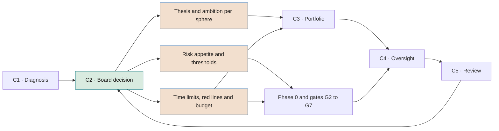

# AI thesis, ambition and risk appetite

**What the board decides in C2: where to play, with what ambition, with what risk and within what limits**

| | |
|---|---|
| Document | Document 13 · AI thesis, ambition and risk appetite |
| Version | 0.1 (working draft) |
| Date | 16-09-2026 |
| Author | Fernando García Varela |
| Status | Draft for review. The numerical values are illustrative examples or starting points that each company must set in C2. |

<!-- cifras: 12 | components of the C2 decision ; 10 | risk categories with appetite ; 4 | appetite grades ; 1 | board decision document -->

---

> **Legal notice and disclaimer.** SEVEN-G is a reference methodological framework provided "as is" and for information purposes only. It does not constitute legal, regulatory, financial or professional advice, nor does it guarantee compliance with any law or standard. References to general regulation (such as the EU AI Act, the GDPR, DORA or NIS2), to technical standards and to regulation specific to each sector or jurisdiction may be incomplete, may not apply to a particular case or may become out of date as a result of regulatory changes, interpretations or supervisory positions after their consultation date. **Each organisation that uses SEVEN-G is solely responsible for identifying the regulation that applies to it, verifying that it is current and certifying its own regulatory compliance**, with the appropriate qualified advice. This methodology is a generic, free aid shared with the community so that nobody has to start from scratch; each person or organisation can and should adapt it to its own use. It must not be inferred that its legally sensitive parts have been reviewed by legal counsel: those reviews, for each company or sector, are the ultimate responsibility of the company, consultant or organisation that uses it. Although every effort is made to keep it up to date, some regulation may have changed without being reflected here. To the fullest extent permitted by law, the author accepts no responsibility whatsoever for the effects of its application in any organisation or for its full applicability. The methodology does not grant certification of any kind. The author accepts no liability for any use made of this content or for any decisions taken on the basis of it. The data, figures, companies and cases in the examples are fictitious or illustrative.

<!-- esencial: siempre | The C2 decision, approved by the board: AI thesis, ambition per sphere, risk appetite, Enterprise investment threshold, reference time limits, nonconformity time limits, red lines and framework budget. Without an approved C2, no Transform initiatives are approved. Each company sets its own numerical values. -->

## 1. Purpose and scope

This document defines the content of stage **C2 · Direction** of the corporate cycle (document 01, section 5.1): the decision with which the board sets the company's AI thesis, the ambition per sphere, the risk appetite and the thresholds, time limits, limits and budget that the rest of the framework uses to make decisions.

| Aspect | Content |
|---|---|
| **Who prepares it** | Senior management, supported by the AI Office, risk, compliance, management control and people. |
| **With what information** | C1 results: inventory, maturity with evidence, current sphere map, transformation index profile, current validated value and cost. |
| **Who approves it** | The board of directors, which may delegate the preparation to a committee. |
| **When** | On first implementation, within the initial ninety days (document 90). Thereafter, annually after C5, and on an extraordinary basis when a trigger occurs (section 13). |
| **Result** | A single **board decision document**, with the structure in the annex (tool T19), which is completed with template P35. |

The document also contains reference regulatory content. **This document does not constitute legal advice.** The regulatory references were consulted in September 2026 and must be verified before use, because there are proposed amendments in progress that may affect application dates and obligations.

---

## 2. The C2 decision as a whole

| # | Component | What it sets | Who uses it afterwards | Section |
|---|---|---|---|---|
| 1 | **AI thesis** | Why and for what purpose the company uses AI, and what it will not do. | All initiatives (fit at G0); C3; C5. | 3 |
| 2 | **Ambition per sphere** | Priority and target ambition in spheres 01–07; target grade in 08 and 09. | C3; heat map (T16); index (condition IT-D1). | 4 |
| 3 | **Risk appetite** | Appetite by category, tolerance metrics and escalation. | Phase 3; risk acceptance; AI Committee; C4. | 5 |
| 4 | **Economic impact thresholds** | Economic impact scale 1–5 proportionate to size. | Risk matrix (T06, document 33). | 5.4 |
| 5 | **Enterprise investment threshold** and materiality threshold | When an initiative is Enterprise by virtue of investment and when it is reported individually to the board. | Phase 0 (T04); C4. | 6 |
| 6 | **Return horizon** | Required return period by ambition level. | G2, G3, G5, G7. | 7 |
| 7 | **Target portfolio balance** | Investment bands by ambition level. | C3; C4; document 14. | 8 |
| 8 | **Reference time limits** | Time limit per phase and for a *gate* decision; R6 frequency; regularisation. | Initiative register (T01); stall alerts. | 9 |
| 9 | **Nonconformity and incident time limits** | Containment, action plan and internal communication. | Document 37; T08. | 10 |
| 10 | **Red lines** | Prohibited practices, decisions that are never delegated and the company's own red lines. | Phases 0, 3 and 4; T07; T10. | 11 |
| 11 | **Framework budget** | Annual amount, envelopes and reallocation rules. | C3; AI Committee. | 12 |
| 12 | **Review** | Annual review date and triggers for extraordinary review. | C5. | 13 |

<!-- grafico: From direction to decision | What the board approves in C2 becomes criteria applied by the portfolio and by each decision gate -->

---

## 3. AI thesis

### 3.1 What it is

The AI thesis is a short statement (two to four pages) in which the board explains **why AI matters to the company, where it wants to use it, with what ambition and what it will not do**. It is neither a project plan nor a technology catalogue. It must be readable in ten minutes and usable to say no to an initiative.

### 3.2 Structure

| # | Section | Content | Question it answers |
|---|---|---|---|
| 1 | **Context** | How AI is changing the rules of the sector and the company's competitive position. | Why now? |
| 2 | **Role of AI in the strategy** | Relationship with the objectives of the strategic plan. AI as a lever for efficiency, growth, change in the operating model or several of these, with relative weight. | For what purpose? |
| 3 | **Where we play** | Priority spheres and target ambition (section 4). | Where? |
| 4 | **What we will not do** | Explicit renunciations: non-priority spheres, types of use ruled out, the company's own red lines. | What do we rule out? |
| 5 | **Position on people** | Whether AI replaces, augments or reorganises work, in which areas, and with what commitments on training, reassignment and dialogue. | What happens to people? |
| 6 | **Enabling conditions** | Data, knowledge, capabilities, platform, governance and suppliers required by the ambition. | What do we need to achieve it? |
| 7 | **Principles** | Principles of responsible use, which the corporate policy (document 31) turns into rules. | How will we do it? |
| 8 | **How we will know it is working** | Target transformation index profile, target maturity by dimension, proportion of validated value and target annual net value, with horizon. | How will we measure it? |

### 3.3 Quality criteria

An AI thesis is adequate if:

- **It contains renunciations.** A thesis that declares all spheres to be priorities does not guide any decision.
- **It is consistent with the budget.** An ambition to Transform without an investment envelope for staged bets is an unbacked statement (and triggers condition IT-D1 in document 12 without evidence to support it).
- **It is verifiable.** Section 8 uses framework indicators with current value, target and horizon.
- **It is consistent with capacity.** The ambition in the value spheres does not exceed what the enabling spheres can support within the horizon, or it includes the initiatives that close that gap.
- **It takes a position on people.** Avoiding the question does not resolve it: it delegates it to each project.

### 3.4 Illustrative extract

*Fictitious, abridged example.*

> **Role of AI.** The company will use AI primarily to sustain its operating margin (sphere 04, Optimise) and to build a line of digital services on top of its products (sphere 02, Transform), which it will fund with the validated savings from the former. **What we will not do.** We will not use AI systems that make employment decisions without meaningful human review, nor agents that act directly with customers with A3 autonomy within the horizon of this thesis. **People.** The capacity released in Operations will be reassigned primarily to technical service and to the new services line; headcount reductions, if proposed, will be decided explicitly by management and not as a consequence of a project. **How we will know it is working.** In 24 months: Efficiency at scale profile with no unevidenced declaration; AI-enabled revenue of 0.5%; validated value of 60%.

---

## 4. Ambition per sphere

### 4.1 Content

For each value and enabling sphere (01 to 07):

| Field | Values | Guidance |
|---|---|---|
| **Priority** | High · Medium · Low · Non-priority | There should be at most three high-priority spheres. |
| **Target ambition** | Optimise · Augment · Transform | Highest level the company wants to reach in the sphere within the horizon. |
| **Horizon** | Months | Time limit for having at least one initiative at the target level in production. |
| **Main indicator** | An indicator from document 10 | With current value (or "no data") and target value. |
| **Owner** | Member of senior management | Accountable to the board for the ambition in the sphere. |

For spheres 08 and 09, instead of an ambition, the **target grade per dimension** is set (Absent, Basic, Systematic or Advanced), with horizon, indicator and owner. Optimise, Augment or Transform is never set for 08 or 09 (document 10, section 4.2).

### 4.2 Rules

1. The target ambition **must** be based on the current sphere map from C1: the level achieved and the level in the portfolio for each sphere are indicated.
2. A sphere with a **Transform** ambition must have an envelope in the framework budget and, within the horizon, at least one candidate initiative.
3. An ambition to Augment or Transform in value spheres **should** be accompanied by a sufficient grade or ambition in the enabling spheres on which it depends.
4. Spheres 08 and 09 **must** have at least a **Systematic** target grade in Compliance and in Structure when the company has high-risk systems or Enterprise initiatives.
5. "Non-priority" spheres may have initiatives, but their combined cost should not exceed the limit on off-thesis investment set in the strategic appetite (section 5.3).

### 4.3 Illustrative example

*Fictitious company, consistent with the examples in documents 10 and 12.*

| Sphere | Priority | Target ambition | Horizon | Main indicator (current → target) |
|---|---|---|---|---|
| 01 · Customer | Medium | Augment | 18 months | IE01.05 Incremental conversion: €0.12M → €0.60M |
| 02 · Product and service | High | Transform | 24 months | IE02.01 AI-enabled revenue: 0.01% → 0.5% |
| 03 · People | High | Augment | 18 months | IE03.03 Reassigned capacity: 20% → 50% |
| 04 · Operations | High | Optimise | 12 months | IE04.06 Validated materialised savings: €1.80M → €2.50M |
| 05 · Data | Medium | Augment | 18 months | IE05.06 Initiatives blocked by data: no data → < 20% |
| 06 · Knowledge | Medium | Augment | 24 months | IE06.02 Concentration of knowledge: no data → < 30% |
| 07 · Decision | Low | Optimise | 24 months | IE07.01 Decisions with assigned autonomy: no data → 100% |

| Sphere | Dimension | Current grade → target | Horizon |
|---|---|---|---|
| 08 | Compliance · Anticipation · Ethical leadership | Systematic → Systematic · Basic → Systematic · Basic → Basic | 12 months |
| 09 | Structure · Speed and control · Ecosystem | Systematic → Systematic · Basic → Systematic · Absent → Basic | 12 months |

---

## 5. Risk appetite

### 5.1 Concepts

| Concept | Definition in SEVEN-G |
|---|---|
| **Risk appetite** | Amount and type of risk that the company is willing to take on in order to achieve its objectives with AI. It is declared by category. |
| **Tolerance metric** | Indicator with a formula that makes it possible to check whether the company is within its appetite. |
| **Tolerance (amber)** | Value from which analysis and a plan by the AI Committee are required. |
| **Limit (red)** | Value that must not be exceeded. Exceeding it requires escalation to the board or its board committee and immediate action. |

The probability, impact and risk level scale (Low, Medium, High, Critical) and the responses (Avoid, Mitigate, Transfer, Accept) are those in document 33. This document does not modify them: it sets where the company stands within them.

### 5.2 Appetite grades and acceptance of residual risk

The general rule for accepting residual risk is: **Low** → AI Product Owner, with a record · **Medium** → AI Sponsor with the AI Risk Owner's clearance · **High** → AI Committee · **Critical** → not accepted; exceptionally, only the board or its board committee, within the appetite approved in C2. The appetite grade of each category may **tighten** that rule, never relax it.

| Appetite grade | Meaning | Maximum residual risk within appetite | Acceptance beyond that maximum |
|---|---|---|---|
| **Averse** | Risk is avoided even if it means forgoing opportunities. | Low | Medium or High: AI Committee, informing the board committee. Critical: not accepted. |
| **Cautious** | Limited risk is accepted with robust controls. | Medium | High: AI Committee, informing the board committee. Critical: not accepted. |
| **Moderate** | Risk is accepted in exchange for value, with proportionate controls. | High | Critical: not accepted. |
| **Open** | High risks are accepted in bounded, staged bets. | High | Critical: only exceptionally, by the board or its board committee, for a specific stage, with an investment cap and an exit plan. **Not permitted in LEG or SEG.** |

A Critical residual risk without the exceptional approval provided for **blocks G3 and G5**.

### 5.3 Declaration by category

*Grades recommended as a starting point and metrics with illustrative initial values. The company sets its own in C2.*

| Code | Category | Starting grade | Model statement |
|---|---|---|---|
| **EST** | Strategic | Moderate (Open in staged Transform bets) | We take on risk to build advantage, always within the thesis and with the ability to stop. |
| **TEC** | Technical | Moderate | We accept imperfections in systems with human oversight; not in systems that act without it. |
| **DAT** | Data | Cautious | We do not use data without a legal basis or without a quality owner. |
| **ECO** | Economic | Moderate | We accept that some initiatives may not generate value, but not that they continue without evidence. |
| **LEG** | Legal and compliance | Averse | Zero tolerance for prohibited practices and breached regulatory obligations. |
| **ORG** | Organisational | Moderate | We accept the effort of change; we do not accept changes without a plan for people. |
| **REP** | Reputational | Cautious | We do not expose customers to systems that we cannot explain, oversee and correct. |
| **GEN** | Generative AI and agents | Cautious | We use generative AI and agents with prior evaluation, limits on action and traceability. |
| **SEG** | Security and offensive AI | Averse | No system with the ability to act without an identity, least-privilege permissions and a kill switch. |
| **TER** | Third parties | Cautious | We do not depend on a critical supplier without an exit strategy. |

**Tolerance metrics**

| Category | Metric | Formula | Tolerance (amber) | Limit (red) |
|---|---|---|---|---|
| EST | Off-thesis investment | Cost in non-priority spheres ÷ portfolio cost × 100 | > 10% | > 20% |
| EST | Concentration in one initiative | Cost of the largest initiative ÷ portfolio cost × 100 | > 25% | > 40% |
| EST | Deviation from portfolio balance | Consecutive quarters outside the bands in section 8 | 1 | 2 |
| TEC | Degradation without action | Systems in production below their performance threshold for more than 30 days without recorded action | 1 | 2, or 1 Enterprise |
| TEC | Serious technical incidents | S1 or S2 incidents with a technical cause in the quarter | 1 S2 | 1 S1 or 3 S2 |
| TEC | Tested rollback | Enterprise systems with a tested rollback plan ÷ Enterprise systems × 100 | < 100% | < 90% |
| DAT | Personal data without a legal basis | Datasets used in AI without a documented legal basis (IE05.03) | — | ≥ 1 |
| DAT | Lineage in Enterprise | Enterprise systems with verified lineage ÷ Enterprise systems × 100 | < 100% | < 90% |
| DAT | Blocking due to data | IE05.06 | > 25% | > 40% |
| ECO | Recurring cost deviation | Initiatives with actual recurring cost > 115% of that approved at G3 | 1 | 1 with deviation > 130% |
| ECO | Validated value | Condition B2 in document 12 | < 50% | < 30% |
| ECO | Negative net value without a decision | Initiatives with negative annual net value more than 12 months after G5 without a G7 decision | 1 | 2 |
| LEG | Prohibited practices | Systems or initiatives that constitute a prohibited practice | — | ≥ 1 |
| LEG | Required assessments | High-risk systems in production without the required assessments | — | ≥ 1 |
| LEG | Pending classification | Systems "Pending classification" for more than 90 days | 1 | 3, or 1 in production |
| LEG | Critical nonconformities | Critical nonconformities open beyond their time limit | — | ≥ 1 |
| ORG | Adoption | Effective adoption six months after G5 ÷ hypothesis target × 100 | < 80% | < 50% |
| ORG | Adoption plan | Augment or Transform initiatives in phase 4 or later without an adoption plan | — | ≥ 1 |
| ORG | Unconverted capacity | Capacity released more than 12 months ago that has been neither materialised nor reassigned ÷ released capacity × 100 | > 50% | > 70% |
| REP | Visible incidents | S1 or S2 incidents with customer or public exposure in the quarter | 1 S2 | 1 S1 or 2 S2 |
| REP | AI-related complaints | Quarterly change in IE01.06 | > +25% | > +50% |
| REP | Transparency | Systems with direct exposure without the required user information | — | ≥ 1 |
| GEN | Prior evaluation | Generative systems with direct exposure without evaluations before G5 and periodically | — | ≥ 1 |
| GEN | Prompt injection | Success rate in the injection tests of the last cycle | > 2% | > 5% |
| GEN | Traceability of actions | Agent actions recorded with intent ÷ agent actions × 100 | < 100% | < 95% |
| SEG | Kill switch | A2 or A3 systems without a tested kill switch (IE07.04) | — | ≥ 1 |
| SEG | Excessive permissions | Agent identities with excessive permissions detected | 1, corrected in < 30 days | 1 not corrected within 30 days |
| SEG | Unrotated credentials | Agent credentials outside the set rotation period | 1 in A0–A1 | 1 in A2–A3 |
| TER | Supplier concentration | IE09.07 | > 60% | > 80% |
| TER | Exit strategy | IE09.08 | < 100% | < 80% |
| TER | Contractual clauses | N2 or N3 suppliers without minimum clauses on data use and intellectual property | — | ≥ 1 |

"—" in the amber column indicates **zero tolerance**: the first case already exceeds the limit.

### 5.4 Economic impact thresholds

Impact is assessed on five axes (economic, people and rights, regulatory, operational, reputational) and the highest is taken (document 33). The economic axis is set **in proportion to the size** of the company, based on a stable reference measure:

| Reference measure | When to use it |
|---|---|
| **Earnings before interest, taxes, depreciation and amortisation (EBITDA)** | Default option for companies with positive and stable earnings. |
| **Revenue** | If earnings are negative or highly volatile. |
| **Equity** | Financial institutions and insurers, if they prefer it for consistency with their risk framework. |
| **Annual budget** | Public sector and non-profit organisations. |

*Illustrative example: fictitious company with €400M in revenue and €50M in EBITDA.*

| Impact | Name | Proportion of EBITDA | Equivalent amount |
|---|---|---|---|
| 1 | Negligible | Less than 0.1% | Less than €50k |
| 2 | Minor | From 0.1% to 0.5% | From €50k to €250k |
| 3 | Moderate | From 0.5% to 2% | From €250k to €1M |
| 4 | Major | From 2% to 5% | From €1M to €2.5M |
| 5 | Critical | More than 5% | More than €2.5M |

Amounts are rounded and reviewed annually in C5. The anchors for the other four axes are defined in document 33 and do not depend on size.

### 5.5 Escalation when a tolerance is exceeded

| Situation | Action | Indicative time limit |
|---|---|---|
| Metric in **amber** | The AI Office flags it on the dashboard; the AI Committee analyses the cause and approves a plan with an owner. | Next monthly committee meeting. |
| Metric in **amber** for two consecutive quarters | The board or its board committee is informed in C4. | Next quarterly session. |
| Metric in **red** | The AI Committee takes immediate measures (including stopping the system if appropriate) and the board committee is informed. | Communication within 5 working days; for zero tolerance, within 48 hours. |
| Metric in **red** in LEG or SEG | In addition, a critical nonconformity is raised if any of its conditions apply (document 01, section 12). | Containment within 48 hours at most. |

---

## 6. Enterprise investment threshold and materiality thresholds

| Threshold | Definition | Illustrative rule | Example (EBITDA €50M) |
|---|---|---|---|
| **Enterprise investment threshold** | Total three-year cost of the initiative: build + expected recurring cost for the first three years. If it exceeds the threshold, the initiative is Enterprise (document 01, section 9.2). | 0.5% of EBITDA | €250k |
| **Materiality for the board** | Initiatives reported individually on the board dashboard, in addition to all Transform initiatives and those with High residual risk. | 2% of EBITDA | €1M |
| **Board approval by amount** (optional) | The company **may** require board approval above a certain amount, in accordance with its internal delegation rules. | According to internal rules | — |
| **Minimum scale in production (B3)** | Number of initiatives in production that the transformation index requires for Efficiency at scale (document 12). | 5 by default; adjustable to size | 5 |

Rules:

- **Aggregation.** Initiatives that share an objective, sponsor and platform, or that are stages of the same bet, are added together to apply the thresholds. Splitting an initiative to stay below a threshold is a **major nonconformity**.
- **Review.** If during execution the total three-year cost exceeds the threshold, the intensity is reviewed at the next *gate* or in R6.
- **Minimum intensity.** The economic threshold only adds one criterion: an initiative below the threshold may be Enterprise by virtue of any other criterion.

---

## 7. Return horizon by ambition level

*Illustrative initial values, to be approved by the board in C2. "Annual net value", "NPV" and "payback period" follow the definitions in document 40 (F2, F7 and F9): annual net value = materialised efficiencies + return − recurring cost. The only economic feasibility criterion at G3 is NPV ≥ 0 with the horizon and rate set in C2 (document 40, section 8.3; 01 §7.6); the reference payback period is for information only and is not a G3 threshold.*

| Level | Criterion at G2 | Criterion at G3 | Criterion at G5 | Criterion at G7 |
|---|---|---|---|---|
| **Optimise** | Expected savings with a formula based on a measured baseline. | Positive expected annual net value in the first full year in production; NPV ≥ 0 over the NPV evaluation horizon and at the rate set in C2; reference payback period, for information only: 18 months. | Efficiency validated against the baseline and a plan to materialise the released capacity. | Savings materialised within 12 months of G5. |
| **Augment** | Performance and cost metrics; adoption target. | Positive expected annual net value within 24 months of G5; NPV ≥ 0 over the NPV evaluation horizon and at the rate set in C2; reference payback period, for information only: 30 months; feasibility of adoption. | Actual adoption and performance improvement measured; six-month adoption milestone defined. | Sustained performance and reassigned capacity within 24 months of G5. |
| **Transform** | Return hypothesis with learning milestones; investment cap per stage; board approval. | NPV ≥ 0 for the whole is not required (document 40, section 8.3). Feasibility of the first stage, which should not exceed 25% of the estimated total investment; learning milestones at least every six months; stop criteria per stage; documented option value. | Market or customer evidence: usage, conversion, initial revenue or verified operational change. | Return measured within 36 months of G5, or an explicit board decision to extend the time limit with a new stage and cap. |

Rules:

- The horizon applies to the **confirmed level** at G2. If the actual ambition turns out to be lower, the horizon for the actual level is applied at G7 (document 12, section 3.6).
- An expired horizon without the criterion being met **brings G7 forward**.
- Initiatives for mandatory compliance or for reducing a significant risk may be justified by **avoided risk** or **compliance**, which are not added to value unless they are translated into money with a formula.

---

## 8. Target portfolio balance by ambition

The balance is expressed as **bands** of the proportion of portfolio cost (investment executed plus recurring cost over the last 12 months, excluding initiatives with primary sphere 08 or 09), using the same formula as signal 1 of the transformation index.

*Illustrative reference stances. The company chooses one or sets its own bands.*

| Stance | Optimise | Augment | Transform | Expected reading of signal 1 |
|---|---|---|---|---|
| **Prudent** | 70–85% | 10–25% | 0–10% | 1 or 2 |
| **Balanced** | 55–70% | 20–30% | 10–20% | 2 or 3 |
| **Ambitious** | 40–55% | 25–35% | 20–30% | 3 |

Rules:

1. If the thesis sets **Transform** as the target ambition in any sphere, the Transform band **cannot start at 0%** beyond the first year, or the company will be declaring a transformation without funding it.
2. The balance is measured quarterly in C4. Being outside the band for one quarter is amber; for two quarters, red (EST metric in section 5.3).
3. Correction is made in C3 by prioritising initiatives, not by reclassifying existing ones. Reclassifying to get within the band without evidence is a major nonconformity (document 12, section 3.6).
4. Investment in governance and compliance enablement (spheres 08 and 09) is budgeted in its own envelope (section 12).

---

## 9. Reference time limits

The board approves the lifecycle reference time limits, which the initiative register uses to flag stalled initiatives. The indicative starting values are in **document 03, section 3.6**, and are recalibrated in C5 with the company's own data. The C2 decision includes:

| Time limit | Indicative value | Source |
|---|---|---|
| Time limit per phase (0, 1, 2, 3, 4, 5 and 7), Lite and Enterprise | Table in document 03, section 3.6 | 03 |
| *Gate* decision from request | 5 working days (Lite) · 10 working days (Enterprise) | 03 |
| Frequency of the continuity review (R6) | At least every six months (Lite) · at least quarterly (Enterprise) | 01, section 6.8 |
| Regularisation of initiatives in production prior to adoption of the framework | 12 months (illustrative value) | 01, section 14 |
| Regulatory classification of an inventoried system | 90 days (illustrative value) | Section 5.3 |
| Maximum time limit for a *gate* condition | Until the next *gate*; 90 days in R6 (illustrative value) | 01, section 7.4 |

The company may **shorten** the minimum R6 frequencies, but not lengthen them.

---

## 10. Nonconformity and incident time limits

### 10.1 Nonconformities

The reference time limits are those in document 01, section 12. The company may adjust them in C2, without exceeding those established by applicable regulation, and **should not** lengthen those for critical nonconformities.

| Type | Containment (reference) | Action plan (reference) | Reports to | Approved value |
|---|---|---|---|---|
| **Critical** | Immediate, maximum 48 hours | Maximum 10 days | AI Committee and board committee | To be completed |
| **Major** | Maximum 10 days | Maximum 30 days | AI Committee | To be completed |
| **Minor** | Not required | Before the next *gate* or review | AI Office | To be completed |

### 10.2 Incidents

Severity (S1 to S4) is defined in document 37. The C2 decision sets the **internal communication time limits**; the time limits for notification to authorities are established by regulation and always prevail.

| Severity | Internal communication (illustrative value) |
|---|---|
| **S1 · Critical** | AI Committee within 24 hours; board committee within 72 hours. |
| **S2 · High** | AI Committee within 72 hours. |
| **S3 · Medium** | AI Office within 5 working days. |
| **S4 · Low** | Record in T08. |

Regulatory references that condition these time limits, where applicable (consulted in September 2026; verify that they are in force):

| Regulation | Reference obligation |
|---|---|
| GDPR, Article 33 | Notification of personal data breaches to the supervisory authority without undue delay and, where feasible, within 72 hours. |
| EU AI Act, Article 73 | Reporting of serious incidents involving high-risk systems, with a general maximum time limit of 15 days and shorter time limits in specific cases. |
| NIS2 Directive, Article 23 | Early warning within 24 hours, notification within 72 hours and final report within one month for significant incidents. |
| DORA, Article 19 | Reporting of major ICT-related incidents within the time limits set by its technical standards. |

---

## 11. Red lines

### 11.1 Prohibited practices

Article 5 of the EU AI Act prohibits certain practices, applicable since 2 February 2025. In general terms, they include:

- Subliminal, manipulative or deceptive techniques that materially distort behaviour and cause or are likely to cause significant harm.
- Exploitation of vulnerabilities due to age, disability or social or economic situation.
- Social scoring that leads to detrimental or disproportionate treatment.
- Assessment of the risk of a person committing a criminal offence based solely on profiling or personality traits.
- Creation or expansion of facial recognition databases through untargeted scraping of images from the internet or CCTV footage.
- Emotion inference in the workplace or in educational institutions, except for medical or safety reasons.
- Biometric categorisation to infer race, political opinions, trade union membership, religious or philosophical beliefs, sex life or sexual orientation, with the exceptions provided for.
- Real-time remote biometric identification in publicly accessible spaces for law enforcement purposes, save for the exceptions provided for.

Treatment in SEVEN-G: **zero tolerance**. No initiative that may constitute a prohibited practice passes phase 3 (document 01, section 6.5); if one is detected in production, it is a critical nonconformity and the system is stopped. The interpretation of each case requires qualified legal judgement.

### 11.2 What is never delegated to AI

SEVEN-G common minimum. The company may extend it, but not reduce it. The autonomy levels are those in document 35 (A0 assistance · A1 recommendation · A2 supervised action · A3 autonomous action).

| Decision or action | Maximum autonomy of an AI system | Reason |
|---|---|---|
| Approval of the thesis, the risk appetite, the framework budget and the red lines | A0 | Non-delegable responsibility of the board. |
| *Gate* decisions, acceptance of residual risks, go-live sign-off and closure of nonconformities | A0 | Segregation of duties and accountability. |
| Decisions with legal or similarly significant effects on people (employment, credit, insurance, access to essential services, among others) | A1, with meaningful human review by a person with the authority and competence to change the decision | Protection of rights; GDPR, Article 22, and applicable regulation. |
| Dismissals and disciplinary measures | A0 | Impact on people and management responsibility. |
| Notifications to authorities and institutional communications on behalf of the board or management | A1 (assisted drafting; validation and sending by people) | Legal and reputational responsibility. |
| Payments or financial commitments above the limit approved for the system | A1 | Limit on agent action. |
| Modification of its own permissions, limits, credentials or objectives | Prohibited | Loss of control. |
| Deactivation of logs, security controls or the kill switch | Prohibited | Loss of traceability and of the ability to stop. |
| Processing of special categories of data outside the documented purpose and legal basis | Prohibited | Data protection. |

### 11.3 The company's own red lines

In addition to the minimum, the board **may** approve voluntary red lines, which form part of the Ethical leadership dimension of sphere 08. *Illustrative examples:*

- Not using systems that simulate being a person without clearly informing the other party, even if regulation does not require it in that case.
- Not using customer data to train third-party models.
- Not deploying agents with A3 autonomy in direct interaction with customers.
- Not using emotion recognition in customer relationships.

Red lines are incorporated into the questionnaires for intensity (T04), regulatory classification (T07) and agent security (T10). Only the board may modify them, in C2 or in an extraordinary review.

---

## 12. Framework budget

The framework budget is the annual amount that the board authorises for AI and the rules by which it is allocated. It does not replace the budget of each initiative, which is approved at its *gate*.

| Envelope | Content | Rule |
|---|---|---|
| **Optimise** | Build of optimisation initiatives. | Within the band in section 8. |
| **Augment** | Build and adoption of augmentation initiatives. | Within the band in section 8. |
| **Staged Transform** | Approved stages of transformation bets. | Released stage by stage after the competent body's decision on the milestones. |
| **Enablement** | Data, common platform, governance and compliance (including initiatives in spheres 08 and 09). | Justified by the spheres it enables. |
| **Committed recurring cost** | Operation of systems in production. | Budgeted in full; it does not compete with build. |
| **Adoption and training** | AI literacy, role-based training and change management not charged to initiatives. | It should be explicit, not residual. |
| **Contingency** | Unforeseen events and unplanned opportunities. | Allocated by the AI Committee, with a record. |

Spending is also reported by the **cost categories** in document 42: licences · model consumption · compute and infrastructure · data · build staff · operations staff · suppliers and services · control and compliance · adoption and training.

Reallocation rules (illustrative values):

| Movement | Who decides |
|---|---|
| Within an envelope | AI Committee. |
| Between envelopes, up to 10% of the framework budget in the year | AI Committee, informing the board in C4. |
| Between envelopes above 10%, or any reduction of the Transform envelope | Board. |
| Remaining balance at year-end | Not carried forward automatically; decided in C2 of the following cycle. |

*Illustrative example (framework budget of €5.0M):* Optimise 1.6 · Augment 0.7 · Staged Transform 0.6 · Enablement 0.6 · Committed recurring cost 1.1 · Adoption and training 0.2 · Contingency 0.2.

---

## 13. Annual review and extraordinary review

| Type | When | What is reviewed | Who |
|---|---|---|---|
| **Annual** | After C5 | Fulfilment of the thesis and of the ambition per sphere; evolution of the index and of maturity; tolerance metrics; calibration of thresholds, horizons, bands and time limits; red lines; budget for the following cycle. | Prepared by senior management and the AI Office; approved by the board. |
| **Extraordinary** | When a trigger occurs | The affected components. | Same as the annual review. |

Triggers for extraordinary review:

- Regulatory change with a significant effect on the company's systems.
- S1 incident or critical nonconformity caused by a poorly set limit.
- Tolerance metric in red for two consecutive quarters.
- Corporate transaction, significant reorganisation or change to the strategic plan.
- Substantial change in technology or the market that invalidates an assumption of the thesis.
- "Declared but unevidenced transformation" profile in two consecutive formal calculations.

Each version of the decision document is identified with a version number and date, the previous version is retained and it is recorded in the recommendations and decisions register (T18). After approval, it is communicated to the bodies and owners concerned and the parameters are updated in the tools (T01, T04, T06, T14, T16, T17).

---

## 14. Quality criteria for the C2 decision

The AI Auditor or internal audit checks, before approval:

| # | Criterion | Met if |
|---|---|---|
| 1 | Diagnostic basis | Each component cites the C1 results on which it is based, with explicit "no data". |
| 2 | Completeness | The twelve components in section 2 are present, or their absence is justified. |
| 3 | Renunciations | The thesis includes what will not be done and there are non-priority or low-priority spheres. |
| 4 | Ambition–budget consistency | Every sphere with Transform has an envelope and a candidate; the bands are compatible with the thesis. |
| 5 | No mixing of levels | Spheres 08 and 09 have grades, not ambition levels. |
| 6 | Measurable appetite | Each category has a grade, a statement and at least one metric with formula, tolerance and limit. |
| 7 | Proportionality | The economic thresholds are expressed on a reference measure and in euros. |
| 8 | Regulatory limits | The approved time limits do not exceed the regulatory ones; the red lines include the minimum in section 11. |
| 9 | Owners | Each sphere and each category has an owner from senior management. |
| 10 | Review | There is an annual review date and triggers for extraordinary review. |

---

## 15. Annex · Board decision document template (T19)

The annex is completed with template P35.

**Instructions for use.** The template is completed in C2, prepared by senior management with the AI Office, verified by the AI Auditor or internal audit against the criteria in section 14 and approved by the board. Fields marked **(Enterprise)** may be omitted in organisations that apply only Lite intensity, with justification. Where "indicative value" is indicated, the value in this document is used as a starting point and replaced by the approved value.

### A. Identification

| Field | Content | Guidance |
|---|---|---|
| Company or group | | Corporate perimeter to which the decision applies. |
| Approving body | | Board of directors or committee with delegated powers. |
| Session date | | DD-MM-YYYY. |
| Document version | | 1.0 on first approval; incremented at each review. |
| Identifier in the decisions register (T18) | | Persistent identifier in the register. |
| Prepared by | | Name and position. |
| Verified by | | AI Auditor or internal audit; different from the preparer. |
| Reference C1 report | | Date and version of the diagnosis. |

### B. Proposed resolutions

| No. | Resolution | Guidance |
|---|---|---|
| 1 | The AI thesis in section C is approved. | One resolution per component, in the form "… is approved". |
| 2 | The ambition per sphere in section D is approved. | |
| … | | |

### C. AI thesis

| Field | Content | Guidance |
|---|---|---|
| Context | | Section 3.2, item 1. |
| Role of AI in the strategy | | Relative weight of efficiency, growth and operating model. |
| Where we play | | Refers to section D. |
| What we will not do | | At least three specific renunciations. |
| Position on people | | Replace, augment or reorganise, by area, with commitments. |
| Enabling conditions | | Data, knowledge, capabilities, platform, suppliers. |
| Principles | | Refers to the corporate policy (document 31). |
| How we will know it is working | | Target profile, target maturity, validated value and net value, with horizon. |

### D. Ambition per sphere

| Sphere | Priority | Level achieved (C1) | Target ambition | Horizon | Main indicator (current → target) | Owner |
|---|---|---|---|---|---|---|
| 01 · Customer | | | | | | |
| 02 · Product and service | | | | | | |
| 03 · People | | | | | | |
| 04 · Operations | | | | | | |
| 05 · Data | | | | | | |
| 06 · Knowledge | | | | | | |
| 07 · Decision | | | | | | |

| Sphere | Dimension | Current grade | Target grade | Horizon | Indicator | Owner |
|---|---|---|---|---|---|---|
| 08 | Compliance | | | | | |
| 08 | Anticipation | | | | | |
| 08 | Ethical leadership | | | | | |
| 09 | Structure | | | | | |
| 09 | Speed and control | | | | | |
| 09 | Supplier ecosystem | | | | | |

### E. Risk appetite by category

| Code | Category | Grade (Averse · Cautious · Moderate · Open) | Statement | Owner |
|---|---|---|---|---|
| EST | Strategic | | | |
| TEC | Technical | | | |
| DAT | Data | | | |
| ECO | Economic | | | |
| LEG | Legal and compliance | | | |
| ORG | Organisational | | | |
| REP | Reputational | | | |
| GEN | Generative AI and agents | | | |
| SEG | Security and offensive AI | | | |
| TER | Third parties | | | |

### F. Tolerance metrics

| Category | Metric | Formula | Tolerance (amber) | Limit (red) | Source | Frequency |
|---|---|---|---|---|---|---|
| | | | | | | |
| *Illustrative example:* TER | Supplier concentration | Spend on main model supplier ÷ total spend on models × 100 | > 60% | > 80% | T09, T13 | Quarterly |

### G. Economic impact thresholds

| Field | Content | Guidance |
|---|---|---|
| Reference measure and value | | EBITDA, revenue, equity or budget; reference financial year. |
| Impact 1 · Negligible | | Proportion and euros. |
| Impact 2 · Minor | | |
| Impact 3 · Moderate | | |
| Impact 4 · Major | | |
| Impact 5 · Critical | | |

### H. Investment and materiality thresholds

| Field | Content | Guidance |
|---|---|---|
| Enterprise investment threshold | | Total three-year cost; indicative value 0.5% of EBITDA. |
| Materiality for individual reporting to the board | | Indicative value 2% of EBITDA. |
| Board approval threshold by amount (Enterprise) | | Optional, according to delegation rules. |
| Minimum scale in production (B3) | | Indicative value 5. |

### I. Return horizon

| Level | Criterion at G3 | Time limit at G7 | Guidance |
|---|---|---|---|
| Optimise | | | Indicative values in section 7. |
| Augment | | | |
| Transform | | | First-stage cap and milestone frequency. |

### J. Target portfolio balance

| Field | Content | Guidance |
|---|---|---|
| Stance | | Prudent, Balanced, Ambitious or own. |
| Optimise band | | Minimum and maximum percentage. |
| Augment band | | |
| Transform band | | Cannot start at 0% if Transform is in the thesis (except in the first year). |

### K. Reference time limits

| Time limit | Lite | Enterprise | Guidance |
|---|---|---|---|
| Phase 0 | | | Indicative values in document 03, section 3.6. |
| Phase 1 | | | |
| Phase 2 | | | |
| Phase 3 | | | |
| Phase 4 | | | |
| Phase 5 | | | |
| Phase 7 | | | |
| *Gate* decision | | | Working days. |
| R6 frequency | | | No longer than every six months (Lite) or quarterly (Enterprise). |
| Regularisation of earlier initiatives | | | Months. |
| Pending regulatory classification | | | Days. |

### L. Nonconformity and incident time limits

| Field | Containment | Action plan or communication | Reports to | Guidance |
|---|---|---|---|---|
| Critical nonconformity | | | | Reference: 48 hours and 10 days. |
| Major nonconformity | | | | Reference: 10 and 30 days. |
| Minor nonconformity | | | | Before the next *gate*. |
| S1 incident | — | | | Without prejudice to regulatory time limits. |
| S2 incident | — | | | |
| S3 incident (Enterprise) | — | | | |

### M. Red lines

| Field | Content | Guidance |
|---|---|---|
| Confirmation of the SEVEN-G minimum | Yes / No | Prohibited practices and table in section 11.2. |
| Extensions to the table of non-delegable decisions | | Decision, maximum autonomy and reason. |
| The company's own red lines | | Examples in section 11.3. |

### N. Framework budget

| Envelope | Amount | % of total | Guidance |
|---|---|---|---|
| Optimise | | | |
| Augment | | | |
| Staged Transform | | | Approved stages and stages pending release. |
| Enablement | | | Includes spheres 08 and 09. |
| Committed recurring cost | | | |
| Adoption and training | | | |
| Contingency | | | |
| **Total** | | 100% | |
| Reallocation rules | | | Committee and board limits. |

### O. Monitoring targets

| Indicator | Current value | Target | Horizon | Guidance |
|---|---|---|---|---|
| Transformation index profile | | | | Document 12. |
| Overall maturity level and priority dimensions | | | | Document 11. |
| Proportion of validated value | | | | Condition B2. |
| Annual net value of the portfolio | | | | Document 40. |

### P. Review and validity

| Field | Content | Guidance |
|---|---|---|
| Validity | | Until the next version is approved. |
| Planned annual review date | | After C5. |
| Additional triggers for extraordinary review | | In addition to those in section 13. |

### Q. Approval and verification

| Function | Name and position | Date | Remarks |
|---|---|---|---|
| Prepares | | | Senior management. |
| Verifies | | | AI Auditor or internal audit. Result: Conformant · Conformant with observations · Nonconformant. |
| Approves | | | Board; reference to the minutes. |

---

## 16. Associated tools and templates

| Code | Name | Use in this document |
|---|---|---|
| **T19** | AI thesis and risk appetite template | Board decision document (annex). |
| **T01** | Initiative register | Receives reference time limits, portfolio bands and horizons. |
| **T04** | Intensity determination | Receives the Enterprise investment threshold and the red lines. |
| **T06** | Risk matrix and register | Receives the economic impact thresholds and the appetite grades. |
| **T08** | Nonconformity and incident register | Receives the approved time limits. |
| **T14** | Transformation index calculator | Receives condition IT-D1 and threshold B3. |
| **T16** | Portfolio sphere map | Receives the ambition per sphere and the target grades. |
| **T17** | Board AI dashboard | Shows tolerance metrics, portfolio balance and budget. |
| **T18** | Board recommendations register | Records the C2 decision and its reviews. |
| **P04** | Intensity determination | Applies the Enterprise investment threshold. |
| **P07** | Sphere and ambition classification | Checks fit with the ambition per sphere. |
| **P12** | Risk matrix and register | Applies impact and acceptance thresholds. |
| **P35** | AI thesis and risk appetite | C2 board decision document: completes the annex (section 15). |

---

## 17. Related documents

| Document | Relationship |
|---|---|
| **01 · Foundational methodology** | Stage C2, Enterprise criteria, *gate* criteria by ambition, nonconformity time limits. |
| **03 · Tools and initiative register** | Indicative reference time limits (section 3.6) and tool T19. |
| **10 · Sphere map and ambition levels** | Spheres, levels, grades for 08 and 09 and main indicators. |
| **11 · Maturity model** | Target maturity in the thesis. |
| **12 · Transformation index** | Target profile, condition IT-D1, threshold B3 and signal 1. |
| **14 · Portfolio management** | Application of the balance and the framework budget in C3. |
| **31 · Corporate policy and acceptable use** | Development of the principles and red lines. |
| **33 · AI risk methodology** | Probability and impact scales and typical risks by category. |
| **34 · Regulatory mapping** | Detail of prohibited practices and obligations. |
| **35 · AI and agent security** | Autonomy levels A0–A3 and agent controls. |
| **37 · Nonconformities and incidents** | Severities and processes. |
| **40 · Value measurement rules** and **42 · AI costs** | Annual net value, NPV, payback period (for information only) and cost categories. |
| **60 · Board pack** | Presentation of the decision and its monitoring. |
| **90 · Implementation guide** | C2 within the first ninety days. |

---

## 18. Version control

| Version | Date | Changes |
|---|---|---|
| 0.1 | 16-09-2026 | First version. Defines the twelve components of the C2 decision: structure of the AI thesis, ambition per sphere, appetite grades and tolerance metrics for the ten risk categories, proportionate economic impact thresholds, Enterprise investment and materiality thresholds, return horizon by level, portfolio balance bands, time limits, red lines, framework budget and review. Includes as an annex the board decision document template (T19). |
