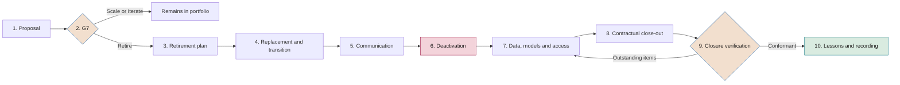

# Portfolio management

**How the company's AI initiatives are selected, prioritised, balanced, reviewed and retired**

| | |
|---|---|
| Document | Document 14 · Portfolio management |
| Version | 0.1 (working draft) |
| Date | 16-09-2026 |
| Author | Fernando García Varela |
| Status | Draft for review. The weights, scales and traffic-light thresholds are initial and will be calibrated through practical application. |

<!-- cifras: 3 | ambition lanes with their own budget ; 6 | prioritisation criteria ; 10 | steps in the retirement procedure ; 6 | programme traffic-light axes -->

---

> **Legal notice and disclaimer.** SEVEN-G is a reference methodological framework provided "as is" and for information purposes only. It does not constitute legal, regulatory, financial or professional advice, nor does it guarantee compliance with any law or standard. References to general regulation (such as the EU AI Act, the GDPR, DORA or NIS2), to technical standards and to regulation specific to each sector or jurisdiction may be incomplete, may not apply to a particular case or may become out of date as a result of regulatory changes, interpretations or supervisory positions after their consultation date. **Each organisation that uses SEVEN-G is solely responsible for identifying the regulation that applies to it, verifying that it is current and certifying its own regulatory compliance**, with the appropriate qualified advice. This methodology is a generic, free aid shared with the community so that nobody has to start from scratch; each person or organisation can and should adapt it to its own use. It must not be inferred that its legally sensitive parts have been reviewed by legal counsel: those reviews, for each company or sector, are the ultimate responsibility of the company, consultant or organisation that uses it. Although every effort is made to keep it up to date, some regulation may have changed without being reflected here. To the fullest extent permitted by law, the author accepts no responsibility whatsoever for the effects of its application in any organisation or for its full applicability. The methodology does not grant certification of any kind. The author accepts no liability for any use made of this content or for any decisions taken on the basis of it. The data, figures, companies and cases in the examples are fictitious or illustrative.

<!-- esencial: siempre | Prioritised portfolio (C3), monthly committee review, handling of stalled initiatives and expired conditions, retirement procedure and regularisation of what existed before the framework. Weights and thresholds are each company's own; retirement and regularisation are not omitted. -->

## 1. Purpose and scope

This document develops stage **C3 · Portfolio** of the corporate cycle (01 §5.1) and ongoing portfolio management in **C4 · Oversight**. It defines how initiatives enter, how they are prioritised and funded, how the balance of ambition and risk is maintained, how the portfolio is reviewed, how stalled initiatives are handled, how an initiative is retired and how initiatives that pre-date the adoption of the framework are regularised.

It applies to all initiatives in the register (T01): in-house initiatives, third-party AI embedded in processes and corporate use of general-purpose AI that meets any Enterprise criterion (01 §1.2). The main tools are **T01 · Initiative register**, **T16 · Portfolio sphere map** and **T22 · Retirement manager**.

This document does not constitute legal advice.

### 1.1 Portfolio management principles

1. **The portfolio executes the thesis.** What is funded is what fits the AI thesis, the ambition per sphere and the risk appetite approved in C2.
2. **Each ambition competes with its peers.** A transformation bet does not compete for the same budget or on the same criteria as an optimisation.
3. **Funding is staged.** Money is released *gate* by *gate*; no one receives the full budget on entry.
4. **Finish before starting.** Capacity is allocated first to advanced initiatives that meet their criteria.
5. **Risk adds up.** The portfolio has concentration limits, in addition to the limits of each initiative (principle 5 in 01 §3).
6. **Retiring is managing.** A planned retirement frees up resources and reduces risk; it is not a failure of the team.

---

## 2. Stage C3 · Portfolio

### 2.1 Inputs, outputs and owners

| Element | Content |
|---|---|
| **Inputs from C1** | Inventory, maturity (document 11), transformation index (12), current validated value and cost. |
| **Inputs from C2** | AI thesis, ambition per sphere, risk appetite, framework budget, return horizon, Enterprise investment threshold, reference time limits per phase and concentration limits (document 13). |
| **Mandatory outputs** (01 §5.1) | Prioritised portfolio with ambition level, sphere, intensity, budget and owners; retirement criteria; available capacity. |
| **Outputs of this document** | Budget envelopes per lane; prioritisation table; capacity plan; concentration limits applied; regularisation plan; review calendar. They are documented with the C3 portfolio plan (P36). |
| **Owner** | AI Committee, with preparation by the AI Office. |
| **Approves** | AI Committee. The board approves Transform initiatives and any transfer out of their envelope. |

### 2.2 Calendar

| Moment | What is done | Who |
|---|---|---|
| **Annual (C3)** | Building or renewing the portfolio after C2 or C5: envelopes, full prioritisation, capacity, limits. | AI Committee; board for Transform |
| **Quarterly** | Review of balance, concentration, programmes and retirements; report to the board in C4. | AI Committee |
| **Monthly** | Monitoring of the funnel, stalled initiatives, expired conditions, holds and new entries. | AI Committee |
| **Continuous** | Registration of initiatives, T01 alerts, preparation of information. | AI Office |

### 2.3 Responsibilities

**A** accountable · **R** responsible · **C** consulted · **I** informed.

| Activity | Board | AI Committee | AI Office | Sponsor | AI Risk Owner | Management control |
|---|---|---|---|---|---|---|
| Envelopes per lane | A | R | C | I | C | C |
| Prioritisation and allocation | I | A | R | C | C | C |
| Approval of Transform | A | R | C | R | C | I |
| Monthly and quarterly review | I | A | R | C | C | C |
| Concentration limits | I | A | R | I | R | I |
| Retirements | I | A (Enterprise) | R | A (Lite) | C | C |
| Regularisation | I | A | R | R | C | I |

---

## 3. Entry of initiatives into the portfolio

### 3.1 Channels

Initiatives may come from business areas, from challenges set by the board or management, from the AI Office or from supplier proposals. **Every initiative needs a business sponsor**: a supplier proposal without an internal sponsor does not enter. Document 54, section 5, sets out the eight sources use cases come from, the typical bias of each and what each lacks before entering.

### 3.2 Minimum entry record

To move from *Registered* to phase 0 (03 §3.2), the initiative provides:

| Field | Requirement |
|---|---|
| Understandable description | What it is and what it is used for, without jargon (rule 10; P31). |
| AI Sponsor and AI Product Owner | Appointed and without incompatibilities (01 §8.2). |
| Proposed sphere and ambition | Using the five questions in 00 §5.2 (T05). |
| Order of magnitude of value | With formula, marked as *estimated* (rule 4). |
| Investment up to G3 | Amount of the discovery and feasibility tranche. |
| Fit with the thesis | Thesis objective to which it contributes. |
| Foreseeable Enterprise criteria | Intensity questionnaire (T04). |

### 3.3 Preliminary filters

The following do not enter the portfolio, and are recorded with the reason: **practices prohibited** by regulation; initiatives that **duplicate** an existing one (they are merged); those that **do not require AI** (they are referred to the alternative); those that fall **outside the approved risk appetite**; and **Transform initiatives without senior management sponsorship**.

### 3.4 Entry windows

- **Optimise and Augment with Lite intensity:** continuous entry; the AI Committee is made aware of them at its monthly meeting.
- **Enterprise and Transform:** entry at the committee's monthly review, with full prioritisation (section 4). Transform initiatives are escalated to the board at its next quarterly session.

---

## 4. Prioritisation criteria

### 4.1 Four-step method

1. **Eliminatory filters** (section 3.3 and Critical residual risk without board approval).
2. **Assignment to the confirmed ambition lane**: Optimise, Augment or Transform.
3. **Scoring** with six criteria and weights specific to each lane (sections 4.2 and 4.3).
4. **Allocation of budget and capacity** in order of score within each lane, with a check on balance and concentration (sections 5 and 6).

The committee may alter the resulting order with a written justification recorded in T01. Changes affecting the Transform lane are reported to the board.

### 4.2 Criteria and weights

The **additional net value per euro** (expected additional annual net value ÷ additional investment required; rule 9) is the main criterion in Optimise and Augment. In Transform it is always calculated and shown, but it is not decisive on its own (01 §7.6).

| Criterion | What it assesses | Optimise | Augment | Transform |
|---|---|---|---|---|
| **Additional net value per euro** | Expected return on the additional investment within the C2 horizon. | 40 | 30 | 15 |
| **Fit with the thesis** | Contribution to an explicit objective of the AI thesis. | 15 | 15 | 25 |
| **Contribution to ambition per sphere** | Whether it fills a gap between the ambition set per sphere and the actual portfolio. | 5 | 10 | 15 |
| **Risk** | Expected residual risk level (document 33). | 15 | 15 | 15 |
| **Data dependency** | Availability, quality and legal basis of the data required. | 15 | 15 | 15 |
| **Capacity** | Team, supplier and adoption capacity of the receiving area. | 10 | 15 | 15 |
| **Total** | | **100** | **100** | **100** |

**Initiative score (0–100) = Σ (weight × criterion score) ÷ 5.**

### 4.3 Scoring scales

All scales run from 1 to 5. A criterion **with no data scores 0 and is shown as "no data"** (rule 8); an initiative with no data on additional net value per euro cannot pass G2.

**Additional net value per euro.** The **multiple over the horizon** is used = additional net value per euro × C2 return horizon in years. A multiple of 1 means that the additional investment is recovered within the horizon, undiscounted. It is a **prioritisation** criterion, not a feasibility criterion: economic feasibility at G3 is decided solely by NPV ≥ 0 with the horizon and rate set in C2 (document 40, section 8.3; 01 §7.6).

| Multiple over the horizon | Score |
|---|---|
| 3 or more | 5 |
| From 2 to less than 3 | 4 |
| From 1.5 to less than 2 | 3 |
| From 1 to less than 1.5 | 2 |
| Less than 1 | 1. Does not by itself prevent passing G3: NPV ≥ 0 applies at G3 (document 40). |

Initial thresholds, to be calibrated. If after G2 the amount is still only *estimated*, with no measured baseline, the score for this criterion cannot exceed 3.

| Score | Fit with the thesis | Contribution to ambition | Expected residual risk | Data dependency | Capacity |
|---|---|---|---|---|---|
| **5** | Explicit thesis objective in a priority sphere. | Fills a gap: sphere with a set ambition and no initiatives at that level. | Low | Data available, quality verified and legal basis confirmed. | Team and supplier assigned; receiving area with adoption capacity. |
| **4** | Explicit objective in a non-priority sphere. | Reinforces a level below its target. | — | Available with minor adjustments. | Team assigned; supplier being selected. |
| **3** | Permitted sphere without an explicit objective. | Neutral. | Medium | Require planned preparation within phase 3. | Capacity available in the following quarter. |
| **2** | Indirect fit. | Adds to a level already at its target. | — | Not available, but obtainable with identified data work. | Capacity available in two quarters or dependent on hiring. |
| **1** | No fit; requires justification from the sponsor. | Increases concentration in a level already above its target. | High | Non-existent or with a doubtful legal basis. | No capacity identified within 12 months. |

Critical residual risk is not scored: it is an eliminatory filter unless there is exceptional board approval within the risk appetite (document 33).

### 4.4 Rules to prevent return from blocking transformation

1. **Separate envelopes.** C2 sets the proportion of the framework budget for each lane. Initiatives compete only within their lane.
2. **Own criteria.** Transform initiatives are decided using the criteria in 01 §7.6: learning milestones, investment cap per stage, stop criteria and documented option value; not with a threshold of additional net value per euro.
3. **No silent transfers.** The Transform envelope is not reallocated to other lanes without board approval. The unused envelope is reported to the board, because it is a signal of the transformation index (signal 1).
4. **Stopping on pre-agreed criteria.** A Transform bet is stopped only on its stop criteria or on grounds of risk, not by being compared mid-stage with optimisations offering immediate return.
5. **Market evidence at the right time.** Transform is not required to have validated value before G5; at G5 it is required to provide market or customer evidence.

And, conversely, to prevent "Transform" from becoming a refuge:

6. **Verified classification.** An initiative presented as Transform that answers no to questions 1 to 4 in 00 §5.2 is reclassified and changes lane.
7. **No milestones, no bet.** A Transform proposal without learning milestones, a cap per stage and stop criteria does not enter prioritisation.

### 4.5 Illustrative example

*Illustrative data. Optimise lane; C2 return horizon: 2 years.*

| Initiative | Additional net value per euro | Multiple | Net | Thesis | Ambition | Risk | Data | Capacity | Score |
|---|---|---|---|---|---|---|---|---|---|
| IA-2026-014 Complaint classification | 1.6 | 3.2 | 5 | 4 | 3 | 5 | 4 | 4 | **90** |
| IA-2026-021 Invoice reconciliation | 0.9 | 1.8 | 3 | 5 | 3 | 5 | 5 | 3 | **78** |
| IA-2026-009 Network incident forecasting | 1.2 | 2.4 | 4 | 3 | 3 | 3 | 2 | 2 | **63** |

Calculation for IA-2026-014: (40 × 5 + 15 × 4 + 5 × 3 + 15 × 5 + 15 × 4 + 10 × 4) ÷ 5 = 450 ÷ 5 = **90**. IA-2026-009 has a better net value than IA-2026-021, but ranks behind it on risk, data and capacity: the score sets the order, and negative net value or no data is detected separately.

---

## 5. Balance of ambition and risk

### 5.1 Ambition balance

C2 sets the **target distribution** of investment across lanes and the **ambition per sphere**. SEVEN-G does not impose proportions: they depend on the thesis. The portfolio is compared with the target at each quarterly review using the spheres × ambition levels map (T16), with investment, recurring cost and value per cell.

| Deviation from the C2 target | Reading | Action |
|---|---|---|
| Up to 10 percentage points per lane | Within tolerance. | Monitoring. |
| More than 10 points for one quarter | Imbalance. | The committee proposes measures: new entries, acceleration or reallocation within the rules in 4.4. |
| More than 10 points for two quarters, or an empty Transform lane with a set ambition | Persistent imbalance. | The board is informed and confirms the ambition or modifies it in C2. |

Proportions are measured on committed investment and also on the **ambition mix by phase** (03 §3.5): a portfolio that is balanced in phase 1 but with all its Transform bets halted before G5 is not balanced.

### 5.2 Risk balance

The C2 risk appetite is translated into **portfolio limits**, which the committee reviews quarterly. The values are set by each company; for reference:

| Limit | Example wording |
|---|---|
| High residual risk | Maximum number of initiatives in production with accepted High residual risk. |
| High regulatory risk systems | Maximum number simultaneously in phases 4–5, according to control capacity. |
| Autonomy | Agents with A2 or A3 autonomy in production only with level 3 in D4 and D6 (document 11). |
| Direct exposure | Maximum proportion of investment in systems with direct exposure without independent assessment. |
| Suppliers | See section 9. |

Exceeding a limit does not stop initiatives under way, but it prevents new ones from entering the affected category until the committee approves a measure or the board modifies the appetite.

---

## 6. Capacity and staged budget

### 6.1 Structure of the framework budget

| Item | Content |
|---|---|
| **Committed recurring cost** | Operating cost of initiatives in production. It is reserved first: each go-live reduces the budget available for new initiatives in subsequent years. |
| **Optimise envelope** | Tranches 2 and 3 of its lane. |
| **Augment envelope** | Tranches 2 and 3 of its lane, including the adoption specific to each initiative. |
| **Staged Transform envelope** | Stages approved by the board, each with its cap per stage. |
| **Enablement** | Data, common platform, governance and compliance, including initiatives in spheres 08 and 09. |
| **Adoption and training** | AI literacy, role-based training and change management not charged to initiatives. |
| **Contingency** | Includes the **discovery reserve** (tranche 1 of all initiatives, phases 0–3, before their lane is confirmed), the **retirement reserve** (retirements and regularisation) and approved deviations. Allocated by the AI Committee with a record. |

The items are the seven envelopes of the framework budget approved by the board in C2 (13 §12); this section sets how the portfolio uses them. The portfolio plan records them in P36 §3.

### 6.2 Funding tranches

| Tranche | Phases funded | Released after | Limit |
|---|---|---|---|
| **1 · Discovery and feasibility** | 0–3 | G0 | Amount declared in the entry record. |
| **2 · Design and delivery** | 4–5 | G3 | Build and pilot cost from the feasibility assessment (P10). |
| **3 · Operation** | 6 | G5 | Annual recurring cost; renewed at each R6. |
| **Scaling** | New phase 0 | G7 with a Scale outcome | New cycle with its own prioritisation. |

In Transform, each approved stage is a tranche with its learning milestone; the next stage is not released until the milestone has been met. A deviation of more than 10% over the approved tranche requires approval from the body that decided the *gate*.

### 6.3 Capacity

- The AI Office maintains a **capacity plan** for scarce profiles: technical owners, data, risk, AI Auditor, security and adoption.
- The committee sets a **limit on simultaneous initiatives in phases 3 to 5** according to that capacity. Once the limit is exceeded, no new initiatives enter phase 4 until one passes G5 or is stopped.
- The capacity to **verify and decide** is also capacity: if the *gate* decision time exceeds its reference time limit (03 §3.6), the committee strengthens verification before admitting more initiatives.

---

## 7. Monthly and quarterly review

### 7.1 Monthly AI Committee review

| Item | Source | Possible decision |
|---|---|---|
| New entries and Enterprise *gates* | T01, T03 | Admit, prioritise, decide *gates*. |
| Stalled initiatives, expired conditions and holds | T01 alerts | Section 8. |
| Cost and value deviations | T12, T13 | Conditions, early R6. |
| Incidents and major or critical nonconformities | T08 | Containment, stop, retirement. |
| Funnel metrics: time in phase, decision time, conversion | T01 | Measures on bottlenecks. |

### 7.2 Quarterly portfolio review

| Item | Content | Result |
|---|---|---|
| Balance | T16 map; ambition mix by phase; deviation from C2. | Measures in section 5.1. |
| Risk and concentration | Limits in sections 5.2 and 9. | Measures or escalation to the board. |
| Value | Value by phase, realised value against hypothesis, validated proportion, weighted value if there is a track record. | Review of priorities. |
| Programmes | Traffic light in section 12. | Recovery plans. |
| Retirements | Proposed retirements and those under way. | G7 decisions. |
| Budget and capacity | Consumption by tranche and lane; capacity plan. | Reallocations within the rules in 4.4. |
| Report to the board (C4) | Summary in the response format of documents 60 and 61. | Recorded recommendations (T18). |

---

## 8. Stalled initiatives, expired conditions and initiatives on hold

The definitions and metrics are those in 03 §3.5 and §3.6.

| Situation | Treatment | Time limit |
|---|---|---|
| **Stalled** (exceeds the reference time limit for its phase) | The AI Product Owner explains the cause and the plan. The committee decides: recovery plan with a date; new justified time limit (only once per phase); move to *On hold* with a reason; early *gate*; or stop. | Explanation within 5 working days; decision at the next monthly meeting. |
| **Second stall in the same phase** | Early *gate* with the option of stopping explicitly considered. | Next monthly meeting. |
| **Expired condition** | The *gate* outcome becomes **Iterate** (01 §7.4, rule 4). If the condition affects a significant control, a major nonconformity is raised (01 §12). | Automatic on expiry. |
| **On hold** | Requires a coded reason and an expected resumption date. Time on hold does not count as time in phase, but the allocated capacity is released. | Review at each monthly meeting. |
| **Prolonged hold** (more than 90 days or two postponements) | The committee decides to resume with a firm date or to stop. The unspent tranche budget returns to its budget item. | Next monthly meeting. |

---

## 9. Risk concentration and supplier dependency

The committee analyses quarterly whether several initiatives could fail for the same cause.

| Type of concentration | What is measured | Warning signal (to be set in C2) |
|---|---|---|
| **Supplier** | Proportion of initiatives in production, recurring cost and critical functions that depend on the same supplier. | One supplier supports several critical functions or exceeds the set proportion. |
| **Foundation model** | Initiatives that depend on the same general-purpose AI model or its version. | Announced change or withdrawal of the model affecting several initiatives. |
| **Data** | Initiatives that depend on the same dataset or knowledge source. | Source with quality issues or a legal basis under review. |
| **People** | Initiatives that depend on the same key people. | One person is indispensable to several initiatives. |
| **Typical risk** | High residual risks with the same `RT-XXX-NN` code. | Same High risk in several initiatives. |
| **Sphere or area** | Concentrated investment and exposure. | Deviation from the ambition per sphere. |

**Measures.** Suppliers with requirement level **N3** (document 36) must have a tested exit plan or, at least, a documented one with an estimated cost, which is incorporated into the initiative's net value. In entities subject to DORA, ICT services supporting critical or important functions require exit strategies (Article 28 of Regulation (EU) 2022/2554). A significant change in the supplier or the foundation model triggers an extraordinary R6 of the affected initiatives.

---

## 10. Retirement procedure

Retirement is a G7 outcome (01 §6.9 and §7.3). Every retirement must record the date, reason, deciding body, replacement if any, treatment of data and models and communication to those affected (01 §6.9). This procedure also applies to **partial retirement** (reduction in scope, users or functions) and, with the adaptations in 10.10, to corporate use of AI.

### 10.1 Retirement criteria

| Trigger | Indicative criterion | Coded reason (03 §3.3) |
|---|---|---|
| Value not sustained | Realised value below the hypothesis success threshold in two consecutive R6 reviews. | Hypothesis refuted |
| Cost exceeds value | Negative annual net value over two R6 reviews without a credible correction plan. | Cost exceeds value |
| Risk | Residual risk outside the appetite, repeated S1 or S2 incidents or a critical nonconformity with no viable remedy. | Unacceptable risk |
| Regulation | Regulatory change that prohibits the use or imposes obligations that cannot be met in time. | Regulation |
| Adoption | Actual use persistently below forecast after the measures in the adoption plan. | No adoption |
| Better alternative | Another solution, with or without AI, delivers more net value or less risk. | Replaced by another solution |
| Technology or supplier | End of support, withdrawal of the foundation model or unacceptable contractual change. | Technically unfeasible |
| Strategy | The revised thesis no longer includes the sphere or objective. | Change in strategic priority |

When risk so requires, the initiative is **halted immediately** using the kill switch or the rollback plan (P19) and the formal G7 is held afterwards, within a maximum of 10 working days.

### 10.2 Owners

| Role | Responsibility in the retirement |
|---|---|
| **AI Sponsor** | Proposes or accepts the retirement; decides in Lite; is accountable for the replacement and the financial close. |
| **AI Committee** | Decides in Enterprise; informs the board when a Transform initiative or one supporting a critical function is retired. |
| **AI Product Owner** | Draws up the retirement plan; leads the transition and communication to users. |
| **AI Technical Owner** | Deactivation, dismantling of integrations, archiving of models and documentation. |
| **AI Operations Owner** | Carries out the deactivation, revokes identities and permissions, monitors until closure. |
| **AI Risk Owner** | Regulatory and retention obligations; clearance of the plan. |
| **Data protection and legal counsel** | Processing of personal data; contractual close-out with suppliers. |
| **AI Auditor or AI Office** | Verifies closure (auditor in Enterprise, office in Lite). |
| **AI Office** | Recording in T22, updating of T01 and T02, consolidation of lessons. |

### 10.3 Flow

<!-- grafico: Retirement procedure | Ten steps from proposal to recording -->

Reference time limits: retirement plan approved within 15 days (Lite) or 30 days (Enterprise) of the decision, in line with the phase 7 time limits (03 §3.6); closure verification within 30 days of deactivation.

### 10.4 Content of the retirement plan (P30)

| Block | Content |
|---|---|
| Decision | Initiative code, G7 date, body, coded reason, scope (full or partial). |
| Schedule | Change freeze date, parallel running period, deactivation date, closure date. |
| Replacement | Solution that takes over the function, acceptance criteria and capacity required (10.6). |
| Those affected | Users, customers or people affected, areas, suppliers, authorities where applicable. |
| Data, models and access | Treatment of each element (10.5). |
| Contracts | Notice periods, penalties, return or deletion of data by the supplier. |
| Retirement cost | Estimate and budget item (retirement reserve, section 6.1). |
| Retirement risks | Transition risks recorded using the scale in document 33. |
| Verification | Closure checklist and verifier. |

### 10.5 Treatment of data, models and access

| Element | Treatment |
|---|---|
| **Personal data** | Erasure or blocking according to the legal basis and retention periods (GDPR, Articles 5(1)(e) and 17); record of the deletion. |
| **Data held by the supplier** | Return or deletion in accordance with the contract, with a certificate. |
| **Models, versions and configurations** | Archiving with version and lineage (P16) for as long as there is an obligation to retain documentation or a possibility of claims; thereafter, recorded destruction. |
| **Technical documentation and activity logs** | Retention in accordance with regulation. The EU AI Act sets, among other things, 10 years for the documentation of providers of high-risk systems (Article 18) and at least six months for automatically generated logs (Articles 19 and 26(6)). Verify that this is in force at the date of consultation (September 2026). |
| **Instructions, knowledge bases and indexes** | Archiving if they support decisions that may be challenged; otherwise, recorded deletion. |
| **Identities, credentials and permissions of agents and integrations** | Revocation **before** or at the same time as deactivation. No identity may remain active. |
| **Decisions made with the system** | Retention of the traceability needed to handle claims and the rights of individuals. |
| **Inventory and register** | T02 moves the system to "retired"; T01 moves the initiative to *Retired* with the closure date. |

### 10.6 Replacement and continuity

- Options: revert to the previous process, adopt another solution, or eliminate the activity. The choice is justified in the plan.
- If reverting to the previous process, it is checked that **the capacity exists** to take it on: the released capacity may have been materialised or reassigned.
- If the replacement is another AI system, it goes through its own lifecycle; it does not inherit the *gates* of the retired system.
- When the function is critical, a parallel running period with acceptance criteria is required before deactivation.

### 10.7 Communication

| Recipient | When | Content |
|---|---|---|
| Internal users | On approval of the plan and before deactivation | Dates, alternative, training, support. |
| Customers or people affected | With sufficient notice when there is direct exposure | What changes, service channel, rights. |
| Workers' representatives | When required by law or agreements | Effect on work. |
| Suppliers | In accordance with contractual notice periods | Termination, return or deletion of data. |
| Authorities | If the system was registered or subject to regulatory notification | Update in accordance with the applicable regulation. |
| Committee, board and audit | Decision and closure | Reason, cost, lessons. |

### 10.8 Lessons learned

Every retirement, and every stop at G3 or later, produces a lessons note with: initial hypothesis; what happened; coded reason; **what early signal foreshadowed it and when it was noticed**; total investment and cost against realised value; and what change is proposed to entry criteria, templates or thresholds. The AI Office consolidates them by reason and presents them in C5 (P37 §9).

### 10.9 Retirement register (T22)

| Field | Content |
|---|---|
| Identification | Code IA-AAAA-NNN, systems affected, full or partial scope. |
| Decision | G7 date, body, decision-maker, verifier, coded reason, reference to P29 and P30. |
| Plan | Planned and actual dates for freeze, parallel running, deactivation and closure. |
| Replacement | Solution, owner, acceptance criteria met. |
| Data and models | Status of each element in 10.5 with evidence. |
| Access | Date of revocation of identities and permissions. |
| Communication | Recipients and dates. |
| Economics | Total investment, recurring cost avoided, retirement cost, cumulative realised value with its status. |
| Closure | Verification date, result, outstanding items. |
| Lessons | Link to the lessons note. |

### 10.10 Corporate use and unauthorised AI

The retirement of an AI tool for corporate use follows steps 3 to 10 with a simplified plan. Detected unauthorised use is regularised as a nonconformity (01 §1.2): authorisation, replacement or blocking; if it is blocked, 10.5 and 10.7 apply.

---

## 11. Regularisation of initiatives pre-dating the framework

Initiatives in production prior to the adoption of SEVEN-G must be regularised within the time limit approved in C2, by undergoing a continuity review equivalent to G7 (01 §14).

### 11.1 Steps

1. **Census.** Registration in T01 and T02 of everything that exists, with its actual status: idea, pilot, under construction or in production.
2. **Order by risk.** First, those that meet any Enterprise criterion (01 §9.2), in particular high regulatory risk, decisions about people, direct exposure and agents that act; then the rest.
3. **Treatment by status:**

| Actual status | Treatment | Possible outcome |
|---|---|---|
| **In production** | Review equivalent to G7 with minimum evidence: description (P31), roles (P03), intensity (P04), regulatory classification (P11), risks (P12), realised value with status (P28), manual and monitoring (P24, P25), rollback plan (P19). | Continue in production with periodic R6; continue with conditions; iterate; retire. |
| **Under construction** | It is placed in the phase that corresponds to its actual evidence and must pass the next *gate* with all the evidence from the previous phases. | Continue from that phase; pivot; stop. |
| **Pilot** | It is assessed at G3 with the pilot results. | Continue; iterate; stop. |
| **Idea** | Ordinary entry (section 3). | — |

4. **Recording.** Each regularised initiative carries the free tag "Regularisation" and the date of its review.

### 11.2 Rules

- Regularisation documentation is identified as such, with the date on which it is prepared. It does not attest to past *gates* and cannot be presented as earlier documentation: doing so is a major nonconformity (01 §7.4, rule 3).
- Reference time limit: initiatives with Enterprise criteria, six months from the approval of C2; the rest, 12 months. The company may set others in C2.
- An initiative in production that has not been regularised when the time limit expires is a major nonconformity; if it meets Enterprise criteria and has no regulatory classification, a critical one.
- The scope of the initiative is not extended during regularisation.

---

## 12. Programme traffic light

A **programme** groups related initiatives using the free tag "Programme" (03 §3.3). The traffic light summarises its status for the committee and the board.

### 12.1 Axes and initial thresholds

| Axis | Green | Amber | Red |
|---|---|---|---|
| **Schedule** | No stalled initiatives; milestones on schedule. | One stalled initiative or a milestone delayed by up to one phase reference time limit. | Several stalled initiatives or a critical milestone with a longer delay. |
| **Cost** | Deviation over the approved tranches of up to 10%. | From 10% to 25%. | More than 25% or without approval. |
| **Value** | Realised value equal to or above 90% of the amount forecast to date, with validated or declared status. | From 60% to 90%, or estimated only. | Less than 60%, or hypothesis refuted without a decision. |
| **Risk** | No residual risks outside the appetite and no open S1–S2 incidents. | High risk with mitigation on schedule or an S2 incident being managed. | Risk outside the appetite, S1 incident or open critical nonconformity. |
| **Governance** | *Gates*, R6 and conditions up to date. | One expired condition or an R6 delayed by less than one month. | Expired major nonconformity, lapsed R6 in Enterprise or system in production without a *gate*. |
| **Adoption** | Actual use equal to or above 80% of forecast. | From 50% to 80%. | Less than 50% after the measures in the plan. |

Initial thresholds, to be calibrated in C5.

### 12.2 Traffic-light rules

1. **Programme colour = worst colour of its axes.** One axis in red puts the programme in red.
2. **No data is not green.** An axis with no data is shown in grey and the programme cannot be green.
3. **Red requires a plan.** Every programme in red presents a recovery plan with an owner and date, or a proposal to stop or retire, at the next monthly review.
4. **Two quarters in red** lead the committee to decide explicitly between continuing with a revised plan, reducing scope, stopping or retiring, and the board is informed.
5. **Visible trend.** Each traffic light shows the colour for the previous quarter.

---

## 13. Associated tools and templates

| Code | Use in this document |
|---|---|
| **T01 · Initiative register** | Entry record, alerts for stalled initiatives, holds and conditions, "Programme" and "Regularisation" tags. The prioritisation score, lanes and tranches, the regularisation plan and the programme traffic light are prepared with P36 (C3 portfolio plan), with columns ready for a spreadsheet; the traffic light is presented to the board in P67. |
| **T16 · Portfolio sphere map** | Ambition balance per sphere with investment, recurring cost and value. |
| **T22 · Retirement manager** | Retirement plan, replacement, data and models, access, communication, closure verification and retirement register (section 10.9). |
| T02, T03, T04, T05, T06, T08, T09, T12, T13, T14, T17, T18 | Inventory, *gates*, intensity, ambition, risks, nonconformities, suppliers, value, costs, transformation index, dashboard and recommendations. |
| P06, P07, P08, P10, P12, P14, P19, P28, P29, P31 | Evidence used in entry, prioritisation and review. |
| **P30 · Scale or retirement decision** | G7 decision, lessons learned and retirement plan. |
| **P36 · C3 portfolio plan** | Envelopes by lane, prioritisation, capacity, concentration limits, regularisation plan, review calendar and programme traffic light (section 2.1). |
| **P37 · C5 annual review** | Lessons learned consolidated by reason (section 10.8). |

---

## 14. Related documents

| Document | Relationship |
|---|---|
| **00 · What SEVEN-G is** | Value measurement rules (§6) and ambition classification (§5.2). |
| **01 · Foundational methodology** | C3 (§5.1), phase 7 (§6.9), *gate* outcomes and rules (§7), principles, declaration of application (§14). |
| **03 · Tools and initiative register** | Statuses, taxonomy, coded reasons, funnel metrics and reference time limits. |
| **10 · Sphere map** | Ambition per sphere. |
| **11 · Maturity model** | Dimension D2 and maturity requirements for agents and Transform. |
| **12 · Transformation index** | Signals affected by the portfolio balance. |
| **13 · AI thesis and risk appetite** | Envelopes, horizon, limits and time limits used by this document. |
| **33 · Risk methodology** | Risk scale and typical risks. |
| **36 · Third parties and suppliers** | Levels N1–N3 and exit plans. |
| **40–43 · Measurement and value** | Additional net value per euro, costs and benefits realisation. |
| **90 · Implementation guide** | First portfolio and regularisation. |

---

## 15. Version control

| Version | Date | Changes |
|---|---|---|
| 0.1 | 16-09-2026 | First version. Develops C3; defines portfolio entry, prioritisation by ambition lanes with six criteria, rules to avoid blocking transformation, balance of ambition and risk, tranche-based budget, monthly and quarterly reviews, treatment of stalled initiatives and holds, concentration, full retirement procedure with register, regularisation and programme traffic light. |
