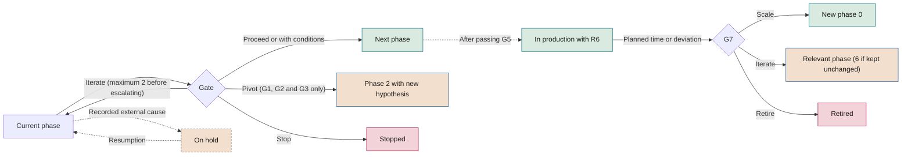

# Phase manuals

**How each phase of the lifecycle of an AI initiative is carried out, from authorisation to evolution or retirement**

| | |
|---|---|
| Document | Document 20 · Phase manuals |
| Version | 0.1 (working draft) |
| Date | 16-09-2026 |
| Author | Fernando García Varela |
| Status | Draft for review. It develops section 6 of document 01 and cannot contradict it. |

<!-- cifras: 8 | phase manuals ; 13 | sections per manual ; 4 | technology profiles ; 31 | linked evidence templates -->

---

> **Legal notice and disclaimer.** SEVEN-G is a reference methodological framework provided "as is" and for information purposes only. It does not constitute legal, regulatory, financial or professional advice, nor does it guarantee compliance with any law or standard. References to general regulation (such as the EU AI Act, the GDPR, DORA or NIS2), to technical standards and to regulation specific to each sector or jurisdiction may be incomplete, may not apply to a particular case or may become out of date as a result of regulatory changes, interpretations or supervisory positions after their consultation date. **Each organisation that uses SEVEN-G is solely responsible for identifying the regulation that applies to it, verifying that it is current and certifying its own regulatory compliance**, with the appropriate qualified advice. This methodology is a generic, free aid shared with the community so that nobody has to start from scratch; each person or organisation can and should adapt it to its own use. It must not be inferred that its legally sensitive parts have been reviewed by legal counsel: those reviews, for each company or sector, are the ultimate responsibility of the company, consultant or organisation that uses it. Although every effort is made to keep it up to date, some regulation may have changed without being reflected here. To the fullest extent permitted by law, the author accepts no responsibility whatsoever for the effects of its application in any organisation or for its full applicability. The methodology does not grant certification of any kind. The author accepts no liability for any use made of this content or for any decisions taken on the basis of it. The data, figures, companies and cases in the examples are fictitious or illustrative.

<!-- esencial: recomendado | Working guide for each phase: activities, owners, evidence and common mistakes. The mandatory content it develops is in document 01 (phases and evidence) and in document 21 (criteria). Read the phase the initiative is in; the transitions between phases (section 11) are worth knowing from the start. -->

## 1. Purpose and scope

This document turns the initiative lifecycle defined in document 01 (section 6) into working instructions. For each phase, from 0 to 7, it sets out what must be done, in what order, who does it, what evidence must exist before the decision gate and how that gate is prepared. It includes the differences by intensity (Lite or Enterprise), by ambition level and by technology, as well as the transitions between phases.

**What it does not cover and where to find it**

| Topic | Document |
|---|---|
| Criteria for each *gate* (`G<n>.<nn>`, `R6.<nn>`) and checklists (`LV-G0`…) | 21 and 22 |
| Adoption, released capacity and training | 23 |
| Bodies, roles and escalation of decisions | 30 |
| Risks, regulation, agent security, third parties and incidents | 33, 34, 35, 36 and 37 |
| Content of each piece of evidence | Templates P01–P31 |

**Scope.** AI initiatives and third-party AI embedded in processes (01 §1.2). Corporate use of general-purpose AI only goes through these manuals if it meets any Enterprise criterion (01 §9.2); otherwise it is governed through the inventory, the acceptable use policy and training (document 31).

This document does not constitute legal advice. The regulatory references were consulted in September 2026 and their validity must be checked in document 34.

---

## 2. How to use the manuals

### 2.1 Common structure

Sections 3 to 10 each develop one phase with thirteen fixed sections: **1** objective · **2** when it starts and when it ends · **3** inputs · **4** step-by-step activities · **5** roles · **6** mandatory evidence · **7** differences between Lite and Enterprise · **8** differences by ambition level · **9** technology-specific considerations · **10** reference time limit · **11** *gate* preparation · **12** common mistakes · **13** events in the register.

The AI Product Owner uses them as a working guide; the AI Technical Owner, in phases 3 to 5; the AI Operations Owner, in phase 6; the AI Sponsor, to know what to demand before a *gate*; the AI Risk Owner, for their activities and clearances; the AI Auditor and the AI Office, to know what evidence and which mistakes to look for when verifying.

### 2.2 Overview

<!-- figura: ciclo -->

| Phase | Gate | Accountable (A) | Templates | Time limit Lite / Enterprise |
|---|---|---|---|---|
| **0 · Context and constraints** | G0 · Authorisation | AI Sponsor | P01–P05 | 10 / 20 days |
| **1 · Opportunity discovery** | G1 · Opportunity | AI Sponsor | P06, P07, P31 | 20 / 30 days |
| **2 · Value hypothesis** | G2 · Hypothesis | AI Sponsor | P07, P08, P09 | 20 / 30 days |
| **3 · Feasibility and risk** | G3 · Feasibility | AI Sponsor | P04, P10–P14 | 20 / 45 days |
| **4 · Solution design** | G4 · Design | AI Technical Owner | P15–P20 | 20 / 45 days |
| **5 · Delivery and validation** | G5 · Go-live | AI Product Owner | P12, P19–P23 | 60 / 90 days |
| **6 · Operation and governance** | R6 · Continuity review | AI Operations Owner | P04, P12, P20, P24–P28 | No time limit; R6 half-yearly / quarterly |
| **7 · Evolution or retirement** | G7 · Scale or retire | AI Sponsor | P07, P28, P30 | 15 / 30 days |

Every decision is documented with the ***gate* decision record (P29)** in the *gate* manager (T03). The **use case record (P31)** is opened in phase 1 and maintained until retirement.

### 2.3 Conventions

- **Responsibilities.** Letters from 01 §8.4: **A** accountable, **R** does the work, **C** consulted, **I** informed, **V** verifies. In the activity tables, *Performed by* indicates who carries out each step; the person accountable for the whole phase is the **A** role in section 5. Short names: *Sponsor*, *Product*, *Technical*, *Operations*, *Risk*, *Auditor*.
- **Company functions.** *Involved* includes functions that are not framework roles (management control, legal counsel, data protection officer, information security, people, procurement, user area). They do not replace the roles or alter the segregation of duties.
- **Verification and decision.** In accordance with 01 §7.5. In Enterprise, the AI Auditor always verifies.
- **Technology profiles.** Four profiles: predictive ML, generative AI, agents and embedded third-party AI. *Language and document processing* follows the generative AI profile if it uses generative models and the predictive ML profile otherwise; *Vision* and *Optimisation* follow the predictive ML profile; *Rules (not AI)* does not go through the cycle. If profiles are combined, all of them apply.
- **Time limits.** They are counted from entry into the phase until the decision at its gate, excluding time on hold. Decision time (from request to decision) is also monitored separately: 5 working days in Lite and 10 in Enterprise. They are indicative (03 §3.6); the company approves them in C2 and recalibrates them in C5.
- **Vocabulary.** **Must**, mandatory; **should**, recommended; **may**, optional (01 §1.3).

### 2.4 Rules common to all phases

1. **Evidence exists before the *gate* is requested**, with author, date and version. Documentation produced after the fact invalidates the *gate* and is a major nonconformity (01 §7.4).
2. **Whoever provides evidence neither verifies it nor decides on it.**
3. **No mandatory evidence, no decision.** T03 does not allow *Proceed* to be recorded with mandatory criteria in *Not met* or *Pending*.
4. **Conditions have a deadline and an owner** and are not accepted for critical security, legal compliance or human oversight controls. Once expired, the outcome becomes *Iterate*.
5. **After two iterations at the same *gate***, the decision is escalated to the higher body.
6. **Stop criteria are not relaxed** without approval from the body that authorised the initiative.
7. **Intensity only goes up without waiting for a *gate*.** It is determined in phase 0 and reviewed at G3 and at each R6. If an Enterprise criterion appears earlier (for example, Transform ambition or an agent with the capacity to act), the initiative moves to Enterprise at that moment. A return to Lite can only be decided at G3 or R6.
8. **Every amount has a formula and a status**, and released capacity is reported separately (measurement rules 1, 2 and 3). P31 is kept in plain language (rule 10).
9. **Grouping is not omitting.** When G0–G2 or G4–G5 are grouped in Lite, each gate is recorded as a separate decision in T03 and each piece of evidence is verified.

### 2.5 Recording in T01

Event types (03 §3.3): registration; entry into and exit from a phase; *gate* request; verification; decision with outcome; creation, fulfilment or expiry of conditions; move to on hold and resumption; change of classification (ambition, intensity or regulatory); incident; nonconformity; stop; retirement. All of them carry date, author and comment. Section 13 of each manual lists those specific to the phase; on hold, conditions and nonconformities can occur in any phase.

---

## 3. Phase 0 · Context and constraints

### 3.1 Objective

Formally authorise the initiative and set its framework: strategic objective, sphere, constraints, roles, intensity and inventory registration. Question: *is the initiative authorised and within what framework?*

### 3.2 When it starts and when it ends

- **It starts** when an idea recorded in T01 (status *Registered*) has an AI Sponsor who agrees to champion it and a designated AI Product Owner, or when G7 decides to **Scale** (section 11.5).
- **It ends** with G0: *Proceed*, *Proceed with conditions*, *Iterate* or *Stop*.
- **Rule:** without G0 the initiative is not authorised; it does not consume budget or access production data (01 §6.2).

### 3.3 Inputs

Registered idea with a plain-language description (T01) · AI thesis, ambition by sphere and risk appetite (C2, document 13) · portfolio, framework budget and Enterprise investment threshold (C3, document 14) · corporate and acceptable use policy (document 31) · inventory and existing initiatives (T02, T01) · regulatory mapping and sector regulations (document 34) · if it comes from scaling, the G7 decision and lessons learned (P30).

### 3.4 Step-by-step activities

| # | Activity | Performed by | Involved |
|---|---|---|---|
| 1 | Describe the business need and the strategic objective without presupposing the solution; identify the primary and secondary sphere. | Product | Technical, user area |
| 2 | Check the fit with the thesis, the ambition of the sphere and the portfolio; search T01 and T02 for similar initiatives or systems. | Product | AI Office |
| 3 | Declare regulatory, ethical, data (availability, preliminary legal basis, special categories), budgetary, time, technological and supplier constraints. | Product | Risk, Technical, legal counsel |
| 4 | Preliminary regulatory identification with T07 (possible prohibited practice, high risk, transparency); if no conclusion can be reached, *Pending classification*. | Product | Risk |
| 5 | Assign the six roles, check incompatibilities (01 §8.2) and obtain express acceptance. The AI Auditor is appointed by the third line, not by the AI Sponsor. | Product | AI Office, third line |
| 6 | Determine the intensity with T04; if there are agents, declare the planned autonomy level (A0–A3). | Product | Risk |
| 7 | Set the budget and spending limit authorised up to G3. | Product | Management control |
| 8 | Register the planned systems in T02, even if they do not yet exist. | Product | Technical |
| 9 | Draft the charter, gather the evidence and request G0 in T03. | Product | — |

### 3.5 Roles

Sponsor **A** · Product **R** · Technical **C** · Operations **I** · Risk **C** · Auditor **V** (in Lite the AI Office verifies).

### 3.6 Mandatory evidence

| Evidence | Template | Tool |
|---|---|---|
| Initiative charter | P01 | T01 |
| Context and constraints statement | P02 | T01 |
| Role assignment record | P03 | T01 |
| Intensity determination | P04 | T04 |
| Inventory registration | P05 | T02 |

### 3.7 Differences between Lite and Enterprise

| Aspect | Lite | Enterprise |
|---|---|---|
| Templates | Fields marked *(Enterprise)* are omitted. | Complete. |
| Verification and decision | AI Office; AI Sponsor. | AI Auditor; AI Committee. |
| Grouping | G0, G1 and G2 in a single session. | Separately. |
| Regulatory identification | With T07. | With T07 and review by legal counsel. |

### 3.8 Differences by ambition level

Ambition is proposed in phase 1; in phase 0 the charter only records the **planned** ambition.

| Level | What changes |
|---|---|
| **Optimise** | Charter focused on one process and one area; fit within the area's portfolio is usually sufficient. |
| **Augment** | The groups whose work will change are identified from the outset and the people function is consulted. |
| **Transform** | It should stem from a bet planned in C2 or C3. Enterprise intensity from the outset, an AI Sponsor from senior management and a charter with stages and an investment limit for the first one. |

### 3.9 Technology-specific considerations

| Profile | What changes |
|---|---|
| **Predictive ML** | Declare whether the result will influence decisions about people (Enterprise criterion) and identify the historical data and its owner. |
| **Generative AI** | Declare exposure, type of content generated, use of third-party models and whether personal or confidential data will be input. |
| **Agents** | Declare planned autonomy and reachable systems. A2 or A3 with an effect on third parties, money, personal data or production systems implies Enterprise. |
| **Embedded third-party AI** | Identify supplier, product and function; whether it is enabled by default and what data the supplier receives. Inventory registration is mandatory. Preliminary requirement level N1–N3. |

### 3.10 Reference time limit

10 days in Lite and 20 in Enterprise.

### 3.11 Preparation of *gate* G0

- **Presented:** P01 to P05; the charter serves as a summary.
- **Verifies and decides:** Lite, AI Office and AI Sponsor; Enterprise, AI Auditor and AI Committee.
- **Criteria:** G0.nn (see document 21) and `LV-G0` (document 22), which develop 01 §6.2: committed AI Sponsor, roles without incompatibilities, fit with thesis and portfolio, known constraints.
- **Tip:** request it early enough for the verifier to have the full time available.

### 3.12 Common mistakes

- Accessing data, contracting suppliers or prototyping before G0.
- A charter that describes a technology (*implement an assistant*) rather than a need.
- Nominal roles, without availability or acceptance, or an AI Auditor chosen by the AI Sponsor.
- Lowering the intensity by omitting customer exposure or an agent's capacity to act.
- Excluding third-party AI because *it is a feature of the software we already have*.
- Generic constraints (*comply with regulations*) without identifying specific rules.

### 3.13 Events in the register

Registration · entry into phase 0 · system registration in T02 · first intensity classification and preliminary regulatory classification · G0 request, verification and decision · conditions · exit or stop with coded reason.

---

## 4. Phase 1 · Opportunity discovery

### 4.1 Objective

Identify opportunities from the business side within the authorised scope, discard those that do not require AI or have no plausible value, and propose the sphere and ambition level. Question: *is there a business opportunity that requires AI?*

### 4.2 When it starts and when it ends

- **It starts** with *Proceed* or *Proceed with conditions* at G0.
- **It ends** with G1: *Proceed*, *Proceed with conditions*, *Iterate*, *Pivot* (section 11.2) or *Stop*.

### 4.3 Inputs

Evidence and conditions from G0 (P01–P05, T03) · process or decision data: volumes, times, costs, errors (user area, management control) · stopped or retired initiatives with comparable reasons (T01) · sphere map and ambition criteria (documents 10 and 12, T05).

### 4.4 Step-by-step activities

| # | Activity | Performed by | Involved |
|---|---|---|---|
| 1 | Analyse the process or decision: steps, volumes, times, costs, errors, decision points and people. | Product | Technical, user area |
| 2 | Record the opportunities in P06 with the problem, the affected user or customer and the expected result. | Product | User area |
| 3 | Identify and compare non-AI alternatives: process redesign, rules, conventional automation, training, policy change. | Product | Technical |
| 4 | Estimate the order of magnitude of the value with a formula (units × unit value), marked *estimated*, and of the effort. | Product | Technical, management control |
| 5 | Note why each opportunity moves forward or is discarded. | Product | Risk |
| 6 | Propose sphere and ambition with the five questions in 00 §5.2 (T05, P07). | Product | AI Office |
| 7 | Draft the use case record (P31) for the selected opportunity. | Product | — |
| 8 | Review the intensity if an Enterprise criterion appears; request G1. | Product | Risk |

### 4.5 Roles

Sponsor **A** · Product **R** · Technical **C** · Operations **I** · Risk **C** · Auditor **V** (in Lite the AI Office verifies).

### 4.6 Mandatory evidence

| Evidence | Template | Tool |
|---|---|---|
| Opportunity portfolio and filtering notes | P06 | T01 |
| Non-AI alternatives considered | P06 | T01 |
| Proposed sphere and ambition level | P07 | T05 |
| Plain-language description of the case | P31 | T01 |

### 4.7 Differences between Lite and Enterprise

| Aspect | Lite | Enterprise |
|---|---|---|
| Portfolio | May be limited to one opportunity with its alternatives. | Several opportunities compared where the scope allows. |
| Verification and decision | AI Office; AI Sponsor. | AI Auditor; AI Sponsor, informing the committee. |
| Grouping | With G0 and G2. | Separately. |

### 4.8 Differences by ambition level

| Level | What changes |
|---|---|
| **Optimise** | Rigorous comparison with the non-AI alternatives: if a rule or a redesign achieves the same, it is discarded. |
| **Augment** | The roles and decisions that would change are identified, together with what people will be able to do that they cannot do today. |
| **Transform** | Exploration with customers, the market or the operating model; it is not discarded for lack of short-term return; the hypothesis of a change in offering or competition is documented. It moves to Enterprise. |

### 4.9 Technology-specific considerations

| Profile | What changes |
|---|---|
| **Predictive ML** | Check that there is historical data and that the actual outcome is observable; if it will never be known whether the prediction was right, the hypothesis will not be falsifiable. |
| **Generative AI** | Distinguish individual productivity (corporate use, document 31) from integration into a process. Prioritise tasks where errors are detectable or tolerable. |
| **Agents** | List the agent's actions and whether they are reversible; consider starting with less autonomy. |
| **Embedded third-party AI** | Check in T02 whether an already licensed tool offers the function; consider build, buy or partner. |

### 4.10 Reference time limit

20 days in Lite and 30 in Enterprise.

### 4.11 Preparation of *gate* G1

- **Presented:** P06 with alternatives and filtering notes, P07 and P31.
- **Verifies and decides:** Lite, AI Office and AI Sponsor; Enterprise, AI Auditor and AI Sponsor, informing the AI Committee.
- **Criteria:** G1.nn (see document 21) and `LV-G1`, which develop 01 §6.3: business need, contribution of AI compared with the alternatives and sufficient potential value to formulate a hypothesis.

### 4.12 Common mistakes

- Starting from the available technology and looking for a problem for it.
- Non-AI alternatives described as a mere formality.
- Counting all the process time as value, when AI changes only part of it.
- Classifying as Transform to gain visibility, or as Optimise to avoid the board.
- Not recording discarded opportunities or the reason for discarding them.

### 4.13 Events in the register

Entry into phase 1 · proposed ambition · change of intensity, where applicable · G1 request, verification and decision · conditions · exit, pivot or stop with coded reason.

---

## 5. Phase 2 · Value hypothesis

### 5.1 Objective

Formulate a measurable and falsifiable value hypothesis, with baseline, target, success threshold, attribution method and stop criteria defined before investing in construction. Question: *what value do we expect, how will we measure it and how will we know it has failed?*

### 5.2 When it starts and when it ends

- **It starts** with *Proceed* at G1 or with *Pivot* at G1, G2 or G3.
- **It ends** with G2. For Transform, G2 also requires board approval, which is recorded as part of the decision.

### 5.3 Inputs

P06, P07 and P31 approved · operational data for the baseline period (user area, systems) · unit values such as cost per hour, margin or cost per error (management control) · return horizon and thresholds (C2) · measurement rules and indicators (documents 40 and 41) · in the case of a pivot, previous evidence and reason (T01, P29).

### 5.4 Step-by-step activities

| # | Activity | Performed by | Involved |
|---|---|---|---|
| 1 | Formulate the hypothesis: *if [change] is introduced, [metric] will go from [baseline] to [target] within [time frame] for [population], measured with [method]*. | Product | Technical |
| 2 | Define the primary metric, secondary metrics and guardrail metrics (quality, complaints, errors, fairness) that must not worsen. | Product | Technical, Risk |
| 3 | Measure the baseline with real data from a representative period, with source, extraction and quality documented (P09). An estimate is only accepted if justified and marked. | Product | Technical, user area |
| 4 | Set the target and the success threshold: the minimum result that justifies proceeding. | Product | Management control |
| 5 | Choose the attribution method: control group, staggered rollout, before and after with seasonality correction, or another justified method. | Product | Technical, AI Office |
| 6 | Express the expected value in money with a formula, separating efficiencies, return and preliminary recurring cost; released capacity separately (T11). | Product | Management control |
| 7 | Confirm the ambition level with the formulated hypothesis (P07). | Product | AI Office |
| 8 | Define stop criteria (results, time limits or costs); for Transform, learning milestones and an investment limit per stage. | Product | Risk |
| 9 | For Augment and Transform, set the adoption target (document 23). Update P31 and request G2. | Product | User area |

### 5.5 Roles

Sponsor **A** · Product **R** · Technical **C** · Operations **I** · Risk **C** · Auditor **V** (in Lite the AI Office verifies). The AI Sponsor accepts the success threshold and the stop criteria and undertakes to respect them.

### 5.6 Mandatory evidence

| Evidence | Template | Tool |
|---|---|---|
| Value hypothesis canvas, attribution method and stop criteria | P08 | T11 |
| Baseline metrics | P09 | T11 |
| Confirmation of the ambition level | P07 | T05 |

### 5.7 Differences between Lite and Enterprise

| Aspect | Lite | Enterprise |
|---|---|---|
| Baseline | May be based on existing management reports if they are verifiable. | Reproducible extraction with documented source and query. |
| Attribution | Before and after acceptable with justification. | Control group or staggered rollout where feasible. |
| Verification and decision | AI Office; AI Sponsor. | AI Auditor; AI Committee; board for Transform. |

### 5.8 Differences by ambition level

| Level | What is required at G2 (01 §7.6) |
|---|---|
| **Optimise** | Baseline for cost, time or errors and expected savings with a formula, separate from released capacity. |
| **Augment** | Performance metrics (productivity, quality, conversion) and cost metrics, and an adoption target. |
| **Transform** | Return hypothesis with learning milestones, investment limit per stage and board approval. More uncertainty is accepted, but not the absence of stop criteria. |

### 5.9 Technology-specific considerations

| Profile | What changes |
|---|---|
| **Predictive ML** | Separate business metrics from model metrics; translate the business threshold into minimum model performance. The baseline is the current process (rules or expert judgement). |
| **Generative AI** | Measure the time and quality of current work by sampling with an explicit rubric; include the variable consumption cost. |
| **Agents** | Per-task metrics: tasks completed correctly, escalated to a person, erroneous actions and cost per task. |
| **Embedded third-party AI** | The benefits advertised by the supplier are neither a baseline nor a hypothesis; measurement uses the company's own data and includes licences and consumption. |

### 5.10 Reference time limit

20 days in Lite and 30 in Enterprise. For Transform, waiting for the board meeting counts as decision time.

### 5.11 Preparation of *gate* G2

- **Presented:** P08, P09, P07 confirmed and P31 updated.
- **Verifies and decides:** Lite, AI Office and AI Sponsor; Enterprise, AI Auditor and AI Committee. For Transform, the committee escalates the proposal to the board using the format in document 60.
- **Criteria:** G2.nn (see document 21) and `LV-G2`, which develop 01 §6.4: falsifiable hypothesis, measured baseline, value in money with a formula and stop criteria set before investment.

### 5.12 Common mistakes

- Non-falsifiable hypothesis (*improve the customer experience*) or one without a time frame.
- Baseline estimated without justification or taken from the supplier.
- Adding released capacity as savings.
- Model metrics instead of business metrics.
- Stop criteria so lax that they are never triggered.
- Attributing a result that another initiative also claims (measurement rule 5).

### 5.13 Events in the register

Entry into phase 2 (flagging the pivot, if any) · confirmed ambition · G2 request, verification and decision · board approval for Transform · conditions · exit, pivot or stop.

---

## 6. Phase 3 · Feasibility and risk

### 6.1 Objective

Decide whether the initiative is technically, economically, regulatorily and organisationally feasible with acceptable risk. It is the **main stop gate**: what is not stopped here is stopped later at a higher cost.

### 6.2 When it starts and when it ends

- **It starts** with *Proceed* at G2.
- **It ends** with G3: *Proceed*, *Proceed with conditions*, *Iterate*, *Pivot* or *Stop*.
- **Rule:** prohibited practices never get past this phase under any circumstances (01 §6.5).

### 6.3 Inputs

P08 and P09 approved · risk appetite, thresholds and horizon (C2) · scales and typical risks `RT-<CAT>-NN` (document 33) · regulatory mapping (document 34, T07) · authorised access to real data samples within the constraints of P02 · supplier documentation and offers · architecture and security standards.

### 6.4 Step-by-step activities

| # | Activity | Performed by | Involved |
|---|---|---|---|
| 1 | Assess the availability, quality, representativeness and legal basis of the data using real data. | Technical | Risk, data protection officer |
| 2 | Assess technical feasibility, if necessary with a test limited in scope, time and spending that does not turn into construction. | Technical | Product |
| 3 | Estimate construction and recurring costs by category (document 42, T13), including control, compliance, adoption and training. | Technical and Product | Management control, Operations |
| 4 | Calculate the expected annual net value and the additional net value per euro and compare them with the C2 horizon. | Product | Management control |
| 5 | Classify the system with legal judgement (P11, T07), including the company's role (provider or deployer). | Risk | Legal counsel |
| 6 | Carry out the required impact assessments: data protection impact assessment (Art. 35 GDPR) and fundamental rights impact assessment (Art. 27 EU AI Act) in the cases provided for. | Risk | Data protection officer, Product |
| 7 | Identify and assess inherent and residual risks with the 5 × 5 scale (P12, T06), including generative AI, agents, security and third parties. | Risk, Product and Technical | Operations |
| 8 | Define responses, the mitigation and contingency plan (P13) and acceptance of residual risk at the appropriate level. | Risk | Product, Technical |
| 9 | Assess suppliers with their requirement level N1–N3 (P14, T09). | Technical | Risk, procurement |
| 10 | Assess the impact on people with the preliminary analysis of roles and tasks (document 23). | Product | People, user area |
| 11 | Review the intensity (P04), update P31 and request G3. | Product | Risk |

Acceptance of residual risk: Low, AI Product Owner with a record; Medium, AI Sponsor with risk clearance; High, AI Committee; Critical, not accepted except with exceptional approval by the board or its board committee within the C2 appetite.

### 6.5 Roles

Sponsor **A** · Product **R** · Technical **R** · Operations **C** · Risk **R** · Auditor **V** (in Lite the AI Office verifies). Construction and control work at the same time, but risk clearance remains independent of what product and technical provide.

### 6.6 Mandatory evidence

| Evidence | Template | Tool |
|---|---|---|
| Feasibility assessment (data, technical, costs, net value) | P10 | T13 |
| Regulatory classification and impact assessments | P11 | T07 |
| Risk matrix and register | P12 | T06 |
| Mitigation and contingency plan | P13 | T06 |
| Supplier assessment, if any | P14 | T09 |
| Intensity review | P04 | T04 |

### 6.7 Differences between Lite and Enterprise

| Aspect | Lite | Enterprise |
|---|---|---|
| Regulatory classification | Mandatory; Lite simplifies the template, not the obligation. | Mandatory, with a legal report. |
| Impact assessments | Those required by law, whatever the intensity. | Those required and those decided by the committee. |
| Costs | Main categories. | All the categories in document 42. |
| Verification and decision | AI Office; AI Sponsor with risk clearance. | AI Auditor; AI Committee. |

### 6.8 Differences by ambition level

| Level | What is required at G3 (01 §7.6) |
|---|---|
| **Optimise** | Positive expected annual net value within the C2 horizon. |
| **Augment** | Feasibility of adoption and of the role change, in addition to the expected net value. |
| **Transform** | Feasibility of the first stage, stop criteria per stage and documented option value: what learning or position is gained even if the next stage is not funded. |

### 6.9 Technology-specific considerations

| Profile | What changes |
|---|---|
| **Predictive ML** | Biases in historical data, representativeness, proxy target variables and the need for explainability for oversight. |
| **Generative AI** | Representative test case set including adversarial cases; risks of incorrect or ungrounded content and of information leakage; consumption cost scenarios; supplier data use terms; transparency (document 34). |
| **Agents** | Inventory of actions and reachable systems; impact of the worst possible action; excessive permissions, unauthorised actions and indirect prompt injection; justification of the autonomy level. |
| **Embedded third-party AI** | Level N1–N3, dependency and substitutability, use of data for training, location, audit rights, notice of model changes and exit plan; DORA or NIS2 where applicable. |

### 6.10 Reference time limit

20 days in Lite and 45 in Enterprise.

### 6.11 Preparation of *gate* G3

- **Presented:** P10 to P14, P04, P31 and a one-page summary with expected net value, High and Critical residual risks and regulatory classification.
- **Verifies and decides:** Lite, AI Office and AI Sponsor with risk clearance; Enterprise, AI Auditor and AI Committee.
- **Criteria:** G3.nn (see document 21) and `LV-G3`, which develop 01 §6.5: feasibility with real data, no critical risk without accepted mitigation, classification with legal judgement (it cannot remain *Pending classification*) and net value consistent with C2.
- **Blockers:** a Critical residual risk without board approval blocks G3; conditions on legal compliance controls are not allowed.

### 6.12 Common mistakes

- Demonstrating feasibility with sample, synthetic or supplier data.
- Classifying without legal judgement or assuming that a third-party system *already complies*.
- Forgetting recurring, operating and adoption costs.
- Assessing only technical risks.
- Accepting a residual risk at a lower level than the one that applies.
- Proceeding because of the cost already incurred rather than the expected value.
- Letting the feasibility test turn into covert construction.

### 6.13 Events in the register

Entry into phase 3 · final regulatory classification · intensity review · supplier registration in T09 · G3 request, verification and decision · conditions · on hold (frequent due to data or suppliers) · exit, pivot or stop (insufficient data, technically unfeasible, cost higher than value, unacceptable risk, regulation).

---

## 7. Phase 4 · Solution design

### 7.1 Objective

Design a solution that is controllable, supervisable and reversible, in which every risk accepted at G3 has a designed control and adoption and measurement are planned from the design stage. Question: *how is it built with control, human oversight and reversibility?*

### 7.2 When it starts and when it ends

- **It starts** with *Proceed* at G3.
- **It ends** with G4: *Proceed*, *Proceed with conditions*, *Iterate* or *Stop*.
- **Lite grouping:** if G4 and G5 are resolved together, the design evidence must be completed and versioned **before construction starts**. The verifier checks the dates.

### 7.3 Inputs

Risks, responses and required controls (P12, P13) · obligations arising from the regulatory classification (P11) · metrics, baseline and attribution (P08, P09) · supplier conditions (P14) · preliminary analysis of the impact on people (P10) · architecture, security and data standards (documents 35 and 51).

### 7.4 Step-by-step activities

| # | Activity | Performed by | Involved |
|---|---|---|---|
| 1 | Define the architecture and record the decisions with the options considered (P15). | Technical | Operations, information security |
| 2 | Document data and model lineage: sources, transformations, versions, training and evaluation sets, third-party models (P16). | Technical | Data protection officer |
| 3 | Design human oversight (P17): what the system decides, what a person validates, what is never delegated, intervention criteria, how a result is overridden and information for those affected. | Technical | Product, Risk, user area |
| 4 | Design security (P18, T10): identity and permissions, least privilege, protection against injection, activity logging and, for agents, intent-based access control and kill switch. | Technical | Risk, information security |
| 5 | Trace each risk in P12 to a control and to the test that will check it in phase 5. | Technical | Risk |
| 6 | Design the instrumentation for measuring value and adoption according to the attribution method. | Technical | Product, management control |
| 7 | Define monitoring (performance, degradation, bias, costs, security, usage) and the initial alert thresholds. | Technical | Operations |
| 8 | Prepare the rollback plan (P19): triggers, procedure, owner, target time, return to the previous process, data and how to test it. | Technical | Operations, user area |
| 9 | Design adoption (P20, document 23): impact on roles, training, communication and use of released capacity. | Product | People, user area |
| 10 | Define the test and pilot plan (population, duration, control group, interruption criteria) and request G4. | Technical | Product, Risk |

### 7.5 Roles

Sponsor **I** · Product **C** · Technical **A/R** · Operations **C** · Risk **C** · Auditor **V** (in Lite the AI Office verifies). Product carries out the adoption design because it is accountable for adoption (01 §8.1); operations ensures that the solution can be operated and rolled back.

### 7.6 Mandatory evidence

| Evidence | Template | Tool |
|---|---|---|
| Architecture record | P15 | — |
| Data and model lineage | P16 | — |
| Governance and human oversight design | P17 | — |
| Security design | P18 | T10 |
| Rollback plan | P19 | — |
| Adoption plan | P20 | T20 |

### 7.7 Differences between Lite and Enterprise

| Aspect | Lite | Enterprise |
|---|---|---|
| Design review | Uninvolved technical peer. | Formal review with information security and data protection. |
| Adoption plan | Training and use of released capacity. | All the blocks of P20. |
| Verification and decision | AI Office; AI Sponsor with risk clearance. Can be grouped with G5. | AI Auditor; AI Committee. |

### 7.8 Differences by ambition level

| Level | What changes |
|---|---|
| **Optimise** | Process change is minimised and the way released capacity will materialise is planned (to whom, when, through what mechanism). |
| **Augment** | Role redesign and human oversight are the core; the user experience is tested with real users. |
| **Transform** | Staged design with decision points and an architecture that allows stopping at the end of each stage while retaining the learning; changes to the operating model (roles, decision rights) and experiments with customers. |

### 7.9 Technology-specific considerations

| Profile | What changes |
|---|---|
| **Predictive ML** | Versioning of models and data, retraining as a controlled change, decision thresholds, explanations useful to the supervisor and drift detection. |
| **Generative AI** | Authorised sources for content retrieval, input and output filters, versioned system instructions, retention of conversations in line with data protection, automated evaluations and consumption limits. |
| **Agents** | Own identity, minimum permissions per tool, closed list of actions, human validation of sensitive actions, intent-based access control, logging of intent and action, volume and amount limits and kill switch. |
| **Embedded third-party AI** | Configuration of the AI function, contractual clauses translated into technical controls, management of supplier versions and an alternative if the function changes or is withdrawn. |

### 7.10 Reference time limit

20 days in Lite and 45 in Enterprise.

### 7.11 Preparation of *gate* G4

- **Presented:** P15 to P20 and the risk → control → test traceability.
- **Verifies and decides:** Lite, AI Office and AI Sponsor with risk clearance (the AI Technical Owner is part of the team and does not decide, 01 §8.1); Enterprise, AI Auditor and AI Committee.
- **Criteria:** G4.nn (see document 21) and `LV-G4`, which develop 01 §6.6: controls required by the classification, defined human oversight, stop mechanism and a designed control for each phase 3 risk.
- **Blockers:** conditions on human oversight or critical security controls are not allowed.

### 7.12 Common mistakes

- Nominal human oversight: a person *in the loop* without the time, information or authority to intervene.
- A theoretical rollback plan, without procedure or owner.
- Forgetting instrumentation: the solution works, but the value cannot be measured.
- Broad permissions for an agent *to simplify integration*.
- Reducing adoption to a course at the end.
- Documenting the design after building.

### 7.13 Events in the register

Entry into phase 4 · verification of G3 conditions · change of intensity if the design alters autonomy, exposure or data · G4 request, verification and decision · conditions · exit or stop.

---

## 8. Phase 5 · Delivery and validation

### 8.1 Objective

Build or integrate the solution, test it and demonstrate value under real conditions before the final go-live. Theoretical results are not enough. Question: *does it work and deliver value under real conditions?*

### 8.2 When it starts and when it ends

- **It starts** with *Proceed* at G4.
- **It ends** with G5. With *Proceed* or *Proceed with conditions*, the initiative moves to *In production* and to phase 6.
- **Rule:** Enterprise go-live requires multi-level sign-off with veto power (01 §6.7).

### 8.3 Inputs

Approved design and G4 conditions (P15–P20) · test and pilot plan · authorised environments, access and data · signed contracts with suppliers · training and communication materials (P20).

### 8.4 Step-by-step activities

| # | Activity | Performed by | Involved |
|---|---|---|---|
| 1 | Build or integrate according to the design, recording deviations and their approval. If it is built with AI assistance, apply document 53. | Technical | Operations |
| 2 | Run functional, performance, bias, robustness and security tests, including prompt injection tests for generative AI and agents. | Technical | Risk, information security |
| 3 | Test each critical control in P17 and P18 and record the result. | Technical | Risk |
| 4 | Train pilot users and supervisors **before** they use the system. | Product | People, user area |
| 5 | Run the pilot with the attribution method, recording value and adoption indicators. | Product | Technical, Operations |
| 6 | Analyse results against the hypothesis and the threshold, with the status of each amount (P22). | Product | Management control |
| 7 | Test the rollback plan under realistic conditions and record time and result (P19). | Technical | Operations |
| 8 | Update the risk register with what has been observed (P12). | Technical and Product | Risk |
| 9 | Prepare operations: manual, monitoring and alerts configured, incident response plan and handover. | Technical | Operations |
| 10 | Prepare the delivery report (P21). | Technical | — |
| 11 | Obtain the go-live sign-off (P23): in Enterprise, technical, risk and compliance, information security and data protection, each with veto power; in Lite, risk clearance. Request G5. | Product | Signatories |

### 8.5 Roles

Sponsor **I** · Product **A** · Technical **R** · Operations **C** · Risk **C** · Auditor **V** (in Lite the AI Office verifies). The AI Sponsor decides G5 in Lite, with risk clearance.

### 8.6 Mandatory evidence

| Evidence | Template | Tool |
|---|---|---|
| Delivery report | P21 | — |
| Validation, test and pilot results | P22 | T11 |
| Rollback plan test | P19 | — |
| Updated risk register | P12 | T06 |
| Go-live sign-off | P23 | T03 |
| Adoption plan with training delivered | P20 | T20 |

### 8.7 Differences between Lite and Enterprise

| Aspect | Lite | Enterprise |
|---|---|---|
| Pilot | One team or a reduced volume. | Population and duration sufficient for the attribution method. |
| Go-live | Risk clearance. | Multi-level sign-off with veto power. |
| Verification and decision | AI Office; AI Sponsor with risk clearance. | AI Auditor; AI Committee after sign-off. |

### 8.8 Differences by ambition level

| Level | What is required at G5 (01 §7.6) |
|---|---|
| **Optimise** | Efficiency validated against the baseline and a plan to materialise released capacity. |
| **Augment** | Real adoption and performance improvement measured. |
| **Transform** | Market or customer evidence: usage, conversion, initial revenue or verified operational change. |

The adoption criteria at G5 are detailed in document 23.

### 8.9 Technology-specific considerations

| Profile | What changes |
|---|---|
| **Predictive ML** | Validation with recent data not used in training, bias by group, threshold calibration and comparison with the current process. |
| **Generative AI** | Test case set plus human review of a sample; rate of incorrect or ungrounded responses; injection and leakage tests; actual cost per transaction; transparency where applicable. |
| **Agents** | Tests in an isolated environment; pilot with less autonomy than the target (for example, A1 before A2); real test of the kill switch; indirect injection and limits. |
| **Embedded third-party AI** | Acceptance tests with the company's own data; check that the deployed configuration is the one contracted; rollback includes disabling the AI function. |

### 8.10 Reference time limit

60 days in Lite and 90 in Enterprise. If the attribution method requires a longer pilot, the time limit is set at G4 and recorded.

### 8.11 Preparation of *gate* G5

- **Presented:** P21, P22, P19 with the test, P12, signed P23, P20 and the operations documentation.
- **Verifies and decides:** Lite, AI Office and AI Sponsor with risk clearance; Enterprise, AI Auditor and AI Committee after the multi-level sign-off.
- **Criteria:** G5.nn (see document 21) and `LV-G5`, which develop 01 §6.7: results that meet the threshold or do so with accepted conditions, critical controls that work and operations ready.
- **Blockers:** a veto in the sign-off or a Critical residual risk without board approval.

### 8.12 Common mistakes

- Pilot without a control group or a comparable baseline.
- Declaring success with technical metrics rather than the business threshold.
- Extending the pilot until it becomes de facto production without G5 (critical nonconformity).
- Not testing rollback, or testing it in an environment that does not resemble production.
- Training users after deployment.
- Changing the success threshold after seeing the results.

### 8.13 Events in the register

Entry into phase 5 · verification of G4 conditions · incidents in tests and pilot (T08) · sign-offs · G5 request, verification and decision · move to *In production* or stop (hypothesis refuted, no adoption, unacceptable risk…).

---

## 9. Phase 6 · Operation and governance

### 9.1 Objective

Operate stably, maintain control, respond to incidents and continue measuring value. Question: *does it still work, deliver value and remain under control?* The gate is replaced by the **periodic continuity review (R6)**.

### 9.2 When it starts and when it ends

- **It starts** with *Proceed* or *Proceed with conditions* at G5 (status *In production*).
- **It has no fixed end.** It moves to phase 7 when G7 is requested: at the time planned in value tracking (P28), when an R6 detects relevant deviations or when the AI Committee so decides due to a change of strategy or a better alternative.
- **R6 frequency:** at least quarterly in Enterprise and half-yearly in Lite (01 §6.8).

### 9.3 Inputs

Solution in production with delivery report and sign-offs (P21, P23) · operations documentation (P24–P26) · tested rollback plan (P19) · hypothesis and attribution (P08, P09) · adoption plan and use of released capacity (P20) · incident and nonconformity process (document 37, T08).

### 9.4 Step-by-step activities

| # | Activity | Performed by | Involved |
|---|---|---|---|
| 1 | Operate according to the manual (P24): procedures, access, maintenance and continuity. | Operations | Technical |
| 2 | Monitor performance, degradation, bias, costs, security and usage, with alerts and owners responsible for responding (P25). | Operations | Technical |
| 3 | Manage incidents (P26), record them with severity S1–S4 (P27, T08) and notify where applicable, including possible serious incidents under the EU AI Act, DORA or NIS2 (document 37). | Operations | Risk, Technical |
| 4 | Manage changes to the model, data, instructions, supplier version or permissions with an impact assessment. If they alter classification, autonomy or intensity, the competent body decides (section 11.7). | Operations | Technical, Risk |
| 5 | Carry out the post-market monitoring required by regulation (document 34). | Operations | Risk |
| 6 | Measure the realised value with its status and the actual costs per period (P28, T12, T13). | Product | Management control |
| 7 | Track adoption and the materialisation or reassignment of released capacity (P20, document 23). | Product | User area, people |
| 8 | Maintain the risk register and the validity of the regulatory classification and of the intensity. | Risk | Product |
| 9 | Prepare the R6 and, if it detects relevant deviations, propose bringing G7 forward. | Operations and Product | Risk, Sponsor |

### 9.5 Roles

Sponsor **I** · Product **C** · Technical **C** · Operations **A/R** · Risk **C** · Auditor **V** (in Lite the AI Office verifies). The AI Product Owner continues to measure value and adoption; the AI Sponsor decides the R6 in Lite.

### 9.6 Mandatory evidence

| Evidence | Template | Tool |
|---|---|---|
| Operations manual | P24 | — |
| Monitoring and alerts | P25 | — |
| Incident response plan | P26 | T08 |
| Incident and change register | P27 | T08 |
| Value tracking | P28 | T12 |
| Risk register and intensity review at each R6 | P12, P04 | T06, T04 |
| Adoption and capacity tracking | P20 | T20 |

### 9.7 Differences between Lite and Enterprise

| Aspect | Lite | Enterprise |
|---|---|---|
| R6 | Half-yearly; AI Office and AI Sponsor. | Quarterly; AI Auditor and AI Committee. |
| Monitoring | Performance, cost and usage. | Full, with bias, security and defined on-call cover. |
| Visibility | Aggregated board dashboard. | Board dashboard by initiative. |

### 9.8 Differences by ambition level

| Level | What changes |
|---|---|
| **Optimise** | Tracking focuses on converting released capacity into materialised savings; if this does not happen, the R6 records it as a deviation. |
| **Augment** | Sustained performance and adoption, effective human oversight (override rate within the planned band) and reassigned capacity. |
| **Transform** | Each R6 reviews learning milestones, consumption of the stage investment limit and first returns. Exceeding the approved limit requires an express decision by the body that approved it, generally as G7 (*Scale*). |

### 9.9 Technology-specific considerations

| Profile | What changes |
|---|---|
| **Predictive ML** | Data and concept drift, retraining as a controlled change, bias by group and comparison of predicted and actual outcomes. |
| **Generative AI** | Periodic evaluations with a fixed set, human sampling of outputs, supplier model version changes treated as changes, consumption cost and complaints. |
| **Agents** | Review of intent and action logs, removal of unused permissions, periodic testing of the kill switch, alerts for anomalous actions and oversight of aggregates in A3. |
| **Embedded third-party AI** | Supplier changes, incidents and service levels; review of the requirement level; contract renewals as decision points. |

### 9.10 Reference time limit

No time limit (03 §3.6). It is controlled through the R6 frequency, whose decision is taken within 5 or 10 working days of the request. An overdue R6 triggers an alert in T01.

### 9.11 Preparation of the R6 review

- **Presented:** realised value against the hypothesis with its status (P28), stability and alerts (P25), incidents and changes (P27), risks (P12), validity of the classification and intensity (P11, P04) and adoption and capacity (P20).
- **Verifies and decides:** Lite, AI Office and AI Sponsor; Enterprise, AI Auditor and AI Committee.
- **Criteria:** R6.nn (see document 21) and `LV-R6`, which develop 01 §6.8.
- **Outcomes (01 §7.3):** *Proceed with operation*, *Proceed with conditions* or *Bring G7 forward*. If an incident requires the system to be stopped, there is no waiting for the R6: the response plan and, where applicable, the rollback plan are applied.

### 9.12 Common mistakes

- Treating go-live as the end of the project and withdrawing the team without handover.
- Monitoring only technical availability.
- Stopping measuring value after the first few months.
- Changing the model, instructions or supplier version without assessment or record.
- Omitting the R6 (major nonconformity).
- Ignoring repeated minor incidents or rising consumption costs.

### 9.13 Events in the register

Incidents and severity · changes · nonconformities · classification changes · request, verification and decision of each R6 · conditions · G7 brought forward (status *Awaiting G7*).

---

## 10. Phase 7 · Evolution or retirement

### 10.1 Objective

Decide on the basis of evidence whether the initiative is scaled, iterated or retired, and check the actual ambition against the declared ambition. Question: *do we scale, iterate or retire?*

### 10.2 When it starts and when it ends

- **It starts** when G7 is requested (status *Awaiting G7*): at the time planned in P28, when brought forward from an R6 or by decision of the AI Committee.
- **It ends** with G7. **Scale:** a new phase 0 for the extended scope (section 11.5), and the current solution continues operating with its R6 reviews. **Iterate:** return to the relevant phase (section 11.1); keeping the solution unchanged is *Iterate* with a return to phase 6. **Retire:** the phase closes when the retirement plan has been executed and verified.

### 10.3 Inputs

Realised value with status and actual costs (P28, T12, T13) · incidents, changes and nonconformities (P27, T08) · risks (P12) · adoption and capacity (P20) · declared ambition (P07) · current thesis and portfolio (C2, C3) · internal or market alternatives.

### 10.4 Step-by-step activities

| # | Activity | Performed by | Involved |
|---|---|---|---|
| 1 | Consolidate the realised value by type with its status and the validated proportion, and compare it with the hypothesis and the threshold. | Product | Management control |
| 2 | Calculate the realised annual net value and, for scaling, the additional net value per additional euro invested. | Product | Management control, Technical |
| 3 | Review the actual ambition with the five questions and the production evidence (P07, T05). | Product | AI Office |
| 4 | Assess accumulated risks, incidents, nonconformities, regulatory validity, adoption and released capacity. | Product | Risk, Operations, user area |
| 5 | Analyse options: scale (scope, investment, new hypothesis), iterate (to which phase and why; keeping it unchanged is iterating to phase 6) or retire (reason and replacement). | Product | Technical, Operations |
| 6 | Record the lessons learned. | Product | All roles |
| 7 | If retirement is proposed, prepare the plan (T22): date, reason, body, replacement, data and models in line with retention obligations, revocation of access and agent identities, contracts, alternative process and communication to those affected. | Product and Operations | Risk, data protection officer |
| 8 | Prepare the decision (P30), request G7 and, once decided, execute it: register the new initiative, return the initiative to its phase or execute and verify the retirement. | Product | AI Office |

### 10.5 Roles

Sponsor **A** · Product **R** · Technical **C** · Operations **C** · Risk **C** · Auditor **V** (in Lite the AI Office verifies). Operations takes part in executing the retirement.

### 10.6 Mandatory evidence

| Evidence | Template | Tool |
|---|---|---|
| Value realisation tracking | P28 | T12 |
| Scaling or retirement decision, lessons learned and retirement plan where applicable | P30 | T22 |
| Actual ambition against declared ambition | P07 | T05 |

### 10.7 Differences between Lite and Enterprise

| Aspect | Lite | Enterprise |
|---|---|---|
| Verification and decision | AI Office; AI Sponsor. | AI Auditor; AI Committee; board for scaling Transform. |
| Retirement plan | Data, access and communication. | Complete, with verification of its execution by the AI Auditor. |
| Lessons learned | Brief record in T01. | Session with all roles and record in P30. |

### 10.8 Differences by ambition level

| Level | What is required at G7 (01 §7.6) |
|---|---|
| **Optimise** | Materialised savings, not just released capacity. |
| **Augment** | Sustained performance and reassigned capacity. |
| **Transform** | Measured return and verified change in the operating model or the offering; scaling requires board approval. |

If the actual ambition is lower than the declared ambition, it is reclassified in T01. The difference feeds the transformation index (document 12) and is a signal of the *Declared but unevidenced transformation* profile.

### 10.9 Technology-specific considerations

| Profile | What changes |
|---|---|
| **Predictive ML** | Useful life of the model, cost of maintaining it and validity of scaling to populations different from those in the pilot. |
| **Generative AI** | Comparison with alternative models; a model change when scaling is a significant change. |
| **Agents** | Increasing autonomy (for example, from A2 to A3) is not a minor iteration: it is processed as *Scale* or as *Iterate* to phase 4, with a new assessment of risks and intensity. |
| **Embedded third-party AI** | Retirement includes termination or amendment of the contract, return or certified deletion of data and disabling of the function; scaling usually requires renegotiation. |

### 10.10 Reference time limit

15 days in Lite and 30 in Enterprise until the decision. Execution of the retirement is controlled using the dates in its plan in T22.

### 10.11 Preparation of *gate* G7

- **Presented:** consolidated P28, P30 with the proposed option and its alternatives, P07 with the actual ambition and a summary of risks, incidents and adoption.
- **Verifies and decides:** Lite, AI Office and AI Sponsor; Enterprise, AI Auditor and AI Committee; board for scaling Transform.
- **Criteria:** G7.nn (see document 21) and `LV-G7`, which develop 01 §6.9: decision based on realised and validated value and, in the case of retirement, a plan with date, reason, body, replacement, data and models, and communication.

### 10.12 Common mistakes

- Scaling with declared or estimated value, without validation.
- Confusing released capacity with materialised savings.
- Keeping a system in production out of inertia, without an express decision.
- Retiring without a plan: data with no basis for retention, active agent access, contracts still in force, users not informed.
- Extending the scope without a new phase 0 because *it was already approved*.
- Maintaining the declared ambition despite the evidence.

### 10.13 Events in the register

*Awaiting G7* · actual ambition · G7 request, verification and decision · board approval where applicable · registration of the linked initiative (Scale) · return to phase (Iterate) · retirement with coded reason.

---

## 11. Transitions between phases

The cycle is not linear: each gate can send the initiative back to an earlier phase, stop it or open a new cycle.

<!-- grafico: Transitions between phases | What happens to the initiative depending on the outcome of each gate -->

**Proceed with conditions.** Each condition is recorded in T03 with a deadline, an owner and the *gate* at which it will be verified. If it expires without being met, the outcome becomes *Iterate* and the initiative returns to the phase of the *gate* that imposed it; if it is already in production, it is dealt with at the next R6 or G7 is brought forward.

### 11.1 Iterate

- **When:** insufficient results with a hypothesis that is still plausible; at G7, when value or risk justify redoing a part.
- **What is done:** the activities that did not meet the criterion are repeated, the evidence is versioned again and the initiative returns to the same *gate*. From G7 it returns to phase 2 if the hypothesis changes, to phase 4 if the design changes, to phase 5 if only the construction changes or to phase 6 if the solution is kept unchanged.
- **Limit:** after two iterations at the same *gate*, the higher body decides in accordance with document 30 (in Lite, for example, from the AI Sponsor to the AI Committee).
- **Record:** time in phase continues to count and T01 increments the iteration counter.

### 11.2 Pivot

- **When:** only at G1, G2 and G3, when the hypothesis does not hold but there is a reasonable alternative.
- **What is done:** the initiative enters phase 2 with a new hypothesis and keeps the G0 context. From G1, the alternative must appear in P06 with its filtering notes; from G3, the feasibility and risk findings that remain valid are retained.
- **Limits:** if the pivot changes sphere, constraints, roles or intensity, P01 to P04 are updated and verified at G2. Stop criteria are not carried over in relaxed form. A second pivot in the same initiative should be escalated to the AI Committee.

### 11.3 Stop

- **When:** there is no plausible value, feasibility is not demonstrated, the risk is unacceptable or a stop criterion is triggered.
- **What is done:** work is closed and budget and people are released; access to data and technical identities are revoked; the T02 record is updated or deregistered; any pilot is withdrawn with its rollback plan; participants are informed and lessons learned are recorded.
- **Coded reason** (03 §3.3): no plausible value · hypothesis refuted · insufficient data · technically unfeasible · cost higher than value · unacceptable risk · regulation · no adoption · replaced by another solution · change in strategic priority.
- **Reactivation:** a stopped initiative is not resumed. If circumstances change, it is registered as a new initiative linked to the stopped one, with its own phase 0 and reusing the valid evidence.

### 11.4 On hold

- **When:** an external cause prevents progress (budget, dependency on another project, supplier, data, key people). It is not a *gate* outcome.
- **What is done:** product records the reason and the expected resumption date, with the knowledge of the AI Sponsor; controls over what has already been built are maintained. Time on hold is measured separately.
- **Expiry:** if the date arrives without resumption, T01 generates an alert and the AI Committee (the AI Sponsor in Lite) decides to resume, set a new date or stop.
- **Resumption:** the validity of the baseline, regulatory classification, supplier assessment and role assignment is checked; anything out of date is updated before the next *gate*.

A system in production does not move to *On hold*: its suspension is managed with the incident response plan or the rollback plan (documents 37 and 52) and analysed at the next R6 or at a G7 brought forward.

### 11.5 Scaling as a new phase 0

- **When:** G7 decides to extend the scope (areas, populations, countries, channels, volumes) or to increase autonomy or ambition.
- **What is done:** the extended scope is registered in T01 as a **new initiative, with its own code, linked to the originating initiative**, and goes through the cycle from phase 0. It may reuse evidence from the originating initiative, identified with its version and verified again. The intensity is determined again.
- **Originating initiative:** it continues operating with its R6 reviews until the new one absorbs or replaces it; its retirement or integration is then decided at G7.
- **Value:** the new initiative only declares the incremental value of the extended scope (measurement rule 5).

### 11.6 Retirement

It is decided at G7 and executed with P30 and T22. It records date, reason, deciding body, replacement, treatment of data and models and communication to those affected (01 §6.9). The *Retired* status is only recorded when the AI Auditor (Enterprise) or the AI Office (Lite) verifies the execution of the plan, including the revocation of access and the update of the inventory.

### 11.7 Classification changes during the cycle

| Change | Treatment |
|---|---|
| **Intensity from Lite to Enterprise** | Immediate when the criterion appears; pending work is completed with Enterprise templates and subsequent *gates* are resolved with an Enterprise verifier and decision-maker. |
| **Intensity from Enterprise to Lite** | Only at G3 or R6, with recorded justification. |
| **Ambition** | Proposed in phase 1, confirmed in phase 2 and reviewed in phase 7. A change to Transform at any other time requires Enterprise intensity and board approval before proceeding. |
| **Regulatory classification** | If it becomes high risk or a possible prohibited practice is detected, the initiative returns to phase 3 or, if it is in production, G7 is brought forward. |
| **Agent autonomy** | Any increase is a significant change: new risk assessment, intensity review and decision by the competent body before applying it. |

### 11.8 Initiatives predating adoption of the framework

They are regularised within the time limit approved in C2 through a review equivalent to G7 (01 §14). The evidence for phases 6 and 7 is prepared, together with the essential evidence from earlier phases (regulatory classification, risks, rollback plan), expressly identified as produced during regularisation, so it does not constitute documentation produced after the fact within the meaning of 01 §7.4.

---

## 12. Associated tools and templates

The templates for each phase are in the table in section 2.2 and in section 6 of each manual; P29 (*gate* decision record) is used at all gates and P31 (use case record) from phase 1 to phase 7.

| Code | Tool | Phases |
|---|---|---|
| T01 · T03 | Initiative register · *Gate* manager | All |
| T02 · T04 · T07 | Inventory · Intensity determination · Regulatory classifier | 0, 3, 6 |
| T05 | Ambition classifier | 1, 2, 7 |
| T06 · T09 · T13 | Risks · Suppliers · Costs per use case | 3–7 |
| T08 · T10 | Incidents and nonconformities · Agent security | 4–6 |
| T11 · T12 | Value hypothesis · Value realisation tracking | 2, 5, 6, 7 |
| T20 · T22 | Adoption and capacity plan · Retirement manager | 4–7 |

---

## 13. Related documents

| Document | Relationship |
|---|---|
| **01 · Foundational methodology** | Normative reference that these manuals develop. |
| **03 · Tools and initiative register** | Statuses, events, time limits and tools. |
| **12 · Transformation index** | Ambition criteria and effect of actual ambition. |
| **13 and 14 · AI thesis and portfolio management** | Thresholds, horizon, time limits and retirement criteria. |
| **21 and 22 · *Gate* criteria and checklists** | `G<n>.<nn>` and `R6.<nn>` criteria and `LV-` controls. |
| **23 · Adoption and change** | Adoption plan, released capacity and adoption criteria. |
| **30 · Governance model** | Bodies and escalation of decisions. |
| **33 to 37 · Risk, regulation, security, third parties and incidents** | Scales, obligations and controls applied in phases 3 to 6. |
| **40 to 43 · Measurement and value** | Rules, indicators, costs and benefits realisation. |
| **52 and 53 · Operations and construction** | Operations in phase 6 and AI-assisted construction in phases 4 and 5. |

---

## 14. Version control

| Version | Date | Changes |
|---|---|---|
| 0.1 | 16-09-2026 | First version. Develops phases 0–7 of document 01 with thirteen common sections, differences by intensity, ambition and technology, links to templates P01–P31 and tools from 03, and transition rules (iterate, pivot, stop, on hold, scaling, retirement, classification changes and regularisation). Consistency adjustments with 01 (segregation of duties in Lite, R6 outcomes, agent criterion) and with 34 and 37. |
