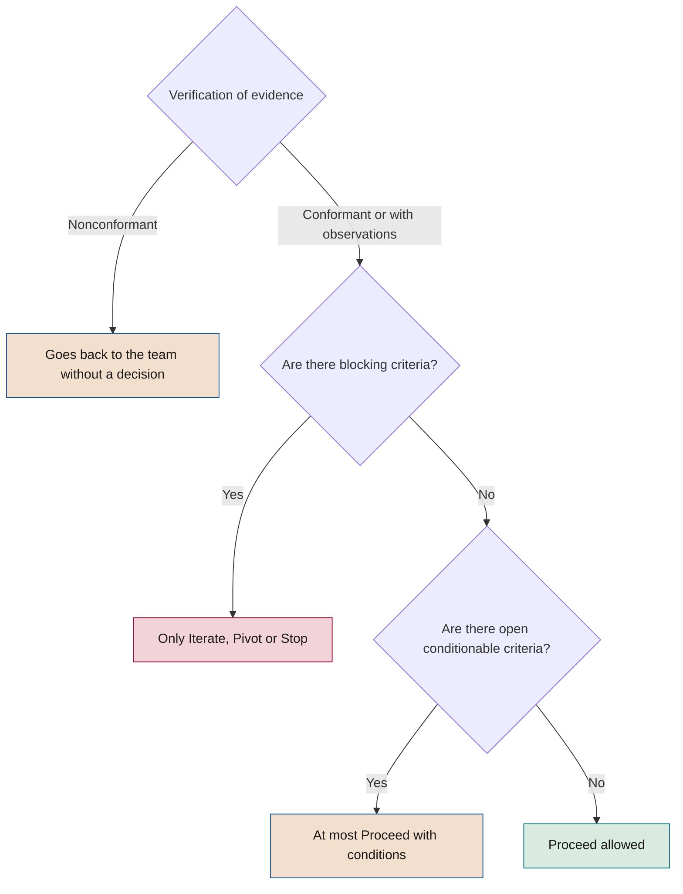

# Gate and audit criteria

**What must be met at each decision gate, how it is verified and how it is audited**

| | |
|---|---|
| Document | Document 21 · *Gate* and audit criteria |
| Version | 0.1 (working draft) |
| Date | 16-09-2026 |
| Author | Fernando García Varela |
| Status | Draft for review. Develops 01 §7 and replaces the *gate* criteria in the previous material. |

<!-- cifras: 8 | decision gates ; 128 | coded criteria ; 4 | sign-offs with veto at G5 ; 3 | audit outcomes -->

---

> **Legal notice and disclaimer.** SEVEN-G is a reference methodological framework provided "as is" and for information purposes only. It does not constitute legal, regulatory, financial or professional advice, nor does it guarantee compliance with any law or standard. References to general regulation (such as the EU AI Act, the GDPR, DORA or NIS2), to technical standards and to regulation specific to each sector or jurisdiction may be incomplete, may not apply to a particular case or may become out of date as a result of regulatory changes, interpretations or supervisory positions after their consultation date. **Each organisation that uses SEVEN-G is solely responsible for identifying the regulation that applies to it, verifying that it is current and certifying its own regulatory compliance**, with the appropriate qualified advice. The author accepts no liability for any use made of this content or for any decisions taken on the basis of it. The data, figures, companies and cases in the examples are fictitious or illustrative.

<!-- esencial: siempre | Criteria for each gate. A Lite initiative applies the criteria marked 'Yes' or 'Simpl.' in the Lite column; an Enterprise one, all of them. The common rules (section 3), valid evidence (section 4) and the 'Yes ◆' criteria are never omitted. Multi-level sign-off (section 9) and the auditor at every gate apply only in Enterprise. -->

## 1. Purpose and scope

This document sets out the **criteria that must be met to pass each decision gate** of the SEVEN-G lifecycle (G0, G1, G2, G3, G4, G5, R6 and G7), the rules for verifying evidence, the calculation of the degree of compliance, the multi-level go-live sign-off and the **criteria used to audit** that the gates have been applied correctly.

It develops section 7 of document 01 (Foundational methodology) and may not contradict it. The checklists in document 22 turn each criterion in this document into a binary control with **the same code**.

| Applies to | How |
|---|---|
| In-house AI initiatives | All applicable criteria according to intensity, ambition and technology. |
| Third-party AI integrated into processes | All criteria; those marked [TER] are added, and those relating to design and construction are read as selection, integration, contract and supplier controls. |
| Corporate use of general-purpose AI | Only if it meets any Enterprise criterion (01 §9.2); otherwise it is governed through the inventory, policy and technical controls. |
| Systems in production prior to the adoption of the framework | Review equivalent to G7 (01 §14) with the G7 criteria, supplemented by the criteria marked ◆ in G4, G5 and R6 that are applicable. |

This document does not constitute legal advice. The regulatory references were consulted in September 2026; the application dates of some obligations under the EU AI Act have been the subject of amendment proposals, so their applicability must be verified in each case.

---

## 2. How to read the criteria

### 2.1 Table columns

| Column | Content |
|---|---|
| **Code** | `G<n>.<nn>` for the gates and `R6.<nn>` for the continuity review. It is the same code used by document 22, the *gate* manager (T03) and the decision record (P29). A code is not reused even if the criterion is withdrawn. |
| **Criterion** | Verifiable condition. The initial tags delimit its scope (section 2.3). |
| **Evidence** | Template (P01–P31) or tool (T01–T22) where the proof must be found. |
| **Mandatory** | Nature of the criterion (section 2.2). |
| **Lite · Enterprise** | Whether it applies at each intensity: **Yes** (in full), **Simpl.** (with a simplified template), **Rec.** (recommended at that intensity) or **—** (not applicable at that intensity). |
| **Optimise / Augment / Transform** | How the criterion changes according to the ambition level. "—" indicates that it does not change. |

### 2.2 Mandatory nature

| Value | Meaning | Effect on the decision |
|---|---|---|
| **Yes** | Mandatory and **not conditionable**. | Must be *Met* (or justified *Not applicable*) to **Proceed** or **Proceed with conditions**. |
| **Yes ◆** | Mandatory, not conditionable and also a **critical control for security, legal compliance or human oversight** (01 §7.3). | Same as *Yes*. It is never accepted as a condition. At Enterprise G5 it grounds the veto. Its absence in a system in production is a major or critical nonconformity. |
| **Conditionable** | Mandatory. If it is not fully met, the shortfall is not critical and the evidence exists, it allows **Proceed with conditions**. | The condition carries a time limit, an owner and a means of verification, and is checked at the latest at the next *gate*. |
| **Recommended** | "Should" (01 §1.3). | May be omitted with a recorded justification. It does not block. Omitting it without justification is an audit observation. |

### 2.3 Scope tags

| Tag | Applies when | If it does not apply |
|---|---|---|
| **[GEN]** | The registered technology is *Generative AI* or *Agent*. | *Not applicable*, justified by the technology tag in the register. |
| **[AG]** | The system executes actions or prepares them for human validation (autonomy A1, A2 or A3). Section 8.2 indicates what each level requires. | *Not applicable*, justified by the approved autonomy level (A0). |
| **[TER]** | An AI supplier is involved: model, platform or software with AI functions. | *Not applicable*, justified by the suppliers field in the register. |
| **Transform / Scale / Retire / Iterate** | Only for that ambition level or for that proposed outcome. | *Not applicable* without further justification. |

### 2.4 Status of each criterion

Each criterion is recorded in T03 with one of the four statuses in document 03 §3.4: **Met** · **Not met** · **Not applicable** · **Pending**. *Not applicable* requires a justification, which the verifier validates; an unjustified *Not applicable* is treated as *Not met*.

---

## 3. Rules common to all gates

### 3.1 Dual validation

A criterion is only *Met* if both conditions in 01 §7.2 are satisfied at the same time, and the verifier records them separately:

| Dimension | Question | Example of failure |
|---|---|---|
| **R · Result** | Do the actual data, tests or results demonstrate what the criterion requires? | The hypothesis canvas is complete, but the baseline has not been measured. |
| **D · Documentation** | Does the evidence exist, is it valid (section 4) and has it been verified? | The pilot reached the threshold, but there is no dated report or version of the results. |

Results without documentation, or documentation without results, leave the criterion *Not met* or *Pending*.

### 3.2 Decision rules

The seven rules in 01 §7.4 apply, with these operational clarifications:

1. **Segregation of duties.** The author of a piece of evidence does not verify it or decide on it. The verifier does not decide. If the decision-maker provided evidence, they must abstain, and the substitute provided for in the governance model (document 30) decides.
2. **No evidence, no decision.** If the verification concludes *Nonconformant* (section 10.2), the request goes back to the team and does not reach the deciding body.
3. **Prior existence.** All evidence must be dated before the *gate* request. Corrections requested by the verifier generate a new version before the decision.
4. **Conditions.** Only on *Conditionable* criteria. Each condition has a time limit, an owner, a linked criterion and a means of verification. An expired condition turns the outcome into **Iterate**.
5. **Iterations.** After two iterations at the same *gate*, the third decision is taken by the higher body defined in document 30.
6. **Stop criteria.** They are not relaxed without the approval of the body that authorised the initiative, recorded before the affected decision.
7. **Record.** Every decision is documented in P29 and generates the corresponding events in T01.

### 3.3 Meeting the criteria is necessary, not sufficient

All criteria being *Met* allows **Proceed**, but does not require it. The competent body may decide to **Iterate**, **Pivot** or **Stop** with a recorded reason (for example, a change in strategic priority). Conversely, no body may record **Proceed** with a *Yes* or *Yes ◆* criterion that is *Not met* or *Pending*.

### 3.4 Grouped gates in Lite

At Lite intensity, G0, G1 and G2 may be resolved in a single session, as may G4 and G5 (01 §7.5). Grouping does not merge criteria: each gate keeps its own list, its status per criterion and its section in P29, and each piece of evidence is verified.

### 3.5 Board decisions in Transform

Transform initiatives are always Enterprise (01 §9.2) and require express approval by the board or its board committee at **G2** (authorisation of the bet, criterion G2.12) and at **G7** when the decision is to scale (criterion G7.09). The approval is recorded in P29 with a reference to the minutes or to the register of recommendations and decisions (document 62).

---

## 4. Valid evidence

### 4.1 Rules

A piece of evidence is valid if it passes the following fourteen rules. Document 22 turns them into the cross-cutting checklist LV-EV, with the same codes.

| Code | Rule | What is checked | If not met |
|---|---|---|---|
| **EV.01** | Identification | Initiative code, template (P) or source record, and title. | Pending |
| **EV.02** | Author | Person and role who prepares it. | Pending |
| **EV.03** | Date | Date of preparation and of last modification. | Pending |
| **EV.04** | Version | Version number; the verified version is the one linked in P29. A subsequent change requires new verification. | Pending |
| **EV.05** | Prior existence | Dated before the *gate* request, and the activity described predates the decision. Documentation prepared after the fact to justify progress already made invalidates the *gate* (01 §7.4). | Not valid · major nonconformity |
| **EV.06** | Integrity and traceability | Stored in the document repository with version history; link accessible to the verifier and the auditor from T01 or T03. | Pending |
| **EV.07** | Relevance | It refers to this initiative, its scope and the system version. Reuse of evidence from another initiative is justified. | Not valid |
| **EV.08** | Real data | Where the criterion requires results: reproducible source, period and method; amounts with a formula and status (validated, declared or estimated). | Not valid |
| **EV.09** | Approval and segregation | Approved by the appropriate person; author, verifier and decision-maker are different people. | Not valid · major nonconformity if there is self-approval |
| **EV.10** | Completeness | Mandatory fields of the template filled in; in Lite, those not marked *(Enterprise)*. Missing data are shown as "no data", not as zero. | Pending |
| **EV.11** | Consistency | Figures and statements match across evidence (for example, value in P08, P10 and P28; risks in P12 and controls in P18). | Not met until clarified |
| **EV.12** | Information protection | It contains no unnecessary personal data; access restricted according to its classification. | Observation or nonconformity, depending on the case |
| **EV.13** | System-generated evidence | Dated export or time-stamped link to logs, dashboards or test results. A screenshot with no date or source is not valid. | Not valid |
| **EV.14** | Third-party evidence | Identifiable issuer, validity and a scope that covers the contracted service (reports, certifications, supplier documentation). | Not valid |

### 4.2 Evidence accepted with shortfalls

The verifier may accept a piece of evidence with minor shortfalls (rules EV.01–EV.04, EV.06 or EV.10) only if they do not affect a *Yes* or *Yes ◆* criterion and are corrected before the decision. Rules EV.05 and EV.09 admit no exception.

---

## 5. Degree of compliance and decision rule

### 5.1 Calculation

| Indicator | Formula | Use |
|---|---|---|
| **Applicable criteria** | Total criteria for the gate − criteria that are justified *Not applicable*. | Basis for the calculation. |
| **Degree of compliance** | Criteria *Met* ÷ applicable criteria × 100. | Indicator in the register and in the funnel metrics (03 §3.5). |
| **Blocking criteria** | *Yes* or *Yes ◆* criteria that are *Not met* or *Pending*. | If greater than zero, neither Proceed nor Proceed with conditions is possible. |
| **Open conditionable criteria** | *Conditionable* criteria that are *Not met* or *Pending*. | If greater than zero and there are no blocking criteria, at most Proceed with conditions is possible. |
| **Omitted recommended criteria** | *Recommended* criteria not met, with or without justification. | Without justification, they give rise to an observation. |

The degree of compliance is **informative**: no percentage threshold allows a gate to be passed with blocking criteria.

*Illustrative example (fictitious data):* Enterprise G3 with no supplier and no generative AI: 22 criteria, 6 not applicable, 16 applicable. 14 are met; G3.14 is *Pending* and G3.10 is *Not met*, both *Conditionable*. Degree: 87.5%. No blocking criteria: at most, Proceed with conditions verifiable at G4.

### 5.2 From the status of the criteria to the outcome

<!-- grafico: From the status of the criteria to the possible outcome | The body decides within what the criteria allow -->

### 5.3 Outcomes allowed per gate

| Gate | Allowed outcomes | Mandatory outcomes |
|---|---|---|
| G0 | Proceed · Proceed with conditions · Iterate · Stop | — |
| G1, G2, G3 | Proceed · Proceed with conditions · Iterate · Pivot · Stop | G3: **Stop** if there is a prohibited practice (G3.08). |
| G4, G5 | Proceed · Proceed with conditions · Iterate · Stop | G5: no proceeding with a veto in force (section 9). |
| R6 | Proceed with operation · Proceed with conditions · Bring G7 forward | **Bring G7 forward** if any deviation in section 6.7 occurs. |
| G7 | Scale · Iterate · Retire | — |

At R6, the immediate suspension of a system is not an outcome of the review: it is triggered at any time by the incident or nonconformity process (document 37). At G7, keeping the system in operation without changes is recorded as **Iterate**, with a return to phase 6 and the date of the next R6.

---

## 6. Criteria per gate

Each gate includes its purpose, who verifies and who decides (01 §7.5), the evidence examined and the table of criteria. The ambition column develops 01 §7.6; section 7 summarises it.

### 6.1 G0 · Authorisation

**Purpose.** Formally authorise the initiative and set the framework within which it will be developed. Without an approved G0 the initiative is not authorised: it may not consume budget or access production data.

| | Lite | Enterprise |
|---|---|---|
| **Verifies** | AI Office | AI Auditor |
| **Decides** | Sponsor | AI Committee |

**Evidence:** P01 · P02 · P03 · P04 · P05 · record in T01. **Decision:** P29.

| Code | Criterion | Evidence | Mandatory | Lite | Enterprise | Optimise / Augment / Transform (if different) |
|---|---|---|---|---|---|---|
| G0.01 | The charter defines the business problem or objective, the scope, the budget for phases 1 to 3 and the signed commitment of the sponsor. | P01 | Yes | Simpl. | Yes | Transform: senior management sponsor. |
| G0.02 | The initiative fits the AI thesis and the portfolio approved in C2 and C3, with a reference to the sphere and the priority assigned. | P01 | Conditionable | Yes | Yes | Transform: it appears in the portfolio with a board decision expected at G2. |
| G0.03 | The context statement sets out the regulatory (including sector-specific), ethical, data, budgetary and time constraints. | P02 | Conditionable | Simpl. | Yes | — |
| G0.04 | The preliminary screening rules out the initiative pursuing a practice prohibited by applicable regulation. | P02 | Yes ◆ | Yes | Yes | — |
| G0.05 | The roles are assigned by name: in Lite, at least sponsor, product, technical and risk (operations, at the latest, at G4); in Enterprise, the six roles in 01 §8.1. | P03 | Yes | Yes | Yes | — |
| G0.06 | The assignment respects the incompatibilities in 01 §8.2 and the AI auditor does not report hierarchically to the sponsor. | P03 | Yes | Yes | Yes | — |
| G0.07 | The intensity is determined with the eight Enterprise criteria in 01 §9.2, with a justified answer to each one. | P04 · T04 | Yes | Yes | Yes | Transform: always Enterprise. |
| G0.08 | The initiative is registered in the register with code IA-AAAA-NNN, and the planned systems appear in the inventory with technology, exposure and supplier. | P05 · T01 · T02 | Yes | Yes | Yes | — |
| G0.09 | No construction budget has been consumed and no production data have been accessed before the decision. | P01 · T01 | Yes | Yes | Yes | — |
| G0.10 | If personal data are expected to be processed, the data protection function has been informed. | P02 | Conditionable | Rec. | Yes | — |

**Specific rules.** A breach of G0.09 detected after G0 is a major nonconformity and, if production personal data were accessed without a legal basis, it is assessed as critical. G0.04 in *Not met* leads to **Stop**.

### 6.2 G1 · Opportunity

**Purpose.** Confirm that there is a business opportunity that requires AI and that its potential value justifies formulating a hypothesis.

| | Lite | Enterprise |
|---|---|---|
| **Verifies** | AI Office | AI Auditor |
| **Decides** | Sponsor | Sponsor, informing the committee |

**Evidence:** P06 · P07 · P31 · P04 (if revised). **Decision:** P29.

| Code | Criterion | Evidence | Mandatory | Lite | Enterprise | Optimise / Augment / Transform (if different) |
|---|---|---|---|---|---|---|
| G1.01 | The opportunity arises from a specific business need: affected process or decision, responsible area and described problem. | P06 | Yes | Yes | Yes | — |
| G1.02 | The use case sheet explains what it is and what it is used for in language understandable to a non-specialist. | P31 | Conditionable | Simpl. | Yes | — |
| G1.03 | Non-AI alternatives have been analysed and it is justified what AI provides that those alternatives do not. | P06 | Yes | Yes | Yes | — |
| G1.04 | The screening notes record the discarded opportunities and the reason. | P06 | Conditionable | Simpl. | Yes | — |
| G1.05 | The potential value is estimated as an order of magnitude, with explicit assumptions and "estimated" status. | P06 | Conditionable | Yes | Yes | — |
| G1.06 | The sphere and the ambition level are proposed using the five questions of the classifier. | P07 · T05 | Yes | Yes | Yes | Transform: the proposal is communicated to the AI Committee before phase 2 begins. |
| G1.07 | The screening of the specific opportunity rules out prohibited practices, and the intensity has been reviewed if decisions about people, specially protected data or direct exposure have emerged. | P07 · P04 | Yes ◆ | Yes | Yes | — |
| G1.08 | It has been checked on a preliminary basis that the necessary data exist, who owns them and that their use is plausibly lawful. | P06 | Conditionable | Yes | Yes | — |
| G1.09 | [TER] If buying or partnering is envisaged, the supplier option and a preliminary requirement level (N1–N3) are identified. | P06 | Conditionable | Rec. | Yes | — |
| G1.10 | The affected roles and teams are identified in order to anticipate the impact on people. | P06 | Conditionable | Yes | Yes | Optimise: recommended. |

**Specific rules.** **Pivot** at G1 leads to formulating a different hypothesis in phase 2 while keeping the context approved at G0.

### 6.3 G2 · Hypothesis

**Purpose.** Approve a measurable and falsifiable value hypothesis, with a baseline, attribution method and stop criteria defined before investing.

| | Lite | Enterprise |
|---|---|---|
| **Verifies** | AI Office | AI Auditor |
| **Decides** | Sponsor | AI Committee; in addition, the board in Transform |

**Evidence:** P08 · P09 · P07 · P20 (adoption target) · P29 (board approval). **Tool:** T11.

| Code | Criterion | Evidence | Mandatory | Lite | Enterprise | Optimise / Augment / Transform (if different) |
|---|---|---|---|---|---|---|
| G2.01 | The hypothesis is falsifiable: it states what changes, in which metric, by how much, within what time frame and which result would refute it. | P08 · T11 | Yes | Yes | Yes | Transform: allows greater uncertainty if G2.11 is met. |
| G2.02 | The main and secondary metrics have a definition, formula, data source and measurement owner. | P08 | Yes | Simpl. | Yes | — |
| G2.03 | The baseline is measured with real data (period, source and method); if it is estimated, this is justified and approved by the decision-maker. | P09 | Conditionable | Yes | Yes | Optimise: cost, time or errors. Augment: performance and cost. Transform: starting position of the market or customer, where it exists. |
| G2.04 | The target and the success threshold are explicit and quantified. | P08 | Yes | Yes | Yes | — |
| G2.05 | The attribution method is chosen and justified; in Enterprise, a control group or the reason why one is not possible. | P08 | Conditionable | Yes | Yes | — |
| G2.06 | The expected value is expressed in money with a formula (units × unit value), is incremental, separates efficiencies, return and recurring cost, and declares the allocation if another case shares the result. | P08 · T11 | Yes | Yes | Yes | Optimise: expected savings with a formula. Augment: economic effect of performance and cost. Transform: staged return hypothesis. |
| G2.07 | Released capacity is reported separately from savings, with the planned way of realising or reallocating it. | P08 | Conditionable | Yes | Yes | — |
| G2.08 | The stop criteria are defined before investing, with a threshold and an evaluation date or milestone. | P08 | Yes | Yes | Yes | Transform: stop criteria per stage. |
| G2.09 | The ambition level is confirmed with evidence, and any change with respect to G1 is explained. | P07 · T05 | Yes | Yes | Yes | — |
| G2.10 | There is an adoption target: expected users, use and frequency. | P08 · P20 | Conditionable | Yes | Yes | Optimise: recommended. |
| G2.11 | Transform: the hypothesis includes learning milestones, an investment limit per stage and stop criteria per stage. | P08 | Yes | — | Yes | Transform only. |
| G2.12 | Transform: the board or its board committee has expressly approved the bet and this is recorded in the register. | P29 | Yes | — | Yes | Transform only. |
| G2.13 | The estimated investment up to G5 and the preliminary additional net value per euro are calculated. | P08 · T11 | Conditionable | Simpl. | Yes | Transform: per stage. |

**Specific rules.** If the confirmed ambition becomes Transform, the intensity becomes Enterprise and G2.11 and G2.12 apply before deciding. If an initiative approved as Transform is reclassified to a lower level, the board is informed.

### 6.4 G3 · Feasibility

**Purpose.** Decide whether the initiative is technically, economically, regulatorily and organisationally feasible with an acceptable risk. It is the **main stop gate** of the lifecycle.

| | Lite | Enterprise |
|---|---|---|
| **Verifies** | AI Office | AI Auditor |
| **Decides** | Sponsor with risk clearance | AI Committee |

**Evidence:** P10 · P11 · P12 · P13 · P14 (if there is a supplier) · P04 (review) · updated P08. **Tools:** T06 · T07 · T09 · T13.

| Code | Criterion | Evidence | Mandatory | Lite | Enterprise | Optimise / Augment / Transform (if different) |
|---|---|---|---|---|---|---|
| G3.01 | Technical feasibility is demonstrated with the company's real data (technical proof or analysis on a representative sample), not only with assumptions. | P10 | Yes | Yes | Yes | Transform: feasibility of the first stage. |
| G3.02 | The data are available, with assessed quality (completeness, representativeness, timeliness and known biases) and an identified owner. | P10 | Conditionable | Simpl. | Yes | — |
| G3.03 | The legal basis for processing personal data and data minimisation are confirmed by the data protection function. | P11 | Yes ◆ | Yes | Yes | — |
| G3.04 | Full costs are estimated by category: construction, recurring (licences, model consumption, compute, operation) and adoption. | P10 · T13 | Yes | Simpl. | Yes | — |
| G3.05 | The expected net value is consistent with the risk appetite and the return horizon set in C2, and the benefits realisation plan is in draft with its business owner of the benefit. | P10 · P08 · P62 | Yes | Yes | Yes | Optimise: positive expected annual net value within the horizon. Augment: in addition, feasibility of adoption and of the role change. Transform: feasibility of the first stage, stop criteria per stage and documented option value. |
| G3.06 | The stop criteria approved at G2 remain in force and have not been relaxed without the approval of the body that authorised the initiative. | P08 · P29 | Yes | Yes | Yes | — |
| G3.07 | The regulatory classification has been carried out with qualified legal judgement, is dated and signed, and states the company's role (provider or deployer). | P11 · T07 | Yes ◆ | Yes | Yes | — |
| G3.08 | There is no prohibited practice. If there is one, the only possible outcome is Stop. | P11 | Yes ◆ | Yes | Yes | — |
| G3.09 | It has been determined which impact assessments are required (data protection, fundamental rights, sector-specific), and those required before processing have been carried out or started with completion expected before G4. | P11 | Yes ◆ | Yes | Yes | — |
| G3.10 | The applicable regulatory obligations are linked to phase, role and evidence. | P11 | Conditionable | Simpl. | Yes | — |
| G3.11 | The risks are identified in the applicable categories and assessed using the scale in document 33 (probability × impact, inherent and residual). | P12 · T06 | Yes | Simpl. | Yes | — |
| G3.12 | No Critical residual risk lacks the express approval of the board or its board committee within the risk appetite; High risks are accepted by the AI Committee and Medium risks by the sponsor with risk clearance. | P12 · P29 | Yes ◆ | Yes | Yes | — |
| G3.13 | Each High or Critical residual risk has a mitigation and contingency plan with a control, owner and time limit. | P13 | Yes | Yes | Yes | — |
| G3.14 | Medium risks have a decided response (avoid, mitigate, transfer or accept) and an owner. | P13 | Conditionable | Simpl. | Yes | — |
| G3.15 | The intensity has been reviewed with the information from phase 3. | P04 · T04 | Yes | Yes | Yes | — |
| G3.16 | The impact on people has been assessed: affected roles and tasks, required capabilities and, where appropriate, information to or consultation with workers' representatives. | P10 · P20 | Conditionable | Simpl. | Yes | Optimise: impact on tasks. Augment: feasibility of the role change. Transform: impact on the operating model. |
| G3.17 | [GEN] The RT-GEN and RT-SEG typical risks are assessed: direct and indirect prompt injection, information leakage, erroneous or fabricated content, excessive permissions and unauthorised actions. | P12 | Yes ◆ | Yes | Yes | — |
| G3.18 | [GEN] The target autonomy level (A0–A3) is proposed and justified; if it is A2 or A3 with an effect on third parties, money, personal data or production systems, the intensity is Enterprise. | P04 · P12 | Yes ◆ | Yes | Yes | — |
| G3.19 | [GEN] The evaluation approach is defined: representative test sets, quality and security metrics and acceptance thresholds. | P10 | Conditionable | Simpl. | Yes | — |
| G3.20 | [TER] Each supplier is assessed at the requirement level that corresponds to it (N1–N3): security, processing and location of data, use of data for training, intellectual property, continuity, dependency and exit strategy. | P14 · P55 · T09 | Yes | Simpl. | Yes | — |
| G3.21 | [TER] The minimum contractual terms are set as a procurement requirement: confidentiality, prohibition on using the data for other purposes, incident notification, right to audit or equivalent reports (N2–N3) and return or deletion of data on termination. | P14 · P56 | Yes ◆ | Yes | Yes | — |
| G3.22 | [TER] The supplier provides, or undertakes to provide, the documentation that regulation requires of it and that the company needs to meet its own obligations. | P14 · P11 | Conditionable | Rec. | Yes | — |

**Specific rules.** Prohibited practices never get past this phase (01 §6.5). A Critical residual risk without the approval in G3.12 blocks G3. **Pivot** is admissible when the hypothesis does not hold but a reasonable alternative exists.

### 6.5 G4 · Design

**Purpose.** Approve a design that is controllable, supervisable and reversible, that covers the controls required by the risk classification, and in which each risk from phase 3 has a designed control.

| | Lite | Enterprise |
|---|---|---|
| **Verifies** | AI Office | AI Auditor |
| **Decides** | Sponsor with risk clearance | AI Committee |

**Evidence:** P15 · P16 · P17 · P18 · P19 · P20 · P22 (test and pilot plan) · updated P11 and P14. **Tools:** T10 · T20.

| Code | Criterion | Evidence | Mandatory | Lite | Enterprise | Optimise / Augment / Transform (if different) |
|---|---|---|---|---|---|---|
| G4.01 | The architecture record describes components, integrations, environments, third-party dependencies and decisions with their alternatives. | P15 | Conditionable | Simpl. | Yes | — |
| G4.02 | The architecture guarantees traceability: automatic logging of inputs, outputs, versions and relevant decisions, with a defined retention period. | P15 | Yes ◆ | Simpl. | Yes | — |
| G4.03 | The lineage documents data sources and transformations, model versions, training or fine-tuning data and third-party foundation models. | P16 | Conditionable | Simpl. | Yes | — |
| G4.04 | The human oversight design sets out what the system decides, what a person validates and what is never delegated, and designates who intervenes, with what authority and with what means. | P17 | Yes ◆ | Yes | Yes | — |
| G4.05 | The transparency obligations are designed: notice of interaction with AI or of generated content where appropriate, and information and a route to human review in automated decisions about people. | P17 | Yes ◆ | Yes | Yes | — |
| G4.06 | Each Medium or higher risk from phase 3 has a designed control that is traceable to the risk register. | P12 · P18 | Yes | Yes | Yes | — |
| G4.07 | The security design covers identity and access, encryption, environment segregation, secrets management and AI-specific threats (data poisoning, model extraction, evasion). | P18 | Yes ◆ | Simpl. | Yes | — |
| G4.08 | Monitoring is defined (performance, degradation, bias, cost, security and use) with thresholds, alerts and an assigned operations owner. | P15 · P03 | Conditionable | Simpl. | Yes | — |
| G4.09 | There is a stop mechanism (deactivation or switch to manual mode) with an owner and a target activation time. | P19 | Yes ◆ | Yes | Yes | — |
| G4.10 | The rollback plan defines activation criteria, procedure, owner, operational alternative and treatment of data, and provides for its testing in phase 5. | P19 | Yes | Simpl. | Yes | — |
| G4.11 | There is an adoption plan with training, communication, support and measurement of use, and the benefits realisation plan is complete and signed by the business owner of the benefit. | P20 · P62 · T20 | Conditionable | Simpl. | Yes | Optimise: how released capacity will be realised. Augment: role change and capacity reallocation. Transform: change in the operating model for the first stage. |
| G4.12 | The test plan (functional, performance, bias, robustness and security) and the pilot design with the approved attribution method have acceptance criteria. | P22 | Conditionable | Simpl. | Yes | Transform: the pilot measures the planned market or customer evidence. |
| G4.13 | The required impact assessments are completed and their measures incorporated into the design. | P11 | Yes ◆ | Yes | Yes | — |
| G4.14 | If the system is high-risk, the obligations corresponding to the company's role (risk management, data governance, technical documentation, logs, instructions for use, human oversight, accuracy and robustness) are planned with an owner. | P11 · P15 | Yes ◆ | — | Yes | — |
| G4.15 | [AG] The agent has its own identity, distinct from that of any person, with managed, rotated and revocable credentials. | P18 · T10 | Yes ◆ | Yes | Yes | — |
| G4.16 | [AG] Permissions are minimal and the limits of action are explicit: permitted tools, operations, systems, amounts, recipients and volumes. | P18 · T10 | Yes ◆ | Yes | Yes | — |
| G4.17 | [AG] There is intent-based access control: each action is linked to the instruction and purpose that originate it and, if it is sensitive, is checked against the authorised purpose before being executed. | P18 · T10 | Yes ◆ | Yes | Yes | — |
| G4.18 | [AG] There is a kill switch that immediately stops the agent and revokes its credentials, with an owner and a planned test. | P18 · P19 | Yes ◆ | Yes | Yes | — |
| G4.19 | [AG] Sensitive or irreversible actions require prior human validation according to the approved autonomy level. | P17 | Yes ◆ | Yes | Yes | — |
| G4.20 | [GEN] There are defences against prompt injection and information leakage: separation between instructions and data, external content treated as untrusted, input and output filtering and restriction of tools. | P18 · T10 | Yes ◆ | Yes | Yes | — |
| G4.21 | [GEN] The evaluation set and its thresholds (quality, grounding of responses, harmful content and security) are approved before building. | P22 | Conditionable | Simpl. | Yes | — |
| G4.22 | [TER] The clauses required in G3.21 are incorporated into the contract or the draft under negotiation, and the integration with the supplier is documented. | P14 · P56 · P15 | Conditionable | Yes | Yes | — |

**Specific rules.** In Lite, G4 and G5 may be resolved in the same session if each criterion is assessed and recorded separately. High-risk classification implies Enterprise intensity, which is why G4.14 has no Lite column.

### 6.6 G5 · Go-live

**Purpose.** Authorise go-live when the solution works, delivers value under real conditions, the critical controls operate and operations are prepared.

| | Lite | Enterprise |
|---|---|---|
| **Verifies** | AI Office | AI Auditor |
| **Decides** | Sponsor with risk clearance | AI Committee after multi-level sign-off |

**Evidence:** P21 · P22 · P19 (test) · updated P12 · P23 · P24 · P25 · P26 · P28 · P14 (contract). **Tools:** T03 · T08 · T10 · T11 · T12.

| Code | Criterion | Evidence | Mandatory | Lite | Enterprise | Optimise / Augment / Transform (if different) |
|---|---|---|---|---|---|---|
| G5.01 | The delivery report describes what has been built or integrated and the deviations from the design approved at G4, with their approval. | P21 | Conditionable | Simpl. | Yes | — |
| G5.02 | The functional and performance tests meet the acceptance criteria. | P22 | Yes | Yes | Yes | — |
| G5.03 | If the system affects people, the bias and non-discrimination tests have been carried out and the results are within the thresholds. | P22 | Yes ◆ | Yes | Yes | — |
| G5.04 | The robustness and security tests have been carried out and no critical or high vulnerabilities remain open. | P22 | Yes ◆ | Simpl. | Yes | — |
| G5.05 | [GEN] The evaluations on the approved set reach the thresholds, and direct and indirect prompt injection and information leakage tests have been passed. | P22 · T10 | Yes ◆ | Yes | Yes | — |
| G5.06 | [AG] The tests demonstrate that the limits of action and intent-based access control block unauthorised actions and that the kill switch stops the agent and revokes its credentials. | P22 · P19 · T10 | Yes ◆ | Yes | Yes | — |
| G5.07 | [AG] The autonomy level authorised for production is the one tested; any subsequent increase requires returning to G4 and G5. | P18 · P23 | Yes ◆ | Yes | Yes | — |
| G5.08 | The pilot has been run with the approved attribution method and its results reach the success threshold or do so with accepted conditions. | P22 · T11 | Conditionable | Yes | Yes | Optimise: efficiency validated against the baseline. Augment: actual adoption and performance improvement measured. Transform: market or customer evidence (use, conversion, initial revenue or verified operational change). |
| G5.09 | No stop criterion has been reached or, if one has been reached, the body that authorised the initiative has expressly decided to proceed. | P22 · P29 | Yes | Yes | Yes | — |
| G5.10 | There is a plan to realise or reallocate the released capacity, with an owner and a date. | P20 | Conditionable | Yes | Yes | Optimise: realise. Augment: reallocate. Transform: only if there is released capacity. |
| G5.11 | The rollback plan has been tested and the actual rollback time meets the target. | P19 | Yes | Yes | Yes | — |
| G5.12 | The risk register is updated with the test results, and the acceptances of residual risk are recorded at the corresponding level (G3.12). | P12 · T06 | Yes ◆ | Yes | Yes | — |
| G5.13 | The critical security, compliance and human oversight controls are active and verified in the production environment, not only designed. | P22 · P25 | Yes ◆ | Yes | Yes | — |
| G5.14 | The people who exercise human oversight are designated, trained and have the authority and means to intervene. | P17 · P20 | Yes ◆ | Yes | Yes | — |
| G5.15 | The regulatory obligations prior to putting into service are met according to the company's role (for example, for high-risk: conformity assessment, registration and instructions for use where applicable; transparency in all applicable cases). | P11 | Yes ◆ | Yes | Yes | — |
| G5.16 | Monitoring and alerts are configured and tested. | P25 | Yes | Simpl. | Yes | — |
| G5.17 | The incident response plan defines severities S1–S4, escalation and applicable regulatory notifications (serious AI incident, data protection, DORA or NIS2) with their time limits. | P26 · T08 | Yes ◆ | Simpl. | Yes | — |
| G5.18 | The operations manual is available and accepted by the operations owner. | P24 | Conditionable | Simpl. | Yes | — |
| G5.19 | Users are trained and there is evidence of AI literacy among the staff who use or oversee the system. | P20 | Conditionable | Yes | Yes | — |
| G5.20 | [TER] The contract is signed with the required clauses and the supplier appears in the supplier register. | P14 · P56 · P57 · T09 | Yes ◆ | Yes | Yes | — |
| G5.21 | Value tracking is configured (frequency, source and validation owner) and the pilot results are recorded with their status (validated, declared or estimated). | P28 · T12 | Conditionable | Simpl. | Yes | — |
| G5.22 | The conditions from previous *gates* are closed or, if they do not affect critical controls, within their time limit. | P29 · T03 | Yes | Yes | Yes | — |
| G5.23 | Go-live is signed off: in Lite, with risk clearance; in Enterprise, with multi-level sign-off and no veto in force (section 9). | P23 · T03 | Yes ◆ | Yes | Yes | — |

**Specific rules.** A system in production without an approved G5 is a critical nonconformity (01 §12). The sign-offs in P23 refer to a specific version of the system: a significant change between sign-off and go-live requires signing off again.

### 6.7 R6 · Continuity review

**Purpose.** Periodically check that the system continues to work, deliver value and remain under control, and bring G7 forward if there are relevant deviations. Minimum frequency: **quarterly in Enterprise and half-yearly in Lite**.

| | Lite | Enterprise |
|---|---|---|
| **Verifies** | AI Office | AI Auditor |
| **Decides** | Sponsor | AI Committee |

**Evidence:** P24 · P25 · P26 · P27 · P28 · P12 · P11 · P04 · P14 · P20. **Tools:** T08 · T10 · T12.

| Code | Criterion | Evidence | Mandatory | Lite | Enterprise | Optimise / Augment / Transform (if different) |
|---|---|---|---|---|---|---|
| R6.01 | The review is carried out within its frequency. | P29 · T01 | Yes | Yes | Yes | — |
| R6.02 | The realised value is measured against the hypothesis, with validation status and proportion of validated value. | P28 · T12 | Yes | Simpl. | Yes | Optimise: realised savings or reassigned capacity. Augment: sustained performance and adoption. Transform: progress against the stage milestones. |
| R6.03 | Actual costs are compared with estimated costs and deviations are explained. | P28 · T13 | Conditionable | Simpl. | Yes | — |
| R6.04 | Performance is within thresholds and model changes or retraining are recorded. | P25 · P27 | Conditionable | Yes | Yes | — |
| R6.05 | If the system affects people, the monitored bias is within thresholds. | P25 | Yes ◆ | Yes | Yes | — |
| R6.06 | Incidents are recorded with severity, containment and closure, and notifiable incidents were notified on time. | P27 · T08 | Yes ◆ | Yes | Yes | — |
| R6.07 | Significant changes (purpose, model, data, autonomy, supplier or scope) have been assessed and, where appropriate, have gone through G4 and G5. | P27 | Yes | Yes | Yes | — |
| R6.08 | The regulatory classification, the impact assessments and the intensity remain valid in the light of changes in use or regulation. | P11 · P04 | Yes ◆ | Yes | Yes | — |
| R6.09 | The risk register is updated and new risks are assessed and accepted at the corresponding level. | P12 · T06 | Conditionable | Simpl. | Yes | — |
| R6.10 | There is evidence that the critical controls work: human oversight exercised, logs retained and stop mechanism available. | P25 · P17 | Yes ◆ | Yes | Yes | — |
| R6.11 | [AG] Permissions and credentials, intent logs and blocked or anomalous actions have been reviewed, and the kill switch has been tested in the period. | P18 · P27 · T10 | Yes ◆ | Yes | Yes | — |
| R6.12 | [TER] Supplier changes (model, terms, sub-processors), its incidents and compliance with the contract have been reviewed. | P14 · P57 · T09 | Conditionable | Simpl. | Yes | — |
| R6.13 | Post-market monitoring is carried out where regulation requires it. | P25 · P11 | Yes ◆ | — | Yes | — |
| R6.14 | Adoption is measured against the target. | P20 · P28 | Conditionable | Yes | Yes | Optimise: recommended. |
| R6.15 | Open conditions and nonconformities are within their time limit. | P29 · T08 | Yes | Yes | Yes | — |
| R6.16 | It has been assessed whether any deviation requiring G7 to be brought forward has occurred, and the conclusion is recorded in the register. | P29 | Yes | Yes | Yes | — |

**Deviations that require G7 to be brought forward** (criterion R6.16):

- A stop criterion has been reached.
- The realised value falls below the success threshold in two consecutive reviews.
- The residual risk of any risk rises to High or Critical without acceptance at the corresponding level.
- An S1 incident has occurred, or recurrent S2 incidents with the same cause.
- The regulatory classification or the intensity changes.
- The supplier ceases to meet conditions required as not conditionable or announces the withdrawal of the service.

### 6.8 G7 · Scale or retire

**Purpose.** Decide with evidence whether the initiative is scaled, iterated or retired.

| | Lite | Enterprise |
|---|---|---|
| **Verifies** | AI Office | AI Auditor |
| **Decides** | Sponsor | AI Committee; in addition, the board to scale in Transform |

**Evidence:** P28 · P30 · P07 · P12 · P27 · P24 · P14 · P29. **Tools:** T05 · T12 · T22.

| Code | Criterion | Evidence | Mandatory | Lite | Enterprise | Optimise / Augment / Transform (if different) |
|---|---|---|---|---|---|---|
| G7.01 | The realised value is consolidated with its validation status; to Scale, the value that justifies it is validated. | P28 · T12 | Yes | Yes | Yes | Optimise: realised savings, not just released capacity. Augment: sustained performance and reassigned capacity. Transform: measured return and verified change in the operating model or the offering. |
| G7.02 | There is an explicit conclusion on the hypothesis (confirmed, partially confirmed or refuted) against the threshold and the stop criteria. | P30 | Yes | Yes | Yes | — |
| G7.03 | The actual ambition has been reviewed with the classifier and any difference from the declared ambition is recorded in the register. | P07 · T05 | Yes | Yes | Yes | — |
| G7.04 | The accumulated risks, incidents and nonconformities for the period have been assessed. | P12 · P27 | Yes | Simpl. | Yes | — |
| G7.05 | The total actual costs, the actual annual net value and, if scaling is proposed, the additional net value per euro of the additional investment are recorded. | P28 · P30 | Conditionable | Simpl. | Yes | — |
| G7.06 | The lessons learned are recorded. | P30 | Conditionable | Simpl. | Yes | — |
| G7.07 | Scale: the extended scope, the additional investment and the new risks are described, and a new phase 0 will be opened. | P30 | Yes | Yes | Yes | — |
| G7.08 | Scale: operations have demonstrated stability (no open S1 or S2 incidents) and capacity for the new volume. | P24 · P27 | Conditionable | Yes | Yes | — |
| G7.09 | Scale in Transform: the board or its board committee has expressly approved it. | P29 | Yes | — | Yes | Transform only. |
| G7.10 | Iterate: the phase to return to, the reason and the time limit are defined. | P30 | Yes | Yes | Yes | — |
| G7.11 | Retire: the retirement plan records the date, coded reason, deciding body, replacement, treatment of data and models (retention and deletion), revocation of access and credentials, communication to those affected and update of the inventory. | P30 · T22 | Yes ◆ | Yes | Yes | — |
| G7.12 | [TER] Retire: termination with the supplier includes the return or certified deletion of data and the removal of access. | P14 · P57 · P30 | Yes ◆ | Yes | Yes | — |

**Specific rules.** The criteria for an outcome that is not proposed (for example, G7.07 to G7.09 when Retire is proposed) are recorded as *Not applicable*. Scale opens a new phase 0 for the extended scope; it does not by itself authorise the extension.

---

## 7. Criteria differentiated by ambition level

### 7.1 Summary

This table develops 01 §7.6 and brings together the differences that the tables in section 6 set out criterion by criterion.

| Gate | Optimise | Augment | Transform |
|---|---|---|---|
| **G1** | Impact on people recommended (G1.10). | Affected roles and teams identified (G1.10). | Proposal communicated to the AI Committee (G1.06); senior management sponsor (G0.01). |
| **G2** | Baseline for cost, time or errors (G2.03); expected savings with a formula (G2.06); adoption target recommended (G2.10). | Baseline for performance and cost (G2.03); adoption target mandatory (G2.10). | Learning milestones, investment limit and stop criteria per stage (G2.08, G2.11); board approval (G2.12). |
| **G3** | Positive expected annual net value within the C2 horizon (G3.05). | Expected net value and feasibility of adoption and of the role change (G3.05, G3.16). | Feasibility of the first stage, stop criteria per stage and documented option value (G3.01, G3.05); impact on the operating model (G3.16). |
| **G4** | Plan for realising released capacity (G4.11). | Plan for role change and reallocation (G4.11). | Change in the operating model for the first stage; pilot that measures market or customer evidence (G4.11, G4.12). |
| **G5** | Efficiency validated against the baseline; plan to realise released capacity (G5.08, G5.10). | Actual adoption and performance improvement measured; reallocation plan (G5.08, G5.10). | Market or customer evidence: use, conversion, initial revenue or verified operational change (G5.08). |
| **R6** | Realised savings or reassigned capacity (R6.02); adoption recommended (R6.14). | Sustained performance and adoption (R6.02, R6.14). | Progress against the stage milestones (R6.02). |
| **G7** | Realised savings, not just released capacity (G7.01). | Sustained performance and reassigned capacity (G7.01). | Measured return and verified change in the operating model or the offering (G7.01); board approval to scale (G7.09). |

### 7.2 Application rules

1. **The confirmed level applies.** Ambition is proposed at G1, confirmed at G2 and reviewed at G7 (00 §5.2). Between G2 and G7 the criteria are assessed with the level confirmed at G2.
2. **Criteria are not mixed.** An Optimise initiative cannot justify G3 with option value; a Transform initiative is not required to show positive net value within the C2 horizon at G3, but it is required to have an investment limit and stop criteria per stage.
3. **Reclassification has effects.** Moving up to Transform requires Enterprise intensity and board approval before continuing. Moving down from Transform is reported to the board, and the criteria of the new level apply from that moment.
4. **Transform stages are controlled.** Before committing the investment for a new stage, the AI Committee should record in P29 that the learning milestones of the previous stage have been reached and that no stop criterion has been triggered, informing the board.
5. **Released capacity is not savings.** At no level is released capacity that has not been realised or reallocated accepted as realised value at G7 (measurement rule 3, 00 §6).

---

## 8. Specific criteria for generative AI, agents and third parties

### 8.1 Map of criteria by topic

| Topic | G3 | G4 | G5 | R6 | G7 |
|---|---|---|---|---|---|
| **Generative AI evaluations** | G3.19 | G4.21 | G5.05 | R6.04 | — |
| **Prompt injection and information leakage** | G3.17 | G4.20 | G5.05 | R6.06 | — |
| **Autonomy level** | G3.18 | G4.19 | G5.07 | R6.07 | — |
| **Agent identity and permissions** | G3.17 | G4.15, G4.16 | G5.06 | R6.11 | G7.11 |
| **Intent-based access control** | — | G4.17 | G5.06 | R6.11 | — |
| **Kill switch** | — | G4.18 | G5.06 | R6.11 | G7.11 |
| **AI suppliers** | G3.20, G3.21, G3.22 | G4.22 | G5.20 | R6.12 | G7.12 |

The LV-AG checklist in document 22 brings together these criteria for agents and provides the content for tool T10.

### 8.2 Requirements by autonomy level

| Requirement | A0 · Assistance | A1 · Recommendation | A2 · Supervised action | A3 · Autonomous action |
|---|---|---|---|---|
| Intensity | According to 01 §9.2 | According to 01 §9.2 | Enterprise if there is an effect on third parties, money, personal data or production | Enterprise if there is an effect on third parties, money, personal data or production |
| Own identity and minimal permissions (G4.15, G4.16) | Not applicable | If it accesses systems | Mandatory | Mandatory |
| Intent-based access control (G4.17) | Not applicable | Recommended | Mandatory | Mandatory |
| Prior human validation (G4.19) | The person decides and executes | For each action | For sensitive or irreversible actions | For actions outside the approved limits |
| Kill switch (G4.18, G5.06) | General stop mechanism (G4.09) | Recommended | Mandatory and tested | Mandatory, tested and checked at each R6 |
| Oversight | Review of the content by the person | Record of the recommendation and of the human decision | After-the-fact review by sampling | Oversight of aggregates with alerts on the limits |
| Approval of the level | At G4 | At G4 | At G4 and G5 | Express at G4 and G5, with quantitative limits |

Increasing the autonomy level of a system in production is a significant change: it requires returning to G4 and G5 (G5.07, R6.07).

### 8.3 Third-party AI by requirement level

The detail of levels N1–N3 is in document 36. For the purposes of the *gates*:

| Level | G3 | G4–G5 | R6 |
|---|---|---|---|
| **N1 · Standard** | Simplified P14; data use terms reviewed (G3.20, G3.21). | Terms accepted and recorded (G5.20). | Review of changes to the service (R6.12). |
| **N2 · Enhanced** | Full P14; right to audit or equivalent reports and incident notification (G3.21). | Clauses in a signed contract (G4.22, G5.20). | Review of incidents and contractual compliance. |
| **N3 · Critical** | In addition, exit strategy and DORA or NIS2 requirements where applicable (G3.20). | In addition, continuity or exit test where appropriate. | Review at each R6 with a dependency assessment. |

---

## 9. Multi-level go-live sign-off (G5)

### 9.1 Who signs off and what they check

In Enterprise, go-live requires **multi-level sign-off with veto power** (01 §6.7). Each sign-off is recorded in P23 and in T03 with the date, system version and criteria reviewed.

| Signatory | What they check as a minimum | Reference criteria |
|---|---|---|
| **Technical owner** | Solution delivered in accordance with the design, functional and performance tests, rollback tested, operational traceability. | G5.01, G5.02, G5.11, G4.02 |
| **Risk and compliance** | Residual risk accepted at the corresponding level, prior regulatory obligations met, human oversight operational, stop criteria. | G5.09, G5.12, G5.14, G5.15 |
| **Information security** | Security tests with no critical or high vulnerabilities, agent and injection controls, incident plan. | G5.04, G5.05, G5.06, G5.07, G5.17 |
| **Data protection** | Legal basis, impact assessments, transparency and rights, contract with the supplier as regards data. | G3.03, G4.05, G4.13, G5.20 |

The operations owner should also record their acceptance of operations (G5.18), which does not carry veto power. In **Lite**, risk clearance is sufficient (01 §9.3); if the system processes personal data, the risk owner should obtain the opinion of data protection before issuing it.

### 9.2 Sign-off and veto rules

1. **Three possible positions.** Each signatory issues a *favourable sign-off*, a *sign-off with reservations* (only on *Conditionable* criteria, which become conditions) or a *veto*.
2. **The veto is reasoned.** It indicates the codes of the criteria affected and what must be corrected.
3. **The veto blocks.** With a veto in force, neither Proceed nor Proceed with conditions is possible. The AI Committee cannot lift a veto by majority; it can only decide to **Iterate** or **Stop**.
4. **Only the person who issued the veto can lift it**, or their formal substitute in the second line, after checking the correction on a new version of the evidence.
5. **Disagreement.** If the sponsor disagrees with the veto, they may escalate the matter to the board committee, which may request an independent opinion. A veto based on security, legal compliance or data protection cannot be replaced by a risk acceptance.
6. **Segregation.** No signatory may have taken part in building the solution. If one person holds two sign-off functions, they sign off for each one and the auditor checks that there is no incompatibility.
7. **Validity.** The sign-offs refer to a version of the system. A significant change, or the lapse of the maximum period set in C2 without putting the system into production, requires signing off again.
8. **Order.** The AI Auditor verifies the evidence before the sign-offs; the committee decides after all of them.

---

## 10. Audit criteria

### 10.1 Two points of control

| Point | Who | Subject | Outcome |
|---|---|---|---|
| **Verification at the *gate*** | Verifier under 01 §7.5 (AI Auditor in Enterprise) | Evidence and status of each criterion before the decision. | Verification opinion (10.2) that accompanies the request. |
| **Subsequent audit** | AI Auditor or third line, according to the audit plan (document 38) | Sample of *gates*, decisions, conditions, operational records and retirements for a period. | Report with an outcome per audited item and classified findings (10.5). |

The AI Auditor may not have taken part in the design, construction or operation of the initiative, nor report hierarchically to its sponsor (01 §8.1).

### 10.2 Outcomes

| Outcome | In the verification of a *gate* | In a subsequent audit |
|---|---|---|
| **Conformant** | Complete and valid evidence; criterion statuses correctly assigned. The request goes to the deciding body. | Criteria correctly assessed, valid evidence and a decision consistent with the rules. No findings, except opportunities for improvement. |
| **Conformant with observations** | Shortfalls that do not affect *Yes* criteria or the validity of the evidence. The request goes to the decision-maker with the observations, which may become conditions. | Findings that do not invalidate the decision: observations and minor nonconformities. |
| **Nonconformant** | Some mandatory evidence is missing or some evidence is not valid. The request goes back to the team without a decision. | At least one major or critical nonconformity. |

A *Conformant* opinion does not mean that the initiative should proceed: it means that the body can decide on a verified basis.

### 10.3 What is sampled

The sizes are **indicative**; the company sets them in C2 or in its audit plan and recalibrates them in C5.

| Subject | Population | Selection | Indicative size |
|---|---|---|---|
| **Lite *gates*** | Lite *gates* decided in the half-year. | Random and targeted. | At least 10% with a minimum of three, including at least one G5. |
| **Enterprise *gates*** | Enterprise *gates* decided in the period (already verified by the auditor). | Targeted and random. | All G5s and at least 25% of the rest. |
| **Criteria within a *gate*** | All the criteria for the gate. | All *Yes* and *Yes ◆*; a sample of *Conditionable* and *Recommended*; all *Not applicable* on ◆ criteria. | — |
| **Evidence** | Evidence linked to the selected criteria. | Rules EV.01–EV.14 on all evidence for *Yes ◆* criteria; EV.05 and EV.09 on all evidence. | — |
| **Conditions** | Conditions open and closed in the period. | All expired conditions and a sample of the closed ones. | At least 25% of the closed ones. |
| **Operational records** | Incidents, changes, human interventions and agent actions of systems in production. | Targeted at S1, S2 and significant changes; random for the rest. | According to the audit plan. |
| **Stops and retirements** | Initiatives stopped or retired in the period. | Random. | At least one per quarter, if any. |

**Targeted selection.** Priority is given to: initiatives with two or more iterations at a *gate*; expired conditions; reference time limits exceeded; changes of intensity from Enterprise to Lite; *Not applicable* on ◆ criteria; decisions taken on the same day as the request; High residual risks; Transform initiatives; A2 or A3 agents; N3 suppliers; systems with incidents in the period.

### 10.4 Audit tests

| Test | What the auditor does | Example |
|---|---|---|
| **Inspection** | Examines the evidence against the criterion and the EV rules. | Checks that the baseline in P09 has a period, source and method. |
| **Time traceability** | Compares the dates of the evidence with the events in T01. | Detects a pilot report dated after the G5 decision. |
| **Re-performance** | Repeats a calculation or a check. | Recalculates the net value in P28; compares an agent's actual permissions with those approved in P18. |
| **Observation** | Witnesses the performance of a control. | Attends the kill switch or rollback test. |
| **Interview** | Checks what is documented with the people involved. | Asks the person who exercises human oversight how they intervene and when they have done so. |
| **Consistency** | Compares pieces of evidence with each other. | Risks in P12 against controls in P18; value in P08 against P10 and P28. |

### 10.5 Classification of findings

Findings are classified using the nonconformity scale in 01 §12, preceded by the observation, which is not a breach.

<!-- figura: no-conformidades -->

| Type | Definition | Examples in *gates* and audits |
|---|---|---|
| **Observation** | Opportunity for improvement without a breach of a requirement. | Recommended criterion omitted without justification; evidence that is correct but difficult to locate. |
| **Minor nonconformity** | Breach with no impact on the decision. | Incomplete evidence on a *Conditionable* criterion that does not change the outcome; delay in updating T01; *Not applicable* with insufficient justification on a non-◆ criterion. |
| **Major nonconformity** | Breach that invalidates the decision or affects a relevant control. | Evidence prepared after the fact; self-approval or omitted verification; Proceed recorded with a blocking criterion; stop criteria relaxed without approval; expired condition on a relevant control; R6 omitted; Transform without board approval at G2; unjustified *Not applicable* on a *Yes* criterion; third iteration without escalation. |
| **Critical nonconformity** | Breach with an immediate risk to people, legal compliance or the company. | System in production without an approved G5; prohibited practice; serious incident not notified; critical control deactivated or non-existent in production (human oversight, logs, kill switch); agent operating above its approved autonomy level; go-live with a veto in force; Critical residual risk in production without board approval. |

**Classification rules**

1. Classification is based on the most serious effect on the decision, people or compliance.
2. A breach of a *Yes ◆* criterion in a system in production is, at a minimum, a major nonconformity.
3. Any finding that invalidates a *gate* decision is, at a minimum, a major nonconformity.
4. A minor nonconformity that recurs three times in twelve months in the same initiative or process is raised to major (37 §3.3).
5. The deliberate concealment or alteration of evidence is, at a minimum, a major nonconformity and is reported to the board committee.

### 10.6 Effects on the decision and time limits

| Type | Effect on the *gate* | Containment | Action plan | Reported to |
|---|---|---|---|---|
| **Critical** | The *gate* is invalidated. | Immediate (maximum 48 hours), including stopping the system if necessary. | Maximum 10 days. | AI Committee and board committee. |
| **Major** | If it invalidates the decision, the initiative returns to *Awaiting gate* and is verified again. If it is already in production, the committee decides whether to maintain operation with containment measures. | Maximum 10 days. | Maximum 30 days. | AI Committee. |
| **Minor** | The decision stands. | Not required. | Before the next *gate* or review. | AI Office. |

The time limits are reference values and the company may adjust them in C2 without exceeding those established by applicable regulation (01 §12). Each nonconformity is recorded with code NC-AAAA-NNN in T08 and managed through the process in document 37.

### 10.7 Minimum content of the audit report

Scope and period · population and sample with selection criterion · tests performed · outcome per audited item (Conformant, Conformant with observations or Nonconformant) · findings with the code of the affected criterion or EV rule, classification, cause and owner · open nonconformities in T08 · follow-up of previous findings · conclusion on the functioning of the gates in the period.

The report is drafted with P60.

---

## 11. *Gate* decision record (P29)

Every *gate* decision and every continuity review is documented in P29 and reflected in T03. The record must contain, as a minimum:

| Block | Fields | Mandatory |
|---|---|---|
| **Identification** | Initiative code (IA-AAAA-NNN); gate; iteration number; intensity; ambition level; technology; autonomy level; suppliers. | Yes |
| **Dates** | Request, verification and decision; deadline according to the reference time limit. | Yes |
| **Evidence submitted** | For each piece of evidence: P code, version, author, date, link and result of the EV rules. | Yes |
| **Status of the criteria** | For each criterion: code, status (Met, Not met, Not applicable or Pending), R and D dimensions, linked evidence, comment and justification for *Not applicable*. | Yes |
| **Summary** | Applicable criteria, degree of compliance, blocking criteria and open conditionable criteria. | Yes |
| **Verification** | Verifier, opinion (Conformant, Conformant with observations or Nonconformant), observations and declaration of absence of conflict. | Yes |
| **Sign-offs (G5)** | In Enterprise: each signatory, position (favourable, with reservations or veto), reason and date. In Lite: risk clearance. | Yes at G5 |
| **Decision** | Outcome; reason; coded reason from the taxonomy if Stop or Retire; body and people deciding; abstentions; dissenting positions. | Yes |
| **Conditions** | For each condition: identifier, description, linked criterion, owner, time limit, means of verification and consequence on expiry (Iterate). | If there are conditions |
| **Higher approvals** | Approval by the board or the board committee (Transform at G2 and G7; Critical residual risk) with a reference to the minutes or to the register of recommendations and decisions. | Where applicable |
| **Pivot** | Hypothesis discarded, alternative chosen and alternatives considered. | If pivoting |
| **Next step** | Next phase or phase returned to; planned date of the next *gate* or R6. | Yes |
| **Lessons** | Lessons learned in stops and retirements. | If Stop or Retire |

No weighted scoring is used: criteria are either met or not, with evidence, and no average compensates for a blocking criterion.

---

## 12. Associated tools and templates

| Code | Name | Use in this document |
|---|---|---|
| **T03** | *Gate* manager | Criteria with code and applicability; statuses, R and D dimensions, verification, sign-offs, decision and conditions; calculation of the degree of compliance and blocking of Proceed when there are blocking criteria. |
| **T01, T02, T04–T13, T20, T22** | Other tools in document 03 | Time traceability and evidence for the criteria, according to the *Evidence* column. |
| **P23** | Go-live sign-off | Multi-level sign-off and veto (section 9). |
| **P29** | *Gate* decision record | Format in section 11. |
| **P01–P31** | Block H templates | Evidence for each criterion. |

---

## 13. Related documents

| Document | Relationship |
|---|---|
| **01 · Foundational methodology** | Normative reference: phases, gates, decision rules, roles, intensity and nonconformities. |
| **03 · Tools and initiative register** | Criterion statuses, funnel metrics and tool T03. |
| **20 · Phase manuals** | Activities that produce the evidence assessed here. |
| **22 · *Gate* checklists** | Binary controls with the same codes, and the LV-EV and LV-AG checklists. |
| **30 · Governance model** | Higher bodies, substitutions and escalation after two iterations. |
| **33 · AI risk methodology** | Scales, acceptance levels and typical risks. |
| **34 · Regulatory mapping** | Obligations linked to G3.10, G4.14 and G5.15. |
| **35 · AI and agent security** | Autonomy levels and agent controls. |
| **36 · AI third parties and suppliers** | Requirement levels N1–N3. |
| **37 · Nonconformities and incidents** | Process for managing findings and severities. |
| **38 · AI audit framework** | Audit plan, auditor competence and sampling. |
| **40 · Value measurement rules** | Amount statuses, formulas and attribution. |

---

## 14. Version control

| Version | Date | Changes |
|---|---|---|
| 0.1 | 16-09-2026 | First version. Merges the two versions of the *gate* and audit criteria in the previous material with the current model in 01: 128 criteria coded by gate, intensity and ambition, with criteria for generative AI, agents and third parties; valid evidence, degree of compliance, multi-level sign-off with veto, audit and decision record. Consistency adjustments with 01 (segregation of duties in Lite, R6 outcomes, agent criterion) and with 34 and 37. |
