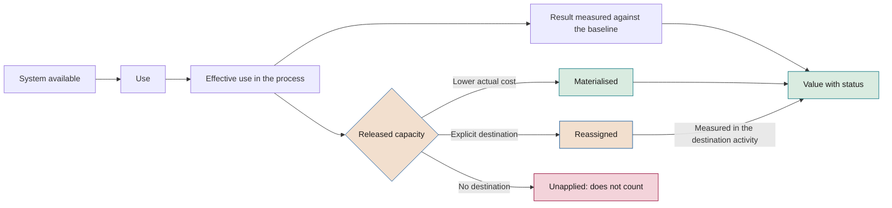

# Adoption and change in the initiative

**How to ensure that AI is used, that released capacity is turned into value and that people know how to work with it**

| | |
|---|---|
| Document | Document 23 · Adoption and change in the initiative |
| Version | 0.1 (working draft) |
| Date | 16-09-2026 |
| Author | Fernando García Varela |
| Status | Draft for review. Develops principle 10 and the adoption plan for phases 4 to 7 of document 01. |

<!-- cifras: 4 | phases with an adoption plan ; 3 | released capacity statuses ; 10 | adoption indicators with a formula ; 2 | gates with adoption criteria -->

---

> **Legal notice and disclaimer.** SEVEN-G is a reference methodological framework provided "as is" and for information purposes only. It does not constitute legal, regulatory, financial or professional advice, nor does it guarantee compliance with any law or standard. References to general regulation (such as the EU AI Act, the GDPR, DORA or NIS2), to technical standards and to regulation specific to each sector or jurisdiction may be incomplete, may not apply to a particular case or may become out of date as a result of regulatory changes, interpretations or supervisory positions after their consultation date. **Each organisation that uses SEVEN-G is solely responsible for identifying the regulation that applies to it, verifying that it is current and certifying its own regulatory compliance**, with the appropriate qualified advice. This methodology is a generic, free aid shared with the community so that nobody has to start from scratch; each person or organisation can and should adapt it to its own use. It must not be inferred that its legally sensitive parts have been reviewed by legal counsel: those reviews, for each company or sector, are the ultimate responsibility of the company, consultant or organisation that uses it. Although every effort is made to keep it up to date, some regulation may have changed without being reflected here. To the fullest extent permitted by law, the author accepts no responsibility whatsoever for the effects of its application in any organisation or for its full applicability. The methodology does not grant certification of any kind. The author accepts no liability for any use made of this content or for any decisions taken on the basis of it. The data, figures, companies and cases in the examples are fictitious or illustrative.

<!-- esencial: recomendado | The adoption plan (P20) is mandatory evidence from phase 4 and adoption is checked at G5 and G7. The rest —change model, role impact analysis, communication— is guidance used in proportion to the initiative's effect on people. -->

## 1. Purpose and scope

This document defines how the adoption of an AI initiative is planned, measured and decided. It fills a gap in the framework's previous material: phase 5 validated value, but did not explicitly address actual adoption, the reassignment of released capacity or training, which are conditions for value to materialise.

**What it covers**

- The analysis of the impact on roles and tasks.
- The adoption plan for phases 4 to 7, prepared from phases 2 and 3.
- The measurement of released capacity and its materialisation or explicit reassignment.
- Training, AI literacy, communication and participation.
- Adoption indicators and adoption criteria at G5 and G7.
- Resistance to change and organisational risks.

**What it does not cover**

| Topic | Document |
|---|---|
| People policy, new roles, capabilities and labour relations in the company | 50 · People and organisation |
| Corporate AI policy, acceptable use and general literacy | 31 · Corporate policy and acceptable use |
| Regulatory obligations in detail | 34 · Regulatory mapping |
| Measurement rules and benefits realisation | 40 · Value measurement rules · 43 · Benefits realisation |
| Full sequence of each phase | 20 · Phase manuals |

This document does not constitute legal advice. The regulatory references were consulted in September 2026 and their validity must be verified in document 34.

---

## 2. Why value depends on adoption

An available AI system does not generate value on its own. Value appears only when a complete chain is followed through: the system is used, it is used in the process for which it was designed, the work changes and that change produces a result measured against the baseline. When the change frees up time, it must also be decided what is done with it.

<!-- grafico: Chain from adoption to value | Each link can break; value only counts at the end -->

Three consequences for the governance of the initiative:

1. **Availability is not adoption, and adoption is not value.** Reports distinguish users with access, active users, effective use in the process and measured result.
2. **Released capacity does not count as savings** until it is materialised or explicitly reassigned (measurement rule 3, 00 §6). It is reported separately.
3. **Materialisation is a signal of transformation.** Signal 3 of the transformation index (00 §5.3) measures how much released capacity is converted into actual savings or reassigned; signal 5 measures changes in roles and structure. Without adoption data, both remain *no data*.

---

## 3. Principles

| # | Principle | What it implies |
|---|---|---|
| 1 | **Adoption is designed, not awaited** | The adoption plan is a phase 4 piece of evidence, not an activity after deployment. |
| 2 | **Whoever is accountable for value is accountable for adoption** | The AI Product Owner is accountable for adoption (01 §8.1); the managers of the user area carry it out. |
| 3 | **Use in the process is measured, not access** | The indicators refer to the eligible cases in the process, not to the number of licences. |
| 4 | **The destination of released capacity is an explicit decision** | It is decided and recorded with an owner and a date; it is never presumed. |
| 5 | **No one uses the system without training** | Users and overseers are trained before gaining access, including in the pilot. |
| 6 | **The truth about the impact is communicated** | Communication does not promise what has not been decided, nor does it conceal what already has been. |
| 7 | **Trust is calibrated** | Both distrust (the system is not used) and overreliance (everything is accepted without review) are monitored. |

---

## 4. Reference model for change

SEVEN-G does not impose a change management model. If the company already uses one, it keeps it. As a reference, this document relies on **ADKAR**, an individual change management model developed by Prosci (ADKAR is a trademark of Prosci), which describes five successive conditions for a person to change: awareness of the need, desire to participate, knowledge of how to change, ability to do so and reinforcement to sustain it.

The table shows how each condition translates into framework evidence. What is required is the evidence, not the model.

| Condition (ADKAR) | Practical question | Evidence in SEVEN-G | Phase |
|---|---|---|---|
| Awareness | Do the people affected know what is changing and why? | P20 communication plan | 4–5 |
| Desire | Do they have reasons to use it, and have their concerns been addressed? | Analysis of the impact on roles; user participation; incentives reviewed | 4–5 |
| Knowledge | Do they know how to use it, and do they know its limits and when not to trust it? | Training plan and record | 5 |
| Ability | Do they use it well in real work? | Indicators of effective use, override and quality in the pilot | 5–6 |
| Reinforcement | Is use sustained when the project ends? | Indicators by period, R6, reassigned capacity | 6–7 |

---

## 5. Analysis of the impact on roles and tasks

### 5.1 Unit of analysis

The impact is analysed **by task within each role**, not by entire job. The same role may see eliminated tasks, assisted tasks and new tasks, in particular the human oversight tasks defined in P17.

| Field | Content |
|---|---|
| Role and group | Name of the role, area and number of people. |
| Task | Observable description. |
| Current volume and time | Cases per period and unit time, taken from the baseline (P09). |
| Type of change | *No change* · *Assisted* (AI helps, the person does the work) · *Partially automated* · *Automated* · *New* (including oversight). |
| System autonomy level | A0–A3 (document 35). |
| Expected time after the change | Estimated in phase 4, measured in phase 5. |
| New competencies | What the person must know how to do. |
| Affects working conditions | Yes or no, with a description (working hours, monitoring, performance appraisal, workload). |

### 5.2 Effect on the role

Once the tasks have been analysed, the effect on each role is classified:

| Effect | Description | Minimum treatment |
|---|---|---|
| **No relevant change** | Tools change, tasks do not. | Training in use. |
| **Change of tasks** | The distribution of time within the role changes. | Training, adjustment of objectives and measurement of released capacity. |
| **Change of role** | Responsibilities, decisions or required competencies change. | In addition, involvement of the people function and update of the role description. |
| **New role** | A role emerges (for example, agent oversight or content curation). | In addition, definition of the role, selection and a capability-building plan. |
| **Reduced role** | The workload of the role decreases substantially. | In addition, an explicit decision on released capacity and, where appropriate, information and consultation of workers' representatives (section 9.3). |

### 5.3 When it is done

| Phase | Depth |
|---|---|
| 3 | Preliminary: groups affected, type of expected effect and organisational feasibility (evidence P10). |
| 4 | Complete, with estimated times, within the adoption plan (P20). |
| 5 | Updated with the times and tasks measured in the pilot. |
| 6–7 | Checked against the resulting actual organisation. |

---

## 6. Adoption plan by phase

### 6.1 Preparation in phases 2 and 3

- **Phase 2:** in Augment and Transform, the **adoption target** is set (target users, expected effective use, time frame). In Optimise, released capacity is estimated separately from savings.
- **Phase 3:** preliminary impact analysis (section 5.3), adoption and training costs in the feasibility assessment, organisational risks in P12. In Augment, G3 requires the feasibility of adoption and of the change of role (01 §7.6).

### 6.2 Phase 4 · Adoption design

| # | Activity | Performed by | Involved |
|---|---|---|---|
| 1 | Complete the analysis of the impact on roles and tasks. | Product | User area, people |
| 2 | Set adoption indicators with a formula, baseline, target and minimum threshold for G5 and G7 (section 10). | Product | AI Office |
| 3 | Decide the intended destination of released capacity: materialisation, reassignment or a combination, with an owner and date (section 7). | Product | Sponsor, area management, management control |
| 4 | Design training by audience (section 8). | Product | People |
| 5 | Design communication and participation, including workers' representatives where appropriate (section 9). | Product | People, internal communication |
| 6 | Identify key users for the design and the pilot. | Product | User area |
| 7 | Review incentives and objectives that reward the previous procedure. | Product | Area management, people |
| 8 | Record organisational risks in P12 (section 12). | Product | Risk |

### 6.3 Phase 5 · Pilot, training and initial measurement

- Train the pilot users and overseers before they gain access, and record the training.
- Measure the pilot adoption indicators with the same discipline as the value indicators.
- Measure the actual (not the estimated) released capacity using the method in section 7.2.
- Collect usage issues, overrides and their reasons, and adjust the design, training or communication.
- Update P20 with the results and with the plan for rollout to the entire target population.

### 6.4 Phase 6 · Rollout, reinforcement and materialisation

- Roll out in waves when the population is large, with training before each wave.
- Measure the indicators by period and present them at each R6.
- Carry out the materialisation or reassignment decisions on the planned dates and record their evidence.
- Maintain support and error reporting channels.
- Reinforce: withdraw the previous procedure once adoption is consolidated, adjust objectives and incorporate the new work into role descriptions.

### 6.5 Phase 7 · Consolidation and decision

- Consolidate sustained adoption and the materialised and reassigned capacity.
- Apply the G7 adoption criteria by ambition level (section 11).
- Record lessons on adoption for the portfolio.
- On retirement: inform users, restore the alternative procedure and provide training in it if it is no longer known.

---

## 7. Released capacity: measurement, materialisation or reassignment

### 7.1 Definitions

| Term | Definition |
|---|---|
| **Released capacity** | Working hours that are no longer needed to handle the same volume with the same quality, net of the new work introduced by AI. |
| **Materialised capacity** | The part of released capacity that is converted into a verifiable **lower actual cost**: overtime eliminated, temporary or service contracts not renewed, reduced subcontracting, vacancies eliminated or planned and budgeted hires that do not take place. |
| **Reassigned capacity** | The part of released capacity that is **explicitly** assigned to identified activities, with an owner, hours, date and outcome indicator. |
| **Unapplied capacity** | The part that has been neither materialised nor explicitly reassigned. It usually dissipates with no measurable effect. |

By construction: **released capacity = materialised + reassigned + unapplied.**

These three parts group the five destinations of released capacity in document 50 (§6.2): PER-D1 (Materialise) is materialised capacity; PER-D2 (Reassign) and PER-D4 (Reinvest in quality, service or compliance) are reassigned capacity; PER-D3 (Absorb growth) is materialised if the hiring was planned and budgeted and, otherwise, reassigned; PER-D5 (No decision) is unapplied capacity. The full correspondence is set out in section 10.5.

### 7.2 Measurement

Released capacity is measured, not inferred from model performance:

> **Released capacity (hours per period) = Σ tasks [volume in the period × (baseline unit time − unit time with AI)] − supervision and review hours − hours correcting system errors − hours spent by the user area managing the system**

Rules:

1. Baseline times come from P09; times with AI are **measured** in the pilot (P22) and in operation, not estimated.
2. The volume is that actually processed with the system in the period, not the eligible volume.
3. Supervision and correction hours are measured using system logs or documented sampling.
4. Conversion to full-time equivalents uses the effective annual hours per person set by the company, which are declared.
5. Every figure carries a status: *validated*, *declared* or *estimated* (measurement rule 2).

### 7.3 Materialisation

- Only the amount of the lower actual cost, taken from the accounts or the approved budget, counts as an **efficiency**, not the hours multiplied by an hourly cost.
- It is validated by management control, which checks that the cost existed, that it disappears and that it does not reappear under another line item.
- If materialisation consists of absorbing volume growth without hiring, the hiring must have been planned and budgeted; otherwise, it is treated as reassignment.
- Decisions affecting employment are taken by management together with the people function and in accordance with labour legislation and applicable collective agreements (document 50). SEVEN-G does not prescribe the destination of released capacity; it requires it to be explicit.

### 7.4 Explicit reassignment

A reassignment is only recognised if it records the following in P20:

| Field | Content |
|---|---|
| Destination activity | What will be done with the hours and why it is of higher value. |
| Owner | Manager accountable for ensuring that the hours are devoted to that activity. |
| Hours and people | Amount assigned and group. |
| Start date | When the reassignment begins. |
| Outcome indicator | How it will be known that the destination activity produces an effect (for example, complex cases resolved, sales visits, response time). |
| Review | At which R6 it is checked. |

The value of the destination activity **is not added as an efficiency** of the initiative. If it produces measurable return, it is recorded as return in the use case to which it is attributed, only once (measurement rule 5).

### 7.5 Rates and reporting

| Indicator | Formula |
|---|---|
| Materialisation rate | Materialised hours ÷ measured released hours |
| Reassignment rate | Explicitly reassigned hours ÷ measured released hours |
| Application rate | (Materialised hours + reassigned hours) ÷ measured released hours |

Reports to the board show released capacity **separately** from savings and broken down into materialised, reassigned and unapplied. These rates feed signal 3 of the transformation index; their thresholds are set in document 12.

### 7.6 Illustrative example

*Fictitious data.* A document management team classifies 4,000 documents a month. The baseline is 12 minutes per document; with the system, as measured in the pilot, 5 minutes. A sample of 400 documents is reviewed at 3 minutes each, and 80 system errors are corrected at 10 minutes each.

| Item | Calculation | Hours per month |
|---|---|---|
| Gross saving | 4,000 × (12 − 5) min | 466.7 |
| Supervision | 400 × 3 min | − 20.0 |
| Correction | 80 × 10 min | − 13.3 |
| **Released capacity** | | **433.3** (some 5,200 hours a year) |

Destination decided in phase 4 and carried out in phase 6: a temporary contract equivalent to 1,600 hours a year is not renewed (materialised); 2,400 hours are reassigned to resolving complex case files, with their owner and indicator; 1,200 hours remain unapplied. Application rate: (1,600 + 2,400) ÷ 5,200 = 77%. The efficiency declared is the actual cost of the non-renewed contract according to the accounts, validated by management control, not 5,200 hours multiplied by an hourly cost.

---

## 8. Training and AI literacy

### 8.1 Regulatory framework

Article 4 of the EU AI Act requires providers and deployers to take measures to ensure, to their best extent, a sufficient level of AI literacy among their staff and other persons dealing with the operation and use of AI systems on their behalf, taking into account their technical knowledge, experience, education and training and the context of use. It has applied since 2 February 2025. Regulation (EU) 2026/1744 (Digital Omnibus on AI) has amended its wording, which now requires measures to *support* the development of AI literacy without setting a level; the details and their verification status, as at the consultation date of September 2026, are in document 34 (§3.5).

Regardless of regulatory developments, **SEVEN-G requires training in each initiative because value depends on it**. General AI literacy across the workforce is governed in document 31; this document addresses training specific to the initiative.

### 8.2 Training by audience

| Audience | Objective | Minimum content | When |
|---|---|---|---|
| **Affected people in the area** | Understand what is changing and why. | What the system does and does not do, effects on their work, timetable, whom to ask. | Phase 4–5, before the pilot. |
| **Users** | Use the system properly. | Use, known limits, when not to trust it, how to override or correct a result, how to report errors and incidents, data that must not be entered. | Before they gain access. |
| **Human overseers** | Oversee effectively (P17). | Intervention criteria, automation bias, sample review, use of the kill switch where one exists, escalation. | Before they gain access. |
| **Area managers** | Manage change and capacity. | Adoption indicators, destination of released capacity, managing resistance. | Phase 4. |
| **Operations team** | Operate the system (P24). | Monitoring, incidents, changes, rollback. | Phase 5. |

The duration and format are set by the company. The understanding of users and overseers **should** be assessed with a short test or a supervised practical exercise.

### 8.3 Content by technology

| Profile | Training emphasis |
|---|---|
| **Predictive ML** | What a score or probability means, thresholds, uncertainty, cases in which the model is not reliable. |
| **Generative AI** | Verification of outputs, incorrect or ungrounded content, confidentiality of the information entered, good prompting practices. |
| **Agents** | Permitted and prohibited actions, reading action logs, validation of sensitive actions, shutdown. |
| **Embedded third-party AI** | Which product functions use AI, authorised configuration, how to detect changes introduced by the supplier. |

### 8.4 Evidence

Training record in P20, consolidated in P45, with person or group, content and version, date, format and assessment result. It feeds the training coverage indicator (section 10).

---

## 9. Communication and participation

### 9.1 Communication plan

| Element | Content |
|---|---|
| Audiences | Affected people, users, managers, workers' representatives, other areas, affected external persons. |
| Messages | What changes and what does not, why, how it affects each group, what has and has not been decided, timetable, channel for questions. |
| Sender | Sponsor and area management for the why; product owner for the how. |
| Moments | Before the pilot, when G5 is decided, at each rollout wave and when G7 is decided. |
| Feedback | Channel for questions, objections and errors, with a recorded response. |

Communication must be consistent with the recorded decisions. Announcing that *no one will be affected* when the analysis foresees a reduced role, or announcing reductions that have not been decided, destroys trust and adoption.

### 9.2 User participation

Key users **should** take part in designing the user experience, in defining human oversight and in the pilot. Their participation is recorded and their contributions are answered.

### 9.3 Workers' representatives

When the initiative affects working conditions, decisions on employment or performance monitoring, the company must comply with the applicable information and consultation rights. Among the references in force at the consultation date:

- **Article 26(7) of the EU AI Act**: deployers who are employers inform workers' representatives and the affected workers before putting into service or using a high-risk AI system in the workplace.
- In Spain, **Article 64.4.d) of the Workers' Statute** (Estatuto de los Trabajadores): the right of the works council to be informed of the parameters, rules and instructions on which the algorithms or AI systems are based that affect decisions that may have an impact on working conditions, access to and retention of employment, including profiling.
- The provisions of collective agreements and data protection regulations in the employment context.

The details, the information and consultation timetable and the relationship with collective bargaining are addressed in documents 34 and 50. The adoption plan records whether it applies, when information or consultation took place and with what outcome.

---

## 10. Adoption indicators

### 10.1 Measurement rules

1. **Measured over the population and cases in the process.** The denominators are the target users and eligible cases defined in P20, not licences or accesses.
2. **The active use criterion is set in P20** before the pilot (for example, at least one use per week with a result incorporated into the process) and is not changed during measurement.
3. **No individual data.** Indicators are calculated by group, with the minimum group size set by the company. Usage data are not used to assess individuals unless that purpose has been declared, is lawful and has been communicated (50 §9.2).
4. **"No data" is not zero** (measurement rule 8). An indicator that cannot be calculated with its formula is shown as *no data*.
5. **Paired reading.** No usage indicator is interpreted on its own: it is read together with the oversight quality and result indicators (section 10.3).

### 10.2 Indicators

The `IND-` codes are those of the catalogue (document 41); the `PER-` codes are the provisional ones in document 50. Indicators without a code are **proposals for consolidation in document 41**.

| # | Indicator | Formula | Code | Freq. | Main use |
|---|---|---|---|---|---|
| 1 | **Access rollout** | Target users with access enabled ÷ target users | Proposal | M | Phases 5–6: progress of the waves. |
| 2 | **Active users** | Active users in the period, according to the P20 criterion ÷ target users | IND-ADO-02 · PER-07 | M | G5 and R6: extent of use. |
| 3 | **Effective use in the process** | Cases processed with the system ÷ eligible cases in the process | IND-ADO-03 | M | G5, R6 and G7: main adoption indicator. |
| 4 | **Continuity of use** | Active users in the period who were also active in the previous period ÷ active users in the previous period | Proposal | M | Phase 6: reinforcement; detects abandonment after launch. |
| 5 | **Human override rate** | Recommendations or results rejected or modified by the person ÷ recommendations or results reviewed | PER-10 (complements IND-ADO-04) | M | G5 and R6: calibration of trust. |
| 6 | **Review time per case** | Median human review time per case reviewed, with 80th percentile | Proposal | M | R6: detection of rubber-stamp approval (RT-ORG-04). |
| 7 | **Training coverage** | People with access or an oversight role with training recorded and assessed before access ÷ people with access or an oversight role | IND-ADO-05 (initiative level) · PER-02 · PER-03 | M | G5 and R6: access condition. |
| 8 | **User perception** | Favourable responses to the questions on usefulness, trust, support, workload and autonomy (P44) ÷ valid responses | PER-15 | Phase 5, at 3 months and at Enterprise R6 | Desire and reinforcement; early warning of rejection. |
| 9 | **Released capacity application rate** | (Materialised hours + explicitly reassigned hours) ÷ measured released hours | IND-VAL-08 + IND-VAL-09 · PER-04 + PER-05 | Q | R6 and G7: conversion into value (section 7.5). |
| 10 | **Updated roles** | Affected positions with updated description and objectives ÷ affected positions according to the impact analysis | PER-13 · IND-ADO-06 | S | G7 in Augment and Transform; signal 5. |

Notes:

- Indicator 5 has no good value in the abstract. A rate close to zero may indicate acceptance without review; a high rate, poor system performance or distrust. An **expected band** is set in phase 4 using the validation results, and the recorded override reasons are analysed.
- In generative AI, indicator 5 is calculated on the human review sample and read together with IND-OPE-08 (ungrounded responses). In agents, it is calculated on the actions that require validation (AG-08, document 35).
- Indicator 7 has a target of **100%** for designated overseers: no person oversees an A1–A3 system without recorded training (50 §5.3).

### 10.3 Combined reading

| Observed pattern | Probable reading | Action |
|---|---|---|
| High active users and low effective use | Marginal use: the system is tried out, but the work continues to be done using the previous procedure. | Review integration into the workflow, incentives and withdrawal of the previous procedure. |
| High effective use, override close to zero and decreasing review time | Possible routine acceptance or automation bias. | Sample review by a third party, adjustment of the oversight workload (P17), reinforcement of training. |
| High and stable override | Insufficient performance in real cases, or distrust. | Analyse override reasons; separate system errors from user preferences; iterate the design or training. |
| Decreasing continuity after launch | Lack of reinforcement; use depended on initial support. | Support, champions in the area, review of objectives. |
| High effective use and low capacity application rate | Adoption without conversion into value (RT-ECO-03). | Explicit destination decision at R6; ageing alert (50 §6.5). |
| Decreasing perception with stable use | Mandatory use without acceptance; risk to well-being or of conflict. | Listening to groups, review of workload and communication (section 9). |

### 10.4 Targets and thresholds

- The **adoption target** is set in phase 2 (G2.10): mandatory in Augment, recommended in Optimise.
- In phase 4, the baseline, target, time frame and **minimum threshold** for G5 and for G7 are set in P20 for each selected indicator. Thresholds are set before the results are known and are not relaxed during the phase without the approval of the body that authorised the initiative (01 §7.4, rule 6).
- Tracking is monthly during the first six months of production and is then presented at each R6 (R6.14).
- Effective use below the threshold for two consecutive periods triggers a review at R6 and may justify bringing G7 forward. If the initiative is stopped or retired for this reason, the coded reason is **No adoption** (document 03).
- Thresholds are specific to each initiative. SEVEN-G does not set adoption reference values.

### 10.5 Correspondence with documents 40, 41 and 50

The three statuses in section 7 and the five destinations in document 50 (§6.2) describe the same reality at different levels of detail:

| Destination (50 §6.2) | Status in this document | How it counts (40) |
|---|---|---|
| PER-D1 · Materialise | Materialised | Validatable efficiency reflected in the accounts. |
| PER-D2 · Reassign to a defined activity | Reassigned | Through the result of the destination activity, attributed to a single use case. |
| PER-D3 · Absorb growth | Materialised if the hiring was planned and budgeted; otherwise, reassigned | Avoided cost only with a staffing need documented beforehand. |
| PER-D4 · Reinvest in quality, service or compliance | Reassigned, with destination activity and indicator | Not additive unless translated into money with a formula (rule 7). |
| PER-D5 · No decision | Unapplied | Not counted; reported separately with an ageing alert. |

The formula in section 7.2 is equivalent to formula F4 in document 40: there, the unit time with AI includes review, exceptions and corrections; here, they are deducted explicitly so that the user area can see each component. Under no circumstances are they deducted twice.

---

## 11. Adoption criteria at G5 and G7

The coded criteria are set in document 21 and applied using the checklists in document 22. This section brings together what those criteria require in terms of adoption and how it is evidenced with this document. It does not create new criteria.

### 11.1 Criteria common to all levels

| Gate | Criterion (21) | What is checked in terms of adoption | Evidence |
|---|---|---|---|
| G4 | G4.11 | Adoption plan with training, communication, support, measurement of use and intended destination of released capacity. | P20 · T20 |
| G5 | G5.14 ◆ | Overseers designated, trained and given the authority and means to intervene. Admits no conditions. | P17 · P20 (training record) |
| G5 | G5.19 | Users trained and evidence of AI literacy for those who use or oversee the system. | P20 (indicator 7) |
| G5 | G5.10 | Plan to materialise or reassign released capacity, with an owner and date. | P20 (section 7.4) |
| G5 | — (50 §7.2) | If prior information to workers' representatives is mandatory, it is recorded as having been provided. Does not admit *Proceed with conditions*. | Information record |
| R6 | R6.14 · R6.02 | Adoption measured against the target; realised value with status. | P20 · P28 |
| G7 | G7.01 · G7.02 | Value consolidated with status; explicit conclusion on the hypothesis, including the adoption hypothesis. | P28 · P30 |

### 11.2 G5 · Go-live, by ambition level

| Level | Adoption requirement (G5.08, G5.10) | Indicators that evidence it | If not achieved |
|---|---|---|---|
| **Optimise** | Efficiency validated against the baseline, which requires sufficient effective use in the pilot for the measurement to be representative. Plan to **materialise** released capacity. | 3, 5 and 7; measured released capacity (section 7.2). | *Iterate* the pilot or *Proceed with conditions* on the materialisation plan, with a time limit and owner. |
| **Augment** | **Actual adoption** and performance improvement **measured** in the pilot, above the minimum threshold set in phase 4. **Reassignment** and role change plan. | 2, 3, 5, 7 and 8; updated impact analysis. | *Iterate*; or *Proceed with conditions* if the deviation is limited, with a new measurement, time limit and owner. At this level, adoption is a condition of value and cannot be replaced by an estimate. |
| **Transform** | Market or customer evidence (use, conversion, initial revenue or verified operational change). When users are internal, verified operational change includes their adoption. Capacity plan only if there is released capacity. | 3 and 5 for internal users; customer usage indicators defined in the hypothesis. | *Iterate* or stop the stage according to its stop criteria. |

### 11.3 G7 · Scale or retire, by ambition level

| Level | Requirement (G7.01) | Adoption evidence | Reading for the decision |
|---|---|---|---|
| **Optimise** | **Materialised savings**, not just released capacity. | Materialisation rate reflected in the accounts and validated by management control; sustained effective use. | Without materialisation there is no realised value to justify scaling, even if adoption is high. |
| **Augment** | **Sustained performance and reassigned capacity.** | Effective use and continuity sustained over the R6 periods; reassignment recorded with an outcome indicator; roles updated. | Adoption that declines after launch is not sustained performance. |
| **Transform** | **Measured return and verified change** in the operating model or the offering; board approval to scale (G7.09). | Roles and structure redesigned (indicator 10); sustained use by customers or users of the new offering. | Change in the operating model is only verified if people work in the new way. |

### 11.4 Application rules

1. **The ambition level confirmed at G2 applies** (21 §7.2).
2. **Unapplied capacity is not realised value** at any level (21 §7.2, rule 5).
3. **To Scale**, the adoption that sustains the value must be measured in the current scope. Extrapolation to a larger scope carries its own adoption hypothesis and extension cost (measurement rule 4).
4. **To Iterate because of adoption**, P30 records the change condition that has failed (section 4), the action and the time limit.
5. **To Retire**, section 6.5 applies: users informed, alternative procedure restored and training in it if it is no longer known.
6. **Intensity.** In Lite, the criteria marked *Simpl.* in document 21 are evidenced with a simplified P20; the ◆ criteria and prior information to workers' representatives are not simplified.

---

## 12. Resistance to change and organisational risks

### 12.1 Forms of resistance

Resistance is information about the design, training or impact, not a defect in people. It is diagnosed through the change condition that is failing (section 4) and treated at its cause.

| Manifestation | Observable signal | Condition that usually fails | Response |
|---|---|---|---|
| **No use or marginal use** | Low indicators 2 and 3. | Awareness or desire. | Explain the why with data from the area; integrate the system into the workflow; involve key users. |
| **Parallel working** | The case is processed with the system and also using the previous procedure; time with AI does not decrease. | Trust or ability. | Practical cases with real results; withdraw the previous procedure once quality has been demonstrated. |
| **Systematic override** | Indicator 5 above the band with no technical reason. | Knowledge or desire. | Analyse reasons; correct the system where appropriate; training on limits and criteria. |
| **Uncritical acceptance** | Indicator 5 close to zero; indicator 6 decreasing. | Knowledge (overreliance). | Training on automation bias; control samples; review of the oversight workload (P17). |
| **Resistance from managers** | Area objectives unchanged; decisions on the destination of capacity postponed. | Desire or reinforcement. | Objectives and incentives reviewed (section 6.2, activity 7); adoption indicators in the area review. |
| **Fear for jobs** | Low perception; rumours; turnover in the group. | Desire. | Truthful communication of what has and has not been decided (section 9.1); information and consultation where appropriate. |
| **Use of unauthorised tools** | Detections in T21 in the affected area. | Insufficient perceived usefulness of the approved system. | Review the approved solution; apply the acceptable use policy (document 31). |

### 12.2 Typical risks

Risks are recorded in P12 using the common probability and impact scale and are accepted at the corresponding level (document 33). The codes are those of the typical risk catalogue in document 33; document 50 (§12) proposes an extended list of organisational risks, pending consolidation in document 33.

| Code (33) | Risk | Warning indicator (section 10) | Controls in this document | Phase |
|---|---|---|---|---|
| **RT-ORG-01** | Lack of adoption | 2, 3 and 4 below the threshold. | Adoption plan (section 6); user participation; training; target at G2 and threshold at G5. | 4–6 |
| **RT-ORG-03** | Unmanaged effect on people | Incomplete impact analysis; indicator 8 decreasing; indicator 10 low. | Impact analysis (section 5); communication and participation (section 9); document 50. | 2, 4 |
| **RT-ORG-04** | Ineffective human oversight | 5 close to zero; 6 decreasing; 7 below 100% for overseers. | Overseer training (section 8.2); oversight design in P17; control samples. | 4, 6 |
| **RT-ORG-02** | Dependence on key people | Knowledge of use concentrated in a few advanced users. | Training by audience; area champions; operations manual (P24). | 4, 6 |
| **RT-ORG-05** | Unauthorised use of AI | Detections in T21 in affected groups. | Training; document 31. | C1, C4 |
| **RT-ECO-03** | Unrealised value | Indicator 9 low; capacity without a destination, with ageing. | Explicit destination (section 7); plan at G5; tracking at R6. | 5–7 |
| **RT-REP-05** | Misleading communication about AI | Messages that attribute unvalidated results or deny expected effects. | Consistency of communication with recorded decisions (section 9.1). | 5, 7 |

Every High or Critical risk under treatment has a contingency plan (document 33). In adoption, the typical trigger is the minimum effective use threshold, and the contingency is iterating the design or training, maintaining the alternative procedure or stopping.

### 12.3 Cost of adoption

Training, communication, support, users' time during learning and the temporary loss of productivity are costs of the initiative. They are estimated in phase 3 in the *adoption and training* category of document 42 and form part of the initial investment (40 §8.2). Omitting them inflates the expected net value and is a frequent cause of insufficient adoption due to lack of resources.

---

## 13. Responsibilities and intensity

### 13.1 Responsibilities

| Role or body | Responsibility for adoption |
|---|---|
| **AI Sponsor** | Accountable for value; decides, with area management, the destination of released capacity; delivers the messages on the why. |
| **AI Product Owner** | Accountable for adoption (01 §8.1): prepares P20, measures the indicators, coordinates training and communication. |
| **User area management and managers** | Carry out the change: organise the work, withdraw the previous procedure, carry out the reassignment and review objectives. |
| **People function** | Jointly responsible for the impact analysis, the capabilities plan and the relationship with workers' representatives (document 50). |
| **Management control** | Validates materialised capacity and checks that the cost does not reappear under another line item. |
| **AI Risk Owner** | Assesses organisational risks and issues clearance at G3 and G5 according to intensity. |
| **AI Office · AI Auditor** | Verify P20 and the adoption criteria at the *gates*; consolidate lessons on adoption for the portfolio. |
| **AI Committee** | Reviews aggregate portfolio adoption and pending capacity destination decisions. |

No one verifies or decides on the adoption of their own initiative (01 §7.4, rule 1).

### 13.2 Lite and Enterprise

| Aspect | Lite | Enterprise |
|---|---|---|
| **Impact analysis** | By group and type of effect. | By task and role, with times (section 5.1). |
| **Indicators** | At least 3, 5 and 7, and 9 if there is released capacity. | Full selection according to ambition and technology. |
| **Training** | Users and overseers, with a record. | All audiences in section 8.2, with assessment of understanding. |
| **Communication and participation** | Simplified plan in P20. | Full plan; user perception measured (indicator 8). |
| **Information to representatives** | The same at both intensities when mandatory. | The same at both intensities when mandatory. |
| **Tracking** | Monthly in the first six months; thereafter, at the six-monthly R6. | Monthly in the first six months; thereafter, at the quarterly R6, with a report to the AI Committee. |

Augment and Transform initiatives always have an adoption and people plan, regardless of intensity (01 §3, principle 10).

---

## 14. Associated tools and templates

| Code | Name | Use in this document |
|---|---|---|
| **P20** | Adoption and capacity plan | Main evidence: impact analysis, adoption targets and indicators, training, communication, destination of released capacity and tracking. |
| **T20** | Adoption and capacity plan | Tool for template P20 and released capacity register; feeds T12 and the initiative register (T01). |
| **P08 · P09** | Value hypothesis canvas · Baseline | Adoption target (G2.10) and reference times per task. |
| **P10 · P12** | Feasibility assessment · Risk matrix and register | Preliminary impact analysis, adoption costs and organisational risks. |
| **P17** | Governance and human oversight design | Designated overseers and oversight workload. The information sheet and the register of information to representatives are in P46. |
| **P22 · P28** | Pilot results · Value realisation tracking | Adoption and capacity measured in the pilot; materialised and reassigned capacity in operation. |
| **P29 · P30** | *Gate* decision record · Scaling or retirement decision | G5, R6 and G7 decisions; lessons on adoption and communication of retirement. |
| **T12 · T21** | Value tracking · Corporate use monitor | Materialised amounts; unauthorised use in the affected groups. |
| **P44** | AI use and perception survey | User perception (indicator 8): usefulness, trust, support, workload and autonomy. |
| **P46** | Information to workers and their representatives | System information sheet and register of information to and consultation of representatives. |

Consistency note: in P20 (section 4), the indicator called *effective use* corresponds to **active users** (IND-ADO-02) and *process coverage* to **effective use in the process** (IND-ADO-03). The template's terminology will be aligned with this document and with document 41 in its next version.

---

## 15. Related documents

| Document | Relationship |
|---|---|
| **00 · What SEVEN-G is and how it helps companies** | Measurement rule 3 and signals 3 and 5 of the transformation index. |
| **01 · Foundational methodology** | Principle 10, phases 4 to 7 (§6), criteria by ambition level (§7.6) and the product owner's responsibility for adoption (§8.1). |
| **03 · Tools and initiative register** | Tool T20 and coded reason *No adoption*. |
| **11 · Maturity model** | Dimension D5 People and adoption. |
| **12 · Transformation index** | Thresholds for signals 3 (materialisation) and 5 (operating model). |
| **20 · Phase manuals** | Full sequence of activities for each phase. |
| **21 · *Gate* and audit criteria** | Criteria G2.10, G3.16, G4.11, G5.08, G5.10, G5.14, G5.19, R6.02, R6.14 and G7.01. |
| **22 · Checklists by *gate*** | Verification of the adoption criteria. |
| **31 · Corporate policy and acceptable use** | General AI literacy programme and unauthorised use. |
| **33 · AI risk methodology** | Common scale and typical risks RT-ORG, RT-ECO-03 and RT-REP-05. |
| **34 · Regulatory mapping** | Article 4 (AI literacy) in its current wording, Article 26 of the EU AI Act and verification of validity. |
| **35 · AI and agent security** | Autonomy levels A0–A3 and informed validation of actions (AG-08). |
| **40 · Value measurement rules** | Formulas F4 (released capacity) and F5 (materialisation); treatment of reassigned capacity. |
| **41 · Indicator catalogue** | IND-ADO indicators and IND-VAL-07 to 09; consolidation of the indicators proposed in section 10. |
| **42 · AI costs** | *Adoption and training* cost category. |
| **43 · Benefits realisation** | Tracking of materialisation and reassignment. |
| **50 · People and organisation** | Effect on work, capabilities plan by profile, five destinations of released capacity, information and consultation, well-being and PER indicators. |
| **52 · AI operations manual** | Rollback and the ability to revert to the manual procedure. |

---

## 16. Version control

| Version | Date | Changes |
|---|---|---|
| 0.1 | 16-09-2026 | First version. Chain from adoption to value; principles; ADKAR as reference model; analysis of the impact on roles and tasks; adoption plan for phases 4 to 7; measurement, materialisation and explicit reassignment of released capacity with correspondence to documents 40 and 50; training and AI literacy by audience and technology; communication and participation of workers' representatives; ten adoption indicators with a formula; adoption criteria at G5 and G7 by ambition level; resistance to change and organisational risks; responsibilities and intensity. |
