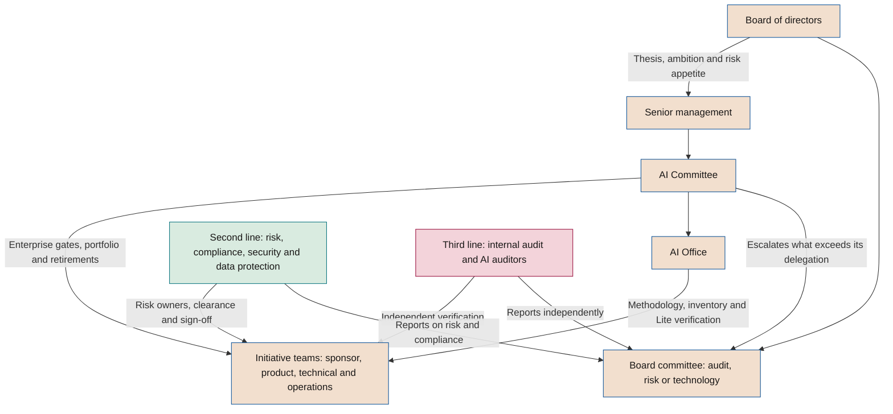

# Governance model

**Bodies, roles, delegation of decisions and escalation of artificial intelligence in the company**

| | |
|---|---|
| Document | Document 30 · Governance model |
| Version | 0.1 (working draft) |
| Date | 16-09-2026 |
| Author | Fernando García · SEACHAD |
| Status | Draft for review. It develops section 8 of document 01 and may not contradict it. |

<!-- cifras: 5 | bodies with a model mandate ; 6 | roles with a role description ; 3 | lines applied to AI ; 14 | escalation situations with a time limit -->

---

> **Legal notice and disclaimer.** SEVEN-G is a reference methodological framework provided "as is" and for information purposes only. It does not constitute legal, regulatory, financial or professional advice, nor does it guarantee compliance with any law or standard. References to general regulation (such as the EU AI Act, the GDPR, DORA or NIS2), to technical standards and to regulation specific to each sector or jurisdiction may be incomplete, may not apply to a particular case or may become out of date as a result of regulatory changes, interpretations or supervisory positions after their consultation date. **Each organisation that uses SEVEN-G is solely responsible for identifying the regulation that applies to it, verifying that it is current and certifying its own regulatory compliance**, with the appropriate qualified advice. The author and SEACHAD accept no liability for any use made of this content or for any decisions taken on the basis of it. The data, figures, companies and cases in the examples are fictitious or illustrative.

## 1. Purpose and scope

This document develops component B of SEVEN-G with regard to **who decides, who builds and who controls** artificial intelligence. It turns section 8 of document 01 into elements that a company can approve and put into practice: body mandates, role descriptions, responsibility matrices, a decision delegation matrix and escalation rules.

It applies to the bodies involved in the corporate cycle (C1–C5) and in the lifecycle (phases 0–7), to the six roles in 01 §8.1 and to the four types of AI use in 01 §1.2. The *gate* criteria are in document 21, the risk methodology in 33, the nonconformity and incident process in 37 and audit in 38.

### 1.1 Governance design principles

| # | Principle | Consequence in the model |
|---|---|---|
| 1 | **Do not create parallel governance** (01 §8.3) | The bodies may be existing committees with an expanded mandate (section 10). |
| 2 | **Segregation of duties** (principle 7) | Those who build do not verify or decide on their own work. The incompatibilities in 01 §8.2 are mandatory. |
| 3 | **Proportionality** | Lite or Enterprise intensity determines which body decides. |
| 4 | **Recorded decision** | Every decision with an effect on the portfolio, risk or compliance is recorded in T01 with the decision-maker, date and reason. |
| 5 | **Known time limits** | Each escalation has a recipient and a time limit. |

### 1.2 Terminology note

In SEVEN-G, **AI Office** designates the company's internal unit that provides methodological support, maintains the inventory and consolidates measurement. It must not be confused with the European Commission's **European AI Office**, provided for in Regulation (EU) 2024/1689. If there is a risk of confusion, the company may call it the "Corporate AI Office" or "AI Centre of Excellence".

---

## 2. Architecture of bodies

<!-- grafico: AI governance bodies | Who sets direction, who decides, who builds and who controls -->

| Body | Main function in SEVEN-G | Frequency (01 §5.2) | Stages |
|---|---|---|---|
| **Board of directors** | Sets direction and limits; approves Transform; oversees. | Annual (C2, C5) and quarterly (C4) | C2, C4, C5 |
| **Board committee** | Oversees risks, compliance, incidents, major and critical nonconformities, and audits. | Quarterly | C4, C5 |
| **AI Committee** | Manages the portfolio; decides Enterprise *gates*, retirements and High risks. | Monthly | C1, C3, C4 |
| **AI Office** | Methodology, inventory, verification in Lite, measurement and reporting to the bodies. | Continuous | C1, C4, C5 |
| **Second line** | Assesses risks, issues clearances and signs off Enterprise go-live. | Continuous | All |
| **Third line** | Verifies independently and audits compliance with the framework. | Annual plan and Enterprise *gates* | C4, C5 |

---

## 3. Model mandates of the bodies

The mandates are **models to be adapted**. The company approves them in C2 and incorporates them into the rules of procedure of the body that takes on the function. Quorum and time limits are for reference. The article-by-article text that can be approved, with the model appointment of the head of AI, is in P38; agendas and minutes, in P39.

### 3.1 Board of directors

| Element | Model content |
|---|---|
| **Mandate** | Exercise ultimate responsibility for the strategy, risk appetite and oversight of AI. |
| **Functions** | Approve the AI thesis, the ambition per sphere and the risk appetite with its thresholds (C2). Approve the corporate AI policy (document 31). Approve Transform initiatives at G2 and their scaling at G7. Decide, on an exceptional basis, on the acceptance of Critical residual risks within the appetite. Oversee the board dashboard (C4). Review maturity, the transformation index and the thesis (C5). |
| **Composition** | Full board. It may be supported by a director with AI experience or by an external non-voting adviser. |
| **Quorum** | That set by its articles of association and rules of procedure. |
| **Frequency** | One annual session with a dedicated item and a quarterly oversight item, which it may delegate to the committee. |
| **Model agenda (annual)** | 1. Maturity, transformation index and validated versus declared value. 2. AI thesis and ambition per sphere. 3. Risk appetite and thresholds (Enterprise intensity, investment, return horizon, regularisation). 4. Transform initiatives (a maximum of three in detail). 5. Previous recommendations. 6. Resolutions. |
| **Model agenda (quarterly)** | 1. Changes in the dashboard. 2. S1 and S2 incidents, and critical nonconformities. 3. Relevant *gate* decisions and retirements. 4. Risks outside appetite. 5. Open and overdue recommendations. |
| **Record** | Minutes and registration of each resolution in the recommendations and decisions register (T18). |

### 3.2 Board committee

The company designates the committee that oversees AI: **audit**, **risk** or **technology**. If none exists, the functions are exercised by the board.

| Element | Model content |
|---|---|
| **Mandate** | Oversee the effectiveness of control over AI. |
| **Functions** | Approve the annual AI audit plan and receive its results (document 38). Receive information on S1 incidents and on major and critical nonconformities. Resolve disagreements between the AI Committee and the second line (section 8.3). Decide, by delegation of the board, on the exceptional acceptance of Critical risks. Monitor the independence of the AI auditors. Receive the exceptions in force. |
| **Composition** | That of the committee. The head of the AI Office, the chief risk or compliance officer and the head of internal audit attend without a vote. |
| **Frequency** | Quarterly, with an extraordinary session in the event of an S1 incident or a critical nonconformity if its chair so decides. |
| **Model agenda** | 1. High and Critical risks, and concentrations. 2. Regulatory compliance and regulatory changes. 3. Incidents and major and critical nonconformities. 4. Audits and follow-up of findings. 5. Escalated matters. 6. Exceptions for the quarter. |

### 3.3 AI Committee

| Element | Model content |
|---|---|
| **Mandate** | Manage the AI portfolio within the approved thesis, ambition and appetite, and decide what the board delegates to it. |
| **Functions** | Approve the C1 diagnosis and the C3 portfolio. Decide Enterprise *gates* (01 §7.5). Accept High residual risks. Review risk concentration (principle 5). Decide retirements. Review stalled initiatives, expired conditions and decisions escalated after two iterations. Approve the acceptable use policy and exceptions at its level. Escalate what exceeds its delegation. |
| **Chair** | A member of senior management with authority over the portfolio. It should not be chaired by whoever sponsors most of the portfolio. |
| **Voting members** | Senior business management (at least two areas), technology, data and people. |
| **Members with a voice and clearance** | Risk, compliance, information security and data protection. Their clearance is required within their remit, but they do not vote on the business decision (section 8.3). |
| **Permanent guests** | Head of the AI Office (secretary, non-voting); internal audit as an observer. |
| **Quorum** | A majority of voting members, including the chair or their deputy, and **at least one representative of the second line**. Without the second line, G3, G5, risk acceptances and exceptions are not decided. |
| **Resolutions** | By consensus; failing that, by a majority of votes present, with the chair holding a casting vote. |
| **Mandatory abstention** | Anyone with a sponsorship or build role in the initiative abstains and does not count towards the quorum for that item (01 §7.4, rule 1). |
| **Frequency** | Monthly; extraordinary for urgent *gates* or S1 incidents. Written decisions are allowed for *gates* without debate, under the same rules. |
| **Model agenda** | 1. Funnel: registrations, phase changes, stalled initiatives (document 03). 2. *Gates* with verification completed. 3. Value and cost deviations. 4. High and Critical risks, and concentration by sphere, supplier or technology. 5. Incidents, nonconformities and expired conditions. 6. Retirements and lapsed R6 reviews. 7. Corporate and unauthorised use (T21). 8. Exceptions. 9. Matters to escalate. |
| **Record** | Minutes with numbered resolutions; each *gate* decision in T03 with P29. |

### 3.4 AI Office

| Element | Model content |
|---|---|
| **Mandate** | Make the framework work: methodology, inventory, reliable information and support for teams. |
| **Functions** | Maintain the inventory (document 32, T02) and the initiative register (T01). Safeguard the methodology, templates and checklists. Verify Lite *gates* in which it has not participated. Consolidate measurement with management control (document 40). Prepare information for the bodies. Coordinate AI literacy and the regularisation of unauthorised use (document 31). Lead C1 and C5. |
| **Composition** | Head of the Office and a small methodology, portfolio and measurement team. In small organisations, one part-time person (section 11). |
| **Reporting line** | To the chair of the AI Committee or to an executive who is not a regular sponsor. |
| **Limit** | If the Office builds solutions, it does not verify those initiatives: verification passes to the second line or the AI Auditor. |

### 3.5 Second and third line

| Element | Second line | Third line |
|---|---|---|
| **Mandate** | Ensure that AI risks are identified, assessed, mitigated and accepted by the appropriate person, and that regulatory obligations are met. | Provide independent assurance on the design and effectiveness of AI governance. |
| **Functions** | Designate AI Risk Owners. Issue clearances (G3, G4 and G5 Lite; committee matters). Sign off Enterprise go-live: risk and compliance, security and data protection (01 §6.7). Regulatory classification and impact assessments (document 32). Maintain the risk methodology (33) and the regulatory mapping (34). | Provide or supervise the AI auditors. Propose the annual AI audit plan. Audit the framework and the declaration of application (01 §14). Participate in C5. Verify the closure of nonconformities. |
| **Composition** | Risk, compliance, information security, data protection officer and, where applicable, legal counsel, with a single coordinator for AI. | Internal audit, with in-house or external AI auditors under its supervision. |
| **Reporting line** | Outside the areas that sponsor the portfolio. | Functionally to the board committee; never to the sponsor. |
| **Frequency** | Continuous; quarterly report to the committee. | Annual plan and Enterprise *gates*. |

---

## 4. Initiative roles: role descriptions

The six roles are **functions, not job positions**: a person takes them on for an initiative in addition to their job. The time commitments are **indicative** for getting started and must be calibrated in C5 with the company's own data.

| Role | Mission and key responsibilities | Competencies | Typical profile | Indicative time commitment (Lite · Enterprise) |
|---|---|---|---|---|
| **AI Sponsor** | Accountable for value and investment. Commits budget and people; approves the hypothesis and stop criteria; decides Lite *gates* (01 §7.5); accepts Medium risks with risk clearance; ensures that released capacity is realised; proposes retirement when the value is not sustained. | The affected business; reading hypotheses and indicators; AI risks at executive level (profile F7 in document 31); capacity to stop. | Management of the area that receives the value. | 2–4 h/month · 4–8 h/month plus *gate* preparation |
| **AI Product Owner** | Accountable for the value hypothesis, actual use and adoption. Drafts the charter and hypothesis; measures the baseline and pilot; prepares the evidence for phases 0, 1, 2 and 7; accepts Low risks with a record; coordinates adoption (document 23); maintains the record in T01. | Product management; experiment design and attribution; processes; communication with users; limits of generative AI. | Business, with experience in product, processes or transformation. | 10–30% in active phases · 50–100% in phases 2–5 and 20–40% in operation |
| **AI Technical Owner** | Accountable for the solution, data, models and technical documentation. Assesses technical and data feasibility; designs the architecture, lineage, security and rollback; leads build or integration and testing. Part of the team: does not verify or decide the *gates* of their initiative (01 §8.1). | Data and model engineering; evaluation of generative AI and agents; application security; integration; technical requirements of the AI Act according to classification. | Architect or technical lead from technology or data. | 20–50% in phases 3–5 · 50–100% in phases 3–5 |
| **AI Operations Owner** | Accountable for stability, monitoring, incidents and changes. Prepares the manual and monitoring; activates the kill switch when appropriate; manages incidents (document 37) and changes; provides data for R6. | Service operations; model observability (degradation, drift, cost); incidents; change control. | Head of the platform or of the business service. | 5–10% in operation · 20–50% in operation, with on-call cover for critical systems |
| **AI Risk Owner** | Accountable for the assessment and monitoring of risk and compliance. Coordinates regulatory classification and impact assessments; assesses inherent and residual risks; issues clearance at G3, G4 and G5 Lite (without verifying them, 01 §7.5); proposes acceptance at the appropriate level; coordinates the multi-level sign-off. | Risk management; AI Act, GDPR and sector regulation; risks of generative AI and agents; independent judgement. | Second line (risk, compliance or data protection). | 1–3 days per initiative in phase 3 · 10–30% in phases 3–5 |
| **AI Auditor** | Independently verifies that the evidence exists, is valid and was produced on time. Verifies Enterprise *gates* and Lite samples; issues Conformant, Conformant with observations or Nonconformant; records nonconformities and verifies their closure. | Audit and sampling; SEVEN-G; critical reading of model and agent evaluations; regulatory knowledge; professional scepticism (38 §3). | Internal audit or an external auditor supervised by it. | According to the sampling plan · 1–3 days per *gate* plus continuity |

**Supporting roles of the bodies**

| Role | Function | Who usually takes it on |
|---|---|---|
| **Head of the AI Office** | Leads the Office, acts as secretary of the AI Committee and is accountable for the quality of the inventory and of the information provided to the bodies. | Executive with experience in transformation, portfolio or technology governance. |
| **Second-line coordinator for AI** | Consolidates clearances, sign-offs and the quarterly AI risk report. | Risk or compliance. |
| **Head of AI audit** | Plans, assigns auditors and is accountable for their independence. | Internal audit. |
| **Director or adviser with AI experience** | Supports the board in reading the dashboard and asking oversight questions. | Independent director or non-voting adviser. |

---

## 5. Incompatibilities

### 5.1 Between initiative roles (01 §8.2, mandatory)

| # | Rule | Intensity |
|---|---|---|
| I-1 | The risk owner may not be the sponsor, product, technical or operations owner of the same initiative. | All |
| I-2 | The AI Auditor may not take on any other role in the same initiative. | All |
| I-3 | The risk owner and the AI Auditor of an initiative may not be the same person. | Enterprise |
| I-4 | The sponsor may not also be the product, technical or operations owner. | Enterprise (compatible in Lite) |
| I-5 | The AI Auditor may not report hierarchically to the sponsor. | All |

### 5.2 Between bodies and roles

| # | Rule |
|---|---|
| I-6 | A member of the AI Committee with a sponsorship or build role in an initiative abstains from its decisions. |
| I-7 | Whoever verifies a *gate* does not participate in its decision. |
| I-8 | The AI Office does not verify initiatives in whose design, build or operation it has participated. |
| I-9 | Whoever proposes an exception does not approve it. |
| I-10 | Internal audit does not audit activities for which it has been responsible or on whose controls it has advised in the previous twelve months. |
| I-11 | A supplier of the solution does not audit the initiative in which it participates or assess its own product. |

Breaching an incompatibility is a **major nonconformity** (self-approval, 01 §12). If it affected G3 or G5, the verification and the decision are repeated.

---

## 6. Responsibility matrices

**A** is accountable for the outcome · **R** performs · **C** is consulted · **I** is informed · **V** verifies · **D** decides (when whoever decides is not whoever is accountable for the outcome).

### 6.1 By lifecycle phase

The role columns reproduce 01 §8.4 without changes; the bodies are added. In Lite, verification is performed by the AI Office at all gates in accordance with 01 §7.5, with audit by sampling; the risk owner issues clearance at G3, G4 and G5.

| Phase | Sponsor | Product | Technical | Operations | Risk | Auditor | AI Office | AI Committee | Board |
|---|---|---|---|---|---|---|---|---|---|
| 0 · Context | A | R | C | I | C | V | C (inventory registration) · V Lite | D Enterprise | I if Transform |
| 1 · Discovery | A | R | C | I | C | V | C · V Lite | I | — |
| 2 · Value hypothesis | A | R | C | I | C | V | C · V Lite | D Enterprise | D if Transform |
| 3 · Feasibility and risk | A | R | R | C | R | V | C · V Lite | D Enterprise | I if Critical risk |
| 4 · Design | I | C | A/R | C | C | V | V Lite | D Enterprise | — |
| 5 · Delivery and validation | I | A | R | C | C | V | C · V Lite | D Enterprise after sign-off | — |
| 6 · Operation | I | C | C | A/R | C | V | C (measurement) · V Lite (R6) | D at Enterprise R6 | I aggregated (C4) |
| 7 · Evolution or retirement | A | R | C | C | C | V | C · V Lite | D Enterprise | D if a Transform initiative scales |

### 6.2 By key activity

| Activity | Sponsor | Product | Technical | Operations | Risk | Auditor | Office | Committee |
|---|---|---|---|---|---|---|---|---|
| Determine the intensity (P04) | A | R | C | I | C | V | C | I |
| Inventory registration (P05) | I | R | C | I | C | V | A | I |
| Regulatory classification and impact assessments (P11) | I | C | C | I | A/R (with data protection) | V | C | I |
| Risk matrix and register (P12) | C | R | R | C | A | V | I | I |
| Supplier assessment (P14) | C | C | R | C | A | V | I | I |
| Human oversight and security design (P17, P18) | I | C | A/R | C | C | V | I | I |
| Go-live sign-off (P23) | I | C | R (sign-off) | C | R (sign-off) | V | I | D |
| Value realisation tracking (P28) | A | R | I | C | I | V | R (consolidates) | I |
| Retirement plan (P30) | A | R | R | R | C | V | C | D Enterprise |

### 6.3 By corporate cycle stage

| Stage and activity | Board | Board committee | Senior management | AI Committee | AI Office | Second line | Third line |
|---|---|---|---|---|---|---|---|
| **C1** · AI system inventory | I | I | C | D | A/R | C | I |
| **C1** · Maturity with evidence | I | I | C | D | A/R | C | C |
| **C1** · Current transformation index, value and cost | I | — | C | D | A/R | I | I |
| **C2** · AI thesis and ambition per sphere | D | I | A/R | C | R (support) | C | I |
| **C2** · Risk appetite and thresholds | D | C | A/R | C | R (support) | R | C |
| **C2** · Corporate AI policy | D | C | A | C | R | R | C |
| **C2** · Framework budget | D | — | A/R | C | C | I | — |
| **C3** · Prioritised portfolio and ambition balance | I (D for Transform) | — | C | A/D | R | C | I |
| **C3** · Retirement criteria and capacity | I | — | C | A/D | R | C | — |
| **C4** · Board dashboard (quarterly) | D (oversees) | I | C | C | A/R | C | I |
| **C4** · Monthly portfolio monitoring | — | — | I | A/D | R | C | I |
| **C4** · Quarterly report on risks, incidents and nonconformities | I | D (oversees) | I | C | C | A/R | C |
| **C4** · AI audit plan and results | I | D | I | I | C | C | A/R |
| **C5** · Review of maturity, index and thesis | D | C | A | C | R | C | R |
| **C5** · Lessons learned, time limits and thresholds for the new cycle | D | C | A | R | R | C | C |

---

## 7. Decision delegation matrix

The matrix sets out **who decides what**. Anything not listed here falls to the AI Committee, which may escalate it. The company may adjust it in C2 without lowering the levels in 01 and the common specification (§5.1).

### 7.1 Decision gates

| Decision | Lite: verifies | Lite: decides | Enterprise: verifies | Enterprise: decides | Transform |
|---|---|---|---|---|---|
| G0 · Authorisation | AI Office | Sponsor | AI Auditor | AI Committee | Inform the board |
| G1 · Opportunity | AI Office | Sponsor | AI Auditor | Sponsor, informing the committee | — |
| G2 · Hypothesis | AI Office | Sponsor | AI Auditor | AI Committee | **Board** |
| G3 · Feasibility | AI Office | Sponsor with risk clearance | AI Auditor | AI Committee | Board if the investment limit per stage is exceeded |
| G4 · Design | AI Office | Sponsor with risk clearance | AI Auditor | AI Committee | — |
| G5 · Go-live | AI Office | Sponsor with risk clearance | AI Auditor | AI Committee after multi-level sign-off | — |
| R6 · Continuity | AI Office | Sponsor | AI Auditor | AI Committee | — |
| G7 · Scale or retire | AI Office | Sponsor | AI Auditor | AI Committee | **Board** if scaled |
| *Gate* after two iterations | — | AI Committee | — | Board committee or board, depending on the matter | Board |

### 7.2 Acceptance of residual risk

Scale from the common specification (§5.1): level = probability × impact; Low 1–4, Medium 5–9, High 10–15, Critical 16–25.

| Residual level | Who accepts | Prior clearance | Conditions |
|---|---|---|---|
| **Low** | AI Product Owner | — | Recorded in P12 with justification. |
| **Medium** | Sponsor | AI Risk Owner | Recorded in P12; review at the next *gate* or R6. |
| **High** | AI Committee | Second line | Mitigation plan with a deadline; review at least quarterly; visible to the board committee. |
| **Critical** | **Not accepted.** Exceptionally, only the board or its board committee. | Second line and legal counsel | Within the appetite approved in C2; limited validity; plan to reduce it. Without that approval it blocks G3 and G5. |

Additional rules: (1) acceptance lapses if the regulatory classification, autonomy (A0–A3), exposure or main supplier changes; (2) the concentration of accepted High risks in a sphere, supplier or technology is reviewed as a portfolio risk and, if it exceeds the appetite, is escalated to the board; (3) a practice prohibited by Article 5 of Regulation (EU) 2024/1689 **cannot be accepted by any body**.

### 7.3 Suspensions, stops and retirements

| Decision | Who may take it | Time limit | Ratification |
|---|---|---|---|
| **Immediate suspension** (kill switch or disconnection) in the event of an S1 incident, a possible prohibited practice, a data leak or an unauthorised action by an agent | AI Operations Owner; information security; AI Risk Owner; any member of the AI Committee | Immediate | AI Committee within 2 working days: resume, maintain or retire. |
| **Precautionary suspension** without an incident (request from an authority, regulatory change) | AI Risk Owner with the sponsor | Up to 5 working days | AI Committee, ordinary or extraordinary session. |
| **Stop at a *gate*** | Body that decides the *gate* | In the decision | Coded reason (document 03). |
| **Planned retirement** (G7) | Lite: sponsor · Enterprise: AI Committee | According to P30 and T22 | Board informed if it was Transform. |
| **Forced retirement** (regulatory breach, Critical risk not accepted, supplier ceasing to provide the service) | AI Committee | At the session in which it becomes known | Board committee informed. |
| **Resumption after suspension** | AI Committee with second-line clearance | After containment has been verified | Incident or condition closed. |

Immediate suspension **does not require prior authorisation**, and whoever activates it in good faith suffers no consequences for doing so. The operations manual (P24) identifies by name who may activate it.

### 7.4 Exceptions

An exception temporarily authorises non-compliance with a requirement of the framework or the policy. They are **never** allowed for prohibited practices, legal obligations, segregation of duties at any *gate*, Enterprise multi-level sign-off or the existence of a stop mechanism.

| Type | Illustrative example | Proposes | Approves | Maximum term |
|---|---|---|---|---|
| **Minor methodological** | Using an equivalent in-house template. | AI Product Owner | AI Office | Until the next *gate* |
| **Use policy** | Uncatalogued tool in a pilot with fictitious data. | Requesting area | AI Office with security clearance | 90 days |
| **Lifecycle requirement** | Postponing a non-critical piece of evidence outside a "Proceed with conditions". | Sponsor | AI Committee | 6 months |
| **Corporate threshold** | Exceeding the investment limit per stage or the return horizon set in C2. | AI Committee | Board or board committee | As resolved |

Every exception is recorded in P40 (EXC-AAAA-NNN) with its justification, risk, compensating measures, expiry and owner. An expired exception that has not been closed is a **major nonconformity**. The board committee receives the exceptions in force each quarter.

### 7.5 Other delegated decisions

| Decision | Decides | Prior clearance | Informs |
|---|---|---|---|
| Authorise an AI tool for corporate use | AI Office; AI Committee if it meets an Enterprise criterion | Security, data protection, procurement | AI Committee |
| Activate AI features in contracted third-party software | System owner with the AI Office | Security and data protection | Recorded in T02 |
| Change the regulatory classification of a system | AI Risk Owner | Legal counsel | AI Committee |
| Raise autonomy to A2 or A3 | AI Committee | Security (document 35) | Board committee if there is direct exposure |
| Relax stop criteria | Body that authorised the initiative (01 §7.4, rule 6) | AI Office | AI Committee |
| Contract an N3 supplier | AI Committee | Second line (document 36) | Board committee |
| Close a critical nonconformity | AI Committee, after verification by the auditor | — | Board committee |
| Approve the annual AI audit plan | Board committee | Proposal from the third line | Board |
| Approve the corporate AI policy | Board | AI Committee and second line | The whole organisation |
| Approve the acceptable use policy | AI Committee | Second line and people | Board committee |

---

## 8. Escalation

### 8.1 General rules

1. **Escalating does not transfer responsibility**: whoever escalates remains accountable for containment while the decision is being made.
2. **The time limit runs from detection**, not from confirmation.
3. **Escalation is made through the recorded channel** (T01 or T08) and, if the time limit is less than 24 hours, also by direct contact with the designated person.
4. **Failure to respond within the time limit escalates automatically** to the next level.
5. **No one may block an escalation.** Anyone may contact the second line or the company's internal reporting system (in Spain, regulated by Law 2/2023 of 20 February).

### 8.2 Escalation table

The incident time limits are the indicative response times in document 37 (§4.3); those for nonconformities are those in 01 §12. The company approves them in C2 without exceeding those set by regulation.

| # | What is escalated | To whom | Reference time limit | What is expected |
|---|---|---|---|---|
| E-1 | **S1** incident | AI Risk Owner and chair of the AI Committee → chair of the board committee | Committee: 4 hours · Board committee: 24 hours | Containment, suspension if appropriate, immediate assessment of reporting obligations. |
| E-2 | **S2** incident | AI Committee (chair and AI Risk Owner) | 24 hours | Containment; information to the board committee in the quarterly report. |
| E-3 | **S3** and **S4** incidents | AI Office | Triage within 1 and 5 working days; monthly report to the committee | Recording and follow-up. |
| E-4 | Possible **prohibited practice** or possible **serious incident** under the AI Act | AI Risk Owner, legal counsel and chair of the AI Committee | Immediate, 24 hours at most | Suspension and analysis of reporting obligations. |
| E-5 | **Critical nonconformity** | AI Committee and board committee | Containment 48 hours; plan 10 days | Approve containment and plan. |
| E-6 | **Major nonconformity** | AI Committee | Containment 10 days; plan 30 days | Approve plan. |
| E-7 | **Minor nonconformity** | AI Office | Before the next *gate* or review | Follow-up. |
| E-8 | **Critical** residual risk identified | AI Committee; then the board committee or board if acceptance is proposed | Committee: 5 working days | Avoid, mitigate or propose exceptional acceptance. |
| E-9 | New or aggravated **High** residual risk in production | AI Committee | Next session, 30 days at most | Accept or require mitigation. |
| E-10 | *Gate* with **two iterations** unresolved | Body above the one that decides | Next session of the higher body | Decide or set conditions. |
| E-11 | **Stalled** initiative or *gate* outside the decision time limit (03 §3.6) | AI Committee | Monthly review | Unblock, put on hold with a reason or stop. |
| E-12 | **Expired condition** | Body that imposed it | 5 working days | The outcome becomes Iterate (01 §7.4, rule 4). |
| E-13 | **Disagreement** between the AI Committee and the second line | Board committee | Next session; extraordinary within 10 working days if it blocks a go-live | Resolve (section 8.3). |
| E-14 | **Request** from an authority, formal complaint or reputational crisis linked to an AI system | Legal counsel, AI Risk Owner and chair of the committee | 48 hours at most | Coordinated response and assessment of suspension. |

The following are also brought to the next committee session: realised value clearly below the hypothesis at R6 (brings G7 forward, 01 §6.8), recurring cost above budget plus the C2 tolerance, lapsed R6, unauthorised use involving confidential or personal data, and excessive dependence on a supplier.

**Reports to authorities** (AI Act, GDPR, NIS2, DORA and sector regulation) have their own time limits, do not replace internal escalation and are developed in documents 34 and 37 (§5).

### 8.3 Resolving disagreements with the second line

The second line does not vote on business decisions, but its **clearance is required** at G3, G5, risk acceptances and exceptions. If it withholds clearance:

1. The AI Committee may not decide Proceed or Proceed with conditions on that matter.
2. It may decide Iterate, Pivot or Stop, or escalate the disagreement to the board committee (E-13).
3. The board committee resolves with information from both parties, and its decision is recorded in T18.
4. In the Enterprise multi-level sign-off, each signatory has a **veto** (01 §6.7), which can be lifted only by whoever issued it, after correction, or by the board committee.

---

## 9. Three lines model applied to AI

SEVEN-G follows the logic of the Three Lines Model of the Institute of Internal Auditors (IIA, 2020): the governing body is accountable; management and the first line manage risk in pursuing objectives; the second line provides expertise, support and challenge; the third line provides independent assurance.

| Line | Who in SEVEN-G | What it does on AI | What it does not do |
|---|---|---|---|
| **Governing body** | Board and board committee | Sets direction and appetite; approves Transform; oversees. | Manage initiatives or decide ordinary *gates*. |
| **First line** | Sponsor, product, technical, operations; user areas; AI Office in its portfolio management | Manages the risks of its initiatives and systems; applies controls; maintains evidence; operates. | Verify its own evidence; accept risks above its level. |
| **Second line** | Risk, compliance, security, data protection; AI Risk Owners | Methodology and regulatory mapping; challenge; clearances; sign-off; oversight of the risk portfolio. | Build solutions; decide on business value. |
| **Third line** | Internal audit and AI auditors | Verification of Enterprise *gates*; audit of the framework, continuity and specific topics; independent report to the board committee. | Design controls that it later audits; participate in initiatives. |
| **External assurance** | External auditor, ISO/IEC 42001 certification body, notified body when required by the Regulation | Independent opinion or certification. | Replace internal responsibilities. |

**Boundary situations**

| Situation | Treatment |
|---|---|
| The AI Office verifies in Lite | This is management verification, not independent assurance; that is why the AI Auditor reviews a sample of Lite *gates* (document 38). |
| The data protection officer participates in the impact assessment | Advises and monitors (GDPR, Article 39); the assessment is carried out by the controller and the officer should not appear as its author. |
| Security operates controls and also signs off | Operation is first line; the sign-off is issued by a person other than the one who operated the control. |
| A central team builds and validates models | Independent model validation, where it exists, sits in the second line and does not report to the building team. |

---

## 10. Integration into existing committees

| Existing committee | SEVEN-G functions it can take on | Conditions |
|---|---|---|
| **Executive committee** | Full AI Committee in medium-sized organisations. | Fixed monthly item; second line present for that item; quorum as in 3.3. |
| **Transformation or digital strategy committee** | AI Committee. | Include risk, compliance, data protection and people with clearance. |
| **Management risk committee** | Review of High risks and concentration; report to the board committee. | Does not decide *gates*. |
| **Information security and data protection committees** | Security and data protection sign-offs; agents and AI-enabled attacks (35); impact assessments; unauthorised use involving personal data. | Record sign-offs in P23; coordination with classification (32). |
| **New products or product governance committee** | G2 and G5 of initiatives with direct customer exposure in regulated sectors. | Apply the criteria in 21 in addition to sector criteria. |
| **Architecture, investment or procurement committees** | Technical review of G4; build, buy or partner; assessment of N2 and N3 suppliers. | Decisions on N3 and Enterprise *gates* remain with the AI Committee. |
| **Ethics committee, if one exists** | Consultation in cases with an impact on people or sensitive data. | Advisory; does not replace the second line. |
| **Board audit or risk committee** | Board committee for AI. | Quarterly AI item; coordination between both on the audit plan. |

**Steps to integrate:** (1) map committees and their rules of procedure; (2) assign each function in sections 3 and 7 to a body, with no gaps or duplications; (3) amend the rules of procedure; (4) approve the delegation matrix in C2; (5) register bodies and people in T01 to validate decision-maker and verifier. This sequence fits into month 3 of the first implementation (01 §5.3) and is developed in document 90.

---

## 11. Adaptation to small organisations

A small or medium-sized organisation may apply SEVEN-G with a minimum structure provided that it preserves **three non-negotiable safeguards**: those who build do not verify or decide on their own work; someone independent of the team issues the risk clearance; and the governing body approves the direction and the risk appetite.

| Element | Minimum structure |
|---|---|
| **Board** | Governing body, without a board committee. An AI item at least quarterly with the board dashboard (C4) and annual approval of the direction and the risk appetite (C2, C5), as in 01 §5.2. |
| **AI Committee** | Executive committee with a monthly AI item and its own agenda. |
| **AI Office** | One person with a part-time commitment (indicatively, 10–30%) who maintains the inventory, register and templates. |
| **Second line** | Compliance officer, data protection officer or external adviser, with documented clearance. |
| **Third line** | External auditor or group internal audit: annual review of the framework, sampling of Lite *gates* (21 §10.3) and every *gate* of Enterprise initiatives. |
| **Initiative roles** | Sponsor, product, technical and operations may be concentrated in two people in Lite; risk and auditor always outside the team. |
| **Intensity** | Lite by default. An initiative that meets an Enterprise criterion (01 §9.2) is managed with full Enterprise intensity (01 §9.3): AI Auditor at all its *gates* —external if there is nobody independent in-house— and multi-level sign-off at G5. |
| **Tools** | Initiative register T01 or, if the company prefers, a spreadsheet with the data model in 03. |

| Situation | Acceptable solution | Not acceptable |
|---|---|---|
| There is only one technical person | They are the technical and operations owner; the Office verifies; an external adviser gives the risk clearance. | That they verify their own evidence. |
| There is no internal audit | External auditor with annual sampling and at Enterprise *gates*. | That the sponsor acts as auditor. |
| The chief executive sponsors all initiatives | Decides Lite *gates*; Enterprise *gates* are decided by the governing body or a committee with at least one member unconnected with the sponsorship. | That they decide their own Enterprise *gates*. |

---

## 12. Conflicts of interest

| # | Situation | Risk | Treatment |
|---|---|---|---|
| CI-1 | A committee member sponsors the initiative being decided. | Self-approval. | Abstention and record (I-6). |
| CI-2 | The sponsor's variable remuneration depends on declared value. | Inflating value or avoiding stopping. | Link objectives to **validated** value (measurement rule 2). |
| CI-3 | An employee has a relationship with a supplier being assessed. | Biased selection. | Declaration prior to P14 and exclusion. |
| CI-4 | The auditor comes from the building team, or the consultant who designed the system proposes to audit it. | Self-review. | Twelve-month cooling-off period (I-10); prohibition (I-11). |
| CI-5 | The AI Office has volume targets for initiatives in production. | Lax verification. | Targets for inventory quality, decision time and validated value. |
| CI-6 | A director has interests in one of the company's AI suppliers. | Biased decision on Transform or N3. | Board conflict of interest regime; abstention. |

**Procedure.** (1) **Declaration** on taking on the role (in P03) and whenever a conflict arises; members of bodies, annually (P41). (2) **Assessment** by the AI Office with compliance: actual, potential or apparent. (3) **Measure**: abstention, replacement, additional verification or board regime. (4) **Record** in the register of declarations and abstentions in P41 and in the minutes (P39) or the *gate* decision record (P29) of the affected decision. (5) **Check** by the AI Auditor at each Enterprise *gate*.

Failing to declare a conflict that has affected a *gate* decision is a **major nonconformity**, without prejudice to the company's code of conduct.

---

## 13. Associated tools and templates

| Code | Name | Use in this document |
|---|---|---|
| **T01** | Initiative register | Bodies, people and initiative decisions. |
| **T03** | *Gate* manager | Verifier and decision-maker per *gate*; self-approval block. |
| **T08** | Nonconformity and incident register | Escalation with time limits and alerts. |
| **T18** | Board recommendations register | Resolutions of the board and the board committee. |
| **T22** | Retirement manager | Planned and forced retirements. |
| **P03** | Role assignment record | Assignment, incompatibilities and conflicts. |
| **P23** | Go-live sign-off | Multi-level sign-off with veto power. |
| **P29** | *Gate* decision record | Decision, decision-maker, verifier and conditions. |
| **P30** | Scale or retirement decision | G7 decisions. |
| **P38** | Rules of procedure of the AI governance bodies | Text that can be approved for the mandates in section 3 and appointment of the head of AI. |
| **P39** | Agenda and minutes of a governance body | Meetings of the bodies, resolutions and votes. |
| **P40** | Exception request and register | Exceptions in section 7.4. |
| **P41** | Declarations of independence and conflicts of interest | Declarations, abstentions and measures in section 12. |
| **P42** | Quarterly second-line report | Quarterly information to the board committee (section 6.3). |

**Requirements for the tools:** T01 and T03 must prevent a person with an incompatible role from being recorded as decision-maker or verifier; record abstentions; require the second line at G3, G5, risk acceptances and exceptions; and generate alerts with the time limits in section 8.2.

---

## 14. Related documents

| Document | Relationship |
|---|---|
| **01 · Foundational methodology** | Normative source for roles, bodies, incompatibilities, *gates* and nonconformities. |
| **03 · Tools and initiative register** | Decision register, reference time limits and stalled initiatives. |
| **13 · AI thesis, ambition and risk appetite** | Thresholds for the delegation matrix. |
| **21 · *Gate* and audit criteria** | What is verified and decided at each *gate*. |
| **31 · Corporate policy and acceptable use** | Policies approved by the bodies; training profiles. |
| **32 · Inventory and regulatory classification** | Responsibilities for inventory and classification. |
| **33 · AI risk methodology** | Risk scale and acceptance. |
| **35 · AI and agent security** | Autonomy and kill switch. |
| **36 · AI third parties and suppliers** | Levels N1–N3. |
| **37 · Nonconformities and incidents** | Response times, reports to authorities and process. |
| **38 · AI audit framework** | Independence and function of the AI Auditor. |
| **90 · Implementation guide** | Putting the model into practice. |

This document does not constitute legal advice.

---

## 15. Version control

| Version | Date | Changes |
|---|---|---|
| 0.1 | 16-09-2026 | First version. Develops 01 §8 with model mandates for the bodies, role descriptions for the six roles, incompatibilities between bodies and roles, responsibility matrices by phase, activity and corporate stage, delegation matrix (*gates*, risk acceptance, suspensions and retirements, exceptions), escalation with time limits aligned with document 37, three lines model, integration into existing committees, adaptation to small organisations and conflicts of interest. Consistency adjustments with 01 (segregation of duties in Lite, R6 outcomes, agent criterion) and with 34 and 37. |
| 0.1 | 19-09-2026 | Adaptation to small organisations (11) aligned with 01 §5.2 and §9.3: board at least quarterly, monthly committee and, for Enterprise initiatives, AI Auditor at every *gate*. |
