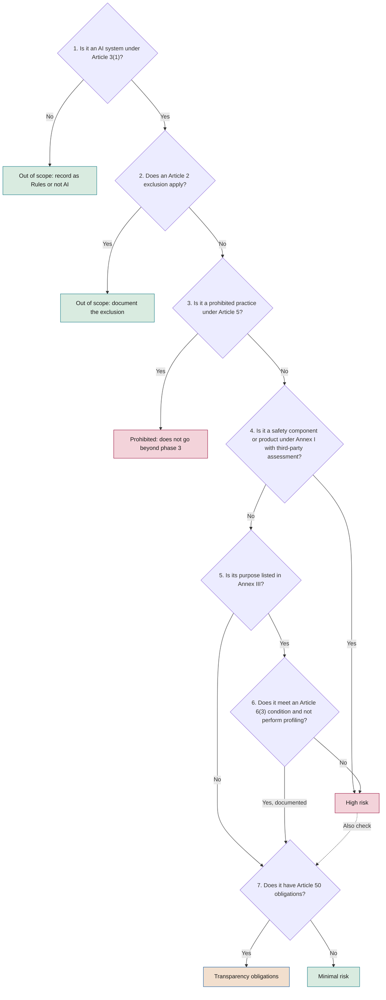

# AI system inventory and regulatory classification

**What is inventoried, with which fields, how it is classified under the EU AI Act and which assessments follow from it**

| | |
|---|---|
| Document | Document 32 · Inventory and regulatory classification |
| Version | 0.1 (working draft) |
| Date | 16-09-2026 |
| Author | Fernando García · SEACHAD |
| Status | Draft for review. Regulatory references consulted on 16-09-2026, following the entry into force of Regulation (EU) 2026/1744; verify that they remain current before applying. |

<!-- cifras: 4 | types of use inventoried ; 9 | steps in the classification tree ; 3 | resulting assessments ; 8 | inventory quality indicators -->

---

> **Legal notice and disclaimer.** SEVEN-G is a reference methodological framework provided "as is" and for information purposes only. It does not constitute legal, regulatory, financial or professional advice, nor does it guarantee compliance with any law or standard. References to general regulation (such as the EU AI Act, the GDPR, DORA or NIS2), to technical standards and to regulation specific to each sector or jurisdiction may be incomplete, may not apply to a particular case or may become out of date as a result of regulatory changes, interpretations or supervisory positions after their consultation date. **Each organisation that uses SEVEN-G is solely responsible for identifying the regulation that applies to it, verifying that it is current and certifying its own regulatory compliance**, with the appropriate qualified advice. The author and SEACHAD accept no liability for any use made of this content or for any decisions taken on the basis of it. The data, figures, companies and cases in the examples are fictitious or illustrative.

## 1. Purpose and scope

The AI system inventory is the **foundation of all governance**: without knowing which systems exist, who is accountable for them and how they are classified, it is not possible to manage risks, meet obligations, audit or report to the board. The foundational methodology requires it in C1 (01 §5.1), in phase 0 (inventory registration) and as a condition for declaring that SEVEN-G is applied (01 §14, condition 2).

This document defines:

- What is and is not inventoried (section 2).
- The inventory fields, consistent with the controlled taxonomy of document 03 (section 3).
- The roles the company may have under Regulation (EU) 2024/1689 (section 4).
- The step-by-step regulatory classification tree (section 5).
- The assessments that follow from the classification (section 6).
- The registration, review and removal procedures (section 7).
- Inventory quality and the detection of uninventoried systems (sections 8 and 9).

The regulatory classification described here is a **working method** for structuring the analysis. It does not replace the qualified legal judgement required by 01 §6.5. The classification and the obligations derived from it are for guidance only: responsibility for the regulatory classification of each system and for compliance, including the applicable sector regulation, lies with the organisation (document 93, section 11).

### 1.1 Regulatory status at the date of consultation

Consulted on 16-09-2026 in official European Union sources (EUR-Lex and European Commission pages on the AI Act).

| Date | What applies | Source |
|---|---|---|
| 1-8-2024 | Entry into force of Regulation (EU) 2024/1689. | Article 113 |
| 2-2-2025 | General provisions (including AI literacy) and prohibited practices. | Article 113 |
| 2-8-2025 | Obligations of providers of general-purpose AI models; governance. | Article 113 |
| 2-8-2026 | Transparency obligations of Article 50 and the remaining provisions of general application that have not been postponed. | Article 113; Regulation (EU) 2026/1744 |
| 2-12-2026 | New prohibited practice concerning systems that generate non-consensual sexually explicit content or child sexual abuse material; end of the transitional period of Article 50(2) for systems already placed on the market. | Regulation (EU) 2026/1744 |
| 2-12-2027 | Obligations for high-risk systems under Annex III. | Regulation (EU) 2026/1744 |
| 2-8-2028 | Obligations for high-risk systems linked to products under Annex I. | Regulation (EU) 2026/1744 |

Regulation (EU) 2026/1744 (Digital Omnibus on AI) was published in the Official Journal on 24-07-2026 and entered into force on 27-07-2026. It also amends Article 4 (literacy), simplifies the information to be registered by providers applying the exception in Article 6(3) and broadens the basis for processing special categories of data for the purpose of detecting and correcting bias. **The consolidated text in force must be consulted before applying this document**, because the numbering and content of some paragraphs may have changed.

---

## 2. What is inventoried

### 2.1 The four types of use

**All AI systems** of the four types of use in 01 §1.2 are inventoried, regardless of their risk or of who developed them.

| Type of use | What is recorded | Unit of record | Level of detail |
|---|---|---|---|
| **AI initiative** | Each system that forms part of an in-house initiative: predictive models, generative AI solutions, agents, AI-enabled automations developed or adapted by the company. | One record per deployed system. An initiative may have several systems and a system may serve several initiatives. | Full. |
| **Third-party AI embedded in processes** | Supplier software with AI functions that play a part in decisions, operations or customer relationships. | One record per AI function with a distinct purpose within the product. | Full. |
| **Corporate use of general-purpose AI** | Assistants, productivity suites and tools in the authorised catalogue (document 31). | One record per authorised tool; specific uses are not recorded individually unless they move to the full cycle. | Reduced, with licences and conditions. |
| **Unauthorised use** | Tools detected without approval. | One record per tool and detection scope. | Minimum, until regularised. |

### 2.2 Borderline cases

| Case | Is it inventoried? | Criterion |
|---|---|---|
| Deterministic business rules without inference | Yes, as "Rules (not AI)", when they have been presented or perceived as AI. | Avoids recurring discussions and documents the conclusion of step 1 of the tree. |
| AI system under testing in an isolated environment without real data | Yes, with status "Under evaluation". | Makes it possible to detect a move to real use without a *gate*. |
| General-purpose AI model procured via API, with no system built on top of it | Recorded as a supplier component in T09 and linked to the systems that use it. | The model is not in itself an AI system; the systems that integrate it are. |
| AI function of a contracted product that is disabled | Yes, with status "Under evaluation" or "Retired" depending on the decision, in order to control its future activation. | Document 31 §5.6. |
| AI used by a supplier to provide an outsourced service to the company | Yes, when it plays a part in decisions about the company's customers or employees or processes its data. | Third-party risk (document 36). |
| AI-enabled security tools (threat detection) | Yes. | They process data and may take automatic actions. |
| Personal use outside work | No. | Outside the company's scope. |

---

## 3. Inventory fields

### 3.1 Conventions

- **Type**: Text · Long text · List (single value) · Multiple list · Date (`AAAA-MM-DD` in the tool; `DD-MM-AAAA` in documents) · Number · Amount (€) · Person · Reference (code of another entity) · Yes/No.
- **Mandatory**: **Yes** always · **Cond.** depending on the condition indicated · **Ent.** mandatory in Enterprise and optional in Lite · **No**.
- "No data" is neither zero nor "No": a mandatory field without information is recorded as pending and counts towards the quality indicators (section 8).
- **System code**: the proposed format is `SIA-AAAA-NNN` (AAAA = year of registration; NNN = sequential number that is never reset or reused). *Proposal pending incorporation into the common specification (§5.9).*

### 3.2 Identification and owners

| Field | Description | Type | Mandatory | Values |
|---|---|---|---|---|
| System code | Persistent identifier. | Text | Yes | `SIA-AAAA-NNN` |
| Name | Name used in the company. | Text | Yes | — |
| What it is and what it is used for | Explanation understandable to a non-specialist (measurement rule 10). | Long text | Yes | One or two sentences |
| Type of use | Type in 01 §1.2. | List | Yes | AI initiative · Third-party AI embedded in processes · Corporate use of general-purpose AI · Unauthorised use |
| Linked initiatives | Initiatives in the register that use the system. | Multiple reference | Cond.: initiative and embedded third-party AI types | `IA-AAAA-NNN` |
| Responsible area | Unit that uses the system and is accountable for it. | List (company catalogue) | Yes | — |
| Legal entity | Group company that deploys it. | List | Cond.: groups | — |
| Registration date | Date of registration in the inventory. | Date | Yes | — |
| Registration origin | How it reached the inventory. | List | Yes | Phase 0 · C1 Diagnosis · Procurement or renewal · Technical detection · Internal report · Audit · Supplier notice |
| System owner | Person accountable for the use: the initiative's AI Product Owner or, for corporate use, the designated service owner. | Person | Yes (except unauthorised use: owner of the regularisation) | — |
| Sponsor | AI Sponsor. | Person | Cond.: initiative and embedded third-party AI types | — |
| Technical owner | AI Technical Owner. | Person | Cond.: in development or production | — |
| Operations owner | AI Operations Owner. | Person | Cond.: in production | — |
| Risk owner | AI Risk Owner. | Person | Yes, from the provisional classification | — |

### 3.3 Technical and usage description

| Field | Description | Type | Mandatory | Values |
|---|---|---|---|---|
| System status | Status of the system (distinct from the initiative status in 03 §3.2). | List | Yes | Under evaluation · In development · Pilot · In production · Suspended · Retired · Blocked |
| Technology | Taxonomy in 03 §3.3. | Multiple list | Yes | Predictive ML · Generative AI · Agent · Language and document processing · Vision · Optimisation · Embedded third-party AI · Rules (not AI) |
| Exposure | Taxonomy in 03 §3.3. | List | Yes | Internal · Employees · Customers indirectly · Customers or external persons directly |
| Primary sphere | Taxonomy in 03 §3.3. | List | Cond.: initiative and embedded third-party AI types | 01 Customer … 09 AI governance |
| Intensity | Lite or Enterprise (01 §9). | List | Cond.: initiative and embedded third-party AI types | Lite · Enterprise |
| Autonomy | Level in the common specification (§5.4). | List | Yes | A0 Assistance · A1 Recommendation · A2 Supervised action · A3 Autonomous action |
| Actions it can execute | For A2 and A3. | Multiple list | Cond.: A2 or A3 | Read · Write to systems · External communications · Payments or financial commitments · Changes to production systems |
| Decisions about people | Whether the output significantly influences decisions about people. | Yes/No | Yes | — |
| Scope of the decision about people | Which decisions. | Multiple list | Cond.: decisions about people = Yes | Employment and labour relations · Credit · Insurance · Access to essential services · Education · Healthcare · Other (specify) |
| Human oversight | Type of oversight defined in the design (P17). | List | Cond.: in production | Validation of each output · Sample-based review · Oversight of aggregates with kill switch · None |
| Kill switch | A tested mechanism exists to stop the system. | List | Cond.: in production | Yes, tested · Yes, untested · No · Not applicable |
| Go-live date | Date of G5 or start of real use. | Date | Cond.: in production | — |
| Users or volume | Active users or volume of use. | Number | Ent. | — |
| Assigned and active licences | Corporate use only. | Number | Cond.: corporate use | — |
| Catalogue category | Corporate use only (document 31 §4.2). | List | Cond.: corporate use | Authorised · Authorised with restrictions · Not authorised |

### 3.4 Regulatory classification

| Field | Description | Type | Mandatory | Values |
|---|---|---|---|---|
| Is it an AI system? | Result of step 1 of the tree. | List | Yes | Yes · No · Uncertain (requires legal review) |
| Scope exclusion | Result of step 2. | List | Cond.: is an AI system | None · National security or defence · Scientific research · Research and development prior to placing on the market · Other (specify) |
| Regulatory classification | Taxonomy in 03 §3.3. If several apply, the **most demanding** is recorded and the others in the following fields. | List | Yes | Prohibited · High risk · Transparency obligations · Minimal risk · Out of scope · Pending classification |
| Classification status | Provisional (phase 0) or final (phase 3). | List | Yes | Provisional · Final · Under review |
| High-risk basis | Why it is high-risk. | List | Cond.: high risk | Annex I (safety component or product) · Annex III |
| Annex III point | Specific area. | List | Cond.: Annex III basis, or Article 6(3) exception | 1 Biometrics · 2 Critical infrastructure · 3 Education and vocational training · 4 Employment, workers' management and access to self-employment · 5 Access to and enjoyment of essential private services and essential public services and benefits · 6 Law enforcement · 7 Migration, asylum and border control management · 8 Administration of justice and democratic processes (with letter) |
| Article 6(3) exception | Condition applied to conclude that an Annex III system is not high-risk. | List | Cond.: Annex III not high risk | a) Narrow procedural task · b) Improvement of the result of a previously completed human activity · c) Detection of patterns without replacing or influencing the previously completed human assessment · d) Preparatory task |
| Profiling | Whether the system performs profiling of natural persons (prevents application of the Article 6(3) exception). | Yes/No | Cond.: Annex III | — |
| Transparency obligations | Applicable paragraphs of Article 50, including where the system is high-risk. | Multiple list | Yes | None · 50(1) Interaction with persons · 50(2) Marking of synthetic content · 50(3) Emotion recognition or biometric categorisation · 50(4) Deep fakes and text on matters of public interest |
| Company role | Role under the Regulation (section 4). | Multiple list | Cond.: within scope | Provider · Deployer · Importer · Distributor · Authorised representative · Product manufacturer |
| Possible assumption of the provider role | Case under Article 25(1) that may make the company the provider of a high-risk system. | List | Cond.: third-party high-risk system | No · Own name or trademark · Substantial modification · Change of intended purpose |
| Underlying general-purpose AI model | Model and provider. | Text | Cond.: generative AI or agent technology | — |
| Relationship with the general-purpose model | What the company does with the model. | List | Cond.: there is a general-purpose model | Use via API or service · Fine-tuning or modification of the model · In-house development of the model · Placing the model on the market |
| Model with systemic risk | According to the provider's information or the Commission's designation. | List | Cond.: there is a general-purpose model | Yes · No · No data |
| Obligations application date | Date from which the main obligations apply (section 1.1). | Date | Cond.: within scope | — |
| Classification rationale | Reasoning through the steps of the tree, with references. | Long text | Yes | — |
| Legal review | Whether the classification has had qualified legal input. | Yes/No | Yes for the final classification | — |
| Classified by · date | AI Risk Owner and date. | Person · Date | Yes | — |
| Next review | Scheduled review date. | Date | Yes | — |

### 3.5 Assessments and obligations

Common statuses: **Done · Pending · Not applicable**, consistent with the board dashboard data schema. Each assessment with status Done links to its evidence, version and date (03 §2, principle 4).

| Field | Description | Type | Mandatory |
|---|---|---|---|
| Data protection impact assessment (GDPR, Article 35) | Status, date, link. | List · Date · Reference | Yes if it processes personal data |
| Fundamental rights impact assessment (Article 27) | Status, date, link, date of notification to the authority. | List · Date · Reference | Cond.: cases in section 6.2 |
| Conformity assessment (Article 43) | Status; procedure (internal control or notified body); EU declaration of conformity. | List · Reference | Cond.: the company is the provider of a high-risk system |
| Documentation of the Article 6(3) exception | Assessment documented before placing on the market or putting into service. | List · Reference | Cond.: exception applied as provider |
| Registration in the EU database (Article 49) | Status and registration reference. | List · Text | Cond.: Annex III high risk, Article 6(3) exception as provider, or deployer that is a public authority |
| Information to workers and their representatives | Article 26(7) of the Regulation and, in Spain, Article 64.4.d) of the Workers' Statute. | List · Date | Cond.: use in the employment context |
| Security assessment | Document 35; includes prompt injection testing for generative AI and agents. | List · Date | Ent.; Yes if A2 or A3 |
| Supplier assessment | P14, document 36. | List · Reference | Cond.: there is a supplier |
| Provider's instructions for use | Available and applied (Article 26(1)). | List | Cond.: deployer of a high-risk system |
| Log retention | Retention period for automatically generated logs (at least six months for deployers of high-risk systems, Article 26(6), unless otherwise provided by other legislation). | Number (months) | Cond.: high risk |

### 3.6 Data, third parties, risk and lifecycle

| Field | Description | Type | Mandatory | Values |
|---|---|---|---|---|
| Categories of information processed | Highest level of information it processes. | Multiple list | Yes | No personal data · Personal data · Special categories of data · [Confidential] information · [Restricted] information |
| Legal basis for processing | For personal data. | Text | Cond.: personal data | — |
| Use of data by the supplier for training | Contractual condition. | List | Cond.: there is a supplier | No · Yes · No data |
| Location of processing | Where the data are processed. | List | Cond.: there is a supplier | European Economic Area · Outside with appropriate safeguards · No data |
| Suppliers | Third parties involved. | Multiple reference (T09) | Cond.: there is a supplier | — |
| Third-party requirement level | Common specification §5.6. | List | Cond.: there is a supplier | N1 Standard · N2 Enhanced · N3 Critical |
| Main residual risk | Common specification §5.1. | List | Cond.: final classification | Low · Medium · High · Critical |
| Open nonconformities | Number and link to T08. | Number · Reference | Yes (0 if none) | — |
| Incidents in the last 12 months | Number by severity. | Number | Cond.: in production | S1 · S2 · S3 · S4 |
| Last continuity review (R6) | Date. | Date | Cond.: in production | — |
| Next continuity review | Quarterly in Enterprise, half-yearly in Lite. | Date | Cond.: in production | — |
| Annual recurring cost | Reference to the per-case calculation (document 42). | Amount (€) with status | Ent. | Validated · Declared · Estimated |
| Removal date | Date of retirement or blocking. | Date | Cond.: retired or blocked | — |
| Removal reason | Taxonomy in 03 §3.3. | List | Cond.: retired | No plausible value · Hypothesis refuted · Insufficient data · Technically unfeasible · Cost exceeds value · Unacceptable risk · Regulation · No adoption · Replaced by another solution · Change in strategic priority |
| Removal decision-maker · replacement | Body that decides and system that replaces it. | Person or body · Reference | Cond.: retired | — |
| Treatment of data and models on removal | Retention, deletion or transfer; confirmation from the supplier. | Long text | Cond.: retired | — |

### 3.7 Minimum fields by type of use

| Block | Initiative | Embedded third-party AI | Corporate use | Unauthorised use |
|---|---|---|---|---|
| Identification and owners | Full | Full | Without sponsor | Code, name, what it is, type, area, registration, origin, owner of the regularisation |
| Technical and usage description | Full | Full | Status, technology, exposure, autonomy, licences, category | Status, technology, autonomy |
| Regulatory classification | Full | Full | Is AI, classification, transparency, role, general-purpose model | Provisional classification |
| Assessments | According to classification | According to classification | Data protection, supplier, security | — |
| Data, third parties, risk and lifecycle | Full | Full | Information processed, use of data by the supplier, location, supplier, level | Information exposed, supplier, nonconformity |

### 3.8 Mapping to the board dashboard schema

The inventory feeds the dashboard (T17). Main mappings to the dashboard data schema: `reporte_compania.clasificacion_ria` (prohibido, alto_riesgo, transparencia, minimo, no_es_ia) is obtained from *Regulatory classification* (Out of scope because it is not AI → `no_es_ia`); `reporte_compania.controles` (`RIA`, `FRIA`, `DPIA`, `seguridad`…) from section 3.5; `tags.exposicion` and `tags.tecnologia` from section 3.3; the case `estado` (En uso, En desarrollo, POC, Desenganchado) from *System status* (In production → En uso; In development → En desarrollo; Pilot → POC; Retired → Desenganchado). Differences in nomenclature will be resolved when T17 is adapted (document 03, wave 1).

---

## 4. Company roles under the AI Act

Obligations depend on the **role** the company has in relation to each system, not on the system in the abstract. The same company may have different roles for different systems, and more than one role for the same system.

| Role | Summary definition (Article 3) | Typical situation in a company | Main obligations if the system is high-risk |
|---|---|---|---|
| **Provider** (3(3)) | Whoever develops an AI system or a general-purpose AI model, or has one developed, and places it on the market or puts it into service under its own name or trademark, whether for payment or free of charge. | The company develops its own system —including on top of a third party's general-purpose model— and puts it into service for internal use or for its customers. | Requirements of Chapter III, Section 2 (risk management, data, technical documentation, record-keeping, transparency, human oversight, accuracy, robustness and cybersecurity); quality management system; conformity assessment; EU declaration of conformity and CE marking; registration; post-market monitoring; reporting of serious incidents (Articles 16, 17, 43, 47–49, 72 and 73). |
| **Deployer** (3(4)) | Whoever uses an AI system under its own authority, except where it is used in the course of a personal non-professional activity. | The company uses supplier software with AI, or a system developed by another group company. | Use in accordance with the instructions; human oversight by competent persons; control of input data; monitoring of operation and informing the provider; log retention; informing workers; informing affected persons; fundamental rights impact assessment where applicable (Articles 26 and 27); explanation of individual decisions where appropriate (Article 86). |
| **Importer** (3(6)) | Person established in the Union that places on the market a system bearing the name or trademark of a person established outside the Union. | European subsidiary that markets a system of its non-EU parent company. | Verifications prior to placing on the market (Article 23). |
| **Distributor** (3(7)) | Person in the supply chain, other than the provider or the importer, that makes a system available on the Union market. | Company that resells third-party AI-enabled software to its customers. | Verifications of marking, documentation and instructions (Article 24). |
| **Authorised representative** | Person established in the Union with a written mandate from a provider established outside the Union. | Rare in user companies. | Tasks under the mandate (Article 22). |
| **Product manufacturer** | Manufacturer that places on the market an Annex I product with an AI system as a safety component under its own name or trademark. | Industrial, machinery or medical device manufacturers. | Considered the provider of the high-risk system (Article 25(3)). |

### 4.1 When a deployer becomes a provider

Under Article 25(1), a distributor, importer, deployer or other third party is considered a **provider of a high-risk AI system** when it:

- a) puts its name or trademark on a high-risk system already placed on the market or put into service;
- b) makes a substantial modification to a high-risk system in such a way that it remains high-risk;
- c) modifies the intended purpose of a system that was not high-risk in such a way that it becomes high-risk.

This analysis is particularly relevant when the company **adapts** third-party software or **reuses** a system for a different purpose. It is recorded in the field *Possible assumption of the provider role* and reviewed at each change.

### 4.2 General-purpose AI models

| Situation | Usual role | Consequences |
|---|---|---|
| The company uses a third party's general-purpose model via API to build its own system. | Provider **of the system** (if it puts it into service under its own name) and user of the model. | The obligations of the model provider (Articles 53 and 55) fall on the third party; the company is accountable for the system according to its classification. It should obtain from the model provider the information necessary to comply. |
| The company fine-tunes or modifies a general-purpose model. | It may become the provider of the modified model to the extent of the modification, according to the Commission's criteria and guidelines in force. | Requires specific legal analysis. |
| The company develops and markets its own general-purpose model. | Model provider. | Obligations under Article 53 and, if it has systemic risk, Article 55. |
| The company uses a general-purpose assistant from a supplier (corporate use). | Deployer of the system. | Normally minimal risk or transparency; high risk only if it is used for an Annex III purpose. |

The obligations of providers of general-purpose AI models have applied since 2-8-2025. A company that integrates third-party models should record in T09 the documentation made available to it by the model provider.

---

## 5. Regulatory classification tree

### 5.1 Graphical representation

<!-- grafico: Classification tree under the AI Act | Each answer must be justified in the inventory -->

After steps 1 to 7, the tree continues with two steps that do not change the category but do change the obligations: **8. Company role** (section 4) and **9. Resulting assessments** (section 6).

### 5.2 Tree table

| Step | Question | How it is answered | Evidence in P11 | Result |
|---|---|---|---|---|
| **1** | Is it an **AI system** under Article 3(1)? | Check whether it is a machine-based system that, with some level of autonomy, **infers** from the input it receives how to generate outputs (predictions, content, recommendations or decisions) that can influence physical or virtual environments. Use the Commission guidelines on the definition of an AI system. Systems based solely on rules defined by people to execute operations automatically do not usually meet the definition. | Description of how it works; technique used; reasoned conclusion. | No → **Out of scope** (technology "Rules (not AI)"). Uncertain → legal review. Yes → step 2. |
| **2** | Does an **exclusion** under Article 2 apply? | Review, among others: exclusively military, defence or national security purposes (2(3)); scientific research and development as the sole purpose (2(6)); research, testing or development activities prior to placing on the market or putting into service, except testing in real-world conditions (2(8)); free and open-source licences, subject to the exceptions in Article 2(12). | Exclusion applied and reason. | Yes → **Out of scope** (it remains in the inventory and is reviewed if the use changes). No → step 3. |
| **3** | Is it a **prohibited practice** under Article 5? | Compare against each case in Article 5(1): subliminal, manipulative or deceptive techniques that distort behaviour causing harm; exploitation of vulnerabilities due to age, disability or social or economic situation; social scoring leading to detrimental treatment; prediction of the risk of committing a criminal offence based solely on profiling or personality traits; creation or expansion of facial recognition databases through untargeted scraping; inference of emotions in the workplace or in educational institutions, except for medical or safety reasons; biometric categorisation to infer sensitive characteristics; real-time remote biometric identification in publicly accessible spaces for law enforcement purposes outside the permitted cases; and the prohibition added by Regulation (EU) 2026/1744 on the generation of non-consensual sexually explicit content or child sexual abuse material (applicable from 2-12-2026). Use the Commission guidelines on prohibited practices. | Analysis of each point with a conclusion. | Yes → **Prohibited**: the initiative does not go beyond phase 3; if the system is in use, immediate suspension and critical nonconformity. No → step 4. |
| **4** | Is it **high-risk under Annex I** (Article 6(1))? | Two cumulative conditions: the system is a safety component of a product, or is itself a product, covered by the Union harmonisation legislation listed in Annex I; and that product is required to undergo a third-party conformity assessment under that legislation. | Applicable legislation and the product's assessment procedure. | Yes → **High risk** (Annex I; obligations from 2-8-2028) and step 7. No → step 5. |
| **5** | Is its **intended purpose** listed in **Annex III** (Article 6(2))? | Compare the purpose with the eight areas of Annex III and their points. In private companies, pay attention to: 1 (biometrics), 2 (safety components of critical infrastructure), 3 (education and vocational training), 4 (recruitment and selection; decisions on working conditions, promotion, termination, task allocation based on behaviour or traits, and monitoring and evaluation of performance), 5(b) (creditworthiness and credit scoring, except for the detection of financial fraud), 5(c) (risk assessment and pricing in life and health insurance). | Annex III point and letter, or conclusion that it does not apply. | No → step 7. Yes → step 6. |
| **6** | Does the **Article 6(3) exception** apply? | The Annex III system is not considered high-risk if it does not pose a significant risk of harm to health, safety or fundamental rights, including by not materially influencing the outcome of decision-making, and it meets at least one condition: a) narrow procedural task; b) improvement of the result of a previously completed human activity; c) detection of decision-making patterns or deviations without replacing or influencing the previously completed human assessment without proper human review; d) preparatory task to an assessment relevant for the purposes of the Annex III use cases. It **never** applies if the system performs profiling of natural persons. Use the Commission guidelines on the application of Article 6 provided for in paragraph 5 thereof, when available in their current version. | Condition applied, analysis of influence on the decision, confirmation that no profiling is performed. If the company is the provider: assessment documented before putting into service and registration (Articles 6(4) and 49(2)). | No → **High risk** (Annex III; obligations from 2-12-2027) and step 7. Yes → step 7 with the exception documented. |
| **7** | Does it have **transparency obligations** under Article 50? | 50(1): the provider ensures that people know they are interacting with an AI system, unless this is obvious. 50(2): the provider marks synthetic audio, image, video or text content in a machine-readable format. 50(3): the deployer informs people exposed to emotion recognition or biometric categorisation. 50(4): the deployer discloses that images, audio or video are deep fakes, and that text published to inform the public on matters of public interest has been generated or manipulated, unless there is human review or editorial control with editorial responsibility. It is checked **also for high-risk systems**. | Applicable paragraphs and obliged role. | Yes → **Transparency obligations** (if not high-risk). No → **Minimal risk**. |
| **8** | What **role** does the company have? | Section 4, including Article 25 and the relationship with general-purpose models. | Role or roles and justification. | Determines which obligations apply. |
| **9** | Which **assessments** follow? | Section 6. | Required assessments with status. | Assessment plan in phase 3. |

### 5.3 Application rules

1. **Provisional classification in phase 0 and final classification in phase 3.** The provisional classification guides intensity and roles; the final classification requires qualified legal judgement and is a condition for G3.
2. **The intended purpose prevails.** Classification is based on the intended use and the reasonably foreseeable use, not on the technology.
3. **When in doubt, the most demanding category applies** while the matter is resolved, and it is recorded as "Under review" with a deadline.
4. **A single main category**, the most demanding one, plus any applicable paragraphs of Article 50 (section 3.4).
5. **"Pending classification" has a time limit.** No system may pass G3 or remain in production beyond the time limit approved in C2 with a pending classification.
6. **Application dates do not delay classification.** An Annex III high-risk system is classified as such from today, even if its obligations apply from 2-12-2027; this way, the design incorporates the requirements in time. For systems already in service before those dates, the transitional regime of Article 111 in its current version must be analysed.
7. **The Article 6(3) exception is applied restrictively** and is reviewed if the degree of influence of the system on the decision changes.
8. **Other legislation is assessed in parallel.** The tree covers the AI Act; data protection, sector-specific regulation, DORA or NIS2 are mapped in document 34 and may require controls even if the system is minimal risk.

### 5.4 Illustrative examples

*Fictitious cases for teaching purposes. The actual classification depends on the specific analysis.*

| Illustrative system | Summary analysis | Indicative classification |
|---|---|---|
| Internal assistant that summarises technical documentation for employees | AI; no exclusion; not prohibited; not Annex I or III; does not interact with external persons; the assistant's provider already discloses that it is AI. | Minimal risk |
| Customer service conversational assistant on the website | AI; not Annex III; direct interaction with people (50(1)). | Transparency obligations |
| System that ranks and filters applications in a recruitment process | Annex III, point 4(a); filters and evaluates candidates; performs profiling. Exception 6(3) not applicable. | High risk |
| Tool that corrects the wording of job advertisements already written by a person | Related to point 4(a), but improves the result of a previously completed human activity without evaluating people (6(3)(b)), without profiling. | Minimal risk with documented exception (legal review) |
| Health insurance pricing model for natural persons | Annex III, point 5(c). | High risk; fundamental rights impact assessment as deployer |
| Payment fraud detection | Expressly excluded from point 5(b); no other categories. | Minimal risk (with other applicable legislation) |
| Analysis of employees' emotions in calls to evaluate their performance | Inference of emotions in the workplace without a medical or safety reason. | Prohibited |

---

## 6. Resulting assessments

### 6.1 Data protection impact assessment (GDPR, Article 35)

| Aspect | Content |
|---|---|
| **When it is mandatory** | Where a type of processing, in particular using new technologies, is likely to result in a high risk to rights and freedoms. Article 35(3) requires it in particular in the case of: a) a systematic and extensive evaluation of personal aspects based on automated processing, including profiling, on which decisions producing legal or similarly significant effects are based; b) large-scale processing of special categories of data or of data relating to criminal convictions and offences; c) systematic monitoring of a publicly accessible area on a large scale. The lists of processing operations requiring an assessment published by the competent supervisory authority (in Spain, the Spanish Data Protection Agency) must also be consulted. |
| **Who carries it out** | The controller, with the advice of the data protection officer. In SEVEN-G, coordinated by the AI Risk Owner. |
| **When in the cycle** | Phase 3 (before G3) and updated in phase 4 with the design. Always before processing begins. |
| **Relationship with the AI Act** | The deployer of a high-risk system uses the information from the provider (Article 13) to carry it out (Article 26(9)). The fundamental rights impact assessment complements it (Article 27(4)). |
| **Prior consultation** | If the residual risk remains high, consultation of the supervisory authority (GDPR, Article 36). In SEVEN-G, in addition, High or Critical residual risk with its level of acceptance (document 30 §7.2). |
| **Template** | P11 (need) and P47 (assessment); it may link to the company's own methodology. |

### 6.2 Fundamental rights impact assessment (AI Act, Article 27)

| Aspect | Content |
|---|---|
| **Who must carry it out** | Before deploying a high-risk system referred to in Article 6(2) (Annex III), **except** those in point 2 (critical infrastructure): deployers that are **bodies governed by public law** or **private entities providing public services**, and deployers of systems referred to in Annex III, **points 5(b)** (creditworthiness and credit scoring) and **5(c)** (risk assessment and pricing in life and health insurance). |
| **Minimum content** | a) description of the processes in which the system will be used in line with its intended purpose; b) period and frequency of use; c) categories of natural persons and groups affected; d) specific risks of harm to those persons, taking into account the information from the provider; e) human oversight measures according to the instructions for use; f) measures to be taken if the risks materialise, including internal governance arrangements and complaint mechanisms. |
| **When** | Before first use; updated if the assessed elements change. In SEVEN-G: phase 3, reviewed in phase 5 and at R6. |
| **Notification** | The deployer notifies the market surveillance authority of the results, using the template provided by the European AI Office, under the terms of Article 27(3). |
| **Temporal applicability** | Linked to the application of the Annex III obligations (2-12-2027 following Regulation (EU) 2026/1744). SEVEN-G recommends carrying it out from the design stage for the systems concerned. |
| **Voluntary use** | Where it is not mandatory, the company **may** use its structure for systems involving significant decisions about people. It may draw on ISO/IEC 42005:2025 (AI system impact assessment). |
| **Template** | P11 (need) and P48 (assessment and notification). |

### 6.3 Conformity assessment and provider obligations

| Aspect | Content |
|---|---|
| **Who** | The company when it is the **provider** of a high-risk system, directly or under Article 25. |
| **When** | Before placing it on the market or putting it into service. In SEVEN-G, prepared in phases 4–5 and completed before G5. It is repeated in the event of substantial modifications. |
| **Procedure** | Article 43: for systems in Annex III, points 2 to 8, the internal control procedure (Annex VI); for those in point 1 (biometrics), internal control or involvement of a notified body depending on whether harmonised standards or common specifications are applied; for those in Annex I, the procedure under the relevant sectoral legislation. |
| **Result** | Technical documentation, quality management system, EU declaration of conformity (Article 47), CE marking (Article 48), registration (Article 49), post-market monitoring plan (Article 72). |
| **If the company is only a deployer** | It does not carry out the conformity assessment, but must verify in the supplier assessment (P14) that the system has one and has instructions for use, and must comply with its obligations under Article 26. |
| **Templates** | SEVEN-G does not include templates for the technical documentation, the quality management system or the EU declaration of conformity: a company acting as provider prepares them with the harmonised standards and its own quality management system. The post-market monitoring plan relies on P24 and P25, and the fundamental rights impact assessment on P48. |

### 6.4 Assessment matrix by classification and role

| Classification | Provider | Deployer | Always (SEVEN-G) |
|---|---|---|---|
| **Prohibited** | Not developed. | Not used. | Critical nonconformity if it exists. |
| **High risk** | Chapter III requirements, conformity assessment, registration, post-market monitoring, reporting of serious incidents. | Article 26; fundamental rights impact assessment in the cases in 6.2; supplier assessment. | Enterprise intensity; risks (P12); security; data protection impact assessment if it processes personal data. |
| **Article 6(3) exception** | Documented assessment and registration. | Verify the provider's documentation. | Legal review; review at R6. |
| **Transparency obligations** | 50(1) and 50(2). | 50(3) and 50(4). | Verification of the transparency mechanism at G5. |
| **Minimal risk** | — | — | Proportionate risks; data protection impact assessment where appropriate; literacy (Article 4). |
| **Out of scope** | — | — | Recorded justification; other applicable legislation. |

---

## 7. Registration, review and removal procedures

### 7.1 Registration

| Step | Activity | Owner | Reference time limit | Evidence |
|---|---|---|---|---|
| 1 | Identify the system (phase 0, procurement, technical detection, report, audit, supplier notice). | Whoever identifies it | — | Recorded request or detection |
| 2 | Create the record with the minimum fields for the type of use and assign code `SIA-AAAA-NNN`. | AI Office | 5 working days from identification | P05 record in T02 |
| 3 | Designate the system owner and the risk owner. | Area and second line | Upon registration | P05 record |
| 4 | Provisional classification (steps 1–7 of the tree) with T07. | AI Risk Owner | 10 working days from registration | Provisional classification in P11 |
| 5 | Determine intensity (P04) and link to the initiative, where applicable. | Sponsor, verified | In phase 0 | P04 |
| 6 | If it is unauthorised use: open a nonconformity and a regularisation plan (document 31 §5). | AI Office | Upon registration | Record in T08 |
| 7 | Final classification with legal review and assessment plan. | AI Risk Owner | Before G3 | Final P11 |
| 8 | Verification of the record. | AI Auditor (Enterprise) or AI Office (Lite) | At G0 and G3 | Verification record |

### 7.2 Review

| Type of review | When | What is reviewed | Owner |
|---|---|---|---|
| **Scheduled** | At each R6 (quarterly Enterprise, half-yearly Lite) and at least annually for corporate use. | Currency of all fields; classification; assessments; owners. | System owner with the AI Risk Owner |
| **Event-driven** | Change of purpose, data, autonomy, exposure, supplier or underlying model; substantial modification; S1 or S2 incident; new supplier version with AI functions; regulatory change or new Commission guidelines. | Classification, role (Article 25) and affected assessments. | AI Risk Owner |
| **Annual inventory review** | C1 / C5. | Completeness and quality of the inventory (section 8); reconciliation with procurement, architecture and security (section 9). | AI Office |
| **Audit-driven** | According to plan (document 38). | Sample of records against reality. | AI Auditor |

Every change of classification generates an **event** in the register (03 §3.3) with date, author and reason. A change to High risk during operation requires the intensity to be reviewed and may bring G7 forward (01 §6.8).

### 7.3 Removal

| Step | Activity | Owner |
|---|---|---|
| 1 | Retirement decision at G7 or blocking in the regularisation of unauthorised use. | Competent body (document 30 §7.3) |
| 2 | Execute the retirement plan (P30, T22): deactivation, replacement, communication to those affected. | AI Operations Owner |
| 3 | Treatment of data and models: retention of logs and documentation for the legal periods, deletion or return by the supplier with confirmation. | AI Technical Owner with data protection |
| 4 | Update the record: status Retired or Blocked, date, coded reason, decision-maker, replacement. | AI Office |
| 5 | Update external registers where appropriate (for example, the EU database). | AI Risk Owner |
| 6 | Verify that the system is no longer in use (technical test and consultation of users). | AI Auditor or AI Office |

**The record of a retired system is not deleted.** It is kept with its history for traceability, audit and learning (retirement reasons).

---

## 8. Inventory quality

### 8.1 Indicators

| # | Indicator | Formula | Indicative target | Frequency |
|---|---|---|---|---|
| Q1 | **Completeness** | Records with all mandatory fields for their type ÷ active records | ≥ 95 % | Monthly |
| Q2 | **Timely classification** | Systems with classification "Pending classification" or "Under review" past the time limit | 0 | Monthly |
| Q3 | **Final classification with legal review** | Systems in production with final classification and legal review ÷ systems in production | 100 % | Quarterly |
| Q4 | **Assessments up to date** | Required assessments with status Done and current ÷ required assessments | 100 % in production | Quarterly |
| Q5 | **Currency** | Records reviewed within their review frequency ÷ active records | ≥ 95 % | Monthly |
| Q6 | **Accuracy** | Records without relevant discrepancies in the audit sample ÷ records in the sample | ≥ 90 % | Annual or per audit |
| Q7 | **Coverage** | Systems detected by sources external to the inventory (section 9) that were not inventoried ÷ total systems known at close | Decreasing trend; target < 5 % | Quarterly |
| Q8 | **Registration time** | Median days between identification and registration; between registration and provisional classification | ≤ 5 and ≤ 10 working days | Quarterly |

The targets are reference values to start with; the company sets them in C2 and recalibrates them in C5.

### 8.2 Quality rules

1. **A system in production without a complete record and final classification** is a major nonconformity; if it is also high-risk or prohibited, it is critical.
2. **Records are not filled in with undeclared estimates.** "No data" is recorded as such.
3. **Mandatory reconciliation** between T02 (systems) and T01 (initiatives): every initiative in phases 4–7 must have at least one linked system, and every system of the initiative type must have an initiative.
4. **Named owner**, not a generic area.
5. **History retained**: changes do not overwrite without recording the previous value.

---

## 9. Detection of uninventoried systems

The inventory is only reliable if it is checked against independent sources. The AI Office must carry out, at least **quarterly**, a reconciliation with the following sources and record the differences.

| Source | What to look for | Responsible for providing the information |
|---|---|---|
| Application register and enterprise architecture | Applications with uninventoried AI components. | Technology |
| Contracts, procurement and renewals | Products and services with AI functions; clauses on AI or on the use of data for training. | Procurement |
| AI supplier register (T09) and ICT third-party provider register (DORA, where applicable) | Suppliers with AI services without a linked system. | Second line |
| Cloud billing and model API consumption | Consumption of model services or AI platforms without an associated initiative. | Finance and technology |
| Code repositories and data platforms | Projects that use AI libraries or services, deployed models. | Technology |
| Records of processing activities (GDPR, Article 30) | Processing operations that mention profiling, scoring, automation or AI. | Data protection |
| Browsing, data loss prevention and device management logs | Unauthorised use (document 31 §5.2). | Security |
| Expense claims and corporate cards | Individual subscriptions. | Finance |
| Release notes from relevant suppliers | New AI functions in contracted software. | System owners |
| Internal reports, surveys and audits | Declared or detected uses. | AI Office and internal audit |

**Treatment of findings**

| Situation | Treatment |
|---|---|
| AI system authorised through another route but not inventoried | Immediate registration; minor or major nonconformity depending on its status and classification. |
| System in production without a *gate* | Critical nonconformity (01 §12); containment; regularisation through a review equivalent to G7. |
| Embedded AI function enabled without a decision | Process in 31 §5.6; nonconformity depending on data and exposure. |
| Unauthorised use | Process in 31 §5. |
| False positive (not AI) | Recorded as "Rules (not AI)" if recurrent; otherwise, the conclusion is documented in the reconciliation report. |

The result of the reconciliation feeds indicator Q7 and is reported to the AI Committee within the corporate AI use monitor (T21), the quarterly second-line report (P42) and the C4 report.

---

## 10. Associated tools and templates

| Code | Name | Use in this document |
|---|---|---|
| **T02** | AI system inventory | Implements the fields in section 3, the procedures in section 7 and the indicators in section 8. |
| **T07** | Regulatory classifier | Guided questionnaire covering steps 1 to 9 of the tree; generates the provisional classification and the assessment plan, and records the rationale and date. It must be updated when the consolidated text of the Regulation or the Commission guidelines change. |
| **P05** | AI system inventory record | Evidence of inventory registration (phase 0). |
| **P11** | Regulatory classification and impact assessments | Evidence of the classification (phase 3) and of the resulting assessments. |
| **P47** | Data protection impact assessment | Assessment required under section 6.1. |
| **P48** | Fundamental rights impact assessment | Assessment and notification required under section 6.2. |
| **P42** | Quarterly second-line report | Reports the reconciliation of section 9 and indicator Q7 to the AI Committee. |
| **T01** | Initiative register | System–initiative link and classification change events. |
| **T04** | Intensity determination | Uses the classification and autonomy from the inventory. |
| **T09** | AI supplier register | Linked suppliers and general-purpose models. |
| **T17** | Board AI dashboard | Receives the classification and control status (section 3.8). |
| **T21** | Corporate AI use monitor | Receives corporate and unauthorised uses, and indicator Q7. |

---

## 11. Related documents

| Document | Relationship |
|---|---|
| **01 · Foundational methodology** | Types of use (§1.2), phase 0 and phase 3, Enterprise criteria, declaration of application (§14). |
| **03 · Tools and initiative register** | Controlled taxonomy, data model and events. |
| **21 · *Gate* and audit criteria** | G0 and G3 criteria on inventory and classification. |
| **30 · Governance model** | Responsibilities for the inventory and classification. |
| **31 · Corporate policy and acceptable use** | Corporate use, embedded AI and unauthorised use. |
| **33 · AI risk methodology** | Main residual risk. |
| **34 · Regulatory mapping** | Detailed obligations by article, role and phase. |
| **35 · AI and agent security** | Autonomy and security assessment. |
| **36 · AI third parties and suppliers** | Assessment of suppliers and general-purpose models. |
| **37 · Nonconformities and incidents** | Treatment of uninventoried and misclassified systems. |
| **38 · AI audit framework** | The inventory as the audit universe. |

This document does not constitute legal advice. The regulatory classification of each system must be carried out with qualified legal judgement and with the consolidated text in force of Regulation (EU) 2024/1689 and the guidelines of the European Commission.

---

## 12. Version control

| Version | Date | Changes |
|---|---|---|
| 0.1 | 16-09-2026 | First version. Defines the scope of the inventory by type of use, the fields with type, mandatory status and value lists consistent with the taxonomy in 03, the roles under the AI Act (including Article 25 and general-purpose models), the nine-step classification tree, the resulting assessments (data protection, fundamental rights, conformity), the registration, review and removal procedures, the quality indicators and the reconciliation to detect uninventoried systems. Incorporates the application dates amended by Regulation (EU) 2026/1744 (consulted on 16-09-2026). Proposes the code `SIA-AAAA-NNN`. |
