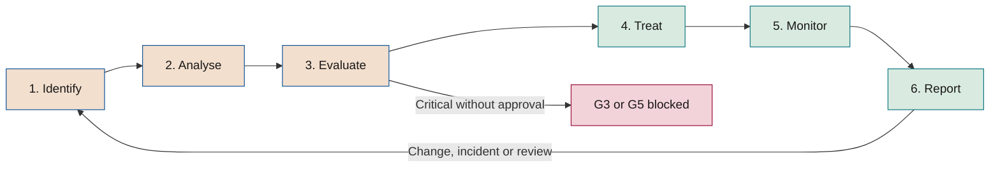

# AI risk methodology

**How AI risks are identified, assessed, treated, monitored and reported in each initiative and in the portfolio**

| | |
|---|---|
| Document | Document 33 · AI risk methodology |
| Version | 0.1 (working draft) |
| Date | 16-09-2026 |
| Author | Fernando García Varela |
| Status | Draft for review. It develops section 10 of document 01 and sets the framework's common risk scales. |

<!-- cifras: 10 | risk categories ; 71 | typical risks catalogued ; 5 × 5 | likelihood and impact matrix ; 5 | impact axes -->

---

> **Legal notice and disclaimer.** SEVEN-G is a reference methodological framework provided "as is" and for information purposes only. It does not constitute legal, regulatory, financial or professional advice, nor does it guarantee compliance with any law or standard. References to general regulation (such as the EU AI Act, the GDPR, DORA or NIS2), to technical standards and to regulation specific to each sector or jurisdiction may be incomplete, may not apply to a particular case or may become out of date as a result of regulatory changes, interpretations or supervisory positions after their consultation date. **Each organisation that uses SEVEN-G is solely responsible for identifying the regulation that applies to it, verifying that it is current and certifying its own regulatory compliance**, with the appropriate qualified advice. This methodology is a generic, free aid shared with the community so that nobody has to start from scratch; each person or organisation can and should adapt it to its own use. It must not be inferred that its legally sensitive parts have been reviewed by legal counsel: those reviews, for each company or sector, are the ultimate responsibility of the company, consultant or organisation that uses it. Although every effort is made to keep it up to date, some regulation may have changed without being reflected here. To the fullest extent permitted by law, the author accepts no responsibility whatsoever for the effects of its application in any organisation or for its full applicability. The methodology does not grant certification of any kind. The author accepts no liability for any use made of this content or for any decisions taken on the basis of it. The data, figures, companies and cases in the examples are fictitious or illustrative.

<!-- esencial: siempre | Risk register for each initiative from phase 3, with the 5 × 5 scale, inherent and residual risk, and acceptance by the body that corresponds to its level. A Critical residual risk without board approval blocks G3 and G5. Portfolio risk and key risk indicators are applied in proportion to the size of the portfolio. -->

## 1. Purpose and scope

This document defines the methodology with which an organisation that applies SEVEN-G manages the risks of its AI systems and initiatives. It is the reference for the framework's risk scales: documents 13 (risk appetite), 14 (portfolio), 21 (*gate* criteria), 35 (security), 36 (third parties), templates P12 and P13 and tool T06 use exactly the scales and levels set here.

### 1.1 What it covers

- The six-step risk management process: identify, analyse, evaluate, treat, monitor and report.
- Its application at the framework's two levels: the **initiative** (phases 0–7) and the **portfolio** (corporate cycle C1–C5).
- The likelihood and impact scales, the 5 × 5 matrix and the risk levels.
- Inherent and residual risk, and the assessment of control effectiveness.
- Risk acceptance, escalation and the risk register.
- The **catalogue of typical risks** `RT-<CAT>-NN`, organised into ten categories.
- Portfolio risk: concentration, correlation and supplier dependency.
- Key risk indicators.

### 1.2 What it does not cover

- The company's appetite and tolerances, which are approved in C2 (document 13).
- The detail of security and agent controls (document 35), third-party controls (document 36) and regulatory compliance controls (document 34).
- The management of incidents and nonconformities (document 37). A materialised risk is managed as an incident; the risk methodology captures its lessons.

### 1.3 Reference standards

The methodology is consistent with **ISO/IEC 23894** (guidance on AI risk management, which adapts the ISO 31000 process), with the risk assessment and treatment requirements of **ISO/IEC 42001**, with the *Map*, *Measure* and *Manage* functions of the **NIST AI RMF** and its generative AI profile **NIST AI 600-1**, and with the risk management system that **Regulation (EU) 2024/1689** requires of providers of high-risk systems. SEVEN-G does not replace the company's corporate risk framework: it specialises it for AI and must be integrated into it (same level language, same bodies, same report).

This document does not constitute legal advice.

---

## 2. Principles

| # | Principle | Practical consequence |
|---|---|---|
| 1 | **Risk is assessed before investing** | The full assessment is mandatory evidence for G3, the main stop gate. |
| 2 | **An untested control does not reduce risk** | Residual risk is only considered verified when the effectiveness of the control is evidenced (normally in phase 5). |
| 3 | **The worst impact axis is assessed** | Impact is the highest of the five axes; it is not averaged. |
| 4 | **Every risk has an owner** | Without a named owner, the risk is not registered. |
| 5 | **Those who build do not accept their own risk** | Acceptance follows the scale in section 7 and respects segregation of duties (01 §8). |
| 6 | **Risk is systemic** | In addition to the risk of each initiative, portfolio concentration and correlation are managed (principle 5 of 01 §3). |
| 7 | **The register is living** | It is updated at every *gate*, at every continuity review, after every incident and whenever there is a relevant change. |

---

## 3. The process

<!-- grafico: AI risk management process | Six steps repeated at every gate and every review -->

| Step | What is done | Output | Owner |
|---|---|---|---|
| **1. Identify** | Go through the catalogue of typical risks (section 9), the phase 0 context, the regulatory classification, the architecture and the suppliers. Describe each risk as **cause → event → consequence**. | List of risks with the associated RT code. | AI Product Owner with the AI Technical Owner; facilitated by the AI Risk Owner. |
| **2. Analyse** | Estimate inherent likelihood and impact using the scales in section 4, justifying the determining impact axis. Identify existing controls. | Inherent level per risk. | Initiative team. |
| **3. Evaluate** | Compare with the appetite and tolerances (document 13). Decide which risks require treatment and in what order. | Prioritisation and proposed response. | AI Risk Owner. |
| **4. Treat** | Choose the response (avoid, mitigate, transfer, accept), design and apply controls, estimate the target residual and obtain acceptance of the residual. | Mitigation and contingency plan (P13); acceptance decision. | Risk owner; acceptance by whoever is competent under section 7. |
| **5. Monitor** | Verify the effectiveness of controls, monitor key risk indicators, review at the frequency set for the level and when triggers occur. | Updated register; verified residual. | AI Operations Owner and risk owner; verified by the AI Auditor at the *gates*. |
| **6. Report** | Present the risk profile to the body that decides the *gate* and, in aggregate, to the AI Committee and the board. | Risk information in P29, board dashboard (T17). | AI Office with the AI Risk Owner. |

### 3.1 In the initiative lifecycle

| Phase or gate | Risk activity | Evidence |
|---|---|---|
| **0 · G0** | Constraints and obvious risks (prohibited practice, protected data, critical function). Intensity determination. | Context statement (P02), intensity (P04). |
| **1 · G1** | Preliminary identification of risks that could rule out the opportunity. | Screening notes (P06). |
| **2 · G2** | Risks of the value hypothesis (RT-ECO, RT-EST) and stop criteria linked to risk. | Hypothesis canvas (P08). |
| **3 · G3** | **Full assessment**: inherent risk, planned controls, target residual, acceptance. No Critical risk without accepted treatment. | Matrix and register (P12); mitigation and contingency plan (P13); supplier assessment (P14). |
| **4 · G4** | Every Medium or higher risk has a designed control, with a code where one exists (SEG, AG from document 35). | Security design (P18), oversight design (P17), updated register. |
| **5 · G5** | Control effectiveness tested; **residual verified**; acceptance ratified. | Validation results (P22), updated register, sign-off (P23). |
| **6 · R6** | Monitoring, indicators, incidents, changes; review of the classification. | Updated register; incident register (P27). |
| **7 · G7** | Accumulated risks and retirement risks (data, models, dependencies). | Scale or retire decision (P30). |

### 3.2 In the portfolio

| Stage | Risk activity |
|---|---|
| **C1 · Diagnosis** | Risk profile of the inventoried systems, including those that predate the framework and corporate use of AI. |
| **C2 · Direction** | Approval of the appetite, tolerances, economic materiality threshold and indicator thresholds (document 13). |
| **C3 · Portfolio** | Concentration, correlation and supplier dependency when prioritising (section 10). |
| **C4 · Oversight** | Monthly report to the AI Committee and quarterly report to the board or board committee (section 12). |
| **C5 · Review** | Effectiveness of the risk management system, materialised risks, lessons and recalibration of scales. |

---

## 4. Assessment scales

### 4.1 Likelihood

Likelihood is estimated for the initiative's horizon or, for systems in production, for the following twelve months. The frequency reference is used for recurring events and the percentage reference for one-off events.

| Likelihood | Name | Indicative reference |
|---|---|---|
| **1** | Rare | Less than once in 5 years or < 5 % over the initiative's horizon |
| **2** | Unlikely | Once every 2–5 years or 5–20 % |
| **3** | Possible | Once every 1–2 years or 20–50 % |
| **4** | Likely | Several times a year or 50–80 % |
| **5** | Almost certain | Monthly or more often, or > 80 % |

Supporting criteria: precedents in the company or the sector, results of tests and pilots, exposure (users, volume, external access), existence of a motivated attacker, maturity of the technology. For security threats with an active attacker (RT-GEN, RT-SEG) and external exposure, likelihood **should not** be rated below 3 without evidence from adversarial testing.

### 4.2 Impact across five axes

Impact is assessed on five axes and the **highest** is taken. The determining axis and its justification are recorded.

M is the **economic materiality threshold** that the company approves in C2 (document 13) in proportion to its size. The percentages of M are indicative and are calibrated in C2.

| Impact | Economic | People and rights | Regulatory | Operational | Reputational |
|---|---|---|---|---|---|
| **1 · Negligible** | Less than 1 % of M. | No appreciable effect on people. | No non-compliance. | Brief interruption with no effect on customers or relevant processes. | No external repercussions. |
| **2 · Minor** | From 1 % to 5 % of M. | Inconvenience to a few people, immediately correctable. | Formal non-compliance that can be remedied without notifying the authorities. | Degradation lasting hours in a non-critical process. | Isolated complaints. |
| **3 · Moderate** | From 5 % to 20 % of M. | Reversible adverse effect on a limited group (wrongful treatment, delay, incorrect information). | Non-compliance that requires formal correction and may require notification to the supervisor. | Interruption of a relevant process for one working day or sustained degradation. | Local or sector-level coverage; recurring complaints. |
| **4 · Major** | From 20 % to 100 % of M. | Significant harm: wrong decisions on rights or access to services, exposure of personal data with risk to individuals. | Mandatory notification, formal request or likely sanctioning proceedings. | Interruption of a critical function within its tolerance, or of a relevant process for several days. | National coverage; measurable loss of customers or partners. |
| **5 · Critical** | More than M. | Serious or irreversible harm to health, systematic discrimination or infringement of fundamental rights. | Prohibited practice, possible serious incident under the AI Act, serious sanction or loss of authorisation. | Interruption of a critical function beyond its impact tolerance. | Lasting damage to trust; attention from the supervisor and the board. |

### 4.3 Risk level and 5 × 5 matrix

**Level = Likelihood × Impact**, with four levels: **Low** 1–4 · **Medium** 5–9 · **High** 10–15 · **Critical** 16–25.

| Likelihood \ Impact | 1 · Negligible | 2 · Minor | 3 · Moderate | 4 · Major | 5 · Critical |
|---|---|---|---|---|---|
| **5 · Almost certain** | 5 · Medium | 10 · High | 15 · High | 20 · Critical | 25 · Critical |
| **4 · Likely** | 4 · Low | 8 · Medium | 12 · High | 16 · Critical | 20 · Critical |
| **3 · Possible** | 3 · Low | 6 · Medium | 9 · Medium | 12 · High | 15 · High |
| **2 · Unlikely** | 2 · Low | 4 · Low | 6 · Medium | 8 · Medium | 10 · High |
| **1 · Rare** | 1 · Low | 2 · Low | 3 · Low | 4 · Low | 5 · Medium |

Rules of use:

1. Whole numbers are used. When in doubt between two values, the higher one is taken and the doubt is recorded.
2. **Extreme impact rule:** a risk with impact 5 on the people and rights axis or on the regulatory axis is treated, for acceptance purposes, as at least **High**, even if its likelihood is 1. This prevents rare but unacceptable events from being accepted by the AI Product Owner.
3. Practices prohibited by the AI Act are not assessed: they are **avoided** (01 §6.5).

---

## 5. Inherent risk, controls and residual risk

### 5.1 Definitions

| Concept | Definition |
|---|---|
| **Inherent risk** | Level of the risk without considering controls specific to the initiative. General corporate controls are only considered if they are tested and documented in the company. |
| **Target residual risk** | Level expected after applying the planned controls. It is used at G3 and G4. |
| **Verified residual risk** | Level after checking the effectiveness of the controls with evidence. It is the level required at G5 and monitored at R6. |

### 5.2 Control types

| Type | Acts on | Examples |
|---|---|---|
| **Preventive** | Likelihood | Least privilege for agents, data validation, contractual no-training clause. |
| **Detective** | Impact, by shortening the time to detection | Drift monitoring, alerts on anomalous actions, sample review. |
| **Corrective or containment** | Impact | Kill switch, rollback plan, manual fallback process. |
| **Transfer** | Economic impact | Insurance, contractual indemnity. It does not transfer regulatory accountability or harm to people. |

### 5.3 Control effectiveness

| Effectiveness | Criterion | Maximum reduction allowed |
|---|---|---|
| **Effective** | Designed, implemented and tested with evidence in the last review period, with no relevant exceptions. | Up to 2 levels of likelihood (preventive) or of impact (detective or corrective). |
| **Partially effective** | Implemented and tested with exceptions, incomplete coverage or unsupervised manual dependency. | 1 level. |
| **Ineffective** | The test fails or the control does not operate as designed. | None. A corrective action is opened. |
| **Untested** | Designed or implemented without an effectiveness test. | None in the verified residual. It may be used in the target residual. |

Rules:

- The total reduction cannot take likelihood below 1 or impact below the impact the event would produce with the corrective control already activated.
- Transfer controls only reduce the economic axis; impact continues to be determined by the highest of the other axes.
- In generative AI and agents, the effectiveness of controls against prompt injection **must** be tested through adversarial testing (document 35, section 8); a policy or an instruction to the model is not, on its own, an effective control.
- An ineffective control on a High or Critical residual risk is also a nonconformity (document 37).

---

## 6. Risk responses

| Response | When | Conditions |
|---|---|---|
| **Avoid** | Unacceptable risk with no alternative: prohibited practice, Critical with no viable treatment, cost of the control higher than the value. | Change the scope, design, data, supplier or autonomy level; or **Stop** at the *gate*. |
| **Mitigate** | Usual response for Medium, High and Critical. | Controls with an owner, deadline and target residual. Plan in P13. |
| **Transfer** | Significant economic impact with a transfer market. | Document what is transferred and what is not; review insurance exclusions and indemnity limits. |
| **Accept** | Residual within appetite or disproportionate mitigation cost. | Decision by the competent level (section 7), with a validity period and review conditions. |

Every High or Critical risk under treatment **must** have a **contingency plan**: what is done if it materialises, who activates it and with what trigger. In systems with the ability to act, the plan includes activating the kill switch or the rollback.

---

## 7. Acceptance and escalation

### 7.1 Who accepts residual risk

| Residual level | Accepted by | Conditions |
|---|---|---|
| **Low** | AI Product Owner | With a record. |
| **Medium** | AI Sponsor | With clearance from the AI Risk Owner. |
| **High** | AI Committee | With a treatment plan, indicators and a maximum acceptance validity until the next continuity review. |
| **Critical** | **Not accepted.** Exceptionally, only the board or its board committee, within the appetite approved in C2. | Rationale, time limit, compensating controls and monitoring at every quarterly meeting. **A Critical residual without that approval blocks G3 and G5.** |

Rules:

- No one accepts a risk of an initiative they are building (01 §8.2).
- Acceptance expires when the level, the system, the supplier, the model, the regulatory classification or the autonomy level changes, and in any case on the recorded validity date.
- Accepting a risk does not exempt compliance with regulation: a legal breach is not accepted as a risk; it is corrected.

### 7.2 Escalation triggers and extraordinary review

| Trigger | Action | Indicative time limit |
|---|---|---|
| New Critical residual risk | Notification to the AI Committee; assessment of stopping or suspension. | Same working day |
| New High residual risk or a one-level increase | Notification to the AI Sponsor and the AI Risk Owner; review at the next committee meeting. | 5 working days |
| Key risk indicator outside threshold | Review of the associated risk and its controls. | 5 working days |
| Materialised risk | Management as an incident (document 37) and reassessment. | According to severity |
| Ineffective control on a High or Critical risk | Nonconformity and reassessment of the residual. | According to nonconformity type |
| Change of model, supplier, data, autonomy or regulation | Reassessment of the affected risks before the change. | Before deployment |
| Overdue treatment action | Alert to the owner; if High or Critical, to the committee. | On expiry |

### 7.3 Review frequency

| Residual level | In development (phases 0–5) | In production (phase 6) |
|---|---|---|
| **Critical** (exceptionally accepted) | Continuous, with a report at every committee meeting | Monthly and at every quarterly board meeting |
| **High** | At every *gate* and at least monthly | Quarterly, coinciding with Enterprise R6 |
| **Medium** | At every *gate* | Half-yearly or at every R6 |
| **Low** | At G3 and G5 | Annually or at R6 |

---

## 8. Risk register

The risk register is the "Risk matrix and register" evidence of 01 §6.10. It is implemented with template **P12** and tool **T06**, on the *Risk* entity of the common data model (03 §4).

### 8.1 Fields

| Block | Field | Content |
|---|---|---|
| **Identification** | Identifier | Initiative code and sequential number (illustrative: IA-2026-014 · R03); for portfolio risks, scope "Portfolio". |
| | Typical risk | Catalogue code `RT-<CAT>-NN`, or "Specific" if there is no equivalent. |
| | Category | EST, TEC, DAT, ECO, LEG, ORG, REP, GEN, SEG or TER. |
| | Title and description | Cause → event → consequence, in plain language. |
| | Affected systems and suppliers | Link to the inventory (T02) and the supplier register (T09). |
| | Date and phase of identification | Date, phase and who identified it. |
| **Owners** | Risk owner | Named person with the ability to act. |
| | AI Risk Owner | Second line that issues clearance. |
| **Inherent analysis** | Likelihood (1–5) and justification | Reference used and sources. |
| | Impact per axis (1–5) | Economic, people and rights, regulatory, operational, reputational; determining axis. |
| | Inherent level | Calculated. |
| **Controls** | Controls | Description, type, code (SEG, AG or other), owner. |
| | Effectiveness | Effective, partially effective, ineffective or untested; date and evidence of the test. |
| **Residual** | Residual likelihood and impact | Target and verified. |
| | Residual level | Target and verified. |
| **Treatment** | Response | Avoid, mitigate, transfer or accept. |
| | Plan | Actions, owner, deadline and status (P13). |
| | Contingency | Trigger, actions and owner responsible for activating it. |
| **Acceptance** | Decision | Who accepts, date, validity, conditions, link to P29 if decided at a *gate*. |
| **Monitoring** | Key risk indicator | Definition, threshold, current value and date. |
| | Status | Identified · Under treatment · Accepted · Materialised · Closed. |
| | Trend and next review | Rising, stable or falling; date. |
| **Links** | Incidents, nonconformities and criteria | INC-AAAA-NNN, NC-AAAA-NNN, *gate* criteria `G<n>.<nn>`. |
| **History** | Events | Assessment changes with date, author and reason (03 §2, principle 2). |

### 8.2 Register quality

The verifier checks, as a minimum: that all Medium or higher risks have an owner, a control and a residual; that the justification of likelihood and impact is traceable; that acceptances are signed by the competent person and are current; that the typical risks applicable to the initiative's technology and classification have been considered (included or discarded with a reason); and that the register existed before the *gate* (01 §7.4, rule 3). The specific criteria are in documents 21 and 22.

---

## 9. Catalogue of typical risks

The catalogue is a starting list, not an exhaustive one. In phase 3, the team **must** review at least the typical risks in the categories that apply to its technology and exposure, and record those discarded with a reason. Each company **may** extend the catalogue with sequential codes and **must** declare those it adds. To carry out that review, the Excel of the use case generated by T06 lists the typical risks that apply to the profile of the initiative (technology, exposure, autonomy, regulatory classification, ambition and third parties) and have no registered risk with their code, with a proposed mitigation and contingency for each one and columns to include or discard it with a reason.

The *Phase* column indicates where the risk is identified and where it is mainly treated; controls with a SEG or AG code are described in document 35.

### 9.1 Strategic (EST)

| Code | Risk and description | Typical causes | Typical controls | Phase |
|---|---|---|---|---|
| **RT-EST-01** | **Misalignment with the AI thesis.** The initiative does not contribute to the ambition or the spheres approved in C2. | Technology-driven origin; weak sponsorship; no screening. | Fit with the thesis at G0; sphere classification (P07); prioritisation in C3. | 0–1 |
| **RT-EST-02** | **Declared but unevidenced ambition.** What is Optimise is presented as Augment or Transform, and decisions are made with wrong expectations. | Incentives to "transform"; ambiguous criteria. | Five classification questions (T05); confirmation in phase 2; review at G7. | 1, 2, 7 |
| **RT-EST-03** | **Missed opportunity.** The decision process is so slow that the advantage is lost. | Long *gate* time limits; the same return criterion for all bets. | Reference time limits (03 §3.6); criteria by ambition (01 §7.6); agility metrics. | C3, all |
| **RT-EST-04** | **Technology lock-in.** The chosen platform or model is superseded and changing is costly. | Dependence on proprietary features; tightly coupled architecture. | Model abstraction layer; portability of data and prompts; review at R6. | 4, 6 |
| **RT-EST-05** | **Withdrawal of sponsorship or funding.** The initiative loses support before demonstrating value. | Changes in leadership; value not visible in time. | Stage-gated funding; learning milestones; stop criteria set in advance. | 0, C3 |
| **RT-EST-06** | **Portfolio concentration in a single bet.** A single initiative or platform concentrates investment or expected value. | Large bets without limits per stage. | Concentration limits in the appetite (13); quarterly review. | C3, C4 |

### 9.2 Technical (TEC)

| Code | Risk and description | Typical causes | Typical controls | Phase |
|---|---|---|---|---|
| **RT-TEC-01** | **Insufficient performance in real-world conditions.** The system does not reach the threshold outside the test environment. | Validation with non-representative data; pilot without an attribution method. | Success threshold set in advance; pilot in real-world conditions (P22). | 3, 5 |
| **RT-TEC-02** | **Degradation and drift.** Performance falls because of changes in the data, the environment or user behaviour. | Dynamic environment; no monitoring. | Drift and performance monitoring (P25); retraining or retirement thresholds. | 6 |
| **RT-TEC-03** | **Lack of robustness.** Erroneous outputs in response to atypical inputs, noise or edge cases. | Testing limited to common cases. | Robustness and edge-case testing; referral to a person when out of domain. | 4, 5 |
| **RT-TEC-04** | **Confabulation.** Generative AI produces false content presented as true. | Lack of authoritative sources; out-of-scope tasks. | Retrieval over authoritative sources; citations; periodic evaluations; user notice. | 4–6 |
| **RT-TEC-05** | **Outputs that are neither explainable nor traceable.** It is not possible to reconstruct why an output was produced. | Insufficient logs; opaque models without documentation. | Logging of inputs, versions and outputs; model documentation; explanations proportionate to the use. | 4 |
| **RT-TEC-06** | **Insufficient integration and capacity.** Latency, availability or volume cannot support the process. | Testing without real load; external dependencies. | Load testing; service level agreements; graceful degradation. | 4, 5 |
| **RT-TEC-07** | **Unmanaged change.** Changes to the model, prompts, parameters or configuration without prior evaluation. | Frequent changes; no version management. | Change management with regression evaluations; prompt versioning. | 5, 6 |
| **RT-TEC-08** | **Irreversibility.** It is not possible to return to the previous state or to the process without AI. | Rollback plan non-existent or untested; manual process dismantled. | Rollback plan tested before G5 (P19); fallback process maintained. | 4, 5 |

### 9.3 Data (DAT)

| Code | Risk and description | Typical causes | Typical controls | Phase |
|---|---|---|---|---|
| **RT-DAT-01** | **Insufficient quality.** Incomplete, erroneous or outdated data. | No control at source; legacy systems. | Quality profiling in phase 3; validation rules; data owner. | 3, 4 |
| **RT-DAT-02** | **Non-representative data and bias.** The data do not reflect the population or reproduce historical discrimination. | Biased samples; proxy variables for protected characteristics. | Representativeness analysis; fairness metrics; testing by group. | 3, 5 |
| **RT-DAT-03** | **Lack of legal basis or incompatible purpose.** Use of personal data without a legal basis or for a different purpose. | Reuse of operational data without analysis. | Legal analysis; data protection impact assessment; minimisation. | 3 |
| **RT-DAT-04** | **Unknown lineage.** It is not known where the data come from, what transformations they have undergone or under what licence. | Third-party data; manual processes. | Data and model lineage (P16); verified licences. | 4 |
| **RT-DAT-05** | **Data exposure in the AI lifecycle.** Personal or confidential data in training, context, prompts or logs. | Full unmasked logs; excessive context. | Minimisation and masking; limited log retention; SEG-07. | 4, 6 |
| **RT-DAT-06** | **Obsolete or contradictory knowledge.** The document base that feeds generative AI is outdated or has no owner. | No document governance; duplicates. | Owner and validity date per source; automatic removal of expired content. | 4, 6 |

### 9.4 Economic (ECO)

| Code | Risk and description | Typical causes | Typical controls | Phase |
|---|---|---|---|---|
| **RT-ECO-01** | **Build cost overrun.** The cost exceeds what was approved. | Open scope; underestimated integration. | Estimation with the cost categories (42); stage-gated funding; change control. | 3, 5 |
| **RT-ECO-02** | **Rising or unpredictable recurring cost.** Consumption of models, compute or licences grows faster than value. | Usage-based pricing; agent loops; unforeseen adoption. | Consumption budgets and limits; cost per transaction monitored (T13); SEG-10. | 3, 6 |
| **RT-ECO-03** | **Unrealised value.** Released capacity is not converted into savings or reallocated. | No realisation plan; organisational resistance. | Measurement rule 3 (00 §6); realisation plan at G5; monitoring (P28). | 5–7 |
| **RT-ECO-04** | **Inflated value or double counting.** The same euro is attributed to several use cases or declared without a formula. | Pressure for results; no independent validation. | Measurement rules 1, 2 and 5; validation by management control. | 2, 6, 7 |
| **RT-ECO-05** | **Unforeseen exit cost.** Replacing the supplier or retiring the system costs more than estimated. | Contracts without exit clauses; data in closed formats. | Exit plan (document 36); exit cost in the economic assessment. | 3, 7 |

### 9.5 Legal and compliance (LEG)

| Code | Risk and description | Typical causes | Typical controls | Phase |
|---|---|---|---|---|
| **RT-LEG-01** | **Incorrect regulatory classification.** A high-risk system is treated as minimal-risk or out of scope. | Classification without legal judgement; change of purpose. | Classification with T07 and legal review; review at R6 and upon changes (34). | 0, 3, 6 |
| **RT-LEG-02** | **Prohibited practice.** The use falls within a practice prohibited by the AI Act. | Lack of awareness; evolution of the use. | Screening at G0 and G3; always avoid (01 §6.5). | 0, 3 |
| **RT-LEG-03** | **Transparency breach.** People do not know they are interacting with an AI or that content is synthetic. | Design without transparency requirements. | Requirements of Article 50 of the AI Act in the design; interface review. | 4, 5 |
| **RT-LEG-04** | **Automated decisions without safeguards.** Decisions with significant effects without effective human intervention or the right to contest. | Nominal oversight; progressive automation not reviewed. | Human oversight design (P17); analysis of Article 22 of the GDPR. | 3, 4 |
| **RT-LEG-05** | **Omitted impact assessments.** The data protection impact assessment or the fundamental rights impact assessment is not carried out or not updated. | Lack of awareness of the requirement; deadlines. | Classification (P11); assessments as G3 evidence. | 3, 6 |
| **RT-LEG-06** | **Intellectual property infringement.** Training data or outputs infringe third-party rights, or ownership of the outputs is unclear. | Unlicensed data; supplier terms not reviewed. | Licence review; ownership and indemnity clauses (36). | 3, 4 |
| **RT-LEG-07** | **Late incident reporting.** A serious incident, a data breach or a DORA or NIS2 incident is not reported in time. | No severity criteria; no reporting owner. | Response plan (P26); reporting matrix (37). | 6 |
| **RT-LEG-08** | **Breach of sector-specific or resilience obligations.** Requirements of sector supervisors, DORA or other regulations not carried over into the system. | Incomplete regulatory mapping. | Regulatory mapping (34); context statement (P02). | 0, 3 |

### 9.6 Organisational (ORG)

| Code | Risk and description | Typical causes | Typical controls | Phase |
|---|---|---|---|---|
| **RT-ORG-01** | **Lack of adoption.** Users do not use the system or use it only marginally. | Poor integration into work; distrust; insufficient training. | Adoption plan (P20); adoption target at G2 and G5. | 4–6 |
| **RT-ORG-02** | **Dependence on key people.** Knowledge of the system lies with a few people or with the supplier. | Scarce documentation; small teams. | Documentation and operations manual (P24); deputies; knowledge transfer. | 4, 6 |
| **RT-ORG-03** | **Unmanaged effect on people.** Changes in role, workload or employment without planning or dialogue. | Efficiency-only view; late communication. | People plan (50); consultation with employee representatives where appropriate. | 2, 4 |
| **RT-ORG-04** | **Ineffective human oversight.** People approve out of routine or without sufficient information. | High volume of approvals; automation bias. | Oversight design with sampling, time allowances and rotation; measurement of the rejection rate. | 4, 6 |
| **RT-ORG-05** | **Unauthorised use of AI (*shadow AI*).** Employees use unapproved tools with company data. | Lack of approved alternatives; policy not known. | Acceptable use policy (31); corporate alternatives; detection (T21). | C1, C4 |
| **RT-ORG-06** | **Roles without segregation of duties.** Those who build also verify, accept risks or decide. | Small teams; roles not assigned. | Role register (P03); incompatibilities (01 §8.2). | 0 |
| **RT-ORG-07** | **Failure to inform and consult.** Workers' representatives or affected workers do not receive, before use, the required information or consultation on a system that affects working conditions or employment. | Late or missing legal analysis; changes in parameters, rules or purpose not communicated. | Information and consultation process (50 §7.2) and information sheet (50 §7.3); no *Proceed* or *Proceed with conditions* at G5 without evidence that information has been provided; IND-ADO-12 (41). | 3–5, 6 |
| **RT-ORG-08** | **Labour dispute.** The introduction of AI gives rise to collective consultations, complaints or disputes that delay, condition or block the initiative. | Late or ambiguous communication; effect on employment without dialogue; destinations of released capacity decided without participation. | Position on AI and work approved in C2 (13); effect assessment (50 §3.4); dialogue with workers' representatives and internal communication (50 §7 and §10); senior management decision on relevant PER-D1 destinations. | 2–5, 7 |
| **RT-ORG-09** | **Deterioration of wellbeing.** Work intensification, excessive monitoring, loss of autonomy or oversight workload harm the health and engagement of the people affected. | Objectives and workloads not reviewed after AI; usage data used to monitor people; excessive review volumes. | Review of the occupational risk assessment, including psychosocial risks, and purpose limitation (50 §9.2); oversight design (P17); pulse survey (IND-ADO-15, 41). | 4–6 |

### 9.7 Reputational (REP)

| Code | Risk and description | Typical causes | Typical controls | Phase |
|---|---|---|---|---|
| **RT-REP-01** | **Discriminatory outcomes.** The system treats groups of people less favourably. | Bias in data or design; no testing by group. | Bias testing before G5; monitoring by group; human oversight. | 3, 5, 6 |
| **RT-REP-02** | **Errors visible to customers.** Wrong responses or decisions with public repercussions. | Direct exposure without safeguards. | Prior evaluations; referral to a person; rapid incident response. | 5, 6 |
| **RT-REP-03** | **Use perceived as inappropriate or intrusive.** Use that is legal but contrary to the expectations of customers, employees or society. | No ethical analysis; insufficient communication. | Ethical review in phase 3; transparency; complaints channel. | 3 |
| **RT-REP-04** | **Harmful or offensive content.** Generative AI produces content that is offensive, dangerous or unbecoming of the brand. | Insufficient filters; user manipulation. | Input and output filters (SEG-03); adversarial testing; sample oversight. | 4–6 |
| **RT-REP-05** | **Misleading communication about AI.** Capabilities or results that AI does not have are attributed to it. | Commercial pressure; unvalidated value. | Review of communications; use of validated value (00 §6). | 5, 7 |

### 9.8 Generative AI and agents (GEN)

| Code | Risk and description | Typical causes | Typical controls | Phase |
|---|---|---|---|---|
| **RT-GEN-01** | **Direct prompt injection and *jailbreak*.** A user manipulates the system to bypass its restrictions. | Restrictions based solely on instructions to the model. | SEG-02, SEG-03, SEG-11; limits enforced outside the model. | 4, 5 |
| **RT-GEN-02** | **Indirect injection.** Malicious instructions in emails, documents, websites or tool responses alter the task. | The system treats untrusted content as instructions. | SEG-02; AG-12; AG-05; specific testing (AG-18). | 4, 5 |
| **RT-GEN-03** | **Excessive agency.** The system has more tools, permissions or autonomy than necessary. | Inherited permissions; unjustified autonomy level. | AG-02; autonomy level decided in phase 4 (35 §5); AG-20. | 4, 6 |
| **RT-GEN-04** | **Unauthorised or untraceable action.** An agent executes an action that does not correspond to an authorised intent, or it is not possible to reconstruct why. | No intent-based access control; incomplete logs. | AG-04, AG-05, AG-06, AG-10. | 4–6 |
| **RT-GEN-05** | **Information leakage.** Personal or confidential data or system prompts leak through responses, retrieval or tools. | Retrieval without user permissions; secrets in prompts. | SEG-05, SEG-06, SEG-07. | 4, 6 |
| **RT-GEN-06** | **Improper output handling.** The model's output is executed or inserted into other systems without validation. | Trust in the output; direct integrations. | SEG-04; AG-11. | 4, 5 |
| **RT-GEN-07** | **Memory or context poisoning.** Manipulated content persists in memory or in the knowledge base and alters future decisions. | Shared memory without control; ingestion without validation. | AG-14; SEG-08; RT-DAT-06. | 4, 6 |
| **RT-GEN-08** | **Cascading failures and unbounded consumption.** Loops, retries or chains of agents amplify errors or costs. | No iteration limits or circuit breakers. | AG-07, AG-16; SEG-10. | 4, 6 |
| **RT-GEN-09** | **Human trust exploitation.** The system induces a person to approve an inappropriate action. | Approvals without context; overreliance. | AG-08 with sufficient information; RT-ORG-04. | 4, 6 |

### 9.9 Security and offensive AI (SEG)

| Code | Risk and description | Typical causes | Typical controls | Phase |
|---|---|---|---|---|
| **RT-SEG-01** | **Impersonation with synthetic voice or video.** CEO fraud or false orders with a legitimate appearance. | Payment processes based on voice or image recognition. | SEG-16, SEG-17, SEG-18. | C4, 6 |
| **RT-SEG-02** | **AI-generated phishing and social engineering.** Personalised, convincing messages at scale. | Weak authentication; public exposure of employee information. | SEG-15, SEG-17. | C4 |
| **RT-SEG-03** | **Accelerated exploitation of vulnerabilities.** The time between the disclosure of a vulnerability and its exploitation shrinks. | Slow patching; unknown exposed attack surface. | SEG-13, SEG-19. | 6, C4 |
| **RT-SEG-04** | **Compromise of non-human identities.** Theft or abuse of agent credentials, service keys or *tokens*. | Long-lived credentials; excessive permissions. | AG-01, AG-02, AG-03, AG-20. | 4, 6 |
| **RT-SEG-05** | **Data or model poisoning.** Manipulation of training, fine-tuning or evaluation data. | Open sources; uncontrolled ingestion. | SEG-08; lineage (P16). | 4, 5 |
| **RT-SEG-06** | **Model extraction and service abuse.** Mass queries to replicate the model, infer data or exhaust resources. | Exposed interfaces without limits. | SEG-10, SEG-12. | 4, 6 |
| **RT-SEG-07** | **AI supply chain compromise.** Malicious or vulnerable models, libraries, connectors or tool servers. | Components downloaded without verification. | SEG-09; AG-13; supplier assessment (36). | 4, 6 |
| **RT-SEG-08** | **Errors of AI cyber defence.** False negatives that let an attack through or automated containments that interrupt operations without a real attack; the defensive system itself attacked or manipulated. | Automated response without limits or validation; detection not measured against a baseline; dependency on a single supplier. | SEG-21, SEG-22, SEG-23, SEG-24, SEG-25 (35 §9.3). | 4, 6 |

### 9.10 Third parties (TER)

| Code | Risk and description | Typical causes | Typical controls | Phase |
|---|---|---|---|---|
| **RT-TER-01** | **Supplier dependency and lock-in.** Changing supplier is unfeasible within a reasonable time or cost. | Closed formats; proprietary features. | Exit strategy; portability (36 §7). | 3, 4 |
| **RT-TER-02** | **Use of data by the supplier.** The supplier uses data, prompts or outputs for training or other purposes. | Non-negotiated standard terms. | No-training-use clause; configuration verification (36 §6). | 3 |
| **RT-TER-03** | **Unilateral change of model or terms.** The supplier changes the version, behaviour or price, or withdraws the model. | Managed services without contractual advance notice. | Advance notice and pinned versions; regression evaluations (RT-TEC-07). | 3, 6 |
| **RT-TER-04** | **Uncontrolled sub-processors and location.** Data processed by third parties or in unauthorised locations. | Opaque subcontracting chain. | List of sub-processors; authorisation of changes; contractual location. | 3 |
| **RT-TER-05** | **Supplier failure or discontinuity.** Prolonged unavailability, insolvency or market exit. | Small or critical supplier with no alternative. | Continuity and exit plan; financial due diligence; level N3 (36 §4). | 3, 6 |
| **RT-TER-06** | **Unidentified embedded AI.** Software already contracted incorporates AI features without assessment. | Supplier updates; activation by default. | Embedded AI questionnaire; review of updates (36 §8). | C1, 6 |
| **RT-TER-07** | **Concentration in common suppliers.** Many systems depend on the same model or cloud provider. | Standardisation without concentration analysis. | Concentration analysis (section 10); limits in the appetite. | C3 |

---

## 10. Portfolio risk

The risks of initiatives do not simply add up: they interact. The AI Committee **must** review the portfolio, at least quarterly, with three analyses.

### 10.1 Concentration

| Factor | What is measured | Indicative warning signal |
|---|---|---|
| **Model provider** | Systems in production and expected value that depend on the same provider or model family. | More than half of validated value depends on a single provider without a tested exit plan. |
| **Platform and cloud** | Systems on the same execution or agent platform. | Critical function with no execution alternative. |
| **Critical function** | Critical or important functions supported by AI. | More than one critical function without an operational fallback process. |
| **Data** | Systems that depend on the same data source or knowledge base. | Source with no owner or with unmeasured quality. |
| **People** | Systems that depend on the same key people. | One person is the AI Technical Owner of several Enterprise systems. |
| **Sphere and ambition** | Distribution of High residual risk by sphere and ambition level. | Risk concentrated in customer or decision spheres without enhanced oversight. |

The thresholds are set in the risk appetite (document 13); those in this table are indicative.

### 10.2 Correlation

Two risks are correlated when the same cause materialises both at once. Typical common causes: the same foundation model (a version change or a vulnerability affects all the systems that use it), the same attack technique (an indirect injection that works on one agent usually works on others with the same design), the same regulatory change or the same legal interpretation, and the same supplier or sub-processor.

For each common cause, the AI Office **should** build a **portfolio scenario** and assess it with the matrix in section 4, adding up the economic impacts of the affected systems and taking the worst impact on the other axes. Minimum recommended scenarios:

1. Unavailability of the main model provider for several days.
2. Change in the behaviour of a foundation model used by several systems.
3. Exploited vulnerability in a common agent component (connector, tool server, library).
4. Regulatory reclassification of a type of use present in several initiatives.
5. Data breach in a shared knowledge base.

### 10.3 Supplier dependency

Dependency is assessed using the N1–N3 requirement level of document 36 and two questions: how much time and cost it takes to replace the supplier, and which functions stop in the meantime. Portfolio risks are recorded in T06 with scope "Portfolio", an owner in the AI Office and acceptance by the AI Committee or, if they are Critical, by the board.

---

## 11. Risk appetite and key risk indicators

### 11.1 Relationship with the appetite

The risk appetite is approved in C2 and developed in document 13. This methodology requires it to include, as a minimum:

- A statement per risk category (for example, zero tolerance for prohibited practices and for untreated discrimination).
- The economic materiality threshold M of section 4.2.
- Portfolio limits: maximum number of accepted High residual risks, no Critical risk without board approval, concentration limits.
- Key risk indicator thresholds.

### 11.2 Key risk indicators

The thresholds are indicative and are approved in C2. All are calculated with data from T01, T06, T08 and T09.

| Indicator | Definition | Indicative threshold |
|---|---|---|
| Critical residuals | Current Critical residual risks, with and without board approval. | 0 without approval |
| High residuals | Number and evolution of accepted High residual risks. | No increase for two consecutive quarters |
| Expired acceptances | Acceptances whose validity has expired without review. | 0 |
| Untested controls | Percentage of controls on High or Critical risks without a current effectiveness test. | Less than 10 % |
| Overdue actions | Treatment actions for High or Critical risks that are past their deadline. | 0 overdue by more than 30 days |
| Materialised risks | Incidents linked to registered risks versus incidents with no previously identified risk. | Downward trend in unidentified ones |
| Drift | Systems with drift or performance metrics outside threshold. | 0 without an open action |
| Injection success | Percentage of adversarial injection tests that succeeded in the last campaign. | Downward trend; 0 on sensitive actions |
| Agents with excessive permissions | Agent identities with unjustified permissions in the last review. | 0 |
| Supplier concentration | Proportion of validated value dependent on the main model provider. | According to the C2 limit |
| Overdue classification | Systems whose regulatory classification has not been reviewed within the time limit. | 0 |
| Unauthorised use | *Shadow AI* cases detected and not regularised. | Downward trend |

---

## 12. Risk reporting

| Recipient | Frequency | Minimum content |
|---|---|---|
| **Body that decides the *gate*** | At every *gate* | Inherent and residual profile, High and Critical risks with controls and effectiveness, required acceptances, changes since the previous *gate*. |
| **AI Committee** | Monthly | Residual heat map of the portfolio, new and escalated risks, pending and expired acceptances, indicators outside threshold, materialised risks. |
| **Board or board committee** | Quarterly | Critical and High residuals by sphere, concentration and portfolio scenarios, compliance with the appetite, significant incidents, exposure to offensive AI (35), decisions requested. Presented with the quarterly second-line report (P42). |
| **C5 · Annual review** | Annual | Effectiveness of the risk management system, recalibration of scales and catalogue, lessons learned. |

The report to the board uses business language: what can happen, whom it affects, what is being done and what decision is requested. It should not present unprioritised technical lists of risks.

---

## 13. Associated tools and templates

| Code | Name | Use in this document |
|---|---|---|
| **P12** | Risk matrix and register | Register with the fields in section 8, inherent and residual heat map. Phases 3, 5 and 6. |
| **P13** | Mitigation and contingency plan | Treatment actions, target residual, contingencies and triggers (sections 5–7). Phase 3. |
| **P42** | Quarterly second-line report | Quarterly portfolio risk reporting to the board committee (sections 10–12). |
| **T06** | Risk matrix and register | Calculation of levels with the extreme impact rule, inherent and residual 5 × 5 matrix for each initiative and for the portfolio, control effectiveness, acceptance by the body for its level, observations from sections 4 to 8 (Critical residual without approval, High without contingency, acceptance expired or insufficient, review overdue), CSV export and **Excel of the use case**: matrix, register, mitigation plan (P13 §4) and contingency plan (P13 §6) proposed for each risk from the catalogue in section 9 according to its typical risk, and the typical risks that apply to the profile of the initiative and are not registered, to include or discard with a reason (section 8.2); the proposals are a starting point and do not replace the decision of the competent body. "Risks" view of the T01 register. Portfolio concentration and correlation (section 10) are analysed with P12 §7. |
| T01 · T02 · T08 · T09 · T17 | Initiative register, inventory, incidents, suppliers and board dashboard | Sources and destinations of risk data. |

---

## 14. Related documents

| Document | Relationship |
|---|---|
| **01 · Foundational methodology** | Section 10 (risks) and *gate* rules that this document develops. |
| **13 · AI thesis, ambition and risk appetite** | Appetite, tolerances, materiality threshold and indicator thresholds. |
| **14 · Portfolio management** | Use of portfolio risk in prioritisation and retirement. |
| **21 · *Gate* and audit criteria** · **22 · Checklists** | G3, G4, G5 and R6 criteria on the risk register. |
| **34 · Regulatory mapping** | Obligations that give rise to risks in the LEG category. |
| **35 · AI and agent security** | SEG and AG controls cited in the catalogue. |
| **36 · AI third parties and suppliers** | N1–N3 levels and controls for TER risks. |
| **37 · Nonconformities and incidents** | Treatment of materialised risks and ineffective controls. |
| **42 · AI costs** | Cost categories for ECO risks. |

---

## 15. Version control

| Version | Date | Changes |
|---|---|---|
| 0.1 | 16-09-2026 | First version. Sets the common scales of likelihood and impact across five axes, the 5 × 5 matrix, target and verified residual risk, control effectiveness, tiered acceptance, the register fields, the catalogue of 70 typical risks in ten categories, the portfolio risk analysis and the key risk indicators. Organisational risks RT-ORG-07 (information and consultation), RT-ORG-08 (labour dispute) and RT-ORG-09 (wellbeing), proposed in document 50, added to the catalogue. |
| 0.2 | 25-09-2026 | Adds typical risk RT-SEG-08 (errors of AI cyber defence), bringing the catalogue to 71 typical risks. |
