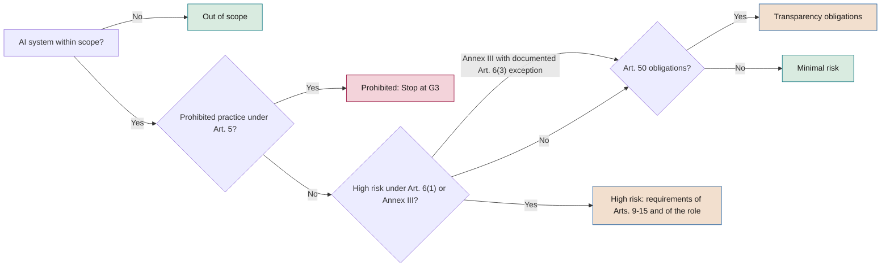

# Regulatory mapping

**Each obligation linked to a SEVEN-G phase, role, evidence item and tool**

| | |
|---|---|
| Document | Document 34 · Regulatory mapping |
| Version | 0.2 (working draft) |
| Date | 25-09-2026 |
| Author | Fernando García Varela |
| Status | Draft for review. Date sources were consulted: 16-09-2026. Requires qualified legal review before use. |

<!-- cifras: 7 | regulatory references mapped ; 2-12-2027 | application of Annex III high-risk requirements ; 13 | stages and phases in the summary matrix ; 1 | procedure for maintaining the mapping -->

---

> **Legal notice and disclaimer.** SEVEN-G is a reference methodological framework provided "as is" and for information purposes only. It does not constitute legal, regulatory, financial or professional advice, nor does it guarantee compliance with any law or standard. References to general regulation (such as the EU AI Act, the GDPR, DORA or NIS2), to technical standards and to regulation specific to each sector or jurisdiction may be incomplete, may not apply to a particular case or may become out of date as a result of regulatory changes, interpretations or supervisory positions after their consultation date. **Each organisation that uses SEVEN-G is solely responsible for identifying the regulation that applies to it, verifying that it is current and certifying its own regulatory compliance**, with the appropriate qualified advice. This methodology is a generic, free aid shared with the community so that nobody has to start from scratch; each person or organisation can and should adapt it to its own use. It must not be inferred that its legally sensitive parts have been reviewed by legal counsel: those reviews, for each company or sector, are the ultimate responsibility of the company, consultant or organisation that uses it. Although every effort is made to keep it up to date, some regulation may have changed without being reflected here. To the fullest extent permitted by law, the author accepts no responsibility whatsoever for the effects of its application in any organisation or for its full applicability. The methodology does not grant certification of any kind. The author accepts no liability for any use made of this content or for any decisions taken on the basis of it. The data, figures, companies and cases in the examples are fictitious or illustrative.

<!-- esencial: condicional | Trigger: the regulatory classification of a system is not 'minimal risk', personal data is processed or the company is subject to sector regulation. The preliminary determinations (section 2) are always made; the rest is consulted by applicable regulation. It does not constitute legal advice. -->

## 1. Purpose and scope

> **Scope and responsibility.** This mapping is **for guidance only** and does not constitute legal advice. It reflects the state of the legislation as consulted on 16 September 2026 (consultation date) and is not updated automatically. Both general regulation (EU AI Act, GDPR, DORA, NIS2 or national legislation) and **regulation specific to each industry** (banking, insurance, healthcare, energy, public sector, among others) change: dates of application, articles and texts in the legislative process are amended, and their scope depends on the interpretation, guidelines and supervisory positions of the competent authorities. The sector references annex (section 12) and the other jurisdictions annex (section 11) are for guidance only and do not identify all applicable obligations. Before using any row in a decision, verify that it is still in force in the official source. **The user organisation is solely responsible for identifying the regulation that applies to it, carrying out the regulatory classification of each system (01 §13) and verifying and certifying its compliance with qualified legal advice**; the author does not accept that responsibility (document 93, section 11).

### 1.1 Principle: SEVEN-G maps, it does not embed

SEVEN-G does not reproduce regulation within its phases. It links each obligation to **a phase or stage, an accountable role, an evidence item and a tool**. When a regulation changes, the affected row of this document and tool T07 are updated, without redoing the lifecycle, the *gates* or the templates.

This document develops section 13 of document 01 and covers: Regulation (EU) 2024/1689 (EU AI Act) as amended by Regulation (EU) 2026/1744 (section 3); ISO/IEC 42001:2023 (section 4); NIST AI RMF 1.0 and NIST AI 600-1 (sections 5.1 and 5.2); the NIST CSF 2.0 cybersecurity framework and its AI profile, the Cyber AI Profile, which is a draft as at the consultation date (section 5.3); the breakdowns by subcategory of the AI RMF and the CSF for building profiles (sections 5.4 and 5.5); the GDPR and the EDPB guidelines (section 6); DORA and NIS2 where applicable (section 7); Spanish legislation and AESIA (Spanish Agency for the Supervision of Artificial Intelligence) (section 8); and, for guidance purposes, other jurisdictions and sectors (sections 11 and 12).

### 1.2 What this document does not do

It does not classify specific systems (that is done in phase 3 with P11 and T07), it does not replace the text of the regulations or the authorities' guidelines, it does not assert unverified sector-specific requirements and it does not reproduce the text of ISO/IEC standards: it only identifies clauses and groups of controls by number and topic.

### 1.3 How to read the mapping tables

All mapping tables use the same columns:

| Column | Content |
|---|---|
| **Obligation / requirement** | Our own summary of the obligation, not a literal quotation. |
| **Article or clause** | Exact reference in the regulation or standard. |
| **Applies to** | Operator or obliged organisation (for example, provider, deployer, controller, financial entity). |
| **SEVEN-G phase or stage** | Lifecycle phase (0–7), gate (G0–G5, R6, G7) or corporate cycle stage (C1–C5). |
| **Accountable role** | SEVEN-G initiative role or body (01 §8; document 30). Legal counsel and the data protection officer form part of the second line. |
| **Evidence** | Template P01–P31 or library document where the proof is held. |
| **Tool** | Tool T01–T22 where it is recorded (document 03). |

**Terminology note.** SEVEN-G's *AI Office* is an internal body of the company (01 §8.3). For the European Commission body provided for in the AI Act, *European AI Office* is always used.

### 1.4 Verification status

Every statement about dates or recent changes implicitly carries one of these statuses, detailed in section 13:

| Status | Meaning |
|---|---|
| **Verified (official)** | Confirmed in an official source: EUR-Lex, European Commission, European Parliament, BOE (Official State Gazette), Congreso de los Diputados (Congress of Deputies), AESIA, ISO, NIST or EDPB. |
| **Pending confirmation** | Could not be confirmed as at the consultation date. Must not be used without prior verification. |
| **Draft** | Document that the issuer has officially published as a draft for comment (for example, the NIST Cyber AI Profile). It is cited for guidance and may change; it **never underpins a *gate* criterion** or a SEVEN-G obligation. |

Every statement in this document is based on **official or primary sources** (official journals, authorities, bodies that issue standards and frameworks), linked and recorded with the date on which they were checked; third-party analyses are not used as sources. Anything that could not be confirmed in them is marked "Pending confirmation".

---

## 2. Determinations prior to any mapping

Before applying the tables, each system must have four questions resolved. They are recorded provisionally in phase 0 (P02, P05) and confirmed in phase 3 (P11).

| Question | Reference | Possible outcome | Phase | Evidence | Tool |
|---|---|---|---|---|---|
| Is it an AI system or a general-purpose AI model? | AI Act, Art. 3(1) and 3(63); Commission guidelines on the definition of an AI system (February 2025) | AI system · General-purpose model · Not AI (tag *Rules (not AI)*) | 0, confirmed in 3 | P05, P11 | T02, T07 |
| Is it within the scope of the Regulation? | Art. 2 (exclusions: defence and national security, scientific research, purely personal non-professional activity, among others) | Within scope · Out of scope | 0, confirmed in 3 | P02, P11 | T07 |
| What role does the company have in relation to that system? | Art. 3(3) to 3(8) (provider, deployer, authorised representative, importer, distributor, operator) and Art. 25 | One or more roles per system | 0, confirmed in 3 and reviewed in R6 | P02, P11, P14 | T02, T07, T09 |
| Which risk category does it fall into? | Arts. 5, 6, 50 and Annexes I and III | Prohibited · High risk · Transparency obligations · Minimal risk · Out of scope · Pending classification (taxonomy in 03 §3.3) | 3; review in R6 and G7 | P11 | T07, T02 |

**Change of role (Art. 25).** A company acting as deployer takes on provider obligations if it puts its name or trademark on a high-risk AI system, makes a substantial modification to it or changes its intended purpose in such a way that it becomes high-risk. The role must therefore be reviewed at G4 (design), at G5 (before production) and at every relevant change recorded in P27.

<!-- grafico: Regulatory classification in phase 3 | Sequence followed by the T07 classifier -->

The categories are not mutually exclusive: T07 must record all those that apply.

---

## 3. EU AI Act

### 3.1 Verified timeline of application

Regulation (EU) 2024/1689 entered into force on 1 August 2024 and applies in stages. **Regulation (EU) 2026/1744 (Digital Omnibus on AI)**, proposed by the Commission on 19 November 2025, with political agreement on 7 May 2026, adopted by the European Parliament on 16 June and by the Council on 29 June 2026, signed on 8 July, published in the Official Journal on 24 July and **in force since 27 July 2026**, has amended several dates.

| Date | What applies | Verification status | Consequence in SEVEN-G |
|---|---|---|---|
| **1-08-2024** | Entry into force of the Regulation. | Verified (official) | — |
| **2-02-2025** | General provisions (definitions and AI literacy, Art. 4) and prohibited practices (Art. 5). | Verified (official) | No initiative involving a prohibited practice passes G3. Training and use policy (documents 31 and 50). |
| **2-08-2025** | Obligations of providers of general-purpose AI models (Chapter V); governance; national competent authorities; penalties regime (except fines on providers of general-purpose AI models). | Verified (official) | Information requirements for model providers (P14, T09). |
| **2-08-2026** | General application of the Regulation, including the transparency obligations of Art. 50 and the Commission's enforcement powers over general-purpose AI models. | Verified (official) | Art. 50 obligations enforceable for systems in production: review in R6. |
| **2-12-2026** | New prohibitions added to Art. 5 by the omnibus (generation of non-consensual intimate material and child sexual abuse material). End of the transitional period for the machine-readable marking of Art. 50(2) for systems placed on the market before 2-08-2026. | Verified (official): Art. 5(1), points (ba) and (bb), and paragraphs 1a and 1b; the Art. 50(2) deadline is set by new Art. 111(4) | Incorporate into the T07 questionnaire and into phase 5 testing of generative systems. |
| **2-08-2027** | Obligation for Member States to have at least one national AI regulatory sandbox operational (previously 2-08-2026). Deadline for general-purpose AI models placed on the market before 2-08-2025 (Art. 111(3)). | Verified (official) for the sandbox; Art. 111(3) according to the original text, with no known changes | — |
| **2-12-2027** | Requirements and obligations for **high-risk AI systems under Art. 6(2) and Annex III** (previously 2-08-2026). | Verified (official) | Initiatives with go-live planned after this date must already be designed with the requirements (G4). |
| **2-08-2028** | Requirements for **high-risk AI systems under Art. 6(1) and Annex I** (regulated products; previously 2-08-2027). | Verified (official) | Likewise for regulated products. |

**Systems already on the market.** Under Art. 111, high-risk AI systems predating the date of application are only subject to the Regulation if they undergo significant changes in their design, with specific rules for public authorities; following the omnibus, Art. 111(2) keeps the rule that they are only subject if they undergo significant changes in their design, and those intended for public authorities must comply by 2-08-2030 at the latest (verified in EUR-Lex). SEVEN-G does not use this exception to lower controls (01 §14).

### 3.2 Changes in the Digital Omnibus on AI relevant to SEVEN-G

| Change | Provision affected | Application | Status | Effect in SEVEN-G |
|---|---|---|---|---|
| Postponement of high-risk requirements | Art. 113 | 2-12-2027 (Annex III) and 2-08-2028 (Annex I) | Verified (official) | Updates T07 and the dates column of P11. Does not change the *gates*. |
| AI literacy: the obligation becomes one of supporting the development of staff AI literacy, without requiring a specific level; the role of the Commission and the Member States is strengthened | Art. 4 | From the entry into force of the omnibus | Verified (official) | The policy and training plan remain evidence (documents 31 and 50). Deployers of high-risk AI systems retain the requirement of competence for those who exercise oversight (Art. 26(2)). |
| New prohibited practices: systems that generate or manipulate non-consensual intimate material or child sexual abuse material, including systems in which that outcome is reasonably foreseeable in the absence of adequate safeguards | Art. 5 | 2-12-2026 | Verified (official) | New question in T07 and specific test in phase 5 of generative systems (P22). |
| Transitional period for marking synthetic content | Art. 111(4) (on Art. 50(2)) | 2-12-2026 for systems placed on the market before 2-08-2026 | Verified (official) | Compliance plan in R6 for existing systems. |
| Processing of special categories of data to detect and correct bias, extended beyond high risk under a strict necessity criterion | Arts. 4a and 10 | From the entry into force of the omnibus | Verified (official) | Requires a documented GDPR legal basis and safeguards (P16, data protection impact assessment in P11). |
| Registration in the EU database: maintained, with simplified information, for Annex III systems that the provider considers not to be high-risk | Arts. 6(3) and 49(2); Annex VIII, Section B (amended) | With the high-risk requirements | Verified (official) | P11 retains the documentation of the Art. 6(3) exception. |
| SME support measures extended to small mid-cap enterprises | Various provisions | From the entry into force of the omnibus | Verified (official) | Relevant to the intensity of documentation; does not lower SEVEN-G criteria. |
| Enhanced supervision by the European AI Office of systems based on general-purpose AI models from the same provider and of systems integrated into very large online platforms and search engines | Art. 75 | From the entry into force of the omnibus | Verified (official) in essence | Identify the competent authority in P11. |
| AI regulatory sandboxes: national deadline moved to 2-08-2027 and possible EU-level sandbox | Art. 57 | 2-08-2027 | Verified (official) | Option for initiatives in phases 3–5 (section 8). |
| Machinery: AI systems in machinery come to be dealt with mainly through Regulation (EU) 2023/1230; narrower definition of safety component | Art. 3(14) (replaced) and Annex I (Regulation (EU) 2023/1230 moves to Section B) | According to amended Art. 113 | Verified (official) | Relevant only to product manufacturers. |
| Template for the post-market monitoring plan | Art. 72(3) (replaced) | Guidance with a template by 2-09-2027 at the latest | Verified (official): the implementing act is replaced by Commission guidance | P25 and P26 do not depend on the final format. |

### 3.3 Commission guidelines, codes of practice and templates

| Document | Date | Status as at 16-09-2026 | Use in SEVEN-G |
|---|---|---|---|
| Guidelines on prohibited AI practices | February 2025 | Published (non-binding) | T07, P11 |
| Guidelines on the definition of an AI system | February 2025 | Published (non-binding) | P05, T02 |
| General-Purpose AI Code of Practice | July 2025 | Published (voluntary) | P14: ask whether the provider has signed it |
| Guidelines on the scope of obligations for general-purpose AI models | July 2025 | Published | P14, section 3.12 |
| Template for the public summary of training content of general-purpose AI models | July 2025 | Published | P14 |
| Draft guidance and template on serious incident reporting (Art. 73) | Consultation in 2025 | Final version pending confirmation | P26, T08 |
| Draft guidelines on the classification of high-risk AI systems (Art. 6) | Draft published on 19-05-2026; targeted consultation | Draft; final adoption pending | T07, P11 |
| Code of practice on marking and labelling of AI-generated content | 10-06-2026 | Published (voluntary) | P18, P22 |
| Guidelines on transparency obligations (Art. 50) | 20-07-2026 | Published | T07, P11, P17 |
| Harmonised standards (CEN-CENELEC JTC 21) | In preparation | Publication in the Official Journal pending confirmation | Section 10: regulatory watch |

### 3.4 Prohibited practices (Art. 5)

| Obligation / requirement | Article or clause | Applies to | SEVEN-G phase or stage | Accountable role | Evidence (P-code or document) | Tool |
|---|---|---|---|---|---|---|
| Do not use subliminal, manipulative or deceptive techniques that materially distort behaviour and cause significant harm | Art. 5(1)(a) | All operators | 1 (screening), 3 (classification) | AI Product Owner; AI Risk Owner with legal counsel | P06, P11 | T07 |
| Do not exploit vulnerabilities due to age, disability or social or economic situation | Art. 5(1)(b) | All operators | 1, 3 | AI Product Owner; AI Risk Owner | P06, P11 | T07 |
| Do not carry out social scoring leading to detrimental or disproportionate treatment | Art. 5(1)(c) | All operators | 1, 3 | AI Risk Owner | P11 | T07 |
| Do not assess the risk of a person committing a criminal offence based solely on profiling or personality traits | Art. 5(1)(d) | All operators | 3 | AI Risk Owner | P11 | T07 |
| Do not create or expand facial recognition databases through untargeted scraping of images | Art. 5(1)(e) | All operators | 3; data controls in 4 | AI Technical Owner; AI Risk Owner | P11, P16 | T07 |
| Do not infer emotions in the workplace or in educational institutions, except for medical or safety reasons | Art. 5(1)(f) | All operators | 3 | AI Risk Owner; second line | P11 | T07 |
| Do not use biometric categorisation to deduce race, political opinions, trade union membership, beliefs, sex life or sexual orientation | Art. 5(1)(g) | All operators | 3 | AI Risk Owner | P11 | T07 |
| Do not use real-time remote biometric identification in publicly accessible spaces for law enforcement purposes, except in strictly defined cases | Art. 5(1)(h) and 5(2)–5(7) | Law enforcement authorities | 3 | AI Risk Owner | P11 | T07 |
| Do not place on the market or use systems that generate non-consensual intimate material or child sexual abuse material, or systems lacking reasonable safeguards against that foreseeable outcome | Art. 5(1), points (ba) and (bb), and paragraphs 1a and 1b, introduced by Regulation (EU) 2026/1744; application 2-12-2026 | Providers and deployers | 3; testing in 5; review in R6 | AI Technical Owner; AI Risk Owner | P11, P18, P22 | T07, T10 |
| Detect and stop any prohibited practice in systems in production or in unauthorised use | Art. 5; 01 §6.5 and §12 | Entire company | 6, C4 | AI Operations Owner; AI Committee; board committee | P27; critical nonconformity (document 37) | T08, T21 |

**SEVEN-G rule.** A prohibited practice never progresses beyond phase 3 (01 §6.5). Its detection in production is a critical nonconformity with immediate containment and E-4 escalation under document 30.

### 3.5 AI literacy (Art. 4)

| Obligation / requirement | Article or clause | Applies to | SEVEN-G phase or stage | Accountable role | Evidence (P-code or document) | Tool |
|---|---|---|---|---|---|---|
| Take measures to support the development of AI literacy among staff and others operating or using systems on the company's behalf, taking into account their knowledge, experience and context of use | Art. 4 (wording of Regulation (EU) 2026/1744) | Providers and deployers | C2 (policy), C3 (plan), phases 4–6 per initiative | Senior management; AI Office; Head of People | Document 31 (policy), document 50, P20 | T20 |
| Specific training for those who use or oversee each system | Art. 4; Art. 26(2) for high risk | Deployers | 4 (design), 5 (user training) | AI Product Owner | P17, P20, P21 | T20 |
| Monitoring of training coverage and corporate use of AI | Art. 4 | Providers and deployers | C4 | AI Office | Board dashboard (document 60) | T17, T21 |

### 3.6 High-risk classification (Art. 6 and Annexes I and III)

| Obligation / requirement | Article or clause | Applies to | SEVEN-G phase or stage | Accountable role | Evidence (P-code or document) | Tool |
|---|---|---|---|---|---|---|
| Determine whether the system is a safety component of a product, or is itself a product, covered by the Annex I legislation and subject to third-party conformity assessment | Art. 6(1) and Annex I (Sections A and B) | Providers; product manufacturers | 3 | AI Risk Owner; AI Technical Owner | P11 | T07 |
| Determine whether the intended purpose is listed in Annex III | Art. 6(2) and Annex III | Providers and deployers | 1 (early signal), 3 (classification) | AI Product Owner; AI Risk Owner | P06, P11 | T07 |
| Document, before placing on the market, the exception where an Annex III system does not pose a significant risk (narrow procedural task, improvement of a previously completed human activity, detection of patterns without replacing human assessment, or preparatory task); not available where profiling is performed | Art. 6(3) and 6(4) | Providers | 3; review at G4 and R6 | AI Risk Owner with legal counsel; verification by the AI Auditor | P11 | T07, T03 |
| Register the exception in the EU database | Art. 49(2) | Providers | 5 (before G5) | AI Technical Owner | P11, P23 | T02 |
| Review the classification in the event of changes in purpose, scope, data or autonomy | Arts. 6 and 25 | Providers and deployers | R6, G7 and every change | AI Risk Owner | P11, P27 | T07, T08 |

**Annex III areas** (warning signs in phase 1): 1 biometrics · 2 critical infrastructure · 3 education and vocational training · 4 employment, workers' management and access to self-employment · 5 access to and enjoyment of essential private services and essential public services and benefits (including creditworthiness assessment and credit scoring, except fraud detection, and risk assessment and pricing in life and health insurance) · 6 law enforcement · 7 migration, asylum and border control management · 8 administration of justice and democratic processes. Any initiative with one of these signals must be treated as Enterprise from phase 0 until P11 concludes otherwise (01 §9.2).

### 3.7 Requirements for high-risk AI systems (Arts. 9 to 15)

| Obligation / requirement | Article or clause | Applies to | SEVEN-G phase or stage | Accountable role | Evidence (P-code or document) | Tool |
|---|---|---|---|---|---|---|
| Continuous risk management system throughout the entire lifecycle, with testing against defined metrics and thresholds | Art. 9 | Providers | 3 (assessment), 4 (controls), 5 (testing), 6 (monitoring) | AI Risk Owner; AI Technical Owner | P12, P13, P22; document 33 | T06 |
| Governance and quality of training, validation and testing data: relevance, representativeness, freedom from errors to the extent possible, examination of biases | Art. 10 | Providers | 3 (availability), 4 (lineage), 5 (bias testing) | AI Technical Owner | P10, P16, P22; document 51 | T06 |
| Technical documentation in accordance with Annex IV, drawn up before placing on the market and kept up to date | Art. 11 and Annex IV | Providers | 4 and 5; maintenance in 6 | AI Technical Owner | P15, P16, P17, P18, P21; document 53 | T03 |
| Automatic recording of events (*logs*) enabling traceability | Art. 12 | Providers (design); deployers (retention, Art. 26(6)) | 4 (design), 6 (retention) | AI Technical Owner; AI Operations Owner | P15, P18, P25 | T10 |
| Transparency and instructions for use for deployers | Art. 13 | Providers | 4, 5 | AI Product Owner; AI Technical Owner | P17, P21, P24 | — |
| Effective human oversight: measures proportionate to risk and autonomy, ability to interpret, not use, override or stop the system | Art. 14 | Providers (design) and deployers (implementation) | 4 (design), 5 (testing), 6 (operation) | AI Technical Owner; AI Product Owner | P17, P19, P22, P24 | T10 |
| Appropriate accuracy, robustness and cybersecurity, including resilience against manipulation of data, models and inputs | Art. 15 | Providers | 4 (design), 5 (testing), 6 (monitoring) | AI Technical Owner; information security | P18, P22, P25; document 35 | T10 |

### 3.8 Obligations of providers and along the value chain (Arts. 16 to 25)

| Obligation / requirement | Article or clause | Applies to | SEVEN-G phase or stage | Accountable role | Evidence (P-code or document) | Tool |
|---|---|---|---|---|---|---|
| Ensure compliance with the requirements of Arts. 9–15 and indicate their identity on the system or its documentation | Art. 16(a) and 16(b) | Providers | 4, 5 | AI Technical Owner | P21, P23 | T03 |
| Documented quality management system (compliance strategy, design, development, testing, data management, risks, post-market monitoring, incidents, responsibilities) | Art. 17 | Providers | C2 (framework), 4–6 (implementation) | AI Office; AI Technical Owner | Documents 01, 20, 21, 53; section 4 of this document | T01, T03 |
| Keep the documentation for ten years after placing on the market | Art. 18 | Providers | 5–7 | AI Technical Owner; AI Office | P21, P30 | T01 |
| Keep automatically generated logs under their control for at least six months | Art. 19 | Providers | 6 | AI Operations Owner | P24, P25 | — |
| Conformity assessment, EU declaration of conformity and CE marking | Arts. 16(f)–(h), 43, 47 and 48 | Providers | 5 (before G5) | AI Technical Owner; second line | P21, P23 | T03 |
| Registration in the EU database | Arts. 16(i) and 49 | Providers | 5 (before G5) | AI Technical Owner | P23 | T02 |
| Corrective actions, withdrawal or recall, and informing distributors, deployers and authorities where the system is not in conformity | Art. 20 | Providers | 6; G7 if withdrawal is appropriate | AI Operations Owner; AI Committee | P27, P30 | T08, T22 |
| Cooperate with the authorities and provide documentation and logs | Art. 21 | Providers | 6, C4 | AI Risk Owner; legal counsel | P27; document 37 | T08 |
| Appoint an authorised representative where the provider is established outside the EU | Art. 22 | Providers established in third countries | 3 (supplier assessment) | AI Risk Owner | P14 | T09 |
| Importer and distributor verifications before making available on the market | Arts. 23 and 24 | Importers and distributors | 3, 5 | AI Risk Owner | P14, P23 | T09 |
| Take on provider obligations when putting a name or trademark on the system, making a substantial modification or changing the purpose to high risk; written agreements with component suppliers | Art. 25 | Deployers, distributors, importers and other third parties | 3, 4 and every change (P27) | AI Risk Owner; legal counsel | P11, P14; document 36 | T07, T09 |

### 3.9 Obligations of deployers (Art. 26)

| Obligation / requirement | Article or clause | Applies to | SEVEN-G phase or stage | Accountable role | Evidence (P-code or document) | Tool |
|---|---|---|---|---|---|---|
| Use the system in accordance with the instructions for use, with appropriate technical and organisational measures | Art. 26(1) | Deployers of high-risk AI systems | 4, 6 | AI Operations Owner | P17, P24 | — |
| Assign human oversight to persons who have the necessary competence, training, authority and support | Art. 26(2) | Deployers of high-risk AI systems | 4 (design), 5 (training), 6 | AI Product Owner | P03, P17, P20 | T20 |
| Ensure that input data under their control are relevant and sufficiently representative | Art. 26(4) | Deployers of high-risk AI systems | 4, 6 | AI Technical Owner | P16, P25 | — |
| Monitor operation, inform the provider, suspend use in the event of risk and report serious incidents | Art. 26(5) | Deployers of high-risk AI systems | 6 | AI Operations Owner | P25, P26, P27 | T08 |
| Keep logs under their control for at least six months, unless otherwise provided | Art. 26(6) | Deployers of high-risk AI systems | 6 | AI Operations Owner | P24, P25 | — |
| Inform workers' representatives and affected workers before putting a high-risk AI system into use in the workplace | Art. 26(7) | Employers deploying high-risk AI systems | 4 (plan), before G5 | AI Sponsor; Head of People | P20, P23; document 50 | T20 |
| Registration in the EU database where the deployer is a public authority | Art. 26(8) and Art. 49(3) | Public authorities and bodies | 5 | AI Technical Owner | P23 | T02 |
| Use the provider's information for the data protection impact assessment | Art. 26(9); GDPR Art. 35 | Deployers | 3 | AI Risk Owner; data protection officer | P11 | T07 |
| Inform natural persons that they are subject to the use of an Annex III system that makes decisions or assists in making them | Art. 26(11) | Deployers of high-risk AI systems | 4 (design), 6 | AI Product Owner | P17, P24 | — |
| Explanation of individual decisions to the affected person, where applicable | Art. 86 | Deployers of Annex III high-risk AI systems | 4 (design), 6 (handling of requests) | AI Product Owner; second line | P17, P24 | T08 |
| Cooperate with the authorities | Art. 26(12) | Deployers | 6, C4 | AI Risk Owner | P27 | T08 |

**Financial entities.** Some obligations are deemed fulfilled through the internal governance required by financial services legislation (for example, Arts. 17(4) and 26(5)); P11 must identify which sector-specific evidence covers each one.

### 3.10 Fundamental rights impact assessment (Art. 27)

| Obligation / requirement | Article or clause | Applies to | SEVEN-G phase or stage | Accountable role | Evidence (P-code or document) | Tool |
|---|---|---|---|---|---|---|
| Carry out the assessment before first use: processes, period and frequency of use, affected persons and groups, specific risks, human oversight measures and measures to be taken if risks materialise | Art. 27(1) | Bodies governed by public law, private entities providing public services and deployers of systems under Annex III, point 5(b) and (c); does not apply to Annex III area 2 | 3 (assessment), updated in 4 | AI Risk Owner; second line; AI Product Owner | P11, P48 | T07 |
| Update the assessment when any of its elements change | Art. 27(2) | Same | R6 and every change | AI Risk Owner | P11, P48, P27 | T07, T08 |
| Notify the market surveillance authority of the results using the prescribed form | Art. 27(3) | Same | 5 (before G5) | AI Risk Owner | P11, P48, P23 | T07 |
| Complement, without duplicating, the data protection impact assessment, to which amended Art. 27(4) allows reference | Art. 27(4); GDPR Art. 35 | Same | 3 | AI Risk Owner; data protection officer | P11, P48, P47 | T07 |

It applies together with the high-risk requirements (2-12-2027 for Annex III); the European AI Office template is **pending confirmation**. Every Enterprise initiative involving decisions about people should apply this content in P11 and P48 even if not obliged to do so.

### 3.11 Transparency (Art. 50)

| Obligation / requirement | Article or clause | Applies to | SEVEN-G phase or stage | Accountable role | Evidence (P-code or document) | Tool |
|---|---|---|---|---|---|---|
| Inform people that they are interacting with an AI system, unless this is obvious | Art. 50(1) | Providers of systems that interact with people | 4 (design), 5 (testing) | AI Product Owner | P17, P22, P49 | T07 |
| Mark synthetic audio, image, video or text content in a machine-readable format | Art. 50(2); transitional period until 2-12-2026 for systems predating 2-08-2026 (Art. 111(4)) | Providers of generative systems | 4, 5; compliance plan in R6 | AI Technical Owner | P18, P22 | T07, T10 |
| Inform people exposed to emotion recognition or biometric categorisation systems | Art. 50(3) | Deployers | 4, 6 | AI Product Owner; data protection officer | P17, P24, P49 | T07 |
| Disclose that content is a deep fake, and that text published to inform the public on matters of public interest has been generated or manipulated, unless subject to human review with editorial responsibility | Art. 50(4) | Deployers | 4, 6 | AI Product Owner | P17, P24, P49 | T07 |
| Provide the information clearly and at the latest at the time of the first interaction or exposure | Art. 50(5) | Providers and deployers | 5 (testing) | AI Product Owner | P22 | — |

Supporting references: Commission guidelines on Art. 50 (20-07-2026) and code of practice on marking and labelling (section 3.3).

### 3.12 General-purpose AI models (Arts. 51 to 55) for those who integrate them

Most companies are **downstream providers** or deployers of systems built on third-party models: they are affected by the information they must receive and by the risk of becoming providers.

| Obligation / requirement | Article or clause | Applies to | SEVEN-G phase or stage | Accountable role | Evidence (P-code or document) | Tool |
|---|---|---|---|---|---|---|
| Obtain from the model provider the information and documentation for downstream providers (capabilities, limitations, integration) | Art. 53(1)(b) and Annex XII | Obligation of the model provider; the integrating company must demand it | 3 (supplier assessment), 4 (architecture) | AI Technical Owner; AI Risk Owner | P14, P15, P16 | T09 |
| Check that the provider has a copyright policy and a public summary of training content | Art. 53(1)(c) and 53(1)(d) | Obligation of the model provider | 3 | AI Risk Owner; legal counsel | P14; document 36 | T09 |
| Know whether the model is classified as having systemic risk and which evaluations, mitigations and incident reporting its provider applies | Arts. 51, 52 and 55 | Obligation of the model provider | 3, 6 | AI Risk Owner | P12, P14 | T06, T09 |
| Assess whether the company's own modifications (for example, significant retraining or fine-tuning) make it the provider of the modified model, using the criteria of the Commission guidelines of July 2025 | Arts. 3(63), 3(66), 3(68) and 53; guidelines on general-purpose AI models | Companies that modify models | 4 (design), every change | AI Technical Owner with legal counsel | P11, P15, P16 | T07 |
| If the system built on the model is high-risk, comply with all the obligations of the system provider | Arts. 6, 16 and 25 | Downstream providers | 3–6 | AI Technical Owner; AI Risk Owner | Sections 3.7 and 3.8 | T07 |
| Consider the provider's adherence to the code of practice as an element of the assessment, not as a guarantee | Art. 56; code of July 2025 | Integrating companies | 3 | AI Risk Owner | P14 | T09 |

Timeline: obligations of model providers from 2-08-2025; Commission enforcement powers from 2-08-2026; models placed on the market before 2-08-2025, until 2-08-2027.

### 3.13 Registration in the EU database (Arts. 49 and 71)

| Obligation / requirement | Article or clause | Applies to | SEVEN-G phase or stage | Accountable role | Evidence (P-code or document) | Tool |
|---|---|---|---|---|---|---|
| Register the provider and the Annex III high-risk AI system (except area 2, which is registered at national level) before placing it on the market or putting it into service | Art. 49(1), Art. 71 and Annex VIII | Providers | 5, before G5 | AI Technical Owner | P23 | T02, T03 |
| Register Annex III systems that the provider considers not to be high-risk under Art. 6(3), with the simplified information laid down in the amended text | Art. 49(2) and Annex VIII, Section B (as amended by Regulation (EU) 2026/1744) | Providers | 5, before G5 | AI Technical Owner | P11, P23 | T02 |
| Register and select the system in the database where the deployer is a public authority | Art. 49(3) | Public authorities and bodies | 5, before G5 | AI Technical Owner | P23 | T02 |
| Keep the registered information up to date | Arts. 49 and 71 | Providers and public authorities | 6, R6, G7 | AI Operations Owner | P27, P30 | T02, T08 |

Registration in the internal inventory (P05, T02) is mandatory from phase 0 for every system; EU registration is distinct and is verified at G5.

### 3.14 Post-market monitoring (Art. 72)

| Obligation / requirement | Article or clause | Applies to | SEVEN-G phase or stage | Accountable role | Evidence (P-code or document) | Tool |
|---|---|---|---|---|---|---|
| Establish and document a proportionate post-market monitoring system that collects and analyses performance data throughout the entire lifetime | Art. 72(1) and 72(2) | Providers of high-risk AI systems | 4 (design), 6 (execution) | AI Operations Owner; AI Technical Owner | P24, P25, P28 | T12 |
| Post-market monitoring plan as part of the technical documentation | Art. 72(3) and Annex IV | Providers of high-risk AI systems | 4, verified at G5 | AI Technical Owner | P21, P25 | T03 |
| Integrate monitoring into existing systems where equivalent sector-specific legislation exists | Art. 72(4) | Providers subject to Annex I, Section A, and financial entities | 4 | AI Risk Owner | P11, P25 | — |
| Periodically review the monitoring results and the continued validity of the classification | Art. 72; 01 §6.8 | Providers | R6 | AI Auditor verifies; AI Committee decides in Enterprise | P29 | T03 |

### 3.15 Serious incidents (Art. 73)

| Obligation / requirement | Article or clause | Applies to | SEVEN-G phase or stage | Accountable role | Evidence (P-code or document) | Tool |
|---|---|---|---|---|---|---|
| Classify whether an incident is a "serious incident" (death or serious harm to health; serious and irreversible disruption of critical infrastructure; infringement of obligations under Union law intended to protect fundamental rights; serious harm to property or the environment) | Art. 3(49) | Providers and deployers | 6 | AI Operations Owner; AI Risk Owner; legal counsel | P26, P27 | T08 |
| Report to the market surveillance authority as soon as the causal link or its reasonable likelihood has been established and, at the latest, within 15 days of becoming aware | Art. 73(1) and 73(2) | Providers of high-risk AI systems | 6 (severity S1) | AI Risk Owner; legal counsel | P26, P27 | T08 |
| Shorter time limits: immediately and no later than 2 days for widespread infringements or serious disruption of critical infrastructure; no later than 10 days in the event of death | Art. 73(3) and 73(4) | Providers of high-risk AI systems | 6 (S1) | AI Risk Owner | P26, P27 | T08 |
| Investigate, assess the risk and take corrective action without altering the system in a way that could affect the evaluation of the causes before informing the authorities | Art. 73(6) | Providers of high-risk AI systems | 6; G7 if appropriate | AI Operations Owner; AI Technical Owner | P27; document 37 | T08 |
| Inform the provider without delay and, where applicable, the authorities when the deployer identifies a serious incident | Art. 26(5) | Deployers | 6 | AI Operations Owner | P26, P27 | T08 |
| Treat every possible serious incident as severity S1 and E-4 escalation | Documents 30 and 37 | Entire company | 6, C4 | AI Committee; board committee | P27 | T08 |

The Commission's guidance and template on serious incidents were published in draft in 2025; the final version is **pending confirmation**. The reporting obligation applies together with the high-risk obligations.

### 3.16 Penalties (Art. 99), for information purposes

| Infringement | Article | Maximum amount | Use in SEVEN-G |
|---|---|---|---|
| Prohibited practices | Art. 99(3) | EUR 35 million or 7 % of total worldwide annual turnover, whichever is higher | Impact 5 (Critical) on the regulatory axis (document 33) |
| Other obligations of operators (including Arts. 16, 22–24, 26 and 50) | Art. 99(4) | EUR 15 million or 3 % | Impact 4 or 5 depending on the case |
| Incorrect, incomplete or misleading information to authorities | Art. 99(5) | EUR 7.5 million or 1 % | Impact 3 or 4 |
| SMEs and start-ups | Art. 99(6) | The lower of the two amounts | The extension to small mid-cap enterprises is **pending confirmation** |
| Providers of general-purpose AI models (Commission fines) | Art. 101 | EUR 15 million or 3 % | Provider risk in P14 |

The Spanish penalties regime is in the legislative process (section 8). Penalties are cited only to assess regulatory impact.

---

## 4. ISO/IEC 42001:2023

ISO/IEC 42001:2023 (published in December 2023; as at the consultation date, 25-09-2026, ISO keeps it published, at stage 60.60, with no revision under way) specifies the requirements for an AI management system. In SEVEN-G, **the C1–C5 corporate cycle acts as the management system** and the 0–7 lifecycle as the operational process (01 §13). Certification is not part of SEVEN-G, but a company applying the framework should be able to provide the evidence in this section.

### 4.1 Clauses 4 to 10

| Obligation / requirement | Article or clause | Applies to | SEVEN-G phase or stage | Accountable role | Evidence (P-code or document) | Tool |
|---|---|---|---|---|---|---|
| Understand the organisation and its context, including its role with respect to AI systems | 4.1 | Organisation implementing the management system | C1 | AI Office | Document 11 (diagnosis); inventory | T02, T15 |
| Needs and expectations of interested parties | 4.2 | Same | C1, C2 | AI Office; senior management | Document 13 | T19 |
| Scope of the management system | 4.3 | Same | C2 | Senior management | Documents 13 and 31 | T19 |
| Establish the management system | 4.4 | Same | C2–C5 | AI Committee | Document 01 | T01 |
| Leadership and commitment of top management | 5.1 | Top management | C2, C4 | Board; senior management | Documents 13 and 60 | T17, T18 |
| AI policy | 5.2 | Top management | C2 | Senior management; approved by the board | Document 31 | T19 |
| Roles, responsibilities and authorities | 5.3 | Top management | C2; phase 0 | AI Committee | Document 30; P03 | T01 |
| Actions to address risks and opportunities | 6.1.1 | Organisation | C2, C3 | AI Committee | Documents 13 and 14 | T06 |
| AI risk assessment | 6.1.2 | Organisation | C2 (criteria), phase 3 (assessment) | AI Risk Owner | Document 33; P12 | T06 |
| AI risk treatment and statement of applicability of controls | 6.1.3 | Organisation | C2 (statement), phases 3–4 | AI Office; AI Risk Owner | P13; P74 (statement of applicability), with section 4.2 as the basis | T06 |
| AI system impact assessment | 6.1.4 | Organisation | Phase 3 | AI Risk Owner | P11 | T07 |
| AI objectives and planning to achieve them | 6.2 | Organisation | C2, C3; phase 2 | Senior management; AI Product Owner | Documents 13 and 14; P08 | T11, T19 |
| Planning of changes | 6.3 | Organisation | C3, C5 | AI Committee | Document 14; P27 | T01 |
| Resources | 7.1 | Organisation | C3 | AI Committee | Document 14 | T13 |
| Competence | 7.2 | Organisation | C3; phases 4–5 | Head of People; AI Office | Document 50; P20 | T20 |
| Awareness | 7.3 | Organisation | C2–C4 | AI Office | Documents 31 and 50 | T20, T21 |
| Communication | 7.4 | Organisation | C4 | AI Office | Document 60 | T17 |
| Documented information | 7.5 | Organisation | All | AI Office | Evidence register (03 §4) | T01, T03 |
| Operational planning and control | 8.1 | Organisation | Phases 0–7 | Initiative owners | Document 20; P29 | T01, T03 |
| AI risk assessment at planned intervals | 8.2 | Organisation | Phase 3; R6 | AI Risk Owner | P12 | T06 |
| AI risk treatment | 8.3 | Organisation | Phases 3–6 | AI Risk Owner | P13 | T06 |
| AI system impact assessment at planned intervals | 8.4 | Organisation | Phase 3; R6 | AI Risk Owner | P11 | T07 |
| Monitoring, measurement, analysis and evaluation | 9.1 | Organisation | C4; phase 6 | AI Office | Documents 40 and 41; P25, P28 | T12, T17 |
| Internal audit | 9.2 | Organisation | C4, C5 | Third line; AI Auditor | Document 38 | T03 |
| Management review | 9.3 | Top management | C5 | Board; senior management | Document 60; document 11 | T15, T17 |
| Continual improvement | 10.1 | Organisation | C5 | AI Office | Lessons learned (P30) | T01 |
| Nonconformity and corrective action | 10.2 | Organisation | All | AI Auditor; AI Committee | Document 37 | T08 |

### 4.2 Annex A: controls by group

Annex A groups the reference controls into nine groups. The table states the objective of each group in our own words and where SEVEN-G covers it. The company's statement of applicability is prepared with template P74, control by control, and must be checked against the purchased text of the standard.

| Obligation / requirement | Article or clause | Applies to | SEVEN-G phase or stage | Accountable role | Evidence (P-code or document) | Tool |
|---|---|---|---|---|---|---|
| Policies related to AI: documented policy, aligned with other policies and reviewed | A.2 | Organisation | C2, C5 | Senior management; AI Office | Document 31 | T19 |
| Internal organisation: roles and responsibilities; channel for reporting concerns | A.3 | Organisation | C2; phase 0 | AI Committee | Document 30; P03; reporting channel in document 31 | T01 |
| Resources for AI systems: documentation of data, tooling, computing and human resources | A.4 | Organisation | Phases 3–4 | AI Technical Owner | P10, P15, P16 | T13 |
| Assessing impacts: process, documentation, impact on individuals or groups and societal impact | A.5 | Organisation | Phase 3; R6 | AI Risk Owner | P11 | T07 |
| AI system lifecycle: objectives and processes for responsible development, requirements, design, verification and validation, deployment, operation and monitoring, technical documentation, event logging | A.6 | Organisation | Phases 2–6 | AI Technical Owner; AI Operations Owner | P08, P15, P17, P18, P21, P22, P24, P25; document 53 | T03, T10 |
| Data for AI systems: development data, acquisition, quality, provenance and preparation | A.7 | Organisation | Phases 3–5 | AI Technical Owner | P16; document 51 | T06 |
| Information for interested parties: user documentation, external communication, incident communication | A.8 | Organisation | Phases 4–6 | AI Product Owner; AI Operations Owner | P17, P24, P26 | T08 |
| Use of AI systems: processes and objectives for responsible use, intended use | A.9 | Organisation | C2; phases 4–6 | AI Product Owner; AI Office | Document 31; P17 | T21 |
| Third-party and customer relationships: allocation of responsibilities, suppliers and customers | A.10 | Organisation | Phases 3–4; C4 | AI Risk Owner | P14; document 36 | T09 |

### 4.3 Related standards

ISO/IEC 42005:2025 (AI system impact assessment) is the methodological reference for P11; ISO/IEC 23894:2023 (AI risk management), for document 33; and ISO/IEC 42006:2025 (audit and certification bodies), for document 38.

**Crosswalk with the NIST AI RMF.** The NIST AI RMF resource centre (AIRC) hosts an AIRC crosswalk between the AI RMF and ISO/IEC 42001 contributed by a third party (Microsoft) and prepared in 2023 on the final draft (FDIS) of the standard, before its publication. NIST states that hosting it does not imply endorsement. It serves as guidance for relating the AI RMF subcategories to the clauses and Annex A controls, but it must be checked against the published standard. The AI RMF is not certifiable: what can be certified is a management system conforming to ISO/IEC 42001, by an accredited certification body (document 38 §12). SEVEN-G does not certify.

---

## 5. NIST AI RMF 1.0 and NIST AI 600-1 generative AI profile

The NIST AI RMF 1.0 (January 2023) is a voluntary framework. As at the consultation date, NIST indicates that it is under revision; the NIST AI 600-1 profile was published on 26 July 2024. SEVEN-G uses them as a good practice reference, not as an obligation. Section 5.3 adds the NIST cybersecurity framework (CSF 2.0) and its AI profile.

### 5.1 AI RMF functions and categories

| Obligation / requirement | Article or clause | Applies to | SEVEN-G phase or stage | Accountable role | Evidence (P-code or document) | Tool |
|---|---|---|---|---|---|---|
| AI risk management policies, processes and procedures | GOVERN 1 | Organisations that design, develop, deploy or use AI (voluntary) | C2 | Senior management; AI Office | Documents 01, 31 and 33 | T19 |
| Accountability structures | GOVERN 2 | Same | C2; phase 0 | AI Committee | Document 30; P03 | T01 |
| Workforce diversity and inclusion in risk management | GOVERN 3 | Same | C3; phase 0 | Head of People | Document 50; P03 | — |
| Risk management and communication culture | GOVERN 4 | Same | C2, C4 | AI Office | Documents 31 and 60 | T17 |
| Engagement with external actors and affected parties | GOVERN 5 | Same | Phases 1, 3 and 6 | AI Product Owner | P11, P17 | — |
| Third-party and supply chain risks | GOVERN 6 | Same | Phase 3; C4 | AI Risk Owner | P14; document 36 | T09 |
| Establish and understand the context | MAP 1 | Same | Phases 0–1 | AI Product Owner | P01, P02, P06 | T01 |
| Categorise the AI system | MAP 2 | Same | Phases 1 and 3 | AI Risk Owner | P07, P11 | T05, T07 |
| Capabilities, intended use, goals, benefits and costs | MAP 3 | Same | Phases 2–3 | AI Product Owner | P08, P10 | T11, T13 |
| Risks and benefits of all components, including third-party ones | MAP 4 | Same | Phase 3 | AI Risk Owner | P12, P14 | T06, T09 |
| Impacts on individuals, groups, organisations and society | MAP 5 | Same | Phase 3 | AI Risk Owner | P11 | T07 |
| Appropriate methods and metrics | MEASURE 1 | Same | Phases 2 and 5 | AI Technical Owner | P09, P22 | T11 |
| Evaluation of trustworthiness characteristics (validity, safety, resilience, transparency, explainability, privacy, fairness) | MEASURE 2 | Same | Phase 5 | AI Technical Owner | P22 | T10 |
| Tracking of risks over time | MEASURE 3 | Same | Phase 6 | AI Operations Owner | P25, P27 | T06, T08 |
| Feedback on the efficacy of measurement | MEASURE 4 | Same | R6, C5 | AI Office | P28; document 41 | T12 |
| Prioritise and respond to risks | MANAGE 1 | Same | Phases 3 and 6 | AI Risk Owner | P12, P13 | T06 |
| Strategies to maximise benefits and minimise negative impacts | MANAGE 2 | Same | Phases 4–7 | AI Product Owner; AI Committee | P13, P19, P30 | T22 |
| Manage third-party risks | MANAGE 3 | Same | Phases 3–6 | AI Risk Owner | P14 | T09 |
| Documented and monitored risk treatments, including response, recovery and communication | MANAGE 4 | Same | Phase 6 | AI Operations Owner | P24, P26, P27 | T08 |

### 5.2 Generative AI profile (NIST AI 600-1)

The profile describes risks that are unique to or exacerbated by generative AI and suggested actions associated with the AI RMF categories. SEVEN-G incorporates them as typical risks in the **GEN** category (and **SEG**, **TER** where applicable) of document 33.

| Obligation / requirement | Article or clause | Applies to | SEVEN-G phase or stage | Accountable role | Evidence (P-code or document) | Tool |
|---|---|---|---|---|---|---|
| Chemical, biological, radiological or nuclear information or capabilities | NIST AI 600-1, risk "CBRN" | Voluntary | Phase 3 (only if relevant to the use) | AI Risk Owner | P12 | T06 |
| Confabulation (erroneous content presented confidently) | Risk "Confabulation" | Voluntary | Phases 3, 5 and 6 | AI Technical Owner | P12, P22, P25 | T06 |
| Dangerous, violent or hateful content | Risk "Dangerous, violent or hateful content" | Voluntary | Phases 4–5 | AI Technical Owner | P18, P22 | T10 |
| Data privacy | Risk "Data privacy" | Voluntary | Phases 3–4 | AI Risk Owner; data protection officer | P11, P16 | T07 |
| Environmental impacts | Risk "Environmental impacts" | Voluntary | Phase 3; C4 | AI Technical Owner | P10; document 42 | T13 |
| Harmful bias and homogenisation | Risk "Harmful bias and homogenization" | Voluntary | Phases 3 and 5 | AI Technical Owner | P12, P22 | T06 |
| Human–AI configuration (overreliance, anthropomorphisation) | Risk "Human-AI configuration" | Voluntary | Phase 4 | AI Product Owner | P17, P20 | T20 |
| Information integrity | Risk "Information integrity" | Voluntary | Phases 4–5 | AI Product Owner | P17, P22 | — |
| Information security (including prompt injection) | Risk "Information security" | Voluntary | Phases 4–6 | AI Technical Owner; information security | P18, P22; document 35 | T10 |
| Intellectual property | Risk "Intellectual property" | Voluntary | Phases 3–5 | AI Risk Owner; legal counsel | P14; document 53 | T09 |
| Obscene, degrading or abusive content | Risk "Obscene, degrading and/or abusive content" | Voluntary | Phases 3–5 (related to the new Art. 5 prohibitions) | AI Technical Owner | P11, P22 | T07, T10 |
| Value chain and component integration | Risk "Value chain and component integration" | Voluntary | Phases 3–4 | AI Risk Owner | P14, P16 | T09 |

### 5.3 NIST CSF 2.0 and Cyber AI Profile

The **NIST CSF 2.0** (NIST CSWP 29, published in its final version on 26 February 2024) is a **voluntary** framework for managing cybersecurity risk. Its core is a taxonomy of outcomes organised into six functions —**GV** govern, **ID** identify, **PR** protect, **DE** detect, **RS** respond and **RC** recover—, 22 categories and 106 subcategories. Each organisation uses **profiles** to describe the outcomes it achieves today (**current profile**) and those it wants to achieve (**target profile**); the difference is the gap that becomes a prioritised action plan.

The **Cyber AI Profile** (NIST IR 8596) is the CSF 2.0 community profile for AI. As at the consultation date (25-09-2026), only its **initial preliminary draft** exists, published on 16 December 2025, with comments closed on 30 January 2026; the NIST project page states that the comments are being reviewed. It organises the CSF subcategories into three focus areas: **Secure**, protecting the components of AI systems; **Defend**, using AI in the organisation's cyber defence; and **Thwart**, thwarting attacks that use AI. For each subcategory and area it proposes a priority (high, moderate or foundational). Status: **Draft** (section 1.4). While it remains a draft, SEVEN-G uses it for guidance and **bases no *gate* criterion** or obligation on it.

> **Warning about *tiers*.** The CSF *tiers* (1 Partial, 2 Risk Informed, 3 Repeatable, 4 Adaptive) characterise the rigour of the cybersecurity risk governance and management practices **of the whole organisation** or of a unit. **They are not a maturity level for each subcategory**, and the NIST AI RMF has neither *tiers* nor a maturity scale. Scoring each subcategory from 1 to 4 would be a convention of one's own that must not be presented as a "CSF *tier*". SEVEN-G does not create a second scale: the degree of each outcome is expressed with the 0–5 maturity scale of document 11.

> **Why it matters.** Many companies already manage their cybersecurity with the CSF, and their risk committee reads results in its six functions. Placing SEVEN-G's controls in those functions allows AI security to enter the same scorecard and the same action plan as the rest of cybersecurity, without inventing a parallel vocabulary. Distinguishing a draft from a final standard avoids deciding a gate on a text that may still change.

**CSF 2.0 functions applied to AI systems**

| Obligation / requirement | Article or clause | Applies to | SEVEN-G phase or stage | Accountable role | Evidence (P-code or document) | Tool |
|---|---|---|---|---|---|---|
| Establish, communicate and monitor the cybersecurity risk strategy, expectations, roles and policy, including AI systems, their corporate use and their supply chain | GV (GV.OC, GV.RM, GV.RR, GV.PO, GV.OV, GV.SC) | Organisations that adopt it (voluntary) | C2 (policy and appetite), C4 (oversight); phase 3 (suppliers) | Board; senior management; information security | Documents 13, 31 and 36; 35 §9.2; P14 | T19, T09, T17 |
| Identify AI assets (models, data, connectors, non-human identities), their vulnerabilities and threats, and the improvements arising from tests and incidents | ID (ID.AM, ID.RA, ID.IM) | Same | Phase 0 (inventory), phase 3 (risks and threats), C5 (improvement) | AI Technical Owner; AI Risk Owner; information security | P05, P12, P18 (threat model, SEG-01), P54 | T02, T06 |
| Protect identities and access, train staff and protect the data, platforms and infrastructure of AI systems | PR (PR.AA, PR.AT, PR.DS, PR.PS, PR.IR) | Same | Phase 4 (design), phase 5 (testing); C4 (corporate controls) | AI Technical Owner; information security | P16, P18, P54; SEG and AG controls of document 35 | T10 |
| Detect and analyse adverse events with continuous monitoring of inputs, outputs, actions and behaviour | DE (DE.CM, DE.AE) | Same | Phase 6; C4 | AI Operations Owner; information security | P25; SEG-12, AG-17; document 52 | T10, T08 |
| Manage, analyse, communicate and mitigate AI incidents | RS (RS.MA, RS.AN, RS.CO, RS.MI) | Same | Phase 6 (severities S1–S4) | AI Operations Owner; information security | P26, P27, P52; SEG-14, AG-09; document 37 | T08 |
| Execute recovery and communicate it: fallback process, rollback and return to operation | RC (RC.RP, RC.CO) | Same | Phase 6; G7 where applicable | AI Operations Owner | P19, P24, P26; AG-19 | T08 |
| Describe the current and target AI cybersecurity profiles and their gap | CSF 2.0, section 3 (organisational profiles) | Same | C1 (current), C2 (target), C5 (review) | AI Office; information security | P72; section 5.5; 11 §7.5; P34 | T15 |

**Cyber AI Profile by focus area (draft)**

| Area | What it covers | Where SEVEN-G covers it | Controls | Coverage in version 0.x |
|---|---|---|---|---|
| **Secure** | Protecting the components of AI systems: models, data, instructions, agents, connectors and supply chain. | 35 §3–§8; typical risks RT-GEN and RT-SEG in document 33; document 36 | SEG-01 to SEG-14; AG-01 to AG-20 | Covered |
| **Defend** | Using AI in the company's cyber defence: assisted detection and response. | 35 §9.3: use case with the autonomy of the response set by type of action, human oversight of containment, detection quality, supplier dependency and testing of the defensive system itself; typical risk RT-SEG-08. | SEG-21 to SEG-25; A0–A3; AG- | Covered |
| **Thwart** | Thwarting attacks that use AI: synthetic impersonation, generated phishing, accelerated exploitation. | 35 §9 | SEG-15 to SEG-19; SEG-13 | Covered |

The "CSF function" column of the SEG and AG catalogues (35 §6 and §7) indicates which CSF function and category each control contributes to.

### 5.4 AI RMF profile by subcategory

Section 5.1 maps the 19 categories of the AI RMF. A current or target profile, however, is built on its **72 subcategories** (GOVERN 1.1 to MANAGE 4.3; number checked in publication NIST AI 100-1). For each one, the table states what it asks for in our own terms, where SEVEN-G covers it and **where its level comes from**: the dimension and questions of the document 11 questionnaire that evidence it, or "Own" when no question covers it and it has to be assessed separately. The derivation rule is in 11 §7.5: one assessment, two readings, with no double data entry. The level is expressed on the 0–5 scale of document 11; the indicative equivalence with the CSF *tiers* is in 11 §2.2. The descriptions are our own summary, not a translation of the NIST text. The profile is documented with template P73.

| Subcategory | What it asks for (own summary) | Where SEVEN-G covers it | Level from document 11 |
|---|---|---|---|
| GOVERN 1.1 | Understand, manage and document the legal and regulatory requirements that affect AI. | Document 34; 01 §13; P11 | D6 · D6.05, D6.12 |
| GOVERN 1.2 | Integrate the characteristics of trustworthy AI into policies, processes and practices. | Document 31; 01 §3 | D1 · D1.04 |
| GOVERN 1.3 | Make the level of risk management proportionate to the organisation's risk tolerance. | Document 13 (appetite); 01 §9 (intensity); P04 | D1 · D1.05, D1.06 |
| GOVERN 1.4 | Establish the risk management process and its outcomes through transparent policies and controls. | Document 33; P12, P13 | D6 · D6.04, D6.06 |
| GOVERN 1.5 | Plan ongoing monitoring and periodic review of the risk process, with roles and frequency. | 33 §11; document 30; R6 | D6 · D6.09 |
| GOVERN 1.6 | Inventory AI systems and resource them according to risk priorities. | Document 32; P05 | D6 · D6.03, D6.05 |
| GOVERN 1.7 | Decommission AI systems safely, without increasing risk. | Document 14 (retirements); G7; P30 | D2 · D2.10 |
| GOVERN 2.1 | Document roles, responsibilities and lines of communication on AI risk. | 01 §8; document 30; P03 | D1 · D1.07, D1.08 |
| GOVERN 2.2 | Train staff and partners in AI risk management according to their role. | Document 50; P45 | D5 · D5.05, D5.06 |
| GOVERN 2.3 | Have senior management take responsibility for decisions on the risks of the AI it develops or deploys. | Documents 13 and 30; 01 §8.3 | D1 · D1.05, D1.09 |
| GOVERN 3.1 | Take risk decisions with teams that are diverse in disciplines, experience and backgrounds. | Documents 30 and 50; P03 | Own (D5) |
| GOVERN 3.2 | Define the roles for the human–AI configuration and for the oversight of systems. | P17; 35 §5; 01 §8 | D6 · D6.08 |
| GOVERN 4.1 | Foster critical thinking and a safety-first mindset in the design and use of AI. | Document 31; 01 §3 | Own (D1) |
| GOVERN 4.2 | Have teams document the risks and impacts of AI and communicate them. | P11, P12; document 33 | D6 · D6.06 |
| GOVERN 4.3 | Enable AI testing, incident identification and information sharing. | Document 37; 35 §8; P26, P53 | D6 · D6.07, D6.10 |
| GOVERN 5.1 | Collect and take into account external views on individual and societal impacts. | P11, P46, P48 | Own (D6) |
| GOVERN 5.2 | Incorporate adjudicated feedback from relevant actors into the design. | Document 20; P27 | Own (D2) |
| GOVERN 6.1 | Address third-party risks, including infringement of intellectual property or other rights. | Document 36; P14, P55, P56 | D6 · D6.08 |
| GOVERN 6.2 | Have contingencies for failures or incidents in high-risk third-party data or systems. | Document 36; P19, P57 | D6 · D6.08 |
| MAP 1.1 | Document the purpose, uses, applicable norms and deployment setting. | P01, P02 | D2 · D2.05 |
| MAP 1.2 | Involve interdisciplinary and diverse actors when setting the context. | P03; document 30 | Own (D5) |
| MAP 1.3 | Understand and document the organisation's mission and goals for AI. | Document 13 (thesis) | D1 · D1.05 |
| MAP 1.4 | Define, or re-evaluate for existing systems, the business value. | P07, P08; document 40 | D2 · D2.08 |
| MAP 1.5 | Determine and document risk tolerances. | Document 13 (appetite); P35 | D1 · D1.05, D1.06 |
| MAP 1.6 | Elicit system requirements taking their socio-technical implications into account. | P15, P17 | Own (D4) |
| MAP 2.1 | Define the tasks and methods of the system (classifier, generative, recommender…). | P05, P15 | D6 · D6.05 |
| MAP 2.2 | Document the system's knowledge limits and how its outputs are used and overseen. | P17, P49 | Own (D6) |
| MAP 2.3 | Document scientific integrity and testing: design, data selection, validity. | P09, P16, P22; document 51 | D3 · D3.04, D3.07 |
| MAP 3.1 | Examine and document the expected benefits. | P08; document 40 | D2 · D2.08 |
| MAP 3.2 | Examine the costs, including non-monetary costs, of system errors. | P10, P12; document 42 | D6 · D6.06 |
| MAP 3.3 | Delimit the scope of the application according to its capability, context and category. | P01, P02, P15 | D2 · D2.05 |
| MAP 3.4 | Define and assess the proficiency of operators and practitioners. | Document 50; P20, P45 | D5 · D5.05, D5.06 |
| MAP 3.5 | Define and document human oversight. | P17; 35 §4.6 | D4 · D4.06 |
| MAP 4.1 | Identify the technology and legal risks of components, including third-party ones. | P11, P14; document 36 | D6 · D6.08 |
| MAP 4.2 | Document the internal controls over components, including third-party ones. | P13, P18; SEG-09 | D6 · D6.08 |
| MAP 5.1 | Estimate the likelihood and magnitude of each identified impact. | P11, P12; document 33 | D6 · D6.06 |
| MAP 5.2 | Maintain engagement with relevant actors and integrate their views on impacts. | P25, P28; document 52 | Own (D6) |
| MEASURE 1.1 | Choose methods and metrics for the most significant risks and document what is not measured. | P09, P22; document 41 | D7 · D7.03 |
| MEASURE 1.2 | Review the appropriateness of metrics and the effectiveness of controls. | Document 41; R6; P28 | D7 · D7.09; D6 · D6.11 |
| MEASURE 1.3 | Involve internal assessors who did not take part, or external assessors, in the assessments. | Document 38; 01 §8.2 | D6 · D6.10 |
| MEASURE 2.1 | Document test sets, metrics and evaluation tools. | P22; document 53 | D4 · D4.08 |
| MEASURE 2.2 | Ensure that evaluations involving people meet their requirements and are representative. | P22 | Own (D6) |
| MEASURE 2.3 | Measure performance in conditions similar to real use. | P09, P22 | D4 · D4.08 |
| MEASURE 2.4 | Monitor the functioning of the system in production. | P25; document 52 | D4 · D4.05, D4.09 |
| MEASURE 2.5 | Demonstrate validity and reliability, and document the limits of generalisation. | P22; G5 | D4 · D4.08 |
| MEASURE 2.6 | Evaluate the system's safety against harm and its ability to fail safely. | P19, P22; AG-09 | D4 · D4.06 |
| MEASURE 2.7 | Evaluate and document security against attacks and resilience. | P18, P53; 35 §8 | D6 · D6.10 |
| MEASURE 2.8 | Examine transparency and accountability risks. | P17, P49; P03 | Own (D6) |
| MEASURE 2.9 | Explain the model and interpret its outputs in context. | P17, P21 | Own (D4) |
| MEASURE 2.10 | Examine and document the privacy risk. | P11, P47; document 51 | D3 · D3.06 |
| MEASURE 2.11 | Evaluate fairness and bias and document the results. | P22; 52 §4.2.7 | Own (D6) |
| MEASURE 2.12 | Assess the environmental impact of training and operation. | Document 42; P10 | Own (D4) |
| MEASURE 2.13 | Evaluate the effectiveness of one's own metrics and testing processes. | Document 41; C5 | Own (D7) |
| MEASURE 3.1 | Identify and track existing, unanticipated and emergent risks. | 33 §11; P12; R6 | D6 · D6.09 |
| MEASURE 3.2 | Track risks that cannot yet be measured with available techniques. | Document 33; P12 | Own (D6) |
| MEASURE 3.3 | Give users and affected people a channel to report problems and appeal outcomes. | P17, P24, P49; document 37 | Own (D6) |
| MEASURE 4.1 | Connect measurement to the context of use with input from experts and users. | P09, P22 | Own (D7) |
| MEASURE 4.2 | Validate with experts and relevant actors the results on trustworthiness in use. | P28; R6 | D7 · D7.09 |
| MEASURE 4.3 | Identify measurable improvements or declines in performance and trustworthiness. | P28; document 41 | D2 · D2.10; D7 · D7.09 |
| MANAGE 1.1 | Decide whether the system achieves its purpose and whether its development or deployment should continue. | Document 21; P29 | D2 · D2.06 |
| MANAGE 1.2 | Prioritise risk treatment by impact, likelihood and resources. | P13; 33 §7 | D6 · D6.06 |
| MANAGE 1.3 | Plan the response to high risks: mitigate, transfer, avoid or accept. | P13; 33 §7 | D6 · D6.06 |
| MANAGE 1.4 | Document residual risks for users and acquirers. | P12, P13 | D6 · D6.06 |
| MANAGE 2.1 | Consider the resources required and the non-AI alternatives. | P06, P10; 01 §6.3 | D2 · D2.08 |
| MANAGE 2.2 | Sustain the value of deployed systems. | R6; P28; document 43 | D2 · D2.10 |
| MANAGE 2.3 | Respond and recover when a previously unknown risk appears. | Document 37; P26 | D6 · D6.07 |
| MANAGE 2.4 | Be able to supersede, disengage or deactivate a system that departs from its intended use. | P19; AG-09; T22 | D4 · D4.06 |
| MANAGE 3.1 | Monitor the risks and benefits of third-party resources. | Document 36; P57 | D6 · D6.08 |
| MANAGE 3.2 | Monitor pre-trained models as part of regular monitoring. | P25, P54; SEG-09 | D4 · D4.08 |
| MANAGE 4.1 | Implement post-deployment monitoring plans: user input, appeal, override, decommissioning, incidents and change. | P24, P25, P27; document 52 | D4 · D4.05, D4.07 |
| MANAGE 4.2 | Integrate continual improvement into system updates. | P28; R6; C5 | D4 · D4.12 |
| MANAGE 4.3 | Communicate and manage incidents and errors, including to affected communities. | Document 37; P26, P27, P51 | D6 · D6.07 |

### 5.5 AI security profile: CSF 2.0 subcategories

The AI security profile is built on the CSF 2.0 subcategories. The table lists the **48** to which the Cyber AI Profile proposes **high priority (1)** in at least one of its three areas, with the priority it proposes in each one (**S** Secure · **D** Defend · **T** Thwart; 1 high, 2 moderate, 3 foundational). **The selection is provisional** while the profile remains a draft (section 5.3) and will be reviewed when NIST publishes a later version. The other CSF subcategories can be added to the company's profile if its context calls for them. As in section 5.4, the level is derived from document 11 (11 §7.5) and the descriptions are our own summary. The profile is documented with template P72.

| Subcategory | What it asks for (own summary) | Priority S · D · T | Where SEVEN-G covers it | Level from document 11 |
|---|---|---|---|---|
| GV.OC-03 | Understand and manage legal, regulatory and contractual cybersecurity requirements, including privacy. | 3 · 1 · 3 | Document 34; P11, P56 | D6 · D6.05, D6.12 |
| GV.OC-04 | Understand and communicate the critical objectives and services on which third parties depend. | 1 · 1 · 3 | P02; 01 §9.2 (critical function); P49 | Own (D4) |
| GV.OC-05 | Understand and communicate the outcomes and services on which the organisation depends, including those provided by AI. | 1 · 2 · 3 | P02, P15; document 36 | Own (D4) |
| GV.RM-02 | Set, communicate and maintain risk appetite and tolerance. | 2 · 2 · 1 | Document 13; P35 | D1 · D1.05 |
| GV.RM-07 | Include strategic opportunities in risk discussions. | 3 · 1 · 3 | Documents 13 and 14; P06 | D2 · D2.07 |
| GV.RR-01 | Have leadership answer for risk and foster a risk-aware culture. | 3 · 1 · 2 | Documents 13 and 30; P38 | D1 · D1.01, D1.09 |
| GV.RR-02 | Establish and enforce roles, responsibilities and authorities for risk management. | 3 · 1 · 2 | 01 §8; document 30; P03 | D1 · D1.07, D1.08 |
| GV.RR-03 | Allocate resources commensurate with the risk strategy. | 2 · 2 · 1 | Documents 13 and 14; P36 | Own (D1) |
| GV.RR-04 | Include cybersecurity in human resources practices. | 1 · 3 · 1 | Document 50; P45, P46 | Own (D5) |
| GV.PO-01 | Establish, communicate and enforce the risk management policy. | 3 · 1 · 3 | Documents 31 and 35 | D1 · D1.04 |
| GV.PO-02 | Review and update the policy when requirements, threats or technology change. | 1 · 1 · 2 | Document 31; C5; P37 | D6 · D6.12 |
| GV.SC-03 | Integrate supply chain risk into risk management. | 1 · 2 · 3 | Documents 33 and 36 | D6 · D6.08 |
| GV.SC-07 | Understand, assess and monitor the risk of each supplier over the whole relationship. | 1 · 1 · 3 | Document 36; P14, P55, P57 | D6 · D6.08 |
| ID.AM-03 | Maintain representations of authorised communications and data flows. | 1 · 2 · 2 | P15, P16 | D3 · D3.07 |
| ID.AM-07 | Maintain inventories of data and their metadata. | 1 · 1 · 3 | P64; document 51 | D3 · D3.03, D3.05 |
| ID.AM-08 | Manage systems, software, services and data throughout their life cycle. | 1 · 3 · 2 | Document 20; P05, P54 | D6 · D6.05 |
| ID.RA-01 | Identify, validate and record vulnerabilities in assets. | 1 · 1 · 1 | SEG-11, SEG-13, SEG-19; P53 | D6 · D6.10 |
| ID.RA-03 | Identify and record internal and external threats. | 1 · 1 · 1 | SEG-01; P18; 35 §3 and §9 | D6 · D6.08 |
| ID.RA-04 | Estimate the impact and likelihood of a threat exploiting a vulnerability. | 1 · 1 · 1 | P12; document 33 | D6 · D6.06 |
| ID.RA-06 | Choose, prioritise, plan, track and communicate risk responses. | 3 · 2 · 1 | P13; 33 §7 | D6 · D6.06 |
| ID.RA-07 | Manage and record changes and exceptions, assessing their effect on risk. | 2 · 1 · 1 | P27, P40; document 52 | D4 · D4.04 |
| ID.RA-08 | Receive, analyse and respond to vulnerability disclosures. | 3 · 3 · 1 | SEG-13; document 37 | Own (D6) |
| PR.AA-01 | Manage the identities and credentials of users, services and agents. | 1 · 2 · 1 | AG-01, AG-03; P54 | D6 · D6.08 |
| PR.AA-05 | Define and review permissions with least privilege and separation of duties. | 1 · 2 · 1 | AG-02, AG-20; SEG-06 | D6 · D6.08 |
| PR.AT-01 | Make staff aware and train them to work with risk in mind. | 1 · 1 · 1 | Document 50; SEG-17; P45 | D5 · D5.05 |
| PR.AT-02 | Train people in specialised roles. | 2 · 1 · 1 | Document 50; P45 | D5 · D5.06 |
| PR.DS-01 | Protect the confidentiality, integrity and availability of data at rest. | 1 · 1 · 2 | SEG-07, SEG-08; P16, P18 | D3 · D3.05 |
| PR.DS-10 | Protect data in use (context, instructions, memory). | 1 · 1 · 3 | SEG-05, SEG-06, SEG-07; AG-14 | Own (D6) |
| PR.PS-01 | Establish and apply configuration management. | 1 · 1 · 3 | P15, P27; document 52 | D4 · D4.04 |
| PR.PS-02 | Maintain, replace and remove software according to risk. | 3 · 3 · 1 | SEG-09, SEG-13; P54 | Own (D4) |
| PR.PS-03 | Maintain, replace and remove hardware according to risk. | 3 · 2 · 1 | Document 52 | Own (D4) |
| PR.PS-04 | Generate log records available for continuous monitoring. | 1 · 1 · 1 | AG-10, SEG-12; P25 | D4 · D4.08 |
| PR.PS-05 | Prevent the installation and execution of unauthorised software, including AI. | 2 · 2 · 1 | SEG-20, AG-13; document 31; T21 | D6 · D6.09 |
| PR.IR-01 | Protect networks and environments from unauthorised access and use. | 2 · 2 · 1 | AG-11; P15 | D4 · D4.03 |
| PR.IR-03 | Implement resilience mechanisms for normal and adverse situations. | 2 · 1 · 2 | P19; AG-16; document 52 | D4 · D4.06, D4.12 |
| DE.CM-01 | Monitor networks and network services to find adverse events. | 2 · 1 · 1 | SEG-12 | Own (D4) |
| DE.CM-06 | Monitor the activity of external service providers. | 1 · 2 · 2 | Document 36; P57 | D6 · D6.08 |
| DE.CM-09 | Monitor hardware, software, runtime environments and data. | 1 · 1 · 2 | SEG-12, AG-17; P25 | D4 · D4.05 |
| DE.AE-03 | Correlate information from multiple sources. | 3 · 1 · 2 | SEG-12 | Own (D4) |
| DE.AE-04 | Understand the estimated impact and scope of adverse events. | 3 · 1 · 2 | Document 37; P27 | D6 · D6.07 |
| DE.AE-06 | Provide information on adverse events to authorised people and tools. | 3 · 2 · 1 | P24, P25 | D4 · D4.05 |
| DE.AE-07 | Integrate threat intelligence into the analysis. | 3 · 2 · 1 | 35 §9; SEG-19 | Own (D6) |
| RS.MA-02 | Triage and validate incident reports. | 2 · 1 · 2 | Document 37; P27 | D6 · D6.07 |
| RS.MA-03 | Categorise and prioritise incidents. | 2 · 1 · 1 | Document 37 (S1–S4); P27 | D6 · D6.07 |
| RS.AN-03 | Analyse what happened in an incident and its root cause. | 1 · 1 · 1 | P52; document 37 | D6 · D6.07 |
| RS.AN-06 | Record investigation actions, preserving their integrity and provenance. | 3 · 3 · 1 | P27, P52 | D6 · D6.07 |
| RS.AN-07 | Collect incident data, preserving their integrity and provenance. | 1 · 2 · 2 | AG-10; P27 | D4 · D4.08 |
| RC.RP-02 | Select, scope, prioritise and perform recovery actions. | 3 · 1 · 3 | P19, P24, P26; AG-19 | D4 · D4.06 |

---

## 6. GDPR and EDPB guidelines

### 6.1 GDPR articles

| Obligation / requirement | Article or clause | Applies to | SEVEN-G phase or stage | Accountable role | Evidence (P-code or document) | Tool |
|---|---|---|---|---|---|---|
| Principles: lawfulness, fairness and transparency; purpose limitation; data minimisation; accuracy; storage limitation; integrity and confidentiality; accountability | Art. 5 | Controllers and processors | Phases 3–4; verification at G3 and G4 | AI Risk Owner; data protection officer (advises) | P11, P16 | T07 |
| Legal basis for processing in training, testing and use | Art. 6 | Controllers | Phase 3 | AI Risk Owner; legal counsel | P11, P16 | T07 |
| Conditions for processing special categories of data, including processing to detect and correct bias permitted by the AI Act | Art. 9; AI Act, Arts. 4a and 10 | Controllers | Phases 3–5 | AI Risk Owner; data protection officer | P11, P16 | T07 |
| Information to data subjects, including the existence of automated decision-making and meaningful information about the logic involved | Arts. 13(2)(f) and 14(2)(g) | Controllers | Phase 4 (design), phase 6 | AI Product Owner | P17, P24 | — |
| Right of access, including information on automated decision-making | Art. 15(1)(h) | Controllers | Phase 6 | AI Operations Owner; data protection officer | P24, P27 | T08 |
| Right not to be subject to decisions based solely on automated processing producing legal or similarly significant effects, save for exceptions with safeguards (human intervention, expressing one's point of view, contesting the decision) | Art. 22 | Controllers | Phase 3 (classification), phase 4 (human oversight), phase 6 | AI Product Owner; AI Risk Owner | P11, P17 | T07 |
| Data protection by design and by default | Art. 25 | Controllers | Phase 4; verified at G4 | AI Technical Owner | P15, P16, P18 | T10 |
| Records of processing activities | Art. 30 | Controllers and processors | Phase 4, before G5 | Data protection officer; AI Technical Owner | P16, P23 | T02 |
| Notification of personal data breaches to the supervisory authority within 72 hours and, where there is a high risk, to data subjects | Arts. 33 and 34 | Controllers | Phase 6 (S1–S2) | AI Operations Owner; data protection officer | P26, P27 | T08 |
| Data protection impact assessment where a high risk is likely (in particular, systematic and extensive evaluation based on automated processing) and prior consultation where appropriate | Arts. 35 and 36 | Controllers | Phase 3; updated in 4 and R6 | AI Risk Owner; data protection officer (advises and monitors) | P11, P47 | T07 |

### 6.2 EDPB guidelines and case law relevant to AI

| Reference | Date | Status | Use in SEVEN-G |
|---|---|---|---|
| Guidelines on automated individual decision-making and profiling (WP251 rev.01, endorsed by the EDPB) | 2018 | In force | P11, P17 |
| Guidelines on data protection impact assessment (WP248 rev.01, endorsed by the EDPB) | 2017 | In force | P11 |
| Guidelines 4/2019 on Article 25 (data protection by design and by default) | 2020 (version 2.0) | In force | P15, P18 |
| Statement 3/2024 on data protection authorities' role in the AI Act framework | July 2024 | Published | Section 8 |
| Opinion 28/2024 on certain data protection aspects related to the processing of personal data in the context of AI models (model anonymity, legitimate interest, consequences of unlawful processing) | December 2024 | Published | P11, P14, P16 |
| Guidelines 01/2025 on pseudonymisation | January 2025 | Final version pending confirmation | P16 |
| Guidelines 02/2026 on anonymisation and Guidelines 03/2026 on web scraping in the context of generative AI | Adopted in July 2026 | In public consultation until 30-10-2026 | P14, P16 |
| CJEU judgment C-634/21 (SCHUFA): a score that determines third-party decisions may constitute an automated decision under Art. 22 | 7-12-2023 | Final | P11 (scoring systems) |
| CJEU judgment C-203/22 (Dun & Bradstreet Austria) on the scope of meaningful information about the logic involved | 27-02-2025 | Final | P17, P24 |

**Proposed amendment to the GDPR.** The digital omnibus package of November 2025 includes, in addition to the AI part already adopted, a proposal amending the GDPR (COM(2025) 837 final; procedure 2025/0360(COD)) (among other aspects, the definition of personal data, legitimate interest for AI development and breach notification). As at the consultation date, that part **is still in the legislative process and has not been adopted**; its final content is pending confirmation. It is not applied in this mapping.

---

## 7. DORA and NIS2

They apply only to companies within their scope: DORA to the financial entities in Art. 2 of Regulation (EU) 2022/2554, applicable since 17-01-2025; NIS2 to the essential and important entities defined in Directive (EU) 2022/2555 and in its national transposition. Where they apply, an AI system supporting a critical or important function is an Enterprise criterion (01 §9.2).

### 7.1 DORA

| Obligation / requirement | Article or clause | Applies to | SEVEN-G phase or stage | Accountable role | Evidence (P-code or document) | Tool |
|---|---|---|---|---|---|---|
| Responsibility of the management body for ICT risk | Art. 5 | Financial entities | C2, C4 | Board; board committee | Documents 13 and 60 | T17 |
| ICT risk management framework that includes AI systems | Art. 6 | Financial entities | C2; phases 3–6 | Second line; AI Risk Owner | Documents 33 and 35; P12 | T06 |
| Identification, protection, detection, response and recovery, backups, learning | Arts. 8 to 13 | Financial entities | Phases 4–6 | AI Technical Owner; AI Operations Owner | P15, P18, P19, P24, P25, P26 | T10 |
| Process for managing, classifying and reporting major ICT-related incidents, within the time limits of the relevant technical standards | Arts. 17 to 19 | Financial entities | Phase 6 | AI Operations Owner; second line | P26, P27; document 37 | T08 |
| Digital operational resilience testing | Arts. 24 to 27 | Financial entities (advanced testing only for designated entities) | Phase 5; C4 | AI Technical Owner; information security | P22 | T10 |
| Management of ICT third-party risk, register of information and assessment of concentration risk | Arts. 28 and 29 | Financial entities | Phase 3; C4 | AI Risk Owner | P14; document 36 | T09 |
| Key contractual provisions with ICT third-party service providers (including providers of AI models and platforms) | Art. 30 | Financial entities | Phases 3–4 | AI Risk Owner; legal counsel | P14; document 36 | T09 |

### 7.2 NIS2

| Obligation / requirement | Article or clause | Applies to | SEVEN-G phase or stage | Accountable role | Evidence (P-code or document) | Tool |
|---|---|---|---|---|---|---|
| Approval and oversight of cybersecurity measures by management bodies and training of their members | Art. 20 | Essential and important entities | C2, C4 | Board; senior management | Documents 13, 35 and 60 | T17 |
| Cybersecurity risk-management measures, including supply chain security | Art. 21 (in particular 21(2)(d)) | Essential and important entities | Phases 3–6 | Information security; AI Technical Owner | P14, P18; document 35 | T09, T10 |
| Reporting of significant incidents: early warning within 24 hours, incident notification within 72 hours and final report within one month | Art. 23 | Essential and important entities | Phase 6 (S1–S2) | AI Operations Owner; information security | P26, P27 | T08 |

**Transposition in Spain.** As at the consultation date, the law transposing NIS2 (Anteproyecto de Ley de Coordinación y Gobernanza de la Ciberseguridad (Draft Law on Cybersecurity Coordination and Governance), approved at first reading in January 2025) **has not been sent to the Cortes Generales or published in the BOE** (Department of National Security; BOE). On 8-07-2026 the European Commission referred Spain to the Court of Justice of the EU for failing to notify its transposition (press release IP/26/1499).

**Products with digital elements.** If the company manufactures products with digital elements that incorporate AI, Regulation (EU) 2024/2847 on cyber resilience (Cyber Resilience Act) must also be assessed (reporting obligations under Art. 14 from 11-09-2026 and main obligations from 11-12-2027). Document 35 includes it in its references and in controls SEG-13 and SEG-14.

---

## 8. Spanish legislation and AESIA

### 8.1 Status as at the consultation date

| Regulation or action | Reference | Status as at 16-09-2026 |
|---|---|---|
| Statute of the Agencia Española de Supervisión de Inteligencia Artificial (AESIA) | Real Decreto (Royal Decree) 729/2023, of 22 August (BOE-A-2023-18911) | In force. AESIA acts as market surveillance authority and single point of contact. |
| Controlled testing environment for testing compliance with the AI Act | Real Decreto (Royal Decree) 817/2023, of 8 November (BOE-A-2023-22767) | In force. The Government announced the conclusion of the first sandbox in June 2026; new calls pending confirmation. |
| Guides supporting compliance with the AI Act | AESIA, 16-12-2025: two introductory guides, thirteen technical requirements guides and checklists, derived from the sandbox | Published; non-binding. |
| Proyecto de Ley Orgánica para el buen uso y la gobernanza de la inteligencia artificial (Draft Organic Law for the proper use and governance of artificial intelligence) | Approved by the Council of Ministers on 26-05-2026; BOCG (Official Gazette of the Cortes Generales), Congreso, series A, no. 97-1, of 12-06-2026; file 121/000096 | **In the legislative process**: amendments stage in the Comisión de Economía, Comercio y Transformación Digital (Committee on Economy, Trade and Digital Transformation), with the deadline successively extended (last known extension until 23-09-2026). Final content and date of approval pending. |
| Instrucción 2/2026 del CGPJ (Instruction 2/2026 of the General Council of the Judiciary) on the use of AI systems in judicial activity | BOE-A-2026-2205 | Published. Relevant only to the judicial sphere. |
| Regional legislation | For example, Ley 2/2025, de 2 de abril, para el desarrollo e impulso de la IA en Galicia (Law 2/2025 of 2 April on the development and promotion of AI in Galicia) | In force within its territory; review according to the company's territorial presence. |
| Guides of the AEPD (Spanish Data Protection Agency) on processing operations that incorporate AI and on auditing such processing | AEPD | Published; reference for P11. |

According to the bill published in the Official Gazette of the Cortes Generales, the law would designate market surveillance authorities, a regime of minor, serious and very serious infringements, rules for the public sector and regulation of AI regulatory sandboxes. **All of this is pending confirmation in the text finally approved.**

### 8.2 Mapping

| Obligation / requirement | Article or clause | Applies to | SEVEN-G phase or stage | Accountable role | Evidence (P-code or document) | Tool |
|---|---|---|---|---|---|---|
| Identify the competent market surveillance authority for each system (AESIA or sector authority) | RD 729/2023; draft organic law (pending) | Providers and deployers in Spain | Phase 3 | AI Risk Owner; legal counsel | P11 | T07 |
| Channel serious incident reports and fundamental rights impact assessments to the competent authority | AI Act Arts. 27(3) and 73; national legislation pending | Providers and deployers | Phases 5–6 | AI Risk Owner | P11, P26, P27 | T08 |
| Consider participation in an AI regulatory sandbox where the initiative is high-risk and regulatory feasibility is uncertain | RD 817/2023; AI Act Arts. 57–59 | Providers and deployers | Phase 3 (decision), phases 4–5 (execution) | AI Sponsor; AI Risk Owner | P10, P13 | T01 |
| Use the AESIA guides as a reference for technical requirements | AESIA guides (December 2025) | Providers and deployers | Phases 3–6 | AI Technical Owner; AI Risk Owner | P11, P15, P18, P22 | T07, T03 |
| Monitor the legislative process of the organic law and update this mapping when it is published in the BOE | File 121/000096 | AI Office | Section 10 | AI Office; legal counsel | Document 34 | T07 |

---

## 9. Summary matrix: stages and phases × references

How to read it: what each reference requires at each stage of the corporate cycle and in each phase of the lifecycle. "—" indicates that there is no main obligation at that point.

| Stage or phase | AI Act | ISO/IEC 42001 | NIST AI RMF / 600-1 · CSF 2.0 | GDPR | DORA / NIS2 (if applicable) | Spanish legislation |
|---|---|---|---|---|---|---|
| **C1 · Diagnosis** | Inventory and role per system (Arts. 3, 25) | 4.1, 4.2 | MAP 1 · ID.AM, GV.OC; current profile | Existing records of processing activities (Art. 30) | ICT inventory and third-party register (DORA Art. 28) | Competent authorities identified |
| **C2 · Direction** | AI literacy (Art. 4); policy on prohibited practices | 4.3, 5.1–5.3, 6.1–6.2, A.2, A.3 | GOVERN 1–4 · GV.RM, GV.RR, GV.PO; target profile | Accountability (Art. 5(2)) | Responsibility of the management body (DORA Art. 5; NIS2 Art. 20) | — |
| **C3 · Portfolio** | High-risk signals in the portfolio | 6.3, 7.1–7.2 | GOVERN 2, 6 · GV.SC | — | Concentration risk (DORA Art. 29) | — |
| **C4 · Oversight** | Serious incidents and aggregated monitoring | 9.1, 9.2 | MEASURE 3–4 · GV.OV, DE.CM | Personal data breaches (Arts. 33–34) | Major incidents (DORA Arts. 17–19; NIS2 Art. 23) | Monitoring of the organic law |
| **C5 · Review** | Review of the mapping and of classifications | 9.3, 10.1, 10.2 | MEASURE 4; MANAGE 4 · ID.IM; profile review | — | Learning (DORA Art. 13) | — |
| **0 · Context** | Scope, role and provisional classification | 5.3, 8.1 | MAP 1 · ID.AM | Identify whether there are personal data | Identify whether it supports a critical function | Possible sandbox |
| **1 · Discovery** | Screening for prohibited practices and Annex III signals | A.9 | MAP 1, MAP 3 | — | — | — |
| **2 · Hypothesis** | — | 6.2 | MAP 3; MEASURE 1 | Minimisation and purpose (Art. 5) | — | — |
| **3 · Feasibility and risk** | Classification (Arts. 5, 6, 50); risk management (Art. 9); fundamental rights impact assessment (Art. 27); general-purpose AI models (Art. 53) | 6.1.2–6.1.4, 8.2–8.4, A.5, A.7, A.10 | MAP 2–5; GOVERN 6; 600-1 risks · ID.RA, GV.SC | Legal basis (Arts. 6, 9); impact assessment (Art. 35); Art. 22 | Third-party risk and contracts (DORA Arts. 28–30; NIS2 Art. 21) | Competent authority; AESIA guides |
| **4 · Design** | Data (Art. 10), documentation (Art. 11), logs (Art. 12), instructions (Art. 13), human oversight (Art. 14), cybersecurity (Art. 15), transparency (Art. 50) | 8.1, A.4, A.6, A.7, A.8 | MANAGE 2; 600-1 controls · PR.AA, PR.DS, PR.PS | Data protection by design (Art. 25); information (Arts. 13–14) | Protection and detection (DORA Arts. 8–10) | AESIA guides |
| **5 · Delivery and validation** | Testing (Arts. 9, 15), conformity, declaration and CE marking (Arts. 43, 47, 48), registration (Art. 49), information to workers (Art. 26(7)), notification of the impact assessment (Art. 27(3)) | A.6, A.8 | MEASURE 1–2 · ID.IM (testing) | Updated records of processing activities (Art. 30) | Resilience testing (DORA Arts. 24–27) | Notifications to the competent authority |
| **6 · Operation** | Deployer obligations (Art. 26), post-market monitoring (Art. 72), serious incidents (Art. 73), explanation (Art. 86) | 8.2–8.4, 9.1, A.6, A.8 | MEASURE 3; MANAGE 1, 4 · DE, RS, RC | Rights (Arts. 15, 22); breaches (Arts. 33–34) | Incidents and recovery (DORA Arts. 11, 17–19; NIS2 Art. 23) | Notifications and requests |
| **7 · Evolution or retirement** | Corrective actions and withdrawal (Art. 20); retention of documentation (Art. 18); update of registration (Art. 49) | 10.1, 10.2 | MANAGE 2, 4 · RC.RP; PR.AA (revocation) | Retention and erasure of data (Art. 5(1)(e)) | Supplier exit strategy (DORA Art. 28) | — |

---

## 10. Mapping maintenance procedure

### 10.1 Responsibilities

| Role or body | Responsibility for the mapping |
|---|---|
| **AI Office** | Owns document 34 and tool T07. Maintains regulatory watch, prepares change proposals and communicates approved changes. |
| **Second line** (compliance, legal counsel, data protection officer, information security) | Validates the legal content of each change and its interpretation. No change of date, article or criterion is published without its validation. |
| **AI Committee** | Approves changes with an impact on initiatives, *gates* or intensity, and decides portfolio reclassifications. |
| **Board committee** | Receives a quarterly summary of relevant regulatory changes (C4). |
| **Third line** | Verifies at least once a year that the mapping is up to date and that the changes have been applied to the affected initiatives. |

### 10.2 Triggers and frequency

| Trigger | Examples | Analysis time limit |
|---|---|---|
| Publication of a regulation or amendment in the Official Journal of the EU or in the BOE | New amending regulation; Spanish organic law; NIS2 transposition | 10 working days from publication |
| Commission guidelines, codes of practice, templates or implementing acts | Final guidelines on high risk; serious incident template | 20 working days |
| Harmonised standards or revisions of technical standards | CEN-CENELEC JTC 21 standards; revision of ISO/IEC 42001; revision of the NIST AI RMF | 30 working days |
| Guidance from national authorities or the EDPB; CJEU judgments | AESIA guides; final EDPB guidelines | 20 working days |
| Upcoming date of application | Six months before each date in the timeline in section 3.1 | Review of the affected initiatives |
| Ordinary review | Monthly watch; formal quarterly review (C4); full annual review (C5) | According to schedule |

### 10.3 Steps

| Step | What is done | Responsible | Evidence |
|---|---|---|---|
| 1 | Detect the change and record it with the official source and consultation date | AI Office | Entry in the mapping change log |
| 2 | Analyse the impact: affected rows, T07 questions, *gate* criteria (document 21), templates and inventory systems | AI Office with the second line | Impact note |
| 3 | Validate the legal interpretation | Second line | Recorded clearance |
| 4 | Approve the change if it affects initiatives, intensity or *gates* | AI Committee | P29 or committee minutes |
| 5 | Update document 34 (new version), T07 and, where applicable, the templates | AI Office | Version control |
| 6 | Reclassify the affected systems and open actions in the initiatives (classification change event in T01) | AI Risk Owners of each initiative | Updated P11; event in T01 |
| 7 | Communicate to the teams and, if relevant, to the board committee | AI Office | C4 report |
| 8 | Verify implementation at the next annual review | Third line | Audit report (document 38) |

A regulatory change that turns a previously compliant situation into non-compliance is not in itself a nonconformity; failing to act within the time limits above or letting an applicable obligation fall due unmet is (document 37).

---

## 11. Annex A · Other jurisdictions (for guidance)

It serves only to detect possible obligations outside the EU; it does not analyse requirements and requires local advice.

| Jurisdiction | Indicative situation as at the consultation date | Treatment in SEVEN-G |
|---|---|---|
| **United Kingdom** | The Data (Use and Access) Act 2025 (section 80) replaces Article 22 of the UK GDPR on automated decision-making with Articles 22A to 22D, fully in force since 5-02-2026. The rest of the UK framework is not mapped in this document and must be verified with local advice. | Declare it as a constraint in P02 and consult local counsel in phase 3. |
| **United States** | This document does not map US federal, sector or state regulation, which changes frequently: it must be verified in the official sources of each jurisdiction with local advice. The NIST AI RMF is used as the voluntary reference framework (section 5). | Declare it in P02; use section 5 as a good practice reference. |
| **International instruments** | OECD AI Principles (2024 version); Council of Europe Framework Convention on Artificial Intelligence and Human Rights, Democracy and the Rule of Law (opened for signature in Vilnius on 5-09-2024; ratified by the European Union on 15-05-2026). | Reference for the corporate policy (document 31). |

---

## 12. Annex B · Sector references (for guidance)

It does not assert sector-specific requirements; it points out interactions that the second line must analyse in P02 and P11. It is for guidance only: responsibility for identifying the applicable sector regulation, for the regulatory classification and for compliance lies with the organisation, with qualified advice.

| Sector | Points of contact with the AI Act | Sector references to review |
|---|---|---|
| **Banking and payments** | Creditworthiness assessment and credit scoring of natural persons (Annex III, point 5(b), except fraud detection); integration of obligations into internal governance (Arts. 17(4) and 26(5)); DORA (section 7.1). | EBA AI Act mapping exercise ("AI Act: implications for the EU banking and payments sector", November 2025), with no immediate need for new guidelines; EBA guidelines on loan origination; role of the Banco de España as authority (pending the organic law). |
| **Insurance** | Risk assessment and pricing in life and health insurance (Annex III, point 5(c)); DORA. | EIOPA Opinion on AI governance and risk management (6-08-2025), addressed to supervisors, which does not create new requirements and excludes high-risk and prohibited systems; Solvency II and the Insurance Distribution Directive. |
| **Healthcare** | Medical devices and *in vitro* diagnostic medical devices with AI as high-risk under Art. 6(1) and Annex I (application 2-08-2028); emergency call triage and access to public benefits (Annex III, point 5); special categories of data (GDPR Art. 9). | Regulations (EU) 2017/745 and 2017/746; Regulation (EU) 2025/327 on the European Health Data Space, applicable generally from 26-03-2027 and with provisions from 26-03-2029 and 26-03-2031 (Art. 105); national health legislation. |

---

## 13. Annex C · Sources consulted and verification status

Consultation date: 16-09-2026, except for the sources in section 5.3, the crosswalk in section 4.3 and the ISO/IEC 42001 record, consulted on 25-09-2026.

| Topic | Source | Status |
|---|---|---|
| Omnibus: legislative process, entry into force (27-07-2026), high-risk dates, Art. 50(2) and new prohibitions | European Commission (digital-strategy.ec.europa.eu; AI Act Service Desk); European Parliament, procedure 2025/0359(COD) | Verified (official) |
| Text of Regulation (EU) 2026/1744 and details of Arts. 3(14), 4, 4a, 5, 10, 49, 72, 111 and Annexes I and VIII | EUR-Lex (official text checked with the browser) | Verified (official) |
| Commission guidelines and codes | European Commission | Verified (official); final versions on high risk and serious incidents pending |
| ISO/IEC 42001, 42005 and 42006; NIST AI RMF and AI 600-1; EDPB | iso.org; nist.gov; edpb.europa.eu | Verified (official) |
| NIST CSF 2.0 (NIST CSWP 29, final version of 26-02-2024) | csrc.nist.gov; nist.gov/cyberframework (official Spanish translation) | Verified (official) |
| Cyber AI Profile (NIST IR 8596, initial preliminary draft of 16-12-2025) | csrc.nist.gov; nccoe.nist.gov (the project is reviewing comments) | Verified (official); **Draft** |
| AI RMF ↔ ISO/IEC 42001 crosswalk (contributed by Microsoft on the 2023 FDIS) | airc.nist.gov | Verified (official) as to its existence and authorship; for guidance, not issued by NIST |
| Part of the omnibus amending the GDPR | EUR-Lex, COM(2025) 837 final; European Parliament, procedure 2025/0360(COD) | Verified (official): in the legislative process, not adopted |
| RD 729/2023, RD 817/2023, AESIA guides, draft organic law | boe.es; aesia.digital.gob.es; La Moncloa; congreso.es | Verified (official); status after 16-09-2026 pending |
| NIS2 transposition in Spain; United Kingdom; European Health Data Space; Council of Europe Framework Convention | dsn.gob.es, lamoncloa.gob.es and European Commission (IP/26/1499); legislation.gov.uk; EUR-Lex; coe.int | Verified (official) |
| Cyber resilience; EBA; EIOPA | European Commission; eba.europa.eu; eiopa.europa.eu | Verified (official) |

---

## 14. Associated tools and templates

| Code | Use in this document |
|---|---|
| **T07 · Regulatory classifier** | Main tool: determinations in section 2, questions on Arts. 5, 6 and 50, required assessments and dates in section 3.1. Updated using the procedure in section 10. |
| T02 · T03 · T06 · T08 · T09 · T10 | Inventory and EU registration · verification at *gates* · risks · incidents and notifications · value chain and third parties · cybersecurity and human oversight. |
| T17 · T20 · T21 | Reporting to the board, training and corporate use. |
| **P11 · Regulatory classification and impact assessments** | Main evidence of phase 3. |
| **P47 · Data protection impact assessment** | Evidence for GDPR Arts. 35 and 36 (section 6.1). |
| **P48 · Fundamental rights impact assessment** | Evidence for Art. 27 and its notification (section 3.10). |
| **P49 · Transparency notices and instructions for use** | Evidence for Art. 50 (section 3.11). |
| **P72 · AI security profile (CSF 2.0 / Cyber AI Profile)** | Current and target profile of the subcategories in section 5.5 (sections 5.3 and 5.5). |
| **P73 · AI governance profile (NIST AI RMF)** | Current and target profile of the 72 subcategories in section 5.4. |
| **P74 · ISO/IEC 42001 statement of applicability** | Applicable Annex A controls, justification, coverage and evidence (sections 4.1, clause 6.1.3, and 4.2). |
| P02, P05 · P12–P18 · P21–P27 · P29 | Provisional classification · design requirements · conformity, operation and incidents · decisions and mapping changes. |

---

## 15. Related documents

| Document | Relationship |
|---|---|
| **01 · Foundational methodology** | Section 13, which this document develops. |
| **03 · Tools** | Catalogue and regulatory taxonomy. |
| **21 · *Gate* criteria** | Verification of regulatory evidence. |
| **30 · Governance model** | Second line, escalation and notifications. |
| **31 · Corporate policy** | AI literacy and corporate use. |
| **32 · Inventory and classification** | Classification procedure. |
| **33 · AI risks** | Regulatory impact and typical risks. |
| **35 · AI and agent security** | Cybersecurity and cyber resilience. |
| **36 · Third parties** | Value chain and DORA. |
| **37 · Nonconformities and incidents** | Serious incidents. |
| **38 · AI audit** | Annual verification of the mapping. |
| **53 · Building with AI** | Development evidence. |

---

## 16. Version control

| Version | Date | Changes |
|---|---|---|
| 0.1 | 16-09-2026 | First version. Maps the EU AI Act as amended by Regulation (EU) 2026/1744 (timeline verified as at 16-09-2026), ISO/IEC 42001:2023, NIST AI RMF 1.0 and NIST AI 600-1, the GDPR and EDPB guidelines, DORA, NIS2 and Spanish legislation; adds a summary matrix, a maintenance procedure and indicative annexes on other jurisdictions and sectors. Legal notice and user responsibility for regulatory compliance. |
| 0.2 | 25-09-2026 | Adds section 5.3, NIST CSF 2.0 and Cyber AI Profile: CSF functions applied to AI systems, the Secure, Defend and Thwart areas of the profile (in draft) and a warning that *tiers* are not maturity levels per subcategory; the "Draft" status in section 1.4; the CSF column in the summary matrix; the AIRC crosswalk between the AI RMF and ISO/IEC 42001 in section 4.3; the new sources in section 13; and sections 5.4 (the 72 AI RMF subcategories) and 5.5 (the 48 CSF 2.0 subcategories with high priority in the Cyber AI Profile, a provisional selection), with their coverage in SEVEN-G and the document 11 question that gives their level. Corrects the status of ISO/IEC 42001: published (stage 60.60), with no revision under way. Links templates P72 (AI security profile), P73 (AI governance profile) and P74 (ISO/IEC 42001 statement of applicability). Replaces the statements that were not based on an official source with their official source (Regulation (EU) 2026/1744 in EUR-Lex, NIS2 in Spain, United Kingdom, European Health Data Space, Council of Europe Framework Convention and proposed GDPR amendment) and removes the verification status that allowed third-party analyses. |
| 0.3 | 25-09-2026 | The Defend area of the Cyber AI Profile (draft) is now covered: section 9.3 of document 35, controls SEG-21 to SEG-25 and typical risk RT-SEG-08. |
