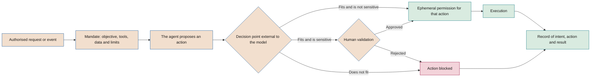

# AI and agent security

**Threats to AI systems, controls for agents with the ability to act and exposure to offensive AI**

| | |
|---|---|
| Document | Document 35 · AI and agent security |
| Version | 0.1 (working draft) |
| Date | 16-09-2026 |
| Author | Fernando García · SEACHAD |
| Status | Draft for review. It defines the autonomy levels A0–A3 and the SEG and AG control catalogues used by T10, P18 and the LV-AG checklist in document 22. |

<!-- cifras: 4 | autonomy levels ; 20 | AI security controls (SEG) ; 20 | agent controls (AG) ; 9 | essential requirements for an agent -->

---

> **Legal notice and disclaimer.** SEVEN-G is a reference methodological framework provided "as is" and for information purposes only. It does not constitute legal, regulatory, financial or professional advice, nor does it guarantee compliance with any law or standard. References to general regulation (such as the EU AI Act, the GDPR, DORA or NIS2), to technical standards and to regulation specific to each sector or jurisdiction may be incomplete, may not apply to a particular case or may become out of date as a result of regulatory changes, interpretations or supervisory positions after their consultation date. **Each organisation that uses SEVEN-G is solely responsible for identifying the regulation that applies to it, verifying that it is current and certifying its own regulatory compliance**, with the appropriate qualified advice. The author and SEACHAD accept no liability for any use made of this content or for any decisions taken on the basis of it. The data, figures, companies and cases in the examples are fictitious or illustrative.

## 1. Purpose and scope

This document establishes how an AI system is protected against attacks and misuse, what additional controls an agent requires according to its autonomy level and how the company's exposure to attacks that use AI is managed. It develops section 10 of document 01 and the RT-GEN and RT-SEG typical risks of document 33.

### 1.1 Scope

| Includes | Does not include |
|---|---|
| In-house and third-party AI systems integrated into processes, including assistants, information retrieval systems and agents. | The company's general information security, which is governed by its own management system; this document complements it for AI. |
| Corporate use of general-purpose AI insofar as it affects information leakage. | The acceptable use policy (document 31). |
| Corporate exposure to offensive AI: impersonation, fraud, accelerated exploitation. | Incident management, which is developed in document 37. |

### 1.2 References

The references were consulted in September 2026 and must be checked against their current version:

- **OWASP Top 10 for LLM Applications**, 2025 version (risks LLM01 to LLM10).
- **OWASP Top 10 for Agentic Applications** (OWASP GenAI Security Project, published on 9 December 2025; risks ASI01 to ASI10) and the **Agentic AI – Threats and Mitigations** guide from the same project.
- **MITRE ATLAS**, the knowledge base of adversary tactics and techniques against AI systems, which is updated periodically.
- **NIST AI 600-1**, the generative AI profile of the NIST AI RMF (July 2024), in particular the information security, data privacy and value chain and component integration risks.
- **ISO/IEC 42001** and **ISO/IEC 23894** for the fit with the management system and with risk management.
- **Regulation (EU) 2024/1689**, which requires high-risk systems to achieve an appropriate level of accuracy, robustness and cybersecurity, including resilience against the manipulation of data and models and against inputs designed to cause errors.
- **CCN-CERT BP/36**, the good practice guide against offensive AI from the Spanish National Cryptologic Centre (Centro Criptológico Nacional) (June 2026).

This document does not constitute legal advice.

---

## 2. Security principles

| # | Principle | What it implies |
|---|---|---|
| 1 | **The model is not a security boundary** | Instructions to the model help, but they do not protect. The limits that matter (permissions, amounts, recipients, data) are enforced outside the model. |
| 2 | **All external content is untrusted** | Emails, documents, websites, and responses from tools and other agents are data, never instructions. |
| 3 | **Least privilege and least autonomy** | Each system has only the tools, data and autonomy it strictly needs, and these are justified in phase 4. |
| 4 | **Every action corresponds to an authorised intent** | No agent executes an action that cannot be traced to a legitimate request or mandate. |
| 5 | **A person validates what cannot be undone** | Sensitive actions require informed human validation. |
| 6 | **It can always be stopped** | Every system with the ability to act has a tested kill switch. |
| 7 | **Compromise is assumed** | The design limits the damage if the model is manipulated or a credential is stolen. |
| 8 | **It is tested the way an adversary would attack** | The effectiveness of controls is demonstrated through adversarial testing, not through statements. |

---

## 3. Threats to AI systems

### 3.1 Main threats

| Threat | Description | Reference | Typical risk (33) | Controls |
|---|---|---|---|---|
| **Direct prompt injection** | The user enters instructions that alter the intended behaviour. | OWASP LLM01; ATLAS | RT-GEN-01 | SEG-02, SEG-03, SEG-11 |
| **Indirect prompt injection** | Instructions hidden in content that the system reads (documents, emails, websites, tool responses, voice) divert the task. | OWASP LLM01; ASI01 | RT-GEN-02 | SEG-02, AG-05, AG-12, AG-18 |
| ***Jailbreak*** | Techniques to make the model ignore its safeguards and produce prohibited content or actions. | OWASP LLM01; ATLAS | RT-GEN-01, RT-REP-04 | SEG-03, SEG-11 |
| **Poisoning** | Manipulation of training, fine-tuning or evaluation data, knowledge bases or memory. | OWASP LLM04, LLM08; ASI06 | RT-SEG-05, RT-GEN-07 | SEG-08, AG-14 |
| **Extraction** | Queries designed to replicate the model, infer training data or reconstruct system prompts. | OWASP LLM02, LLM07; ATLAS | RT-SEG-06 | SEG-05, SEG-10, SEG-12 |
| **Information leakage** | Personal, confidential or secret data exposed in responses, logs, retrieval or tools. | OWASP LLM02, LLM07, LLM08; NIST AI 600-1 | RT-GEN-05, RT-DAT-05 | SEG-05, SEG-06, SEG-07 |
| **Improper output handling** | The output is executed or inserted into other systems without validation (code, queries, links). | OWASP LLM05; ASI05 | RT-GEN-06 | SEG-04, AG-11 |
| **Tool misuse** | The system uses legitimate tools in a harmful way through manipulation or excessive permissions. | OWASP LLM06; ASI02, ASI03 | RT-GEN-03, RT-GEN-04 | AG-02, AG-05, AG-07, AG-08 |
| **Model supply chain** | Manipulated or vulnerable models, weights, libraries, connectors or tool servers. | OWASP LLM03; ASI04; NIST AI 600-1 | RT-SEG-07 | SEG-09, AG-13 |
| **Unbounded consumption** | Mass usage that exhausts resources or causes costs to soar. | OWASP LLM10; ASI08 | RT-GEN-08, RT-ECO-02 | SEG-10, AG-16 |
| **Misinformation from the system itself** | False content presented as true that leads to wrong decisions. | OWASP LLM09; NIST AI 600-1 | RT-TEC-04 | SEG-11; source controls (33) |

### 3.2 Agent-specific threats

An agent plans, uses tools, retains memory and acts with delegated authority. This adds threats that do not exist in an assistant that only responds:

| Threat | What happens | Reference | Controls |
|---|---|---|---|
| **Goal hijacking** | The agent pursues an objective other than the one assigned. | ASI01 | AG-04, AG-05, AG-12 |
| **Identity and privilege abuse** | The agent uses inherited credentials or permissions beyond its task; an attacker reuses them. | ASI03 | AG-01, AG-02, AG-03, AG-20 |
| **Unexpected code execution** | The agent generates or executes code or commands with unforeseen effects. | ASI05 | AG-11, SEG-04 |
| **Memory and context poisoning** | Manipulated content persists and conditions subsequent tasks. | ASI06 | AG-14 |
| **Insecure inter-agent communication** | Forged or unauthenticated messages between agents. | ASI07 | AG-15 |
| **Cascading failures** | An error propagates between agents or is amplified in loops. | ASI08 | AG-07, AG-16 |
| **Human trust exploitation** | The agent induces a person to approve something inappropriate. | ASI09 | AG-08 |
| **Rogue agents** | A compromised or deviating agent keeps operating. | ASI10 | AG-09, AG-17 |

---

## 4. Essential requirements for an agent

Every system classified as A2 or A3, and A1 where applicable (section 5), **must** meet the following nine requirements. The AG controls in section 7 specify them.

### 4.1 Own identity

- The agent **must** operate with its own non-human identity, distinct from that of any employee and from those of other agents (AG-01).
- The identity is recorded in the non-human identity inventory with its system, purpose and **human owner**.
- When it acts on behalf of a user, the action is recorded with both identities: the agent's and that of the user on whose behalf it acts. The agent cannot obtain more permissions than the user it represents.

### 4.2 Least permissions

- Closed list of permitted tools and, for each one, the permitted operations and data (AG-02). Read and write access are authorised separately.
- Permissions are justified in the security design (P18) and reviewed periodically (AG-20).
- Privilege separation: the component that reads untrusted content does not have, without an intermediate control, tools that execute sensitive actions (AG-12).

### 4.3 Credentials

- Secrets are kept in a secrets manager; never in prompts, code, memory or logs (AG-03).
- Short-lived, narrowly scoped credentials; rotation within a defined period; immediate revocation linked to the kill switch.

### 4.4 Intent-based access control

Intent-based access control ensures that **every action of the agent is traceable to an authorised intent**. It works as follows:

1. **Mandate.** Each task has an authorised intent: who requests it or what event triggers it, objective, tools, data and limits (AG-04).
2. **Decision point external to the model.** Before each action, a component independent of the model checks that the specific action (tool, parameters, data, recipient, amount) fits the intent and the limits (AG-05).
3. **Ephemeral permission.** If it fits, it issues a short-lived permission limited to that action. If it does not fit, it blocks it. If it is sensitive, it submits it to human validation.
4. **Traceability.** The action is recorded with the identifier of the intent that authorised it (AG-06, AG-10).

<!-- grafico: Intent-based access control for an agent | No action is executed unless it fits an authorised intent -->

### 4.5 Action limits

Limits defined in the design and enforced outside the model (AG-07): amounts per transaction and cumulative, number of actions per period, permitted recipients or domains, time windows, data volume, number of iterations and consumption budget. Exceeding a limit stops the sequence and generates an alert.

### 4.6 Human validation of sensitive actions

The following are considered **sensitive actions**, unless a justification is recorded in P17 and P18:

- Payments, transfers, refunds or changes to bank details.
- External communications on behalf of the company to customers, suppliers, authorities or the public.
- Decisions with significant effects on people (employment, credit, insurance, access to services, claims).
- Creation, deletion or modification of personal data or permissions.
- Changes to production systems, security configurations or deployed code.
- Deletion of information or irreversible actions.
- Any action outside the ordinary limits.

Validation **must** be informed: the person sees what action is proposed, with what data, why and with what effects, and can reject it at no cost to themselves. The rejection rate and review time are measured to detect rubber-stamp approval (AG-08, RT-ORG-04).

### 4.7 Kill switch

- Mechanism to immediately stop the whole agent or a specific capability (a tool, a type of action) **without deploying code** (AG-09).
- It can be activated by the AI Operations Owner and by security, following a procedure in the operations manual (P24).
- When activated: it revokes credentials, blocks new actions, preserves logs and activates the fallback process.
- It is tested before G5 and periodically (section 5.3). Its time to take effect is measured.

### 4.8 Action log

A complete, tamper-protected log (AG-10) with, as a minimum: identity of the agent and of the represented user, intent, proposed action, decision of the decision point, human validation if any, tool, relevant parameters, result, model and prompt version, date and time. Retention respects personal data minimisation and the applicable regulatory periods; for deployers of high-risk systems, the AI Act requires automatically generated logs to be kept for at least six months, unless otherwise provided.

### 4.9 Sandboxed environments

Code execution, web browsing, handling of external files and testing are carried out in sandboxed environments, with restricted network egress, without production credentials and destroyed on completion (AG-11).

---

## 5. Autonomy levels

### 5.1 Definition

| Level | Name | What the system does | Human role |
|---|---|---|---|
| **A0** | Assistance | Informs, summarises or generates content. | The person decides and executes. |
| **A1** | Recommendation | Proposes a specific decision or action. | The person validates each action before it is executed. |
| **A2** | Supervised action | Executes actions within defined limits. | Supervises, can interrupt and reviews after the fact. |
| **A3** | Autonomous action | Executes sequences of actions without individual review within strict limits. | Sets limits, supervises aggregates and has a kill switch. |

### 5.2 Assignment rules

1. The level is proposed in phase 3, set in phase 4 (P17 and P18) and recorded in the inventory (T02). The **highest level** of the actions the system can execute is assigned, not that of its usual use.
2. An A2 or A3 system whose actions affect third parties, money, personal data or production systems meets the Enterprise criterion "agents with the ability to act" (01 §9.2).
3. **A3** requires a decision by the AI Committee at G4 and at G5, with a justification of why A2 is not enough.
4. Moving up a level is a relevant change: it requires a reassessment of risks, an update of P18 and a new decision at the corresponding *gate*.
5. In the event of an S1 or S2 incident related to autonomy, the system is provisionally moved down a level or stopped until the post-incident analysis (document 37).

### 5.3 Minimum controls per level

**Yes** = mandatory · **Rec.** = recommended; its omission is justified and recorded · **—** = not applicable.

| Control | A0 | A1 | A2 | A3 |
|---|---|---|---|---|
| AG-01 Own identity | Rec. | Yes | Yes | Yes |
| AG-02 Least privilege | Yes | Yes | Yes | Yes |
| AG-03 Credential management | Yes | Yes | Yes | Yes |
| AG-04 Mandate and authorised intent | — | Rec. | Yes | Yes |
| AG-05 Intent decision point | — | — | Yes | Yes |
| AG-06 Action–intent traceability | — | Yes | Yes | Yes |
| AG-07 Action limits | — | Rec. | Yes | Yes |
| AG-08 Human validation | — | Yes (every action) | Yes (sensitive) | Yes (sensitive and outside limits) |
| AG-09 Kill switch | Rec. | Rec. | Yes | Yes |
| AG-10 Action log | Rec. | Yes | Yes | Yes |
| AG-11 Sandboxed environments | Rec. | Rec. | Yes | Yes |
| AG-12 Untrusted external content | Yes | Yes | Yes | Yes |
| AG-13 Approved tools and connectors | Rec. | Yes | Yes | Yes |
| AG-14 Memory and context integrity | Rec. | Rec. | Yes | Yes |
| AG-15 Secure inter-agent communication | — | Rec. | Yes | Yes |
| AG-16 Cascade and consumption containment | — | Rec. | Yes | Yes |
| AG-17 Behaviour monitoring | Rec. | Rec. | Yes | Yes |
| AG-18 Agent adversarial testing | Rec. | Yes | Yes | Yes |
| AG-19 Reversibility and compensation | — | Rec. | Yes | Yes |
| AG-20 Periodic permission review | Rec. | Yes | Yes | Yes |

AG-01, AG-03 and AG-13 are mandatory for A0 if the system accesses corporate systems or data with its own credentials. AG-11 is mandatory at any level if the system executes code or browses. AG-15 only applies if several agents are involved.

| Minimum frequency | A1 | A2 | A3 |
|---|---|---|---|
| Kill switch test | — | Before G5 and half-yearly | Before G5 and quarterly |
| Adversarial testing (AG-18) | Before G5 and after relevant changes | Before G5, annually and after relevant changes | Before G5, half-yearly and after relevant changes |
| Permission review (AG-20) | Annual | Half-yearly | Quarterly |
| Review of action samples | Half-yearly | Monthly | Continuous with alerts and monthly review |

### 5.4 Critical controls

In A2 and A3, the **critical controls** are AG-01, AG-02, AG-03, AG-05, AG-08, AG-09, AG-10 and AG-12; in A1, AG-02, AG-03, AG-08 and AG-12. A critical control that has not been designed blocks G4; one that has not been tested blocks G5. **Proceed with conditions** is not permitted for them (01 §7.3). Disabling one in production is a critical nonconformity (01 §12).

---

## 6. Catalogue of AI security controls (SEG)

*Applies* indicates the scope: **IA** (every AI system), **GEN** (generative AI and agents), **EXT** (exposure to external people), **CORP** (corporate control, not an initiative control).

| Code | Control | What it requires | Evidence | Applies | Phase |
|---|---|---|---|---|---|
| **SEG-01** | AI threat modelling | Threat analysis using OWASP LLM 2025, OWASP Agentic and MITRE ATLAS, linked to the risk register. | Threat model in P18. | IA | 3, 4 |
| **SEG-02** | Separation of instructions and data | External content is delimited and treated as data; system instructions cannot be overwritten by it. | Design and prompt injection test results. | GEN | 4, 5 |
| **SEG-03** | Input and output filters | Detection of manipulation attempts, prohibited content and sensitive data before and after the model. | Configuration, thresholds and detection rate. | GEN | 4–6 |
| **SEG-04** | Secure output handling | Outputs are validated and encoded before being executed or inserted into other systems. | Integration review; tests. | GEN | 4, 5 |
| **SEG-05** | System prompt protection | No secrets, credentials or control logic in prompts; their disclosure does not compromise security. | Prompt review; extraction test. | GEN | 4, 5 |
| **SEG-06** | Permission-aware retrieval | Information retrieval respects user permissions; indexes segmented by confidentiality level. | Index design; tests with users with different profiles. | GEN | 4, 5 |
| **SEG-07** | Data leakage prevention | Minimisation, masking, information classification and control of data in inputs, context, outputs and logs. | Leakage prevention rules; log sampling. | IA, CORP | 4, 6 |
| **SEG-08** | Integrity of training data and knowledge | Verified provenance, change control and anomaly detection in training, fine-tuning and evaluation data and knowledge bases. | Lineage (P16); ingestion controls. | IA | 4, 6 |
| **SEG-09** | Model supply chain | Inventory of models and components with version and provenance; approved sources; integrity verification; vulnerability scanning. | Component inventory; verification record. | IA | 4, 6 |
| **SEG-10** | Usage and consumption limits | Authentication, quotas per user and system, size and rate limits, detection of extraction patterns. | Configuration and alerts. | GEN, EXT | 4, 6 |
| **SEG-11** | Security evaluations and *red teaming* | Adversarial testing before G5, after relevant changes and periodically (section 8). | Plan, results and closed actions. | GEN | 5, 6 |
| **SEG-12** | Security logging and monitoring | Telemetry of inputs, outputs, blocks and actions integrated into the company's security monitoring, with specific detection use cases. | Detection use cases; tested alerts. | IA | 4, 6 |
| **SEG-13** | Accelerated vulnerability management | Shorter remediation deadlines for exposed systems and AI components; prioritisation by exploitability. | Approved deadlines; compliance. | CORP | 6 |
| **SEG-14** | AI incident response | Procedures for injection, leakage, unauthorised action and agent compromise, connected to document 37. | Plan (P26); exercise. | IA, CORP | 5, 6 |
| **SEG-15** | *Phishing*-resistant authentication | Impersonation-resistant multi-factor authentication for exposed and privileged access and for administration of AI platforms. | Measured coverage. | CORP | C4 |
| **SEG-16** | Out-of-band verification | Confirmation through an independent, pre-established channel of payment orders, bank account changes and urgent requests from executives. | Procedure; compliance tests. | CORP | C4 |
| **SEG-17** | Awareness of AI-enabled impersonation | Training and simulations with synthetic messages, voice and video, aimed especially at finance, senior management, customer service and technical support. | Plan; simulation results. | CORP | C4 |
| **SEG-18** | Protocols against synthetic content | Agreed verification words or questions on voice and video channels; detection tools as support, not as the only barrier. | Published procedure. | CORP | C4 |
| **SEG-19** | Continuous testing of the exposed surface | Discovery of exposed assets and recurring penetration testing that includes AI-automated techniques. | Results and remediation deadlines. | CORP | C4, 6 |
| **SEG-20** | Control of corporate AI use | Approved tools, blocking or monitoring of unauthorised ones, prevention of leakage to external services. | Usage monitor (T21). | CORP | C4 |

---

## 7. Catalogue of agent controls (AG)

The **LV-AG** checklist in document 22 turns each control into verifiable binary questions at G4 (designed), G5 (tested) and R6 (operating). This document is the reference for its content.

| Code | Control | What it requires | Evidence at G4 · G5 · R6 |
|---|---|---|---|
| **AG-01** | Own identity | Exclusive, registered non-human identity with a human owner; dual identity when acting on behalf of a user. | Identity record · Trace test · Current inventory |
| **AG-02** | Least privilege | Closed list of tools, operations and data; separate read and write access; justified permissions. | Permission matrix · Denied access test · Review (AG-20) |
| **AG-03** | Credential management | Secrets manager, short-lived credentials, rotation, revocation linked to the kill switch. | Design · Revocation test · Rotation log |
| **AG-04** | Mandate and authorised intent | Each task with a requester or triggering event, objective, tools, data and limits. | Mandate schema · Samples · Samples |
| **AG-05** | Intent decision point | Component external to the model that validates each action against the mandate and issues ephemeral permissions. | Design · Blocked deviation tests · Block rate |
| **AG-06** | Action–intent traceability | Every action is linked to the identifier of the intent that authorised it. | Data model · Case reconstruction · Sampling |
| **AG-07** | Action limits | Amounts, volumes, recipients, time windows, iterations and budget enforced outside the model. | Limits table · Limit breach tests · Alerts |
| **AG-08** | Human validation | List of sensitive actions; informed validation; measurement of rejections and times. | List and design (P17) · User test · Rejection rate |
| **AG-09** | Kill switch | Full stop or stop per capability without deploying code; revokes credentials; activates the fallback process. | Procedure · Test with time to take effect · Periodic tests |
| **AG-10** | Action log | Complete, protected log with the fields in 4.8; defined retention. | Specification · Integrity test · Sampling |
| **AG-11** | Sandboxed environments | Code execution, browsing and external files in sandboxed environments without production credentials. | Architecture · Escape test · Current configuration |
| **AG-12** | Untrusted external content | Privilege separation between reading untrusted content and sensitive actions. | Design · Indirect injection tests · Periodic results |
| **AG-13** | Approved tools and connectors | Inventory of tools, connectors and tool servers with pinned version, verified origin and approval. | Inventory · Verification · Change review |
| **AG-14** | Memory and context integrity | Memory isolated per user and task, with expiry, write validation and the ability to purge. | Design · Poisoning test · Recorded purges |
| **AG-15** | Secure inter-agent communication | Mutual authentication, integrity-protected messages, no implicit trust between agents. | Design · Spoofing test · Configuration |
| **AG-16** | Cascade and consumption containment | Limits on iterations, retries and depth; circuit breakers; budget per task. | Parameters · Loop test · Consumption alerts |
| **AG-17** | Behaviour monitoring | Action baselines and alerts on deviations (volume, destinations, time windows, tools). | Detection use cases · Tested alerts · Alert review |
| **AG-18** | Agent adversarial testing | Direct and indirect injection, tool misuse, privilege escalation, manipulation of the approver. | Plan · Results · Periodic campaigns |
| **AG-19** | Reversibility and compensation | Preference for reversible actions; procedure to undo or compensate for the others. | Design · Undo test · Real cases |
| **AG-20** | Periodic permission review | Certification by the human owner of identities, permissions and tools at the frequency set in 5.3. | — · — · Review minutes |

---

## 8. Security testing by phase

| Phase | Tests | Who | Required result |
|---|---|---|---|
| **3 · Feasibility** | Preliminary threat modelling; supplier security assessment; preliminary autonomy level decision. | Technical team and security | RT-GEN and RT-SEG risks assessed in P12. |
| **4 · Design** | Full threat modelling (SEG-01); review of the permission architecture, intent-based access control and kill switch. | Security, independent of the team | P18 with all applicable controls designed. |
| **5 · Delivery** | Automated adversarial evaluations; manual *red teaming*; direct and indirect injection tests; tests of limits, kill switch, revocation and rollback; data leakage tests. | Independent test team or third party | Critical controls tested; high findings closed or accepted in accordance with 33 §7. |
| **6 · Operation** | Continuous regression evaluations; periodic campaigns (5.3); tests after changes to the model, prompts, tools or supplier; incident exercises. | Operations and security | Indicators in section 10 within threshold. |
| **7 · Evolution** | Tests of the extended scope; on retirement, revocation of identities and verified deletion. | Security | No orphaned identities or credentials. |

**Minimum content of a *red teaming* campaign:** approved scope and rules of engagement; scenarios derived from the threat model; direct and indirect injection through all input channels; attempts to extract prompts and data; misuse of each tool; attempts to exceed limits and to induce approvals; results with success rate per scenario, severity and corrective action; re-running of failed scenarios after remediation.

Automated adversarial evaluations are versioned and run before every relevant change. A scenario that succeeds on a sensitive action is a finding that blocks G5 until it is remediated.

---

## 9. Exposure to offensive AI

For the most part, AI does not create new types of attack, but it lowers their cost, increases their credibility and shortens timescales. The CCN-CERT BP/36 guide stresses this idea: the time between the existence of a vulnerability and its exploitation is shrinking, and one-off security reviews arrive too late. Exposure is managed as a corporate risk (C4), with an owner in information security and reporting to the board.

### 9.1 Threats and corporate controls

| Threat | What changes with AI | Typical risk | Corporate controls |
|---|---|---|---|
| **Identity impersonation** | Convincing synthetic voice and video from public samples; real-time impersonation. | RT-SEG-01 | SEG-16, SEG-17, SEG-18; payment authorisation limits. |
| **Generated *phishing*** | Personalised, error-free messages in any language and at large scale. | RT-SEG-02 | SEG-15, SEG-17; email filtering; reduction of public information about employees. |
| **CEO fraud with *deepfakes*** | Fake video calls or audio messages from executives ordering urgent or confidential payments. | RT-SEG-01 | SEG-16 with no exceptions for urgency or seniority; dual signature; verification word (SEG-18). |
| **Accelerated exploitation of vulnerabilities** | Automated discovery and exploitation shortly after a vulnerability is disclosed. | RT-SEG-03 | SEG-13, SEG-19; exposed surface inventory; segmentation. |
| **Attacks on identities and credentials** | Automation of credential testing and abuse of non-human identities. | RT-SEG-04 | SEG-15; AG-01, AG-03, AG-20; detection of automated traffic. |
| **Attacks on the company's own agents** | Indirect injection so that the company's agents act against it. | RT-GEN-02 | AG-05, AG-08, AG-12, AG-18. |
| **Disinformation about the company** | False content about the company or its executives disseminated at scale. | RT-REP-03 | Brand monitoring; crisis communication protocol. |

### 9.2 Governance measures

- **Owner:** information security, reporting to the AI Committee and the board committee.
- **Annual assessment** of exposure to offensive AI covering the threats in 9.1 and, for entities within the scope of the Spanish National Security Framework (Esquema Nacional de Seguridad), using the self-assessment instruments published by the CCN.
- **Annual exercise**, as a minimum, of fraud using synthetic impersonation involving finance and senior management.
- **Payment processes** reviewed so that no order depends solely on recognition of voice, image or writing style.
- **Remediation deadlines** for vulnerabilities in exposed systems reviewed and approved, with monitoring of compliance.

---

## 10. Indicators for the board

| Indicator | What it shows | Interpretation |
|---|---|---|
| Systems by autonomy level | Number of A0, A1, A2 and A3 systems in production. | Growth of A2 and A3 with complete critical controls. |
| Critical agent controls | Percentage of critical controls tested and operating in A2 and A3. | 100 %; any deviation is explained. |
| Agent identities with excessive permissions | Findings from the last review (AG-20). | Zero. |
| Credentials not rotated on time | Non-human identities with secrets past their rotation deadline. | Zero. |
| Kill switch test | A2 and A3 systems with a current test and measured time to take effect. | 100 %. |
| Prompt injection success | Percentage of successful scenarios in the last campaign, and on sensitive actions. | Downward trend; zero on sensitive actions. |
| Blocked agent actions | Actions blocked by intent-based access control or by limits. | Explain spikes: attack, design error or poorly defined mandate. |
| AI security incidents | S1–S4 incidents by type: injection, leakage, unauthorised action, agent compromise. | Trend and time to containment. |
| *Phishing*-resistant multi-factor authentication | Coverage of exposed and privileged access. | 100 % for privileged access. |
| Exposed critical vulnerabilities past deadline | Number and age. | Zero. |
| Impersonation exercises | Result of the last fraud exercise with synthetic content. | Percentage that applies out-of-band verification. |
| Unauthorised use of AI | Cases detected and regularised. | Downward trend. |

---

## 11. Integration with the lifecycle

| Gate | Security requirements |
|---|---|
| **G3** | RT-GEN and RT-SEG risks assessed; autonomy level proposed; supplier security assessment (document 36). |
| **G4** | P18 complete; applicable SEG and AG controls designed; critical controls designed; information security clearance. |
| **G5** | Critical controls tested; *red teaming* carried out with findings treated; kill switch tested; information security sign-off within the multi-level sign-off (01 §6.7). |
| **R6** | Controls operating; campaigns and reviews within frequency; incidents analysed; autonomy level current. |
| **G7** | When scaling, review of controls for the new scope; on retirement, revocation of identities and credentials. |

The AI Technical Owner designs and implements the controls; information security reviews them and issues clearance; the AI Risk Owner assesses the residual risk; the AI Auditor verifies the evidence with the LV-AG checklist. Whoever builds the agent does not carry out its G5 *red teaming*.

---

## 12. Associated tools and templates

| Code | Name | Use |
|---|---|---|
| **P18** | Security design (including agents) | Threat model, autonomy level, identities, permission matrix, mandate and intent-based access control, limits, sensitive actions, kill switch, log, isolation, test plan and status of each SEG and AG control. Phase 4; updated in 5 and 6. |
| **T10** | Agent security assessment | Based on the autonomy level, generates the required SEG and AG controls, records their status (met, not met, not applicable, pending) with evidence and blocks G4 or G5 if a critical control has not been designed or tested. Checklist in T03. |
| P17 · P24 · P26 | Human oversight design · Operations manual · Incident response plan | Sensitive actions and validation; kill switch procedure; AI incident response. |
| T02 · T06 · T08 · T17 · T21 | Inventory · Risks · Incidents · Board dashboard · Corporate usage monitor | Autonomy level, risks, incidents, indicators and unauthorised use. |

---

## 13. Related documents

| Document | Relationship |
|---|---|
| **01 · Foundational methodology** | Section 9.2 (agents with the ability to act), section 10 and multi-level sign-off. |
| **22 · Checklists** | LV-AG checklist based on the AG controls. |
| **31 · Corporate policy and acceptable use** | Corporate use of AI and SEG-20. |
| **33 · AI risk methodology** | Scales and RT-GEN and RT-SEG typical risks. |
| **36 · AI third parties and suppliers** | Security of third-party suppliers, models and connectors. |
| **37 · Nonconformities and incidents** | Response to AI security incidents and disabling of critical controls. |
| **52 · AI operations manual** | Operation of monitoring, the kill switch and continuous evaluations. |
| **60 · Board pack** | Indicators in section 10. |

---

## 14. Version control

| Version | Date | Changes |
|---|---|---|
| 0.1 | 16-09-2026 | First version. Defines the threats to AI systems with references to OWASP (LLM 2025 and agentic applications), MITRE ATLAS and NIST AI 600-1; the nine essential requirements for an agent; autonomy levels A0–A3 with minimum controls and frequencies; the SEG-01 to SEG-20 and AG-01 to AG-20 catalogues; testing by phase; exposure to offensive AI and the indicators for the board. |
