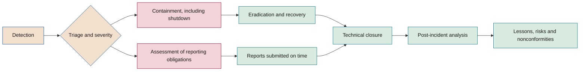

# Nonconformities, AI incidents and remediation

**How breaches of the framework and incidents involving AI systems are detected, contained, analysed, reported and corrected**

| | |
|---|---|
| Document | Document 37 · Nonconformities and incidents |
| Version | 0.1 (working draft) |
| Date | 16-09-2026 |
| Author | Fernando García · SEACHAD |
| Status | Draft for review. Develops section 12 of document 01 and sets the S1–S4 severity scale. |

<!-- cifras: 3 | types of nonconformity ; 4 | incident severity levels ; 4 | reporting regimes analysed ; 8 | incident response phases -->

---

> **Legal notice and disclaimer.** SEVEN-G is a reference methodological framework provided "as is" and for information purposes only. It does not constitute legal, regulatory, financial or professional advice, nor does it guarantee compliance with any law or standard. References to general regulation (such as the EU AI Act, the GDPR, DORA or NIS2), to technical standards and to regulation specific to each sector or jurisdiction may be incomplete, may not apply to a particular case or may become out of date as a result of regulatory changes, interpretations or supervisory positions after their consultation date. **Each organisation that uses SEVEN-G is solely responsible for identifying the regulation that applies to it, verifying that it is current and certifying its own regulatory compliance**, with the appropriate qualified advice. The author and SEACHAD accept no liability for any use made of this content or for any decisions taken on the basis of it. The data, figures, companies and cases in the examples are fictitious or illustrative.

<!-- esencial: siempre | Nonconformity process with time limits and a register, and AI incident management with severity S1 to S4. It is one of the seven conditions for declaring that SEVEN-G is applied. Regulatory notifications apply only when the regulation requires them. -->

## 1. Purpose and scope

This document establishes two connected processes:

1. The **nonconformity process**, which deals with any failure to meet a mandatory requirement of the framework (01 §12).
2. The **AI incident process**, which deals with any event in which an AI system causes, or may cause, harm or disruption, including those that must be reported to the authorities.

It applies to all systems in the inventory —in-house, third-party and corporate-use systems— and to all initiatives, regardless of their intensity. It complements, without replacing, the corporate processes for security incident management, personal data breaches and business continuity: when an AI incident is also a security incident or a breach, it is managed **only once**, with a single coordinator and with the AI-specific elements of this document.

### 1.1 Definitions

| Term | Definition in SEVEN-G |
|---|---|
| **Nonconformity** | Failure to meet a mandatory requirement of the framework ("must"), classified as minor, major or critical. |
| **AI incident** | Event in which an AI system, through its operation, failure, manipulation or use, causes or may cause harm to people, to the company or to third parties, or disrupts or degrades a process. |
| **Near miss** | Event that could have caused harm but did not, thanks to a control or by chance. It is recorded as S4. |
| **Serious incident** (AI Act) | An incident or malfunctioning of an AI system that directly or indirectly leads to the death of a person or serious harm to a person's health; a serious and irreversible disruption of the management or operation of critical infrastructure; the infringement of obligations under Union law intended to protect fundamental rights; or serious harm to property or the environment (Art. 3(49)). |
| **Personal data breach** | A breach of security leading to the accidental or unlawful destruction, loss or alteration of, or unauthorised disclosure of, or access to, personal data (GDPR Art. 4(12)). |
| **Major ICT-related incident** | Incident that meets the DORA classification criteria (Art. 18 and its implementing measures). |
| **Significant incident** | Incident that meets the criteria of Art. 23(3) of NIS2 as transposed into national law. |

### 1.2 References

Consulted in September 2026; they must be checked against their version in force before being applied:

- **Regulation (EU) 2024/1689** (AI Act), Arts. 3(49), 26(5), 72 and 73, as amended by Regulation (EU) 2026/1744 (Digital Omnibus on AI), which does not alter Art. 73 but postpones to 2 December 2027 the obligations for the high-risk systems listed in Annex III.
- **Regulation (EU) 2016/679 (GDPR)**, Arts. 33 and 34.
- **Regulation (EU) 2022/2554 (DORA)**, Arts. 17 to 19, and Commission Delegated Regulation (EU) 2025/301 on the content and time limits of reports.
- **Directive (EU) 2022/2555 (NIS2)**, Art. 23. In Spain, the transposition act was still going through the legislative process according to the latest information consulted (July 2026).
- **ISO/IEC 42001**, nonconformity and corrective action requirement (clause 10.2).

This document does not constitute legal advice. The decision to report and the content of the report must be validated with legal counsel and, where appropriate, with the data protection officer. The classification criteria and reporting obligations described are for guidance only: responsibility for the regulatory classification of each incident and for compliance, including the applicable sector-specific regimes, lies with the organisation (document 93, section 11).

---

## 2. Principles

| # | Principle | Consequence |
|---|---|---|
| 1 | **Contain first, explain later** | Containment does not wait for the root cause analysis; it includes shutting down the system if necessary. |
| 2 | **When in doubt, higher severity** | Classification errs on the high side and is lowered on the basis of evidence. |
| 3 | **Regulatory clocks start early** | Time limits run from the moment of awareness, not from the end of the analysis. |
| 4 | **No blame, but clear accountability** | The analysis looks for systemic causes; "human error" is not a final root cause. |
| 5 | **Whoever caused it does not close it** | Only the AI Auditor closes a nonconformity; whoever gave rise to it does not verify its correction. |
| 6 | **Correct here and everywhere** | Every corrective action considers whether the same failure exists in other systems. |
| 7 | **Evidence is preserved** | Logs, versions and data from the time of the incident are preserved before the system is changed. |

---

## 3. Nonconformity process

<!-- figura: no-conformidades -->

### 3.1 Detection

A nonconformity may be detected in: *gate* verifications by the AI Auditor or the AI Office; continuity reviews (R6); internal or external audits; initiative register alerts (expired conditions, pending evidence, overdue reviews); control effectiveness testing (33 §5.3); incident analyses; detection of unauthorised use of AI; reports from employees, customers, suppliers or supervisors. Anyone **may** report a possible nonconformity; the AI Office **must** record it or give reasons why it is not one.

### 3.2 Recording

Every nonconformity is recorded in **T08** (template P50) with the code **NC-AAAA-NNN** (year of detection and a sequential number that does not restart within the year).

| Field | Content |
|---|---|
| Code | NC-AAAA-NNN |
| Requirement not met | Document, section and text of the requirement; *gate* criterion (`G<n>.<nn>`) or control (SEG, AG), where applicable. |
| Description | What has been observed, with objective evidence. |
| Scope | Initiative (IA-AAAA-NNN), system, supplier, area. |
| Detection | Date, source and person detecting it. |
| Type | Minor, major or critical, with justification (3.3). |
| Action owner | Named person, other than the auditor who will close it. |
| Containment | Actions, date and effect. |
| Root cause | Method used and conclusion (3.5). |
| Actions | Corrective and preventive, with owner, time limit and status (3.6). |
| Effectiveness verification | Criterion, date, result and evidence (3.7). |
| Closure | Date and AI Auditor (3.8). |
| Links | Incidents (INC-AAAA-NNN), risks, *gate* decisions, board recommendations. |
| Status and history | Current status and events with date, author and reason. |

**Statuses:** Open · Contained · Under analysis · Plan approved · In progress · Awaiting verification · Closed · Reopened. Any status other than Closed with a time limit exceeded generates the **Overdue** flag.

### 3.3 Classification

| Type | Criterion (any one suffices) | Examples |
|---|---|---|
| **Critical** | The breach exposes the company or people to immediate serious harm or to a serious legal infringement, or it nullifies the framework's control over a system in production. | System in production without an approved *gate*; prohibited practice; reportable serious incident or breach not reported; critical agent control disabled (35 §5.4); Critical residual risk without board approval; inoperative kill switch in an A2 or A3 system. |
| **Major** | The breach affects the validity of a decision, the segregation of duties or a relevant control, without immediate serious harm. | Evidence produced after the fact; self-approval; expired condition on a relevant control; omitted continuity review; regulatory classification not reviewed after a change of purpose; N3 supplier without a contract containing the clauses for that level; ineffective control for a High risk. |
| **Minor** | One-off breach with no impact on decisions or on relevant controls. | Incomplete evidence with no impact on the decision; delay in updating records; mandatory field left blank in the inventory. |

Classification rules:

- **Recurrence:** a minor nonconformity that recurs three times in twelve months in the same initiative or process is classified as major; a major nonconformity that recurs within twelve months is classified as critical if it affects systems in production.
- **Accumulation:** several nonconformities with the same cause are dealt with in a single analysis but recorded separately.
- **Unauthorised use of AI:** it is classified according to the data and uses involved; it is at least major if it involves personal or confidential data.
- The type is proposed by whoever detects the nonconformity and confirmed by the AI Auditor; any disagreement is resolved by the AI Committee.

### 3.4 Containment

Containment limits the effect while the cause is analysed. Options, from lowest to highest intensity: restriction of use or scope; additional temporary human validation; lowering of the autonomy level; suspension of a capability with the kill switch; suspension of the system with a fallback process; withdrawal from production. If the nonconformity invalidates a *gate*, the initiative returns to the status prior to that *gate* until it is corrected. All containment is recorded with date, decision-maker and effect.

### 3.5 Root cause analysis

The analysis is mandatory for major and critical nonconformities and recommended for recurring minor ones. One or both of the following methods are applied:

**Five whys.** The question of why each cause occurred is asked successively until a cause is reached that can be acted upon and that explains the failure of the management system, not just the event. *Illustrative example:* a system went into production without a *gate* → because the team considered it a minor change → because there was no criterion for what constitutes a relevant change → because the operations manual did not define it → because the template did not require it. Root cause: template P24 does not require relevant-change criteria. Action: correct the template and review the affected systems.

**Cause-and-effect diagram (Ishikawa).** Possible causes are explored in categories adapted to AI:

| Category | Guiding questions |
|---|---|
| **People and capabilities** | Were they aware of the requirement? Did they have the training and the time? Was there pressure to move forward? |
| **Process and method** | Was the requirement clear? Did the template or checklist include it? Did the workflow allow it to be skipped? |
| **Data** | Did the data, its quality or its origin change? Was there lineage? |
| **Model and technology** | Did the model, the instructions or the configuration change? Did monitoring fail? |
| **Suppliers** | Were there unreported changes by the supplier? Did the contract cover this? |
| **Governance and controls** | Was there segregation of duties? Was the control designed and tested? Did the register raise an alert? |
| **Environment** | Did the regulation, the use or the volume change, or did an attacker appear? |

A root cause is valid when: it explains all the facts observed; had it been eliminated, the failure would not have occurred or would have been detected; it is actionable; and it does not merely attribute responsibility to a person. The worksheet is P52.

### 3.6 Corrective and preventive action

| Type | Objective | Illustrative example |
|---|---|---|
| **Correction** | Remedy the specific event. | Complete the evidence; revoke the excessive permission. |
| **Corrective action** | Eliminate the root cause so that it does not recur. | Add the relevant-change criterion to P24 and T03. |
| **Preventive action** | Prevent the same cause from producing the failure in other systems or initiatives. | Review all systems in production against the new definition. |

Each action has an owner, a time limit, an effectiveness criterion and expected evidence. The plan is approved by the AI Committee for critical nonconformities, by the AI Risk Owner for major ones and by the AI Office for minor ones. An action that depends on another area is agreed with its head before the plan is approved.

### 3.7 Effectiveness verification

Effectiveness is verified after a period of operation long enough to demonstrate that the cause does not recur: for example, the next *gate* or R6, a sample of operations or a test of the control. The effectiveness criterion is set when the plan is approved, not at verification. If the action is not effective, the nonconformity returns to **Under analysis**.

### 3.8 Closure

**Only the AI Auditor closes a nonconformity.** At Lite intensity, the AI Auditor may close minor nonconformities on the basis of the AI Office's documentary verification. Closure requires: containment carried out, root cause documented (major and critical), actions executed, effectiveness verified with evidence and the register updated. A closed nonconformity that reappears due to the same cause within twelve months is **reopened**, not recorded as a new one.

### 3.9 Re-audit

Critical and major nonconformities are re-audited: at a date after closure (as a guide, between three and six months), the AI Auditor checks that the correction is still operating. Minor nonconformities are re-audited by sampling in the framework audit (document 38).

### 3.10 Time limits

The time limits are for reference; the company may adjust them in C2 without exceeding those set by the applicable regulation (01 §12). They run from detection unless otherwise indicated.

| Step | Critical | Major | Minor |
|---|---|---|---|
| **Recording** | Same day | 2 working days | 5 working days |
| **Containment** | Immediate, within 48 hours at most, including shutting down the system if necessary | Within 10 days at most | Not required |
| **Root cause and action plan** | Within 10 days at most | Within 30 days at most | Before the next *gate* or review |
| **Execution of actions** | As per plan; as a guide, 60 days | As per plan; as a guide, 90 days | Before the next *gate* or review |
| **Effectiveness verification** | Within the time limit set in the plan | Within the time limit set in the plan | At the next *gate* or review |
| **Re-audit** | Mandatory | Mandatory | By sampling |
| **Reports to** | AI Committee and board committee | AI Committee | AI Office |

An overdue nonconformity is escalated one level in the reporting line: overdue minor nonconformities to the AI Committee; overdue major nonconformities to the board committee.

---

## 4. AI incident process

<!-- grafico: Lifecycle of an AI incident | Containment and the assessment of reporting obligations start at the same time -->

### 4.1 Types of AI incident

| Type | Examples |
|---|---|
| **Performance and degradation** | Drift beyond threshold; increase in errors; confabulation affecting decisions. |
| **Harmful output** | Discriminatory decisions; offensive or dangerous content; erroneous recommendations causing detriment. |
| **Information leakage** | Personal or confidential data in responses, in logs or disclosed to third parties. |
| **Unauthorised action** | An agent executes an action without authorised intent or outside its limits. |
| **Manipulation** | Successful prompt injection; poisoning; extraction. |
| **Identity compromise** | Theft or misuse of agent credentials or non-human identities. |
| **Unavailability** | Outage of the system, the model or the supplier affecting the process. |
| **Supplier incident** | Security incident, unreported change or failure of a third party that affects the system. |
| **Offensive AI attack** | Fraud using synthetic impersonation, generated *phishing*, accelerated exploitation. |
| **Misuse** | Use for an unauthorised purpose or by unauthorised persons. |

### 4.2 Severity

Severity is assigned at triage using the most serious criterion that is met and is reviewed during the incident. The impact axes are those in document 33 §4.2.

| Severity | Criteria (any one suffices) | Illustrative examples |
|---|---|---|
| **S1 · Critical** | Possible serious incident under the AI Act; possible major incident under DORA or significant incident under NIS2, where applicable; personal data breach likely to result in a high risk to individuals; unauthorised action by an agent affecting money, third parties, personal data or production systems; harm to people or discrimination at scale; disruption of a critical function beyond its tolerance; impact 5 on any axis. | An agent issues unauthorised payments; a recruitment system systematically screens out a group of people; massive leakage of customer data through information retrieval; fraud carried out through an impersonated video call. |
| **S2 · High** | Impact 4 on any axis; personal data breach reportable to the authority without a high risk to individuals; repeated errors visible to customers; compromise of an agent identity contained before it has any effect; failure of a critical control without harm; relevant incident at an N3 supplier. | Agent credential exposed and revoked with no use detected; customer assistant giving erroneous answers about terms and conditions for several hours. |
| **S3 · Medium** | Impact 3; degradation beyond threshold in a relevant process; successful prompt injection without any sensitive action; limited internal leakage with no risk to individuals. | Drift that increases classification errors in internal documents; a user obtains the system instructions. |
| **S4 · Low** | Impact 1–2; near misses; blocked attempts that reveal a new threat. | Injection attempts blocked by intent-based access control; brief unavailability with no effect. |

### 4.3 Indicative response times

They are approved in C2 and must be compatible with the regulatory time limits in section 5.

| Activity | S1 | S2 | S3 | S4 |
|---|---|---|---|---|
| Triage and severity from detection | 1 hour | 4 hours | 1 working day | 5 working days |
| Incident coordinator appointed | Immediate | Immediate | At triage | Not required |
| Assessment of regulatory reporting obligations | Immediate, in parallel with containment | Within 24 hours | At triage | At triage |
| Reporting to the AI Committee | 4 hours | 24 hours | Monthly report | Monthly report |
| Reporting to the board committee | 24 hours | Quarterly report | Quarterly report | Aggregated |
| Post-incident analysis | 10 working days after technical closure | 20 working days | 30 days, simplified | At R6 |

### 4.4 Roles during the incident

| Role | Who | Function |
|---|---|---|
| **Incident coordinator** | AI Operations Owner or corporate incident manager | Leads the response, decides on containment within their authority, keeps the timeline. |
| **Technical lead** | AI Technical Owner | Diagnosis, technical containment, recovery, preservation of evidence. |
| **Information security** | Security team | Incidents with an attack component, identity compromise, forensics. |
| **Risk and compliance** | AI Risk Owner and compliance | Regulatory and reporting assessment; link with nonconformities. |
| **Data protection** | Data protection officer | Personal data breaches; notification to the supervisory authority and communication to data subjects. |
| **Legal** | Legal counsel | Validation of reports; relations with authorities, suppliers and affected parties. |
| **Communications** | Corporate communications | Coordinated internal and external communication. |
| **Shutdown decision-maker** | AI Sponsor or, for S1 outside working hours, the AI Operations Owner with subsequent ratification | Authorises the shutdown of the system when it exceeds the coordinator's authority. |

### 4.5 Phases

**1. Detection.** Sources: monitoring and alerts (P25), agent controls (blocks, limits, anomalies), users and customers, human oversight, suppliers, the security team, audit, authorities or third parties. Every possible incident is recorded in T08 with the date and time of detection: this starts the regulatory clocks.

**2. Triage.** Confirm the incident, assign type and severity, identify the affected systems, data, people and suppliers, appoint a coordinator and open the assessment of reporting obligations.

**3. Containment.** Limit the harm immediately. Criteria for **shutting down the system** (fully or by capability with the kill switch):

- Ongoing harm to people, money, data or third parties that the controls are not stopping.
- Unauthorised action by an agent or suspicion that an agent has been compromised.
- Active data leakage.
- Discriminatory or dangerous outputs that continue to be produced.
- Inability to determine within a short time whether the system is safe.

Shutdown activates the fallback process set out in the rollback plan (P19) and the operations manual (P24). Before the system is modified, **evidence is preserved**: logs, model and instruction versions, configurations, relevant inputs and outputs. The AI Act requires the provider of a high-risk system not to alter the system in a way that may affect any subsequent evaluation of the causes before informing the authorities (Art. 73(6)).

**4. Eradication and recovery.** Eliminate the immediate cause (revoke credentials, correct the configuration, remove poisoned content, roll back the version), validate through testing that the system operates within thresholds —including adversarial testing if there was manipulation— and resume with the decision-maker's authorisation. After an S1 or S2 related to an agent's autonomy, operation resumes at a lower autonomy level until the post-incident analysis has been completed (35 §5.2).

**5. Communication.** Internal, to the AI Committee and the board as per 4.3; to affected parties and customers where appropriate or required by regulation; to the suppliers involved. All external communication is validated by Legal and Communications.

**6. Regulatory reporting.** As per section 5, in parallel with containment.

**7. Post-incident analysis.** Timeline; immediate cause and root cause (3.5); effectiveness of the controls and of the response; compliance with time limits; harm and cost with their validation status; risks in the register that should have anticipated it; actions. It is carried out without seeking to apportion blame and is reviewed by the AI Risk Owner.

**8. Lessons.** Update of the risk register (33), controls (35), suppliers (36), templates and test scenarios; opening of nonconformities where appropriate (section 6); communication of lessons to other initiatives with shared technology or suppliers.

---

## 5. Regulatory reporting

A single incident may trigger several regimes at once. The risk and compliance lead **must** assess all of them in parallel and record both the reports submitted and any **reasoned decision not to report**. Where the rule provides for it, an incomplete initial report submitted on time is accepted, and preferable, to a complete report submitted late.

| Regime | Who reports | What | To whom | Time limits |
|---|---|---|---|---|
| **AI Act, Art. 73** | Provider of the high-risk system. A deployer that identifies a serious incident **immediately** informs first the provider and then the importer or distributor and the market surveillance authorities (Art. 26(5)). | Serious incident (Art. 3(49)). | Market surveillance authority of the Member State where the incident occurred. Following the Omnibus, providers of systems falling within the competence of the EU AI Office report to that Office. | Immediately after a causal link, or the reasonable likelihood of such a link, has been established and, in any event, **not later than 15 days** after becoming aware. **2 days** in the event of a widespread infringement or a serious and irreversible disruption of critical infrastructure. **10 days** in the event of death. An incomplete initial report may be submitted and completed later. |
| **GDPR, Arts. 33 and 34** | Controller. The processor notifies the controller without undue delay. | Personal data breach, unless it is unlikely to result in a risk to the rights and freedoms of natural persons. | Competent supervisory authority (in Spain, the Spanish Data Protection Agency, except for cross-border processing with another lead authority). Communication to data subjects if a high risk is likely. | Authority: without undue delay and, where feasible, not later than **72 hours** after becoming aware; if later, with reasons for the delay; information in phases if not available. Data subjects: without undue delay. All breaches are documented, whether or not they are notified. |
| **DORA, Art. 19** | Financial entity subject to DORA. | Major ICT-related incident; voluntary notification of significant cyber threats. | Competent authority. Information to clients when the incident affects their financial interests. | Initial notification within **4 hours** of classification as major and not later than **24 hours** after becoming aware; intermediate report within **72 hours** of the initial notification; final report **one month** after the latest intermediate report (Delegated Regulation (EU) 2025/301). |
| **NIS2, Art. 23** | Essential or important entity under the national transposition. | Significant incident. | CSIRT or competent authority. Recipients of the service where appropriate. | Early warning within **24 hours**; incident notification within **72 hours**; final report **one month** after the incident notification; intermediate reports upon request. Check the national transposition act. |

Additional rules:

- **DORA and NIS2.** For financial entities, DORA acts as sector-specific legislation with respect to NIS2 for incident reporting; the applicable regime is confirmed in the regulatory mapping (document 34).
- **Applicability of Art. 73.** It concerns high-risk systems, whose Annex III obligations apply from 2 December 2027. Until then, the company **should** apply the serious incident criterion as its internal S1 threshold and document its assessment. Art. 73 provides for a limited regime where equivalent sector-specific reporting obligations exist (Art. 73(9) and 73(10)).
- **General-purpose AI models with systemic risk.** Their providers have their own reporting obligations to the EU AI Office (Art. 55); the company, as a user, cooperates through the contract (document 36).
- **Sector-specific and contractual regulation.** Sector supervisors, public sector security schemes and contracts with customers may impose additional reporting. These are captured in the context statement (P02) and in the response plan (P26).
- **Suppliers.** N2 and N3 contracts must ensure that the supplier reports within a time limit that allows these time limits to be met (36 §6, clause 7).
- **Rehearsal.** Reporting is rehearsed at least once a year in an S1 incident drill.

The decision and the reports are documented in P51. Omitting or delaying a mandatory report is a critical nonconformity (01 §12).

---

## 6. Relationship between incidents and nonconformities

| Situation | Treatment |
|---|---|
| The incident reveals that a framework requirement was not being met (control not implemented, *gate* omitted, contract without the clause). | A nonconformity linked to the incident is opened. Its type is determined by the requirement not met, not by the severity of the incident. |
| The incident occurs with all requirements met. | There is no nonconformity. The lessons update risks, controls and, where appropriate, the framework itself. |
| The management of the incident breaches the process (late report, evidence not preserved, post-incident analysis omitted). | Nonconformity in the management, in addition to those revealed by the incident. |
| A critical nonconformity is detected before it causes harm. | An S4 near miss is recorded if there was actual exposure, in addition to the nonconformity. |
| A recorded risk materialises. | Incident; the risk moves to the *Materialised* status and is reassessed (33 §7.2). |

An incident is closed when the post-incident analysis and the assignment of actions have been completed; the actions are tracked in the nonconformities or in the risk register, without keeping the incident open.

---

## 7. Registers

### 7.1 Incident register

It is implemented with template **P27** and tool **T08**, using the code **INC-AAAA-NNN**.

| Block | Fields |
|---|---|
| **Identification** | Code; title; understandable description; system and initiative; supplier involved. |
| **Classification** | Type (4.1); initial and final severity with justification; origin (external attacker, manipulated in-house agent, supplier, internal, technical failure). |
| **Times** | Date and time of estimated start, detection, triage, containment, recovery and closure; hours to detect, contain and resolve. |
| **Impact** | People affected (number and type); personal data affected (yes or no, categories); processes and functions; impact by axis (33 §4.2). |
| **Response** | Coordinator; containment actions; kill switch activation (yes or no, time, time to take effect); rollback; fallback process. |
| **Reporting** | By regime: applicable or not, with reason; date and time; authority; reference; time limit met. Communications to affected parties. |
| **Analysis** | Immediate cause; root cause; controls that failed or worked; linked risks in the register. |
| **Cost** | Harm and response cost, with validated, declared or estimated status. |
| **Follow-up** | Open nonconformities (NC-AAAA-NNN); actions; lessons; status. |

**Statuses:** Detected · In triage · In containment · Contained · In recovery · Resolved · Closed.

### 7.2 Change log

Template P27 also includes the log of relevant changes in production, because many AI incidents originate in changes: date, system, type of change (model, supplier version, instructions, tools, permissions, autonomy level, data, thresholds), reason, prior assessment carried out, approver, outcome and link to subsequent incidents.

---

## 8. Indicators

| Indicator | Definition | Use |
|---|---|---|
| Incidents by severity and type | Number per period, system, supplier and type. | Trends and focal points. |
| Time to detect | Median hours between estimated start and detection. | Effectiveness of monitoring. |
| Time to contain | Median hours between detection and containment, by severity. | Effectiveness of the response and of the kill switch. |
| Reports on time | Percentage of regulatory reports submitted within the time limit. | Target: 100%. |
| Incidents without a prior risk | Percentage of incidents whose risk was not in the register. | Quality of risk identification. |
| Recurrence | Incidents with the same root cause within twelve months. | Effectiveness of corrective actions. |
| Open nonconformities | By type and age. | Correction workload. |
| Overdue nonconformities | By type. | Correction discipline. |
| First-time effectiveness | Percentage of nonconformities closed without returning to analysis. | Quality of cause analysis. |
| Reopenings | Nonconformities reopened within twelve months. | Robustness of closures. |
| Average time to close | Days from detection to closure, by type. | Agility. |
| Drills | S1 drills carried out and findings. | Preparedness. |

---

## 9. Reporting to the board

| Timing | Content |
|---|---|
| **S1 incident** | Communication to the board committee within 24 hours: what has happened, who is affected, what has been contained, which reports have been submitted or are still within the time limit, which decisions may be required. |
| **Quarterly** | S1 and S2 incidents with their status; regulatory reports and compliance with them; open and overdue critical and major nonconformities; indicator trends; systemic lessons; supplier incidents; decisions requested. Presented with the quarterly second-line report (P42). |
| **Annual (C5)** | Effectiveness of the incident and nonconformity processes; recurrences; drill results; proposed adjustments to time limits and thresholds. |

Reporting to the board uses the format in document 60 and always distinguishes confirmed facts from assessments still in progress.

---

## 10. Associated tools and templates

| Code | Name | Use |
|---|---|---|
| **P26** | Incident response plan | Types and severity applicable to the system; contacts and roles; shutdown criteria and procedure; preservation of evidence; reporting matrix with time limits and owners; drill calendar. The report and communication models are in P51. Phase 6; prepared before G5. |
| **P27** | Incident and change log | Fields in section 7. Phase 6. |
| **P50** | Nonconformity register | NC-AAAA-NNN register with classification, containment, actions, effectiveness verification and closure (section 3). |
| **P51** | Incident reports and communications | Assessment by regime, reasoned decision not to report, report models and communications to affected persons (section 5). |
| **P52** | Root cause analysis and corrective action plan | Worksheet for the five whys and the cause-and-effect diagram, and action plan (sections 3.5 and 3.6). |
| **P42** | Quarterly second-line report | Quarterly reporting to the board (section 9). |
| **T08** | Nonconformity and incident register | Register of NC-AAAA-NNN and INC-AAAA-NNN with statuses, time limits, reporting clocks, overdue alerts, links to risks and *gates*, and the indicators in section 8. Module of T01. |
| P19 · P24 · P25 | Rollback plan · Operations manual · Monitoring and alerting | Fallback process, kill switch and detection. |
| T06 · T09 · T17 | Risks · Suppliers · Board dashboard | Materialised risks, third-party incidents and reporting to the board. |

---

## 11. Related documents

| Document | Relationship |
|---|---|
| **01 · Foundational methodology** | Section 12 (nonconformities), *gate* rules and multi-level sign-off. |
| **21 · *Gate* and audit criteria** · **38 · AI audit framework** | Detection of nonconformities at *gates* and in audits; re-audit. |
| **33 · AI risk methodology** | Impact axes, materialised risks and ineffective controls. |
| **34 · Regulatory mapping** | Reporting regimes applicable to each system. |
| **35 · AI and agent security** | Critical controls, kill switch and security incidents. |
| **36 · AI third parties and suppliers** | Incident reporting by suppliers. |
| **52 · AI operations manual** | Day-to-day operation of detection and response. |
| **60 · Board pack** | Format of reporting to the board. |

---

## 12. Version control

| Version | Date | Changes |
|---|---|---|
| 0.1 | 16-09-2026 | First version. Develops the nonconformity process of 01 §12 with recording, classification, containment, root cause analysis, actions, verification, closure by the AI Auditor, re-audit and time limits; defines the AI incident process with S1–S4 severity, response times, shutdown criteria and preservation of evidence; analyses reporting under the AI Act, the GDPR, DORA and NIS2; and sets out registers, indicators and reporting to the board. |
