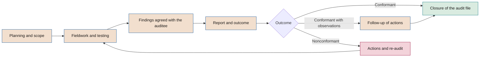

# AI audit framework

**Audit types, independence, risk-based plan, techniques, findings and report**

| | |
|---|---|
| Document | Document 38 · AI audit framework |
| Version | 0.1 (working draft) |
| Date | 16-09-2026 |
| Author | Fernando García · SEACHAD |
| Status | Draft for review. The *gate* criteria are set in document 21 and the nonconformity process in document 37. |

<!-- cifras: 5 | audit types ; 3 | possible outcomes ; 3 | nonconformity classes ; 7 | auditable conditions of the declaration of application -->

---

> **Legal notice and disclaimer.** SEVEN-G is a reference methodological framework provided "as is" and for information purposes only. It does not constitute legal, regulatory, financial or professional advice, nor does it guarantee compliance with any law or standard. References to general regulation (such as the EU AI Act, the GDPR, DORA or NIS2), to technical standards and to regulation specific to each sector or jurisdiction may be incomplete, may not apply to a particular case or may become out of date as a result of regulatory changes, interpretations or supervisory positions after their consultation date. **Each organisation that uses SEVEN-G is solely responsible for identifying the regulation that applies to it, verifying that it is current and certifying its own regulatory compliance**, with the appropriate qualified advice. The author and SEACHAD accept no liability for any use made of this content or for any decisions taken on the basis of it. The data, figures, companies and cases in the examples are fictitious or illustrative.

## 1. Purpose and scope

This document defines how artificial intelligence is audited in a company that applies SEVEN-G. Its purpose is to provide **objective assurance** that:

- initiatives comply with the lifecycle, the mandatory evidence and the decision rules;
- systems in production remain under control and deliver the declared value with the correct validation status;
- the framework is implemented in the company and operates effectively;
- third parties providing AI services meet the requirements;
- the declaration of application of SEVEN-G (01 §14) is supported by evidence.

It applies to AI Auditors, to the internal audit function and to external auditors acting within the framework. It does not define the specific criteria for each *gate* (document 21), the checklists (document 22) or the nonconformity management process (document 37), to which it refers.

### 1.1 What this framework is not

- **It is not a financial statements audit** and does not replace the statutory audit.
- **It is not a certification.** SEVEN-G does not certify. Certification of an AI management system against ISO/IEC 42001 is issued by certification bodies in accordance with ISO/IEC 17021-1 and ISO/IEC 42006.
- **It is not the conformity assessment** under Regulation (EU) 2024/1689, which is the responsibility of the provider of the high-risk system (Article 43) and, where applicable, of a notified body.
- **It is not advisory work.** The auditor does not design the controls that they subsequently audit.

---

## 2. Principles of AI auditing

| # | Principle | What it implies |
|---|---|---|
| 1 | **Independence** | The auditor does not take part in what they audit and does not report to whoever sponsors it (section 3). |
| 2 | **Sufficient and appropriate evidence** | Conclusions are based on verifiable evidence, dated and retained in the audit file. |
| 3 | **Dual validation** | Tangible results and documentation are checked at the same time (01 §7.2). Documentation without results, or results without documentation, are not conformant. |
| 4 | **Prior existence of evidence** | It is verified that the evidence existed before the decision. Documentation produced after the fact invalidates the *gate* and is a major nonconformity (01 §7.4). |
| 5 | **Risk-based approach** | More auditing, and more in-depth auditing, is carried out where the risk is higher (section 5). |
| 6 | **Professional scepticism** | Model metrics, value figures and supplier statements are corroborated, not accepted at face value. |
| 7 | **Technical proportionality** | Technical tests are tailored to the technology, the autonomy and the classification of the system. |
| 8 | **Traceability of findings** | Every finding identifies the requirement not met, the evidence, the cause, the effect and the classification. |
| 9 | **Confidentiality** | The auditor accesses what is necessary and protects the information, especially personal data and trade secrets. |

---

## 3. Independence and competences of the AI Auditor

### 3.1 Independence

| Level | Requirement | How it is checked |
|---|---|---|
| **Organisational** | The function that provides AI Auditors reports functionally to the board committee (document 30 §3.5), not to areas that sponsor initiatives. | Internal audit charter; organisation chart. |
| **Individual** | The auditor has had no role in the initiative or in the design, construction or operation of the system; does not report hierarchically to the sponsor; and has not advised on the audited controls in the previous twelve months (30, incompatibility I-10). | Signed declaration of independence before each engagement (P41, Model B). |
| **Financial** | An external auditor does not audit solutions they have designed, implemented or sold, or products of related companies (30, I-11). Remuneration does not depend on the outcome. | Declaration of relationships with suppliers; review of contracts. |
| **Rotation** | It is recommended that the same lead auditor should not audit the same Enterprise system for more than [three] consecutive years. | Record of assignments in T01. |
| **Technical experts** | The auditor may rely on experts (data science, offensive security, legal). Experts must meet the same independence requirements with respect to the subject matter audited and work under the direction of the auditor, who is accountable for the conclusion. | Expert's declaration; work programme with their scope. |

**Threats to independence and safeguards**

| Threat | Illustrative example | Safeguard |
|---|---|---|
| Self-review | The auditor took part in designing the rollback plan. | Replacement of the auditor for that initiative. |
| Self-interest | Auditor's objectives linked to the number of initiatives in production. | Objectives based on quality and plan coverage. |
| Familiarity | The auditor has been working with the technical team for years. | Rotation; quality review by another auditor. |
| Intimidation | Pressure from the sponsor to close a *gate* before a certain date. | Escalation to the board committee (30, E-13); protected verification time limits. |
| Dependence on the auditee for technical evidence | The auditor only has the metrics calculated by the team. | Independent re-performance or direct access to data and logs. |

If independence is compromised, the auditor reports it before starting or as soon as it is detected, and the head of AI audit replaces them. A *gate* verified by a non-independent auditor must be verified again.

### 3.2 Competences

| Competence area | *Gate* auditor | Lead auditor (framework, thematic) | Supporting technical expert |
|---|---|---|---|
| Audit techniques, sampling and documentation of work | Solid | Advanced | Basic |
| SEVEN-G framework (cycle, *gates*, roles, measurement) | Solid | Advanced | Basic |
| AI Act, GDPR and applicable sector-specific regulation | Sufficient to identify obligations by classification and role | Solid | Depending on specialism |
| Risk management and internal control | Solid | Advanced | Basic |
| Model lifecycle (data, training, validation, degradation) | Sufficient to read evaluations critically | Solid | Advanced |
| Generative AI and agents (evaluations, prompt injection, permissions, action logging) | Sufficient | Solid | Advanced |
| Information security | Basic | Sufficient | Depending on specialism |
| Value measurement (rules in 00 §6, attribution, statuses) | Solid | Advanced | Basic |
| Third-party management and AI contracts | Sufficient | Solid | Depending on specialism |
| ISO/IEC 42001 and management system auditing (ISO 19011) | Basic | Solid | — |
| Communication of findings to management and the board | Sufficient | Advanced | — |

**Training and upkeep.** AI Auditors follow profile F6 of the literacy programme (document 31 §6.2) and should devote specific annual hours to AI training, set by the audit function. Professional credentials in auditing, information systems or AI management are a useful indication but do not replace the verification of practical competence.

---

## 4. Audit types

| Type | Subject matter | When | Who | Criteria | Outcome |
|---|---|---|---|---|---|
| ***Gate* audit** | Evidence and results of a phase before the decision. | At all Enterprise *gates*; by sampling in Lite. | AI Auditor assigned to the initiative. | `G<n>.<nn>` criteria in document 21 and `LV-G<n>` checklists in document 22. | Verification outcome provided to the deciding body. |
| **Continuity audit** | Effective operation of the controls of a system in production over a period, and accuracy of the R6 information. | At Enterprise R6 reviews (at least one in-depth review per year) and according to the plan in Lite. | AI Auditor. | `R6.<nn>` criteria in document 21; operations manual; value hypothesis. | Outcome provided to R6 or bringing G7 forward. |
| **Framework audit of the company** | Design and effectiveness of AI governance: bodies, inventory, register, policies, risks, measurement, nonconformities. Includes the audit of the declaration of application (section 11). | Annual, in C5; before the first declaration of application. | Internal audit or external auditor. | 01 in full; documents 30, 31, 32, 33, 37 and 40; approved corporate policy. | Report to the board committee and the board. |
| **Thematic audit** | A risk or control that cuts across several initiatives. | According to the annual plan. | Lead auditor with experts. | Requirements for the theme in the SEVEN-G library and applicable regulation. | Report with a conclusion per theme and findings per system. |
| **Supplier audit** | Compliance by a third party with the contractual requirements and the N1–N3 requirement level. | N3: at least annually; N2: depending on risk; N1: by exception. | AI Auditor or third-party auditor; may rely on independent reports. | Contract; document 36; P14 assessment. | Report that feeds the supplier reassessment. |

In addition, **follow-up audits** (verification of corrective actions) and **re-audits** (full or partial repetition after a Nonconformant outcome) are carried out, as described in section 10.

### 4.1 Examples of thematic audits

| Theme | Audit questions |
|---|---|
| Unauthorised use of AI | Are the detection sources implemented? Are detected uses regularised on time? Does T21 match the reality observed? |
| Agents capable of taking action | Do they have their own identity, least privilege, intent-based access control, complete action logging and a tested kill switch? |
| Quality of declared value | Do the amounts have a formula, a baseline and the correct status? Is released capacity added up as savings? Is there double attribution? |
| Regulatory classification of the portfolio | Are the classifications correct, justified and reviewed with legal judgement? Have the exceptions in Article 6(3) been correctly applied? |
| Human oversight in decisions about people | Do overseers have the training, authority and time? Is there evidence that they disagree with the system when appropriate? |
| Retirements | Are retired systems actually deactivated? Have data and models been handled according to the plan? |
| AI costs | Does the recorded recurring cost match the invoicing? Is the allocation per use case reasonable? |
| AI literacy | Are the access conditions (F1, F3, F4) met? Is the programme effective? |

---

## 5. Audit universe and risk-based annual plan

### 5.1 Audit universe

The audit universe is built from the **AI system inventory** (T02, document 32) and the **initiative register** (T01), and is completed with:

| Auditable unit | Source |
|---|---|
| Each AI system in development, pilot or production | T02 |
| Each initiative with *gates* planned for the year | T01 |
| Each AI supplier at level N2 or N3 | T09 |
| The framework processes: corporate cycle, portfolio management, inventory, risks, measurement, nonconformities, policies and literacy | Documents 01, 14, 31, 32, 33, 37, 40 |
| Cross-cutting themes identified by the second line or through incidents | Risk reports; T08 |

A universe that omits non-inventoried systems is incomplete: that is why the plan includes the inventory reconciliation (32 §9) as a recurring test in the framework audit.

### 5.2 Prioritisation of systems

Each system in the universe is scored using the following factors. The table is **for reference** and the company may adjust it when approving the plan.

| Factor | 1 | 2 | 3 |
|---|---|---|---|
| Regulatory classification | Minimal risk or out of scope | Transparency obligations or Article 6(3) exception | High risk |
| Intensity | Lite | — | Enterprise |
| Autonomy | A0 | A1 | A2 or A3 |
| Exposure | Internal | Employees or customers indirectly | Customers or external persons directly |
| Main residual risk | Low | Medium | High or Critical |
| Incidents and nonconformities in 12 months | None | S3–S4 or minor nonconformities | S1–S2 or major or critical nonconformities |
| Relevant changes since the last audit | None | Minor changes | New model, supplier, purpose, data or autonomy |
| Financial materiality (recurring cost or declared value) | Low according to C2 threshold | Medium | High |
| Time since the last audit | Less than 12 months | 12–24 months | More than 24 months or never |

**Score** = sum of factors (9 to 27).

| Priority | Score | Indicative coverage |
|---|---|---|
| **High** | 21–27, or any high-risk system in production, or with A3 and direct exposure | In-depth continuity audit at least annually |
| **Medium** | 15–20 | Continuity audit at least every two years; included in thematic audits |
| **Low** | 9–14 | By sampling in thematic audits or the framework audit; at least every three years |

### 5.3 Content of the annual plan

| Block | Content | Coverage rule |
|---|---|---|
| Enterprise *gate* audits | Forecast of *gates* per initiative according to T01. | 100%. |
| Lite *gate* audits | Sample of Lite *gates* in the year. | As per 21 §10.3. |
| Continuity audits | High-priority systems and the Medium-priority systems due by rotation. | Section 5.2. |
| Framework audit | Includes the declaration of application. | Annual. |
| Thematic audits | Between one and three per year depending on size and risks. | According to portfolio risks and incidents. |
| Suppliers | N3 suppliers and selected N2 suppliers. | Section 4. |
| Follow-up | Verification of actions on open findings. | 100% of major and critical nonconformities. |
| Contingency | Unassigned capacity for unplanned audits (S1 incidents, requests from authorities). | As a guide, between 10% and 20% of capacity. |

**Approval and monitoring.** Internal audit proposes the plan; the board committee approves it (document 30 §7.5) and receives its degree of execution every quarter. If capacity is insufficient to cover High-priority systems, the limitation is expressly reported to the committee, which decides whether to increase resources or accept the risk.

---

## 6. Process and standard work programme

<!-- grafico: AI audit process | From the plan to the verified closure of findings -->

### 6.1 Standard work programme

| Stage | Activities | Output | Indicative time (continuity or thematic audit) |
|---|---|---|---|
| **1. Planning** | Confirm independence; define objective, scope, period and criteria; review the inventory record, risk register, incidents and previous audits; identify key risks; design tests and samples; request information. | Planning memorandum and test programme | 1–2 weeks |
| **2. Opening meeting** | Present scope, timetable, access needs and contacts. | Brief minutes | 1 day |
| **3. Fieldwork** | Perform the tests in section 7; document each test with objective, population, sample, procedure, result and conclusion. | Working papers | 1–4 weeks |
| **4. Agreement of findings** | Communicate each finding to the owner to confirm the facts (not to negotiate the classification). | Agreed findings | Ongoing; closed within 3 working days |
| **5. Closing meeting** | Present findings, classification and provisional outcome. | Minutes | 1 day |
| **6. Report** | Draft; management response with actions, owners and time limits; final report. | Report (section 9) | Draft: 10 working days after closing · Response: 10 working days · Final: 5 working days |
| **7. Recording** | Registration of nonconformities in T08; outcome in T01/T03; archiving of the audit file. | Records | With the final report |
| **8. Follow-up** | Verification of actions (section 10). | Follow-up note | According to the action time limits |

In ***gate* audits**, the stages are compressed to meet the *gate* decision time (03 §3.6: 5 working days in Lite and 10 in Enterprise from the request). As a reference, Enterprise verification should be completed within a maximum of 7 working days from when the evidence is complete, so that the body can decide on time. If the evidence is incomplete, the time limit does not start to run (01 §7.1).

### 6.2 *Gate* audit programme

| # | Test | What is checked | Technique |
|---|---|---|---|
| 1 | Completeness | All mandatory evidence for the phase (01 §6.10) exists, or its absence is justified as Not applicable. | Review of evidence against `LV-G<n>` |
| 2 | Traceability | Each piece of evidence has an author, date, version and verification. | Metadata review |
| 3 | Prior existence | The evidence existed before the *gate* request and was not created to justify progress already made. | Repository version history; comparison with T01 events; interviews |
| 4 | Tangible results | The declared results (pilot metrics, baseline, tests) are supported by data. | Re-performance or recalculation on a sample |
| 5 | *Gate* criteria | Each applicable `G<n>.<nn>` criterion is Met with valid evidence. | Review and testing as per 21 |
| 6 | Ambition criteria | The Optimise, Augment or Transform criteria are applied (01 §7.6). | Review |
| 7 | Segregation of duties | Author, verifier and decision-maker are different persons with no incompatibilities (30 §5). | Review of P03 and T03 |
| 8 | Prior conditions | The conditions of the previous *gate* are met or the expired condition rule has been applied. | Review of T01 |
| 9 | Classification and risk | Current regulatory classification and intensity; residual risks accepted at the correct level (30 §7.2). | Review of P11, P04 and P12 |
| 10 | Critical controls | At G4 and G5: human oversight, shutdown mechanism, security and rollback designed or tested. | Review, observation, re-performance |
| 11 | Multi-level sign-off | At Enterprise G5: technical, risk and compliance, security and data protection sign-offs, with no veto pending. | Review of P23 |

### 6.3 Continuity audit programme

| # | Area | Main tests |
|---|---|---|
| 1 | Inventory | The record reflects reality (version, supplier, data, autonomy, owners). |
| 2 | Classification | The classification and intensity remain valid in light of the changes during the period. |
| 3 | Monitoring | The configured alerts exist, are triggered in tests and are dealt with on time (sample of alerts). |
| 4 | Performance and degradation | Re-performance of metrics on a recent sample against the thresholds approved. |
| 5 | Human oversight | Sample of decisions: the defined oversight is exercised; there is evidence of review and of disagreement where appropriate. |
| 6 | Incidents and changes | Sample of incidents and changes: recorded, classified, managed and communicated as per 37 and change control. |
| 7 | Agents | Permissions against least privilege; completeness of the action log; kill switch tested during the period. |
| 8 | Value | Recalculation of realised value; correct validation status; released capacity not added up as savings. |
| 9 | Cost | Reconciliation of recurring cost with invoicing and allocation. |
| 10 | Compliance | Obligations in force according to classification and role (for example, transparency implemented, logs retained for the required period, information provided to workers). |
| 11 | R6 reviews | They have been carried out on time and their conclusions are consistent with the evidence. |

---

## 7. Audit techniques

### 7.1 General techniques

| Technique | Description | Typical use | Strength of evidence |
|---|---|---|---|
| **Review of evidence** | Examination of documents and records against criteria. | Completeness, traceability, consistency. | Medium; high if the source is independent of the auditee. |
| **Inquiry** | Interviews with the team and users. | Understanding the process; detecting discrepancies. | Low on its own; must be corroborated. |
| **Observation** | Witnessing the performance of a control or process. | Rollback test, kill switch activation, human oversight. | Medium; limited to the moment observed. |
| **Inspection of configurations** | Direct review of permissions, parameters, alerts, versions. | Agents, monitoring, access controls. | High. |
| **Re-performance** | The auditor performs a calculation, test or control again, using their own means. | Model metrics, value calculations, security tests. | High. |
| **Data analytics** | Analysis of the entire population using tools (logs, events, invoicing). | Completeness of the action log, *gate* times, unauthorised use. | High; avoids sampling risk. |
| **External confirmation** | Information obtained directly from a third party. | Suppliers, data use terms, sub-processors. | High if the source is reliable. |
| **Forensic analysis of versions** | Review of edit histories and metadata. | Detecting documentation produced after the fact. | High if the logs are intact. |

### 7.2 Sampling

Whenever possible, the auditor **analyses the entire population** using data analytics techniques. When this is not possible, the auditor uses sampling with justified sample sizes.

**Attribute sampling for controls** (is the control met for each item?). Assuming **zero expected deviations**, the minimum size required to conclude, with a confidence level *C*, that the actual non-compliance rate does not exceed a tolerable rate *T* is:

*n = ln(1 − C) ÷ ln(1 − T)*, rounded up.

| Confidence | Tolerable rate | Sample size | Indicative use |
|---|---|---|---|
| 90% | 20% | 11 | Low-risk Lite *gates*; low-risk controls |
| 95% | 20% | 14 | Moderate-risk controls with a small population |
| 90% | 10% | 22 | Inventory records for corporate use |
| 95% | 10% | 29 | Relevant controls: records of systems in production, decisions subject to human oversight, alerts |
| 95% | 5% | 59 | Critical controls: agent actions with external effect, privileged access |
| 99% | 5% | 90 | Critical controls with high exposure or a history of incidents |

Rules:

1. **Small populations.** If the population *N* is small, the correction *n' = n ÷ (1 + (n − 1) ÷ N)*, rounded up, may be applied. For example, with *n* = 29 and *N* = 100, *n'* = 23. If *N* is equal to or smaller than the sample, the entire population is reviewed.
2. **If a deviation appears** in a sample designed with zero expected deviations, the auditor cannot conclude that the control operates at the planned level. The auditor assesses the cause and nature of the deviation: if it is systematic, it is a finding; extending the sample is only valid if it is re-planned with a non-zero expected rate and documented.
3. **Random selection** or systematic selection with a random start, documenting the seed or the method. Judgemental selection (highest-risk cases) is valid for detecting problems but does not allow extrapolation.
4. **Periodic controls** (for example, quarterly or monthly reviews): as a common practical reference, not a statistical one, 1 of 1 annual, 2 of 4 quarterly, 2 to 5 of 12 monthly, 5 to 15 weekly and 20 to 40 daily or multiple-times-a-day occurrences are reviewed. The auditor may increase these sizes depending on the risk.

**Sampling to estimate proportions in model outputs** (for example, the percentage of incorrect answers from a generative AI assistant reviewed by people). To estimate a proportion with a margin of error *e* and 95% confidence, in the worst case (proportion of 50%):

*n = 1.96² × 0.5 × 0.5 ÷ e²*

| Margin of error | Sample size |
|---|---|
| ± 10 points | 97 |
| ± 5 points | 385 |
| ± 3 points | 1,068 |

If a prior estimate of the proportion is available, the size is reduced. To detect differences between groups (for example, in bias testing), the size must be calculated per group, not only in total.

### 7.3 Technical testing of models and agents

Technical tests must be performed **without altering production**: in equivalent test environments or with express authorisation, with minimised data and with the knowledge of the AI Operations Owner. The auditor documents the exact version of the system tested.

| Technology | Test | What is sought | Reference |
|---|---|---|---|
| **Predictive ML** | Re-performance of metrics on a hold-out set that the team has not used to tune the model, or on a recent production sample with a known outcome. | That the declared performance is reproduced and meets the thresholds approved at G5. | P22 |
| | Analysis of data drift and performance drift during the period. | Degradation not detected or not dealt with. | P25 |
| | Performance metrics by relevant groups. | Unjustified differences between groups, against the thresholds defined in the design. | P17, P22 |
| | Reproducibility: data, code and model version. | That the model in production is the one validated. | P16 |
| **Generative AI** | The auditor's own evaluation set (representative and adversarial cases), with blind human review of a sample (sizes in 7.2). | Accuracy, grounding in sources, fabricated answers, inappropriate content, consistency with the policy. | P22 |
| | Information leakage tests. | Disclosure of system instructions, other users' data or confidential information. | Document 35 |
| | Direct and indirect prompt injection tests (through documents, emails or web pages). | That the designed defences work. | Document 35, P18 |
| | Transparency. | That people are informed of their interaction with AI and that content is labelled where applicable (Article 50). | Document 32 |
| **Agents** | Inventory of identities, credentials and permissions against the actions required. | Excessive permissions; shared or non-rotated credentials. | Document 35, T10 |
| | Completeness of the action log: logged actions against actions executed according to the target systems. | Actions without traceability or without recorded intent. | Document 35 |
| | Test of intent-based access control with out-of-mandate requests. | That the agent refuses or escalates what is not authorised. | Document 35 |
| | Kill switch test. | That it stops the agent within the designed time and leaves a consistent state. | P19, P24 |
| | Sample of sensitive actions. | That human validation exists where the design requires it. | P17 |
| **All** | Observed rollback test or evidence of its execution during the period. | That rollback is possible within the planned time. | P19 |
| | Reconciliation of consumption and cost. | Actual cost against recorded cost. | Document 42 |

When the tests require specialised capabilities (for example, penetration testing of agents), the auditor may **rely on the work of a third party** if they check its independence, competence, scope and date, and review its results. The auditor may not rely on tests performed by the building team itself without re-performing at least part of them.

---

## 8. Outcomes and classification of findings

### 8.1 Finding classes

| Class | Definition | Illustrative examples | Treatment |
|---|---|---|---|
| **Observation** | Not a breach; a risk of future non-compliance or an opportunity for improvement. | Template that is correct but difficult to maintain; alert with a low-sensitivity threshold, albeit within what was approved. | Recommendation; management decides whether to act. Reviewed at the next audit. |
| **Minor nonconformity** | Failure to meet a mandatory requirement with no impact on the decision or on risk control. | Incomplete evidence with no effect on the decision; delay in updating the inventory; record with a mandatory field left blank. | Action before the next *gate* or review (01 §12). |
| **Major nonconformity** | Breach that affects the validity of a decision, the effectiveness of a relevant control or the reliability of information. | Evidence produced after the fact; self-approval; expired condition on a relevant control; omitted continuity review; value declared as validated without validation; expired exception. | Containment within 10 days; plan within 30 days (01 §12). |
| **Critical nonconformity** | Breach that exposes the company to serious harm, to a relevant legal infringement or to loss of control over a system. | System in production without an approved *gate*; prohibited practice; unreported serious incident; critical control disabled; agent capable of taking action without a kill switch. | Immediate containment, within 48 hours at most, including shutdown if necessary; plan within 10 days; report to the board committee (01 §12). |

The final classification and the process of containment, root cause, corrective action and closure are governed by **document 37**. The time limits are for reference and the company may adjust them in C2 without exceeding those set by regulation.

**Aggregation rules**

1. Several minor nonconformities on **the same requirement in the same system** which, taken together, affect the decision or the control are classified as a single **major** nonconformity.
2. The same minor nonconformity repeated in **three or more initiatives** in one year indicates a failure of the framework and is also recorded as a **major nonconformity in the framework audit**.
3. A major nonconformity **not corrected on time** is reclassified as critical if the risk it controls is High or Critical.
4. **Recurrence:** a minor nonconformity that recurs **three times in twelve months** in the same initiative or process is classified as **major** (37 §3.3).

### 8.2 Audit outcome

| Outcome | When | Consequence at a *gate* | Consequence in other audits |
|---|---|---|---|
| **Conformant** | No nonconformities. There may be observations. | The body may decide on any outcome, including Proceed. | Closure of the audit file. |
| **Conformant with observations** | Only minor nonconformities, with or without observations. | The body may decide Proceed or Proceed with conditions; the minor nonconformities become conditions with a time limit and an owner. | Follow-up of actions. |
| **Nonconformant** | At least one major or critical nonconformity; in the verification of a *gate*, some mandatory evidence is missing or some evidence is not valid. | The request goes back to the team **without a decision** (01 §7.4, rule 2; 21 §10.2): the body does not decide Proceed, Proceed with conditions, Iterate, Pivot or Stop on unverified evidence, unless the team withdraws the request and proposes to stop. | Action plan and re-audit. At R6, it brings G7 forward if it affects the system's controls. |

In addition to the above, and even if the outcome is Conformant with observations, **Proceed with conditions is not permitted** when the minor nonconformity affects critical controls for security, legal compliance or human oversight (01 §7.3); in that case, the auditor states this expressly.

The audit outcome **is not the *gate* decision**: it is the verification on which the competent body decides. The auditor does not recommend whether the initiative should proceed on the basis of its business value.

---

## 9. Audit report

### 9.1 Structure

| # | Section | Content |
|---|---|---|
| 1 | **Identification** | Audit code (`AUD-AAAA-NNN` is proposed), type, subject matter (system `SIA-AAAA-NNN`, initiative `IA-AAAA-NNN`, supplier or process), period audited, dates, lead auditor, experts, recipients, report version. |
| 2 | **Executive summary** | Outcome (Conformant, Conformant with observations, Nonconformant); number of findings by class; three key messages in non-technical language; risks to the company if no action is taken. |
| 3 | **Objective, scope and criteria** | What was audited and what was not; criteria applied (`G<n>.<nn>` and `R6.<nn>` codes, documents and standards). |
| 4 | **Limitations** | Information not available, access denied, tests not performed and their effect on the conclusion. |
| 5 | **Methodology** | Techniques, populations, sample sizes and selection method; technical tests performed and system version. |
| 6 | **Findings** | Table per finding (9.2). |
| 7 | **Observations** | List of observations and recommendations. |
| 8 | **Follow-up of previous findings** | Status of actions from previous audits. |
| 9 | **Management response** | Actions, owners and time limits per finding; disagreements, if any, with the auditor's position. |
| 10 | **Conclusion** | Auditor's opinion and outcome. |
| 11 | **Annexes** | Evidence reviewed, samples, technical test results, declaration of independence. |

For ***gate* audits**, an abridged version integrated into the decision record (P29) and T03 is used: outcome, criteria in Not met or Pending, findings and limitations.

### 9.2 Finding record

| Field | Content |
|---|---|
| Code | `H-01`, `H-02`… within the report; nonconformities are also recorded in T08 with the code `NC-AAAA-NNN`. |
| Title | Short, descriptive phrase. |
| Condition | What has been found, with facts and figures. |
| Criterion | Requirement not met, with its exact reference. |
| Cause | Why it occurs (preliminary analysis; the full root cause analysis belongs to the process in 37). |
| Effect | Actual or potential consequence: decision affected, risk, compliance, value. |
| Evidence | References to working papers. |
| Classification | Observation · Minor · major · critical nonconformity. |
| Recommendation | What should be corrected (not how to design it in detail). |
| Management action | Action, owner and time limit. |

### 9.3 Distribution

| Audit type | Recipients |
|---|---|
| *Gate* audit | Body deciding the *gate*, sponsor, AI Product Owner, AI Risk Owner, AI Office. |
| Continuity audit | Sponsor, AI Operations Owner, AI Risk Owner, AI Committee if the outcome is Nonconformant. |
| Framework audit | AI Committee, board committee; summary to the board in C5. |
| Thematic audit | AI Committee, board committee, owners of the systems affected. |
| Supplier audit | Supplier relationship owner, second line, AI Committee if N3. |

Every critical nonconformity is communicated **before the report**, as soon as it is confirmed, through the escalation route in document 30 (E-5).

---

## 10. Follow-up and re-audit

| Situation | Activity | Who | When | Closure criterion |
|---|---|---|---|---|
| **Observation** | Review at the next audit. | AI Auditor | Next audit of the subject matter | Management has decided, and recorded, whether to act. |
| **Minor nonconformity** | Documentary verification of the action. | AI Auditor, or AI Office in Lite | Before the next *gate* or review | Evidence of the correction. |
| **Major nonconformity** | Verification of the action and its **effectiveness**. | AI Auditor | When the plan's time limit expires | Correction, action on the root cause and evidence that the control operates over a reasonable period. |
| **Critical nonconformity** | Verification of the immediate containment and, subsequently, of the action and its effectiveness. | AI Auditor; closure by the AI Committee (30 §7.5) | Containment: as soon as it is reported; action: when the plan expires | Same as for major, with a technical test where appropriate. |
| **Nonconformant outcome** | **Re-audit** of the affected and related areas. | AI Auditor, preferably the same one | When management reports that the actions have been implemented | New Conformant or Conformant with observations outcome. |

Rules:

1. **Closing is not implementing.** An action implemented without evidence of effectiveness does not close a major or critical nonconformity.
2. **Overdue actions.** They are escalated as per 30 §8.2 and are included in the quarterly report to the board committee.
3. **Risk acceptance instead of correction.** This is only possible if the body with sufficient authority (30 §7.2) expressly accepts the residual risk and the breach is not a legal one; the auditor records the acceptance and closes the finding as "risk accepted", not as "corrected".
4. **Re-audit at *gates*.** After a Nonconformant outcome at a *gate*, the request goes back to the team without a decision and, once the evidence has been corrected, the initiative requests the *gate* again; the new verification counts as an iteration (01 §7.4, rule 5).

---

## 11. Audit of the declaration of application of SEVEN-G

A company may declare that it applies SEVEN-G when it meets the minimum conditions in 01 §14. The declaration is **the company's responsibility** and does not constitute a certification. This framework establishes how to audit it so that it is credible.

### 11.1 When and who

- **Before the first declaration** and, thereafter, **annually in C5**.
- By **internal audit** or by an **independent external auditor** who has not taken part in implementing the framework in the company in the previous twelve months.
- If the company communicates the declaration to third parties (customers, supervisors, investors), SEVEN-G recommends that the audit be external or that internal audit be subject to an external quality review.

### 11.2 Criteria, evidence and tests

| Condition in 01 §14 | Evidence required | Minimum tests | Classification if not met |
|---|---|---|---|
| **1.** C1 and C2 completed; thesis, ambition per sphere and risk appetite approved by the board. | Board minutes; thesis and appetite document (document 13); C1 diagnosis. | Review of minutes and dates; consistency of the thresholds used in the portfolio with those approved. | Critical (cannot be declared) |
| **2.** Inventory with regulatory classification, intensity and owner; initiative register with the traceability in 01 §6.11. | T02 and T01; quality indicators (32 §8). | Reconciliation of the inventory with independent sources (32 §9); sample of records (95%/10%: 29) against reality; sample of initiatives with phase and *gate* events. | Major; critical if there are non-inventoried high-risk systems |
| **3.** Roles and bodies assigned in line with the incompatibilities in 01 §8.2. | Mandates (document 30); P03 of the initiatives. | Review of mandates; analysis of all assignments in T01 to detect incompatibilities. | Major |
| **4.** All new initiatives go through the lifecycle with their *gates* recorded. | T01, T03, P29. | Analysis of the entire population: initiatives registered after adoption without G0 or with skipped phases; sample of *gates* with the tests in section 6.2 (including prior existence). | Major; critical if there are systems in production without G5 |
| **5.** All initiatives in production have a current continuity review. | T01; R6 minutes. | Analysis of all R6 dates against the required frequency; sample of R6 reviews to check their content. | Major |
| **6.** Applies the value measurement rules and reports to the board with the dashboard. | Board dashboard; T12; minutes. | Sample of use cases: formula, validation status, released capacity, single attribution (rules in 00 §6); check that the board receives the dashboard in C4. | Major |
| **7.** Manages nonconformities using the process in 01 §12. | T08; reports to the board committee. | Analysis of all nonconformities: classification, containment and plan time limits, closure with effectiveness. | Major |

In addition, the **regularisation of initiatives predating** adoption within the time limit approved in C2 (01 §14, last paragraph) is verified.

### 11.3 Conclusion and use of the declaration

| Outcome | Meaning | What the company may declare |
|---|---|---|
| **Conformant** | The seven conditions are met. | That it applies SEVEN-G, with scope (companies and types of use), date, framework version and reference to the audit. |
| **Conformant with observations** | The seven conditions are met with minor nonconformities. | The same, stating that improvement actions are under way. |
| **Nonconformant** | A condition is not met (major or critical nonconformity in it). | It may not declare that it applies SEVEN-G until it corrects this and passes a re-audit. It may state that it is in the process of implementation. |

**Minimum content of the declaration**: company name; scope; version of SEVEN-G applied; date; outcome and date of the last audit and type of auditor (internal or external); relevant exceptions in force; statement that the declaration is not a certification. In accordance with the content licence (CC BY 4.0), authorship of the framework must be acknowledged. Model text in P61.

---

## 12. Relationship with ISO/IEC 42001 and with corporate internal audit

### 12.1 ISO/IEC 42001

ISO/IEC 42001:2023 sets out requirements for an AI management system. Its **clause 9.2 (internal audit)** requires internal audits to be conducted at planned intervals to determine whether the management system conforms to the organisation's own requirements and to the standard, and whether it is effectively implemented and maintained; an audit programme to be established (frequency, methods, responsibilities, planning and reporting requirements) that takes into account the importance of the processes and the results of previous audits; the criteria and scope of each audit to be defined; auditors to be selected so as to ensure objectivity and impartiality; the results to be reported to relevant management; and documented information to be retained.

| ISO/IEC 42001 requirement | How SEVEN-G covers it |
|---|---|
| 9.2 Internal audit programme | Risk-based annual plan (section 5), approved by the board committee. |
| 9.2 Criteria and scope | Criteria in 21 and 22; standard work programmes (section 6). |
| 9.2 Objectivity and impartiality | Independence (section 3.1) and incompatibilities (document 30 §5). |
| 9.2 Reporting to management | Report (section 9) and distribution. |
| 9.2 Documented information | Audit files, T01, T03 and T08. |
| 9.3 Management review | Stage C5 of the corporate cycle with the audit results. |
| 10.2 Nonconformity and corrective action | Document 37 and follow-up (section 10). |
| 8.2 to 8.4 AI risk assessment and treatment, and AI system impact assessment | Documents 32 and 33; audited at G3 *gates* and in continuity audits. |

**Differences to bear in mind**

- A company that wishes to be **certified** against ISO/IEC 42001 must meet all the requirements of the standard, including the Annex A controls it declares applicable. Applying SEVEN-G facilitates certification but does not guarantee it.
- The certification audit is carried out by a certification body in accordance with ISO/IEC 17021-1 and ISO/IEC 42006. SEVEN-G audits are first-party internal audits or, if contracted, second-party audits.
- For conducting management system audits, ISO 19011 provides guidelines that are compatible with this framework.

### 12.2 Corporate internal audit

| Aspect | Criterion |
|---|---|
| **Integration** | AI auditing forms part of the corporate internal audit plan, not a parallel plan. The board committee approves it jointly or in a coordinated manner. |
| **Professional standards** | Where the internal audit function is governed by the IIA Global Internal Audit Standards (in force since January 2025), AI auditing applies them; this framework makes them specific to AI. |
| **External AI Auditors** | They work under the supervision of internal audit, which is accountable for quality and independence. |
| **Coordination with other assurance functions** | Information security, data protection, model validation and compliance carry out their own reviews. Internal audit may rely on their work if it assesses their objectivity, competence and quality, and documents this. The same team should not be audited several times on the same matter in the same period. |
| **Statutory audit and supervisors** | AI audit reports may be made available to the statutory auditor or to supervisory authorities when they so require, with the appropriate confidentiality management. |
| **Quality review of the function** | AI audits are included in internal audit's quality assurance and improvement programme. |

---

## 13. Associated tools and templates

| Code | Name | Use in this document |
|---|---|---|
| **T02** | AI system inventory | Audit universe and prioritisation. |
| **T01** | Initiative register | Forecast of *gates*, events, assignment and rotation of auditors. |
| **T03** | *Gate* manager | Verification outcome per criterion and blocking of decisions in the event of Nonconformant. |
| **T08** | Nonconformity and incident register | Registration and follow-up of nonconformities arising from audits. |
| **T09** | AI supplier register | Universe and results of supplier audits. |
| **T10** | Agent security assessment | Technical testing of agents. |
| **T12** | Value realisation tracking | Recalculation and validation of value. |
| **P29** | *Gate* decision record | Abridged *gate* audit outcome. |
| **P22** | Validation and pilot results | Basis for the re-performance of metrics. |
| **P23** | Go-live sign-off | Verification of the multi-level sign-off. |
| **P41** | Declarations of independence and conflicts of interest | Declaration of independence by the auditor and experts before each engagement (Model B, section 3.1). |
| **P58** | Annual AI audit plan | Audit universe, prioritisation and annual plan (section 5). |
| **P59** | Audit working papers | Work programme, tests and samples (sections 6 and 7). |
| **P60** | Audit report and finding records | Report and finding records (section 9). |
| **P61** | SEVEN-G declaration of application | Text of the declaration of application that is audited (section 11). |
| **`LV-G0`… `LV-G7`** | Checklists by *gate* (document 22) | *Gate* audit programme. |

**Tool requirements arising from this document:** T03 must prevent a *gate* decision from being recorded with a Nonconformant verification outcome, except Stop when the team withdraws the request and proposes to stop; T01 must record the auditor, declaration of independence and verification date; T08 must link each nonconformity to the audit from which it originated and control the time limits in section 10.

---

## 14. Related documents

| Document | Relationship |
|---|---|
| **01 · Foundational methodology** | Dual validation, decision rules, nonconformities and declaration of application (§14). |
| **03 · Tools and initiative register** | *Gate* decision times and register data. |
| **21 · *Gate* and audit criteria** | `G<n>.<nn>` and `R6.<nn>` criteria that are verified. |
| **22 · Checklists by *gate*** | `LV-G<n>` binary controls. |
| **30 · Governance model** | Independence of the third line, incompatibilities, escalation. |
| **31 · Corporate policy and acceptable use** | Subject matter of thematic audits; F6 training profile. |
| **32 · Inventory and regulatory classification** | Audit universe and reconciliation. |
| **33 · AI risk methodology** | Residual risk for prioritisation. |
| **35 · AI and agent security** | Technical testing of agents. |
| **36 · AI third parties and suppliers** | Supplier audits. |
| **37 · Nonconformities and incidents** | Management of findings. |
| **40 · Value measurement rules** | Criteria for auditing value. |

This document does not constitute legal advice.

---

## 15. Version control

| Version | Date | Changes |
|---|---|---|
| 0.1 | 16-09-2026 | First version. Replaces the scheme in the previous material (0–5 scoring and pass, conditional pass or fail outcomes) with the Conformant, Conformant with observations and Nonconformant outcomes, and the minor, major and critical nonconformities of 01. Defines five audit types, independence and competences, the audit universe and risk-based plan, standard work programmes, techniques with justified sample sizes, technical testing of models and agents, the report, follow-up, the audit of the declaration of application and the relationship with ISO/IEC 42001 and internal audit. Proposes the code `AUD-AAAA-NNN`. |
