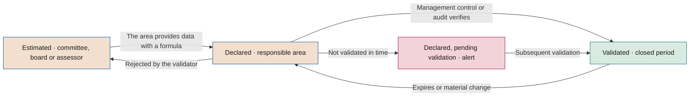

# Value measurement rules

**How the value of AI is measured, validated and presented so that it withstands an audit**

| | |
|---|---|
| Document | Document 40 · Value measurement rules |
| Version | 0.1 (working draft) |
| Date | 16-09-2026 |
| Author | Fernando García · SEACHAD |
| Status | Draft for review. Develops section 6 of document 00 and section 11 of document 01. |

<!-- cifras: 10 | measurement rules ; 3 | amount statuses ; 5 | attribution methods ; 1 | single economic criterion based on net benefit -->

---

> **Legal notice and disclaimer.** SEVEN-G is a reference methodological framework provided "as is" and for information purposes only. It does not constitute legal, regulatory, financial or professional advice, nor does it guarantee compliance with any law or standard. References to general regulation (such as the EU AI Act, the GDPR, DORA or NIS2), to technical standards and to regulation specific to each sector or jurisdiction may be incomplete, may not apply to a particular case or may become out of date as a result of regulatory changes, interpretations or supervisory positions after their consultation date. **Each organisation that uses SEVEN-G is solely responsible for identifying the regulation that applies to it, verifying that it is current and certifying its own regulatory compliance**, with the appropriate qualified advice. The author and SEACHAD accept no liability for any use made of this content or for any decisions taken on the basis of it. The data, figures, companies and cases in the examples are fictitious or illustrative.

## 1. Purpose and scope

This document develops the ten SEVEN-G value measurement rules (document 00, section 6) and sets out the definitions, formulas and procedures that all initiatives, the portfolio and reports to the board must apply.

It applies to every initiative recorded in the initiative register (T01), in all phases, and to every value figure presented to the AI Committee or the board. The indicators derived from these rules are in document 41; the calculation of costs, in document 42; and the benefits realisation process, in document 43.

The figures in the examples are **fictitious and illustrative**. They are not market benchmarks.

---

## 2. Measurement principles

| Principle | What it means |
|---|---|
| **Incrementality** | Only the effect that would not have occurred without the initiative counts. What would have happened anyway (trend, seasonality, other initiatives) is not value of the use case. |
| **Annual basis** | Efficiencies, return and recurring cost are expressed in euros per year. The build investment and the initial adoption investment, which are incurred once, are presented separately. |
| **Expected versus realised** | **Expected** value is the hypothesis (phases 2 and 3). **Realised** value is the value measured over a closed period (phases 5, 6 and 7). They are different magnitudes and are never added together. |
| **Asymmetric prudence** | Costs are charged in full from day one, regardless of their status. Value is only considered validated when it is validated by whoever is responsible for doing so. |
| **Segregation of duties** | Whoever benefits from the figure does not validate it. The area declares; management control or audit validate (principle 7 in 01 §3). |
| **Traceability** | Every figure can be reconstructed from its formula, its sources and its period, and is linked to the evidence in T01. |

---

## 3. The ten measurement rules

The numbering is that of document 00, section 6, and is not modified.

### 3.1 Rule 1 · Every amount has a formula and is incremental

> Every amount has a formula (units × unit value) and is incremental against a baseline or a control group.

| | |
|---|---|
| **Rationale** | An amount without a formula cannot be reviewed or updated, and a non-incremental amount attributes to AI what would have happened anyway. |
| **How it is applied** | Each value line is broken down into a measurable physical magnitude (hours, cases, errors, customers, units sold) and a unit value with a source (fully loaded hourly cost, cost per error, margin per unit). The physical magnitude is the difference against the baseline measured in phase 2 or against the control group (formula F1, section 6). |
| **Correct example** *(illustrative)* | Baseline: 9,000 instances of rework per year. Control group over the same period: 8,800 (downward trend unrelated to AI). With AI: 5,800. Incremental rework avoided: 8,800 − 5,800 = 3,000. Unit cost of an instance of rework according to cost accounting: €42. **Efficiency = 3,000 × €42 = €126,000/year.** |
| **Incorrect example** | "AI saves 30% of the team's time, around €200,000 a year." There are no units, no baseline, no comparison and no source for the unit value. |
| **How it is verified** | The formula exists in T01; the units come from an identified system; the baseline was measured before G2 (01 §6.4); the unit value has a source and a date; the attribution method applied is the one approved at G2. |

### 3.2 Rule 2 · Every amount has a status and the board sees the validated proportion

> Every amount has a status: validated, declared or estimated. Reports to the board always show the proportion of validated value.

| | |
|---|---|
| **Rationale** | An aggregate figure that mixes verified value with declared value conveys a certainty that it does not have. The board needs to know how much of what it sees has been verified. |
| **How it is applied** | Each amount of realised value carries one of the three statuses in section 4. Every value total presented to the committee or the board shows the validated proportion alongside it (formula F6). An amount without a status is treated as estimated and generates an alert. |
| **Correct example** *(illustrative)* | Gross realised value for the year: €540,000, of which €210,000 is validated, €250,000 declared and €80,000 estimated. **Validated proportion: 210,000 ÷ 540,000 = 38.9%.** |
| **Incorrect example** | "Value delivered by AI in the year: €540,000", with no breakdown by status. |
| **How it is verified** | No amount in T01 or T12 has an empty status; all totals in the board pack show the validated proportion; validated amounts have a validator, a date and evidence. |

### 3.3 Rule 3 · Released capacity is not counted until it is materialised or reassigned

> Released capacity is not counted as savings until it is materialised (lower actual cost) or explicitly reassigned. It is reported separately.

| | |
|---|---|
| **Rationale** | Releasing hours does not in itself reduce any cost. If people remain on the payroll doing the same work with more slack, the income statement does not change. Adding up released hours as savings is the main source of inflated figures in efficiency initiatives. |
| **How it is applied** | Net released hours are valued (formula F4) and reported on a separate line. They only become an **efficiency** when there is a verifiable actual cost reduction (outsourcing not renewed, overtime eliminated, budgeted vacancy not filled) or when they are **explicitly reassigned** to an identified activity, with an owner and a date. Capacity reassigned to an activity that avoids a planned and budgeted cost counts as an efficiency; capacity reassigned to a new activity is reported as reassigned capacity, and its value is only accounted for through the measured result of that activity (section 5.3). |
| **Correct example** *(illustrative)* | 20,000 cases per year × 15 net minutes saved = 5,000 net released hours; at a fully loaded hourly cost of €32 = €160,000 of released capacity. Destination: 2,000 hours cover outsourcing that is not renewed (contract reduction: €76,000, **materialised efficiency**); 1,000 hours are reassigned to quality review (€32,000, **reassigned capacity**, reported separately); 2,000 hours have no destination (€64,000, **unmaterialised released capacity**, reported separately). Materialisation rate: 2,000 ÷ 5,000 = 40%. |
| **Incorrect example** | "Savings of €160,000 a year from the released hours." |
| **How it is verified** | Materialised efficiency is reflected in the accounts (lower expenditure in the cost centre) or there is evidence of the budgeted avoided cost; unmaterialised capacity is not included in net value; a materialisation plan exists before G5 in Optimise (01 §7.6). |

### 3.4 Rule 4 · A potential without investment, hypothesis and timeframe is not a data point

> A potential without its additional investment, its hypothesis and its timeframe is not a data point.

| | |
|---|---|
| **Rationale** | Potentials without cost or timeframe are promises. When compared with realised values, they distort prioritisation in favour of whoever promises the most. |
| **How it is applied** | All potential value is recorded with four elements: potential annual net value, additional investment required to achieve it, explicit hypotheses (volume, usage rate, price, expected effect) and timeframe. If any of these is missing, the potential is not shown in reports or used for prioritisation. |
| **Correct example** *(illustrative)* | "Potential annual net value of €180,000 by extending the use case to the three remaining regions. Additional investment: €120,000. Hypotheses: usage rate of 70% or more and 45,000 requests per year. Timeframe: 9 months from the new phase 0." |
| **Incorrect example** | "Potential of €2M if scaled to the whole company." |
| **How it is verified** | In T01 the potential has all four fields completed; the board pack does not show incomplete potentials; the potential is reviewed at G7 against what has been realised. |

### 3.5 Rule 5 · Each euro is attributed to a single use case

> Each euro is attributed to a single use case. When several use cases share an outcome, the allocation is declared.

| | |
|---|---|
| **Rationale** | When two initiatives act on the same process or the same customer, each tends to claim the full effect. The portfolio total then exceeds the actual effect. |
| **How it is applied** | In phase 2, each initiative declares which other use cases it shares a metric, process or population with. The combined effect is measured once and allocated using a declared key (document 43, section 6). The key is approved by management control and recorded in both use cases. |
| **Correct example** *(illustrative)* | Two use cases reduce the cost of the same process. Combined effect measured: €400,000. Effects declared separately: €280,000 and €220,000 (total €500,000). Proportional allocation: 400,000 × 280/500 = **€224,000** and 400,000 × 220/500 = **€176,000**. Total: €400,000. |
| **Incorrect example** | Each use case reports its figure separately and the portfolio shows €500,000. |
| **How it is verified** | Use cases with a declared overlap have a recorded allocation key; the sum of the allocated amounts does not exceed the combined effect measured; the AI Office reviews overlaps by process and population when consolidating. |

### 3.6 Rule 6 · Efficiencies, return and recurring cost are kept separate

> Efficiencies, return and recurring cost are kept separate. Annual net value is the sum of efficiencies and return minus recurring cost.

| | |
|---|---|
| **Rationale** | Efficiencies and return carry different risks, are validated differently and have a different strategic reading (efficiency versus transformation, document 00 §5). Mixing them, or offsetting costs within efficiencies, makes the portfolio impossible to read. |
| **How it is applied** | Each use case records three separate blocks and calculates annual net value using formula F2. Recurring cost is the full cost defined in document 42, including allocated shared costs. The build and adoption investment does not form part of annual net value; it is used in the economic criterion in section 8. |
| **Correct example** *(illustrative)* | Materialised efficiencies: €76,000. Return: €95,000. Recurring cost: €60,000. **Annual net value = 76,000 + 95,000 − 60,000 = €111,000.** |
| **Incorrect example** | "Benefit of €171,000 a year", without deducting the recurring cost; or "net efficiencies of €16,000", deducting the cost within the efficiencies. |
| **How it is verified** | T01 has all three blocks with separate amounts; the net value is recalculated automatically and matches the value reported; the recurring cost reconciles with T13. |

### 3.7 Rule 7 · Every magnitude is translated into money

> Every magnitude is translated into money. Improvements in retention, quality or satisfaction are converted into their economic effect, or it is stated that they could not be quantified.

| | |
|---|---|
| **Rationale** | Non-monetary indicators cannot be compared with cost or used for prioritisation. But converting them using undeclared assumptions is worse than not converting them at all. |
| **How it is applied** | Each non-monetary improvement is translated through an explicit chain: incremental physical magnitude × unit economic value with a source. If there is no demonstrable relationship, the amount is recorded as **not quantified**, with the physical metric and the reason. A non-quantified value is not zero and is not estimated without saying so (rule 8). |
| **Correct example** *(illustrative)* | 300 incremental customers retained against the control group × €450 average annual margin per customer = **€135,000/year of return**. Satisfaction improvement of 4 points: **not quantified**; there is no demonstrated relationship between that metric and purchasing behaviour in the company. |
| **Incorrect example** | "Satisfaction rises by 4 points, which is equivalent to €1M of brand value", with no formula; or "retention improves by 2 points", with no economic translation and no indication that it has not been quantified. |
| **How it is verified** | Each non-monetary metric in the hypothesis has an amount with a formula or a not-quantified flag with a reason; unit values have a source. |

### 3.8 Rule 8 · "No data" is not zero

> "No data" is not zero. Missing data is shown as missing and is never estimated without saying so.

| | |
|---|---|
| **Rationale** | A zero hides the absence of measurement and makes an unmeasured use case look like a use case with no value, or an unknown cost look like no cost. |
| **How it is applied** | Fields with no data are recorded as null and shown as "no data". Totals indicate how many use cases provide no data. If missing data is replaced by an estimate, the estimate carries the **estimated** status, an author and a formula. A recurring cost with no data prevents the net value from being calculated: the net value is shown as "no data", not as the gross value. |
| **Correct example** *(illustrative)* | "Return: no data (the area has not provided the attributed sales for the period). Annual net value: no data. 3 of the 11 use cases in production provide no return data." |
| **Incorrect example** | "Return: €0"; or a return estimated by the AI Office presented without an estimate flag. |
| **How it is verified** | T01 distinguishes null from zero; the dashboard shows "no data"; totals report the number of use cases with no data; no estimate lacks a status. |

### 3.9 Rule 9 · Prioritisation uses additional net value per euro

> Prioritisation uses additional net value per additional euro invested, not aggregate indicators that hide use cases with negative value.

| | |
|---|---|
| **Rationale** | The relevant decision is where the next euro yields the most. Aggregate indicators (portfolio ROI, total value) mix excellent use cases with use cases that destroy value, and do not say where to invest. |
| **How it is applied** | Each proposal for additional investment (new initiative, extension, scaling) calculates the additional net value per euro (formula F3). The portfolio is ranked by that indicator, subject to risk, capacity and ambition balance constraints (document 14). Use cases with negative annual net value are always shown individually. |
| **Correct example** *(illustrative)* | Use case X: current net value €31,000, potential net value €151,000, additional investment €200,000 → (151,000 − 31,000) ÷ 200,000 = **€0.60** of annual net value per euro. Use case Y: additional net value €90,000, additional investment €60,000 → **€1.50**. Y is prioritised. |
| **Incorrect example** | "The portfolio has an ROI of 85%; it is proposed to increase investment in all use cases", without showing that one use case has an annual net value of −€40,000. |
| **How it is verified** | Investment proposals to the committee include F3; use cases with negative net value appear individually in the board pack; C3 decisions record the prioritisation order. |

### 3.10 Rule 10 · Each use case explains what it is and what it is used for

> Each use case explains what it is and what it is used for, in language that non-specialists can understand.

| | |
|---|---|
| **Rationale** | Anyone who does not understand what a use case does cannot judge whether its value is plausible or its risk acceptable. It is the precondition for oversight. |
| **How it is applied** | Each use case has a one- or two-sentence description that answers: what it does, who uses it, which process or decision it acts on and what role the person plays. It is recorded in the use case record (P31) and in T01. Without a description, the use case is not presented to the board. |
| **Correct example** *(illustrative)* | "It proposes the accounting classification and cost centre for each invoice received. A member of the accounts payable team reviews the proposal before it is posted." |
| **Incorrect example** | "Generative AI solution with retrieval-augmented generation and multi-agent orchestration on a foundation model." |
| **How it is verified** | The description field in T01 is completed and reviewed by the AI Office; a person from outside the area understands the use case on reading it. |

---

## 4. Amount statuses

### 4.1 Definition, owners and evidence

| Status | Who may assign it | Minimum evidence requirements | Indicative expiry | Permitted use |
|---|---|---|---|---|
| **Validated** | Management control (or the equivalent finance function) or internal or external audit. Never the area that benefits from the figure or the initiative team. | Complete formula; measured baseline; attribution method approved and applied (section 7); data traceable to source systems or to the accounts; closed period; for efficiencies, reflection in the accounts or evidence of the avoided cost; validator's signature with date; evidence linked in T01. | **12 months** from the close of the validated period. It expires earlier if there is a material change: model, process, scope, population, price or volume outside the range of the hypothesis. | All reports and *gates*. The only status that evidences "materialised savings" or "measured return" at G7 (01 §7.6). |
| **Declared** | The area responsible for the benefit (business owner in document 43), with the sponsor's agreement. | Formula; source of the units and of the unit value; period; attribution method used; author and date. | **6 months** without being submitted for validation. After that period it is shown as "declared, pending validation" with an alert. | Reports and R6, always identified as such. At G5 and G7 it does not replace validation when the criterion requires validated value. |
| **Estimated** | The AI Committee, the board or whoever advises them, or an assessment team (for example, the AI Office), when the area does not provide data or when a declared figure is being corroborated. | Formula; explicit hypotheses; source of the parameters; author and date; reason for the estimate. | **6 months** or until the area declares the figure, whichever occurs first. | Reports, always identified as such. It does not evidence compliance with any realised value *gate* criterion. |

Supplementary rules:

1. The status is assigned **per amount and per period**, not per use case. A use case may have validated efficiency and declared return.
2. **Expected value is not validated.** The amounts in the hypothesis (phases 2 and 3) are estimated or declared; management control may review their calculation, but the validated status only applies to value realised over a closed period.
3. **Cost is not discounted by status.** Recurring cost is charged in full even if it has not been validated; if it is unknown, the net value is "no data" (rule 8).
4. **Downgrading, not deletion.** A validated amount that expires becomes declared until it is revalidated; a declared amount rejected by the validator is corrected or becomes estimated, with a reason. Every status change is an event in T01.
5. **Recurring value is revalidated every year.** Validating one year does not validate the following years.
6. The expiry periods are **indicative** and are set by the company in C2 (document 13). They may not be extended for a specific initiative.

<!-- grafico: Status cycle of an amount | The status improves with evidence and is downgraded over time or with material changes -->

### 4.2 What the validator checks

| Test | Question | Typical evidence |
|---|---|---|
| **Occurrence** | Did the effect occur during the period? | Extract from the source system with a date and a reproducible query. |
| **Incrementality** | Is it compared with the approved baseline or control group? | Attribution method report with data from both groups. |
| **Valuation** | Is the unit value correct and current? | Cost accounting, rates, contracts, margin per product. |
| **Materialisation** | For efficiencies, is there a lower actual cost or a budgeted avoided cost? | General ledger, amended contract, headcount budget. |
| **Exclusivity** | Is the effect not already attributed to another use case? | Overlap register and allocation key. |
| **Cut-off and cost** | Does the amount correspond to the period, is it not repeated, and is the recurring cost complete? | Reconciliation with previous periods in T12 and with T13. |

---

## 5. Types of value

### 5.1 Additive types

| Type | What it includes | Examples of items | Condition for adding |
|---|---|---|---|
| **Efficiencies** | Lower actual cost or budgeted avoided cost. | Lower people or outsourcing cost (materialised); tools or licences retired; losses avoided (fraud, shrinkage, bad debts); other operating costs avoided; errors and penalties avoided. | Incremental, with a formula and, to be validated, reflected in the accounts or with evidence of the avoided cost. |
| **Return** | More revenue or more margin. | New sales; cross-selling; retention (margin from incremental customers retained); price and margin; recovered collections; new services. | Incremental, valued at **margin** where the company can calculate it; if revenue is used, this is stated. Margin and revenue are never mixed in the same total. |
| **Recurring cost** | Full annual cost of operating the use case. | The nine categories in document 42, in their recurring portion, including allocated shared costs. | Always deducted, in full, regardless of its status. |

### 5.2 Non-additive types unless translated into money with a formula

| Type | What it is | How it is reported | When it becomes additive |
|---|---|---|---|
| **Risk avoided** | Reduction in the likelihood or impact of an adverse event. | Separately, with the risk metric (inherent and residual level, document 33) and, if calculated, the expected loss avoided as an estimate. | When it translates into a lower observable and attributable cost (operational losses, penalties, premiums, provisions) measured using a method in section 7. It is then recorded as an **efficiency**. |
| **Compliance** | Ability to meet a regulatory or contractual obligation. | Separately, linked to the obligation (document 34). | When it replaces an actual compliance cost (hours of manual control, external service) measured with a formula. It is then an **efficiency**. |

### 5.3 Magnitudes that are reported separately and never counted in net value

| Magnitude | Why it is not added | How it is reported |
|---|---|---|
| **Unmaterialised released capacity** | It does not reduce any cost (rule 3). | In euros (F4) and in hours, with its materialisation rate (F5). |
| **Capacity reassigned to a new activity** | Its value, if any, appears in the result of the destination activity; adding it would be double counting. | In hours and euros, with destination activity, owner and date. |
| **Potential value** | It has not occurred (rule 4). | With additional investment, hypothesis and timeframe; for prioritisation only (F3). |
| **Option value** | Transform bets whose value depends on future decisions. | Qualitative description documented at G3 (01 §7.6), learning milestones and investment cap per stage. |
| **Non-quantified value** | There is no demonstrable economic relationship (rule 7). | Physical metric and reason. |

---

## 6. Official formulas

These formulas are the only valid ones in SEVEN-G. Documents 41, 42 and 43, the templates and the tools refer to them by their code.

| Code | Magnitude | Formula | Notes |
|---|---|---|---|
| **F1** | Amount of a value line | Amount = incremental units × unit value | Incremental units = result with AI − reference result (adjusted baseline or control group). |
| **F2** | **Annual net value** | **Annual net value = efficiencies + return − recurring cost** | Materialised efficiencies only. Unmaterialised released capacity excluded. Calculated for realised (current) value and for potential value. |
| **F2v** | Validated net value | Validated net value = validated efficiencies + validated return − recurring cost | Cost is deducted in full. It may be negative even if F2 is positive. |
| **F3** | **Additional net value per euro** | **Additional net value per euro = (potential annual net value − current annual net value) ÷ additional investment required** | Unit: euros of annual net value per euro invested. If the additional investment is zero or does not exist, it is not calculated and prioritisation is based on absolute additional net value. |
| **F4** | **Released capacity** | Net released hours = volume processed with AI × (reference unit time − unit time with AI) · Released capacity (€) = net released hours × fully loaded hourly cost | The time with AI includes human review, exceptions and corrections. The fully loaded hourly cost is set by management control. |
| **F5** | **Materialisation** | Materialisation rate = materialised hours ÷ net released hours · Reassignment rate = hours reassigned to a new activity ÷ net released hours | Materialised hours: those that translate into lower actual cost or budgeted avoided cost. Calculated in hours so as not to mix internal and external rates. |
| **F6** | **Validated proportion** | Validated proportion = validated value ÷ (validated + declared + estimated value) | Based on gross realised value (materialised efficiencies + return) for the period. Amounts with no data are not included in the denominator and are reported separately. |
| **F7** | Net present value | NPV = −I + Σ (annual net value in year t ÷ (1 + r)^t), for t = 1…H | I, r and H as per section 8. |
| **F8** | Return on investment | ROI(H) = (Σ annual net value in year t − I) ÷ I, for t = 1…H | Always based on annual net value (F2), never on gross value. |
| **F9** | Payback period | First year in which the cumulative Σ annual net value ≥ I, linearly interpolated within the year | With a constant annual net value, it is equivalent to I ÷ annual net value. |
| **F10** | Value realisation | Realisation = realised value for the period ÷ expected value for the period according to the realisation plan | Document 43. Calculated in total and using validated value only. |

**Cost per unit of outcome** (recurring cost for the period ÷ units of useful outcome) is defined in document 42.

---

## 7. Attribution methods

### 7.1 Choosing the method

The attribution method is chosen in phase 2, approved at G2 and not changed without the approval of the body that decided G2 (01 §7.4, rule 6). It determines the maximum status that the value can reach.

| Method | What it consists of | When to use it | Requirements | Maximum status |
|---|---|---|---|---|
| **Randomised control group** | Units (customers, cases, branches) are randomly assigned to a group with AI and a group without AI over the same period. | Whenever it is ethically, legally and operationally possible. Preferred method for return (conversion, retention, price). | Sufficient size to detect the expected effect; recorded assignment; no contamination between groups; duration covering the business cycle. | Validated |
| **A/B test** | Variant of the above in digital channels or high-volume processes, with continuous splitting of traffic between versions. | Digital interactions, recommendations, content, customer-facing assistants. | Primary metric set in advance; minimum period set in advance; the test is not stopped on seeing a favourable result. | Validated |
| **Difference-in-differences** | The evolution of a treated group is compared with that of a comparable untreated group, before and after implementation. | Phased roll-outs (regions, branches, business lines) where randomisation is not possible. | Parallel trends verified in the prior period; absence of other changes affecting only one group. | Validated |
| **Adjusted before-and-after** | The subsequent period is compared with the baseline, correcting for volume, seasonality, mix and prices. | Internal processes with no comparable group; Optimise initiatives with a large and rapid effect. | Baseline covering at least one full cycle; adjustments documented and approved by management control; record of other changes during the period. | Validated if the adjustments are documented and there were no relevant concurrent changes; otherwise, declared |
| **Expert estimate** | People with knowledge of the process estimate the effect using a structured procedure. | **Last resort**: when there is no data and no possibility of comparison, or for the initial hypothesis in phase 2. | At least two experts independent of the team; explicit hypotheses; a range, not a point estimate; a plan to replace it with a measurement method. | Declared or estimated. **Never validated** |

Selection criteria, in this order:

1. If randomisation is possible, randomise.
2. If the roll-out is staggered, design it to allow difference-in-differences.
3. If there is no comparable group, use adjusted before-and-after, with a measured baseline.
4. Expert estimates are only accepted with a plan and a date for replacing them. In Optimise they cannot evidence G5 or G7; in Augment and Transform they may support the G2 hypothesis, but not realised value.

In **Transform** initiatives, attribution is applied by stage and focuses on the market or customer evidence required at G5 (01 §7.6): usage, conversion, initial revenue or verified operational change.

### 7.2 Cross-unit initiatives and enabling platforms

Some initiatives do not belong to a single business unit. They are **cross-unit** initiatives, such as a tool used by several units (for example, a generative assistant built into the office suite), or **enabling platforms**: shared data, knowledge or decision capabilities used by other use cases. Their value is not measured in the same way as that of a business use case.

| Type | Example *(illustrative)* | How it is recorded in T01 | How it is measured |
|---|---|---|---|
| **Enabling platform** | Shared data platform for several AI use cases | One initiative that lists the use cases that rely on it (`alcance.habilita`) | Its value is allocated to the use cases that rely on it (document 10 §4.1, rule 3). For the platform itself, only its cost, its availability and the use cases it serves count. |
| **Cross-unit** | Generative assistant in the office suite for several units | **A single initiative** with its roll-out by unit (`alcance.reparto`) and amounts by unit (`valores[].area`). No separate initiative is opened for each unit. | By business unit, using the measurement ladder in this section. |

**Measurement ladder by unit.** Each rung only counts if the previous one is met.

| Rung | What is measured | Source | Maximum status | Does it add to net value? |
|---|---|---|---|---|
| **1. Cost** | Licences, training and governance. Each unit bears its own licences; shared costs (adoption office, ongoing training, permission review) carry no unit. | Contracts and accounts | Validated | It is deducted in full from day one (asymmetric prudence, section 2) |
| **2. Adoption** | Active over assigned licences and weekly active users, by unit | Platform usage reports, not surveys | Indicator, no amount | No |
| **3. Released capacity** | Hours released as declared by users, valued with formula F4 | Surveys or each unit's estimate | Declared or estimated. **Never validated.** | No (rule 3) |
| **4. Realised value** | Lower actual cost (hiring avoided, less overtime, outsourcing not renewed, licences retired) or capacity reassigned to an identified activity | Accounts and management control | Validated | Yes |

Rules:

1. **One initiative, several units.** The cross-unit initiative has a corporate sponsor. Each unit has its own business owner of the benefit, who declares the unit's share (document 43 §6.4).
2. **A roll-out that can be measured.** The roll-out is staggered by unit so that it can be measured with difference-in-differences (section 7.1, criterion 2). Another option is to assign licences at random among eligible people. If the tool is rolled out across the whole company at once, only an expert estimate is possible, and it never allows validation.
3. **Adoption threshold.** G2 sets a minimum percentage of active over assigned licences. In each unit in use that falls below the threshold, the roll-out is reviewed or unused licences are withdrawn. A unit keeps paying for the tool because it uses it, not out of inertia.
4. **No double counting with each unit's own use cases.** If a unit also has its own use case on the same process, document 43 §6 applies: the generic saving of the cross-unit tool is not claimed again.
5. **Net value with and without cross-unit initiatives.** In reports to the board, the portfolio's net value is shown with and without cross-unit initiatives and platforms (section 11.1). A large and certain cost therefore neither hides nor inflates the result of the business use cases.
6. **Indirect value is not converted into euros.** Usage culture, maturity or better permissions and data are recorded in the maturity model (document 11) and in sphere 05 Data. The main risk of these tools is showing a person information they could access through inherited or excessive permissions. It goes in the risk matrix (P12) and is reviewed before each roll-out wave.

**Illustrative example** (fictitious data, the same as in the T01 demo register):

| Unit | Roll-out | Active / assigned licences | Hours released per month (declared) | Annual cost | Realised value |
|---|---|---|---|---|---|
| Finance | In use | 792 / 900 (88 %) | 7,200 | €324,000 | €540,000, validated (accounting close outsourcing not renewed) |
| Commercial | In use | 624 / 1,200 (52 %) | 5,100 | €432,000 | €180,000, declared (previous tool retired) |
| Customer service | Pilot | 356 / 400 (89 %) | 1,900 | €144,000 | — |
| Shared (no unit) | — | — | — | €260,000 | — |
| **Total** | | | **14,200** | **€1,160,000** | **€720,000** |

Reading for the board: the initiative's annual net value is 720,000 − 1,160,000 = **−€440,000**. The 14,200 hours declared per month are not savings until they are realised. Commercial is below the 60 % adoption threshold and declares released hours with no destination. Extending the tool to new units is therefore conditional on reviewing Commercial's licences and on the unit declaring how its hours are realised.

> **Why it matters.** A cross-unit tool has a large, certain cost that is visible from day one, and a value spread across many people and units. If it is measured like any other use case, one of two things happens: declared hours are added up and the portfolio is inflated, or nothing is measured and the tool keeps being paid for out of inertia. The ladder by unit shows where the tool is used, where it produces value and where licences should be withdrawn. The committee and the board can then decide on extending it with data rather than surveys.

---

## 8. Horizon, discounting and single economic criterion

### 8.1 The problem it solves

The material prior to SEVEN-G combined several return thresholds (target ROI percentages over different timeframes and a maximum payback period) with two different ROI formulas: one divided gross value by investment and the other divided net benefit by cost. With that mix, the same use case could be approved or rejected depending on the threshold and formula chosen. SEVEN-G replaces this with **a single economic criterion based on net benefit**.

### 8.2 Definitions

| Element | Definition |
|---|---|
| **I · Initial investment** | Build cost plus initial adoption cost (document 42), incurred once. It does not include recurring cost, which is already deducted in annual net value. |
| **Annual net value in year t** | Annual net value (F2) expected or realised in year t, with the adoption curve (ramp-up) set out in the realisation plan. If a retirement cost is foreseen, it is deducted in the year in which it is incurred. |
| **H · Horizon** | Number of years of evaluation. It is set by the company in C2 (01 §5.1). It may not exceed the expected useful life of the solution. |
| **r · Discount rate** | Annual rate set by the finance function in C2. If the company does not set one, r = 0. |

### 8.3 Rule

1. **There is a single economic feasibility criterion: NPV (F7) ≥ 0 with the H and r approved in C2.** With r = 0, this is equivalent to recovering the initial investment within the horizon.
2. **ROI (F8) and payback period (F9) are for information only.** They are always calculated using the same I, H and annual net value, and have no thresholds of their own.
3. **A return is never calculated on gross value.** Every return is based on annual net value.
4. **F3 is used to prioritise between use cases** (rule 9), not NPV or ROI.
5. **By ambition level** (01 §7.6):
   - **Optimise**: NPV ≥ 0 at G3 with expected values; at G7 it is recalculated with validated realised values.
   - **Augment**: the same criterion, plus the feasibility of adoption and of the role change.
   - **Transform**: NPV ≥ 0 for the whole is not required at G3. The investment cap for the stage, stop criteria per stage and documented option value are required. NPV is calculated for information when there are return hypotheses.
6. **Market thresholds are not used.** No ROI percentage from outside the company replaces the C2 criterion.

### 8.4 Illustrative example

Build: €150,000. Initial adoption: €30,000. **I = €180,000.** Horizon approved in C2: H = 3 years. Discount rate: r = 8%. Expected annual net value with ramp-up: year 1, €40,000; year 2, €110,000; year 3, €120,000.

| Year | Annual net value | Discount factor | Present value | Undiscounted cumulative |
|---|---|---|---|---|
| 0 | −€180,000 | 1.000000 | −€180,000.00 | −€180,000 |
| 1 | €40,000 | 1.080000 | €37,037.04 | −€140,000 |
| 2 | €110,000 | 1.166400 | €94,307.27 | −€30,000 |
| 3 | €120,000 | 1.259712 | €95,259.87 | €90,000 |

- **NPV** = −180,000.00 + 37,037.04 + 94,307.27 + 95,259.87 = **€46,604.18** → meets the criterion.
- **ROI(3)** = (40,000 + 110,000 + 120,000 − 180,000) ÷ 180,000 = 90,000 ÷ 180,000 = **50%** (for information).
- **Payback period** = 2 + 30,000 ÷ 120,000 = **2.25 years** (for information).

---

## 9. Agility of the decision-making system

### 9.1 What is measured

Agility measures how long the governance system takes to decide and to move into production, not the speed of the technical teams. It is calculated from the events in T01 (03 §3.3).

| Segment | From | To | Purpose |
|---|---|---|---|
| **Idea → approval** | Registration of the initiative | G3 decision with a Proceed or Proceed with conditions outcome | Agility in launching a bet. |
| **Approval → production** | Favourable G3 decision | Favourable G5 decision | Agility in delivering it. |
| **Idea → production** | Registration | Favourable G5 decision | Total time to production (03 §3.5). |
| **Decision time** | Request for a *gate* | Decision | Agility of the decision-making body itself. |

All segments exclude time on hold for a recorded external reason, which is reported separately. They are shown as the **median and 80th percentile**, never as the mean alone.

### 9.2 Segmentation by risk and ambition

Times are always segmented by **residual risk level** (Low, Medium, High, document 33), by **ambition level** and by **intensity**. Agile governance takes little time over simple matters and devotes time to what carries risk; taking the same time over everything is a sign of a process that does not discriminate.

Initial benchmarks, calculated as the sum of the reference time limits per phase in document 03 §3.6 (indicative, not including decision times):

| Segment | Lite | Enterprise |
|---|---|---|
| Idea → approval (phases 0 to 3) | 70 days | 125 days |
| Approval → production (phases 4 and 5) | 80 days | 135 days |
| Idea → production | 150 days | 260 days |
| Decision on a *gate* | 5 working days | 10 working days |

The company approves its benchmarks in C2 and may set a **fast track** for Lite initiatives with Low residual risk (for example, grouping G0–G2 and G4–G5, 01 §7.5). The benchmarks are recalibrated in C5 using the company's own data.

### 9.3 Reading rules

1. **Agility is read together with quality.** A shortening of time limits accompanied by more incidents in the first months of production, more expired conditions or more nonconformities is not an improvement.
2. **Transform bets are compared with the rest.** If they take much longer to reach production, or do not reach it, this is signal 7 of the transformation index (00 §5.3).
3. **Decision time is the responsibility of the body**, not the team. It is reported to the AI Committee and the board.

---

## 10. Common errors that inflate value

| # | Error | How it is detected | Correction |
|---|---|---|---|
| 1 | Adding up released hours as savings. | "People" efficiencies with no reflection in the accounts and no budgeted avoided cost. | Reclassify as released capacity (F4) and require a materialisation plan. |
| 2 | Gross value without deducting recurring cost. | "Benefit" totals that do not reconcile with F2. | Apply F2 with the full cost in document 42. |
| 3 | Attributing the trend to AI. | Unadjusted before-and-after in a period with changes in volume, price or seasonality. | Method in section 7 with adjustment or a control group. |
| 4 | Double counting between use cases. | Several use cases claiming the effect on the same process or population. | Combined measurement and allocation key (rule 5). |
| 5 | Valuing return at gross revenue instead of margin. | Return equal to attributed sales. | Value at margin or state this expressly without mixing them. |
| 6 | Time with AI that omits human review. | Unit saving equal to the time of the original task. | Measure the actual time including review, exceptions and corrections. |
| 7 | Extrapolating the pilot to the whole company. | Potential calculated by multiplying the pilot result with no adoption or investment hypothesis. | Apply rule 4 with usage rate and extension cost. |
| 8 | Charging only direct costs. | Costs of shared licences, platform or common teams not allocated. | Cost allocation as per document 42. |
| 9 | Using the gross amount declared by a supplier. | "Recovered" or "detected" figures taken from the supplier's report. | Measure the increase against what was already being detected or recovered. |
| 10 | Changing the metric or threshold after seeing the results. | Differences between the hypothesis approved at G2 and the one measured at G5. | Revert to the approved hypothesis; any change requires approval (01 §7.4). |
| 11 | Presenting expected value as realised. | Amounts from the hypothesis canvas in production reports. | Separate expected from realised; expected value is never validated. |
| 12 | Counting risk avoided as savings. | Expected losses avoided added to net value. | Report it separately unless translated into observable cost (section 5.2). |
| 13 | Turning the hours declared by the users of a cross-unit tool into savings. | Efficiencies equal to survey hours × hourly cost, with no accounting reflection and no breakdown by unit. | Ladder in section 7.2: cost and adoption by unit; only realised value adds up. |

Presenting to the committee or the board as validated an amount that is not validated constitutes a **major nonconformity** (document 37). Relaxing stop criteria or changing the attribution method without approval is dealt with in accordance with 01 §7.4 and §12.

---

## 11. Presentation to the board

### 11.1 Rules

1. **The validated proportion is always visible** next to each value total, in the full dashboard, in the mobile version and in any document in the board pack (document 60).
2. **Efficiencies, return and recurring cost are shown separately**, with annual net value (F2) and validated net value (F2v).
3. **Unmaterialised released capacity and reassigned capacity are shown on separate lines**, outside net value.
4. **Use cases with negative annual net value are identified individually.**
5. **"No data" is shown as such**, with the number of use cases affected.
6. **Potentials only appear when complete** (rule 4) and separately from realised value.
7. **A comparison is made with the previous period** and relevant variations are explained, including changes in status.
8. **Each use case presented in detail includes its understandable description** (rule 10). A maximum of three use cases are presented in detail per session, and answers follow the formats of the common specification: "Yes", "Yes, with one condition: …", "Not yet, because … is missing" or "No, because …".
9. **The composition of value by ambition level** (efficiencies versus return) is shown to feed signals 1 and 2 of the transformation index.
10. **Cross-unit initiatives and enabling platforms are shown separately**, with their breakdown by business unit (cost, adoption, released capacity and realised value), and the portfolio's net value is given with and without them (section 7.2).

### 11.2 Value summary template

*Illustrative data.*

| Item | Annual amount | Validated | Validated proportion |
|---|---|---|---|
| Materialised efficiencies | €620,000 | €380,000 | 61.3% |
| Return | €410,000 | €90,000 | 22.0% |
| **Gross realised value** | **€1,030,000** | **€470,000** | **45.6%** |
| Recurring cost | €520,000 | — | Deducted in full |
| **Annual net value (F2)** | **€510,000** | | |
| **Validated net value (F2v)** | **−€50,000** | | |
| Unmaterialised released capacity (not added) | €290,000 | | |
| Use cases with negative annual net value | 2 of 11 | | |
| Use cases with no return data | 3 of 11 | | |

Reading for the board: the portfolio generates a positive annual net value according to what has been declared, but **on the basis of the value validated to date it does not cover its recurring cost**. The priority is to validate the declared return and materialise the released capacity before approving new extensions.

---

## 12. Responsibilities in measurement

| Activity | Responsible | Verifies or validates |
|---|---|---|
| Value hypothesis, baseline and attribution method | AI Product Owner, with the business owner of the benefit | AI Office (Lite) or AI Auditor (Enterprise) at G2 |
| Declaration of realised value | Business owner of the benefit | Management control |
| Validation of value | Management control or audit | AI Auditor by sampling |
| Full cost and allocation | Management control with the AI Office (document 42) | Internal audit |
| Portfolio consolidation and elimination of double counting | AI Office | Management control |
| Presentation to the board | AI Office and sponsor | AI Committee |

---

## 13. Associated tools and templates

| Code | Name | Use in this document |
|---|---|---|
| **T01** | Initiative register | Amounts, statuses, status change events, dates for agility; scope of cross-unit initiatives and platforms, with roll-out, adoption and amounts by unit (section 7.2). |
| **T11** | Value hypothesis canvas and calculator | Formulas F1–F4 and F7–F9 in phases 2 and 3; attribution method. |
| **T12** | Value realisation tracking | Statuses per period, expiries, F5, F6 and F10. |
| **T13** | Cost calculator per use case | Full recurring cost and initial investment. |
| **T17** | Board AI dashboard | Presentation with the validated proportion visible; card for cross-unit initiatives and platforms with the portfolio's net value with and without them. |
| **P08** | Value hypothesis canvas | Hypothesis, attribution method and stop criteria. |
| **P09** | Baseline | Reference measurement. |
| **P22** | Validation and pilot results | Value measured against the hypothesis at G5. |
| **P28** | Value realisation tracking | Value per period and status. |
| **P31** | Use case record | Understandable description (rule 10). |

---

## 14. Related documents

| Document | Relationship |
|---|---|
| **00 · What SEVEN-G is and how it helps companies** | Source of the ten rules (§6) and of the transformation signals (§5.3). |
| **01 · Foundational methodology** | Criteria by ambition (§7.6), measurement in the cycle (§11) and decision rules (§7.4). |
| **03 · Tools and initiative register** | Events, funnel metrics and reference time limits. |
| **13 · AI thesis and risk appetite** | Horizon, discount rate, expiry periods and agility benchmarks approved in C2. |
| **14 · Portfolio management** | Prioritisation using additional net value per euro. |
| **37 · Nonconformities and incidents** | Treatment of breaches of these rules. |
| **41 · Indicator catalogue** | Indicators derived from the official formulas. |
| **42 · AI costs** | Full recurring cost, initial investment and cost per unit of outcome. |
| **43 · Benefits realisation** | Realisation plan, tracking, double counting, materialisation and audit of value. |
| **60 · Board pack** | Application of the presentation rules. |

---

## 15. Version control

| Version | Date | Changes |
|---|---|---|
| 0.1 | 16-09-2026 | First version. Develops the ten measurement rules and sets out the amount statuses with owners, evidence and expiry, the official formulas F1–F10, the attribution methods with their maximum status, the single economic criterion based on net benefit (NPV with the C2 horizon and rate; ROI and payback period for information only), the measurement of agility by risk and ambition, the value inflation errors and the rules for presentation to the board. |
| 0.1 | 18-09-2026 | Adds section 7.2: cross-unit initiatives and enabling platforms, with the measurement ladder by unit (cost, adoption, released capacity and realised value), the adoption threshold and the portfolio's net value with and without them; error 13 and presentation rule 10. |
