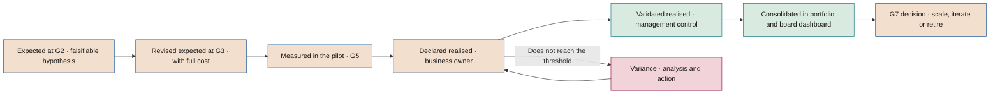

# Benefits realisation

**From expected value to validated value: business owners, tracking, materialisation and value audit**

| | |
|---|---|
| Document | Document 43 · Benefits realisation |
| Version | 0.1 (working draft) |
| Date | 16-09-2026 |
| Author | Fernando García · SEACHAD |
| Status | Draft for review. Develops value realisation tracking (P28, T12) and its link with R6 and G7. |

<!-- cifras: 1 | business owner per benefit ; 2 | post-implementation reviews (6 and 12 months) ; 3 | amount statuses ; 0 | euros counted twice in the portfolio -->

---

> **Legal notice and disclaimer.** SEVEN-G is a reference methodological framework provided "as is" and for information purposes only. It does not constitute legal, regulatory, financial or professional advice, nor does it guarantee compliance with any law or standard. References to general regulation (such as the EU AI Act, the GDPR, DORA or NIS2), to technical standards and to regulation specific to each sector or jurisdiction may be incomplete, may not apply to a particular case or may become out of date as a result of regulatory changes, interpretations or supervisory positions after their consultation date. **Each organisation that uses SEVEN-G is solely responsible for identifying the regulation that applies to it, verifying that it is current and certifying its own regulatory compliance**, with the appropriate qualified advice. The author and SEACHAD accept no liability for any use made of this content or for any decisions taken on the basis of it. The data, figures, companies and cases in the examples are fictitious or illustrative.

<!-- esencial: recomendado | The benefits realisation plan (P62) is evidence for G3 (in draft) and G4 (signed), with a business benefit owner, and tracking by period feeds R6 and G7. The rest —double counting between cases, post-implementation reviews, value audit— is applied according to the size of the portfolio. -->

## 1. Purpose and scope

This document establishes how SEVEN-G converts the expected value of an initiative into realised and validated value, and how it consolidates that value in the portfolio and in the board dashboard. It applies the rules and formulas of document 40 and the indicators of document 41.

It answers six questions:

1. Who is accountable for ensuring that the benefit is delivered?
2. What plan makes it possible and how is it tracked period by period?
3. How is the same euro prevented from being counted twice?
4. How is released capacity materialised?
5. What is done when the value does not arrive?
6. How is the value the board sees consolidated and audited?

It applies to every initiative from phase 2 until its retirement. In Lite it applies with the simplified plan and tracking indicated in each section.

The figures in the examples are **fictitious and illustrative**.

---

## 2. From expected value to validated value

### 2.1 Path

| Moment | What value exists | Possible status | Who prepares it | Who reviews or validates it | Evidence |
|---|---|---|---|---|---|
| **G2 · Hypothesis** | Expected value with formula, baseline and attribution method. | Estimated or declared | AI Product Owner with the business owner | AI Office or AI Auditor | P08, P09 |
| **G3 · Feasibility** | Expected value revised with full costs and a draft realisation plan. | Estimated or declared | AI Product Owner; management control reviews the calculation | AI Risk Owner or AI Auditor | P10, T11, T13 |
| **G4 · Design** | Full realisation plan, including the materialisation plan. | — | Business owner | AI Office | Realisation plan (section 4) |
| **G5 · Go-live** | Value measured in the pilot with the attribution method. | Declared; validated if management control verifies the pilot period | AI Product Owner | Management control and AI Auditor | P22 |
| **Phase 6 · Each period** | Realised value for the period. | Declared → validated | Business owner | Management control | P28, T12 |
| **6- and 12-month reviews** | Cumulative realised value against the plan. | Validated and declared, identified separately | AI Office | AI Committee or AI Sponsor | Review report (section 8) |
| **G7 · Scale or retire** | Validated realised value and actual versus declared ambition. | Validated to demonstrate criteria | AI Product Owner | AI Auditor | P28, P30 |

<!-- grafico: From expected value to validated value | Each step requires more evidence and changes who signs off -->

### 2.2 Rules of the path

1. **Expected and realised values are never added together.** They coexist in T12 as separate columns.
2. **Expected value is not validated** (document 40 §4.1). Management control may review its calculation at G3, but the validated status only applies to realised value in a closed period.
3. **The approved hypothesis is the reference.** The realisation plan, variances and G7 are measured against the hypothesis approved at G2 and revised at G3. Changing it requires the approval of the body that authorised the initiative (01 §7.4, rule 6).

---

## 3. Benefit owners

### 3.1 Principle

**The benefit is the responsibility of the business, not of technology.** The technical team delivers a solution that works; value appears in a process, a budget or an income statement managed by a business area. Only whoever controls that process and that budget can make the benefit materialise.

### 3.2 Roles

| Role | Who | Responsibility in realisation | May not |
|---|---|---|---|
| **Business owner of the benefit** | Executive of the area in which the benefit arises (the area whose cost falls or whose revenue rises). May be the same person as the sponsor. | Signs the realisation plan; executes the enabling changes and the materialisation; declares realised value each period; explains variances and proposes actions. | Validate their own value. Be the technical owner of the initiative. |
| **AI Sponsor** | As per 01 §8.1. | Answers for the value before the governing bodies; resolves conflicts between areas; decides actions within their authority. | Validate the value. |
| **AI Product Owner** | As per 01 §8.1. | Accountable for actual use and adoption; keeps T12 up to date; prepares the reviews. | Declare value on behalf of the business area. |
| **Management control** | Finance function independent of the area. | Validates realised value; sets unit values and hourly costs; approves allocation keys; reconciles with accounting. | Take part in building the initiative. |
| **AI Office** | As per 01 §8.3. | Consolidates the portfolio; detects overlaps; prepares information for the committee and the board. | Validate value. |
| **AI Auditor and internal audit** | Third line. | Verifies at G5 and G7; audits value by sampling (section 12). | Take part in the initiative. |

### 3.3 Requirements for the business owner

- Has **authority over the budget or process** in which the benefit arises.
- Is **identified by name and position** in T01 before G3.
- If the benefit arises in several areas, **each area has its own owner** for its share, and the split is declared.
- **When the person changes**, the new owner signs the current plan within one tracking period or proposes its revision.
- When an efficiency is validated, the business owner **agrees with management control on its incorporation into the area's budget** for the following year. A saving that is not reflected in the budget tends to be reabsorbed.

---

## 4. Benefits realisation plan

### 4.1 Content

The plan is documented in template P62 and recorded in T12; P28 captures its tracking by period. In Lite, the fields marked **(Enterprise)** may be omitted.

| Block | Field | Guidance |
|---|---|---|
| **Benefit** | Description and type | Efficiency or return; they are not mixed in the same line. |
| | Formula | Incremental units × unit value (document 40, F1). |
| | Baseline and attribution method | Those approved at G2. |
| | Expected annual steady-state value | Consistent with the approved hypothesis. |
| **Owners** | Business owner of the benefit | Name, position and area. |
| | Validator | Person from management control. |
| **Realisation curve** | Expected value per period | Reflects the adoption ramp-up; steady state is not assumed from the first period. |
| | Steady-state date | Period in which 100% of the annual value is expected. |
| **Enabling changes** | Changes to processes, roles, policies, systems or contracts without which the benefit will not arrive | Each with an owner and a date. |
| **Materialisation** | Destination of the released capacity | Lever, hours, date and expected evidence (section 7). |
| **Indicators** | Leading indicators | Use, quality, volume (ADO and OPE families in document 41). |
| | Outcome indicators | Those in the benefit formula. |
| **Overlaps** | Use cases or programmes that share a metric, process or population | Proposed allocation key (section 6). |
| **Benefit risks** | What could prevent it from arriving | Linked to the risk register (T06). **(Enterprise)** |
| **Stop criteria** | Threshold below which iterating or retiring is proposed | Those approved at G2. |
| **Reviews** | Dates of the 6- and 12-month reviews and of R6 | As per section 8. |
| **Dependencies** | Other initiatives, suppliers or projects on which it depends | **(Enterprise)** |

### 4.2 Approval

| Moment | Plan status | Sign-off |
|---|---|---|
| G3 | Draft with realisation curve, owners and overlaps identified. | Business owner; calculation reviewed by management control. |
| G4 | Complete, with enabling changes and materialisation plan. | Business owner and sponsor. |
| G5 | In force, adjusted with the pilot results without lowering the approved target without authorisation. | Business owner and sponsor; verified at G5. |

---

## 5. Tracking by period

### 5.1 Frequency

| Intensity | Recording of realised value | Validation | Reporting to the AI Committee |
|---|---|---|---|
| **Enterprise** | Monthly | Quarterly | Quarterly and at R6 |
| **Lite** | Quarterly | Half-yearly | Half-yearly and at R6 |

### 5.2 What is recorded in each period

| Field | Content |
|---|---|
| Period | Closed month or quarter. |
| Expected value for the period | According to the realisation curve. |
| Realised value for the period | By benefit line, with formula and sources. |
| Status | Validated, declared or estimated, with validator and date where applicable. |
| Actual recurring cost | From T13 (document 42). |
| Released capacity | Net released hours, materialised, reassigned and without destination (document 40, F4 and F5). |
| Leading indicators | Use, quality and volume for the period. |
| Realisation | For the period and cumulative (F10), in total and validated only. |
| Variance and cause | If realisation is outside tolerance (section 9). |
| Actions | With owner and date. |

### 5.3 Illustrative example

Expected steady-state efficiency: €300,000 per year (€75,000 per quarter). Realisation curve: 25%, 50%, 75% and 100% in the first four quarters. Actual recurring cost for the year: €90,000.

| Quarter | Expected | Realised | Status | Realisation for the quarter | Cumulative realisation |
|---|---|---|---|---|---|
| Q1 | €18,750 | €15,000 | Validated | 80.0% | 15,000 ÷ 18,750 = 80.0% |
| Q2 | €37,500 | €30,000 | Validated | 80.0% | 45,000 ÷ 56,250 = 80.0% |
| Q3 | €56,250 | €41,000 | Declared | 72.9% | 86,000 ÷ 112,500 = 76.4% |
| Q4 | €75,000 | €52,000 | Declared | 69.3% | 138,000 ÷ 187,500 = 73.6% |
| **Year** | **€187,500** | **€138,000** | | | **73.6%** |

Reading:

- **Cumulative realisation: 73.6%**, amber under the indicative thresholds in document 41 (IND-VAL-14). But realisation for the period falls below 90% for two consecutive quarters (72.9% and 69.3%): this is a **significant variance** under section 9.1, it is reported to the AI Committee and the next R6 considers bringing G7 forward.
- **Validated proportion: 45,000 ÷ 138,000 = 32.6%.** Realisation with validated value only is 45,000 ÷ 187,500 = 24.0%.
- **Annual net value (F2): 138,000 − 90,000 = €48,000. Validated net value (F2v): 45,000 − 90,000 = −€45,000.**
- Actions: validate quarters Q3 and Q4 before R6 and analyse the cause of the drop in realisation (section 9).

### 5.4 Tracking rules

1. **Closed period.** Only value for closed periods is recorded. The value of the current period is not anticipated.
2. **No data is not zero.** If the area does not declare, the period is left as "no data" and an alert is generated; the AI Office may record an estimate identified as such.
3. **Periods are not offset.** A period with higher realisation does not hide another with lower realisation; both are reported.
4. **Corrections to previous periods are recorded as an adjustment**, with date and reason, without overwriting the original data.

---

## 6. Attribution and double counting between use cases

### 6.1 Identifying overlaps

In phase 2 and at each R6, the AI Office reviews overlaps in the portfolio using three criteria:

| Criterion | Question | Example |
|---|---|---|
| **Process** | Do two use cases act on the same process or the same cost line? | A document classifier and a drafting assistant in the same case processing. |
| **Population** | Do they act on the same customers, employees or transactions? | Two propensity models aimed at the same customer portfolio. |
| **Metric** | Do they use the same outcome metric? | Two use cases claiming the reduction in average resolution time. |

**Non-AI programmes** acting on the same metric (process redesigns, price changes, campaigns, reorganisations) are also identified, because their effect is not attributable to AI.

### 6.2 Allocation methods

| Method | How it works | When to use it |
|---|---|---|
| **Joint measurement and proportional allocation** | The joint effect is measured with a method from document 40 §7 and allocated in proportion to the effects measured or expected for each use case separately. | Use cases implemented at the same time on the same process. |
| **Sequential incremental** | The first use case implemented is measured against the baseline; the second, against the situation with the first already implemented. | Staggered implementations with measurement at each step. It tends to favour the first; this is declared. |
| **Prior agreed allocation** | The business owners agree in phase 2 on a justified allocation percentage, approved by management control. | When separate measurement is not possible. Maximum status: declared, unless the joint measurement is validated. |

In all cases: **the sum of what is attributed does not exceed the measured joint effect**, and the key is recorded in all the use cases concerned (IND-VAL-18).

### 6.3 Illustrative example

The cost of a case-processing process falls by €500,000 in the year. A non-AI redesign programme and two AI use cases (A and B) act on that process.

1. The non-AI programme was also applied in offices without AI. The comparison between offices (difference-in-differences) attributes **€100,000** to the programme.
2. Effect attributable to AI: 500,000 − 100,000 = **€400,000**.
3. Effects of A and B measured separately in the pilot: €280,000 and €220,000 (sum €500,000, higher than the joint effect).
4. Proportional allocation: A = 400,000 × 280/500 = **€224,000**; B = 400,000 × 220/500 = **€176,000**.
5. Check: 100,000 + 224,000 + 176,000 = €500,000.

### 6.4 Cross-unit initiatives: realisation by business unit

A cross-unit initiative (document 40 §7.2) has a single realisation plan, with one block per business unit:

| Element | What is required |
|---|---|
| **Owners** | The sponsor is corporate. Each unit appoints its **business owner of the benefit**, who signs the unit's part of the plan and declares its cost, adoption and realised value every period. |
| **Cost** | Each unit bears its licences from day one. Shared costs (adoption office, ongoing training, permission review) are recorded without a unit and add to the initiative's cost. |
| **Adoption** | Active over assigned licences and weekly active users, taken from the platform usage reports. Below the threshold approved at G2, the unit reviews the roll-out or withdraws licences. |
| **Materialisation** | Each unit states the lever from section 7.2 it uses to turn released hours into lower cost or reassigned capacity. Without a lever, the hours are released capacity and do not add up. |
| **Validation** | Management control validates unit by unit. The sum of the units and of the shared costs is the initiative's value; what a unit's own use case already claims on the same process is not counted again (sections 6.1 and 6.2). |

In T01, each unit's roll-out and adoption are recorded in the initiative's scope, and its cost and value as amounts with their unit. The board dashboard (T17) shows them by unit and gives the portfolio's net value with and without cross-unit initiatives.

---

## 7. Materialisation of released capacity

### 7.1 Principle

Released capacity is not a saving until it is materialised or explicitly reassigned (document 40, rule 3). In Optimise, **G5 requires a plan to materialise it and G7 requires materialised savings** (01 §7.6). In Augment, G7 requires reassigned capacity.

### 7.2 Levers

| Lever | What it is | How it is accounted for | Evidence |
|---|---|---|---|
| **Reduction in outsourcing** | Fewer external services contracted for the same work. | Materialised efficiency. | Contract amended or not renewed; lower spend in the accounts. |
| **Elimination of overtime or temporary reinforcements** | Fewer hours paid above the working day or fewer temporary contracts. | Materialised efficiency. | The area's payroll and hiring against the baseline. |
| **Budgeted vacancies not filled** | Natural departures or planned vacancies that are not filled because the capacity already exists. | Efficiency (budgeted avoided cost). | Approved headcount budget and recorded decision not to fill. |
| **Absorption of growth** | Increase in volume handled without increasing the resources the budget had provided for. | Efficiency (budgeted avoided cost), only if the increase in resources was budgeted. | Approved budget with the planned increase. |
| **Reassignment to a new activity** | The hours are explicitly devoted to an identified higher-value activity. | Reassigned capacity; its value only counts through the measured outcome of the destination activity. | Activity, owner, date and hours recorded in T20. |

Materialisation affecting people is planned with the people function and complies with the applicable legal and collective agreement obligations, as well as with the adoption plan (document 23). This document does not constitute legal advice.

### 7.3 Rules

1. **The materialisation plan exists before G5** in Optimise and before G7 in Augment.
2. **Each hour has a single destination**: materialised, reassigned or without destination (F5).
3. **The efficiency is valued at the lower actual cost**, not at hours multiplied by the internal hourly cost. That is why the materialisation rate is calculated in hours and the efficiency in euros of actual cost.
4. **Capacity without destination is reported** in each period and in the board dashboard, separately from net value.
5. **Persistent capacity without destination.** If after two validation periods the capacity still has no destination, the AI Committee reviews the value hypothesis and the ambition level of the initiative.

### 7.4 Illustrative example

Continuation of the example in document 40 §3.3: 5,000 net released hours per year, valued at €160,000 (€32 per hour).

| Destination | Hours | Record | Amount |
|---|---|---|---|
| Outsourcing not renewed | 2,000 | Materialised efficiency (actual reduction in the contract) | €76,000 |
| Reassignment to quality review | 1,000 | Reassigned capacity (does not add to net value) | €32,000 of capacity |
| Without destination | 2,000 | Released capacity not materialised (does not add to net value) | €64,000 of capacity |
| **Total** | **5,000** | | |

Materialisation rate: 2,000 ÷ 5,000 = **40%**. Reassignment rate: 1,000 ÷ 5,000 = **20%**. If the quality review reduces complaints and that effect is measured, its value is recorded as an efficiency or return of that activity, not as the value of the hours.

---

## 8. Post-implementation reviews

### 8.1 Calendar

| Review | When | Objective | Alignment with R6 |
|---|---|---|---|
| **6-month review** | First period close after 6 months from G5. | Confirm that use, quality and first value are following the curve; trigger early actions. | Replaces the R6 for that period if it includes its checks. |
| **12-month review** | First period close after 12 months from G5. | Annual realised and validated value, materialisation, actual cost and actual ambition; prepare G7 if appropriate. | Replaces the R6 for that period if it includes its checks. |

In Enterprise, the intermediate quarterly R6 reviews continue (01 §6.8). In Lite, the 6-month review coincides with the first half-yearly R6 and the 12-month review with the second.

### 8.2 Content

| Question | 6-month review | 12-month review |
|---|---|---|
| Is it used as expected? | Usage rate and active users against the plan. | Stable use and consolidated adoption. |
| Does it work with the approved quality? | OPE indicators against G5 thresholds. | Stability, drift, incidents during the year. |
| Is the value arriving? | Cumulative realisation and trend. | Annual realised value; validated proportion; annual and validated net value. |
| Is capacity being materialised? | Progress of the materialisation plan. | Materialisation and reassignment rates. |
| Does it cost what was expected? | Actual recurring cost against the estimate at G3. | Actual annual cost; cost per unit of outcome against the baseline. |
| Are there new overlaps? | Portfolio review. | Review of the portfolio and of non-AI programmes. |
| Is the ambition as declared? | — | Five classification questions with actual evidence (00 §5.2). |
| What is decided? | Continue the plan or corrective actions. | Continue, corrective actions or bring G7 forward. |

### 8.3 Outcome

Each review produces a **short report** with conclusions, actions, owners and dates, recorded in T01 as an event and linked in T12. It is prepared by the AI Office with the AI Product Owner; it is approved by the sponsor (Lite) or the AI Committee (Enterprise). If the actions change the curve, the owners or the enablers, the realisation plan (P62) is updated. The lessons are incorporated into the portfolio's lessons learned register (P37 §9).

---

## 9. Variances and actions

### 9.1 Thresholds

Realisation (F10) is classified using the indicative thresholds in document 41 (IND-VAL-14), which the company sets in C2:

| Situation | Cumulative realisation (indicative) | Minimum response |
|---|---|---|
| **Within tolerance** | ≥ 90% | Ordinary tracking. |
| **Moderate variance** | 70–90% | Cause analysis and actions by the business owner before the next period. |
| **Significant variance** | < 70%, or two consecutive periods with declining realisation for the period below 90% | Report to the AI Committee; R6 considers bringing G7 forward (01 §6.8). |
| **Stop criterion reached** | According to the criteria approved at G2 | Iterating or retiring is proposed; the criteria are not relaxed without approval (01 §7.4, rule 6). |

The same reading applies to realisation with validated value only when R6 and G7 are prepared.

### 9.2 Common causes and actions

| Cause | Signals | Possible actions |
|---|---|---|
| **Insufficient adoption** | Usage rate below plan; low acceptance of suggestions. | Training, redesign of the user experience, process changes that integrate the tool, visible sponsorship. |
| **Process not redesigned** | High use but total process time does not fall. | End-to-end redesign; elimination of duplicated steps. |
| **System quality** | OPE indicators outside threshold; more human review than expected. | Improvement of the model, the data or the knowledge base; review of the automation threshold. |
| **Lower volume than expected** | Fewer transactions than in the hypothesis. | Revise the hypothesis with approval; extend the scope only via G7. |
| **Materialisation not executed** | Growing capacity without destination. | Execute the levers in section 7; escalate to the sponsor. |
| **Higher cost than expected** | Actual recurring cost above the estimate; runaway consumption. | Measures from document 42 §8; renegotiation; optimisation. |
| **Disputed attribution** | Undeclared overlaps; effect of non-AI programmes. | Apply section 6; recalculate with management control. |
| **Wrong hypothesis** | The effect measured with good use and good quality is lower than expected. | Iterate or retire at G7; record the lesson. |

### 9.3 Rules

1. **Every variance has a cause and an action**, with owner and date, recorded in T12.
2. **The target is not lowered to close a variance.** Revising the hypothesis is a decision of the body that approved it and is recorded with the reason.
3. **Overdue actions are treated as expired conditions** (IND-EMB-08) when they were imposed at a *gate* or at R6.

---

## 10. Link with R6 and G7

### 10.1 What R6 checks regarding value

| Check | Evidence |
|---|---|
| Realised value is recorded each period with a status. | T12 up to date; no unexplained "no data" periods. |
| Realisation is within tolerance or has actions. | Cumulative realisation and recorded actions. |
| Validations are current. | No expired validated amount (document 40 §4.1). |
| Released capacity has a destination or a plan. | Materialisation and reassignment rates. |
| Actual cost reconciles with T13. | Reconciliation in document 42 §11.3. |
| Overlaps are declared and allocated. | IND-VAL-18. |
| Whether G7 should be brought forward. | Significant variance or stop criterion reached. |

### 10.2 What G7 requires regarding value

G7 applies the criteria differentiated by ambition level in 01 §7.6, with these evidence requirements:

| Ambition | G7 criterion (01 §7.6) | Value evidence required | Minimum status |
|---|---|---|---|
| **Optimise** | Materialised savings, not just released capacity. | Materialised efficiencies reflected in the accounts or budgeted avoided cost; materialisation rate; annual net value; NPV recalculated with realised values (document 40 §8). | Validated |
| **Augment** | Sustained performance and reassigned capacity. | Performance indicators sustained over at least two periods; reassignment rate with destination activities; annual net value. | Validated for the amounts; indicators verified by the AI Auditor |
| **Transform** | Measured return and verified change in the operating model or the offering. | Return measured with a control group, A/B test or difference-in-differences; evidence of the operating or offering change; achievement of learning milestones and stage limits. | Validated for the return; change verified by the AI Auditor |

If the decision is **Scale**, the validated realised value and the updated realisation plan form part of the new phase 0 of the extended scope. If it is **Retire**, the final realised value, the retirement cost (document 42 §10) and the lessons are recorded.

---

## 11. Consolidation in the portfolio and in the board dashboard

### 11.1 Consolidation process

| Step | Activity | Accountable | Control |
|---|---|---|---|
| 1 | Close of the period in T12 for all use cases. | Business owners | Use cases without a declaration identified. |
| 2 | Validation of the amounts for the relevant period. | Management control | Statuses and expiry dates updated. |
| 3 | Review of overlaps and application of allocation keys. | AI Office | Sum of what is attributed ≤ measured joint effect. |
| 4 | Incorporation of actual recurring cost from T13. | Management control | Reconciliation with accounting. |
| 5 | Calculation of F2, F2v, F5, F6 and F10 per use case and for the portfolio. | AI Office | Recalculated automatically; no unrecorded manual adjustments. |
| 6 | Separation of released capacity, reassigned capacity, potentials and unquantified value. | AI Office | None of this enters net value. |
| 7 | Comparison with the previous period and with the saved snapshot of the dashboard. | AI Office | Variations explained, including changes of status. |
| 8 | Export to the board dashboard (T17). | AI Office | Validated proportion visible next to each total. |

### 11.2 What the board sees

The presentation rules are in document 40 §11. For benefits realisation, the board dashboard should also show:

- **Cumulative portfolio realisation** (IND-VAL-14) in total and validated only.
- **Use cases with significant variance**, with cause and action.
- **Capacity without destination** in the portfolio and its evolution.
- **Value by ambition level**, separating efficiencies and return, for signals 2 and 3 of the transformation index.
- **Historical snapshots** that allow periods to be compared without rewriting figures already presented; corrections are shown as adjustments.

### 11.3 Aggregation rules

1. **Only homogeneous magnitudes are added**: efficiencies with efficiencies, return with return; and return in margin with return in margin.
2. **The portfolio total is the sum after allocating overlaps**, never the sum of what each use case has declared.
3. **Use cases without data are not replaced by zero**; their number is reported.
4. **Retired use cases** keep their historical realised value in the periods in which they were in production, and stop adding from retirement onwards.

---

## 12. Value audit

### 12.1 Purpose and responsibilities

The value audit verifies that the value figures presented to the AI Committee and to the board comply with the rules of document 40. It is carried out by the **third line** (internal audit or external auditor), independently of the AI Office and management control, at least **once a year before C5**, and whenever the board or the board committee requests it.

### 12.2 Scope and sample

| Element | Indicative criterion |
|---|---|
| **Material validated amounts** | All validated amounts that exceed the materiality threshold set by audit with management control. |
| **Other amounts** | Random sample of validated, declared and estimated amounts across all intensities. |
| **Transform use cases** | All of them, because of the requirement for measured return at G7. |
| **Overlaps** | All use cases with a declared overlap and a sample of use cases on common processes without a declared overlap. |
| **Consolidation** | Full recalculation of the totals presented to the board in the last period. |

### 12.3 Tests

| Test | What it verifies |
|---|---|
| **Formula and sources** | That the amount can be rebuilt from the formula and the source systems (rule 1). |
| **Baseline and attribution** | That the baseline was measured before G2 and that the method applied is the approved one, with its maximum status (document 40 §7). |
| **Status and currency** | That each status was assigned by someone entitled to assign it, with the required evidence and without having expired (document 40 §4). |
| **Materialisation** | That efficiencies are reflected in the accounts or as budgeted avoided cost (rule 3). |
| **Exclusivity** | That there is no double counting and that the allocation keys are approved (rule 5). |
| **Full cost** | That the recurring cost includes shared costs and reconciles with accounting (document 42). |
| **Presentation** | That the reports to the board show the validated proportion, capacity separately, use cases with negative net value and "no data" items (document 40 §11). |

### 12.4 Findings

| Finding | Minimum treatment |
|---|---|
| Calculation or recording error with no impact on decisions | Minor nonconformity (document 37). |
| Amount presented as validated without validation or with an expired validation | Major nonconformity. |
| Double counting or released capacity added to net value with an impact on decisions of the committee or the board | Major nonconformity. |
| Deliberate alteration of figures or of stop criteria | At least a major nonconformity; reported to the board committee. |

When a finding affects figures already presented to the board, the AI Office presents at the next meeting the **corrected figure alongside the one presented**, with the explanation. The value audit report is incorporated into C5. Findings are documented with the record in P60 §8.1.

---

## 13. Associated tools and templates

| Code | Name | Use in this document |
|---|---|---|
| **T12** | Value realisation tracking | Realisation plan, recording by period, statuses, realisation, variances. |
| **T01** | Initiative register | Owners, review events, R6 and G7 decisions. |
| **T13** | Cost calculator per use case | Actual recurring cost. |
| **T17** | Board AI dashboard | Consolidation and presentation. |
| **T20** | Adoption and capacity plan | Materialisation and reassignment of capacity. |
| **T22** | Retirement manager | Final value and retirement. |
| **P08 · P09** | Value hypothesis canvas · Baseline | Reference for the plan. |
| **P20** | Adoption and capacity plan | Enabling changes and destination of capacity. |
| **P22** | Validation and pilot results | Value measured at G5. |
| **P28** | Value realisation tracking | Tracking by period. |
| **P62** | Benefits realisation plan | Realisation plan: curve, owners and enablers (section 4). |
| **P29** | *Gate* decision record | R6 and G7 decisions. |
| **P30** | Scaling or retirement decision | Value evidence at G7. |

---

## 14. Related documents

| Document | Relationship |
|---|---|
| **01 · Foundational methodology** | R6 (§6.8), G7 (§6.9) and criteria by ambition (§7.6). |
| **14 · Portfolio management** | Use of realised value in prioritisation and retirement. |
| **21 · *Gate* and audit criteria** | Detailed criteria for G5, R6 and G7. |
| **23 · Adoption and change** | Adoption and enabling changes. |
| **37 · Nonconformities and incidents** | Treatment of findings. |
| **38 · AI audit framework** | Fit of the value audit. |
| **40 · Value measurement rules** | Rules, statuses, formulas and attribution methods. |
| **41 · Indicator catalogue** | VAL, COS and ADO indicators used in tracking. |
| **42 · AI costs** | Actual recurring cost and retirement cost. |
| **50 · People and organisation** | Materialisation and reassignment affecting people. |
| **60 · Board pack** | Presentation of benefits realisation. |

---

## 15. Version control

| Version | Date | Changes |
|---|---|---|
| 0.1 | 16-09-2026 | First version. Defines the path from expected to validated value, the business owner of the benefit, the realisation plan, tracking by period, the methods to avoid double counting, the levers for materialising released capacity, the 6- and 12-month reviews, the treatment of variances, the link with R6 and G7, consolidation in the portfolio and in the board dashboard, and the value audit. |
