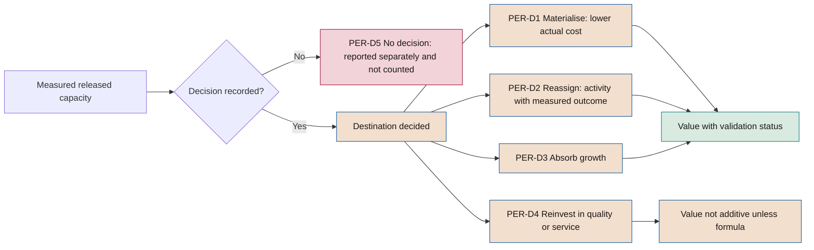

# People and organisation

**Effect of AI on work, capabilities, released capacity, labour relations and decisions about people**

| | |
|---|---|
| Document | Document 50 · People and organisation |
| Version | 0.1 (working draft) |
| Date | 16-09-2026 |
| Author | Fernando García · SEACHAD |
| Status | Draft for review. Indicator thresholds are indicative and must be calibrated as the framework is applied. |

<!-- cifras: 3 | effects on work: replaces, augments, reorganises ; 5 | possible destinations for released capacity ; 15 | indicators with a formula ; 6 | profiles in the literacy plan -->

---

> **Legal notice and disclaimer.** SEVEN-G is a reference methodological framework provided "as is" and for information purposes only. It does not constitute legal, regulatory, financial or professional advice, nor does it guarantee compliance with any law or standard. References to general regulation (such as the EU AI Act, the GDPR, DORA or NIS2), to technical standards and to regulation specific to each sector or jurisdiction may be incomplete, may not apply to a particular case or may become out of date as a result of regulatory changes, interpretations or supervisory positions after their consultation date. **Each organisation that uses SEVEN-G is solely responsible for identifying the regulation that applies to it, verifying that it is current and certifying its own regulatory compliance**, with the appropriate qualified advice. The author and SEACHAD accept no liability for any use made of this content or for any decisions taken on the basis of it. The data, figures, companies and cases in the examples are fictitious or illustrative.

## 1. Purpose and scope

This document develops **sphere 03 · People** of the impact map and principle 10 of the framework (*people at the centre of change*). It sets out how an organisation applying SEVEN-G must:

- Assess, initiative by initiative, whether AI **replaces, augments or reorganises** work.
- Define the **roles and capabilities** that AI requires, from the board to the teams.
- Plan **AI literacy** and capabilities by profile.
- Decide, record and track the destination of **released capacity**.
- Comply with the **information and consultation** rights of workers' representatives and be transparent with employees about the algorithms that affect them.
- Control the use of AI in **decisions about people** (recruitment, appraisal, promotion, discipline, dismissal).
- Protect **wellbeing, autonomy** and the quality of human oversight.
- Communicate internally in a consistent manner and measure all of the above with **indicators with a formula**.

**Scope.** It applies to all AI initiatives and to corporate uses of general-purpose AI that affect employees' work, their working conditions or decisions about candidates and employees. Change management and adoption are developed in document 23; the rules for acceptable use of AI by employees, in document 31. This document does not repeat them: it sets out what is specific to people and to the organisation.

**Limits.** The labour law references are limited to Spain and the European Union, with the consultation date indicated. **Other jurisdictions have different rules** and must be incorporated into the context statement (phase 0). This document does not constitute legal advice.

---

## 2. Sphere 03 · People

### 2.1 Reference question

> **Does AI replace, augment or reorganise people's work?**

The answer is not technical. It defines the culture, the employee value proposition, the ability to attract and retain talent and the relationship with workers' representatives. That is why SEVEN-G requires the company to adopt at **C2** an **explicit position** on the effect it seeks on work (document 13) and requires each initiative to respect it or justify the exception.

### 2.2 The three roles of the employee in relation to AI

| Role | What it means | What it requires of the company |
|---|---|---|
| **Recipient** | AI changes their tools, processes and productivity expectations without them having chosen it. | Training, support, time to learn and channels to flag problems (document 23). |
| **Subject** | AI may restructure, reassign or eliminate tasks or jobs, or intervene in decisions about their employment. | Effect assessment, information and consultation, controls on decisions about people and fair treatment in the transition (sections 3, 7 and 8). |
| **Promoter** | They know their process better than anyone and can propose uses of AI that no outsider would see. | Proposal channel connected to the initiative register (T01), recognition and clear rules of use (document 31). |

The same employee may occupy all three roles at once. People plans must address all three and not only the first.

### 2.3 Ambition levels in sphere 03

The examples are **illustrative** and do not imply a recommendation.

| Level | What changes for people | Illustrative examples |
|---|---|---|
| **Optimise** | Tasks are eliminated or accelerated; the job and the organisation do not change. | Automating reports, data capture and triage; speeding up onboarding with knowledge assistants; training adapted to each employee's level. |
| **Augment** | People do what they could not do before; the role changes. | Specialised assistants by function; employees who propose and deploy uses of AI in their area under control; continuous reskilling linked to the new role. |
| **Transform** | The structure, the roles or who decides what change. | Redesign of teams and hierarchical levels; disappearance of functions and creation of new ones; people who move from executing to overseeing systems that act (autonomy A2 or A3). |

### 2.4 What is assessed in sphere 03

Seven dimensions are assessed, each with its evidence and indicators (section 11): **position** approved at C2; **effect per initiative** (P20, PER-01); **capabilities** (PER-02, PER-03); **released capacity** (PER-04 to PER-06); **labour relations** (PER-08); **decisions about people** (P11, P17, PER-09 to PER-12); and **wellbeing** (PER-15).

The indicators in section 11 feed the **D5 People and adoption** dimension of the maturity model (document 11) and signals **3 · Materialisation** and **5 · Operating model** of the transformation index (document 12).

---

## 3. Effect of AI on work

### 3.1 Three effects

| Effect | Definition in SEVEN-G | Typical signal |
|---|---|---|
| **Replaces** | The system performs tasks that a person used to perform, and the person stops performing them. | Hours released on specific tasks; lower staffing need for the same volume. |
| **Augments** | The person continues to do the work, but with greater quality, reach or speed thanks to the system. | Improved performance per person; new tasks that were previously impossible. |
| **Reorganises** | Roles, the process sequence, the team structure or the allocation of decisions between people and systems change. | New job descriptions; changes in reporting lines; new human oversight points. |

An initiative usually combines effects. **The effect on each task** and the **dominant effect** on each affected group are recorded.

The effect on work **is not the same as the ambition level**. An Optimise initiative may replace many tasks; a Transform initiative may not reduce staffing at all. The two classifications are recorded separately.

### 3.2 Unit of analysis

The effect is assessed at three levels, from the specific to the aggregate:

1. **Task.** Which tasks in the process change, how much time they take today (baseline, phase 2) and what the system will do.
2. **Job or role.** What proportion of the job's time is affected and how its responsibilities, autonomy and supervision change.
3. **Group and organisation.** How many people, in which areas, sites and job categories, and with what foreseeable effect on staffing, structure, required qualifications and working conditions.

### 3.3 How it is assessed per initiative

| Phase | Activity | Recorded result |
|---|---|---|
| **1** | Identify affected groups and foreseeable effect. | Opportunity record (P06, P31). |
| **2** | Measure the baseline of time per task and people; declare whether the value depends on released capacity. | P08, P09. |
| **3** | Complete **effect on work assessment** (section 3.4), with the people function and clearance from the AI Risk Owner. | P20 / T20; RT-ORG risks in P12; P11. |
| **4** | Redesign roles and human oversight; capability and communication plan; planned destination of released capacity. | P17, P20. |
| **5** | Measure the actual effect in the pilot; train users and overseers; inform workers' representatives where appropriate. | P22; information record. |
| **6** | Track adoption, released capacity, wellbeing and incidents; review at R6. | P28; released capacity record. |
| **7** | Compare the actual effect with the declared effect; anticipate the effect of scaling or of returning to the previous process if the system is retired. | P30. |

The AI Product Owner carries out the assessment; the AI Sponsor is accountable for it.

### 3.4 Effect assessment questions

1. Which tasks does a person stop performing and which appear, including oversight of the system?
2. How many people and which jobs are affected, and in what proportion of their time?
3. Do pace, working hours, objectives, monitoring, autonomy or location change? (sections 7 and 9)
4. Does the system intervene in decisions about candidates or employees? (section 8)
5. What new capabilities are required and who has them today? (section 5)
6. What capacity is released, when and with what planned destination? (section 6)
7. What knowledge is lost or becomes concentrated? (document 51, section 10)
8. Is the ability to return to the manual process retained? (document 52, section 10)
9. Is it consistent with the C2 position? If not, the exception is escalated to the AI Committee.

### 3.5 Intensity rule

The effect on work does not in itself create an Enterprise criterion, but **intensity must be reviewed** (T04) when the assessment detects decisions about people, significant changes in working conditions or staffing reductions. In those cases the initiative **should** be treated as Enterprise even if it does not meet any other criterion, and if it remains Lite the justification is recorded.

---

## 4. New roles and capabilities

### 4.1 From the board to the teams

| Level | Role with respect to people |
|---|---|
| **Board or board committee** | Approves the position on the effect on work; oversees transformations that change the organisation; monitors labour and reputational risks. |
| **Senior management** | Translates the position into staffing, qualification and labour relations plans; decides relevant destinations of released capacity. |
| **AI Committee** | Together with the people function, reviews the aggregate effect across the portfolio and exceptions to the C2 position. |
| **AI Office** | Maintains the effect assessment method and consolidates indicators and the released capacity record. |
| **People function** | Jointly responsible for the effect assessment, the capability plan and the relationship with workers' representatives. |
| **Middle managers** | Redesign day-to-day work, lead mixed person–system teams and carry out reassignment. |
| **Initiative teams** | Build and operate with sound judgement about the effect on people. |
| **Users and human overseers** | Use the system and validate, correct or interrupt its outputs with authority to disagree. |
| **Workers' representatives** | Receive understandable information and take part in consultation where appropriate (section 7). |

The capabilities each level needs are specified in the profiles in section 5.

### 4.2 New or expanded roles

The SEVEN-G roles (document 01 §8) do not change. The following functions **may** be assigned to existing people or created as new roles, depending on size and intensity:

| Function | What it does | Mandatory |
|---|---|---|
| **Designated human overseer** (user area) | Validates, corrects or interrupts outputs of an A1–A3 system with competence, training and authority. | Yes, in high-risk systems and in A2–A3. |
| **Area AI champion** | Questions, proposals and detection of unauthorised uses; liaison with the AI Office. | Recommended. |
| **Content or knowledge owner** | Quality, validity and permissions of generative AI sources (document 51). | Yes, with generative AI over internal sources. |
| **Effect on work analyst** | Effect assessment and released capacity record. | Recommended in Enterprise. |
| **Labour relations lead for AI** | Information to workers' representatives and consultations. | Recommended if there is legal workers' representation. |

**Authority rule.** A human overseer without real authority to disagree with the system, or who is appraised on how quickly they accept its proposals, is **not** human oversight. The design of the overseer's objectives and incentives forms part of P17.

---

## 5. Capability plan and literacy by profile

### 5.1 Starting obligation

The EU AI Act requires providers and deployers to take measures to support the development of **AI literacy** among their staff and other persons operating or using AI systems on their behalf (Art. 4, applicable since 2 February 2025; under the wording of Regulation (EU) 2026/1744 no specific level is required, but the policy and the training plan remain evidence). For high-risk systems, deployers must assign human oversight to natural persons who have the **necessary competence, training and authority** (Art. 26(2)). The amendments introduced by Regulation (EU) 2026/1744 (Digital Omnibus on AI, in force since 27 July 2026) and the application timeline are detailed in document 34 (§3.1 and §3.2).

SEVEN-G treats literacy as a **C2 requirement** (policy, document 31) and as **evidence per initiative** (capability plan in P20).

### 5.2 Profiles and content

| Profile | Minimum content | Evidence |
|---|---|---|
| **PER-PA · Board and senior management** | Types of AI and their limits; spheres and ambition; risks and regulation; board dashboard; effect on work. | Recorded session; annual review. |
| **PER-PB · Middle managers** | The above applied to the area; effect assessment; human oversight; transition and communication. | Training and participation in an effect assessment. |
| **PER-PC · All employees** | What AI is and is not; acceptable use (document 31); data that must not be entered; verifying outputs; reporting problems. | Training before access; periodic renewal. |
| **PER-PD · Users and overseers of a system** | Purpose and limits; interpretation of outputs; automation bias; how to disagree or interrupt; incidents. | System training and practical test before overseeing. |
| **PER-PE · Teams that build and operate** | SEVEN-G lifecycle; documents 35, 51 and 52; bias and robustness testing. | Accredited application in an initiative. |
| **PER-PF · Control and people functions** | Risks; regulatory classification; decisions about people; audit; information to workers' representatives. | Supervised participation in *gates*. |

### 5.3 Capability plan per initiative

The plan forms part of P20 and **must** include, for each affected group: group and number of people; required capabilities (technical, oversight, process, customer relationship); measured current gap; action (training, supported practice, rotation, reskilling); hours reserved within working time; timing (users and overseers before the pilot, others before production); owner; and sufficiency criterion with its evidence.

**Rule.** A designated human overseer **must not** oversee an A1–A3 system in production without having completed and recorded the specific PER-PD profile training.

### 5.4 Retention of critical capabilities

When a system replaces tasks that require expert judgement, the company **should** retain the capabilities needed to oversee the system, detect its errors and operate without it in the event of rollback. The plan identifies those capabilities and how they are maintained (periodic practice, manual review cases, rotation).

---

## 6. Reassignment of released capacity

### 6.1 Principle

**Measurement rule 3** (document 00 §6) establishes that released capacity **is not counted as savings** until it is materialised as a lower actual cost or explicitly reassigned. SEVEN-G turns that rule into a process: **all released capacity has an explicit decision on its destination, a record and tracking**. Without a decision, released capacity is shown as such and not as value.

### 6.2 Possible destinations

| Destination | What it means | How it counts in measurement |
|---|---|---|
| **PER-D1 · Materialise** | Reduction in actual cost: less overtime, less external or temporary hiring, vacancies not filled, resizing. | Efficiency, validated when the lower cost appears in management accounts. |
| **PER-D2 · Reassign to a defined activity** | The hours move to a specific activity with an owner and an outcome metric. | Value measured in the outcome of the destination activity, attributed to a single use case (rule 5). |
| **PER-D3 · Absorb growth** | The same team handles more volume without increasing staffing. | Avoided cost only if the growth is measured and the staffing need was documented beforehand. |
| **PER-D4 · Reinvest in quality, service or compliance** | More time per customer, more review, more control. | Not additive unless translated into money with a formula (rule 7). |
| **PER-D5 · No decision** | The destination has not been decided. | **Not counted.** Reported separately, with an ageing alert. |

Destinations may be combined, with declared percentages of the hours released.

<!-- grafico: Destination of released capacity | Without an explicit decision, released capacity does not become value -->

### 6.3 Who decides and when

| Moment | Decision | Decides |
|---|---|---|
| **Phase 2** | It is declared whether the value hypothesis depends on released capacity and with what planned destination. | AI Sponsor |
| **Phase 4** | Planned destination by group, with percentages, timeframe and owner. | AI Sponsor with the people function and management control |
| **G5** | In Optimise, plan to materialise the released capacity (01 §7.6); in Augment, reassignment plan. | *Gate* body |
| **R6** | Tracking: measured released hours against materialised and reassigned hours; decision on PER-D5 by age. | AI Sponsor; AI Committee in Enterprise |
| **G7** | Optimise: materialised savings, not just released capacity. Augment: reassigned capacity and sustained performance. | *Gate* body |

When the destination involves **staffing reductions, changes in duties or in working conditions**, the decision rests with senior management together with the people function and **must** respect the applicable statutory and collectively agreed procedures. In Spain, the procedures that may come into play include, among others, substantial modification of working conditions (Article 41 of the Estatuto de los Trabajadores (Workers' Statute)) or collective dismissal (Article 51), in addition to the information and consultation rights in section 7. That assessment requires employment law expertise.

### 6.4 Released capacity record

The record is kept in T20 and feeds T12 (value tracking).

| Field | Guidance |
|---|---|
| Initiative (IA-AAAA-NNN) and period | Month or quarter. |
| Group or area | Area, job category, site; no individual data. |
| Measured released hours and full-time equivalent | Time per task × volume against the baseline. |
| Measurement status | Validated · declared · estimated (rule 2). |
| Destination (PER-D1–PER-D5) and percentage; decision-maker and date | Nobody decides on their own work. |
| Destination activity and owner (PER-D2) | A specific activity, not generic "higher-value tasks". |
| Effective date; materialised or reassigned hours | Actual for the period. |
| Economic effect | Amount with formula and status (rule 1). |
| Information to or consultation with workers' representatives | Date and reference, if applicable (section 7). |
| Observations on people | Reskilling, mobility, wellbeing. |

### 6.5 Tracking rules

1. **Measured** released hours are always reported, even if they have no destination.
2. Capacity in **PER-D5 for more than 90 days** (indicative time limit, set at C2) triggers an alert in T01 and is reviewed at R6.
3. A **PER-D2 reassignment without a verifiable destination activity** is reclassified as PER-D5.
4. Reassignment cannot be presented as materialisation or counted twice (in the originating initiative and in the destination activity).
5. Reports to the board show released, materialised, reassigned and undecided hours separately.

---

## 7. Labour relations, information and consultation, algorithmic transparency

### 7.1 Reference framework in Spain and the European Union

Consultation carried out in September 2026. Validity must be verified before applying it, and document 34 must be consulted.

| Reference | Content relevant to this document |
|---|---|
| **Estatuto de los Trabajadores (Workers' Statute), Article 64.4.d)** (introduced by Real Decreto-ley 9/2021 (Royal Decree-Law 9/2021) and Ley 12/2021 (Law 12/2021)) | The works council has the right to be informed by the company of *"the parameters, rules and instructions on which the algorithms or artificial intelligence systems are based that affect decision-making that may have an impact on working conditions, access to and retention of employment, including profiling"*. Trade union delegates may have equivalent rights under the terms of the Ley Orgánica de Libertad Sindical (Organic Law on Freedom of Association). |
| **Estatuto de los Trabajadores, Article 64** (remainder) and applicable collective agreement | General information and consultation rights on changes in the organisation of work, which may be triggered by AI initiatives even if they are not decision-making algorithms. The collective agreement may extend obligations. |
| **EU AI Act, Art. 26(7)** | Before putting into service or using a high-risk AI system in the workplace, deployers who are employers must inform workers' representatives and the affected workers. |
| **EU AI Act, Annex III, point 4** | High-risk systems in employment and workers management (section 8). |
| **EU AI Act, Art. 5(1)(f)** | Prohibition of emotion recognition systems in the workplace, except for medical or safety reasons. |
| **GDPR, Arts. 13, 14, 15, 22 and 88** | Information to data subjects, right of access, automated individual decision-making and processing in the employment context. |
| **Ley Orgánica 3/2018 (Organic Law 3/2018 on Personal Data Protection and Guarantee of Digital Rights, LOPDGDD), Arts. 87 to 91** | Digital rights in the workplace: use of digital devices, digital disconnection, video surveillance, geolocation and collective bargaining on these rights. |
| **Directive (EU) 2024/2831** on improving working conditions in platform work | Rules on algorithmic management (information, human monitoring and human review) for platform work. Transposition deadline: 2 December 2026. Verify the status of transposition. |

**Other jurisdictions differ.** Outside the European Union, obligations may differ in content and in addressee; for example, some local regulations require independent bias audits of automated employment decision tools before they are used. Each company **must** identify the applicable regulations in each country where it has employees or candidates and incorporate them into the context statement (P02).

This document does not constitute legal advice.

### 7.2 Information and consultation process in SEVEN-G

| Step | Moment | What is done | Evidence |
|---|---|---|---|
| 1 · Identification | Phase 3 | The effect assessment determines whether the system affects working conditions, access to or retention of employment, profiling, or whether it is high-risk in the workplace. | Effect assessment (P20). |
| 2 · Legal analysis | Phase 3 | Labour relations and legal counsel determine the obligations of information and, where applicable, consultation, their content and their timing. | Legal note linked in P11. |
| 3 · Preparation | Phase 4 | The system information sheet for workers' representatives is prepared (section 7.3). | Information sheet (P46). |
| 4 · Information or consultation | Before the pilot with real people and, in any case, before use in production | The sheet is delivered and questions are answered; the consultation is documented where applicable. | Record of delivery, minutes. |
| 5 · Update | At each relevant change (document 52, section 6) | If parameters, rules, purpose or groups change, the information is updated. | New version of the sheet. |

***Gate* rule.** For systems that require prior information, G5 **cannot** be resolved as *Proceed* without evidence that the information has been provided. This condition does not allow *Proceed with conditions*, because it is legal compliance (01 §7.3).

### 7.3 Information sheet for workers' representatives and employees

It must be understandable to non-specialists (measurement rule 10) and does not require disclosure of source code.

1. **Identification:** system, purpose, area, owner and supplier.
2. **Decisions affected:** which decisions it supports or makes, about whom and with what autonomy (A0–A3).
3. **Data:** categories, origin and period; exclusion or justification of special categories.
4. **Parameters and rules:** main variables and their relative importance in understandable terms; rules and thresholds; instructions given to the system.
5. **Human intervention:** who reviews, with what authority and how to disagree.
6. **Controls:** bias testing and summary result; monitoring; review.
7. **Rights:** how to request information, an explanation or human review; complaints channel.
8. **Changes:** version, date and changes.

### 7.4 Algorithmic transparency towards employees

In addition to the information provided to workers' representatives, the company **should** keep accessible to all employees an **internal register of AI systems that affect them**, derived from the inventory (T02), with a summarised version of the sheet in section 7.3. Employees affected by AI-supported decisions must be able to know that the system is used, for what purpose, and how to request human review.

---

## 8. Use of AI in decisions about people

### 8.1 Why it is treated separately

The EU AI Act classifies as **high-risk** (Annex III, point 4) systems intended to be used for:

- The **recruitment or selection** of natural persons, in particular to place targeted job advertisements, to analyse and filter job applications, and to evaluate candidates.
- Making **decisions affecting the terms** of work-related relationships, the **promotion or termination** of work-related contractual relationships, **allocating tasks** based on individual behaviour or personal traits, or **monitoring and evaluating the performance and behaviour** of persons.

The obligations for these systems apply from 2 December 2027, following the postponement introduced by Regulation (EU) 2026/1744 (timeline in document 34 §3.1). The specific classification of each system and its exceptions require legal expertise (documents 32 and 34).

Regardless of the regulatory classification, in SEVEN-G **any initiative that significantly influences decisions about candidates or employees meets the "decisions about people" Enterprise criterion** (01 §9.2).

### 8.2 Maximum autonomy by type of decision

| Decision | Maximum autonomy permitted | Additional minimum controls |
|---|---|---|
| **Dissemination of job offers and attraction** | A2 | Bias testing of the reach of advertisements; periodic review of targeting criteria. |
| **Screening and assessment of candidates** | A1 | Human review of rejections; adverse impact testing by group; understandable explanation; prohibition on inferring non-relevant traits. |
| **Allocation of shifts, tasks or routes** | A2 | Working time and rest limits built in; complaints channel; prior information (section 7). |
| **Performance and behaviour appraisal** | A1 | The final appraisal is human; the person appraised knows which indicators are used; cross-check with the line manager. |
| **Variable pay and promotion** | A1 | Human review with authority; bias testing; traceability of the recommendation and of the decision. |
| **Disciplinary measures and dismissal** | **A0** | The system may only provide information. The decision, its grounds and its communication are always human. |
| **Emotion recognition in the workplace** | **Not permitted**, except for the medical or safety exceptions provided for in the Regulation. | Prohibited practice: does not pass phase 3 (01 §6.5). |

The company may set stricter limits at C2, never more lenient ones.

### 8.3 Mandatory controls

| # | Control | Phase | Evidence |
|---|---|---|---|
| 1 | Regulatory classification with legal expertise. | 3 | P11 |
| 2 | Data protection impact assessment, where the processing requires it. | 3–4 | P11 |
| 3 | Fundamental rights impact assessment, where required of the deployer. | 3–4 | P11 |
| 4 | Justification of the relevance of each variable and exclusion of variables that act as proxies for protected characteristics. | 4 | P16, P17 |
| 5 | Bias testing before the pilot and periodically in production, with metric, groups, threshold and action. | 5–6 | P22, P25 |
| 6 | Human oversight with competence, training and authority; measurement of the human override rate (PER-10). | 4–6 | P17, P25 |
| 7 | Understandable explanation to the affected person and a route to human review. | 4–6 | P17 |
| 8 | Information to workers' representatives and to those affected (section 7). | 4–5 | Information sheet |
| 9 | Retention of recommendation and decision logs (document 52, section 11). | 6 | P24 |
| 10 | Supplier assessment if the system is third-party, with access to the information needed to meet the above controls. | 3 | P14 |

The EU AI Act also recognises, under certain conditions, the **right to obtain an explanation** of individual decisions taken on the basis of the output of Annex III high-risk systems (Art. 86). The design of P17 **must** provide for how this is handled.

### 8.4 Bias testing in decisions about people

| Element | Guidance |
|---|---|
| **Groups** | Those protected by the applicable anti-discrimination legislation, insofar as they can be lawfully analysed. The processing of special categories to detect bias has its own conditions (document 51, section 6). |
| **Metrics** | Selection rates by group, errors by group and adverse impact ratio (PER-11). |
| **Threshold** | Set per system in phase 4. A ratio below 0.8 between selection rates (known as the four-fifths rule in US practice) is frequently used as an **indication** of possible adverse impact. It is not a legal threshold in the European Union and does not in itself prove discrimination. |
| **Action** | Any result below the threshold is analysed, recorded in P12 and, if it is not explained by relevant factors, blocks G5 or triggers an incident in production. |

---

## 9. Wellbeing, autonomy and oversight

### 9.1 Risks to people

| Risk | Warning signal |
|---|---|
| **Work intensification:** AI raises the expected pace without reviewing objectives or workloads. | More volume per person without a change in objectives; hours outside working time. |
| **Excessive monitoring:** usage data employed to monitor people beyond the declared purpose. | Individual activity reports not provided for in the information sheet. |
| **Loss of autonomy:** the person executes what the system proposes with no room for judgement. | Human override rate close to zero. |
| **Deskilling:** loss of the expertise needed to oversee or replace the system. | Inability to operate without the system in rollback tests. |
| **Automation bias:** excessive reliance on the system's outputs; the EU AI Act expressly mentions it in relation to human oversight (Art. 14(4)(b)). | System errors accepted without review. |
| **Oversight workload:** large volumes cause fatigue and superficial reviews. | Very low or decreasing review time per case. |
| **Job insecurity:** ambiguous announcements cause anxiety and turnover. | Climate and voluntary turnover in affected groups. |

### 9.2 Controls

1. **Occupational risk assessment.** When an initiative changes the pace, content or monitoring of work, the occupational risk assessment, including psychosocial risks, **must** be reviewed with the occupational health and safety service.
2. **Purpose limitation.** System usage data are not used to appraise people individually unless that purpose has been declared, is lawful and has been communicated.
3. **Oversight design.** P17 sets a reasonable maximum volume of reviews per person, a minimum expected time per case where appropriate, quality control sampling of reviews and rotation.
4. **Room for judgement.** It is documented when the person may depart from the system's proposal without having to justify it beyond a brief note, and anyone who does so in good faith is protected.
5. **Digital disconnection.** Agents and systems that generate tasks or notifications respect the digital disconnection policy (LOPDGDD, Art. 88, in Spain).
6. **Periodic pulse.** Short survey of affected groups in phase 5, three months into production and at each Enterprise R6 (PER-15).

---

## 10. Internal communication

Communication of adoption is developed in document 23. This section sets out what is specific to the effect on people.

### 10.1 Principles

1. **Truth before enthusiasm:** there is no promise that "nobody will be affected" if the effect assessment says otherwise.
2. **Those affected first:** affected groups and their representatives learn of the changes before everyone else and before the outside world.
3. **Consistency with the C2 position** at all levels.
4. **Specificity:** what changes, for whom, when, what support there will be and whom to ask.
5. **Two-way:** channels for questions and proposals, with recorded responses.
6. **No individual data:** results are communicated by group.

### 10.2 Standard timetable

| Moment | Audience | Main message |
|---|---|---|
| C2 approved | Whole organisation (senior management) | Position on AI and work; acceptable use. |
| Phases 3–4 | Managers and workers' representatives, where appropriate | Effect assessment, timetable, capability plan. |
| Before the pilot | Affected groups | What is being tested, how to take part, how it will be measured. |
| G5 | Those affected and the organisation (AI Sponsor) | What goes into production, training, channels, rights. |
| R6, G7 and retirement | Affected groups | Results, destination of released capacity, replacement and changes in work. |

---

## 11. Indicators

The codes are provisional until they are consolidated in the indicator catalogue (document 41). Thresholds are **indicative and to be calibrated**. All are calculated without identifiable individual data and with a minimum group size set by the company.

| Code | Indicator | Formula | Frequency | Source | Indicative reference |
|---|---|---|---|---|---|
| **PER-01** | Effect assessment coverage | Initiatives in phase 3 or later with a recorded effect assessment ÷ initiatives in phase 3 or later | Quarterly | T01, T20 | 100% |
| **PER-02** | Literacy by profile | People in the profile with current training ÷ people in the profile | Quarterly | Training system | PER-PC ≥ 90%; PER-PA and PER-PD 100% |
| **PER-03** | Qualified overseers | A1–A3 systems in production whose designated overseers have recorded PER-PD training ÷ A1–A3 systems in production | Quarterly | T02, training | 100% |
| **PER-04** | Released capacity materialised | Released hours materialised (PER-D1) ÷ measured released hours | Quarterly | T20 | As per hypothesis |
| **PER-05** | Released capacity reassigned | Reassigned hours (PER-D2) with a verified destination activity ÷ measured released hours | Quarterly | T20 | As per hypothesis |
| **PER-06** | Released capacity without a decision | Hours in PER-D5 older than the C2 time limit ÷ measured released hours | Quarterly | T20 | Decreasing trend |
| **PER-07** | Effective adoption | Active users according to the usage criterion defined in P20 ÷ target users | Monthly | Usage logs | As per hypothesis (document 23) |
| **PER-08** | Prior information to workers' representatives | Systems with an effect on working conditions or employment reported before use ÷ systems with that effect | Quarterly | Information record | 100% |
| **PER-09** | Human review in decisions about people | AI-assisted decisions about people with documented human review ÷ AI-assisted decisions about people | Monthly | System logs | 100% in A1 |
| **PER-10** | Human override rate | Recommendations modified or rejected by the overseer ÷ recommendations reviewed | Monthly | System logs | Values close to 0% (possible automatic acceptance) and high values (possible poor performance) are monitored |
| **PER-11** | Adverse impact ratio | Favourable outcome rate of the group with the lowest rate ÷ rate of the group with the highest rate | At each validation and quarterly | Bias testing | Indication if < 0.8 (section 8.4) |
| **PER-12** | Challenges to assisted decisions | Review requests or complaints ÷ decisions communicated; and proportion upheld | Quarterly | Complaints channel | Trend and causes |
| **PER-13** | Redesigned roles | Affected jobs with updated description and objectives ÷ affected jobs according to the effect assessment | Half-yearly | People function | 100% before G7 in Augment and Transform |
| **PER-14** | Employee proposals | Initiatives registered in T01 originating from employee proposals ÷ registered initiatives; and G1 pass rate | Half-yearly | T01 | Trend |
| **PER-15** | Perception of affected groups | Favourable responses to the questions on usefulness, trust, support, workload and autonomy (P44) ÷ valid responses | In phase 5, at 3 months and at Enterprise R6 | Pulse survey | Trend; action if it worsens |

**Relationship with the transformation index.** PER-04 and PER-05 feed signal 3 (materialisation); PER-13 feeds signal 5 (operating model).

---

## 12. Organisational risks

The codes and names are those of the typical risk catalogue in document 33; some organisational risks appear there in other categories (ECO, REP, TEC). The three people-specific risks that had no equivalent (information and consultation, labour dispute and wellbeing) have been added to the catalogue in document 33 as RT-ORG-07, RT-ORG-08 and RT-ORG-09, related to RT-ORG-03. All are assessed with the common scale (likelihood × impact).

| Code (document 33) | Risk | Early signal | Main controls |
|---|---|---|---|
| **RT-ORG-01** | Lack of adoption | PER-07 below hypothesis in the pilot. | P20, document 23, users involved in design. |
| **RT-ECO-03** | Unrealised value (released capacity not realised) | PER-06 increasing. | Section 6, alerts in T20, G7 criterion. |
| **RT-ORG-02** | Dependence on key people (loss of critical knowledge) | High dependence (document 51, CNC-06). | Knowledge capture; section 5.4. |
| **RT-ORG-04** | Ineffective human oversight (nominal oversight) | PER-10 close to zero; PER-03 < 100%. | P17; sections 4.2 and 9.2. |
| **RT-ORG-07** | Failure to inform and consult | PER-08 < 100%. | Section 7.2; G5 blocked. |
| **RT-REP-01** | Discriminatory outcomes (in decisions about people) | PER-11 < threshold; PER-12 increasing in a group. | Sections 8.3 and 8.4. |
| **RT-ORG-08** | Labour dispute | Collective consultations or complaints. | Sections 7 and 10; senior management decision on relevant PER-D1 destinations. |
| **RT-ORG-09** | Deterioration of wellbeing | PER-15 decreasing; sick leave or turnover in the group. | Section 9.2. |
| **RT-ORG-05** | Unauthorised use of AI (*shadow AI*) | Detections in T21. | Document 31; authorised tools; PER-PC training. |
| **RT-TEC-08** | Irreversibility (due to a lack of trained people) | Rollback test failed due to a lack of trained people. | Section 5.4; document 52, section 10. |

The typical risk **RT-ORG-03 · Unmanaged effect on people** in document 33 covers the general effect on roles, workload and employment assessed in section 3.4, and **RT-ORG-06 · Roles without segregation of duties** is controlled with P03 and 01 §8.2.

---

## 13. What is checked at the decision gates

The criteria coded `G<n>.<nn>` and `R6.<nn>` are set in document 21. This document provides their content as regards people.

- **G1:** groups and foreseeable effect identified. **G2:** dependence of the value on released capacity and planned destination.
- **G3:** effect assessment complete; decisions about people classified; information and consultation analysed; RT-ORG risks; intensity reviewed.
- **G4:** roles redesigned; oversight with authority and a reasonable workload; capability and communication plan; planned destination.
- **G5:** PER-PD training; prior information where mandatory (without conditions); bias tests passed; materialisation plan (Optimise) or reassignment plan (Augment).
- **R6:** PER-04 to PER-06, PER-09, PER-10 and PER-15; update of the information to workers' representatives.
- **G7:** materialised savings (Optimise), reassigned capacity (Augment), verified change in the operating model (Transform).

---

## 14. Associated tools and templates

| Code | Name | Use in this document |
|---|---|---|
| **T20** | Adoption and capacity plan | Effect assessment, capability plan, released capacity record and tracking. Main tool of this document. |
| **T01 · T02 · T04 · T12 · T21** | Register, inventory, intensity, value and corporate use | Alerts and proposals (PER-14); internal register of systems affecting employees; intensity review; realised and reassigned amounts; unauthorised use. |
| **P20** | Adoption and capacity plan | Effect assessment, capability plan, planned destination of released capacity, communication. |
| **P11** | Regulatory classification and impact assessments | Decisions about people and high risk. |
| **P12** | Risk matrix and register | RT-ORG risks. |
| **P17** | Governance and human oversight design | Maximum autonomy, authority and workload of the overseer, explanation and review. |
| **P22** | Validation and pilot results | Bias testing and actual effect in the pilot. |
| **P28** | Value realisation tracking | Released capacity materialised and reassigned. |
| **P30** | Scaling or retirement decision | Actual versus declared effect and communication of the retirement. |
| **P44** | AI use and perception survey | Pulse survey of the affected groups (PER-15). |
| **P46** | Information to workers and their representatives | System information sheet (section 7.3) and register of information and consultation. |

The **information sheet for workers' representatives** (section 7.3) and the register of information and consultation are in P46.

---

## 15. Related documents

| Document | Relationship |
|---|---|
| **00 and 01 · Overview and methodology** | Sphere 03, measurement rule 3, principle 10, Enterprise criterion and G5 and G7 criteria by ambition. |
| **10, 11 and 12 · Spheres, maturity and index** | Sphere 03, dimension PER-D5 and signals 3 and 5. |
| **13 · AI thesis and risk appetite** | Position on the effect on work. |
| **21 · *Gate* and audit criteria** | Coding of section 13. |
| **23 · Adoption and change** | Change management, adoption and general communication. |
| **31 · Corporate policy and acceptable use** | Use of AI by employees and mandatory literacy. |
| **32, 33 and 34 · Classification, risks and regulation** | High-risk employment systems, RT-ORG risks and obligations in detail. |
| **40, 41 and 43 · Measurement, indicators and benefits** | Released capacity and PER indicators. |
| **51 · Data and knowledge** | Knowledge dependent on a few people; employee data. |
| **52 · AI operations manual** | Logs, changes and rollback. |

---

## 16. Version control

| Version | Date | Changes |
|---|---|---|
| 0.1 | 16-09-2026 | First version. Develops sphere 03 with indicators; the assessment of the effect on work per initiative; roles and capabilities from the board to the teams; the literacy plan by profile; the process for deciding, recording and tracking released capacity with five destinations; information and consultation with reference to Article 64.4.d) of the Estatuto de los Trabajadores and the EU AI Act; maximum autonomy and controls in decisions about people; wellbeing and oversight; internal communication; fifteen indicators with a formula and ten typical organisational risks. Consistency adjustments with 01 (segregation of duties in Lite, R6 outcomes, agents criterion) and with 34 and 37; risks aligned with the codes in document 33; the three proposed risks are added to 33 as RT-ORG-07 to RT-ORG-09. |
