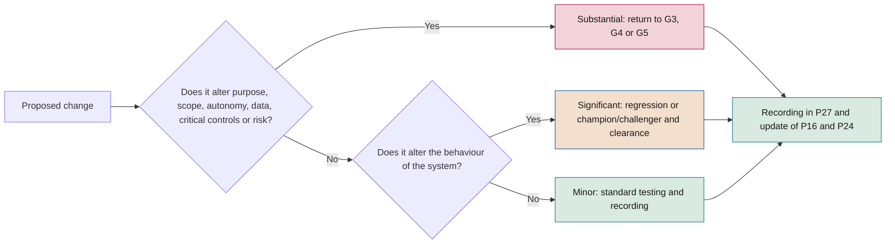
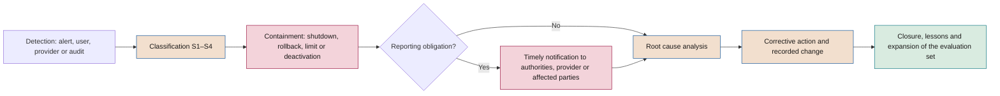

# AI operations manual

**Operation of predictive ML, generative AI, agents and third-party AI: monitoring, changes, incidents, continuity, records and retirement**

| | |
|---|---|
| Document | Document 52 · AI operations manual |
| Version | 0.1 (working draft) |
| Date | 16-09-2026 |
| Author | Fernando García · SEACHAD |
| Status | Draft for review. Thresholds and times are initial references to be calibrated; those for incidents are confirmed in document 37. |

<!-- cifras: 4 | system types with differentiated operation ; 9 | monitoring layers ; 3 | change classes with a gate rule ; 4 | operations templates P24–P27 -->

---

> **Legal notice and disclaimer.** SEVEN-G is a reference methodological framework provided "as is" and for information purposes only. It does not constitute legal, regulatory, financial or professional advice, nor does it guarantee compliance with any law or standard. References to general regulation (such as the EU AI Act, the GDPR, DORA or NIS2), to technical standards and to regulation specific to each sector or jurisdiction may be incomplete, may not apply to a particular case or may become out of date as a result of regulatory changes, interpretations or supervisory positions after their consultation date. **Each organisation that uses SEVEN-G is solely responsible for identifying the regulation that applies to it, verifying that it is current and certifying its own regulatory compliance**, with the appropriate qualified advice. The author and SEACHAD accept no liability for any use made of this content or for any decisions taken on the basis of it. The data, figures, companies and cases in the examples are fictitious or illustrative.

<!-- esencial: siempre | From the moment an initiative goes into production: operations manual, monitoring and alerts, change and incident management, rollback plan and continuity review R6 (six-monthly in Lite, quarterly in Enterprise). Section 14 summarises what changes between Lite and Enterprise. -->

## 1. Purpose and scope

This document develops **phase 6 · Operation and governance** of the lifecycle (01 §6.8) and sets out how AI systems in production are operated so that they **continue to work, deliver value and remain under control**. It is generic: each system specifies what is established here in its operations manual (P24).

It covers:

- The specific operation of each type of system: **predictive ML, generative AI, agents and embedded third-party AI**.
- **Monitoring and alerts** (P25), with metrics and typical thresholds.
- **Change management** and which changes require a return to a *gate*.
- **Incident management** (P26, P27), with the S1–S4 scale, which is developed in document 37.
- Preparation of the **R6 continuity review**.
- The **post-market monitoring** required by regulation.
- **Continuity and rollback**.
- **Records and traceability**, including their retention.
- **Technical retirement**.

**Audience.** AI operations and technical owners, platform and security teams, risk owners and AI auditors.

**It does not cover** the building of solutions (document 53), security controls in detail (document 35) or the contractual management of suppliers (document 36).

This document contains regulatory references and does not constitute legal advice.

---

## 2. Operating principles

1. **An AI system can fail without going down:** quality, drift, bias, cost and actions are monitored, not just availability.
2. **No owner, no production:** every system has an operations owner who can be reached in accordance with its service level.
3. **Every alert has an owner and an action;** otherwise it is noise and is corrected.
4. **Changing means validating again,** in proportion to the effect of the change.
5. **Stopping is always possible,** with a tested procedure; agents have a kill switch.
6. **What is not recorded did not happen.**
7. **The provider changes too,** and its changes are treated as the company's own.

---

## 3. Operating model

### 3.1 Responsibilities

In phase 6 the **AI Operations Owner** is accountable and responsible (01 §8.4). The **technical owner** carries out retraining, evaluations and changes and is accountable for champion/challenger; the **product owner** is accountable for value and adoption at R6; the **risk owner** grants clearance for significant changes at Enterprise; **security** is accountable for the review of agent permissions; the **AI Auditor** verifies tests, permissions, R6 and retirements.

### 3.2 Readiness to operate

G5 cannot be resolved with *Proceed* unless the following exist and have been verified: the **operations manual** (P24), the **monitoring and alerts configuration** (P25) with tested alerts, the **incident response plan** (P26) and an open **incident and change log** (P27), in addition to the **tested rollback plan** (P19). The operations owner **must** have taken part in phase 5 and formally accept the handover.

### 3.3 Operating requirements by autonomy level

| Level | Additional minimum operating requirements |
|---|---|
| **A0 · Assistance** | Quality of outputs and cost; channel for reporting errors. |
| **A1 · Recommendation** | Plus logging of the recommendation and the human decision; human override rate (PER-10). |
| **A2 · Supervised action** | Plus logging of each action with its intent; technical limits; tested kill switch; sample-based review. |
| **A3 · Autonomous action** | Plus real-time anomaly detection; thresholds on aggregates; permissions reviewed quarterly; on-call staff able to shut down. |

---

## 4. Operation by type of system

### 4.1 Predictive ML

#### 4.1.1 Drift

| Type | What changes | How it is detected | Difficulty |
|---|---|---|---|
| **Data drift** | The distribution of the input variables relative to that of training or validation. | Comparison of distributions by variable and overall (for example, population stability index or distances between distributions). | It is detected early and without labels, but not all data drift degrades the model. |
| **Prediction drift** | The distribution of the model's outputs. | Comparison with the reference distribution. | A useful early signal when labels are delayed. |
| **Concept drift** | The relationship between the variables and what is predicted. | Performance against actual labels; business indicators as a proxy. | It requires labels, which may arrive weeks or months late. |

**Rule.** For each model, P25 **must** state the **label delay** and which proxy indicators are used in the meantime. A model with no way of measuring its actual performance within a reasonable time **should** not pass G5.

#### 4.1.2 Retraining

| Mode | When | Conditions |
|---|---|---|
| **Scheduled** | At a fixed frequency defined in P24. | Same validated source data, variables and method; goes through champion/challenger. |
| **Triggered** | When a drift or performance alert justifies it. | The cause is analysed first: retraining does not correct an input data error or a process change. |
| **Automatic** | A pipeline that retrains and proposes without intervention. | Only if the pipeline is validated, the promotion criteria are predefined and, at Enterprise, promotion to production is approved by a person. |

Every retraining: uses data that pass the quality controls (document 51), freezes and versions the dataset, updates P16 and is recorded in P27 as a change.

#### 4.1.3 Champion/challenger validation

| Step | Activity | Criterion |
|---|---|---|
| 1 · Offline evaluation | The new model (challenger) and the current one (champion) are evaluated on the same recent test set, not used in training. | Primary and secondary metrics defined in P24. |
| 2 · Segments and bias | Comparison by relevant segments and bias testing. | The challenger does not worsen beyond the tolerance in any protected segment. |
| 3 · Shadow mode | The challenger receives real data and produces outputs without effect. | Stability, latency, cost and agreement with the champion within expectations. |
| 4 · Phased deployment | Part of the traffic is moved to the challenger, or a controlled test when the design allows it. | No critical alerts during the defined period. |
| 5 · Decision | Promotion, rejection or extension of the test. | Promotion criteria **set before** the evaluation; decision-maker recorded. |
| 6 · Retention | The previous champion remains available for rollback. | For the period defined in P19. |

At Lite, steps 3 and 4 may be omitted if the system is A0 and has no direct exposure, with justification in P27.

### 4.2 Generative AI

#### 4.2.1 Continuous evaluations

- **Reference evaluation set:** representative, difficult, sensitive and adversarial cases (including prompt injection), versioned and expanded with each incident and failure detected.
- **Full regression evaluation** for any change of model, instructions, sources, filters or parameters; without a satisfactory result, the change is not promoted.
- **Periodic evaluation** even when there are no changes by the company, to detect silent changes by the provider.
- **Production sampling** with human review; size and frequency in P25.
- **Evaluator model** only if its agreement with human evaluators has been measured and it is recalibrated periodically.

#### 4.2.2 Response quality and hallucinations

| Dimension | Typical metric |
|---|---|
| **Faithfulness** to the sources or data provided | Responses without unsupported statements (OPE-09; document 51, CNC-04). |
| **Correctness** | Correct responses in the reference set. |
| **Relevance and completeness** | Rating against criteria. |
| **Appropriate refusal** | Rate of unwarranted refusals and of inappropriate responses. |
| **Format and tone** | Compliance with rules. |
| **Content safety** | Findings of harmful content, personal or confidential data per thousand interactions. |

A **hallucination** is a statement presented as true that is not supported by the available data or sources or is false. Its management combines design (source retrieval, mandatory citation, instructions), filters, human oversight in sensitive uses and continuous measurement. A hallucination with an effect on customers or decisions is an **incident**.

#### 4.2.3 Filters

| Filter | What it controls | What is monitored |
|---|---|---|
| **Input** | Prompt injection attempts, personal or confidential data, prohibited content. | Trigger rate and sudden variations in it (possible attack or change of use). |
| **Output** | Personal data, harmful content, prohibited statements (for example, contractual promises), format. | Trigger rate, reported false positives. |
| **Retrieved context** | Instructions embedded in documents or pages (indirect injection). | Detections and originating sources. |

Filters are **critical controls**: deactivating them is a substantial change (section 6) and their failure is an incident.

#### 4.2.4 Consumption-based costs

- **Unit:** cost per useful transaction (query resolved, document processed), not just consumption volume.
- Monthly **budget** per system, with alerts at 80% and 100% as an initial reference.
- **Limits** per user, session and period; maximum context size; maximum calls per task.
- **Anomalies:** rising cost per transaction with no change in use (loops, excessive context, abuse).
- **On reaching the limit:** cost-driven degradation cascade (section 10.3), defined in P24 and validated at G5; complete cut-off only if it does not affect a critical function.
- **Allocation** to the *model consumption* category (document 42) and tracking in T13.

#### 4.2.5 Provider model versions

1. Pin the **exact version** of the model in production (not an alias to the "latest version") and record it in P16.
2. Record announced **deprecation dates** and start the migration with enough time for a full evaluation and champion/challenger.
3. Detect **behavioural changes without a version change** through periodic evaluation and daily control queries.
4. Review notices on **data use and processing location** and reassess in P14 (document 36).

Migration to a new version from the same provider is a **significant change**; migration to another model family or to another provider is a **substantial change** (section 6).

#### 4.2.6 Usage drift

In generative AI and agents there are no fixed input variables or labels with which to measure drift as in predictive ML, but the system also degrades when **what it is asked changes**: new topics, new types of user, queries nobody anticipated. The system was validated at G5 with a specific scope and evaluation set; if actual use moves away from them, the evaluations no longer represent what happens in production.

| Signal | What is compared | How it is measured |
|---|---|---|
| **Distribution of topics or intents** | Breakdown of queries by topic or intent against that of the use validated at G5. | Classification of queries (by rules, by a classifier or by human sampling) and distance between distributions; the same population stability index as in section 4.1.1 is applied to the categories. |
| **Queries outside the validated scope** | Proportion of queries that do not correspond to any validated topic or task. | The classification above or sampling; rate over the total for the period (OPE-19). |
| **Shape of the inputs** | Length, language, channel, document type, tools invoked by agents. | Distributions against the reference. |
| **Retrieval without a relevant source** | Queries for which the search finds no suitable sources. | Rate for the period (document 51, CNC-08). |

**Rule.** P25 **must** set the **usage reference** (topics, intents and scope validated at G5), the way queries are classified and the thresholds. When usage drift exceeds the critical level: the evaluation set is expanded with the new cases and the system is evaluated on them; if the new use falls outside the approved purpose, the scope is restricted or it is treated as a **new use** (table 6.2, return to G3).

> **Why it matters.** An assistant validated for product queries that starts receiving complaints or legal questions still "works" and its evaluations stay green, because they measure what was anticipated, not what is happening. Usage drift is the early signal that the actual risk is no longer the approved one and that the measured value may lie elsewhere.

#### 4.2.7 Bias in responses

Bias is not exclusive to models that score or decide: a generative system can **treat people or groups differently** in the content, tone, recommendations or quality of the response.

| Test | What it detects | How it is done |
|---|---|---|
| **Counterfactual pairs** | Differences in response attributable to a protected attribute (sex, age, origin, disability or others set by the impact assessment) or to a proxy for it (name, language, writing style). | Part of the reference evaluation set (4.2.1) consists of pairs of cases identical except for that attribute; the outcome of each pair is compared against the P25 criteria (decision or recommendation, amount, tone, refusal, completeness). |
| **Quality by segment** | Lower accuracy or more refusals for a group. | Metrics from 4.2.2 broken down by the segments defined in the impact assessment, in the periodic evaluation and in production sampling. |
| **Stereotyped content** | Stereotyped statements or assumptions about groups. | A specific criterion in the human review of the sample and in the output filters. |

**Rules.**

1. The **unequal response rate** (pairs with a material difference ÷ pairs evaluated, OPE-20) is measured in every regression evaluation and in the periodic evaluation; its threshold is set in P17 alongside the human oversight thresholds.
2. It is **mandatory** when the system recommends, prioritises, drafts communications or decides about people, or has direct exposure to customers; for other systems, when the risk assessment indicates it (document 33).
3. A change of model, instructions or sources is not promoted if it worsens this rate beyond the tolerance, just like the challenger in predictive ML (4.1.3, step 2).

> **Why it matters.** In generative AI, bias does not appear in a results column that can be counted; it appears in how things are drafted, recommended or refused. Without a test designed for it, it goes unseen, and it is precisely what a regulator, an affected customer or the media will see.

### 4.3 Agents

The design controls for agents (identity, permissions, intent-based access control, kill switch) are defined in document 35 and assessed with T10. This section sets out how they are operated.

#### 4.3.1 Action monitoring

Each action by an agent **must** record: the agent's own identity (not shared with people) and version; the user or process on whose behalf it acts; the **declared intent** (task objective and justification for the action); the tool, operation and data used; the result and effect; prior human validation and who gave it, if applicable; a timestamp and a correlation identifier to reconstruct the sequence.

#### 4.3.2 Limits

- **Per action:** amount, number of recipients, types of data.
- **Per period:** number of actions, cumulative spend, operations on the same customer or record.
- **Scope:** permitted systems, environments and functions.
- **Execution:** maximum steps, time and retries per task.
- **Escalation:** actions that always require human validation, whatever the autonomy.

Limits are enforced **technically outside the agent** (in the tools, gateways or permissions), not only through instructions to the model. An action blocked by a limit is logged and, as per P25, generates an alert.

#### 4.3.3 Intent anomalies

An **intent anomaly** is an action or sequence that is not consistent with the declared objective of the task.

| Signal | Typical response |
|---|---|
| Tools that do not correspond to the task (possible injection or planning error). | Blocking of the action and review. |
| Access to data or systems out of scope. | Blocking, critical alert, security review. |
| Instructions originating from processed external content (indirect injection). | Blocking and analysis of the source. |
| Loops or repetition of the same action. | Cut-off by execution limit. |
| Sudden growth in the volume of actions or cost. | Pausing of the agent and review. |
| Attempt to extend its permissions or modify its limits. | Shutdown of the agent; incident of at least S2. |

#### 4.3.4 Kill switch

- **Levels:** per action, session, agent and set of agents of a given type.
- **Who activates it:** the operations owner, the designated human supervisor and security, **without prior approval**.
- **Effect:** stops new actions, cancels pending ones, revokes temporary credentials and leaves the systems in the consistent state defined in P24, within a target time set in P25.
- **Testing:** quarterly at Enterprise, half-yearly at Lite and after each significant or substantial change (OPE-12).
- **Reactivation:** after root cause analysis, with the approval of the operations owner and, if there was an S1 or S2 incident, of the risk owner.

#### 4.3.5 Permission review

1. Inventory of each agent's **non-human identities**, with an owner.
2. **Least privilege**: each permission is justified by a task of the agent.
3. **Short-lived credentials** wherever the platform allows it.
4. **Quarterly** review for A2–A3 and **half-yearly** for A0–A1 (OPE-13).
5. Removal of permissions **not used** within the defined period (initial reference: 90 days).
6. Any extension of permissions that enables **new effects** on third parties, money, personal data or production systems is a **substantial change**.

### 4.4 Embedded third-party AI

Software from a supplier with AI functions that take part in the company's processes (01 §1.2).

- **New AI functions activated by the supplier**, sometimes by default: review of release notes, verification of the configuration after each version and deactivation pending assessment where the contract allows it.
- **Model or behavioural changes without notice:** process outcome indicators, sampling and regression testing before relevant updates.
- **Lack of logs:** contractual requirement for access to logs and support in incidents (document 36).
- **Changes in data processing** (location, sub-processors, training): reassessment in P14.
- **Supplier incidents:** notification channel and time limits in P26.

The intensity of these controls depends on the requirement level for the third party: **N1 Standard · N2 Enhanced · N3 Critical** (document 36).

---

## 5. Monitoring and alerts (P25)

### 5.1 Monitoring layers

| Layer | What is monitored | Applies to |
|---|---|---|
| 1 · Availability and infrastructure | Availability, latency, errors, capacity. | All |
| 2 · Input data quality | Nulls, ranges, schema, freshness, volume. | All |
| 3 · Drift | Data, predictions and concept (4.1.1); usage: topics, intents and queries outside the validated scope (4.2.6). | Data, predictions and concept: predictive ML. Usage: generative AI and agents |
| 4 · Model performance | Metrics against the G5 validation, by segment. | Predictive ML |
| 5 · Response quality | Faithfulness, correctness, appropriate refusal, currency of sources; bias in responses (4.2.7). | Generative AI |
| 6 · Actions and limits | Actions, blocks, intent anomalies, permissions. | Agents |
| 7 · Security | Filter triggers, injection attempts, improper access. | All, with emphasis on generative AI and agents |
| 8 · Cost | Consumption, cost per transaction, budget. | All, with emphasis on generative AI and agents |
| 9 · Human oversight, use and value | Human override rate, adoption, value hypothesis indicators, bias. | All |

### 5.2 Typical metrics and thresholds

The values are **illustrative and to be calibrated** for each system in phase 5 on the basis of its baseline. The severity shown is the initial severity of the incident if an effect is confirmed; the final classification follows section 7.

| Layer | Metric | Warning | Critical | Initial severity if there is an effect |
|---|---|---|---|---|
| 1 | Monthly availability against the service level | Below target in the partial period | Breach of the service level | S3; S2 if it is a critical function |
| 1 | 95th percentile latency | > target for 15 min | > 2 × target for 15 min | S4–S3 |
| 2 | Proportion of nulls in critical variables | > 2 × 30-day average | > phase 3 quality threshold | S3 |
| 2 | Age of input data | > planned update interval | > 2 × interval | S3 |
| 3 | Population stability index by variable | > 0.1 | > 0.25 | S4–S3 (common convention in practice; to be calibrated) |
| 3 | Stability index of the distribution of topics or intents | > 0.1 | > 0.25 | S4–S3 (to be calibrated) |
| 3 | Queries outside the validated scope | > 2 × G5 reference | > 3 × G5 reference or > 10% of queries | S3; S2 if the new use affects people or regulated topics |
| 4 | Primary metric against G5 validation | Relative drop > 5% | Relative drop > 10% | S3; S2 if it affects decisions about people or customers |
| 4 | Adverse impact ratio between groups | < P17 threshold + margin | < P17 threshold | S2 |
| 5 | Faithfulness to sources in sampling | < target − 2 points | < target − 5 points | S3; S2 with direct exposure |
| 5 | Responses with outdated content | > 0 on regulated or contractual topics | Repetition after correction | S3–S2 |
| 5 | Unequal response rate in counterfactual pairs | > P17 threshold − margin | > P17 threshold | S3; S2 if there are decisions or communications about people |
| 6 | Actions blocked by limits | > 2 × 7-day average | Any attempt to exceed an amount or scope limit | S3; S2 if there is an attempt to extend permissions |
| 6 | Intent anomalies | Any unexplained anomaly | Anomaly with an effect on third parties, money, personal data or production | S2; S1 if there is material harm |
| 7 | Input filter triggers | > 3 × 7-day average | Sustained attack pattern | S3–S2 |
| 7 | Exposure of personal or confidential data | — | Any confirmed case | S2; S1 if it is massive or involves special categories |
| 8 | Monthly cost against budget | ≥ 80% | ≥ 100% | S4–S3 |
| 8 | Cost per transaction | > 1.5 × 30-day average | > 3 × 30-day average | S3 |
| 8 | Operation in cost-driven degraded mode | Any activation | > 5 days in the month or quality in the mode below the P25 minimum | S4; S3 if quality falls below the minimum |
| 9 | Human override rate | Close to 0% for 30 days | — | Review at R6 |
| 9 | Primary value indicator | Below the hypothesis for two consecutive periods | Below the stop criterion | Review at R6; brings G7 forward |

### 5.3 Alert design rules

1. Each alert has an **owner**, a **procedure** in P24 and an **initial severity**.
2. Critical alerts reach a person who can be contacted during the system's hours of operation.
3. They are **tested** before G5 and after each change that affects them.
4. **Noise** is measured (OPE-16) and thresholds are reviewed at each R6.
5. A deactivated or silenced alert is recorded in P27 with the reason, owner and reactivation date.

---

## 6. Change management

### 6.1 Change classes

| Class | Definition | Examples | What it requires |
|---|---|---|---|
| **Minor** | Does not alter the behaviour of the system or its controls. | Infrastructure scaling; security patch with no functional change; correction of a dashboard. | Standard testing; approval by the operations owner; recording in P27. |
| **Significant** | Alters behaviour within the approved purpose, scope, autonomy and risks. | Retraining with the same source data and method; new version of the model from the same provider and family; change of system instructions; new knowledge sources of the same type and permissions; adjustment of thresholds within approved ranges. | Regression evaluation or champion/challenger; update of P16 and P24; risk owner clearance at Enterprise; report at the next R6; verification by the auditor by sampling. |
| **Substantial** | Alters the approved purpose, scope, autonomy, data, critical controls or risk profile. | See table 6.2. | **Return to *gate*** as per table 6.2. |

In case of doubt between two classes, the **higher** one applies.

### 6.2 Substantial changes and the *gate* to return to

| Change | Return to | Reason |
|---|---|---|
| New purpose or new use of the system | **G3** | Value, risk and possibly the regulatory classification change. |
| Extension to new groups, countries, channels or customers | **G3** (or a new phase 0 if decided as scaling at G7) | Exposure, regulation and effect on people change. |
| Increase in the autonomy level (for example, from A1 to A2) | **G4 and G5** | Human oversight, limits and security change. |
| New agent tools or permissions with effects on third parties, money, personal data or production | **G4 and G5** | The surface for action changes. |
| New categories of personal data, special categories or new sources with personal data | **G3** | Legal basis and impact assessment. |
| Change of variables in systems that make decisions about people | **G4 and G5** | Bias testing and information to worker representatives (document 50). |
| Change of provider or model family | **G5** (and **G3** if the requirement level for the third party changes) | Full evaluation and supplier assessment. |
| Deactivation or replacement of a critical control (filters, human oversight, limits) | **G4 and G5** | Critical controls do not admit conditions (01 §7.3). |
| Change that may alter the regulatory classification or the intensity | **G3** | New classification (T07) and intensity determination (T04). |
| Modification that may be considered substantial under the EU AI Act in a high-risk system | **G3**, with legal analysis | May require a new conformity assessment and, in certain cases, turn the deployer into a provider (Arts. 3(23) and 25; document 34). |

<!-- grafico: Classification of a change | The class determines the validation; substantial changes return to a gate -->

### 6.3 Emergency changes

- They are permitted in order to **contain an incident**. They may be applied before their ordinary approval.
- **They may only reduce** functionality, autonomy, scope or permissions (shutdown, rollback, deactivation of a function, stricter limits). Never extend them.
- They are recorded in P27 within a maximum of 24 hours and reviewed within 5 working days, with a decision on whether they are consolidated, reverted or processed as an ordinary change.

### 6.4 Rules

1. A substantial change applied without returning to the corresponding *gate* is a **major nonconformity**; if it affects a critical control or a high-risk system, it is **critical** (01 §12).
2. Every change to a system that affects working conditions triggers a review of whether the information provided to worker representatives must be updated (document 50, section 7).
3. Provider changes are classified using the same rules as the company's own changes.
4. **Activating a planned degraded mode** defined in P24 and validated at G5, including switching to a fallback model under section 10.3, **is not a change**: it is an approved operating mode and is recorded in P27 as an operational event. Adding a new fallback model or modifying its conditions of use is a change: **significant** if it is from the same family and provider already assessed; **substantial** otherwise (table 6.2).

---

## 7. Incident management

The complete process, the definitive time limits and the relationship with nonconformities are set out in document 37. This section establishes what is needed to operate.

### 7.1 What an AI incident is

Any event that produces or may produce an undesired effect owing to the operation or use of an AI system, **even if the system is available**: erroneous outputs with an effect, bias, hallucinations with consequences, unauthorised actions by agents, exposure of information, anomalous costs, control failures, attacks and outages.

### 7.2 Severity

| Severity | Criterion | Illustrative examples | Indicative response times (37 §4.3) | Reports to |
|---|---|---|---|---|
| **S1 · Critical** | Possible serious incident under the EU AI Act; serious incident under DORA or NIS2 where applicable; significant material harm to people, customers, money or rights; or loss of control of a system that acts. | Agent executing unauthorised payments or communications to customers; systematic discrimination in decisions about people; massive exposure of personal data. | Triage within 1 hour, at any time; immediate coordinator; AI Committee within 4 hours; board committee within 24 hours. | AI Committee and board committee; authorities where appropriate. |
| **S2 · High** | Impact 4 on any axis; personal data breach reportable to the authority without a high risk to individuals; repeated errors visible to customers; compromise of an agent identity contained before it has any effect; failure of a critical control without harm; relevant incident at an N3 supplier. | Erroneous responses to customers about contractual terms; kill switch that does not work in testing; attempt by an agent to extend its permissions. | Triage within 4 hours; immediate coordinator; AI Committee within 24 hours; board committee in the quarterly report. | AI Committee (24 hours); board committee (quarterly report). |
| **S3 · Medium** | Impact 3; degradation beyond threshold in a relevant process; successful prompt injection without any sensitive action; limited internal leakage with no risk to individuals. | Critical drift with human review correcting the outputs; filter failing in isolated cases. | Triage within 1 working day; planned resolution; AI Committee in the monthly report; board committee in the quarterly report. | AI Committee (monthly report); board committee (quarterly report). |
| **S4 · Low** | No effect on users or decisions. | Warning alerts; minor formatting defects. | Triage within 5 working days; analysis at R6. | Recording in P27; AI Committee (monthly report). |

Severity is assigned on **detection** using the most severe criterion met (one is enough; impact axes from document 33 §4.2, criteria from 37 §4.2) and reviewed once the scope is known. In case of doubt, the higher one is assigned.

### 7.3 Flow

<!-- grafico: Flow of an AI incident | Contain first, report on time and always learn -->

### 7.4 Regulatory notifications

Consulted in September 2026; time limits and cases are detailed in documents 34 and 37.

| Regulation | Case | Reference |
|---|---|---|
| **EU AI Act** | Serious incidents involving high-risk systems: notification by the provider to the market surveillance authority, with a general maximum time limit of 15 days from becoming aware and shorter time limits in the most serious cases. A deployer that detects a serious incident immediately informs the provider. | Arts. 73 and 26(5) |
| **GDPR** | Personal data breach: notification to the supervisory authority without undue delay and, where feasible, within 72 hours; communication to data subjects if there is a high risk. | Arts. 33 and 34 |
| **NIS2** (as transposed) | Significant incidents: early warning within 24 hours and notification within 72 hours. | Art. 23 of Directive (EU) 2022/2555 |
| **DORA** | Major ICT-related incidents in financial entities, with the time limits in its technical standards. | Regulation (EU) 2022/2554 |
| **Sector-specific regulation** | As per the context statement. | P02 |

For each system, P26 **must** identify which notifications may apply, who decides whether notification is required and who notifies.

### 7.5 Relationship with nonconformities

An incident may reveal a breach of the framework (for example, a substantial change without a *gate* or a deactivated critical control). In that case a **nonconformity** is also opened, with its own scale: minor, major or critical (01 §12). Both are recorded in T08 and linked.

---

## 8. R6 continuity review

### 8.1 Frequency

At least **quarterly at Enterprise** and **half-yearly at Lite** (01 §6.8). It is brought forward after an S1 or S2 incident, a substantial change or a relevant change by the provider.

### 8.2 R6 package

The product owner and the operations owner prepare, with the data for the period:

| Block | Content |
|---|---|
| **Value** (P28, T12) | Realised value against the hypothesis with its status; stop criteria. |
| **Released capacity** (T20) | Hours released, realised, reassigned and pending a decision. |
| **Cost** (T13) | Actual cost against budget; cost per transaction; activations and days in cost-driven degraded mode, with the quality during the mode (OPE-18). |
| **Stability, performance and quality** (P25) | Availability, critical alerts and noise; model or response metrics; drift, including usage drift (OPE-19); bias, including in responses (OPE-20). |
| **Incidents and changes** (P27, T08) | Incidents by severity and actions; open nonconformities; changes by class and by the provider. |
| **Agents** (P25, T10) | Blocked actions, anomalies, kill switch test, permission review. |
| **Human oversight and adoption** (document 50) | Human override rate, adoption, supervisor training. |
| **Risk and compliance** (P11, P12, T04, T07) | Risks; currency of classification, intensity and impact assessments; information to worker representatives. |
| **Continuity** (P19, P14) | Latest rollback test; supplier situation. |
| **Proposal** | Proceed with operation, Proceed with conditions or Bring G7 forward (01 §7.3), with reasons. |

The package is documented with P65. The `R6.<nn>` criteria are coded in document 21.

### 8.3 Outcomes

| Outcome | When |
|---|---|
| **Proceed with operation** | Value, stability, risk and compliance within what was approved. |
| **Proceed with conditions** | Non-critical deviations with an action, deadline and owner. Not permitted for critical controls, legal compliance or human oversight. |
| **Bring G7 forward** | Relevant deviation in value (stop criterion reached), increase in risk or a better alternative. |

If at G7 it is decided to keep the system unchanged, this is recorded as *Iterate* with a return to phase 6 (21 §5.3). If an unacceptable risk is detected during the review, G7 is not awaited: the incident procedure is activated and, where appropriate, the shutdown.

Omitting an R6 is a **major nonconformity** (01 §12).

---

## 9. Post-market monitoring

The EU AI Act requires **providers** of high-risk systems to establish and document a **post-market monitoring system**, based on a plan, that actively and systematically collects and analyses data on the performance of the system throughout its lifetime in order to evaluate continuous compliance (Art. 72). **Deployers** must monitor operation in accordance with the instructions for use, inform the provider where appropriate and, if they consider that the use may present a risk, inform and suspend use (Art. 26(5)). High-risk obligations apply from 2 December 2027 (Annex III) and 2 August 2028 (Annex I), following Regulation (EU) 2026/1744; the timetable and the other amendments are addressed in document 34 (§3.1 and §3.2).

- **As a provider** (including where it becomes one through substantial modification or change of purpose): monitoring plan integrated into P24 and P25, with the data collected, their periodic analysis and the connection with risks, changes, incidents and R6.
- **As a deployer:** monitoring in accordance with the provider's instructions, a channel for informing the provider, a suspension criterion and retention of logs (P25, P26).
- **Systems that are not high-risk:** the monitoring in section 5 fulfils an equivalent function.

This document does not constitute legal advice.

---

## 10. Continuity and rollback

### 10.1 Degraded operating modes

| Mode | When |
|---|---|
| Validated **previous version** (model, instructions, configuration) | Degradation after a change. |
| **Alternative without AI** (rules, manual process, previous system) | Failure of the system or the provider; S1–S2 incident. |
| **Reduced autonomy** (from A2–A3 to A1) | Intent anomalies; doubts about limits. |
| **Reduced scope** to lower-risk cases or channels | Problems in a segment. |
| Previously assessed **alternative provider**; if not assessed, it is a substantial change | Prolonged unavailability or withdrawal of the provider. |
| Lower-cost **fallback model**, validated at G5 (section 10.3) | Consumption budget exhausted or month-end forecast above 100%; volume or price peaks. |

### 10.2 Rules

1. The **rollback plan** (P19) is tested before G5 and **periodically** in production: at least annually at Lite and half-yearly at Enterprise, and after each substantial change (OPE-15).
2. The plan identifies the **people and capabilities** needed to operate without the system and is coordinated with document 50 (section 5.4).
3. For systems that support a **critical or important function**, the maximum recovery time and the maximum tolerable data loss are set in P24 and aligned with the business continuity plan and, where applicable, with DORA.
4. **Dependence on a provider** is assessed in P14 with an exit strategy (document 36).

### 10.3 Cost-driven degradation cascade

Systems with variable consumption (generative AI and agents) **must** have defined in P24 what happens when consumption reaches the budget, so that the response is neither improvised nor an abrupt cut-off. Degradation follows a **cascade** of levels, from least to most restrictive:

| Level | What is done | Condition for using it |
|---|---|---|
| **N0 · Normal operation** | Primary model and configuration approved at G5. | — |
| **N1 · Optimisation without a model change** | Stricter limits per user and session, shorter context, reuse of responses, batch processing of non-urgent work. | Parameters and ranges approved at G5 (threshold adjustment within range). |
| **N2 · Fallback model** | Part or all of the traffic moves to a lower-cost model. | Model **evaluated before G5** with the same reference evaluation set (4.2.1), including the bias tests (4.2.7), with a result within the P25 minimum quality; version pinned and recorded in P16. |
| **N3 · Reduced scope** | The system handles only the lowest-risk or highest-value cases or channels; the rest go to people. | Allocation criterion defined in P24 and people available (document 50). |
| **N4 · Alternative without AI** | Manual process, rules or previous system. | Tested rollback plan (P19). |

**Rules.**

1. The levels, their triggers (for example, N1 at 80% of the budget, N2 at 100%) and who activates them are set in P24; their activation is tested before G5 together with the rollback plan.
2. **No model downgrade** (N2) in uses that decide or recommend about people, in critical or important functions or in high-risk systems, unless the fallback model has been validated for that use to the same standard as the primary one; in those cases the system moves directly to N3 or N4, or a budget supplement is approved (document 42, section 8.1).
3. In N2, **quality is monitored more intensively**: production sampling at least doubled and an alert if it falls below the P25 minimum; if it does, the system moves to the next level.
4. Each activation and each return to N0 is recorded in P27 with the date, level, reason, who decides and the quality measured during the mode. The return to N0 is authorised by the operations owner when there is budget or the cause has been corrected.
5. If the system spends more than a month in N2 or a higher level, the budget or the design is wrongly sized: it is taken to the next R6 with a proposal (supplement, permanent optimisation under document 42, section 8.5, or a change of the primary model as an ordinary change).
6. No degradation may **deactivate critical controls** (filters, human oversight, agent limits, records): the cascade reduces cost, not controls.

**Illustrative example** (fictitious figures). Customer service assistant with a monthly budget of €12,000. On day 20 consumption reaches €9,600 (80%) and the month-end forecast is €14,400: N1 is activated (shorter context and reuse of frequent responses) and the forecast falls to €13,100. On day 26 consumption reaches 100%: informational queries move to N2, with a fallback model validated at G5 that costs 70% less, while complaints remain on the primary model. Sampling on those days gives an accuracy of 91% against the P25 minimum of 88%. The month closes at €12,600 (105%), with six days in N1 and five in N2, and the R6 decides to adjust the budget to the actual growth in volume.

> **Why it matters.** Without a defined cascade, when the budget runs out only two bad options remain: cut the service or keep spending without control. With it, cost is contained without improvisation and without touching the controls, the board knows what quality is delivered at each level, and the organisation learns whether the budget or the design was wrongly sized.

---

## 11. Records and traceability

### 11.1 What is recorded

- **All systems:** inputs (or their reference) and outputs with the model and instruction version and a timestamp, with minimisation; alerts and action taken; changes and incidents (P27, T08); results of evaluations and of champion/challenger.
- **A1–A3 and decisions about people:** recommendation, human decision, who decides and the reason for any override.
- **A2–A3 agents:** the fields in section 4.3.1.
- **Generative AI:** sources and versions retrieved for each response; filter triggers and blocks.

### 11.2 Retention

| Reference | What it establishes | Rule in SEVEN-G |
|---|---|---|
| **EU AI Act, Arts. 12, 19 and 26(6)** | High-risk systems allow for the automatic recording of events. Providers and deployers keep the automatically generated logs under their control for a period appropriate to the intended purpose, **of at least six months**, unless otherwise provided by other applicable law. | Minimum of six months for high-risk systems, extendable according to the purpose, sector-specific regulation and claim periods. |
| **EU AI Act, Art. 18** | Providers of high-risk systems keep the technical documentation and other documentation for ten years after the system has been placed on the market or put into service. | Applies when the company is a provider. |
| **GDPR, Art. 5(1)(c) and (e)** | Data minimisation and storage limitation. | Logs containing personal data are limited to what is necessary, with pseudonymisation where possible and a defined retention period. |
| **Sector-specific and commercial regulation** | Their own time limits (for example, in financial services). | Incorporated into the context statement (P02). |
| **Claim and limitation periods** | Periods during which it may be necessary to substantiate a decision. | Considered with legal counsel for decisions about people and customers. |

**Integrity rules.** Records are protected against modification, with restricted and traced access; their deletion when the period expires is automatic and logged. In the event of an incident, complaint or investigation, **deletion is blocked** for the records concerned.

This document does not constitute legal advice.

---

## 12. Technical retirement

The decision to retire is taken at G7 and documented in P30; its management is supported by T22. This section sets out the technical execution.

1. **Preparation:** replacement or alternative without AI operational, people trained and communication carried out (P30).
2. **Freeze:** no changes except emergencies; capture of the final state and metrics (P27).
3. **Progressive disconnection:** removal of traffic and of the integrations and processes that consume outputs.
4. **Agents:** kill switch, cancellation of tasks and **revocation of all credentials and non-human identities**, with logging.
5. **Data:** deletion, anonymisation or archiving as per G7 and the retention periods (document 51, section 4.5), with a record of deletion.
6. **Models, instructions and indexes:** archiving of the final version where appropriate; deletion of indexes derived from sources containing personal data; P16 with status *retired*.
7. **Records:** retained until the end of their period (section 11.2); never deleted with the retirement.
8. **Suppliers:** termination of services, confirmation of data deletion by the supplier, closure of licences and consumption (document 36).
9. **Inventory and register:** status *Retired* in T01 and T02 with date, coded reason, deciding body and replacement.
10. **Subsequent verification:** after a defined period, check that no access, costs or dependent processes remain; closure note verified by the AI Auditor at Enterprise.

---

## 13. Operations indicators

The codes are provisional until they are consolidated in document 41. The thresholds are **indicative and to be calibrated**.

| Code | Indicator | Formula | Frequency | Indicative reference |
|---|---|---|---|---|
| **OPE-01** | Availability | Time available ÷ time committed in the service level | Monthly | As per service level |
| **OPE-02** | Monitoring coverage | Systems in production with a current P25 and tested alerts ÷ systems in production | Quarterly | 100% |
| **OPE-03** | Mean time to detect | Σ (time of detection − time of onset) ÷ number of incidents | Quarterly | Downward trend |
| **OPE-04** | Mean time to contain | Σ (time of containment − time of detection) ÷ number of incidents, by severity | Quarterly | Within the references in 7.2 |
| **OPE-05** | Incidents by severity | S1, S2, S3 and S4 incidents ÷ systems in production, per quarter | Quarterly | Trend |
| **OPE-06** | Substantial changes without a *gate* | Substantial changes applied without returning to the *gate* ÷ substantial changes | Quarterly | 0% |
| **OPE-07** | Failed change rate | Changes reverted or giving rise to an incident ÷ changes applied | Quarterly | Downward trend |
| **OPE-08** | Untreated drift | Models with drift at critical level with no action recorded within the P25 time limit ÷ monitored models | Monthly | 0% |
| **OPE-09** | Responses with unsupported statements | Evaluated responses with at least one unsupported statement ÷ evaluated responses | Monthly | Threshold per system |
| **OPE-10** | Cost per transaction and variance | Operating cost for the period ÷ useful transactions; and actual cost ÷ budget | Monthly | As per hypothesis and budget |
| **OPE-11** | Blocked agent actions | Actions blocked by limits ÷ actions attempted; and intent anomalies reviewed ÷ detected | Monthly | 100% of anomalies reviewed |
| **OPE-12** | Tested kill switch | A2–A3 agents with a kill switch test on time and passed ÷ A2–A3 agents | Quarterly | 100% |
| **OPE-13** | Reviewed agent permissions | Agent identities reviewed on time ÷ agent identities | Quarterly | 100% |
| **OPE-14** | R6 on time | Continuity reviews carried out on time ÷ reviews due | Quarterly | 100% |
| **OPE-15** | Tested rollback | Systems with a rollback test on time ÷ systems in production | Half-yearly | 100% |
| **OPE-16** | Alert noise | Alerts closed without action ÷ alerts generated | Monthly | Downward trend |
| **OPE-17** | Supplier versions at risk | Systems whose provider model version has an announced deprecation with no migration plan ÷ systems with a provider model | Monthly | 0% |
| **OPE-18** | Cost-driven degraded mode | Days in the period at N1 or above in the cascade (10.3), by level; and quality measured in the mode ÷ P25 minimum quality | Monthly | Downward trend; quality ≥ 100% of the minimum |
| **OPE-19** | Queries outside the validated scope | Queries classified outside the topics or tasks validated at G5 ÷ queries in the period | Monthly | According to the G5 reference |
| **OPE-20** | Unequal responses in counterfactual pairs | Pairs with a material difference in outcome ÷ pairs evaluated | At each regression and periodic evaluation | P17 threshold |

---

## 14. Lite and Enterprise operation

| Aspect | Lite | Enterprise |
|---|---|---|
| Operations manual (P24) | Simplified | Complete |
| Monitoring layers | 1, 2, 5 or 4 depending on type, 8 and 9 | All applicable |
| Continuous evaluation of generative AI | Periodic and upon changes | Periodic, upon changes and with production sampling |
| Champion/challenger | Steps 1, 2, 5 and 6 | Complete |
| Significant changes | Approval by the operations owner | Risk owner clearance |
| On-call | Working hours, except A2–A3 | According to the system's hours of operation |
| Kill switch test | Half-yearly | Quarterly |
| Agent permission review | Half-yearly | Quarterly |
| Rollback test | Annual | Half-yearly |
| Cost-driven degradation (10.3) | At least N1 and N4 defined; N2 optional | Full cascade defined and tested before G5 |
| Usage drift (4.2.6) | Queries outside the scope by sampling | Distribution of topics and queries outside the scope with systematic classification |
| Bias in responses (4.2.7) | When there are decisions or communications about people or direct exposure | The same, and whenever the risk assessment indicates it |
| R6 | Half-yearly | Quarterly |
| Verification | AI Office; auditor by sampling | AI Auditor |

---

## 15. Associated tools and templates

### 15.1 Operations templates

| Code | Template | Minimum content | Reviewed at |
|---|---|---|---|
| **P24** | Operations manual | Description of the system and type; autonomy level; service levels; responsibilities and on-call; procedures per alert; retraining or continuous evaluation; agent limits and shutdown; degraded modes and cost-driven degradation cascade with its triggers; costs and consumption limits; records and retention; dependencies and suppliers; post-market monitoring plan where applicable; maximum recovery time for critical functions. | G5, R6, after significant and substantial changes |
| **P25** | Monitoring and alerts configuration | Metrics per layer; baseline; warning and critical thresholds; initial severity; owner; procedure; label delay; usage reference and query classification; reference evaluation set with counterfactual pairs and sampling; minimum quality in degraded mode; result of the alert test. | G5, R6 |
| **P26** | Incident response plan | S1–S4 criteria applied to the system; contacts and escalation; pre-approved containment actions; applicable notifications with owner and time limit; communication to users, affected parties and the supplier; relationship with the continuity plan. | G5, R6, after each S1–S2 incident |
| **P27** | Incident and change log | Changes: class, description, validation, approval, *gate* where applicable, date. Incidents: severity, timeline, containment, notifications, root cause, actions, closure, link to nonconformity. | Continuous; R6 |

### 15.2 Other tools and templates

- **Tools:** T08 (incidents and nonconformities, supporting P27), T10 (agent security), T13 (operating costs), T12 (value at R6), T22 (retirements), T02, T04 and T07 (currency of inventory, intensity and classification).
- **Templates:** P16 (lineage, updated with each change), P19 (rollback), P28 (value at R6), P29 (R6 outcome and returns to *gate*), P30 (retirement), P65 (R6 continuity review package, section 8.2).

---

## 16. Related documents

| Document | Relationship |
|---|---|
| **01 and 03 · Methodology and register** | Phase 6, R6, *gate* rules, nonconformities; statuses and events. |
| **21 and 33 · *Gate* criteria and risks** | R6 and G5 criteria; risk register in operation. |
| **34 · Regulatory mapping** | Post-market monitoring, logs, serious incidents and substantial modification. |
| **35 and 36 · Security and third parties** | Design of agent controls; N1–N3 levels and exit strategy. |
| **37 · Nonconformities and incidents** | Complete process, S1–S4 scale and definitive time limits. |
| **41 and 42 · Indicators and costs** | OPE indicators; operating and consumption costs. |
| **50 and 51 · People; data and knowledge** | Human oversight and capabilities; quality, currency, lineage and retention. |
| **53 · Building solutions with AI** | What operations receives at G5. |

---

## 17. Version control

| Version | Date | Changes |
|---|---|---|
| 0.1 | 16-09-2026 | First version. Defines the operation of predictive ML (drift, retraining, champion/challenger), generative AI (continuous evaluations, quality, hallucinations, filters, costs, provider versions), agents (actions, limits, intent anomalies, kill switch, permissions) and embedded third-party AI; nine monitoring layers with typical thresholds; three change classes with a return-to-*gate* table; S1–S4 incident operation with regulatory notifications; R6 package and outcomes; post-market monitoring; continuity and rollback; records and retention; technical retirement; seventeen indicators and the minimum content of P24–P27. Consistency adjustments with 01 (segregation of duties at Lite, R6 outcomes, agents criterion) and with 34 and 37. |
| 0.1 | 18-09-2026 | Usage drift in generative AI and agents (4.2.6); bias in responses with counterfactual pairs (4.2.7); layers 3 and 5 and thresholds extended; activating a planned degraded mode is not a change (6.4); cost-driven degradation cascade N0–N4 with a fallback model validated at G5 (10.3); indicators OPE-18 to OPE-20; Lite and Enterprise requirements and content of P24 and P25. |
