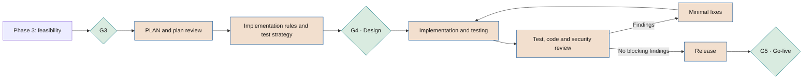

# Building solutions with AI

**How design, code and tests generated with AI assistance are governed in phases 4 and 5, and how SPAD is used**

| | |
|---|---|
| Document | Document 53 · Building solutions with AI |
| Version | 0.1 (working draft) |
| Date | 16-09-2026 |
| Author | Fernando García · SEACHAD |
| Status | Draft for review. Contains regulatory references consulted on 16-09-2026. |

<!-- cifras: 2 | phases in which it applies (4 and 5) ; 6 | minimum requirements for AI-generated code ; 7 | SPAD roles mapped ; 0 | approvals an AI can give -->

> This document does not constitute legal advice. Intellectual property, licensing and data protection matters must be validated with qualified legal counsel.

---

> **Legal notice and disclaimer.** SEVEN-G is a reference methodological framework provided "as is" and for information purposes only. It does not constitute legal, regulatory, financial or professional advice, nor does it guarantee compliance with any law or standard. References to general regulation (such as the EU AI Act, the GDPR, DORA or NIS2), to technical standards and to regulation specific to each sector or jurisdiction may be incomplete, may not apply to a particular case or may become out of date as a result of regulatory changes, interpretations or supervisory positions after their consultation date. **Each organisation that uses SEVEN-G is solely responsible for identifying the regulation that applies to it, verifying that it is current and certifying its own regulatory compliance**, with the appropriate qualified advice. The author and SEACHAD accept no liability for any use made of this content or for any decisions taken on the basis of it. The data, figures, companies and cases in the examples are fictitious or illustrative.

## 1. Purpose and scope

### 1.1 What it governs

More and more solutions are **built with AI assistance**: coding assistants, agents that write and execute code, models that generate tests, configurations, queries or documentation. This happens whether or not the resulting solution is an AI system.

This document sets out:

1. The **minimum requirements** that SEVEN-G imposes on every AI-generated artefact that forms part of a solution (section 7).
2. How **SPAD** is used as an engineering method in phases 4 and 5, and how its phases, roles and validation policy produce SEVEN-G evidence (sections 3 to 6).
3. The distinction between the **AI Reviewer** (a tool) and the **AI Auditor** (an independent person) (section 5).

### 1.2 What it does not govern

- The governance of the initiative, its *gates* and its value: these are set by document 01.
- Corporate use of AI assistants outside projects: document 31.
- The security of agents in production: document 35.
- The assessment of AI tool suppliers: document 36 and P14.

### 1.3 Two distinct objects

| Object | What it is | Where it is governed |
|---|---|---|
| **The system being built** | The initiative's solution (which may or may not be an AI system). | Lifecycle 0–7, regulatory classification (document 34), P15–P23. |
| **The AI tools that help build it** | Assistants, agents and models used by the team. | Inventory (T02) as corporate or team use; policy (document 31); supplier (P14); this document. |

A build tool with the ability to execute actions on repositories, environments or systems is an **agent** and is classified under autonomy levels A0–A3 (document 35). If it acts on production systems or personal data at level A2 or A3, the initiative meets the Enterprise criterion in 01 §9.2.

---

## 2. Relationship between SEVEN-G and SPAD

### 2.1 Position of SPAD

**SPAD** (*Structured Prompt-Driven Engineering*) is an **independent methodology** for AI-assisted engineering, referenced from SEVEN-G and not integrated into it (decision D09). It is not a brand, a component or a "capability" of SEVEN-G. SEVEN-G can be applied with SPAD or with another engineering method that meets the requirements of section 7. The full methodology is in the [SPAD library](../../../SPAD/html/en/index.html) (documents 00 to 08).

| Aspect | SEVEN-G | SPAD |
|---|---|---|
| What it governs | The initiative: value, risk, compliance, decision. | AI-assisted engineering work within the build. |
| Unit | Initiative (IA-AAAA-NNN) and AI system. | Work topic (*TOPIC*): feature, fix or change. |
| Gates | *Gates* G0–G5, R6, G7 with a decision by a body. | Technical verdicts per phase (GO, GO with changes, NO-GO). |
| Who decides | People and bodies with segregation of duties. | The human orchestrator validates; the AIs produce and review. |
| Evidence | Verified templates P01–P31. | Artefacts per phase grouped by topic. |

### 2.2 Rules for using SPAD within SEVEN-G

1. SPAD verdicts **do not replace** any *gate* or the AI Auditor's verification.
2. SPAD artefacts **are inputs** to SEVEN-G evidence; they are not evidence in themselves until they are referenced in the corresponding template with a human author, date, version and verification (01 §7.2).
3. Some SPAD materials predating decision D09 present SPAD as part of SEVEN-G. That relationship is superseded by the one set out in this document.
4. SPAD materials include improvement figures (reductions in rework, incidents or lead times) and return expectations. **SEVEN-G neither uses nor endorses them**, because they lack verifiable support; the value of an initiative is measured with the rules in 00 §6.
5. The internal certification associated with SPAD is not SEVEN-G evidence and does not exempt from any *gate*.
6. AECF, an application of SPAD to a specific technology, has the same status as a related methodology.

### 2.3 When to use SPAD

| Situation | Use of SPAD | Minimum requirements (section 7) |
|---|---|---|
| Enterprise initiative with AI-assisted build | SPAD or another equivalent documented method **should** be used. | They **must** be met. |
| Lite initiative with AI-assisted build | SPAD **may** be used, in its reduced version (section 4.3). | They **must** be met in their Lite version. |
| Urgent fix in production (phase 6) | SPAD's urgent fix flow **may** be used. | They **must** be met, with a documented subsequent review. |
| Modification of legacy code | Prior documentation of the existing code **should** be applied. | They **must** be met. |
| Throwaway prototype with no real data or production access | Not necessary. | Only 7.6 (data and confidentiality). |

---

## 3. Where SPAD fits in the lifecycle

SPAD is used mainly in **phases 4 (Solution design) and 5 (Delivery and validation)**, with occasional support in phases 3 and 6. Phase numbering varies across SPAD documents; this document uses their **names**.

<!-- grafico: SPAD within the SEVEN-G cycle | Technical verdicts feed evidence; gates are decided by people -->

### 3.1 SPAD contexts and SEVEN-G evidence

SPAD requires two contexts to be loaded before any phase. In SEVEN-G those contexts **are derived** from existing evidence; they are not drafted afresh.

| SPAD context | Content | SEVEN-G source |
|---|---|---|
| Global context | Common rules for artefacts, testing, versions, security and prohibitions. | Document 31 (acceptable use), document 35 (security), the company's technical standards. |
| Project context | Technology, architecture, business rules, compliance and justified exceptions. | P02 (context and constraints), P11 (regulatory classification), P15 (architecture), P17 (human oversight), P18 (security). |
| Exceptions to the global context | Must be justified, have their risk assessed and be approved in the plan review. | In addition, they are recorded as a risk in P12 and, if they affect a critical control, require clearance from the AI Risk Owner. |
| Work topic (*TOPIC*) | Identifier that groups the artefacts. | Must include or reference the initiative code (IA-AAAA-NNN) and be linked from T01 (03 §2, principle 4). |

---

## 4. Mapping of SPAD phases to SEVEN-G evidence

### 4.1 Main flow

| SPAD phase | What it produces | SEVEN-G phase | SEVEN-G evidence (P-code) | Relationship to the *gate* |
|---|---|---|---|---|
| Context and objective | Problem, scope, constraints, success criteria. | 3–4 | Taken from P02, P08 and P10 | Entry condition for phase 4 (G3 passed). |
| PLAN | Logical architecture, components, data flows, explicit decisions, risks. | 4 | P15 (architecture and decisions); P16 (data flows); P12 (new technical risks) | Input to G4. |
| Plan review (AUDIT_PLAN) | Findings and technical verdict. | 4 | P66 (annex to P15); clearance or conditions in P29 | Input to the G4 verification; it is not the verification. |
| Implementation rules (CODE_PRIMER) | Structure, conventions, contracts, anti-patterns. | 4 | P66 (annex to P15) | Input to G4. |
| Test strategy (TEST_STRATEGY) | Cases, minimum coverage, test layers, test data. | 4 | P66 §6 (annex to P22) | Must exist before G4 in Enterprise. |
| Implementation | Code generated according to the rules. | 5 | P21 (delivery report) | — |
| Test implementation | Tests, test data and execution instructions. | 5 | P22 | — |
| Test review (AUDIT_TESTS) | Actual versus expected coverage, quality, edge cases. | 5 | P22 | Input to G5. |
| Code review (AUDIT_CODE) | Fidelity to the plan and the rules, technical risks, debt. | 5 | P21 | Input to G5. |
| Minimal fixes (FIX_PRIMERS) | Problem, minimal change, justification, impact. | 5 | P66 §8 (annex to P21) | — |
| Release management | Version number, changes, incompatibilities, migration, fallback plan. | 5 | P21; P19 (rollback plan); P27 (change log, from production onwards) | Input to G5 and to the P23 sign-off. |

### 4.2 Complementary flows

| SPAD flow | SEVEN-G phase | SEVEN-G evidence | Tool |
|---|---|---|---|
| Documentation of existing code and impact analysis (legacy code) | 3 (feasibility) and 4 | P10, P15, P12 | T06 |
| Security review (SECURITY_AUDIT) | 5; also for relevant changes in 6 | P18, P22; critical and high findings block G5 | T10 |
| Incident diagnosis (DEBUG) | 6 | P27 (root cause analysis) | T08 |
| Urgent fix (HOTFIX) and subsequent review | 6 | P26, P27, P19; definitive plan as a recorded change | T08 |

### 4.3 Reduced version for Lite

In Lite, SEVEN-G allows the plan, its review, the rules and the test strategy to be grouped into a single artefact, and the implementation, the tests and their review into another, provided that the mandatory contents of section 7 are maintained and the human review is recorded.

### 4.4 Technical verdicts and *gate* outcomes

| SPAD verdict | Technical meaning | Treatment in SEVEN-G |
|---|---|---|
| **GO** | The technical phase can continue. | The team can prepare the *gate* evidence. It does not imply **Proceed**. |
| **GO with changes** | Changes must be applied and reviewed again. | If changes are still pending when the *gate* is reached, the body may decide **Proceed with conditions** or **Iterate**, never by default. |
| **NO-GO** | The artefact is not acceptable. | The *gate* is not requested. If it recurs, it is a signal to **Iterate** or **Pivot** at the corresponding *gate*. |

---

## 5. Roles: AI Reviewer versus AI Auditor

### 5.1 Role mapping

| Role in SPAD | Name in SEVEN-G | Nature | Accountable human role |
|---|---|---|---|
| Human orchestrator | Orchestrator | Team member | AI Technical Owner (or a team member designated by them in P03). |
| Planner AI (*Planner*) | Planner AI | Tool | AI Technical Owner. |
| Builder AI (*Builder*) | Builder AI | Tool | AI Technical Owner. |
| Fixer AI (*Fixer*) | Fixer AI | Tool | AI Technical Owner. |
| Analyst AI (*Analyst*) | Analyst AI | Tool | AI Technical Owner. |
| Diagnostic AI (*SRE*) | Diagnostic AI | Tool | AI Operations Owner. |
| **AI Auditor** and security auditor AI | **AI Reviewer** and **Security AI Reviewer** | Tool | AI Technical Owner; information security for the security review. |

### 5.2 Why the role is renamed

In SEVEN-G, **AI Auditor** is a human control role (01 §8.1): it verifies evidence at the *gates*, closes nonconformities, is independent of the team that builds and does not report to the sponsor. Calling a tool that works within the build team an "auditor" would lead to confusing a technical review with an independent verification. For this reason, in all SEVEN-G documents, templates and tools, SPAD's *AI Auditor* role is named **AI Reviewer**.

| Aspect | AI Reviewer | AI Auditor |
|---|---|---|
| Nature | AI tool configured to review. | Person (or team) from the third line or external. |
| Belongs to | The function that **builds**. | The function that **controls**. |
| What it reviews | Plans, code, tests and security within a technical phase. | That the *gate* evidence exists, is valid and was produced before the *gate*. |
| Outcome | Findings and technical verdict. | *Gate* verification; opening and closing of nonconformities. |
| Can approve | Nothing. Its output is an input. | Does not decide the *gate*, but without its verification there is no decision in Enterprise (01 §7.5). |
| Independence | Relative: it may share biases with the AI that generated the artefact. | Required by 01 §8.2. |
| Accountable to | The AI Technical Owner, who validates its output. | The competent body and the third line. |

The person acting as human reviewer in SPAD's internal certification is not, by that fact alone, the SEVEN-G AI Auditor either; they may only be so if they satisfy the incompatibilities in 01 §8.2.

### 5.3 Segregation of duties applied to AI

1. The same AI configuration **must not** generate and review the same artefact in the same phase (a SPAD rule that SEVEN-G adopts).
2. In Enterprise, the AI Reviewer **should** use a model, supplier or configuration different from the AI that generated the artefact, and record which ones were used.
3. **No AI approves.** Every acceptance of an artefact is recorded by an identified person.
4. The person who orchestrated the generation of a critical component **must not** be the only one who approves its merge into the main branch.
5. The AI Auditor may consult the AI Reviewer's outputs, but **must not** base their verification solely on them.

---

## 6. SPAD validation policy and how it fits into SEVEN-G

SPAD declares invalid, and requires the discarding and repetition of, any AI response that breaches the process, even if its result appears correct. SEVEN-G adopts that principle, which is consistent with dual validation (01 §7.2): **complying with the process is a condition for the result to count**.

| Cause of invalidity in SPAD | Treatment in SPAD | Additional treatment in SEVEN-G | Evidence |
|---|---|---|---|
| Phase violation (for example, a plan that includes code or a review that makes fixes) | Discard and repeat the phase. | Record of the incident in Enterprise. | P21 |
| Mandatory artefacts missing or altered | Discard and repeat. | Without complete artefacts, the *gate* is not requested. | P21, P22 |
| Decisions outside the approved plan | Discard and return to the plan. | If the decision affects architecture, data, security or human oversight, P15–P18 are updated before G4 or G5. | P15–P18 |
| Implementation without a prior plan or review | Discard the generated code. | If that code reaches production, it is a **major nonconformity**; if it affects a critical control, **critical** (01 §12). | T08 |
| AI self-approval | Immediate discard; serious breach. | Any approval without an identified person is null and void. If it was used to advance a *gate*, major nonconformity. | P29, T08 |

**Breach log.** SPAD considers it optional. In SEVEN-G it **should** be maintained in Enterprise, in P66 §9, annex to P21, with date, work topic, phase, type of breach, tool or model and action. Repeated patterns feed lessons learned (P30) and, if they reveal an unsuitable tool, the supplier assessment (P14).

---

## 7. SEVEN-G minimum requirements for AI-generated code

They apply to all code, configuration, queries, infrastructure as code, tests or technical documentation generated wholly or partly with AI that forms part of an initiative's solution, regardless of the engineering method.

### 7.1 Human review

- Every AI-generated artefact **must** be reviewed by a competent person before being merged into the main branch or a shared environment.
- The review **must** be recorded with an identified reviewer, date and outcome (for example, in the version control tool).
- Critical components (authentication, authorisation, personal data, payments, human oversight controls, agent limits of action, calculation of decisions about people) **must** have a second human review in Enterprise.
- Automated review, including that of the AI Reviewer, **does not replace** human review.

### 7.2 Traceability

- It **must** be possible to identify which parts of the solution were generated with AI, with which tool and in which work topic or initiative (for example, through metadata in the changes or in the delivery report).
- Design decisions **must** be recorded in P15, not only in conversations with the tool.
- In Enterprise, the relevant prompts and the accepted outputs of the plan and review phases **should** be retained, in line with the company's retention policy and without unnecessary personal data.
- The version of each delivery **must** be linked to its rollback plan (P19).

### 7.3 Testing

- The test strategy **must** be defined before implementation, with minimum coverage and critical cases.
- AI-generated tests **must** be reviewed to check that they verify the expected behaviour and do not merely reproduce the generated code.
- If the solution is an AI system, the tests **must** include the performance, bias, robustness and security testing required in phase 5 (01 §6.7), including prompt injection testing for generative AI and agents.
- The results **must** be recorded in P22 before G5.

### 7.4 Security

- Static security analysis, secret detection and dependency analysis **must** be run on the generated code before G5; in Enterprise, on every change.
- Dependencies proposed by the AI **must** be verified (existence, provenance, maintenance and known vulnerabilities) before being incorporated, given the risk of non-existent or malicious packages suggested by the tool.
- A software bill of materials for the solution (P54) **should** be generated in Enterprise.
- Build agents **must** operate with least privilege, without production credentials and with logging of their actions; their autonomy is classified under A0–A3 and assessed with T10 (document 35).
- The OWASP Top 10 and the OWASP Top 10 for Large Language Model Applications lists may be used as technical references.
- Critical and high findings **block** G5 unless there is formal risk acceptance in accordance with 33 and 01 §7.3 ("Proceed with conditions" is not permitted for critical security controls).

### 7.5 Intellectual property and licences

- The AI tool **must** be approved by the company, with reviewed contractual terms on ownership and use of outputs, use of input data for training and, where applicable, warranties or indemnities (P14, document 36).
- Where the tool offers them, filters or notices of matches with public code **should** be enabled, and flagged matches reviewed.
- The licences of dependencies and of fragments identified as originating from third parties **must** be checked against the company's licensing policy.
- Copyright protection for content generated with little human creative input may be limited or uncertain depending on the jurisdiction. Where ownership of the code is relevant to the business (for example, a marketable product), legal counsel's opinion **must** be obtained and documented in P15 or P21.

### 7.6 Data and confidentiality

- Personal data, secrets, credentials or confidential information **must not** be entered into tools not approved for that level of information (document 31).
- Test data **should** be synthetic or anonymised; if personal data are used, the legal basis and measures of P11 and P16 apply.
- The tool's configuration regarding data retention and use **must** be verified before it is used in the initiative.

### 7.7 Intensity

| Requirement | Lite | Enterprise |
|---|---|---|
| Human review (7.1) | One recorded review | One review; two for critical components |
| Traceability (7.2) | Identification of tool and scope in P21 | In addition, key prompts and outputs retained; breach log |
| Testing (7.3) | Simplified strategy and results in P22 | Full strategy before G4; test review |
| Security (7.4) | Static analysis, secrets and dependencies before G5 | On every change; software bill of materials; security review; T10 for agents |
| Intellectual property (7.5) | Approved tool; dependency licences | In addition, match filters and legal opinion where appropriate |
| Data (7.6) | Mandatory | Mandatory |
| Method | SPAD optional | SPAD or another equivalent documented method recommended |

### 7.8 Relationship with regulation

- Build evidence supports the **technical documentation** (Art. 11 and Annex IV), the **quality management system** (Art. 17) and the **cybersecurity** (Art. 15) of providers of high-risk AI systems under the EU AI Act (document 34, sections 3.7 and 3.8).
- Coding assistance tools are not, in general, high-risk systems by virtue of their intended purpose, but they must be inventoried and comply with the use policy (document 31). Their specific classification is confirmed with T07.
- If the company manufactures products with digital elements, Regulation (EU) 2024/2847 on cyber resilience (Cyber Resilience Act) must be assessed, with reporting obligations from 11-09-2026 and main obligations from 11-12-2027 (verify applicability; document 35).
- For entities subject to DORA, the development of and changes to ICT systems are integrated into their ICT risk management framework (document 34, section 7.1).

---

## 8. Verification at the *gates*

The formal criteria will be incorporated into document 21. In the meantime, the verifier should check:

| *Gate* | What is checked regarding AI-assisted build |
|---|---|
| **G4 · Design** | AI build tools identified and approved; autonomy of build agents classified; plan and implementation rules reflected in P15; test strategy defined; exceptions to the global context recorded as risks. |
| **G5 · Go-live** | Human review recorded; traceability of AI-generated content; test and security results in P22 with no open critical or high findings; licences checked; version linked to a tested rollback plan; breach log reviewed in Enterprise. |
| **R6 · Continuity** | Subsequent AI-generated changes recorded in P27 with the same requirements; urgent fixes with subsequent review closed. |

---

## 9. Associated tools and templates

| Code | Use in this document |
|---|---|
| T01 · Initiative register | Linking of work topic artefacts to the initiative. |
| T02 · AI system inventory | Registration of AI build tools. |
| T03 · *Gate* manager | Verification at G4, G5 and R6. |
| T06 · Risk matrix and register | Technical risks and exceptions to the global context. |
| T08 · Nonconformity and incident register | Implementation without review, self-approval, urgent fixes. |
| T09 · AI supplier register | Terms of the build tools. |
| T10 · Agent security assessment | Build agents and security review. |
| P03 | Designation of the orchestrator and the human reviewer. |
| P12 · P14 · P15 · P16 · P18 | Risks · tool supplier · plan, rules and decisions · data flows · security. |
| P19 · P21 · P22 · P23 | Rollback · delivery report · tests and reviews · go-live sign-off. |
| P26 · P27 · P29 · P30 | Incidents · changes and root cause · *gate* decision · lessons learned. |
| P54 · P66 | Software bill of materials · build annexes with SPAD: plan review, implementation rules, test strategy, and fix and breach logs (annexes to P15, P21 and P22). |

---

## 10. Related documents

| Document | Relationship |
|---|---|
| **01 · Foundational methodology** | Phases 4 and 5, dual validation, roles and incompatibilities. |
| **20 · Phase manuals** | Detailed activities of phases 4 and 5. |
| **21 · *Gate* criteria** | Will incorporate the criteria in section 8. |
| **30 · Governance model** | AI Auditor role and segregation of duties. |
| **31 · Corporate policy and acceptable use** | Approved tools and permitted data. |
| **34 · Regulatory mapping** | Technical documentation, quality and cybersecurity required by regulation. |
| **35 · AI and agent security** | A0–A3 autonomy and controls for build agents. |
| **36 · AI third parties and suppliers** | Contracts for AI tools. |
| **37 · Nonconformities and incidents** | Handling of serious breaches. |
| **SPAD** (related methodology) | AI-assisted engineering method referenced in this document. |

---

## 11. Version control

| Version | Date | Changes |
|---|---|---|
| 0.1 | 16-09-2026 | First version. Defines the relationship with SPAD as an independent methodology (D09), the mapping of phases, roles and validation policy to SEVEN-G evidence, the renaming of SPAD's *AI Auditor* role to **AI Reviewer** and the minimum requirements for AI-generated artefacts. |
