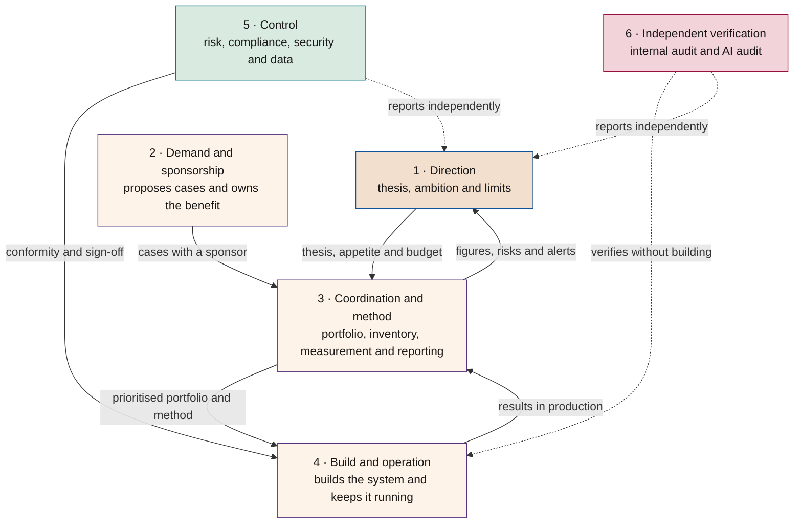
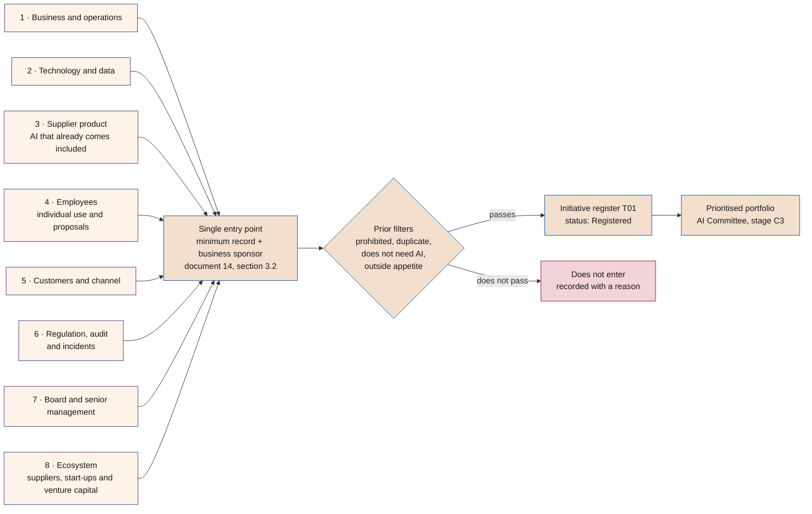
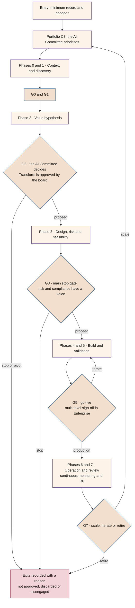
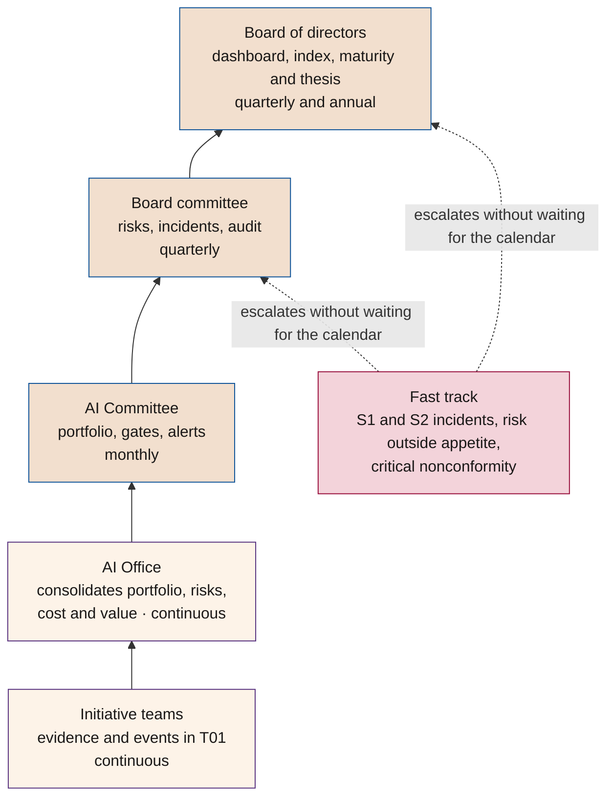

# How a company organises itself for AI

**Who does what in real organisations, where AI governance should sit, where use cases come from, how they are governed through to production and how the information reaches the board; and what organisation can be anticipated once AI is embedded**

| | |
|---|---|
| Document | Document 54 · Organising the company for AI |
| Version | 0.1 (working draft) |
| Date | 22-09-2026 |
| Author | Fernando García Varela |
| Status | Draft for review. Explanatory and orientation document: it adds no rules to the framework. |

<!-- cifras: 6 | functions someone has to perform ; 4 | organisation patterns observed ; 8 | sources use cases come from ; 4 | organisation scenarios at five years -->

---

> **Legal notice and disclaimer.** SEVEN-G is a reference methodological framework provided "as is" and for information purposes only. It does not constitute legal, regulatory, financial or professional advice, nor does it guarantee compliance with any law or standard. References to general regulation (such as the EU AI Act, the GDPR, DORA or NIS2), to technical standards and to regulation specific to each sector or jurisdiction may be incomplete, may not apply to a particular case or may become out of date as a result of regulatory changes, interpretations or supervisory positions after their consultation date. **Each organisation that uses SEVEN-G is solely responsible for identifying the regulation that applies to it, verifying that it is current and certifying its own regulatory compliance**, with the appropriate qualified advice. This methodology is a generic, free aid shared with the community so that nobody has to start from scratch; each person or organisation can and should adapt it to its own use. It must not be inferred that its legally sensitive parts have been reviewed by legal counsel: those reviews, for each company or sector, are the ultimate responsibility of the company, consultant or organisation that uses it. Although every effort is made to keep it up to date, some regulation may have changed without being reflected here. To the fullest extent permitted by law, the author accepts no responsibility whatsoever for the effects of its application in any organisation or for its full applicability. The methodology does not grant certification of any kind. The author accepts no liability for any use made of this content or for any decisions taken on the basis of it. The data, figures, companies and cases in the examples are fictitious or illustrative.

<!-- esencial: consulta | Explanatory document. It places the framework inside a company's real organisation chart: which functions someone has to perform, which roles usually take them on today, where AI governance is best placed, where use cases come from and how they are governed and reported up to the board. Section 8 is forward-looking and is marked as the author's hypothesis. It creates no rules or evidence: if it differs from documents 01, 14, 30 or 60, those prevail. -->

## 1. Purpose and scope

### 1.1 What this document answers

When a company decides to use AI seriously, the same conversation always appears: *who owns this?* IT has its own director, security another, data another; there is a transformation function, sometimes an AI function, and the board asks for information that nobody is quite sure who should prepare. This document puts that conversation in order through five questions:

1. Which **functions** does someone have to perform, whatever they are called in the organisation chart? (section 2)
2. What is seen **in the market today**, and which organisation patterns work and which fail? (section 3)
3. Where should **AI governance** sit: with the AI function, with transformation, with risk, with the board? (section 3.4)
4. Where do **use cases** come from, how are they governed and how is the **board informed**? (sections 5, 6 and 7)
5. What organisation comes next, once AI is embedded and **functional silos** stop being the natural way of dividing work? (section 8)

### 1.2 What it is not

- **It is not a mandatory organisation chart.** SEVEN-G does not require creating any new function. It requires the functions in section 2 to have a name and an owner, and those that must be separated to be separated (document 01, section 8.2; document 30, section 5).
- **It does not replace document 30**, which defines the bodies, their mandates, the delegation matrix and escalation. Here we explain how those bodies fit into an organisation chart that already exists.
- **It is not a market study.** What section 3 describes are patterns observed in the author's professional practice, expressed qualitatively. It carries no percentages or market shares because they would not come from a verifiable source (document 04, section 6).
- **Section 8 is a reasoned hypothesis**, not a forecast. It is marked as such and accompanied by the signals that would allow one to check whether it is happening.

> **Why it matters.** Most of the blockages attributed to technology are in fact questions of allocation: two areas believe they hold the same remit, or nobody holds it. A governance framework that is not translated into the real organisation chart remains a document.

---

## 2. The six functions someone has to perform

Regardless of size, sector and existing roles, AI requires **six functions** to have an owner. They may be concentrated in few people (in a small company, one person may perform three), but none can be left empty and two pairs cannot fall to the same owner.

<!-- grafico: The six AI functions in a company | Who sets direction, who proposes, who coordinates, who builds, who controls and who verifies -->

| # | Function | What it decides or signs | Who usually performs it | Where it sits in SEVEN-G |
|---|---|---|---|---|
| 1 | **Direction** | AI thesis, ambition by sphere, risk appetite, framework budget, approval of Transform bets. | Board and senior management. | document 13; document 30, section 3.1 |
| 2 | **Demand and sponsorship** | Which problem is solved, who owns the benefit and who takes on the change in their area. | Business and operations directors. | document 01, section 8; document 43 |
| 3 | **Coordination and method** | Portfolio, inventory, application of the method, consistent measurement, preparation of reporting to the bodies. | AI Office (or the function that acts as one). | document 30, section 3.4; document 14 |
| 4 | **Build and operation** | Architecture, data, development, suppliers, go-live and ongoing operation. | Technology, data and the areas that operate the system. | document 52; document 53; document 51 |
| 5 | **Control** | Risk assessment, regulatory conformity, security, data protection and Enterprise go-live sign-off. | Risk, compliance, security and data protection (second line). | document 30, section 9; document 33; document 35 |
| 6 | **Independent verification** | Verification that the framework is applied and that the evidence is real. | Internal audit and AI Auditors (third line). | document 38 |

**The three separations that are not negotiable** (document 01, section 8.2, and document 30, section 5):

- whoever **builds** does not verify their own evidence;
- whoever **proposes and sponsors** does not sign the risk or compliance conformity;
- whoever **audits** does not take part in the build or in the *gate* decision.

> **Why it matters.** Almost every organisation that "cannot get past pilots" has functions 1, 2 and 4 well covered and functions 3, 5 and 6 without an owner. Without coordination there is no portfolio; without control there is no defensible go-live; without verification, value figures do not survive a question from the board.

---

## 3. What is usually seen in the market

This section describes **observed patterns** from practice. It is not a study with a sample or a statistic: it is a qualitative ordering, useful for placing oneself and for each company to recognise its own case. Where regulatory obligations are cited, the official source and document 34 are referenced.

### 3.1 Which part of AI each existing role takes on

| Common role | Which part of AI it usually takes on | Where it usually falls short |
|---|---|---|
| **IT or technology function** (CIO, CTO) | Platforms, models, integration, technical security, suppliers, infrastructure cost. It is the one that can build fastest. | The value hypothesis and adoption: it delivers systems that work and nobody uses; it measures activity, not benefit. |
| **Security function** (CISO, CSO) | Model and data security, identities, access, attacks with and against AI, incidents. | It comes in late, once the solution has been chosen; with no prior criteria it can only veto. |
| **Data function** (CDO) | Quality, lineage, permitted use, data governance, sometimes advanced analytics. | It confuses data governance with AI governance: they are different and complementary (document 51). |
| **Transformation or digital function** | Portfolio of initiatives, change management, relationship with the business, benefit measurement. | It rarely has authority over technology or control; it depends on persuasion. |
| **AI function** (CAIO), where it exists | AI strategy, AI Office, use cases, relationship with model providers. | If it also builds and also controls, it breaks the separation of duties; with no budget, it is an evangelisation role. |
| **Finance function** (CFO) | Budget, investment, return measurement, management control, recurring cost. | It applies project return criteria to transformation bets and blocks them (document 14, section 4.4). |
| **Legal, compliance and data protection** | Regulatory classification, impact assessments, supplier contracts, transparency. | It arrives at the last phase; without early classification, redesign is expensive (document 32). |
| **People function** | AI literacy, effect on work, employee relations, use of AI in decisions about people. | It treats AI as training rather than as a redesign of work (document 50). |
| **Operations and business units** | The problem, the process, the real data, adoption and the benefit. | They propose solutions already chosen ("we want a copilot") instead of measurable problems. |
| **Internal audit** | Verification of the framework, annual plans, follow-up of recommendations. | Without published criteria it audits perceptions; it needs the framework to exist first (document 38). |

### 3.2 Four organisation patterns

| Pattern | How to recognise it | It works when | It fails when |
|---|---|---|---|
| **A · Technology leads** | AI is a programme of the IT function; the business contributes cases and validates. | Technical maturity is low and the foundations have to be built: platform, data, security. | Success is measured in models deployed; the benefit has no owner and adoption does not happen. |
| **B · Transformation leads** | AI is one line of the transformation agenda, with a portfolio and change management. | There is a cross-company portfolio and the main problem is prioritising and making adoption happen. | There is no technical or control authority: the portfolio advances on paper and stalls at production. |
| **C · AI Office, with or without an AI function** | A central function exists for method, inventory, measurement and support; the business sponsors and technology builds. | There are enough initiatives for the method to pay off and the central function has budget and access to the governing bodies. | The office also builds and also controls: it loses its independence and becomes a bottleneck. |
| **D · Federated by default** | Each area buys and experiments on its own; there are dozens of uses and no inventory. | Never in a stable way; it serves to discover real demand for a few months. | The first incident, the first audit or the first consumption invoice arrives: nobody knows how many systems exist or which data they touch. |

In practice, most companies recognise themselves in a mixture: an official pattern and pattern D as the underlying reality. The first task in implementation is usually to **make visible what already exists** (census and inventory, document 32 and document 14, section 11) before deciding on structure.

### 3.3 Is an AI function needed?

Four questions help decide this better than the debate about whether the role is fashionable:

1. Are there **more initiatives than a committee can follow** once a month without losing the detail?
2. Is there **more than one unit** competing for the same technical capacity or the same budget?
3. Does the company have, or will it have, **high-risk systems, agents with autonomy or direct exposure** to customers?
4. Can anyone answer within a week **how many AI systems exist, which data they use and how much they cost**?

With two or more uncomfortable answers, the central function (pattern C) pays for itself. Whether it is called AI function, AI Office or AI coordination matters less than three conditions:

- **its own budget** for discovery and method, however small;
- **direct access** to the management committee and to the board body that oversees AI;
- **not being the one who builds** the systems whose evidence it later verifies.

An AI function fails, almost always, in one of three ways: it becomes a pilot factory with no benefit owner; it becomes an approval committee with no capacity to execute; or it accumulates functions 3, 4 and 5 of section 2 and leaves the company without independent control.

### 3.4 Where AI governance should sit

This is the most frequent question and it has an answer of principle: **governance cannot report to whoever executes**. Function 5 (control) and function 6 (verification) report to the board or its delegated committee, not to the owner of the portfolio. That said, there are three reasonable locations and one that is not.

| Option | What it consists of | Advantage | Risk | Condition for it to work |
|---|---|---|---|---|
| **1 · Governance in the second line** (risk or compliance), with technical secretariat in the AI Office | Policy, appetite and conformity sit with risk; method and inventory sit with the AI Office. | Clear independence; fits the three lines model and board oversight. | Distance from the business: control arrives late unless it is embedded in the phases. | Risk takes part from phase 0, not at the final gate. |
| **2 · Governance in the AI function, with conformity kept separate** | The AI function owns method, portfolio and inventory; risk and compliance sign-off stays with the second line. | A single point of contact for the business; speed. | Concentration: if it also builds, separation is lost. | The AI function does not build the systems or, if it does, does not verify their evidence. |
| **3 · AI Committee as the governing body**, with no dedicated function | A committee with management, technology, risk, data and people decides; the secretariat is held by whoever coordinates. | Inexpensive and sufficient in mid-sized companies; shares responsibility. | Without a dedicated secretariat, the committee neither prepares nor follows up anything. | Someone has real dedicated time to prepare decisions and follow up agreements. |
| **4 · Governance inside the function that builds** | The same area proposes, builds, approves and declares the value. | None that survives a review. | Judge and party: the evidence is not defensible before audit or before the board. | It is not an acceptable option in SEVEN-G. |

In the first three options the board keeps what it cannot delegate: approving the thesis and the risk appetite, approving Transform bets and overseeing results (document 30, section 3.1). Regulation reinforces this idea in sectors where the management body already has an express responsibility for technology and resilience risks, such as Regulation (EU) 2022/2554 (DORA) or Directive (EU) 2022/2555 (NIS2), and in supervisory expectations on AI governance, such as the EIOPA Opinion on AI governance and risk management (document 34).

> **Why it matters.** Where governance sits determines what happens on the day an important initiative does not pass a gate. If the person who decides to stop reports to the person who has to deliver, nothing is ever stopped.

### 3.5 Six signals that the organisation is badly set up

1. Nobody can say within a week how many AI systems are in production.
2. The savings figures presented to the management committee have not been checked by anyone outside the team that produced them.
3. The second line only appears at the end, and can then only approve or veto.
4. No initiative has ever been stopped on the merits; only for lack of budget or people.
5. The board sees product demonstrations and does not see portfolio, risks or validated value.
6. The same person proposes, approves and declares the benefit.

---

## 4. From the real organisation chart to the SEVEN-G bodies

SEVEN-G does not ask for the organisation chart to be changed: it asks for its bodies and roles to be **assigned** to people who already exist and for that to be written down (P38, with the rules of the bodies and the appointment of the AI lead).

| SEVEN-G body or role | Who normally performs it | What is needed for it to count |
|---|---|---|
| **Board of directors** | The board itself, with an annual dedicated item and a quarterly item. | That it receives the pack in document 60, not a demonstration. |
| **Board committee** | The audit, risk or technology committee, whichever already exists. | A written mandate that includes AI (P38). |
| **AI Committee** | An extended management committee, or a dedicated committee with business, technology, risk, data and people. | Monthly frequency and real capacity to decide *gates* and retirements. |
| **AI Office** | Transformation, technology, the AI function or management control, depending on the company. | Dedicated time, method and access to the bodies; not building what it verifies. |
| **AI Sponsor** | Director of the unit that benefits. | Owns the benefit at the value realisation review (document 43). |
| **AI Product Owner** | Manager of the user unit or product manager. | Authority over scope and over adoption. |
| **AI Technical Owner** | Technology, data or the supplier, with an internal counterpart. | Never also the verifier. |
| **AI Risk Owner and conformity** | Risk, compliance, security and data protection. | Takes part from phase 0 and signs at G5 in Enterprise. |
| **AI Auditor** | Internal audit, with external support if needed. | Declared independence (P41). |
| **Designated human overseer** | A person in the user area who validates or interrupts the system. | Competence, training and **real authority to disagree** (document 50, section 4.2). |

In small companies, document 30, section 11, and document 90, section 2.4, explain how to group bodies without losing the mandatory separations.

---

## 5. Where use cases come from

### 5.1 Eight sources

Demand for AI does not arise in one place. Recognising the source helps anticipate its bias and ask for what it lacks before it enters the portfolio.

| # | Source | What it usually brings | Typical bias | What it almost always lacks |
|---|---|---|---|---|
| 1 | **Business units and operations** | Real problems, with their own process and data. | It brings the solution already chosen, not the problem. | Baseline and attribution method (document 40). |
| 2 | **Technology and data** | New capabilities that are now possible and cheap. | It looks for somewhere to apply what it already knows how to do. | A business sponsor who owns the benefit. |
| 3 | **The product market** | AI features that appear inside software the company already uses. | They switch themselves on, with no decision and no inventory. | Inventory registration, regulatory classification and a conscious decision to enable them. |
| 4 | **Employees** | Individual use of general-purpose tools; the best small cases come from here. | It happens outside any control (unauthorised use). | A proposal channel, an acceptable use policy and AI literacy (document 31). |
| 5 | **Customers and channel** | Explicit requests and observed friction. | A one-off request is mistaken for aggregate demand. | Segment size and willingness to pay. |
| 6 | **Regulation, audit and incidents** | Obligations, findings and nonconformities that require change. | They are treated as cost and done to the minimum. | Fit with the portfolio; sometimes they enable value, not only control. |
| 7 | **Board and senior management** | Ambition challenges, sector comparisons, corporate transactions. | They arrive named after a technology and with no defined problem. | Translation into a falsifiable hypothesis and into sphere and ambition (document 10). |
| 8 | **Innovation ecosystem** | Proposals from suppliers, start-ups, venture capital, universities and innovation programmes. | A free proof of concept with no internal owner and no exit cost. | An internal sponsor, data that can be shared and an exit plan (document 36). |

<!-- grafico: Where use cases come from and how they enter | Eight sources, a single entry point to the register and the portfolio -->

### 5.2 There is a single entry point

Wherever it comes from, an initiative enters through the same place: the **minimum entry record** in document 14, section 3.2 (plain-language description, sponsor and product owner, proposed sphere and ambition, order of magnitude of the value, investment up to G3, fit with the thesis and foreseeable Enterprise criteria), the **prior filters** in section 3.3 and the **entry windows** in section 3.4. Whatever does not enter is recorded with its reason: a "no" that is not recorded comes back three months later.

**Sponsor rule.** Every initiative needs a business sponsor. A proposal from a supplier, from the ecosystem or from the technical area **with no internal sponsor does not enter**, however good it looks.

### 5.3 The three sources that cause most trouble

| Source | Problem | How it is handled |
|---|---|---|
| **AI that already comes included** in a contracted product | It is enabled by default, with no decision, no inventory and sometimes with data that should not leave the perimeter. | Periodic review of supplier release notes; inventory registration and classification before enabling; clauses in document 36. It is a decision, not an update. |
| **Unauthorised use** (shadow AI) | It happens anyway; banning it without an alternative simply hides it. | A usable corporate alternative, an acceptable use policy and an amnesty channel to surface uses: regularisation in document 14, section 11, and document 31. |
| **The free proof of concept** | With no apparent cost, it consumes data, time and credibility, and creates dependency. | Sponsor, success and stop criteria in writing before starting, bounded data and an exit cost estimated from day one. |

> **Why it matters.** The three sources above share one feature: **they come in without passing through the entry point**. Most of a company's regulatory and security risk does not sit in the initiatives in its portfolio, but in what never reached it.

---

## 6. How what has entered is governed

The route is the framework's own: the portfolio is managed as a funnel and each initiative goes through phases with decision gates. What is added here is **who decides at each point** and with what degree of delegation.

<!-- grafico: Governance circuit of an initiative | From proposal to operation, with who decides at each gate -->

| Decision | Who decides (reference) | What cannot be delegated |
|---|---|---|
| Entry and priority in the portfolio | AI Committee, at its monthly review (document 14, section 7.1). | — |
| *Gates* for Lite initiatives | According to the delegation matrix in document 30, section 7. | Verification is done by someone other than whoever builds. |
| *Gates* for Enterprise initiatives | AI Committee, with the second line present. | Risk and compliance conformity. |
| Approval of Transform at G2 and of scaling at G7 | Board (document 30, section 3.1). | Not delegated. |
| Acceptance of residual risk | The body matching the risk level (document 33). | Never whoever builds the initiative. |
| Enterprise go-live | Multi-level sign-off at G5, with the second line. | The control sign-off. |
| Stop, pivot and retirement | AI Committee; the board for Transform initiatives (document 14, section 10). | The reason is always recorded. |
| Exceptions to the policy | The body set out in P40, with an expiry date. | An exception with no end date is not an exception. |

**The role of the AI Office** in this circuit is that of engine, not decision-maker: it prepares decisions, checks that the evidence exists before convening a gate, maintains the register and flags what has become stuck (stalled initiatives, expired conditions, document 14, section 8).

---

## 7. How it is monitored and how the information reaches the board

### 7.1 The reporting chain

Each level receives less detail and more consequence. What does not change at any level is the **status of each figure**: validated, declared or estimated (document 40).

<!-- grafico: How AI information reaches the board | What each level sees, how often and with which tool -->

### 7.2 What each level sees

| Level | What it receives | How often | With what |
|---|---|---|---|
| **Initiative team** | Its own evidence, the criteria for the next gate, open risks and its own figures. | Continuous | T01, T03, T06 |
| **AI Office** | Full portfolio, time in phase, missing evidence, cost and consumption, alerts. | Continuous | T01, T11, T13 |
| **AI Committee** | Prioritised portfolio, pending gate decisions, stalled initiatives, High risks, retirements. | Monthly | T01, T06, P36 |
| **Board committee** | Risks outside appetite, incidents, major and critical nonconformities, audit results, exceptions in force. | Quarterly | P42, document 37, document 38 |
| **Board** | Portfolio funnel, validated versus declared value, maturity, transformation index, Transform bets and open recommendations. | Quarterly and annual | Dashboard T17, T14, T15, T18, pack P67 and document 60 |

### 7.3 Three rules for reporting to the board

1. **No figure without a status and a formula.** A declared saving and a validated one are not added in the same line (document 40).
2. **The board sees the whole funnel, not only what is going well**: the initiatives that did not pass each stage and why, and those that have been disengaged after being in use. That is the part that teaches most.
3. **Alerts do not wait for the calendar.** Serious incidents, risks outside appetite and critical nonconformities escalate when they occur (document 37).

> **Why it matters.** A board that only sees demonstrations cannot exercise its oversight responsibility: it does not know what the portfolio costs, which risks the company has accepted or how much of the announced value has materialised.

---

## 8. What organisation comes next: the author's hypothesis

> **This is a reasoned hypothesis, not a forecast.** Nothing in this section is demonstrated, nor does it come from a market study. It is offered to support a management and board conversation, and each statement is accompanied by the signal that would allow one to check whether it is happening. The rules of the framework do not depend on this section being right.

### 8.1 Five forces pushing organisational change

| Force | What changes |
|---|---|
| **The cost of routine cognitive work falls** | Advantage stops being about having more hands and becomes about defining the outcome well and controlling quality. |
| **The unit of management shifts from the function to the process** | If an end-to-end chain can run with few human interventions, splitting it across four functions stops making sense. |
| **Workers appear that are not people** | Agents need identity, permissions, an owner, performance evaluation and offboarding: that is management, not only technology (document 35). |
| **Knowledge becomes an operational asset** | Whoever keeps what the AI reads up to date determines the quality of the answers: internal content moves from archive to infrastructure (document 51). |
| **Regulation requires a human trail** | The more a company automates, the more explicit human responsibility has to be: oversight, traceability and the ability to intervene (document 34). |

### 8.2 What happens to each silo

| Area | Hypothesis at three to five years | Early signal that it is happening |
|---|---|---|
| **Business units** | They stop asking for systems and start owning process outcomes; sponsorship becomes professional. | Directors' objectives linked to the benefit of the AI portfolio, not to the number of pilots. |
| **Finance** | From periodic close to continuous control; the controller designs automated controls and watches cost per unit of service. | AI consumption cost appears as a management line, allocated by case (document 42). |
| **People** | It manages a mixed workforce: staffing by capacity, not by posts; work redesign and oversight as a competence. | The workforce plan includes released capacity and its destination (document 50, section 6). |
| **Shared services and back office** | They shrink as executors and become operators of platforms and of exceptions. | The volume of routine tasks falls and the volume of exceptional cases handled by expert people rises. |
| **Technology** | From building applications to operating platforms, data, agents and behaviour quality control. | There is an internal catalogue of reusable components and agents with an owner. |
| **Procurement** | It contracts capabilities and outcomes, not licences; supplier dependency is managed as concentration risk. | The clauses in document 36 and the exit plan are a condition of purchase. |
| **Risk and audit** | They audit system behaviour, not only processes and documentary controls. | There is an annual AI audit plan with tests on real systems (document 38). |
| **Customer service and marketing** | The first point of contact is mostly automated, with people on exceptions and on the value relationship. | Usage drift and bias by segment are measured, not only response time (document 52). |

### 8.3 Roles I expect to become established

| Role | What it would do | Where it would come from |
|---|---|---|
| **End-to-end process owner** | Owns the complete outcome of a chain, with people and systems reporting to them. | Operations and business functions. |
| **Agent engineer or manager** | Designs, tests, deploys and retires agents; maintains their catalogue and their limits. | Technology and automation. |
| **Non-human identity manager** | Onboarding, permissions, credential rotation and offboarding of each agent and service. | Security and identity. |
| **Consumption and cost-per-case controller** | Consumption budget, reconciliation and cost per unit of service. | Management control. |
| **Knowledge curator** | Quality, currency and permissions of the sources the AI uses. | Documentation, quality and the areas themselves. |
| **Professional human overseer** | Validates, corrects and interrupts system decisions, with authority and with no incentive to accept them. | User areas, with specific training. |
| **AI Auditor** | Verifies evidence, behaviour and compliance with the framework. | Internal audit, with external support. |

### 8.4 Four scenarios at five years

| Scenario | What it consists of | When it is likely | Signal that it is heading there |
|---|---|---|---|
| **1 · Reinforced silos** | Each function uses AI within its own perimeter and the boundaries do not move. | Highly regulated sectors or ones with very separate processes. | Many initiatives, none across areas. |
| **2 · Central AI layer** | A central platform and team serve all areas; the organisation chart does not change. | Companies with a strong corporate culture and a need for control. | The catalogue of shared components grows and areas stop contracting on their own. |
| **3 · Process-based organisation with mixed teams** | Work is organised into end-to-end chains, with people and agents, and outcome owners. | When the cost of coordinating between silos exceeds the cost of reorganising. | Process owners appear with budget and with outcome objectives. |
| **4 · Governed network of agents** | Much of the execution is carried out by coordinated agents; people set objectives, exceptions and control. | Only after high maturity in data, security and control. | There is an inventory of agents with an owner, limits and offboarding, just like an employee register. |

The author's hypothesis is that most large European companies will travel through **scenario 2**, and that **scenario 3** will arrive process by process, not through general reorganisations: first one chain (claims, onboarding, support, billing), then another.

### 8.5 What will not change

1. **Legal responsibility** remains with people and bodies, not with systems.
2. The **separation between building and controlling** becomes more important, not less.
3. It will still be necessary to **be able to stop**: the more automated the chain, the more valuable the switch.
4. Value is only demonstrated **in production and against a baseline**; no new organisation spares that proof.
5. Someone will have to **explain it to the board** in business language.

### 8.6 What a company that believes this hypothesis would do today

Four moves that are not regretted even if the future turns out differently: a **live inventory** of systems and agents; **consistent measurement** of value and of cost per case; **human oversight with authority** wherever decisions about people or money are made; and **a designated process owner** in the chain where coordination between areas hurts most.

---

## 9. Questions for a useful conversation

For the board, the management committee or a working session. They have no right answer; they either have an answer or they do not, and that in itself is information.

**On who does what**

1. Who performs each of the six functions in section 2 today, and which are empty?
2. Is anyone performing both build and control? Since when?
3. If an important initiative has to be stopped tomorrow, who signs that decision?

**On demand**

4. Which of the eight sources do our current initiatives come from? Is there any source that never appears?
5. How many AI systems have been enabled in products we already had under contract, with no express decision?
6. What do we do today about the AI use that employees already practise on their own?

**On governance**

7. How many initiatives have been stopped on the merits in the last twelve months? If none, why?
8. Does the second line take part from phase 0 or does it appear at the final gate?
9. Which exceptions to the policy are in force and when do they expire?

**On reporting**

10. How much of the value we present is validated, how much declared and how much estimated?
11. Does the board see the initiatives that did not make it, and why?
12. How much does the AI portfolio cost per year, including consumption and recurring cost?

**On the future**

13. Which of the four scenarios in section 8.4 are we in, and which do we want to be in?
14. Which end-to-end chain of work suffers most from the separation between areas?
15. If in three years part of the work is done by agents, who onboards them, who owns them and who offboards them?

---

## 10. How it is set up in practice

The implementation sequence is in document 90. In organisational terms, the order that avoids most blockages is:

1. **Census and inventory** of what already exists, including what came in without passing through the entry point (document 32; document 14, section 11).
2. **Assign the six functions** by name, even if they are concentrated in few people (P38).
3. **Open the single entry point** and publish the minimum record, so that demand stops coming in through the sides (document 14, section 3).
4. **Settle the reporting to the board** before there are many initiatives: it is easier to start measuring with five than with fifty (document 60).
5. **Review the structure after six months** with your own data: how many initiatives, from which sources, how many stopped, how much cost. Structure is better decided with that information than with a comparison of other companies' organisation charts.

---

## 11. Associated tools and templates

| Code | Name | Use in this document |
|---|---|---|
| **T01** | Initiative register | Single entry point, status of each initiative and origin of all later information. |
| **T02** | AI system inventory | Census of what already exists, including AI embedded in contracted products. |
| **T06** | Risk matrix and register | Risks by initiative and their acceptance by the appropriate body. |
| **T14 · T15** | Transformation index and maturity diagnosis | Overall reading for the board and for the annual review. |
| **T17 · T18** | Board dashboard and recommendations register | Periodic reporting to the board and follow-up of its agreements. |
| **P38** | Rules of the bodies and appointment of the AI lead | Written assignment of bodies and functions. |
| **P39** | Agenda and minutes | Operation of the AI Committee and of the board committee. |
| **P40** | Exceptions | Exceptions with body, reason and expiry. |
| **P41** | Independence and conflict declarations | Separation of duties and audit. |
| **P42** | Quarterly second line report | Risk and compliance reporting to the board committee. |
| **P36** | Portfolio plan | Prioritisation, traffic light and regularisation. |
| **P67** | Quarterly board pack | Content of the quarterly session. |

---

## 12. Related documents

| Document | Relationship |
|---|---|
| **01 · Foundational methodology** | Initiative roles, separation of duties, phases, gates and intensity. |
| **13 · AI thesis, ambition and risk appetite** | What the board approves, which gives content to the direction function. |
| **14 · Portfolio management** | Entry channels, minimum record, filters, prioritisation and retirement. |
| **20 and 21 · Phases and *gate* criteria** | What is done in each phase and what is verified at each gate. |
| **30 · Governance model** | Bodies, mandates, delegation matrix, escalation and three lines. Reference document for this one. |
| **32, 33 and 34 · Inventory, risk and regulation** | Classification, risks and obligations that determine control. |
| **38 · AI audit framework** | Independent verification function. |
| **40 and 42 · Value measurement and costs** | Status of the figures and cost per case reported to the board. |
| **50 · People and organisation** | Effect on work, new roles, human oversight and released capacity. |
| **60, 61 and 62 · Board** | Pack, conversation and register of decisions and recommendations. |
| **90 · Implementation guide** | Start-up sequence and minimum route in Lite scope. |
| **94 · Obligation matrix** | Level of each document and layered reading. |

---

## 13. Version control

| Version | Date | Changes |
|---|---|---|
| 0.1 | 22-09-2026 | First version. Six functions someone must perform and their separations; organisation patterns observed in the market and where to place AI governance; mapping between the real organisation chart and the bodies in document 30; eight sources of use cases with their bias and their single entry point; governance circuit with who decides at each gate; reporting chain to the board; forward-looking section marked as a hypothesis, with four scenarios and their signals; fifteen questions for a management or board conversation. Explanatory document: it adds no rules or evidence. |
