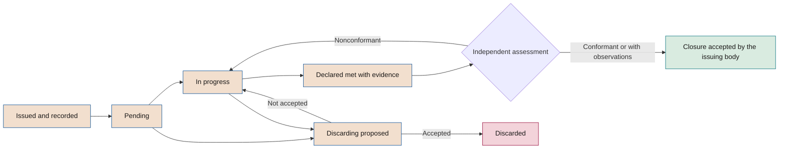

# Recommendations and decisions register

**Tracking, with persistent identifiers, of what the board recommends, assigns and decides**

| | |
|---|---|
| Document | Document 62 · Recommendations and decisions register |
| Version | 0.1 (working draft) |
| Date | 16-09-2026 |
| Author | Fernando García · SEACHAD |
| Status | Draft for review. Defines the register implemented by tool T18, pending adaptation. |

<!-- cifras: 2 | record types with their own identifier ; 4 | statuses declared by the recipient ; 4 | independent assessments ; 0 | reused identifiers -->

---

> **Legal notice and disclaimer.** SEVEN-G is a reference methodological framework provided "as is" and for information purposes only. It does not constitute legal, regulatory, financial or professional advice, nor does it guarantee compliance with any law or standard. References to general regulation (such as the EU AI Act, the GDPR, DORA or NIS2), to technical standards and to regulation specific to each sector or jurisdiction may be incomplete, may not apply to a particular case or may become out of date as a result of regulatory changes, interpretations or supervisory positions after their consultation date. **Each organisation that uses SEVEN-G is solely responsible for identifying the regulation that applies to it, verifying that it is current and certifying its own regulatory compliance**, with the appropriate qualified advice. The author and SEACHAD accept no liability for any use made of this content or for any decisions taken on the basis of it. The data, figures, companies and cases in the examples are fictitious or illustrative.

## 1. Purpose and scope

The recommendations and decisions register keeps, with identifiers that are never reset, **what the board and its committees recommend, assign and decide on AI**, who must carry it out, within what time limit, what evidence has been provided and whether someone independent considers that it has been met.

Its purpose is to ensure that follow-up does not depend on the memory of meetings or on the minutes, and to distinguish **what the recipient declares** from **what has been verified**.

It applies to:

- **Recommendations** made by the board of directors, its board committees or the director or adviser with AI experience when the board adopts them as its own.
- **Assignments** from the board to management (pieces of work with an owner and a date), which are recorded as recommendations.
- **Decisions** of the board or its board committee on AI: approvals, authorisations with limits, risk acceptances and relevant notings.

It does not replace the minutes, which are the corporate record, or the lifecycle *gate* decision record (template P29, tool T03). The register links to both.

---

## 2. Principles

| # | Principle | What it implies |
|---|---|---|
| 1 | **Persistent identifier** | Each recommendation and each decision receives a code that does not change, is not reused and is not reset. |
| 2 | **Declared is not verified** | The recipient declares the status; an independent person assesses compliance. The two are shown separately. |
| 3 | **No evidence, no compliance** | A recommendation can only be assessed as conformant if there is linked, dated and versioned evidence. |
| 4 | **Nothing is closed silently** | Closure and discarding are accepted by the body that issued the recommendation, with a record. |
| 5 | **Every change is an event** | Changes of status, date, recipient or text are recorded with date, author and reason. |
| 6 | **Linked to measurement** | Each recommendation indicates the block of the board dashboard or the item of data in the initiative register where its effect is checked. |
| 7 | **A single data model** | The register is the *Recommendation* entity of the common model (03 §4); it is fed by and feeds the other tools. |

---

## 3. Identifiers

### 3.1 Format

The board dashboard data schema (`motor/ESQUEMA.md` in the demonstrations repository) does not define an identifier format for recommendations. The T18 demonstration tool uses sequential codes per organisation (`R-01`, `R-02`…) grouped by session. SEVEN-G adopts the format of the common specification:

| Type | Format | Example | Status of the format |
|---|---|---|---|
| **Recommendation or assignment** | `REC-AAAA-NNN` | REC-2026-007 | Common specification §5.9 |
| **Decision of the board or the committee** | `DEC-AAAA-NNN` | DEC-2026-014 | **Proposed** in this document; pending incorporation into the common specification §5.9 and the glossary (document 02) |

### 3.2 Rules

1. **AAAA** is the year in which the recommendation is issued or the decision is adopted (or requested).
2. **NNN** is a sequential number of at least three digits that **is not reset when the year or session changes**. If 999 is exceeded, four digits are used.
3. **An identifier is never reused**, not even when the recommendation is discarded, cancelled owing to a recording error or merged with another.
4. **A recommendation that is split** keeps its identifier in the main part; the new parts receive new identifiers and are linked to the original.
5. **A substantially reformulated recommendation** is closed as *Superseded* and a new linked one is recorded. Minor wording changes are recorded as an event without changing the code.
6. **The correspondence with previous identifiers** (for example, `R-NN` from a previous tool) is kept in the *previous identifier* field.
7. **Initiatives** keep their own `IA-AAAA-NNN` code (document 03); incidents and nonconformities, `INC-AAAA-NNN` and `NC-AAAA-NNN`.

---

## 4. Fields of a recommendation

| Block | Field | Content | Mandatory | Completed by |
|---|---|---|---|---|
| **Identification** | Code | REC-AAAA-NNN | Yes | Board secretariat |
| | Previous identifier | Code in a previous tool, if any. | No | AI Office |
| | Issuing body | Full board, board committee (which one) or director or adviser with AI experience, with the board's acceptance. | Yes | Board secretariat |
| | Session of origin | Body and date of the session; reference to the minutes. | Yes | Board secretariat |
| | Type | Recommendation · Assignment. | Yes | Board secretariat |
| **Content** | Text | What is recommended, worded so that it can be checked whether it has been met. | Yes | Issuing body |
| | Reason | Why it is recommended, in one or two sentences. | Yes | Issuing body |
| | Compliance criterion | What evidence will demonstrate that it has been met. | Yes | Issuing body, with the AI Office |
| | Area | Value · Risk · Compliance · Security · Data · People · Governance · Suppliers. | Yes | AI Office |
| | Sphere | 01 to 09 (controlled taxonomy, 03 §3.3). | Yes | AI Office |
| | Priority | High · Medium · Low, using the criterion approved by the issuing body. | Yes | Issuing body |
| **Accountability** | Recipient | Accountable person and area. A single person is accountable, even if several areas collaborate. | Yes | Issuing body |
| | Original committed date | Date agreed when the recommendation was issued. It is not overwritten. | Yes | Recipient, accepted by the body |
| | Current committed date | Current date after rescheduling. | Yes | System |
| | Reschedulings | Number, dates, reason and who accepted them. | If any | Recipient and issuing body |
| **Follow-up** | Declared status | Section 5. | Yes | Recipient |
| | Status date | Date of the latest declaration. | Yes | System |
| | Evidence provided | Links, with type, author, date and version (section 7). | To declare *Met* | Recipient |
| | Independent assessment | Section 6. | To close | Independent assessor |
| | Assessor and date | Person and date of the assessment. | To close | System |
| | Assessment comment | Reason for the assessment, especially if it is nonconformant. | If nonconformant | Independent assessor |
| **Closure** | Situation | Open · Closed · Discarded · Superseded. | Yes | System, with the body's acceptance |
| | Closure date and body | Who accepted the closure or discarding and when. | On closure | Board secretariat |
| **Links** | Initiatives | IA-AAAA-NNN codes affected. | If any | AI Office |
| | Systems, incidents and nonconformities | INC-AAAA-NNN, NC-AAAA-NNN, inventory systems. | If any | AI Office |
| | Decisions | Related DEC-AAAA-NNN. | If any | Board secretariat |
| | Dashboard block | Block of the board dashboard where the effect is measured (section 11). | Recommended | AI Office |
| **History** | Events | Creation, status changes, reschedulings, assessments, closure, with date, author and comment. | Yes | System |

**How to word a verifiable recommendation**

| Hard to verify | Verifiable |
|---|---|
| "Improve value measurement." | "Break down the value of each use case in production into efficiencies, return and recurring cost, with attribution method and management control validation, before the year-end close." |
| "Strengthen agent security." | "Ensure that each agent with the ability to act has its own identity, minimum permissions, action logging and a tested kill switch, before extending its use." |
| "Take regulation into account." | "Classify all systems in the inventory under the EU AI Act with a signed legal opinion, starting with those that affect decisions about people." |

---

## 5. Statuses declared by the recipient

| Status | Meaning | Requirements |
|---|---|---|
| **Pending** | Work has not started. | Current committed date. |
| **In progress** | Work has started and has not been completed. | Brief description of progress and current committed date. |
| **Met** | The recipient considers that the recommendation has been met. | Evidence provided that covers the compliance criterion. It automatically moves to *awaiting assessment*. |
| **Discarded** | The recipient proposes not to carry it out. | Reason and alternative, if any. Requires the acceptance of the issuing body; until then the recommendation remains open. |

Alerts calculated by the register that are not statuses:

| Alert | When it is triggered |
|---|---|
| **Overdue** | The current committed date has passed and the status is neither *Met* nor accepted *Discarded*. |
| **Not updated** | The status has not been updated since the previous session of the issuing body. |
| **Awaiting assessment** | Declared *Met* and without an independent assessment within the set time limit (by default, before the next session). |
| **Discrepancy** | Declared *Met* and assessed *Nonconformant*. |
| **Repeated rescheduling** | Two or more reschedulings (section 9.3). |

---

## 6. Independent assessment

### 6.1 Who assesses

The assessment is carried out by a person **independent of the recipient and of whoever carries out the work**: internal audit, the AI Auditor, the second line when the recommendation does not affect its own work, or the director or adviser with AI experience when the board commissions them and they have no interest in the execution. The issuing body appoints the assessor by type of recommendation.

### 6.2 Scale

| Assessment | Meaning | Consequence |
|---|---|---|
| **Conformant** | The evidence demonstrates that the compliance criterion is met. | Closure is proposed to the issuing body. |
| **Conformant with observations** | The essentials are met; non-critical aspects remain, which are indicated. | Closure is proposed with the observations recorded; if any observation requires work, it is recorded as a new linked recommendation. |
| **Nonconformant** | The evidence does not demonstrate compliance or is insufficient. | The recommendation returns to *In progress* with a new committed date; the discrepancy is recorded. |
| **Not assessed** | It has not yet been assessed. | Initial assessment status. |

### 6.3 Rules

1. **The assessment is based only on the linked evidence.** Anything not in the register is not considered.
2. **The assessor does not rewrite the recommendation.** If they consider the compliance criterion inadequate, they propose a change to the issuing body.
3. **Discrepancies are reported to the board** in the quarterly pack (60 §4.7).
4. **The assessment is shown alongside the declared status**, never in its place.

---

## 7. Evidence provided

| Requirement | Description |
|---|---|
| **Link** | Location of the document or data in the company's repository. Evidence is linked, not copied (03 §2). |
| **Type** | Approved document · Record or data from a system · Test result · Minutes or decision · Audit report · Verifiable configuration. |
| **Author, date and version** | Mandatory. |
| **Relationship with the criterion** | Which part of the compliance criterion it covers. |
| **Prior verification** | If the evidence has already been verified at a *gate* or in an audit, who verified it and when is stated. |

The following are not sufficient evidence on their own:

- A statement by the recipient without a document or data to support it.
- A plan, when the recommendation calls for a result.
- A presentation prepared for the session without linked source data.
- Documentation prepared after the fact to give the appearance of earlier compliance (01 §7.4, rule 3).

---

## 8. Lifecycle

<!-- grafico: Lifecycle of a recommendation | The recipient declares; someone independent assesses; the issuing body closes -->

| Step | What happens | Who | Reference time limit |
|---|---|---|---|
| **1. Issue** | The body formulates the recommendation in the session. | Issuing body | In the session |
| **2. Recording** | Code, recipient, compliance criterion and committed date are assigned. | Board secretariat with the AI Office | 5 working days after the session |
| **3. Acceptance by the recipient** | The recipient confirms that they understand it and accepts the date, or proposes another to the issuing body. | Recipient | 10 working days after recording |
| **4. Execution** | The recipient updates the status before each session of the issuing body. | Recipient | Before the pack cut-off date |
| **5. Declaration of compliance** | *Met* status with linked evidence. | Recipient | Before the committed date |
| **6. Assessment** | Conformant, conformant with observations or nonconformant. | Independent assessor | Before the next session |
| **7. Closure** | The issuing body accepts the closure in session or through the procedure it has delegated. | Issuing body | At the next session |

---

## 9. Closure, discarding, rescheduling and reopening

### 9.1 Closure

A recommendation is closed when three conditions are met at the same time: declared status *Met*, assessment *Conformant* or *Conformant with observations*, and acceptance by the issuing body. The closure records the date, the body and the reference to the minutes.

### 9.2 Discarding

Discarding is legitimate when the recommendation has lost its purpose (change of strategy, retired initiative, alternative solution) or when its cost clearly exceeds its benefit. It requires a reason, an alternative if one exists and the express acceptance of the issuing body. A discarded recommendation does not disappear from the register or from the indicators.

### 9.3 Rescheduling

- Every new date records the reason and who accepts it; the original date is kept.
- The first rescheduling is accepted by the AI Office or the board secretariat if the issuing body has delegated this.
- **From the second rescheduling onwards, the decision is taken by the issuing body**, consistent with the limit of two iterations in the lifecycle (01 §7.4, rule 5).

### 9.4 Reopening

A closed recommendation is reopened, keeping its code, if it is discovered that the evidence was incorrect or that compliance has not been maintained (for example, a control that was subsequently deactivated). The reopening is recorded as an event with a reason and reported to the issuing body. If the problem is different from the original one, a new linked recommendation is recorded.

### 9.5 Supersession

When the issuing body substantially reformulates a recommendation, the original is closed as *Superseded* with a reference to the new one, which receives its own code.

---

## 10. Recorded board decisions

### 10.1 Which decisions are recorded

| Decision | Recording |
|---|---|
| Approval of the AI thesis, ambition by sphere, risk appetite, corporate policy and framework budget (C2). | Mandatory |
| Approval of Transform initiatives at G2 and of their scaling at G7. | Mandatory |
| Exceptional acceptance of Critical residual risks. | Mandatory |
| Decisions of the annual review (C5): adjustments to the thesis, thresholds and time limits. | Mandatory |
| Notings of stops, retirements, S1 incidents and critical nonconformities. | Mandatory |
| Assignments to management. | Recorded as recommendations of type *Assignment* (REC). |
| Other decisions on AI by the board or the board committee. | Recommended |

### 10.2 Fields of a decision

| Field | Content |
|---|---|
| **Code** | DEC-AAAA-NNN (proposed). |
| **Body and session** | Full board or board committee; date; reference to the minutes. |
| **Type** | Approve · Authorise with limits · Accept a risk · Take note (60 §4.3). |
| **Text of the decision** | As recorded in the minutes. |
| **Decision sheet** | Link to the sheet presented (60 §5). |
| **Outcome** | Approved · Approved with conditions · Deferred · Rejected. |
| **Conditions and limits** | Each condition with owner and time limit; limits on investment, stage and validity. |
| **Validity** | Date until which it is valid, where applicable (for example, the acceptance of a risk). |
| **Execution owner** | Accountable person. |
| **Links** | IA-AAAA-NNN, REC-AAAA-NNN, INC-AAAA-NNN, NC-AAAA-NNN, *gate* decision (P29). |
| **Follow-up** | Execution status of the conditions (pending, in progress, met, overdue) and review date. |
| **History** | Events with date, author and reason. |

### 10.3 Rules

1. **A deferred decision keeps its code** and is presented again with it.
2. **The conditions of a decision are tracked like those of a *gate***: an expired condition that has not been met is reported to the body, which decides whether the decision remains in force.
3. **A risk acceptance expires on its validity date**; from then on, the risk once again blocks the corresponding *gate* until a new decision is taken.
4. **The board decision at G2 or G7 and the *gate* decision record are linked** in both directions, so that lifecycle traceability is complete.

---

## 11. Links with initiatives and with the dashboard

### 11.1 With the initiative register

- Every recommendation or decision affecting specific initiatives links their IA-AAAA-NNN codes.
- The record of each initiative in the register (T01) shows the recommendations and decisions affecting it, with their status and assessment.
- An initiative **cannot pass a *gate*** if it is linked to a board decision with expired conditions that affect that *gate*.
- When an initiative is stopped or retired, the recommendations that depend solely on it are proposed for discarding or closure.

### 11.2 With the board dashboard

Each recommendation indicates the dashboard block (T17) in which the board can check its effect:

| Area of the recommendation | Dashboard block |
|---|---|
| Value, cost, validation, additional net value per euro | Value versus potential |
| Ambition level and distribution of investment | Where the company invests |
| Decision times and time to production | Agility |
| Regulatory classification, controls, impact assessments | Risk and compliance |
| Assistants and agents: guardrails, tests, identity and permissions | Assistants in production; agents |
| Retirements, new additions and incidents | Movements and incidents |
| Licences, use, unauthorised use, training | Trend and adoption |
| Exposure to AI-enabled attacks | Exposure to AI-enabled attacks |
| Inventory and typology | Inventory |

### 11.3 Register indicators

They are reported in the quarterly pack (document 60) and in the annual review:

| Indicator | Definition |
|---|---|
| **Open** | Recommendations not closed, discarded or superseded, by issuing body and area. |
| **Overdue** | Open, with the current committed date passed. |
| **Closed in the period** | With a conformant or conformant with observations assessment. |
| **Discrepancies** | Declared met and assessed nonconformant in the period. |
| **Time to closure** | Median days from recording to closure, by priority. |
| **Reschedulings** | Percentage of recommendations with at least one rescheduling and with two or more. |
| **Expired decision conditions** | Conditions of DEC decisions past their time limit. |
| **Awaiting assessment** | Declared met without independent assessment. |

---

## 12. Tool T18: current situation and pending adaptation

### 12.1 Current situation

The tool **T18 · Board recommendations register** exists (03 §5.4) as part of the public demonstrations repository for the board dashboard, with **fictitious data** in eleven sectors. For each session, it shows each recommendation with an identifier that is never reset, area, recipient, committed date, declared status, evidence presented, free-text assessment and a link to the dashboard block where it is measured.

The engine files published in that repository are **a copy of their private source project**: they are not edited in the demonstrations repository but at source, and are republished using their procedure, which includes a terminology check before publication.

### 12.2 Adaptation required

| Aspect | Current T18 (demonstration) | SEVEN-G requirement | Adaptation |
|---|---|---|---|
| **Identifier** | Sequential `R-NN` per organisation | `REC-AAAA-NNN` without reset | New format; keep the previous one in *previous identifier*. |
| **Decisions** | Not recorded | `DEC-AAAA-NNN` with conditions and validity | New entity and view. |
| **Origin** | Numbered sessions of a body | Issuing body (full board, committee, adviser) and session | Issuing body field and filter. |
| **Declared statuses** | Pending, in progress, met, discarded | The same four | No change in values; add status date. |
| **Assessment** | Free text | Scale Conformant · Conformant with observations · Nonconformant · Not assessed, with assessor, date and comment | Structured fields. |
| **Compliance criterion** | Does not exist | Mandatory | New field. |
| **Dates** | A single committed date | Original date, current date and reschedulings | New fields and history. |
| **Evidence** | Free text | Links with type, author, date and version | Evidence structure of the common model (03 §4). |
| **Closure** | Not explicit | Situation (open, closed, discarded, superseded) with body and date | New block. |
| **Links** | Dashboard block | Dashboard block, IA, INC, NC, DEC | Extend. |
| **History** | Does not exist | Events with date, author and reason | New. |
| **Alerts** | Count by status | Overdue, not updated, awaiting assessment, discrepancy, repeated rescheduling | New calculation. |
| **Data source** | Demonstration data generated with the dashboard | *Recommendation* entity of the common model, integrated with T01 | Integration in tool wave 1 (03 §6). |
| **Terminology** | Designed for tracking the recommendations of an advisory body | Generic for any issuing body | Configurable texts. |

Priority: tool wave 1 (03 §6), together with connecting the T17 dashboard to the initiative register. Until the adaptation is available, the register can be kept with template P69, prepared as a spreadsheet with the fields in sections 4 and 10.

---

## 13. Illustrative example

*Fictitious records, unrelated to any company.*

| Field | REC-2026-003 | REC-2026-009 | DEC-2026-014 |
|---|---|---|---|
| Body and session | Board committee · March session | Full board · June session | Full board · September session |
| Type | Recommendation | Assignment | Authorise with limits |
| Text | Break down the value of each use case in production into efficiencies, return and recurring cost, with management control validation. | Present the company's position on the effect of AI on employment. | Authorise stage 1 of IA-2026-018 with a limit of €400,000 and a continuity decision in nine months. |
| Compliance criterion | All use cases in production with the three components and status; management control report. | Document approved by senior management and presented to the full board. | Condition: pilot contract approved by legal counsel within 60 days. |
| Recipient or owner | Management control department | People department | Sales department |
| Original · current date | 30-06 · 30-09 (1 rescheduling) | 30-11 · 30-11 | Condition: 60 days from the decision |
| Declared status | Met | In progress | Condition in progress |
| Evidence | Management control validation report (version 2); value table per use case in the initiative register. | Draft position (version 1). | — |
| Assessment | Conformant with observations: two generative AI use cases keep their value as declared. | Not assessed | — |
| Situation | Closure proposed at the December session; observation recorded as REC-2026-017. | Open | In force |
| Links | Dashboard block: Value versus potential | Dashboard block: Trend and adoption | IA-2026-018 · REC-2026-006 |

---

## 14. Associated tools and templates

| Code | Name | Use in this document |
|---|---|---|
| T01 | Initiative register | IA-AAAA-NNN links and events. |
| T03 | Gate manager | Link between board decisions and *gate* decisions. |
| T08 | Nonconformity and incident register | INC and NC links. |
| T17 | Board AI dashboard | Blocks where the effect of each recommendation is checked. |
| T18 | Board recommendations register | Implementation of the register (section 12). |
| P29 | *Gate* decision record | Transform G2 and G7 decisions. |
| P30 | Scaling or retirement decision | G7 decisions escalated to the board. |
| P69 | Board decisions register | Register of recommendations, assignments and decisions until T18 has been adapted (sections 4, 10 and 12.2). |

---

## 15. Related documents

| Document | Relationship |
|---|---|
| **00 · What SEVEN-G is and how it helps companies** | Recommendations register as a measurement component and tool. |
| **01 · Foundational methodology** | Decision rules, iteration limit, bodies. |
| **02 · Glossary and conventions** | Incorporation of the DEC-AAAA-NNN code and of the statuses. |
| **03 · Tools and initiative register** | Data model (*Recommendation* entity), T17, T18 and build order. |
| **38 · AI audit framework** | Independent assessment and conformity scale. |
| **60 · Board pack** | Extract from the register in each pack and decision format. |
| **61 · Board conversation guide** | Recording after each session. |

---

## 16. Version control

| Version | Date | Changes |
|---|---|---|
| 0.1 | 16-09-2026 | First version. Defines persistent identifiers REC-AAAA-NNN and, as a proposal, DEC-AAAA-NNN; fields, declared statuses, independent assessment, evidence, lifecycle, closure, board decisions, links with initiatives and the dashboard, indicators and pending adaptation of tool T18. |
