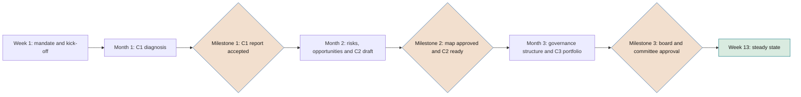

# SEVEN-G implementation guide

**How to adopt the framework: scope, prerequisites, 90-day plan and roadmap up to being able to declare that it is applied**

| | |
|---|---|
| Document | Document 90 · Implementation guide |
| Version | 0.1 (working draft) |
| Date | 16-09-2026 |
| Author | Fernando García Varela |
| Status | Draft for review. Time limits and targets are indicative and will be adjusted through practical application. |

<!-- cifras: 2 | implementation scopes ; 13 | weeks of initial plan ; 7 | conditions for declaring that it is applied ; 18 | months as the maximum roadmap horizon -->

---

> **Legal notice and disclaimer.** SEVEN-G is a reference methodological framework provided "as is" and for information purposes only. It does not constitute legal, regulatory, financial or professional advice, nor does it guarantee compliance with any law or standard. References to general regulation (such as the EU AI Act, the GDPR, DORA or NIS2), to technical standards and to regulation specific to each sector or jurisdiction may be incomplete, may not apply to a particular case or may become out of date as a result of regulatory changes, interpretations or supervisory positions after their consultation date. **Each organisation that uses SEVEN-G is solely responsible for identifying the regulation that applies to it, verifying that it is current and certifying its own regulatory compliance**, with the appropriate qualified advice. The author accepts no liability for any use made of this content or for any decisions taken on the basis of it. The data, figures, companies and cases in the examples are fictitious or illustrative.

<!-- esencial: siempre | Starting point for implementation: choose the scope (section 2), follow the minimum path if it is Lite (section 2.4), meet the prerequisites and carry out the 90-day plan. The time limits are indicative; the completion criteria (section 4.5) are not. -->

## 1. Purpose and scope

This guide explains how an organisation adopts SEVEN-G for the first time. It develops the first implementation envisaged in 01 §5.3 —concentrating C1 to C3 into ninety days— and the subsequent roadmap until the conditions for the declaration of application are met (01 §14).

It is aimed at whoever leads the implementation (normally the head of the future AI Office), the sponsor in senior management and the risk, compliance and internal audit functions.

This document does not constitute legal advice.

### 1.1 What implementing SEVEN-G means

| Milestone | What has been achieved |
|---|---|
| **Day 90** | Diagnosis with evidence (C1), direction proposed or approved (C2), first portfolio (C3), bodies, roles, *gates*, metrics and reporting cadence up and running. |
| **Months 4–18** | The framework operates on a steady-state basis: new initiatives go through the lifecycle, existing ones are regularised, the board exercises oversight with the dashboard. |
| **Declaration of application** | The seven conditions in 01 §14 are met, substantiated with the **(§14)** questions of document 11 in a verified assessment. |

---

## 2. Choosing the implementation scope

### 2.1 Company-level Lite or Enterprise

The **implementation scope** is a company decision on how it organises its governance. **It does not replace the intensity of each initiative**: in a company with a Lite scope, any initiative that meets a criterion in 01 §9.2 is managed with Enterprise intensity.

| Aspect | Lite scope | Enterprise scope |
|---|---|---|
| **Typical organisations** | Medium-sized, unregulated or with light sector-specific regulation, small portfolio. | Regulated groups (financial services, insurance, energy, healthcare, public sector), several subsidiaries or countries, broad portfolio. |
| **AI Committee** | Existing management committee with an extended mandate. | Specific committee or existing committee with its own session and the composition in 01 §8.3. |
| **Board committee** | Whichever committee already oversees risk or audit, with AI as a recurring item. | Risk, audit or technology committee with an express mandate over AI. |
| **AI Office** | One person with part-time dedication and occasional support. | Methodology, portfolio and measurement team. |
| **AI Auditor** | Internal audit or external auditor, by sampling in Lite and at every Enterprise *gate*. | Third line with assigned AI Auditors. |
| **Maturity** | Verified assessment. | Verified assessment and, at least every two years, an independent one (document 11). |
| **Board dashboard** | Aggregated. | By initiative for Enterprise initiatives. |
| **Indicative horizon up to 01 §14** | 6 to 12 months. | 12 to 18 months. |

**Size does not determine the scope**: the criteria in section 2.2 do. A medium-sized company without sector-specific supervision or high-risk systems applies a Lite scope; a small company subject to prudential supervision applies an Enterprise scope. Both scopes apply the same lifecycle, the same evidence and the same segregation of duties rules; what changes is how the bodies and verification are organised.

### 2.2 Selection criteria

An **Enterprise scope** is chosen if at least one of these criteria is met; otherwise, Lite:

1. The company is subject to prudential or sector-specific supervision that requires formal governance of technology or model risk (for example, financial institutions subject to DORA).
2. It has or plans high-risk AI systems under the EU AI Act.
3. It has or plans agents with A2 or A3 autonomy over customers, money, personal data or production systems.
4. It operates as a group with several companies or countries that must follow a common framework.
5. The approved or planned portfolio includes several simultaneous Transform bets (indicatively, three or more; value to be calibrated in C2).

**A single Transform bet does not change the scope.** That initiative is managed with Enterprise intensity (01 §9.2) and the board approves it at G2 and, if it scales, at G7 (01 §7.5); the rest of the portfolio remains in a Lite scope. The scope is reviewed at each annual review (C5), or earlier if the company comes to meet any of these criteria.

### 2.3 Perimeter

The perimeter may be the whole company or a part of it (a subsidiary, a country, a business unit). Implementing first in a reduced perimeter is valid, but **the declaration of application only covers the implemented perimeter** and must say so. The AI system inventory, however, should cover the whole company from the outset, because risk does not respect perimeters.

### 2.4 Minimum path in a Lite scope

> **Why it matters.** A medium-sized company does not need to go through the whole library to get started. It needs to know what is mandatory from day one, what is added only when an Enterprise initiative appears and what it can consult when needed. Without that path, the framework looks heavier than it is and the company ends up applying Enterprise to everything or applying nothing.

**Mandatory from the start**

| Element | Minimum in a Lite scope | Reference |
|---|---|---|
| **Initial reading** | Documents 00 and 01, this guide, the adaptation to small organisations in the governance model and, in the *gate* criteria, the Lite column of each gate. | 00; 01; 30 §11; 21 §2.1 |
| **Three safeguards** | Those who build do not verify or decide on their own work; the risk clearance is issued by someone independent of the team; the board approves the direction and the risk appetite. | 30 §11 |
| **Bodies** | Board with an AI item at least quarterly; executive committee with a monthly AI item; AI Office of one part-time person. | 01 §5.2; 30 §11; section 7 |
| **Inventory** | All AI systems —in-house, third-party, corporate use and unauthorised use— with a completeness statement. It is not reduced in Lite. | 32; P05; T01 |
| **Intensity** | Determination for each initiative: in phase 0, at G3 and at each R6. | 01 §9; P04; T04 |
| **Evidence for a Lite initiative** | The evidence that the *gate* criteria mark "Yes" or "Simpl." in the Lite column, with templates without the *(Enterprise)* fields. No mandatory evidence is omitted: it is simplified. | 01 §6.10; 21 §2.1; P01–P31 |
| **Gates** | G0–G2 in one session, G3 separately, G4–G5 in one session, half-yearly R6 and G7. Each gate keeps its criteria and its record in P29. | 21 §3.4 |
| **Verification and decision** | The AI Office verifies; the sponsor decides, with risk clearance at G3, G4 and G5; the AI Auditor reviews a sample of Lite *gates* every half-year. | 01 §9.3; 21 §10.3 |
| **Risks** | Risk register from phase 3 with the scale in document 33. | 33; P12; T06 |
| **Value** | Measurement rules, baseline and tracking of realised value; aggregated board dashboard. | 40; P09; P28; T17 |
| **Diagnosis** | Maturity with a verified assessment and transformation index at C1 and at each C5. | 11; 12; T15; T14 |

**Added only when an initiative meets an Enterprise criterion**

| What is added | Reference |
|---|---|
| Separate gates, full templates and decision by the AI Committee (by the board for Transform). | 01 §7.5, §9.3 |
| AI Auditor at every *gate* of that initiative, external if there is nobody independent in-house. | 01 §9.3; 38 |
| Multi-level sign-off with veto for go-live and quarterly R6. | 21 §9; P23 |
| Visibility by initiative in the board dashboard. | 60; T17 |
| Depending on the criterion met: regulatory classification and impact assessments; security of A2 or A3 agents; N2 or N3 requirements for suppliers. | 32, 34, P11; 35, P18; 36, P14 |

The rest of the library is consulted when needed: ambition and portfolio (10, 13, 14), phase manuals and checklists (20, 22), adoption and people (23, 50), policies (31), incidents (37), indicators and costs (41, 42, 43), data, operation and construction (51, 52, 53), board (60, 61, 62) and application cases (92), which includes Lite initiatives of medium-sized companies.

The matrix in document 94 extends this path to the whole library: it gives the obligation level of each document, template and tool, the triggers that activate each module and what can be grouped at the gates; each document summarises its minimum part in its "The essentials" box. The [SEVEN-G course](curso/M00_SEVEN-G_Curso_Guia_del_curso.html) follows the same path in short modules.

---

## 3. Prerequisites

| Prerequisite | Compliance criterion |
|---|---|
| **Senior management sponsorship** | Implementation mandate signed by the executive chair or the chief executive officer, with objective, perimeter, scope and time limit. |
| **Board awareness** | The board or its board committee is aware of the plan and has a session reserved in weeks 12–13 to approve C2. |
| **Implementation lead** | Appointed person with sufficient dedication (indicatively, most of their working time during the 90 days in Enterprise). |
| **Core team** | Representatives from business, technology, data, risk, compliance, security, data protection, human resources and management control, with allocated time. |
| **Third line informed** | Internal audit is aware of the plan and designates who will verify maturity. |
| **Legal counsel** | Available for the regulatory classification of priority systems. |
| **Access to information** | Procurement, licences, supplier contracts, architecture, risk register and budgets. |
| **Register support** | T01 with its inventory (T02) or, if the company prefers, a spreadsheet with the fields of the data model in 03 §4 (and the record in 03 §3.3). |
| **No general moratorium** | AI activity continues during implementation; only what the diagnosis identifies as unacceptable risk is stopped. |

---

## 4. 90-day plan

### 4.1 Overview

<!-- grafico: 90-day plan | Three months, three outcomes and one board decision -->

Each milestone is accepted by the implementation sponsor together with the AI Committee (or the management committee while the former has not been set up). If a milestone is not met, it is replanned for the following month; no progress is made with empty deliverables.

### 4.2 Month 1 · Diagnosis (C1)

| Week | Activities and deliverables | Owner | Documents, templates and tools | Completion criterion |
|---|---|---|---|---|
| **1 · Kick-off** | Implementation mandate (P32); Lite or Enterprise scope and perimeter; core team; calendar of bodies with the board session reserved; internal communication; request for maturity evidence; cut-off date. | Sponsor and implementation lead | 00, 01, 90; evidence list in document 11 | Mandate signed; board session reserved; evidence request sent. |
| **2 · Inventory** | Census of AI systems: in-house, third-party, corporate use and unauthorised use (based on procurement, licences, contracts and security controls). Registration with actual status. Initial screening of Enterprise criteria and possible prohibited practices. | AI Office with technology, procurement and security | 03; P05; T02, T01; T04 | Each area head signs an inventory completeness statement (P32, annex). Possible prohibited practices escalated immediately. |
| **3 · Evidence and interviews** | Maturity interviews by dimension; review of evidence and sampling; collection of current value and cost with their status; data for the eight index signals. | Assessment team | 11; 12; 40; T15, T14, T12 | Seven dimensions with at least two interviews each; samples selected. |
| **4 · C1 report** | Scoring, calibration and independent verification of maturity; transformation index profile; current sphere map; portfolio value and cost; C1 report (P33, with maturity from P34). | Lead assessor; independent verifier | 10, 11, 12; T15, T14, T16 | **Milestone 1:** C1 report verified and accepted. Urgent risks treated as a nonconformity (01 §12). |

### 4.3 Month 2 · Risks and opportunities

| Week | Activities and deliverables | Owner | Documents, templates and tools | Completion criterion |
|---|---|---|---|---|
| **5 · Risks** | Workshops by sphere on existing systems; main risk matrix using the scale in document 33; regulatory classification of priority systems; regularisation order. | AI Risk Owner with legal counsel | 33, 34, 32; P11, P12; T06, T07 | Systems with Enterprise criteria classified or with a classification date; High and Critical risks with an owner. |
| **6 · Opportunities** | Workshops by sphere with the reference questions; opportunity portfolio with an understandable record; proposed ambition; value with a formula marked as estimated. | AI Office with the business areas | 10, 61; P06, P07, P31; T05 | Opportunities from all spheres with value at the planned ambition, or a record that there are none. |
| **7 · Consolidation and C2 draft** | Risks and opportunities by sphere with owner, economic impact and timeframe; draft AI thesis, ambition per sphere and risk appetite; draft thresholds (Enterprise investment, horizon, reference time limits, nonconformity time limits, concentration limits, maturity weights). | Implementation lead with senior management | 13, 14; T19 | Complete draft with all the sections of C2 (01 §5.1). |
| **8 · Challenge** | Review with senior management and with the second line; proposed framework budget and envelopes by ambition lane; regularisation time limits. | Sponsor | 13, 14 | **Milestone 2:** risk and opportunity map approved; C2 proposal ready for the board. |

### 4.4 Month 3 · Governance structure (C2 and C3)

| Week | Activities and deliverables | Owner | Documents, templates and tools | Completion criterion |
|---|---|---|---|---|
| **9 · Bodies and roles** | Mandates of the AI Committee, the AI Office and the board committee (P38); roles in 01 §8 in existing initiatives with an incompatibility check; AI Auditor designated. | Sponsor; board secretariat | 01 §8, 30; P03; T01 | Mandates drafted; roles assigned without incompatibilities. |
| **10 · Gates and policies** | *Gate* criteria (21) and checklists (22) adopted; reference time limits; corporate and acceptable use policy; nonconformity process. | AI Office; compliance | 21, 22, 31, 37; P04, P29; T03, T08 | *Gate* manager configured; policies in final draft. |
| **11 · Metrics, reporting and portfolio** | Measurement rules adopted; first version of the board dashboard; register of recommendations; reporting calendar (01 §5.2); first prioritised portfolio with envelopes, tranches and regularisation plan. | AI Office; management control; committee | 40, 60, 62, 14; P28; T17, T18, T01, T16 | Dashboard generated with inventory data; portfolio with scoring and owners. |
| **12 · Approvals** | The board approves the thesis, ambition per sphere, risk appetite, thresholds and corporate policy (C2). The committee approves the portfolio, *gates*, metrics and regularisation plan (C3). | Sponsor; AI Committee; board | 13, 14, 31 | Minutes with the approvals. |
| **13 · Steady state** | First ordinary meeting of the committee; first *gates* under the new model; 6–18-month roadmap approved; lessons from the implementation; communication to the organisation. | Implementation lead | 90; T01, T03 | **Milestone 3:** criteria in section 4.5 met. |

If the board cannot approve C2 in week 12, the portfolio operates with provisional criteria approved by the committee, **no Transform initiatives are approved** and approval is taken to the next board session.

### 4.5 Completion criteria for the 90 days

| # | Criterion | Evidence |
|---|---|---|
| 1 | Inventory with a completeness statement from all areas in the perimeter. | T02; signed statements (P32, annex). |
| 2 | Maturity assessment verified and transformation index calculated. | C1 report (P33); T15; T14. |
| 3 | Risks and opportunities by sphere with owner, economic impact and timeframe. | Approved map. |
| 4 | Thesis, ambition per sphere, risk appetite and thresholds approved by the board, or approval date set with provisional criteria. | Minutes. |
| 5 | Bodies with a mandate, roles assigned without incompatibilities and AI Auditor designated. | Mandates; P03. |
| 6 | *Gates*, reference time limits and nonconformity process operational. | T03; T08. |
| 7 | Board dashboard and register of recommendations with real data. | T17; T18. |
| 8 | First prioritised portfolio and regularisation plan with time limits. | Committee minutes; T01. |
| 9 | Every new initiative goes through G0 before consuming budget from week 13. | T01. |

---

## 5. Regularisation of existing initiatives and systems

The full procedure is in document 14, section 11. During implementation it is applied as follows:

| Type | When | Treatment |
|---|---|---|
| **Systems in production with Enterprise criteria** | Classification in month 2; review equivalent to G7 within six months of C2. | First those that are high-risk, involve decisions about people, direct exposure and agents that act. |
| **Other systems in production** | Within 12 months of C2. | Review equivalent to G7 with simplified evidence. |
| **Initiatives under construction or in pilot** | From week 13. | They are placed in the phase that corresponds to their actual evidence and pass the next *gate*. |
| **Corporate use of general-purpose AI** | Inventory in month 1; acceptable use policy in month 3. | Authorise, replace or block; training and technical controls. |
| **Unauthorised use detected** | From month 1. | Nonconformity with containment proportionate to the risk; authorise, replace or block (01 §1.2). |

Regularisation documentation is identified as such and bears its actual date. It does not substantiate past *gates*.

---

## 6. 6- to 18-month roadmap

### 6.1 Stages

| Period | Objective | Outcomes |
|---|---|---|
| **Months 4–6 · Consolidation** | Ensure the lifecycle works with all new initiatives. | Complete register; first verified *gates*; regularisation of priority systems; first quarterly board review with the dashboard; training in SEVEN-G roles; AI literacy programme under way. |
| **Months 7–12 · Extension** | Ensure everything that exists is within the framework. | Complete regularisation; current R6 in all initiatives in production; nonconformities managed with time limits; costs per use case; first audit of the framework by the third line in an Enterprise scope. |
| **Months 13–18 · First review (C5)** | Check progress and adjust direction. | Maturity verified with the same questionnaire; transformation index recalculated; thesis reviewed; recalibration of time limits and thresholds; declaration of application where appropriate. |

In a Lite scope, the stages may be compressed to reach the declaration between months 6 and 12.

### 6.2 Path to the conditions in 01 §14

| Condition in 01 §14 | Questions in document 11 | Indicative timing (Lite / Enterprise) | Owner |
|---|---|---|---|
| 1. C1 and C2 completed with board approval | D1.05 | Month 3 / month 3–4 | Sponsor |
| 2. Inventory with classification, intensity and owner; register with traceability | D6.05, D2.05 | Month 6 / month 9 | AI Office; AI Risk Owner |
| 3. Roles and bodies with incompatibilities | D1.07, D1.08 | Month 3 / month 4 | AI Committee |
| 4. New initiatives with *gates* recorded | D2.06 | Month 4 / month 6 | AI Office |
| 5. Current continuity review in production | D4.07 | Month 9 / month 12–15 | Operations owners |
| 6. Measurement rules and board dashboard | D7.05, D7.06 | Month 6 / month 9–12 | Management control; AI Office |
| 7. Nonconformities with the process in 01 §12 | D6.07 | Month 6 / month 9 | AI Risk Owner; audit |

The declaration is based on a verified assessment with all of those questions answered "Yes" and with regularisation within the time limit (document 11, section 7.3).

---

## 7. Minimum roles in a small organisation

SEVEN-G does not require new structures to be created. In a small organisation, with a Lite scope, the following allocation is sufficient, provided that the incompatibilities in 01 §8.2 are respected:

| Role or body | Who can take it on | Condition |
|---|---|---|
| **Board or board committee** | The board or its audit or risk committee. | AI as a recurring item, at least quarterly. |
| **AI Committee** | Management committee with an extended mandate. | Monthly session with its own AI agenda. |
| **AI Office** | One person with part-time dedication (for example, from strategy, transformation or management control). | Cannot verify initiatives in which they take part. |
| **Sponsor** | Head of the area that obtains the value. | In Lite, may combine the product, technical and operations roles. |
| **Product, Technical and Operations Owners** | People from the area or the supplier, with an internal owner. | Compatible with each other. |
| **AI Risk Owner** | Head of compliance, risk or security who does not take part in the construction. | Incompatible with the sponsor and with whoever builds. |
| **AI Auditor** | Internal audit or external auditor. In Lite, may be the same person as the AI Risk Owner. | In Enterprise initiatives, must be different from the AI Risk Owner: if there is no other person, an external auditor. |

**Practical minimum: three different people** —whoever drives and builds, whoever controls risks and verifies in Lite, and the AI Office—, plus an external auditor for Enterprise initiatives.

---

## 8. Common mistakes

| Mistake | Consequence | How to avoid it |
|---|---|---|
| Starting by buying or building tools. | Empty registers and technical discussion instead of decisions. | Spreadsheet with the model in 03 until the process is working. |
| Diagnosis by self-assessment. | Inflated maturity that does not withstand the first audit. | Verified assessment with sampling (document 11). |
| Creating a parallel governance structure. | Duplicated committees and internal rejection. | Extend the mandate of existing bodies (01 §8.3). |
| Applying Enterprise to everything. | Slowness and flight towards unauthorised use. | Intensity by initiative with the criteria in 01 §9. |
| General AI moratorium during implementation. | Loss of support and of opportunities. | Stop only what the diagnosis flags as unacceptable risk. |
| Not reserving the board session from the outset. | C2 not approved and portfolio without direction. | Reservation in week 1. |
| Forgetting corporate use and unauthorised use. | Partial inventory and invisible risk. | Census from procurement, licences and security in week 2. |
| Documenting after the fact to "comply". | Major nonconformity and loss of credibility. | Regularisation documentation identified and dated. |
| Adding released capacity as savings. | Inflated value presented to the board. | Measurement rules from month 1 (rule 3). |
| Prioritising everything by immediate return. | No Transform bet reaches production. | Ambition lanes with their own envelopes (document 14). |
| AI Auditor dependent on the sponsor. | Verification without independence. | Third line or external auditor. |
| Open-ended regularisation time limits. | Legacy systems outside the framework indefinitely. | Time limits approved in C2 and tracked by the committee. |
| Presenting implementation as certification. | Mistaken expectations on the part of the board and third parties. | Declaration of application with its perimeter; audit of the framework separately. |

---

## 9. Implementation indicators

The targets are indicative and are set by the company in its plan.

| Indicator | Definition | 90-day target | 12-month target | Source |
|---|---|---|---|---|
| Inventory coverage | Areas in the perimeter with a completeness statement ÷ total. | 100 % | 100 % reviewed during the year | T02 |
| New initiatives with G0 prior to spending | New initiatives with G0 before the first expenditure ÷ new initiatives. | 100 % from week 13 | 100 % | T01 |
| Systems with Enterprise criteria classified | Classified ÷ systems with Enterprise criteria. | All with classification or date | 100 % | T02 |
| Regularisation | Initiatives in production regularised ÷ total predating the framework. | Plan approved | 100 % | T01 |
| Roles without incompatibilities | Active initiatives without incompatibilities ÷ total. | 100 % | 100 % | T01 |
| *Gate* decision time | Median against the reference time limit (03 §3.6). | — | Within the time limit | T01 |
| Current R6 | Initiatives in production with a current R6 ÷ total. | — | 100 % | T01 |
| Amounts with status | Amounts with formula and status ÷ amounts reported. | 100 % in the C1 report | 100 % | T12 |
| Proportion of validated value | Validated value ÷ total value reported. | Baseline | Target set in C2 | T12, T17 |
| Overdue nonconformities | Open with an expired time limit. | Baseline | 0 critical; major ones decreasing | T08 |
| AI literacy | Staff who use or oversee AI trained ÷ total. | Programme approved | Target set in C2 | Training record (P45) |
| Conditions in 01 §14 | Conditions substantiated ÷ 7. | At least 2 | 7 in Lite; progress according to the roadmap in Enterprise | T15 |

---

## 10. Associated tools and templates

| Period | Tools | Templates |
|---|---|---|
| **Month 1** | T01, T02, T04 (inventory and register); T15 (maturity); T14 (index); T16 (sphere map); T12 (current value). | P32, P33, P34, P05 |
| **Month 2** | T06 (risks); T07 (regulatory classification); T05 (ambition); T19 (thesis and appetite). | P35, P43, P06, P07, P11, P12, P31 |
| **Month 3** | T03 (*gates*); T08 (nonconformities); T17 (dashboard); T18 (recommendations); T01 and T16 (portfolio). | P36, P38, P39, P40, P41, P03, P04, P28, P29 |
| **Months 4–18** | All of the above; T09, T10, T11, T13, T20, T21, T22 as the portfolio progresses. | P01–P31 according to the phase of each initiative; P42 and P67 every quarter; P37 in C5; the rest of P32–P71 when applicable |

Tools without an application of their own are applied with the template or document indicated in the catalogue in 03. A company that prefers not to use T01 may keep the register in a spreadsheet with the fields of the data model in 03 §4.

---

## 11. Related documents

| Document | Relationship |
|---|---|
| **00 · What SEVEN-G is** | Overview, first implementation and measurement rules. |
| **01 · Foundational methodology** | Corporate cycle (§5), first implementation (§5.3), roles (§8), intensity (§9), nonconformities (§12) and declaration of application (§14). |
| **03 · Tools and initiative register** | Register, data model, reference time limits and tool catalogue. |
| **10, 12 and 13** | Sphere map, transformation index, thesis and risk appetite. |
| **11 · Maturity model** | Month 1 diagnosis and substantiation of 01 §14. |
| **14 · Portfolio management** | First portfolio and regularisation. |
| **21, 22, 30, 31, 33, 34, 37, 40, 60, 62** | Content of the month 3 governance structure. |
| **95 · Local data and self-hosting** | Where the tools' data stays and how to host the site within the company. |
| **91 · Guide for consultants** | External support for the implementation. |

---

## 12. Version control

| Version | Date | Changes |
|---|---|---|
| 0.1 | 16-09-2026 | First version. Defines the company-level Lite or Enterprise implementation scope, the prerequisites, the week-by-week 90-day plan, regularisation, the 6- to 18-month roadmap up to 01 §14, minimum roles, common mistakes and implementation indicators. |
| 0.1 | 19-09-2026 | Size does not determine the scope (2.1); a single Transform bet does not require an Enterprise scope (2.2); minimum path in a Lite scope (2.4); references to pending documents or tools removed. |
| 0.1 | 19-09-2026 | The minimum path (2.4) refers to the obligation matrix (document 94), to the "The essentials" box of each document and to the course. |
