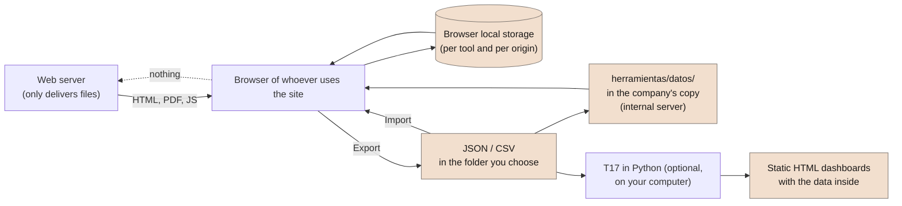

# Where your data is and how to install SEVEN-G on your own server

**How the site works, why what you enter never reaches a server, and how to download the project to host it yourself, with one installation per client**

| | |
|---|---|
| Document | Document 95 · Local data and self-hosting |
| Version | 0.1 (working draft) |
| Date | 22-09-2026 |
| Author | Fernando García Varela |
| Status | Draft for review. Describes the site and the tools as published on the date of the document. |

<!-- cifras: 0 | data stored on the server ; 1 | HTML file per tool ; 2 | ways to install it ; 1 | web origin per client -->

---

> **Legal notice and disclaimer.** SEVEN-G is a reference methodological framework provided "as is" and for information purposes only. It does not constitute legal, regulatory, financial or professional advice, nor does it guarantee compliance with any law or standard. References to general regulation (such as the EU AI Act, the GDPR, DORA or NIS2), to technical standards and to regulation specific to each sector or jurisdiction may be incomplete, may not apply to a particular case or may become out of date as a result of regulatory changes, interpretations or supervisory positions after their consultation date. **Each organisation that uses SEVEN-G is solely responsible for identifying the regulation that applies to it, verifying that it is current and certifying its own regulatory compliance**, with the appropriate qualified advice. The author accepts no liability for any use made of this content or for any decisions taken on the basis of it. The data, figures, companies and cases in the examples are fictitious or illustrative.

> **This document describes how the site works technically; it does not replace the organisation's own assessment.** Anyone about to enter a company's real data into the tools, or to host the site on their own server, should assess with their security and data-protection officers whether that use complies with their policies. What is stated here about where data is stored can be checked in the code of the repository, which is public.

---

<!-- esencial: condicional | Trigger: a company's real data is going to be entered into the tools, or the site is going to be installed on your own server (a consultancy, a partner or an independent consultant working for several clients). Rule that is never skipped: the data entered into the tools lives only in the browser of whoever enters it; the backup is the exported JSON; each client needs its own web origin. -->

## 1. Purpose and scope

This document answers three questions asked by those who start using SEVEN-G with real data:

1. **How the site works**: what each part is (documents, templates, tools, dashboard generator, community) and where it runs.
2. **Where the data you enter is**: why it never reaches a server, where it is stored, what does leave the browser and where it goes, and how to make a backup.
3. **How to download the project and install it on your own server**: where to download it from, what to copy, what is needed to regenerate it and how to set up a separate installation for each client, which is what a consultancy, a partner or an independent consultant needs.

It applies to the site published at <https://seachad.github.io/AI_CONSULTING/> and to the public repository it comes from, <https://github.com/seachad/AI_CONSULTING>. The licences (content CC BY 4.0, code MIT) and the conditions for use by third parties are in document 93; the rules for consultants, in document 91.

---

## 2. How the site works

The site is a **set of static files**: HTML pages, PDFs, Word templates and presentations, plus the tools. There is no application on the server, no database and no form that sends data to the author. The server only delivers files; everything that is calculated, stored or drawn happens in the browser of whoever uses it.

| Part | What it is | Where it runs | What it stores and where |
|---|---|---|---|
| Documents, templates and course | HTML pages generated from Markdown, with their PDF; templates also in Word. | In the browser; PDFs and Word files are downloaded. | Nothing. Only reading preferences (theme, text size, history of pages visited) in the browser's local storage. |
| Tools T01, T11, T14 and T15 | **A single HTML file** each, with the complete application and some fictitious demonstration data embedded. | Entirely in the browser. They need no server: they also work when the file is opened from disk. | **The data you enter, wherever you choose with the "Datos: …" button in their bar**: only in your browser (default), in a JSON file on your computer or, in a copy of the site on the company's server, in the `herramientas/datos/` folder (section 3). They export and import JSON and CSV. |
| Board dashboard (T17) | The full dashboard, the mobile dashboard and the recommendations register, generated from the T01 register. They carry the connector embedded in JavaScript and **regenerate themselves in the browser** from the register stored in it or from `herramientas/datos/T01_registro.json` in the company's copy. The Python generator (`t01_a_panel.py`) is optional: it produces the same dashboards as static files to send. | In the browser; the Python generator, on the computer of whoever runs it. | Nothing new in the browser. The files generated with Python **contain the data**. |
| Community page | Issues and improvement requests for the framework, with votes. | In the browser; **it is the only page that sends anything**: the text you write, to a public GitHub repository through an intermediary. | The identifier you choose, in your browser. What is sent becomes public on GitHub (section 3.3). |
| Code index ("Go to code", "Cited here") | A generated JavaScript file with the destinations of every code in the framework. | In the browser. | Nothing. |

<!-- grafico: Data flow | Everything you enter stays in the browser or in files the organisation controls -->

> **Why it matters.** A tool that works without a server cannot lose data on the server, requires no subscription and does not force the company to trust a third party with the custody of its initiative portfolio. In exchange, custody is yours: if the data is only in a browser, the backup is made by whoever enters it (section 3.4).

---

## 3. Where the data you enter is

### 3.1 In the browser, not on the server

When you open a tool for the first time, the browser copies the demonstration data into its **local storage** (*localStorage*), an area each browser reserves per site on the computer itself. From then on, every change you make —a new initiative, a gate decision, a risk, a calculation— is saved there, instantly and without anything travelling over the network.

That is the first of three possible places. The **"Datos: …"** button in the bar of each tool says which one is in use and opens the **"Dónde están mis datos"** (Where is my data) dialog to change it (document 03 §2.1):

| Where | What for | What to know |
|---|---|---|
| **Only in the browser** (default) | Trying it out with your own data without installing anything. | What this section describes: one browser, one computer; lost when the browser is cleared. |
| **A JSON file on your computer** | Serious work by one person or a small team. | The tool rewrites the file on every change and reads it again when opened (Microsoft Edge or Google Chrome). Same format as "Export"; it can live in a synchronised folder of the company. |
| **The copy of the site on the company's server** | So that the whole company sees the same version of the portfolio. | The copy carries the `herramientas/datos/` folder with each tool's file, loaded instead of the demonstration data (section 4.3). Changes are still saved in each browser or in a file; publishing a new version means replacing the file. |

In the browser, each tool uses its own key:

| Tool | Local storage key |
|---|---|
| T01 · Initiative register | `seveng-t01-datos-v1` |
| T11 · Value hypothesis calculator (with T13) | `seveng-t11-datos-v1` |
| T14 · Transformation index calculator | `seveng-t14-datos-v1` |
| T15 · Maturity diagnosis | `seveng-t15-datos-v1` |

T11, T14 and T15 also read the T01 register stored in the same browser when opened from it (`?desde=t01`), and return their results to the register by import: the register is the source of truth for the other tools (document 03 §4.1). All of this happens inside the browser.

The server hosting the site has no way of receiving that data: there is no entry point that accepts it. This can be checked in the code of each tool, which is a single readable HTML file, and in the absence of any program on the server.

### 3.2 What it means in practice

| Consequence | Explanation |
|---|---|
| **The data belongs to one browser and one computer.** | What you enter in Edge is not seen by Chrome, and what you enter on your laptop does not appear on another computer. There is no synchronisation, because there is no server to synchronise. To take the register to another computer, export and import it (section 3.4), keep it in a file on your computer or use the company's copy (section 3.1). |
| **It depends on the web origin.** | Local storage is separated by *origin* (protocol, domain and port). The register saved at `https://seachad.github.io` is different from the one saved in your own installation, and a file opened from disk (`file://`) has its own isolated storage. That is why each client needs its own origin (section 4.5). |
| **Clearing browser data deletes it.** | If you clear history and site data, or use a private window, the data disappears. The only durable copy is the exported JSON. |
| **Several people, several browsers.** | The tools are single-user per browser. A team working on the same register does so in turns with the JSON: one person exports, another imports; T01 can import several files and **merge them by code** (for example, one register per area). |
| **Generated files carry the data.** | An exported JSON, a CSV or a board dashboard generated with T17 contain the company's information. Treat them like any confidential document: whoever sends a dashboard by email or messaging sends their data. |
| **The author of SEVEN-G cannot see your data.** | Neither the site nor the tools send it to him, and there is no account to associate it with. |

### 3.3 What does leave the browser, and where it goes

So that the statement above can be verified, this is the complete list of what the site sends or loads from outside:

| What | When | Where to | What it contains |
|---|---|---|---|
| **An issue, a request or a vote** | Only if you send them from the community page. | To an intermediary of the author and from there to a **public** GitHub repository, as an issue. | The title and text you write, and the identifier you chose. **It becomes public**: do not write client data or internal information in it. The intermediary keeps no logs of the requests. |
| **Aggregate visit measurement** | Only on the public site `seachad.github.io`; never on `localhost`, on files opened from disk or on your own installation. | To Umami, an open-source tool. | Page visited, country and device type, in aggregate; no cookies, no IP address, no personal data; it honours the "Do Not Track" signal. The community page and the board dashboards are not measured. Document 04 §6.2. |
| **Fonts** | When opening the documents, the home page and the site's entry page. The tools and the dashboards **load no external resource**. | To the Google Fonts servers. | The request for the font, which like any web request includes the IP address of whoever makes it. No data from the tools. In your own installation it can be removed (section 4.4). |
| **Page requests** | Always, as on any website. | To the server hosting the site (GitHub Pages on the public site; yours in your own installation). | The page requested and the IP address, in the server logs, under the policy of whoever hosts it. Never the content of the tools. |

Nothing else. There are no accounts, contact forms, newsletters or tracking pixels, and the site never contacts anyone on its own initiative (document 04 §6.2).

### 3.4 Backup and moving between computers

The most convenient way, in Microsoft Edge or Google Chrome, is to choose **"A JSON file on your computer"** in the "Where is my data" dialog: the tool saves every change to that file and reads it again when opened, so the backup makes itself and the file can live in a synchronised folder of the company. In any browser, and to take the data to another computer:

1. In the tool, go to **Data → Export → Full JSON** (in T01) or the equivalent export button (T11, T14, T15). A JSON file with all the content is downloaded.
2. Save it where the company keeps its documents: it is the backup, the means to share it and the input of the dashboard generator (T17).
3. On another computer or browser, **Data → Import JSON**. T01 validates the file before loading it and lets you **replace** the current register or **merge** several files by code.
4. **Restore demo data** and **Delete the data saved in this browser** (T01 Data view) ask for confirmation and remind you to export first.

Recommendation: export at the end of every relevant working session and before any browser clean-up, and keep the JSON files dated.

### 3.5 Before entering real data

- Decide with security and data protection whether the browser and the computer comply with the company's policies (disk encryption, session lock, separate browser profiles).
- Avoid entering unnecessary personal data: the register needs owners by role, not people's private data.
- If you work for several clients, use a different web origin per client (section 4.5) or, at the very least, export and delete the local data when switching client.
- Do not paste a client's data into the community page.

> **Why it matters.** Most incidents with tools of this kind do not come from an attack on the server —there is no server to attack here— but from a JSON shared with the wrong person, a forwarded dashboard or a shared laptop without separate profiles. Knowing exactly where the data is lets you apply the company's usual policies, without inventing anything new.

---

## 4. Installing SEVEN-G on your own server

### 4.1 For whom and why

Anyone can use the public site as it is. Your own installation makes sense when:

- a **consultancy, a partner or an independent consultant** works with several clients and wants a separate installation per client, with its data and its dashboard;
- a **company** prefers to serve the framework from its intranet, with its own branding added and no external dependencies;
- you want to **adapt** documents, templates or tools (derivative work) and publish the adapted version.

In every case the licences in document 93 apply: credit the author, indicate the changes, keep the legal notice and do not present the installation as certified or endorsed by the author (document 91 §6).

### 4.2 What to download and from where

The complete project is in the public repository **<https://github.com/seachad/AI_CONSULTING>** (code MIT, content CC BY 4.0). Two ways to get it:

| Way | How | When it suits |
|---|---|---|
| **ZIP download** | *Code → Download ZIP* button of the repository, or directly <https://github.com/seachad/AI_CONSULTING/archive/refs/heads/main.zip>. | To install once, without development tools. |
| **Clone with Git** | `git clone https://github.com/seachad/AI_CONSULTING.git` | To update with `git pull`, to fork with your own changes or to publish with GitHub Pages. |

What the repository contains:

| Folder | Content | Needed in an installation |
|---|---|---|
| `index.html`, `en/index.html`, `LICENSE`, `LICENCIA_CONTENIDOS.md` | Site home page in both languages and licences. | Yes. |
| `SEVEN-G/html`, `SEVEN-G/pdf`, `SEVEN-G/docx`, `SEVEN-G/pptx` | Documents, templates and course already generated, in both languages, with the code index (`codigos.js`). | Yes. |
| `SEVEN-G/herramientas` | The tools T01, T11, T14 and T15 (one HTML each, plus their sources and demonstration data), the T17 generator with its engine, the community page and the data map. | Yes. |
| `SPHERES/html`, `SPHERES/pdf`, `SPAD/html`, `SPAD/pdf` | The supporting methodologies, already generated. | Yes, if you want to serve them. |
| `SEVEN-G/mds`, `SPHERES/mds`, `SPAD/mds` | The Markdown sources of all of the above. | Only if you are going to adapt and regenerate. |
| `SEVEN-G/build` | The generator (`build.ps1`), the template, the styles, the graphic components, the code index, the local review server and the coherence checks. | Only if you are going to regenerate. |
| Folders whose name starts with `_` or `.` | The author's working material, non-current versions and repository configuration. | No; they are not published. |

The repository **contains nobody's data**: the tools carry fictitious demonstration data (document 93 §9) and real data never enters it.

### 4.3 Option A · Serve the site as it is

This is the option for those who want the site on their server without changing anything. No generation is needed: the HTML, PDF and other outputs are already in the repository.

1. Download or clone the repository (section 4.2).
2. Copy to the root of the server **only what is publishable**, which is exactly what the repository's GitHub Pages workflow publishes (`.github/workflows/pages.yml`): `index.html`, `en/`, `LICENSE`, `LICENCIA_CONTENIDOS.md`, `SEVEN-G/html`, `SEVEN-G/pdf`, `SEVEN-G/docx`, `SEVEN-G/pptx`, `SEVEN-G/herramientas`, `SPHERES/html`, `SPHERES/pdf`, `SPAD/html` and `SPAD/pdf`, excluding any folder whose name starts with `_`. With PowerShell 7, `pwsh -File SEVEN-G/build/publicar.ps1 -SinGenerar -Destino <folder>` prepares that copy (it warns if it cannot find the author's private list of forbidden terms; in your own installation that warning can be ignored or replaced by your own list).
3. Serve it with any static file server: IIS, nginx, Apache, static storage in the cloud, the corporate intranet or GitHub Pages of a fork (section 4.7). It requires no module, database or special configuration; the `.html`, `.js`, `.json`, `.pdf`, `.docx` and `.pptx` files should be served with their usual content types.
4. **Serve it over `http` or `https`, not as loose files.** Opening the HTML files by double-clicking works, but the browser isolates the local storage of each file: the theme is not shared, T11/T14/T15 do not see the T01 register, the full dashboard does not hand over to the mobile one and the code index does not load. For a local test, `pwsh -File SEVEN-G/build/servidor.ps1` and open `http://localhost:8765/`.
5. Check the home page, a document, the T01 register and the example dashboard. Links are relative: the site can live at the root of the domain or in a subfolder.
6. So that the whole company sees the same portfolio, create in the copy the folder `SEVEN-G/herramientas/datos/` with the JSON files exported by the tools you use: `T01_registro.json`, `T11_calculadora.json`, `T14_indice.json` and `T15_madurez.json`. Served over http, the tools load them instead of the demonstration data and **the board dashboard regenerates itself in the browser** from `T01_registro.json` (`datos_t01` key of `config_panel.json`, already set in the example). Publishing a new version of the portfolio means replacing the file (document 03 §2.1).

What happens with your own installation compared with the public site:

- **Nothing is measured.** Visit measurement is only activated on the domains listed in `SEVEN-G/build/analitica.json` (today, only `seachad.github.io`); on any other domain the code index does not load the Umami script. If you want to measure your own installation, put your own identifier and domain in that file and regenerate (section 4.4).
- **The community page still points to the author's public repository.** That is desirable if you want your users to be able to propose improvements to the framework; if not, set `endpoint: ''` in the `config` block of `SEVEN-G/herramientas/comunidad/index.html` (it becomes read-only) or remove the page and its button from the home page.
- **The documents load the Google Fonts typefaces.** If your policy requires it, remove the `fonts.googleapis.com` link from `SEVEN-G/build/plantilla.html` and from the home pages and regenerate: the stylesheet defines fallback typefaces.

### 4.4 Option B · Adapt and regenerate

To change texts, add the consultancy's branding, translate or adapt templates, you edit the Markdown and regenerate everything. Requirements and commands (Windows; the generator is written in PowerShell 7 and uses Microsoft Edge for the PDFs, with no Node, Python or pandoc):

| What | Requirement | Command |
|---|---|---|
| Documents, templates, course, library index and code index (HTML, PDF, Word) | PowerShell 7 and Microsoft Edge. | `pwsh -File SEVEN-G/build/build.ps1` (everything) · `-Metodologias SEVEN-G` · `-Filter '03_*.md'` (one document) · `-SinPdf` |
| Courses as presentations (PPTX) and their PDF | PowerShell 7; PowerPoint only to export the PDF (optional). | Run by `build.ps1`. |
| Tools T01, T11, T14 and T15 | PowerShell 7 (Edge for the T14 and T15 calculations from T01). | `pwsh -File SEVEN-G/herramientas/T01_registro_iniciativas/build_registro.ps1` and the equivalent `build_*.ps1` scripts. |
| Dashboard generator (T17), only to publish the dashboard as static files (for example, to send them): on the site, the dashboard regenerates itself in the browser. | Python 3.11 or later with `uv` (optional). | `uv run python t01_a_panel.py --t01 <register.json> --salida <folder>` from `SEVEN-G/herramientas/T17_panel_consejo`. |
| Coherence checks before publishing | PowerShell 7, Edge; `uv` to check the dashboard. | `pwsh -File SEVEN-G/build/verificar_coherencia.ps1` |

Generator rules worth knowing: the Markdown is the source of truth and the HTML, PDF and Word files are never edited by hand; every document exists in Spanish and English; the Markdown conventions (cover, figures, Mermaid, "The essentials" box) are in the header of `build.ps1`; and every derivative work must indicate the changes and keep the legal notice (document 93 §8 and §11.9).

### 4.5 One installation per client

This is the case of a consultancy, a partner or an independent consultant. The central rule is simple: **each client needs its own web origin**, because the browser's local storage is separated by origin and not by folder. Two clients served from `https://consultancy.example/client-a/` and `https://consultancy.example/client-b/` **would share** the register saved in the consultant's browser; served from `https://client-a.consultancy.example/` and `https://client-b.consultancy.example/` (or from different ports locally), they do not.

Checklist per client:

| Step | What to do | Where |
|---|---|---|
| 1 | One origin per client: its own subdomain, domain or port. | Web server. |
| 2 | A register that starts with the client's data and not with the demonstration: in the client's copy, the folder `SEVEN-G/herramientas/datos/` with its exported `T01_registro.json` (and, if used, `T11_calculadora.json`, `T14_indice.json` and `T15_madurez.json`); the tools load them instead of the demonstration. Alternative without a data folder: build `registro.html` from the client's JSON; with `meta.datos_ilustrativos` absent or `false` the "example initiatives" band disappears. | `datos/` folder of the copy, or `pwsh -File build_registro.ps1 -Datos <client.json> -Salida <registro.html>` in `SEVEN-G/herramientas/T01_registro_iniciativas`. |
| 3 | The client's board dashboard regenerates itself in the browser from that `T01_registro.json` (`datos_t01` key of `config_panel.json`) or from the register stored in the browser. Only if you want to publish it as static files to send, generate it with T17 in Python, with the client's name and acronym and its own copy of `config_panel.json` (thresholds, lifecycle, links back to the site, `codigos`). | `uv run python t01_a_panel.py --t01 <client.json> --salida <folder> --organizacion "<Client>" --sigla <CA>` |
| 4 | The client's data, outside the repository and the published folder: the exported JSON files and the generated dashboards are kept in the client's or the consultancy's document repository, with its access control. | Document management. |
| 5 | Community and measurement: decide whether the community page keeps pointing to the public project (recommended) and do not activate any measurement of the client's users without their consent (section 4.3). | `comunidad/index.html`, `analitica.json`. |
| 6 | Branding and credit: you may add the consultancy's branding and its adaptation, indicating the changes and keeping the authorship and the legal notice (document 93 §4 and §8); you may not present the installation as certified or as an "official partner" (document 91 §6.2). | Home page and adapted documents. |
| 7 | When switching client on the same computer, export and **Delete the data saved in this browser** in each tool, or use separate browser profiles. | Data view of each tool. |

With this, each client has its site, its register, its dashboard and its data, without anything from one client mixing with another's and without anything reaching the author of SEVEN-G.

### 4.6 Updating to a new version

The framework is a living project. To incorporate a new version:

1. If you cloned the repository, `git pull`; if you downloaded it, download the ZIP again. Data is not lost because it is never in the repository.
2. Copy what is publishable again (section 4.3) or regenerate (section 4.4).
3. Registers exported with an earlier version of the T01 schema **remain valid**: the tools update the schema on import and new versions only add optional fields (project decision D53).
4. Review the framework's version history in document 04 §2.3 and the version control of each document to see what has changed.

### 4.7 Fork on GitHub with Pages

A partner wanting to publish its adapted version can fork the repository on GitHub: the `.github/workflows/pages.yml` workflow is already prepared and publishes only what is publishable on every push to `main`. Just enable *Settings → Pages → Source: GitHub Actions* in the fork. The resulting site is public; for a private installation per client, use option A on your own server.

> **Why it matters.** For a consultancy, being able to offer each client a separate installation, hosted wherever the client decides and with no dependency on the author, removes the most common objection —"where does my data go?"— and turns the framework into a working tool of its own. Having the procedure documented and repeatable is what makes it possible to do it for the second client just like the first.

---

## 5. Frequently asked questions

| Question | Answer |
|---|---|
| Can the author of SEVEN-G see what I enter in the tools? | No. The data stays in your browser and there is no server of the author's that receives it. |
| What about GitHub, which hosts the public site? | GitHub delivers the site's files and logs requests like any web server; it does not receive the content of the tools, which never leaves the browser. |
| Is the data encrypted in the browser? | Local storage is kept in the browser profile, with the operating system's protections (disk encryption, user session). It adds no encryption of its own; that is why the backup and access control to the computer are yours. |
| Can I use the tools offline? | Yes. Once the HTML file is downloaded it works without a network. Served from a local server (`servidor.ps1`) as well. |
| How does a team work on the same register? | With the JSON: a file on your computer in a synchronised folder (every change is saved to it), the `herramientas/datos/` folder of the company's copy, which everyone sees, or export and import (replace or merge by code). There is no simultaneous editing. |
| Can I put the site on an intranet with no internet connection? | Yes, with option A. Only the external fonts will stop loading (there are fallback fonts) and the community page will not be able to send or read issues. |
| What happens if the author stops publishing the site? | What you downloaded keeps working and remains under the same licences: published versions cannot be revoked (document 93 §10). |

---

## 6. Related tools and templates

| Code | Name | Relationship with this document |
|---|---|---|
| T01 | Initiative register | Stores the data in the browser; exports and imports the full JSON; build with your own data (`build_registro.ps1 -Datos`). |
| T11, T14, T15 | Value calculator, transformation index and maturity diagnosis | Same operation; they read the T01 register of the same browser. |
| T17 | AI dashboard for the board | Regenerates itself in the browser from the T01 register; the Python generator is optional and its files contain the data. |
| P70 | Proposal and engagement letter | Where a consultancy records where the client's installation and data are hosted. |

---

## 7. Related documents

| Document | Relationship |
|---|---|
| **03 · Tools and initiative register** | Tool design principles (§2: no server, the company's data, navigable codes), where the tools' data lives and how to set up the company's copy (§2.1) and data map between tools (§4.1). |
| **04 · Where SEVEN-G comes from and why it is open** | What the site does and does not do with those who visit it (§6.2) and the framework's version history (§2.3). |
| **90 · Implementation guide** | Prerequisites and a company's 90-day plan. |
| **91 · Guide for consultants** | Use of the framework by third parties, independence and use of the name. |
| **93 · Licence, use by third parties and citation** | Licences, derivative works, notice that must be kept, fictitious data and permanence of published versions. |

---

## 8. Version control

| Version | Date | Changes |
|---|---|---|
| 0.1 | 22-09-2026 | First version: how the site works, where the data entered is stored (only in the browser), what leaves the browser and where it goes, backup, and installation on your own server from the public repository, with one installation per client for consultancies, partners and independent consultants. |
