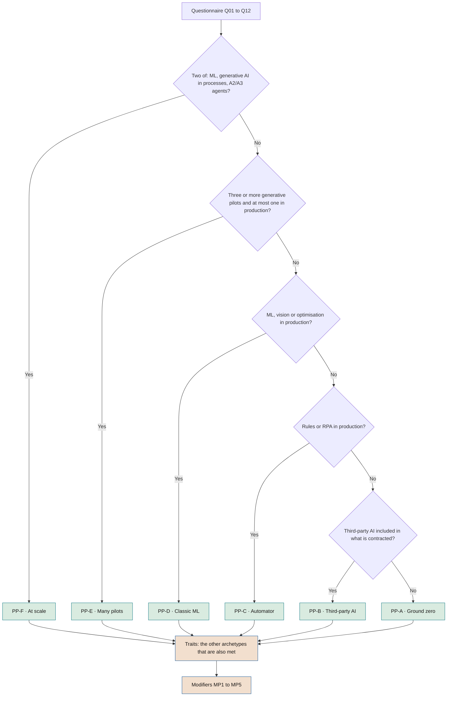
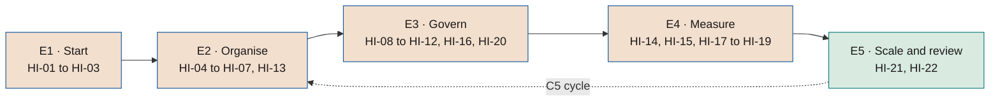

# Starting points and implementation journey

**Where each company starts according to the AI and governance it already has, what it does at each stage, who does it and with what evidence, without lowering what the framework requires in the end**

| | |
|---|---|
| Document | Document 96 · Starting points and implementation journey |
| Version | 0.1 (working draft) |
| Date | 28-09-2026 |
| Author | Fernando García Varela |
| Status | Draft for review. Guidance document: it orders the rules of documents 01, 11, 90 and 94, which prevail; it creates no new rules. |

<!-- cifras: 6 | typical starting points ; 5 | modifiers ; 22 | journey milestones ; 5 | stages up to the declaration of application -->

---

> **Legal notice and disclaimer.** SEVEN-G is a reference methodological framework provided "as is" and for information purposes only. It does not constitute legal, regulatory, financial or professional advice, nor does it guarantee compliance with any law or standard. References to general regulation (such as the EU AI Act, the GDPR, DORA or NIS2), to technical standards and to regulation specific to each sector or jurisdiction may be incomplete, may not apply to a particular case or may become out of date as a result of regulatory changes, interpretations or supervisory positions after their consultation date. **Each organisation that uses SEVEN-G is solely responsible for identifying the regulation that applies to it, verifying that it is current and certifying its own regulatory compliance**, with the appropriate qualified advice. This methodology is a generic, free aid shared with the community so that nobody has to start from scratch; each person or organisation can and should adapt it to its own use. It must not be inferred that its legally sensitive parts have been reviewed by legal counsel: those reviews, for each company or sector, are the ultimate responsibility of the company, consultant or organisation that uses it. Although every effort is made to keep it up to date, some regulation may have changed without being reflected here. To the fullest extent permitted by law, the author accepts no responsibility whatsoever for the effects of its application in any organisation or for its full applicability. The methodology does not grant certification of any kind. The author accepts no liability for any use made of this content or for any decisions taken on the basis of it. The data, figures, companies and cases in the examples are fictitious or illustrative.

---

<!-- esencial: recomendado | Used to choose the order of implementation according to the company's starting point (no AI, third-party AI, automation, ML, many pilots or at scale). Rule that is never skipped: the starting point changes the order, the emphasis and the timetable, never what is required in the end; the seven conditions of the declaration of application (01 §14) are the same for everyone. Tool T23 runs the questionnaire and produces the plan. -->

## 1. Purpose and scope

The implementation guide (document 90) describes **what** must be in place and within what maximum time limit: Lite or Enterprise scope, prerequisites, 90-day plan, regularisation of what already exists and roadmap up to the declaration of application. But companies do not start from the same place. One with no AI in production and another with forty predictive models and two agents that act need **to start with different things**, even though they must reach the same destination.

This document answers three questions:

1. **Where is the company starting from?** Six typical starting points (archetypes), five modifiers and a twelve-question questionnaire to assign them (section 2).
2. **What does it do first, what next, and who does it?** Five stages and twenty-two milestones, each with its evidence, the question from document 11 that substantiates it and its priority according to the starting point (sections 3 and 4), plus what falls to each role (section 5).
3. **What does it look like in practice?** Three fictitious journeys (section 6).

Tool **T23 · Implementation journey** applies this document: it runs the questionnaire, assigns the starting point and shows the journey prioritised by stage and by role.

> **Why it matters.** If a company with no AI starts by setting up every body, it ends up in bureaucracy without use cases. If a company with agents in production starts with the use case record, it leaves uncontrolled what is already acting on customers or money. The starting point decides **what is done first**, not what is required in the end.

**What this document does not do.** It creates no rules: phases, gates, roles, time limits and conditions are in documents 01, 20, 21, 30 and 90, and the obligation level of each piece in 94. If this document diverges from them, they prevail. Nor does it replace the maturity diagnosis (document 11): it uses it.

---

## 2. Starting points

### 2.1 The six archetypes

| Code | Archetype | How it is recognised | Typical risk | Where it starts | What can wait |
|---|---|---|---|---|---|
| **PP-A** | Ground zero | No own AI in production and none knowingly contracted. There is usually unauthorised use of generative assistants. | Unauthorised use with company data; ideas without an owner. | Mandate and sponsor; inventory of unauthorised use; acceptable use policy and basic literacy; use case record (P01) and T01 register for the first ideas. | Regularisation (there is nothing to regularise); agent security and operation, until a case reaches phase 4. |
| **PP-B** | Third-party AI user | Assistants in the office suite, SaaS with AI included or contracted AI; it does not develop. | AI that comes in without passing through any gate (54 §5); licence costs without measured adoption. | Inventory of the AI included in what is contracted (36 §8, P55); requirements on suppliers N1–N3 (36, P14); acceptable use policy; measuring the assistant as a cross-unit initiative with a ladder by unit (40 §7.2). | In-house building (53) and part of the technical cycle, until it builds something. |
| **PP-C** | Automator | Rule-based automation or RPA in production, with a centre of excellence or automation team; little or no AI that learns. | Confusing automation with AI; moving from bots to agents (A2/A3) without the controls of document 35. | Turning the centre of excellence into the seed of the AI Office (30); an inventory that separates what is AI from what is not (32); a portfolio of cases that replace rules with AI, each with its record. | Its process discipline is an asset: redesigning the process end to end (IT-P2) comes more easily to it. |
| **PP-D** | Analytics and classic ML | Predictive models in production, a data team and, sometimes, model validation. | Models in production without a continuity review; generative AI coming in outside model governance. | Regularisation of what is in production (90 §5, review equivalent to G7); bringing existing model validation into G5 and R6; drift and monitoring (52); inventory with regulatory classification. | The gap is generative AI: knowledge sources (51; D3.08), evaluation with test sets (D4.08) and bias in responses (52 §4.2.7). |
| **PP-E** | Many pilots | Several generative AI proofs of concept (as a guide, three or more) and none or one in production. | "Pilot purgatory": cost without value and without a decision to stop. | Registering every pilot in T01 in its real phase; G3 as the stop gate and the funnel to stop or scale; value hypothesis and baseline (40, P08, P09) before more budget. | The full structure of bodies: first the decision on the portfolio, then the rest. |
| **PP-F** | At scale | At least two of these three things in production: predictive ML, generative AI integrated into processes and agents that act (A2/A3). | Regulatory and security exposure that is already real; governance lagging behind use. | Segregated roles and AI Auditor immediately; complete inventory with classification; agent security (35) and suppliers (36); regularisation prioritised by risk; board dashboard and transformation index. | Nothing: everything is mandatory and urgent. |

> **Why it matters.** Naming the starting point avoids two opposite mistakes: copying the plan of another company that started from somewhere else, and believing that, because something already exists (a data committee, an automation centre), there is no need to adapt it.

### 2.2 Assignment rule

It is applied in this order and the **first archetype** whose conditions are met is assigned. Later archetypes whose conditions are also met are added as **traits**: their priority milestones are added to the journey (section 4.2, rule 5).

| Order | Archetype | Condition |
|---|---|---|
| 1 | PP-F | At least two of {predictive ML, generative AI integrated into processes, A2 or A3 agents} in production. |
| 2 | PP-E | Three or more AI pilots under way, mostly generative AI, and at most one generative AI system in production. |
| 3 | PP-D | Predictive ML, vision or optimisation with learning in production. |
| 4 | PP-C | Rules or RPA in production, with no AI that learns in production. |
| 5 | PP-B | Third-party AI included in products or corporate assistants, with no in-house build in production. |
| 6 | PP-A | None of the above. |

<!-- grafico: How the starting point is assigned | The first archetype that is met is assigned; the following ones that are also met are traits -->

Example: a company with ML in production, four generative pilots not in production and RPA receives **PP-E with traits PP-D and PP-C**. It starts by stopping or scaling the pilots, but it also regularises its models and makes use of its automation centre.

### 2.3 Modifiers

| Code | Modifier | Effect on the journey |
|---|---|---|
| **MP1** | Regulated sector (financial services, insurance, healthcare, energy, public sector…) | Brings forward the inventory with classification (HI-05), regulatory mapping (34) and resilience (DORA or NIS2, where applicable). |
| **MP2** | Decisions about people, high risk or direct exposure to customers | Brings forward the impact assessments (P11, P47, P48), human oversight (P17) and the independent risk owner (HI-10). |
| **MP3** | Company-level Enterprise scope (90 §2.2) | Enterprise timetable of 90 §6.2. Without MP3, Lite timetable and minimum path of 90 §2.4. |
| **MP4** | Reusable prior governance (model validation, data committee, centre of excellence, certified management system) | The corresponding milestones are **mapped and validated**: what exists is adapted and the correspondence is documented, instead of creating it anew (section 4.2, rule 3). |
| **MP5** | No sponsor in senior management | **Blocks**: before any other milestone, the prerequisites of 90 §3 must be met. It is not one more milestone: it is a precondition. |

> **Why it matters.** Two companies of the same archetype do not have the same journey if one is supervised by a sector regulator or makes decisions about people. The modifiers capture those differences without multiplying the archetypes.

### 2.4 Classification questionnaire

Twelve questions. The answers refer to what is **in production** (in real use), unless the question says otherwise. Tool T23 proposes them from the T01 register when there is one.

| Code | Question | Answers | Feeds |
|---|---|---|---|
| **Q01** | What types of systems are in production today? (several answers) | None · rules or RPA · third-party AI included in products or assistants · predictive ML, vision or optimisation · generative AI integrated into processes · agents that execute actions (A2/A3) | Archetypes; technology footprint (11 §7.6) |
| **Q02** | How many AI pilots or proofs of concept are under way? | 0 · 1–2 · 3–5 · more than 5 | PP-E |
| **Q03** | How many of those pilots are generative AI? | None · some · most | PP-E |
| **Q04** | Is there evidence of unauthorised use of AI assistants with company data? | Yes · No · Not known | Priority of HI-02 and HI-03 |
| **Q05** | What governance exists today over models, automation or data? | None · partial (model validation, centre of excellence, data committee) · formal system | MP4 |
| **Q06** | Is there an inventory of AI systems? | No · partial · complete with an owner | Priority of HI-05 |
| **Q07** | Is the company in a regulated sector? | Yes · No | MP1 |
| **Q08** | Does AI make or support decisions about people, is it exposed to customers or could it be high risk? | Yes · No · Not known | MP2 |
| **Q09** | Is any Enterprise scope criterion of 90 §2.2 met? | Yes · No | MP3 |
| **Q10** | Is there a member of senior management with written responsibility for AI? | Yes · No | MP5 (if no); D1.01 |
| **Q11** | Do management or the board receive a periodic report or dashboard on AI? | None · management · the board | HI-15; D7.04 and D7.06 |
| **Q12** | Does the company have its own data or AI development team? | Yes · No · through third parties | PP-B and PP-D; HI-20 |

"Not known" is treated as "yes" for priority purposes: if nobody knows whether there is unauthorised use or decisions about people, finding out comes first.

---

## 3. The five stages

| Stage | Objective | Reference in document 90 |
|---|---|---|
| **E1 · Start** | There is a sponsor and a mandate, and it is known what AI exists. | Week 1 and month 1 (90 §4.2) |
| **E2 · Organise** | Everything is in the register and in the inventory, and decisions are taken on the portfolio. | Months 1–3 (90 §4.2–§4.3) |
| **E3 · Govern** | Bodies, segregated roles, risks and lifecycle in operation. | Months 3–6 (90 §4.4, §6.1) |
| **E4 · Measure** | Value measured, dashboard at management and board level, operation under control. | Months 4–12 (90 §6.1) |
| **E5 · Scale and review** | Audit, annual C5 review, recalculated index and declaration of application. | Months 12–18 (90 §6.1–§6.2) |

<!-- grafico: The five stages of the journey | Each stage groups milestones; the starting point changes the order within them, not the stages -->

The stages overlap: a company may be measuring the value of its first cases (E4) while it finishes regularising the older ones (E3). What is not done is to skip a stage.

---

## 4. The journey milestones

### 4.1 What each milestone is, who does it and how it is substantiated

Each milestone states what must be in place, who leads it, with which template or tool, **which question from document 11 substantiates it** and the base month from document 90 (Lite / Enterprise).

| Milestone | Stage | What must be in place | Who | Evidence | Question 11 | Base month (Lite / Enterprise) |
|---|---|---|---|---|---|---|
| **HI-01** | E1 | Sponsor in senior management and implementation mandate with a perimeter | Board or chief executive; sponsor | P32 | D1.01 | Week 1 |
| **HI-02** | E1 | Inventory of corporate use and of unauthorised use of AI | AI Office; security | P05; T01 (T02); T21 | D6.03 | 1 / 1 |
| **HI-03** | E1 | Acceptable use policy and basic literacy | AI Office; people function | 31; P43; P45 | D1.04; D5.03 | 3 / 3 |
| **HI-04** | E2 | Use case record and initiative register with every idea and pilot in its real phase | AI Office; product owners | P01; T01 | D2.01; D2.03 | 1–3 / 1–3 |
| **HI-05** | E2 | Complete inventory with regulatory classification, intensity and owner, including third-party AI | AI Office; risk; legal | P04; P05; P07; 32; 36 §8 | D6.05 | 6 / 9 |
| **HI-06** | E2 | C1 diagnosis: verified maturity, transformation index and technology footprint | AI Office; independent assessor | P33; P34; T15; T14 | D7.08 | 1–2 / 1–2 |
| **HI-07** | E2 | Thesis, ambition by sphere and risk appetite approved by the board (C2) | Sponsor; board | P35; 13 | D1.05 | 3 / 3–4 |
| **HI-08** | E3 | AI Committee, AI Office and board committee set up | Executive committee; board | P38; 30 | D1.07 | 3 / 4 |
| **HI-09** | E3 | Segregated roles in each initiative: product, technical and operations owners, independent risk owner and AI Auditor (in Enterprise, at every *gate*) | AI Committee | P03; P41; 01 §8 | D1.08 | 3 / 4 |
| **HI-10** | E3 | Independent AI Risk Owner and risk register with the scale of document 33 from phase 3 | AI Committee; risk | 33; P12; P13; T06 | D6.04; D6.06 | 6 / 9 |
| **HI-11** | E3 | Lifecycle with recorded *gates* for every new initiative | AI Office; *gate* decision-makers | 20; 21; 22; P29; T03 | D2.06 | 4 / 6 |
| **HI-12** | E3 | Regularisation of what is in production (review equivalent to G7, highest risk first) | Operations owners; AI Auditor | 90 §5; 14 §11; P30 | D4.07 | 6–12 / 6–12 |
| **HI-13** | E2 | Decision to stop or scale each pilot, with G3 as the stop gate and the T01 funnel | AI Committee | 21 §6.4; T01 | D2.04; D2.09 | 4 / 6 |
| **HI-14** | E4 | Value measurement rules, baseline and falsifiable hypothesis in each initiative from G2 | Management control; business owners of the benefit | 40; P08; P09; T11 | D2.08; D7.03; D7.05 | 6 / 9 |
| **HI-15** | E4 | Periodic report to management and board dashboard | AI Office; board committee | 60; P67; T17 | D7.04; D7.06; D1.09 | 3 (management) · 6 / 9–12 (board) |
| **HI-16** | E3 | Agent security and requirements on suppliers N1–N3 | Security; procurement; risk | 35; 36; P14; P18; P55 | D6.08 | Before G5 |
| **HI-17** | E4 | Operation under control: manual, monitoring and drift, tested rollback and a current R6 | Operations owners | 52; P24; P25; P65 | D4.05; D4.06; D4.07 | 9 / 12–15 |
| **HI-18** | E4 | Nonconformities and incidents with the process of 01 §12 | Risk; internal audit | 37; P50; P26 | D6.07 | 6 / 9 |
| **HI-19** | E4 | Adoption and people: adoption plan, released capacity kept separate from savings and information to workers' representatives | People function; business owners of the benefit | 23; 50; P20; T20 | D5.07; D5.08; D5.09 | Before G4 |
| **HI-20** | E3 | Data and knowledge with an owner, legal basis and validity, including generative AI sources | Data owners; data protection | 51; P64 | D3.03; D3.05; D3.08 | 6 / 9 |
| **HI-21** | E5 | First audit of the framework by the third line or by an external party | Internal audit | 38; P58–P61 | D6.10 | 12 / 12 |
| **HI-22** | E5 | C5 review: maturity recalculated with the same questionnaire, index, revised thesis and declaration of application | AI Committee; board | P37; P61; 01 §14 | D1.11 | 6–12 / 13–18 |

### 4.2 Priority of each milestone according to the starting point

Keys: **1**, start now (months 1–2); **2**, in its stage (months 3–6); **3**, later (months 7–18); **C**, map and validate what already exists; **D**, when the trigger appears (first initiative in that phase, first agent, first supplier…); **·**, does not apply yet.

| Milestone | PP-A | PP-B | PP-C | PP-D | PP-E | PP-F |
|---|---|---|---|---|---|---|
| **HI-01** | 1 | 1 | 1 | 1 | 1 | 1 |
| **HI-02** | 1 | 1 | 1 | 1 | 1 | 1 |
| **HI-03** | 1 | 1 | 2 | 2 | 1 | 1 |
| **HI-04** | 1 | 2 | 1 | 1 | 1 | 1 |
| **HI-05** | 2 | 1 | 2 | 1 | 2 | 1 |
| **HI-06** | 1 | 1 | 1 | 1 | 1 | 1 |
| **HI-07** | 2 | 2 | 2 | 2 | 2 | 2 |
| **HI-08** | 2 | 2 | C | C | 2 | 1 |
| **HI-09** | 2 | 2 | 2 | 1 | 2 | 1 |
| **HI-10** | D | 2 | 2 | 1 | 1 | 1 |
| **HI-11** | 2 | 2 | 2 | 2 | 1 | 1 |
| **HI-12** | · | 2 | 2 | 1 | 2 | 1 |
| **HI-13** | D | D | 2 | 2 | 1 | 2 |
| **HI-14** | 2 | 2 | 2 | 2 | 1 | 2 |
| **HI-15** | 2 | 2 | 2 | 2 | 2 | 1 |
| **HI-16** | D | 1 | D | 2 | D | 1 |
| **HI-17** | D | · | D | 1 | D | 1 |
| **HI-18** | 3 | 2 | 2 | 2 | 2 | 1 |
| **HI-19** | D | 1 | 2 | 2 | 2 | 1 |
| **HI-20** | D | · | 2 | C | 2 | 1 |
| **HI-21** | 3 | 3 | 3 | 3 | 3 | 3 |
| **HI-22** | 3 | 3 | 3 | 3 | 3 | 3 |

The base month in document 90 is the limit; the priority only brings it forward or pushes it back within that limit. The modifiers adjust the priority as follows:

- **MP1** and **MP2** move HI-05 and HI-10 to **1** (and, with MP2, HI-19 when there is an initiative that changes people's work).
- **MP4** changes to **C** the milestones covered by existing governance, provided that the correspondence is documented.
- **MP5** blocks the whole journey until HI-01 is met.

### 4.3 Journey rules

1. **HI-01 comes before everything.** With MP5, the journey does not start.
2. **No required milestone disappears.** "·" only means "does not apply yet": the milestone appears when its trigger is activated (01 §9; triggers in document 94).
3. **Mapping and validating requires verified correspondence.** "C" means adapting what already exists and documenting its correspondence with what SEVEN-G requires, verified by whoever verifies the *gates* (D31). A declared "we already have it" does not count.
4. **A milestone is met when its question from document 11 is at "Yes" in a verified assessment.** Until then it may be "in progress". In this way, advancing along the journey **is** raising maturity with evidence, not completing a parallel checklist.
5. **Traits.** With traits, each milestone takes the most urgent priority between the main archetype and its traits, in this order: 1, 2, C, D, 3, ·.
6. **The destination is the same.** The declaration of application (01 §14) requires the same of every archetype, within the time limits of 90 §6.2.

> **Why it matters.** The journey answers "what do I do on Monday" without lowering what is required. Because each milestone is substantiated with a question from document 11, the committee can follow progress with the same diagnosis the board will use.

---

## 5. What falls to each role

The table is derived from the "Who" column of section 4.1: it adds no responsibilities.

| Role | E1 · Start | E2 · Organise | E3 · Govern | E4 · Measure | E5 · Scale and review |
|---|---|---|---|---|---|
| **Board** | HI-01 | HI-07 | HI-08 | HI-15 (dashboard) | HI-22 |
| **Sponsor** | HI-01 | HI-07 | — | — | — |
| **Executive committee** | — | — | HI-08 | — | — |
| **AI Committee** | — | HI-13 | HI-09, HI-10 | — | HI-22 |
| **AI Office** | HI-02, HI-03 | HI-04, HI-05, HI-06 | HI-11 | HI-15 | — |
| **AI Risk Owner** | — | HI-05 | HI-10, HI-16 | HI-18 | — |
| **AI Auditor** | — | — | HI-12 | — | — |
| **Internal audit** | — | — | — | HI-18 | HI-21 |
| **Security and procurement** | HI-02 | — | HI-16 | — | — |
| **Legal and data protection** | — | HI-05 | HI-20 | — | — |
| **Product owners** | — | HI-04 | — | — | — |
| **Operations owners** | — | — | HI-12 | HI-17 | — |
| **Management control** | — | — | — | HI-14 | — |
| **Business owners of the benefit** | — | — | — | HI-14, HI-19 | — |
| **People function** | HI-03 | — | — | HI-19 | — |
| **Data owners** | — | — | HI-20 | — | — |
| **Independent assessor** | — | HI-06 | — | — | — |

In a small organisation several of these functions are performed by the same person, within the limits of 90 §7 and 30 §11: whoever builds does not verify or decide on their own work, and risk clearance is issued by someone independent of the team.

---

## 6. Three example journeys

The three cases are **fictitious** and only illustrate how the order changes.

### 6.1 Medium-sized industrial company, PP-A

An industrial company of about a thousand employees has no AI in production. The questionnaire reveals unauthorised use of generative assistants in engineering and procurement (Q04 = yes) and that nobody in senior management has been assigned AI in writing (Q10 = no: **MP5**).

- **Week 1.** The chief executive assigns AI to the chief operating officer and signs the mandate (HI-01). Only then does the journey begin.
- **Months 1–2.** Inventory of unauthorised use (HI-02), acceptable use policy and a literacy session for engineering and procurement (HI-03), T01 register with the seven ideas in circulation (HI-04) and C1 diagnosis (HI-06).
- **Months 3–6.** Thesis and appetite approved by the board (HI-07), committee and a one-person part-time AI Office (HI-08) and lifecycle for the two ideas that pass G0 (HI-11). The risk register (HI-10) arrives when the first initiative enters phase 3.

### 6.2 Insurer, PP-D with trait PP-E, MP1, MP2 and MP4

An insurer has twelve predictive models in production (pricing, fraud, churn), a model validation function and five generative AI pilots not in production. It is a regulated sector (**MP1**), it makes decisions about people (**MP2**) and it has prior governance (**MP4**).

- **Months 1–2.** Mandate (HI-01) and complete inventory with regulatory classification, in which pricing is identified as potentially high risk (HI-05, brought forward by MP1). Segregated roles in the twelve models (HI-09). Risk register with the scale of document 33 (HI-10). The existing model committee **is mapped and validated** as part of the AI Committee, with its correspondence documented (HI-08 at C).
- **Months 2–4.** The five pilots go through G3 (HI-13): two proceed, three are stopped with their reason recorded. Regularisation of the models starts with pricing (HI-12).
- **Months 4–9.** Drift and monitoring under document 52 in production (HI-17), knowledge sources for the two generative cases that proceed (HI-20) and board dashboard (HI-15).

### 6.3 Services company, PP-B

A professional services company has deployed a generative assistant in the office suite for 1,800 people and uses three SaaS products with AI included. It does not develop.

- **Months 1–2.** Inventory of the AI included in what is contracted (HI-05, with 36 §8), N1–N3 requirements on the three suppliers and on the assistant's supplier (HI-16), acceptable use policy (HI-03) and adoption plan (HI-19).
- **Months 2–6.** The assistant is registered as **a single cross-unit initiative** and measured by unit with the ladder of 40 §7.2: full cost, adoption, declared released capacity and materialised value. Two units below the adoption threshold review the deployment.
- **Later.** When the first in-house case appears, the technical cycle and operation are activated (HI-17, at D).

---

## 7. Relationship with other documents

| Document | Relationship |
|---|---|
| **90 · Implementation guide** | Defines what must be in place and within what maximum time limit. This document orders those elements according to the starting point. |
| **11 · Maturity model** | Each milestone is substantiated with a question from the questionnaire. The three-lens reading (§7.6) adds the technology footprint, which is obtained from the same answers to Q01 or from the T01 register, and the minimum governance it requires. |
| **12 · Transformation index** | The impact reach (§3.7) says whether AI touches tasks, processes, people or the business model. |
| **94 · Obligation matrix** | Level of each document, template and tool, and triggers that activate the milestones marked "D". |
| **01 · Foundational methodology** | Conditions of the declaration of application (§14), the same for every archetype. |

---

## 8. Associated tools and templates

| Code | Tool or template | Use in the journey |
|---|---|---|
| **T23** | Implementation journey | Questionnaire, archetype, traits and modifiers; journey prioritised by stage and by role; milestones met according to T15; printable plan and CSV. |
| **T01** | Initiative register | Proposes the answers to Q01 to Q03 from the initiatives in use and the pilots. |
| **T15** | Maturity diagnosis | Marks milestones as met when their questions are at "Yes"; three-lens view. |
| **P32** | Implementation mandate | HI-01. |
| **P33** · **P34** | C1 report · maturity questionnaire and report | HI-06. |
| **P35** | Thesis and appetite | HI-07. |

---

## 9. Related documents

| Document | Relationship |
|---|---|
| **90 · Implementation guide** | Scope, prerequisites, 90-day plan, regularisation and roadmap. |
| **11 · Maturity model** | Questions that substantiate each milestone and three-lens reading. |
| **12 · Transformation index** | Impact reach. |
| **14 · Portfolio management** | Regularisation of initiatives that predate the framework (§11). |
| **30 · Governance model** | Bodies, roles and incompatibilities; adaptation to small organisations (§11). |
| **54 · Organising the company for AI** | Where use cases come from and what comes in without passing through the gate. |
| **94 · Obligation matrix** | Obligation levels and triggers. |

---

## 10. Version control

| Version | Date | Changes |
|---|---|---|
| 0.1 | 28-09-2026 | First version: six starting points, assignment rule, five modifiers, twelve-question questionnaire, five stages, twenty-two milestones with their evidence, the question from document 11 that substantiates them and their priority by archetype, roles by stage and three fictitious journeys. Assignment thresholds and priorities, to be validated. |
