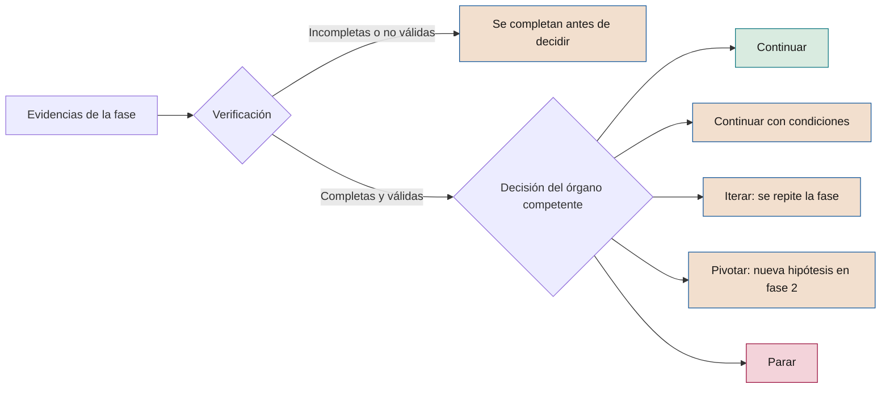

# Metodología fundacional de SEVEN-G

**Modelo, principios, ciclos de gobierno, puertas de decisión y roles**

| | |
|---|---|
| Documento | Documento 01 · Metodología fundacional |
| Versión | 0.1 (borrador de trabajo) |
| Fecha | 16-09-2026 |
| Autor | Fernando García Varela |
| Estado | Borrador para revisión. Documento normativo de referencia del marco. |

<!-- cifras: 10 | principios ; 2 | niveles de gobierno ; 8 | fases por iniciativa ; 6 | roles con separación de funciones -->

---

> **Aviso legal y exención de responsabilidad.** SEVEN-G es un marco metodológico de referencia que se ofrece «tal cual» y con fines exclusivamente informativos. No constituye asesoramiento jurídico, regulatorio, financiero ni profesional, ni garantiza el cumplimiento de ninguna norma. Las referencias a regulación general (como el Reglamento Europeo de IA, el RGPD, DORA o NIS2), a normas técnicas y a regulación específica de cada sector o jurisdicción pueden ser incompletas, no aplicar a un caso concreto o quedar desactualizadas por cambios normativos, interpretaciones o criterios de las autoridades posteriores a su fecha de consulta. **Cada organización que use SEVEN-G es la única responsable de identificar la normativa que le aplica, verificar su vigencia y certificar su propio cumplimiento regulatorio**, con el asesoramiento cualificado que corresponda. El autor no asume responsabilidad alguna por el uso que se haga de este contenido ni por las decisiones que se adopten con él. Los datos, cifras, compañías y casos de los ejemplos son ficticios o ilustrativos.

<!-- esencial: siempre | Referencia normativa del marco. Lo que ninguna compañía puede omitir: el ciclo corporativo C1–C5, las ocho fases con sus puertas y evidencias (sección 6), las reglas de decisión de las puertas (sección 7), la separación de funciones (sección 8), la determinación de la intensidad Lite o Enterprise en cada iniciativa (sección 9) y el proceso de no conformidades (sección 12). -->

## 1. Objeto y alcance

Este documento define el modelo de SEVEN-G y las reglas que una organización debe aplicar para declarar que gobierna su inteligencia artificial con este marco. Es la referencia normativa del resto de documentos: los manuales, criterios, plantillas y herramientas desarrollan lo que aquí se establece y no pueden contradecirlo.

### 1.1 Qué contiene

- El modelo del marco: niveles de gobierno, componentes y relación entre ellos.
- Los principios y cómo se verifican.
- El ciclo corporativo, que gobierna la IA en la compañía.
- El ciclo de vida de cada iniciativa, con sus fases, evidencias y puertas de decisión.
- Las reglas de decisión, incluidas las diferencias según el nivel de ambición.
- Los roles, los órganos y la separación de funciones.
- La intensidad de aplicación (Lite o Enterprise) y cómo se determina.
- La integración de riesgos, medición, no conformidades y regulación.

El detalle operativo de cada tema se desarrolla en los documentos relacionados (sección 15).

### 1.2 Compatibilidad y adopción modular

SEVEN-G es compatible con estructuras de gobierno ya implantadas, con equipos de consultoría internos o externos y con marcos corporativos preexistentes de riesgo, control, tecnología o transformación. El marco no exige sustitución; su función es aportar un lenguaje común, trazabilidad de decisión y evidencia verificable para coordinar lo que la compañía ya hace con lo que necesita reforzar.

Su diseño es modular: puede implantarse completo o por componentes. Una organización puede empezar por una pieza concreta (por ejemplo, inventario, *gates*, medición o supervisión del consejo) y ampliar progresivamente el alcance sin romper la coherencia del método.

### 1.3 Qué se gobierna con SEVEN-G

| Tipo de uso de IA | Ejemplos | Tratamiento en SEVEN-G |
|---|---|---|
| **Iniciativas de IA** | Modelos predictivos, soluciones de IA generativa, agentes, automatizaciones con IA desarrolladas o adaptadas por la compañía. | Ciclo de vida completo (fases 0–7) con la intensidad que corresponda. |
| **IA de terceros integrada en procesos** | Software de un proveedor con funciones de IA que intervienen en decisiones, operaciones o relación con clientes. | Ciclo de vida completo; las fases de diseño y entrega se centran en la selección, integración, contrato y controles del proveedor. |
| **Uso corporativo de IA de propósito general** | Asistentes y suites de productividad con IA usados por los empleados. | Inventario, política de uso aceptable, formación y controles técnicos. Pasa al ciclo completo si cumple algún criterio Enterprise (sección 9). |
| **Uso no autorizado** | Herramientas de IA usadas sin aprobación. | Se detecta, se registra y se regulariza (autorización, sustitución o bloqueo) como no conformidad. |

### 1.4 Convenciones de lenguaje

| Término | Significado |
|---|---|
| **debe** | Requisito obligatorio. Su incumplimiento es una no conformidad. |
| **debería** | Recomendación. Puede omitirse si se justifica y se registra. |
| **puede** | Opción permitida. |

---

## 2. El modelo SEVEN-G

**SEVEN-G** significa *Seven-phase Enterprise Value & Governance*. El nombre expresa las tres ideas del marco:

- **Siete fases de valor** por las que pasa cada iniciativa, precedidas de una fase 0 que la autoriza.
- **Valor empresarial** como criterio de todas las decisiones.
- **Gobierno** presente en cada fase y en la compañía en su conjunto.

<!-- figura: arquitectura -->

El marco se organiza en **dos niveles de gobierno** y **cuatro componentes transversales**:

| Elemento | Qué es | Quién lo usa |
|---|---|---|
| **Ciclo corporativo** | Diagnóstico, dirección, cartera, supervisión y revisión de la IA en la compañía. | Consejo, alta dirección, comité de IA. |
| **Ciclo de vida de la iniciativa** | Fases 0–7 con puertas de decisión auditables. | Equipos de iniciativa, riesgos, auditor de IA, comité de IA. |
| **A · Mapa de impacto** | Nueve esferas de impacto y tres niveles de ambición. | Consejo y dirección para decidir dónde y cuánto apostar; equipos para clasificar iniciativas. |
| **B · Sistema de gobierno** | Roles, órganos, riesgos, regulación, terceros y no conformidades. | Todos los niveles. |
| **C · Sistema de medición** | Reglas de valor, indicadores, madurez e índice de transformación. | Consejo, comité de IA, control de gestión, equipos. |
| **D · Herramientas** | Plantillas, listas de verificación, panel del consejo y registro de recomendaciones. | Todos los niveles. |

Los dos ciclos están conectados: **el ciclo corporativo autoriza y financia** las iniciativas dentro de una cartera, y **cada iniciativa reporta evidencias** que alimentan la supervisión y la revisión anual.

---

## 3. Principios

Los principios orientan las decisiones en las situaciones que las reglas no cubren. Cada principio tiene una forma de verificarse.

| # | Principio | Qué implica en la práctica | Cómo se verifica |
|---|---|---|---|
| 1 | **Valor antes que tecnología** | Toda iniciativa parte de un problema u oportunidad de negocio y se vincula a un resultado medible. | Existe una hipótesis de valor aprobada antes de invertir en construcción. |
| 2 | **El gobierno no es opcional** | Los controles se diseñan desde el principio y permiten avanzar más rápido con menos riesgo. | Ninguna iniciativa en construcción carece de fase 0 aprobada. |
| 3 | **La producción es la única verdad** | El valor se demuestra en condiciones reales, no en pruebas de concepto. | El valor declarado en producción tiene estado de validación. |
| 4 | **Reversibilidad** | Toda solución puede detenerse, revertirse o retirarse sin comprometer la operación. | Existe plan de reversión probado antes de la puesta en producción. |
| 5 | **El riesgo es sistémico** | El riesgo se gestiona en cartera, además de caso por caso. | El comité de IA revisa la concentración de riesgos de la cartera. |
| 6 | **Evolucionar o retirar** | Ninguna iniciativa permanece sin evidencia que lo justifique. | Todas las iniciativas en producción tienen revisión de continuidad vigente. |
| 7 | **Separación de funciones** | Quien construye no controla y nadie se aprueba a sí mismo. | Las decisiones de *gate* registran decisor y verificador distintos del equipo. |
| 8 | **Evidencia, no declaración** | Lo que no está documentado y verificado no se considera realizado. | Las evidencias tienen autor, fecha, versión y verificación. |
| 9 | **Decisión consciente sobre la ambición** | Eficiencia y transformación se eligen, se miden y se deciden por separado. | Toda iniciativa tiene nivel de ambición clasificado y confirmado. |
| 10 | **Las personas en el centro del cambio** | La IA se evalúa también por su efecto en el trabajo, las capacidades y las responsabilidades. | Las iniciativas de Aumentar y Transformar tienen plan de adopción y de personas. |

---

## 4. Conceptos básicos

Las definiciones completas están en el documento 02 (Glosario).

| Concepto | Definición en SEVEN-G |
|---|---|
| **Sistema de IA** | Sistema basado en máquinas que, con distintos niveles de autonomía, infiere a partir de los datos que recibe cómo generar resultados —predicciones, contenidos, recomendaciones o decisiones— que pueden influir en entornos físicos o virtuales. Se alinea con la definición del Reglamento Europeo de IA. |
| **Iniciativa** | Conjunto de trabajo que persigue una hipótesis de valor mediante uno o varios sistemas de IA. Es la unidad que recorre el ciclo de vida. |
| **Caso de uso** | Aplicación concreta de un sistema de IA a un proceso o decisión. Una iniciativa puede incluir varios casos de uso. |
| **Cartera** | Conjunto de iniciativas autorizadas, con su presupuesto, prioridad y equilibrio de ambición. |
| **Esfera** | Dominio de impacto de la IA en la organización. Hay nueve (documento 10). |
| **Nivel de ambición** | Tipo de apuesta: Optimizar, Aumentar o Transformar. |
| **Intensidad** | Grado de exigencia con el que se aplica el ciclo: Lite o Enterprise. |
| **Gate** | Puerta de decisión al final de una fase, en la que se decide si la iniciativa continúa y en qué condiciones. |
| **Evidencia** | Documento, registro o resultado verificable que demuestra que se ha cumplido un criterio. |
| **Validación dual** | Regla por la que un *gate* exige a la vez resultados tangibles y documentación verificada. |
| **No conformidad** | Incumplimiento de un requisito del marco, clasificado como menor, mayor o crítico. |

---

## 5. Nivel compañía · Ciclo corporativo

El ciclo corporativo es el mecanismo con el que el consejo y la alta dirección ejercen su responsabilidad sobre la IA. Se recorre de forma anual, con supervisión continua.

### 5.1 Etapas

| Etapa | Objetivo | Resultados obligatorios | Responsable | Aprueba |
|---|---|---|---|---|
| **C1 · Diagnóstico** | Conocer la situación real de la IA en la compañía. | Inventario de sistemas de IA; evaluación de madurez con evidencia; mapa de esferas actual; perfil del índice de transformación; valor validado y coste actuales. | Oficina de IA | Comité de IA; se presenta al consejo |
| **C2 · Dirección** | Decidir dónde jugar, con qué ambición y con qué apetito de riesgo. | Tesis de IA; nivel de ambición por esfera; apetito de riesgo y umbrales (incluidos los de intensidad Enterprise y el horizonte de retorno); política corporativa de IA; presupuesto marco. | Alta dirección | Consejo |
| **C3 · Cartera** | Seleccionar, priorizar y equilibrar las iniciativas. | Cartera priorizada con nivel de ambición, esfera, intensidad, presupuesto y responsables; criterios de retirada; capacidad disponible. | Comité de IA | Comité de IA; el consejo aprueba las iniciativas de Transformar |
| **C4 · Supervisión** | Comprobar que se cumple lo decidido y actuar sobre las desviaciones. | Panel del consejo; registro de recomendaciones y decisiones; resultados de *gates* relevantes; incidentes y no conformidades; riesgos principales de la cartera. | Oficina de IA | Comité de IA (mensual); consejo o comisión delegada (trimestral) |
| **C5 · Revisión** | Evaluar el avance y ajustar la dirección. | Revisión de madurez e índice de transformación; cumplimiento de la tesis; lecciones aprendidas; propuesta de ajustes para el nuevo ciclo. | Oficina de IA con auditoría interna | Consejo |

### 5.2 Calendario de gobierno

| Órgano | Frecuencia | Qué revisa |
|---|---|---|
| **Consejo de administración** | Anual (C2, C5) y trimestral (C4) | Tesis, ambición, apetito de riesgo, iniciativas de Transformar, panel del consejo, perfil de transformación. |
| **Comisión delegada** (auditoría, riesgos o tecnología) | Trimestral | Riesgos, cumplimiento regulatorio, incidentes, no conformidades mayores y críticas, auditorías. |
| **Comité de IA** | Mensual | Cartera, *gates* Enterprise, desviaciones de valor y coste, riesgos concentrados, retiradas. |
| **Oficina de IA** | Continua | Inventario, metodología, consolidación de la medición, soporte a los equipos, preparación de la información. |
| **Auditor de IA** | En cada *gate* Enterprise y por muestreo en Lite | Verificación de evidencias y cierre de no conformidades. |

### 5.3 Primera implantación

Una organización que adopta SEVEN-G por primera vez debería concentrar C1 a C3 en noventa días:

| Periodo | Objetivo | Resultado |
|---|---|---|
| **Mes 1** | Diagnóstico | Inventario inicial, madurez con evidencia y perfil de transformación. |
| **Mes 2** | Riesgos y oportunidades | Principales riesgos y oportunidades por esfera, con responsable, impacto económico y plazo. |
| **Mes 3** | Estructura de gobierno | Órganos, roles, umbrales, *gates*, métricas y ritmo de reporte aprobados. |

El detalle está en el documento 90 (Guía de implantación).

---

## 6. Nivel iniciativa · Ciclo de vida

Cada iniciativa recorre ocho fases. Al final de cada una hay una puerta de decisión (*gate*); en la fase 6 la puerta se sustituye por una revisión periódica de continuidad.

<!-- figura: ciclo -->

### 6.1 Resumen de fases y puertas

| Fase | Nombre | Pregunta que responde | Puerta de decisión |
|---|---|---|---|
| 0 | **Contexto y restricciones** | ¿Está autorizada la iniciativa y en qué marco? | G0 · Autorización |
| 1 | **Descubrimiento de oportunidades** | ¿Hay una oportunidad de negocio que requiere IA? | G1 · Oportunidad |
| 2 | **Hipótesis de valor** | ¿Qué valor esperamos, cómo lo mediremos y cómo sabremos que ha fallado? | G2 · Hipótesis |
| 3 | **Viabilidad y riesgo** | ¿Es viable técnica, económica, regulatoria y organizativamente, con un riesgo aceptable? | G3 · Viabilidad (principal puerta de parada) |
| 4 | **Diseño de la solución** | ¿Cómo se construye con control, supervisión humana y reversibilidad? | G4 · Diseño |
| 5 | **Entrega y validación** | ¿Funciona y aporta valor en condiciones reales? | G5 · Puesta en producción |
| 6 | **Operación y gobierno** | ¿Sigue funcionando, aportando valor y bajo control? | R6 · Revisión de continuidad (periódica) |
| 7 | **Evolución o retirada** | ¿Escalamos, iteramos o retiramos? | G7 · Escalado o retirada |

### 6.2 Fase 0 · Contexto y restricciones

| | |
|---|---|
| **Objetivo** | Autorizar formalmente la iniciativa y fijar el marco en el que se desarrollará. |
| **Actividades** | Identificar el objetivo estratégico y la esfera; declarar restricciones regulatorias, éticas, de datos, presupuestarias y de plazo; asignar los roles; determinar la intensidad (Lite o Enterprise); registrar la iniciativa en el inventario. |
| **Evidencias obligatorias** | Carta de la iniciativa · Declaración de contexto y restricciones · Registro de asignación de roles · Determinación de intensidad · Alta en el inventario. |
| **Criterio de salida** | Patrocinador comprometido, roles asignados sin incompatibilidades, encaje con la tesis de IA y la cartera, y restricciones conocidas. |
| **Regla específica** | Sin G0 aprobado, la iniciativa no está autorizada: no puede consumir presupuesto ni acceder a datos de producción. |

### 6.3 Fase 1 · Descubrimiento de oportunidades

| | |
|---|---|
| **Objetivo** | Identificar oportunidades desde el negocio y descartar las que no requieren IA o no tienen valor plausible. |
| **Actividades** | Analizar el proceso o la decisión afectada; identificar alternativas sin IA; estimar el orden de magnitud del valor; proponer esfera y nivel de ambición con los criterios del documento 12. |
| **Evidencias obligatorias** | Cartera de oportunidades con notas de filtrado · Alternativas sin IA consideradas · Esfera y nivel de ambición propuestos. |
| **Criterio de salida** | La oportunidad nace de una necesidad de negocio, la IA aporta algo que las alternativas no aportan y el valor potencial justifica formular una hipótesis. |

### 6.4 Fase 2 · Hipótesis de valor

| | |
|---|---|
| **Objetivo** | Formular una hipótesis de valor medible y falsable. Una hipótesis que no puede fallar no es válida. |
| **Actividades** | Definir la métrica principal y las secundarias; medir la línea base; fijar el objetivo y el umbral de éxito; elegir el método de atribución (grupo de control, antes y después, u otro justificado); estimar valor en dinero con fórmula; confirmar el nivel de ambición; definir los criterios de parada. |
| **Evidencias obligatorias** | Lienzo de hipótesis de valor · Métricas de línea base · Método de atribución · Confirmación del nivel de ambición · Criterios de parada. |
| **Criterio de salida** | Hipótesis falsable, línea base medida (no estimada salvo justificación), valor expresado en dinero con fórmula y criterios de parada definidos antes de invertir. |
| **Regla específica** | En las iniciativas de Transformar, la hipótesis puede tener mayor incertidumbre, pero debe incluir hitos de aprendizaje, límite de inversión por etapa y decisión explícita del consejo. |

### 6.5 Fase 3 · Viabilidad y riesgo

| | |
|---|---|
| **Objetivo** | Decidir si la iniciativa es viable con un riesgo aceptable. Es la principal puerta de parada del ciclo. |
| **Actividades** | Evaluar la viabilidad técnica y la disponibilidad y calidad de los datos; estimar costes completos (construcción, recurrentes y de adopción); clasificar la iniciativa según la regulación aplicable; realizar las evaluaciones de impacto que correspondan (protección de datos, derechos fundamentales); identificar y valorar riesgos; evaluar proveedores; valorar el impacto en personas. |
| **Evidencias obligatorias** | Evaluación de viabilidad · Clasificación regulatoria · Evaluaciones de impacto aplicables · Matriz y registro de riesgos · Plan de mitigación y contingencia · Evaluación de proveedores, si los hay. |
| **Criterio de salida** | Viabilidad demostrada con datos reales; ningún riesgo crítico sin mitigación aceptada; clasificación regulatoria realizada con criterio jurídico; neto esperado coherente con el apetito de riesgo y el horizonte fijados en C2. |
| **Regla específica** | Las prácticas prohibidas por la regulación no pasan de esta fase en ningún caso. |

### 6.6 Fase 4 · Diseño de la solución

| | |
|---|---|
| **Objetivo** | Diseñar una solución controlable, supervisable y reversible. |
| **Actividades** | Definir la arquitectura; documentar el linaje de datos y modelos; diseñar la supervisión humana (qué decide el sistema, qué valida una persona y qué no se delega nunca); diseñar controles de seguridad, incluidos identidad, permisos y límites de actuación de los agentes; definir la monitorización; preparar el plan de reversión; diseñar la adopción. |
| **Evidencias obligatorias** | Registro de arquitectura · Linaje de datos y modelos · Diseño de gobierno y supervisión humana · Diseño de seguridad · Plan de reversión · Plan de adopción. |
| **Criterio de salida** | El diseño cubre los controles exigidos por la clasificación de riesgo; la supervisión humana está definida; existe un mecanismo de parada; los riesgos de fase 3 tienen control diseñado. |

### 6.7 Fase 5 · Entrega y validación

| | |
|---|---|
| **Objetivo** | Construir, probar y demostrar el valor en condiciones reales antes de la puesta en producción definitiva. |
| **Actividades** | Construir o integrar la solución; realizar pruebas funcionales, de rendimiento, de sesgo, de robustez y de seguridad (incluidas pruebas de inyección de instrucciones en IA generativa y agentes); ejecutar un piloto con medición según el método de atribución; probar el plan de reversión; formar a los usuarios. |
| **Evidencias obligatorias** | Informe de entrega · Resultados de validación y de pruebas · Resultados del piloto frente a la hipótesis · Prueba del plan de reversión · Registro de riesgos actualizado · Registro de firma de puesta en producción. |
| **Criterio de salida** | Los resultados del piloto cumplen el umbral de éxito o lo hacen con condiciones aceptadas; los controles críticos funcionan; la operación está preparada. |
| **Regla específica** | La puesta en producción de una iniciativa Enterprise requiere **firma multinivel con capacidad de veto**: responsable técnico, riesgos y cumplimiento, seguridad de la información y protección de datos. Cada firma queda registrada. |

### 6.8 Fase 6 · Operación y gobierno

| | |
|---|---|
| **Objetivo** | Operar con estabilidad, mantener el control y seguir midiendo el valor. |
| **Actividades** | Monitorizar rendimiento, degradación, sesgo, costes y seguridad; gestionar incidentes; realizar la vigilancia posterior a la comercialización que exija la regulación; medir el valor realizado; gestionar cambios. |
| **Evidencias obligatorias** | Manual de operación · Configuración de monitorización y alertas · Plan de respuesta a incidentes · Registro de incidentes y cambios · Seguimiento de realización de valor. |
| **Revisión de continuidad (R6)** | Al menos trimestral en Enterprise y semestral en Lite. Comprueba valor realizado frente a hipótesis, estabilidad, incidentes, cumplimiento y vigencia de la clasificación de riesgo. Si detecta desviaciones relevantes, adelanta el *gate* G7. |

### 6.9 Fase 7 · Evolución o retirada

| | |
|---|---|
| **Objetivo** | Decidir con evidencia si la iniciativa se escala, se itera o se retira. |
| **Actividades** | Consolidar el valor realizado y su estado de validación; revisar el nivel de ambición real frente al declarado; evaluar riesgos acumulados; si se retira, planificar la retirada. |
| **Evidencias obligatorias** | Seguimiento de realización de valor · Registro de decisión de escalado o retirada · Lecciones aprendidas · Plan de retirada, si procede. |
| **Resultados posibles** | **Escalar** (nueva fase 0 para el alcance ampliado), **Iterar** (vuelta a la fase que corresponda; si se mantiene sin cambios, vuelta a la fase 6) o **Retirar**. |
| **Regla específica** | Toda retirada registra fecha, motivo, órgano que decide, sustituto si lo hay, tratamiento de datos y modelos, y comunicación a los afectados. |

### 6.10 Mapa de evidencias

| Fase | Evidencias obligatorias |
|---|---|
| 0 | Carta de la iniciativa · Declaración de contexto y restricciones · Registro de asignación de roles · Determinación de intensidad · Alta en el inventario |
| 1 | Cartera de oportunidades y notas de filtrado · Alternativas sin IA · Esfera y nivel de ambición propuestos |
| 2 | Lienzo de hipótesis de valor · Línea base · Método de atribución · Confirmación de ambición · Criterios de parada |
| 3 | Evaluación de viabilidad · Clasificación regulatoria · Evaluaciones de impacto · Matriz y registro de riesgos · Plan de mitigación y contingencia · Evaluación de proveedores |
| 4 | Registro de arquitectura · Linaje de datos y modelos · Diseño de gobierno y supervisión humana · Diseño de seguridad · Plan de reversión · Plan de adopción |
| 5 | Informe de entrega · Resultados de validación y pruebas · Resultados del piloto · Prueba de reversión · Registro de riesgos actualizado · Firma de puesta en producción |
| 6 | Manual de operación · Monitorización y alertas · Plan de respuesta a incidentes · Registro de incidentes y cambios · Seguimiento de valor |
| 7 | Seguimiento de realización de valor · Decisión de escalado o retirada · Lecciones aprendidas · Plan de retirada |

Las plantillas de cada evidencia forman parte del bloque H de la biblioteca documental.

### 6.11 Trazabilidad del ciclo de vida

La cartera de IA se gestiona como un embudo, del mismo modo que una organización comercial gestiona sus oportunidades. Para ello, toda iniciativa debe estar dada de alta en el **registro de iniciativas** (documento 03, herramienta T01) y el registro debe conservar, como mínimo:

- La **fecha de entrada y salida de cada fase**, y los periodos en espera con su motivo.
- La **solicitud, verificación y decisión de cada *gate***, con su resultado, iteración, decisor y verificador.
- El **estado de cada criterio del *gate*** (cumple, no cumple, no aplica o pendiente) con la evidencia enlazada.
- Las **condiciones** impuestas, con plazo, responsable y estado.
- Las **etiquetas de la taxonomía controlada**: esfera, nivel de ambición, intensidad, clasificación regulatoria, tecnología, exposición y tipo de valor.
- El **motivo codificado** de toda parada o retirada.

La compañía aprueba en C2 los **plazos de referencia por fase** y el plazo máximo de decisión de un *gate*. Las iniciativas que los superan se señalan como estancadas y se revisan en el comité de IA.

---

## 7. Puertas de decisión

### 7.1 Cómo funciona una puerta

Cada *gate* sigue la misma secuencia: el equipo aporta las evidencias, el verificador comprueba que son completas y válidas, y el órgano competente decide.

<!-- grafico: Lógica de una puerta de decisión | La decisión solo se toma sobre evidencias verificadas -->

### 7.2 Validación dual

Un *gate* solo puede superarse si se cumplen a la vez dos condiciones:

1. **Resultados tangibles**: los criterios de la fase se cumplen con datos, pruebas o resultados reales.
2. **Documentación verificada**: las evidencias obligatorias existen, son trazables (autor, fecha y versión) y han sido verificadas por quien corresponde.

Resultados sin documentación, o documentación sin resultados, no superan el *gate*.

### 7.3 Resultados posibles

| Resultado | Cuándo se aplica | Consecuencia |
|---|---|---|
| **Continuar** | Se cumplen todos los criterios y todas las evidencias están verificadas. | La iniciativa pasa a la fase siguiente. |
| **Continuar con condiciones** | Se cumplen los criterios esenciales y quedan aspectos no críticos pendientes. | Pasa a la fase siguiente con condiciones explícitas, plazo y responsable. Las condiciones se verifican en el siguiente *gate*. No se admite para controles críticos de seguridad, cumplimiento legal o supervisión humana. |
| **Iterar** | Los resultados son insuficientes pero la hipótesis sigue siendo plausible. | Se repiten las actividades de la fase y se vuelve al mismo *gate*. |
| **Pivotar** | La hipótesis no se sostiene, pero existe una alternativa razonable. Solo en G1, G2 y G3. | Se vuelve a la fase 2 con una nueva hipótesis, conservando el contexto aprobado. |
| **Parar** | No hay valor plausible, la viabilidad no se demuestra o el riesgo es inaceptable. | La iniciativa se cierra, se registran las lecciones aprendidas y se liberan los recursos. |
| **Escalar** | Solo en G7: valor demostrado y riesgo controlado. | Nueva fase 0 para el alcance ampliado. |
| **Retirar** | Solo en G7: el valor no se sostiene, el riesgo ha aumentado o existe una alternativa mejor. | Retirada planificada y registrada. |
| **Continuar la operación · Continuar con condiciones · Adelantar G7** | Solo en R6: la iniciativa sigue aportando valor bajo control, lo hace con desviaciones corregibles, o presenta desviaciones relevantes de valor, riesgo o cumplimiento. | Sigue en producción; con condiciones, plazo y responsable; o se abre G7 sin esperar al calendario. |

Una decisión de **parar** bien fundamentada es un resultado válido del método. Evitar una mala inversión también es generar valor.

> **En palabras sencillas: ¿qué es «iterar»?** Iterar es repetir el trabajo de la fase en la que está la iniciativa, sin pasar a la siguiente, porque el resultado todavía no llega al criterio exigido pero la idea de fondo sigue pareciendo válida. No es empezar de cero (eso sería pivotar, con una hipótesis distinta) ni cerrar la iniciativa (eso sería parar): es corregir y volver a intentarlo en el mismo punto. Por ejemplo, en la fase 2 se prueba una hipótesis de valor y el ahorro medido queda por debajo del objetivo, pero el equipo identifica un ajuste concreto (otro segmento de usuarios, otro proceso) que podría cerrar la diferencia; en vez de avanzar a la fase 3 con datos insuficientes, la iniciativa itera: repite la fase 2 con ese ajuste y vuelve a presentarse al mismo *gate*. **Por qué solo se permite dos veces (regla 5 de la sección 7.4):** cada iteración tiene un coste de tiempo y de presupuesto, y si dos intentos de corregir lo mismo no bastan, es señal de que el problema no es un ajuste menor sino algo más de fondo (la hipótesis, el diseño o el patrocinio). Por eso, a la tercera vez, la decisión deja de tomarla quien dirige la iniciativa y **se eleva a quien tiene autoridad para decidir con más contexto** (por ejemplo, del patrocinador al comité de IA), que valora si merece la pena seguir iterando, pivotar hacia otra hipótesis o parar.

### 7.4 Reglas de decisión

1. **Nadie decide sobre su propio trabajo.** Quien aporta evidencias no las verifica ni decide.
2. **Sin evidencia obligatoria no hay decisión.** El órgano competente no puede decidir sobre evidencias incompletas.
3. **Las evidencias deben existir antes del *gate*.** La documentación elaborada a posteriori para justificar un avance ya producido invalida el *gate* y constituye una no conformidad mayor.
4. **Las condiciones tienen plazo y responsable.** Una condición vencida sin cumplir convierte el resultado en **Iterar**.
5. **Límite de iteraciones.** Tras dos iteraciones en el mismo *gate*, la decisión se eleva al órgano superior.
6. **Los criterios de parada se fijan antes.** No pueden relajarse durante la fase para evitar una decisión de parar sin aprobación del órgano que autorizó la iniciativa.
7. **Toda decisión queda registrada** en el registro de decisión de *gate*, con resultado, motivo, condiciones, decisor y verificador.

### 7.5 Quién verifica y quién decide

| Puerta | Verifica (Lite) | Decide (Lite) | Verifica (Enterprise) | Decide (Enterprise) |
|---|---|---|---|---|
| **G0 · Autorización** | Oficina de IA | Patrocinador | Auditor de IA | Comité de IA |
| **G1 · Oportunidad** | Oficina de IA | Patrocinador | Auditor de IA | Patrocinador, informando al comité |
| **G2 · Hipótesis** | Oficina de IA | Patrocinador | Auditor de IA | Comité de IA |
| **G3 · Viabilidad** | Oficina de IA | Patrocinador con conformidad de riesgos | Auditor de IA | Comité de IA |
| **G4 · Diseño** | Oficina de IA | Patrocinador con conformidad de riesgos | Auditor de IA | Comité de IA |
| **G5 · Puesta en producción** | Oficina de IA | Patrocinador con conformidad de riesgos | Auditor de IA | Comité de IA tras firma multinivel |
| **R6 · Continuidad** | Oficina de IA | Patrocinador | Auditor de IA | Comité de IA |
| **G7 · Escalado o retirada** | Oficina de IA | Patrocinador | Auditor de IA | Comité de IA |

Las iniciativas de **Transformar** requieren además aprobación del consejo en G2 (autorización de la apuesta) y en G7 cuando se decide escalar. En la intensidad **Lite**, G0, G1 y G2 pueden resolverse en una sola sesión, y G4 y G5 también, siempre que cada evidencia se verifique.

### 7.6 Criterios diferenciados por nivel de ambición

Aplicar los mismos criterios de retorno a una iniciativa de eficiencia y a una apuesta de transformación bloquea las segundas o infla las primeras. Por eso los *gates* clave se evalúan de forma diferente:

| Puerta | Optimizar | Aumentar | Transformar |
|---|---|---|---|
| **G2 · Hipótesis** | Línea base de coste, tiempo o errores; ahorro esperado con fórmula. | Métricas de rendimiento y de coste; objetivo de adopción. | Hipótesis de retorno con hitos de aprendizaje; límite de inversión por etapa; aprobación del consejo. |
| **G3 · Viabilidad** | Neto anual esperado positivo y VAN ≥ 0 dentro del horizonte y con la tasa fijados en C2 (documento 40). | Viabilidad de la adopción y del cambio de rol, además del neto esperado. | Viabilidad de la primera etapa; criterios de parada por etapa; valor de opción documentado. |
| **G5 · Puesta en producción** | Eficiencia validada frente a la línea base; plan para materializar la capacidad liberada. | Adopción real y mejora de rendimiento medidas. | Evidencia de mercado o de cliente: uso, conversión, ingresos iniciales o cambio operativo verificado. |
| **G7 · Escalado o retirada** | Ahorro materializado, no solo capacidad liberada. | Rendimiento sostenido y capacidad reasignada. | Retorno medido y cambio del modelo operativo o de la oferta verificado. |

---

## 8. Roles, órganos y separación de funciones

### 8.1 Roles de la iniciativa

| Rol | Función | Responsabilidad | No puede |
|---|---|---|---|
| **Patrocinador de IA** | Decide | Responde del valor y de la inversión; defiende la iniciativa ante los órganos de decisión. | Verificar evidencias ni actuar como responsable de riesgos o auditor de su iniciativa. |
| **Responsable de producto de IA** | Construye | Responde de la hipótesis de valor, del uso real y de la adopción. | Verificar evidencias ni decidir *gates* de su iniciativa. |
| **Responsable técnico de IA** | Construye | Responde de la solución, los datos, los modelos y su documentación técnica. | Verificar evidencias ni decidir *gates* de su iniciativa. |
| **Responsable de operación de IA** | Construye | Responde de la estabilidad, la monitorización, los incidentes y los cambios en producción. | Verificar evidencias de su propia operación. |
| **Responsable de riesgos de IA** | Controla | Responde de la evaluación y el seguimiento de riesgos y cumplimiento, y emite conformidad. | Formar parte del equipo que construye la iniciativa. |
| **Auditor de IA** | Controla | Verifica evidencias en los *gates* Enterprise y cierra no conformidades. | Participar en el diseño, construcción u operación de la iniciativa, ni depender jerárquicamente del patrocinador. |

Una persona puede asumir más de un rol si no son incompatibles (sección 8.2). En organizaciones pequeñas, el auditor de IA puede ser externo o proceder de auditoría interna.

### 8.2 Incompatibilidades

| | Patrocinador | Producto | Técnico | Operación | Riesgos | Auditor |
|---|---|---|---|---|---|---|
| **Patrocinador** | — | Compatible en Lite | Compatible en Lite | Compatible en Lite | Incompatible | Incompatible |
| **Producto** | | — | Compatible | Compatible | Incompatible | Incompatible |
| **Técnico** | | | — | Compatible | Incompatible | Incompatible |
| **Operación** | | | | — | Incompatible | Incompatible |
| **Riesgos** | | | | | — | Incompatible en Enterprise |
| **Auditor** | | | | | | — |

### 8.3 Órganos de la compañía

| Órgano | Composición orientativa | Funciones en SEVEN-G |
|---|---|---|
| **Consejo de administración** o comisión delegada | Consejeros; puede apoyarse en un consejero o asesor con experiencia en IA. | Aprueba la tesis de IA, la ambición, el apetito de riesgo y las iniciativas de Transformar; supervisa trimestralmente; revisa anualmente el avance. |
| **Comité de IA** | Alta dirección de negocio, tecnología, datos, riesgos, cumplimiento, seguridad, protección de datos y personas. | Gestiona la cartera; decide los *gates* Enterprise; revisa riesgos de cartera; decide retiradas; eleva al consejo lo que corresponda. |
| **Oficina de IA** | Equipo reducido de metodología, cartera y medición. | Mantiene el inventario y la metodología; verifica en Lite; consolida la medición; prepara la información de los órganos. |
| **Segunda línea** | Riesgos, cumplimiento, seguridad de la información, protección de datos. | Aporta los responsables de riesgos; emite conformidades; firma la puesta en producción Enterprise. |
| **Tercera línea** | Auditoría interna o auditor externo. | Aporta o supervisa a los auditores de IA; audita el cumplimiento del marco. |

SEVEN-G no crea un gobierno paralelo: los órganos pueden ser comités existentes con el mandato ampliado.

### 8.4 Responsabilidades por fase

**A** responde del resultado · **R** realiza el trabajo · **C** es consultado · **I** es informado · **V** verifica las evidencias en el *gate*.

| Fase | Patrocinador | Producto | Técnico | Operación | Riesgos | Auditor |
|---|---|---|---|---|---|---|
| 0 · Contexto | A | R | C | I | C | V |
| 1 · Descubrimiento | A | R | C | I | C | V |
| 2 · Hipótesis de valor | A | R | C | I | C | V |
| 3 · Viabilidad y riesgo | A | R | R | C | R | V |
| 4 · Diseño | I | C | A/R | C | C | V |
| 5 · Entrega y validación | I | A | R | C | C | V |
| 6 · Operación | I | C | C | A/R | C | V |
| 7 · Evolución o retirada | A | R | C | C | C | V |

---

## 9. Intensidad de aplicación: Lite y Enterprise

### 9.1 Cómo se determina

La intensidad se determina en la fase 0 y se revisa en G3 y en cada revisión de continuidad. Basta con que se cumpla un criterio Enterprise para aplicar esa intensidad.

<!-- figura: intensidad -->

### 9.2 Criterios Enterprise

| Criterio | Descripción |
|---|---|
| **Alto riesgo regulatorio** | El sistema está clasificado como de alto riesgo según la regulación aplicable. |
| **Decisiones sobre personas** | El resultado influye de forma significativa en decisiones que afectan a personas (empleo, crédito, seguros, acceso a servicios, entre otras). |
| **Exposición directa** | Clientes, pacientes, ciudadanos u otras personas externas interactúan directamente con el sistema. |
| **Agentes con capacidad de actuar** | El sistema ejecuta acciones —escribir en sistemas, enviar comunicaciones, realizar pagos— sin que una persona valide cada acción antes de ejecutarla (autonomía A2 o A3, documento 35), y esas acciones tienen efecto sobre terceros, dinero, datos personales o sistemas de producción. |
| **Datos especialmente protegidos** | Trata categorías especiales de datos personales o información confidencial crítica. |
| **Función crítica** | Soporta una función crítica o importante del negocio o sujeta a regulación sectorial de resiliencia operativa. |
| **Nivel Transformar** | La iniciativa está clasificada como Transformar. |
| **Inversión** | La inversión supera el umbral aprobado por el consejo en C2. |

### 9.3 Qué cambia entre intensidades

| Aspecto | Lite | Enterprise |
|---|---|---|
| **Puertas** | G0–G2 y G4–G5 pueden agruparse | Todas por separado |
| **Evidencias** | Plantillas simplificadas | Plantillas completas |
| **Verificación** | Oficina de IA; auditor de IA por muestreo | Auditor de IA en todos los *gates* |
| **Decisión** | Patrocinador, con conformidad de riesgos en G3, G4 y G5 | Comité de IA; consejo en Transformar |
| **Puesta en producción** | Conformidad de riesgos | Firma multinivel con veto |
| **Revisión de continuidad** | Semestral | Trimestral |
| **Visibilidad** | Panel del consejo agregado | Panel del consejo por iniciativa |

---

## 10. Riesgos

SEVEN-G gestiona los riesgos en dos niveles: en cada iniciativa (fase 3 y seguimiento continuo) y en la cartera (comité de IA). La metodología completa está en el documento 33.

| Categoría | Ejemplos |
|---|---|
| **Estratégico** | Desalineación con la tesis de IA; dependencia de una apuesta; pérdida de oportunidad. |
| **Técnico** | Rendimiento insuficiente; degradación; falta de robustez; alucinaciones en IA generativa. |
| **Datos** | Calidad, disponibilidad, sesgo, base legal para su uso. |
| **Económico** | Sobrecoste; valor no materializado; costes recurrentes crecientes. |
| **Legal y cumplimiento** | Clasificación regulatoria errónea; incumplimiento de obligaciones de transparencia, supervisión o protección de datos. |
| **Organizativo** | Falta de adopción; pérdida de conocimiento; efecto no gestionado sobre las personas. |
| **Reputacional** | Resultados discriminatorios; errores visibles para clientes; uso percibido como inadecuado. |

Estas categorías se completan con tres ámbitos que requieren controles específicos:

- **IA generativa y agentes**: inyección de instrucciones, fuga de información, permisos excesivos, acciones no autorizadas, ausencia de trazabilidad de la intención de cada acción.
- **Exposición a ataques que usan IA**: suplantación, automatización de ataques, explotación acelerada de vulnerabilidades. Su detalle está en el documento 35.
- **Terceros y proveedores de IA**: dependencia tecnológica, uso de datos por el proveedor, cambios de modelo no comunicados, concentración y salida. Su detalle está en el documento 36.

---

## 11. Medición

La medición se integra en el ciclo de vida y en el ciclo corporativo. Las reglas de medición del valor (documento 00, sección 6, y documento 40) se aplican en todos los casos.

| Momento | Qué se mide | Para qué |
|---|---|---|
| **Fase 2** | Línea base, objetivo y umbral de éxito; valor esperado en dinero con fórmula. | Hacer falsable la hipótesis. |
| **Fase 3** | Costes completos y neto esperado. | Decidir la viabilidad económica. |
| **Fase 5** | Resultados del piloto con el método de atribución. | Demostrar el valor antes de producción. |
| **Fase 6** | Valor realizado, costes reales, rendimiento, incidentes, adopción. | Mantener el control y detectar desviaciones. |
| **Fase 7** | Valor realizado validado; ambición real frente a declarada. | Decidir escalado o retirada. |
| **C1 y C5** | Madurez con evidencia; índice de transformación; valor y coste de la cartera. | Diagnosticar y revisar la dirección. |
| **C4** | Panel del consejo; agilidad de decisión (tiempo desde la idea hasta la aprobación y la producción). | Supervisar. |
| **Continuo** | Métricas del embudo: tiempo en fase, tiempo de decisión, conversión por *gate*, iteraciones, iniciativas estancadas, condiciones vencidas y motivos de parada (documento 03). | Gestionar la cartera como un embudo y detectar cuellos de botella. |

Todo importe declarado tiene uno de tres estados: **validado** (por control de gestión o auditoría), **declarado** (por el área responsable) o **estimado** (por el comité, el consejo o el equipo evaluador).

---

## 12. No conformidades

Una no conformidad es cualquier incumplimiento de un requisito obligatorio del marco. Se gestiona con un proceso único; el detalle está en el documento 37.

<!-- figura: no-conformidades -->

| Tipo | Ejemplos | Contención | Plan de acción | Informa a |
|---|---|---|---|---|
| **Crítica** | Sistema en producción sin *gate* aprobado; práctica prohibida; incidente grave sin notificar; control crítico desactivado. | Inmediata (máximo 48 horas), incluida la parada del sistema si es necesario. | Máximo 10 días. | Comité de IA y comisión delegada del consejo. |
| **Mayor** | Evidencias elaboradas a posteriori; autoaprobación; condición vencida en un control relevante; revisión de continuidad omitida. | Máximo 10 días. | Máximo 30 días. | Comité de IA. |
| **Menor** | Evidencia incompleta sin impacto en la decisión; retraso en la actualización de registros. | No requerida. | Antes del siguiente *gate* o revisión. | Oficina de IA. |

Los plazos son de referencia y la compañía puede ajustarlos en C2, sin superar los que establezca la regulación aplicable.

---

## 13. Regulación y normas de referencia

SEVEN-G **mapea** la regulación en lugar de incrustarla: cada obligación se vincula a una fase, un rol y una evidencia. Así, cuando la norma cambia, se actualiza el mapeo sin rehacer el marco. El mapeo detallado está en el documento 34.

| Referencia | Encaje principal en SEVEN-G |
|---|---|
| **Reglamento Europeo de IA** | Clasificación por nivel de riesgo y prácticas prohibidas (fase 3); gestión de riesgos, gobernanza de datos, documentación técnica, registros, transparencia, supervisión humana, precisión y robustez (fases 3 a 6); alfabetización en IA del personal (C2 y personas); vigilancia posterior a la comercialización y notificación de incidentes graves (fase 6). |
| **ISO/IEC 42001** (sistema de gestión de IA) | El ciclo corporativo actúa como sistema de gestión: contexto y liderazgo (C1–C2), planificación (C2–C3), operación (ciclo de vida), evaluación del desempeño (C4–C5) y mejora (C5 y no conformidades). |
| **NIST AI RMF** | Gobernar (ciclo corporativo y roles), mapear (fases 1–3), medir (fases 2, 5 y 6) y gestionar (fases 3–7). |
| **NIST CSF 2.0** y **Cyber AI Profile** (este, en borrador) | La seguridad de los sistemas de IA se expresa con las seis funciones del CSF (gobernar, identificar, proteger, detectar, responder y recuperar): controles SEG y AG del documento 35 en las fases 3 a 6 y exposición a la IA ofensiva en C4. El Cyber AI Profile se usa como orientación mientras sea borrador y no fundamenta criterios de *gate* (34 §5.3). |
| **RGPD** | Base legal y minimización de datos (fase 3), evaluación de impacto en protección de datos (fases 3–4), derechos de los interesados y decisiones automatizadas (fases 4–6). |
| **DORA y NIS2**, cuando apliquen | Riesgo de proveedores tecnológicos (fases 3–4), gestión y notificación de incidentes (fase 6), resiliencia de funciones críticas (criterio Enterprise). |
| **Regulación sectorial** | Se incorpora en la declaración de contexto (fase 0) y en el mapeo regulatorio de la compañía. |

Este documento no constituye asesoramiento jurídico. La clasificación regulatoria de cada sistema debe realizarse con criterio jurídico cualificado.

---

## 14. Cómo se declara que se aplica SEVEN-G

Una organización puede declarar que aplica SEVEN-G cuando cumple, como mínimo, las siguientes condiciones:

1. Ha completado C1 y C2, y tiene aprobados por el consejo la tesis de IA, la ambición por esfera y el apetito de riesgo.
2. Mantiene un inventario de sistemas de IA con clasificación regulatoria, intensidad y responsable, y un registro de iniciativas con la trazabilidad de la sección 6.11.
3. Ha asignado los roles y órganos con las incompatibilidades de la sección 8.2.
4. Todas las iniciativas nuevas recorren el ciclo de vida con sus *gates* registrados.
5. Todas las iniciativas en producción tienen revisión de continuidad vigente.
6. Aplica las reglas de medición del valor y reporta al consejo con el panel de supervisión.
7. Gestiona las no conformidades con el proceso de la sección 12.

La declaración se redacta con P61 y se audita según 38 §11.

Las iniciativas en producción anteriores a la adopción del marco deben regularizarse en un plazo aprobado en C2, pasando por una revisión de continuidad equivalente a G7.

---

## 15. Documentos relacionados

| Documento | Relación con este documento |
|---|---|
| **00 · Qué es SEVEN-G y para qué sirve** | Presentación del marco y reglas de medición del valor. |
| **02 · Glosario** | Definiciones completas de los términos. |
| **03 · Herramientas y registro de iniciativas** | Registro de iniciativas, métricas del embudo, modelo de datos y catálogo de herramientas. |
| **10 · Mapa de esferas y niveles de ambición** | Componente A. |
| **11 · Modelo de madurez** | Diagnóstico en C1 y C5. |
| **12 · Índice de transformación** | Clasificación de ambición y perfil de la compañía. |
| **13 · Tesis de IA y apetito de riesgo** | Resultados de C2. |
| **14 · Gestión de cartera** | Resultados de C3 y criterios de retirada. |
| **20 · Manuales de fase** | Desarrollo operativo de las fases 0–7. |
| **21 · Criterios de *gate* y de auditoría** | Criterios detallados por puerta, intensidad y ambición. |
| **22 · Listas de verificación** | Controles binarios por *gate*. |
| **30 · Modelo de gobierno** | Desarrollo de roles, órganos y escalado. |
| **33 · Metodología de riesgos de IA** | Matriz, registro y riesgos tipo. |
| **34 · Mapeo regulatorio** | Obligación por obligación. |
| **35 · Seguridad de IA y agentes** | Controles específicos de agentes y exposición a ataques. |
| **37 · No conformidades e incidentes** | Desarrollo del proceso de la sección 12. |
| **40 · Reglas de medición del valor** | Desarrollo del sistema de medición. |
| **90 · Guía de implantación** | Primeros noventa días y regularización. |

---

## 16. Control de versiones

| Versión | Fecha | Cambios |
|---|---|---|
| 0.1 | 16-09-2026 | Primera versión. Consolida la metodología fundacional anterior y los criterios de *gate* en un único modelo; incorpora el ciclo corporativo, los criterios diferenciados por nivel de ambición, la determinación de intensidad, la firma multinivel de puesta en producción, la tabla de incompatibilidades, los plazos de no conformidades, el encaje regulatorio y la trazabilidad del ciclo de vida como embudo. |
