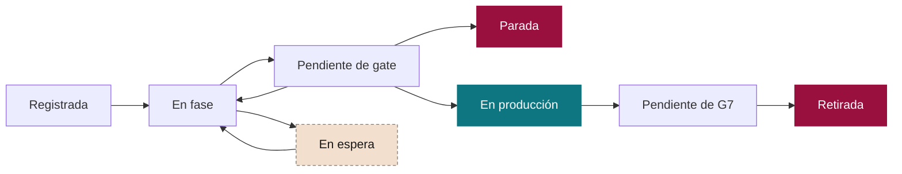

# Herramientas de SEVEN-G y registro de iniciativas

**La cartera de IA gestionada como un embudo: fases, tiempos, cumplimiento y etiquetas**

| | |
|---|---|
| Documento | Documento 03 · Herramientas y registro de iniciativas |
| Versión | 0.1 (borrador de trabajo) |
| Fecha | 16-09-2026 |
| Autor | Fernando García Varela |
| Estado | Borrador para revisión. Catálogo vivo: se actualiza cada vez que se construye o se modifica una herramienta. |

<!-- cifras: 1 | modelo de datos común ; 8 | fases trazadas con fecha ; 22 | herramientas catalogadas ; 3 | olas de construcción -->

---

> **Aviso legal y exención de responsabilidad.** SEVEN-G es un marco metodológico de referencia que se ofrece «tal cual» y con fines exclusivamente informativos. No constituye asesoramiento jurídico, regulatorio, financiero ni profesional, ni garantiza el cumplimiento de ninguna norma. Las referencias a regulación general (como el Reglamento Europeo de IA, el RGPD, DORA o NIS2), a normas técnicas y a regulación específica de cada sector o jurisdicción pueden ser incompletas, no aplicar a un caso concreto o quedar desactualizadas por cambios normativos, interpretaciones o criterios de las autoridades posteriores a su fecha de consulta. **Cada organización que use SEVEN-G es la única responsable de identificar la normativa que le aplica, verificar su vigencia y certificar su propio cumplimiento regulatorio**, con el asesoramiento cualificado que corresponda. Esta metodología es una ayuda genérica y gratuita, compartida con la comunidad para que nadie tenga que empezar desde cero; cada persona u organización puede y debe adaptarla a su propio uso. No debe entenderse que sus partes jurídicamente sensibles hayan sido revisadas por una asesoría jurídica: esas revisiones, para cada empresa o sector, son responsabilidad última de la empresa, el consultor o la organización que la use. Aunque se procura mantenerla al día, alguna norma puede haber cambiado sin que se recoja aquí. En la máxima medida permitida por la ley, el autor no asume responsabilidad alguna por los efectos de su aplicación en ninguna organización ni por su aplicabilidad completa. La metodología no otorga certificación de ningún tipo. El autor no asume responsabilidad alguna por el uso que se haga de este contenido ni por las decisiones que se adopten con él. Los datos, cifras, compañías y casos de los ejemplos son ficticios o ilustrativos.

<!-- esencial: siempre | Toda iniciativa se da de alta en el registro de iniciativas (T01 o una hoja de cálculo con el modelo de datos de la sección 4), con las fechas de cada fase, la decisión de cada puerta, el estado de cada criterio, las condiciones, las etiquetas de la taxonomía y el motivo codificado de parada o retirada. El catálogo de herramientas (sección 5) se consulta. -->

## 1. Objeto

Este documento cumple dos funciones:

1. Define el **registro de iniciativas**, la herramienta central de SEVEN-G. Gestiona cada iniciativa de IA como un comercial gestiona una oportunidad en un CRM: sabe en qué fase está, cuánto tiempo lleva en ella, qué criterios cumple y cuáles no, qué valor se espera y por qué se detuvo si no avanzó.
2. Mantiene el **catálogo de herramientas** del marco: qué herramientas existen o se necesitan, para qué sirven, en qué momento del ciclo se usan, de qué documento dependen y cuándo deben construirse.

---

## 2. Principios de diseño de las herramientas

| # | Principio | Qué significa |
|---|---|---|
| 1 | **Un único modelo de datos** | Todas las herramientas leen y escriben sobre el mismo modelo (sección 4). El panel del consejo, los informes y las alertas se alimentan del registro, sin volver a introducir datos. |
| 2 | **Todo cambio es un evento con fecha** | Las entradas y salidas de fase, las decisiones y los cambios de clasificación quedan registrados con fecha, autor y motivo. Sin historial no hay medición de tiempos ni auditoría. |
| 3 | **Taxonomía controlada** | Las etiquetas principales usan listas cerradas definidas en el marco, para que la cartera pueda filtrarse, compararse y agregarse. Las etiquetas libres se permiten como complemento. |
| 4 | **Evidencia enlazada, no copiada** | Las herramientas registran el enlace, la versión y el estado de verificación de cada evidencia; el documento vive en el repositorio documental de la compañía. |
| 5 | **Portabilidad** | Las herramientas de referencia funcionan sin servidor, en HTML con datos en JSON, y exportan a hoja de cálculo. El modelo de datos puede implantarse en el CRM, la herramienta de gestión de riesgos o la plataforma de gestión de proyectos que ya use la compañía. |
| 6 | **Los datos son de la compañía** | Las herramientas no envían datos a terceros: lo que se introduce se guarda solo en el navegador de quien lo introduce y la copia de seguridad es el JSON exportado. Las demostraciones usan siempre datos ficticios. Dónde están los datos, qué sale del navegador y cómo instalar el sitio en un servidor propio: documento 95. |
| 7 | **"Sin dato" no es cero** | Un valor ausente se muestra como ausente y nunca se sustituye por una estimación no declarada. |
| 8 | **Todo código citado es navegable** | Cuando una herramienta o un panel nombra un documento, una plantilla, otra herramienta, una puerta o un criterio (documento 40, P12, T06, G3.05…), ese código es un enlace a donde se explica, con su tooltip, y la barra de navegación ofrece el «Buscador de documentos» (por código o por título) y «Citados aquí», la lista de todo lo que esa página o vista nombra. Lo hace el índice de códigos del sitio (`codigos.js`), común a documentos, herramientas y paneles; en el panel del consejo se activa con `navegacion.codigos`. |

### 2.1 Dónde viven los datos de las herramientas

Las aplicaciones de referencia (T01, T11 con T13, T14 y T15) se publican con **datos de ejemplo ficticios que nadie puede cambiar en el sitio**: el sitio es estático y no tiene servidor de aplicaciones ni base de datos. Lo que cada persona introduce se guarda en uno de tres lugares, y el botón **«Datos: …»** de la barra de cada herramienta dice en cuál está y abre el diálogo «Dónde están mis datos» para cambiarlo:

| Dónde | Para qué sirve | Qué hay que saber |
|---|---|---|
| **Solo en el navegador** (por defecto) | Probar la herramienta con datos propios sin instalar nada. | Cada cambio se guarda en el almacenamiento local de ese navegador y ese equipo; nadie más lo ve. Se pierde si se limpia el navegador y no está disponible desde otro equipo. La primera vez que se cambia algo, la herramienta lo avisa. |
| **Un fichero JSON del equipo** | Trabajar en serio una persona o un equipo pequeño. | La herramienta reescribe el fichero con cada cambio y lo vuelve a leer al abrirla (Microsoft Edge o Google Chrome; en otros navegadores, exportar e importar a mano). El fichero es el mismo que descarga «Exportar»: se puede copiar, compartir, importar en otra herramienta o usar para regenerar el panel del consejo (T17). Puede estar en una carpeta sincronizada de la compañía. |
| **Una copia del sitio en el servidor de la compañía** | Que toda la compañía vea la misma versión de la cartera. | El sitio entero (documentos, plantillas y herramientas) se copia a un servidor interno. Si en esa copia existe la carpeta `herramientas/datos/` con el fichero de una herramienta, esta lo carga en lugar de los datos de ejemplo. Los cambios se siguen guardando en cada navegador o en un fichero; publicar una versión nueva es sustituir el fichero de la carpeta. |

**Por qué importa.** Sin esta regla, quien entra al sitio público podría creer que edita una cartera compartida, o temer que sus datos se quedan en el sitio. Ninguna de las dos cosas ocurre: nada de lo que se introduce sale del equipo de quien lo introduce, y lo único que puede compartirse es un fichero JSON que la compañía custodia donde decida. El principio 6 (los datos son de la compañía) se cumple por construcción.

**Cómo montar la copia de la compañía.**

1. Descargue el sitio completo (el repositorio publicado o su carpeta generada) y sírvalo **por http** desde un servidor interno: cualquier servidor de ficheros estáticos vale; no hace falta base de datos ni servidor de aplicaciones. Los HTML abiertos como ficheros sueltos (doble clic) funcionan, pero no consultan la carpeta de datos.
2. Cree la carpeta `SEVEN-G/herramientas/datos/` y ponga en ella los JSON exportados por las herramientas que use: `T01_registro.json` (registro de iniciativas), `T11_calculadora.json` (hipótesis de valor y costes), `T14_indice.json` (índice de transformación) y `T15_madurez.json` (diagnóstico de madurez).
3. El panel del consejo (T17) **se regenera solo en el navegador**: lleva incrustado el conector y, servido por http, lee `T01_registro.json` de esa carpeta y lo muestra a toda la compañía; en cada navegador donde alguien trabaje con T01 muestra el registro de ese navegador. No hace falta Python ni instalar nada. Solo si la compañía quiere publicar el panel como ficheros estáticos (para enviarlos por correo, con la vista sin JavaScript) usa el generador `t01_a_panel.py` (Python 3.11 y `uv`, opcional).
4. En cada sesión de trabajo: exportar desde la herramienta y sustituir el fichero de la carpeta. Quien tenga cambios en su navegador o en su fichero los conserva; el diálogo «Dónde están mis datos» le muestra que en el servidor hay una versión y le permite cargarla.
5. Ningún dato sale de la compañía: la copia no envía nada a terceros. La medición agregada de visitas (documento 04 §6.2) solo actúa en los dominios del sitio público, nunca en un dominio interno.

---

## 3. El registro de iniciativas

### 3.1 La analogía con un CRM

| En un CRM comercial | En el registro de iniciativas de SEVEN-G |
|---|---|
| Oportunidad | **Iniciativa de IA** |
| Etapa del embudo | **Fase del ciclo de vida** (0–7) |
| Paso de etapa | **Puerta de decisión** (*gate*) con resultado registrado |
| Días en la etapa | **Tiempo en fase** y tiempo de decisión de cada puerta |
| Requisitos para avanzar | **Criterios del gate**: cumple, no cumple, no aplica o pendiente, con evidencia |
| Importe de la oportunidad | **Valor esperado**; después, valor declarado, estimado y validado |
| Probabilidad de cierre | **Probabilidad histórica de llegar a producción** desde cada fase, calculada con los datos propios |
| Previsión de ventas | **Valor ponderado de la cartera** |
| Motivo de pérdida | **Motivo de parada o de retirada**, codificado |
| Propietario | **Patrocinador y responsable de producto** |
| Cuenta o segmento | **Área, esfera, nivel de ambición, tecnología** y demás etiquetas |
| Actividades | **Evidencias, decisiones, condiciones, riesgos e incidentes** vinculados |
| Oportunidades estancadas | **Iniciativas que superan el plazo de referencia** de su fase |

### 3.2 Estados de una iniciativa

Además de la fase, cada iniciativa tiene un estado que indica qué está ocurriendo con ella.

<!-- grafico: Estados de una iniciativa | La fase indica dónde está; el estado, qué le ocurre -->

| Estado | Significado | Cuenta tiempo en fase |
|---|---|---|
| **Registrada** | Idea dada de alta, todavía sin fase 0 aprobada. | No |
| **En fase** | Se están realizando las actividades de la fase. | Sí |
| **Pendiente de gate** | Evidencias presentadas; a la espera de verificación y decisión. | Sí, y además cuenta el tiempo de decisión |
| **En espera** | Detenida por una causa externa registrada (presupuesto, dependencia, proveedor, datos). Requiere motivo y fecha prevista de reanudación. | Se mide aparte |
| **En producción** | Superado G5; en operación con revisiones de continuidad. | Se mide el tiempo en producción |
| **Pendiente de G7** | En decisión de escalado, iteración o retirada. | Sí |
| **Parada** | Detenida en un *gate* con motivo codificado. | Cierre |
| **Retirada** | Retirada tras G7 con plan de retirada ejecutado. | Cierre |

### 3.3 Qué se registra

**Ficha de la iniciativa**

| Bloque | Campos principales |
|---|---|
| **Identificación** | Código único (IA-AAAA-NNN), nombre, descripción comprensible de qué es y para qué se usa, área, fecha de registro. |
| **Responsables** | Patrocinador, responsable de producto, técnico, de operación, de riesgos y auditor asignado. |
| **Clasificación** | Esfera principal y secundaria; nivel de ambición propuesto, confirmado y real; intensidad; clasificación regulatoria; tecnología; exposición; proveedores. |
| **Ciclo de vida** | Fase actual, estado, fecha de entrada en la fase, plazo de referencia, iteración en curso. |
| **Valor** | Valor esperado (eficiencias, retorno, coste recurrente) con fórmula; valor realizado con estado validado, declarado o estimado; inversión realizada y pendiente. |
| **Riesgo y cumplimiento** | Nivel de riesgo residual principal, evaluaciones de impacto realizadas, condiciones abiertas, no conformidades abiertas, incidentes. |
| **Etiquetas libres** | Programa, iniciativa estratégica, cliente interno u otras agrupaciones propias. |

**Taxonomía controlada**

| Etiqueta | Valores |
|---|---|
| **Esfera** | 01 Cliente · 02 Producto y servicio · 03 Personas · 04 Operaciones · 05 Datos · 06 Conocimiento · 07 Decisión · 08 Regulación, ética y responsabilidad · 09 Gobierno de la IA |
| **Nivel de ambición** | Optimizar · Aumentar · Transformar |
| **Intensidad** | Lite · Enterprise |
| **Clasificación regulatoria** | Prohibido · Alto riesgo · Obligaciones de transparencia · Riesgo mínimo · Fuera de ámbito · Pendiente de clasificar |
| **Tecnología** | ML predictivo · IA generativa · Agente · Procesamiento de lenguaje y documentos · Visión · Optimización · IA de terceros embebida · Reglas (no es IA) |
| **Exposición** | Interna · Empleados · Clientes de forma indirecta · Clientes o personas externas de forma directa |
| **Tipo de valor** | Eficiencia · Retorno · Riesgo evitado · Cumplimiento |
| **Motivo de parada o retirada** | Sin valor plausible · Hipótesis refutada · Datos insuficientes · Inviable técnicamente · Coste superior al valor · Riesgo inaceptable · Regulación · Sin adopción · Sustituida por otra solución · Cambio de prioridad estratégica |

**Eventos**

Cada uno de los siguientes hechos genera un evento con fecha, autor y comentario: alta; entrada y salida de fase; solicitud de *gate*; verificación; decisión con resultado; creación, cumplimiento o vencimiento de condiciones; paso a espera y reanudación; cambio de clasificación (ambición, intensidad, regulatoria); incidente; no conformidad; parada; retirada.

### 3.4 Cumplimiento de las puertas de decisión

Cada *gate* se registra como una lista de criterios. Cada criterio tiene uno de cuatro estados:

| Estado | Significado |
|---|---|
| **Cumple** | El criterio se cumple y la evidencia enlazada está verificada. |
| **No cumple** | El criterio no se cumple o la evidencia no es válida. |
| **No aplica** | El criterio no aplica por la intensidad, la tecnología o la clasificación, con justificación. |
| **Pendiente** | Falta la evidencia o la verificación. |

A partir de estos estados, el registro calcula el **grado de cumplimiento del gate** (criterios que cumplen sobre los aplicables), muestra **qué criterios bloquean** la decisión e impide registrar **Continuar** si hay criterios obligatorios en *No cumple* o *Pendiente*. Las condiciones de un **Continuar con condiciones** se registran con plazo y responsable, y generan alerta al vencer.

### 3.5 Métricas del embudo

<!-- figura: embudo -->

| Métrica | Definición | Para qué sirve | Quién la usa |
|---|---|---|---|
| **Tiempo en fase** | Días entre la entrada y la salida de la fase, sin contar el tiempo en espera. Mediana y percentil 80. | Detectar cuellos de botella. | Oficina de IA, comité |
| **Tiempo de decisión** | Días entre la solicitud del *gate* y la decisión. | Medir la agilidad del propio gobierno. | Comité, consejo |
| **Tiempo hasta producción** | Días desde el registro hasta G5; desglosado en idea → aprobación de viabilidad (G3) → producción. | Medir la velocidad real de la cartera. | Comité, consejo |
| **Conversión por gate** | Porcentaje de iniciativas que continúan en cada *gate* frente a las que iteran, pivotan o paran. | Saber dónde se filtra la cartera y si el filtro está en el sitio correcto. | Comité |
| **Iteraciones por gate** | Número medio de iteraciones antes de la decisión. | Detectar evidencias mal preparadas o criterios poco claros. | Oficina de IA |
| **Iniciativas estancadas** | Iniciativas que superan el plazo de referencia de su fase. | Actuar antes de que se conviertan en coste sin retorno. | Comité |
| **Tiempo en espera** | Días en espera y motivos. | Distinguir retrasos propios de dependencias externas. | Comité |
| **Motivos de parada y retirada** | Distribución de los motivos codificados. | Aprender qué tipo de iniciativas no deben entrar en la cartera. | Comité, C5 |
| **Cumplimiento de gates** | Grado de cumplimiento medio y criterios que más bloquean. | Mejorar la preparación de evidencias. | Oficina de IA |
| **Condiciones vencidas** | Condiciones abiertas fuera de plazo. | Evitar que "con condiciones" se convierta en "sin control". | Comité, auditoría |
| **Valor por fase** | Valor esperado de las iniciativas en cada fase. | Ver dónde está el valor de la cartera. | Comité, consejo |
| **Valor ponderado** | Suma del valor esperado por la probabilidad histórica de llegar a producción desde la fase actual. Solo se muestra cuando hay historial suficiente. | Estimar con prudencia el valor futuro de la cartera. | Consejo |
| **Mezcla de ambición por fase** | Distribución de Optimizar, Aumentar y Transformar en cada fase. | Detectar si las apuestas de transformación se quedan atascadas antes de producción (señal del índice de transformación). | Consejo |
| **Cohortes** | Las métricas anteriores por trimestre de registro. | Comprobar si el sistema mejora con el tiempo. | C5 |

Todas las métricas se pueden segmentar por cualquier etiqueta de la taxonomía: esfera, ambición, intensidad, tecnología, área o proveedor.

### 3.6 Plazos de referencia por fase

Los plazos permiten identificar iniciativas estancadas. La compañía los aprueba en C2 y los recalibra en C5 con sus propios datos. Los valores siguientes son **orientativos para empezar**:

| Fase | Lite | Enterprise |
|---|---|---|
| 0 · Contexto y restricciones | 10 días | 20 días |
| 1 · Descubrimiento | 20 días | 30 días |
| 2 · Hipótesis de valor | 20 días | 30 días |
| 3 · Viabilidad y riesgo | 20 días | 45 días |
| 4 · Diseño de la solución | 20 días | 45 días |
| 5 · Entrega y validación | 60 días | 90 días |
| 7 · Evolución o retirada | 15 días | 30 días |
| **Decisión de un gate** (desde la solicitud) | 5 días hábiles | 10 días hábiles |

La fase 6 no tiene plazo; se controla con la periodicidad de la revisión de continuidad.

### 3.7 Vistas

| Vista | Qué muestra |
|---|---|
| **Embudo** | Iniciativas por fase y estado, con alertas de plazo; filtrable por etiquetas. |
| **Tablero** | Tarjetas por fase que se mueven al registrar la decisión del *gate*. |
| **Ficha** | Datos de la iniciativa, línea de tiempo de eventos, criterios del *gate* en curso, condiciones, riesgos y valor. |
| **Gates pendientes** | Solicitudes a la espera de verificación o decisión, con días transcurridos. |
| **Alertas** | Estancadas, condiciones vencidas, revisiones de continuidad caducadas, evidencias pendientes de verificación. |
| **Análisis** | Métricas del embudo, cohortes y segmentación. |
| **Datos** | Importación de uno o varios JSON (con sustitución o fusión por código) y exportación del registro completo. El JSON completo es la entrada del panel del consejo (T17): el conector lo convierte en el JSON del panel, con el embudo y los tiempos de cada etapa tomados de las fases y los eventos del registro. |

---

## 4. Modelo de datos común

El modelo es la base de todas las herramientas. Su especificación completa (campos, tipos, listas cerradas y reglas de validación) es el esquema JSON del registro, `herramientas/T01_registro_iniciativas/esquema_registro.schema.json` (versión 0.6), que se publica con la herramienta T01 y que cada versión amplía solo con campos opcionales: un fichero de una versión anterior sigue siendo válido.

| Entidad | Qué representa | Se relaciona con |
|---|---|---|
| **Iniciativa** | La unidad que recorre el ciclo de vida. Su alcance indica si es de una unidad de negocio, transversal (con despliegue y adopción por unidad) o una plataforma habilitadora (con los casos que la usan); documento 40 §7.2. Desde el esquema 0.5 de T01, también la evidencia para el índice de transformación: verificación de IT-P2 e IT-P3 en un *gate*, supervisión humana verificada, unidad organizativa completa rediseñada y capacidad liberada, materializada y reasignada (12 §4.4). | Todas las demás |
| **Sistema de IA** | Cada sistema en el inventario, propio o de terceros, incluido el uso corporativo. | Iniciativas, proveedores, riesgos, incidentes |
| **Evento** | Cualquier cambio con fecha, autor y motivo. | Iniciativa |
| **Decisión de gate** | Solicitud, verificación, decisión, resultado e iteración. | Iniciativa, criterios, condiciones |
| **Criterio evaluado** | Estado de cada criterio en una decisión de *gate*. | Decisión de gate, evidencia |
| **Condición** | Condición impuesta con plazo, responsable y estado. | Decisión de gate |
| **Evidencia** | Enlace, tipo, versión, autor, fecha y verificación. | Criterios, iniciativa |
| **Valor** | Importes por tipo (eficiencia, retorno, coste), fórmula, estado de validación, periodo y, en las iniciativas transversales, unidad de negocio; desde el esquema 0.5, si el retorno procede de una oferta habilitada por IA (señal 6 del 12). | Iniciativa |
| **Riesgo** | Riesgo con probabilidad, impacto, nivel inherente y residual, responsable y controles; desde el esquema 0.4 de T01, también eje del impacto, eficacia de los controles, residual objetivo o verificado, contingencia, estado, tendencia, próxima revisión y aceptación (33 §8.1). | Iniciativa, sistema |
| **No conformidad** | Tipo, detección, contención, causa raíz, acción, cierre. | Iniciativa, sistema |
| **Incidente** | Fecha, severidad, detección, contención, notificaciones. | Sistema, iniciativa |
| **Proveedor** | Tercero, servicios, criticidad, contrato, evaluación. | Sistemas, iniciativas |
| **Recomendación** | Recomendación del consejo con identificador persistente, destinatario, estado y evidencia. | Iniciativas, sistemas |
| **Decisión del consejo** | Decisión del consejo o de su comisión (DEC-AAAA-NNN) con órgano, tipo, asunto, resultado, límite de inversión por etapa, decisión de etapa, esferas con Transformar como objetivo y vínculos (62 §10); esquema 0.5. Es la fuente de la señal 8 y de la condición IT-D1 del índice. | Iniciativas, recomendaciones |
| **Diagnóstico de madurez** | Resumen de cada diagnóstico de madurez (EM-AAAA-MM; documento 11): fecha de corte, modalidad, versión del cuestionario, nivel global, media ponderada, límite por D1 o D6 y nivel, avance y criterios bloqueantes de cada dimensión. Lo escribe T15 (las respuestas y las evidencias se quedan en T15) y lo muestra el panel del consejo; esquema 0.6. | Compañía |

### 4.1 Qué lee y qué escribe cada herramienta

El registro T01 es la **fuente de verdad** de la compañía: las demás herramientas derivan de él, muestran de dónde viene cada dato y permiten corregirlo en local sin que la corrección se pierda al volver a leer el registro. Nada se estima: lo que el registro no contiene queda «sin dato» y se completa a mano. Servidas desde el mismo sitio, las herramientas comparten el almacenamiento local del navegador, así que T11, T14 y T15 encuentran el registro por sí solas y le devuelven sus resultados; abiertas como ficheros sueltos, el intercambio se hace con los ficheros JSON que cada una exporta e importa. El detalle campo a campo está en `herramientas/mapa_datos.json`, que las pruebas de coherencia contrastan con el esquema.

| Herramienta | Lee de T01 | Devuelve a T01 | Propio de la herramienta |
|---|---|---|---|
| **T11** (con T13) | Iniciativa (nombre, ambición, intensidad, fase, inversión realizada y pendiente) e importes esperados registrados. Un caso creado desde el registro se **actualiza** al volver a leerlo: se renuevan la identificación, los importes que siguen «desde T01» y los nuevos; una línea corregida a mano o descompuesta en unidades × valor unitario se conserva. | Los importes esperados del caso (eficiencias, retorno, capacidad liberada, coste recurrente e inversión), como esperados con fuente T11, y un evento de edición. | Parámetros (horizonte, tasa, coste horario), líneas de valor descompuestas, rampa, criterios de parada, etapas, costes por caso y conciliación. |
| **T14** | Cartera (fases, estados, ambición, esferas, *gates*), importes realizados y validados, inversión, evidencia del índice de cada iniciativa, datos de la compañía (ingresos, IT-D3) y decisiones del consejo. Un cálculo hecho desde el registro se **actualiza** al volver a leerlo: solo se renuevan los datos que siguen marcados «desde T01». | Nada. Su resultado va al panel del consejo (T17) y deja el perfil del último cálculo para la lectura cruzada de T15. | Versiones de umbrales, cálculos con la marca de origen de cada dato, notas y acciones. |
| **T15** | Compañía y muestra estratificada de iniciativas (Enterprise, en producción, Aumentar o Transformar, terceros, IA generativa o agentes; 11 §4.6). De T14, el perfil del último cálculo. | El resumen de cada diagnóstico (`madurez[]`): nivel global, media, límite por D1 o D6 y nivel por dimensión; nunca las respuestas. | Respuestas, evidencias, verificación, entrevistas, muestras, pesos, objetivos, mensajes y plan de mejora. |
| **T17** (generador) | El JSON completo del registro: iniciativas, ciclo de vida, importes, incidentes, recomendaciones y el diagnóstico de madurez más reciente; de T14, el índice exportado. | Nada. | Configuración del panel (umbrales, ciclo de vida, navegación) y los paneles generados. |
| **T06** | Es una vista del propio registro. Para el **Excel del caso** (matriz, registro, plan de mitigación y plan de contingencia propuestos y riesgos tipo a considerar) lee, además de los riesgos de la iniciativa, su clasificación (tecnología, exposición, autonomía, clasificación regulatoria, ambición, intensidad y proveedores), sus evaluaciones de impacto, sus sistemas y sus responsables. | Nada: el Excel es un fichero descargado con la fecha y hora de generación; lo que el equipo decida en él se registra en la pestaña «Riesgos». | El catálogo de riesgos tipo con las reglas de aplicabilidad y las propuestas de mitigación y contingencia por código RT (`catalogo_riesgos.json`; el texto de cada riesgo tipo se lee del documento 33 §9 al generar la herramienta). |
| **T18** | Es una vista del propio registro. | — | — |

**Por qué importa.** Sin una fuente de verdad, cada herramienta acaba con su propia versión de la compañía: el índice de transformación calculado con una cartera, el panel del consejo con otra y la madurez de una tercera. Fijar que todo deriva de T01, que cada dato lleva su procedencia y que lo corregido a mano no se pisa hace que el consejo, la Oficina de IA y el consultor lean la misma compañía en todas las herramientas.

---

## 5. Catálogo de herramientas

**Prioridad:** 1 = núcleo, se construye primero · 2 = necesaria para el gobierno completo · 3 = complemento.
**Estado:** Disponible (aplicación HTML en `herramientas/`) · Se aplica con plantillas o documentos (sin aplicación propia; la plantilla o el documento indicado contiene el procedimiento completo).

### 5.1 Gestión de la cartera y del ciclo de vida

| Código | Herramienta | Para qué | Dónde se usa | Formato | Depende de | Prioridad | Estado |
|---|---|---|---|---|---|---|---|
| **T01** | **Registro de iniciativas** | Embudo tipo CRM: fases, estados, eventos, etiquetas, valor y métricas. | Todo el ciclo; C3 y C4 | HTML + JSON; exportación a hoja de cálculo | 01, 02 | 1 | Disponible v0.1 |
| **T02** | Inventario de sistemas de IA | Registro de todos los sistemas, incluidos los de terceros y el uso corporativo. | C1, fase 0, C4 | Módulo de T01 | 01, 32 | 1 | Disponible v0.1 |
| **T03** | Gestor de gates | Criterios con estado, evidencias, verificación, decisión y condiciones. | Todos los *gates* | Módulo de T01 | 01, 21, 22 | 1 | Disponible v0.1 (128 criterios del documento 21) |
| **T04** | Determinación de intensidad | Cuestionario Lite o Enterprise con resultado registrado. | Fase 0, G3, R6 | Módulo de T01 | 01 | 1 | Disponible v0.1 |
| **T05** | Clasificador de ambición | Cinco preguntas para Optimizar, Aumentar o Transformar. | Fases 1, 2 y 7 | Módulo de T01 | 00, 12 | 1 | Disponible v0.1 |

### 5.2 Riesgo, seguridad y cumplimiento

| Código | Herramienta | Para qué | Dónde se usa | Formato | Depende de | Prioridad | Estado |
|---|---|---|---|---|---|---|---|
| **T06** | Matriz y registro de riesgos | Evaluación de probabilidad e impacto, mapa de calor, riesgo inherente y residual, controles y su eficacia, respuesta, contingencia y aceptación por el órgano de su nivel, con observaciones de la metodología (Crítico sin aprobación del consejo, Alto sin contingencia, aceptación caducada o por un órgano inferior, revisión vencida), exportación CSV para hoja de cálculo y **Excel del caso**: matriz, registro, plan de mitigación y plan de contingencia propuestos a partir del catálogo de riesgos tipo del documento 33 §9 y riesgos tipo aplicables no registrados, para incluir o descartar con motivo. | Fase 3, fase 6, cartera | Módulo de T01 (vista «Riesgos» y pestaña de la ficha) | 33 | 2 | Disponible v0.1. Se documenta con P12 y P13 |
| **T07** | Clasificador regulatorio | Cuestionario guiado de clasificación según el Reglamento de IA y evaluaciones requeridas. | Fases 0 y 3 | HTML | 34 | 2 | Se aplica con P11 |
| **T08** | Registro de no conformidades e incidentes | Proceso completo con plazos y alertas. | Fase 6, C4 | Módulo de T01 | 37 | 2 | Se aplica con P50 (registro de no conformidades), P51 (notificaciones y comunicaciones) y P52 (causa raíz), junto con P26 y P27 |
| **T09** | Registro de proveedores de IA | Terceros, criticidad, contratos, evaluación y dependencia. | Fases 3–4, C4 | Módulo de T01 | 36 | 3 | Se aplica con P57 (registro de proveedores y plan de salida), P55 (diligencia debida), P56 (cláusulas contractuales) y P14 |
| **T10** | Evaluación de seguridad de agentes | Identidad, permisos, control de intención, interruptor de parada, pruebas de inyección. | Fases 4–6 | Lista de verificación en T03 | 35 | 3 | Se aplica con P18, P53 (pruebas adversarias), P54 (identidades no humanas y componentes) y los criterios [AG] del documento 22 |

### 5.3 Valor y medición

| Código | Herramienta | Para qué | Dónde se usa | Formato | Depende de | Prioridad | Estado |
|---|---|---|---|---|---|---|---|
| **T11** | Lienzo y calculadora de hipótesis de valor | Línea base, líneas de valor con fórmula (F1), neto anual, VAN, ROI, plazo de recuperación y F3 con el horizonte y la tasa de C2; escenarios; criterio económico de C2 como información; importa la iniciativa desde T01. Se documenta con P08, P09 y P10. | Fases 2, 3 y 7 | HTML + JSON; exportación CSV | 40 | 2 | Disponible v0.1 |
| **T12** | Seguimiento de realización de valor | Valor validado, declarado y estimado por periodo y por caso. | Fases 6–7, C4 | Módulo de T01 | 40, 43 | 2 | Se aplica con P28 y P62 (plan de realización de beneficios) |
| **T13** | Calculadora de costes por caso | Coste completo e incremental, coste total de propiedad, reparto de costes compartidos, previsión de consumo con alertas, coste por unidad, coste de parar y conciliación. Se documenta con P10 y P63. | Fases 3 y 6 | Módulo de T11 (vista «Costes por caso»); exportación CSV | 42 | 3 | Disponible v0.1 |
| **T14** | Calculadora del índice de transformación | Condiciones de base, ocho señales, perfil de la compañía, alertas, cobertura y evolución, con versión de umbrales; parte del JSON del registro T01, del que calcula las ocho señales cuando trae la evidencia del esquema 0.5, y su resultado alimenta la tarjeta del índice del panel del consejo (T17). | C1, C4, C5 | HTML + JSON | 12 | 2 | Disponible v0.1 |

### 5.4 Estrategia y consejo

| Código | Herramienta | Para qué | Dónde se usa | Formato | Depende de | Prioridad | Estado |
|---|---|---|---|---|---|---|---|
| **T15** | Diagnóstico de madurez | Cuestionario de 84 preguntas con evidencia y verificación; nivel por dimensión y global con el límite de D1 y D6; comparación entre evaluaciones e informe para el consejo. Plantilla P34. | C1, C5 | HTML + JSON; exportación CSV | 11 | 2 | Disponible v0.1 |
| **T16** | Mapa de esferas de la cartera | Mapa de calor esferas × niveles de ambición con inversión y valor. | C2, C3 | Vista del panel del consejo | 10 | 2 | Se aplica con el documento 10 |
| **T17** | Panel de IA para el consejo | Supervisión: valor, coste, riesgo, cumplimiento, incidentes, agilidad, adopción. | C4 | HTML completo y móvil + JSON | 60 | 1 | Disponible. Se alimenta de T01 mediante el conector `herramientas/T17_panel_consejo`: registro (JSON) más `config_panel.json` (umbrales de los indicadores y ciclo de vida) → JSON del panel → panel completo y móvil, con embudo y tiempos por etapa como en un CRM |
| **T18** | Registro de recomendaciones del consejo | Recomendaciones con identificador persistente, estado, evidencia y valoración. | C4 | Módulo de T01 y HTML | 62 | 1 | Disponible v0.1: vista «Consejo (T18)» del registro T01, con las decisiones (DEC) y las recomendaciones (REC); el conector de T17 genera la página del registro a partir de las recomendaciones de T01 |
| **T19** | Plantilla de tesis de IA y apetito de riesgo | Documento de decisión del consejo, con umbrales y plazos de referencia. | C2 | Plantilla de documento | 13 | 3 | Se aplica con P35 (tesis de IA y apetito de riesgo) |

### 5.5 Personas y operación

| Código | Herramienta | Para qué | Dónde se usa | Formato | Depende de | Prioridad | Estado |
|---|---|---|---|---|---|---|---|
| **T20** | Plan de adopción y capacidad | Adopción, formación y reasignación de la capacidad liberada. | Fases 4–7 | Plantilla y módulo de T01 | 23, 50 | 3 | Se aplica con P20 y P45 (plan y registro de alfabetización y formación); la capacidad liberada, materializada y reasignada de cada iniciativa se registra en T01 (esquema 0.5) |
| **T21** | Monitor de uso corporativo de IA | Licencias asignadas y activas, uso no autorizado, controles de fuga de datos. | C4 | Vista del panel del consejo | 31 | 3 | Se aplica con P43 (catálogo de herramientas autorizadas y solicitudes) |
| **T22** | Gestor de retiradas | Plan de retirada, sustituto, datos y modelos, comunicación. | Fase 7 | Módulo de T01 | 14 | 3 | Se aplica con P30 |

---

## 6. Orden de construcción

| Ola | Herramientas | Cuándo | Resultado |
|---|---|---|---|
| **Ola 1 · Núcleo** | T01 con T02, T03, T04 y T05; adaptación de T17 y T18 para alimentarse del registro. | Tras el documento 02 (Glosario), que fija nombres y listas. | Cartera gestionada como embudo, con *gates* trazados y panel del consejo conectado. |
| **Ola 2 · Gobierno completo** | T06, T07, T08, T11, T12, T14, T15, T16. | A medida que se terminan los documentos 11, 12, 33, 34, 37 y 40. | Riesgo, cumplimiento, valor, madurez e índice de transformación operativos. |
| **Ola 3 · Complementos** | T09, T10, T13, T19, T20, T21, T22. | Con los documentos 13, 14, 23, 31, 35, 36, 42 y 50. | Cobertura completa del marco. |

Regla de trabajo: **cada documento que define un proceso con registro, cálculo o cuestionario indica la herramienta asociada**, y la herramienta se construye o actualiza al cerrar ese documento.

---

## 7. Documentos relacionados

| Documento | Relación |
|---|---|
| **01 · Metodología fundacional** | Fases, estados, *gates*, roles e intensidad que el registro traza. |
| **02 · Glosario** | Nombres y listas de la taxonomía controlada. |
| **12 · Índice de transformación** | Señales que se calculan con los datos del registro. |
| **21 y 22 · Criterios de gate y listas de verificación** | Contenido del gestor de *gates*. |
| **40 · Reglas de medición del valor** | Reglas que aplican los módulos de valor. |
| **60 y 62 · Paquete del consejo y registro de recomendaciones** | Salidas hacia el consejo. |

---

## 8. Control de versiones

| Versión | Fecha | Cambios |
|---|---|---|
| 0.1 | 16-09-2026 | Primera versión. Define el registro de iniciativas como embudo gestionado, su taxonomía, eventos, métricas y plazos de referencia; el modelo de datos común; el catálogo de 22 herramientas y el orden de construcción. |
| 0.2 | 19-09-2026 | Catálogo al día: T11 (con T13 como módulo) y T15 disponibles; las herramientas sin aplicación propia se aplican con las plantillas P32–P71 que les corresponden (D68). |
