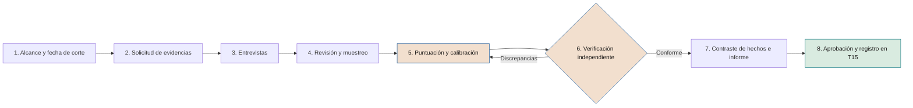

# Modelo de madurez

**Siete dimensiones, seis niveles y un cuestionario con evidencia para diagnosticar cómo gobierna la compañía su IA**

| | |
|---|---|
| Documento | Documento 11 · Modelo de madurez |
| Versión | 0.2 (borrador de trabajo) |
| Fecha | 25-09-2026 |
| Autor | Fernando García Varela |
| Estado | Borrador para revisión. Desarrolla la decisión D10. Los tamaños de muestra, los pesos y los objetivos de referencia son iniciales y se calibrarán con la aplicación práctica. |

<!-- cifras: 7 | dimensiones de madurez ; 6 | niveles, de 0 a 5 ; 84 | preguntas con evidencia exigida ; 10 | preguntas que acreditan la declaración de aplicación -->

---

> **Aviso legal y exención de responsabilidad.** SEVEN-G es un marco metodológico de referencia que se ofrece «tal cual» y con fines exclusivamente informativos. No constituye asesoramiento jurídico, regulatorio, financiero ni profesional, ni garantiza el cumplimiento de ninguna norma. Las referencias a regulación general (como el Reglamento Europeo de IA, el RGPD, DORA o NIS2), a normas técnicas y a regulación específica de cada sector o jurisdicción pueden ser incompletas, no aplicar a un caso concreto o quedar desactualizadas por cambios normativos, interpretaciones o criterios de las autoridades posteriores a su fecha de consulta. **Cada organización que use SEVEN-G es la única responsable de identificar la normativa que le aplica, verificar su vigencia y certificar su propio cumplimiento regulatorio**, con el asesoramiento cualificado que corresponda. El autor no asume responsabilidad alguna por el uso que se haga de este contenido ni por las decisiones que se adopten con él. Los datos, cifras, compañías y casos de los ejemplos son ficticios o ilustrativos.

<!-- esencial: siempre | Evaluación de madurez verificada en el diagnóstico inicial (C1) y en cada revisión anual (C5): siete dimensiones, niveles 0 a 5, evidencia observable y nivel global limitado por D1 y D6. Una autoevaluación sin verificar no sirve para C1, C5 ni para la declaración de aplicación. En alcance Enterprise, además, evaluación independiente al menos cada dos años. -->

## 1. Objeto y alcance

Este documento define cómo se mide la **madurez de una compañía para gobernar la inteligencia artificial y obtener de ella valor verificable**. Es el instrumento del sistema de medición (componente C) que produce uno de los resultados obligatorios de la etapa **C1 · Diagnóstico** —"evaluación de madurez con evidencia" (01 §5.1)— y que se repite en **C5 · Revisión** para comprobar el avance.

El documento contiene las siete dimensiones y los seis niveles, la rúbrica y el cuestionario de cada dimensión, el método de evaluación, el cálculo, la estructura del informe, los vínculos con el resto del marco, los objetivos de madurez según la ambición y un ejemplo ilustrativo. La herramienta que lo soporta es **T15 · Diagnóstico de madurez** (documento 03).

### 1.1 Qué mide y qué no mide

| El modelo mide | El modelo no mide |
|---|---|
| La capacidad de la organización —órganos, prácticas, controles, datos, personas y medición— para decidir, construir, operar y supervisar la IA con control. | Cuánta IA usa la compañía ni lo avanzada que es su tecnología. |
| Si esa capacidad está implantada y funciona, con evidencia observable. | Si la compañía se transforma o solo se eficienta: eso lo mide el índice de transformación (documento 12). |
| El avance de la compañía en el tiempo con un método constante. | La posición frente a otras compañías. SEVEN-G no publica comparativas de mercado. |
| La madurez del conjunto de la compañía o de un perímetro declarado. | La calidad de una iniciativa concreta: eso lo deciden los *gates*. |

El modelo no es una certificación. Un resultado de madurez no sustituye a la auditoría del marco (documento 38) ni acredita el cumplimiento regulatorio. Este documento no constituye asesoramiento jurídico.

### 1.2 Principios de la evaluación

1. **Evidencia, no declaración.** Un criterio solo se cumple si hay evidencia observable y verificada (principio 8 de 01 §3).
2. **Niveles acumulativos.** Para estar en un nivel se cumplen todos los criterios de ese nivel y de los inferiores.
3. **Niveles enteros.** El nivel de una dimensión y el global se expresan siempre como número entero. Los decimales dan una falsa precisión; el avance hacia el nivel siguiente se informa aparte.
4. **Lo más débil condiciona.** Una compañía no puede presentar una madurez global alta si su estrategia y gobierno (D1) o su control de riesgos (D6) son débiles.
5. **Independencia.** Quien responde de una dimensión no la evalúa, y ninguna evaluación sin verificación independiente se usa en C1, C5 ni en la declaración de aplicación.
6. **Comparable en el tiempo.** Dos resultados solo se comparan si se han obtenido con la misma versión del cuestionario y con una modalidad verificada.

---

## 2. Estructura del modelo

### 2.1 Dimensiones

| Código | Dimensión | Pregunta que responde | Esferas y documentos relacionados |
|---|---|---|---|
| **D1** | **Estrategia y gobierno** | ¿Decide la compañía sobre la IA con tesis, órganos, roles y supervisión del consejo? | Esfera 09 · documentos 13, 30, 31, 60, 62 |
| **D2** | **Valor y cartera** | ¿Selecciona, prioriza, controla y retira las iniciativas con un ciclo de vida trazado? | Esferas 01–04 · documentos 03, 14, 20, 21 |
| **D3** | **Datos y conocimiento** | ¿Tiene datos y conocimiento con propietario, calidad, base legal y linaje para usarlos en IA? | Esferas 05 y 06 · documento 51 |
| **D4** | **Tecnología y operación** | ¿Opera la IA en producción con estabilidad, monitorización, reversibilidad y costes conocidos? | Esfera 04 · documentos 42, 52, 53 |
| **D5** | **Personas y adopción** | ¿Prepara a las personas, consigue uso real y gestiona el efecto de la IA en el trabajo? | Esfera 03 · documentos 23, 50 |
| **D6** | **Riesgo, seguridad y cumplimiento** | ¿Identifica, controla y audita los riesgos, la seguridad, los terceros y la regulación de la IA? | Esferas 08 y 09 · documentos 32–38 |
| **D7** | **Medición y evidencia** | ¿Mide el valor y el coste con reglas, y sus evidencias resisten una verificación? | Documentos 12, 40–43, 60 |

### 2.2 Niveles

| Nivel | Nombre | Descripción general | Rasgo observable típico |
|---|---|---|---|
| **0** | **Inexistente** | No hay práctica reconocible ni responsable. | No se cumplen todos los criterios del nivel 1. |
| **1** | **Inicial** | Prácticas aisladas que dependen de personas concretas. | Hay responsables identificados y alguna constancia escrita, sin método común. |
| **2** | **En desarrollo** | La práctica está definida en parte y se aplica en algunos casos o áreas. | Documentos aprobados y registros iniciados, con cobertura incompleta. |
| **3** | **Definido** | La práctica es común, está aprobada y se aplica a todo el perímetro evaluado. | Evidencias sistemáticas en todas las iniciativas o sistemas que corresponden. |
| **4** | **Gestionado** | La práctica se mide con indicadores, se revisa con datos y se actúa sobre las desviaciones. | Series de indicadores y decisiones registradas durante al menos **dos trimestres consecutivos**. |
| **5** | **Optimizado** | La práctica mejora de forma continua con datos propios. | Al menos **un ciclo C5 completo** con cambios decididos a partir de evidencia y ya aplicados. |

El nivel 0 no tiene criterios propios. Los requisitos temporales de los niveles 4 y 5 evitan que una práctica recién implantada se presente como gestionada.

**Equivalencia orientativa con los *tiers* del NIST CSF.** Quien viene del NIST CSF puede leer los niveles de SEVEN-G con esta tabla. Es **orientativa**: los *tiers* caracterizan el rigor de las prácticas de toda la organización y no exigen los dos trimestres de evidencia del nivel 4 ni el ciclo C5 completo del nivel 5. **No es una segunda escala**: el *tier* equivalente es una vista calculada desde el nivel 0–5, nunca un dato que se capture aparte (34 §5.3).

| Nivel SEVEN-G | *Tier* equivalente (NIST CSF 2.0) | Motivo |
|---|---|---|
| 0 Inexistente · 1 Inicial | *Tier* 1 · Parcial | Práctica *ad hoc* y reactiva. |
| 2 En desarrollo | *Tier* 2 · Informado sobre el riesgo | Aprobada, pero no aplicada en toda la organización. |
| 3 Definido | *Tier* 3 · Repetible | Política formal aplicada a todo el perímetro. |
| 4 Gestionado · 5 Optimizado | *Tier* 4 · Adaptativo | Se mide, se ajusta y mejora con datos propios. |

### 2.3 Reglas del modelo

1. **Acumulación.** El nivel de una dimensión es el nivel más alto para el que se cumplen todos los criterios de ese nivel y de todos los inferiores.
2. **Evidencia.** Cada criterio exige la evidencia indicada en el cuestionario. Sin evidencia verificada, el criterio no se cumple.
3. **Nivel global.** Es la media ponderada de los niveles de las siete dimensiones, **redondeada hacia abajo** y **limitada al nivel más bajo de D1 o D6 más uno**.
4. **Pesos.** Por defecto, iguales. La compañía puede fijar otros en C2; debe declararlos en el informe y mantenerlos entre dos evaluaciones que quiera comparar. Ninguna dimensión debería pesar menos del 10 % ni más del 25 %.

---

## 3. Rúbricas y cuestionario por dimensión

### 3.1 Cómo se leen

- La **rúbrica** resume, nivel a nivel, los criterios observables y las evidencias exigidas.
- El **cuestionario** convierte esos criterios en preguntas verificables. Cada dimensión tiene 12 preguntas: 2 de nivel 1, 2 de nivel 2, 4 de nivel 3, 2 de nivel 4 y 2 de nivel 5. Si una rúbrica y su cuestionario difieren, **prevalece el cuestionario**.
- Cada pregunta se responde **Sí**, **Parcial** o **No** con las reglas de la sección 4.5. Solo las preguntas marcadas **(si aplica)** admiten *No aplica*, con justificación verificada.
- Las preguntas marcadas **(§14)** acreditan una condición de la declaración de aplicación de SEVEN-G (01 §14). Todas son de nivel 3.
- Los códigos de plantillas (P) y herramientas (T) indican dónde suele encontrarse la evidencia; la compañía puede aportar evidencias equivalentes de sus propios sistemas.

### 3.2 D1 · Estrategia y gobierno

**Alcance.** Tesis de IA, ambición por esfera y apetito de riesgo; política corporativa y de uso aceptable; órganos (consejo o comisión delegada, comité de IA, oficina de IA); roles de iniciativa y separación de funciones; ciclo corporativo C1–C5; supervisión del consejo y seguimiento de sus recomendaciones. **Se entrevista a:** presidencia o consejero delegado, miembro del consejo o de la comisión delegada, presidencia del comité de IA, responsable de la oficina de IA, secretaría del consejo.

| Nivel | Criterios observables | Evidencias exigidas |
|---|---|---|
| **1** | Una persona de la alta dirección responde por escrito de la IA. La IA se ha tratado en el comité de dirección o en el consejo en los últimos 12 meses. | Nombramiento o acuerdo; acta u orden del día. |
| **2** | Existe un órgano con mandato escrito sobre IA que se reúne. Hay un documento de estrategia o tesis, aunque no esté aprobado por el consejo, y una política de uso aceptable aprobada. | Mandato; actas; documento fechado y versionado; política aprobada y comunicada. |
| **3** | C1 y C2 completados: el consejo ha aprobado la tesis, la ambición por esfera, el apetito de riesgo y los umbrales. Órganos operando con el calendario de 01 §5.2. Roles asignados sin incompatibilidades. | Acta del consejo; tesis aprobada (T19); mandatos y actas; registros de asignación de roles (P03). |
| **4** | El consejo supervisa con el panel durante al menos dos trimestres. Las recomendaciones del consejo se siguen con identificador y estado. Se mide el tiempo de decisión de los órganos. | Paneles (T17) y actas; registro de recomendaciones (T18); informe de agilidad. |
| **5** | La tesis se ha revisado en una C5 con evidencia y los cambios se han aplicado. Los órganos evalúan su propia eficacia y cierran sus acciones de mejora. | Informe C5; tesis versionada; autoevaluación de los órganos con plan cerrado. |

| Código | Pregunta | Nivel | Evidencia requerida |
|---|---|---|---|
| D1.01 | ¿Hay un miembro de la alta dirección con responsabilidad asignada por escrito sobre la IA de la compañía? | 1 | Nombramiento, organigrama aprobado o acuerdo de dirección (P38). |
| D1.02 | ¿Se ha tratado la IA en el comité de dirección o en el consejo en los últimos 12 meses, con constancia en acta? | 1 | Acta u orden del día (P39). |
| D1.03 | ¿Existe un comité de IA, o un comité existente con el mandato ampliado, con mandato escrito y al menos dos reuniones celebradas? | 2 | Mandato aprobado (P38); actas. |
| D1.04 | ¿Existe un documento de estrategia o tesis de IA fechado y versionado, y una política de uso aceptable de IA aprobada y comunicada a la plantilla? | 2 | Documento; política aprobada; constancia de la comunicación. |
| D1.05 | ¿Ha aprobado el consejo la tesis de IA, el nivel de ambición por esfera y el apetito de riesgo a partir de un diagnóstico C1? **(§14)** | 3 | Acta del consejo; tesis aprobada; informe C1 (P33). |
| D1.06 | ¿Están aprobados los umbrales de C2: criterio de inversión Enterprise, horizonte de retorno, plazos de referencia por fase y plazos de no conformidades? | 3 | Documento de umbrales con su aprobación (P35). |
| D1.07 | ¿Están constituidos el comité de IA, la oficina de IA y la comisión delegada con las funciones de 01 §8.3, y se reúnen según el calendario de 01 §5.2? **(§14)** | 3 | Mandatos (P38); actas de los últimos seis meses. |
| D1.08 | ¿Tienen todas las iniciativas activas asignados los roles de 01 §8.1, sin ninguna incompatibilidad de 01 §8.2? **(§14)** | 3 | Muestra de P03; comprobación en T01. |
| D1.09 | ¿Revisa el consejo o su comisión delegada el panel de IA al menos trimestralmente, con constancia en acta durante dos trimestres consecutivos? | 4 | Paneles (T17); actas. |
| D1.10 | ¿Se siguen las recomendaciones del consejo con identificador persistente, responsable, plazo, estado y evidencia, y se mide el tiempo de decisión de los órganos? | 4 | Registro de recomendaciones (T18); métricas de tiempo de decisión (T01). |
| D1.11 | ¿Se ha revisado la tesis de IA en una C5 con la evidencia de madurez, índice de transformación y cartera, y se han aplicado los cambios aprobados? | 5 | Informe C5 (P37); tesis versionada; acta del consejo. |
| D1.12 | ¿Evalúan el comité de IA y la oficina de IA su propia eficacia al menos una vez al año y cierran las acciones de mejora resultantes? | 5 | Autoevaluación (P37 §11); plan de acción con cierre. |

### 3.3 D2 · Valor y cartera

**Alcance.** Registro de iniciativas y gestión del embudo; ciclo de vida con *gates*; priorización y equilibrio de ambición; presupuesto por etapas; hipótesis de valor y criterios de parada; seguimiento del valor realizado; paradas y retiradas. **Se entrevista a:** comité de IA, oficina de IA, patrocinadores y responsables de producto de una muestra de iniciativas, control de gestión.

| Nivel | Criterios observables | Evidencias exigidas |
|---|---|---|
| **1** | Hay una relación de iniciativas de IA con responsable. Alguna iniciativa tiene un objetivo de negocio escrito antes de construir. | Relación fechada; propuesta o ficha anterior al inicio. |
| **2** | Registro de iniciativas con fase, estado y responsable que cubre las iniciativas conocidas. Hay decisiones de *gate* documentadas en parte de las iniciativas. | Registro; registros de decisión de *gate* (P29). |
| **3** | Todas las iniciativas nuevas están en el registro con la trazabilidad de 01 §6.11 y recorren los *gates*. Cartera priorizada con método documentado. Hipótesis falsables y criterios de parada antes de invertir. | Registro con eventos (T01); P29 anteriores al gasto; acta de cartera; P07, P08, P09. |
| **4** | Métricas del embudo revisadas mensualmente y equilibrio de cartera trimestralmente durante dos trimestres. Valor realizado frente a hipótesis en todas las iniciativas en producción. Paradas y retiradas ejecutadas con procedimiento. | Informes y actas; P28; registro de retiradas (T22). |
| **5** | Probabilidad histórica y valor ponderado calculados con datos propios. Criterios de entrada o priorización modificados a partir de motivos de parada y cohortes. | Análisis en T01; método versionado; informe C5. |

| Código | Pregunta | Nivel | Evidencia requerida |
|---|---|---|---|
| D2.01 | ¿Existe una relación de las iniciativas de IA en curso con un responsable identificado para cada una? | 1 | Relación fechada. |
| D2.02 | ¿Tiene al menos una iniciativa un objetivo de negocio escrito con fecha anterior al inicio de la construcción? | 1 | Propuesta o ficha fechada. |
| D2.03 | ¿Mantiene la compañía un registro de iniciativas con fase, estado y responsable que cubre todas las iniciativas conocidas? | 2 | Registro; contraste con el inventario (T02). |
| D2.04 | ¿Hay decisiones de *gate* documentadas, con decisor y resultado, en parte de las iniciativas de los últimos 12 meses? | 2 | Registros de decisión de *gate* (P29). |
| D2.05 | ¿Están todas las iniciativas nuevas registradas con fechas de fase, esperas, *gates*, criterios, condiciones, etiquetas y motivos de parada (01 §6.11)? **(§14)** | 3 | Muestra de fichas con historial de eventos en T01. |
| D2.06 | ¿Recorren todas las iniciativas nuevas el ciclo de vida con sus *gates* registrados antes de consumir presupuesto de la fase siguiente? **(§14)** | 3 | Muestra: P29 con fecha anterior al gasto. |
| D2.07 | ¿Se prioriza la cartera con un método documentado que usa el neto adicional por euro y el equilibrio de ambición, aprobado por el comité de IA? | 3 | Método (documento 14 o equivalente); acta de aprobación de la cartera. |
| D2.08 | ¿Tienen todas las iniciativas que superan G2 hipótesis falsable, línea base, ambición confirmada y criterios de parada fijados antes de invertir? | 3 | Muestra de P07, P08 y P09. |
| D2.09 | ¿Revisa el comité de IA mensualmente las métricas del embudo (estancadas, condiciones vencidas, conversión) y trimestralmente el equilibrio de la cartera, con decisiones registradas? | 4 | Informes y actas de dos trimestres. |
| D2.10 | ¿Se compara en cada R6 el valor realizado con la hipótesis en todas las iniciativas en producción, y se ejecutan las paradas y retiradas decididas con el procedimiento del documento 14? | 4 | P28; P30; registro de retiradas (T22). |
| D2.11 | ¿Calcula la compañía la probabilidad histórica de llegar a producción desde cada fase y el valor ponderado de la cartera con datos propios? | 5 | Análisis en T01 con historial suficiente. |
| D2.12 | ¿Se han modificado los criterios de entrada o de priorización a partir de los motivos de parada y del análisis de cohortes, con mejora observable? | 5 | Método versionado; análisis de cohortes. |

### 3.4 D3 · Datos y conocimiento

**Alcance.** Identificación y propiedad de los datos usados por la IA; calidad; base legal y minimización; linaje de datos y modelos; fuentes de conocimiento de la IA generativa y los agentes (documentos, bases de conocimiento, índices); derechos de uso; conocimiento crítico que depende de pocas personas. **Se entrevista a:** responsable de datos, delegado de protección de datos, propietarios de datos, responsables técnicos, responsables de gestión del conocimiento.

| Nivel | Criterios observables | Evidencias exigidas |
|---|---|---|
| **1** | Se conocen las fuentes de datos de los sistemas de IA en producción y hay personas de referencia para las principales. | Relación de fuentes por sistema; personas de referencia. |
| **2** | Registro de conjuntos de datos y fuentes de conocimiento usados por IA, con propietario. Calidad y base legal revisadas en parte de las iniciativas. | Registro o catálogo; revisiones fechadas. |
| **3** | Propietario formal por conjunto. Base legal, minimización y evaluaciones de impacto verificadas en fase 3. Linaje en todas las iniciativas Enterprise. Fuentes de conocimiento con propietario, vigencia, permisos y derechos. | Nombramientos; P11; P16; registro de fuentes de conocimiento. |
| **4** | Calidad de datos monitorizada en producción con umbrales, alertas e incidencias durante dos trimestres. Retrasos atribuibles a datos medidos. Plan para el conocimiento crítico. | Configuración (P25); registro de incidencias; métricas en T01; plan. |
| **5** | Datos y conocimiento reutilizados entre iniciativas con uso medido. Coste y tiempo de preparación de datos medidos y en mejora durante dos ciclos. | Registro de reutilización; series de indicadores (T13). |

| Código | Pregunta | Nivel | Evidencia requerida |
|---|---|---|---|
| D3.01 | ¿Puede la compañía identificar las fuentes de datos que usa cada sistema de IA en producción? | 1 | Relación de fuentes por sistema. |
| D3.02 | ¿Hay una persona de referencia para cada fuente de datos principal usada por la IA? | 1 | Relación con responsables. |
| D3.03 | ¿Existe un registro de conjuntos de datos y fuentes de conocimiento usados por la IA, con propietario asignado? | 2 | Registro o catálogo. |
| D3.04 | ¿Se han revisado la calidad y la base legal de los datos antes de construir en parte de las iniciativas de los últimos 12 meses? | 2 | Informes de revisión fechados. |
| D3.05 | ¿Tiene cada conjunto de datos usado por IA en producción un propietario formal con responsabilidades de calidad y de acceso? | 3 | Nombramientos; política de datos. |
| D3.06 | ¿Se verifican en la fase 3, para todos los datos personales, la base legal, la minimización y, cuando procede, la evaluación de impacto en protección de datos? | 3 | Muestra de P11 y de evaluaciones. |
| D3.07 | ¿Tienen todas las iniciativas Enterprise linaje de datos y modelos documentado y actualizado tras el último cambio? | 3 | Muestra de P16. |
| D3.08 | ¿Tienen las fuentes de conocimiento usadas por IA generativa y agentes propietario, fecha de vigencia, permisos de acceso coherentes con los usuarios y derechos de uso verificados? **(si aplica)** | 3 | Registro de fuentes; configuración de permisos; licencias o contratos. |
| D3.09 | ¿Se monitoriza la calidad de los datos de entrada en producción con umbrales y alertas, y se registran y resuelven las incidencias? | 4 | P25; registro de incidencias de dos trimestres. |
| D3.10 | ¿Se miden las esperas y paradas atribuibles a datos, y existe un plan aprobado para el conocimiento crítico que depende de pocas personas? | 4 | Métricas en T01; plan con responsables. |
| D3.11 | ¿Se reutilizan conjuntos de datos preparados o fuentes de conocimiento entre iniciativas, con uso medido? | 5 | Registro de reutilización. |
| D3.12 | ¿Se miden el coste y el tiempo de preparación de datos por iniciativa, con mejora durante al menos dos ciclos anuales? | 5 | Series de indicadores (T13). |

### 3.5 D4 · Tecnología y operación

**Alcance.** Entornos y plataformas; arquitectura; despliegue y gestión de cambios; monitorización de rendimiento, degradación y seguridad operativa; manual de operación; reversión e interruptor de parada; revisión de continuidad (R6); evaluación de la IA generativa y los agentes; registros de actividad; coste recurrente por caso. **Se entrevista a:** responsables técnicos y de operación, arquitectura, seguridad de la información, control de gestión o finanzas (costes).

| Nivel | Criterios observables | Evidencias exigidas |
|---|---|---|
| **1** | Cada sistema de IA en producción o piloto tiene responsable técnico. Los despliegues dejan constancia escrita. | Inventario (T02); registro de despliegues. |
| **2** | Entornos separados con acceso controlado a datos de producción. Monitorización de disponibilidad y errores. Cambios registrados. | Arquitectura; política de accesos; configuración; registro de cambios. |
| **3** | Todos los sistemas en producción tienen responsable de operación, manual, monitorización de rendimiento y degradación, plan de reversión probado, interruptor de parada cuando actúan y R6 vigente. La IA generativa se evalúa antes de cada cambio. | P24, P25, P19, P27; fechas de R6 en T01; informes de evaluación. |
| **4** | Indicadores operativos revisados mensualmente y coste recurrente por caso conocido, durante dos trimestres. | Informes operativos; informe de costes (T13). |
| **5** | Plataformas o componentes comunes reutilizados con reducción medida del tiempo hasta producción. Pruebas periódicas de resiliencia y lecciones de incidentes incorporadas a los estándares. | Métricas por cohortes (03 §3.5); informes de pruebas; estándares versionados. |

| Código | Pregunta | Nivel | Evidencia requerida |
|---|---|---|---|
| D4.01 | ¿Tiene cada sistema de IA en producción o en piloto un responsable técnico identificado? | 1 | Inventario (T02). |
| D4.02 | ¿Queda constancia escrita de cada despliegue en producción, con fecha, versión y responsable? | 1 | Registro de despliegues. |
| D4.03 | ¿Están separados los entornos de desarrollo, pruebas y producción de los sistemas de IA, con acceso controlado a los datos de producción? | 2 | Documento de arquitectura; política y registros de accesos. |
| D4.04 | ¿Se monitorizan al menos la disponibilidad y los errores de los sistemas de IA en producción, y se registran los cambios? | 2 | Configuración de monitorización; registro de cambios. |
| D4.05 | ¿Tienen todos los sistemas en producción responsable de operación, manual de operación y monitorización de rendimiento y degradación con alertas? | 3 | Muestra de P24 y P25. |
| D4.06 | ¿Tienen todos los sistemas en producción un plan de reversión probado antes de la puesta en producción y, cuando actúan con autonomía A2 o A3, un interruptor de parada probado? | 3 | Muestra de P19 con resultado de la prueba; T10. |
| D4.07 | ¿Tienen todas las iniciativas en producción la revisión de continuidad (R6) vigente según su intensidad? **(§14)** | 3 | Fecha de la última R6 frente a su periodicidad en T01. |
| D4.08 | ¿Se evalúan los sistemas de IA generativa y los agentes con un conjunto de pruebas definido antes de cada cambio de modelo, instrucciones o herramientas, y se conservan sus registros de actividad? **(si aplica)** | 3 | Informes de evaluación; política de conservación de registros. |
| D4.09 | ¿Se revisan mensualmente indicadores operativos (disponibilidad, degradación, incidentes, tiempo de restauración) con acciones registradas? | 4 | Informes de dos trimestres. |
| D4.10 | ¿Se conoce el coste recurrente real de cada caso en producción, con reparto de licencias, consumo de modelos, cómputo y personas? | 4 | Informe de costes (T13) de dos trimestres. |
| D4.11 | ¿Se reutilizan plataformas o componentes comunes y se ha reducido de forma medida el tiempo hasta producción? | 5 | Tiempo hasta producción por cohortes (T01). |
| D4.12 | ¿Se realizan pruebas periódicas de resiliencia o de reversión en producción y se incorporan las lecciones de los incidentes a los estándares técnicos? | 5 | Informes de pruebas; estándares versionados. |

### 3.6 D5 · Personas y adopción

**Alcance.** Alfabetización en IA; formación por rol; planes de adopción; uso real; capacidad liberada materializada o reasignada; comunicación, información y consulta a la representación de los trabajadores; cambios en roles y estructuras; capacidades internas y dependencia de externos. **Se entrevista a:** recursos humanos, responsables de formación, responsables de producto, mandos de áreas usuarias, representación de los trabajadores cuando proceda.

El artículo 4 del Reglamento Europeo de IA exige a proveedores y responsables del despliegue medidas para garantizar un nivel suficiente de alfabetización en IA de su personal; es aplicable desde el 2 de febrero de 2025. A la fecha de consulta (septiembre de 2026) existen propuestas de modificación del Reglamento en tramitación, por lo que debe verificarse la vigencia de esta y del resto de referencias regulatorias.

| Nivel | Criterios observables | Evidencias exigidas |
|---|---|---|
| **1** | Ha habido acciones de formación o sensibilización sobre IA. Alguna iniciativa que cambia el trabajo cuenta con el área usuaria. | Registros de asistencia; actas o carta de iniciativa. |
| **2** | Programa de alfabetización aprobado. Planes de adopción en parte de las iniciativas. | Programa; P20. |
| **3** | Alfabetización adecuada a su función de todo el personal que usa o supervisa IA. Formación de los roles SEVEN-G. Plan de adopción en todas las iniciativas de Aumentar y Transformar. Capacidad liberada registrada aparte. Información y consulta cuando se exige. | Registro de formación por colectivo; P20 anteriores a G4; T12 o T20; actas. |
| **4** | Adopción real y destino de la capacidad liberada medidos durante dos trimestres. | Indicadores de uso; informes de T20. |
| **5** | Roles o estructuras rediseñados con supervisión y evaluación posterior. Dependencia de externos en capacidades críticas reducida de forma medida. | Organigramas y descripciones de puesto; evaluación; series de indicadores. |

| Código | Pregunta | Nivel | Evidencia requerida |
|---|---|---|---|
| D5.01 | ¿Se ha realizado alguna acción de formación o sensibilización sobre IA en los últimos 12 meses? | 1 | Registros de asistencia. |
| D5.02 | ¿Participa el área usuaria o recursos humanos en alguna iniciativa que cambia el trabajo de las personas? | 1 | Actas; carta de la iniciativa (P01). |
| D5.03 | ¿Existe un programa de alfabetización en IA aprobado, con destinatarios, contenidos y calendario? | 2 | Programa aprobado. |
| D5.04 | ¿Tienen parte de las iniciativas un plan de adopción con formación y comunicación? | 2 | P20. |
| D5.05 | ¿Ha recibido todo el personal que usa o supervisa sistemas de IA una formación de alfabetización adecuada a su función, con registro? | 3 | Registro de formación; cobertura por colectivo. |
| D5.06 | ¿Han recibido formación sobre sus responsabilidades las personas con roles SEVEN-G (patrocinadores, responsables de riesgos, auditores de IA, miembros del comité)? | 3 | Registro de formación por rol. |
| D5.07 | ¿Tienen todas las iniciativas de Aumentar y Transformar plan de adopción y de personas aprobado antes de G4? | 3 | Muestra de P20 con fecha. |
| D5.08 | ¿Se registra la capacidad liberada separada del ahorro y se informa y consulta a la representación de los trabajadores cuando la normativa o los acuerdos lo exigen? | 3 | Registros en T12 o T20; actas o comunicaciones. |
| D5.09 | ¿Se mide la adopción real (usuarios activos y uso frente a lo previsto) de todas las iniciativas en producción? | 4 | Indicadores de dos trimestres. |
| D5.10 | ¿Se sigue trimestralmente qué capacidad liberada se ha materializado como menor coste o se ha reasignado, con destino explícito? | 4 | Informes de T20 o T12. |
| D5.11 | ¿Se han rediseñado roles o estructuras a raíz de iniciativas de IA, con supervisión definida y evaluación posterior? | 5 | Organigramas; descripciones de puesto; evaluación. |
| D5.12 | ¿Se ha reducido de forma medida la dependencia de proveedores externos en las capacidades de IA que la tesis define como internas? | 5 | Series de indicadores; plan de capacidades. |

### 3.7 D6 · Riesgo, seguridad y cumplimiento

**Alcance.** Inventario y clasificación regulatoria; prácticas prohibidas; evaluaciones de impacto; gestión de riesgos (documento 33); seguridad de la IA y de los agentes (35); terceros (36); no conformidades e incidentes (37); auditoría (38); uso no autorizado; segunda y tercera línea. **Se entrevista a:** responsable de riesgos de IA, cumplimiento, asesoría jurídica, seguridad de la información, delegado de protección de datos, auditoría interna, compras o gestión de proveedores.

| Nivel | Criterios observables | Evidencias exigidas |
|---|---|---|
| **1** | Asesoría jurídica, cumplimiento o seguridad se consultan antes de usar IA en parte de los casos. Algún riesgo de IA figura en el registro de riesgos. | Informes o consultas formales fechadas; registro corporativo de riesgos. |
| **2** | Inventario iniciado que incluye sistemas propios, de terceros y uso corporativo. Responsable de riesgos de IA independiente de quien construye. Riesgos evaluados en parte de las iniciativas. | Inventario (T02); nombramiento; matrices de riesgo. |
| **3** | Inventario completo con clasificación, intensidad y responsable, y prácticas prohibidas descartadas. Matriz y evaluaciones de impacto en todas las iniciativas desde fase 3. Proceso de no conformidades de 01 §12. Proveedores evaluados y controles de agentes. | T02, P05, P11, P12; registro T08; P14, P18, T09, T10. |
| **4** | Concentración de riesgos revisada trimestralmente e indicadores de control en la comisión delegada durante dos trimestres. Auditoría del marco por la tercera línea en los últimos 12 meses. Pruebas de seguridad específicas periódicas. | Actas; informes; informe de auditoría; informes de pruebas. |
| **5** | Eficacia de controles clave comprobada con simulacros. Reincidencia de no conformidades reducida. Obligaciones nuevas incorporadas antes de su fecha de aplicación. | Informes de simulacro; series por causa; mapeo regulatorio versionado. |

| Código | Pregunta | Nivel | Evidencia requerida |
|---|---|---|---|
| D6.01 | ¿Se consulta a asesoría jurídica, cumplimiento o seguridad antes de poner en uso sistemas de IA, al menos en parte de los casos? | 1 | Informes o consultas formales fechadas. |
| D6.02 | ¿Figura algún riesgo de IA en el registro de riesgos de la compañía? | 1 | Registro corporativo de riesgos. |
| D6.03 | ¿Existe un inventario de sistemas de IA iniciado que incluye sistemas propios, de terceros y uso corporativo de IA de propósito general? | 2 | Inventario (T02). |
| D6.04 | ¿Hay un responsable de riesgos de IA nombrado, independiente de los equipos que construyen, y se evalúan los riesgos en parte de las iniciativas? | 2 | Nombramiento; matrices de riesgo. |
| D6.05 | ¿Incluye el inventario todos los sistemas de IA con clasificación regulatoria, intensidad y responsable, y se ha descartado de forma documentada el uso de prácticas prohibidas? **(§14)** | 3 | T02; P05; P11; declaración de completitud firmada por cada área (P32, anexo). |
| D6.06 | ¿Tienen todas las iniciativas en fase 3 o posterior matriz y registro de riesgos con la escala del documento 33, y las evaluaciones de impacto aplicables? | 3 | Muestra de P12 y P11. |
| D6.07 | ¿Se gestionan las no conformidades con el proceso de 01 §12: clasificación, contención, causa raíz, acción correctiva, cierre y plazos? **(§14)** | 3 | Registro (T08); muestra de expedientes. |
| D6.08 | ¿Se evalúan los proveedores de IA con los niveles N1–N3 y tienen los agentes con autonomía A2 o A3 identidad propia, permisos mínimos, interruptor de parada y pruebas de inyección de instrucciones antes de producción? **(si aplica, en la parte de agentes)** | 3 | P14; T09; P18; T10. |
| D6.09 | ¿Revisa el comité de IA trimestralmente la concentración de riesgos de la cartera, y recibe la comisión delegada indicadores de no conformidades, incidentes S1–S4 y uso no autorizado detectado? | 4 | Actas e informes de dos trimestres. |
| D6.10 | ¿Ha auditado la tercera línea o un auditor externo el cumplimiento del marco en los últimos 12 meses, y se realizan periódicamente pruebas de seguridad específicas de IA (inyección de instrucciones, fuga de información, abuso de permisos)? | 4 | Informe de auditoría; informes de pruebas. |
| D6.11 | ¿Se ha comprobado la eficacia de los controles clave con pruebas o simulacros, incluido un incidente grave, y se ha reducido la reincidencia de no conformidades por causa? | 5 | Informes de simulacro; series de T08. |
| D6.12 | ¿Se revisa el mapeo regulatorio al menos semestralmente y se han adaptado los controles antes de la fecha de aplicación de las obligaciones nuevas? | 5 | Mapeo versionado (documento 34); planes fechados. |

### 3.8 D7 · Medición y evidencia

**Alcance.** Reglas de medición del valor (00 §6 y documento 40); estados validado, declarado y estimado; línea base y atribución; costes completos; realización de beneficios; panel del consejo; índice de transformación; calidad y trazabilidad de las evidencias; agilidad de la decisión. **Se entrevista a:** control de gestión, oficina de IA, auditor de IA, responsables de producto, secretaría del consejo.

| Nivel | Criterios observables | Evidencias exigidas |
|---|---|---|
| **1** | Alguna iniciativa declara por escrito beneficios esperados u obtenidos. Hay una cifra identificable de coste de la IA. | Propuestas o informes; presupuesto. |
| **2** | Parte de las iniciativas tiene línea base medida y valor con fórmula. La dirección recibe un informe periódico de IA. | P08, P09; informes de dos periodos. |
| **3** | Las reglas de medición se aplican a todos los importes. El consejo recibe el panel con la proporción de valor validado. Las evidencias son trazables y verificadas. El índice de transformación está calculado. | T12; panel (T17) y acta; muestra en T03; resultado de T14. |
| **4** | Validación independiente del valor en cada periodo, agilidad medida por riesgo y ambición y medición auditada por muestreo, durante dos trimestres. | Informes de validación; P28; métricas de T01; informe de auditoría. |
| **5** | Umbrales recalibrados con datos propios. Series de valor y coste de dos ciclos usadas en la planificación financiera. | Acta de C5; parámetros versionados; presupuesto. |

| Código | Pregunta | Nivel | Evidencia requerida |
|---|---|---|---|
| D7.01 | ¿Declara alguna iniciativa por escrito beneficios esperados u obtenidos? | 1 | Propuesta o informe. |
| D7.02 | ¿Existe una cifra identificable del coste o de la inversión de la compañía en IA? | 1 | Presupuesto o informe. |
| D7.03 | ¿Tienen parte de las iniciativas línea base medida y valor expresado con fórmula? | 2 | P09; P08. |
| D7.04 | ¿Recibe la dirección un informe periódico sobre la IA con iniciativas, costes y resultados? | 2 | Informes de dos periodos. |
| D7.05 | ¿Tienen todos los importes fórmula, carácter incremental y estado, con eficiencias, retorno y coste recurrente separados y la capacidad liberada informada aparte? **(§14)** | 3 | Muestra en T12; informe al consejo. |
| D7.06 | ¿Reporta la compañía al consejo con el panel de supervisión, mostrando la proporción de valor validado y los datos ausentes como "sin dato"? **(§14)** | 3 | Panel (T17); acta. |
| D7.07 | ¿Tienen las evidencias de los *gates* autor, fecha, versión y verificación, y comprueba el verificador que no se han elaborado a posteriori? | 3 | Muestra en T03; informes del verificador. |
| D7.08 | ¿Se ha calculado el índice de transformación con sus ocho señales en la última C1 o C5? | 3 | Resultado de T14. |
| D7.09 | ¿Valida control de gestión u otra función independiente el valor declarado en cada periodo de reporte, y se sigue la realización frente a la hipótesis? | 4 | Informes de validación de dos trimestres; P28. |
| D7.10 | ¿Se miden el tiempo desde la idea hasta la aprobación y hasta producción por nivel de riesgo y de ambición, y se audita la medición por muestreo? | 4 | Métricas de T01; informe de auditoría. |
| D7.11 | ¿Se han recalibrado con datos propios los umbrales del índice de transformación o los plazos de referencia, con aprobación? | 5 | Acta de C5; parámetros versionados. |
| D7.12 | ¿Se usan las series de valor y coste de al menos dos ciclos anuales en la planificación financiera y presupuestaria? | 5 | Presupuesto; documento de planificación. |

---

## 4. Método de evaluación

### 4.1 Modalidades

| Modalidad | Quién la realiza | Uso válido |
|---|---|---|
| **Autodiagnóstico** | Cualquier área o la oficina de IA, sin verificación. | Orientativo y de preparación. Se etiqueta "autoevaluación no verificada" y **no** se usa en C1, C5, el panel del consejo ni la declaración de aplicación. |
| **Evaluación verificada** | Equipo evaluador de la oficina de IA, con verificación independiente (sección 4.2). | Mínimo exigido en C1 y C5. |
| **Evaluación independiente** | Tercera línea o evaluador externo sin participación en la implantación. | Debería realizarse al menos cada dos años en compañías con alcance de implantación Enterprise (documento 90) y antes de declarar públicamente que se aplica SEVEN-G. |

### 4.2 Roles e independencia

| Rol | Quién | Responsabilidad |
|---|---|---|
| **Promotor** | Presidencia del comité de IA | Aprueba alcance, fecha de corte y equipo; garantiza el acceso a la información. |
| **Evaluador principal** | Responsable de la oficina de IA o evaluador externo | Dirige la evaluación, propone las respuestas y redacta el informe. |
| **Equipo evaluador** | Al menos dos personas | Realiza entrevistas y revisa evidencias. Nadie evalúa una dimensión cuyas prácticas dirige. |
| **Verificador independiente** | Auditoría interna, auditor de IA o tercero | Revisa la muestra de respuestas de la sección 4.6 y puede modificar respuestas. |
| **Órgano que aprueba** | Comité de IA; se presenta al consejo | Aprueba el informe. No modifica respuestas: solo puede pedir una nueva verificación. |

Si la oficina de IA dirige prácticas de D1, D2 o D7, esas dimensiones las evalúa otro miembro del equipo o un tercero. La autoevaluación sin verificación no produce un nivel válido.

### 4.3 Proceso

<!-- grafico: Proceso de evaluación de la madurez | Ninguna respuesta llega al informe sin evidencia verificada -->

La **fecha de corte** delimita las evidencias admisibles: solo cuentan las existentes y aplicadas en esa fecha. Duración orientativa: tres a cuatro semanas en alcance Lite y seis a ocho en Enterprise.

### 4.4 Entrevistas

- Cada dimensión se cubre con al menos dos entrevistas a personas de funciones distintas (sección 3).
- Guion de 45–60 minutos: rol y decisiones que toma; práctica real en los últimos 12 meses; dónde está la evidencia; casos en que la práctica no se aplicó; mejoras en curso.
- **Una entrevista es un indicio, no una evidencia.** Sirve para localizar evidencias y contrastar la práctica. Un "Sí" exige triangulación: documento aprobado, registro o sistema que muestre su aplicación y, cuando proceda, testimonio de quien la aplica.
- Las respuestas se anonimizan por rol en el informe.

### 4.5 Evidencias válidas y respuestas

Una evidencia es válida si **existe**, es **trazable** (autor, fecha y versión), está **aprobada** por quien corresponde, está **vigente** (en vigor o de los últimos 12 meses), muestra **aplicación** y es **anterior a la fecha de corte**. No son evidencias las presentaciones sin aprobación, los borradores (salvo donde se piden), las declaraciones verbales ni los documentos elaborados para la evaluación: estos se anotan como acciones en curso.

| Respuesta | Cuándo |
|---|---|
| **Sí** | La evidencia es válida y, si la pregunta se refiere a una práctica, la muestra la cumple en su totalidad. |
| **Parcial** | Hay evidencia válida pero la cobertura es incompleta: la muestra cumple en un 80 % o más, o falta un elemento no esencial. Computa como no cumplido para el nivel. |
| **No** | No hay evidencia válida o la muestra cumple por debajo del 80 %. El informe distingue "No, sin evidencia" de "No, evidencia contraria". |
| **No aplica** | Solo en preguntas **(si aplica)**, con justificación verificada. Computa como cumplido. |

### 4.6 Muestreo de evidencias

Las preguntas sobre prácticas que deben aplicarse a "todas" las iniciativas o sistemas se verifican sobre una muestra del registro (T01) o del inventario (T02):

| Población en el perímetro | Tamaño mínimo de la muestra |
|---|---|
| 1–5 | Todas |
| 6–20 | 5 |
| 21–60 | 8 |
| Más de 60 | 12 |

La muestra es **estratificada**: incluye, si existen, al menos una iniciativa Enterprise, una en producción, una de Aumentar o Transformar, una de terceros y una de IA generativa o agentes. La selecciona el equipo evaluador, no el área evaluada.

El verificador independiente revisa **todas** las respuestas "Sí" de D1 y D6 (por su efecto en el nivel global), todas las preguntas **(§14)** y al menos el 25 % de las demás respuestas "Sí", elegidas por él.

### 4.7 Calibración, contraste y aprobación

1. **Calibración.** El equipo revisa en una sesión conjunta las respuestas dudosas con el mismo criterio para todas las dimensiones.
2. **Contraste de hechos.** Los responsables de cada dimensión pueden corregir errores de hecho y aportar evidencias anteriores a la fecha de corte. No negocian respuestas.
3. **Aprobación.** El comité de IA aprueba el informe y lo presenta al consejo. El resultado, las respuestas y los enlaces a evidencias se registran en T15.

---

## 5. Cálculo

### 5.1 Nivel por dimensión

**Nivel de la dimensión = N**, siendo N el nivel más alto para el que todas las preguntas de los niveles 1 a N están en "Sí" o "No aplica". Si falla una pregunta de nivel 1, el nivel es 0. Las preguntas cumplidas de niveles superiores no elevan el nivel y se informan como "criterios adelantados".

### 5.2 Avance hacia el nivel siguiente

**Avance = (número de Sí + 0,5 × número de Parcial) ÷ preguntas aplicables del nivel N + 1.** Se expresa en porcentaje, nunca como decimal del nivel. Se acompaña de los **criterios bloqueantes**: preguntas de niveles 1 a N + 1 que no están en "Sí".

### 5.3 Nivel global

1. Media ponderada = Σ (peso de la dimensión × nivel de la dimensión), calculada con dos decimales.
2. Se redondea hacia abajo al entero.
3. Límite = mín (nivel de D1, nivel de D6) + 1.
4. **Nivel global = mín (media redondeada hacia abajo, límite).** El informe indica si el límite se ha aplicado.

---

## 6. Informe de madurez

| Sección | Contenido |
|---|---|
| **1. Resumen para el consejo** | Nivel global y por dimensión; si se ha aplicado el límite de D1 o D6; tres mensajes principales; estado de la declaración de aplicación. Máximo una página. |
| **2. Alcance y método** | Perímetro, modalidad, fecha de corte, versión del cuestionario, equipo, verificador, pesos, entrevistas por rol, tamaño de las muestras y limitaciones. |
| **3. Resultados por dimensión** | Nivel, avance, criterios bloqueantes, criterios adelantados, fortalezas y brechas con referencia a la evidencia. |
| **4. Lectura cruzada** | Relación con el índice de transformación (sección 7.2) y con las preguntas **(§14)**. |
| **5. Comparación** | Cambios frente a la evaluación verificada anterior, solo si la versión del cuestionario es la misma o hay tabla de correspondencia. |
| **6. Objetivos y plan de mejora** | Objetivo por dimensión fijado en C2; acciones con responsable, plazo y criterio de cierre. Las acciones que el consejo pida seguir se incorporan al registro de recomendaciones (T18). |
| **7. Anexos** | Respuestas con evidencias, muestras, entrevistas por rol y ajustes del verificador. |

---

## 7. Vínculos con el resto del marco

### 7.1 Con C1 y C5

En **C1**, la evaluación verificada fija la línea base y alimenta la tesis, la ambición y el apetito de riesgo de C2. En **C5**, se repite con la misma versión del cuestionario, se compara con la línea base y se revisa si los objetivos de madurez fijados en C2 se han alcanzado. Entre C1 y C5, la oficina de IA puede actualizar respuestas en T15 como autodiagnóstico, sin valor de nivel.

### 7.2 Con el índice de transformación (documento 12)

La madurez mide la **capacidad** de gobernar y capturar valor; el índice mide **qué tipo de valor** se obtiene. Son independientes y se leen juntos:

| Situación | Lectura |
|---|---|
| Madurez 3 o más y perfil de eficiencia a escala | Resultado sólido y bien gobernado, que no es transformación. |
| Perfil de transformación en curso con D7 inferior a 2 | Las señales no son fiables. El índice debería presentarse con advertencia de baja fiabilidad. |
| Apuestas de Transformar con D1 o D6 inferior a 2 | Riesgo de transformación sin control: se eleva al consejo. |
| Madurez alta con perfil de exploración dispersa | Capacidad sin uso: se revisan la tesis y la cartera. |

### 7.3 Con la declaración de aplicación (01 §14)

Las diez preguntas **(§14)** acreditan las siete condiciones de 01 §14. Una compañía puede declarar que aplica SEVEN-G cuando **todas ellas están en "Sí" en una evaluación verificada** y las iniciativas previas al marco se están regularizando dentro del plazo aprobado en C2. Como todas son de nivel 3, **una compañía con nivel 3 verificado en D1, D2, D4, D6 y D7 cumple las condiciones**; la declaración se basa, no obstante, en las preguntas y no en el nivel global.

### 7.4 Con el panel y los órganos

El nivel global y por dimensión se publican en el panel del consejo (T17) tras cada C1 o C5, con la modalidad y la fecha de corte. El comité de IA revisa trimestralmente el avance de las acciones de mejora.

### 7.5 Con los perfiles NIST (AI RMF y CSF)

El documento 34 baja el NIST AI RMF a sus 72 subcategorías (34 §5.4) y selecciona las subcategorías del NIST CSF 2.0 relevantes para la IA según el Cyber AI Profile, hoy en borrador (34 §5.5). Con ellas, la compañía que usa esos marcos puede describir su **perfil actual** y su **perfil objetivo** sin hacer otra evaluación: **una evaluación, dos lecturas**.

1. **Nivel actual derivado del cuestionario.** Cada subcategoría tiene una dimensión de referencia y, cuando existen, preguntas asociadas de la sección 3 (columna «Nivel desde el documento 11» de 34 §5.4 y §5.5). Su nivel actual es el nivel de esa dimensión (sección 5.1), **rebajado al nivel anterior al de la pregunta asociada de menor nivel que no esté en «Sí» o «No aplica»**. Ejemplo: con D6 en nivel 3 y la pregunta D6.08 (nivel 3) en «Parcial», la subcategoría queda en 2.
2. **Pregunta propia.** Si la subcategoría no tiene preguntas asociadas («Propia»), se evalúa aparte con los niveles de la sección 2.2, la regla de acumulación y las evidencias válidas de la sección 4.5, y nunca puede quedar por encima del nivel de su dimensión de referencia. **Sin evidencia verificada no se acredita ningún nivel** (sección 1.2): la subcategoría queda en 0 si se evaluó sin evidencia y «sin dato» si no se evaluó; «sin dato» no es 0.
3. **Nivel objetivo.** Lo fija la compañía en C2 para cada subcategoría seleccionada, con la misma proporcionalidad que los objetivos por ambición de la sección 8, y queda registrado quién lo fija.
4. **Brecha y plan.** Brecha = nivel objetivo − nivel actual. Las brechas se priorizan y se convierten en acciones con responsable y plazo en el plan de mejora del informe (sección 6, apartado 6); no se abre un plan paralelo.
5. ***Tier* equivalente.** Se calcula con la tabla de la sección 2.2, solo como vista para quien lee en términos del CSF. Los perfiles se documentan con P73 (AI RMF) y P72 (CSF y Cyber AI Profile).
6. **Fuentes en borrador.** Mientras el Cyber AI Profile sea un borrador, la selección de subcategorías de 34 §5.5 y sus prioridades son provisionales y no fundamentan criterios de *gate* (34 §5.3).

> **Por qué importa.** La compañía que ya informa a su comité de riesgos con el AI RMF o con el CSF no necesita una segunda evaluación ni un segundo número. El mismo cuestionario verificado da el nivel de madurez y los perfiles, de modo que el consejo ve una sola escala y la brecha frente al objetivo sale de evidencia, no de una autoevaluación aparte.

---

## 8. Objetivos de madurez por ambición

La compañía fija en C2 sus objetivos de madurez. El nivel 5 no es un objetivo por defecto: la exigencia debe ser proporcional a la ambición y al riesgo. Referencias iniciales, a calibrar:

| Situación de la compañía (C2) | Objetivo de referencia a 12 meses | Objetivo de referencia a 24 meses |
|---|---|---|
| Predomina Optimizar | Nivel 2 en todas las dimensiones; nivel 3 en D2 y D7. | Nivel 3 en D1, D2, D4, D6 y D7. |
| Peso relevante de Aumentar | Además, nivel 3 en D5. | Además, nivel 3 en D3 y nivel 4 en D5. |
| Apuestas de Transformar | Nivel 3 en D1, D2, D6 y D7 antes de escalar una apuesta en G7. | Nivel 4 en D1, D2 y D7. |
| Alcance Enterprise o sector regulado | Nivel 3 en D6. | Nivel 4 en D6. |
| Agentes con autonomía A2 o A3 en producción | Nivel 3 en D4 y D6 antes de la primera puesta en producción. | Nivel 4 en D4 y D6. |

El consejo no debería aprobar apuestas de Transformar en G2 con D1 o D6 inferior a 2 salvo con una condición explícita de mejora, plazo y responsable.

---

## 9. Ejemplo ilustrativo

*Datos ilustrativos. Compañía ficticia de servicios, alcance Enterprise, evaluación verificada con pesos iguales.*

| Dimensión | Nivel | Avance al siguiente | Criterio bloqueante principal |
|---|---|---|---|
| D1 · Estrategia y gobierno | 3 | 25 % | D1.09: el panel solo se ha revisado en un trimestre. |
| D2 · Valor y cartera | 3 | 50 % | D2.10: dos iniciativas en producción sin comparación con su hipótesis. |
| D3 · Datos y conocimiento | 3 | 0 % | D3.09: sin monitorización de calidad en producción. |
| D4 · Tecnología y operación | 4 | 25 % | D4.11: sin medición por cohortes. |
| D5 · Personas y adopción | 3 | 50 % | D5.10: la capacidad liberada no tiene destino registrado. |
| D6 · Riesgo, seguridad y cumplimiento | 1 | 75 % | D6.03 (Parcial): el inventario no incluye terceros ni uso corporativo. |
| D7 · Medición y evidencia | 4 | 0 % | D7.11: sin recalibración con datos propios. |

**Cálculo.** Media = (3 + 3 + 3 + 4 + 3 + 1 + 4) ÷ 7 = 3,00 → 3. Límite = mín (3, 1) + 1 = 2. **Nivel global = 2**, con límite aplicado.

**Lectura.** La compañía tiene buena capacidad técnica y de medición, y ha ordenado su cartera sin construir el control de riesgos. No puede declarar que aplica SEVEN-G: D6.05 y D6.07 están en "No". Objetivo propuesto para C2: nivel 3 en D6 en 12 meses, con lo que el nivel global pasaría a 3.

---

## 10. Herramientas y plantillas asociadas

| Código | Uso en este documento |
|---|---|
| **T15 · Diagnóstico de madurez** | Cuestionario de la sección 3, enlaces a evidencias, muestras, ajustes del verificador, cálculo de la sección 5, informe de la sección 6 y comparación entre evaluaciones. Registra modalidad, fecha de corte, versión del cuestionario y pesos. Propuesta para el modelo de datos de 03 §4: entidades *Evaluación de madurez* y *Respuesta*. |
| T01, T02, T03, T08, T12 | Fuentes de evidencia y de muestras. |
| T14 | Lectura cruzada con el índice de transformación. |
| T17, T18 | Publicación del resultado y seguimiento de las acciones pedidas por el consejo. |
| P03, P05, P07–P09, P11, P12, P14, P16, P18–P20, P24, P25, P28–P30 | Evidencias habituales. La hoja de respuestas, el cálculo y el informe tienen plantilla propia, P34, que T15 calcula y genera. |
| P72, P73 | Perfil de seguridad de IA (CSF 2.0 / Cyber AI Profile) y perfil de gobierno de IA (NIST AI RMF), con el nivel de cada subcategoría derivado del cuestionario (sección 7.5). |

---

## 11. Documentos relacionados

| Documento | Relación |
|---|---|
| **00 · Qué es SEVEN-G** | Madurez con evidencia observable (§3.3 y §4.5). |
| **01 · Metodología fundacional** | C1 y C5 (§5), roles (§8), no conformidades (§12) y declaración de aplicación (§14). |
| **03 · Herramientas y registro de iniciativas** | T15 y fuentes de evidencia. |
| **12 · Índice de transformación** | Lectura cruzada. |
| **13 · Tesis de IA y apetito de riesgo** | Objetivos de madurez y pesos. |
| **14 · Gestión de cartera** | Método de priorización y retiradas (D2). |
| **38 · Marco de auditoría de IA** | Evaluación independiente. |
| **60 · Paquete para el consejo** | Presentación del resultado. |
| **90 · Guía de implantación** | Uso del modelo en el primer mes. |

---

## 12. Control de versiones

| Versión | Fecha | Cambios |
|---|---|---|
| 0.1 | 16-09-2026 | Primera versión. Confirma las siete dimensiones y los seis niveles (D10); define rúbricas, cuestionario de 84 preguntas, modalidades, muestreo, cálculo con límite por D1 y D6, informe, vínculos con el índice de transformación y con 01 §14, y objetivos de referencia por ambición. |
| 0.2 | 25-09-2026 | Añade la equivalencia orientativa de los niveles 0–5 con los *tiers* del NIST CSF 2.0 (sección 2.2), que es una vista calculada y no una segunda escala, y el vínculo 7.5 con los perfiles NIST: nivel actual de cada subcategoría del AI RMF y del CSF derivado del cuestionario, preguntas propias, nivel objetivo en C2, brecha y *tier* equivalente (34 §5.4 y §5.5). Plantillas P72 y P73 en la sección 10. |
