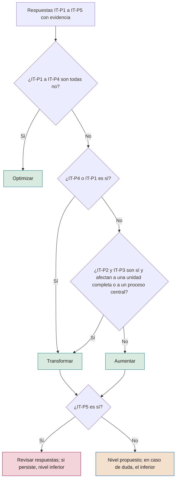
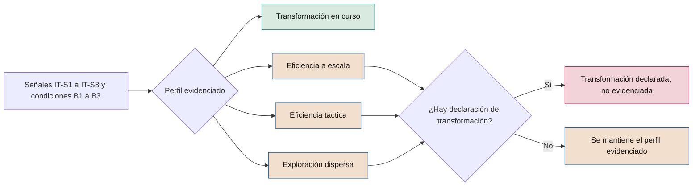

# Índice de transformación

**Cómo saber, con evidencia, si una iniciativa y una compañía se transforman con IA o solo se eficientan**

| | |
|---|---|
| Documento | Documento 12 · Índice de transformación |
| Versión | 0.1 (borrador de trabajo) |
| Fecha | 16-09-2026 |
| Autor | Fernando García · SEACHAD |
| Estado | Borrador para revisión. Los umbrales numéricos son iniciales y deben calibrarse con la aplicación práctica. |

<!-- cifras: 5 | preguntas de clasificación ; 8 | señales observables ; 0–3 | puntuación por señal ; 5 | perfiles de compañía -->

---

> **Aviso legal y exención de responsabilidad.** SEVEN-G es un marco metodológico de referencia que se ofrece «tal cual» y con fines exclusivamente informativos. No constituye asesoramiento jurídico, regulatorio, financiero ni profesional, ni garantiza el cumplimiento de ninguna norma. Las referencias a regulación general (como el Reglamento Europeo de IA, el RGPD, DORA o NIS2), a normas técnicas y a regulación específica de cada sector o jurisdicción pueden ser incompletas, no aplicar a un caso concreto o quedar desactualizadas por cambios normativos, interpretaciones o criterios de las autoridades posteriores a su fecha de consulta. **Cada organización que use SEVEN-G es la única responsable de identificar la normativa que le aplica, verificar su vigencia y certificar su propio cumplimiento regulatorio**, con el asesoramiento cualificado que corresponda. El autor y SEACHAD no asumen responsabilidad alguna por el uso que se haga de este contenido ni por las decisiones que se adopten con él. Los datos, cifras, compañías y casos de los ejemplos son ficticios o ilustrativos.

<!-- esencial: siempre | Cálculo del índice de transformación de la compañía en C1 y en cada C5, con las condiciones de base y las ocho señales; «sin dato» nunca cuenta como evidencia. La clasificación de la ambición de cada iniciativa (sección 3) se aplica siempre. -->

## 1. Objeto y alcance

Este documento desarrolla la sección 5 del documento 00. Define dos instrumentos conectados:

1. **La clasificación de ambición de cada iniciativa** (Optimizar, Aumentar o Transformar): cinco preguntas, reglas de decisión, tratamiento de los casos dudosos, responsables y ciclo de ambición propuesta, confirmada y real.
2. **El índice de transformación de la compañía**: ocho señales con fórmula, fuente de datos y puntuación de 0 a 3; condiciones de base; reglas para asignar uno de los cinco perfiles; tratamiento del "sin dato"; periodicidad; calibración; ejemplo completo y limitaciones.

Se aplica en las fases 1, 2 y 7 del ciclo de vida y en las etapas C1, C4 y C5 del ciclo corporativo. Las herramientas asociadas son el clasificador de ambición (T05) y la calculadora del índice (T14); la evidencia de la clasificación se documenta con la plantilla P07.

Todos los umbrales numéricos de este documento son **iniciales y están marcados "a calibrar"**. No proceden de estudios de mercado: son puntos de partida razonables que cada compañía revisa en C5 con sus propios datos (sección 8).

---

## 2. Principio

La eficiencia y la transformación **no se distinguen por la tecnología**, sino por **qué cambia en el negocio y dónde aparece el valor**. Un agente de IA generativa que redacta respuestas más rápido es optimización; un modelo estadístico clásico que permite lanzar un servicio con precio personalizado puede ser transformación.

El índice no es un juicio de valor. **La eficiencia es un resultado legítimo** y muchas compañías deben empezar por ella para financiar sus apuestas posteriores. Lo que SEVEN-G exige es que la elección sea consciente, esté medida y la tome quien corresponde (principio 9 del documento 01). El índice sirve sobre todo para detectar una situación concreta: **la transformación declarada que las señales no confirman**.

---

## 3. Clasificación de la ambición de una iniciativa

### 3.1 Las cinco preguntas

Cada pregunta se responde **sí** o **no**, con una justificación breve y la evidencia disponible. Una respuesta afirmativa sin evidencia se trata como **no** a efectos de clasificación.

| # | Pregunta | Qué cuenta como sí | Qué no cuenta como sí | Apunta a |
|---|---|---|---|---|
| **IT-P1** | ¿Cambia la propuesta de valor que recibe el cliente o el usuario final? | El cliente recibe algo distinto: un servicio nuevo, una prestación que antes no existía, un modo de relación diferente o un precio construido de otra forma. | El mismo servicio más rápido, más barato o con menos errores. | Transformar |
| **IT-P2** | ¿Se rediseña el proceso de extremo a extremo, y no solo una tarea dentro del proceso? | Cambian los pasos, los puntos de decisión y los traspasos del proceso completo, desde la entrada hasta el resultado. | Se automatiza o acelera uno o varios pasos manteniendo el diseño del proceso. | Aumentar o Transformar |
| **IT-P3** | ¿Cambian los roles, la estructura organizativa o quién toma qué decisiones? | Se rediseñan puestos o equipos, o decisiones que tomaban personas pasan a tomarlas sistemas (A2 o A3) con supervisión definida, o las personas asumen tareas que antes no podían hacer. | Se reduce el número de personas que hacen lo mismo; se entrega una herramienta sin cambiar el contenido del puesto. | Aumentar o Transformar |
| **IT-P4** | ¿Genera ingresos, servicios o mercados que no existían? | Ingresos o clientes procedentes de una oferta, canal o mercado que no existiría sin la IA. | Más ventas de la oferta existente por mejor conversión o retención. | Transformar |
| **IT-P5** | ¿Podría retirarse sin afectar al modelo de negocio, volviendo simplemente al coste anterior? | Si se apaga, la compañía sigue haciendo lo mismo con el coste o el tiempo previos. | Si se apaga, se pierde una oferta, una capacidad de las personas o una forma de organizarse. | Optimizar |

### 3.2 Reglas de decisión

Las reglas se aplican **en orden**. La primera que se cumple determina el nivel, salvo las reglas de contraste (6 a 10), que se aplican siempre.

| Regla | Condición | Resultado |
|---|---|---|
| **1 · Optimizar por defecto** | IT-P1, IT-P2, IT-P3 y IT-P4 son **no**. | **Optimizar**, con independencia de cómo se haya presentado la iniciativa. |
| **2 · Nuevos ingresos** | IT-P4 es **sí**. | **Transformar**. |
| **3 · Nueva propuesta de valor** | IT-P1 es **sí**. | **Transformar**. |
| **4 · Nuevo modelo operativo** | IT-P2 y IT-P3 son **sí** y el cambio afecta a una unidad organizativa completa o a un proceso central del negocio (no a un proceso de soporte parcial). | **Transformar**. |
| **5 · Aumento** | IT-P2 o IT-P3 son **sí** y no se cumple la regla 4. | **Aumentar**. |
| **6 · Contraste con IT-P5** | El resultado es Aumentar o Transformar y IT-P5 es **sí**. | Incoherencia: se revisan las respuestas. Si persiste, se asigna el nivel inmediatamente inferior y se registra el motivo. |
| **7 · Dependencia en Optimizar** | El resultado es Optimizar y IT-P5 es **no**. | El nivel no cambia. Se comprueba si la iniciativa soporta una función crítica (criterio Enterprise del documento 01, sección 9.2). |
| **8 · Prudencia ante la duda** | Tras aplicar las reglas persiste una duda razonable entre dos niveles. | Se asigna el **nivel inferior**. Quien propone el superior aporta la evidencia que resuelva la duda. La duda **no rebaja los controles**: si afecta a un criterio Enterprise, se aplica Enterprise. |
| **9 · Iniciativas mixtas** | La iniciativa tiene componentes de distinto nivel. | Se divide en iniciativas separadas o se clasifica según el componente que concentra más de la mitad de la inversión. No se promedian niveles. |
| **10 · Irrelevancia de la forma** | — | No influyen en el nivel la tecnología (IA generativa, agentes), el importe de la inversión, la novedad técnica ni la denominación del programa. |

<!-- grafico: Clasificación de la ambición de una iniciativa | Las reglas se aplican en orden y se contrastan con la pregunta 5 -->

### 3.3 Casos dudosos

*Ejemplos genéricos e ilustrativos.*

| Caso | Clasificación | Razonamiento |
|---|---|---|
| Asistente de IA generativa que redacta borradores de respuesta para el equipo de atención | **Optimizar** | Mismo servicio, mismo rol; ahorra tiempo (IT-P1–IT-P4 no). |
| Copiloto que permite a los analistas revisar operaciones de mayor complejidad que antes derivaban a especialistas | **Aumentar** | Cambia el contenido del puesto (IT-P3 sí); el negocio es el mismo. |
| Licencias de una suite de productividad con IA para todos los empleados | **Optimizar**, salvo que se demuestre cambio de rol | Sin plan de adopción ni rediseño de puestos, IT-P3 es no. |
| Automatización con agentes de un proceso de back office completo, con reducción de plantilla y los mismos puestos restantes | **Optimizar** | Reducir personas que hacen lo mismo no es cambio de rol; si el proceso se rediseña (IT-P2 sí) pero no cambian roles, sería **Aumentar**. |
| Rediseño de la función de planificación: decisiones de asignación que pasan a un sistema A2 y planificadores que supervisan excepciones | **Transformar** (regla 4) | IT-P2 y IT-P3 sí sobre una unidad completa. Si solo afecta a una parte de la planificación, **Aumentar**. |
| Precio dinámico con IA para la oferta existente | **Aumentar** o **Transformar** | Si el cliente recibe una forma de precio nueva (IT-P1 sí), Transformar; si solo se ajustan tarifas dentro del modelo actual, Aumentar (IT-P3: la decisión pasa a un sistema). |
| Servicio de pago para clientes basado en un modelo propio | **Transformar** (regla 2) | Ingresos que no existían (IT-P4 sí). |
| Plataforma común de datos para varias iniciativas | **Optimizar** por defecto | Se clasifica por su efecto propio. No hereda la ambición de las iniciativas que habilita; su contribución se declara como dependencia. |
| Piloto exploratorio de una idea de nuevo servicio | Según la hipótesis a escala | Se clasifica por lo que cambiaría si tuviera éxito; la ambición real se evalúa en G7. |
| Sistema de IA para vigilar obligaciones regulatorias (esfera principal 08) | **Optimizar** por lo general | Se clasifica como cualquier otra; su nivel no califica la esfera 08 (documento 10, sección 4.2). |

### 3.4 Ambición propuesta, confirmada y real

| Estado | Cuándo | Qué representa | Evidencia |
|---|---|---|---|
| **Propuesta** | Fase 1 | Nivel que el equipo propone con las cinco preguntas sobre la oportunidad. | P07 con respuestas y justificación. |
| **Confirmada** | Fase 2 (G2) | Nivel verificado sobre la hipótesis de valor: métricas, línea base y tipo de valor esperado coherentes con el nivel. | P07 actualizada, P08. |
| **Real** | Fase 7 (G7) y, si procede, R6 | Nivel que demuestra la evidencia en producción. | P07 con evidencia de resultados, P28, P30. |

Criterios para registrar la **ambición real** (coherentes con los criterios de G7 del documento 01, sección 7.6):

| Ambición real | Evidencia mínima |
|---|---|
| **Transformar** | Retorno validado atribuible a la iniciativa, o cambio de la oferta o del modelo operativo verificado (IT-P1, IT-P4 o regla 4 comprobados con hechos). |
| **Aumentar** | Adopción efectiva igual o superior al objetivo de la hipótesis, mejora de rendimiento medida y cambio de rol o capacidad reasignada verificados. |
| **Optimizar** | Cualquier otro caso con valor medido. |

Si la iniciativa se **para antes de G5**, no se registra ambición real: se conserva la confirmada y la parada cuenta en la señal 7.

### 3.5 Quién clasifica, confirma y revisa

| Momento | Propone o registra | Verifica | Decide | Observaciones |
|---|---|---|---|---|
| **Fase 1 · Propuesta** | Responsable de producto de IA | Oficina de IA (coherencia de respuestas) | Patrocinador, en G1 | Se registra el evento en T01. |
| **Fase 2 · Confirmación (Lite)** | Responsable de producto de IA | Oficina de IA | Patrocinador, en G2 | Si el nivel confirmado es Transformar, la intensidad pasa a Enterprise. |
| **Fase 2 · Confirmación (Enterprise)** | Responsable de producto de IA | Auditor de IA | Comité de IA, en G2 | Transformar requiere además aprobación del consejo. |
| **R6 · Revisión de continuidad** | Responsable de producto de IA | Oficina de IA o auditor de IA | Órgano de R6 | Si hay indicios de que el nivel real difiere del confirmado, se adelanta G7. |
| **Fase 7 · Ambición real** | Responsable de producto de IA, con datos de T12 | Oficina de IA (Lite) o auditor de IA (Enterprise) | Órgano de G7 | Escalar una iniciativa con ambición real Transformar requiere aprobación del consejo. |

Nadie verifica ni decide sobre la clasificación de su propia iniciativa (documento 01, sección 7.4).

### 3.6 Qué hacer si la ambición real difiere de la declarada

| Situación | Actuación | Responsable |
|---|---|---|
| **Real inferior a la confirmada** | 1) Registrar el cambio como evento con motivo. 2) Recalcular el mapa de calor y el índice. 3) Analizar la causa: sobredeclaración inicial, ejecución incompleta o cambio de alcance. 4) En G7, elegir entre **Iterar** para alcanzar el nivel confirmado, con nuevo plazo y límite de inversión, o **aceptar el nivel real** y evaluar la continuidad con los criterios de ese nivel (por ejemplo, ahorro materializado si pasa a Optimizar). 5) Revisar si la intensidad Enterprise sigue justificada por otro criterio. 6) Registrar las lecciones aprendidas. | Órgano de G7; si la confirmada era Transformar, se informa al consejo en la siguiente sesión de C4. |
| **Real superior a la confirmada** | Se trata como una nueva clasificación: se aplican los criterios y aprobaciones del nuevo nivel antes de escalar. Si alcanza Transformar, se requiere aprobación del consejo y se aplica Enterprise. | Órgano de G7; consejo si alcanza Transformar. |
| **Operación como Transformar sin aprobación** | Si la iniciativa ya ha introducido cambios propios de Transformar sin la aprobación del consejo, se abre una **no conformidad mayor** y se regulariza en el plazo aprobado en C2. | Comité de IA. |
| **Clasificación sin respuestas o sin evidencia** | **No conformidad menor**, que debe corregirse antes del siguiente *gate*. | Oficina de IA. |
| **Clasificación modificada para eludir un control o una aprobación** | **No conformidad mayor**. | Comité de IA. |

La diferencia entre ambición confirmada y real **no es en sí una no conformidad**: las apuestas pueden no cumplirse. Lo que se controla es su frecuencia:

**Tasa de sobredeclaración de ambición** = iniciativas con ambición real inferior a la confirmada ÷ iniciativas con ambición real registrada × 100, en los últimos 24 meses.

| Valor (a calibrar) | Actuación |
|---|---|
| 30 % o más en el conjunto de la cartera | Alerta al comité de IA y revisión de la calidad de la clasificación en la fase 2. |
| 50 % o más en las iniciativas confirmadas como Transformar | Se informa al consejo y se tiene en cuenta en la lectura del perfil (sección 5.3). |

---

## 4. Índice de transformación de la compañía

### 4.1 Estructura

El índice se compone de **ocho señales** observables. Cada señal se puntúa de **0 a 3**:

| Puntuación | Significado general |
|---|---|
| **0** | Sin dato, o situación de exploración (no hay cartera, producción o registro suficiente para medir). |
| **1** | Lectura de eficiencia. |
| **2** | Lectura intermedia. |
| **3** | Lectura de transformación. |

La **suma** (0 a 24) se muestra como referencia, pero **el perfil no se asigna por la suma**, sino con las reglas de la sección 5, que combinan señales concretas y condiciones de base. Un valor medido que resulta nulo (por ejemplo, 0 % de ingresos habilitados) puntúa **1**, no 0: está medido y su lectura es de eficiencia.

### 4.2 Perímetro y reglas comunes de cálculo

| Aspecto | Regla |
|---|---|
| **Iniciativas incluidas** | Todas las del registro de iniciativas (T01) cuya esfera principal es 01 a 07. Las de esfera principal 08 o 09 se excluyen de las señales 1, 2 y 7 y se informan aparte como inversión en habilitación de gobierno y cumplimiento (documento 10, sección 4.2). |
| **Uso corporativo de IA de propósito general** | Su coste cuenta en la señal 1 como **Optimizar**, salvo que forme parte de una iniciativa con ambición confirmada superior y plan de adopción aprobado. |
| **Nivel de ambición usado** | Real si existe; si no, confirmada. Las iniciativas con solo ambición propuesta se cuentan como **sin clasificar**. |
| **Ventana** | Doce meses móviles hasta la fecha de corte, salvo la señal 7 (veinticuatro meses). |
| **Estado de los importes** | Las señales de valor (2, 3 y 6) usan solo importes **validados**. |
| **Moneda y coste** | "Coste de la cartera" = inversión de construcción ejecutada en la ventana + coste recurrente de la ventana, según las categorías del documento 42. |

### 4.3 Condiciones de base

Tres condiciones que no puntúan, pero que los perfiles exigen:

| Código | Condición | Fórmula | Umbral inicial (a calibrar) |
|---|---|---|---|
| **B1** | Cartera gobernada | Iniciativas activas con fase, *gates* registrados y ambición confirmada ÷ iniciativas activas × 100 | 80 % o más |
| **B2** | Proporción de valor validado | Valor realizado validado ÷ valor realizado total (validado + declarado + estimado) × 100 | 50 % o más |
| **B3** | Escala en producción | Número de iniciativas de esferas 01 a 07 en producción | 5 o más (ajustable al tamaño de la compañía en C2) |

### 4.4 Las ocho señales

#### Señal 1 · Composición de la inversión

| | |
|---|---|
| **Qué mide** | Peso de las apuestas de Aumentar y Transformar en el coste de la cartera. |
| **Fórmula** | IT-S1 = coste de la cartera en Aumentar y Transformar ÷ coste total de la cartera × 100. Se informa además el peso de Transformar por separado. |
| **Fuente** | T01: nivel de ambición, esfera principal; T12 y T13: inversión y coste recurrente por iniciativa. |
| **0** | No hay cartera registrada, o más del 30 % del coste corresponde a iniciativas sin clasificar. |
| **1** | Menos del 20 %. |
| **2** | Del 20 % al 40 %, o 40 % o más con Transformar por debajo del 10 %. |
| **3** | 40 % o más, con Transformar en el 10 % o más. |

#### Señal 2 · Composición del valor

| | |
|---|---|
| **Qué mide** | Proporción del valor validado que procede de retorno frente a eficiencias. |
| **Fórmula** | IT-S2 = retorno validado ÷ (eficiencias validadas materializadas + retorno validado) × 100. |
| **Fuente** | T12: importes por tipo (eficiencia, retorno) con estado validado. La capacidad liberada no suma (regla 3 de medición). |
| **0** | No hay valor validado. |
| **1** | Menos del 10 %. |
| **2** | Del 10 % al 30 %, o 30 % o más procedente de una sola iniciativa. |
| **3** | 30 % o más, procedente de al menos dos iniciativas. |

#### Señal 3 · Materialización

| | |
|---|---|
| **Qué mide** | Capacidad liberada que se ha convertido en menor coste real o se ha reasignado de forma explícita. |
| **Fórmula** | IT-S3 = (horas materializadas + horas reasignadas) ÷ horas de capacidad liberada medidas × 100. Se informa aparte la proporción reasignada. |
| **Fuente** | T12 (capacidad liberada y ahorro materializado) y T20 (reasignación registrada con actividad de destino). |
| **0** | No se mide la capacidad liberada. |
| **1** | Menos del 30 %. |
| **2** | 30 % o más, sin cumplir el nivel 3. |
| **3** | 60 % o más, con las horas reasignadas iguales o superiores a la mitad de las convertidas. |

#### Señal 4 · Profundidad del cambio

| | |
|---|---|
| **Qué mide** | Procesos rediseñados de extremo a extremo frente a tareas automatizadas. |
| **Fórmula** | IT-S4 = iniciativas en producción con IT-P2 = sí verificada en G5 o G7 ÷ iniciativas en producción × 100. |
| **Fuente** | T01: respuestas a IT-P2 con estado de verificación; T03: resultado de G5 y G7. |
| **0** | No hay iniciativas en producción, o la verificación de IT-P2 falta en más del 30 % de ellas. |
| **1** | Menos del 15 %. |
| **2** | Del 15 % al 35 %. |
| **3** | 35 % o más. |

#### Señal 5 · Modelo operativo

| | |
|---|---|
| **Qué mide** | Cambios en roles, estructura y reparto de decisiones entre personas y sistemas, con supervisión definida. |
| **Fórmula** | IT-S5 = iniciativas en producción con IT-P3 = sí verificada y diseño de supervisión humana verificado (P17) ÷ iniciativas en producción × 100. |
| **Fuente** | T01: respuestas a IT-P3 verificadas; evidencia P17; T20: roles rediseñados; registro de unidades organizativas rediseñadas. |
| **0** | No hay iniciativas en producción. |
| **1** | Menos del 10 %. |
| **2** | Del 10 % al 25 %, o 25 % o más sin ninguna unidad organizativa completa rediseñada. |
| **3** | 25 % o más, con al menos una unidad organizativa completa rediseñada. |

Un cambio de roles o de reparto de decisiones **sin supervisión humana definida no cuenta** en esta señal y se comunica como alerta al comité de IA.

#### Señal 6 · Ingresos habilitados por IA

| | |
|---|---|
| **Qué mide** | Peso en los ingresos de productos, servicios o canales que no existirían sin IA. |
| **Fórmula** | IT-S6 = ingresos validados de oferta habilitada por IA en la ventana ÷ ingresos totales de la compañía en la ventana × 100. |
| **Criterio de inclusión** | La oferta supera la prueba contrafactual: sin el sistema de IA, la compañía no podría prestarla o no podría hacerlo en condiciones económicamente viables. Las mejoras de conversión o retención de la oferta existente no cuentan aquí (cuentan en la señal 2). |
| **Fuente** | Control de gestión; T12 (retorno de conceptos de venta nueva con marca de oferta habilitada por IA); T01 (IT-P4 = sí verificada). |
| **0** | No se mide. |
| **1** | Menos del 0,5 %. |
| **2** | Del 0,5 % al 2 %. |
| **3** | 2 % o más. |

Estos umbrales dependen mucho del sector y del tamaño. La compañía **puede** ajustarlos en su primera C2, declarando el ajuste.

#### Señal 7 · Paso a producción

| | |
|---|---|
| **Qué mide** | Si las apuestas de Aumentar y Transformar llegan a producción en proporción y tiempo comparables al resto. |
| **Fórmulas** | **Tasa de llegada** de un grupo = iniciativas que superaron G2 en los últimos 24 meses y alcanzaron G5 ÷ iniciativas del mismo grupo con resultado (alcanzaron G5, se pararon o están estancadas más del doble de la suma de los plazos de referencia de las fases 3 a 5). **Conversión relativa** CR = tasa de llegada de Aumentar y Transformar ÷ tasa de llegada de Optimizar. **Tiempo relativo** TR = mediana de días de G2 a G5 en Aumentar y Transformar ÷ misma mediana en Optimizar. |
| **Sin base de comparación** | Si no hay iniciativas de Optimizar con resultado, CR se sustituye por la tasa de llegada de Aumentar y Transformar ÷ 0,6, y TR por la mediana real ÷ la suma de los plazos de referencia de las fases 3 a 5 (documento 03, sección 3.6). |
| **Fuente** | T01 y T03: fechas de G2 y G5, estados, motivos de parada, plazos de referencia. |
| **0** | No hay *gates* registrados en la ventana. |
| **1** | Ninguna iniciativa de Aumentar o Transformar ha superado G2 en la ventana, o CR es inferior a 0,5. |
| **2** | CR de 0,5 o más sin cumplir el nivel 3, o menos de tres iniciativas de Aumentar o Transformar con resultado. |
| **3** | CR de 0,8 o más, TR de 2,0 o menos y al menos tres iniciativas de Aumentar o Transformar con resultado. |

#### Señal 8 · Decisión del consejo

| | |
|---|---|
| **Qué mide** | Si el consejo decide, financia y supervisa apuestas de transformación de forma explícita y trazable. |
| **Fórmula** | Recuento, en los últimos 12 meses, de apuestas de Transformar aprobadas por el consejo, con límite de inversión por etapa, número de revisiones registradas y decisiones de etapa. |
| **Fuente** | T18: registro de recomendaciones y decisiones; T03: aprobaciones del consejo en G2 y G7; documento de decisión de C2 (T19). |
| **0** | No hay tesis de IA aprobada por el consejo. |
| **1** | Hay tesis aprobada, pero ninguna apuesta de Transformar aprobada por el consejo en la ventana. |
| **2** | Al menos una apuesta de Transformar aprobada por el consejo y registrada. |
| **3** | Al menos una apuesta aprobada con límite de inversión por etapa, dos o más revisiones del consejo registradas en la ventana y al menos una decisión de etapa (continuar, pivotar o parar) basada en hitos. |

### 4.5 Resumen de umbrales iniciales

*Umbrales iniciales, a calibrar en C5.*

| Señal | 0 | 1 | 2 | 3 |
|---|---|---|---|---|
| 1 · Inversión en Aumentar y Transformar | Sin cartera o > 30 % sin clasificar | < 20 % | 20–40 % | ≥ 40 % y Transformar ≥ 10 % |
| 2 · Retorno en el valor validado | Sin valor validado | < 10 % | 10–30 % | ≥ 30 % y ≥ 2 iniciativas |
| 3 · Capacidad convertida | No se mide | < 30 % | ≥ 30 % | ≥ 60 % y reasignada ≥ mitad |
| 4 · Procesos de extremo a extremo | Sin producción | < 15 % | 15–35 % | ≥ 35 % |
| 5 · Cambio de modelo operativo | Sin producción | < 10 % | 10–25 % | ≥ 25 % y una unidad completa |
| 6 · Ingresos habilitados por IA | No se mide | < 0,5 % | 0,5–2 % | ≥ 2 % |
| 7 · Paso a producción | Sin *gates* | CR < 0,5 | CR ≥ 0,5 | CR ≥ 0,8 y TR ≤ 2,0 |
| 8 · Decisión del consejo | Sin tesis | Sin apuestas | ≥ 1 apuesta | Etapas, revisiones y decisión de etapa |

Cuando un valor coincide con el límite entre dos tramos, se aplica el tramo superior.

---

## 5. Asignación del perfil

<!-- figura: espectro -->

### 5.1 Declaración de transformación

Existe **declaración de transformación** (D = sí) cuando se cumple al menos una de estas condiciones:

| # | Condición | Evidencia |
|---|---|---|
| IT-D1 | La tesis de IA aprobada en C2 fija **Transformar** como ambición objetivo en al menos una esfera. | Documento de decisión de C2 (T19). |
| IT-D2 | Las iniciativas con ambición confirmada Transformar suponen el **10 % o más** del coste de la cartera. | T01, señal 1. |
| IT-D3 | El plan estratégico, los informes al consejo, el informe anual u otras comunicaciones de la compañía presentan la IA como **transformación del negocio**. | Documentos citados, con fecha. |

### 5.2 Reglas de asignación

Las reglas se aplican en dos pasos.

**Paso 1 · Perfil evidenciado.** Se evalúan las condiciones en orden; se asigna el primer perfil cuyas condiciones se cumplen todas.

| Orden | Perfil evidenciado | Condiciones |
|---|---|---|
| 1 | **Transformación en curso** | B1 y B2 · IT-S8 ≥ 2 · IT-S7 ≥ 2 · IT-S2 ≥ 2 o IT-S6 ≥ 2 · IT-S4 ≥ 2 o IT-S5 ≥ 2 · suma de señales ≥ 14 |
| 2 | **Eficiencia a escala** | B1, B2 y B3 · IT-S3 ≥ 2 |
| 3 | **Eficiencia táctica** | Al menos una iniciativa en producción con valor medido, en cualquier estado |
| 4 | **Exploración dispersa** | Ninguna de las anteriores |

**Paso 2 · Contraste con la declaración.** Si **D = sí** y el perfil evidenciado **no** es Transformación en curso, el perfil asignado es **Transformación declarada, no evidenciada**, y se informa el perfil evidenciado como **perfil subyacente**. En cualquier otro caso, el perfil asignado es el evidenciado.

<!-- grafico: Asignación del perfil de la compañía | Primero se calcula lo que muestran las señales; después se contrasta con lo que se declara -->

### 5.3 Alertas complementarias

| Alerta | Condición | Lectura |
|---|---|---|
| **Transformación frágil** | Perfil Transformación en curso con tasa de sobredeclaración en Transformar del 50 % o más. | Las apuestas avanzan, pero la mayoría no confirma su ambición en G7. |
| **Eficiencia no materializada** | IT-S1 = 1 y IT-S3 = 1. | Cartera de eficiencia cuyo ahorro no llega a la cuenta de resultados. |
| **Apuestas atascadas** | IT-S1 ≥ 2 y IT-S7 = 1. | Se invierte en Aumentar y Transformar, pero no llega a producción. |
| **Transformación sin consejo** | IT-S2 ≥ 2 o IT-S6 ≥ 2, con IT-S8 ≤ 1. | Hay cambio real que el consejo no decide ni supervisa. |
| **Cambio sin supervisión** | Iniciativas excluidas de la señal 5 por falta de supervisión humana definida. | Riesgo de gobierno: se delegan decisiones sin control. |

---

## 6. Tratamiento del "sin dato"

1. **"Sin dato" puntúa 0 y se muestra como "sin dato"**, nunca como cero medido ni como estimación (regla 8 de medición).
2. Se calcula la **cobertura del índice** = señales con dato ÷ 8. Se muestra siempre junto al perfil.
3. Si la cobertura es **inferior a 6 de 8**, el perfil se asigna igualmente pero se marca como **provisional** y se acompaña de un plan para obtener los datos que faltan, con responsable y plazo.
4. Ninguna señal "sin dato" se sustituye por una estimación. Si la compañía dispone de un valor **declarado** o **estimado** para una señal que exige importes validados, puede mostrarlo como información de contexto, sin puntuación.
5. La falta reiterada de dato en la misma señal durante dos cálculos anuales es, en sí misma, un hallazgo para C5 y para el diagnóstico de madurez (dimensión D7, Medición y evidencia).

---

## 7. Periodicidad y responsables

| Cálculo | Cuándo | Quién calcula | Quién revisa | Destino |
|---|---|---|---|---|
| **Formal** | Anual, en C1 (primera vez) y en C5 | Oficina de IA con control de gestión | Auditoría interna | Consejo |
| **De seguimiento** | Trimestral, en C4 | Oficina de IA | Comité de IA | Panel del consejo (tendencia) |
| **Extraordinario** | Tras una reorganización, una operación corporativa o un cambio de tesis | Oficina de IA | Comité de IA | Consejo |

El cálculo trimestral usa los mismos umbrales que el anual y se presenta como tendencia. El perfil oficial es el del cálculo formal.

---

## 8. Calibración en C5

Los umbrales iniciales no tienen base empírica propia de la compañía. Se calibran así:

| Paso | Actividad | Responsable |
|---|---|---|
| 1 | Reunir al menos cuatro cálculos trimestrales o un ciclo anual completo. | Oficina de IA |
| 2 | Analizar la distribución de cada señal, su sensibilidad a cambios pequeños y los casos en los que el perfil contradice el juicio informado del comité. | Oficina de IA con control de gestión |
| 3 | Proponer ajustes de umbrales, con justificación señal por señal. | Comité de IA |
| 4 | Revisar que el ajuste no se propone para mejorar el perfil del año en curso. | Auditoría interna |
| 5 | Aprobar la nueva versión de umbrales. | Consejo, en C5 |
| 6 | Recalcular el periodo anterior con los nuevos umbrales y publicar ambos resultados para mantener la comparabilidad. | Oficina de IA |
| 7 | Registrar la versión de umbrales usada en cada cálculo. | Oficina de IA (T14; P35 §14) |

Reglas de calibración:

- Los umbrales **no se cambian dentro del ciclo anual**.
- La compañía **puede** ajustar umbrales, pero **no** la estructura de las señales ni las reglas de asignación de perfiles. Una compañía que declare aplicar SEVEN-G debe indicar las desviaciones respecto a los umbrales de este documento.
- Los ajustes del marco (por ejemplo, nuevos umbrales de referencia) se incorporan en nuevas versiones de este documento a partir de la experiencia de aplicación.

---

## 9. Ejemplo ilustrativo completo

*Compañía ficticia. Todos los datos son ilustrativos y coinciden con el ejemplo de mapa de calor del documento 10, sección 8.2.*

**Contexto.** Compañía industrial con 400 M€ de ingresos anuales. Tiene 17 iniciativas activas en esferas 01 a 07 (14 de Optimizar, 2 de Aumentar y 1 de Transformar) y 2 iniciativas en la banda de habilitación (esferas 08 y 09). Catorce están en producción: las 12 de Optimizar que han superado G5 y las 2 de Aumentar. La de Transformar (un servicio nuevo en la esfera 02) está en fase 5, con un piloto comercial. La tesis de IA aprobada en C2 fija Transformar como ambición objetivo para Producto y servicio, y el plan estratégico describe la IA como "palanca de transformación".

**Condiciones de base**

| Condición | Datos | Resultado |
|---|---|---|
| B1 · Cartera gobernada | 15 de 17 iniciativas activas con fase, *gates* y ambición confirmada = 88 % | Cumple (≥ 80 %) |
| B2 · Valor validado | 1,96 M€ validados de 3,30 M€ de valor realizado = 59 % | Cumple (≥ 50 %) |
| B3 · Escala | 14 iniciativas en producción | Cumple (≥ 5) |

**Señales**

| Señal | Datos | Cálculo | Puntuación |
|---|---|---|---|
| 1 · Inversión | Coste de la cartera 4,00 M€: Optimizar 3,00; Aumentar 0,70; Transformar 0,30 | (0,70 + 0,30) ÷ 4,00 = 25 %; Transformar 7,5 % | **2** |
| 2 · Valor | Eficiencias validadas materializadas 1,80 M€; retorno validado 0,16 M€ (0,12 de una iniciativa de Aumentar en Cliente y 0,04 del piloto de Transformar) | 0,16 ÷ 1,96 = 8,2 % | **1** |
| 3 · Materialización | 60.000 h liberadas; 9.000 h materializadas; 12.000 h reasignadas | 21.000 ÷ 60.000 = 35 % | **2** |
| 4 · Profundidad | 2 de 14 iniciativas en producción con IT-P2 verificada | 14,3 % | **1** |
| 5 · Modelo operativo | 1 de 14 con IT-P3 y supervisión verificadas; ninguna unidad completa | 7,1 % | **1** |
| 6 · Ingresos habilitados | 0,04 M€ validados del piloto comercial sobre 400 M€ | 0,01 % | **1** |
| 7 · Paso a producción | Aumentar y Transformar: 5 con resultado, 2 en producción (40 %). Optimizar: 14 con resultado, 10 en producción (71 %). Medianas G2→G5: 230 y 120 días | CR = 0,40 ÷ 0,71 = 0,56; TR = 1,9 | **2** |
| 8 · Consejo | Tesis aprobada; una apuesta de Transformar aprobada con límite por etapa; una sola revisión registrada en 12 meses | Cumple nivel 2, no nivel 3 | **2** |
| **Suma** | | | **12 de 24** |

Cobertura del índice: 8 de 8 señales con dato.

**Paso 1 · Perfil evidenciado**

| Perfil | Comprobación | Resultado |
|---|---|---|
| Transformación en curso | B1 y B2 sí · IT-S8 = 2 sí · IT-S7 = 2 sí · IT-S2 o IT-S6 ≥ 2: **no** (1 y 1) · IT-S4 o IT-S5 ≥ 2: **no** (1 y 1) · suma ≥ 14: **no** (12) | No se cumple |
| Eficiencia a escala | B1, B2 y B3 sí · IT-S3 = 2 sí | **Se cumple** |

**Paso 2 · Contraste.** IT-D1 (tesis con Transformar en la esfera 02) y IT-D3 (plan estratégico) se cumplen: D = sí. El perfil evidenciado no es Transformación en curso.

**Perfil asignado: Transformación declarada, no evidenciada. Perfil subyacente: Eficiencia a escala.**

Alertas complementarias: ninguna de las de la sección 5.3 se activa. La tasa de sobredeclaración no es aún calculable para Transformar (ninguna iniciativa con ambición real registrada).

**Mensaje al consejo** (formato del documento 60): *"Todavía no, porque falta evidencia de retorno y de cambio en procesos y roles. La compañía gobierna bien una cartera de eficiencia con valor validado, pero la transformación declarada descansa en una sola apuesta en piloto. Para evidenciar transformación harían falta, como mínimo: retorno validado de al menos 0,20 M€ o ingresos habilitados de al menos 2 M€; al menos tres procesos rediseñados de extremo a extremo en producción; y revisión trimestral de la apuesta por el consejo."*

---

## 10. Presentación al consejo

El índice se presenta siempre con tres elementos:

| Elemento | Contenido |
|---|---|
| **Perfil** | Perfil asignado, perfil subyacente si aplica, carácter provisional si la cobertura es insuficiente, y versión de umbrales. |
| **Tabla de señales** | Para cada señal: valor medido, puntuación, tendencia frente al cálculo anterior y "sin dato" explícito. |
| **Qué movería el perfil** | Las dos o tres condiciones concretas cuyo cumplimiento cambiaría el perfil, con responsable y plazo propuestos. |

No se presenta el índice como una nota ni se compara con otras compañías (sección 11).

---

## 11. Limitaciones

| Limitación | Consecuencia | Mitigación |
|---|---|---|
| Los umbrales iniciales no proceden de datos empíricos. | El perfil puede ser sensible a cambios pequeños cerca de los límites. | Calibración en C5; publicación del valor medido junto a la puntuación. |
| Depende de la calidad de la clasificación de ambición. | Una clasificación inflada distorsiona las señales 1 y 7. | Verificación independiente en G2 y G7; tasa de sobredeclaración; señales 2, 4, 5 y 6 basadas en evidencia. |
| No mide el valor absoluto ni la rentabilidad de la IA. | Un perfil de transformación no implica que la cartera sea rentable. | Se lee junto al valor neto anual y al neto adicional por euro (documento 40). |
| No es comparable entre sectores ni entre compañías de tamaño muy distinto. | Uso indebido como clasificación de mercado. | Se usa solo para seguir la evolución de la propia compañía. |
| Es un indicador retardado. | Las decisiones de transformación tardan en reflejarse en las señales 2, 5 y 6. | Lectura de tendencia trimestral; la señal 8 anticipa. |
| Con pocas iniciativas los porcentajes son volátiles. | Una sola iniciativa cambia una puntuación. | Condición B3, mínimos de recuento en las señales 2 y 7, perfil provisional. |
| Solo observa la transformación asociada a la IA. | Una compañía puede transformarse por otras vías. | El índice no pretende medir la transformación global de la compañía. |
| No sustituye al diagnóstico de madurez. | Perfil y madurez pueden divergir. | Se presentan juntos en C1 y C5 (documento 11). |

---

## 12. Herramientas y plantillas asociadas

| Código | Nombre | Uso en este documento |
|---|---|---|
| **T01** | Registro de iniciativas | Campos: respuestas IT-P1–IT-P5 con evidencia y estado de verificación; ambición propuesta, confirmada y real con fecha y motivo; esfera principal; fechas de *gates*; estados; motivos de parada; origen de la iniciativa. Desde el esquema 0.5: verificación de IT-P2 e IT-P3 en un *gate* con supervisión humana verificada, unidad completa rediseñada, capacidad liberada, materializada y reasignada, oferta habilitada por IA en los importes e ingresos totales e IT-D3 de la compañía. |
| **T03** | Gestor de *gates* | Verificación de la clasificación en G2 y G7; aprobaciones del consejo. |
| **T05** | Clasificador de ambición | Aplica las cinco preguntas y las reglas 1 a 10; registra el resultado y las incoherencias. |
| **T12** | Seguimiento de realización de valor | Importes por tipo y estado; capacidad liberada y materializada; ingresos habilitados por IA. |
| **T13** | Calculadora de costes por caso | Inversión y coste recurrente de cada iniciativa (señal 1). |
| **T14** | Calculadora del índice de transformación | Calcula condiciones de base, señales, perfil, alertas, cobertura, qué movería el perfil y evolución; conserva la versión de umbrales. Parte del JSON del registro T01: con el esquema 0.5 calcula desde él las ocho señales y las condiciones IT-D1 e IT-D3; lo que el registro no contenga se completa a mano. Exporta su resultado para el panel del consejo. |
| **T17** | Panel de IA para el consejo | Tarjeta «Índice de transformación de la compañía» en «Cartera y valor»: perfil, condiciones de base, señales, tendencia, alertas y qué movería el perfil, a partir del resultado exportado por T14. |
| **T18** | Registro de recomendaciones del consejo | Vista «Consejo (T18)» del registro T01: las decisiones del consejo (tesis, apuestas de Transformar con límite por etapa, revisiones y decisiones de etapa) son la fuente de la señal 8 y de IT-D1. |
| **T19** | Plantilla de tesis de IA y apetito de riesgo | Documento de decisión de C2: tesis aprobada (señal 8) y ambición objetivo por esfera (condición IT-D1). |
| **T20** | Plan de adopción y capacidad | Horas reasignadas y roles rediseñados (señales 3 y 5). |
| **P07** | Clasificación de esfera y ambición | Evidencia de la clasificación en las fases 1, 2 y 7. |

---

## 13. Documentos relacionados

| Documento | Relación |
|---|---|
| **00 · Qué es SEVEN-G y para qué sirve** | Sección 5, que este documento desarrolla; reglas de medición. |
| **01 · Metodología fundacional** | Criterios de *gate* por nivel de ambición, aprobación del consejo en Transformar, intensidad. |
| **03 · Herramientas y registro de iniciativas** | Campos, eventos, métricas del embudo y plazos de referencia usados en las señales. |
| **10 · Mapa de esferas y niveles de ambición** | Definición de los niveles, esferas y exclusión de 08 y 09. |
| **11 · Modelo de madurez** | Diagnóstico complementario en C1 y C5. |
| **13 · Tesis de IA, ambición y apetito de riesgo** | Declaración de ambición (condición IT-D1), equilibrio objetivo de cartera y umbral B3. |
| **14 · Gestión de cartera** | Uso de las señales 1 y 7 para equilibrar la cartera. |
| **40 · Reglas de medición del valor** y **43 · Realización de beneficios** | Estados del valor, capacidad liberada y atribución. |
| **60 · Paquete para el consejo** y **62 · Registro de recomendaciones y decisiones** | Presentación del índice y fuente de la señal 8. |

---

## 14. Control de versiones

| Versión | Fecha | Cambios |
|---|---|---|
| 0.1 | 16-09-2026 | Primera versión. Define las reglas de clasificación de ambición (cinco preguntas, diez reglas, casos dudosos, estados propuesto, confirmado y real, discrepancias y tasa de sobredeclaración); las ocho señales con fórmula, fuente y umbrales iniciales a calibrar; las condiciones de base; las reglas de asignación de perfil con detección de la transformación declarada no evidenciada; el tratamiento del "sin dato"; la calibración en C5; y un ejemplo completo. |
