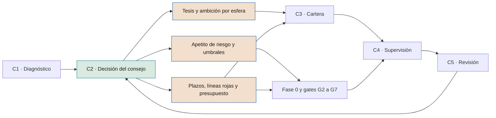

# Tesis de IA, ambición y apetito de riesgo

**Lo que el consejo decide en C2: dónde jugar, con qué ambición, con qué riesgo y dentro de qué límites**

| | |
|---|---|
| Documento | Documento 13 · Tesis de IA, ambición y apetito de riesgo |
| Versión | 0.1 (borrador de trabajo) |
| Fecha | 16-09-2026 |
| Autor | Fernando García · SEACHAD |
| Estado | Borrador para revisión. Los valores numéricos son ejemplos ilustrativos o puntos de partida que cada compañía debe fijar en C2. |

<!-- cifras: 12 | componentes de la decisión de C2 ; 10 | categorías de riesgo con apetito ; 4 | grados de apetito ; 1 | documento de decisión del consejo -->

---

> **Aviso legal y exención de responsabilidad.** SEVEN-G es un marco metodológico de referencia que se ofrece «tal cual» y con fines exclusivamente informativos. No constituye asesoramiento jurídico, regulatorio, financiero ni profesional, ni garantiza el cumplimiento de ninguna norma. Las referencias a regulación general (como el Reglamento Europeo de IA, el RGPD, DORA o NIS2), a normas técnicas y a regulación específica de cada sector o jurisdicción pueden ser incompletas, no aplicar a un caso concreto o quedar desactualizadas por cambios normativos, interpretaciones o criterios de las autoridades posteriores a su fecha de consulta. **Cada organización que use SEVEN-G es la única responsable de identificar la normativa que le aplica, verificar su vigencia y certificar su propio cumplimiento regulatorio**, con el asesoramiento cualificado que corresponda. El autor y SEACHAD no asumen responsabilidad alguna por el uso que se haga de este contenido ni por las decisiones que se adopten con él. Los datos, cifras, compañías y casos de los ejemplos son ficticios o ilustrativos.

## 1. Objeto y alcance

Este documento define el contenido de la etapa **C2 · Dirección** del ciclo corporativo (documento 01, sección 5.1): la decisión con la que el consejo fija la tesis de IA de la compañía, la ambición por esfera, el apetito de riesgo y los umbrales, plazos, límites y presupuesto que el resto del marco usa para decidir.

| Aspecto | Contenido |
|---|---|
| **Quién prepara** | Alta dirección, con el apoyo de la oficina de IA, riesgos, cumplimiento, control de gestión y personas. |
| **Con qué información** | Resultados de C1: inventario, madurez con evidencia, mapa de esferas actual, perfil del índice de transformación, valor validado y coste actuales. |
| **Quién aprueba** | Consejo de administración, que puede delegar la preparación en una comisión. |
| **Cuándo** | En la primera implantación, dentro de los noventa días iniciales (documento 90). Después, anualmente tras C5, y de forma extraordinaria cuando se produzca un desencadenante (sección 13). |
| **Resultado** | Un único **documento de decisión del consejo**, con la estructura del anexo (herramienta T19). |

El documento también contiene contenido regulatorio de referencia. **Este documento no constituye asesoramiento jurídico.** Las referencias normativas se han consultado en septiembre de 2026 y deben verificarse antes de su uso, porque existen propuestas de modificación en tramitación que pueden afectar a fechas de aplicación y obligaciones.

---

## 2. La decisión de C2 en conjunto

| # | Componente | Qué fija | Quién lo usa después | Sección |
|---|---|---|---|---|
| 1 | **Tesis de IA** | Por qué y para qué usa la compañía la IA, y qué no hará. | Todas las iniciativas (encaje en G0); C3; C5. | 3 |
| 2 | **Ambición por esfera** | Prioridad y ambición objetivo en las esferas 01–07; grado objetivo en 08 y 09. | C3; mapa de calor (T16); índice (condición IT-D1). | 4 |
| 3 | **Apetito de riesgo** | Apetito por categoría, métricas de tolerancia y escalado. | Fase 3; aceptación de riesgos; comité de IA; C4. | 5 |
| 4 | **Umbrales de impacto económico** | Escala económica de impacto 1–5 proporcionada al tamaño. | Matriz de riesgos (T06, documento 33). | 5.4 |
| 5 | **Umbral de inversión Enterprise** y de materialidad | Cuándo una iniciativa es Enterprise por inversión y cuándo se informa individualmente al consejo. | Fase 0 (T04); C4. | 6 |
| 6 | **Horizonte de retorno** | Plazo de retorno exigible por nivel de ambición. | G2, G3, G5, G7. | 7 |
| 7 | **Equilibrio objetivo de cartera** | Bandas de inversión por nivel de ambición. | C3; C4; documento 14. | 8 |
| 8 | **Plazos de referencia** | Plazo por fase y de decisión de *gate*; periodicidad de R6; regularización. | Registro de iniciativas (T01); alertas de estancamiento. | 9 |
| 9 | **Plazos de no conformidades e incidentes** | Contención, plan de acción y comunicación interna. | Documento 37; T08. | 10 |
| 10 | **Líneas rojas** | Prácticas prohibidas, decisiones que no se delegan nunca y líneas propias. | Fases 0, 3 y 4; T07; T10. | 11 |
| 11 | **Presupuesto marco** | Importe anual, sobres y reglas de reasignación. | C3; comité de IA. | 12 |
| 12 | **Revisión** | Fecha de revisión anual y desencadenantes de revisión extraordinaria. | C5. | 13 |

<!-- grafico: De la dirección a la decisión | Lo que el consejo aprueba en C2 se convierte en criterios que aplican la cartera y cada puerta de decisión -->

---

## 3. Tesis de IA

### 3.1 Qué es

La tesis de IA es una declaración breve (de dos a cuatro páginas) con la que el consejo explica **por qué la IA importa a la compañía, dónde quiere usarla, con qué ambición y qué no hará**. No es un plan de proyectos ni un catálogo de tecnologías. Debe poder leerse en diez minutos y usarse para decir que no a una iniciativa.

### 3.2 Estructura

| # | Apartado | Contenido | Pregunta que responde |
|---|---|---|---|
| 1 | **Contexto** | Cómo cambia la IA las reglas del sector y la posición competitiva de la compañía. | ¿Por qué ahora? |
| 2 | **Papel de la IA en la estrategia** | Relación con los objetivos del plan estratégico. La IA como palanca de eficiencia, de crecimiento, de cambio del modelo operativo o de varias, con peso relativo. | ¿Para qué? |
| 3 | **Dónde jugamos** | Esferas prioritarias y ambición objetivo (sección 4). | ¿Dónde? |
| 4 | **Qué no haremos** | Renuncias explícitas: esferas no prioritarias, tipos de uso descartados, líneas rojas propias. | ¿Qué descartamos? |
| 5 | **Posición sobre las personas** | Si la IA sustituye, aumenta o reorganiza el trabajo, en qué ámbitos, y con qué compromisos de formación, reasignación y diálogo. | ¿Qué pasa con las personas? |
| 6 | **Condiciones habilitantes** | Datos, conocimiento, capacidades, plataforma, gobierno y proveedores que la ambición exige. | ¿Qué necesitamos para lograrlo? |
| 7 | **Principios** | Principios de uso responsable, que la política corporativa (documento 31) convierte en normas. | ¿Cómo lo haremos? |
| 8 | **Cómo sabremos que funciona** | Perfil objetivo del índice de transformación, madurez objetivo por dimensión, proporción de valor validado y valor neto anual objetivo, con horizonte. | ¿Cómo lo mediremos? |

### 3.3 Criterios de calidad

Una tesis de IA es adecuada si:

- **Contiene renuncias.** Una tesis que declara prioritarias todas las esferas no orienta ninguna decisión.
- **Es coherente con el presupuesto.** Una ambición de Transformar sin sobre de inversión para apuestas por etapas es una declaración sin respaldo (y activa la condición IT-D1 del documento 12 sin evidencia que la sostenga).
- **Es verificable.** El apartado 8 usa indicadores del marco con valor actual, objetivo y horizonte.
- **Es coherente con la capacidad.** La ambición en las esferas de valor no supera lo que las esferas habilitadoras pueden soportar en el horizonte, o incluye las iniciativas que cierran esa brecha.
- **Toma posición sobre las personas.** Evitar la pregunta no la resuelve: la delega en cada proyecto.

### 3.4 Extracto ilustrativo

*Ejemplo ficticio, abreviado.*

> **Papel de la IA.** La compañía usará la IA prioritariamente para sostener su margen operativo (esfera 04, Optimizar) y para construir una línea de servicios digitales sobre sus productos (esfera 02, Transformar), que financiará con los ahorros validados de la primera. **Qué no haremos.** No usaremos sistemas de IA que tomen decisiones sobre el empleo sin revisión humana significativa, ni agentes que actúen directamente ante clientes con autonomía A3 en el horizonte de esta tesis. **Personas.** La capacidad liberada en Operaciones se reasignará prioritariamente a servicio técnico y a la nueva línea de servicios; las reducciones de plantilla, si se plantean, se decidirán de forma explícita por la dirección y no como consecuencia de un proyecto. **Cómo sabremos que funciona.** En 24 meses: perfil Eficiencia a escala sin declaración no evidenciada; ingresos habilitados por IA del 0,5 %; valor validado del 60 %.

---

## 4. Ambición por esfera

### 4.1 Contenido

Para cada esfera de valor y habilitadora (01 a 07):

| Campo | Valores | Guía |
|---|---|---|
| **Prioridad** | Alta · Media · Baja · No prioritaria | Debería haber como mucho tres esferas de prioridad alta. |
| **Ambición objetivo** | Optimizar · Aumentar · Transformar | Máximo nivel que la compañía quiere alcanzar en la esfera dentro del horizonte. |
| **Horizonte** | Meses | Plazo para tener al menos una iniciativa del nivel objetivo en producción. |
| **Indicador principal** | Un indicador del documento 10 | Con valor actual (o "sin dato") y valor objetivo. |
| **Responsable** | Miembro de la alta dirección | Responde ante el consejo de la ambición en la esfera. |

Para las esferas 08 y 09, en lugar de ambición se fija el **grado objetivo por dimensión** (Ausente, Básico, Sistemático o Avanzado), con horizonte, indicador y responsable. Nunca se fija Optimizar, Aumentar o Transformar para 08 o 09 (documento 10, sección 4.2).

### 4.2 Reglas

1. La ambición objetivo **debe** apoyarse en el mapa de esferas actual de C1: se indica el nivel alcanzado y el nivel en cartera de cada esfera.
2. Una esfera con ambición **Transformar** debe tener sobre en el presupuesto marco y, en el horizonte, al menos una iniciativa candidata.
3. Una ambición de Aumentar o Transformar en esferas de valor **debería** ir acompañada de un grado o una ambición suficientes en las esferas habilitadoras de las que depende.
4. Las esferas 08 y 09 **deben** tener como mínimo grado objetivo **Sistemático** en Cumplimiento y en Estructura cuando la compañía tenga sistemas de alto riesgo o iniciativas Enterprise.
5. Las esferas "No prioritarias" pueden tener iniciativas, pero su coste conjunto no debería superar el límite de inversión fuera de tesis fijado en el apetito estratégico (sección 5.3).

### 4.3 Ejemplo ilustrativo

*Compañía ficticia, coherente con los ejemplos de los documentos 10 y 12.*

| Esfera | Prioridad | Ambición objetivo | Horizonte | Indicador principal (actual → objetivo) |
|---|---|---|---|---|
| 01 · Cliente | Media | Aumentar | 18 meses | IE01.05 Conversión incremental: 0,12 M€ → 0,60 M€ |
| 02 · Producto y servicio | Alta | Transformar | 24 meses | IE02.01 Ingresos habilitados por IA: 0,01 % → 0,5 % |
| 03 · Personas | Alta | Aumentar | 18 meses | IE03.03 Capacidad reasignada: 20 % → 50 % |
| 04 · Operaciones | Alta | Optimizar | 12 meses | IE04.06 Ahorro materializado validado: 1,80 M€ → 2,50 M€ |
| 05 · Datos | Media | Aumentar | 18 meses | IE05.06 Iniciativas bloqueadas por datos: sin dato → < 20 % |
| 06 · Conocimiento | Media | Aumentar | 24 meses | IE06.02 Concentración del conocimiento: sin dato → < 30 % |
| 07 · Decisión | Baja | Optimizar | 24 meses | IE07.01 Decisiones con autonomía asignada: sin dato → 100 % |

| Esfera | Dimensión | Grado actual → objetivo | Horizonte |
|---|---|---|---|
| 08 | Cumplimiento · Anticipación · Liderazgo ético | Sistemático → Sistemático · Básico → Sistemático · Básico → Básico | 12 meses |
| 09 | Estructura · Velocidad y control · Ecosistema | Sistemático → Sistemático · Básico → Sistemático · Ausente → Básico | 12 meses |

---

## 5. Apetito de riesgo

### 5.1 Conceptos

| Concepto | Definición en SEVEN-G |
|---|---|
| **Apetito de riesgo** | Cantidad y tipo de riesgo que la compañía está dispuesta a asumir para lograr sus objetivos con IA. Se declara por categoría. |
| **Métrica de tolerancia** | Indicador con fórmula que permite comprobar si la compañía está dentro de su apetito. |
| **Tolerancia (ámbar)** | Valor a partir del cual se requiere análisis y plan por parte del comité de IA. |
| **Límite (rojo)** | Valor que no debe superarse. Superarlo exige escalado al consejo o a su comisión delegada y acción inmediata. |

La escala de probabilidad, impacto y nivel de riesgo (Bajo, Medio, Alto, Crítico) y las respuestas (Evitar, Mitigar, Transferir, Aceptar) son las del documento 33. Este documento no las modifica: fija dónde se sitúa la compañía dentro de ellas.

### 5.2 Grados de apetito y aceptación del riesgo residual

La regla general de aceptación del riesgo residual es: **Bajo** → responsable de producto, con registro · **Medio** → patrocinador con conformidad del responsable de riesgos · **Alto** → comité de IA · **Crítico** → no se acepta; excepcionalmente, solo el consejo o su comisión delegada, dentro del apetito aprobado en C2. El grado de apetito de cada categoría puede **endurecer** esa regla, nunca relajarla.

| Grado de apetito | Significado | Máximo riesgo residual dentro del apetito | Aceptación fuera de ese máximo |
|---|---|---|---|
| **Averso** | Se evita el riesgo aunque suponga renunciar a oportunidades. | Bajo | Medio o Alto: comité de IA, informando a la comisión delegada. Crítico: no se acepta. |
| **Cauteloso** | Se acepta un riesgo limitado con controles sólidos. | Medio | Alto: comité de IA, informando a la comisión delegada. Crítico: no se acepta. |
| **Moderado** | Se acepta riesgo a cambio de valor, con controles proporcionados. | Alto | Crítico: no se acepta. |
| **Abierto** | Se aceptan riesgos elevados en apuestas acotadas por etapas. | Alto | Crítico: solo excepcionalmente, por el consejo o su comisión delegada, para una etapa concreta, con límite de inversión y plan de salida. **No se admite en LEG ni en SEG.** |

Un riesgo residual Crítico sin la aprobación excepcional prevista **bloquea G3 y G5**.

### 5.3 Declaración por categoría

*Grados recomendados como punto de partida y métricas con valores iniciales ilustrativos. La compañía fija los suyos en C2.*

| Código | Categoría | Grado de partida | Declaración tipo |
|---|---|---|---|
| **EST** | Estratégico | Moderado (Abierto en apuestas de Transformar por etapas) | Asumimos riesgo para construir ventaja, siempre dentro de la tesis y con capacidad de parar. |
| **TEC** | Técnico | Moderado | Aceptamos imperfecciones en sistemas con supervisión humana; no en sistemas que actúan sin ella. |
| **DAT** | Datos | Cauteloso | No usamos datos sin base legal ni sin responsable de calidad. |
| **ECO** | Económico | Moderado | Aceptamos que algunas iniciativas no generen valor, pero no que continúen sin evidencia. |
| **LEG** | Legal y cumplimiento | Averso | Tolerancia cero con prácticas prohibidas y con obligaciones regulatorias incumplidas. |
| **ORG** | Organizativo | Moderado | Aceptamos el esfuerzo del cambio; no aceptamos cambios sin plan para las personas. |
| **REP** | Reputacional | Cauteloso | No exponemos a clientes a sistemas que no podamos explicar, supervisar y corregir. |
| **GEN** | IA generativa y agentes | Cauteloso | Usamos IA generativa y agentes con evaluación previa, límites de actuación y trazabilidad. |
| **SEG** | Seguridad e IA ofensiva | Averso | Ningún sistema con capacidad de actuar sin identidad, permisos mínimos e interruptor de parada. |
| **TER** | Terceros | Cauteloso | No dependemos de un proveedor crítico sin estrategia de salida. |

**Métricas de tolerancia**

| Categoría | Métrica | Fórmula | Tolerancia (ámbar) | Límite (rojo) |
|---|---|---|---|---|
| EST | Inversión fuera de tesis | Coste en esferas no prioritarias ÷ coste de la cartera × 100 | > 10 % | > 20 % |
| EST | Concentración en una iniciativa | Coste de la mayor iniciativa ÷ coste de la cartera × 100 | > 25 % | > 40 % |
| EST | Desviación del equilibrio de cartera | Trimestres consecutivos fuera de las bandas de la sección 8 | 1 | 2 |
| TEC | Degradación sin acción | Sistemas en producción por debajo de su umbral de rendimiento durante más de 30 días sin acción registrada | 1 | 2, o 1 Enterprise |
| TEC | Incidentes técnicos graves | Incidentes S1 o S2 de causa técnica en el trimestre | 1 S2 | 1 S1 o 3 S2 |
| TEC | Reversión probada | Sistemas Enterprise con plan de reversión probado ÷ sistemas Enterprise × 100 | < 100 % | < 90 % |
| DAT | Datos personales sin base legal | Conjuntos usados en IA sin base legal documentada (IE05.03) | — | ≥ 1 |
| DAT | Linaje en Enterprise | Sistemas Enterprise con linaje verificado ÷ sistemas Enterprise × 100 | < 100 % | < 90 % |
| DAT | Bloqueo por datos | IE05.06 | > 25 % | > 40 % |
| ECO | Desviación de coste recurrente | Iniciativas con coste recurrente real > 115 % del aprobado en G3 | 1 | 1 con desviación > 130 % |
| ECO | Valor validado | Condición B2 del documento 12 | < 50 % | < 30 % |
| ECO | Neto negativo sin decisión | Iniciativas con neto anual negativo más de 12 meses después de G5 sin decisión de G7 | 1 | 2 |
| LEG | Prácticas prohibidas | Sistemas o iniciativas que constituyan una práctica prohibida | — | ≥ 1 |
| LEG | Evaluaciones exigidas | Sistemas de alto riesgo en producción sin las evaluaciones exigidas | — | ≥ 1 |
| LEG | Clasificación pendiente | Sistemas "Pendiente de clasificar" más de 90 días | 1 | 3, o 1 en producción |
| LEG | No conformidades críticas | No conformidades críticas abiertas fuera de plazo | — | ≥ 1 |
| ORG | Adopción | Adopción efectiva seis meses después de G5 ÷ objetivo de la hipótesis × 100 | < 80 % | < 50 % |
| ORG | Plan de adopción | Iniciativas de Aumentar o Transformar en fase 4 o posterior sin plan de adopción | — | ≥ 1 |
| ORG | Capacidad no convertida | Capacidad liberada hace más de 12 meses sin materializar ni reasignar ÷ capacidad liberada × 100 | > 50 % | > 70 % |
| REP | Incidentes visibles | Incidentes S1 o S2 con exposición a clientes o pública en el trimestre | 1 S2 | 1 S1 o 2 S2 |
| REP | Reclamaciones por IA | Variación trimestral de IE01.06 | > +25 % | > +50 % |
| REP | Transparencia | Sistemas con exposición directa sin la información al usuario exigible | — | ≥ 1 |
| GEN | Evaluación previa | Sistemas generativos con exposición directa sin evaluaciones antes de G5 y periódicas | — | ≥ 1 |
| GEN | Inyección de instrucciones | Tasa de éxito en las pruebas de inyección del último ciclo | > 2 % | > 5 % |
| GEN | Trazabilidad de acciones | Acciones de agentes registradas con intención ÷ acciones de agentes × 100 | < 100 % | < 95 % |
| SEG | Interruptor de parada | Sistemas A2 o A3 sin interruptor de parada probado (IE07.04) | — | ≥ 1 |
| SEG | Permisos excesivos | Identidades de agentes con permisos excesivos detectadas | 1, corregida en < 30 días | 1 sin corregir en 30 días |
| SEG | Credenciales sin rotar | Credenciales de agentes fuera del periodo de rotación fijado | 1 en A0–A1 | 1 en A2–A3 |
| TER | Concentración de proveedor | IE09.07 | > 60 % | > 80 % |
| TER | Estrategia de salida | IE09.08 | < 100 % | < 80 % |
| TER | Cláusulas contractuales | Proveedores N2 o N3 sin cláusulas mínimas de uso de datos y propiedad intelectual | — | ≥ 1 |

"—" en la columna ámbar indica **tolerancia cero**: el primer caso ya supera el límite.

### 5.4 Umbrales de impacto económico

El impacto se valora en cinco ejes (económico, personas y derechos, regulatorio, operativo, reputacional) y se toma el mayor (documento 33). El eje económico se fija **en proporción al tamaño** de la compañía sobre una magnitud de referencia estable:

| Magnitud de referencia | Cuándo usarla |
|---|---|
| **Resultado bruto de explotación (EBITDA)** | Opción por defecto en compañías con resultado positivo y estable. |
| **Ingresos** | Si el resultado es negativo o muy volátil. |
| **Recursos propios** | Entidades financieras y aseguradoras, si lo prefieren por coherencia con su marco de riesgos. |
| **Presupuesto anual** | Sector público y entidades sin ánimo de lucro. |

*Ejemplo ilustrativo: compañía ficticia con 400 M€ de ingresos y 50 M€ de EBITDA.*

| Impacto | Nombre | Proporción sobre EBITDA | Importe equivalente |
|---|---|---|---|
| 1 | Insignificante | Menos del 0,1 % | Menos de 50 k€ |
| 2 | Menor | Del 0,1 % al 0,5 % | De 50 k€ a 250 k€ |
| 3 | Moderado | Del 0,5 % al 2 % | De 250 k€ a 1 M€ |
| 4 | Grave | Del 2 % al 5 % | De 1 M€ a 2,5 M€ |
| 5 | Crítico | Más del 5 % | Más de 2,5 M€ |

Los importes se redondean y se revisan anualmente en C5. Los anclajes de los otros cuatro ejes se definen en el documento 33 y no dependen del tamaño.

### 5.5 Escalado al superar una tolerancia

| Situación | Actuación | Plazo orientativo |
|---|---|---|
| Métrica en **ámbar** | La oficina de IA lo señala en el panel; el comité de IA analiza causa y aprueba plan con responsable. | Siguiente comité mensual. |
| Métrica en **ámbar** dos trimestres seguidos | Se informa al consejo o a su comisión delegada en C4. | Siguiente sesión trimestral. |
| Métrica en **rojo** | El comité de IA adopta medidas inmediatas (incluida la parada del sistema si procede) y se informa a la comisión delegada. | Comunicación en 5 días hábiles; en tolerancia cero, en 48 horas. |
| Métrica en **rojo** en LEG o SEG | Además, se abre no conformidad crítica si concurre alguno de sus supuestos (documento 01, sección 12). | Contención en 48 horas como máximo. |

---

## 6. Umbral de inversión Enterprise y umbrales de materialidad

| Umbral | Definición | Regla ilustrativa | Ejemplo (EBITDA 50 M€) |
|---|---|---|---|
| **Umbral de inversión Enterprise** | Coste total a tres años de la iniciativa: construcción + coste recurrente previsto de los tres primeros años. Si lo supera, la iniciativa es Enterprise (documento 01, sección 9.2). | 0,5 % del EBITDA | 250 k€ |
| **Materialidad para el consejo** | Iniciativas que se informan individualmente en el panel del consejo, además de todas las de Transformar y las que tengan riesgo residual Alto. | 2 % del EBITDA | 1 M€ |
| **Aprobación del consejo por importe** (opcional) | La compañía **puede** exigir aprobación del consejo por encima de un importe, de acuerdo con sus reglas internas de delegación. | Según reglas internas | — |
| **Escala mínima en producción (B3)** | Número de iniciativas en producción que el índice de transformación exige para Eficiencia a escala (documento 12). | 5 por defecto; ajustable al tamaño | 5 |

Reglas:

- **Agregación.** Las iniciativas que comparten objetivo, patrocinador y plataforma, o que son etapas de una misma apuesta, se suman para aplicar los umbrales. Fragmentar una iniciativa para quedar por debajo de un umbral es una **no conformidad mayor**.
- **Revisión.** Si durante la ejecución el coste total a tres años supera el umbral, la intensidad se revisa en el siguiente *gate* o en R6.
- **Intensidad mínima.** El umbral económico solo añade un criterio: una iniciativa por debajo del umbral puede ser Enterprise por cualquier otro criterio.

---

## 7. Horizonte de retorno por nivel de ambición

*Valores iniciales ilustrativos, a aprobar por el consejo en C2. "Neto anual", "VAN" y "plazo de recuperación" siguen las definiciones del documento 40 (F2, F7 y F9): neto anual = eficiencias materializadas + retorno − coste recurrente. El único criterio económico de viabilidad en G3 es VAN ≥ 0 con el horizonte y la tasa fijados en C2 (documento 40, sección 8.3; 01 §7.6); el plazo de recuperación de referencia es informativo y no es umbral de G3.*

| Nivel | Criterio en G2 | Criterio en G3 | Criterio en G5 | Criterio en G7 |
|---|---|---|---|---|
| **Optimizar** | Ahorro esperado con fórmula sobre línea base medida. | Neto anual esperado positivo en el primer año completo en producción; VAN ≥ 0 en el horizonte de evaluación del VAN y con la tasa fijados en C2; plazo de recuperación de referencia, informativo: 18 meses. | Eficiencia validada frente a la línea base y plan para materializar la capacidad liberada. | Ahorro materializado dentro de los 12 meses siguientes a G5. |
| **Aumentar** | Métricas de rendimiento y de coste; objetivo de adopción. | Neto anual esperado positivo en los 24 meses siguientes a G5; VAN ≥ 0 en el horizonte de evaluación del VAN y con la tasa fijados en C2; plazo de recuperación de referencia, informativo: 30 meses; viabilidad de la adopción. | Adopción real y mejora de rendimiento medidas; hito de adopción a seis meses definido. | Rendimiento sostenido y capacidad reasignada en los 24 meses siguientes a G5. |
| **Transformar** | Hipótesis de retorno con hitos de aprendizaje; límite de inversión por etapa; aprobación del consejo. | No se exige VAN ≥ 0 del conjunto (documento 40, sección 8.3). Viabilidad de la primera etapa, que no debería superar el 25 % de la inversión total estimada; hitos de aprendizaje como máximo cada seis meses; criterios de parada por etapa; valor de opción documentado. | Evidencia de mercado o de cliente: uso, conversión, ingresos iniciales o cambio operativo verificado. | Retorno medido en los 36 meses siguientes a G5, o decisión explícita del consejo de ampliar el plazo con nueva etapa y límite. |

Reglas:

- El horizonte se aplica al **nivel confirmado** en G2. Si la ambición real resulta inferior, en G7 se aplica el horizonte del nivel real (documento 12, sección 3.6).
- Un horizonte vencido sin cumplir el criterio **adelanta G7**.
- Las iniciativas de cumplimiento obligatorio o de reducción de un riesgo relevante pueden justificarse por **riesgo evitado** o **cumplimiento**, que no se suman al valor salvo que se traduzcan a dinero con fórmula.

---

## 8. Equilibrio objetivo de cartera por ambición

El equilibrio se expresa como **bandas** de proporción del coste de la cartera (inversión ejecutada más coste recurrente de los últimos 12 meses, sin las iniciativas de esfera principal 08 o 09), con la misma fórmula que la señal 1 del índice de transformación.

*Posturas de referencia ilustrativas. La compañía elige una o fija sus propias bandas.*

| Postura | Optimizar | Aumentar | Transformar | Lectura esperable de la señal 1 |
|---|---|---|---|---|
| **Prudente** | 70–85 % | 10–25 % | 0–10 % | 1 o 2 |
| **Equilibrada** | 55–70 % | 20–30 % | 10–20 % | 2 o 3 |
| **Ambiciosa** | 40–55 % | 25–35 % | 20–30 % | 3 |

Reglas:

1. Si la tesis fija **Transformar** como ambición objetivo en alguna esfera, la banda de Transformar **no puede empezar en 0 %** más allá del primer año, o la compañía estará declarando una transformación sin financiarla.
2. El equilibrio se mide trimestralmente en C4. Estar fuera de banda un trimestre es ámbar; dos trimestres, rojo (métrica EST de la sección 5.3).
3. La corrección se hace en C3 priorizando iniciativas, no reclasificando las existentes. Reclasificar para entrar en banda sin evidencia es una no conformidad mayor (documento 12, sección 3.6).
4. La inversión en habilitación de gobierno y cumplimiento (esferas 08 y 09) se presupuesta en un sobre propio (sección 12).

---

## 9. Plazos de referencia

El consejo aprueba los plazos de referencia del ciclo de vida, que el registro de iniciativas usa para señalar iniciativas estancadas. Los valores orientativos de partida están en el **documento 03, sección 3.6**, y se recalibran en C5 con datos propios. La decisión de C2 recoge:

| Plazo | Valor orientativo | Fuente |
|---|---|---|
| Plazo por fase (0, 1, 2, 3, 4, 5 y 7), Lite y Enterprise | Tabla del documento 03, sección 3.6 | 03 |
| Decisión de un *gate* desde la solicitud | 5 días hábiles (Lite) · 10 días hábiles (Enterprise) | 03 |
| Periodicidad de la revisión de continuidad (R6) | Al menos semestral (Lite) · al menos trimestral (Enterprise) | 01, sección 6.8 |
| Regularización de iniciativas en producción anteriores a la adopción del marco | 12 meses (valor ilustrativo) | 01, sección 14 |
| Clasificación regulatoria de un sistema inventariado | 90 días (valor ilustrativo) | Sección 5.3 |
| Plazo máximo de una condición de *gate* | Hasta el siguiente *gate*; 90 días en R6 (valor ilustrativo) | 01, sección 7.4 |

La compañía puede **acortar** las periodicidades mínimas de R6, pero no alargarlas.

---

## 10. Plazos de no conformidades e incidentes

### 10.1 No conformidades

Los plazos de referencia son los del documento 01, sección 12. La compañía puede ajustarlos en C2, sin superar los que establezca la regulación aplicable, y **no debería** alargar los de las no conformidades críticas.

| Tipo | Contención (referencia) | Plan de acción (referencia) | Informa a | Valor aprobado |
|---|---|---|---|---|
| **Crítica** | Inmediata, máximo 48 horas | Máximo 10 días | Comité de IA y comisión delegada | A completar |
| **Mayor** | Máximo 10 días | Máximo 30 días | Comité de IA | A completar |
| **Menor** | No requerida | Antes del siguiente *gate* o revisión | Oficina de IA | A completar |

### 10.2 Incidentes

La severidad (S1 a S4) se define en el documento 37. La decisión de C2 fija los **plazos de comunicación interna**; los plazos de notificación a autoridades los establece la regulación y prevalecen siempre.

| Severidad | Comunicación interna (valor ilustrativo) |
|---|---|
| **S1 · Crítica** | Comité de IA en 24 horas; comisión delegada en 72 horas. |
| **S2 · Alta** | Comité de IA en 72 horas. |
| **S3 · Media** | Oficina de IA en 5 días hábiles. |
| **S4 · Baja** | Registro en T08. |

Referencias regulatorias que condicionan estos plazos, cuando apliquen (consultadas en septiembre de 2026; verificar vigencia):

| Norma | Obligación de referencia |
|---|---|
| RGPD, artículo 33 | Notificación de violaciones de seguridad de datos personales a la autoridad de control sin dilación indebida y, cuando sea posible, en 72 horas. |
| Reglamento Europeo de IA, artículo 73 | Notificación de incidentes graves de sistemas de alto riesgo, con un plazo máximo general de 15 días y plazos más cortos en supuestos específicos. |
| Directiva NIS2, artículo 23 | Alerta temprana en 24 horas, notificación en 72 horas e informe final en un mes para incidentes significativos. |
| DORA, artículo 19 | Notificación de incidentes graves relacionados con las TIC en los plazos fijados por sus normas técnicas de desarrollo. |

---

## 11. Líneas rojas

### 11.1 Prácticas prohibidas

El artículo 5 del Reglamento Europeo de IA prohíbe determinadas prácticas, aplicables desde el 2 de febrero de 2025. En términos generales, incluyen:

- Técnicas subliminales, manipuladoras o engañosas que alteren de forma sustancial el comportamiento y causen o puedan causar perjuicios significativos.
- Explotación de vulnerabilidades por edad, discapacidad o situación social o económica.
- Puntuación social que provoque tratos perjudiciales o desproporcionados.
- Evaluación del riesgo de que una persona cometa un delito basada únicamente en la elaboración de perfiles o en rasgos de personalidad.
- Creación o ampliación de bases de datos de reconocimiento facial mediante extracción no selectiva de imágenes de internet o de cámaras de vigilancia.
- Inferencia de emociones en el lugar de trabajo o en centros educativos, salvo por motivos médicos o de seguridad.
- Categorización biométrica para inferir raza, opiniones políticas, afiliación sindical, convicciones religiosas o filosóficas, vida sexual u orientación sexual, con las excepciones previstas.
- Identificación biométrica remota en tiempo real en espacios de acceso público con fines de garantía del cumplimiento del Derecho, salvo las excepciones previstas.

Tratamiento en SEVEN-G: **tolerancia cero**. Ninguna iniciativa que pueda constituir una práctica prohibida supera la fase 3 (documento 01, sección 6.5); si se detecta en producción, es una no conformidad crítica con parada del sistema. La interpretación de cada supuesto requiere criterio jurídico cualificado.

### 11.2 Lo que no se delega nunca en IA

Mínimo común de SEVEN-G. La compañía puede ampliarlo, no reducirlo. Los niveles de autonomía son los del documento 35 (A0 asistencia · A1 recomendación · A2 actuación supervisada · A3 actuación autónoma).

| Decisión o acción | Autonomía máxima de un sistema de IA | Motivo |
|---|---|---|
| Aprobación de la tesis, el apetito de riesgo, el presupuesto marco y las líneas rojas | A0 | Responsabilidad indelegable del consejo. |
| Decisiones de *gate*, aceptación de riesgos residuales, firma de puesta en producción y cierre de no conformidades | A0 | Separación de funciones y rendición de cuentas. |
| Decisiones con efectos jurídicos o significativos sobre personas (empleo, crédito, seguros, acceso a servicios esenciales, entre otras) | A1, con revisión humana significativa por una persona con autoridad y competencia para cambiar la decisión | Protección de derechos; RGPD, artículo 22, y regulación aplicable. |
| Despidos y medidas disciplinarias | A0 | Impacto sobre las personas y responsabilidad de la dirección. |
| Notificaciones a autoridades y comunicaciones institucionales en nombre del consejo o de la dirección | A1 (redacción asistida; validación y envío por personas) | Responsabilidad legal y reputacional. |
| Pagos o compromisos económicos por encima del límite aprobado para el sistema | A1 | Límite de actuación de los agentes. |
| Modificación de sus propios permisos, límites, credenciales u objetivos | Prohibido | Pérdida de control. |
| Desactivación de registros, controles de seguridad o del interruptor de parada | Prohibido | Pérdida de trazabilidad y de capacidad de parar. |
| Tratamiento de categorías especiales de datos fuera de la finalidad y la base legal documentadas | Prohibido | Protección de datos. |

### 11.3 Líneas rojas propias

Además del mínimo, el consejo **puede** aprobar líneas rojas voluntarias, que forman parte de la dimensión Liderazgo ético de la esfera 08. *Ejemplos ilustrativos:*

- No usar sistemas que simulen ser una persona sin informar de forma clara al interlocutor, aunque la regulación no lo exija en ese caso.
- No usar datos de clientes para entrenar modelos de terceros.
- No desplegar agentes con autonomía A3 en interacción directa con clientes.
- No usar reconocimiento de emociones en la relación con clientes.

Las líneas rojas se incorporan a los cuestionarios de intensidad (T04), clasificación regulatoria (T07) y seguridad de agentes (T10). Solo el consejo puede modificarlas, en C2 o en una revisión extraordinaria.

---

## 12. Presupuesto marco

El presupuesto marco es el importe anual que el consejo autoriza para la IA y las reglas con las que se asigna. No sustituye al presupuesto de cada iniciativa, que se aprueba en su *gate*.

| Sobre | Contenido | Regla |
|---|---|---|
| **Optimizar** | Construcción de iniciativas de optimización. | Dentro de la banda de la sección 8. |
| **Aumentar** | Construcción y adopción de iniciativas de aumento. | Dentro de la banda de la sección 8. |
| **Transformar por etapas** | Etapas aprobadas de las apuestas de transformación. | Se libera etapa a etapa tras la decisión del órgano competente sobre los hitos. |
| **Habilitación** | Datos, plataforma común, gobierno y cumplimiento (incluidas las iniciativas de esferas 08 y 09). | Se justifica por las esferas que habilita. |
| **Coste recurrente comprometido** | Operación de los sistemas en producción. | Se presupuesta completo; no compite con la construcción. |
| **Adopción y formación** | Alfabetización en IA, formación por rol y gestión del cambio no imputada a iniciativas. | Debería ser explícito, no residual. |
| **Contingencia** | Imprevistos y oportunidades no previstas. | Asignación por el comité de IA con registro. |

El gasto se informa además por las **categorías de coste** del documento 42: licencias · consumo de modelos · cómputo e infraestructura · datos · personas de construcción · personas de operación · proveedores y servicios · control y cumplimiento · adopción y formación.

Reglas de reasignación (valores ilustrativos):

| Movimiento | Quién decide |
|---|---|
| Dentro de un sobre | Comité de IA. |
| Entre sobres, hasta el 10 % del presupuesto marco en el año | Comité de IA, informando al consejo en C4. |
| Entre sobres por encima del 10 %, o cualquier reducción del sobre de Transformar | Consejo. |
| Remanente al cierre del ejercicio | No se traslada automáticamente; se decide en C2 del ciclo siguiente. |

*Ejemplo ilustrativo (presupuesto marco de 5,0 M€):* Optimizar 1,6 · Aumentar 0,7 · Transformar por etapas 0,6 · Habilitación 0,6 · Coste recurrente comprometido 1,1 · Adopción y formación 0,2 · Contingencia 0,2.

---

## 13. Revisión anual y revisión extraordinaria

| Tipo | Cuándo | Qué se revisa | Quién |
|---|---|---|---|
| **Anual** | Tras C5 | Cumplimiento de la tesis y de la ambición por esfera; evolución del índice y de la madurez; métricas de tolerancia; calibración de umbrales, horizontes, bandas y plazos; líneas rojas; presupuesto del ciclo siguiente. | Preparan alta dirección y oficina de IA; aprueba el consejo. |
| **Extraordinaria** | Cuando se produce un desencadenante | Los componentes afectados. | Igual que la anual. |

Desencadenantes de revisión extraordinaria:

- Cambio regulatorio con efecto relevante sobre sistemas de la compañía.
- Incidente S1 o no conformidad crítica con causa en un límite mal fijado.
- Métrica de tolerancia en rojo durante dos trimestres consecutivos.
- Operación corporativa, reorganización relevante o cambio del plan estratégico.
- Cambio sustancial de la tecnología o del mercado que invalide un supuesto de la tesis.
- Perfil "Transformación declarada, no evidenciada" en dos cálculos formales consecutivos.

Cada versión del documento de decisión se identifica con número de versión y fecha, se conserva la anterior y se registra en el registro de recomendaciones y decisiones (T18). Tras su aprobación se comunica a los órganos y responsables afectados y se actualizan los parámetros en las herramientas (T01, T04, T06, T14, T16, T17).

---

## 14. Criterios de calidad de la decisión de C2

El auditor de IA o la auditoría interna comprueban, antes de la aprobación:

| # | Criterio | Cumple si |
|---|---|---|
| 1 | Base diagnóstica | Cada componente cita los resultados de C1 en los que se apoya, con "sin dato" explícito. |
| 2 | Completitud | Están los doce componentes de la sección 2, o se justifica la ausencia. |
| 3 | Renuncias | La tesis incluye qué no se hará y hay esferas no prioritarias o de prioridad baja. |
| 4 | Coherencia ambición–presupuesto | Toda esfera con Transformar tiene sobre y candidata; las bandas son compatibles con la tesis. |
| 5 | No mezcla de niveles | Las esferas 08 y 09 tienen grados, no niveles de ambición. |
| 6 | Apetito medible | Cada categoría tiene grado, declaración y al menos una métrica con fórmula, tolerancia y límite. |
| 7 | Proporcionalidad | Los umbrales económicos están expresados sobre una magnitud de referencia y en euros. |
| 8 | Límites regulatorios | Los plazos aprobados no superan los regulatorios; las líneas rojas incluyen el mínimo de la sección 11. |
| 9 | Responsables | Cada esfera y cada categoría tiene responsable de la alta dirección. |
| 10 | Revisión | Hay fecha de revisión anual y desencadenantes de revisión extraordinaria. |

---

## 15. Anexo · Plantilla de documento de decisión del consejo (T19)

**Instrucciones de uso.** La plantilla se rellena en C2, la prepara la alta dirección con la oficina de IA, la verifica el auditor de IA o la auditoría interna con los criterios de la sección 14 y la aprueba el consejo. Los campos marcados **(Enterprise)** pueden omitirse en organizaciones que solo aplican la intensidad Lite, justificándolo. Donde se indica "valor orientativo", se parte del valor de este documento y se sustituye por el aprobado.

### A. Identificación

| Campo | Contenido | Guía |
|---|---|---|
| Compañía o grupo | | Perímetro societario al que aplica la decisión. |
| Órgano que aprueba | | Consejo de administración o comisión con facultades delegadas. |
| Fecha de la sesión | | DD-MM-AAAA. |
| Versión del documento | | 1.0 en la primera aprobación; se incrementa en cada revisión. |
| Identificador en el registro de decisiones (T18) | | Identificador persistente del registro. |
| Preparado por | | Nombre y cargo. |
| Verificado por | | Auditor de IA o auditoría interna; distinto de quien prepara. |
| Informe de C1 de referencia | | Fecha y versión del diagnóstico. |

### B. Acuerdos propuestos

| Nº | Acuerdo | Guía |
|---|---|---|
| 1 | Se aprueba la tesis de IA del apartado C. | Un acuerdo por componente, en forma "Se aprueba…". |
| 2 | Se aprueba la ambición por esfera del apartado D. | |
| … | | |

### C. Tesis de IA

| Campo | Contenido | Guía |
|---|---|---|
| Contexto | | Sección 3.2, apartado 1. |
| Papel de la IA en la estrategia | | Peso relativo de eficiencia, crecimiento y modelo operativo. |
| Dónde jugamos | | Remite al apartado D. |
| Qué no haremos | | Al menos tres renuncias concretas. |
| Posición sobre las personas | | Sustituir, aumentar o reorganizar, por ámbito, con compromisos. |
| Condiciones habilitantes | | Datos, conocimiento, capacidades, plataforma, proveedores. |
| Principios | | Remite a la política corporativa (documento 31). |
| Cómo sabremos que funciona | | Perfil objetivo, madurez objetivo, valor validado y valor neto con horizonte. |

### D. Ambición por esfera

| Esfera | Prioridad | Nivel alcanzado (C1) | Ambición objetivo | Horizonte | Indicador principal (actual → objetivo) | Responsable |
|---|---|---|---|---|---|---|
| 01 · Cliente | | | | | | |
| 02 · Producto y servicio | | | | | | |
| 03 · Personas | | | | | | |
| 04 · Operaciones | | | | | | |
| 05 · Datos | | | | | | |
| 06 · Conocimiento | | | | | | |
| 07 · Decisión | | | | | | |

| Esfera | Dimensión | Grado actual | Grado objetivo | Horizonte | Indicador | Responsable |
|---|---|---|---|---|---|---|
| 08 | Cumplimiento | | | | | |
| 08 | Anticipación | | | | | |
| 08 | Liderazgo ético | | | | | |
| 09 | Estructura | | | | | |
| 09 | Velocidad y control | | | | | |
| 09 | Ecosistema de proveedores | | | | | |

### E. Apetito de riesgo por categoría

| Código | Categoría | Grado (Averso · Cauteloso · Moderado · Abierto) | Declaración | Responsable |
|---|---|---|---|---|
| EST | Estratégico | | | |
| TEC | Técnico | | | |
| DAT | Datos | | | |
| ECO | Económico | | | |
| LEG | Legal y cumplimiento | | | |
| ORG | Organizativo | | | |
| REP | Reputacional | | | |
| GEN | IA generativa y agentes | | | |
| SEG | Seguridad e IA ofensiva | | | |
| TER | Terceros | | | |

### F. Métricas de tolerancia

| Categoría | Métrica | Fórmula | Tolerancia (ámbar) | Límite (rojo) | Fuente | Frecuencia |
|---|---|---|---|---|---|---|
| | | | | | | |
| *Ejemplo ilustrativo:* TER | Concentración de proveedor | Gasto en proveedor principal de modelos ÷ gasto total en modelos × 100 | > 60 % | > 80 % | T09, T13 | Trimestral |

### G. Umbrales de impacto económico

| Campo | Contenido | Guía |
|---|---|---|
| Magnitud de referencia y valor | | EBITDA, ingresos, recursos propios o presupuesto; ejercicio de referencia. |
| Impacto 1 · Insignificante | | Proporción y euros. |
| Impacto 2 · Menor | | |
| Impacto 3 · Moderado | | |
| Impacto 4 · Grave | | |
| Impacto 5 · Crítico | | |

### H. Umbrales de inversión y materialidad

| Campo | Contenido | Guía |
|---|---|---|
| Umbral de inversión Enterprise | | Coste total a tres años; valor orientativo 0,5 % del EBITDA. |
| Materialidad para información individual al consejo | | Valor orientativo 2 % del EBITDA. |
| Umbral de aprobación del consejo por importe (Enterprise) | | Opcional, según reglas de delegación. |
| Escala mínima en producción (B3) | | Valor orientativo 5. |

### I. Horizonte de retorno

| Nivel | Criterio en G3 | Plazo en G7 | Guía |
|---|---|---|---|
| Optimizar | | | Valores orientativos de la sección 7. |
| Aumentar | | | |
| Transformar | | | Límite de la primera etapa y frecuencia de hitos. |

### J. Equilibrio objetivo de cartera

| Campo | Contenido | Guía |
|---|---|---|
| Postura | | Prudente, Equilibrada, Ambiciosa o propia. |
| Banda de Optimizar | | Porcentaje mínimo y máximo. |
| Banda de Aumentar | | |
| Banda de Transformar | | No puede empezar en 0 % si hay Transformar en la tesis (salvo el primer año). |

### K. Plazos de referencia

| Plazo | Lite | Enterprise | Guía |
|---|---|---|---|
| Fase 0 | | | Valores orientativos del documento 03, sección 3.6. |
| Fase 1 | | | |
| Fase 2 | | | |
| Fase 3 | | | |
| Fase 4 | | | |
| Fase 5 | | | |
| Fase 7 | | | |
| Decisión de *gate* | | | Días hábiles. |
| Periodicidad de R6 | | | No más larga que semestral (Lite) o trimestral (Enterprise). |
| Regularización de iniciativas anteriores | | | Meses. |
| Clasificación regulatoria pendiente | | | Días. |

### L. Plazos de no conformidades e incidentes

| Campo | Contención | Plan de acción o comunicación | Informa a | Guía |
|---|---|---|---|---|
| No conformidad crítica | | | | Referencia: 48 horas y 10 días. |
| No conformidad mayor | | | | Referencia: 10 y 30 días. |
| No conformidad menor | | | | Antes del siguiente *gate*. |
| Incidente S1 | — | | | Sin perjuicio de los plazos regulatorios. |
| Incidente S2 | — | | | |
| Incidente S3 (Enterprise) | — | | | |

### M. Líneas rojas

| Campo | Contenido | Guía |
|---|---|---|
| Confirmación del mínimo SEVEN-G | Sí / No | Prácticas prohibidas y tabla de la sección 11.2. |
| Ampliaciones de la tabla de decisiones no delegables | | Decisión, autonomía máxima y motivo. |
| Líneas rojas propias | | Ejemplos en la sección 11.3. |

### N. Presupuesto marco

| Sobre | Importe | % del total | Guía |
|---|---|---|---|
| Optimizar | | | |
| Aumentar | | | |
| Transformar por etapas | | | Etapas aprobadas y pendientes de liberar. |
| Habilitación | | | Incluye esferas 08 y 09. |
| Coste recurrente comprometido | | | |
| Adopción y formación | | | |
| Contingencia | | | |
| **Total** | | 100 % | |
| Reglas de reasignación | | | Límites del comité y del consejo. |

### O. Objetivos de seguimiento

| Indicador | Valor actual | Objetivo | Horizonte | Guía |
|---|---|---|---|---|
| Perfil del índice de transformación | | | | Documento 12. |
| Nivel global de madurez y dimensiones prioritarias | | | | Documento 11. |
| Proporción de valor validado | | | | Condición B2. |
| Valor neto anual de la cartera | | | | Documento 40. |

### P. Revisión y vigencia

| Campo | Contenido | Guía |
|---|---|---|
| Vigencia | | Hasta la aprobación de la siguiente versión. |
| Fecha prevista de revisión anual | | Tras C5. |
| Desencadenantes adicionales de revisión extraordinaria | | Además de los de la sección 13. |

### Q. Aprobación y verificación

| Función | Nombre y cargo | Fecha | Observaciones |
|---|---|---|---|
| Prepara | | | Alta dirección. |
| Verifica | | | Auditor de IA o auditoría interna. Resultado: Conforme · Conforme con observaciones · No conforme. |
| Aprueba | | | Consejo; referencia del acta. |

---

## 16. Herramientas y plantillas asociadas

| Código | Nombre | Uso en este documento |
|---|---|---|
| **T19** | Plantilla de tesis de IA y apetito de riesgo | Documento de decisión del consejo (anexo). |
| **T01** | Registro de iniciativas | Recibe plazos de referencia, bandas de cartera y horizontes. |
| **T04** | Determinación de intensidad | Recibe el umbral de inversión Enterprise y las líneas rojas. |
| **T06** | Matriz y registro de riesgos | Recibe los umbrales de impacto económico y los grados de apetito. |
| **T08** | Registro de no conformidades e incidentes | Recibe los plazos aprobados. |
| **T14** | Calculadora del índice de transformación | Recibe la condición IT-D1 y el umbral B3. |
| **T16** | Mapa de esferas de la cartera | Recibe la ambición por esfera y los grados objetivo. |
| **T17** | Panel de IA para el consejo | Muestra métricas de tolerancia, equilibrio de cartera y presupuesto. |
| **T18** | Registro de recomendaciones del consejo | Registra la decisión de C2 y sus revisiones. |
| **P04** | Determinación de intensidad | Aplica el umbral de inversión Enterprise. |
| **P07** | Clasificación de esfera y ambición | Comprueba el encaje con la ambición por esfera. |
| **P12** | Matriz y registro de riesgos | Aplica umbrales de impacto y aceptación. |

---

## 17. Documentos relacionados

| Documento | Relación |
|---|---|
| **01 · Metodología fundacional** | Etapa C2, criterios Enterprise, criterios de *gate* por ambición, plazos de no conformidades. |
| **03 · Herramientas y registro de iniciativas** | Plazos de referencia orientativos (sección 3.6) y herramienta T19. |
| **10 · Mapa de esferas y niveles de ambición** | Esferas, niveles, grados de 08 y 09 e indicadores principales. |
| **11 · Modelo de madurez** | Madurez objetivo en la tesis. |
| **12 · Índice de transformación** | Perfil objetivo, condición IT-D1, umbral B3 y señal 1. |
| **14 · Gestión de cartera** | Aplicación del equilibrio y del presupuesto marco en C3. |
| **31 · Política corporativa y uso aceptable** | Desarrollo de los principios y de las líneas rojas. |
| **33 · Metodología de riesgos de IA** | Escalas de probabilidad e impacto y riesgos tipo por categoría. |
| **34 · Mapeo regulatorio** | Detalle de prácticas prohibidas y obligaciones. |
| **35 · Seguridad de IA y agentes** | Niveles de autonomía A0–A3 y controles de agentes. |
| **37 · No conformidades e incidentes** | Severidades y procesos. |
| **40 · Reglas de medición del valor** y **42 · Costes de IA** | Neto anual, VAN, plazo de recuperación (informativo) y categorías de coste. |
| **60 · Paquete para el consejo** | Presentación de la decisión y de su seguimiento. |
| **90 · Guía de implantación** | C2 dentro de los primeros noventa días. |

---

## 18. Control de versiones

| Versión | Fecha | Cambios |
|---|---|---|
| 0.1 | 16-09-2026 | Primera versión. Define los doce componentes de la decisión de C2: estructura de la tesis de IA, ambición por esfera, grados de apetito y métricas de tolerancia para las diez categorías de riesgo, umbrales de impacto económico proporcionados, umbral de inversión Enterprise y de materialidad, horizonte de retorno por nivel, bandas de equilibrio de cartera, plazos, líneas rojas, presupuesto marco y revisión. Incluye como anexo la plantilla de documento de decisión del consejo (T19). |
