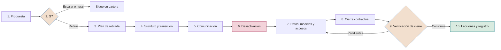

# Gestión de cartera

**Cómo se seleccionan, priorizan, equilibran, revisan y retiran las iniciativas de IA de la compañía**

| | |
|---|---|
| Documento | Documento 14 · Gestión de cartera |
| Versión | 0.1 (borrador de trabajo) |
| Fecha | 16-09-2026 |
| Autor | Fernando García · SEACHAD |
| Estado | Borrador para revisión. Los pesos, las escalas y los umbrales del semáforo son iniciales y se calibrarán con la aplicación práctica. |

<!-- cifras: 3 | carriles de ambición con presupuesto propio ; 6 | criterios de priorización ; 10 | pasos del procedimiento de retirada ; 6 | ejes del semáforo de programas -->

---

> **Aviso legal y exención de responsabilidad.** SEVEN-G es un marco metodológico de referencia que se ofrece «tal cual» y con fines exclusivamente informativos. No constituye asesoramiento jurídico, regulatorio, financiero ni profesional, ni garantiza el cumplimiento de ninguna norma. Las referencias a regulación general (como el Reglamento Europeo de IA, el RGPD, DORA o NIS2), a normas técnicas y a regulación específica de cada sector o jurisdicción pueden ser incompletas, no aplicar a un caso concreto o quedar desactualizadas por cambios normativos, interpretaciones o criterios de las autoridades posteriores a su fecha de consulta. **Cada organización que use SEVEN-G es la única responsable de identificar la normativa que le aplica, verificar su vigencia y certificar su propio cumplimiento regulatorio**, con el asesoramiento cualificado que corresponda. El autor y SEACHAD no asumen responsabilidad alguna por el uso que se haga de este contenido ni por las decisiones que se adopten con él. Los datos, cifras, compañías y casos de los ejemplos son ficticios o ilustrativos.

## 1. Objeto y alcance

Este documento desarrolla la etapa **C3 · Cartera** del ciclo corporativo (01 §5.1) y la gestión continua de la cartera en **C4 · Supervisión**. Define cómo entran las iniciativas, cómo se priorizan y financian, cómo se mantiene el equilibrio de ambición y de riesgo, cómo se revisa la cartera, cómo se tratan las iniciativas estancadas, cómo se retira una iniciativa y cómo se regularizan las iniciativas anteriores a la adopción del marco.

Aplica a todas las iniciativas del registro (T01): iniciativas propias, IA de terceros integrada en procesos y uso corporativo de IA de propósito general que cumpla algún criterio Enterprise (01 §1.2). Las herramientas principales son **T01 · Registro de iniciativas**, **T16 · Mapa de esferas de la cartera** y **T22 · Gestor de retiradas**.

Este documento no constituye asesoramiento jurídico.

### 1.1 Principios de la gestión de cartera

1. **La cartera ejecuta la tesis.** Se financia lo que encaja con la tesis de IA, la ambición por esfera y el apetito de riesgo aprobados en C2.
2. **Cada ambición compite con su igual.** Una apuesta de transformación no compite por el mismo presupuesto ni con los mismos criterios que una optimización.
3. **Se financia por etapas.** El dinero se libera *gate* a *gate*; nadie recibe el presupuesto completo al entrar.
4. **Terminar antes que empezar.** La capacidad se asigna primero a las iniciativas avanzadas que cumplen sus criterios.
5. **El riesgo se suma.** La cartera tiene límites de concentración, además de los límites de cada iniciativa (principio 5 de 01 §3).
6. **Retirar es gestionar.** Una retirada planificada libera recursos y reduce riesgo; no es un fracaso del equipo.

---

## 2. La etapa C3 · Cartera

### 2.1 Entradas, resultados y responsables

| Elemento | Contenido |
|---|---|
| **Entradas de C1** | Inventario, madurez (documento 11), índice de transformación (12), valor validado y coste actuales. |
| **Entradas de C2** | Tesis de IA, ambición por esfera, apetito de riesgo, presupuesto marco, horizonte de retorno, umbral de inversión Enterprise, plazos de referencia por fase y límites de concentración (documento 13). |
| **Resultados obligatorios** (01 §5.1) | Cartera priorizada con nivel de ambición, esfera, intensidad, presupuesto y responsables; criterios de retirada; capacidad disponible. |
| **Resultados de este documento** | Sobres presupuestarios por carril; tabla de priorización; plan de capacidad; límites de concentración aplicados; plan de regularización; calendario de revisiones. Se documentan con el plan de cartera C3 (P36). |
| **Responsable** | Comité de IA, con la preparación de la oficina de IA. |
| **Aprueba** | Comité de IA. El consejo aprueba las iniciativas de Transformar y cualquier trasvase de su sobre. |

### 2.2 Calendario

| Momento | Qué se hace | Quién |
|---|---|---|
| **Anual (C3)** | Construcción o renovación de la cartera tras C2 o C5: sobres, priorización completa, capacidad, límites. | Comité de IA; consejo para Transformar |
| **Trimestral** | Revisión de equilibrio, concentración, programas y retiradas; informe al consejo en C4. | Comité de IA |
| **Mensual** | Seguimiento del embudo, estancadas, condiciones vencidas, esperas y nuevas entradas. | Comité de IA |
| **Continuo** | Alta de iniciativas, alertas de T01, preparación de información. | Oficina de IA |

### 2.3 Responsabilidades

**A** responde · **R** realiza · **C** consultado · **I** informado.

| Actividad | Consejo | Comité de IA | Oficina de IA | Patrocinador | Responsable de riesgos | Control de gestión |
|---|---|---|---|---|---|---|
| Sobres por carril | A | R | C | I | C | C |
| Priorización y asignación | I | A | R | C | C | C |
| Aprobación de Transformar | A | R | C | R | C | I |
| Revisión mensual y trimestral | I | A | R | C | C | C |
| Límites de concentración | I | A | R | I | R | I |
| Retiradas | I | A (Enterprise) | R | A (Lite) | C | C |
| Regularización | I | A | R | R | C | I |

---

## 3. Entrada de iniciativas en la cartera

### 3.1 Canales

Las iniciativas pueden proceder de las áreas de negocio, de retos planteados por el consejo o la dirección, de la oficina de IA o de propuestas de proveedores. **Toda iniciativa necesita un patrocinador de negocio**: una propuesta de un proveedor sin patrocinador interno no entra.

### 3.2 Ficha mínima de entrada

Para pasar de *Registrada* a fase 0 (03 §3.2), la iniciativa aporta:

| Campo | Requisito |
|---|---|
| Descripción comprensible | Qué es y para qué se usa, sin jerga (regla 10; P31). |
| Patrocinador y responsable de producto | Nombrados y sin incompatibilidades (01 §8.2). |
| Esfera y ambición propuestas | Con las cinco preguntas de 00 §5.2 (T05). |
| Orden de magnitud del valor | Con fórmula, marcado como *estimado* (regla 4). |
| Inversión hasta G3 | Importe del tramo de descubrimiento y viabilidad. |
| Encaje con la tesis | Objetivo de la tesis al que contribuye. |
| Criterios Enterprise previsibles | Cuestionario de intensidad (T04). |

### 3.3 Filtros previos

No entran en la cartera, y se registran con motivo: las **prácticas prohibidas** por la regulación; las iniciativas **duplicadas** de otra existente (se fusionan); las que **no requieren IA** (se derivan a la alternativa); las que quedan **fuera del apetito de riesgo** aprobado; y las de **Transformar sin patrocinio de la alta dirección**.

### 3.4 Ventanas de entrada

- **Optimizar y Aumentar con intensidad Lite:** entrada continua; el comité de IA las conoce en su reunión mensual.
- **Enterprise y Transformar:** entrada en la revisión mensual del comité, con priorización completa (sección 4). Las de Transformar se elevan al consejo en su siguiente sesión trimestral.

---

## 4. Criterios de priorización

### 4.1 Método en cuatro pasos

1. **Filtros eliminatorios** (sección 3.3 y riesgo residual Crítico sin aprobación del consejo).
2. **Asignación al carril de ambición** confirmado: Optimizar, Aumentar o Transformar.
3. **Puntuación** con seis criterios y pesos propios de cada carril (secciones 4.2 y 4.3).
4. **Asignación de presupuesto y capacidad** por orden de puntuación dentro de cada carril, con comprobación de equilibrio y concentración (secciones 5 y 6).

El comité puede alterar el orden resultante con justificación escrita registrada en T01. Las alteraciones que afecten al carril de Transformar se informan al consejo.

### 4.2 Criterios y pesos

El **neto adicional por euro** (neto anual adicional esperado ÷ inversión adicional necesaria; regla 9) es el criterio principal en Optimizar y Aumentar. En Transformar se calcula y se muestra siempre, pero no decide por sí solo (01 §7.6).

| Criterio | Qué valora | Optimizar | Aumentar | Transformar |
|---|---|---|---|---|
| **Neto adicional por euro** | Retorno esperado de la inversión adicional en el horizonte de C2. | 40 | 30 | 15 |
| **Encaje con la tesis** | Contribución a un objetivo explícito de la tesis de IA. | 15 | 15 | 25 |
| **Contribución a la ambición por esfera** | Si cubre un hueco entre la ambición fijada por esfera y la cartera real. | 5 | 10 | 15 |
| **Riesgo** | Nivel de riesgo residual esperado (documento 33). | 15 | 15 | 15 |
| **Dependencia de datos** | Disponibilidad, calidad y base legal de los datos necesarios. | 15 | 15 | 15 |
| **Capacidad** | Equipo, proveedor y capacidad de adopción del área receptora. | 10 | 15 | 15 |
| **Total** | | **100** | **100** | **100** |

**Puntuación de la iniciativa (0–100) = Σ (peso × puntuación del criterio) ÷ 5.**

### 4.3 Escalas de puntuación

Todas las escalas van de 1 a 5. Un criterio **sin dato puntúa 0 y se muestra como "sin dato"** (regla 8); una iniciativa con el neto adicional por euro sin dato no puede superar G2.

**Neto adicional por euro.** Se usa el **múltiplo en el horizonte** = neto adicional por euro × horizonte de retorno de C2 en años. Un múltiplo de 1 significa que la inversión adicional se recupera dentro del horizonte, sin descontar. Es un criterio de **priorización**, no de viabilidad: la viabilidad económica en G3 se decide solo con VAN ≥ 0 con el horizonte y la tasa fijados en C2 (documento 40, sección 8.3; 01 §7.6).

| Múltiplo en el horizonte | Puntuación |
|---|---|
| 3 o más | 5 |
| De 2 a menos de 3 | 4 |
| De 1,5 a menos de 2 | 3 |
| De 1 a menos de 1,5 | 2 |
| Menos de 1 | 1. No impide por sí solo pasar G3: en G3 se aplica VAN ≥ 0 (documento 40). |

Umbrales iniciales, a calibrar. Si después de G2 el importe sigue siendo solo *estimado*, sin línea base medida, la puntuación de este criterio no puede superar 3.

| Puntuación | Encaje con la tesis | Contribución a la ambición | Riesgo residual esperado | Dependencia de datos | Capacidad |
|---|---|---|---|---|---|
| **5** | Objetivo explícito de la tesis en una esfera prioritaria. | Cubre un hueco: esfera con ambición fijada sin iniciativas de ese nivel. | Bajo | Datos disponibles, calidad verificada y base legal confirmada. | Equipo y proveedor asignados; área receptora con capacidad de adopción. |
| **4** | Objetivo explícito en esfera no prioritaria. | Refuerza un nivel por debajo de su objetivo. | — | Disponibles con ajustes menores. | Equipo asignado; proveedor en selección. |
| **3** | Esfera permitida sin objetivo explícito. | Neutra. | Medio | Requieren preparación planificada dentro de la fase 3. | Capacidad disponible en el trimestre siguiente. |
| **2** | Encaje indirecto. | Añade a un nivel en su objetivo. | — | No disponibles, pero obtenibles con un trabajo de datos identificado. | Capacidad disponible en dos trimestres o dependiente de contratación. |
| **1** | Sin encaje; requiere justificación del patrocinador. | Aumenta la concentración en un nivel ya por encima de su objetivo. | Alto | Inexistentes o con base legal dudosa. | Sin capacidad identificada en 12 meses. |

El riesgo residual Crítico no puntúa: es un filtro eliminatorio salvo aprobación excepcional del consejo dentro del apetito de riesgo (documento 33).

### 4.4 Reglas para que el retorno no bloquee la transformación

1. **Sobres separados.** C2 fija la proporción del presupuesto marco para cada carril. Las iniciativas solo compiten dentro de su carril.
2. **Criterios propios.** Las de Transformar se deciden con los criterios de 01 §7.6: hitos de aprendizaje, límite de inversión por etapa, criterios de parada y valor de opción documentado; no con un umbral de neto adicional por euro.
3. **Sin trasvases silenciosos.** El sobre de Transformar no se reasigna a otros carriles sin aprobación del consejo. El sobre no utilizado se informa al consejo, porque es una señal del índice de transformación (señal 1).
4. **Parada por criterios previos.** Una apuesta de Transformar solo se para por sus criterios de parada o por riesgo, no por compararse a mitad de etapa con optimizaciones de retorno inmediato.
5. **Evidencia de mercado en su momento.** A Transformar no se le exige valor validado antes de G5; en G5 se le exige evidencia de mercado o de cliente.

Y, en sentido contrario, para que "Transformar" no sirva de refugio:

6. **Clasificación verificada.** Una iniciativa presentada como Transformar que responde negativamente a las preguntas 1 a 4 de 00 §5.2 se reclasifica y cambia de carril.
7. **Sin hitos no hay apuesta.** Una propuesta de Transformar sin hitos de aprendizaje, límite por etapa y criterios de parada no entra en la priorización.

### 4.5 Ejemplo ilustrativo

*Datos ilustrativos. Carril Optimizar; horizonte de retorno de C2: 2 años.*

| Iniciativa | Neto adicional por euro | Múltiplo | Neto | Tesis | Ambición | Riesgo | Datos | Capacidad | Puntuación |
|---|---|---|---|---|---|---|---|---|---|
| IA-2026-014 Clasificación de reclamaciones | 1,6 | 3,2 | 5 | 4 | 3 | 5 | 4 | 4 | **90** |
| IA-2026-021 Conciliación de facturas | 0,9 | 1,8 | 3 | 5 | 3 | 5 | 5 | 3 | **78** |
| IA-2026-009 Previsión de incidencias de red | 1,2 | 2,4 | 4 | 3 | 3 | 3 | 2 | 2 | **63** |

Cálculo de IA-2026-014: (40 × 5 + 15 × 4 + 5 × 3 + 15 × 5 + 15 × 4 + 10 × 4) ÷ 5 = 450 ÷ 5 = **90**. IA-2026-009 tiene mejor neto que IA-2026-021, pero queda por detrás por riesgo, datos y capacidad: la puntuación ordena, y el neto negativo o sin dato se detecta aparte.

---

## 5. Equilibrio de ambición y de riesgo

### 5.1 Equilibrio de ambición

C2 fija la **distribución objetivo** de la inversión entre carriles y la **ambición por esfera**. SEVEN-G no impone proporciones: dependen de la tesis. La cartera se compara con el objetivo en cada revisión trimestral mediante el mapa de esferas × niveles de ambición (T16), con inversión, coste recurrente y valor por celda.

| Desviación frente al objetivo de C2 | Lectura | Actuación |
|---|---|---|
| Hasta 10 puntos porcentuales por carril | Dentro de tolerancia. | Seguimiento. |
| Más de 10 puntos durante un trimestre | Desequilibrio. | El comité propone medidas: nuevas entradas, aceleración o reasignación dentro de las reglas de 4.4. |
| Más de 10 puntos durante dos trimestres, o carril de Transformar vacío con ambición fijada | Desequilibrio persistente. | Se informa al consejo, que confirma la ambición o la modifica en C2. |

Las proporciones se miden sobre la inversión comprometida y también sobre la **mezcla de ambición por fase** (03 §3.5): una cartera equilibrada en fase 1 pero con todas las apuestas de Transformar detenidas antes de G5 no está equilibrada.

### 5.2 Equilibrio de riesgo

El apetito de riesgo de C2 se traduce en **límites de cartera**, que el comité revisa trimestralmente. Los valores los fija cada compañía; como referencia:

| Límite | Ejemplo de formulación |
|---|---|
| Riesgo residual Alto | Número máximo de iniciativas en producción con riesgo residual Alto aceptado. |
| Sistemas de alto riesgo regulatorio | Número máximo simultáneo en fases 4–5, según la capacidad de control. |
| Autonomía | Agentes con autonomía A2 o A3 en producción solo con nivel 3 en D4 y D6 (documento 11). |
| Exposición directa | Proporción máxima de la inversión en sistemas con exposición directa sin evaluación independiente. |
| Proveedores | Ver sección 9. |

Superar un límite no para las iniciativas en curso, pero impide que entren nuevas en la categoría afectada hasta que el comité apruebe una medida o el consejo modifique el apetito.

---

## 6. Capacidad y presupuesto por etapas

### 6.1 Estructura del presupuesto marco

| Partida | Contenido |
|---|---|
| **Coste recurrente comprometido** | Coste de operación de las iniciativas en producción. Se reserva primero: cada puesta en producción reduce el presupuesto disponible para iniciativas nuevas en años siguientes. |
| **Sobre de Optimizar** | Tramos 2 y 3 de su carril. |
| **Sobre de Aumentar** | Tramos 2 y 3 de su carril, incluida la adopción propia de cada iniciativa. |
| **Sobre de Transformar por etapas** | Etapas aprobadas por el consejo, con su límite por etapa. |
| **Habilitación** | Datos, plataforma común, gobierno y cumplimiento, incluidas las iniciativas de las esferas 08 y 09. |
| **Adopción y formación** | Alfabetización, formación por rol y gestión del cambio no imputadas a iniciativas. |
| **Contingencia** | Incluye la **reserva de descubrimiento** (tramo 1 de todas las iniciativas, fases 0–3, antes de confirmar su carril), la **reserva de retirada** (retiradas y regularización) y las desviaciones aprobadas. La asigna el comité de IA con registro. |

Las partidas son los siete sobres del presupuesto marco que aprueba el consejo en C2 (13 §12); esta sección fija cómo los usa la cartera. El plan de cartera los recoge en P36 §3.

### 6.2 Tramos de financiación

| Tramo | Fases que financia | Se libera tras | Límite |
|---|---|---|---|
| **1 · Descubrimiento y viabilidad** | 0–3 | G0 | Importe declarado en la ficha de entrada. |
| **2 · Diseño y entrega** | 4–5 | G3 | Coste de construcción y piloto de la evaluación de viabilidad (P10). |
| **3 · Operación** | 6 | G5 | Coste recurrente anual; se renueva en cada R6. |
| **Escalado** | Nueva fase 0 | G7 con resultado Escalar | Nuevo ciclo con su propia priorización. |

En Transformar, cada etapa aprobada es un tramo con su hito de aprendizaje; la siguiente etapa no se libera sin el hito cumplido. Una desviación superior al 10 % sobre el tramo aprobado requiere aprobación del órgano que decidió el *gate*.

### 6.3 Capacidad

- La oficina de IA mantiene un **plan de capacidad** de los perfiles escasos: responsables técnicos, datos, riesgos, auditor de IA, seguridad y adopción.
- El comité fija un **límite de iniciativas simultáneas en fases 3 a 5** según esa capacidad. Superado el límite, no entran nuevas iniciativas en fase 4 hasta que alguna pase G5 o se pare.
- La capacidad de **verificar y decidir** también es capacidad: si el tiempo de decisión de *gates* supera su plazo de referencia (03 §3.6), el comité refuerza la verificación antes de admitir más iniciativas.

---

## 7. Revisión mensual y trimestral

### 7.1 Revisión mensual del comité de IA

| Punto | Fuente | Decisión posible |
|---|---|---|
| Nuevas entradas y *gates* Enterprise | T01, T03 | Admitir, priorizar, decidir *gates*. |
| Estancadas, condiciones vencidas y esperas | Alertas de T01 | Sección 8. |
| Desviaciones de coste y valor | T12, T13 | Condiciones, R6 anticipada. |
| Incidentes y no conformidades mayores o críticas | T08 | Contención, parada, retirada. |
| Métricas del embudo: tiempo en fase, tiempo de decisión, conversión | T01 | Medidas sobre cuellos de botella. |

### 7.2 Revisión trimestral de cartera

| Punto | Contenido | Resultado |
|---|---|---|
| Equilibrio | Mapa T16; mezcla de ambición por fase; desviación frente a C2. | Medidas de la sección 5.1. |
| Riesgo y concentración | Límites de las secciones 5.2 y 9. | Medidas o elevación al consejo. |
| Valor | Valor por fase, valor realizado frente a hipótesis, proporción validada, valor ponderado si hay historial. | Revisión de prioridades. |
| Programas | Semáforo de la sección 12. | Planes de recuperación. |
| Retiradas | Propuestas y retiradas en curso. | Decisiones de G7. |
| Presupuesto y capacidad | Consumo por tramo y carril; plan de capacidad. | Reasignaciones dentro de las reglas de 4.4. |
| Informe al consejo (C4) | Síntesis con el formato de respuesta de los documentos 60 y 61. | Recomendaciones registradas (T18). |

---

## 8. Estancadas, condiciones vencidas y en espera

Las definiciones y métricas son las de 03 §3.5 y §3.6.

| Situación | Tratamiento | Plazo |
|---|---|---|
| **Estancada** (supera el plazo de referencia de su fase) | El responsable de producto explica causa y plan. El comité decide: plan de recuperación con fecha; nuevo plazo justificado (una sola vez por fase); paso a *En espera* con motivo; *gate* anticipado; o parar. | Explicación en 5 días hábiles; decisión en la siguiente reunión mensual. |
| **Segunda estancada en la misma fase** | *Gate* anticipado con la opción de parar expresamente considerada. | Siguiente reunión mensual. |
| **Condición vencida** | El resultado del *gate* pasa a **Iterar** (01 §7.4, regla 4). Si la condición afecta a un control relevante, se abre una no conformidad mayor (01 §12). | Automático al vencer. |
| **En espera** | Requiere motivo codificado y fecha prevista de reanudación. El tiempo en espera no cuenta como tiempo en fase, pero la capacidad asignada se libera. | Revisión en cada reunión mensual. |
| **Espera prolongada** (más de 90 días o dos aplazamientos) | El comité decide reanudar con fecha firme o parar. El presupuesto del tramo no gastado vuelve a su partida. | Siguiente reunión mensual. |

---

## 9. Concentración de riesgos y dependencia de proveedores

El comité analiza trimestralmente si varias iniciativas pueden fallar por la misma causa.

| Tipo de concentración | Qué se mide | Señal de alerta (a fijar en C2) |
|---|---|---|
| **Proveedor** | Proporción de iniciativas en producción, coste recurrente y funciones críticas que dependen de un mismo proveedor. | Un proveedor soporta varias funciones críticas o supera la proporción fijada. |
| **Modelo base** | Iniciativas que dependen del mismo modelo de IA de propósito general o de su versión. | Cambio o retirada anunciada del modelo que afecta a varias iniciativas. |
| **Datos** | Iniciativas que dependen del mismo conjunto de datos o fuente de conocimiento. | Fuente con incidencias de calidad o base legal en revisión. |
| **Personas** | Iniciativas que dependen de las mismas personas clave. | Una persona es imprescindible en varias iniciativas. |
| **Riesgo tipo** | Riesgos residuales Altos con el mismo código `RT-XXX-NN`. | Mismo riesgo Alto en varias iniciativas. |
| **Esfera o área** | Inversión y exposición concentradas. | Desviación de la ambición por esfera. |

**Medidas.** Los proveedores con nivel de exigencia **N3** (documento 36) deben tener plan de salida probado o, al menos, documentado y con coste estimado, que se incorpora al neto de la iniciativa. En entidades sujetas a DORA, los servicios TIC que soportan funciones críticas o importantes requieren estrategias de salida (artículo 28 del Reglamento (UE) 2022/2554). Un cambio relevante del proveedor o del modelo base provoca una R6 extraordinaria de las iniciativas afectadas.

---

## 10. Procedimiento de retirada

La retirada es un resultado de G7 (01 §6.9 y §7.3). Toda retirada debe registrar fecha, motivo, órgano que decide, sustituto si lo hay, tratamiento de datos y modelos y comunicación a los afectados (01 §6.9). Este procedimiento se aplica también a la **retirada parcial** (reducción de alcance, usuarios o funciones) y, con las adaptaciones de 10.10, al uso corporativo de IA.

### 10.1 Criterios de retirada

| Disparador | Criterio orientativo | Motivo codificado (03 §3.3) |
|---|---|---|
| Valor no sostenido | Valor realizado por debajo del umbral de éxito de la hipótesis en dos R6 consecutivas. | Hipótesis refutada |
| Coste superior al valor | Neto anual negativo durante dos R6 sin plan creíble de corrección. | Coste superior al valor |
| Riesgo | Riesgo residual fuera del apetito, incidentes S1 o S2 repetidos o no conformidad crítica sin remedio viable. | Riesgo inaceptable |
| Regulación | Cambio normativo que prohíbe el uso o exige obligaciones que no se pueden cumplir en plazo. | Regulación |
| Adopción | Uso real persistentemente por debajo del previsto tras las medidas del plan de adopción. | Sin adopción |
| Alternativa mejor | Otra solución, con o sin IA, aporta más neto o menos riesgo. | Sustituida por otra solución |
| Tecnología o proveedor | Fin de soporte, retirada del modelo base o cambio contractual inaceptable. | Inviable técnicamente |
| Estrategia | La tesis revisada ya no incluye la esfera o el objetivo. | Cambio de prioridad estratégica |

Cuando el riesgo lo exige, la iniciativa se **detiene de inmediato** con el interruptor de parada o el plan de reversión (P19) y el G7 formal se celebra después, en un plazo máximo de 10 días hábiles.

### 10.2 Responsables

| Rol | Responsabilidad en la retirada |
|---|---|
| **Patrocinador** | Propone o acepta la retirada; decide en Lite; responde del sustituto y del cierre económico. |
| **Comité de IA** | Decide en Enterprise; informa al consejo cuando se retira una iniciativa de Transformar o que soporta una función crítica. |
| **Responsable de producto** | Elabora el plan de retirada; dirige la transición y la comunicación a usuarios. |
| **Responsable técnico** | Desactivación, desmantelamiento de integraciones, archivo de modelos y documentación. |
| **Responsable de operación** | Ejecuta la desactivación, revoca identidades y permisos, vigila hasta el cierre. |
| **Responsable de riesgos** | Obligaciones regulatorias y de conservación; conformidad del plan. |
| **Protección de datos y asesoría jurídica** | Tratamiento de datos personales; cierre contractual con proveedores. |
| **Auditor de IA u oficina de IA** | Verifica el cierre (auditor en Enterprise, oficina en Lite). |
| **Oficina de IA** | Registro en T22, actualización de T01 y T02, consolidación de lecciones. |

### 10.3 Flujo

<!-- grafico: Procedimiento de retirada | Diez pasos desde la propuesta hasta el registro -->

Plazos de referencia: plan de retirada aprobado en 15 días (Lite) o 30 días (Enterprise) desde la decisión, en línea con los plazos de la fase 7 (03 §3.6); verificación de cierre en los 30 días siguientes a la desactivación.

### 10.4 Contenido del plan de retirada (P30)

| Bloque | Contenido |
|---|---|
| Decisión | Código de la iniciativa, fecha de G7, órgano, motivo codificado, alcance (total o parcial). |
| Calendario | Fecha de congelación de cambios, periodo en paralelo, fecha de desactivación, fecha de cierre. |
| Sustituto | Solución que asume la función, criterios de aceptación y capacidad necesaria (10.6). |
| Afectados | Usuarios, clientes o personas afectadas, áreas, proveedores, autoridades si procede. |
| Datos, modelos y accesos | Tratamiento de cada elemento (10.5). |
| Contratos | Preavisos, penalizaciones, devolución o borrado de datos por el proveedor. |
| Coste de retirada | Estimación y partida (reserva de retirada, sección 6.1). |
| Riesgos de la retirada | Riesgos de la transición registrados con la escala del documento 33. |
| Verificación | Lista de cierre y verificador. |

### 10.5 Tratamiento de datos, modelos y accesos

| Elemento | Tratamiento |
|---|---|
| **Datos personales** | Supresión o bloqueo según la base legal y los plazos de conservación (RGPD, artículos 5.1.e y 17); constancia del borrado. |
| **Datos en el proveedor** | Devolución o borrado conforme al contrato, con certificado. |
| **Modelos, versiones y configuraciones** | Archivo con versión y linaje (P16) mientras exista obligación de conservar documentación o posibilidad de reclamación; después, destrucción registrada. |
| **Documentación técnica y registros de actividad** | Conservación según la regulación. El Reglamento Europeo de IA fija, entre otros, 10 años para la documentación de los proveedores de sistemas de alto riesgo (artículo 18) y al menos seis meses para los registros generados automáticamente (artículos 19 y 26.6). Verificar vigencia a la fecha de consulta (septiembre de 2026). |
| **Instrucciones, bases de conocimiento e índices** | Archivo si soportan decisiones reclamables; si no, borrado registrado. |
| **Identidades, credenciales y permisos de agentes e integraciones** | Revocación **antes** o en el mismo momento de la desactivación. No puede quedar ninguna identidad activa. |
| **Decisiones tomadas con el sistema** | Conservación de la trazabilidad necesaria para atender reclamaciones y derechos de las personas. |
| **Inventario y registro** | T02 pasa el sistema a "retirado"; T01 pasa la iniciativa a *Retirada* con la fecha de cierre. |

### 10.6 Sustituto y continuidad

- Opciones: volver al proceso anterior, adoptar otra solución, o eliminar la actividad. La elección se justifica en el plan.
- Si se vuelve al proceso anterior, se comprueba que **existe la capacidad** para asumirlo: la capacidad liberada puede haberse materializado o reasignado.
- Si el sustituto es otro sistema de IA, recorre su propio ciclo de vida; no hereda los *gates* del retirado.
- Cuando la función es crítica, se exige un periodo en paralelo con criterios de aceptación antes de desactivar.

### 10.7 Comunicación

| Destinatario | Cuándo | Contenido |
|---|---|---|
| Usuarios internos | Al aprobar el plan y antes de la desactivación | Fechas, alternativa, formación, soporte. |
| Clientes o personas afectadas | Con antelación suficiente cuando hay exposición directa | Qué cambia, canal de atención, derechos. |
| Representación de los trabajadores | Cuando la normativa o los acuerdos lo exigen | Efecto en el trabajo. |
| Proveedores | Según los preavisos contractuales | Terminación, devolución o borrado de datos. |
| Autoridades | Si el sistema estaba registrado o sujeto a comunicación regulatoria | Actualización según la norma aplicable. |
| Comité, consejo y auditoría | Decisión y cierre | Motivo, coste, lecciones. |

### 10.8 Lecciones aprendidas

Toda retirada, y toda parada en G3 o posterior, produce una nota de lecciones con: hipótesis inicial; qué ocurrió; motivo codificado; **qué señal temprana lo anunciaba y cuándo se vio**; inversión y coste total frente a valor realizado; y qué cambio se propone en criterios de entrada, plantillas o umbrales. La oficina de IA las consolida por motivo y las presenta en C5 (P37 §9).

### 10.9 Registro de retiradas (T22)

| Campo | Contenido |
|---|---|
| Identificación | Código IA-AAAA-NNN, sistemas afectados, alcance total o parcial. |
| Decisión | Fecha de G7, órgano, decisor, verificador, motivo codificado, referencia a P29 y P30. |
| Plan | Fechas previstas y reales de congelación, paralelo, desactivación y cierre. |
| Sustituto | Solución, responsable, criterios de aceptación cumplidos. |
| Datos y modelos | Estado de cada elemento de 10.5 con evidencia. |
| Accesos | Fecha de revocación de identidades y permisos. |
| Comunicación | Destinatarios y fechas. |
| Economía | Inversión total, coste recurrente evitado, coste de retirada, valor realizado acumulado con su estado. |
| Cierre | Fecha de verificación, resultado, pendientes. |
| Lecciones | Enlace a la nota de lecciones. |

### 10.10 Uso corporativo e IA no autorizada

La retirada de una herramienta de IA de uso corporativo sigue los pasos 3 a 10 con un plan simplificado. El uso no autorizado detectado se regulariza como no conformidad (01 §1.2): autorización, sustitución o bloqueo; si se bloquea, se aplican 10.5 y 10.7.

---

## 11. Regularización de iniciativas previas al marco

Las iniciativas en producción anteriores a la adopción de SEVEN-G deben regularizarse en el plazo aprobado en C2, pasando por una revisión de continuidad equivalente a G7 (01 §14).

### 11.1 Pasos

1. **Censo.** Alta en T01 y T02 de todo lo existente, con estado real: idea, piloto, en construcción o en producción.
2. **Orden por riesgo.** Primero las que cumplen algún criterio Enterprise (01 §9.2), en particular alto riesgo regulatorio, decisiones sobre personas, exposición directa y agentes que actúan; después, el resto.
3. **Tratamiento por estado:**

| Estado real | Tratamiento | Resultado posible |
|---|---|---|
| **En producción** | Revisión equivalente a G7 con evidencias mínimas: descripción (P31), roles (P03), intensidad (P04), clasificación regulatoria (P11), riesgos (P12), valor realizado con estado (P28), manual y monitorización (P24, P25), plan de reversión (P19). | Continuar en producción con R6 periódica; continuar con condiciones; iterar; retirar. |
| **En construcción** | Se sitúa en la fase a la que corresponden sus evidencias reales y debe superar el siguiente *gate* con todas las evidencias de las fases anteriores. | Continuar desde esa fase; pivotar; parar. |
| **Piloto** | Se evalúa en G3 con los resultados del piloto. | Continuar; iterar; parar. |
| **Idea** | Entrada ordinaria (sección 3). | — |

4. **Registro.** Cada iniciativa regularizada lleva la etiqueta libre "Regularización" y la fecha de su revisión.

### 11.2 Reglas

- La documentación de regularización se identifica como tal, con la fecha en que se elabora. No acredita *gates* pasados ni puede presentarse como anterior: hacerlo es una no conformidad mayor (01 §7.4, regla 3).
- Plazo de referencia: iniciativas con criterios Enterprise, seis meses desde la aprobación de C2; resto, 12 meses. La compañía puede fijar otros en C2.
- Una iniciativa en producción no regularizada al vencer el plazo es una no conformidad mayor; si cumple criterios Enterprise y no tiene clasificación regulatoria, crítica.
- Durante la regularización no se amplía el alcance de la iniciativa.

---

## 12. Semáforo de programas

Un **programa** agrupa iniciativas relacionadas mediante la etiqueta libre "Programa" (03 §3.3). El semáforo resume su estado para el comité y el consejo.

### 12.1 Ejes y umbrales iniciales

| Eje | Verde | Ámbar | Rojo |
|---|---|---|---|
| **Plazo** | Ninguna iniciativa estancada; hitos en fecha. | Una iniciativa estancada o un hito con retraso de hasta un plazo de referencia de fase. | Varias estancadas o hito crítico con retraso mayor. |
| **Coste** | Desviación sobre los tramos aprobados de hasta el 10 %. | Del 10 % al 25 %. | Más del 25 % o sin aprobación. |
| **Valor** | Valor realizado igual o superior al 90 % de lo previsto a la fecha, con estado validado o declarado. | Del 60 % al 90 %, o solo estimado. | Menos del 60 %, o hipótesis refutada sin decisión. |
| **Riesgo** | Sin riesgos residuales fuera del apetito ni incidentes S1–S2 abiertos. | Riesgo Alto con mitigación en plazo o incidente S2 en gestión. | Riesgo fuera del apetito, incidente S1 o no conformidad crítica abierta. |
| **Gobierno** | *Gates*, R6 y condiciones al día. | Una condición vencida o una R6 con retraso inferior a un mes. | No conformidad mayor vencida, R6 caducada en Enterprise o sistema en producción sin *gate*. |
| **Adopción** | Uso real igual o superior al 80 % del previsto. | Del 50 % al 80 %. | Menos del 50 % tras las medidas del plan. |

Umbrales iniciales, a calibrar en C5.

### 12.2 Reglas del semáforo

1. **Color del programa = peor color de sus ejes.** Un eje en rojo pone el programa en rojo.
2. **Sin dato no es verde.** Un eje sin dato se muestra en gris y el programa no puede estar en verde.
3. **Rojo exige plan.** Todo programa en rojo presenta plan de recuperación con responsable y fecha, o propuesta de parada o retirada, en la siguiente revisión mensual.
4. **Dos trimestres en rojo** llevan al comité a decidir expresamente entre continuar con plan revisado, reducir alcance, parar o retirar, y se informa al consejo.
5. **Tendencia visible.** Cada semáforo muestra el color del trimestre anterior.

---

## 13. Herramientas y plantillas asociadas

| Código | Uso en este documento |
|---|---|
| **T01 · Registro de iniciativas** | Ficha de entrada, alertas de estancadas, esperas y condiciones, etiquetas "Programa" y "Regularización". La puntuación de priorización, los carriles y tramos, el plan de regularización y el semáforo de programas se preparan con P36 (plan de cartera C3), con columnas listas para hoja de cálculo; el semáforo se presenta al consejo en P67. |
| **T16 · Mapa de esferas de la cartera** | Equilibrio de ambición por esfera con inversión, coste recurrente y valor. |
| **T22 · Gestor de retiradas** | Plan de retirada, sustituto, datos y modelos, accesos, comunicación, verificación de cierre y registro de retiradas (sección 10.9). |
| T02, T03, T04, T05, T06, T08, T09, T12, T13, T14, T17, T18 | Inventario, *gates*, intensidad, ambición, riesgos, no conformidades, proveedores, valor, costes, índice de transformación, panel y recomendaciones. |
| P06, P07, P08, P10, P12, P14, P19, P28, P29, P31 | Evidencias usadas en la entrada, la priorización y la revisión. |
| **P30 · Decisión de escalado o retirada** | Decisión de G7, lecciones aprendidas y plan de retirada. |
| **P36 · Plan de cartera C3** | Sobres por carril, priorización, capacidad, límites de concentración, plan de regularización, calendario de revisiones y semáforo de programas (sección 2.1). |
| **P37 · Revisión anual C5** | Lecciones aprendidas consolidadas por motivo (sección 10.8). |

---

## 14. Documentos relacionados

| Documento | Relación |
|---|---|
| **00 · Qué es SEVEN-G** | Reglas de medición del valor (§6) y clasificación de ambición (§5.2). |
| **01 · Metodología fundacional** | C3 (§5.1), fase 7 (§6.9), resultados y reglas de *gate* (§7), principios, declaración de aplicación (§14). |
| **03 · Herramientas y registro de iniciativas** | Estados, taxonomía, motivos codificados, métricas del embudo y plazos de referencia. |
| **10 · Mapa de esferas** | Ambición por esfera. |
| **11 · Modelo de madurez** | Dimensión D2 y requisitos de madurez para agentes y Transformar. |
| **12 · Índice de transformación** | Señales afectadas por el equilibrio de la cartera. |
| **13 · Tesis de IA y apetito de riesgo** | Sobres, horizonte, límites y plazos que usa este documento. |
| **33 · Metodología de riesgos** | Escala de riesgo y riesgos tipo. |
| **36 · Terceros y proveedores** | Niveles N1–N3 y planes de salida. |
| **40–43 · Medición y valor** | Neto adicional por euro, costes y realización de beneficios. |
| **90 · Guía de implantación** | Primera cartera y regularización. |

---

## 15. Control de versiones

| Versión | Fecha | Cambios |
|---|---|---|
| 0.1 | 16-09-2026 | Primera versión. Desarrolla C3; define entrada en cartera, priorización por carriles de ambición con seis criterios, reglas para no bloquear la transformación, equilibrio de ambición y de riesgo, presupuesto por tramos, revisiones mensual y trimestral, tratamiento de estancadas y esperas, concentración, procedimiento completo de retirada con registro, regularización y semáforo de programas. |
