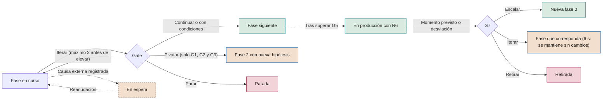

# Manuales de fase

**Cómo se ejecuta cada fase del ciclo de vida de una iniciativa de IA, desde la autorización hasta la evolución o la retirada**

| | |
|---|---|
| Documento | Documento 20 · Manuales de fase |
| Versión | 0.1 (borrador de trabajo) |
| Fecha | 16-09-2026 |
| Autor | Fernando García Varela |
| Estado | Borrador para revisión. Desarrolla la sección 6 del documento 01 y no puede contradecirlo. |

<!-- cifras: 8 | manuales de fase ; 13 | apartados por manual ; 4 | perfiles tecnológicos ; 31 | plantillas de evidencia enlazadas -->

---

> **Aviso legal y exención de responsabilidad.** SEVEN-G es un marco metodológico de referencia que se ofrece «tal cual» y con fines exclusivamente informativos. No constituye asesoramiento jurídico, regulatorio, financiero ni profesional, ni garantiza el cumplimiento de ninguna norma. Las referencias a regulación general (como el Reglamento Europeo de IA, el RGPD, DORA o NIS2), a normas técnicas y a regulación específica de cada sector o jurisdicción pueden ser incompletas, no aplicar a un caso concreto o quedar desactualizadas por cambios normativos, interpretaciones o criterios de las autoridades posteriores a su fecha de consulta. **Cada organización que use SEVEN-G es la única responsable de identificar la normativa que le aplica, verificar su vigencia y certificar su propio cumplimiento regulatorio**, con el asesoramiento cualificado que corresponda. Esta metodología es una ayuda genérica y gratuita, compartida con la comunidad para que nadie tenga que empezar desde cero; cada persona u organización puede y debe adaptarla a su propio uso. No debe entenderse que sus partes jurídicamente sensibles hayan sido revisadas por una asesoría jurídica: esas revisiones, para cada empresa o sector, son responsabilidad última de la empresa, el consultor o la organización que la use. Aunque se procura mantenerla al día, alguna norma puede haber cambiado sin que se recoja aquí. En la máxima medida permitida por la ley, el autor no asume responsabilidad alguna por los efectos de su aplicación en ninguna organización ni por su aplicabilidad completa. La metodología no otorga certificación de ningún tipo. El autor no asume responsabilidad alguna por el uso que se haga de este contenido ni por las decisiones que se adopten con él. Los datos, cifras, compañías y casos de los ejemplos son ficticios o ilustrativos.

<!-- esencial: recomendado | Guía de trabajo de cada fase: actividades, responsables, evidencias y errores frecuentes. Lo obligatorio que desarrolla está en el documento 01 (fases y evidencias) y en el 21 (criterios). Se lee la fase en la que está la iniciativa; las transiciones entre fases (sección 11) conviene conocerlas desde el principio. -->

## 1. Objeto y alcance

Este documento convierte el ciclo de vida de la iniciativa definido en el documento 01 (sección 6) en instrucciones de trabajo. Para cada fase, de la 0 a la 7, indica qué hay que hacer, en qué orden, quién lo hace, qué evidencias deben existir antes de la puerta de decisión y cómo se prepara esa puerta. Incluye las diferencias por intensidad (Lite o Enterprise), por nivel de ambición y por tecnología, y las transiciones entre fases.

**Qué no cubre y dónde se encuentra**

| Tema | Documento |
|---|---|
| Criterios de cada *gate* (`G<n>.<nn>`, `R6.<nn>`) y listas de verificación (`LV-G0`…) | 21 y 22 |
| Adopción, capacidad liberada y formación | 23 |
| Órganos, roles y escalado de decisiones | 30 |
| Riesgos, regulación, seguridad de agentes, terceros e incidentes | 33, 34, 35, 36 y 37 |
| Contenido de cada evidencia | Plantillas P01–P31 |

**Ámbito.** Iniciativas de IA e IA de terceros integrada en procesos (01 §1.2). El uso corporativo de IA de propósito general solo recorre estos manuales si cumple algún criterio Enterprise (01 §9.2); en otro caso se gobierna con el inventario, la política de uso aceptable y la formación (documento 31).

Este documento no constituye asesoramiento jurídico. Las referencias regulatorias se han consultado en septiembre de 2026 y su vigencia debe verificarse en el documento 34.

---

## 2. Cómo usar los manuales

### 2.1 Estructura común

Las secciones 3 a 10 desarrollan una fase cada una con trece apartados fijos: **1** objetivo · **2** cuándo empieza y cuándo termina · **3** entradas · **4** actividades paso a paso · **5** roles · **6** evidencias obligatorias · **7** diferencias entre Lite y Enterprise · **8** diferencias por nivel de ambición · **9** particularidades por tecnología · **10** plazo de referencia · **11** preparación del *gate* · **12** errores frecuentes · **13** eventos en el registro.

El responsable de producto los usa como guía de trabajo; el responsable técnico, en las fases 3 a 5; el de operación, en la 6; el patrocinador, para saber qué exigir antes de un *gate*; riesgos, para sus actividades y conformidades; el auditor y la oficina de IA, para saber qué evidencias y qué errores buscar al verificar.

### 2.2 Visión de conjunto

<!-- figura: ciclo -->

| Fase | Puerta | Responde (A) | Plantillas | Plazo Lite / Enterprise |
|---|---|---|---|---|
| **0 · Contexto y restricciones** | G0 · Autorización | Patrocinador | P01–P05 | 10 / 20 días |
| **1 · Descubrimiento de oportunidades** | G1 · Oportunidad | Patrocinador | P06, P07, P31 | 20 / 30 días |
| **2 · Hipótesis de valor** | G2 · Hipótesis | Patrocinador | P07, P08, P09 | 20 / 30 días |
| **3 · Viabilidad y riesgo** | G3 · Viabilidad | Patrocinador | P04, P10–P14 | 20 / 45 días |
| **4 · Diseño de la solución** | G4 · Diseño | Responsable técnico | P15–P20 | 20 / 45 días |
| **5 · Entrega y validación** | G5 · Puesta en producción | Responsable de producto | P12, P19–P23 | 60 / 90 días |
| **6 · Operación y gobierno** | R6 · Revisión de continuidad | Responsable de operación | P04, P12, P20, P24–P28 | Sin plazo; R6 semestral / trimestral |
| **7 · Evolución o retirada** | G7 · Escalado o retirada | Patrocinador | P07, P28, P30 | 15 / 30 días |

Toda decisión se documenta con el **registro de decisión de *gate* (P29)** en el gestor de *gates* (T03). La **ficha de caso de uso (P31)** se abre en la fase 1 y se mantiene hasta la retirada.

### 2.3 Convenciones

- **Responsabilidades.** Letras de 01 §8.4: **A** responde, **R** realiza, **C** consultado, **I** informado, **V** verifica. En las tablas de actividades, *Realiza* indica quién ejecuta cada paso; quien responde de toda la fase es el rol **A** del apartado 5. Nombres cortos: *Patrocinador*, *Producto*, *Técnico*, *Operación*, *Riesgos*, *Auditor*.
- **Funciones de la compañía.** *Participan* incluye funciones que no son roles del marco (control de gestión, asesoría jurídica, delegado de protección de datos, seguridad de la información, personas, compras, área usuaria). No sustituyen a los roles ni alteran la separación de funciones.
- **Verificación y decisión.** Según 01 §7.5. En Enterprise verifica siempre el auditor de IA.
- **Perfiles tecnológicos.** Cuatro perfiles: ML predictivo, IA generativa, agentes e IA de terceros embebida. *Procesamiento de lenguaje y documentos* sigue el de IA generativa si usa modelos generativos y el de ML predictivo en otro caso; *Visión* y *Optimización*, el de ML predictivo; *Reglas (no es IA)* no recorre el ciclo. Si se combinan perfiles, se aplican todos.
- **Plazos.** Se cuentan desde la entrada en la fase hasta la decisión de su puerta, sin el tiempo en espera. El tiempo de decisión (de la solicitud a la decisión) se controla además aparte: 5 días hábiles en Lite y 10 en Enterprise. Son orientativos (03 §3.6); la compañía los aprueba en C2 y los recalibra en C5.
- **Vocabulario.** **Debe**, obligatorio; **debería**, recomendado; **puede**, opcional (01 §1.3).

### 2.4 Reglas comunes a todas las fases

1. **Las evidencias existen antes de solicitar el *gate***, con autor, fecha y versión. La documentación a posteriori invalida el *gate* y es no conformidad mayor (01 §7.4).
2. **Quien aporta evidencias no las verifica ni decide.**
3. **Sin evidencia obligatoria no hay decisión.** T03 no permite registrar *Continuar* con criterios obligatorios en *No cumple* o *Pendiente*.
4. **Las condiciones tienen plazo y responsable** y no se admiten para controles críticos de seguridad, cumplimiento legal o supervisión humana. Vencidas, el resultado pasa a *Iterar*.
5. **Tras dos iteraciones en el mismo *gate***, la decisión se eleva al órgano superior.
6. **Los criterios de parada no se relajan** sin aprobación del órgano que autorizó la iniciativa.
7. **La intensidad solo sube sin esperar a un *gate*.** Se determina en la fase 0 y se revisa en G3 y en cada R6. Si aparece antes un criterio Enterprise (por ejemplo, ambición Transformar o un agente con capacidad de actuar), la iniciativa pasa a Enterprise en ese momento. La vuelta a Lite solo se decide en G3 o R6.
8. **Todo importe tiene fórmula y estado**, y la capacidad liberada se informa aparte (reglas 1, 2 y 3 de medición). P31 se mantiene en lenguaje comprensible (regla 10).
9. **Agrupar no es omitir.** Cuando en Lite se agrupan G0–G2 o G4–G5, cada puerta se registra como decisión separada en T03 y cada evidencia se verifica.

### 2.5 Registro en T01

Tipos de evento (03 §3.3): alta; entrada y salida de fase; solicitud de *gate*; verificación; decisión con resultado; creación, cumplimiento o vencimiento de condiciones; paso a espera y reanudación; cambio de clasificación (ambición, intensidad o regulatoria); incidente; no conformidad; parada; retirada. Todos llevan fecha, autor y comentario. El apartado 13 de cada manual recoge los propios de la fase; espera, condiciones y no conformidades pueden darse en cualquiera.

---

## 3. Fase 0 · Contexto y restricciones

### 3.1 Objetivo

Autorizar formalmente la iniciativa y fijar su marco: objetivo estratégico, esfera, restricciones, roles, intensidad y alta en el inventario. Pregunta: *¿está autorizada la iniciativa y en qué marco?*

### 3.2 Cuándo empieza y cuándo termina

- **Empieza** cuando una idea registrada en T01 (estado *Registrada*) tiene un patrocinador que acepta promoverla y un responsable de producto designado, o cuando G7 decide **Escalar** (sección 11.5).
- **Termina** con G0: *Continuar*, *Continuar con condiciones*, *Iterar* o *Parar*.
- **Regla:** sin G0 la iniciativa no está autorizada; no consume presupuesto ni accede a datos de producción (01 §6.2).

### 3.3 Entradas

Idea registrada con descripción comprensible (T01) · tesis de IA, ambición por esfera y apetito de riesgo (C2, documento 13) · cartera, presupuesto marco y umbral de inversión Enterprise (C3, documento 14) · política corporativa y de uso aceptable (documento 31) · inventario e iniciativas existentes (T02, T01) · mapeo regulatorio y normativa sectorial (documento 34) · si procede de un escalado, decisión de G7 y lecciones aprendidas (P30).

### 3.4 Actividades paso a paso

| # | Actividad | Realiza | Participan |
|---|---|---|---|
| 1 | Describir la necesidad de negocio y el objetivo estratégico sin presuponer la solución; identificar la esfera principal y la secundaria. | Producto | Técnico, área usuaria |
| 2 | Comprobar el encaje con la tesis, la ambición de la esfera y la cartera; buscar en T01 y T02 iniciativas o sistemas similares. | Producto | Oficina de IA |
| 3 | Declarar restricciones regulatorias, éticas, de datos (disponibilidad, base legal preliminar, categorías especiales), presupuestarias, de plazo, tecnológicas y de proveedores. | Producto | Riesgos, Técnico, asesoría jurídica |
| 4 | Identificación regulatoria preliminar con T07 (posible práctica prohibida, alto riesgo, transparencia); si no puede concluirse, *Pendiente de clasificar*. | Producto | Riesgos |
| 5 | Asignar los seis roles, comprobar incompatibilidades (01 §8.2) y obtener la aceptación expresa. El auditor lo designa la tercera línea, no el patrocinador. | Producto | Oficina de IA, tercera línea |
| 6 | Determinar la intensidad con T04; si hay agentes, declarar el nivel de autonomía previsto (A0–A3). | Producto | Riesgos |
| 7 | Fijar el presupuesto y el límite de gasto autorizados hasta G3. | Producto | Control de gestión |
| 8 | Dar de alta en T02 los sistemas previstos, aunque aún no existan. | Producto | Técnico |
| 9 | Redactar la carta, reunir evidencias y solicitar G0 en T03. | Producto | — |

### 3.5 Roles

Patrocinador **A** · Producto **R** · Técnico **C** · Operación **I** · Riesgos **C** · Auditor **V** (en Lite verifica la oficina de IA).

### 3.6 Evidencias obligatorias

| Evidencia | Plantilla | Herramienta |
|---|---|---|
| Carta de la iniciativa | P01 | T01 |
| Declaración de contexto y restricciones | P02 | T01 |
| Registro de asignación de roles | P03 | T01 |
| Determinación de intensidad | P04 | T04 |
| Alta en el inventario | P05 | T02 |

### 3.7 Diferencias entre Lite y Enterprise

| Aspecto | Lite | Enterprise |
|---|---|---|
| Plantillas | Se omiten los campos marcados *(Enterprise)*. | Completas. |
| Verificación y decisión | Oficina de IA; patrocinador. | Auditor de IA; comité de IA. |
| Agrupación | G0, G1 y G2 en una sola sesión. | Por separado. |
| Identificación regulatoria | Con T07. | Con T07 y revisión de la asesoría jurídica. |

### 3.8 Diferencias por nivel de ambición

La ambición se propone en la fase 1; en la fase 0 la carta solo recoge la **prevista**.

| Nivel | Qué cambia |
|---|---|
| **Optimizar** | Carta centrada en un proceso y un área; suele bastar el encaje en la cartera del área. |
| **Aumentar** | Se identifican desde el inicio los colectivos cuyo trabajo cambiará y se consulta a la función de personas. |
| **Transformar** | Debería proceder de una apuesta prevista en C2 o C3. Intensidad Enterprise desde el inicio, patrocinador de la alta dirección y carta con etapas y límite de inversión de la primera. |

### 3.9 Particularidades por tecnología

| Perfil | Qué cambia |
|---|---|
| **ML predictivo** | Declarar si el resultado influirá en decisiones sobre personas (criterio Enterprise) e identificar los datos históricos y su titular. |
| **IA generativa** | Declarar exposición, tipo de contenido generado, uso de modelos de terceros y si entrarán datos personales o confidenciales. |
| **Agentes** | Declarar autonomía prevista y sistemas alcanzables. A2 o A3 con efecto sobre terceros, dinero, datos personales o sistemas de producción implica Enterprise. |
| **IA de terceros embebida** | Identificar proveedor, producto y función; si viene activada por defecto y qué datos recibe el proveedor. El alta en inventario es obligatoria. Nivel de exigencia preliminar N1–N3. |

### 3.10 Plazo de referencia

10 días en Lite y 20 en Enterprise.

### 3.11 Preparación del *gate* G0

- **Se presenta:** P01 a P05; la carta sirve de resumen.
- **Verifica y decide:** Lite, oficina de IA y patrocinador; Enterprise, auditor de IA y comité de IA.
- **Criterios:** G0.nn (ver documento 21) y `LV-G0` (documento 22), que desarrollan 01 §6.2: patrocinador comprometido, roles sin incompatibilidades, encaje con tesis y cartera, restricciones conocidas.
- **Consejo:** solicitar con antelación suficiente para que el verificador disponga del plazo completo.

### 3.12 Errores frecuentes

- Acceder a datos, contratar proveedores o prototipar antes de G0.
- Carta que describe una tecnología (*implantar un asistente*) y no una necesidad.
- Roles nominales, sin disponibilidad ni aceptación, o auditor elegido por el patrocinador.
- Rebajar la intensidad omitiendo la exposición a clientes o la capacidad de actuar de un agente.
- Excluir la IA de terceros porque *es una funcionalidad del software que ya tenemos*.
- Restricciones genéricas (*cumplir la normativa*) sin identificar normas.

### 3.13 Eventos en el registro

Alta · entrada en fase 0 · alta del sistema en T02 · primera clasificación de intensidad y regulatoria preliminar · solicitud, verificación y decisión de G0 · condiciones · salida o parada con motivo codificado.

---

## 4. Fase 1 · Descubrimiento de oportunidades

### 4.1 Objetivo

Identificar oportunidades desde el negocio dentro del ámbito autorizado, descartar las que no requieren IA o no tienen valor plausible y proponer esfera y nivel de ambición. Pregunta: *¿hay una oportunidad de negocio que requiere IA?*

### 4.2 Cuándo empieza y cuándo termina

- **Empieza** con *Continuar* o *Continuar con condiciones* en G0.
- **Termina** con G1: *Continuar*, *Continuar con condiciones*, *Iterar*, *Pivotar* (sección 11.2) o *Parar*.

### 4.3 Entradas

Evidencias y condiciones de G0 (P01–P05, T03) · datos del proceso o decisión: volúmenes, tiempos, costes, errores (área usuaria, control de gestión) · iniciativas paradas o retiradas con motivos comparables (T01) · mapa de esferas y criterios de ambición (documentos 10 y 12, T05).

### 4.4 Actividades paso a paso

| # | Actividad | Realiza | Participan |
|---|---|---|---|
| 1 | Analizar el proceso o la decisión: pasos, volúmenes, tiempos, costes, errores, puntos de decisión y personas. | Producto | Técnico, área usuaria |
| 2 | Registrar las oportunidades en P06 con problema, usuario o cliente afectado y resultado esperado. | Producto | Área usuaria |
| 3 | Identificar y comparar alternativas sin IA: rediseño del proceso, reglas, automatización convencional, formación, cambio de política. | Producto | Técnico |
| 4 | Estimar el orden de magnitud del valor con fórmula (unidades × valor unitario), marcado *estimado*, y del esfuerzo. | Producto | Técnico, control de gestión |
| 5 | Anotar por qué cada oportunidad avanza o se descarta. | Producto | Riesgos |
| 6 | Proponer esfera y ambición con las cinco preguntas de 00 §5.2 (T05, P07). | Producto | Oficina de IA |
| 7 | Redactar la ficha de caso de uso (P31) de la oportunidad seleccionada. | Producto | — |
| 8 | Revisar la intensidad si aparece un criterio Enterprise; solicitar G1. | Producto | Riesgos |

### 4.5 Roles

Patrocinador **A** · Producto **R** · Técnico **C** · Operación **I** · Riesgos **C** · Auditor **V** (en Lite verifica la oficina de IA).

### 4.6 Evidencias obligatorias

| Evidencia | Plantilla | Herramienta |
|---|---|---|
| Cartera de oportunidades y notas de filtrado | P06 | T01 |
| Alternativas sin IA consideradas | P06 | T01 |
| Esfera y nivel de ambición propuestos | P07 | T05 |
| Descripción comprensible del caso | P31 | T01 |

### 4.7 Diferencias entre Lite y Enterprise

| Aspecto | Lite | Enterprise |
|---|---|---|
| Cartera | Puede limitarse a una oportunidad con sus alternativas. | Varias oportunidades comparadas cuando el ámbito lo permita. |
| Verificación y decisión | Oficina de IA; patrocinador. | Auditor de IA; patrocinador, informando al comité. |
| Agrupación | Con G0 y G2. | Por separado. |

### 4.8 Diferencias por nivel de ambición

| Nivel | Qué cambia |
|---|---|
| **Optimizar** | Comparación rigurosa con las alternativas sin IA: si una regla o un rediseño logra lo mismo, se descarta. |
| **Aumentar** | Se identifican los roles y decisiones que cambiarían y qué podrán hacer las personas que hoy no pueden. |
| **Transformar** | Se explora con clientes, mercado o modelo operativo; no se descarta por falta de retorno a corto plazo; se documenta la hipótesis de cambio de oferta o de competencia. Pasa a Enterprise. |

### 4.9 Particularidades por tecnología

| Perfil | Qué cambia |
|---|---|
| **ML predictivo** | Comprobar que hay histórico y que el resultado real es observable; si nunca se sabrá si la predicción acertó, la hipótesis no será falsable. |
| **IA generativa** | Distinguir productividad individual (uso corporativo, documento 31) de integración en un proceso. Priorizar tareas con error detectable o tolerable. |
| **Agentes** | Enumerar las acciones del agente y si son reversibles; considerar empezar con menos autonomía. |
| **IA de terceros embebida** | Revisar en T02 si una herramienta ya licenciada ofrece la función; plantear construir, comprar o aliarse. |

### 4.10 Plazo de referencia

20 días en Lite y 30 en Enterprise.

### 4.11 Preparación del *gate* G1

- **Se presenta:** P06 con alternativas y notas de filtrado, P07 y P31.
- **Verifica y decide:** Lite, oficina de IA y patrocinador; Enterprise, auditor de IA y patrocinador, informando al comité de IA.
- **Criterios:** G1.nn (ver documento 21) y `LV-G1`, que desarrollan 01 §6.3: necesidad de negocio, aportación de la IA frente a las alternativas y valor potencial suficiente para formular una hipótesis.

### 4.12 Errores frecuentes

- Partir de la tecnología disponible y buscarle un problema.
- Alternativas sin IA descritas de trámite.
- Contar todo el tiempo del proceso como valor, cuando la IA cambia solo una parte.
- Clasificar como Transformar para ganar visibilidad, o como Optimizar para evitar al consejo.
- No registrar los descartes ni su motivo.

### 4.13 Eventos en el registro

Entrada en fase 1 · ambición propuesta · cambio de intensidad, si procede · solicitud, verificación y decisión de G1 · condiciones · salida, pivote o parada con motivo codificado.

---

## 5. Fase 2 · Hipótesis de valor

### 5.1 Objetivo

Formular una hipótesis de valor medible y falsable, con línea base, objetivo, umbral de éxito, método de atribución y criterios de parada definidos antes de invertir en construcción. Pregunta: *¿qué valor esperamos, cómo lo mediremos y cómo sabremos que ha fallado?*

### 5.2 Cuándo empieza y cuándo termina

- **Empieza** con *Continuar* en G1 o con *Pivotar* en G1, G2 o G3.
- **Termina** con G2. En Transformar, G2 requiere además la aprobación del consejo, que se registra como parte de la decisión.

### 5.3 Entradas

P06, P07 y P31 aprobados · datos operativos del periodo de línea base (área usuaria, sistemas) · valores unitarios como coste por hora, margen o coste por error (control de gestión) · horizonte de retorno y umbrales (C2) · reglas de medición e indicadores (documentos 40 y 41) · si hay pivote, evidencias previas y motivo (T01, P29).

### 5.4 Actividades paso a paso

| # | Actividad | Realiza | Participan |
|---|---|---|---|
| 1 | Formular la hipótesis: *si se introduce [cambio], [métrica] pasará de [línea base] a [objetivo] en [plazo] para [población], medido con [método]*. | Producto | Técnico |
| 2 | Definir métrica principal, secundarias y de salvaguarda (calidad, reclamaciones, errores, equidad) que no deben empeorar. | Producto | Técnico, Riesgos |
| 3 | Medir la línea base con datos reales de un periodo representativo, con fuente, extracción y calidad documentadas (P09). Una estimación solo se admite justificada y marcada. | Producto | Técnico, área usuaria |
| 4 | Fijar objetivo y umbral de éxito: el resultado mínimo que justifica continuar. | Producto | Control de gestión |
| 5 | Elegir el método de atribución: grupo de control, despliegue escalonado, antes y después con corrección de estacionalidad u otro justificado. | Producto | Técnico, oficina de IA |
| 6 | Expresar el valor esperado en dinero con fórmula, separando eficiencias, retorno y coste recurrente preliminar; capacidad liberada aparte (T11). | Producto | Control de gestión |
| 7 | Confirmar el nivel de ambición con la hipótesis formulada (P07). | Producto | Oficina de IA |
| 8 | Definir criterios de parada (resultados, plazos o costes); en Transformar, hitos de aprendizaje y límite de inversión por etapa. | Producto | Riesgos |
| 9 | En Aumentar y Transformar, fijar el objetivo de adopción (documento 23). Actualizar P31 y solicitar G2. | Producto | Área usuaria |

### 5.5 Roles

Patrocinador **A** · Producto **R** · Técnico **C** · Operación **I** · Riesgos **C** · Auditor **V** (en Lite verifica la oficina de IA). El patrocinador acepta el umbral de éxito y los criterios de parada y se compromete a respetarlos.

### 5.6 Evidencias obligatorias

| Evidencia | Plantilla | Herramienta |
|---|---|---|
| Lienzo de hipótesis de valor, método de atribución y criterios de parada | P08 | T11 |
| Métricas de línea base | P09 | T11 |
| Confirmación del nivel de ambición | P07 | T05 |

### 5.7 Diferencias entre Lite y Enterprise

| Aspecto | Lite | Enterprise |
|---|---|---|
| Línea base | Puede basarse en informes de gestión existentes si son verificables. | Extracción reproducible con fuente y consulta documentadas. |
| Atribución | Antes y después admisible con justificación. | Grupo de control o despliegue escalonado cuando sea factible. |
| Verificación y decisión | Oficina de IA; patrocinador. | Auditor de IA; comité de IA; consejo en Transformar. |

### 5.8 Diferencias por nivel de ambición

| Nivel | Qué se exige en G2 (01 §7.6) |
|---|---|
| **Optimizar** | Línea base de coste, tiempo o errores y ahorro esperado con fórmula, separado de la capacidad liberada. |
| **Aumentar** | Métricas de rendimiento (productividad, calidad, conversión) y de coste, y objetivo de adopción. |
| **Transformar** | Hipótesis de retorno con hitos de aprendizaje, límite de inversión por etapa y aprobación del consejo. Se admite más incertidumbre, no la ausencia de criterios de parada. |

### 5.9 Particularidades por tecnología

| Perfil | Qué cambia |
|---|---|
| **ML predictivo** | Separar métricas de negocio y del modelo; traducir el umbral de negocio al rendimiento mínimo del modelo. La línea base es el proceso actual (reglas o criterio experto). |
| **IA generativa** | Medir por muestreo tiempo y calidad del trabajo actual con una rúbrica explícita; incluir el coste variable por consumo. |
| **Agentes** | Métricas por tarea: completadas correctamente, escaladas a una persona, acciones erróneas y coste por tarea. |
| **IA de terceros embebida** | Los beneficios anunciados por el proveedor no son línea base ni hipótesis; se mide con datos propios y se incluyen licencias y consumos. |

### 5.10 Plazo de referencia

20 días en Lite y 30 en Enterprise. En Transformar, la espera a la sesión del consejo cuenta como tiempo de decisión.

### 5.11 Preparación del *gate* G2

- **Se presenta:** P08, P09, P07 confirmado y P31 actualizado.
- **Verifica y decide:** Lite, oficina de IA y patrocinador; Enterprise, auditor de IA y comité de IA. En Transformar, el comité eleva la propuesta al consejo con el formato del documento 60.
- **Criterios:** G2.nn (ver documento 21) y `LV-G2`, que desarrollan 01 §6.4: hipótesis falsable, línea base medida, valor en dinero con fórmula y criterios de parada previos a la inversión.

### 5.12 Errores frecuentes

- Hipótesis no falsable (*mejorar la experiencia del cliente*) o sin plazo.
- Línea base estimada sin justificar o tomada del proveedor.
- Sumar la capacidad liberada como ahorro.
- Métricas del modelo en lugar de métricas de negocio.
- Criterios de parada tan laxos que nunca se activan.
- Atribuir un resultado que también declara otra iniciativa (regla 5 de medición).

### 5.13 Eventos en el registro

Entrada en fase 2 (marcando el pivote, si lo hay) · ambición confirmada · solicitud, verificación y decisión de G2 · aprobación del consejo en Transformar · condiciones · salida, pivote o parada.

---

## 6. Fase 3 · Viabilidad y riesgo

### 6.1 Objetivo

Decidir si la iniciativa es viable técnica, económica, regulatoria y organizativamente con un riesgo aceptable. Es la **principal puerta de parada**: lo que no se detiene aquí se detiene después a un coste mayor.

### 6.2 Cuándo empieza y cuándo termina

- **Empieza** con *Continuar* en G2.
- **Termina** con G3: *Continuar*, *Continuar con condiciones*, *Iterar*, *Pivotar* o *Parar*.
- **Regla:** las prácticas prohibidas no pasan de esta fase en ningún caso (01 §6.5).

### 6.3 Entradas

P08 y P09 aprobados · apetito de riesgo, umbrales y horizonte (C2) · escalas y riesgos tipo `RT-<CAT>-NN` (documento 33) · mapeo regulatorio (documento 34, T07) · acceso autorizado a muestras reales de datos dentro de las restricciones de P02 · documentación y ofertas de proveedores · estándares de arquitectura y seguridad.

### 6.4 Actividades paso a paso

| # | Actividad | Realiza | Participan |
|---|---|---|---|
| 1 | Evaluar disponibilidad, calidad, representatividad y base legal de los datos con datos reales. | Técnico | Riesgos, delegado de protección de datos |
| 2 | Evaluar la viabilidad técnica, si hace falta con una prueba acotada en alcance, plazo y gasto que no se convierte en construcción. | Técnico | Producto |
| 3 | Estimar costes de construcción y recurrentes por categoría (documento 42, T13), incluidos control, cumplimiento, adopción y formación. | Técnico y Producto | Control de gestión, Operación |
| 4 | Calcular neto anual esperado y neto adicional por euro y contrastarlos con el horizonte de C2. | Producto | Control de gestión |
| 5 | Clasificar el sistema con criterio jurídico (P11, T07), incluido el papel de la compañía (proveedor o responsable del despliegue). | Riesgos | Asesoría jurídica |
| 6 | Realizar las evaluaciones de impacto exigibles: en protección de datos (art. 35 del RGPD) y en derechos fundamentales (art. 27 del Reglamento Europeo de IA) en los supuestos previstos. | Riesgos | Delegado de protección de datos, Producto |
| 7 | Identificar y valorar riesgos inherentes y residuales con la escala 5 × 5 (P12, T06), incluidos IA generativa, agentes, seguridad y terceros. | Riesgos, Producto y Técnico | Operación |
| 8 | Definir respuestas, plan de mitigación y contingencia (P13) y aceptación del riesgo residual en el nivel que corresponda. | Riesgos | Producto, Técnico |
| 9 | Evaluar proveedores con su nivel de exigencia N1–N3 (P14, T09). | Técnico | Riesgos, compras |
| 10 | Valorar el impacto en las personas con el análisis preliminar de roles y tareas (documento 23). | Producto | Personas, área usuaria |
| 11 | Revisar la intensidad (P04), actualizar P31 y solicitar G3. | Producto | Riesgos |

Aceptación del riesgo residual: Bajo, responsable de producto con registro; Medio, patrocinador con conformidad de riesgos; Alto, comité de IA; Crítico, no se acepta salvo aprobación excepcional del consejo o su comisión delegada dentro del apetito de C2.

### 6.5 Roles

Patrocinador **A** · Producto **R** · Técnico **R** · Operación **C** · Riesgos **R** · Auditor **V** (en Lite verifica la oficina de IA). Construcción y control trabajan a la vez, pero la conformidad de riesgos sigue siendo independiente de lo que aportan producto y técnico.

### 6.6 Evidencias obligatorias

| Evidencia | Plantilla | Herramienta |
|---|---|---|
| Evaluación de viabilidad (datos, técnica, costes, neto) | P10 | T13 |
| Clasificación regulatoria y evaluaciones de impacto | P11 | T07 |
| Matriz y registro de riesgos | P12 | T06 |
| Plan de mitigación y contingencia | P13 | T06 |
| Evaluación de proveedores, si los hay | P14 | T09 |
| Revisión de intensidad | P04 | T04 |

### 6.7 Diferencias entre Lite y Enterprise

| Aspecto | Lite | Enterprise |
|---|---|---|
| Clasificación regulatoria | Obligatoria; Lite simplifica la plantilla, no la obligación. | Obligatoria, con informe jurídico. |
| Evaluaciones de impacto | Las exigibles por ley, sea cual sea la intensidad. | Las exigibles y las que decida el comité. |
| Costes | Categorías principales. | Todas las categorías del documento 42. |
| Verificación y decisión | Oficina de IA; patrocinador con conformidad de riesgos. | Auditor de IA; comité de IA. |

### 6.8 Diferencias por nivel de ambición

| Nivel | Qué se exige en G3 (01 §7.6) |
|---|---|
| **Optimizar** | Neto anual esperado positivo dentro del horizonte de C2. |
| **Aumentar** | Viabilidad de la adopción y del cambio de rol, además del neto esperado. |
| **Transformar** | Viabilidad de la primera etapa, criterios de parada por etapa y valor de opción documentado: qué aprendizaje o posición se obtiene aunque no se financie la etapa siguiente. |

### 6.9 Particularidades por tecnología

| Perfil | Qué cambia |
|---|---|
| **ML predictivo** | Sesgos del histórico, representatividad, variables objetivo aproximadas y necesidad de explicabilidad para la supervisión. |
| **IA generativa** | Conjunto de casos de prueba representativo con casos adversos; riesgos de contenido incorrecto o no fundamentado y de fuga de información; escenarios de coste por consumo; condiciones de uso de datos del proveedor; transparencia (documento 34). |
| **Agentes** | Inventario de acciones y sistemas alcanzables; impacto de la peor acción posible; permisos excesivos, acciones no autorizadas e inyección indirecta de instrucciones; justificación del nivel de autonomía. |
| **IA de terceros embebida** | Nivel N1–N3, dependencia y sustituibilidad, uso de datos para entrenar, localización, derecho de auditoría, aviso de cambios de modelo y plan de salida; DORA o NIS2 cuando apliquen. |

### 6.10 Plazo de referencia

20 días en Lite y 45 en Enterprise.

### 6.11 Preparación del *gate* G3

- **Se presenta:** P10 a P14, P04, P31 y un resumen de una página con neto esperado, riesgos residuales Altos y Críticos y clasificación regulatoria.
- **Verifica y decide:** Lite, oficina de IA y patrocinador con conformidad de riesgos; Enterprise, auditor de IA y comité de IA.
- **Criterios:** G3.nn (ver documento 21) y `LV-G3`, que desarrollan 01 §6.5: viabilidad con datos reales, ningún riesgo crítico sin mitigación aceptada, clasificación con criterio jurídico (no puede quedar *Pendiente de clasificar*) y neto coherente con C2.
- **Bloqueos:** un riesgo residual Crítico sin aprobación del consejo bloquea G3; no hay condiciones sobre controles de cumplimiento legal.

### 6.12 Errores frecuentes

- Demostrar la viabilidad con datos de ejemplo, sintéticos o del proveedor.
- Clasificar sin criterio jurídico o dar por hecho que un sistema de terceros *ya cumple*.
- Olvidar costes recurrentes, de operación y de adopción.
- Evaluar solo riesgos técnicos.
- Aceptar un riesgo residual en un nivel inferior al que corresponde.
- Continuar por el coste ya incurrido y no por el valor esperado.
- Dejar que la prueba de viabilidad se convierta en construcción encubierta.

### 6.13 Eventos en el registro

Entrada en fase 3 · clasificación regulatoria definitiva · revisión de intensidad · alta de proveedores en T09 · solicitud, verificación y decisión de G3 · condiciones · espera (frecuente por datos o proveedores) · salida, pivote o parada (datos insuficientes, inviable técnicamente, coste superior al valor, riesgo inaceptable, regulación).

---

## 7. Fase 4 · Diseño de la solución

### 7.1 Objetivo

Diseñar una solución controlable, supervisable y reversible, en la que cada riesgo aceptado en G3 tenga un control diseñado y la adopción y la medición estén previstas desde el diseño. Pregunta: *¿cómo se construye con control, supervisión humana y reversibilidad?*

### 7.2 Cuándo empieza y cuándo termina

- **Empieza** con *Continuar* en G3.
- **Termina** con G4: *Continuar*, *Continuar con condiciones*, *Iterar* o *Parar*.
- **Agrupación Lite:** si G4 y G5 se resuelven juntos, las evidencias de diseño deben estar terminadas y versionadas **antes de empezar a construir**. El verificador comprueba las fechas.

### 7.3 Entradas

Riesgos, respuestas y controles requeridos (P12, P13) · obligaciones de la clasificación regulatoria (P11) · métricas, línea base y atribución (P08, P09) · condiciones de proveedores (P14) · análisis preliminar de impacto en personas (P10) · estándares de arquitectura, seguridad y datos (documentos 35 y 51).

### 7.4 Actividades paso a paso

| # | Actividad | Realiza | Participan |
|---|---|---|---|
| 1 | Definir la arquitectura y registrar las decisiones con las opciones consideradas (P15). | Técnico | Operación, seguridad de la información |
| 2 | Documentar el linaje de datos y modelos: orígenes, transformaciones, versiones, conjuntos de entrenamiento y evaluación, modelos de terceros (P16). | Técnico | Delegado de protección de datos |
| 3 | Diseñar la supervisión humana (P17): qué decide el sistema, qué valida una persona, qué no se delega nunca, criterios de intervención, cómo se anula un resultado e información a los afectados. | Técnico | Producto, Riesgos, área usuaria |
| 4 | Diseñar la seguridad (P18, T10): identidad y permisos, mínimo privilegio, protección frente a inyección, registro de actividad y, en agentes, control de intención e interruptor de parada. | Técnico | Riesgos, seguridad de la información |
| 5 | Trazar cada riesgo de P12 a un control y a la prueba que lo comprobará en la fase 5. | Técnico | Riesgos |
| 6 | Diseñar la instrumentación de la medición de valor y adopción según el método de atribución. | Técnico | Producto, control de gestión |
| 7 | Definir la monitorización (rendimiento, degradación, sesgo, costes, seguridad, uso) y los umbrales iniciales de alerta. | Técnico | Operación |
| 8 | Preparar el plan de reversión (P19): disparadores, procedimiento, responsable, tiempo objetivo, vuelta al proceso anterior, datos y forma de probarlo. | Técnico | Operación, área usuaria |
| 9 | Diseñar la adopción (P20, documento 23): impacto en roles, formación, comunicación y destino de la capacidad liberada. | Producto | Personas, área usuaria |
| 10 | Definir el plan de pruebas y de piloto (población, duración, grupo de control, criterios de interrupción) y solicitar G4. | Técnico | Producto, Riesgos |

### 7.5 Roles

Patrocinador **I** · Producto **C** · Técnico **A/R** · Operación **C** · Riesgos **C** · Auditor **V** (en Lite verifica la oficina de IA). Producto realiza el diseño de la adopción porque responde de ella (01 §8.1); operación asegura que la solución se podrá operar y revertir.

### 7.6 Evidencias obligatorias

| Evidencia | Plantilla | Herramienta |
|---|---|---|
| Registro de arquitectura | P15 | — |
| Linaje de datos y modelos | P16 | — |
| Diseño de gobierno y supervisión humana | P17 | — |
| Diseño de seguridad | P18 | T10 |
| Plan de reversión | P19 | — |
| Plan de adopción | P20 | T20 |

### 7.7 Diferencias entre Lite y Enterprise

| Aspecto | Lite | Enterprise |
|---|---|---|
| Revisión del diseño | Par técnico no implicado. | Revisión formal con seguridad de la información y protección de datos. |
| Plan de adopción | Formación y destino de la capacidad liberada. | Todos los bloques de P20. |
| Verificación y decisión | Oficina de IA; patrocinador con conformidad de riesgos. Agrupable con G5. | Auditor de IA; comité de IA. |

### 7.8 Diferencias por nivel de ambición

| Nivel | Qué cambia |
|---|---|
| **Optimizar** | Se minimiza el cambio del proceso y se prevé cómo se materializará la capacidad liberada (a quién, cuándo, con qué mecanismo). |
| **Aumentar** | El rediseño de roles y la supervisión humana son el núcleo; la experiencia de uso se prueba con usuarios reales. |
| **Transformar** | Diseño por etapas con puntos de decisión y arquitectura que permite parar al final de cada etapa conservando el aprendizaje; cambios de modelo operativo (roles, derechos de decisión) y experimentos con clientes. |

### 7.9 Particularidades por tecnología

| Perfil | Qué cambia |
|---|---|
| **ML predictivo** | Versionado de modelos y datos, reentrenamiento como cambio controlado, umbrales de decisión, explicaciones útiles para el supervisor y detección de deriva. |
| **IA generativa** | Fuentes autorizadas para la recuperación de contenidos, filtros de entrada y salida, instrucciones de sistema versionadas, conservación de conversaciones conforme a protección de datos, evaluaciones automáticas y límites de consumo. |
| **Agentes** | Identidad propia, permisos mínimos por herramienta, lista cerrada de acciones, validación humana de acciones sensibles, control de intención, registro de intención y acción, límites de volumen e importe e interruptor de parada. |
| **IA de terceros embebida** | Configuración de la función de IA, cláusulas contractuales traducidas a controles técnicos, gestión de versiones del proveedor y alternativa si cambia o retira la función. |

### 7.10 Plazo de referencia

20 días en Lite y 45 en Enterprise.

### 7.11 Preparación del *gate* G4

- **Se presenta:** P15 a P20 y la trazabilidad riesgo → control → prueba.
- **Verifica y decide:** Lite, oficina de IA y patrocinador con conformidad de riesgos (el responsable técnico forma parte del equipo y no decide, 01 §8.1); Enterprise, auditor de IA y comité de IA.
- **Criterios:** G4.nn (ver documento 21) y `LV-G4`, que desarrollan 01 §6.6: controles exigidos por la clasificación, supervisión humana definida, mecanismo de parada y control diseñado para cada riesgo de la fase 3.
- **Bloqueos:** no hay condiciones sobre supervisión humana ni controles críticos de seguridad.

### 7.12 Errores frecuentes

- Supervisión humana nominal: una persona *en el bucle* sin tiempo, información ni autoridad para intervenir.
- Plan de reversión teórico, sin procedimiento ni responsable.
- Olvidar la instrumentación: la solución funciona, pero el valor no se puede medir.
- Permisos amplios a un agente *para simplificar la integración*.
- Reducir la adopción a un curso al final.
- Documentar el diseño después de construir.

### 7.13 Eventos en el registro

Entrada en fase 4 · verificación de condiciones de G3 · cambio de intensidad si el diseño altera autonomía, exposición o datos · solicitud, verificación y decisión de G4 · condiciones · salida o parada.

---

## 8. Fase 5 · Entrega y validación

### 8.1 Objetivo

Construir o integrar la solución, probarla y demostrar el valor en condiciones reales antes de la puesta en producción definitiva. Los resultados teóricos no bastan. Pregunta: *¿funciona y aporta valor en condiciones reales?*

### 8.2 Cuándo empieza y cuándo termina

- **Empieza** con *Continuar* en G4.
- **Termina** con G5. Con *Continuar* o *Continuar con condiciones*, la iniciativa pasa a *En producción* y a la fase 6.
- **Regla:** la puesta en producción Enterprise requiere firma multinivel con capacidad de veto (01 §6.7).

### 8.3 Entradas

Diseño aprobado y condiciones de G4 (P15–P20) · plan de pruebas y de piloto · entornos, accesos y datos autorizados · contratos firmados con proveedores · materiales de formación y comunicación (P20).

### 8.4 Actividades paso a paso

| # | Actividad | Realiza | Participan |
|---|---|---|---|
| 1 | Construir o integrar según el diseño, registrando desviaciones y su aprobación. Si se construye con asistencia de IA, aplicar el documento 53. | Técnico | Operación |
| 2 | Ejecutar pruebas funcionales, de rendimiento, sesgo, robustez y seguridad, incluidas las de inyección de instrucciones en IA generativa y agentes. | Técnico | Riesgos, seguridad de la información |
| 3 | Probar cada control crítico de P17 y P18 y registrar el resultado. | Técnico | Riesgos |
| 4 | Formar a usuarios y supervisores del piloto **antes** de que usen el sistema. | Producto | Personas, área usuaria |
| 5 | Ejecutar el piloto con el método de atribución, registrando indicadores de valor y adopción. | Producto | Técnico, Operación |
| 6 | Analizar resultados frente a la hipótesis y el umbral, con el estado de cada importe (P22). | Producto | Control de gestión |
| 7 | Probar el plan de reversión en condiciones realistas y registrar tiempo y resultado (P19). | Técnico | Operación |
| 8 | Actualizar el registro de riesgos con lo observado (P12). | Técnico y Producto | Riesgos |
| 9 | Preparar la operación: manual, monitorización y alertas configuradas, plan de respuesta a incidentes y traspaso. | Técnico | Operación |
| 10 | Elaborar el informe de entrega (P21). | Técnico | — |
| 11 | Obtener la firma de puesta en producción (P23): en Enterprise, técnico, riesgos y cumplimiento, seguridad de la información y protección de datos, cada una con veto; en Lite, conformidad de riesgos. Solicitar G5. | Producto | Firmantes |

### 8.5 Roles

Patrocinador **I** · Producto **A** · Técnico **R** · Operación **C** · Riesgos **C** · Auditor **V** (en Lite verifica la oficina de IA). El patrocinador decide G5 en Lite, con conformidad de riesgos.

### 8.6 Evidencias obligatorias

| Evidencia | Plantilla | Herramienta |
|---|---|---|
| Informe de entrega | P21 | — |
| Resultados de validación, pruebas y piloto | P22 | T11 |
| Prueba del plan de reversión | P19 | — |
| Registro de riesgos actualizado | P12 | T06 |
| Firma de puesta en producción | P23 | T03 |
| Plan de adopción con la formación realizada | P20 | T20 |

### 8.7 Diferencias entre Lite y Enterprise

| Aspecto | Lite | Enterprise |
|---|---|---|
| Piloto | Un equipo o volumen reducido. | Población y duración suficientes para el método de atribución. |
| Puesta en producción | Conformidad de riesgos. | Firma multinivel con veto. |
| Verificación y decisión | Oficina de IA; patrocinador con conformidad de riesgos. | Auditor de IA; comité de IA tras la firma. |

### 8.8 Diferencias por nivel de ambición

| Nivel | Qué se exige en G5 (01 §7.6) |
|---|---|
| **Optimizar** | Eficiencia validada frente a la línea base y plan para materializar la capacidad liberada. |
| **Aumentar** | Adopción real y mejora de rendimiento medidas. |
| **Transformar** | Evidencia de mercado o de cliente: uso, conversión, ingresos iniciales o cambio operativo verificado. |

Los criterios de adopción en G5 se detallan en el documento 23.

### 8.9 Particularidades por tecnología

| Perfil | Qué cambia |
|---|---|
| **ML predictivo** | Validación con datos recientes no usados en el entrenamiento, sesgo por grupos, calibración del umbral y comparación con el proceso actual. |
| **IA generativa** | Conjunto de casos de prueba más revisión humana de una muestra; tasa de respuestas incorrectas o no fundamentadas; pruebas de inyección y fuga; coste real por transacción; transparencia cuando aplique. |
| **Agentes** | Pruebas en entorno aislado; piloto con menos autonomía que la objetivo (por ejemplo, A1 antes de A2); prueba real del interruptor de parada; inyección indirecta y límites. |
| **IA de terceros embebida** | Pruebas de aceptación con datos propios; comprobación de que la configuración desplegada es la contratada; la reversión incluye desactivar la función de IA. |

### 8.10 Plazo de referencia

60 días en Lite y 90 en Enterprise. Si el método de atribución exige un piloto más largo, el plazo se fija en G4 y se registra.

### 8.11 Preparación del *gate* G5

- **Se presenta:** P21, P22, P19 con la prueba, P12, P23 firmado, P20 y la documentación de operación.
- **Verifica y decide:** Lite, oficina de IA y patrocinador con conformidad de riesgos; Enterprise, auditor de IA y comité de IA tras la firma multinivel.
- **Criterios:** G5.nn (ver documento 21) y `LV-G5`, que desarrollan 01 §6.7: resultados que cumplen el umbral o lo hacen con condiciones aceptadas, controles críticos que funcionan y operación preparada.
- **Bloqueos:** un veto en la firma o un riesgo residual Crítico sin aprobación del consejo.

### 8.12 Errores frecuentes

- Piloto sin grupo de control ni línea base comparable.
- Declarar el éxito con métricas técnicas y no con el umbral de negocio.
- Ampliar el piloto hasta convertirlo en producción de hecho sin G5 (no conformidad crítica).
- No probar la reversión o probarla en un entorno que no se parece a producción.
- Formar a los usuarios después del despliegue.
- Cambiar el umbral de éxito tras ver los resultados.

### 8.13 Eventos en el registro

Entrada en fase 5 · verificación de condiciones de G4 · incidentes en pruebas y piloto (T08) · firmas · solicitud, verificación y decisión de G5 · paso a *En producción* o parada (hipótesis refutada, sin adopción, riesgo inaceptable…).

---

## 9. Fase 6 · Operación y gobierno

### 9.1 Objetivo

Operar con estabilidad, mantener el control, responder a los incidentes y seguir midiendo el valor. Pregunta: *¿sigue funcionando, aportando valor y bajo control?* La puerta se sustituye por la **revisión periódica de continuidad (R6)**.

### 9.2 Cuándo empieza y cuándo termina

- **Empieza** con *Continuar* o *Continuar con condiciones* en G5 (estado *En producción*).
- **No tiene final fijo.** Pasa a la fase 7 cuando se solicita G7: en el momento previsto en el seguimiento de valor (P28), cuando una R6 detecta desviaciones relevantes o cuando el comité de IA lo decide por un cambio de estrategia o una alternativa mejor.
- **Periodicidad de R6:** al menos trimestral en Enterprise y semestral en Lite (01 §6.8).

### 9.3 Entradas

Solución en producción con informe de entrega y firmas (P21, P23) · documentación de operación (P24–P26) · plan de reversión probado (P19) · hipótesis y atribución (P08, P09) · plan de adopción y destino de la capacidad liberada (P20) · proceso de incidentes y no conformidades (documento 37, T08).

### 9.4 Actividades paso a paso

| # | Actividad | Realiza | Participan |
|---|---|---|---|
| 1 | Operar según el manual (P24): procedimientos, accesos, mantenimiento y continuidad. | Operación | Técnico |
| 2 | Monitorizar rendimiento, degradación, sesgo, costes, seguridad y uso, con alertas y responsables de atención (P25). | Operación | Técnico |
| 3 | Gestionar incidentes (P26), registrarlos con severidad S1–S4 (P27, T08) y notificar cuando proceda, incluidos posibles incidentes graves según el Reglamento Europeo de IA, DORA o NIS2 (documento 37). | Operación | Riesgos, Técnico |
| 4 | Gestionar cambios de modelo, datos, instrucciones, versión del proveedor o permisos con evaluación de impacto. Si alteran clasificación, autonomía o intensidad, decide el órgano competente (sección 11.7). | Operación | Técnico, Riesgos |
| 5 | Realizar la vigilancia posterior a la comercialización que exija la regulación (documento 34). | Operación | Riesgos |
| 6 | Medir el valor realizado con su estado y los costes reales por periodo (P28, T12, T13). | Producto | Control de gestión |
| 7 | Seguir la adopción y la materialización o reasignación de la capacidad liberada (P20, documento 23). | Producto | Área usuaria, personas |
| 8 | Mantener el registro de riesgos y la vigencia de la clasificación regulatoria y de la intensidad. | Riesgos | Producto |
| 9 | Preparar la R6 y, si detecta desviaciones relevantes, proponer adelantar G7. | Operación y Producto | Riesgos, Patrocinador |

### 9.5 Roles

Patrocinador **I** · Producto **C** · Técnico **C** · Operación **A/R** · Riesgos **C** · Auditor **V** (en Lite verifica la oficina de IA). El responsable de producto sigue midiendo valor y adopción; el patrocinador decide la R6 en Lite.

### 9.6 Evidencias obligatorias

| Evidencia | Plantilla | Herramienta |
|---|---|---|
| Manual de operación | P24 | — |
| Monitorización y alertas | P25 | — |
| Plan de respuesta a incidentes | P26 | T08 |
| Registro de incidentes y cambios | P27 | T08 |
| Seguimiento de valor | P28 | T12 |
| Registro de riesgos y revisión de intensidad en cada R6 | P12, P04 | T06, T04 |
| Seguimiento de adopción y capacidad | P20 | T20 |

### 9.7 Diferencias entre Lite y Enterprise

| Aspecto | Lite | Enterprise |
|---|---|---|
| R6 | Semestral; oficina de IA y patrocinador. | Trimestral; auditor de IA y comité de IA. |
| Monitorización | Rendimiento, coste y uso. | Completa, con sesgo, seguridad y guardia definida. |
| Visibilidad | Panel del consejo agregado. | Panel del consejo por iniciativa. |

### 9.8 Diferencias por nivel de ambición

| Nivel | Qué cambia |
|---|---|
| **Optimizar** | El seguimiento se centra en convertir la capacidad liberada en ahorro materializado; si no ocurre, la R6 lo registra como desviación. |
| **Aumentar** | Rendimiento y adopción sostenidos, supervisión humana eficaz (tasa de anulación dentro de la banda prevista) y capacidad reasignada. |
| **Transformar** | Cada R6 revisa hitos de aprendizaje, consumo del límite de inversión de la etapa y primeros retornos. Superar el límite aprobado requiere decisión expresa del órgano que lo aprobó, en general como G7 (*Escalar*). |

### 9.9 Particularidades por tecnología

| Perfil | Qué cambia |
|---|---|
| **ML predictivo** | Deriva de datos y de concepto, reentrenamiento como cambio controlado, sesgo por grupos y comparación de resultados predichos y reales. |
| **IA generativa** | Evaluaciones periódicas con un conjunto fijo, muestreo humano de salidas, cambios de versión del modelo del proveedor como cambios, coste por consumo y reclamaciones. |
| **Agentes** | Revisión de registros de intención y acción, retirada de permisos no usados, prueba periódica del interruptor, alertas por acciones anómalas y supervisión de agregados en A3. |
| **IA de terceros embebida** | Cambios, incidentes y niveles de servicio del proveedor; revisión del nivel de exigencia; renovaciones contractuales como puntos de decisión. |

### 9.10 Plazo de referencia

Sin plazo (03 §3.6). Se controla con la periodicidad de R6, cuya decisión se toma en 5 o 10 días hábiles desde la solicitud. Una R6 vencida genera alerta en T01.

### 9.11 Preparación de la revisión R6

- **Se presenta:** valor realizado frente a la hipótesis con su estado (P28), estabilidad y alertas (P25), incidentes y cambios (P27), riesgos (P12), vigencia de la clasificación e intensidad (P11, P04) y adopción y capacidad (P20).
- **Verifica y decide:** Lite, oficina de IA y patrocinador; Enterprise, auditor de IA y comité de IA.
- **Criterios:** R6.nn (ver documento 21) y `LV-R6`, que desarrollan 01 §6.8.
- **Resultados (01 §7.3):** *Continuar la operación*, *Continuar con condiciones* o *Adelantar G7*. Si un incidente exige detener el sistema no se espera a la R6: se aplican el plan de respuesta y, si procede, el de reversión.

### 9.12 Errores frecuentes

- Tratar la puesta en producción como el final del proyecto y retirar al equipo sin traspaso.
- Monitorizar solo la disponibilidad técnica.
- Dejar de medir el valor tras los primeros meses.
- Cambiar modelo, instrucciones o versión del proveedor sin evaluación ni registro.
- Omitir la R6 (no conformidad mayor).
- Ignorar incidentes menores repetidos o costes de consumo crecientes.

### 9.13 Eventos en el registro

Incidentes y severidad · cambios · no conformidades · cambios de clasificación · solicitud, verificación y decisión de cada R6 · condiciones · adelanto de G7 (estado *Pendiente de G7*).

---

## 10. Fase 7 · Evolución o retirada

### 10.1 Objetivo

Decidir con evidencia si la iniciativa se escala, se itera o se retira, y comprobar la ambición real frente a la declarada. Pregunta: *¿escalamos, iteramos o retiramos?*

### 10.2 Cuándo empieza y cuándo termina

- **Empieza** cuando se solicita G7 (estado *Pendiente de G7*): en el momento previsto en P28, por adelanto desde una R6 o por decisión del comité de IA.
- **Termina** con G7. **Escalar:** nueva fase 0 para el alcance ampliado (sección 11.5), y la solución actual sigue operando con sus R6. **Iterar:** vuelta a la fase que corresponda (sección 11.1); mantener la solución sin cambios es *Iterar* con vuelta a la fase 6. **Retirar:** la fase se cierra cuando el plan de retirada se ha ejecutado y verificado.

### 10.3 Entradas

Valor realizado con estado y costes reales (P28, T12, T13) · incidentes, cambios y no conformidades (P27, T08) · riesgos (P12) · adopción y capacidad (P20) · ambición declarada (P07) · tesis y cartera vigentes (C2, C3) · alternativas internas o de mercado.

### 10.4 Actividades paso a paso

| # | Actividad | Realiza | Participan |
|---|---|---|---|
| 1 | Consolidar el valor realizado por tipo con su estado y la proporción validada, y compararlo con la hipótesis y el umbral. | Producto | Control de gestión |
| 2 | Calcular el neto anual realizado y, para escalar, el neto adicional por euro de inversión adicional. | Producto | Control de gestión, Técnico |
| 3 | Revisar la ambición real con las cinco preguntas y la evidencia de producción (P07, T05). | Producto | Oficina de IA |
| 4 | Evaluar riesgos acumulados, incidentes, no conformidades, vigencia regulatoria, adopción y capacidad liberada. | Producto | Riesgos, Operación, área usuaria |
| 5 | Analizar opciones: escalar (alcance, inversión, nueva hipótesis), iterar (a qué fase y por qué; mantener sin cambios es iterar a la fase 6) o retirar (motivo y sustituto). | Producto | Técnico, Operación |
| 6 | Registrar las lecciones aprendidas. | Producto | Todos los roles |
| 7 | Si se propone retirar, preparar el plan (T22): fecha, motivo, órgano, sustituto, datos y modelos conforme a las obligaciones de conservación, revocación de accesos e identidades de agentes, contratos, proceso alternativo y comunicación a los afectados. | Producto y Operación | Riesgos, delegado de protección de datos |
| 8 | Preparar la decisión (P30), solicitar G7 y, tras decidir, ejecutarla: registrar la nueva iniciativa, devolver la iniciativa a su fase o ejecutar y verificar la retirada. | Producto | Oficina de IA |

### 10.5 Roles

Patrocinador **A** · Producto **R** · Técnico **C** · Operación **C** · Riesgos **C** · Auditor **V** (en Lite verifica la oficina de IA). Operación participa en la ejecución de la retirada.

### 10.6 Evidencias obligatorias

| Evidencia | Plantilla | Herramienta |
|---|---|---|
| Seguimiento de realización de valor | P28 | T12 |
| Decisión de escalado o retirada, lecciones aprendidas y plan de retirada si procede | P30 | T22 |
| Ambición real frente a la declarada | P07 | T05 |

### 10.7 Diferencias entre Lite y Enterprise

| Aspecto | Lite | Enterprise |
|---|---|---|
| Verificación y decisión | Oficina de IA; patrocinador. | Auditor de IA; comité de IA; consejo para escalar Transformar. |
| Plan de retirada | Datos, accesos y comunicación. | Completo, con verificación de su ejecución por el auditor. |
| Lecciones aprendidas | Registro breve en T01. | Sesión con todos los roles y registro en P30. |

### 10.8 Diferencias por nivel de ambición

| Nivel | Qué se exige en G7 (01 §7.6) |
|---|---|
| **Optimizar** | Ahorro materializado, no solo capacidad liberada. |
| **Aumentar** | Rendimiento sostenido y capacidad reasignada. |
| **Transformar** | Retorno medido y cambio del modelo operativo o de la oferta verificado; el escalado requiere aprobación del consejo. |

Si la ambición real es inferior a la declarada, se reclasifica en T01. La diferencia alimenta el índice de transformación (documento 12) y es una señal del perfil *Transformación declarada, no evidenciada*.

### 10.9 Particularidades por tecnología

| Perfil | Qué cambia |
|---|---|
| **ML predictivo** | Vida útil del modelo, coste de mantenerlo y validez del escalado a poblaciones distintas de las del piloto. |
| **IA generativa** | Comparación con modelos alternativos; un cambio de modelo al escalar es un cambio significativo. |
| **Agentes** | Aumentar la autonomía (por ejemplo, de A2 a A3) no es una iteración menor: se tramita como *Escalar* o como *Iterar* a la fase 4, con nueva evaluación de riesgos e intensidad. |
| **IA de terceros embebida** | La retirada incluye terminación o modificación del contrato, devolución o borrado certificado de datos y desactivación de la función; el escalado suele exigir renegociación. |

### 10.10 Plazo de referencia

15 días en Lite y 30 en Enterprise hasta la decisión. La ejecución de la retirada se controla con las fechas de su plan en T22.

### 10.11 Preparación del *gate* G7

- **Se presenta:** P28 consolidado, P30 con la opción propuesta y sus alternativas, P07 con la ambición real y un resumen de riesgos, incidentes y adopción.
- **Verifica y decide:** Lite, oficina de IA y patrocinador; Enterprise, auditor de IA y comité de IA; consejo para escalar Transformar.
- **Criterios:** G7.nn (ver documento 21) y `LV-G7`, que desarrollan 01 §6.9: decisión basada en valor realizado y validado y, si se retira, plan con fecha, motivo, órgano, sustituto, datos y modelos, y comunicación.

### 10.12 Errores frecuentes

- Escalar con valor declarado o estimado, sin validar.
- Confundir capacidad liberada con ahorro materializado.
- Mantener un sistema en producción por inercia, sin decisión expresa.
- Retirar sin plan: datos sin base para conservarse, accesos de agentes activos, contratos vigentes, usuarios sin informar.
- Ampliar el alcance sin nueva fase 0 porque *ya estaba aprobado*.
- Mantener la ambición declarada pese a la evidencia.

### 10.13 Eventos en el registro

*Pendiente de G7* · ambición real · solicitud, verificación y decisión de G7 · aprobación del consejo cuando proceda · alta de la iniciativa vinculada (Escalar) · vuelta a fase (Iterar) · retirada con motivo codificado.

---

## 11. Transiciones entre fases

El ciclo no es lineal: cada puerta puede devolver la iniciativa a una fase anterior, detenerla o abrir un ciclo nuevo.

<!-- grafico: Transiciones entre fases | Qué ocurre con la iniciativa según el resultado de cada puerta -->

**Continuar con condiciones.** Cada condición se registra en T03 con plazo, responsable y *gate* en que se verificará. Si vence sin cumplirse, el resultado pasa a *Iterar* y la iniciativa vuelve a la fase del *gate* que la impuso; si ya está en producción, se trata en la R6 siguiente o se adelanta G7.

### 11.1 Iterar

- **Cuándo:** resultados insuficientes con hipótesis todavía plausible; en G7, cuando valor o riesgo justifican rehacer una parte.
- **Qué se hace:** se repiten las actividades que no alcanzaron el criterio, se versionan de nuevo las evidencias y se vuelve al mismo *gate*. Desde G7 se vuelve a la fase 2 si cambia la hipótesis, a la 4 si cambia el diseño, a la 5 si solo cambia la construcción o a la 6 si se mantiene la solución sin cambios.
- **Límite:** tras dos iteraciones en el mismo *gate*, decide el órgano superior según el documento 30 (en Lite, por ejemplo, del patrocinador al comité de IA).
- **Registro:** el tiempo en fase sigue contando y T01 incrementa el contador de iteraciones.

### 11.2 Pivotar

- **Cuándo:** solo en G1, G2 y G3, cuando la hipótesis no se sostiene pero hay una alternativa razonable.
- **Qué se hace:** la iniciativa entra en la fase 2 con una nueva hipótesis y conserva el contexto de G0. Desde G1, la alternativa debe figurar en P06 con sus notas de filtrado; desde G3, se conservan los hallazgos de viabilidad y riesgo que sigan siendo válidos.
- **Límites:** si el pivote cambia esfera, restricciones, roles o intensidad, se actualizan P01 a P04 y se verifican en G2. Los criterios de parada no se trasladan relajados. Un segundo pivote en la misma iniciativa debería elevarse al comité de IA.

### 11.3 Parar

- **Cuándo:** no hay valor plausible, la viabilidad no se demuestra, el riesgo es inaceptable o se activa un criterio de parada.
- **Qué se hace:** se cierran los trabajos y se liberan presupuesto y personas; se revocan accesos a datos e identidades técnicas; se actualiza o da de baja la ficha de T02; se retira cualquier piloto con su plan de reversión; se informa a los participantes y se registran las lecciones aprendidas.
- **Motivo codificado** (03 §3.3): sin valor plausible · hipótesis refutada · datos insuficientes · inviable técnicamente · coste superior al valor · riesgo inaceptable · regulación · sin adopción · sustituida por otra solución · cambio de prioridad estratégica.
- **Reactivación:** una iniciativa parada no se reanuda. Si cambian las circunstancias, se registra como iniciativa nueva vinculada a la parada, con su fase 0 y reutilizando las evidencias válidas.

### 11.4 En espera

- **Cuándo:** una causa externa impide avanzar (presupuesto, dependencia de otro proyecto, proveedor, datos, personas clave). No es un resultado de *gate*.
- **Qué se hace:** producto registra motivo y fecha prevista de reanudación, con conocimiento del patrocinador; se mantienen los controles sobre lo ya construido. El tiempo en espera se mide aparte.
- **Vencimiento:** si llega la fecha sin reanudar, T01 genera una alerta y el comité de IA (el patrocinador en Lite) decide reanudar, fijar nueva fecha o parar.
- **Reanudación:** se comprueba la vigencia de línea base, clasificación regulatoria, evaluación de proveedores y asignación de roles; lo caducado se actualiza antes del siguiente *gate*.

Un sistema en producción no pasa a *En espera*: su suspensión se gestiona con el plan de respuesta a incidentes o el de reversión (documentos 37 y 52) y se analiza en la R6 siguiente o en un G7 adelantado.

### 11.5 Escalado como nueva fase 0

- **Cuándo:** G7 decide ampliar el alcance (áreas, poblaciones, países, canales, volúmenes) o aumentar la autonomía o la ambición.
- **Qué se hace:** el alcance ampliado se registra en T01 como **iniciativa nueva, con código propio, vinculada a la de origen**, y recorre el ciclo desde la fase 0. Puede reutilizar evidencias de la iniciativa de origen, identificadas con su versión y verificadas de nuevo. La intensidad se determina otra vez.
- **Iniciativa de origen:** sigue operando con sus R6 hasta que la nueva la absorba o sustituya; entonces se decide en G7 su retirada o integración.
- **Valor:** la nueva iniciativa solo declara el valor incremental del alcance ampliado (regla 5 de medición).

### 11.6 Retirada

Se decide en G7 y se ejecuta con P30 y T22. Registra fecha, motivo, órgano que decide, sustituto, tratamiento de datos y modelos y comunicación a los afectados (01 §6.9). El estado *Retirada* solo se registra cuando el auditor de IA (Enterprise) o la oficina de IA (Lite) verifican la ejecución del plan, incluidas la revocación de accesos y la actualización del inventario.

### 11.7 Cambios de clasificación durante el ciclo

| Cambio | Tratamiento |
|---|---|
| **Intensidad de Lite a Enterprise** | Inmediato al aparecer el criterio; lo pendiente se completa con plantillas Enterprise y los *gates* siguientes se resuelven con verificador y decisor Enterprise. |
| **Intensidad de Enterprise a Lite** | Solo en G3 o R6, con justificación registrada. |
| **Ambición** | Se propone en fase 1, se confirma en fase 2 y se revisa en fase 7. Un cambio a Transformar en otro momento exige intensidad Enterprise y aprobación del consejo antes de continuar. |
| **Clasificación regulatoria** | Si pasa a alto riesgo o se detecta una posible práctica prohibida, la iniciativa vuelve a la fase 3 o, si está en producción, se adelanta G7. |
| **Autonomía de agentes** | Todo aumento es un cambio significativo: nueva evaluación de riesgos, revisión de intensidad y decisión del órgano competente antes de aplicarlo. |

### 11.8 Iniciativas anteriores a la adopción del marco

Se regularizan en el plazo aprobado en C2 con una revisión equivalente a G7 (01 §14). Se preparan las evidencias de las fases 6 y 7 y las imprescindibles de fases anteriores (clasificación regulatoria, riesgos, plan de reversión), identificadas expresamente como elaboradas en la regularización, por lo que no constituyen documentación a posteriori en el sentido de 01 §7.4.

---

## 12. Herramientas y plantillas asociadas

Las plantillas de cada fase están en la tabla de la sección 2.2 y en el apartado 6 de cada manual; P29 (registro de decisión de *gate*) se usa en todas las puertas y P31 (ficha de caso de uso) de la fase 1 a la 7.

| Código | Herramienta | Fases |
|---|---|---|
| T01 · T03 | Registro de iniciativas · Gestor de *gates* | Todas |
| T02 · T04 · T07 | Inventario · Determinación de intensidad · Clasificador regulatorio | 0, 3, 6 |
| T05 | Clasificador de ambición | 1, 2, 7 |
| T06 · T09 · T13 | Riesgos · Proveedores · Costes por caso | 3–7 |
| T08 · T10 | Incidentes y no conformidades · Seguridad de agentes | 4–6 |
| T11 · T12 | Hipótesis de valor · Seguimiento de realización de valor | 2, 5, 6, 7 |
| T20 · T22 | Plan de adopción y capacidad · Gestor de retiradas | 4–7 |

---

## 13. Documentos relacionados

| Documento | Relación |
|---|---|
| **01 · Metodología fundacional** | Referencia normativa que estos manuales desarrollan. |
| **03 · Herramientas y registro de iniciativas** | Estados, eventos, plazos y herramientas. |
| **12 · Índice de transformación** | Criterios de ambición y efecto de la ambición real. |
| **13 y 14 · Tesis de IA y gestión de cartera** | Umbrales, horizonte, plazos y criterios de retirada. |
| **21 y 22 · Criterios de *gate* y listas de verificación** | Criterios `G<n>.<nn>`, `R6.<nn>` y controles `LV-`. |
| **23 · Adopción y cambio** | Plan de adopción, capacidad liberada y criterios de adopción. |
| **30 · Modelo de gobierno** | Órganos y escalado de decisiones. |
| **33 a 37 · Riesgo, regulación, seguridad, terceros e incidentes** | Escalas, obligaciones y controles aplicados en las fases 3 a 6. |
| **40 a 43 · Medición y valor** | Reglas, indicadores, costes y realización de beneficios. |
| **52 y 53 · Operación y construcción** | Operación en la fase 6 y construcción asistida por IA en las fases 4 y 5. |

---

## 14. Control de versiones

| Versión | Fecha | Cambios |
|---|---|---|
| 0.1 | 16-09-2026 | Primera versión. Desarrolla las fases 0–7 del documento 01 con trece apartados comunes, diferencias por intensidad, ambición y tecnología, enlace a plantillas P01–P31 y herramientas de 03, y reglas de transición (iterar, pivotar, parar, en espera, escalado, retirada, cambios de clasificación y regularización). Ajustes de coherencia con 01 (separación de funciones en Lite, resultados de R6, criterio de agentes) y con 34 y 37. |
