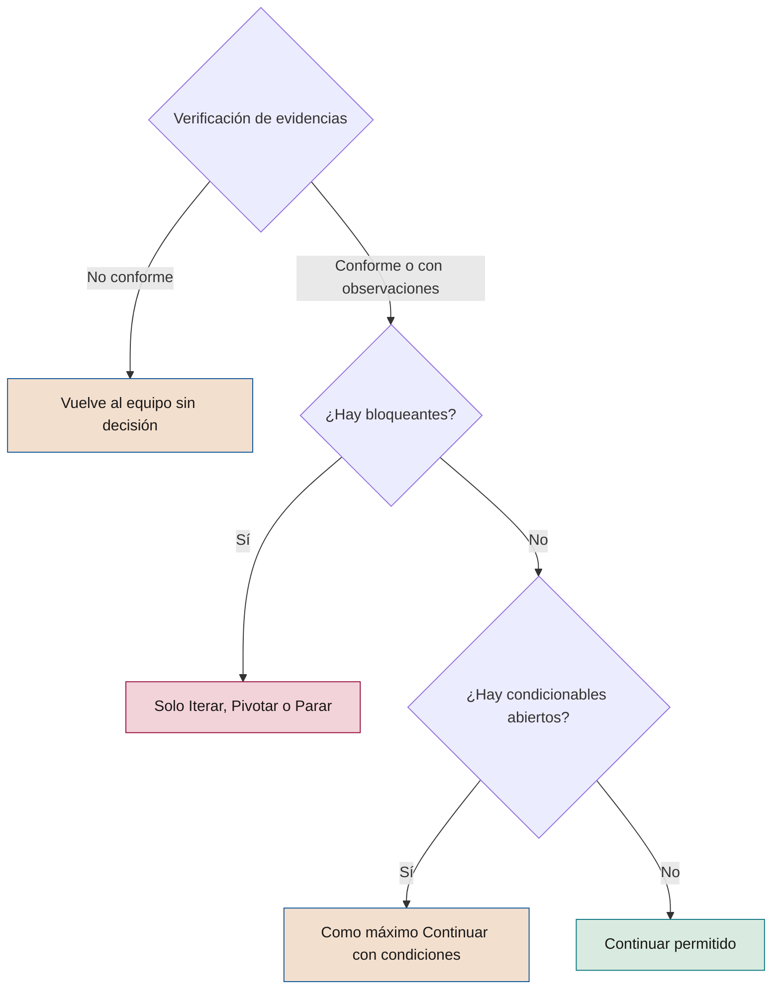

# Criterios de gate y de auditoría

**Qué debe cumplirse en cada puerta de decisión, cómo se verifica y cómo se audita**

| | |
|---|---|
| Documento | Documento 21 · Criterios de *gate* y de auditoría |
| Versión | 0.1 (borrador de trabajo) |
| Fecha | 16-09-2026 |
| Autor | Fernando García · SEACHAD |
| Estado | Borrador para revisión. Desarrolla 01 §7 y sustituye a los criterios de *gate* del material anterior. |

<!-- cifras: 8 | puertas de decisión ; 128 | criterios codificados ; 4 | firmas con veto en G5 ; 3 | resultados de auditoría -->

---

> **Aviso legal y exención de responsabilidad.** SEVEN-G es un marco metodológico de referencia que se ofrece «tal cual» y con fines exclusivamente informativos. No constituye asesoramiento jurídico, regulatorio, financiero ni profesional, ni garantiza el cumplimiento de ninguna norma. Las referencias a regulación general (como el Reglamento Europeo de IA, el RGPD, DORA o NIS2), a normas técnicas y a regulación específica de cada sector o jurisdicción pueden ser incompletas, no aplicar a un caso concreto o quedar desactualizadas por cambios normativos, interpretaciones o criterios de las autoridades posteriores a su fecha de consulta. **Cada organización que use SEVEN-G es la única responsable de identificar la normativa que le aplica, verificar su vigencia y certificar su propio cumplimiento regulatorio**, con el asesoramiento cualificado que corresponda. El autor y SEACHAD no asumen responsabilidad alguna por el uso que se haga de este contenido ni por las decisiones que se adopten con él. Los datos, cifras, compañías y casos de los ejemplos son ficticios o ilustrativos.

## 1. Objeto y alcance

Este documento fija los **criterios que deben cumplirse para superar cada puerta de decisión** del ciclo de vida de SEVEN-G (G0, G1, G2, G3, G4, G5, R6 y G7), las reglas para verificar las evidencias, el cálculo del grado de cumplimiento, la firma multinivel de puesta en producción y los **criterios con los que se audita** que las puertas se han aplicado correctamente.

Desarrolla la sección 7 del documento 01 (Metodología fundacional) y no puede contradecirla. Las listas de verificación del documento 22 convierten cada criterio de este documento en un control binario con **el mismo código**.

| Se aplica a | Cómo |
|---|---|
| Iniciativas de IA propias | Todos los criterios aplicables según intensidad, ambición y tecnología. |
| IA de terceros integrada en procesos | Todos los criterios; los marcados [TER] se añaden y los de diseño y construcción se leen como selección, integración, contrato y controles del proveedor. |
| Uso corporativo de IA de propósito general | Solo si cumple algún criterio Enterprise (01 §9.2); en otro caso se gobierna con inventario, política y controles técnicos. |
| Sistemas en producción anteriores a la adopción del marco | Revisión equivalente a G7 (01 §14) con los criterios de G7, completados con los criterios marcados ◆ de G4, G5 y R6 que resulten aplicables. |

Este documento no constituye asesoramiento jurídico. Las referencias regulatorias se han consultado en septiembre de 2026; las fechas de aplicación de algunas obligaciones del Reglamento Europeo de IA han sido objeto de propuestas de modificación, por lo que su vigencia debe verificarse en cada caso.

---

## 2. Cómo leer los criterios

### 2.1 Columnas de las tablas

| Columna | Contenido |
|---|---|
| **Código** | `G<n>.<nn>` para las puertas y `R6.<nn>` para la revisión de continuidad. Es el mismo código que usan el documento 22, el gestor de *gates* (T03) y el registro de decisión (P29). Un código no se reutiliza aunque el criterio se retire. |
| **Criterio** | Condición verificable. Las etiquetas iniciales delimitan su ámbito (sección 2.3). |
| **Evidencia** | Plantilla (P01–P31) o herramienta (T01–T22) donde debe encontrarse la prueba. |
| **Obligatorio** | Naturaleza del criterio (sección 2.2). |
| **Lite · Enterprise** | Si aplica en cada intensidad: **Sí** (completo), **Simpl.** (con plantilla simplificada), **Rec.** (recomendado en esa intensidad) o **—** (no aplica en esa intensidad). |
| **Optimizar / Aumentar / Transformar** | Cómo cambia el criterio según el nivel de ambición. "—" indica que no cambia. |

### 2.2 Obligatoriedad

| Valor | Significado | Efecto en la decisión |
|---|---|---|
| **Sí** | Obligatorio y **no condicionable**. | Debe estar en *Cumple* (o *No aplica* justificado) para **Continuar** o **Continuar con condiciones**. |
| **Sí ◆** | Obligatorio, no condicionable y además **control crítico de seguridad, cumplimiento legal o supervisión humana** (01 §7.3). | Igual que *Sí*. Nunca se admite como condición. En G5 Enterprise fundamenta el veto. Su ausencia en un sistema en producción es no conformidad mayor o crítica. |
| **Condicionable** | Obligatorio. Si no se cumple del todo, la carencia no es crítica y la evidencia existe, admite **Continuar con condiciones**. | La condición lleva plazo, responsable y forma de verificación, y se comprueba como tarde en el siguiente *gate*. |
| **Recomendado** | "Debería" (01 §1.3). | Puede omitirse con justificación registrada. No bloquea. Omitirlo sin justificación es una observación de auditoría. |

### 2.3 Etiquetas de ámbito

| Etiqueta | Aplica cuando | Si no aplica |
|---|---|---|
| **[GEN]** | La tecnología registrada es *IA generativa* o *Agente*. | *No aplica*, justificado con la etiqueta de tecnología del registro. |
| **[AG]** | El sistema ejecuta acciones o las prepara para validación humana (autonomía A1, A2 o A3). La sección 8.2 indica qué exige cada nivel. | *No aplica*, justificado con el nivel de autonomía aprobado (A0). |
| **[TER]** | Interviene un proveedor de IA: modelo, plataforma o software con funciones de IA. | *No aplica*, justificado con el campo de proveedores del registro. |
| **Transformar / Escalar / Retirar / Iterar** | Solo para ese nivel de ambición o para ese resultado propuesto. | *No aplica* sin más justificación. |

### 2.4 Estados de cada criterio

Cada criterio se registra en T03 con uno de los cuatro estados del documento 03 §3.4: **Cumple** · **No cumple** · **No aplica** · **Pendiente**. *No aplica* exige justificación, que el verificador valida; un *No aplica* injustificado se trata como *No cumple*.

---

## 3. Reglas comunes a todas las puertas

### 3.1 Validación dual

Un criterio solo está en *Cumple* si se dan a la vez las dos condiciones de 01 §7.2, y el verificador las anota por separado:

| Dimensión | Pregunta | Ejemplo de fallo |
|---|---|---|
| **R · Resultado** | ¿Los datos, pruebas o resultados reales demuestran lo que exige el criterio? | El lienzo de hipótesis está completo, pero la línea base no se ha medido. |
| **D · Documentación** | ¿La evidencia existe, es válida (sección 4) y está verificada? | El piloto alcanzó el umbral, pero no hay informe fechado ni versión de los resultados. |

Resultados sin documentación o documentación sin resultados dejan el criterio en *No cumple* o *Pendiente*.

### 3.2 Reglas de decisión

Se aplican las siete reglas de 01 §7.4, con estas precisiones operativas:

1. **Separación de funciones.** El autor de una evidencia no la verifica ni decide sobre ella. El verificador no decide. Si el decisor aportó evidencias, debe abstenerse y decide su sustituto previsto en el modelo de gobierno (documento 30).
2. **Sin evidencia no hay decisión.** Si la verificación concluye *No conforme* (sección 10.2), la solicitud vuelve al equipo y no llega al órgano decisor.
3. **Anterioridad.** Toda evidencia debe tener fecha anterior a la solicitud del *gate*. Las correcciones pedidas por el verificador generan una nueva versión antes de la decisión.
4. **Condiciones.** Solo sobre criterios *Condicionable*. Cada condición tiene plazo, responsable, criterio al que se vincula y forma de verificación. Una condición vencida convierte el resultado en **Iterar**.
5. **Iteraciones.** Tras dos iteraciones en el mismo *gate*, la tercera decisión la toma el órgano superior definido en el documento 30.
6. **Criterios de parada.** No se relajan sin aprobación del órgano que autorizó la iniciativa, registrada antes de la decisión afectada.
7. **Registro.** Toda decisión se documenta en P29 y genera los eventos correspondientes en T01.

### 3.3 Cumplir los criterios es necesario, no suficiente

Que todos los criterios estén en *Cumple* permite **Continuar**, pero no obliga a ello. El órgano competente puede decidir **Iterar**, **Pivotar** o **Parar** con motivo registrado (por ejemplo, un cambio de prioridad estratégica). A la inversa, ningún órgano puede registrar **Continuar** con un criterio *Sí* o *Sí ◆* en *No cumple* o *Pendiente*.

### 3.4 Puertas agrupadas en Lite

En la intensidad Lite, G0, G1 y G2 pueden resolverse en una sola sesión, y G4 y G5 también (01 §7.5). La agrupación no fusiona criterios: cada puerta conserva su lista, su estado por criterio y su apartado en P29, y cada evidencia se verifica.

### 3.5 Decisiones del consejo en Transformar

Las iniciativas de Transformar son siempre Enterprise (01 §9.2) y requieren aprobación expresa del consejo o de su comisión delegada en **G2** (autorización de la apuesta, criterio G2.12) y en **G7** cuando se decide escalar (criterio G7.09). La aprobación se registra en P29 con referencia al acta o al registro de recomendaciones y decisiones (documento 62).

---

## 4. Evidencia válida

### 4.1 Reglas

Una evidencia es válida si supera las catorce reglas siguientes. El documento 22 las convierte en la lista transversal LV-EV, con los mismos códigos.

| Código | Regla | Qué se comprueba | Si no se cumple |
|---|---|---|---|
| **EV.01** | Identificación | Código de iniciativa, plantilla (P) o registro de origen y título. | Pendiente |
| **EV.02** | Autor | Persona y rol que la elabora. | Pendiente |
| **EV.03** | Fecha | Fecha de elaboración y de última modificación. | Pendiente |
| **EV.04** | Versión | Número de versión; la versión verificada es la enlazada en P29. Un cambio posterior exige nueva verificación. | Pendiente |
| **EV.05** | Anterioridad | Fecha anterior a la solicitud del *gate*, y actividad descrita anterior a la decisión. Documentación elaborada a posteriori para justificar un avance ya producido invalida el *gate* (01 §7.4). | No válida · no conformidad mayor |
| **EV.06** | Integridad y trazabilidad | Guardada en el repositorio documental con historial de versiones; enlace accesible al verificador y al auditor desde T01 o T03. | Pendiente |
| **EV.07** | Pertinencia | Se refiere a esta iniciativa, a su alcance y a la versión del sistema. La reutilización de evidencias de otra iniciativa se justifica. | No válida |
| **EV.08** | Datos reales | Cuando el criterio exige resultados: fuente, periodo y método reproducibles; importes con fórmula y estado (validado, declarado o estimado). | No válida |
| **EV.09** | Aprobación y separación | Aprobada por quien corresponde; autor, verificador y decisor son personas distintas. | No válida · no conformidad mayor si hay autoaprobación |
| **EV.10** | Completitud | Campos obligatorios de la plantilla rellenos; en Lite, los no marcados *(Enterprise)*. Los datos ausentes figuran como "sin dato", no como cero. | Pendiente |
| **EV.11** | Coherencia | Las cifras y afirmaciones coinciden entre evidencias (por ejemplo, valor en P08, P10 y P28; riesgos en P12 y controles en P18). | No cumple hasta aclarar |
| **EV.12** | Protección de la información | No contiene datos personales innecesarios; acceso restringido según su clasificación. | Observación o no conformidad según el caso |
| **EV.13** | Evidencias generadas por sistemas | Exportación fechada o enlace con marca temporal a registros, paneles o resultados de pruebas. Una captura sin fecha ni origen no es válida. | No válida |
| **EV.14** | Evidencias de terceros | Emisor identificable, vigencia y alcance que cubre el servicio contratado (informes, certificaciones, documentación del proveedor). | No válida |

### 4.2 Evidencia aceptada con carencias

El verificador puede aceptar una evidencia con carencias menores (reglas EV.01–EV.04, EV.06 o EV.10) solo si no afectan a un criterio *Sí* o *Sí ◆* y se corrigen antes de la decisión. Las reglas EV.05 y EV.09 no admiten excepción.

---

## 5. Grado de cumplimiento y regla de decisión

### 5.1 Cálculo

| Indicador | Fórmula | Uso |
|---|---|---|
| **Criterios aplicables** | Total de criterios de la puerta − criterios en *No aplica* justificado. | Base del cálculo. |
| **Grado de cumplimiento** | Criterios en *Cumple* ÷ criterios aplicables × 100. | Indicador del registro y de las métricas del embudo (03 §3.5). |
| **Bloqueantes** | Criterios *Sí* o *Sí ◆* en *No cumple* o *Pendiente*. | Si es mayor que cero, no cabe Continuar ni Continuar con condiciones. |
| **Condicionables abiertos** | Criterios *Condicionable* en *No cumple* o *Pendiente*. | Si es mayor que cero y no hay bloqueantes, cabe como máximo Continuar con condiciones. |
| **Recomendados omitidos** | Criterios *Recomendado* no cumplidos, con o sin justificación. | Sin justificación, generan observación. |

El grado de cumplimiento es **informativo**: ningún umbral porcentual permite superar una puerta con bloqueantes.

*Ejemplo ilustrativo (datos ficticios):* G3 Enterprise sin proveedor ni IA generativa: 22 criterios, 6 no aplican, 16 aplicables. Cumplen 14; G3.14 está *Pendiente* y G3.10 en *No cumple*, ambos *Condicionable*. Grado: 87,5 %. Sin bloqueantes: como máximo, Continuar con condiciones verificables en G4.

### 5.2 Del estado de los criterios al resultado

<!-- grafico: Del estado de los criterios al resultado posible | El órgano decide dentro de lo que permiten los criterios -->

### 5.3 Resultados admitidos por puerta

| Puerta | Resultados admitidos | Resultados obligados |
|---|---|---|
| G0 | Continuar · Continuar con condiciones · Iterar · Parar | — |
| G1, G2, G3 | Continuar · Continuar con condiciones · Iterar · Pivotar · Parar | G3: **Parar** si hay práctica prohibida (G3.08). |
| G4, G5 | Continuar · Continuar con condiciones · Iterar · Parar | G5: no se continúa con un veto vigente (sección 9). |
| R6 | Continuar la operación · Continuar con condiciones · Adelantar G7 | **Adelantar G7** si concurre alguna desviación de la sección 6.7. |
| G7 | Escalar · Iterar · Retirar | — |

En R6, la suspensión inmediata de un sistema no es un resultado de la revisión: se activa en cualquier momento por el proceso de incidentes o de no conformidades (documento 37). En G7, mantener el sistema en operación sin cambios se registra como **Iterar** con vuelta a la fase 6 y fecha de la siguiente R6.

---

## 6. Criterios por puerta

Cada puerta incluye su propósito, quién verifica y decide (01 §7.5), las evidencias que se examinan y la tabla de criterios. La columna de ambición desarrolla 01 §7.6; la sección 7 la resume.

### 6.1 G0 · Autorización

**Propósito.** Autorizar formalmente la iniciativa y fijar el marco en el que se desarrollará. Sin G0 aprobado la iniciativa no está autorizada: no puede consumir presupuesto ni acceder a datos de producción.

| | Lite | Enterprise |
|---|---|---|
| **Verifica** | Oficina de IA | Auditor de IA |
| **Decide** | Patrocinador | Comité de IA |

**Evidencias:** P01 · P02 · P03 · P04 · P05 · registro en T01. **Decisión:** P29.

| Código | Criterio | Evidencia | Obligatorio | Lite | Enterprise | Optimizar / Aumentar / Transformar (si difiere) |
|---|---|---|---|---|---|---|
| G0.01 | La carta define el problema u objetivo de negocio, el alcance, el presupuesto de las fases 1 a 3 y el compromiso firmado del patrocinador. | P01 | Sí | Simpl. | Sí | Transformar: patrocinador de alta dirección. |
| G0.02 | La iniciativa encaja con la tesis de IA y la cartera aprobadas en C2 y C3, con referencia a la esfera y a la prioridad asignada. | P01 | Condicionable | Sí | Sí | Transformar: figura en la cartera con previsión de decisión del consejo en G2. |
| G0.03 | La declaración de contexto recoge las restricciones regulatorias (incluida la sectorial), éticas, de datos, presupuestarias y de plazo. | P02 | Condicionable | Simpl. | Sí | — |
| G0.04 | El cribado preliminar descarta que la iniciativa persiga una práctica prohibida por la regulación aplicable. | P02 | Sí ◆ | Sí | Sí | — |
| G0.05 | Los roles están asignados con nombre: en Lite, al menos patrocinador, producto, técnico y riesgos (operación, como tarde, en G4); en Enterprise, los seis roles de 01 §8.1. | P03 | Sí | Sí | Sí | — |
| G0.06 | La asignación respeta las incompatibilidades de 01 §8.2 y el auditor de IA no depende jerárquicamente del patrocinador. | P03 | Sí | Sí | Sí | — |
| G0.07 | La intensidad está determinada con los ocho criterios Enterprise de 01 §9.2, con respuesta justificada a cada uno. | P04 · T04 | Sí | Sí | Sí | Transformar: siempre Enterprise. |
| G0.08 | La iniciativa está dada de alta en el registro con código IA-AAAA-NNN y los sistemas previstos figuran en el inventario con tecnología, exposición y proveedor. | P05 · T01 · T02 | Sí | Sí | Sí | — |
| G0.09 | No se ha consumido presupuesto de construcción ni se ha accedido a datos de producción antes de la decisión. | P01 · T01 | Sí | Sí | Sí | — |
| G0.10 | Si se prevé tratar datos personales, la función de protección de datos ha sido informada. | P02 | Condicionable | Rec. | Sí | — |

**Reglas específicas.** Un incumplimiento de G0.09 detectado después de G0 es no conformidad mayor y, si hubo acceso a datos personales de producción sin base, se evalúa como crítica. G0.04 en *No cumple* conduce a **Parar**.

### 6.2 G1 · Oportunidad

**Propósito.** Confirmar que existe una oportunidad de negocio que requiere IA y que su valor potencial justifica formular una hipótesis.

| | Lite | Enterprise |
|---|---|---|
| **Verifica** | Oficina de IA | Auditor de IA |
| **Decide** | Patrocinador | Patrocinador, informando al comité |

**Evidencias:** P06 · P07 · P31 · P04 (si se revisa). **Decisión:** P29.

| Código | Criterio | Evidencia | Obligatorio | Lite | Enterprise | Optimizar / Aumentar / Transformar (si difiere) |
|---|---|---|---|---|---|---|
| G1.01 | La oportunidad nace de una necesidad de negocio concreta: proceso o decisión afectada, área responsable y problema descrito. | P06 | Sí | Sí | Sí | — |
| G1.02 | La ficha de caso de uso explica qué es y para qué se usa en lenguaje comprensible para un no especialista. | P31 | Condicionable | Simpl. | Sí | — |
| G1.03 | Se han analizado alternativas sin IA y se justifica qué aporta la IA que esas alternativas no aportan. | P06 | Sí | Sí | Sí | — |
| G1.04 | Las notas de filtrado registran las oportunidades descartadas y su motivo. | P06 | Condicionable | Simpl. | Sí | — |
| G1.05 | El valor potencial está estimado en orden de magnitud, con supuestos explícitos y estado "estimado". | P06 | Condicionable | Sí | Sí | — |
| G1.06 | La esfera y el nivel de ambición están propuestos con las cinco preguntas del clasificador. | P07 · T05 | Sí | Sí | Sí | Transformar: la propuesta se comunica al comité de IA antes de iniciar la fase 2. |
| G1.07 | El cribado de la oportunidad concreta descarta prácticas prohibidas, y la intensidad se ha revisado si han aparecido decisiones sobre personas, datos especialmente protegidos o exposición directa. | P07 · P04 | Sí ◆ | Sí | Sí | — |
| G1.08 | Se ha comprobado de forma preliminar que los datos necesarios existen, quién es su propietario y que su uso es plausiblemente lícito. | P06 | Condicionable | Sí | Sí | — |
| G1.09 | [TER] Si se prevé comprar o aliarse, se identifica la opción de proveedor y un nivel de exigencia preliminar (N1–N3). | P06 | Condicionable | Rec. | Sí | — |
| G1.10 | Se identifican los roles y equipos afectados para anticipar el impacto en las personas. | P06 | Condicionable | Sí | Sí | Optimizar: recomendado. |

**Reglas específicas.** **Pivotar** en G1 lleva a formular una hipótesis distinta en la fase 2 conservando el contexto aprobado en G0.

### 6.3 G2 · Hipótesis

**Propósito.** Aprobar una hipótesis de valor medible y falsable, con línea base, método de atribución y criterios de parada definidos antes de invertir.

| | Lite | Enterprise |
|---|---|---|
| **Verifica** | Oficina de IA | Auditor de IA |
| **Decide** | Patrocinador | Comité de IA; además, el consejo en Transformar |

**Evidencias:** P08 · P09 · P07 · P20 (objetivo de adopción) · P29 (aprobación del consejo). **Herramienta:** T11.

| Código | Criterio | Evidencia | Obligatorio | Lite | Enterprise | Optimizar / Aumentar / Transformar (si difiere) |
|---|---|---|---|---|---|---|
| G2.01 | La hipótesis es falsable: indica qué cambia, en qué métrica, cuánto, en qué plazo y qué resultado la refutaría. | P08 · T11 | Sí | Sí | Sí | Transformar: admite mayor incertidumbre si se cumple G2.11. |
| G2.02 | La métrica principal y las secundarias tienen definición, fórmula, fuente de datos y responsable de medición. | P08 | Sí | Simpl. | Sí | — |
| G2.03 | La línea base está medida con datos reales (periodo, fuente y método); si es estimada, se justifica y la aprueba el decisor. | P09 | Condicionable | Sí | Sí | Optimizar: coste, tiempo o errores. Aumentar: rendimiento y coste. Transformar: situación de partida del mercado o del cliente, cuando exista. |
| G2.04 | El objetivo y el umbral de éxito son explícitos y cuantificados. | P08 | Sí | Sí | Sí | — |
| G2.05 | El método de atribución está elegido y justificado; en Enterprise, grupo de control o motivo por el que no es posible. | P08 | Condicionable | Sí | Sí | — |
| G2.06 | El valor esperado se expresa en dinero con fórmula (unidades × valor unitario), es incremental, separa eficiencias, retorno y coste recurrente, y declara el reparto si otro caso comparte el resultado. | P08 · T11 | Sí | Sí | Sí | Optimizar: ahorro esperado con fórmula. Aumentar: efecto económico del rendimiento y del coste. Transformar: hipótesis de retorno por etapas. |
| G2.07 | La capacidad liberada se informa separada del ahorro, con el modo previsto de materializarla o reasignarla. | P08 | Condicionable | Sí | Sí | — |
| G2.08 | Los criterios de parada están definidos antes de invertir, con umbral y fecha o hito de evaluación. | P08 | Sí | Sí | Sí | Transformar: criterios de parada por etapa. |
| G2.09 | El nivel de ambición está confirmado con evidencia y se explica cualquier cambio respecto a G1. | P07 · T05 | Sí | Sí | Sí | — |
| G2.10 | Existe objetivo de adopción: usuarios, uso y frecuencia esperados. | P08 · P20 | Condicionable | Sí | Sí | Optimizar: recomendado. |
| G2.11 | Transformar: la hipótesis incluye hitos de aprendizaje, límite de inversión por etapa y criterios de parada por etapa. | P08 | Sí | — | Sí | Solo Transformar. |
| G2.12 | Transformar: el consejo o su comisión delegada ha aprobado expresamente la apuesta y consta en el registro. | P29 | Sí | — | Sí | Solo Transformar. |
| G2.13 | La inversión estimada hasta G5 y el neto adicional por euro preliminar están calculados. | P08 · T11 | Condicionable | Simpl. | Sí | Transformar: por etapa. |

**Reglas específicas.** Si la ambición confirmada pasa a Transformar, la intensidad pasa a Enterprise y se aplican G2.11 y G2.12 antes de decidir. Si una iniciativa aprobada como Transformar se reclasifica a un nivel inferior, se informa al consejo.

### 6.4 G3 · Viabilidad

**Propósito.** Decidir si la iniciativa es viable técnica, económica, regulatoria y organizativamente con un riesgo aceptable. Es la **principal puerta de parada** del ciclo.

| | Lite | Enterprise |
|---|---|---|
| **Verifica** | Oficina de IA | Auditor de IA |
| **Decide** | Patrocinador con conformidad de riesgos | Comité de IA |

**Evidencias:** P10 · P11 · P12 · P13 · P14 (si hay proveedor) · P04 (revisión) · P08 actualizado. **Herramientas:** T06 · T07 · T09 · T13.

| Código | Criterio | Evidencia | Obligatorio | Lite | Enterprise | Optimizar / Aumentar / Transformar (si difiere) |
|---|---|---|---|---|---|---|
| G3.01 | La viabilidad técnica está demostrada con datos reales de la compañía (prueba técnica o análisis sobre muestra representativa), no solo con supuestos. | P10 | Sí | Sí | Sí | Transformar: viabilidad de la primera etapa. |
| G3.02 | Los datos están disponibles, con calidad evaluada (completitud, representatividad, actualidad y sesgos conocidos) y propietario identificado. | P10 | Condicionable | Simpl. | Sí | — |
| G3.03 | La base legal del tratamiento de datos personales y la minimización están confirmadas por la función de protección de datos. | P11 | Sí ◆ | Sí | Sí | — |
| G3.04 | Los costes completos están estimados por categoría: construcción, recurrentes (licencias, consumo de modelos, cómputo, operación) y adopción. | P10 · T13 | Sí | Simpl. | Sí | — |
| G3.05 | El neto esperado es coherente con el apetito de riesgo y el horizonte de retorno fijados en C2. | P10 · P08 | Sí | Sí | Sí | Optimizar: neto anual esperado positivo dentro del horizonte. Aumentar: además, viabilidad de la adopción y del cambio de rol. Transformar: viabilidad de la primera etapa, criterios de parada por etapa y valor de opción documentado. |
| G3.06 | Los criterios de parada aprobados en G2 siguen vigentes y no se han relajado sin aprobación del órgano que autorizó la iniciativa. | P08 · P29 | Sí | Sí | Sí | — |
| G3.07 | La clasificación regulatoria está hecha con criterio jurídico cualificado, fechada y firmada, e indica el rol de la compañía (proveedor o responsable del despliegue). | P11 · T07 | Sí ◆ | Sí | Sí | — |
| G3.08 | No hay ninguna práctica prohibida. Si la hay, el único resultado posible es Parar. | P11 | Sí ◆ | Sí | Sí | — |
| G3.09 | Está determinado qué evaluaciones de impacto proceden (protección de datos, derechos fundamentales, sectoriales) y las exigibles antes del tratamiento están realizadas o iniciadas con cierre previsto antes de G4. | P11 | Sí ◆ | Sí | Sí | — |
| G3.10 | Las obligaciones regulatorias aplicables están vinculadas a fase, rol y evidencia. | P11 | Condicionable | Simpl. | Sí | — |
| G3.11 | Los riesgos están identificados en las categorías aplicables y valorados con la escala del documento 33 (probabilidad × impacto, inherente y residual). | P12 · T06 | Sí | Simpl. | Sí | — |
| G3.12 | Ningún riesgo residual Crítico carece de aprobación expresa del consejo o de su comisión delegada dentro del apetito de riesgo; los Altos están aceptados por el comité de IA y los Medios por el patrocinador con conformidad de riesgos. | P12 · P29 | Sí ◆ | Sí | Sí | — |
| G3.13 | Cada riesgo residual Alto o Crítico tiene plan de mitigación y contingencia con control, responsable y plazo. | P13 | Sí | Sí | Sí | — |
| G3.14 | Los riesgos Medios tienen respuesta decidida (evitar, mitigar, transferir o aceptar) y responsable. | P13 | Condicionable | Simpl. | Sí | — |
| G3.15 | La intensidad se ha revisado con la información de la fase 3. | P04 · T04 | Sí | Sí | Sí | — |
| G3.16 | Se ha valorado el impacto en las personas: roles y tareas afectados, capacidades necesarias y, cuando proceda, información o consulta a la representación de los trabajadores. | P10 · P20 | Condicionable | Simpl. | Sí | Optimizar: impacto en tareas. Aumentar: viabilidad del cambio de rol. Transformar: impacto en el modelo operativo. |
| G3.17 | [GEN] Están valorados los riesgos tipo RT-GEN y RT-SEG: inyección de instrucciones directa e indirecta, fuga de información, contenido erróneo o inventado, permisos excesivos y acciones no autorizadas. | P12 | Sí ◆ | Sí | Sí | — |
| G3.18 | [GEN] El nivel de autonomía objetivo (A0–A3) está propuesto y justificado; si es A2 o A3 con efecto sobre terceros, dinero, datos personales o sistemas de producción, la intensidad es Enterprise. | P04 · P12 | Sí ◆ | Sí | Sí | — |
| G3.19 | [GEN] Está definido el enfoque de evaluación: conjuntos de prueba representativos, métricas de calidad y de seguridad y umbrales de aceptación. | P10 | Condicionable | Simpl. | Sí | — |
| G3.20 | [TER] Cada proveedor está evaluado al nivel de exigencia que le corresponde (N1–N3): seguridad, tratamiento y ubicación de los datos, uso de los datos para entrenar, propiedad intelectual, continuidad, dependencia y estrategia de salida. | P14 · T09 | Sí | Simpl. | Sí | — |
| G3.21 | [TER] Las condiciones contractuales mínimas están fijadas como requisito de contratación: confidencialidad, prohibición de usar los datos para otros fines, notificación de incidentes, derecho de auditoría o informes equivalentes (N2–N3) y devolución o borrado de datos al terminar. | P14 | Sí ◆ | Sí | Sí | — |
| G3.22 | [TER] El proveedor aporta, o se compromete a aportar, la documentación que la regulación le exige y que la compañía necesita para cumplir sus propias obligaciones. | P14 · P11 | Condicionable | Rec. | Sí | — |

**Reglas específicas.** Las prácticas prohibidas no pasan de esta fase en ningún caso (01 §6.5). Un riesgo residual Crítico sin la aprobación de G3.12 bloquea G3. **Pivotar** es admisible cuando la hipótesis no se sostiene pero existe una alternativa razonable.

### 6.5 G4 · Diseño

**Propósito.** Aprobar un diseño controlable, supervisable y reversible, que cubra los controles exigidos por la clasificación de riesgo y en el que cada riesgo de la fase 3 tenga control diseñado.

| | Lite | Enterprise |
|---|---|---|
| **Verifica** | Oficina de IA | Auditor de IA |
| **Decide** | Patrocinador con conformidad de riesgos | Comité de IA |

**Evidencias:** P15 · P16 · P17 · P18 · P19 · P20 · P22 (plan de pruebas y piloto) · P11 y P14 actualizados. **Herramientas:** T10 · T20.

| Código | Criterio | Evidencia | Obligatorio | Lite | Enterprise | Optimizar / Aumentar / Transformar (si difiere) |
|---|---|---|---|---|---|---|
| G4.01 | El registro de arquitectura describe componentes, integraciones, entornos, dependencias de terceros y decisiones con sus alternativas. | P15 | Condicionable | Simpl. | Sí | — |
| G4.02 | La arquitectura garantiza trazabilidad: registro automático de entradas, salidas, versiones y decisiones relevantes, con periodo de conservación definido. | P15 | Sí ◆ | Simpl. | Sí | — |
| G4.03 | El linaje documenta fuentes y transformaciones de datos, versiones de modelos, datos de entrenamiento o ajuste y modelos de base de terceros. | P16 | Condicionable | Simpl. | Sí | — |
| G4.04 | El diseño de supervisión humana fija qué decide el sistema, qué valida una persona y qué no se delega nunca, y designa quién interviene, con qué autoridad y con qué medios. | P17 | Sí ◆ | Sí | Sí | — |
| G4.05 | Las obligaciones de transparencia están diseñadas: aviso de interacción con IA o de contenido generado cuando proceda, e información y vía de revisión humana en decisiones automatizadas que afecten a personas. | P17 | Sí ◆ | Sí | Sí | — |
| G4.06 | Cada riesgo Medio o superior de la fase 3 tiene un control diseñado y trazable al registro de riesgos. | P12 · P18 | Sí | Sí | Sí | — |
| G4.07 | El diseño de seguridad cubre identidad y accesos, cifrado, segregación de entornos, gestión de secretos y amenazas específicas de IA (envenenamiento de datos, extracción de modelos, evasión). | P18 | Sí ◆ | Simpl. | Sí | — |
| G4.08 | La monitorización está definida (rendimiento, degradación, sesgo, coste, seguridad y uso) con umbrales, alertas y responsable de operación asignado. | P15 · P03 | Condicionable | Simpl. | Sí | — |
| G4.09 | Existe mecanismo de parada (desactivación o paso a modo manual) con responsable y tiempo objetivo de activación. | P19 | Sí ◆ | Sí | Sí | — |
| G4.10 | El plan de reversión define criterios de activación, procedimiento, responsable, alternativa operativa y tratamiento de los datos, y prevé su prueba en la fase 5. | P19 | Sí | Simpl. | Sí | — |
| G4.11 | Existe plan de adopción con formación, comunicación, apoyo y medición del uso. | P20 · T20 | Condicionable | Simpl. | Sí | Optimizar: cómo se materializará la capacidad liberada. Aumentar: cambio de rol y reasignación de capacidad. Transformar: cambio del modelo operativo de la primera etapa. |
| G4.12 | El plan de pruebas (funcionales, rendimiento, sesgo, robustez y seguridad) y el diseño del piloto con el método de atribución aprobado tienen criterios de aceptación. | P22 | Condicionable | Simpl. | Sí | Transformar: el piloto mide la evidencia de mercado o de cliente prevista. |
| G4.13 | Las evaluaciones de impacto exigibles están completadas y sus medidas incorporadas al diseño. | P11 | Sí ◆ | Sí | Sí | — |
| G4.14 | Si el sistema es de alto riesgo, están planificadas con responsable las obligaciones que correspondan al rol de la compañía (gestión de riesgos, gobernanza de datos, documentación técnica, registros, instrucciones de uso, supervisión humana, precisión y robustez). | P11 · P15 | Sí ◆ | — | Sí | — |
| G4.15 | [AG] El agente tiene identidad propia, distinta de la de cualquier persona, con credenciales gestionadas, rotadas y revocables. | P18 · T10 | Sí ◆ | Sí | Sí | — |
| G4.16 | [AG] Los permisos son mínimos y los límites de actuación explícitos: herramientas, operaciones, sistemas, importes, destinatarios y volúmenes permitidos. | P18 · T10 | Sí ◆ | Sí | Sí | — |
| G4.17 | [AG] Existe control de intención: cada acción queda vinculada a la instrucción y a la finalidad que la originan y, si es sensible, se contrasta con la finalidad autorizada antes de ejecutarse. | P18 · T10 | Sí ◆ | Sí | Sí | — |
| G4.18 | [AG] Existe interruptor de parada que detiene de inmediato al agente y revoca sus credenciales, con responsable y prueba prevista. | P18 · P19 | Sí ◆ | Sí | Sí | — |
| G4.19 | [AG] Las acciones sensibles o irreversibles requieren validación humana previa según el nivel de autonomía aprobado. | P17 | Sí ◆ | Sí | Sí | — |
| G4.20 | [GEN] Hay defensas frente a inyección de instrucciones y fuga de información: separación entre instrucciones y datos, contenido externo tratado como no confiable, filtrado de entradas y salidas y restricción de herramientas. | P18 · T10 | Sí ◆ | Sí | Sí | — |
| G4.21 | [GEN] El conjunto de evaluación y sus umbrales (calidad, fundamentación de las respuestas, contenido dañino y seguridad) están aprobados antes de construir. | P22 | Condicionable | Simpl. | Sí | — |
| G4.22 | [TER] Las cláusulas exigidas en G3.21 están incorporadas al contrato o al borrador en negociación, y la integración con el proveedor está documentada. | P14 · P15 | Condicionable | Sí | Sí | — |

**Reglas específicas.** En Lite, G4 y G5 pueden resolverse en la misma sesión si cada criterio se evalúa y registra por separado. La clasificación de alto riesgo implica intensidad Enterprise, por eso G4.14 no tiene columna Lite.

### 6.6 G5 · Puesta en producción

**Propósito.** Autorizar la puesta en producción cuando la solución funciona, aporta valor en condiciones reales, los controles críticos operan y la operación está preparada.

| | Lite | Enterprise |
|---|---|---|
| **Verifica** | Oficina de IA | Auditor de IA |
| **Decide** | Patrocinador con conformidad de riesgos | Comité de IA tras firma multinivel |

**Evidencias:** P21 · P22 · P19 (prueba) · P12 actualizado · P23 · P24 · P25 · P26 · P28 · P14 (contrato). **Herramientas:** T03 · T08 · T10 · T11 · T12.

| Código | Criterio | Evidencia | Obligatorio | Lite | Enterprise | Optimizar / Aumentar / Transformar (si difiere) |
|---|---|---|---|---|---|---|
| G5.01 | El informe de entrega describe lo construido o integrado y las desviaciones respecto al diseño aprobado en G4, con su aprobación. | P21 | Condicionable | Simpl. | Sí | — |
| G5.02 | Las pruebas funcionales y de rendimiento cumplen los criterios de aceptación. | P22 | Sí | Sí | Sí | — |
| G5.03 | Si el sistema afecta a personas, las pruebas de sesgo y no discriminación están hechas y los resultados están dentro de los umbrales. | P22 | Sí ◆ | Sí | Sí | — |
| G5.04 | Las pruebas de robustez y seguridad están hechas y no quedan vulnerabilidades críticas o altas abiertas. | P22 | Sí ◆ | Simpl. | Sí | — |
| G5.05 | [GEN] Las evaluaciones sobre el conjunto aprobado alcanzan los umbrales y se han superado pruebas de inyección de instrucciones directa e indirecta y de fuga de información. | P22 · T10 | Sí ◆ | Sí | Sí | — |
| G5.06 | [AG] Las pruebas demuestran que los límites de actuación y el control de intención bloquean acciones no autorizadas y que el interruptor de parada detiene al agente y revoca sus credenciales. | P22 · P19 · T10 | Sí ◆ | Sí | Sí | — |
| G5.07 | [AG] El nivel de autonomía autorizado para producción es el probado; cualquier aumento posterior exige volver a G4 y G5. | P18 · P23 | Sí ◆ | Sí | Sí | — |
| G5.08 | El piloto se ha ejecutado con el método de atribución aprobado y sus resultados alcanzan el umbral de éxito o lo hacen con condiciones aceptadas. | P22 · T11 | Condicionable | Sí | Sí | Optimizar: eficiencia validada frente a la línea base. Aumentar: adopción real y mejora de rendimiento medidas. Transformar: evidencia de mercado o de cliente (uso, conversión, ingresos iniciales o cambio operativo verificado). |
| G5.09 | No se ha alcanzado ningún criterio de parada o, si se ha alcanzado, el órgano que autorizó la iniciativa ha decidido expresamente continuar. | P22 · P29 | Sí | Sí | Sí | — |
| G5.10 | Hay plan para materializar o reasignar la capacidad liberada, con responsable y fecha. | P20 | Condicionable | Sí | Sí | Optimizar: materializar. Aumentar: reasignar. Transformar: solo si hay capacidad liberada. |
| G5.11 | El plan de reversión se ha probado y el tiempo real de reversión cumple el objetivo. | P19 | Sí | Sí | Sí | — |
| G5.12 | El registro de riesgos está actualizado con los resultados de las pruebas y las aceptaciones del riesgo residual constan al nivel que corresponde (G3.12). | P12 · T06 | Sí ◆ | Sí | Sí | — |
| G5.13 | Los controles críticos de seguridad, cumplimiento y supervisión humana están activos y verificados en el entorno de producción, no solo diseñados. | P22 · P25 | Sí ◆ | Sí | Sí | — |
| G5.14 | Las personas que ejercen la supervisión humana están designadas, formadas y disponen de autoridad y medios para intervenir. | P17 · P20 | Sí ◆ | Sí | Sí | — |
| G5.15 | Las obligaciones regulatorias previas a la puesta en servicio están cumplidas según el rol de la compañía (por ejemplo, en alto riesgo: evaluación de conformidad, registro e instrucciones de uso cuando correspondan; transparencia en todos los casos aplicables). | P11 | Sí ◆ | Sí | Sí | — |
| G5.16 | La monitorización y las alertas están configuradas y probadas. | P25 | Sí | Simpl. | Sí | — |
| G5.17 | El plan de respuesta a incidentes define severidades S1–S4, escalado y notificaciones regulatorias aplicables (incidente grave de IA, protección de datos, DORA o NIS2) con sus plazos. | P26 · T08 | Sí ◆ | Simpl. | Sí | — |
| G5.18 | El manual de operación está disponible y aceptado por el responsable de operación. | P24 | Condicionable | Simpl. | Sí | — |
| G5.19 | Los usuarios están formados y hay evidencia de alfabetización en IA del personal que usa o supervisa el sistema. | P20 | Condicionable | Sí | Sí | — |
| G5.20 | [TER] El contrato está firmado con las cláusulas exigidas y el proveedor figura en el registro de proveedores. | P14 · T09 | Sí ◆ | Sí | Sí | — |
| G5.21 | El seguimiento de valor está configurado (periodicidad, fuente y responsable de validación) y los resultados del piloto constan con su estado (validado, declarado o estimado). | P28 · T12 | Condicionable | Simpl. | Sí | — |
| G5.22 | Las condiciones de *gates* anteriores están cerradas o, si no afectan a controles críticos, dentro de plazo. | P29 · T03 | Sí | Sí | Sí | — |
| G5.23 | La puesta en producción está firmada: en Lite, con conformidad de riesgos; en Enterprise, con firma multinivel sin ningún veto vigente (sección 9). | P23 · T03 | Sí ◆ | Sí | Sí | — |

**Reglas específicas.** Un sistema en producción sin G5 aprobado es no conformidad crítica (01 §12). Las firmas de P23 se refieren a una versión concreta del sistema: un cambio significativo entre la firma y la puesta en producción obliga a firmar de nuevo.

### 6.7 R6 · Revisión de continuidad

**Propósito.** Comprobar periódicamente que el sistema sigue funcionando, aportando valor y bajo control, y adelantar G7 si hay desviaciones relevantes. Periodicidad mínima: **trimestral en Enterprise y semestral en Lite**.

| | Lite | Enterprise |
|---|---|---|
| **Verifica** | Oficina de IA | Auditor de IA |
| **Decide** | Patrocinador | Comité de IA |

**Evidencias:** P24 · P25 · P26 · P27 · P28 · P12 · P11 · P04 · P14 · P20. **Herramientas:** T08 · T10 · T12.

| Código | Criterio | Evidencia | Obligatorio | Lite | Enterprise | Optimizar / Aumentar / Transformar (si difiere) |
|---|---|---|---|---|---|---|
| R6.01 | La revisión se realiza dentro de su periodicidad. | P29 · T01 | Sí | Sí | Sí | — |
| R6.02 | El valor realizado se mide frente a la hipótesis, con estado de validación y proporción de valor validado. | P28 · T12 | Sí | Simpl. | Sí | Optimizar: ahorro materializado o capacidad reasignada. Aumentar: rendimiento y adopción sostenidos. Transformar: avance frente a los hitos de la etapa. |
| R6.03 | Los costes reales se comparan con los estimados y las desviaciones están explicadas. | P28 · T13 | Condicionable | Simpl. | Sí | — |
| R6.04 | El rendimiento está dentro de umbrales y los cambios de modelo o reentrenamientos están registrados. | P25 · P27 | Condicionable | Sí | Sí | — |
| R6.05 | Si el sistema afecta a personas, el sesgo monitorizado está dentro de umbrales. | P25 | Sí ◆ | Sí | Sí | — |
| R6.06 | Los incidentes están registrados con severidad, contención y cierre, y los notificables se notificaron en plazo. | P27 · T08 | Sí ◆ | Sí | Sí | — |
| R6.07 | Los cambios significativos (finalidad, modelo, datos, autonomía, proveedor o alcance) se han evaluado y, cuando procedía, han pasado por G4 y G5. | P27 | Sí | Sí | Sí | — |
| R6.08 | La clasificación regulatoria, las evaluaciones de impacto y la intensidad siguen vigentes ante los cambios de uso o de regulación. | P11 · P04 | Sí ◆ | Sí | Sí | — |
| R6.09 | El registro de riesgos está actualizado y los riesgos nuevos están valorados y aceptados al nivel que corresponde. | P12 · T06 | Condicionable | Simpl. | Sí | — |
| R6.10 | Hay evidencia de que los controles críticos funcionan: supervisión humana ejercida, registros conservados y mecanismo de parada disponible. | P25 · P17 | Sí ◆ | Sí | Sí | — |
| R6.11 | [AG] Se han revisado permisos y credenciales, registros de intención y acciones bloqueadas o anómalas, y se ha probado el interruptor de parada en el periodo. | P18 · P27 · T10 | Sí ◆ | Sí | Sí | — |
| R6.12 | [TER] Se han revisado los cambios del proveedor (modelo, condiciones, subencargados), sus incidentes y el cumplimiento del contrato. | P14 · T09 | Condicionable | Simpl. | Sí | — |
| R6.13 | Se realiza la vigilancia posterior a la comercialización cuando la regulación la exige. | P25 · P11 | Sí ◆ | — | Sí | — |
| R6.14 | La adopción se mide frente al objetivo. | P20 · P28 | Condicionable | Sí | Sí | Optimizar: recomendado. |
| R6.15 | Las condiciones y las no conformidades abiertas están dentro de plazo. | P29 · T08 | Sí | Sí | Sí | — |
| R6.16 | Se ha evaluado si concurre alguna desviación que obliga a adelantar G7 y la conclusión consta en el registro. | P29 | Sí | Sí | Sí | — |

**Desviaciones que obligan a adelantar G7** (criterio R6.16):

- Se ha alcanzado un criterio de parada.
- El valor realizado queda por debajo del umbral de éxito en dos revisiones consecutivas.
- El riesgo residual de algún riesgo sube a Alto o Crítico sin aceptación al nivel que corresponde.
- Se ha producido un incidente S1, o incidentes S2 recurrentes con la misma causa.
- Cambia la clasificación regulatoria o la intensidad.
- El proveedor deja de cumplir condiciones exigidas como no condicionables o anuncia la retirada del servicio.

### 6.8 G7 · Escalado o retirada

**Propósito.** Decidir con evidencia si la iniciativa se escala, se itera o se retira.

| | Lite | Enterprise |
|---|---|---|
| **Verifica** | Oficina de IA | Auditor de IA |
| **Decide** | Patrocinador | Comité de IA; además, el consejo para escalar en Transformar |

**Evidencias:** P28 · P30 · P07 · P12 · P27 · P24 · P14 · P29. **Herramientas:** T05 · T12 · T22.

| Código | Criterio | Evidencia | Obligatorio | Lite | Enterprise | Optimizar / Aumentar / Transformar (si difiere) |
|---|---|---|---|---|---|---|
| G7.01 | El valor realizado está consolidado con su estado de validación; para Escalar, el valor que lo justifica está validado. | P28 · T12 | Sí | Sí | Sí | Optimizar: ahorro materializado, no solo capacidad liberada. Aumentar: rendimiento sostenido y capacidad reasignada. Transformar: retorno medido y cambio verificado del modelo operativo o de la oferta. |
| G7.02 | Hay conclusión explícita sobre la hipótesis (confirmada, parcialmente confirmada o refutada) frente al umbral y a los criterios de parada. | P30 | Sí | Sí | Sí | — |
| G7.03 | La ambición real se ha revisado con el clasificador y cualquier diferencia con la declarada consta en el registro. | P07 · T05 | Sí | Sí | Sí | — |
| G7.04 | Se han evaluado los riesgos acumulados, los incidentes y las no conformidades del periodo. | P12 · P27 | Sí | Simpl. | Sí | — |
| G7.05 | Constan los costes reales totales, el valor neto anual real y, si se propone escalar, el neto adicional por euro de la inversión adicional. | P28 · P30 | Condicionable | Simpl. | Sí | — |
| G7.06 | Las lecciones aprendidas están registradas. | P30 | Condicionable | Simpl. | Sí | — |
| G7.07 | Escalar: están descritos el alcance ampliado, la inversión adicional y los riesgos nuevos, y se abrirá una nueva fase 0. | P30 | Sí | Sí | Sí | — |
| G7.08 | Escalar: la operación ha demostrado estabilidad (sin incidentes S1 o S2 abiertos) y capacidad para el nuevo volumen. | P24 · P27 | Condicionable | Sí | Sí | — |
| G7.09 | Escalar en Transformar: el consejo o su comisión delegada lo ha aprobado expresamente. | P29 | Sí | — | Sí | Solo Transformar. |
| G7.10 | Iterar: están definidos la fase a la que se vuelve, el motivo y el plazo. | P30 | Sí | Sí | Sí | — |
| G7.11 | Retirar: el plan de retirada registra fecha, motivo codificado, órgano que decide, sustituto, tratamiento de datos y modelos (conservación y borrado), revocación de accesos y credenciales, comunicación a los afectados y actualización del inventario. | P30 · T22 | Sí ◆ | Sí | Sí | — |
| G7.12 | [TER] Retirar: la terminación con el proveedor incluye la devolución o el borrado certificado de los datos y la baja de accesos. | P14 · P30 | Sí ◆ | Sí | Sí | — |

**Reglas específicas.** Los criterios de un resultado no propuesto (por ejemplo, G7.07 a G7.09 cuando se propone Retirar) se registran como *No aplica*. Escalar abre una nueva fase 0 para el alcance ampliado; no autoriza por sí mismo la ampliación.

---

## 7. Criterios diferenciados por nivel de ambición

### 7.1 Resumen

Esta tabla desarrolla 01 §7.6 y reúne las diferencias que las tablas de la sección 6 recogen criterio a criterio.

| Puerta | Optimizar | Aumentar | Transformar |
|---|---|---|---|
| **G1** | Impacto en personas recomendado (G1.10). | Roles y equipos afectados identificados (G1.10). | Propuesta comunicada al comité de IA (G1.06); patrocinador de alta dirección (G0.01). |
| **G2** | Línea base de coste, tiempo o errores (G2.03); ahorro esperado con fórmula (G2.06); objetivo de adopción recomendado (G2.10). | Línea base de rendimiento y coste (G2.03); objetivo de adopción obligatorio (G2.10). | Hitos de aprendizaje, límite de inversión y criterios de parada por etapa (G2.08, G2.11); aprobación del consejo (G2.12). |
| **G3** | Neto anual esperado positivo dentro del horizonte de C2 (G3.05). | Neto esperado y viabilidad de la adopción y del cambio de rol (G3.05, G3.16). | Viabilidad de la primera etapa, criterios de parada por etapa y valor de opción documentado (G3.01, G3.05); impacto en el modelo operativo (G3.16). |
| **G4** | Plan de materialización de la capacidad liberada (G4.11). | Plan de cambio de rol y reasignación (G4.11). | Cambio del modelo operativo de la primera etapa; piloto que mide evidencia de mercado o de cliente (G4.11, G4.12). |
| **G5** | Eficiencia validada frente a la línea base; plan para materializar la capacidad liberada (G5.08, G5.10). | Adopción real y mejora de rendimiento medidas; plan de reasignación (G5.08, G5.10). | Evidencia de mercado o de cliente: uso, conversión, ingresos iniciales o cambio operativo verificado (G5.08). |
| **R6** | Ahorro materializado o capacidad reasignada (R6.02); adopción recomendada (R6.14). | Rendimiento y adopción sostenidos (R6.02, R6.14). | Avance frente a los hitos de la etapa (R6.02). |
| **G7** | Ahorro materializado, no solo capacidad liberada (G7.01). | Rendimiento sostenido y capacidad reasignada (G7.01). | Retorno medido y cambio del modelo operativo o de la oferta verificado (G7.01); aprobación del consejo para escalar (G7.09). |

### 7.2 Reglas de aplicación

1. **Se aplica el nivel confirmado.** La ambición se propone en G1, se confirma en G2 y se revisa en G7 (00 §5.2). Entre G2 y G7 los criterios se evalúan con el nivel confirmado en G2.
2. **No se mezclan criterios.** Una iniciativa de Optimizar no puede justificar G3 con valor de opción; a una de Transformar no se le exige neto positivo dentro del horizonte de C2 en G3, pero sí límite de inversión y criterios de parada por etapa.
3. **La reclasificación tiene efectos.** Subir a Transformar exige intensidad Enterprise y aprobación del consejo antes de seguir. Bajar de Transformar se informa al consejo y se aplican desde ese momento los criterios del nuevo nivel.
4. **Las etapas de Transformar se controlan.** Antes de comprometer la inversión de una nueva etapa, el comité de IA debería registrar en P29 que se han alcanzado los hitos de aprendizaje de la anterior y que no se ha llegado a ningún criterio de parada, informando al consejo.
5. **La capacidad liberada no es ahorro.** En ningún nivel se acepta como valor realizado en G7 la capacidad liberada que no se ha materializado ni reasignado (regla 3 de medición, 00 §6).

---

## 8. Criterios específicos de IA generativa, agentes y terceros

### 8.1 Mapa de criterios por tema

| Tema | G3 | G4 | G5 | R6 | G7 |
|---|---|---|---|---|---|
| **Evaluaciones de IA generativa** | G3.19 | G4.21 | G5.05 | R6.04 | — |
| **Inyección de instrucciones y fuga de información** | G3.17 | G4.20 | G5.05 | R6.06 | — |
| **Nivel de autonomía** | G3.18 | G4.19 | G5.07 | R6.07 | — |
| **Identidad y permisos del agente** | G3.17 | G4.15, G4.16 | G5.06 | R6.11 | G7.11 |
| **Control de intención** | — | G4.17 | G5.06 | R6.11 | — |
| **Interruptor de parada** | — | G4.18 | G5.06 | R6.11 | G7.11 |
| **Proveedores de IA** | G3.20, G3.21, G3.22 | G4.22 | G5.20 | R6.12 | G7.12 |

La lista LV-AG del documento 22 reúne estos criterios para agentes y sirve de contenido a la herramienta T10.

### 8.2 Exigencias por nivel de autonomía

| Exigencia | A0 · Asistencia | A1 · Recomendación | A2 · Actuación supervisada | A3 · Actuación autónoma |
|---|---|---|---|---|
| Intensidad | Según 01 §9.2 | Según 01 §9.2 | Enterprise si hay efecto sobre terceros, dinero, datos personales o producción | Enterprise si hay efecto sobre terceros, dinero, datos personales o producción |
| Identidad propia y permisos mínimos (G4.15, G4.16) | No aplica | Si accede a sistemas | Obligatorio | Obligatorio |
| Control de intención (G4.17) | No aplica | Recomendado | Obligatorio | Obligatorio |
| Validación humana previa (G4.19) | La persona decide y ejecuta | En cada acción | En acciones sensibles o irreversibles | En acciones fuera de los límites aprobados |
| Interruptor de parada (G4.18, G5.06) | Mecanismo de parada general (G4.09) | Recomendado | Obligatorio y probado | Obligatorio, probado y comprobado en cada R6 |
| Supervisión | Revisión del contenido por la persona | Registro de la recomendación y de la decisión humana | Revisión a posteriori por muestreo | Supervisión de agregados con alertas sobre los límites |
| Aprobación del nivel | En G4 | En G4 | En G4 y G5 | Expresa en G4 y G5, con límites cuantitativos |

Aumentar el nivel de autonomía de un sistema en producción es un cambio significativo: exige volver a G4 y G5 (G5.07, R6.07).

### 8.3 IA de terceros por nivel de exigencia

El detalle de los niveles N1–N3 está en el documento 36. A efectos de los *gates*:

| Nivel | G3 | G4–G5 | R6 |
|---|---|---|---|
| **N1 · Estándar** | P14 simplificada; condiciones de uso de datos revisadas (G3.20, G3.21). | Condiciones aceptadas y registradas (G5.20). | Revisión de cambios del servicio (R6.12). |
| **N2 · Reforzado** | P14 completa; derecho de auditoría o informes equivalentes y notificación de incidentes (G3.21). | Cláusulas en contrato firmado (G4.22, G5.20). | Revisión de incidentes y cumplimiento contractual. |
| **N3 · Crítico** | Además, estrategia de salida y requisitos de DORA o NIS2 cuando apliquen (G3.20). | Además, prueba de continuidad o de salida cuando proceda. | Revisión en cada R6 con evaluación de dependencia. |

---

## 9. Firma multinivel de puesta en producción (G5)

### 9.1 Quién firma y qué comprueba

En Enterprise, la puesta en producción exige **firma multinivel con capacidad de veto** (01 §6.7). Cada firma se registra en P23 y en T03 con fecha, versión del sistema y criterios revisados.

| Firmante | Qué comprueba como mínimo | Criterios de referencia |
|---|---|---|
| **Responsable técnico** | Solución entregada conforme al diseño, pruebas funcionales y de rendimiento, reversión probada, trazabilidad operativa. | G5.01, G5.02, G5.11, G4.02 |
| **Riesgos y cumplimiento** | Riesgo residual aceptado al nivel que corresponde, obligaciones regulatorias previas cumplidas, supervisión humana operativa, criterios de parada. | G5.09, G5.12, G5.14, G5.15 |
| **Seguridad de la información** | Pruebas de seguridad sin vulnerabilidades críticas o altas, controles de agentes e inyección, plan de incidentes. | G5.04, G5.05, G5.06, G5.07, G5.17 |
| **Protección de datos** | Base legal, evaluaciones de impacto, transparencia y derechos, contrato con el proveedor en lo relativo a datos. | G3.03, G4.05, G4.13, G5.20 |

El responsable de operación debería registrar además su aceptación de la operación (G5.18), que no tiene carácter de veto. En **Lite** basta la conformidad de riesgos (01 §9.3); si el sistema trata datos personales, el responsable de riesgos debería recabar la opinión de protección de datos antes de emitirla.

### 9.2 Reglas de la firma y del veto

1. **Tres sentidos posibles.** Cada firmante emite *firma favorable*, *firma con reservas* (solo sobre criterios *Condicionable*, que pasan a ser condiciones) o *veto*.
2. **El veto es motivado.** Indica los códigos de criterio afectados y qué debe corregirse.
3. **El veto bloquea.** Con un veto vigente no cabe Continuar ni Continuar con condiciones. El comité de IA no puede levantar un veto por mayoría; solo puede decidir **Iterar** o **Parar**.
4. **Solo levanta el veto quien lo emitió**, o su sustituto formal en la segunda línea, tras comprobar la corrección sobre una nueva versión de la evidencia.
5. **Discrepancia.** Si el patrocinador discrepa del veto, puede elevar la cuestión a la comisión delegada del consejo, que puede pedir una opinión independiente. Un veto fundado en seguridad, cumplimiento legal o protección de datos no puede sustituirse por una aceptación de riesgo.
6. **Separación.** Ningún firmante puede haber participado en la construcción de la solución. Si una persona ocupa dos funciones de firma, firma por cada una y el auditor comprueba que no hay incompatibilidad.
7. **Vigencia.** Las firmas se refieren a una versión del sistema. Un cambio significativo, o el transcurso del plazo máximo fijado en C2 sin poner el sistema en producción, obliga a firmar de nuevo.
8. **Orden.** El auditor de IA verifica las evidencias antes de las firmas; el comité decide después de todas ellas.

---

## 10. Criterios de auditoría

### 10.1 Dos momentos de control

| Momento | Quién | Objeto | Resultado |
|---|---|---|---|
| **Verificación en el *gate*** | Verificador de 01 §7.5 (auditor de IA en Enterprise) | Evidencias y estado de cada criterio antes de la decisión. | Opinión de verificación (10.2) que acompaña a la solicitud. |
| **Auditoría posterior** | Auditor de IA o tercera línea, según el plan de auditoría (documento 38) | Muestra de *gates*, decisiones, condiciones, registros operativos y retiradas de un periodo. | Informe con resultado por elemento auditado y hallazgos clasificados (10.5). |

El auditor de IA no puede haber participado en el diseño, construcción u operación de la iniciativa ni depender jerárquicamente de su patrocinador (01 §8.1).

### 10.2 Resultados

| Resultado | En la verificación de un *gate* | En una auditoría posterior |
|---|---|---|
| **Conforme** | Evidencias completas y válidas; estados de los criterios correctamente asignados. La solicitud pasa al órgano decisor. | Criterios evaluados correctamente, evidencias válidas y decisión coherente con las reglas. Sin hallazgos, salvo oportunidades de mejora. |
| **Conforme con observaciones** | Carencias que no afectan a criterios *Sí* ni a la validez de las evidencias. La solicitud pasa al decisor con las observaciones, que pueden convertirse en condiciones. | Hallazgos que no invalidan la decisión: observaciones y no conformidades menores. |
| **No conforme** | Falta alguna evidencia obligatoria o alguna evidencia no es válida. La solicitud vuelve al equipo sin decisión. | Al menos una no conformidad mayor o crítica. |

Una opinión *Conforme* no significa que la iniciativa deba continuar: significa que el órgano puede decidir sobre una base verificada.

### 10.3 Qué se muestrea

Los tamaños son **orientativos**; la compañía los fija en C2 o en su plan de auditoría y los recalibra en C5.

| Objeto | Población | Selección | Tamaño orientativo |
|---|---|---|---|
| ***Gates* Lite** | *Gates* Lite decididos en el semestre. | Aleatoria y dirigida. | Al menos el 10 % con un mínimo de tres, incluido al menos un G5. |
| ***Gates* Enterprise** | *Gates* Enterprise decididos en el periodo (ya verificados por el auditor). | Dirigida y aleatoria. | Todos los G5 y al menos el 25 % del resto. |
| **Criterios dentro de un *gate*** | Todos los criterios de la puerta. | Todos los *Sí* y *Sí ◆*; muestra de *Condicionable* y *Recomendado*; todos los *No aplica* de criterios ◆. | — |
| **Evidencias** | Evidencias enlazadas a los criterios seleccionados. | Reglas EV.01–EV.14 sobre todas las de criterios *Sí ◆*; EV.05 y EV.09 sobre todas. | — |
| **Condiciones** | Condiciones abiertas y cerradas en el periodo. | Todas las vencidas y muestra de las cerradas. | Al menos el 25 % de las cerradas. |
| **Registros operativos** | Incidentes, cambios, intervenciones humanas y acciones de agentes de sistemas en producción. | Dirigida a S1, S2 y cambios significativos; aleatoria del resto. | Según el plan de auditoría. |
| **Paradas y retiradas** | Iniciativas paradas o retiradas en el periodo. | Aleatoria. | Al menos una por trimestre si las hay. |

**Selección dirigida.** Se priorizan: iniciativas con dos o más iteraciones en un *gate*; condiciones vencidas; plazos de referencia superados; cambios de intensidad de Enterprise a Lite; *No aplica* en criterios ◆; decisiones tomadas el mismo día de la solicitud; riesgos residuales Altos; iniciativas de Transformar; agentes A2 o A3; proveedores N3; sistemas con incidentes en el periodo.

### 10.4 Pruebas de auditoría

| Prueba | Qué hace el auditor | Ejemplo |
|---|---|---|
| **Inspección** | Examina la evidencia frente al criterio y las reglas EV. | Comprueba que la línea base de P09 tiene periodo, fuente y método. |
| **Trazabilidad temporal** | Compara las fechas de las evidencias con los eventos de T01. | Detecta un informe de piloto fechado después de la decisión de G5. |
| **Reejecución** | Repite un cálculo o una comprobación. | Recalcula el valor neto de P28; contrasta los permisos reales de un agente con los aprobados en P18. |
| **Observación** | Presencia la ejecución de un control. | Asiste a la prueba del interruptor de parada o de la reversión. |
| **Entrevista** | Contrasta con las personas lo documentado. | Pregunta a quien ejerce la supervisión humana cómo interviene y cuándo lo ha hecho. |
| **Coherencia** | Compara evidencias entre sí. | Riesgos de P12 frente a controles de P18; valor de P08 frente a P10 y P28. |

### 10.5 Clasificación de hallazgos

Los hallazgos se clasifican con la escala de no conformidades de 01 §12, precedida de la observación, que no es incumplimiento.

<!-- figura: no-conformidades -->

| Tipo | Definición | Ejemplos en *gates* y auditorías |
|---|---|---|
| **Observación** | Oportunidad de mejora sin incumplimiento de un requisito. | Recomendado omitido sin justificación; evidencia correcta pero difícil de localizar. |
| **No conformidad menor** | Incumplimiento sin impacto en la decisión. | Evidencia incompleta en un criterio *Condicionable* que no cambia el resultado; retraso en actualizar T01; *No aplica* con justificación insuficiente en un criterio no ◆. |
| **No conformidad mayor** | Incumplimiento que invalida la decisión o afecta a un control relevante. | Evidencias elaboradas a posteriori; autoaprobación o verificación omitida; Continuar registrado con un bloqueante; criterios de parada relajados sin aprobación; condición vencida en un control relevante; R6 omitida; Transformar sin aprobación del consejo en G2; *No aplica* injustificado en un criterio *Sí*; tercera iteración sin elevar. |
| **No conformidad crítica** | Incumplimiento con riesgo inmediato para personas, cumplimiento legal o la compañía. | Sistema en producción sin G5 aprobado; práctica prohibida; incidente grave sin notificar; control crítico desactivado o inexistente en producción (supervisión humana, registros, interruptor de parada); agente operando por encima de su nivel de autonomía aprobado; puesta en producción con un veto vigente; riesgo residual Crítico en producción sin aprobación del consejo. |

**Reglas de clasificación**

1. Se clasifica por el efecto más grave sobre la decisión, las personas o el cumplimiento.
2. Un incumplimiento de un criterio *Sí ◆* en un sistema en producción es, como mínimo, no conformidad mayor.
3. Todo hallazgo que invalida una decisión de *gate* es, como mínimo, no conformidad mayor.
4. Una no conformidad menor que se repite tres veces en doce meses en la misma iniciativa o proceso se eleva a mayor (37 §3.3).
5. La ocultación o alteración deliberada de evidencias es, como mínimo, no conformidad mayor y se informa a la comisión delegada.

### 10.6 Efectos sobre la decisión y plazos

| Tipo | Efecto sobre el *gate* | Contención | Plan de acción | Informa a |
|---|---|---|---|---|
| **Crítica** | El *gate* queda invalidado. | Inmediata (máximo 48 horas), incluida la parada del sistema si es necesario. | Máximo 10 días. | Comité de IA y comisión delegada. |
| **Mayor** | Si invalida la decisión, la iniciativa vuelve a *Pendiente de gate* y se verifica de nuevo. Si ya está en producción, el comité decide si mantiene la operación con medidas de contención. | Máximo 10 días. | Máximo 30 días. | Comité de IA. |
| **Menor** | La decisión se mantiene. | No requerida. | Antes del siguiente *gate* o revisión. | Oficina de IA. |

Los plazos son de referencia y la compañía puede ajustarlos en C2 sin superar los que establezca la regulación aplicable (01 §12). Cada no conformidad se registra con código NC-AAAA-NNN en T08 y se gestiona con el proceso del documento 37.

### 10.7 Contenido mínimo del informe de auditoría

Alcance y periodo · población y muestra con criterio de selección · pruebas realizadas · resultado por elemento auditado (Conforme, Conforme con observaciones o No conforme) · hallazgos con código de criterio o regla EV afectada, clasificación, causa y responsable · no conformidades abiertas en T08 · seguimiento de hallazgos anteriores · conclusión sobre el funcionamiento de las puertas en el periodo.

---

## 11. Registro de decisión de *gate* (P29)

Toda decisión de *gate* y toda revisión de continuidad se documenta en P29 y se refleja en T03. El registro debe contener, como mínimo:

| Bloque | Campos | Obligatorio |
|---|---|---|
| **Identificación** | Código de iniciativa (IA-AAAA-NNN); puerta; número de iteración; intensidad; nivel de ambición; tecnología; nivel de autonomía; proveedores. | Sí |
| **Fechas** | Solicitud, verificación y decisión; fecha límite según el plazo de referencia. | Sí |
| **Evidencias presentadas** | Para cada evidencia: código P, versión, autor, fecha, enlace y resultado de las reglas EV. | Sí |
| **Estado de los criterios** | Para cada criterio: código, estado (Cumple, No cumple, No aplica o Pendiente), dimensiones R y D, evidencia enlazada, comentario y justificación de *No aplica*. | Sí |
| **Síntesis** | Criterios aplicables, grado de cumplimiento, bloqueantes y condicionables abiertos. | Sí |
| **Verificación** | Verificador, opinión (Conforme, Conforme con observaciones o No conforme), observaciones y declaración de ausencia de conflicto. | Sí |
| **Firmas (G5)** | En Enterprise: cada firmante, sentido (favorable, con reservas o veto), motivo y fecha. En Lite: conformidad de riesgos. | Sí en G5 |
| **Decisión** | Resultado; motivo; motivo codificado de la taxonomía si es Parar o Retirar; órgano y personas que deciden; abstenciones; posiciones discrepantes. | Sí |
| **Condiciones** | Para cada condición: identificador, descripción, criterio vinculado, responsable, plazo, forma de verificación y consecuencia al vencer (Iterar). | Si hay condiciones |
| **Aprobaciones superiores** | Aprobación del consejo o de la comisión delegada (Transformar en G2 y G7; riesgo residual Crítico) con referencia al acta o al registro de recomendaciones y decisiones. | Cuando proceda |
| **Pivotar** | Hipótesis descartada, alternativa elegida y alternativas consideradas. | Si se pivota |
| **Siguiente paso** | Fase siguiente o fase a la que se vuelve; fecha prevista del siguiente *gate* o R6. | Sí |
| **Lecciones** | Lecciones aprendidas en paradas y retiradas. | Si es Parar o Retirar |

No se usa puntuación ponderada: los criterios se cumplen o no, con evidencia, y ninguna media compensa un bloqueante.

---

## 12. Herramientas y plantillas asociadas

| Código | Nombre | Uso en este documento |
|---|---|---|
| **T03** | Gestor de *gates* | Criterios con código y aplicabilidad; estados, dimensiones R y D, verificación, firmas, decisión y condiciones; cálculo del grado de cumplimiento y bloqueo de Continuar con bloqueantes. |
| **T01, T02, T04–T13, T20, T22** | Resto de herramientas del documento 03 | Trazabilidad temporal y evidencias de los criterios, según la columna *Evidencia*. |
| **P23** | Firma de puesta en producción | Firma multinivel y veto (sección 9). |
| **P29** | Registro de decisión de *gate* | Formato de la sección 11. |
| **P01–P31** | Plantillas del bloque H | Evidencias de cada criterio. |

---

## 13. Documentos relacionados

| Documento | Relación |
|---|---|
| **01 · Metodología fundacional** | Referencia normativa: fases, puertas, reglas de decisión, roles, intensidad y no conformidades. |
| **03 · Herramientas y registro de iniciativas** | Estados de los criterios, métricas del embudo y herramienta T03. |
| **20 · Manuales de fase** | Actividades que producen las evidencias evaluadas aquí. |
| **22 · Listas de verificación por *gate*** | Controles binarios con los mismos códigos, y listas LV-EV y LV-AG. |
| **30 · Modelo de gobierno** | Órganos superiores, sustituciones y elevación tras dos iteraciones. |
| **33 · Metodología de riesgos de IA** | Escalas, niveles de aceptación y riesgos tipo. |
| **34 · Mapeo regulatorio** | Obligaciones vinculadas a G3.10, G4.14 y G5.15. |
| **35 · Seguridad de IA y agentes** | Niveles de autonomía y controles de agentes. |
| **36 · Terceros y proveedores de IA** | Niveles de exigencia N1–N3. |
| **37 · No conformidades e incidentes** | Proceso de gestión de hallazgos y severidades. |
| **38 · Marco de auditoría de IA** | Plan de auditoría, competencia del auditor y muestreo. |
| **40 · Reglas de medición del valor** | Estados del importe, fórmulas y atribución. |

---

## 14. Control de versiones

| Versión | Fecha | Cambios |
|---|---|---|
| 0.1 | 16-09-2026 | Primera versión. Fusiona las dos versiones de los criterios de *gate* y auditoría del material anterior con el modelo vigente de 01: 128 criterios codificados por puerta, intensidad y ambición, con criterios de IA generativa, agentes y terceros; evidencia válida, grado de cumplimiento, firma multinivel con veto, auditoría y registro de decisión. Ajustes de coherencia con 01 (separación de funciones en Lite, resultados de R6, criterio de agentes) y con 34 y 37. |
