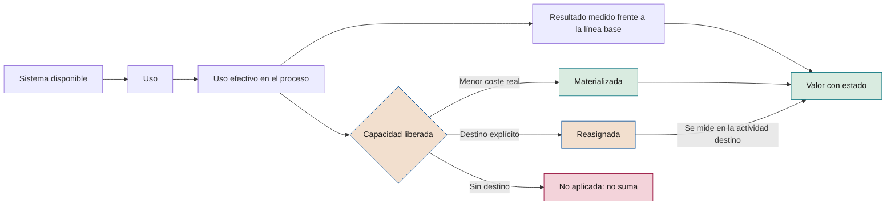

# Adopción y cambio en la iniciativa

**Cómo conseguir que la IA se use, que la capacidad liberada se convierta en valor y que las personas sepan trabajar con ella**

| | |
|---|---|
| Documento | Documento 23 · Adopción y cambio en la iniciativa |
| Versión | 0.1 (borrador de trabajo) |
| Fecha | 16-09-2026 |
| Autor | Fernando García · SEACHAD |
| Estado | Borrador para revisión. Desarrolla el principio 10 y el plan de adopción de las fases 4 a 7 del documento 01. |

<!-- cifras: 4 | fases con plan de adopción ; 3 | estados de la capacidad liberada ; 10 | indicadores de adopción con fórmula ; 2 | gates con criterios de adopción -->

---

> **Aviso legal y exención de responsabilidad.** SEVEN-G es un marco metodológico de referencia que se ofrece «tal cual» y con fines exclusivamente informativos. No constituye asesoramiento jurídico, regulatorio, financiero ni profesional, ni garantiza el cumplimiento de ninguna norma. Las referencias a regulación general (como el Reglamento Europeo de IA, el RGPD, DORA o NIS2), a normas técnicas y a regulación específica de cada sector o jurisdicción pueden ser incompletas, no aplicar a un caso concreto o quedar desactualizadas por cambios normativos, interpretaciones o criterios de las autoridades posteriores a su fecha de consulta. **Cada organización que use SEVEN-G es la única responsable de identificar la normativa que le aplica, verificar su vigencia y certificar su propio cumplimiento regulatorio**, con el asesoramiento cualificado que corresponda. El autor y SEACHAD no asumen responsabilidad alguna por el uso que se haga de este contenido ni por las decisiones que se adopten con él. Los datos, cifras, compañías y casos de los ejemplos son ficticios o ilustrativos.

<!-- esencial: recomendado | El plan de adopción (P20) es evidencia obligatoria desde la fase 4 y la adopción se comprueba en G5 y G7. El resto —modelo de cambio, análisis de impacto en roles, comunicación— es guía que se usa en proporción al efecto de la iniciativa sobre las personas. -->

## 1. Objeto y alcance

Este documento define cómo se planifica, se mide y se decide la adopción de una iniciativa de IA. Cubre un hueco del material anterior del marco: la fase 5 validaba el valor, pero no trataba de forma explícita la adopción real, la reasignación de la capacidad liberada ni la formación, que son condiciones para que el valor se materialice.

**Qué cubre**

- El análisis de impacto en roles y tareas.
- El plan de adopción de las fases 4 a 7, preparado desde las fases 2 y 3.
- La medición de la capacidad liberada y su materialización o reasignación explícita.
- La formación, la alfabetización en IA, la comunicación y la participación.
- Los indicadores de adopción y los criterios de adopción en G5 y G7.
- La resistencia al cambio y los riesgos organizativos.

**Qué no cubre**

| Tema | Documento |
|---|---|
| Política de personas, nuevos roles, capacidades y relaciones laborales en la compañía | 50 · Personas y organización |
| Política corporativa de IA, uso aceptable y alfabetización general | 31 · Política corporativa y uso aceptable |
| Obligaciones regulatorias en detalle | 34 · Mapeo regulatorio |
| Reglas de medición y realización de beneficios | 40 · Reglas de medición del valor · 43 · Realización de beneficios |
| Secuencia completa de cada fase | 20 · Manuales de fase |

Este documento no constituye asesoramiento jurídico. Las referencias normativas se han consultado en septiembre de 2026 y su vigencia debe verificarse en el documento 34.

---

## 2. Por qué el valor depende de la adopción

Un sistema de IA disponible no genera valor por sí mismo. El valor aparece solo cuando se recorre una cadena completa: el sistema se usa, se usa en el proceso para el que se diseñó, el trabajo cambia y ese cambio produce un resultado medido frente a la línea base. Cuando el cambio libera tiempo, además hay que decidir qué se hace con él.

<!-- grafico: Cadena de la adopción al valor | Cada eslabón puede romperse; el valor solo cuenta al final -->

Tres consecuencias para el gobierno de la iniciativa:

1. **Disponibilidad no es adopción, y adopción no es valor.** Los informes distinguen usuarios con acceso, usuarios activos, uso efectivo en el proceso y resultado medido.
2. **La capacidad liberada no suma como ahorro** hasta que se materializa o se reasigna de forma explícita (regla 3 de medición, 00 §6). Se informa por separado.
3. **La materialización es una señal de transformación.** La señal 3 del índice de transformación (00 §5.3) mide cuánta capacidad liberada se convierte en ahorro real o se reasigna; la señal 5 mide los cambios en roles y estructura. Sin datos de adopción, ambas quedan *sin dato*.

---

## 3. Principios

| # | Principio | Qué implica |
|---|---|---|
| 1 | **La adopción se diseña, no se espera** | El plan de adopción es una evidencia de la fase 4, no una actividad posterior al despliegue. |
| 2 | **Responde quien responde del valor** | El responsable de producto de IA responde de la adopción (01 §8.1); los mandos del área usuaria la ejecutan. |
| 3 | **Se mide el uso en el proceso, no el acceso** | Los indicadores se refieren a los casos elegibles del proceso, no al número de licencias. |
| 4 | **El destino de la capacidad liberada es una decisión explícita** | Se decide y registra con responsable y fecha; nunca se presume. |
| 5 | **Nadie usa el sistema sin formación** | Usuarios y supervisores se forman antes de acceder, también en el piloto. |
| 6 | **Se informa con la verdad sobre el impacto** | La comunicación no promete lo que no está decidido ni oculta lo que ya lo está. |
| 7 | **La confianza se calibra** | Se vigila tanto la desconfianza (no se usa) como el exceso de confianza (se acepta todo sin revisar). |

---

## 4. Modelo de referencia para el cambio

SEVEN-G no impone un modelo de gestión del cambio. Si la compañía ya usa uno, lo mantiene. Como referencia, este documento se apoya en **ADKAR**, modelo de gestión del cambio individual desarrollado por Prosci (ADKAR es marca de Prosci), que describe cinco condiciones sucesivas para que una persona cambie: conciencia de la necesidad, deseo de participar, conocimiento de cómo cambiar, habilidad para hacerlo y refuerzo para sostenerlo.

La tabla muestra cómo cada condición se traduce en evidencias del marco. Lo exigible son las evidencias, no el modelo.

| Condición (ADKAR) | Pregunta práctica | Evidencia en SEVEN-G | Fase |
|---|---|---|---|
| Conciencia | ¿Saben las personas afectadas qué cambia y por qué? | Plan de comunicación de P20 | 4–5 |
| Deseo | ¿Tienen motivos para usarlo y se han atendido sus preocupaciones? | Análisis de impacto en roles; participación de usuarios; incentivos revisados | 4–5 |
| Conocimiento | ¿Saben usarlo, conocen sus límites y cuándo no confiar? | Plan y registro de formación | 5 |
| Habilidad | ¿Lo usan bien en el trabajo real? | Indicadores de uso efectivo, anulación y calidad en el piloto | 5–6 |
| Refuerzo | ¿Se sostiene el uso cuando termina el proyecto? | Indicadores por periodo, R6, capacidad reasignada | 6–7 |

---

## 5. Análisis de impacto en roles y tareas

### 5.1 Unidad de análisis

El impacto se analiza **por tarea dentro de cada rol**, no por puesto completo. Un mismo rol puede ver tareas eliminadas, tareas asistidas y tareas nuevas, en especial las de supervisión humana definidas en P17.

| Campo | Contenido |
|---|---|
| Rol y colectivo | Nombre del rol, área y número de personas. |
| Tarea | Descripción observable. |
| Volumen y tiempo actual | Casos por periodo y tiempo unitario, tomados de la línea base (P09). |
| Tipo de cambio | *Sin cambio* · *Asistida* (la IA ayuda, la persona hace) · *Automatizada parcialmente* · *Automatizada* · *Nueva* (incluida la supervisión). |
| Nivel de autonomía del sistema | A0–A3 (documento 35). |
| Tiempo previsto tras el cambio | Estimado en la fase 4, medido en la fase 5. |
| Competencias nuevas | Qué debe saber hacer la persona. |
| Afecta a condiciones de trabajo | Sí o no, con descripción (horario, control, evaluación del desempeño, carga). |

### 5.2 Efecto sobre el rol

Con las tareas analizadas, se clasifica el efecto sobre cada rol:

| Efecto | Descripción | Tratamiento mínimo |
|---|---|---|
| **Sin cambio relevante** | Cambian herramientas, no tareas. | Formación de uso. |
| **Cambio de tareas** | Cambia el reparto del tiempo dentro del rol. | Formación, ajuste de objetivos y medición de capacidad liberada. |
| **Cambio de rol** | Cambian responsabilidades, decisiones o competencias exigidas. | Además, participación de la función de personas y actualización de la descripción del rol. |
| **Rol nuevo** | Aparece un rol (por ejemplo, supervisión de agentes o curación de contenidos). | Además, definición del rol, selección y plan de capacitación. |
| **Rol reducido** | El volumen de trabajo del rol disminuye de forma sustancial. | Además, decisión explícita sobre la capacidad liberada y, cuando proceda, información y consulta a la representación de los trabajadores (sección 9.3). |

### 5.3 Cuándo se hace

| Fase | Profundidad |
|---|---|
| 3 | Preliminar: colectivos afectados, tipo de efecto previsto y viabilidad organizativa (evidencia P10). |
| 4 | Completo, con tiempos estimados, dentro del plan de adopción (P20). |
| 5 | Actualizado con tiempos y tareas medidos en el piloto. |
| 6–7 | Contrastado con la organización real resultante. |

---

## 6. Plan de adopción por fase

### 6.1 Preparación en las fases 2 y 3

- **Fase 2:** en Aumentar y Transformar se fija el **objetivo de adopción** (usuarios objetivo, uso efectivo esperado, plazo). En Optimizar, se estima la capacidad liberada por separado del ahorro.
- **Fase 3:** análisis preliminar de impacto (sección 5.3), costes de adopción y formación en la evaluación de viabilidad, riesgos organizativos en P12. En Aumentar, G3 exige la viabilidad de la adopción y del cambio de rol (01 §7.6).

### 6.2 Fase 4 · Diseño de la adopción

| # | Actividad | Realiza | Participan |
|---|---|---|---|
| 1 | Completar el análisis de impacto en roles y tareas. | Producto | Área usuaria, personas |
| 2 | Fijar indicadores de adopción con fórmula, línea base, objetivo y umbral mínimo para G5 y G7 (sección 10). | Producto | Oficina de IA |
| 3 | Decidir el destino previsto de la capacidad liberada: materialización, reasignación o combinación, con responsable y fecha (sección 7). | Producto | Patrocinador, dirección del área, control de gestión |
| 4 | Diseñar la formación por público (sección 8). | Producto | Personas |
| 5 | Diseñar la comunicación y la participación, incluida la representación de los trabajadores cuando proceda (sección 9). | Producto | Personas, comunicación interna |
| 6 | Identificar usuarios clave para el diseño y el piloto. | Producto | Área usuaria |
| 7 | Revisar incentivos y objetivos que premien el procedimiento anterior. | Producto | Dirección del área, personas |
| 8 | Registrar riesgos organizativos en P12 (sección 12). | Producto | Riesgos |

### 6.3 Fase 5 · Piloto, formación y medición inicial

- Formar a usuarios y supervisores del piloto antes de su acceso y registrar la formación.
- Medir los indicadores de adopción del piloto con la misma disciplina que los de valor.
- Medir la capacidad liberada real (no la estimada) con el método de la sección 7.2.
- Recoger incidencias de uso, anulaciones y sus motivos, y ajustar diseño, formación o comunicación.
- Actualizar P20 con los resultados y con el plan de despliegue a toda la población objetivo.

### 6.4 Fase 6 · Despliegue, refuerzo y materialización

- Desplegar por oleadas cuando la población sea amplia, con formación previa a cada oleada.
- Medir los indicadores por periodo y presentarlos en cada R6.
- Ejecutar las decisiones de materialización o reasignación en las fechas previstas y registrar su evidencia.
- Mantener canales de soporte y de reporte de errores.
- Reforzar: retirar el procedimiento anterior cuando la adopción esté consolidada, ajustar objetivos e incorporar el nuevo trabajo en la descripción de los roles.

### 6.5 Fase 7 · Consolidación y decisión

- Consolidar la adopción sostenida y la capacidad materializada y reasignada.
- Aplicar los criterios de adopción de G7 por nivel de ambición (sección 11).
- Registrar las lecciones sobre adopción para la cartera.
- En retirada: comunicar a los usuarios, restablecer el procedimiento alternativo y formar en él si ya no se conoce.

---

## 7. Capacidad liberada: medición, materialización o reasignación

### 7.1 Definiciones

| Término | Definición |
|---|---|
| **Capacidad liberada** | Horas de trabajo que dejan de ser necesarias para atender el mismo volumen con la misma calidad, descontado el trabajo nuevo que introduce la IA. |
| **Capacidad materializada** | Parte de la capacidad liberada que se convierte en **menor coste real** verificable: horas extraordinarias eliminadas, contratos temporales o de servicios no renovados, subcontratación reducida, vacantes amortizadas o contrataciones previstas y presupuestadas que no se realizan. |
| **Capacidad reasignada** | Parte de la capacidad liberada que se asigna **de forma explícita** a actividades identificadas, con responsable, horas, fecha e indicador de resultado. |
| **Capacidad no aplicada** | Parte que no se ha materializado ni reasignado explícitamente. Suele diluirse sin efecto medible. |

Por construcción: **capacidad liberada = materializada + reasignada + no aplicada.**

Estas tres partes agrupan los cinco destinos de la capacidad liberada del documento 50 (§6.2): PER-D1 (Materializar) es capacidad materializada; PER-D2 (Reasignar) y PER-D4 (Reinvertir en calidad, servicio o cumplimiento) son capacidad reasignada; PER-D3 (Absorber crecimiento) es materializada si la contratación estaba prevista y presupuestada y, si no, reasignada; PER-D5 (Sin decisión) es capacidad no aplicada. La correspondencia completa figura en la sección 10.5.

### 7.2 Medición

La capacidad liberada se mide, no se deduce del rendimiento del modelo:

> **Capacidad liberada (horas por periodo) = Σ tareas [volumen del periodo × (tiempo unitario de la línea base − tiempo unitario con IA)] − horas de supervisión y revisión − horas de corrección de errores del sistema − horas de gestión del sistema por el área usuaria**

Reglas:

1. Los tiempos de la línea base proceden de P09; los tiempos con IA se **miden** en el piloto (P22) y en operación, no se estiman.
2. El volumen es el realmente tratado con el sistema en el periodo, no el elegible.
3. Las horas de supervisión y corrección se miden con registros del sistema o por muestreo documentado.
4. La conversión a personas equivalentes usa las horas efectivas anuales por persona que fije la compañía y se declara.
5. Toda cifra lleva estado: *validado*, *declarado* o *estimado* (regla 2 de medición).

### 7.3 Materialización

- Solo cuenta como **eficiencia** el importe del menor coste real, tomado de la contabilidad o del presupuesto aprobado, no las horas multiplicadas por un coste por hora.
- La valida control de gestión, que comprueba que el coste existía, que desaparece y que no reaparece en otra partida.
- Si la materialización consiste en absorber crecimiento de volumen sin contratar, se exige que la contratación estuviera prevista y presupuestada; de lo contrario, se trata como reasignación.
- Las decisiones que afectan al empleo se toman por la dirección con la función de personas y conforme a la normativa laboral y a los convenios aplicables (documento 50). SEVEN-G no prescribe el destino de la capacidad liberada; exige que sea explícito.

### 7.4 Reasignación explícita

Una reasignación solo se reconoce si registra en P20:

| Campo | Contenido |
|---|---|
| Actividad destino | Qué se hará con las horas y por qué es de mayor valor. |
| Responsable | Mando que responde de que las horas se dediquen a esa actividad. |
| Horas y personas | Cantidad asignada y colectivo. |
| Fecha de inicio | Cuándo empieza la reasignación. |
| Indicador de resultado | Cómo se sabrá que la actividad destino produce efecto (por ejemplo, casos complejos resueltos, visitas comerciales, tiempo de respuesta). |
| Revisión | En qué R6 se comprueba. |

El valor de la actividad destino **no se suma como eficiencia** de la iniciativa. Si produce retorno medible, se registra como retorno en el caso al que se atribuya, una sola vez (regla 5 de medición).

### 7.5 Tasas e información

| Indicador | Fórmula |
|---|---|
| Tasa de materialización | Horas materializadas ÷ horas liberadas medidas |
| Tasa de reasignación | Horas reasignadas explícitamente ÷ horas liberadas medidas |
| Tasa de aplicación | (Horas materializadas + horas reasignadas) ÷ horas liberadas medidas |

Los informes al consejo muestran la capacidad liberada **separada** del ahorro y desglosada en materializada, reasignada y no aplicada. Estas tasas alimentan la señal 3 del índice de transformación; sus umbrales se fijan en el documento 12.

### 7.6 Ejemplo ilustrativo

*Datos ficticios.* Un equipo de gestión documental clasifica 4.000 documentos al mes. La línea base es de 12 minutos por documento; con el sistema, medido en el piloto, 5 minutos. Se revisa una muestra de 400 documentos a 3 minutos cada uno y se corrigen 80 errores del sistema a 10 minutos cada uno.

| Concepto | Cálculo | Horas al mes |
|---|---|---|
| Ahorro bruto | 4.000 × (12 − 5) min | 466,7 |
| Supervisión | 400 × 3 min | − 20,0 |
| Corrección | 80 × 10 min | − 13,3 |
| **Capacidad liberada** | | **433,3** (unas 5.200 horas al año) |

Destino decidido en la fase 4 y ejecutado en la fase 6: no se renueva un contrato temporal equivalente a 1.600 horas anuales (materializadas); se reasignan 2.400 horas a la resolución de expedientes complejos, con su responsable e indicador; 1.200 horas quedan sin aplicar. Tasa de aplicación: (1.600 + 2.400) ÷ 5.200 = 77 %. La eficiencia que se declara es el coste real del contrato no renovado según contabilidad, validado por control de gestión, y no 5.200 horas por un coste por hora.

---

## 8. Formación y alfabetización en IA

### 8.1 Marco normativo

El artículo 4 del Reglamento Europeo de IA obliga a proveedores y responsables del despliegue a adoptar medidas para garantizar, en la mayor medida posible, un nivel suficiente de alfabetización en IA de su personal y de otras personas que operen o usen sistemas de IA en su nombre, teniendo en cuenta sus conocimientos, experiencia y formación y el contexto de uso. Es aplicable desde el 2 de febrero de 2025. El Reglamento (UE) 2026/1744 (ómnibus digital sobre IA) ha modificado su redacción, que pasa a exigir medidas para *apoyar* el desarrollo de la alfabetización en IA sin fijar un nivel; el detalle y su estado de verificación, a fecha de consulta de septiembre de 2026, están en el documento 34 (§3.5).

Con independencia de la evolución normativa, **SEVEN-G exige formación en cada iniciativa porque el valor depende de ella**. La alfabetización general de la plantilla se gobierna en el documento 31; este documento trata la formación específica de la iniciativa.

### 8.2 Formación por público

| Público | Objetivo | Contenido mínimo | Cuándo |
|---|---|---|---|
| **Personas afectadas del área** | Entender qué cambia y por qué. | Qué hace y qué no hace el sistema, efectos en su trabajo, calendario, a quién preguntar. | Fase 4–5, antes del piloto. |
| **Usuarios** | Usar bien el sistema. | Uso, límites conocidos, cuándo no confiar, cómo anular o corregir un resultado, cómo reportar errores e incidentes, datos que no deben introducirse. | Antes de su acceso. |
| **Supervisores humanos** | Supervisar con eficacia (P17). | Criterios de intervención, sesgo de automatización, revisión de muestras, uso del interruptor de parada cuando exista, escalado. | Antes de su acceso. |
| **Mandos del área** | Gestionar el cambio y la capacidad. | Indicadores de adopción, destino de la capacidad liberada, gestión de resistencias. | Fase 4. |
| **Equipo de operación** | Operar el sistema (P24). | Monitorización, incidentes, cambios, reversión. | Fase 5. |

La duración y el formato los fija la compañía. La comprensión de usuarios y supervisores **debería** evaluarse con una prueba breve o una práctica supervisada.

### 8.3 Contenidos por tecnología

| Perfil | Énfasis de la formación |
|---|---|
| **ML predictivo** | Qué significa una puntuación o probabilidad, umbrales, incertidumbre, casos en los que el modelo no es fiable. |
| **IA generativa** | Verificación de las salidas, contenido incorrecto o no fundamentado, confidencialidad de la información introducida, buenas prácticas de instrucción. |
| **Agentes** | Acciones permitidas y prohibidas, lectura de registros de acción, validación de acciones sensibles, parada. |
| **IA de terceros embebida** | Qué funciones del producto usan IA, configuración autorizada, cómo detectar cambios introducidos por el proveedor. |

### 8.4 Evidencia

Registro de formación en P20, consolidado en P45, con persona o colectivo, contenido y versión, fecha, formato y resultado de la evaluación. Alimenta el indicador de cobertura de formación (sección 10).

---

## 9. Comunicación y participación

### 9.1 Plan de comunicación

| Elemento | Contenido |
|---|---|
| Públicos | Personas afectadas, usuarios, mandos, representación de los trabajadores, otras áreas, personas externas afectadas. |
| Mensajes | Qué cambia y qué no, por qué, cómo afecta a cada colectivo, qué está decidido y qué no, calendario, canal de preguntas. |
| Emisor | Patrocinador y dirección del área para el porqué; responsable de producto para el cómo. |
| Momentos | Antes del piloto, al decidir G5, en cada oleada de despliegue y al decidir G7. |
| Retorno | Canal para dudas, objeciones y errores, con respuesta registrada. |

La comunicación debe ser coherente con las decisiones registradas. Anunciar que *nadie se verá afectado* cuando el análisis prevé un rol reducido, o anunciar reducciones no decididas, destruye la confianza y la adopción.

### 9.2 Participación de usuarios

Los usuarios clave **deberían** participar en el diseño de la experiencia de uso, en la definición de la supervisión humana y en el piloto. Su participación se registra y sus aportaciones se responden.

### 9.3 Representación de los trabajadores

Cuando la iniciativa afecta a condiciones de trabajo, a decisiones sobre empleo o a la supervisión del desempeño, la compañía debe cumplir los derechos de información y consulta aplicables. Entre las referencias vigentes a la fecha de consulta:

- El **artículo 26.7 del Reglamento Europeo de IA**: los responsables del despliegue que sean empleadores informan a los representantes de los trabajadores y a los trabajadores afectados antes de poner en servicio o utilizar un sistema de IA de alto riesgo en el lugar de trabajo.
- En España, el **artículo 64.4.d) del Estatuto de los Trabajadores**: derecho del comité de empresa a ser informado de los parámetros, reglas e instrucciones de los algoritmos o sistemas de IA que afectan a decisiones que pueden incidir en las condiciones de trabajo, el acceso y mantenimiento del empleo, incluida la elaboración de perfiles.
- Lo que establezcan los convenios colectivos y la normativa de protección de datos en el ámbito laboral.

El detalle, el calendario de información y consulta y la relación con la negociación colectiva se tratan en los documentos 34 y 50. En el plan de adopción se registra si procede, cuándo se ha informado o consultado y con qué resultado.

---

## 10. Indicadores de adopción

### 10.1 Reglas de medición

1. **Se mide sobre la población y los casos del proceso.** Los denominadores son los usuarios objetivo y los casos elegibles definidos en P20, no las licencias ni los accesos.
2. **El criterio de uso activo se fija en P20** antes del piloto (por ejemplo, al menos un uso con resultado incorporado al proceso por semana) y no se cambia durante la medición.
3. **Sin datos individuales.** Los indicadores se calculan por colectivo, con el tamaño mínimo de grupo que fije la compañía. Los datos de uso no se emplean para evaluar individualmente a las personas salvo que esa finalidad esté declarada, sea lícita y se haya informado (50 §9.2).
4. **"Sin dato" no es cero** (regla 8 de medición). Un indicador que no puede calcularse con su fórmula se muestra como *sin dato*.
5. **Lectura por pares.** Ningún indicador de uso se interpreta solo: se lee con los de calidad de la supervisión y de resultado (sección 10.3).

### 10.2 Indicadores

Los códigos `IND-` son los del catálogo (documento 41); los `PER-` son los provisionales del documento 50. Los indicadores sin código son **propuestas para su consolidación en el documento 41**.

| # | Indicador | Fórmula | Código | Per. | Uso principal |
|---|---|---|---|---|---|
| 1 | **Despliegue del acceso** | Usuarios objetivo con acceso habilitado ÷ usuarios objetivo | Propuesta | M | Fases 5–6: avance de las oleadas. |
| 2 | **Usuarios activos** | Usuarios activos en el periodo, según el criterio de P20 ÷ usuarios objetivo | IND-ADO-02 · PER-07 | M | G5 y R6: extensión del uso. |
| 3 | **Uso efectivo en el proceso** | Casos tratados con el sistema ÷ casos elegibles del proceso | IND-ADO-03 | M | G5, R6 y G7: indicador principal de adopción. |
| 4 | **Continuidad del uso** | Usuarios activos en el periodo que también lo fueron en el anterior ÷ usuarios activos del periodo anterior | Propuesta | M | Fase 6: refuerzo; detecta abandono tras el lanzamiento. |
| 5 | **Tasa de anulación humana** | Recomendaciones o resultados rechazados o modificados por la persona ÷ recomendaciones o resultados revisados | PER-10 (complementa IND-ADO-04) | M | G5 y R6: calibración de la confianza. |
| 6 | **Tiempo de revisión por caso** | Mediana del tiempo de revisión humana por caso revisado, con percentil 80 | Propuesta | M | R6: detección de aprobación rutinaria (RT-ORG-04). |
| 7 | **Cobertura de formación** | Personas con acceso o función de supervisión con formación registrada y evaluada antes del acceso ÷ personas con acceso o función de supervisión | IND-ADO-05 (nivel iniciativa) · PER-02 · PER-03 | M | G5 y R6: condición de acceso. |
| 8 | **Percepción de los usuarios** | Respuestas favorables en las preguntas de utilidad, confianza, apoyo, carga y autonomía (P44) ÷ respuestas válidas | PER-15 | Fase 5, a los 3 meses y en R6 Enterprise | Deseo y refuerzo; alerta temprana de rechazo. |
| 9 | **Tasa de aplicación de la capacidad liberada** | (Horas materializadas + horas reasignadas explícitamente) ÷ horas liberadas medidas | IND-VAL-08 + IND-VAL-09 · PER-04 + PER-05 | T | R6 y G7: conversión en valor (sección 7.5). |
| 10 | **Roles actualizados** | Puestos afectados con descripción y objetivos actualizados ÷ puestos afectados según el análisis de impacto | PER-13 · IND-ADO-06 | S | G7 en Aumentar y Transformar; señal 5. |

Notas:

- El indicador 5 no tiene un valor bueno en abstracto. Una tasa próxima a cero puede indicar aceptación sin revisión; una tasa alta, bajo rendimiento del sistema o desconfianza. Se fija una **banda esperada** en la fase 4 con los resultados de validación y se analizan los motivos de anulación registrados.
- En IA generativa, el indicador 5 se calcula sobre la muestra de revisión humana y se lee con IND-OPE-08 (respuestas no fundamentadas). En agentes, se calcula sobre las acciones que requieren validación (AG-08, documento 35).
- El indicador 7 tiene objetivo del **100 %** para supervisores designados: ninguna persona supervisa un sistema A1–A3 sin formación registrada (50 §5.3).

### 10.3 Lectura conjunta

| Patrón observado | Lectura probable | Acción |
|---|---|---|
| Usuarios activos altos y uso efectivo bajo | Uso marginal: se prueba el sistema, pero el trabajo sigue haciéndose por el procedimiento anterior. | Revisar integración en el flujo de trabajo, incentivos y retirada del procedimiento anterior. |
| Uso efectivo alto, anulación próxima a cero y tiempo de revisión decreciente | Posible aceptación rutinaria o sesgo de automatización. | Revisión de muestras por un tercero, ajuste de la carga de supervisión (P17), refuerzo de la formación. |
| Anulación alta y estable | Rendimiento insuficiente en casos reales o desconfianza. | Analizar motivos de anulación; separar errores del sistema de preferencias de los usuarios; iterar el diseño o la formación. |
| Continuidad decreciente tras el lanzamiento | Falta de refuerzo; el uso dependía del acompañamiento inicial. | Soporte, referentes en el área, revisión de objetivos. |
| Uso efectivo alto y tasa de aplicación de la capacidad baja | Adopción sin conversión en valor (RT-ECO-03). | Decisión explícita de destino en R6; alerta por antigüedad (50 §6.5). |
| Percepción decreciente con uso estable | Uso obligado sin aceptación; riesgo de bienestar o de conflicto. | Escucha a los colectivos, revisión de carga y comunicación (sección 9). |

### 10.4 Objetivos y umbrales

- El **objetivo de adopción** se fija en la fase 2 (G2.10): obligatorio en Aumentar, recomendado en Optimizar.
- En la fase 4 se fijan en P20, para cada indicador seleccionado, la línea base, el objetivo, el plazo y el **umbral mínimo** para G5 y para G7. Los umbrales se fijan antes de conocer los resultados y no se relajan durante la fase sin aprobación del órgano que autorizó la iniciativa (01 §7.4, regla 6).
- El seguimiento es mensual durante los primeros seis meses de producción y después se presenta en cada R6 (R6.14).
- Un uso efectivo inferior al umbral durante dos periodos consecutivos activa revisión en R6 y puede motivar adelantar G7. Si la iniciativa se para o se retira por esta causa, el motivo codificado es **Sin adopción** (documento 03).
- Los umbrales son propios de cada iniciativa. SEVEN-G no fija valores de referencia de adopción.

### 10.5 Correspondencia con los documentos 40, 41 y 50

Los tres estados de la sección 7 y los cinco destinos del documento 50 (§6.2) describen la misma realidad con distinto nivel de detalle:

| Destino (50 §6.2) | Estado en este documento | Cómo cuenta (40) |
|---|---|---|
| PER-D1 · Materializar | Materializada | Eficiencia validable con reflejo contable. |
| PER-D2 · Reasignar a una actividad definida | Reasignada | Por el resultado de la actividad destino, atribuido a un solo caso. |
| PER-D3 · Absorber crecimiento | Materializada si la contratación estaba prevista y presupuestada; si no, reasignada | Coste evitado solo con necesidad de dotación documentada antes. |
| PER-D4 · Reinvertir en calidad, servicio o cumplimiento | Reasignada, con actividad destino e indicador | No sumable salvo traducción a dinero con fórmula (regla 7). |
| PER-D5 · Sin decisión | No aplicada | No suma; se informa aparte con alerta por antigüedad. |

La fórmula de la sección 7.2 es equivalente a la fórmula F4 del documento 40: allí el tiempo unitario con IA incluye la revisión, las excepciones y las correcciones; aquí se descuentan de forma explícita para que el área usuaria vea cada componente. En ningún caso se descuentan dos veces.

---

## 11. Criterios de adopción en G5 y G7

Los criterios codificados se fijan en el documento 21 y se aplican con las listas de verificación del documento 22. Esta sección reúne lo que esos criterios exigen en materia de adopción y cómo se evidencia con este documento. No crea criterios nuevos.

### 11.1 Criterios comunes a todos los niveles

| Puerta | Criterio (21) | Qué se comprueba en materia de adopción | Evidencia |
|---|---|---|---|
| G4 | G4.11 | Plan de adopción con formación, comunicación, apoyo, medición del uso y destino previsto de la capacidad liberada. | P20 · T20 |
| G5 | G5.14 ◆ | Supervisores designados, formados y con autoridad y medios para intervenir. No admite condiciones. | P17 · P20 (registro de formación) |
| G5 | G5.19 | Usuarios formados y evidencia de alfabetización en IA de quienes usan o supervisan el sistema. | P20 (indicador 7) |
| G5 | G5.10 | Plan para materializar o reasignar la capacidad liberada, con responsable y fecha. | P20 (sección 7.4) |
| G5 | — (50 §7.2) | Si la información previa a la representación de los trabajadores es obligatoria, consta realizada. No admite *Continuar con condiciones*. | Registro de información |
| R6 | R6.14 · R6.02 | Adopción medida frente al objetivo; valor realizado con estado. | P20 · P28 |
| G7 | G7.01 · G7.02 | Valor consolidado con estado; conclusión explícita sobre la hipótesis, incluida la de adopción. | P28 · P30 |

### 11.2 G5 · Puesta en producción, por nivel de ambición

| Nivel | Exigencia de adopción (G5.08, G5.10) | Indicadores que la evidencian | Si no se alcanza |
|---|---|---|---|
| **Optimizar** | Eficiencia validada frente a la línea base, lo que exige uso efectivo suficiente en el piloto para que la medición sea representativa. Plan para **materializar** la capacidad liberada. | 3, 5 y 7; capacidad liberada medida (sección 7.2). | *Iterar* el piloto o *Continuar con condiciones* sobre el plan de materialización, con plazo y responsable. |
| **Aumentar** | **Adopción real** y mejora de rendimiento **medidas** en el piloto, por encima del umbral mínimo fijado en la fase 4. Plan de **reasignación** y de cambio de rol. | 2, 3, 5, 7 y 8; análisis de impacto actualizado. | *Iterar*; o *Continuar con condiciones* si la desviación es limitada, con nueva medición, plazo y responsable. La adopción es condición del valor en este nivel y no se sustituye por una estimación. |
| **Transformar** | Evidencia de mercado o de cliente (uso, conversión, ingresos iniciales o cambio operativo verificado). Cuando los usuarios son internos, el cambio operativo verificado incluye su adopción. Plan de capacidad solo si hay capacidad liberada. | 3 y 5 sobre usuarios internos; indicadores de uso de clientes definidos en la hipótesis. | *Iterar* o parar la etapa según sus criterios de parada. |

### 11.3 G7 · Escalado o retirada, por nivel de ambición

| Nivel | Exigencia (G7.01) | Evidencia de adopción | Lectura para la decisión |
|---|---|---|---|
| **Optimizar** | **Ahorro materializado**, no solo capacidad liberada. | Tasa de materialización con reflejo contable validado por control de gestión; uso efectivo sostenido. | Sin materialización no hay valor realizado que justifique escalar, aunque la adopción sea alta. |
| **Aumentar** | **Rendimiento sostenido y capacidad reasignada.** | Uso efectivo y continuidad sostenidos en los periodos de R6; reasignación registrada con indicador de resultado; roles actualizados. | Una adopción que decae tras el lanzamiento no es rendimiento sostenido. |
| **Transformar** | **Retorno medido y cambio verificado** del modelo operativo o de la oferta; aprobación del consejo para escalar (G7.09). | Roles y estructura rediseñados (indicador 10); uso sostenido por clientes o usuarios de la nueva oferta. | El cambio del modelo operativo solo se verifica si las personas trabajan de la forma nueva. |

### 11.4 Reglas de aplicación

1. **Se aplica el nivel de ambición confirmado en G2** (21 §7.2).
2. **La capacidad no aplicada no es valor realizado** en ningún nivel (21 §7.2, regla 5).
3. **Para Escalar**, la adopción que sostiene el valor debe estar medida en el alcance actual. La extrapolación a un alcance mayor lleva su propia hipótesis de adopción y su coste de extensión (regla 4 de medición).
4. **Para Iterar por adopción**, P30 registra la condición del cambio que ha fallado (sección 4), la acción y el plazo.
5. **Para Retirar**, se aplica la sección 6.5: comunicación a los usuarios, procedimiento alternativo restablecido y formación en él si ya no se conoce.
6. **Intensidad.** En Lite, los criterios marcados *Simpl.* en el documento 21 se evidencian con P20 simplificada; los criterios ◆ y la información previa a la representación no se simplifican.

---

## 12. Resistencia al cambio y riesgos organizativos

### 12.1 Formas de resistencia

La resistencia es información sobre el diseño, la formación o el impacto, no un defecto de las personas. Se diagnostica con la condición del cambio que falla (sección 4) y se trata en su causa.

| Manifestación | Señal observable | Condición que suele fallar | Respuesta |
|---|---|---|---|
| **No uso o uso marginal** | Indicadores 2 y 3 bajos. | Conciencia o deseo. | Explicar el porqué con datos del área; integrar el sistema en el flujo de trabajo; implicar a usuarios clave. |
| **Trabajo en paralelo** | El caso se trata con el sistema y además por el procedimiento anterior; el tiempo con IA no baja. | Confianza o habilidad. | Casos prácticos con resultados reales; retirar el procedimiento anterior cuando la calidad esté demostrada. |
| **Anulación sistemática** | Indicador 5 por encima de la banda sin motivo técnico. | Conocimiento o deseo. | Analizar motivos; corregir el sistema si procede; formación sobre límites y criterios. |
| **Aceptación acrítica** | Indicador 5 próximo a cero; indicador 6 decreciente. | Conocimiento (exceso de confianza). | Formación en sesgo de automatización; muestras de control; revisión de la carga de supervisión (P17). |
| **Resistencia de mandos** | Objetivos del área sin cambios; decisiones de destino de la capacidad aplazadas. | Deseo o refuerzo. | Objetivos e incentivos revisados (sección 6.2, actividad 7); indicadores de adopción en la revisión del área. |
| **Temor por el empleo** | Percepción baja; rumores; rotación en el colectivo. | Deseo. | Comunicación veraz de lo decidido y lo no decidido (sección 9.1); información y consulta cuando proceda. |
| **Uso de herramientas no autorizadas** | Detecciones en T21 en el área afectada. | Utilidad percibida insuficiente del sistema aprobado. | Revisar la solución aprobada; aplicar la política de uso aceptable (documento 31). |

### 12.2 Riesgos tipo

Los riesgos se registran en P12 con la escala común de probabilidad e impacto y se aceptan al nivel que corresponde (documento 33). Los códigos son los del catálogo de riesgos tipo del documento 33; el documento 50 (§12) propone una relación ampliada de riesgos organizativos, pendiente de consolidación en el documento 33.

| Código (33) | Riesgo | Indicador de alerta (sección 10) | Controles de este documento | Fase |
|---|---|---|---|---|
| **RT-ORG-01** | Falta de adopción | 2, 3 y 4 por debajo del umbral. | Plan de adopción (sección 6); participación de usuarios; formación; objetivo en G2 y umbral en G5. | 4–6 |
| **RT-ORG-03** | Efecto no gestionado sobre las personas | Análisis de impacto incompleto; indicador 8 decreciente; indicador 10 bajo. | Análisis de impacto (sección 5); comunicación y participación (sección 9); documento 50. | 2, 4 |
| **RT-ORG-04** | Supervisión humana ineficaz | 5 próximo a cero; 6 decreciente; 7 por debajo del 100 % en supervisores. | Formación de supervisores (sección 8.2); diseño de la supervisión en P17; muestras de control. | 4, 6 |
| **RT-ORG-02** | Dependencia de personas clave | Conocimiento de uso concentrado en pocos usuarios avanzados. | Formación por público; referentes del área; manual de operación (P24). | 4, 6 |
| **RT-ORG-05** | Uso no autorizado de IA | Detecciones en T21 en colectivos afectados. | Formación; documento 31. | C1, C4 |
| **RT-ECO-03** | Valor no materializado | Indicador 9 bajo; capacidad sin destino con antigüedad. | Destino explícito (sección 7); plan en G5; seguimiento en R6. | 5–7 |
| **RT-REP-05** | Comunicación engañosa sobre la IA | Mensajes que atribuyen resultados no validados o niegan efectos previstos. | Coherencia de la comunicación con las decisiones registradas (sección 9.1). | 5, 7 |

Todo riesgo Alto o Crítico en tratamiento tiene plan de contingencia (documento 33). En adopción, el disparador típico es el umbral mínimo de uso efectivo y la contingencia, la iteración del diseño o de la formación, el mantenimiento del procedimiento alternativo o la parada.

### 12.3 Coste de la adopción

La formación, la comunicación, el soporte, el tiempo de los usuarios durante el aprendizaje y la pérdida temporal de productividad son costes de la iniciativa. Se estiman en la fase 3 en la categoría *adopción y formación* del documento 42 y forman parte de la inversión inicial (40 §8.2). Omitirlos infla el valor neto esperado y es una causa frecuente de adopción insuficiente por falta de recursos.

---

## 13. Responsabilidades e intensidad

### 13.1 Responsabilidades

| Rol u órgano | Responsabilidad en la adopción |
|---|---|
| **Patrocinador de IA** | Responde del valor; decide, con la dirección del área, el destino de la capacidad liberada; emite los mensajes sobre el porqué. |
| **Responsable de producto de IA** | Responde de la adopción (01 §8.1): elabora P20, mide los indicadores, coordina formación y comunicación. |
| **Dirección y mandos del área usuaria** | Ejecutan el cambio: organizan el trabajo, retiran el procedimiento anterior, ejecutan la reasignación y revisan objetivos. |
| **Función de personas** | Corresponsable del análisis de impacto, del plan de capacidades y de la relación con la representación de los trabajadores (documento 50). |
| **Control de gestión** | Valida la capacidad materializada y comprueba que el coste no reaparece en otra partida. |
| **Responsable de riesgos de IA** | Valora los riesgos organizativos y da conformidad en G3 y G5 según la intensidad. |
| **Oficina de IA · auditor de IA** | Verifican P20 y los criterios de adopción en los *gates*; consolidan las lecciones sobre adopción para la cartera. |
| **Comité de IA** | Revisa la adopción agregada de la cartera y las decisiones de destino de capacidad pendientes. |

Nadie verifica ni decide sobre la adopción de su propia iniciativa (01 §7.4, regla 1).

### 13.2 Lite y Enterprise

| Aspecto | Lite | Enterprise |
|---|---|---|
| **Análisis de impacto** | Por colectivo y tipo de efecto. | Por tarea y rol, con tiempos (sección 5.1). |
| **Indicadores** | Como mínimo 3, 5 y 7, y 9 si hay capacidad liberada. | Selección completa según la ambición y la tecnología. |
| **Formación** | Usuarios y supervisores, con registro. | Todos los públicos de la sección 8.2, con evaluación de la comprensión. |
| **Comunicación y participación** | Plan simplificado en P20. | Plan completo; percepción de los usuarios medida (indicador 8). |
| **Información a la representación** | Igual en ambas intensidades cuando es obligatoria. | Igual en ambas intensidades cuando es obligatoria. |
| **Seguimiento** | Mensual en los primeros seis meses; después, en R6 semestral. | Mensual en los primeros seis meses; después, en R6 trimestral, con informe al comité de IA. |

Las iniciativas de Aumentar y Transformar tienen siempre plan de adopción y de personas, con independencia de la intensidad (01 §3, principio 10).

---

## 14. Herramientas y plantillas asociadas

| Código | Nombre | Uso en este documento |
|---|---|---|
| **P20** | Plan de adopción y capacidad | Evidencia principal: análisis de impacto, objetivos e indicadores de adopción, formación, comunicación, destino de la capacidad liberada y seguimiento. |
| **T20** | Plan de adopción y capacidad | Herramienta de la plantilla P20 y registro de capacidad liberada; alimenta T12 y el registro de iniciativas (T01). |
| **P08 · P09** | Lienzo de hipótesis de valor · Línea base | Objetivo de adopción (G2.10) y tiempos de referencia por tarea. |
| **P10 · P12** | Evaluación de viabilidad · Matriz y registro de riesgos | Análisis preliminar de impacto, costes de adopción y riesgos organizativos. |
| **P17** | Diseño de gobierno y supervisión humana | Supervisores designados y carga de supervisión. La ficha informativa y el registro de información a la representación están en P46. |
| **P22 · P28** | Resultados del piloto · Seguimiento de realización de valor | Adopción y capacidad medidas en el piloto; capacidad materializada y reasignada en operación. |
| **P29 · P30** | Registro de decisión de *gate* · Decisión de escalado o retirada | Decisiones de G5, R6 y G7; lecciones sobre adopción y comunicación de la retirada. |
| **T12 · T21** | Seguimiento de valor · Monitor de uso corporativo | Importes materializados; uso no autorizado en los colectivos afectados. |
| **P44** | Encuesta de uso y percepción de la IA | Percepción de los usuarios (indicador 8): utilidad, confianza, apoyo, carga y autonomía. |
| **P46** | Información a los trabajadores y a su representación | Ficha informativa del sistema y registro de información y consultas a la representación. |

Nota de coherencia: en P20 (sección 4), el indicador denominado *uso efectivo* corresponde a **usuarios activos** (IND-ADO-02) y la *cobertura del proceso*, a **uso efectivo en el proceso** (IND-ADO-03). La denominación de la plantilla se armonizará con este documento y con el documento 41 en su próxima versión.

---

## 15. Documentos relacionados

| Documento | Relación |
|---|---|
| **00 · Qué es y para qué sirve** | Regla 3 de medición y señales 3 y 5 del índice de transformación. |
| **01 · Metodología fundacional** | Principio 10, fases 4 a 7 (§6), criterios por nivel de ambición (§7.6) y responsabilidad del responsable de producto sobre la adopción (§8.1). |
| **03 · Herramientas y registro de iniciativas** | Herramienta T20 y motivo codificado *Sin adopción*. |
| **11 · Modelo de madurez** | Dimensión D5 Personas y adopción. |
| **12 · Índice de transformación** | Umbrales de las señales 3 (materialización) y 5 (modelo operativo). |
| **20 · Manuales de fase** | Secuencia completa de actividades de cada fase. |
| **21 · Criterios de *gate* y auditoría** | Criterios G2.10, G3.16, G4.11, G5.08, G5.10, G5.14, G5.19, R6.02, R6.14 y G7.01. |
| **22 · Listas de verificación por *gate*** | Verificación de los criterios de adopción. |
| **31 · Política corporativa y uso aceptable** | Programa general de alfabetización en IA y uso no autorizado. |
| **33 · Metodología de riesgos de IA** | Escala común y riesgos tipo RT-ORG, RT-ECO-03 y RT-REP-05. |
| **34 · Mapeo regulatorio** | Artículo 4 (alfabetización en IA) en su redacción vigente, artículo 26 del Reglamento Europeo de IA y verificación de vigencia. |
| **35 · Seguridad de IA y agentes** | Niveles de autonomía A0–A3 y validación informada de acciones (AG-08). |
| **40 · Reglas de medición del valor** | Fórmulas F4 (capacidad liberada) y F5 (materialización); tratamiento de la capacidad reasignada. |
| **41 · Catálogo de indicadores** | Indicadores IND-ADO e IND-VAL-07 a 09; consolidación de los indicadores propuestos en la sección 10. |
| **42 · Costes de IA** | Categoría de coste *adopción y formación*. |
| **43 · Realización de beneficios** | Seguimiento de la materialización y de la reasignación. |
| **50 · Personas y organización** | Efecto sobre el trabajo, plan de capacidades por perfil, cinco destinos de la capacidad liberada, información y consulta, bienestar e indicadores PER. |
| **52 · Manual de operación de IA** | Reversión y capacidad de volver al procedimiento manual. |

---

## 16. Control de versiones

| Versión | Fecha | Cambios |
|---|---|---|
| 0.1 | 16-09-2026 | Primera versión. Cadena de la adopción al valor; principios; ADKAR como modelo de referencia; análisis de impacto en roles y tareas; plan de adopción de las fases 4 a 7; medición, materialización y reasignación explícita de la capacidad liberada con correspondencia con los documentos 40 y 50; formación y alfabetización en IA por público y tecnología; comunicación y participación de la representación de los trabajadores; diez indicadores de adopción con fórmula; criterios de adopción en G5 y G7 por nivel de ambición; resistencia al cambio y riesgos organizativos; responsabilidades e intensidad. |
