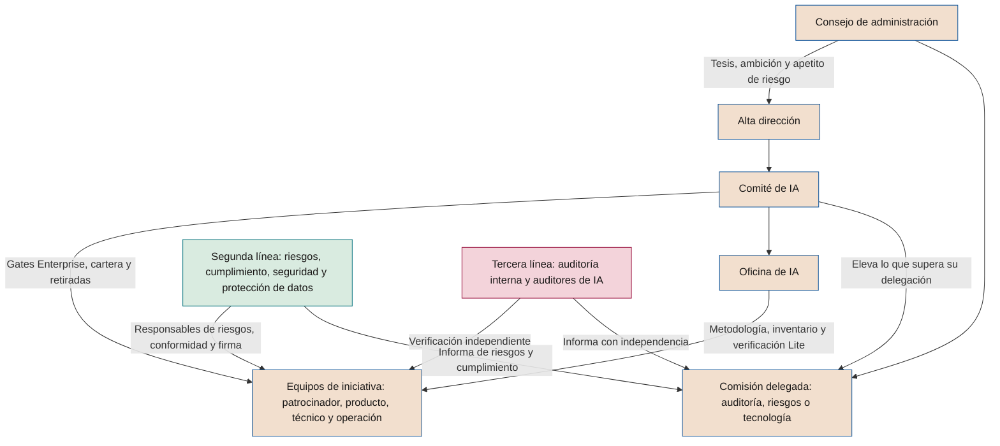

# Modelo de gobierno

**Órganos, roles, delegación de decisiones y escalado de la inteligencia artificial en la compañía**

| | |
|---|---|
| Documento | Documento 30 · Modelo de gobierno |
| Versión | 0.1 (borrador de trabajo) |
| Fecha | 16-09-2026 |
| Autor | Fernando García Varela |
| Estado | Borrador para revisión. Desarrolla la sección 8 del documento 01 y no puede contradecirla. |

<!-- cifras: 5 | órganos con mandato tipo ; 6 | roles con descripción de puesto ; 3 | líneas aplicadas a la IA ; 14 | situaciones de escalado con plazo -->

---

> **Aviso legal y exención de responsabilidad.** SEVEN-G es un marco metodológico de referencia que se ofrece «tal cual» y con fines exclusivamente informativos. No constituye asesoramiento jurídico, regulatorio, financiero ni profesional, ni garantiza el cumplimiento de ninguna norma. Las referencias a regulación general (como el Reglamento Europeo de IA, el RGPD, DORA o NIS2), a normas técnicas y a regulación específica de cada sector o jurisdicción pueden ser incompletas, no aplicar a un caso concreto o quedar desactualizadas por cambios normativos, interpretaciones o criterios de las autoridades posteriores a su fecha de consulta. **Cada organización que use SEVEN-G es la única responsable de identificar la normativa que le aplica, verificar su vigencia y certificar su propio cumplimiento regulatorio**, con el asesoramiento cualificado que corresponda. El autor no asume responsabilidad alguna por el uso que se haga de este contenido ni por las decisiones que se adopten con él. Los datos, cifras, compañías y casos de los ejemplos son ficticios o ilustrativos.

<!-- esencial: siempre | Tres garantías que no se reducen: quien construye no verifica ni decide su propio trabajo; la conformidad de riesgos es independiente del equipo; el consejo aprueba la dirección y el apetito de riesgo. En alcance Lite basta la sección 11 (órganos existentes con el mandato ampliado); los mandatos tipo, las matrices y la delegación completas son para alcance Enterprise. -->

## 1. Objeto y alcance

Este documento desarrolla el componente B de SEVEN-G en lo relativo a **quién decide, quién construye y quién controla** la inteligencia artificial. Convierte la sección 8 del documento 01 en elementos que una compañía puede aprobar y poner en marcha: mandatos de los órganos, descripciones de puesto, matrices de responsabilidad, matriz de delegación de decisiones y reglas de escalado.

Se aplica a los órganos que intervienen en el ciclo corporativo (C1–C5) y en el ciclo de vida (fases 0–7), a los seis roles de 01 §8.1 y a los cuatro tipos de uso de IA de 01 §1.2. Los criterios de *gate* están en el documento 21, la metodología de riesgos en el 33, el proceso de no conformidades e incidentes en el 37 y la auditoría en el 38.

### 1.1 Principios de diseño del gobierno

| # | Principio | Consecuencia en el modelo |
|---|---|---|
| 1 | **No crear un gobierno paralelo** (01 §8.3) | Los órganos pueden ser comités existentes con el mandato ampliado (sección 10). |
| 2 | **Separación de funciones** (principio 7) | Quien construye no verifica ni decide sobre su propio trabajo. Las incompatibilidades de 01 §8.2 son obligatorias. |
| 3 | **Proporcionalidad** | La intensidad Lite o Enterprise determina qué órgano decide. |
| 4 | **Decisión registrada** | Toda decisión con efecto en la cartera, el riesgo o el cumplimiento queda en T01 con decisor, fecha y motivo. |
| 5 | **Plazos conocidos** | Cada escalado tiene destinatario y plazo. |

### 1.2 Nota terminológica

En SEVEN-G, **Oficina de IA** designa la unidad interna de la compañía que da soporte metodológico, mantiene el inventario y consolida la medición. No debe confundirse con la **Oficina Europea de IA** de la Comisión Europea, prevista en el Reglamento (UE) 2024/1689. Si hay riesgo de confusión, la compañía puede llamarla "Oficina corporativa de IA" o "Centro de excelencia de IA".

---

## 2. Arquitectura de órganos

<!-- grafico: Órganos de gobierno de la IA | Quién fija la dirección, quién decide, quién construye y quién controla -->

| Órgano | Función principal en SEVEN-G | Frecuencia (01 §5.2) | Etapas |
|---|---|---|---|
| **Consejo de administración** | Fija dirección y límites; aprueba Transformar; supervisa. | Anual (C2, C5) y trimestral (C4) | C2, C4, C5 |
| **Comisión delegada** | Supervisa riesgos, cumplimiento, incidentes, no conformidades mayores y críticas, y auditorías. | Trimestral | C4, C5 |
| **Comité de IA** | Gestiona la cartera; decide *gates* Enterprise, retiradas y riesgos Altos. | Mensual | C1, C3, C4 |
| **Oficina de IA** | Metodología, inventario, verificación en Lite, medición e información a los órganos. | Continua | C1, C4, C5 |
| **Segunda línea** | Evalúa riesgos, emite conformidades y firma la puesta en producción Enterprise. | Continua | Todas |
| **Tercera línea** | Verifica con independencia y audita el cumplimiento del marco. | Plan anual y *gates* Enterprise | C4, C5 |

---

## 3. Mandatos tipo de los órganos

Los mandatos son **modelos para adaptar**. La compañía los aprueba en C2 y los incorpora al reglamento del órgano que asuma la función. Quórum y plazos son de referencia. El texto aprobable por artículos, con el modelo de nombramiento del responsable de IA, está en P38; las órdenes del día y actas, en P39.

### 3.1 Consejo de administración

| Elemento | Contenido tipo |
|---|---|
| **Mandato** | Ejercer la responsabilidad última sobre la estrategia, el apetito de riesgo y la supervisión de la IA. |
| **Funciones** | Aprobar la tesis de IA, la ambición por esfera y el apetito de riesgo con sus umbrales (C2). Aprobar la política corporativa de IA (documento 31). Aprobar las iniciativas de Transformar en G2 y su escalado en G7. Decidir, de forma excepcional, la aceptación de riesgos residuales Críticos dentro del apetito. Supervisar el panel del consejo (C4). Revisar madurez, índice de transformación y tesis (C5). |
| **Composición** | Pleno. Puede apoyarse en un consejero con experiencia en IA o en un asesor externo sin voto. |
| **Quórum** | El de sus estatutos y reglamento. |
| **Periodicidad** | Una sesión anual con punto monográfico y un punto trimestral de supervisión, que puede delegar en la comisión. |
| **Orden del día tipo (anual)** | 1. Madurez, índice de transformación y valor validado frente a declarado. 2. Tesis de IA y ambición por esfera. 3. Apetito de riesgo y umbrales (intensidad Enterprise, inversión, horizonte de retorno, regularización). 4. Iniciativas de Transformar (máximo tres en detalle). 5. Recomendaciones anteriores. 6. Acuerdos. |
| **Orden del día tipo (trimestral)** | 1. Cambios en el panel. 2. Incidentes S1 y S2, y no conformidades críticas. 3. Decisiones de *gate* relevantes y retiradas. 4. Riesgos fuera de apetito. 5. Recomendaciones abiertas y vencidas. |
| **Registro** | Acta y alta de cada acuerdo en el registro de recomendaciones y decisiones (T18). |

### 3.2 Comisión delegada

La compañía designa la comisión que supervisa la IA: **auditoría**, **riesgos** o **tecnología**. Si no existe ninguna, las funciones las ejerce el consejo.

| Elemento | Contenido tipo |
|---|---|
| **Mandato** | Supervisar la eficacia del control sobre la IA. |
| **Funciones** | Aprobar el plan anual de auditoría de IA y recibir sus resultados (documento 38). Recibir información de incidentes S1 y de no conformidades mayores y críticas. Resolver los desacuerdos entre el comité de IA y la segunda línea (sección 8.3). Decidir, por delegación del consejo, la aceptación excepcional de riesgos Críticos. Vigilar la independencia de los auditores de IA. Recibir las excepciones vigentes. |
| **Composición** | La de la comisión. Asisten sin voto el responsable de la Oficina de IA, el director de riesgos o cumplimiento y el responsable de auditoría interna. |
| **Periodicidad** | Trimestral, con sesión extraordinaria ante un incidente S1 o una no conformidad crítica si su presidencia lo decide. |
| **Orden del día tipo** | 1. Riesgos Altos y Críticos, y concentraciones. 2. Cumplimiento regulatorio y cambios normativos. 3. Incidentes y no conformidades mayores y críticas. 4. Auditorías y seguimiento de hallazgos. 5. Asuntos elevados. 6. Excepciones del trimestre. |

### 3.3 Comité de IA

| Elemento | Contenido tipo |
|---|---|
| **Mandato** | Gestionar la cartera de IA dentro de la tesis, la ambición y el apetito aprobados, y decidir lo que el consejo le delega. |
| **Funciones** | Aprobar el diagnóstico de C1 y la cartera de C3. Decidir los *gates* Enterprise (01 §7.5). Aceptar riesgos residuales Altos. Revisar la concentración de riesgos (principio 5). Decidir retiradas. Revisar iniciativas estancadas, condiciones vencidas y decisiones elevadas tras dos iteraciones. Aprobar la política de uso aceptable y las excepciones de su nivel. Elevar lo que supere su delegación. |
| **Presidencia** | Un miembro de la alta dirección con autoridad sobre la cartera. No debería presidirlo quien patrocine la mayor parte de la cartera. |
| **Miembros con voto** | Alta dirección de negocio (al menos dos áreas), tecnología, datos y personas. |
| **Miembros con voz y conformidad** | Riesgos, cumplimiento, seguridad de la información y protección de datos. Su conformidad es necesaria en su ámbito, pero no votan la decisión de negocio (sección 8.3). |
| **Invitados permanentes** | Responsable de la Oficina de IA (secretario, sin voto); auditoría interna como observador. |
| **Quórum** | Mayoría de los miembros con voto, incluida la presidencia o su suplente, y **al menos un representante de la segunda línea**. Sin segunda línea no se deciden G3, G5, aceptaciones de riesgo ni excepciones. |
| **Acuerdos** | Por consenso; si no lo hay, por mayoría de votos presentes, con voto de calidad de la presidencia. |
| **Abstención obligatoria** | Quien tenga rol de patrocinio o construcción en la iniciativa se abstiene y no computa para el quórum de ese punto (01 §7.4, regla 1). |
| **Periodicidad** | Mensual; extraordinaria para *gates* urgentes o incidentes S1. Se admite decisión por escrito para *gates* sin debate, con las mismas reglas. |
| **Orden del día tipo** | 1. Embudo: altas, cambios de fase, estancadas (documento 03). 2. *Gates* con verificación completada. 3. Desviaciones de valor y coste. 4. Riesgos Altos y Críticos, y concentración por esfera, proveedor o tecnología. 5. Incidentes, no conformidades y condiciones vencidas. 6. Retiradas y R6 caducadas. 7. Uso corporativo y no autorizado (T21). 8. Excepciones. 9. Asuntos para elevar. |
| **Registro** | Acta con acuerdos numerados; cada decisión de *gate* en T03 con P29. |

### 3.4 Oficina de IA

| Elemento | Contenido tipo |
|---|---|
| **Mandato** | Hacer que el marco funcione: metodología, inventario, información fiable y soporte a los equipos. |
| **Funciones** | Mantener el inventario (documento 32, T02) y el registro de iniciativas (T01). Custodiar metodología, plantillas y listas de verificación. Verificar los *gates* Lite en los que no haya participado. Consolidar la medición con control de gestión (documento 40). Preparar la información de los órganos. Coordinar la alfabetización en IA y la regularización del uso no autorizado (documento 31). Liderar C1 y C5. |
| **Composición** | Responsable de la Oficina y equipo reducido de metodología, cartera y medición. En organizaciones pequeñas, una persona a tiempo parcial (sección 11). |
| **Dependencia** | De la presidencia del comité de IA o de un directivo que no sea patrocinador habitual. |
| **Límite** | Si la Oficina construye soluciones, no verifica esas iniciativas: la verificación pasa a la segunda línea o al auditor de IA. |

### 3.5 Segunda y tercera línea

| Elemento | Segunda línea | Tercera línea |
|---|---|---|
| **Mandato** | Asegurar que los riesgos de IA se identifican, valoran, mitigan y aceptan por quien corresponde, y que se cumplen las obligaciones regulatorias. | Dar aseguramiento independiente sobre el diseño y la eficacia del gobierno de la IA. |
| **Funciones** | Designar responsables de riesgos de IA. Emitir conformidades (G3, G4 y G5 Lite; asuntos del comité). Firmar la puesta en producción Enterprise: riesgos y cumplimiento, seguridad y protección de datos (01 §6.7). Clasificación regulatoria y evaluaciones de impacto (documento 32). Mantener la metodología de riesgos (33) y el mapeo regulatorio (34). | Aportar o supervisar a los auditores de IA. Proponer el plan anual de auditoría de IA. Auditar el marco y la declaración de aplicación (01 §14). Participar en C5. Verificar el cierre de no conformidades. |
| **Composición** | Riesgos, cumplimiento, seguridad de la información, delegado de protección de datos y, cuando aplique, asesoría jurídica, con un coordinador único para la IA. | Auditoría interna, con auditores de IA propios o externos bajo su supervisión. |
| **Dependencia** | Fuera de las áreas que patrocinan la cartera. | Funcional de la comisión delegada; nunca del patrocinador. |
| **Periodicidad** | Continua; informe trimestral a la comisión. | Plan anual y *gates* Enterprise. |

---

## 4. Roles de la iniciativa: descripciones de puesto

Los seis roles son **funciones, no puestos**: una persona los asume para una iniciativa además de su puesto. Las dedicaciones son **orientativas** para empezar y deben calibrarse en C5 con datos propios.

| Rol | Misión y responsabilidades clave | Competencias | Perfil habitual | Dedicación orientativa (Lite · Enterprise) |
|---|---|---|---|---|
| **Patrocinador de IA** | Responde del valor y la inversión. Compromete presupuesto y personas; aprueba hipótesis y criterios de parada; decide *gates* Lite (01 §7.5); acepta riesgos Medios con conformidad de riesgos; asegura que la capacidad liberada se materializa; propone la retirada cuando el valor no se sostiene. | Negocio afectado; lectura de hipótesis e indicadores; riesgos de IA a nivel directivo (perfil F7 del documento 31); capacidad de parar. | Dirección del área que recibe el valor. | 2–4 h/mes · 4–8 h/mes más preparación de *gates* |
| **Responsable de producto de IA** | Responde de la hipótesis de valor, el uso real y la adopción. Redacta carta e hipótesis; mide línea base y piloto; prepara evidencias de fases 0, 1, 2 y 7; acepta riesgos Bajos con registro; coordina la adopción (documento 23); mantiene la ficha en T01. | Gestión de producto; diseño de experimentos y atribución; procesos; comunicación con usuarios; límites de la IA generativa. | Negocio, con experiencia en producto, procesos o transformación. | 10–30 % en fases activas · 50–100 % en fases 2–5 y 20–40 % en operación |
| **Responsable técnico de IA** | Responde de la solución, los datos, los modelos y la documentación técnica. Evalúa viabilidad técnica y de datos; diseña arquitectura, linaje, seguridad y reversión; dirige construcción o integración y pruebas. Forma parte del equipo: no verifica ni decide *gates* de su iniciativa (01 §8.1). | Ingeniería de datos y modelos; evaluación de IA generativa y agentes; seguridad de aplicaciones; integración; requisitos técnicos del Reglamento de IA según clasificación. | Arquitecto o jefe técnico de tecnología o datos. | 20–50 % en fases 3–5 · 50–100 % en fases 3–5 |
| **Responsable de operación de IA** | Responde de la estabilidad, la monitorización, los incidentes y los cambios. Prepara manual y monitorización; activa el interruptor de parada cuando procede; gestiona incidentes (documento 37) y cambios; aporta datos a R6. | Operación de servicios; observabilidad de modelos (degradación, deriva, coste); incidentes; control de cambios. | Responsable de la plataforma o del servicio de negocio. | 5–10 % en operación · 20–50 % en operación, con guardia en sistemas críticos |
| **Responsable de riesgos de IA** | Responde de la evaluación y el seguimiento de riesgos y cumplimiento. Coordina clasificación regulatoria y evaluaciones de impacto; valora riesgos inherentes y residuales; emite conformidad en G3, G4 y G5 Lite (sin verificarlos, 01 §7.5); propone la aceptación al nivel que corresponde; coordina la firma multinivel. | Gestión de riesgos; Reglamento de IA, RGPD y normativa sectorial; riesgos de IA generativa y agentes; independencia de criterio. | Segunda línea (riesgos, cumplimiento o protección de datos). | 1–3 días por iniciativa en fase 3 · 10–30 % en fases 3–5 |
| **Auditor de IA** | Verifica con independencia que las evidencias existen, son válidas y se elaboraron a tiempo. Verifica *gates* Enterprise y muestras Lite; emite Conforme, Conforme con observaciones o No conforme; registra no conformidades y verifica su cierre. | Auditoría y muestreo; SEVEN-G; lectura crítica de evaluaciones de modelos y agentes; conocimiento regulatorio; escepticismo profesional (38 §3). | Auditoría interna o auditor externo supervisado por ella. | Según plan de muestreo · 1–3 días por *gate* más continuidad |

**Roles de apoyo de los órganos**

| Rol | Función | Quién suele asumirlo |
|---|---|---|
| **Responsable de la Oficina de IA** | Dirige la Oficina, es secretario del comité de IA y responde de la calidad del inventario y de la información a los órganos. | Directivo con experiencia en transformación, cartera o gobierno de tecnología. |
| **Coordinador de segunda línea para la IA** | Consolida conformidades, firmas y el informe trimestral de riesgos de IA. | Riesgos o cumplimiento. |
| **Responsable de auditoría de IA** | Planifica, asigna auditores y responde de su independencia. | Auditoría interna. |
| **Consejero o asesor con experiencia en IA** | Apoya al consejo en la lectura del panel y las preguntas de supervisión. | Consejero independiente o asesor sin voto. |

---

## 5. Incompatibilidades

### 5.1 Entre roles de la iniciativa (01 §8.2, obligatorias)

| # | Regla | Intensidad |
|---|---|---|
| I-1 | El responsable de riesgos no puede ser patrocinador, producto, técnico ni operación de la misma iniciativa. | Todas |
| I-2 | El auditor de IA no puede asumir ningún otro rol en la misma iniciativa. | Todas |
| I-3 | Responsable de riesgos y auditor de IA de una iniciativa no pueden ser la misma persona. | Enterprise |
| I-4 | El patrocinador no puede ser a la vez producto, técnico u operación. | Enterprise (compatible en Lite) |
| I-5 | El auditor de IA no puede depender jerárquicamente del patrocinador. | Todas |

### 5.2 Entre órganos y roles

| # | Regla |
|---|---|
| I-6 | Un miembro del comité de IA con rol de patrocinio o construcción en una iniciativa se abstiene en sus decisiones. |
| I-7 | Quien verifica un *gate* no participa en su decisión. |
| I-8 | La Oficina de IA no verifica iniciativas en cuyo diseño, construcción u operación haya participado. |
| I-9 | Quien propone una excepción no la aprueba. |
| I-10 | Auditoría interna no audita actividades de las que haya sido responsable o sobre cuyos controles haya asesorado en los doce meses anteriores. |
| I-11 | Un proveedor de la solución no audita la iniciativa en la que participa ni evalúa su propio producto. |

Incumplir una incompatibilidad es **no conformidad mayor** (autoaprobación, 01 §12). Si afectó a G3 o G5, la verificación y la decisión se repiten.

---

## 6. Matrices de responsabilidad

**A** responde del resultado · **R** realiza · **C** es consultado · **I** es informado · **V** verifica · **D** decide (cuando quien decide no es quien responde del resultado).

### 6.1 Por fase del ciclo de vida

Las columnas de roles reproducen 01 §8.4 sin cambios; se añaden los órganos. En Lite, la verificación la realiza la Oficina de IA en todas las puertas según 01 §7.5, con auditoría por muestreo; el responsable de riesgos emite la conformidad en G3, G4 y G5.

| Fase | Patrocinador | Producto | Técnico | Operación | Riesgos | Auditor | Oficina de IA | Comité de IA | Consejo |
|---|---|---|---|---|---|---|---|---|---|
| 0 · Contexto | A | R | C | I | C | V | C (alta en inventario) · V Lite | D Enterprise | I si Transformar |
| 1 · Descubrimiento | A | R | C | I | C | V | C · V Lite | I | — |
| 2 · Hipótesis de valor | A | R | C | I | C | V | C · V Lite | D Enterprise | D si Transformar |
| 3 · Viabilidad y riesgo | A | R | R | C | R | V | C · V Lite | D Enterprise | I si riesgo Crítico |
| 4 · Diseño | I | C | A/R | C | C | V | V Lite | D Enterprise | — |
| 5 · Entrega y validación | I | A | R | C | C | V | C · V Lite | D Enterprise tras firma | — |
| 6 · Operación | I | C | C | A/R | C | V | C (medición) · V Lite (R6) | D en R6 Enterprise | I agregado (C4) |
| 7 · Evolución o retirada | A | R | C | C | C | V | C · V Lite | D Enterprise | D si escala Transformar |

### 6.2 Por actividad clave

| Actividad | Patrocinador | Producto | Técnico | Operación | Riesgos | Auditor | Oficina | Comité |
|---|---|---|---|---|---|---|---|---|
| Determinar la intensidad (P04) | A | R | C | I | C | V | C | I |
| Alta en el inventario (P05) | I | R | C | I | C | V | A | I |
| Clasificación regulatoria y evaluaciones de impacto (P11) | I | C | C | I | A/R (con protección de datos) | V | C | I |
| Matriz y registro de riesgos (P12) | C | R | R | C | A | V | I | I |
| Evaluación de proveedor (P14) | C | C | R | C | A | V | I | I |
| Diseño de supervisión humana y de seguridad (P17, P18) | I | C | A/R | C | C | V | I | I |
| Firma de puesta en producción (P23) | I | C | R (firma) | C | R (firma) | V | I | D |
| Seguimiento de realización de valor (P28) | A | R | I | C | I | V | R (consolida) | I |
| Plan de retirada (P30) | A | R | R | R | C | V | C | D Enterprise |

### 6.3 Por etapa del ciclo corporativo

| Etapa y actividad | Consejo | Comisión delegada | Alta dirección | Comité de IA | Oficina de IA | Segunda línea | Tercera línea |
|---|---|---|---|---|---|---|---|
| **C1** · Inventario de sistemas de IA | I | I | C | D | A/R | C | I |
| **C1** · Madurez con evidencia | I | I | C | D | A/R | C | C |
| **C1** · Índice de transformación, valor y coste actuales | I | — | C | D | A/R | I | I |
| **C2** · Tesis de IA y ambición por esfera | D | I | A/R | C | R (soporte) | C | I |
| **C2** · Apetito de riesgo y umbrales | D | C | A/R | C | R (soporte) | R | C |
| **C2** · Política corporativa de IA | D | C | A | C | R | R | C |
| **C2** · Presupuesto marco | D | — | A/R | C | C | I | — |
| **C3** · Cartera priorizada y equilibrio de ambición | I (D en Transformar) | — | C | A/D | R | C | I |
| **C3** · Criterios de retirada y capacidad | I | — | C | A/D | R | C | — |
| **C4** · Panel del consejo (trimestral) | D (supervisa) | I | C | C | A/R | C | I |
| **C4** · Seguimiento mensual de cartera | — | — | I | A/D | R | C | I |
| **C4** · Informe trimestral de riesgos, incidentes y no conformidades | I | D (supervisa) | I | C | C | A/R | C |
| **C4** · Plan y resultados de auditoría de IA | I | D | I | I | C | C | A/R |
| **C5** · Revisión de madurez, índice y tesis | D | C | A | C | R | C | R |
| **C5** · Lecciones aprendidas, plazos y umbrales para el nuevo ciclo | D | C | A | R | R | C | C |

---

## 7. Matriz de delegación de decisiones

La matriz fija **quién decide qué**. Lo que no figure aquí corresponde al comité de IA, que puede elevarlo. La compañía puede ajustarla en C2 sin rebajar los niveles de 01 y de la especificación común (§5.1).

### 7.1 Puertas de decisión

| Decisión | Lite: verifica | Lite: decide | Enterprise: verifica | Enterprise: decide | Transformar |
|---|---|---|---|---|---|
| G0 · Autorización | Oficina de IA | Patrocinador | Auditor de IA | Comité de IA | Informar al consejo |
| G1 · Oportunidad | Oficina de IA | Patrocinador | Auditor de IA | Patrocinador, informando al comité | — |
| G2 · Hipótesis | Oficina de IA | Patrocinador | Auditor de IA | Comité de IA | **Consejo** |
| G3 · Viabilidad | Oficina de IA | Patrocinador con conformidad de riesgos | Auditor de IA | Comité de IA | Consejo si se supera el límite de inversión por etapa |
| G4 · Diseño | Oficina de IA | Patrocinador con conformidad de riesgos | Auditor de IA | Comité de IA | — |
| G5 · Puesta en producción | Oficina de IA | Patrocinador con conformidad de riesgos | Auditor de IA | Comité de IA tras firma multinivel | — |
| R6 · Continuidad | Oficina de IA | Patrocinador | Auditor de IA | Comité de IA | — |
| G7 · Escalado o retirada | Oficina de IA | Patrocinador | Auditor de IA | Comité de IA | **Consejo** si se escala |
| *Gate* tras dos iteraciones | — | Comité de IA | — | Comisión delegada o consejo, según el asunto | Consejo |

### 7.2 Aceptación del riesgo residual

Escala de la especificación común (§5.1): nivel = probabilidad × impacto; Bajo 1–4, Medio 5–9, Alto 10–15, Crítico 16–25.

| Nivel residual | Quién acepta | Conformidad previa | Condiciones |
|---|---|---|---|
| **Bajo** | Responsable de producto | — | Registro en P12 con justificación. |
| **Medio** | Patrocinador | Responsable de riesgos | Registro en P12; revisión en el siguiente *gate* o R6. |
| **Alto** | Comité de IA | Segunda línea | Plan de mitigación con plazo; revisión al menos trimestral; visible para la comisión delegada. |
| **Crítico** | **No se acepta.** Excepcionalmente, solo el consejo o su comisión delegada. | Segunda línea y asesoría jurídica | Dentro del apetito aprobado en C2; validez limitada; plan para reducirlo. Sin esa aprobación bloquea G3 y G5. |

Reglas adicionales: (1) la aceptación caduca si cambian la clasificación regulatoria, la autonomía (A0–A3), la exposición o el proveedor principal; (2) la concentración de riesgos Altos aceptados en una esfera, proveedor o tecnología se revisa como riesgo de cartera y, si supera el apetito, se eleva al consejo; (3) una práctica prohibida por el artículo 5 del Reglamento (UE) 2024/1689 **no es aceptable por ningún órgano**.

### 7.3 Suspensiones, paradas y retiradas

| Decisión | Quién puede tomarla | Plazo | Ratificación |
|---|---|---|---|
| **Suspensión inmediata** (interruptor de parada o desconexión) ante incidente S1, posible práctica prohibida, fuga de datos o acción no autorizada de un agente | Responsable de operación; seguridad de la información; responsable de riesgos; cualquier miembro del comité de IA | Inmediato | Comité de IA en 2 días hábiles: reanudar, mantener o retirar. |
| **Suspensión preventiva** sin incidente (requerimiento de autoridad, cambio normativo) | Responsable de riesgos con el patrocinador | Hasta 5 días hábiles | Comité de IA, ordinario o extraordinario. |
| **Parada en un *gate*** | Órgano que decide el *gate* | En la decisión | Motivo codificado (documento 03). |
| **Retirada planificada** (G7) | Lite: patrocinador · Enterprise: comité de IA | Según P30 y T22 | Consejo informado si era Transformar. |
| **Retirada forzosa** (incumplimiento regulatorio, riesgo Crítico no aceptado, proveedor que deja de prestar servicio) | Comité de IA | En la sesión en que se conoce | Comisión delegada informada. |
| **Reanudación tras suspensión** | Comité de IA con conformidad de la segunda línea | Tras verificar la contención | Incidente o condición cerrados. |

La suspensión inmediata **no requiere autorización previa** y quien la activa de buena fe no sufre consecuencias por ello. El manual de operación (P24) identifica nominalmente quién puede activarla.

### 7.4 Excepciones

Una excepción autoriza temporalmente a no cumplir un requisito del marco o de la política. **Nunca** se admiten sobre prácticas prohibidas, obligaciones legales, separación de funciones en ningún *gate*, firma multinivel Enterprise ni existencia de un mecanismo de parada.

| Tipo | Ejemplo ilustrativo | Propone | Aprueba | Plazo máximo |
|---|---|---|---|---|
| **Metodológica menor** | Usar una plantilla propia equivalente. | Responsable de producto | Oficina de IA | Hasta el siguiente *gate* |
| **De política de uso** | Herramienta no catalogada en un piloto con datos ficticios. | Área solicitante | Oficina de IA con conformidad de seguridad | 90 días |
| **De requisito del ciclo de vida** | Aplazar una evidencia no crítica fuera de un "Continuar con condiciones". | Patrocinador | Comité de IA | 6 meses |
| **De umbral corporativo** | Superar el límite de inversión por etapa o el horizonte de retorno de C2. | Comité de IA | Consejo o comisión delegada | Según acuerdo |

Toda excepción se registra en P40 (EXC-AAAA-NNN) con justificación, riesgo, medidas compensatorias, caducidad y responsable. Una excepción vencida sin cierre es **no conformidad mayor**. La comisión delegada recibe cada trimestre las excepciones vigentes.

### 7.5 Otras decisiones delegadas

| Decisión | Decide | Conformidad previa | Informa a |
|---|---|---|---|
| Autorizar una herramienta de IA de uso corporativo | Oficina de IA; comité de IA si cumple un criterio Enterprise | Seguridad, protección de datos, compras | Comité de IA |
| Activar funciones de IA en software de terceros contratado | Propietario del sistema con la Oficina de IA | Seguridad y protección de datos | Registro en T02 |
| Cambiar la clasificación regulatoria de un sistema | Responsable de riesgos | Asesoría jurídica | Comité de IA |
| Elevar la autonomía a A2 o A3 | Comité de IA | Seguridad (documento 35) | Comisión delegada si hay exposición directa |
| Relajar criterios de parada | Órgano que autorizó la iniciativa (01 §7.4, regla 6) | Oficina de IA | Comité de IA |
| Contratar un proveedor N3 | Comité de IA | Segunda línea (documento 36) | Comisión delegada |
| Cerrar una no conformidad crítica | Comité de IA, tras verificación del auditor | — | Comisión delegada |
| Aprobar el plan anual de auditoría de IA | Comisión delegada | Propuesta de la tercera línea | Consejo |
| Aprobar la política corporativa de IA | Consejo | Comité de IA y segunda línea | Toda la organización |
| Aprobar la política de uso aceptable | Comité de IA | Segunda línea y personas | Comisión delegada |

---

## 8. Escalado

### 8.1 Reglas generales

1. **Escalar no traslada la responsabilidad**: quien escala sigue respondiendo de la contención mientras se decide.
2. **El plazo cuenta desde la detección**, no desde la confirmación.
3. **Se escala por el canal registrado** (T01 o T08) y, si el plazo es inferior a 24 horas, además por contacto directo con la persona designada.
4. **La falta de respuesta en plazo escala automáticamente** al siguiente nivel.
5. **Nadie puede bloquear un escalado.** Cualquier persona puede dirigirse a la segunda línea o al sistema interno de información de la compañía (en España, regulado por la Ley 2/2023, de 20 de febrero).

### 8.2 Tabla de escalado

Los plazos de incidentes son los tiempos de respuesta orientativos del documento 37 (§4.3); los de no conformidades, los de 01 §12. La compañía los aprueba en C2 sin superar los que fije la regulación.

| # | Qué se escala | A quién | Plazo de referencia | Qué se espera |
|---|---|---|---|---|
| E-1 | Incidente **S1** | Responsable de riesgos y presidencia del comité de IA → presidencia de la comisión delegada | Comité: 4 horas · Comisión: 24 horas | Contención, suspensión si procede, valoración inmediata de notificaciones. |
| E-2 | Incidente **S2** | Comité de IA (presidencia y responsable de riesgos) | 24 horas | Contención; información a la comisión en el informe trimestral. |
| E-3 | Incidentes **S3** y **S4** | Oficina de IA | Triaje en 1 y 5 días hábiles; informe mensual al comité | Registro y seguimiento. |
| E-4 | Posible **práctica prohibida** o posible **incidente grave** del Reglamento de IA | Responsable de riesgos, asesoría jurídica y presidencia del comité de IA | Inmediato, máximo 24 horas | Suspensión y análisis de obligaciones de notificación. |
| E-5 | **No conformidad crítica** | Comité de IA y comisión delegada | Contención 48 horas; plan 10 días | Aprobar contención y plan. |
| E-6 | **No conformidad mayor** | Comité de IA | Contención 10 días; plan 30 días | Aprobar plan. |
| E-7 | **No conformidad menor** | Oficina de IA | Antes del siguiente *gate* o revisión | Seguimiento. |
| E-8 | Riesgo residual **Crítico** identificado | Comité de IA; después, comisión o consejo si se propone aceptarlo | Comité: 5 días hábiles | Evitar, mitigar o proponer aceptación excepcional. |
| E-9 | Riesgo residual **Alto** nuevo o agravado en producción | Comité de IA | Siguiente sesión, máximo 30 días | Aceptar o exigir mitigación. |
| E-10 | *Gate* con **dos iteraciones** sin resolver | Órgano superior al que decide | Siguiente sesión del órgano superior | Decidir o fijar condiciones. |
| E-11 | Iniciativa **estancada** o *gate* fuera del plazo de decisión (03 §3.6) | Comité de IA | Revisión mensual | Desbloquear, poner en espera con motivo o parar. |
| E-12 | **Condición vencida** | Órgano que la impuso | 5 días hábiles | El resultado pasa a Iterar (01 §7.4, regla 4). |
| E-13 | **Desacuerdo** entre comité de IA y segunda línea | Comisión delegada | Siguiente sesión; extraordinaria en 10 días hábiles si bloquea una puesta en producción | Resolver (sección 8.3). |
| E-14 | **Requerimiento** de autoridad, reclamación formal o crisis de reputación vinculada a un sistema de IA | Asesoría jurídica, responsable de riesgos y presidencia del comité | Máximo 48 horas | Respuesta coordinada y valoración de suspensión. |

Se llevan además a la siguiente sesión del comité: valor realizado claramente inferior a la hipótesis en R6 (adelanta G7, 01 §6.8), coste recurrente por encima del presupuesto más la tolerancia de C2, R6 caducada, uso no autorizado con datos confidenciales o personales y dependencia excesiva de un proveedor.

Las **notificaciones a autoridades** (Reglamento de IA, RGPD, NIS2, DORA y normativa sectorial) tienen plazos propios, no sustituyen al escalado interno y se desarrollan en los documentos 34 y 37 (§5).

### 8.3 Resolución de desacuerdos con la segunda línea

La segunda línea no vota las decisiones de negocio, pero su **conformidad es necesaria** en G3, G5, aceptaciones de riesgo y excepciones. Si la deniega:

1. El comité de IA no puede decidir Continuar ni Continuar con condiciones en ese asunto.
2. Puede decidir Iterar, Pivotar o Parar, o elevar el desacuerdo a la comisión delegada (E-13).
3. La comisión resuelve con la información de ambas partes y su decisión se registra en T18.
4. En la firma multinivel Enterprise cada firmante tiene **veto** (01 §6.7), que solo levanta quien lo emitió, tras la corrección, o la comisión delegada.

---

## 9. Modelo de tres líneas aplicado a la IA

SEVEN-G sigue la lógica del modelo de las tres líneas del Instituto de Auditores Internos (IIA, 2020): el órgano de gobierno rinde cuentas; la dirección y la primera línea gestionan el riesgo al perseguir los objetivos; la segunda línea aporta experiencia, apoyo y cuestionamiento; la tercera da aseguramiento independiente.

| Línea | Quién en SEVEN-G | Qué hace sobre la IA | Qué no hace |
|---|---|---|---|
| **Órgano de gobierno** | Consejo y comisión delegada | Fija dirección y apetito; aprueba Transformar; supervisa. | Gestionar iniciativas ni decidir *gates* ordinarios. |
| **Primera línea** | Patrocinador, producto, técnico, operación; áreas usuarias; Oficina de IA en su gestión de cartera | Gestiona los riesgos de sus iniciativas y sistemas; aplica controles; mantiene evidencias; opera. | Verificar sus propias evidencias; aceptar riesgos por encima de su nivel. |
| **Segunda línea** | Riesgos, cumplimiento, seguridad, protección de datos; responsables de riesgos de IA | Metodología y mapeo regulatorio; cuestionamiento; conformidades; firma; supervisión de la cartera de riesgos. | Construir soluciones; decidir el valor de negocio. |
| **Tercera línea** | Auditoría interna y auditores de IA | Verificación de *gates* Enterprise; auditoría del marco, continuidad y temas; informe independiente a la comisión. | Diseñar controles que después audita; participar en iniciativas. |
| **Aseguramiento externo** | Auditor externo, entidad de certificación ISO/IEC 42001, organismo notificado cuando lo exija el Reglamento | Opinión o certificación independiente. | Sustituir responsabilidades internas. |

**Situaciones frontera**

| Situación | Tratamiento |
|---|---|
| La Oficina de IA verifica en Lite | Es verificación de gestión, no aseguramiento independiente; por eso el auditor de IA revisa una muestra de *gates* Lite (documento 38). |
| El delegado de protección de datos participa en la evaluación de impacto | Asesora y supervisa (RGPD, artículo 39); la evaluación la hace el responsable del tratamiento y el delegado no debería figurar como su autor. |
| Seguridad opera controles y además firma | La operación es primera línea; la firma la emite una persona distinta de quien operó el control. |
| Un equipo central construye y valida modelos | La validación independiente de modelos, cuando exista, se sitúa en segunda línea y no depende del equipo constructor. |

---

## 10. Integración en comités existentes

| Comité existente | Funciones de SEVEN-G que puede asumir | Condiciones |
|---|---|---|
| **Comité de dirección** | Comité de IA completo en organizaciones medianas. | Punto fijo mensual; segunda línea presente en ese punto; quórum de 3.3. |
| **Comité de transformación o estrategia digital** | Comité de IA. | Incorporar riesgos, cumplimiento, protección de datos y personas con conformidad. |
| **Comité de riesgos de la dirección** | Revisión de riesgos Altos y de concentración; informe a la comisión. | No decide *gates*. |
| **Comités de seguridad de la información y de protección de datos** | Firmas de seguridad y protección de datos; agentes y ataques con IA (35); evaluaciones de impacto; uso no autorizado con datos personales. | Registrar firmas en P23; coordinación con la clasificación (32). |
| **Comité de nuevos productos o de gobernanza de productos** | G2 y G5 de iniciativas con exposición directa a clientes en sectores regulados. | Aplicar los criterios de 21 además de los sectoriales. |
| **Comités de arquitectura, inversiones o compras** | Revisión técnica de G4; construir, comprar o aliarse; evaluación de proveedores N2 y N3. | La decisión sobre N3 y los *gates* Enterprise siguen en el comité de IA. |
| **Comité de ética, si existe** | Consulta en casos con impacto en personas o datos sensibles. | Consultivo; no sustituye a la segunda línea. |
| **Comisión de auditoría o de riesgos del consejo** | Comisión delegada para la IA. | Punto trimestral de IA; coordinación entre ambas en el plan de auditoría. |

**Pasos para integrar:** (1) mapear comités y reglamentos; (2) asignar cada función de las secciones 3 y 7 a un órgano, sin huecos ni duplicidades; (3) modificar los reglamentos; (4) aprobar la matriz de delegación en C2; (5) dar de alta órganos y personas en T01 para validar decisor y verificador. Esta secuencia encaja en el mes 3 de la primera implantación (01 §5.3) y se desarrolla en el documento 90.

---

## 11. Adaptación a organizaciones pequeñas

Una organización pequeña o mediana puede aplicar SEVEN-G con una estructura mínima si conserva **tres garantías irrenunciables**: quien construye no verifica ni decide su propio trabajo; alguien independiente del equipo emite la conformidad de riesgos; y el órgano de administración aprueba la dirección y el apetito de riesgo.

| Elemento | Estructura mínima |
|---|---|
| **Consejo** | Órgano de administración, sin comisión delegada. Punto de IA al menos trimestral con el panel del consejo (C4) y aprobación anual de la dirección y del apetito de riesgo (C2, C5), como en 01 §5.2. |
| **Comité de IA** | Comité de dirección con punto mensual de IA y orden del día propio. |
| **Oficina de IA** | Una persona con dedicación parcial (orientativamente, 10–30 %) que mantiene inventario, registro y plantillas. |
| **Segunda línea** | Responsable de cumplimiento, delegado de protección de datos o asesor externo, con conformidad documentada. |
| **Tercera línea** | Auditor externo o auditoría interna del grupo: revisión anual del marco, muestreo de los *gates* Lite (21 §10.3) y todos los *gates* de las iniciativas Enterprise. |
| **Roles de iniciativa** | Patrocinador, producto, técnico y operación pueden concentrarse en dos personas en Lite; riesgos y auditor siempre fuera del equipo. |
| **Intensidad** | Lite por defecto. Una iniciativa con un criterio Enterprise (01 §9.2) se gestiona con intensidad Enterprise completa (01 §9.3): auditor de IA en todos sus *gates* —externo si no hay nadie independiente dentro— y firma multinivel en G5. |
| **Herramientas** | Registro de iniciativas T01 o, si la compañía prefiere, una hoja de cálculo con el modelo de datos de 03. |

| Situación | Solución aceptable | No aceptable |
|---|---|---|
| Solo hay una persona técnica | Es técnico y operación; la Oficina verifica; un asesor externo da la conformidad de riesgos. | Que verifique sus propias evidencias. |
| No hay auditoría interna | Auditor externo por muestreo anual y en *gates* Enterprise. | Que el patrocinador actúe como auditor. |
| El director general patrocina todas las iniciativas | Decide los *gates* Lite; los Enterprise los decide el órgano de administración o un comité con al menos un miembro ajeno al patrocinio. | Que decida sus propios *gates* Enterprise. |

---

## 12. Conflictos de interés

| # | Situación | Riesgo | Tratamiento |
|---|---|---|---|
| CI-1 | Un miembro del comité patrocina la iniciativa que se decide. | Autoaprobación. | Abstención y registro (I-6). |
| CI-2 | La retribución variable del patrocinador depende del valor declarado. | Inflar valor o evitar parar. | Vincular objetivos a valor **validado** (regla 2 de medición). |
| CI-3 | Un empleado tiene relación con un proveedor evaluado. | Selección sesgada. | Declaración previa a P14 y exclusión. |
| CI-4 | El auditor procede del equipo constructor o el consultor que diseñó el sistema propone auditarlo. | Autorrevisión. | Enfriamiento de doce meses (I-10); prohibición (I-11). |
| CI-5 | La Oficina de IA tiene objetivos de volumen de iniciativas en producción. | Verificación laxa. | Objetivos de calidad del inventario, tiempo de decisión y valor validado. |
| CI-6 | Un consejero tiene intereses en un proveedor de IA de la compañía. | Decisión sesgada en Transformar o N3. | Régimen de conflictos del consejo; abstención. |

**Procedimiento.** (1) **Declaración** al asumir el rol (en P03) y cuando surja; los miembros de órganos, anualmente (P41). (2) **Valoración** por la Oficina de IA con cumplimiento: real, potencial o aparente. (3) **Medida**: abstención, sustitución, verificación adicional o régimen del consejo. (4) **Registro** en el registro de declaraciones y abstenciones de P41 y en el acta (P39) o el registro de decisión de *gate* (P29) de la decisión afectada. (5) **Comprobación** por el auditor de IA en cada *gate* Enterprise.

No declarar un conflicto que haya afectado a una decisión de *gate* es **no conformidad mayor**, sin perjuicio del código de conducta de la compañía.

---

## 13. Herramientas y plantillas asociadas

| Código | Nombre | Uso en este documento |
|---|---|---|
| **T01** | Registro de iniciativas | Órganos, personas y decisiones de las iniciativas. |
| **T03** | Gestor de *gates* | Verificador y decisor por *gate*; bloqueo de autoaprobación. |
| **T08** | Registro de no conformidades e incidentes | Escalado con plazos y alertas. |
| **T18** | Registro de recomendaciones del consejo | Acuerdos del consejo y de la comisión delegada. |
| **T22** | Gestor de retiradas | Retiradas planificadas y forzosas. |
| **P03** | Registro de asignación de roles | Asignación, incompatibilidades y conflictos. |
| **P23** | Firma de puesta en producción | Firma multinivel con veto. |
| **P29** | Registro de decisión de *gate* | Decisión, decisor, verificador y condiciones. |
| **P30** | Decisión de escalado o retirada | Decisiones de G7. |
| **P38** | Reglamento de los órganos de gobierno de IA | Texto aprobable de los mandatos de la sección 3 y nombramiento del responsable de IA. |
| **P39** | Orden del día y acta de órgano de gobierno | Sesiones de los órganos, acuerdos y votaciones. |
| **P40** | Solicitud y registro de excepciones | Excepciones de la sección 7.4. |
| **P41** | Declaraciones de independencia y conflictos de interés | Declaraciones, abstenciones y medidas de la sección 12. |
| **P42** | Informe trimestral de segunda línea | Información trimestral a la comisión delegada (sección 6.3). |

**Requisitos para las herramientas:** T01 y T03 deben impedir registrar como decisor o verificador a una persona con rol incompatible; registrar abstenciones; exigir la segunda línea en G3, G5, aceptaciones de riesgo y excepciones; y generar alertas con los plazos de la sección 8.2.

---

## 14. Documentos relacionados

| Documento | Relación |
|---|---|
| **01 · Metodología fundacional** | Fuente normativa de roles, órganos, incompatibilidades, *gates* y no conformidades. |
| **03 · Herramientas y registro de iniciativas** | Registro de decisiones, plazos de referencia e iniciativas estancadas. |
| **13 · Tesis de IA, ambición y apetito de riesgo** | Umbrales de la matriz de delegación. |
| **21 · Criterios de *gate* y auditoría** | Lo que se verifica y decide en cada *gate*. |
| **31 · Política corporativa y uso aceptable** | Políticas que aprueban los órganos; perfiles de formación. |
| **32 · Inventario y clasificación regulatoria** | Responsabilidades sobre inventario y clasificación. |
| **33 · Metodología de riesgos de IA** | Escala de riesgo y aceptación. |
| **35 · Seguridad de IA y agentes** | Autonomía e interruptor de parada. |
| **36 · Terceros y proveedores de IA** | Niveles N1–N3. |
| **37 · No conformidades e incidentes** | Tiempos de respuesta, notificaciones y proceso. |
| **38 · Marco de auditoría de IA** | Independencia y función del auditor de IA. |
| **90 · Guía de implantación** | Puesta en marcha del modelo. |

Este documento no constituye asesoramiento jurídico.

---

## 15. Control de versiones

| Versión | Fecha | Cambios |
|---|---|---|
| 0.1 | 16-09-2026 | Primera versión. Desarrolla 01 §8 con mandatos tipo de los órganos, descripciones de puesto de los seis roles, incompatibilidades entre órganos y roles, matrices de responsabilidad por fase, actividad y etapa corporativa, matriz de delegación (*gates*, aceptación de riesgo, suspensiones y retiradas, excepciones), escalado con plazos alineados con el documento 37, modelo de tres líneas, integración en comités existentes, adaptación a organizaciones pequeñas y conflictos de interés. Ajustes de coherencia con 01 (separación de funciones en Lite, resultados de R6, criterio de agentes) y con 34 y 37. |
| 0.1 | 19-09-2026 | Adaptación a organizaciones pequeñas (11) alineada con 01 §5.2 y §9.3: consejo al menos trimestral, comité mensual y, en las iniciativas Enterprise, auditor de IA en todos los *gates*. |
