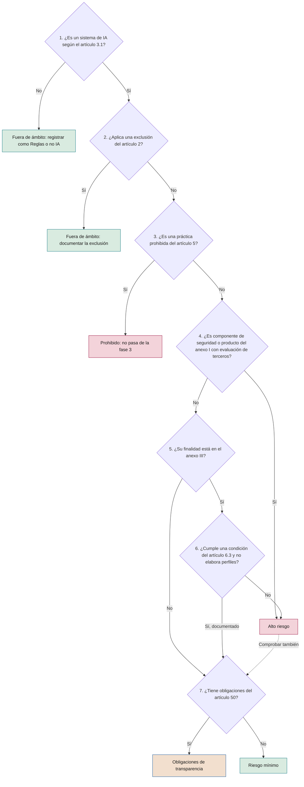

# Inventario de sistemas de IA y clasificación regulatoria

**Qué se inventaría, con qué campos, cómo se clasifica según el Reglamento Europeo de IA y qué evaluaciones se derivan**

| | |
|---|---|
| Documento | Documento 32 · Inventario y clasificación regulatoria |
| Versión | 0.1 (borrador de trabajo) |
| Fecha | 16-09-2026 |
| Autor | Fernando García · SEACHAD |
| Estado | Borrador para revisión. Referencias regulatorias consultadas el 16-09-2026, tras la entrada en vigor del Reglamento (UE) 2026/1744; verificar su vigencia antes de aplicar. |

<!-- cifras: 4 | tipos de uso inventariados ; 9 | pasos del árbol de clasificación ; 3 | evaluaciones derivadas ; 8 | indicadores de calidad del inventario -->

---

> **Aviso legal y exención de responsabilidad.** SEVEN-G es un marco metodológico de referencia que se ofrece «tal cual» y con fines exclusivamente informativos. No constituye asesoramiento jurídico, regulatorio, financiero ni profesional, ni garantiza el cumplimiento de ninguna norma. Las referencias a regulación general (como el Reglamento Europeo de IA, el RGPD, DORA o NIS2), a normas técnicas y a regulación específica de cada sector o jurisdicción pueden ser incompletas, no aplicar a un caso concreto o quedar desactualizadas por cambios normativos, interpretaciones o criterios de las autoridades posteriores a su fecha de consulta. **Cada organización que use SEVEN-G es la única responsable de identificar la normativa que le aplica, verificar su vigencia y certificar su propio cumplimiento regulatorio**, con el asesoramiento cualificado que corresponda. El autor y SEACHAD no asumen responsabilidad alguna por el uso que se haga de este contenido ni por las decisiones que se adopten con él. Los datos, cifras, compañías y casos de los ejemplos son ficticios o ilustrativos.

## 1. Objeto y alcance

El inventario de sistemas de IA es la **base de todo el gobierno**: sin saber qué sistemas existen, quién responde de ellos y cómo se clasifican, no se pueden gestionar riesgos, cumplir obligaciones, auditar ni informar al consejo. La metodología fundacional lo exige en C1 (01 §5.1), en la fase 0 (alta en el inventario) y como condición para declarar que se aplica SEVEN-G (01 §14, condición 2).

Este documento define:

- Qué se inventaría y qué no (sección 2).
- Los campos del inventario, coherentes con la taxonomía controlada del documento 03 (sección 3).
- Los roles que puede tener la compañía según el Reglamento (UE) 2024/1689 (sección 4).
- El árbol de clasificación regulatoria paso a paso (sección 5).
- Las evaluaciones que se derivan de la clasificación (sección 6).
- Los procedimientos de alta, revisión y baja (sección 7).
- La calidad del inventario y la detección de sistemas no inventariados (secciones 8 y 9).

La clasificación regulatoria que aquí se describe es un **método de trabajo** para ordenar el análisis. No sustituye el criterio jurídico cualificado que exige 01 §6.5. La clasificación y las obligaciones que se derivan son orientativas: la responsabilidad de la clasificación regulatoria de cada sistema y del cumplimiento, incluida la regulación sectorial aplicable, es de la organización (documento 93, sección 11).

### 1.1 Estado regulatorio a la fecha de consulta

Consulta realizada el 16-09-2026 en fuentes oficiales de la Unión Europea (EUR-Lex y páginas de la Comisión Europea sobre el Reglamento de IA).

| Fecha | Qué se aplica | Fuente |
|---|---|---|
| 1-8-2024 | Entrada en vigor del Reglamento (UE) 2024/1689. | Artículo 113 |
| 2-2-2025 | Disposiciones generales (incluida la alfabetización en IA) y prácticas prohibidas. | Artículo 113 |
| 2-8-2025 | Obligaciones de los proveedores de modelos de IA de uso general; gobernanza. | Artículo 113 |
| 2-8-2026 | Obligaciones de transparencia del artículo 50 y resto de disposiciones de aplicación general no aplazadas. | Artículo 113; Reglamento (UE) 2026/1744 |
| 2-12-2026 | Nueva práctica prohibida relativa a sistemas que generan contenido sexual explícito no consentido o material de abuso sexual infantil; fin del periodo transitorio del artículo 50.2 para sistemas ya comercializados. | Reglamento (UE) 2026/1744 |
| 2-12-2027 | Obligaciones de los sistemas de alto riesgo del anexo III. | Reglamento (UE) 2026/1744 |
| 2-8-2028 | Obligaciones de los sistemas de alto riesgo vinculados a productos del anexo I. | Reglamento (UE) 2026/1744 |

El Reglamento (UE) 2026/1744 (Ómnibus digital sobre IA) se publicó en el Diario Oficial el 24-07-2026 y entró en vigor el 27-07-2026. Modifica además el artículo 4 (alfabetización), simplifica la información que deben registrar los proveedores que aplican la excepción del artículo 6.3 y amplía la base para tratar categorías especiales de datos con el fin de detectar y corregir sesgos. **Antes de aplicar este documento debe consultarse el texto consolidado vigente**, porque la numeración y el contenido de algunos apartados pueden haber cambiado.

---

## 2. Qué se inventaría

### 2.1 Los cuatro tipos de uso

Se inventarían **todos los sistemas de IA** de los cuatro tipos de uso de 01 §1.2, con independencia de su riesgo o de quién los haya desarrollado.

| Tipo de uso | Qué se registra | Unidad de registro | Nivel de detalle |
|---|---|---|---|
| **Iniciativa de IA** | Cada sistema que forma parte de una iniciativa propia: modelos predictivos, soluciones de IA generativa, agentes, automatizaciones con IA desarrolladas o adaptadas por la compañía. | Un registro por sistema desplegado. Una iniciativa puede tener varios sistemas y un sistema puede servir a varias iniciativas. | Completo. |
| **IA de terceros integrada en procesos** | Software de un proveedor con funciones de IA que intervienen en decisiones, operaciones o relación con clientes. | Un registro por función de IA con finalidad diferenciada dentro del producto. | Completo. |
| **Uso corporativo de IA de propósito general** | Asistentes, suites de productividad y herramientas del catálogo autorizado (documento 31). | Un registro por herramienta autorizada; los usos concretos no se registran individualmente salvo que pasen al ciclo completo. | Reducido, con licencias y condiciones. |
| **Uso no autorizado** | Herramientas detectadas sin aprobación. | Un registro por herramienta y ámbito de detección. | Mínimo, hasta su regularización. |

### 2.2 Casos frontera

| Caso | ¿Se inventaría? | Criterio |
|---|---|---|
| Reglas de negocio deterministas sin inferencia | Sí, como "Reglas (no es IA)", cuando se hayan presentado o percibido como IA. | Evita discusiones recurrentes y documenta la conclusión del paso 1 del árbol. |
| Sistema de IA en pruebas en un entorno aislado sin datos reales | Sí, con estado "En evaluación". | Permite detectar el paso a uso real sin *gate*. |
| Modelo de IA de uso general contratado por API, sin sistema construido encima | Se registra como componente del proveedor en T09 y se vincula a los sistemas que lo usan. | El modelo no es por sí mismo un sistema de IA; los sistemas que lo integran sí. |
| Función de IA de un producto contratado que está desactivada | Sí, con estado "En evaluación" o "Retirado" según la decisión, para controlar su activación futura. | Documento 31 §5.6. |
| IA usada por un proveedor para prestar un servicio externalizado a la compañía | Sí, cuando interviene en decisiones sobre clientes o empleados de la compañía o trata sus datos. | Riesgo de terceros (documento 36). |
| Herramientas de seguridad con IA (detección de amenazas) | Sí. | Tratan datos y pueden tomar acciones automáticas. |
| Uso personal fuera del trabajo | No. | Fuera del ámbito de la compañía. |

---

## 3. Campos del inventario

### 3.1 Convenciones

- **Tipo**: Texto · Texto largo · Lista (un valor) · Lista múltiple · Fecha (`AAAA-MM-DD` en la herramienta; `DD-MM-AAAA` en documentos) · Número · Importe (€) · Persona · Referencia (código de otra entidad) · Sí/No.
- **Obligatorio**: **Sí** siempre · **Cond.** según la condición indicada · **Ent.** obligatorio en Enterprise y opcional en Lite · **No**.
- "Sin dato" no es cero ni "No": un campo obligatorio sin información se registra como pendiente y cuenta en los indicadores de calidad (sección 8).
- **Código del sistema**: se propone el formato `SIA-AAAA-NNN` (AAAA = año de alta; NNN = número correlativo que no se reinicia ni se reutiliza). *Propuesta pendiente de incorporar a la especificación común (§5.9).*

### 3.2 Identificación y responsables

| Campo | Descripción | Tipo | Obligatorio | Valores |
|---|---|---|---|---|
| Código del sistema | Identificador persistente. | Texto | Sí | `SIA-AAAA-NNN` |
| Nombre | Nombre usado en la compañía. | Texto | Sí | — |
| Qué es y para qué se usa | Explicación comprensible para quien no es especialista (regla 10 de medición). | Texto largo | Sí | Una o dos frases |
| Tipo de uso | Tipo de 01 §1.2. | Lista | Sí | Iniciativa de IA · IA de terceros integrada en procesos · Uso corporativo de IA de propósito general · Uso no autorizado |
| Iniciativas vinculadas | Iniciativas del registro que usan el sistema. | Referencia múltiple | Cond.: tipos iniciativa e IA de terceros integrada | `IA-AAAA-NNN` |
| Área responsable | Unidad que usa el sistema y responde de él. | Lista (catálogo de la compañía) | Sí | — |
| Sociedad | Sociedad del grupo que lo despliega. | Lista | Cond.: grupos | — |
| Fecha de alta | Fecha de registro en el inventario. | Fecha | Sí | — |
| Origen del alta | Cómo llegó al inventario. | Lista | Sí | Fase 0 · Diagnóstico C1 · Compras o renovación · Detección técnica · Comunicación interna · Auditoría · Aviso del proveedor |
| Responsable del sistema | Persona que responde del uso: el responsable de producto de la iniciativa o, en uso corporativo, el propietario designado del servicio. | Persona | Sí (salvo uso no autorizado: responsable de la regularización) | — |
| Patrocinador | Patrocinador de IA. | Persona | Cond.: tipos iniciativa e IA de terceros integrada | — |
| Responsable técnico | Responsable técnico de IA. | Persona | Cond.: en desarrollo o producción | — |
| Responsable de operación | Responsable de operación de IA. | Persona | Cond.: en producción | — |
| Responsable de riesgos | Responsable de riesgos de IA. | Persona | Sí, desde la clasificación provisional | — |

### 3.3 Descripción técnica y de uso

| Campo | Descripción | Tipo | Obligatorio | Valores |
|---|---|---|---|---|
| Estado del sistema | Situación del sistema (distinta del estado de la iniciativa en 03 §3.2). | Lista | Sí | En evaluación · En desarrollo · Piloto · En producción · Suspendido · Retirado · Bloqueado |
| Tecnología | Taxonomía de 03 §3.3. | Lista múltiple | Sí | ML predictivo · IA generativa · Agente · Procesamiento de lenguaje y documentos · Visión · Optimización · IA de terceros embebida · Reglas (no es IA) |
| Exposición | Taxonomía de 03 §3.3. | Lista | Sí | Interna · Empleados · Clientes de forma indirecta · Clientes o personas externas de forma directa |
| Esfera principal | Taxonomía de 03 §3.3. | Lista | Cond.: tipos iniciativa e IA de terceros integrada | 01 Cliente … 09 Gobierno de la IA |
| Intensidad | Lite o Enterprise (01 §9). | Lista | Cond.: tipos iniciativa e IA de terceros integrada | Lite · Enterprise |
| Autonomía | Nivel de la especificación común (§5.4). | Lista | Sí | A0 Asistencia · A1 Recomendación · A2 Actuación supervisada · A3 Actuación autónoma |
| Acciones que puede ejecutar | Para A2 y A3. | Lista múltiple | Cond.: A2 o A3 | Lectura · Escritura en sistemas · Comunicaciones externas · Pagos o compromisos económicos · Cambios en sistemas de producción |
| Decisiones sobre personas | Si el resultado influye de forma significativa en decisiones que afectan a personas. | Sí/No | Sí | — |
| Ámbito de la decisión sobre personas | Para qué decisiones. | Lista múltiple | Cond.: decisiones sobre personas = Sí | Empleo y relaciones laborales · Crédito · Seguros · Acceso a servicios esenciales · Educación · Sanidad · Otras (especificar) |
| Supervisión humana | Tipo de supervisión definida en el diseño (P17). | Lista | Cond.: en producción | Validación de cada resultado · Revisión por muestreo · Supervisión de agregados con interruptor de parada · Ninguna |
| Interruptor de parada | Existe mecanismo probado para detener el sistema. | Lista | Cond.: en producción | Sí, probado · Sí, sin probar · No · No aplica |
| Fecha de puesta en producción | Fecha de G5 o de inicio de uso real. | Fecha | Cond.: en producción | — |
| Usuarios o volumen | Usuarios activos o volumen de uso. | Número | Ent. | — |
| Licencias asignadas y activas | Solo uso corporativo. | Número | Cond.: uso corporativo | — |
| Categoría en el catálogo | Solo uso corporativo (documento 31 §4.2). | Lista | Cond.: uso corporativo | Autorizada · Autorizada con restricciones · No autorizada |

### 3.4 Clasificación regulatoria

| Campo | Descripción | Tipo | Obligatorio | Valores |
|---|---|---|---|---|
| ¿Es sistema de IA? | Resultado del paso 1 del árbol. | Lista | Sí | Sí · No · Dudoso (requiere revisión jurídica) |
| Exclusión de ámbito | Resultado del paso 2. | Lista | Cond.: es sistema de IA | Ninguna · Seguridad nacional o defensa · Investigación científica · Investigación y desarrollo previos a la comercialización · Otra (especificar) |
| Clasificación regulatoria | Taxonomía de 03 §3.3. Si concurren varias, se registra la **más exigente** y las demás en los campos siguientes. | Lista | Sí | Prohibido · Alto riesgo · Obligaciones de transparencia · Riesgo mínimo · Fuera de ámbito · Pendiente de clasificar |
| Estado de la clasificación | Provisional (fase 0) o definitiva (fase 3). | Lista | Sí | Provisional · Definitiva · En revisión |
| Base de alto riesgo | Por qué es de alto riesgo. | Lista | Cond.: alto riesgo | Anexo I (componente de seguridad o producto) · Anexo III |
| Punto del anexo III | Ámbito concreto. | Lista | Cond.: base anexo III, o excepción del artículo 6.3 | 1 Biometría · 2 Infraestructuras críticas · 3 Educación y formación profesional · 4 Empleo, gestión de trabajadores y acceso al autoempleo · 5 Acceso a servicios privados esenciales y a servicios y prestaciones públicos esenciales · 6 Garantía del cumplimiento del Derecho · 7 Migración, asilo y control fronterizo · 8 Administración de justicia y procesos democráticos (con letra) |
| Excepción del artículo 6.3 | Condición aplicada para concluir que un sistema del anexo III no es de alto riesgo. | Lista | Cond.: anexo III no alto riesgo | a) Tarea de procedimiento limitada · b) Mejora del resultado de una actividad humana previa · c) Detección de patrones sin sustituir ni influir la valoración humana previa · d) Tarea preparatoria |
| Elaboración de perfiles | Si el sistema elabora perfiles de personas físicas (impide aplicar la excepción del artículo 6.3). | Sí/No | Cond.: anexo III | — |
| Obligaciones de transparencia | Apartados del artículo 50 aplicables, también si el sistema es de alto riesgo. | Lista múltiple | Sí | Ninguna · 50.1 Interacción con personas · 50.2 Marcado de contenido sintético · 50.3 Reconocimiento de emociones o categorización biométrica · 50.4 Ultrasuplantaciones y textos de interés público |
| Rol de la compañía | Rol según el Reglamento (sección 4). | Lista múltiple | Cond.: dentro de ámbito | Proveedor · Responsable del despliegue · Importador · Distribuidor · Representante autorizado · Fabricante del producto |
| Posible asunción del rol de proveedor | Supuesto del artículo 25.1 que puede convertir a la compañía en proveedor de un sistema de alto riesgo. | Lista | Cond.: alto riesgo de un tercero | No · Nombre o marca propios · Modificación sustancial · Cambio de finalidad prevista |
| Modelo de IA de uso general subyacente | Modelo y proveedor. | Texto | Cond.: tecnología IA generativa o agente | — |
| Relación con el modelo de uso general | Qué hace la compañía con el modelo. | Lista | Cond.: hay modelo de uso general | Uso por API o servicio · Ajuste o modificación del modelo · Desarrollo propio del modelo · Comercialización del modelo |
| Modelo con riesgo sistémico | Según la información del proveedor o la designación de la Comisión. | Lista | Cond.: hay modelo de uso general | Sí · No · Sin dato |
| Fecha de aplicación de obligaciones | Fecha desde la que son exigibles las obligaciones principales (sección 1.1). | Fecha | Cond.: dentro de ámbito | — |
| Justificación de la clasificación | Razonamiento por pasos del árbol, con referencias. | Texto largo | Sí | — |
| Revisión jurídica | Si la clasificación ha contado con criterio jurídico cualificado. | Sí/No | Sí para la clasificación definitiva | — |
| Clasificado por · fecha | Responsable de riesgos y fecha. | Persona · Fecha | Sí | — |
| Próxima revisión | Fecha de revisión programada. | Fecha | Sí | — |

### 3.5 Evaluaciones y obligaciones

Estados comunes: **Hecho · Pendiente · No aplica**, coherentes con el esquema de datos del panel del consejo. Cada evaluación en estado Hecho enlaza a su evidencia, versión y fecha (03 §2, principio 4).

| Campo | Descripción | Tipo | Obligatorio |
|---|---|---|---|
| Evaluación de impacto en protección de datos (RGPD, artículo 35) | Estado, fecha, enlace. | Lista · Fecha · Referencia | Sí si trata datos personales |
| Evaluación de impacto en derechos fundamentales (artículo 27) | Estado, fecha, enlace, fecha de notificación a la autoridad. | Lista · Fecha · Referencia | Cond.: supuestos de la sección 6.2 |
| Evaluación de conformidad (artículo 43) | Estado; procedimiento (control interno u organismo notificado); declaración UE de conformidad. | Lista · Referencia | Cond.: la compañía es proveedor de un sistema de alto riesgo |
| Documentación de la excepción del artículo 6.3 | Evaluación documentada antes de la comercialización o puesta en servicio. | Lista · Referencia | Cond.: excepción aplicada como proveedor |
| Registro en la base de datos de la UE (artículo 49) | Estado y referencia de registro. | Lista · Texto | Cond.: alto riesgo del anexo III, excepción del artículo 6.3 como proveedor, o responsable del despliegue que sea autoridad pública |
| Información a trabajadores y a su representación | Artículo 26.7 del Reglamento y, en España, artículo 64.4.d) del Estatuto de los Trabajadores. | Lista · Fecha | Cond.: uso en el ámbito laboral |
| Evaluación de seguridad | Documento 35; incluye pruebas de inyección de instrucciones en IA generativa y agentes. | Lista · Fecha | Ent.; Sí si A2 o A3 |
| Evaluación del proveedor | P14, documento 36. | Lista · Referencia | Cond.: hay proveedor |
| Instrucciones de uso del proveedor | Disponibles y aplicadas (artículo 26.1). | Lista | Cond.: responsable del despliegue de alto riesgo |
| Conservación de registros | Periodo de conservación de los registros generados automáticamente (al menos seis meses para responsables del despliegue de alto riesgo, artículo 26.6, salvo otra norma). | Número (meses) | Cond.: alto riesgo |

### 3.6 Datos, terceros, riesgo y ciclo

| Campo | Descripción | Tipo | Obligatorio | Valores |
|---|---|---|---|---|
| Categorías de información tratada | Nivel más alto de información que trata. | Lista múltiple | Sí | Sin datos personales · Datos personales · Categorías especiales de datos · Información [Confidencial] · Información [Restringida] |
| Base jurídica del tratamiento | Para datos personales. | Texto | Cond.: datos personales | — |
| Uso de datos por el proveedor para entrenamiento | Condición contractual. | Lista | Cond.: hay proveedor | No · Sí · Sin dato |
| Localización del tratamiento | Dónde se tratan los datos. | Lista | Cond.: hay proveedor | Espacio Económico Europeo · Fuera con garantías adecuadas · Sin dato |
| Proveedores | Terceros que intervienen. | Referencia múltiple (T09) | Cond.: hay proveedor | — |
| Nivel de exigencia al tercero | Especificación común §5.6. | Lista | Cond.: hay proveedor | N1 Estándar · N2 Reforzado · N3 Crítico |
| Riesgo residual principal | Especificación común §5.1. | Lista | Cond.: clasificación definitiva | Bajo · Medio · Alto · Crítico |
| No conformidades abiertas | Número y enlace a T08. | Número · Referencia | Sí (0 si no hay) | — |
| Incidentes en los últimos 12 meses | Número por severidad. | Número | Cond.: en producción | S1 · S2 · S3 · S4 |
| Última revisión de continuidad (R6) | Fecha. | Fecha | Cond.: en producción | — |
| Próxima revisión de continuidad | Trimestral en Enterprise, semestral en Lite. | Fecha | Cond.: en producción | — |
| Coste recurrente anual | Referencia al cálculo por caso (documento 42). | Importe (€) con estado | Ent. | Validado · Declarado · Estimado |
| Fecha de baja | Fecha de retirada o bloqueo. | Fecha | Cond.: retirado o bloqueado | — |
| Motivo de baja | Taxonomía de 03 §3.3. | Lista | Cond.: retirado | Sin valor plausible · Hipótesis refutada · Datos insuficientes · Inviable técnicamente · Coste superior al valor · Riesgo inaceptable · Regulación · Sin adopción · Sustituida por otra solución · Cambio de prioridad estratégica |
| Decisor de la baja · sustituto | Órgano que decide y sistema que lo sustituye. | Persona u órgano · Referencia | Cond.: retirado | — |
| Tratamiento de datos y modelos en la baja | Conservación, borrado o transferencia; confirmación del proveedor. | Texto largo | Cond.: retirado | — |

### 3.7 Campos mínimos por tipo de uso

| Bloque | Iniciativa | IA de terceros integrada | Uso corporativo | Uso no autorizado |
|---|---|---|---|---|
| Identificación y responsables | Completo | Completo | Sin patrocinador | Código, nombre, qué es, tipo, área, alta, origen, responsable de la regularización |
| Descripción técnica y de uso | Completo | Completo | Estado, tecnología, exposición, autonomía, licencias, categoría | Estado, tecnología, autonomía |
| Clasificación regulatoria | Completo | Completo | Es IA, clasificación, transparencia, rol, modelo de uso general | Clasificación provisional |
| Evaluaciones | Según clasificación | Según clasificación | Protección de datos, proveedor, seguridad | — |
| Datos, terceros, riesgo y ciclo | Completo | Completo | Información tratada, uso de datos por el proveedor, localización, proveedor, nivel | Información expuesta, proveedor, no conformidad |

### 3.8 Correspondencia con el esquema del panel del consejo

El inventario alimenta el panel (T17). Correspondencias principales con el esquema de datos del panel: `reporte_compania.clasificacion_ria` (prohibido, alto_riesgo, transparencia, minimo, no_es_ia) se obtiene de *Clasificación regulatoria* (Fuera de ámbito por no ser IA → `no_es_ia`); `reporte_compania.controles` (`RIA`, `FRIA`, `DPIA`, `seguridad`…) de la sección 3.5; `tags.exposicion` y `tags.tecnologia` de la sección 3.3; `estado` del caso (En uso, En desarrollo, POC, Desenganchado) de *Estado del sistema* (En producción → En uso; En desarrollo → En desarrollo; Piloto → POC; Retirado → Desenganchado). Las diferencias de nomenclatura se resolverán al adaptar T17 (documento 03, ola 1).

---

## 4. Roles de la compañía según el Reglamento de IA

Las obligaciones dependen del **rol** que la compañía tenga respecto de cada sistema, no del sistema en abstracto. Una misma compañía puede tener roles distintos en sistemas distintos, y más de un rol en el mismo sistema.

| Rol | Definición resumida (artículo 3) | Situación típica en una compañía | Obligaciones principales si el sistema es de alto riesgo |
|---|---|---|---|
| **Proveedor** (3.3) | Quien desarrolla un sistema de IA o un modelo de uso general, o lo hace desarrollar, y lo introduce en el mercado o lo pone en servicio con su propio nombre o marca, de forma onerosa o gratuita. | La compañía desarrolla un sistema propio —también sobre un modelo de uso general de un tercero— y lo pone en servicio para uso interno o para sus clientes. | Requisitos del capítulo III, sección 2 (gestión de riesgos, datos, documentación técnica, registros, transparencia, supervisión humana, precisión, robustez y ciberseguridad); sistema de gestión de la calidad; evaluación de conformidad; declaración UE de conformidad y marcado CE; registro; vigilancia posterior a la comercialización; notificación de incidentes graves (artículos 16, 17, 43, 47–49, 72 y 73). |
| **Responsable del despliegue** (3.4) | Quien usa un sistema de IA bajo su propia autoridad, salvo en una actividad personal no profesional. | La compañía usa software de un proveedor con IA, o un sistema desarrollado por otra sociedad del grupo. | Uso conforme a las instrucciones; supervisión humana por personas competentes; control de los datos de entrada; vigilancia del funcionamiento e información al proveedor; conservación de registros; información a trabajadores; información a las personas afectadas; evaluación de impacto en derechos fundamentales cuando aplique (artículos 26 y 27); explicación de decisiones individuales cuando proceda (artículo 86). |
| **Importador** (3.6) | Persona establecida en la Unión que introduce en el mercado un sistema con nombre o marca de una persona establecida fuera de la Unión. | Filial europea que comercializa un sistema de su matriz extracomunitaria. | Verificaciones previas a la comercialización (artículo 23). |
| **Distribuidor** (3.7) | Persona de la cadena de suministro, distinta del proveedor y del importador, que comercializa un sistema en la Unión. | Compañía que revende a sus clientes software de terceros con IA. | Verificaciones de marcado, documentación e instrucciones (artículo 24). |
| **Representante autorizado** | Persona establecida en la Unión con mandato escrito de un proveedor de fuera de la Unión. | Poco frecuente en compañías usuarias. | Tareas del mandato (artículo 22). |
| **Fabricante del producto** | Fabricante que introduce en el mercado un producto del anexo I con un sistema de IA como componente de seguridad con su nombre o marca. | Fabricantes industriales, de maquinaria o de productos sanitarios. | Se considera proveedor del sistema de alto riesgo (artículo 25.3). |

### 4.1 Cuándo un responsable del despliegue pasa a ser proveedor

Según el artículo 25.1, un distribuidor, importador, responsable del despliegue u otro tercero se considera **proveedor de un sistema de alto riesgo** cuando:

- a) pone su nombre o marca en un sistema de alto riesgo ya introducido en el mercado o puesto en servicio;
- b) realiza una modificación sustancial de un sistema de alto riesgo de manera que siga siendo de alto riesgo;
- c) modifica la finalidad prevista de un sistema que no era de alto riesgo de forma que pase a serlo.

Este análisis es especialmente relevante cuando la compañía **adapta** software de terceros o **reutiliza** un sistema para una finalidad distinta. Se registra en el campo *Posible asunción del rol de proveedor* y se revisa en cada cambio.

### 4.2 Modelos de IA de uso general

| Situación | Rol habitual | Consecuencias |
|---|---|---|
| La compañía usa un modelo de uso general de un tercero por API para construir un sistema propio. | Proveedor **del sistema** (si lo pone en servicio con su nombre) y usuario del modelo. | Las obligaciones del proveedor del modelo (artículos 53 y 55) recaen en el tercero; la compañía responde del sistema según su clasificación. Debería obtener del proveedor del modelo la información necesaria para cumplir. |
| La compañía ajusta o modifica un modelo de uso general. | Puede pasar a ser proveedor del modelo modificado en la medida de la modificación, según los criterios y directrices de la Comisión vigentes. | Requiere análisis jurídico específico. |
| La compañía desarrolla y comercializa su propio modelo de uso general. | Proveedor del modelo. | Obligaciones de los artículos 53 y, si tiene riesgo sistémico, 55. |
| La compañía usa un asistente de propósito general de un proveedor (uso corporativo). | Responsable del despliegue del sistema. | Normalmente riesgo mínimo o transparencia; alto riesgo solo si se usa para una finalidad del anexo III. |

Las obligaciones de los proveedores de modelos de uso general se aplican desde el 2-8-2025. La compañía que integra modelos de terceros debería registrar en T09 la documentación puesta a su disposición por el proveedor del modelo.

---

## 5. Árbol de clasificación regulatoria

### 5.1 Representación gráfica

<!-- grafico: Árbol de clasificación según el Reglamento de IA | Cada respuesta debe quedar justificada en el inventario -->

Tras los pasos 1 a 7, el árbol continúa con dos pasos que no cambian la categoría pero sí las obligaciones: **8. Rol de la compañía** (sección 4) y **9. Evaluaciones derivadas** (sección 6).

### 5.2 Tabla del árbol

| Paso | Pregunta | Cómo se responde | Evidencia en P11 | Resultado |
|---|---|---|---|---|
| **1** | ¿Es un **sistema de IA** según el artículo 3.1? | Comprobar si es un sistema basado en máquinas que, con algún nivel de autonomía, **infiere** a partir de la información de entrada cómo generar resultados (predicciones, contenidos, recomendaciones o decisiones) que pueden influir en entornos físicos o virtuales. Usar las directrices de la Comisión sobre la definición de sistema de IA. Los sistemas basados exclusivamente en reglas definidas por personas para ejecutar operaciones automáticamente no suelen cumplir la definición. | Descripción del funcionamiento; técnica utilizada; conclusión motivada. | No → **Fuera de ámbito** (tecnología "Reglas (no es IA)"). Dudoso → revisión jurídica. Sí → paso 2. |
| **2** | ¿Aplica una **exclusión** del artículo 2? | Revisar, entre otras: fines exclusivamente militares, de defensa o de seguridad nacional (2.3); investigación y desarrollo científicos como única finalidad (2.6); actividades de investigación, prueba o desarrollo antes de la introducción en el mercado o puesta en servicio, salvo pruebas en condiciones reales (2.8); licencias libres y de código abierto con las salvedades del artículo 2.12. | Exclusión aplicada y motivo. | Sí → **Fuera de ámbito** (se mantiene en el inventario y se revisa si cambia el uso). No → paso 3. |
| **3** | ¿Es una **práctica prohibida** del artículo 5? | Contrastar con cada supuesto del artículo 5.1: técnicas subliminales, manipuladoras o engañosas que alteren el comportamiento causando perjuicios; explotación de vulnerabilidades por edad, discapacidad o situación social o económica; puntuación social con trato perjudicial; predicción del riesgo de delinquir basada únicamente en perfiles o rasgos de personalidad; creación o ampliación de bases de datos de reconocimiento facial mediante extracción no selectiva; inferencia de emociones en el lugar de trabajo o en centros educativos, salvo por motivos médicos o de seguridad; categorización biométrica para inferir características sensibles; identificación biométrica remota en tiempo real en espacios públicos con fines policiales fuera de los supuestos permitidos; y la prohibición añadida por el Reglamento (UE) 2026/1744 sobre generación de contenido sexual explícito no consentido o material de abuso sexual infantil (aplicable desde el 2-12-2026). Usar las directrices de la Comisión sobre prácticas prohibidas. | Análisis de cada letra con conclusión. | Sí → **Prohibido**: la iniciativa no pasa de la fase 3; si el sistema está en uso, suspensión inmediata y no conformidad crítica. No → paso 4. |
| **4** | ¿Es de **alto riesgo por el anexo I** (artículo 6.1)? | Dos condiciones acumulativas: el sistema es componente de seguridad de un producto, o es en sí un producto, cubierto por la legislación de armonización del anexo I; y ese producto debe someterse a una evaluación de conformidad de terceros según esa legislación. | Legislación aplicable y procedimiento de evaluación del producto. | Sí → **Alto riesgo** (anexo I; obligaciones desde el 2-8-2028) y paso 7. No → paso 5. |
| **5** | ¿Su **finalidad prevista** está en el **anexo III** (artículo 6.2)? | Contrastar la finalidad con los ocho ámbitos del anexo III y sus letras. Atención en compañías privadas a: 1 (biometría), 2 (componentes de seguridad de infraestructuras críticas), 3 (educación y formación profesional), 4 (contratación y selección; decisiones sobre condiciones laborales, promoción, extinción, asignación de tareas por comportamiento o rasgos, y seguimiento y evaluación del rendimiento), 5.b (solvencia y calificación crediticia, salvo detección de fraude financiero), 5.c (evaluación de riesgos y fijación de precios en seguros de vida y salud). | Punto y letra del anexo III, o conclusión de que no aplica. | No → paso 7. Sí → paso 6. |
| **6** | ¿Aplica la **excepción del artículo 6.3**? | El sistema del anexo III no se considera de alto riesgo si no plantea un riesgo importante de daño para la salud, la seguridad o los derechos fundamentales, incluido por no influir sustancialmente en el resultado de la decisión, y cumple al menos una condición: a) tarea de procedimiento limitada; b) mejora del resultado de una actividad humana previamente realizada; c) detección de patrones de decisión o desviaciones sin sustituir ni influir en la valoración humana previa sin la debida revisión humana; d) tarea preparatoria de una evaluación relevante para los casos del anexo III. **Nunca** aplica si el sistema elabora perfiles de personas físicas. Usar las directrices de la Comisión sobre la aplicación del artículo 6 previstas en su apartado 5, cuando estén disponibles en su versión vigente. | Condición aplicada, análisis de influencia en la decisión, confirmación de ausencia de perfiles. Si la compañía es proveedor: evaluación documentada antes de la puesta en servicio y registro (artículos 6.4 y 49.2). | No → **Alto riesgo** (anexo III; obligaciones desde el 2-12-2027) y paso 7. Sí → paso 7 con la excepción documentada. |
| **7** | ¿Tiene **obligaciones de transparencia** del artículo 50? | 50.1: el proveedor garantiza que las personas saben que interactúan con un sistema de IA, salvo que resulte evidente. 50.2: el proveedor marca en formato legible por máquina el contenido sintético de audio, imagen, vídeo o texto. 50.3: el responsable del despliegue informa a las personas expuestas a reconocimiento de emociones o categorización biométrica. 50.4: el responsable del despliegue revela que imágenes, audio o vídeo son ultrasuplantaciones, y que los textos publicados para informar al público sobre asuntos de interés público han sido generados o manipulados, salvo revisión humana o control editorial con responsabilidad editorial. Se comprueba **también para sistemas de alto riesgo**. | Apartados aplicables y rol obligado. | Sí → **Obligaciones de transparencia** (si no es de alto riesgo). No → **Riesgo mínimo**. |
| **8** | ¿Qué **rol** tiene la compañía? | Sección 4, incluido el artículo 25 y la relación con modelos de uso general. | Rol o roles y justificación. | Determina qué obligaciones corresponden. |
| **9** | ¿Qué **evaluaciones** se derivan? | Sección 6. | Evaluaciones exigidas con estado. | Plan de evaluaciones en fase 3. |

### 5.3 Reglas de aplicación

1. **Clasificación provisional en fase 0 y definitiva en fase 3.** La provisional orienta la intensidad y los roles; la definitiva requiere criterio jurídico cualificado y es condición de G3.
2. **La finalidad prevista manda.** Se clasifica por el uso previsto y por el uso razonablemente previsible, no por la tecnología.
3. **Ante la duda, se aplica la categoría más exigente** mientras se resuelve, y se registra como "En revisión" con fecha límite.
4. **Una sola categoría principal**, la más exigente, más los apartados del artículo 50 que concurran (sección 3.4).
5. **"Pendiente de clasificar" tiene plazo.** Ningún sistema puede pasar G3 ni seguir en producción más allá del plazo aprobado en C2 con clasificación pendiente.
6. **Las fechas de aplicación no retrasan la clasificación.** Un sistema de alto riesgo del anexo III se clasifica como tal desde hoy, aunque sus obligaciones sean exigibles desde el 2-12-2027; así el diseño incorpora los requisitos a tiempo. Para sistemas ya en servicio antes de esas fechas, debe analizarse el régimen transitorio del artículo 111 en su versión vigente.
7. **La excepción del artículo 6.3 se aplica de forma restrictiva** y se revisa si cambia el grado de influencia del sistema en la decisión.
8. **Otras normas se evalúan en paralelo.** El árbol cubre el Reglamento de IA; la protección de datos, la normativa sectorial, DORA o NIS2 se mapean en el documento 34 y pueden exigir controles aunque el sistema sea de riesgo mínimo.

### 5.4 Ejemplos ilustrativos

*Casos ficticios con fines didácticos. La clasificación real depende del análisis concreto.*

| Sistema ilustrativo | Análisis resumido | Clasificación orientativa |
|---|---|---|
| Asistente interno que resume documentación técnica para empleados | IA; sin exclusión; no prohibido; no anexo I ni III; no interactúa con personas externas; el proveedor del asistente ya informa de que es IA. | Riesgo mínimo |
| Asistente conversacional de atención al cliente en la web | IA; no anexo III; interacción directa con personas (50.1). | Obligaciones de transparencia |
| Sistema que ordena y filtra candidaturas en un proceso de selección | Anexo III, punto 4.a; filtra y evalúa candidatos; elabora perfiles. Excepción 6.3 no aplicable. | Alto riesgo |
| Herramienta que corrige la redacción de ofertas de empleo ya escritas por una persona | Relacionada con el punto 4.a, pero mejora el resultado de una actividad humana previa sin evaluar personas (6.3.b), sin perfiles. | Riesgo mínimo con excepción documentada (revisión jurídica) |
| Modelo de tarificación de seguros de salud para personas físicas | Anexo III, punto 5.c. | Alto riesgo; evaluación de impacto en derechos fundamentales como responsable del despliegue |
| Detección de fraude en pagos | Excluido expresamente del punto 5.b; no otras categorías. | Riesgo mínimo (con otras normas aplicables) |
| Análisis de emociones de empleados en llamadas para evaluar su desempeño | Inferencia de emociones en el lugar de trabajo sin motivo médico o de seguridad. | Prohibido |

---

## 6. Evaluaciones que se derivan

### 6.1 Evaluación de impacto en protección de datos (RGPD, artículo 35)

| Aspecto | Contenido |
|---|---|
| **Cuándo es obligatoria** | Cuando sea probable que un tratamiento, en particular si usa nuevas tecnologías, entrañe un alto riesgo para los derechos y libertades. El artículo 35.3 la exige en particular ante: a) evaluación sistemática y exhaustiva de aspectos personales basada en tratamiento automatizado, incluida la elaboración de perfiles, que sirva de base para decisiones con efectos jurídicos o significativos; b) tratamiento a gran escala de categorías especiales de datos o de datos relativos a condenas e infracciones; c) observación sistemática a gran escala de una zona de acceso público. Deben consultarse además las listas de tratamientos que requieren evaluación publicadas por la autoridad de control competente (en España, la Agencia Española de Protección de Datos). |
| **Quién la realiza** | El responsable del tratamiento, con el asesoramiento del delegado de protección de datos. En SEVEN-G, coordinada por el responsable de riesgos de IA. |
| **Cuándo en el ciclo** | Fase 3 (antes de G3) y actualización en fase 4 con el diseño. Siempre antes de iniciar el tratamiento. |
| **Relación con el Reglamento de IA** | El responsable del despliegue de un sistema de alto riesgo usa la información del proveedor (artículo 13) para realizarla (artículo 26.9). La evaluación de impacto en derechos fundamentales la complementa (artículo 27.4). |
| **Consulta previa** | Si el riesgo residual sigue siendo alto, consulta a la autoridad de control (RGPD, artículo 36). En SEVEN-G, además, riesgo residual Alto o Crítico con su nivel de aceptación (documento 30 §7.2). |
| **Plantilla** | P11 (necesidad) y P47 (evaluación); puede enlazar a la metodología propia de la compañía. |

### 6.2 Evaluación de impacto en derechos fundamentales (Reglamento de IA, artículo 27)

| Aspecto | Contenido |
|---|---|
| **Quién debe realizarla** | Antes de desplegar un sistema de alto riesgo del artículo 6.2 (anexo III), **salvo** los del punto 2 (infraestructuras críticas): los responsables del despliegue que sean **organismos de Derecho público** o **entidades privadas que prestan servicios públicos**, y los responsables del despliegue de sistemas del anexo III, **puntos 5.b** (solvencia y calificación crediticia) y **5.c** (evaluación de riesgos y precios en seguros de vida y salud). |
| **Contenido mínimo** | a) descripción de los procesos en los que se usará el sistema conforme a su finalidad; b) periodo y frecuencia de uso; c) categorías de personas y colectivos afectados; d) riesgos específicos de perjuicio para esas personas, teniendo en cuenta la información del proveedor; e) medidas de supervisión humana según las instrucciones de uso; f) medidas si los riesgos se materializan, incluidos gobierno interno y mecanismos de reclamación. |
| **Cuándo** | Antes del primer uso; se actualiza si cambian los elementos evaluados. En SEVEN-G: fase 3, revisada en fase 5 y en R6. |
| **Notificación** | El responsable del despliegue notifica los resultados a la autoridad de vigilancia del mercado, con el modelo que facilite la Oficina Europea de IA, en los términos del artículo 27.3. |
| **Aplicabilidad temporal** | Ligada a la aplicación de las obligaciones del anexo III (2-12-2027 tras el Reglamento (UE) 2026/1744). SEVEN-G recomienda realizarla desde el diseño para los sistemas afectados. |
| **Uso voluntario** | Cuando no es obligatoria, la compañía **puede** usar su estructura para sistemas con decisiones significativas sobre personas. Puede apoyarse en ISO/IEC 42005:2025 (evaluación de impacto de sistemas de IA). |
| **Plantilla** | P11 (necesidad) y P48 (evaluación y notificación). |

### 6.3 Evaluación de conformidad y obligaciones del proveedor

| Aspecto | Contenido |
|---|---|
| **Quién** | La compañía cuando es **proveedor** de un sistema de alto riesgo, directamente o por el artículo 25. |
| **Cuándo** | Antes de introducirlo en el mercado o ponerlo en servicio. En SEVEN-G, preparada en fases 4–5 y completada antes de G5. Se repite ante modificaciones sustanciales. |
| **Procedimiento** | Artículo 43: para los sistemas del anexo III, puntos 2 a 8, procedimiento de control interno (anexo VI); para los del punto 1 (biometría), control interno o intervención de organismo notificado según se apliquen normas armonizadas o especificaciones comunes; para los del anexo I, el procedimiento de la legislación sectorial correspondiente. |
| **Resultado** | Documentación técnica, sistema de gestión de la calidad, declaración UE de conformidad (artículo 47), marcado CE (artículo 48), registro (artículo 49), plan de vigilancia posterior a la comercialización (artículo 72). |
| **Si la compañía es solo responsable del despliegue** | No realiza la evaluación de conformidad, pero debe verificar en la evaluación del proveedor (P14) que el sistema dispone de ella y de instrucciones de uso, y cumplir sus obligaciones del artículo 26. |
| **Plantillas** | SEVEN-G no incluye plantillas para la documentación técnica, el sistema de gestión de la calidad ni la declaración UE de conformidad: la compañía que actúa como proveedor los elabora con las normas armonizadas y su propio sistema de gestión de la calidad. El plan de vigilancia posterior a la comercialización se apoya en P24 y P25, y la evaluación de impacto en derechos fundamentales, en P48. |

### 6.4 Matriz de evaluaciones por clasificación y rol

| Clasificación | Proveedor | Responsable del despliegue | Siempre (SEVEN-G) |
|---|---|---|---|
| **Prohibido** | No se desarrolla. | No se usa. | No conformidad crítica si existe. |
| **Alto riesgo** | Requisitos del capítulo III, evaluación de conformidad, registro, vigilancia posterior a la comercialización, notificación de incidentes graves. | Artículo 26; evaluación de impacto en derechos fundamentales en los supuestos de 6.2; evaluación del proveedor. | Intensidad Enterprise; riesgos (P12); seguridad; evaluación de impacto en protección de datos si trata datos personales. |
| **Excepción del artículo 6.3** | Evaluación documentada y registro. | Verificar la documentación del proveedor. | Revisión jurídica; revisión en R6. |
| **Obligaciones de transparencia** | 50.1 y 50.2. | 50.3 y 50.4. | Verificación en G5 del mecanismo de transparencia. |
| **Riesgo mínimo** | — | — | Riesgos proporcionales; evaluación de impacto en protección de datos si procede; alfabetización (artículo 4). |
| **Fuera de ámbito** | — | — | Justificación registrada; otras normas aplicables. |

---

## 7. Procedimientos de alta, revisión y baja

### 7.1 Alta

| Paso | Actividad | Responsable | Plazo de referencia | Evidencia |
|---|---|---|---|---|
| 1 | Identificar el sistema (fase 0, compras, detección técnica, comunicación, auditoría, aviso del proveedor). | Quien lo identifica | — | Solicitud o detección registrada |
| 2 | Crear el registro con los campos mínimos del tipo de uso y asignar código `SIA-AAAA-NNN`. | Oficina de IA | 5 días hábiles desde la identificación | Ficha P05 en T02 |
| 3 | Designar responsable del sistema y responsable de riesgos. | Área y segunda línea | Con el alta | Ficha P05 |
| 4 | Clasificación provisional (pasos 1–7 del árbol) con T07. | Responsable de riesgos | 10 días hábiles desde el alta | Clasificación provisional en P11 |
| 5 | Determinar intensidad (P04) y vincular con la iniciativa, si procede. | Patrocinador, verificado | En fase 0 | P04 |
| 6 | Si es uso no autorizado: abrir no conformidad y plan de regularización (documento 31 §5). | Oficina de IA | Con el alta | Registro en T08 |
| 7 | Clasificación definitiva con revisión jurídica y plan de evaluaciones. | Responsable de riesgos | Antes de G3 | P11 definitiva |
| 8 | Verificación de la ficha. | Auditor de IA (Enterprise) u Oficina de IA (Lite) | En G0 y G3 | Registro de verificación |

### 7.2 Revisión

| Tipo de revisión | Cuándo | Qué se revisa | Responsable |
|---|---|---|---|
| **Programada** | En cada R6 (trimestral Enterprise, semestral Lite) y al menos anualmente para uso corporativo. | Vigencia de todos los campos; clasificación; evaluaciones; responsables. | Responsable del sistema con responsable de riesgos |
| **Por evento** | Cambio de finalidad, de datos, de autonomía, de exposición, de proveedor o de modelo subyacente; modificación sustancial; incidente S1 o S2; nueva versión del proveedor con funciones de IA; cambio normativo o nuevas directrices de la Comisión. | Clasificación, rol (artículo 25) y evaluaciones afectadas. | Responsable de riesgos |
| **Anual del inventario** | C1 / C5. | Completitud y calidad del inventario (sección 8); conciliación con compras, arquitectura y seguridad (sección 9). | Oficina de IA |
| **Por auditoría** | Según plan (documento 38). | Muestra de fichas frente a la realidad. | Auditor de IA |

Todo cambio de clasificación genera un **evento** en el registro (03 §3.3) con fecha, autor y motivo. Un cambio a Alto riesgo durante la operación obliga a revisar la intensidad y puede adelantar G7 (01 §6.8).

### 7.3 Baja

| Paso | Actividad | Responsable |
|---|---|---|
| 1 | Decisión de retirada en G7 o bloqueo en la regularización de uso no autorizado. | Órgano competente (documento 30 §7.3) |
| 2 | Ejecutar el plan de retirada (P30, T22): desactivación, sustituto, comunicación a afectados. | Responsable de operación |
| 3 | Tratamiento de datos y modelos: conservación de registros y documentación durante los plazos legales, borrado o devolución por el proveedor con confirmación. | Responsable técnico con protección de datos |
| 4 | Actualizar la ficha: estado Retirado o Bloqueado, fecha, motivo codificado, decisor, sustituto. | Oficina de IA |
| 5 | Actualizar registros externos cuando proceda (por ejemplo, la base de datos de la UE). | Responsable de riesgos |
| 6 | Verificar que el sistema ya no se usa (prueba técnica y consulta a usuarios). | Auditor de IA u Oficina de IA |

**El registro de un sistema retirado no se borra.** Se conserva con su historial para trazabilidad, auditoría y aprendizaje (motivos de retirada).

---

## 8. Calidad del inventario

### 8.1 Indicadores

| # | Indicador | Fórmula | Objetivo orientativo | Frecuencia |
|---|---|---|---|---|
| Q1 | **Completitud** | Fichas con todos los campos obligatorios de su tipo ÷ fichas activas | ≥ 95 % | Mensual |
| Q2 | **Clasificación a tiempo** | Sistemas con clasificación "Pendiente de clasificar" o "En revisión" fuera de plazo | 0 | Mensual |
| Q3 | **Clasificación definitiva con revisión jurídica** | Sistemas en producción con clasificación definitiva y revisión jurídica ÷ sistemas en producción | 100 % | Trimestral |
| Q4 | **Evaluaciones al día** | Evaluaciones exigidas en estado Hecho y vigentes ÷ evaluaciones exigidas | 100 % en producción | Trimestral |
| Q5 | **Actualidad** | Fichas revisadas dentro de su periodicidad ÷ fichas activas | ≥ 95 % | Mensual |
| Q6 | **Exactitud** | Fichas sin discrepancias relevantes en la muestra de auditoría ÷ fichas de la muestra | ≥ 90 % | Anual o por auditoría |
| Q7 | **Cobertura** | Sistemas detectados por fuentes externas al inventario (sección 9) que no estaban inventariados ÷ total de sistemas conocidos al cierre | Tendencia decreciente; objetivo < 5 % | Trimestral |
| Q8 | **Tiempo de alta** | Mediana de días entre identificación y alta; entre alta y clasificación provisional | ≤ 5 y ≤ 10 días hábiles | Trimestral |

Los objetivos son de referencia para empezar; la compañía los fija en C2 y los recalibra en C5.

### 8.2 Reglas de calidad

1. **Un sistema en producción sin ficha completa y clasificación definitiva** es una no conformidad mayor; si además es de alto riesgo o prohibido, crítica.
2. **Las fichas no se rellenan con estimaciones no declaradas.** "Sin dato" se registra como tal.
3. **Conciliación obligatoria** entre T02 (sistemas) y T01 (iniciativas): toda iniciativa en fases 4–7 debe tener al menos un sistema vinculado, y todo sistema de tipo iniciativa debe tener una iniciativa.
4. **Responsable nominal**, no área genérica.
5. **Historial conservado**: los cambios no sobrescriben sin registrar el valor anterior.

---

## 9. Detección de sistemas no inventariados

El inventario solo es fiable si se contrasta con fuentes independientes. La Oficina de IA debe realizar, al menos **trimestralmente**, una conciliación con las fuentes siguientes y registrar las diferencias.

| Fuente | Qué buscar | Responsable de aportar la información |
|---|---|---|
| Registro de aplicaciones y arquitectura empresarial | Aplicaciones con componentes de IA no inventariados. | Tecnología |
| Contratos, compras y renovaciones | Productos y servicios con funciones de IA; cláusulas sobre IA o uso de datos para entrenamiento. | Compras |
| Registro de proveedores de IA (T09) y registro de proveedores TIC (DORA, cuando aplique) | Proveedores con servicios de IA sin sistema vinculado. | Segunda línea |
| Facturación de nube y consumo de APIs de modelos | Consumo de servicios de modelos o de plataformas de IA sin iniciativa asociada. | Finanzas y tecnología |
| Repositorios de código y plataformas de datos | Proyectos que usan bibliotecas o servicios de IA, modelos desplegados. | Tecnología |
| Registro de actividades de tratamiento (RGPD, artículo 30) | Tratamientos que mencionan perfiles, puntuaciones, automatización o IA. | Protección de datos |
| Registros de navegación, prevención de fuga de datos y gestión de dispositivos | Uso no autorizado (documento 31 §5.2). | Seguridad |
| Notas de gasto y tarjetas corporativas | Suscripciones individuales. | Finanzas |
| Notas de versión de proveedores relevantes | Nuevas funciones de IA en software contratado. | Propietarios de sistemas |
| Comunicaciones internas, encuestas y auditorías | Usos declarados o detectados. | Oficina de IA y auditoría interna |

**Tratamiento de lo detectado**

| Situación | Tratamiento |
|---|---|
| Sistema de IA autorizado por otra vía pero no inventariado | Alta inmediata; no conformidad menor o mayor según su estado y clasificación. |
| Sistema en producción sin *gate* | No conformidad crítica (01 §12); contención; regularización mediante revisión equivalente a G7. |
| Función de IA embebida activada sin decisión | Proceso de 31 §5.6; no conformidad según datos y exposición. |
| Uso no autorizado | Proceso de 31 §5. |
| Falso positivo (no es IA) | Registro como "Reglas (no es IA)" si es recurrente; si no, se documenta la conclusión en el informe de conciliación. |

El resultado de la conciliación alimenta el indicador Q7 y se informa al comité de IA dentro del monitor de uso corporativo (T21), del informe trimestral de segunda línea (P42) y del informe de C4.

---

## 10. Herramientas y plantillas asociadas

| Código | Nombre | Uso en este documento |
|---|---|---|
| **T02** | Inventario de sistemas de IA | Implementa los campos de la sección 3, los procedimientos de la sección 7 y los indicadores de la sección 8. |
| **T07** | Clasificador regulatorio | Cuestionario guiado con los pasos 1 a 9 del árbol; genera la clasificación provisional y el plan de evaluaciones, y registra justificación y fecha. Debe actualizarse cuando cambie el texto consolidado del Reglamento o las directrices de la Comisión. |
| **P05** | Ficha de inventario del sistema de IA | Evidencia del alta en el inventario (fase 0). |
| **P11** | Clasificación regulatoria y evaluaciones de impacto | Evidencia de la clasificación (fase 3) y de las evaluaciones derivadas. |
| **P47** | Evaluación de impacto en protección de datos | Evaluación exigida según la sección 6.1. |
| **P48** | Evaluación de impacto en derechos fundamentales | Evaluación y notificación exigidas según la sección 6.2. |
| **P42** | Informe trimestral de segunda línea | Informa al comité de IA de la conciliación de la sección 9 y del indicador Q7. |
| **T01** | Registro de iniciativas | Vinculación sistema–iniciativa y eventos de cambio de clasificación. |
| **T04** | Determinación de intensidad | Usa la clasificación y la autonomía del inventario. |
| **T09** | Registro de proveedores de IA | Proveedores y modelos de uso general vinculados. |
| **T17** | Panel de IA para el consejo | Recibe la clasificación y el estado de controles (sección 3.8). |
| **T21** | Monitor de uso corporativo de IA | Recibe usos corporativos y no autorizados, e indicador Q7. |

---

## 11. Documentos relacionados

| Documento | Relación |
|---|---|
| **01 · Metodología fundacional** | Tipos de uso (§1.2), fase 0 y fase 3, criterios Enterprise, declaración de aplicación (§14). |
| **03 · Herramientas y registro de iniciativas** | Taxonomía controlada, modelo de datos y eventos. |
| **21 · Criterios de *gate* y auditoría** | Criterios de G0 y G3 sobre inventario y clasificación. |
| **30 · Modelo de gobierno** | Responsabilidades sobre el inventario y la clasificación. |
| **31 · Política corporativa y uso aceptable** | Uso corporativo, IA embebida y uso no autorizado. |
| **33 · Metodología de riesgos de IA** | Riesgo residual principal. |
| **34 · Mapeo regulatorio** | Obligaciones detalladas por artículo, rol y fase. |
| **35 · Seguridad de IA y agentes** | Autonomía y evaluación de seguridad. |
| **36 · Terceros y proveedores de IA** | Evaluación de proveedores y modelos de uso general. |
| **37 · No conformidades e incidentes** | Tratamiento de sistemas no inventariados y mal clasificados. |
| **38 · Marco de auditoría de IA** | El inventario como universo auditable. |

Este documento no constituye asesoramiento jurídico. La clasificación regulatoria de cada sistema debe realizarse con criterio jurídico cualificado y con el texto consolidado vigente del Reglamento (UE) 2024/1689 y de las directrices de la Comisión Europea.

---

## 12. Control de versiones

| Versión | Fecha | Cambios |
|---|---|---|
| 0.1 | 16-09-2026 | Primera versión. Define el alcance del inventario por tipo de uso, los campos con tipo, obligatoriedad y listas de valores coherentes con la taxonomía de 03, los roles del Reglamento de IA (incluidos el artículo 25 y los modelos de uso general), el árbol de clasificación en nueve pasos, las evaluaciones derivadas (protección de datos, derechos fundamentales, conformidad), los procedimientos de alta, revisión y baja, los indicadores de calidad y la conciliación para detectar sistemas no inventariados. Incorpora las fechas de aplicación modificadas por el Reglamento (UE) 2026/1744 (consulta de 16-09-2026). Propone el código `SIA-AAAA-NNN`. |
