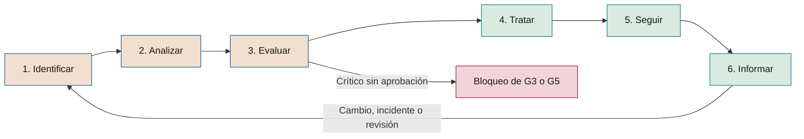

# Metodología de riesgos de IA

**Cómo se identifican, valoran, tratan, siguen e informan los riesgos de la IA en cada iniciativa y en la cartera**

| | |
|---|---|
| Documento | Documento 33 · Metodología de riesgos de IA |
| Versión | 0.1 (borrador de trabajo) |
| Fecha | 16-09-2026 |
| Autor | Fernando García · SEACHAD |
| Estado | Borrador para revisión. Desarrolla la sección 10 del documento 01 y fija las escalas comunes de riesgo del marco. |

<!-- cifras: 10 | categorías de riesgo ; 70 | riesgos tipo catalogados ; 5 × 5 | matriz de probabilidad e impacto ; 5 | ejes de impacto -->

---

> **Aviso legal y exención de responsabilidad.** SEVEN-G es un marco metodológico de referencia que se ofrece «tal cual» y con fines exclusivamente informativos. No constituye asesoramiento jurídico, regulatorio, financiero ni profesional, ni garantiza el cumplimiento de ninguna norma. Las referencias a regulación general (como el Reglamento Europeo de IA, el RGPD, DORA o NIS2), a normas técnicas y a regulación específica de cada sector o jurisdicción pueden ser incompletas, no aplicar a un caso concreto o quedar desactualizadas por cambios normativos, interpretaciones o criterios de las autoridades posteriores a su fecha de consulta. **Cada organización que use SEVEN-G es la única responsable de identificar la normativa que le aplica, verificar su vigencia y certificar su propio cumplimiento regulatorio**, con el asesoramiento cualificado que corresponda. El autor y SEACHAD no asumen responsabilidad alguna por el uso que se haga de este contenido ni por las decisiones que se adopten con él. Los datos, cifras, compañías y casos de los ejemplos son ficticios o ilustrativos.

## 1. Objeto y alcance

Este documento define la metodología con la que una organización que aplica SEVEN-G gestiona los riesgos de sus sistemas e iniciativas de IA. Es la referencia de las escalas de riesgo del marco: los documentos 13 (apetito de riesgo), 14 (cartera), 21 (criterios de *gate*), 35 (seguridad), 36 (terceros), las plantillas P12 y P13 y la herramienta T06 usan exactamente las escalas y niveles que aquí se fijan.

### 1.1 Qué cubre

- El proceso de gestión del riesgo en seis pasos: identificar, analizar, evaluar, tratar, seguir e informar.
- Su aplicación en los dos niveles del marco: la **iniciativa** (fases 0–7) y la **cartera** (ciclo corporativo C1–C5).
- Las escalas de probabilidad e impacto, la matriz 5 × 5 y los niveles de riesgo.
- El riesgo inherente y residual, y la valoración de la eficacia de los controles.
- La aceptación, el escalado y el registro de riesgos.
- El **catálogo de riesgos tipo** `RT-<CAT>-NN`, organizado en diez categorías.
- El riesgo de cartera: concentración, correlación y dependencia de proveedores.
- Los indicadores de riesgo clave.

### 1.2 Qué no cubre

- El apetito y las tolerancias de la compañía, que se aprueban en C2 (documento 13).
- El detalle de los controles de seguridad y de agentes (documento 35), de terceros (documento 36) y de cumplimiento regulatorio (documento 34).
- La gestión de incidentes y no conformidades (documento 37). Un riesgo materializado se gestiona como incidente; la metodología de riesgos recoge sus lecciones.

### 1.3 Normas de referencia

La metodología es coherente con **ISO/IEC 23894** (orientación sobre la gestión del riesgo de la IA, que adapta el proceso de ISO 31000), con los requisitos de evaluación y tratamiento de riesgos de **ISO/IEC 42001**, con las funciones *Map*, *Measure* y *Manage* del **NIST AI RMF** y su perfil de IA generativa **NIST AI 600-1**, y con el sistema de gestión de riesgos que el **Reglamento (UE) 2024/1689** exige a los proveedores de sistemas de alto riesgo. SEVEN-G no sustituye el marco corporativo de riesgos de la compañía: lo especializa para la IA y debe integrarse en él (mismo lenguaje de niveles, mismos órganos, mismo informe).

Este documento no constituye asesoramiento jurídico.

---

## 2. Principios

| # | Principio | Consecuencia práctica |
|---|---|---|
| 1 | **El riesgo se valora antes de invertir** | La evaluación completa es evidencia obligatoria de G3, la principal puerta de parada. |
| 2 | **Un control no probado no reduce el riesgo** | El riesgo residual solo se considera verificado cuando la eficacia del control tiene evidencia (normalmente en fase 5). |
| 3 | **Se valora el peor eje de impacto** | El impacto es el mayor de los cinco ejes; no se promedia. |
| 4 | **Todo riesgo tiene un responsable** | Sin responsable nominal el riesgo no está registrado. |
| 5 | **Quien construye no acepta su propio riesgo** | La aceptación sigue la escala de la sección 7 y respeta la separación de funciones (01 §8). |
| 6 | **El riesgo es sistémico** | Además del riesgo de cada iniciativa, se gestiona la concentración y la correlación de la cartera (principio 5 de 01 §3). |
| 7 | **El registro está vivo** | Se actualiza en cada *gate*, en cada revisión de continuidad, tras cada incidente y ante cada cambio relevante. |

---

## 3. El proceso

<!-- grafico: Proceso de gestión del riesgo de IA | Seis pasos que se repiten en cada gate y en cada revisión -->

| Paso | Qué se hace | Resultado | Responsable |
|---|---|---|---|
| **1. Identificar** | Recorrer el catálogo de riesgos tipo (sección 9), el contexto de la fase 0, la clasificación regulatoria, la arquitectura y los proveedores. Describir cada riesgo como **causa → evento → consecuencia**. | Lista de riesgos con código RT asociado. | Responsable de producto con el responsable técnico; facilita el responsable de riesgos. |
| **2. Analizar** | Estimar probabilidad e impacto inherentes con las escalas de la sección 4, justificando el eje de impacto determinante. Identificar controles existentes. | Nivel inherente por riesgo. | Equipo de la iniciativa. |
| **3. Evaluar** | Comparar con el apetito y las tolerancias (documento 13). Decidir qué riesgos requieren tratamiento y en qué orden. | Priorización y propuesta de respuesta. | Responsable de riesgos de IA. |
| **4. Tratar** | Elegir la respuesta (evitar, mitigar, transferir, aceptar), diseñar y aplicar controles, estimar el residual objetivo y obtener la aceptación del residual. | Plan de mitigación y contingencia (P13); decisión de aceptación. | Responsable del riesgo; acepta quien corresponda según la sección 7. |
| **5. Seguir** | Verificar la eficacia de los controles, vigilar indicadores de riesgo clave, revisar con la periodicidad del nivel y ante disparadores. | Registro actualizado; residual verificado. | Responsable de operación y responsable del riesgo; verifica el auditor de IA en los *gates*. |
| **6. Informar** | Presentar el perfil de riesgo al órgano que decide el *gate* y, agregado, al comité de IA y al consejo. | Información de riesgo en P29, panel del consejo (T17). | Oficina de IA con el responsable de riesgos. |

### 3.1 En el ciclo de vida de la iniciativa

| Fase o puerta | Actividad de riesgo | Evidencia |
|---|---|---|
| **0 · G0** | Restricciones y riesgos evidentes (práctica prohibida, datos protegidos, función crítica). Determinación de intensidad. | Declaración de contexto (P02), intensidad (P04). |
| **1 · G1** | Identificación preliminar de riesgos que podrían descartar la oportunidad. | Notas de filtrado (P06). |
| **2 · G2** | Riesgos de la hipótesis de valor (RT-ECO, RT-EST) y criterios de parada vinculados a riesgo. | Lienzo de hipótesis (P08). |
| **3 · G3** | **Evaluación completa**: inherente, controles previstos, residual objetivo, aceptación. Ningún riesgo Crítico sin tratamiento aceptado. | Matriz y registro (P12); plan de mitigación y contingencia (P13); evaluación de proveedor (P14). |
| **4 · G4** | Cada riesgo Medio o superior tiene un control diseñado, con código cuando exista (SEG, AG del documento 35). | Diseño de seguridad (P18), diseño de supervisión (P17), registro actualizado. |
| **5 · G5** | Eficacia de los controles probada; **residual verificado**; aceptación ratificada. | Resultados de validación (P22), registro actualizado, firma (P23). |
| **6 · R6** | Seguimiento, indicadores, incidentes, cambios; revisión de la clasificación. | Registro actualizado; registro de incidentes (P27). |
| **7 · G7** | Riesgos acumulados y riesgos de la retirada (datos, modelos, dependencias). | Decisión de escalado o retirada (P30). |

### 3.2 En la cartera

| Etapa | Actividad de riesgo |
|---|---|
| **C1 · Diagnóstico** | Perfil de riesgo de los sistemas inventariados, incluidos los anteriores al marco y el uso corporativo de IA. |
| **C2 · Dirección** | Aprobación del apetito, tolerancias, umbral de materialidad económica y umbrales de los indicadores (documento 13). |
| **C3 · Cartera** | Concentración, correlación y dependencia de proveedores al priorizar (sección 10). |
| **C4 · Supervisión** | Informe mensual al comité de IA y trimestral al consejo o comisión delegada (sección 12). |
| **C5 · Revisión** | Eficacia del sistema de gestión de riesgos, riesgos materializados, lecciones y recalibración de escalas. |

---

## 4. Escalas de valoración

### 4.1 Probabilidad

La probabilidad se estima para el horizonte de la iniciativa o, en sistemas en producción, para los doce meses siguientes. Se usa la referencia de frecuencia para eventos recurrentes y la de porcentaje para eventos únicos.

| Probabilidad | Nombre | Referencia orientativa |
|---|---|---|
| **1** | Rara | Menos de una vez en 5 años o < 5 % en el horizonte de la iniciativa |
| **2** | Improbable | Una vez cada 2–5 años o 5–20 % |
| **3** | Posible | Una vez cada 1–2 años o 20–50 % |
| **4** | Probable | Varias veces al año o 50–80 % |
| **5** | Casi segura | Mensual o más, o > 80 % |

Criterios de apoyo: antecedentes en la compañía o en el sector, resultados de pruebas y pilotos, exposición (usuarios, volumen, acceso externo), existencia de un atacante motivado, madurez de la tecnología. En amenazas de seguridad con atacante activo (RT-GEN, RT-SEG) y exposición externa, la probabilidad **no debería** valorarse por debajo de 3 sin evidencia de pruebas adversarias.

### 4.2 Impacto en cinco ejes

El impacto se valora en cinco ejes y se toma el **mayor**. Se registra el eje determinante y su justificación.

M es el **umbral de materialidad económica** que la compañía aprueba en C2 (documento 13) en proporción a su tamaño. Los porcentajes de M son orientativos y se calibran en C2.

| Impacto | Económico | Personas y derechos | Regulatorio | Operativo | Reputacional |
|---|---|---|---|---|---|
| **1 · Insignificante** | Menos del 1 % de M. | Sin efecto apreciable sobre personas. | Sin incumplimiento. | Interrupción breve sin efecto en clientes ni en procesos relevantes. | Sin trascendencia externa. |
| **2 · Menor** | Del 1 % al 5 % de M. | Molestia a pocas personas, corregible de inmediato. | Incumplimiento formal subsanable sin comunicación a autoridades. | Degradación de horas en un proceso no crítico. | Quejas aisladas. |
| **3 · Moderado** | Del 5 % al 20 % de M. | Efecto adverso reversible sobre un grupo limitado (trato erróneo, retraso, información incorrecta). | Incumplimiento que exige corrección formal y puede requerir comunicación al supervisor. | Interrupción de un proceso relevante durante una jornada o degradación sostenida. | Eco local o sectorial; quejas recurrentes. |
| **4 · Grave** | Del 20 % al 100 % de M. | Daño significativo: decisiones erróneas sobre derechos o acceso a servicios, exposición de datos personales con riesgo para las personas. | Notificación obligatoria, requerimiento formal o procedimiento sancionador probable. | Interrupción de una función crítica dentro de su tolerancia, o de un proceso relevante durante varios días. | Cobertura nacional; pérdida medible de clientes o socios. |
| **5 · Crítico** | Más de M. | Daño grave o irreversible a la salud, discriminación sistemática o vulneración de derechos fundamentales. | Práctica prohibida, posible incidente grave según el Reglamento de IA, sanción grave o pérdida de autorización. | Interrupción de una función crítica fuera de su tolerancia de impacto. | Daño duradero a la confianza; atención del supervisor y del consejo. |

### 4.3 Nivel de riesgo y matriz 5 × 5

**Nivel = Probabilidad × Impacto**, con cuatro niveles: **Bajo** 1–4 · **Medio** 5–9 · **Alto** 10–15 · **Crítico** 16–25.

| Probabilidad \ Impacto | 1 · Insignificante | 2 · Menor | 3 · Moderado | 4 · Grave | 5 · Crítico |
|---|---|---|---|---|---|
| **5 · Casi segura** | 5 · Medio | 10 · Alto | 15 · Alto | 20 · Crítico | 25 · Crítico |
| **4 · Probable** | 4 · Bajo | 8 · Medio | 12 · Alto | 16 · Crítico | 20 · Crítico |
| **3 · Posible** | 3 · Bajo | 6 · Medio | 9 · Medio | 12 · Alto | 15 · Alto |
| **2 · Improbable** | 2 · Bajo | 4 · Bajo | 6 · Medio | 8 · Medio | 10 · Alto |
| **1 · Rara** | 1 · Bajo | 2 · Bajo | 3 · Bajo | 4 · Bajo | 5 · Medio |

Reglas de uso:

1. Se valoran números enteros. En caso de duda entre dos valores, se toma el mayor y se registra la duda.
2. **Regla de impacto extremo:** un riesgo con impacto 5 en el eje de personas y derechos o en el regulatorio se trata, a efectos de aceptación, como mínimo **Alto**, aunque su probabilidad sea 1. Evita que sucesos raros pero inaceptables queden aceptados por el responsable de producto.
3. Las prácticas prohibidas por el Reglamento de IA no se valoran: se **evitan** (01 §6.5).

---

## 5. Riesgo inherente, controles y riesgo residual

### 5.1 Definiciones

| Concepto | Definición |
|---|---|
| **Riesgo inherente** | Nivel del riesgo sin considerar controles específicos de la iniciativa. Los controles corporativos generales solo se consideran si están probados y documentados en la compañía. |
| **Riesgo residual objetivo** | Nivel esperado tras aplicar los controles previstos. Se usa en G3 y G4. |
| **Riesgo residual verificado** | Nivel tras comprobar con evidencia la eficacia de los controles. Es el que se exige en G5 y se sigue en R6. |

### 5.2 Tipos de control

| Tipo | Actúa sobre | Ejemplos |
|---|---|---|
| **Preventivo** | Probabilidad | Mínimo privilegio de agentes, validación de datos, cláusula contractual de no entrenamiento. |
| **Detectivo** | Impacto, al acortar el tiempo hasta la detección | Monitorización de deriva, alertas de acciones anómalas, revisión de muestras. |
| **Correctivo o de contención** | Impacto | Interruptor de parada, plan de reversión, proceso alternativo manual. |
| **Transferencia** | Impacto económico | Seguro, indemnidad contractual. No transfiere la responsabilidad regulatoria ni el daño a personas. |

### 5.3 Eficacia de los controles

| Eficacia | Criterio | Reducción máxima admitida |
|---|---|---|
| **Eficaz** | Diseñado, implantado y probado con evidencia en el último periodo de revisión, sin excepciones relevantes. | Hasta 2 niveles de probabilidad (preventivo) o de impacto (detectivo o correctivo). |
| **Parcialmente eficaz** | Implantado y probado con excepciones, cobertura incompleta o dependencia manual no supervisada. | 1 nivel. |
| **Ineficaz** | La prueba falla o el control no opera como se diseñó. | Ninguna. Se abre acción correctiva. |
| **No probado** | Diseñado o implantado sin prueba de eficacia. | Ninguna en el residual verificado. Puede usarse en el residual objetivo. |

Reglas:

- La reducción total no puede llevar la probabilidad por debajo de 1 ni el impacto por debajo del que produciría el evento con el control correctivo ya activado.
- Los controles de tipo transferencia solo reducen el eje económico; el impacto se sigue determinando por el mayor de los demás ejes.
- En IA generativa y agentes, la eficacia de los controles frente a inyección de instrucciones **debe** probarse con pruebas adversarias (documento 35, sección 8); una política o una instrucción al modelo no es por sí sola un control eficaz.
- Un control ineficaz en un riesgo residual Alto o Crítico es, además, una no conformidad (documento 37).

---

## 6. Respuestas al riesgo

| Respuesta | Cuándo | Condiciones |
|---|---|---|
| **Evitar** | Riesgo inaceptable sin alternativa: práctica prohibida, Crítico sin tratamiento viable, coste del control superior al valor. | Cambiar alcance, diseño, datos, proveedor o nivel de autonomía; o **Parar** en el *gate*. |
| **Mitigar** | Respuesta habitual para Medio, Alto y Crítico. | Controles con responsable, plazo y residual objetivo. Plan en P13. |
| **Transferir** | Impacto económico significativo con mercado de transferencia. | Documentar qué se transfiere y qué no; revisar exclusiones de seguros y límites de indemnidad. |
| **Aceptar** | Residual dentro del apetito o coste de mitigación desproporcionado. | Decisión del nivel competente (sección 7), con vigencia y condiciones de revisión. |

Todo riesgo Alto o Crítico en tratamiento **debe** tener **plan de contingencia**: qué se hace si se materializa, quién lo activa y con qué disparador. En sistemas con capacidad de actuar, el plan incluye la activación del interruptor de parada o la reversión.

---

## 7. Aceptación y escalado

### 7.1 Quién acepta el riesgo residual

| Nivel residual | Acepta | Condiciones |
|---|---|---|
| **Bajo** | Responsable de producto de IA | Con registro. |
| **Medio** | Patrocinador de IA | Con conformidad del responsable de riesgos de IA. |
| **Alto** | Comité de IA | Con plan de tratamiento, indicadores y vigencia máxima de la aceptación hasta la siguiente revisión de continuidad. |
| **Crítico** | **No se acepta.** Excepcionalmente, solo el consejo o su comisión delegada, dentro del apetito aprobado en C2. | Motivación, límite temporal, controles compensatorios y seguimiento en cada sesión trimestral. **Un residual Crítico sin esa aprobación bloquea G3 y G5.** |

Reglas:

- Nadie acepta un riesgo de una iniciativa en la que construye (01 §8.2).
- La aceptación caduca al cambiar el nivel, el sistema, el proveedor, el modelo, la clasificación regulatoria o el nivel de autonomía, y en todo caso en la fecha de vigencia registrada.
- Aceptar un riesgo no exime de cumplir la regulación: un incumplimiento legal no se acepta como riesgo, se corrige.

### 7.2 Disparadores de escalado y revisión extraordinaria

| Disparador | Acción | Plazo orientativo |
|---|---|---|
| Nuevo riesgo residual Crítico | Comunicación al comité de IA; evaluación de parada o suspensión. | Mismo día hábil |
| Nuevo riesgo residual Alto o subida de un nivel | Comunicación al patrocinador y al responsable de riesgos; revisión en el siguiente comité. | 5 días hábiles |
| Indicador de riesgo clave fuera de umbral | Revisión del riesgo asociado y de sus controles. | 5 días hábiles |
| Riesgo materializado | Gestión como incidente (documento 37) y revaloración. | Según severidad |
| Control ineficaz en riesgo Alto o Crítico | No conformidad y revaloración del residual. | Según tipo de no conformidad |
| Cambio de modelo, proveedor, datos, autonomía o regulación | Revaloración de los riesgos afectados antes del cambio. | Antes de desplegar |
| Acción de tratamiento vencida | Aviso al responsable; si es Alto o Crítico, al comité. | Al vencer |

### 7.3 Frecuencia de revisión

| Nivel residual | En desarrollo (fases 0–5) | En producción (fase 6) |
|---|---|---|
| **Crítico** (aceptado excepcionalmente) | Continua, con informe en cada comité | Mensual y en cada sesión trimestral del consejo |
| **Alto** | En cada *gate* y, como mínimo, mensual | Trimestral, coincidiendo con R6 Enterprise |
| **Medio** | En cada *gate* | Semestral o en cada R6 |
| **Bajo** | En G3 y G5 | Anual o en R6 |

---

## 8. Registro de riesgos

El registro de riesgos es la evidencia "Matriz y registro de riesgos" de 01 §6.10. Se implanta con la plantilla **P12** y con la herramienta **T06**, sobre la entidad *Riesgo* del modelo de datos común (03 §4).

### 8.1 Campos

| Bloque | Campo | Contenido |
|---|---|---|
| **Identificación** | Identificador | Código de la iniciativa y número correlativo (ilustrativo: IA-2026-014 · R03); para riesgos de cartera, ámbito "Cartera". |
| | Riesgo tipo | Código `RT-<CAT>-NN` del catálogo, o "Específico" si no hay equivalente. |
| | Categoría | EST, TEC, DAT, ECO, LEG, ORG, REP, GEN, SEG o TER. |
| | Título y descripción | Causa → evento → consecuencia, en lenguaje comprensible. |
| | Sistemas y proveedores afectados | Enlace al inventario (T02) y al registro de proveedores (T09). |
| | Fecha y fase de identificación | Fecha, fase y quién lo identificó. |
| **Responsables** | Responsable del riesgo | Persona nominal con capacidad de actuar. |
| | Responsable de riesgos de IA | Segunda línea que da conformidad. |
| **Análisis inherente** | Probabilidad (1–5) y justificación | Referencia usada y fuentes. |
| | Impacto por eje (1–5) | Económico, personas y derechos, regulatorio, operativo, reputacional; eje determinante. |
| | Nivel inherente | Calculado. |
| **Controles** | Controles | Descripción, tipo, código (SEG, AG u otro), responsable. |
| | Eficacia | Eficaz, parcialmente eficaz, ineficaz o no probado; fecha y evidencia de la prueba. |
| **Residual** | Probabilidad e impacto residuales | Objetivo y verificado. |
| | Nivel residual | Objetivo y verificado. |
| **Tratamiento** | Respuesta | Evitar, mitigar, transferir o aceptar. |
| | Plan | Acciones, responsable, plazo y estado (P13). |
| | Contingencia | Disparador, acciones y responsable de activarla. |
| **Aceptación** | Decisión | Quién acepta, fecha, vigencia, condiciones, enlace a P29 si se decidió en un *gate*. |
| **Seguimiento** | Indicador de riesgo clave | Definición, umbral, valor actual y fecha. |
| | Estado | Identificado · En tratamiento · Aceptado · Materializado · Cerrado. |
| | Tendencia y próxima revisión | Sube, estable o baja; fecha. |
| **Vínculos** | Incidentes, no conformidades y criterios | INC-AAAA-NNN, NC-AAAA-NNN, criterios de *gate* `G<n>.<nn>`. |
| **Historial** | Eventos | Cambios de valoración con fecha, autor y motivo (03 §2, principio 2). |

### 8.2 Calidad del registro

El verificador comprueba, como mínimo: que todos los riesgos Medio o superiores tienen responsable, control y residual; que la justificación de probabilidad e impacto es trazable; que las aceptaciones las firma quien corresponde y están vigentes; que los riesgos tipo aplicables a la tecnología y a la clasificación de la iniciativa se han considerado (incluidos o descartados con motivo); y que el registro existía antes del *gate* (01 §7.4, regla 3). Los criterios concretos están en los documentos 21 y 22.

---

## 9. Catálogo de riesgos tipo

El catálogo es una lista de partida, no exhaustiva. En la fase 3, el equipo **debe** revisar al menos los riesgos tipo de las categorías que aplican a su tecnología y exposición, y registrar los descartados con motivo. Cada compañía **puede** ampliar el catálogo con códigos correlativos y **debe** declarar los que añade.

La columna *Fase* indica dónde se identifica y dónde se trata principalmente; los controles con código SEG o AG se describen en el documento 35.

### 9.1 Estratégico (EST)

| Código | Riesgo y descripción | Causas típicas | Controles tipo | Fase |
|---|---|---|---|---|
| **RT-EST-01** | **Desalineación con la tesis de IA.** La iniciativa no contribuye a la ambición ni a las esferas aprobadas en C2. | Origen tecnológico; patrocinio débil; ausencia de filtro. | Encaje con la tesis en G0; clasificación de esfera (P07); priorización en C3. | 0–1 |
| **RT-EST-02** | **Ambición declarada no evidenciada.** Se presenta como Aumentar o Transformar lo que es Optimizar, y se decide con expectativas erróneas. | Incentivos a "transformar"; criterios ambiguos. | Cinco preguntas de clasificación (T05); confirmación en fase 2; revisión en G7. | 1, 2, 7 |
| **RT-EST-03** | **Pérdida de oportunidad.** El proceso de decisión es tan lento que la ventaja se pierde. | Plazos de *gate* largos; mismo criterio de retorno para todas las apuestas. | Plazos de referencia (03 §3.6); criterios por ambición (01 §7.6); métricas de agilidad. | C3, todas |
| **RT-EST-04** | **Bloqueo tecnológico.** Plataforma o modelo elegidos quedan superados y el cambio es costoso. | Dependencia de funciones propietarias; arquitectura acoplada. | Capa de abstracción de modelos; portabilidad de datos e instrucciones; revisión en R6. | 4, 6 |
| **RT-EST-05** | **Retirada de patrocinio o de financiación.** La iniciativa pierde apoyo antes de demostrar valor. | Cambios de dirección; valor no visible a tiempo. | Financiación por etapas; hitos de aprendizaje; criterios de parada previos. | 0, C3 |
| **RT-EST-06** | **Concentración de la cartera en una apuesta.** Una sola iniciativa o plataforma concentra inversión o valor esperado. | Apuestas grandes sin límites por etapa. | Límites de concentración en el apetito (13); revisión trimestral. | C3, C4 |

### 9.2 Técnico (TEC)

| Código | Riesgo y descripción | Causas típicas | Controles tipo | Fase |
|---|---|---|---|---|
| **RT-TEC-01** | **Rendimiento insuficiente en condiciones reales.** El sistema no alcanza el umbral fuera del entorno de prueba. | Validación con datos no representativos; piloto sin método de atribución. | Umbral de éxito previo; piloto en condiciones reales (P22). | 3, 5 |
| **RT-TEC-02** | **Degradación y deriva.** El rendimiento cae por cambios en los datos, el entorno o el comportamiento de los usuarios. | Entorno dinámico; sin monitorización. | Monitorización de deriva y rendimiento (P25); umbrales de reentrenamiento o retirada. | 6 |
| **RT-TEC-03** | **Falta de robustez.** Resultados erróneos ante entradas atípicas, ruido o casos límite. | Pruebas limitadas a casos habituales. | Pruebas de robustez y casos límite; derivación a persona fuera de dominio. | 4, 5 |
| **RT-TEC-04** | **Confabulación.** La IA generativa produce contenidos falsos presentados como ciertos. | Ausencia de fuentes autorizadas; tareas fuera de alcance. | Recuperación sobre fuentes autorizadas; citas; evaluaciones periódicas; aviso al usuario. | 4–6 |
| **RT-TEC-05** | **Resultados no explicables ni trazables.** No puede reconstruirse por qué se produjo un resultado. | Registros insuficientes; modelos opacos sin documentación. | Registro de entradas, versiones y salidas; documentación del modelo; explicaciones proporcionales al uso. | 4 |
| **RT-TEC-06** | **Integración y capacidad insuficientes.** Latencia, disponibilidad o volumen no soportan el proceso. | Pruebas sin carga real; dependencias externas. | Pruebas de carga; acuerdos de nivel de servicio; degradación controlada. | 4, 5 |
| **RT-TEC-07** | **Cambio no gestionado.** Cambios de modelo, instrucciones, parámetros o configuración sin evaluación previa. | Cambios frecuentes; sin gestión de versiones. | Gestión de cambios con evaluaciones de regresión; versionado de instrucciones. | 5, 6 |
| **RT-TEC-08** | **Irreversibilidad.** No es posible volver al estado anterior o al proceso sin IA. | Plan de reversión inexistente o no probado; proceso manual desmantelado. | Plan de reversión probado antes de G5 (P19); proceso alternativo mantenido. | 4, 5 |

### 9.3 Datos (DAT)

| Código | Riesgo y descripción | Causas típicas | Controles tipo | Fase |
|---|---|---|---|---|
| **RT-DAT-01** | **Calidad insuficiente.** Datos incompletos, erróneos o desactualizados. | Sin control en origen; sistemas heredados. | Perfilado de calidad en fase 3; reglas de validación; propietario del dato. | 3, 4 |
| **RT-DAT-02** | **Datos no representativos y sesgo.** Los datos no reflejan la población o reproducen discriminaciones históricas. | Muestras sesgadas; variables sustitutivas de características protegidas. | Análisis de representatividad; métricas de equidad; pruebas por grupo. | 3, 5 |
| **RT-DAT-03** | **Falta de base legal o finalidad incompatible.** Uso de datos personales sin base jurídica o para una finalidad distinta. | Reutilización de datos operativos sin análisis. | Análisis jurídico; evaluación de impacto en protección de datos; minimización. | 3 |
| **RT-DAT-04** | **Linaje desconocido.** No se sabe de dónde vienen los datos, qué transformaciones han sufrido ni con qué licencia. | Datos de terceros; procesos manuales. | Linaje de datos y modelos (P16); licencias verificadas. | 4 |
| **RT-DAT-05** | **Exposición de datos en el ciclo de IA.** Datos personales o confidenciales en entrenamiento, contexto, instrucciones o registros. | Registros completos sin enmascarar; contexto excesivo. | Minimización y enmascarado; retención limitada de registros; SEG-07. | 4, 6 |
| **RT-DAT-06** | **Conocimiento obsoleto o contradictorio.** La base documental que alimenta la IA generativa está desactualizada o sin propietario. | Sin gobierno documental; duplicados. | Propietario y fecha de vigencia por fuente; retirada automática de caducados. | 4, 6 |

### 9.4 Económico (ECO)

| Código | Riesgo y descripción | Causas típicas | Controles tipo | Fase |
|---|---|---|---|---|
| **RT-ECO-01** | **Sobrecoste de construcción.** El coste supera lo aprobado. | Alcance abierto; integración subestimada. | Estimación con las categorías de coste (42); financiación por etapas; control de cambios. | 3, 5 |
| **RT-ECO-02** | **Coste recurrente creciente o imprevisible.** El consumo de modelos, cómputo o licencias crece más que el valor. | Precio por uso; bucles de agentes; adopción no prevista. | Presupuestos y límites de consumo; coste por transacción vigilado (T13); SEG-10. | 3, 6 |
| **RT-ECO-03** | **Valor no materializado.** La capacidad liberada no se convierte en ahorro ni se reasigna. | Sin plan de materialización; resistencia organizativa. | Regla 3 de medición (00 §6); plan de materialización en G5; seguimiento (P28). | 5–7 |
| **RT-ECO-04** | **Valor inflado o doble contabilización.** El mismo euro se atribuye a varios casos o se declara sin fórmula. | Presión por resultados; sin validación independiente. | Reglas 1, 2 y 5 de medición; validación por control de gestión. | 2, 6, 7 |
| **RT-ECO-05** | **Coste de salida no previsto.** Sustituir el proveedor o retirar el sistema cuesta más de lo estimado. | Contratos sin cláusulas de salida; datos en formatos cerrados. | Plan de salida (documento 36); coste de salida en la evaluación económica. | 3, 7 |

### 9.5 Legal y cumplimiento (LEG)

| Código | Riesgo y descripción | Causas típicas | Controles tipo | Fase |
|---|---|---|---|---|
| **RT-LEG-01** | **Clasificación regulatoria errónea.** Un sistema de alto riesgo se trata como de riesgo mínimo o fuera de ámbito. | Clasificación sin criterio jurídico; cambio de finalidad. | Clasificación con T07 y revisión jurídica; revisión en R6 y ante cambios (34). | 0, 3, 6 |
| **RT-LEG-02** | **Práctica prohibida.** El uso encaja en una práctica prohibida por el Reglamento de IA. | Desconocimiento; evolución del uso. | Filtro en G0 y G3; evitar siempre (01 §6.5). | 0, 3 |
| **RT-LEG-03** | **Transparencia incumplida.** Las personas no saben que interactúan con una IA o que un contenido es sintético. | Diseño sin requisitos de transparencia. | Requisitos del art. 50 del Reglamento de IA en el diseño; revisión de interfaces. | 4, 5 |
| **RT-LEG-04** | **Decisiones automatizadas sin garantías.** Decisiones con efectos significativos sin intervención humana efectiva ni derecho a impugnar. | Supervisión nominal; automatización progresiva no revisada. | Diseño de supervisión humana (P17); análisis del art. 22 del RGPD. | 3, 4 |
| **RT-LEG-05** | **Evaluaciones de impacto omitidas.** No se realizan o no se actualizan la evaluación de impacto en protección de datos o la de derechos fundamentales. | Desconocimiento del requisito; plazos. | Clasificación (P11); evaluaciones como evidencia de G3. | 3, 6 |
| **RT-LEG-06** | **Infracción de propiedad intelectual.** Datos de entrenamiento o resultados vulneran derechos de terceros, o la titularidad de los resultados no está clara. | Datos sin licencia; condiciones del proveedor no revisadas. | Revisión de licencias; cláusulas de propiedad y de indemnidad (36). | 3, 4 |
| **RT-LEG-07** | **Notificación de incidentes fuera de plazo.** No se notifica a tiempo un incidente grave, una brecha de datos o un incidente DORA o NIS2. | Sin criterios de severidad; sin responsable de notificación. | Plan de respuesta (P26); matriz de notificaciones (37). | 6 |
| **RT-LEG-08** | **Incumplimiento de obligaciones sectoriales o de resiliencia.** Requisitos de supervisores sectoriales, DORA u otras normas no trasladados al sistema. | Mapeo regulatorio incompleto. | Mapeo regulatorio (34); declaración de contexto (P02). | 0, 3 |

### 9.6 Organizativo (ORG)

| Código | Riesgo y descripción | Causas típicas | Controles tipo | Fase |
|---|---|---|---|---|
| **RT-ORG-01** | **Falta de adopción.** Los usuarios no usan el sistema o lo usan de forma marginal. | Mala integración en el trabajo; desconfianza; formación insuficiente. | Plan de adopción (P20); objetivo de adopción en G2 y G5. | 4–6 |
| **RT-ORG-02** | **Dependencia de personas clave.** El conocimiento del sistema está en pocas personas o en el proveedor. | Documentación escasa; equipos pequeños. | Documentación y manual de operación (P24); suplencias; transferencia de conocimiento. | 4, 6 |
| **RT-ORG-03** | **Efecto no gestionado sobre las personas.** Cambios de rol, carga o empleo sin planificación ni diálogo. | Visión solo de eficiencia; comunicación tardía. | Plan de personas (50); consulta a la representación cuando proceda. | 2, 4 |
| **RT-ORG-04** | **Supervisión humana ineficaz.** Las personas validan por rutina o sin información suficiente. | Volumen alto de aprobaciones; sesgo de automatización. | Diseño de la supervisión con muestreo, tiempos y rotación; medición de la tasa de rechazo. | 4, 6 |
| **RT-ORG-05** | **Uso no autorizado de IA (*shadow AI*).** Empleados usan herramientas no aprobadas con datos de la compañía. | Falta de alternativas aprobadas; política desconocida. | Política de uso aceptable (31); alternativas corporativas; detección (T21). | C1, C4 |
| **RT-ORG-06** | **Roles sin separación de funciones.** Quien construye verifica, acepta riesgos o decide. | Equipos pequeños; roles no asignados. | Registro de roles (P03); incompatibilidades (01 §8.2). | 0 |
| **RT-ORG-07** | **Incumplimiento de información y consulta.** La representación de los trabajadores o los trabajadores afectados no reciben, antes del uso, la información o la consulta exigibles sobre un sistema que incide en las condiciones de trabajo o en el empleo. | Análisis jurídico tardío o ausente; cambios de parámetros, reglas o finalidad no comunicados. | Proceso de información y consulta (50 §7.2) y ficha informativa (50 §7.3); G5 sin *Continuar* ni *Continuar con condiciones* sin evidencia de la información; IND-ADO-12 (41). | 3–5, 6 |
| **RT-ORG-08** | **Conflicto laboral.** La introducción de la IA genera consultas, reclamaciones o conflictos colectivos que retrasan, condicionan o bloquean la iniciativa. | Comunicación tardía o ambigua; efecto sobre el empleo sin diálogo; destinos de la capacidad liberada decididos sin participación. | Posición sobre IA y trabajo aprobada en C2 (13); evaluación de efecto (50 §3.4); diálogo con la representación y comunicación interna (50 §7 y §10); decisión de la alta dirección en destinos PER-D1 relevantes. | 2–5, 7 |
| **RT-ORG-09** | **Deterioro del bienestar.** Intensificación del trabajo, vigilancia excesiva, pérdida de autonomía o carga de supervisión dañan la salud y el compromiso de las personas afectadas. | Objetivos y cargas no revisados tras la IA; datos de uso empleados para controlar a personas; volúmenes de revisión excesivos. | Revisión de la evaluación de riesgos laborales, incluidos los psicosociales, y limitación de finalidad (50 §9.2); diseño de la supervisión (P17); encuesta de pulso (IND-ADO-15, 41). | 4–6 |

### 9.7 Reputacional (REP)

| Código | Riesgo y descripción | Causas típicas | Controles tipo | Fase |
|---|---|---|---|---|
| **RT-REP-01** | **Resultados discriminatorios.** El sistema trata peor a grupos de personas. | Sesgo en datos o en diseño; sin pruebas por grupo. | Pruebas de sesgo antes de G5; monitorización por grupo; supervisión humana. | 3, 5, 6 |
| **RT-REP-02** | **Errores visibles para clientes.** Respuestas o decisiones erróneas con trascendencia pública. | Exposición directa sin salvaguardas. | Evaluaciones previas; derivación a persona; respuesta rápida a incidentes. | 5, 6 |
| **RT-REP-03** | **Uso percibido como inadecuado o intrusivo.** Uso legal pero contrario a las expectativas de clientes, empleados o sociedad. | Sin análisis ético; comunicación insuficiente. | Revisión ética en fase 3; transparencia; canal de quejas. | 3 |
| **RT-REP-04** | **Contenido dañino u ofensivo.** La IA generativa produce contenido ofensivo, peligroso o impropio de la marca. | Filtros insuficientes; manipulación del usuario. | Filtros de entrada y salida (SEG-03); pruebas adversarias; supervisión de muestras. | 4–6 |
| **RT-REP-05** | **Comunicación engañosa sobre la IA.** Se atribuyen a la IA capacidades o resultados que no tiene. | Presión comercial; valor no validado. | Revisión de comunicaciones; uso de valor validado (00 §6). | 5, 7 |

### 9.8 IA generativa y agentes (GEN)

| Código | Riesgo y descripción | Causas típicas | Controles tipo | Fase |
|---|---|---|---|---|
| **RT-GEN-01** | **Inyección directa de instrucciones y *jailbreak*.** Un usuario manipula el sistema para saltarse sus restricciones. | Restricciones basadas solo en instrucciones al modelo. | SEG-02, SEG-03, SEG-11; límites fuera del modelo. | 4, 5 |
| **RT-GEN-02** | **Inyección indirecta.** Instrucciones maliciosas en correos, documentos, webs o respuestas de herramientas alteran la tarea. | El sistema trata como instrucciones contenidos no confiables. | SEG-02; AG-12; AG-05; pruebas específicas (AG-18). | 4, 5 |
| **RT-GEN-03** | **Agencia excesiva.** El sistema tiene más herramientas, permisos o autonomía de los necesarios. | Permisos heredados; nivel de autonomía no justificado. | AG-02; nivel de autonomía decidido en fase 4 (35 §5); AG-20. | 4, 6 |
| **RT-GEN-04** | **Acción no autorizada o no trazable.** Un agente ejecuta una acción que no responde a una intención autorizada, o no puede reconstruirse por qué. | Sin control de intención; registros incompletos. | AG-04, AG-05, AG-06, AG-10. | 4–6 |
| **RT-GEN-05** | **Fuga de información.** Datos personales, confidenciales o instrucciones del sistema salen por respuestas, recuperación o herramientas. | Recuperación sin permisos del usuario; secretos en instrucciones. | SEG-05, SEG-06, SEG-07. | 4, 6 |
| **RT-GEN-06** | **Tratamiento inseguro de salidas.** La salida del modelo se ejecuta o se inserta en otros sistemas sin validar. | Confianza en la salida; integraciones directas. | SEG-04; AG-11. | 4, 5 |
| **RT-GEN-07** | **Envenenamiento de memoria o contexto.** Contenido manipulado persiste en la memoria o en la base de conocimiento y altera decisiones futuras. | Memoria compartida sin control; ingesta sin validación. | AG-14; SEG-08; RT-DAT-06. | 4, 6 |
| **RT-GEN-08** | **Fallos en cascada y consumo sin límite.** Bucles, reintentos o cadenas de agentes amplifican errores o costes. | Sin límites de iteración ni disyuntores. | AG-07, AG-16; SEG-10. | 4, 6 |
| **RT-GEN-09** | **Explotación de la confianza humana.** El sistema induce a una persona a aprobar una acción inadecuada. | Aprobaciones sin contexto; exceso de confianza. | AG-08 con información suficiente; RT-ORG-04. | 4, 6 |

### 9.9 Seguridad e IA ofensiva (SEG)

| Código | Riesgo y descripción | Causas típicas | Controles tipo | Fase |
|---|---|---|---|---|
| **RT-SEG-01** | **Suplantación con voz o vídeo sintéticos.** Fraude del CEO u órdenes falsas con apariencia legítima. | Procesos de pago basados en reconocimiento de voz o imagen. | SEG-16, SEG-17, SEG-18. | C4, 6 |
| **RT-SEG-02** | **Phishing e ingeniería social generados con IA.** Mensajes personalizados y convincentes a escala. | Autenticación débil; exposición pública de información de empleados. | SEG-15, SEG-17. | C4 |
| **RT-SEG-03** | **Explotación acelerada de vulnerabilidades.** El tiempo entre publicación de una vulnerabilidad y su explotación se reduce. | Parcheo lento; superficie expuesta desconocida. | SEG-13, SEG-19. | 6, C4 |
| **RT-SEG-04** | **Compromiso de identidades no humanas.** Robo o abuso de credenciales de agentes, claves de servicio o *tokens*. | Credenciales de larga duración; permisos excesivos. | AG-01, AG-02, AG-03, AG-20. | 4, 6 |
| **RT-SEG-05** | **Envenenamiento de datos o modelos.** Manipulación de datos de entrenamiento, ajuste o evaluación. | Fuentes abiertas; ingesta sin control. | SEG-08; linaje (P16). | 4, 5 |
| **RT-SEG-06** | **Extracción de modelos y abuso del servicio.** Consultas masivas para replicar el modelo, inferir datos o agotar recursos. | Interfaces expuestas sin límites. | SEG-10, SEG-12. | 4, 6 |
| **RT-SEG-07** | **Compromiso de la cadena de suministro de IA.** Modelos, bibliotecas, conectores o servidores de herramientas maliciosos o vulnerables. | Componentes descargados sin verificación. | SEG-09; AG-13; evaluación de proveedor (36). | 4, 6 |

### 9.10 Terceros (TER)

| Código | Riesgo y descripción | Causas típicas | Controles tipo | Fase |
|---|---|---|---|---|
| **RT-TER-01** | **Dependencia y bloqueo de proveedor.** Cambiar de proveedor es inviable en plazo o coste razonables. | Formatos cerrados; funciones propietarias. | Estrategia de salida; portabilidad (36 §7). | 3, 4 |
| **RT-TER-02** | **Uso de los datos por el proveedor.** El proveedor usa datos, instrucciones o resultados para entrenar o para otros fines. | Condiciones estándar no negociadas. | Cláusula de no uso para entrenamiento; verificación de configuración (36 §6). | 3 |
| **RT-TER-03** | **Cambio unilateral de modelo o condiciones.** El proveedor cambia versión, comportamiento, precio o retira el modelo. | Servicios gestionados sin preaviso contractual. | Preaviso y versiones fijadas; evaluaciones de regresión (RT-TEC-07). | 3, 6 |
| **RT-TER-04** | **Subencargados y ubicación no controlados.** Datos tratados por terceros o en ubicaciones no autorizadas. | Cadena de subcontratación opaca. | Lista de subencargados; autorización de cambios; ubicación contractual. | 3 |
| **RT-TER-05** | **Fallo o discontinuidad del proveedor.** Indisponibilidad prolongada, insolvencia o salida del mercado. | Proveedor pequeño o crítico sin alternativa. | Continuidad y plan de salida; diligencia financiera; nivel N3 (36 §4). | 3, 6 |
| **RT-TER-06** | **IA embebida no identificada.** Software ya contratado incorpora funciones de IA sin evaluación. | Actualizaciones del proveedor; activación por defecto. | Cuestionario de IA embebida; revisión de actualizaciones (36 §8). | C1, 6 |
| **RT-TER-07** | **Concentración en proveedores comunes.** Muchos sistemas dependen del mismo proveedor de modelos o de nube. | Estandarización sin análisis de concentración. | Análisis de concentración (sección 10); límites en el apetito. | C3 |

---

## 10. Riesgo de cartera

Los riesgos de las iniciativas no se suman: interactúan. El comité de IA **debe** revisar la cartera, al menos trimestralmente, con tres análisis.

### 10.1 Concentración

| Factor | Qué se mide | Señal de alerta orientativa |
|---|---|---|
| **Proveedor de modelos** | Sistemas en producción y valor esperado que dependen de un mismo proveedor o familia de modelos. | Más de la mitad del valor validado depende de uno solo sin plan de salida probado. |
| **Plataforma y nube** | Sistemas sobre la misma plataforma de ejecución o de agentes. | Función crítica sin alternativa de ejecución. |
| **Función crítica** | Funciones críticas o importantes soportadas por IA. | Más de una función crítica sin proceso alternativo operativo. |
| **Datos** | Sistemas que dependen de la misma fuente de datos o base de conocimiento. | Fuente sin propietario o con calidad no medida. |
| **Personas** | Sistemas que dependen de las mismas personas clave. | Una persona es responsable técnico de varios sistemas Enterprise. |
| **Esfera y ambición** | Distribución de riesgo residual Alto por esfera y nivel de ambición. | Riesgo concentrado en esferas de cliente o decisión sin supervisión reforzada. |

Los umbrales se fijan en el apetito de riesgo (documento 13); los de esta tabla son orientativos.

### 10.2 Correlación

Dos riesgos están correlacionados cuando una misma causa los materializa a la vez. Causas comunes típicas: el mismo modelo base (un cambio de versión o una vulnerabilidad afecta a todos los sistemas que lo usan), la misma técnica de ataque (una inyección indirecta que funciona en un agente suele funcionar en otros con el mismo diseño), el mismo cambio regulatorio o la misma interpretación jurídica, y el mismo proveedor o subencargado.

Para cada causa común, la oficina de IA **debería** construir un **escenario de cartera** y valorarlo con la matriz de la sección 4, sumando los impactos económicos de los sistemas afectados y tomando el peor impacto en los demás ejes. Escenarios mínimos recomendados:

1. Indisponibilidad durante varios días del principal proveedor de modelos.
2. Cambio de comportamiento de un modelo base usado por varios sistemas.
3. Vulnerabilidad explotada en un componente común de agentes (conector, servidor de herramientas, biblioteca).
4. Reclasificación regulatoria de un tipo de uso presente en varias iniciativas.
5. Brecha de datos en una base de conocimiento compartida.

### 10.3 Dependencia de proveedores

La dependencia se evalúa con el nivel de exigencia N1–N3 del documento 36 y con dos preguntas: cuánto tiempo y coste supone sustituir al proveedor, y qué funciones se detienen mientras tanto. Los riesgos de cartera se registran en T06 con ámbito "Cartera", responsable en la oficina de IA y aceptación por el comité de IA o, si son Críticos, por el consejo.

---

## 11. Apetito de riesgo e indicadores de riesgo clave

### 11.1 Relación con el apetito

El apetito de riesgo se aprueba en C2 y se desarrolla en el documento 13. Esta metodología le exige, como mínimo:

- Una declaración por categoría de riesgo (por ejemplo, tolerancia nula a prácticas prohibidas y a discriminación no tratada).
- El umbral de materialidad económica M de la sección 4.2.
- Límites de cartera: número máximo de riesgos residuales Altos aceptados, ningún Crítico sin aprobación del consejo, límites de concentración.
- Umbrales de los indicadores de riesgo clave.

### 11.2 Indicadores de riesgo clave

Los umbrales son orientativos y se aprueban en C2. Todos se calculan con los datos de T01, T06, T08 y T09.

| Indicador | Definición | Umbral orientativo |
|---|---|---|
| Residuales Críticos | Riesgos residuales Críticos vigentes, con y sin aprobación del consejo. | 0 sin aprobación |
| Residuales Altos | Número y evolución de riesgos residuales Altos aceptados. | Sin crecimiento dos trimestres seguidos |
| Aceptaciones caducadas | Aceptaciones con vigencia vencida sin revisar. | 0 |
| Controles no probados | Porcentaje de controles de riesgos Alto o Crítico sin prueba de eficacia vigente. | Menos del 10 % |
| Acciones vencidas | Acciones de tratamiento de riesgos Alto o Crítico fuera de plazo. | 0 con más de 30 días |
| Riesgos materializados | Incidentes vinculados a riesgos registrados frente a incidentes sin riesgo previo identificado. | Tendencia a la baja de los no identificados |
| Deriva | Sistemas con métricas de deriva o rendimiento fuera de umbral. | 0 sin acción abierta |
| Éxito de inyección | Porcentaje de pruebas adversarias de inyección con éxito en la última campaña. | Tendencia a la baja; 0 en acciones sensibles |
| Agentes con permisos excesivos | Identidades de agentes con permisos no justificados en la última revisión. | 0 |
| Concentración de proveedor | Proporción del valor validado dependiente del principal proveedor de modelos. | Según límite de C2 |
| Clasificación vencida | Sistemas cuya clasificación regulatoria no se ha revisado en el plazo. | 0 |
| Uso no autorizado | Casos de *shadow AI* detectados y no regularizados. | Tendencia a la baja |

---

## 12. Información de riesgos

| Destinatario | Frecuencia | Contenido mínimo |
|---|---|---|
| **Órgano que decide el *gate*** | En cada *gate* | Perfil inherente y residual, riesgos Alto y Crítico con controles y eficacia, aceptaciones requeridas, cambios desde el *gate* anterior. |
| **Comité de IA** | Mensual | Mapa de calor residual de la cartera, riesgos nuevos y escalados, aceptaciones pendientes y caducadas, indicadores fuera de umbral, riesgos materializados. |
| **Consejo o comisión delegada** | Trimestral | Residuales Críticos y Altos por esfera, concentración y escenarios de cartera, cumplimiento del apetito, incidentes significativos, exposición a IA ofensiva (35), decisiones solicitadas. Se presenta con el informe trimestral de segunda línea (P42). |
| **C5 · Revisión anual** | Anual | Eficacia del sistema de gestión de riesgos, recalibración de escalas y catálogo, lecciones aprendidas. |

El informe al consejo usa lenguaje de negocio: qué puede pasar, a quién afecta, qué se hace y qué decisión se pide. No debería presentar listados técnicos de riesgos sin priorizar.

---

## 13. Herramientas y plantillas asociadas

| Código | Nombre | Uso en este documento |
|---|---|---|
| **P12** | Matriz y registro de riesgos | Registro con los campos de la sección 8, mapa de calor inherente y residual. Fases 3, 5 y 6. |
| **P13** | Plan de mitigación y contingencia | Acciones de tratamiento, residual objetivo, contingencias y disparadores (secciones 5–7). Fase 3. |
| **P42** | Informe trimestral de segunda línea | Información trimestral de riesgos de la cartera a la comisión delegada (secciones 10–12). |
| **T06** | Matriz y registro de riesgos | Cálculo de niveles con la regla de impacto extremo, matriz 5 × 5 inherente y residual de cada iniciativa y de la cartera, eficacia de controles, aceptación por el órgano de su nivel, observaciones de las secciones 4 a 8 (residual Crítico sin aprobación, Alto sin contingencia, aceptación caducada o insuficiente, revisión vencida) y exportación CSV. Vista «Riesgos» del registro T01. La concentración y la correlación de la cartera (sección 10) se analizan con P12 §7. |
| T01 · T02 · T08 · T09 · T17 | Registro de iniciativas, inventario, incidentes, proveedores y panel del consejo | Fuentes y destinos de datos de riesgo. |

---

## 14. Documentos relacionados

| Documento | Relación |
|---|---|
| **01 · Metodología fundacional** | Sección 10 (riesgos) y reglas de *gate* que este documento desarrolla. |
| **13 · Tesis de IA, ambición y apetito de riesgo** | Apetito, tolerancias, umbral de materialidad y umbrales de indicadores. |
| **14 · Gestión de cartera** | Uso del riesgo de cartera en la priorización y la retirada. |
| **21 · Criterios de *gate* y auditoría** · **22 · Listas de verificación** | Criterios de G3, G4, G5 y R6 sobre el registro de riesgos. |
| **34 · Mapeo regulatorio** | Obligaciones que originan riesgos de la categoría LEG. |
| **35 · Seguridad de IA y agentes** | Controles SEG y AG citados en el catálogo. |
| **36 · Terceros y proveedores de IA** | Niveles N1–N3 y controles de los riesgos TER. |
| **37 · No conformidades e incidentes** | Tratamiento de riesgos materializados y de controles ineficaces. |
| **42 · Costes de IA** | Categorías de coste para los riesgos ECO. |

---

## 15. Control de versiones

| Versión | Fecha | Cambios |
|---|---|---|
| 0.1 | 16-09-2026 | Primera versión. Fija las escalas comunes de probabilidad e impacto en cinco ejes, la matriz 5 × 5, el riesgo residual objetivo y verificado, la eficacia de controles, la aceptación por niveles, los campos del registro, el catálogo de 70 riesgos tipo en diez categorías, el análisis de riesgo de cartera y los indicadores de riesgo clave. Incorporados al catálogo los riesgos organizativos RT-ORG-07 (información y consulta), RT-ORG-08 (conflicto laboral) y RT-ORG-09 (bienestar), propuestos en el documento 50. |
