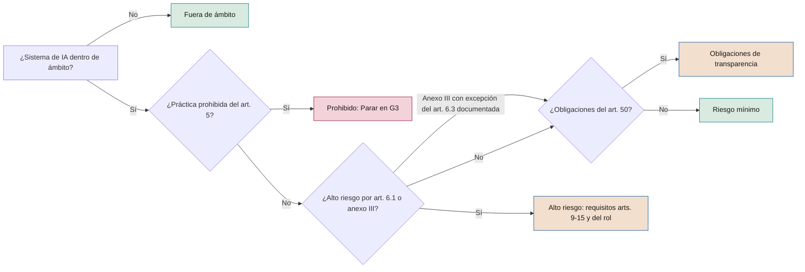

# Mapeo regulatorio

**Cada obligación vinculada a una fase, un rol, una evidencia y una herramienta de SEVEN-G**

| | |
|---|---|
| Documento | Documento 34 · Mapeo regulatorio |
| Versión | 0.2 (borrador de trabajo) |
| Fecha | 25-09-2026 |
| Autor | Fernando García Varela |
| Estado | Borrador para revisión. Fecha de consulta de las fuentes: 16-09-2026. Requiere revisión jurídica cualificada antes de su uso. |

<!-- cifras: 7 | referencias normativas mapeadas ; 2-12-2027 | aplicación del alto riesgo del anexo III ; 13 | etapas y fases en la matriz resumen ; 1 | procedimiento de mantenimiento del mapeo -->

---

> **Aviso legal y exención de responsabilidad.** SEVEN-G es un marco metodológico de referencia que se ofrece «tal cual» y con fines exclusivamente informativos. No constituye asesoramiento jurídico, regulatorio, financiero ni profesional, ni garantiza el cumplimiento de ninguna norma. Las referencias a regulación general (como el Reglamento Europeo de IA, el RGPD, DORA o NIS2), a normas técnicas y a regulación específica de cada sector o jurisdicción pueden ser incompletas, no aplicar a un caso concreto o quedar desactualizadas por cambios normativos, interpretaciones o criterios de las autoridades posteriores a su fecha de consulta. **Cada organización que use SEVEN-G es la única responsable de identificar la normativa que le aplica, verificar su vigencia y certificar su propio cumplimiento regulatorio**, con el asesoramiento cualificado que corresponda. El autor no asume responsabilidad alguna por el uso que se haga de este contenido ni por las decisiones que se adopten con él. Los datos, cifras, compañías y casos de los ejemplos son ficticios o ilustrativos.

<!-- esencial: condicional | Disparador: la clasificación regulatoria de un sistema no es «riesgo mínimo», se tratan datos personales o la compañía está sujeta a regulación sectorial. Las determinaciones previas (sección 2) se hacen siempre; el resto se consulta por la norma que aplique. No constituye asesoramiento jurídico. -->

## 1. Objeto y alcance

> **Alcance y responsabilidad.** Este mapeo es **orientativo** y no constituye asesoramiento jurídico. Recoge el estado de las normas consultado el 16 de septiembre de 2026 (fecha de consulta) y no se actualiza automáticamente. Tanto la regulación general (Reglamento Europeo de IA, RGPD, DORA, NIS2 o normativa nacional) como la **regulación específica de cada industria** (banca, seguros, sanidad, energía, sector público, entre otras) cambian: las fechas de aplicación, los artículos y los textos en tramitación se modifican, y su alcance depende de la interpretación, las directrices y los criterios de supervisión de las autoridades competentes. El anexo de referencias sectoriales (sección 12) y el de otras jurisdicciones (sección 11) son solo orientativos y no identifican todas las obligaciones aplicables. Antes de usar cualquier fila en una decisión, verifique su vigencia en la fuente oficial. **La organización usuaria es la única responsable de identificar la normativa que le aplica, realizar la clasificación regulatoria de cada sistema (01 §13) y verificar y certificar su cumplimiento con asesoramiento jurídico cualificado**; el autor no asume esa responsabilidad (documento 93, sección 11).

### 1.1 Principio: SEVEN-G mapea, no incrusta

SEVEN-G no reproduce la regulación dentro de sus fases. Vincula cada obligación a **una fase o etapa, un rol responsable, una evidencia y una herramienta**. Cuando una norma cambia, se actualiza la fila afectada de este documento y la herramienta T07, sin rehacer el ciclo de vida, los *gates* ni las plantillas.

Este documento desarrolla la sección 13 del documento 01 y cubre: el Reglamento (UE) 2024/1689 (Reglamento Europeo de IA) modificado por el Reglamento (UE) 2026/1744 (sección 3); ISO/IEC 42001:2023 (sección 4); NIST AI RMF 1.0 y NIST AI 600-1 (secciones 5.1 y 5.2); el marco de ciberseguridad NIST CSF 2.0 y su perfil para la IA, el Cyber AI Profile, que a fecha de consulta es un borrador (sección 5.3); los desgloses por subcategoría del AI RMF y del CSF para construir perfiles (secciones 5.4 y 5.5); el RGPD y las guías del CEPD (sección 6); DORA y NIS2 cuando apliquen (sección 7); la normativa española y AESIA (sección 8); y, de forma orientativa, otras jurisdicciones y sectores (secciones 11 y 12).

### 1.2 Qué no hace este documento

No clasifica sistemas concretos (eso se hace en la fase 3 con P11 y T07), no sustituye el texto de las normas ni las directrices de las autoridades, no afirma requisitos sectoriales no verificados y no reproduce el texto de normas ISO/IEC: solo identifica cláusulas y grupos de controles por número y tema.

### 1.3 Cómo leer las tablas de mapeo

Todas las tablas de mapeo usan las mismas columnas:

| Columna | Contenido |
|---|---|
| **Obligación / requisito** | Resumen propio de la obligación, no cita literal. |
| **Artículo o cláusula** | Referencia exacta en la norma. |
| **A quién aplica** | Operador u organización obligada (por ejemplo, proveedor, responsable del despliegue, responsable del tratamiento, entidad financiera). |
| **Fase o etapa SEVEN-G** | Fase del ciclo de vida (0–7), puerta (G0–G5, R6, G7) o etapa del ciclo corporativo (C1–C5). |
| **Rol responsable** | Rol de iniciativa u órgano de SEVEN-G (01 §8; documento 30). La asesoría jurídica y el delegado de protección de datos forman parte de la segunda línea. |
| **Evidencia** | Plantilla P01–P31 o documento de la biblioteca donde queda la prueba. |
| **Herramienta** | Herramienta T01–T22 donde se registra (documento 03). |

**Nota terminológica.** La *Oficina de IA* de SEVEN-G es un órgano interno de la compañía (01 §8.3). Para el órgano de la Comisión Europea previsto en el Reglamento de IA se usa siempre *Oficina Europea de IA*.

### 1.4 Estado de verificación

Cada afirmación sobre fechas o cambios recientes lleva implícito uno de estos estados, detallado en la sección 13:

| Estado | Significado |
|---|---|
| **Verificado (oficial)** | Confirmado en una fuente oficial: EUR-Lex, Comisión Europea, Parlamento Europeo, BOE, Congreso de los Diputados, AESIA, ISO, NIST o CEPD. |
| **Verificado (secundaria)** | Confirmado en fuentes oficiales en lo esencial y detallado con análisis jurídicos publicados; pendiente de cotejo literal con el texto publicado en el Diario Oficial. |
| **Pendiente de confirmar** | No se ha podido confirmar a fecha de consulta. No debe usarse sin verificación previa. |
| **Borrador** | Documento que el emisor ha publicado oficialmente como borrador para comentarios (por ejemplo, el Cyber AI Profile del NIST). Se cita como orientación y puede cambiar; **nunca fundamenta un criterio de *gate*** ni una obligación de SEVEN-G. |

---

## 2. Determinaciones previas a cualquier mapeo

Antes de aplicar las tablas, cada sistema debe tener resueltas cuatro preguntas. Se registran en la fase 0 de forma provisional (P02, P05) y se confirman en la fase 3 (P11).

| Pregunta | Referencia | Resultado posible | Fase | Evidencia | Herramienta |
|---|---|---|---|---|---|
| ¿Es un sistema de IA o un modelo de IA de uso general? | Reglamento de IA, art. 3.1 y 3.63; directrices de la Comisión sobre la definición de sistema de IA (febrero de 2025) | Sistema de IA · Modelo de uso general · No es IA (etiqueta *Reglas (no es IA)*) | 0, confirmado en 3 | P05, P11 | T02, T07 |
| ¿Está dentro del ámbito del Reglamento? | Art. 2 (exclusiones: defensa y seguridad nacional, investigación científica, actividad personal no profesional, entre otras) | Dentro · Fuera de ámbito | 0, confirmado en 3 | P02, P11 | T07 |
| ¿Qué papel tiene la compañía respecto a ese sistema? | Art. 3.3 a 3.8 (proveedor, responsable del despliegue, representante autorizado, importador, distribuidor, operador) y art. 25 | Uno o varios roles por sistema | 0, confirmado en 3 y revisado en R6 | P02, P11, P14 | T02, T07, T09 |
| ¿En qué categoría de riesgo está? | Arts. 5, 6, 50 y anexos I y III | Prohibido · Alto riesgo · Obligaciones de transparencia · Riesgo mínimo · Fuera de ámbito · Pendiente de clasificar (taxonomía de 03 §3.3) | 3; revisión en R6 y G7 | P11 | T07, T02 |

**Cambio de rol (art. 25).** Una compañía que actúa como responsable del despliegue pasa a tener obligaciones de proveedor si pone su nombre o marca en un sistema de alto riesgo, lo modifica de forma sustancial o cambia su finalidad prevista de modo que pase a ser de alto riesgo. Por eso el rol debe revisarse en G4 (diseño), en G5 (antes de producción) y en cada cambio relevante registrado en P27.

<!-- grafico: Clasificación regulatoria en la fase 3 | Secuencia que sigue el clasificador T07 -->

Las categorías no son excluyentes: T07 debe registrar todas las que apliquen.

---

## 3. Reglamento Europeo de IA

### 3.1 Calendario de aplicación verificado

El Reglamento (UE) 2024/1689 entró en vigor el 1 de agosto de 2024 y se aplica por etapas. El **Reglamento (UE) 2026/1744 (ómnibus digital sobre IA)**, propuesto por la Comisión el 19 de noviembre de 2025, con acuerdo político de 7 de mayo de 2026, adoptado por el Parlamento Europeo el 16 de junio y por el Consejo el 29 de junio de 2026, firmado el 8 de julio, publicado en el Diario Oficial el 24 de julio y **en vigor desde el 27 de julio de 2026**, ha modificado varias fechas.

| Fecha | Qué se aplica | Estado de verificación | Consecuencia en SEVEN-G |
|---|---|---|---|
| **1-08-2024** | Entrada en vigor del Reglamento. | Verificado (oficial) | — |
| **2-02-2025** | Disposiciones generales (definiciones y alfabetización en IA, art. 4) y prácticas prohibidas (art. 5). | Verificado (oficial) | Ninguna iniciativa con práctica prohibida supera G3. Formación y política de uso (documentos 31 y 50). |
| **2-08-2025** | Obligaciones de proveedores de modelos de IA de uso general (capítulo V); gobernanza; autoridades nacionales; régimen sancionador (salvo multas a proveedores de modelos de uso general). | Verificado (oficial) | Requisitos de información a proveedores de modelos (P14, T09). |
| **2-08-2026** | Aplicación general del Reglamento, incluidas las obligaciones de transparencia del art. 50 y las facultades de ejecución de la Comisión sobre modelos de uso general. | Verificado (oficial) | Obligaciones del art. 50 exigibles para sistemas en producción: revisar en R6. |
| **2-12-2026** | Nuevas prohibiciones añadidas al art. 5 por el ómnibus (generación de material íntimo no consentido y de material de abuso sexual infantil). Fin del periodo transitorio del marcado legible por máquina del art. 50.2 para sistemas introducidos en el mercado antes del 2-08-2026. | Verificado (oficial) en cuanto a fecha y contenido general; numeración del apartado pendiente de confirmar | Incorporar al cuestionario T07 y a las pruebas de la fase 5 de sistemas generativos. |
| **2-08-2027** | Obligación de los Estados miembros de tener operativo al menos un espacio controlado de pruebas nacional (antes 2-08-2026). Plazo para modelos de uso general introducidos antes del 2-08-2025 (art. 111.3). | Verificado (oficial) el espacio de pruebas; art. 111.3 según texto original, sin cambios conocidos | — |
| **2-12-2027** | Requisitos y obligaciones de los **sistemas de alto riesgo del art. 6.2 y el anexo III** (antes 2-08-2026). | Verificado (oficial) | Iniciativas con puesta en producción prevista después de esta fecha deben diseñarse ya con los requisitos (G4). |
| **2-08-2028** | Requisitos de los **sistemas de alto riesgo del art. 6.1 y el anexo I** (productos regulados; antes 2-08-2027). | Verificado (oficial) | Ídem para productos regulados. |

**Sistemas ya en el mercado.** Por el art. 111, los sistemas de alto riesgo anteriores a la fecha de aplicación solo quedan sujetos si sufren cambios significativos de diseño, con reglas propias para autoridades públicas; las fechas transitorias tras el ómnibus están **pendientes de cotejo con el texto publicado**. SEVEN-G no usa esta excepción para rebajar controles (01 §14).

### 3.2 Cambios del ómnibus digital sobre IA relevantes para SEVEN-G

| Cambio | Disposición afectada | Aplicación | Estado | Efecto en SEVEN-G |
|---|---|---|---|---|
| Aplazamiento del alto riesgo | Art. 113 | 2-12-2027 (anexo III) y 2-08-2028 (anexo I) | Verificado (oficial) | Actualiza T07 y la columna de fechas de P11. No cambia los *gates*. |
| Alfabetización en IA: la obligación pasa a ser de apoyo al desarrollo de la alfabetización del personal, sin exigir un nivel concreto; se refuerza el papel de la Comisión y los Estados miembros | Art. 4 | Desde la entrada en vigor del ómnibus | Verificado (oficial) en lo esencial; redacción literal verificada (secundaria) | La política y el plan de formación siguen siendo evidencia (documentos 31 y 50). Los responsables del despliegue de alto riesgo mantienen la exigencia de competencia de quien supervisa (art. 26.2). |
| Nuevas prácticas prohibidas: sistemas que generan o manipulan material íntimo no consentido o material de abuso sexual infantil, incluidos sistemas en los que ese resultado sea razonablemente previsible sin salvaguardas adecuadas | Art. 5 | 2-12-2026 | Verificado (oficial) | Nueva pregunta en T07 y prueba específica en la fase 5 de sistemas generativos (P22). |
| Periodo transitorio del marcado de contenido sintético | Art. 50.2 | 2-12-2026 para sistemas introducidos antes del 2-08-2026 | Verificado (oficial) | Plan de adecuación en R6 para sistemas existentes. |
| Tratamiento de categorías especiales de datos para detectar y corregir sesgos, extendido más allá del alto riesgo con criterio de estricta necesidad | Art. 10 y disposición asociada | Desde la entrada en vigor del ómnibus | Verificado (oficial) en lo esencial; artículo exacto verificado (secundaria) | Requiere base jurídica RGPD documentada y salvaguardas (P16, evaluación de impacto en protección de datos en P11). |
| Registro en la base de datos de la UE: se mantiene, con información simplificada, para sistemas del anexo III que el proveedor considera no de alto riesgo | Arts. 6.3, 49.2 y anexo VIII | Con el alto riesgo | Verificado (secundaria) | P11 conserva la documentación de la excepción del art. 6.3. |
| Medidas de apoyo a pymes extendidas a pequeñas empresas de mediana capitalización | Varias disposiciones | Desde la entrada en vigor del ómnibus | Verificado (oficial); umbrales verificados (secundaria) | Relevante para la intensidad de la documentación; no rebaja criterios de SEVEN-G. |
| Supervisión reforzada de la Oficina Europea de IA sobre sistemas basados en modelos de uso general del mismo proveedor y sobre sistemas integrados en plataformas y buscadores de muy gran tamaño | Art. 75 | Desde la entrada en vigor del ómnibus | Verificado (oficial) en lo esencial | Identificar la autoridad competente en P11. |
| Espacios controlados de pruebas: plazo nacional a 2-08-2027 y posible espacio de ámbito UE | Art. 57 | 2-08-2027 | Verificado (oficial) | Opción para iniciativas en fase 3–5 (sección 8). |
| Máquinas: los sistemas de IA en máquinas pasan a tratarse principalmente mediante el Reglamento (UE) 2023/1230; definición de componente de seguridad acotada | Art. 3.14, anexo I y Reglamento (UE) 2023/1230 | Pendiente de confirmar fecha exacta | Verificado (secundaria) | Solo relevante para fabricantes de productos. |
| Plantilla del plan de vigilancia posterior a la comercialización | Art. 72.3 | — | Pendiente de confirmar si se mantiene el acto de ejecución o se sustituye por orientaciones | P25 y P26 no dependen del formato final. |

### 3.3 Directrices, códigos de práctica y plantillas de la Comisión

| Documento | Fecha | Estado a 16-09-2026 | Uso en SEVEN-G |
|---|---|---|---|
| Directrices sobre prácticas de IA prohibidas | Febrero de 2025 | Publicadas (no vinculantes) | T07, P11 |
| Directrices sobre la definición de sistema de IA | Febrero de 2025 | Publicadas (no vinculantes) | P05, T02 |
| Código de buenas prácticas para modelos de IA de uso general | Julio de 2025 | Publicado (voluntario) | P14: preguntar si el proveedor lo ha suscrito |
| Directrices sobre el alcance de las obligaciones de los modelos de uso general | Julio de 2025 | Publicadas | P14, sección 3.12 |
| Plantilla del resumen público del contenido de entrenamiento de modelos de uso general | Julio de 2025 | Publicada | P14 |
| Proyecto de orientaciones y plantilla sobre notificación de incidentes graves (art. 73) | Consulta en 2025 | Versión final pendiente de confirmar | P26, T08 |
| Proyecto de directrices sobre clasificación de sistemas de alto riesgo (art. 6) | Proyecto publicado el 19-05-2026; consulta dirigida | Proyecto; adopción final pendiente | T07, P11 |
| Código de buenas prácticas sobre marcado y etiquetado de contenido generado por IA | 2026 | Publicado (voluntario) | P18, P22 |
| Directrices sobre las obligaciones de transparencia (art. 50) | 20-07-2026 | Publicadas | T07, P11, P17 |
| Normas armonizadas (CEN-CENELEC JTC 21) | En elaboración | Pendiente de confirmar publicación en el Diario Oficial | Sección 10: vigilancia normativa |

### 3.4 Prácticas prohibidas (art. 5)

| Obligación / requisito | Artículo o cláusula | A quién aplica | Fase o etapa SEVEN-G | Rol responsable | Evidencia (P-código o documento) | Herramienta |
|---|---|---|---|---|---|---|
| No usar técnicas subliminales, manipuladoras o engañosas que alteren de forma sustancial el comportamiento y causen perjuicio considerable | Art. 5.1.a | Todos los operadores | 1 (filtrado), 3 (clasificación) | Responsable de producto; Responsable de riesgos con asesoría jurídica | P06, P11 | T07 |
| No explotar vulnerabilidades por edad, discapacidad o situación social o económica | Art. 5.1.b | Todos los operadores | 1, 3 | Responsable de producto; Responsable de riesgos | P06, P11 | T07 |
| No realizar puntuación social con trato perjudicial o desproporcionado | Art. 5.1.c | Todos los operadores | 1, 3 | Responsable de riesgos | P11 | T07 |
| No evaluar el riesgo de que una persona cometa un delito basándose únicamente en perfiles o rasgos de personalidad | Art. 5.1.d | Todos los operadores | 3 | Responsable de riesgos | P11 | T07 |
| No crear o ampliar bases de datos de reconocimiento facial mediante extracción no selectiva de imágenes | Art. 5.1.e | Todos los operadores | 3; controles de datos en 4 | Responsable técnico; Responsable de riesgos | P11, P16 | T07 |
| No inferir emociones en el lugar de trabajo o en centros educativos, salvo por motivos médicos o de seguridad | Art. 5.1.f | Todos los operadores | 3 | Responsable de riesgos; segunda línea | P11 | T07 |
| No categorizar biométricamente para deducir raza, opiniones políticas, afiliación sindical, convicciones, vida u orientación sexual | Art. 5.1.g | Todos los operadores | 3 | Responsable de riesgos | P11 | T07 |
| No usar identificación biométrica remota en tiempo real en espacios públicos con fines policiales, salvo excepciones tasadas | Art. 5.1.h y 5.2–5.7 | Autoridades policiales | 3 | Responsable de riesgos | P11 | T07 |
| No introducir ni usar sistemas que generen material íntimo no consentido o material de abuso sexual infantil, ni sistemas sin salvaguardas razonables frente a ese resultado previsible | Art. 5 modificado por el Reglamento (UE) 2026/1744 (apartado pendiente de confirmar); aplicación 2-12-2026 | Proveedores y responsables del despliegue | 3; pruebas en 5; revisión en R6 | Responsable técnico; Responsable de riesgos | P11, P18, P22 | T07, T10 |
| Detectar y detener cualquier práctica prohibida en sistemas en producción o en uso no autorizado | Art. 5; 01 §6.5 y §12 | Toda la compañía | 6, C4 | Responsable de operación; Comité de IA; comisión delegada | P27; no conformidad crítica (documento 37) | T08, T21 |

**Regla SEVEN-G.** Una práctica prohibida no pasa de la fase 3 en ningún caso (01 §6.5). Su detección en producción es no conformidad crítica con contención inmediata y escalado E-4 del documento 30.

### 3.5 Alfabetización en IA (art. 4)

| Obligación / requisito | Artículo o cláusula | A quién aplica | Fase o etapa SEVEN-G | Rol responsable | Evidencia (P-código o documento) | Herramienta |
|---|---|---|---|---|---|---|
| Adoptar medidas para apoyar el desarrollo de la alfabetización en IA del personal y de quienes operan o usan sistemas por cuenta de la compañía, según su conocimiento, experiencia y contexto de uso | Art. 4 (redacción del Reglamento (UE) 2026/1744) | Proveedores y responsables del despliegue | C2 (política), C3 (plan), fases 4–6 por iniciativa | Alta dirección; Oficina de IA; responsable de personas | Documento 31 (política), documento 50, P20 | T20 |
| Formación específica de quienes usan o supervisan cada sistema | Art. 4; art. 26.2 para alto riesgo | Responsables del despliegue | 4 (diseño), 5 (formación de usuarios) | Responsable de producto | P17, P20, P21 | T20 |
| Seguimiento de la cobertura de formación y del uso corporativo de IA | Art. 4 | Proveedores y responsables del despliegue | C4 | Oficina de IA | Panel del consejo (documento 60) | T17, T21 |

### 3.6 Clasificación de alto riesgo (art. 6 y anexos I y III)

| Obligación / requisito | Artículo o cláusula | A quién aplica | Fase o etapa SEVEN-G | Rol responsable | Evidencia (P-código o documento) | Herramienta |
|---|---|---|---|---|---|---|
| Determinar si el sistema es componente de seguridad de un producto, o el propio producto, cubierto por la legislación del anexo I y sujeto a evaluación de conformidad por terceros | Art. 6.1 y anexo I (secciones A y B) | Proveedores; fabricantes de productos | 3 | Responsable de riesgos; Responsable técnico | P11 | T07 |
| Determinar si el uso previsto figura en el anexo III | Art. 6.2 y anexo III | Proveedores y responsables del despliegue | 1 (señal temprana), 3 (clasificación) | Responsable de producto; Responsable de riesgos | P06, P11 | T07 |
| Documentar, antes de la introducción en el mercado, la excepción cuando un sistema del anexo III no presenta riesgo significativo (tarea procedimental limitada, mejora de una actividad humana previa, detección de patrones sin sustituir la valoración humana o tarea preparatoria); no cabe si hay elaboración de perfiles | Art. 6.3 y 6.4 | Proveedores | 3; revisión en G4 y R6 | Responsable de riesgos con asesoría jurídica; verificación del Auditor de IA | P11 | T07, T03 |
| Registrar la excepción en la base de datos de la UE | Art. 49.2 | Proveedores | 5 (antes de G5) | Responsable técnico | P11, P23 | T02 |
| Revisar la clasificación ante cambios de finalidad, alcance, datos o autonomía | Arts. 6 y 25 | Proveedores y responsables del despliegue | R6, G7 y cada cambio | Responsable de riesgos | P11, P27 | T07, T08 |

**Áreas del anexo III** (señales de alerta en la fase 1): 1 biometría · 2 infraestructuras críticas · 3 educación y formación profesional · 4 empleo, gestión de trabajadores y acceso al autoempleo · 5 acceso a servicios privados esenciales y a servicios y prestaciones públicos esenciales (incluidas la evaluación de solvencia y la puntuación crediticia, salvo detección de fraude, y la evaluación de riesgos y fijación de precios en seguros de vida y salud) · 6 garantía del cumplimiento del Derecho · 7 migración, asilo y control fronterizo · 8 administración de justicia y procesos democráticos. Cualquier iniciativa con una de estas señales debe tratarse como Enterprise desde la fase 0 hasta que P11 concluya lo contrario (01 §9.2).

### 3.7 Requisitos de los sistemas de alto riesgo (arts. 9 a 15)

| Obligación / requisito | Artículo o cláusula | A quién aplica | Fase o etapa SEVEN-G | Rol responsable | Evidencia (P-código o documento) | Herramienta |
|---|---|---|---|---|---|---|
| Sistema de gestión de riesgos continuo durante todo el ciclo de vida, con pruebas frente a métricas y umbrales definidos | Art. 9 | Proveedores | 3 (evaluación), 4 (controles), 5 (pruebas), 6 (seguimiento) | Responsable de riesgos; Responsable técnico | P12, P13, P22; documento 33 | T06 |
| Gobernanza y calidad de los datos de entrenamiento, validación y prueba: pertinencia, representatividad, ausencia de errores en la medida de lo posible, examen de sesgos | Art. 10 | Proveedores | 3 (disponibilidad), 4 (linaje), 5 (pruebas de sesgo) | Responsable técnico | P10, P16, P22; documento 51 | T06 |
| Documentación técnica conforme al anexo IV, preparada antes de la introducción en el mercado y actualizada | Art. 11 y anexo IV | Proveedores | 4 y 5; mantenimiento en 6 | Responsable técnico | P15, P16, P17, P18, P21; documento 53 | T03 |
| Registro automático de eventos (*logs*) que permita la trazabilidad | Art. 12 | Proveedores (diseño); responsables del despliegue (conservación, art. 26.6) | 4 (diseño), 6 (conservación) | Responsable técnico; Responsable de operación | P15, P18, P25 | T10 |
| Transparencia e instrucciones de uso para los responsables del despliegue | Art. 13 | Proveedores | 4, 5 | Responsable de producto; Responsable técnico | P17, P21, P24 | — |
| Supervisión humana efectiva: medidas proporcionales a riesgo y autonomía, capacidad de interpretar, no usar, anular o detener el sistema | Art. 14 | Proveedores (diseño) y responsables del despliegue (aplicación) | 4 (diseño), 5 (prueba), 6 (operación) | Responsable técnico; Responsable de producto | P17, P19, P22, P24 | T10 |
| Precisión, solidez y ciberseguridad adecuadas, incluida la resistencia a manipulación de datos, modelos y entradas | Art. 15 | Proveedores | 4 (diseño), 5 (pruebas), 6 (monitorización) | Responsable técnico; seguridad de la información | P18, P22, P25; documento 35 | T10 |

### 3.8 Obligaciones de los proveedores y de la cadena de valor (arts. 16 a 25)

| Obligación / requisito | Artículo o cláusula | A quién aplica | Fase o etapa SEVEN-G | Rol responsable | Evidencia (P-código o documento) | Herramienta |
|---|---|---|---|---|---|---|
| Garantizar el cumplimiento de los requisitos de los arts. 9–15 e identificarse en el sistema o su documentación | Art. 16.a y 16.b | Proveedores | 4, 5 | Responsable técnico | P21, P23 | T03 |
| Sistema de gestión de la calidad documentado (estrategia de cumplimiento, diseño, desarrollo, pruebas, gestión de datos, riesgos, vigilancia posterior a la comercialización, incidentes, responsabilidades) | Art. 17 | Proveedores | C2 (marco), 4–6 (aplicación) | Oficina de IA; Responsable técnico | Documentos 01, 20, 21, 53; sección 4 de este documento | T01, T03 |
| Conservar la documentación durante diez años desde la introducción en el mercado | Art. 18 | Proveedores | 5–7 | Responsable técnico; Oficina de IA | P21, P30 | T01 |
| Conservar los registros generados automáticamente bajo su control, al menos seis meses | Art. 19 | Proveedores | 6 | Responsable de operación | P24, P25 | — |
| Evaluación de conformidad, declaración UE de conformidad y marcado CE | Arts. 16.f–h, 43, 47 y 48 | Proveedores | 5 (antes de G5) | Responsable técnico; segunda línea | P21, P23 | T03 |
| Registro en la base de datos de la UE | Arts. 16.i y 49 | Proveedores | 5 (antes de G5) | Responsable técnico | P23 | T02 |
| Medidas correctoras, retirada o recuperación e información a distribuidores, responsables del despliegue y autoridades cuando el sistema no sea conforme | Art. 20 | Proveedores | 6; G7 si procede retirada | Responsable de operación; Comité de IA | P27, P30 | T08, T22 |
| Cooperar con las autoridades y facilitar documentación y registros | Art. 21 | Proveedores | 6, C4 | Responsable de riesgos; asesoría jurídica | P27; documento 37 | T08 |
| Designar representante autorizado cuando el proveedor esté fuera de la UE | Art. 22 | Proveedores de terceros países | 3 (evaluación del proveedor) | Responsable de riesgos | P14 | T09 |
| Verificaciones del importador y del distribuidor antes de comercializar | Arts. 23 y 24 | Importadores y distribuidores | 3, 5 | Responsable de riesgos | P14, P23 | T09 |
| Asumir obligaciones de proveedor al poner nombre o marca, modificar sustancialmente o cambiar la finalidad a alto riesgo; acuerdos escritos con proveedores de componentes | Art. 25 | Responsables del despliegue, distribuidores, importadores y otros terceros | 3, 4 y cada cambio (P27) | Responsable de riesgos; asesoría jurídica | P11, P14; documento 36 | T07, T09 |

### 3.9 Obligaciones de los responsables del despliegue (art. 26)

| Obligación / requisito | Artículo o cláusula | A quién aplica | Fase o etapa SEVEN-G | Rol responsable | Evidencia (P-código o documento) | Herramienta |
|---|---|---|---|---|---|---|
| Usar el sistema conforme a las instrucciones de uso con medidas técnicas y organizativas adecuadas | Art. 26.1 | Responsables del despliegue de alto riesgo | 4, 6 | Responsable de operación | P17, P24 | — |
| Encomendar la supervisión humana a personas con competencia, formación, autoridad y apoyo | Art. 26.2 | Responsables del despliegue de alto riesgo | 4 (diseño), 5 (formación), 6 | Responsable de producto | P03, P17, P20 | T20 |
| Garantizar que los datos de entrada bajo su control sean pertinentes y suficientemente representativos | Art. 26.4 | Responsables del despliegue de alto riesgo | 4, 6 | Responsable técnico | P16, P25 | — |
| Vigilar el funcionamiento, informar al proveedor, suspender el uso ante riesgo e informar de incidentes graves | Art. 26.5 | Responsables del despliegue de alto riesgo | 6 | Responsable de operación | P25, P26, P27 | T08 |
| Conservar los registros bajo su control al menos seis meses, salvo otra norma | Art. 26.6 | Responsables del despliegue de alto riesgo | 6 | Responsable de operación | P24, P25 | — |
| Informar a los representantes de los trabajadores y a los trabajadores afectados antes de usar un sistema de alto riesgo en el lugar de trabajo | Art. 26.7 | Empleadores que despliegan alto riesgo | 4 (plan), antes de G5 | Patrocinador; responsable de personas | P20, P23; documento 50 | T20 |
| Registro en la base de datos de la UE cuando el responsable del despliegue es una autoridad pública | Art. 26.8 y art. 49.3 | Autoridades y organismos públicos | 5 | Responsable técnico | P23 | T02 |
| Usar la información del proveedor para la evaluación de impacto en protección de datos | Art. 26.9; RGPD art. 35 | Responsables del despliegue | 3 | Responsable de riesgos; delegado de protección de datos | P11 | T07 |
| Informar a las personas físicas de que están sujetas al uso de un sistema del anexo III que toma decisiones o ayuda a tomarlas | Art. 26.11 | Responsables del despliegue de alto riesgo | 4 (diseño), 6 | Responsable de producto | P17, P24 | — |
| Explicación de decisiones individuales a la persona afectada, cuando proceda | Art. 86 | Responsables del despliegue de alto riesgo del anexo III | 4 (diseño), 6 (atención de solicitudes) | Responsable de producto; segunda línea | P17, P24 | T08 |
| Cooperar con las autoridades | Art. 26.12 | Responsables del despliegue | 6, C4 | Responsable de riesgos | P27 | T08 |

**Entidades financieras.** Algunas obligaciones se consideran cumplidas con el gobierno interno exigido por la legislación financiera (por ejemplo, arts. 17.4 y 26.5); P11 debe identificar qué evidencia sectorial cubre cada una.

### 3.10 Evaluación de impacto en derechos fundamentales (art. 27)

| Obligación / requisito | Artículo o cláusula | A quién aplica | Fase o etapa SEVEN-G | Rol responsable | Evidencia (P-código o documento) | Herramienta |
|---|---|---|---|---|---|---|
| Realizar la evaluación antes del primer uso: procesos, periodo y frecuencia de uso, personas y colectivos afectados, riesgos específicos, medidas de supervisión humana y medidas ante materialización de riesgos | Art. 27.1 | Organismos de Derecho público, entidades privadas que prestan servicios públicos y responsables del despliegue de sistemas del anexo III, punto 5, letras b) y c); no aplica al área 2 del anexo III | 3 (evaluación), actualizada en 4 | Responsable de riesgos; segunda línea; Responsable de producto | P11, P48 | T07 |
| Actualizar la evaluación cuando cambien sus elementos | Art. 27.2 | Mismos | R6 y cada cambio | Responsable de riesgos | P11, P48, P27 | T07, T08 |
| Notificar los resultados a la autoridad de vigilancia del mercado con el formulario previsto | Art. 27.3 | Mismos | 5 (antes de G5) | Responsable de riesgos | P11, P48, P23 | T07 |
| Complementar, sin duplicar, la evaluación de impacto en protección de datos | Art. 27.4; RGPD art. 35 | Mismos | 3 | Responsable de riesgos; delegado de protección de datos | P11, P48, P47 | T07 |

Se aplica con el alto riesgo (2-12-2027 para el anexo III); la plantilla de la Oficina Europea de IA está **pendiente de confirmar**. Toda iniciativa Enterprise con decisiones sobre personas debería aplicar este contenido en P11 y P48 aunque no esté obligada.

### 3.11 Transparencia (art. 50)

| Obligación / requisito | Artículo o cláusula | A quién aplica | Fase o etapa SEVEN-G | Rol responsable | Evidencia (P-código o documento) | Herramienta |
|---|---|---|---|---|---|---|
| Informar a las personas de que interactúan con un sistema de IA, salvo que sea evidente | Art. 50.1 | Proveedores de sistemas que interactúan con personas | 4 (diseño), 5 (prueba) | Responsable de producto | P17, P22, P49 | T07 |
| Marcar en formato legible por máquina los contenidos sintéticos de audio, imagen, vídeo o texto | Art. 50.2 (periodo transitorio hasta 2-12-2026 para sistemas anteriores al 2-08-2026) | Proveedores de sistemas generativos | 4, 5; plan de adecuación en R6 | Responsable técnico | P18, P22 | T07, T10 |
| Informar a las personas expuestas a sistemas de reconocimiento de emociones o de categorización biométrica | Art. 50.3 | Responsables del despliegue | 4, 6 | Responsable de producto; delegado de protección de datos | P17, P24, P49 | T07 |
| Revelar que un contenido es ultrasuplantación (*deepfake*), y que un texto publicado para informar sobre asuntos de interés público ha sido generado o manipulado, salvo revisión humana con responsabilidad editorial | Art. 50.4 | Responsables del despliegue | 4, 6 | Responsable de producto | P17, P24, P49 | T07 |
| Facilitar la información de forma clara y a más tardar en la primera interacción o exposición | Art. 50.5 | Proveedores y responsables del despliegue | 5 (prueba) | Responsable de producto | P22 | — |

Referencias de apoyo: directrices de la Comisión sobre el art. 50 (20-07-2026) y código de buenas prácticas sobre marcado y etiquetado (sección 3.3).

### 3.12 Modelos de IA de uso general (arts. 51 a 55) para quien los integra

La mayoría de las compañías son **proveedoras posteriores** o responsables del despliegue de sistemas construidos sobre modelos de terceros: les afecta la información que deben recibir y el riesgo de convertirse en proveedoras.

| Obligación / requisito | Artículo o cláusula | A quién aplica | Fase o etapa SEVEN-G | Rol responsable | Evidencia (P-código o documento) | Herramienta |
|---|---|---|---|---|---|---|
| Obtener del proveedor del modelo la información y documentación para proveedores posteriores (capacidades, limitaciones, integración) | Art. 53.1.b y anexo XII | Obligación del proveedor del modelo; la compañía integradora debe exigirla | 3 (evaluación del proveedor), 4 (arquitectura) | Responsable técnico; Responsable de riesgos | P14, P15, P16 | T09 |
| Comprobar que el proveedor tiene política de derechos de autor y resumen público del contenido de entrenamiento | Art. 53.1.c y 53.1.d | Obligación del proveedor del modelo | 3 | Responsable de riesgos; asesoría jurídica | P14; documento 36 | T09 |
| Conocer si el modelo está clasificado con riesgo sistémico y qué evaluaciones, mitigaciones y notificación de incidentes aplica su proveedor | Arts. 51, 52 y 55 | Obligación del proveedor del modelo | 3, 6 | Responsable de riesgos | P12, P14 | T06, T09 |
| Evaluar si las modificaciones propias (por ejemplo, reentrenamiento o ajuste fino significativo) convierten a la compañía en proveedora del modelo modificado, con los criterios de las directrices de la Comisión de julio de 2025 | Arts. 3.63, 3.66, 3.68 y 53; directrices sobre modelos de uso general | Compañías que modifican modelos | 4 (diseño), cada cambio | Responsable técnico con asesoría jurídica | P11, P15, P16 | T07 |
| Si el sistema construido sobre el modelo es de alto riesgo, cumplir todas las obligaciones del proveedor del sistema | Arts. 6, 16 y 25 | Proveedores posteriores | 3–6 | Responsable técnico; Responsable de riesgos | Secciones 3.7 y 3.8 | T07 |
| Considerar la adhesión del proveedor al código de buenas prácticas como elemento de la evaluación, no como garantía | Art. 56; código de julio de 2025 | Compañías integradoras | 3 | Responsable de riesgos | P14 | T09 |

Calendario: obligaciones de proveedores de modelos desde el 2-08-2025; facultades de ejecución de la Comisión desde el 2-08-2026; modelos introducidos antes del 2-08-2025, hasta el 2-08-2027.

### 3.13 Registro en la base de datos de la UE (arts. 49 y 71)

| Obligación / requisito | Artículo o cláusula | A quién aplica | Fase o etapa SEVEN-G | Rol responsable | Evidencia (P-código o documento) | Herramienta |
|---|---|---|---|---|---|---|
| Registrar el proveedor y el sistema de alto riesgo del anexo III (salvo área 2, que se registra a nivel nacional) antes de introducirlo en el mercado o ponerlo en servicio | Art. 49.1, art. 71 y anexo VIII | Proveedores | 5, antes de G5 | Responsable técnico | P23 | T02, T03 |
| Registrar los sistemas del anexo III que el proveedor considera no de alto riesgo por el art. 6.3, con la información simplificada que establezca el texto modificado | Art. 49.2 (modificado por el Reglamento (UE) 2026/1744) | Proveedores | 5, antes de G5 | Responsable técnico | P11, P23 | T02 |
| Registrarse y seleccionar el sistema en la base de datos cuando el responsable del despliegue es autoridad pública | Art. 49.3 | Autoridades y organismos públicos | 5, antes de G5 | Responsable técnico | P23 | T02 |
| Mantener actualizada la información registrada | Arts. 49 y 71 | Proveedores y autoridades públicas | 6, R6, G7 | Responsable de operación | P27, P30 | T02, T08 |

El alta en el inventario interno (P05, T02) es obligatoria desde la fase 0 para todo sistema; el registro UE es distinto y se verifica en G5.

### 3.14 Vigilancia posterior a la comercialización (art. 72)

| Obligación / requisito | Artículo o cláusula | A quién aplica | Fase o etapa SEVEN-G | Rol responsable | Evidencia (P-código o documento) | Herramienta |
|---|---|---|---|---|---|---|
| Establecer y documentar un sistema de vigilancia posterior a la comercialización proporcionado, que recoja y analice datos de funcionamiento durante toda la vida útil | Art. 72.1 y 72.2 | Proveedores de alto riesgo | 4 (diseño), 6 (ejecución) | Responsable de operación; Responsable técnico | P24, P25, P28 | T12 |
| Plan de vigilancia posterior a la comercialización como parte de la documentación técnica | Art. 72.3 y anexo IV | Proveedores de alto riesgo | 4, verificado en G5 | Responsable técnico | P21, P25 | T03 |
| Integrar la vigilancia en los sistemas existentes cuando exista legislación sectorial equivalente | Art. 72.4 | Proveedores sujetos al anexo I, sección A, y entidades financieras | 4 | Responsable de riesgos | P11, P25 | — |
| Revisar periódicamente los resultados de la vigilancia y la vigencia de la clasificación | Art. 72; 01 §6.8 | Proveedores | R6 | Auditor de IA verifica; Comité de IA decide en Enterprise | P29 | T03 |

### 3.15 Incidentes graves (art. 73)

| Obligación / requisito | Artículo o cláusula | A quién aplica | Fase o etapa SEVEN-G | Rol responsable | Evidencia (P-código o documento) | Herramienta |
|---|---|---|---|---|---|---|
| Clasificar si un incidente es "incidente grave" (fallecimiento o daño grave a la salud; alteración grave e irreversible de infraestructuras críticas; incumplimiento de obligaciones de Derecho de la Unión que protegen derechos fundamentales; daño grave a la propiedad o al medio ambiente) | Art. 3.49 | Proveedores y responsables del despliegue | 6 | Responsable de operación; Responsable de riesgos; asesoría jurídica | P26, P27 | T08 |
| Notificar a la autoridad de vigilancia del mercado en cuanto se establezca el vínculo causal o su probabilidad razonable y, como máximo, en 15 días desde que se tenga conocimiento | Art. 73.1 y 73.2 | Proveedores de alto riesgo | 6 (severidad S1) | Responsable de riesgos; asesoría jurídica | P26, P27 | T08 |
| Plazos reducidos: inmediato y no más de 2 días en infracciones generalizadas o alteraciones graves de infraestructuras críticas; no más de 10 días en caso de fallecimiento | Art. 73.3 y 73.4 | Proveedores de alto riesgo | 6 (S1) | Responsable de riesgos | P26, P27 | T08 |
| Investigar, evaluar el riesgo y adoptar medidas correctoras sin alterar el sistema de forma que afecte a la evaluación de las causas antes de informar a las autoridades | Art. 73.6 | Proveedores de alto riesgo | 6; G7 si procede | Responsable de operación; Responsable técnico | P27; documento 37 | T08 |
| Informar sin demora al proveedor y, en su caso, a las autoridades cuando el responsable del despliegue identifique un incidente grave | Art. 26.5 | Responsables del despliegue | 6 | Responsable de operación | P26, P27 | T08 |
| Tratar todo posible incidente grave como severidad S1 y escalado E-4 | Documentos 30 y 37 | Toda la compañía | 6, C4 | Comité de IA; comisión delegada | P27 | T08 |

Las orientaciones y la plantilla de la Comisión sobre incidentes graves se publicaron en borrador en 2025; su versión final está **pendiente de confirmar**. La obligación de notificación se aplica con las obligaciones de alto riesgo.

### 3.16 Sanciones (art. 99), a título informativo

| Infracción | Artículo | Importe máximo | Uso en SEVEN-G |
|---|---|---|---|
| Prácticas prohibidas | Art. 99.3 | 35 millones de euros o el 7 % del volumen de negocios mundial anual, si es superior | Impacto 5 (Crítico) en el eje regulatorio (documento 33) |
| Otras obligaciones de operadores (entre ellas arts. 16, 22–24, 26 y 50) | Art. 99.4 | 15 millones de euros o el 3 % | Impacto 4 o 5 según el caso |
| Información incorrecta, incompleta o engañosa a autoridades | Art. 99.5 | 7,5 millones de euros o el 1 % | Impacto 3 o 4 |
| Pymes y empresas emergentes | Art. 99.6 | El menor de los dos importes | La extensión a pequeñas empresas de mediana capitalización está **pendiente de confirmar** |
| Proveedores de modelos de uso general (multas de la Comisión) | Art. 101 | 15 millones de euros o el 3 % | Riesgo del proveedor en P14 |

El régimen sancionador español está en tramitación (sección 8). Las sanciones solo se citan para valorar el impacto regulatorio.

---

## 4. ISO/IEC 42001:2023

ISO/IEC 42001:2023 (publicada en diciembre de 2023; a fecha de consulta, 25-09-2026, ISO la mantiene publicada, en la etapa 60.60, sin revisión en curso) especifica los requisitos de un sistema de gestión de IA. En SEVEN-G, **el ciclo corporativo C1–C5 actúa como sistema de gestión** y el ciclo de vida 0–7 como proceso operativo (01 §13). La certificación no forma parte de SEVEN-G, pero una compañía que aplica el marco debería poder aportar las evidencias de esta sección.

### 4.1 Cláusulas 4 a 10

| Obligación / requisito | Artículo o cláusula | A quién aplica | Fase o etapa SEVEN-G | Rol responsable | Evidencia (P-código o documento) | Herramienta |
|---|---|---|---|---|---|---|
| Comprender la organización y su contexto, incluido su papel respecto a los sistemas de IA | 4.1 | Organización que implanta el sistema de gestión | C1 | Oficina de IA | Documento 11 (diagnóstico); inventario | T02, T15 |
| Necesidades y expectativas de las partes interesadas | 4.2 | Ídem | C1, C2 | Oficina de IA; alta dirección | Documento 13 | T19 |
| Alcance del sistema de gestión | 4.3 | Ídem | C2 | Alta dirección | Documentos 13 y 31 | T19 |
| Establecer el sistema de gestión | 4.4 | Ídem | C2–C5 | Comité de IA | Documento 01 | T01 |
| Liderazgo y compromiso de la dirección | 5.1 | Alta dirección | C2, C4 | Consejo; alta dirección | Documentos 13 y 60 | T17, T18 |
| Política de IA | 5.2 | Alta dirección | C2 | Alta dirección; aprueba el consejo | Documento 31 | T19 |
| Roles, responsabilidades y autoridades | 5.3 | Alta dirección | C2; fase 0 | Comité de IA | Documento 30; P03 | T01 |
| Acciones para abordar riesgos y oportunidades | 6.1.1 | Organización | C2, C3 | Comité de IA | Documentos 13 y 14 | T06 |
| Evaluación de riesgos de IA | 6.1.2 | Organización | C2 (criterios), fase 3 (evaluación) | Responsable de riesgos | Documento 33; P12 | T06 |
| Tratamiento de riesgos de IA y declaración de aplicabilidad de los controles | 6.1.3 | Organización | C2 (declaración), fases 3–4 | Oficina de IA; Responsable de riesgos | P13; sección 4.2 como base de la declaración | T06 |
| Evaluación de impacto de los sistemas de IA | 6.1.4 | Organización | Fase 3 | Responsable de riesgos | P11 | T07 |
| Objetivos de IA y planificación para lograrlos | 6.2 | Organización | C2, C3; fase 2 | Alta dirección; Responsable de producto | Documentos 13 y 14; P08 | T11, T19 |
| Planificación de los cambios | 6.3 | Organización | C3, C5 | Comité de IA | Documento 14; P27 | T01 |
| Recursos | 7.1 | Organización | C3 | Comité de IA | Documento 14 | T13 |
| Competencia | 7.2 | Organización | C3; fases 4–5 | Responsable de personas; Oficina de IA | Documento 50; P20 | T20 |
| Toma de conciencia | 7.3 | Organización | C2–C4 | Oficina de IA | Documentos 31 y 50 | T20, T21 |
| Comunicación | 7.4 | Organización | C4 | Oficina de IA | Documento 60 | T17 |
| Información documentada | 7.5 | Organización | Todas | Oficina de IA | Registro de evidencias (03 §4) | T01, T03 |
| Planificación y control operacional | 8.1 | Organización | Fases 0–7 | Responsables de la iniciativa | Documento 20; P29 | T01, T03 |
| Evaluación de riesgos de IA a intervalos planificados | 8.2 | Organización | Fase 3; R6 | Responsable de riesgos | P12 | T06 |
| Tratamiento de riesgos de IA | 8.3 | Organización | Fases 3–6 | Responsable de riesgos | P13 | T06 |
| Evaluación de impacto de los sistemas de IA a intervalos planificados | 8.4 | Organización | Fase 3; R6 | Responsable de riesgos | P11 | T07 |
| Seguimiento, medición, análisis y evaluación | 9.1 | Organización | C4; fase 6 | Oficina de IA | Documentos 40 y 41; P25, P28 | T12, T17 |
| Auditoría interna | 9.2 | Organización | C4, C5 | Tercera línea; Auditor de IA | Documento 38 | T03 |
| Revisión por la dirección | 9.3 | Alta dirección | C5 | Consejo; alta dirección | Documento 60; documento 11 | T15, T17 |
| Mejora continua | 10.1 | Organización | C5 | Oficina de IA | Lecciones aprendidas (P30) | T01 |
| No conformidad y acción correctiva | 10.2 | Organización | Todas | Auditor de IA; Comité de IA | Documento 37 | T08 |

### 4.2 Anexo A: controles por grupo

El anexo A agrupa los controles de referencia en nueve grupos. La tabla indica el objetivo de cada grupo en términos propios y dónde lo cubre SEVEN-G. La declaración de aplicabilidad de la compañía debe cotejarse con el texto adquirido de la norma.

| Obligación / requisito | Artículo o cláusula | A quién aplica | Fase o etapa SEVEN-G | Rol responsable | Evidencia (P-código o documento) | Herramienta |
|---|---|---|---|---|---|---|
| Políticas relacionadas con la IA: política documentada, alineada con otras políticas y revisada | A.2 | Organización | C2, C5 | Alta dirección; Oficina de IA | Documento 31 | T19 |
| Organización interna: roles y responsabilidades; cauce para comunicar preocupaciones | A.3 | Organización | C2; fase 0 | Comité de IA | Documento 30; P03; canal de comunicación del documento 31 | T01 |
| Recursos para los sistemas de IA: documentación de recursos de datos, herramientas, cómputo y personas | A.4 | Organización | Fases 3–4 | Responsable técnico | P10, P15, P16 | T13 |
| Evaluación de impactos: proceso, documentación, impacto en personas o colectivos e impacto social | A.5 | Organización | Fase 3; R6 | Responsable de riesgos | P11 | T07 |
| Ciclo de vida del sistema de IA: objetivos y procesos de desarrollo responsable, requisitos, diseño, verificación y validación, despliegue, operación y seguimiento, documentación técnica, registro de eventos | A.6 | Organización | Fases 2–6 | Responsable técnico; Responsable de operación | P08, P15, P17, P18, P21, P22, P24, P25; documento 53 | T03, T10 |
| Datos para los sistemas de IA: datos de desarrollo, adquisición, calidad, procedencia y preparación | A.7 | Organización | Fases 3–5 | Responsable técnico | P16; documento 51 | T06 |
| Información para las partes interesadas: documentación para usuarios, comunicación externa, comunicación de incidentes | A.8 | Organización | Fases 4–6 | Responsable de producto; Responsable de operación | P17, P24, P26 | T08 |
| Uso de los sistemas de IA: procesos y objetivos de uso responsable, uso previsto | A.9 | Organización | C2; fases 4–6 | Responsable de producto; Oficina de IA | Documento 31; P17 | T21 |
| Relaciones con terceros y clientes: reparto de responsabilidades, proveedores y clientes | A.10 | Organización | Fases 3–4; C4 | Responsable de riesgos | P14; documento 36 | T09 |

### 4.3 Normas relacionadas

ISO/IEC 42005:2025 (evaluación de impacto de sistemas de IA) es referencia metodológica de P11; ISO/IEC 23894:2023 (gestión del riesgo en IA), del documento 33; e ISO/IEC 42006:2025 (organismos de auditoría y certificación), del documento 38.

**Correspondencia con el NIST AI RMF.** El centro de recursos del AI RMF de NIST (AIRC) aloja una correspondencia AI RMF ↔ ISO/IEC 42001 del AIRC aportada por un tercero (Microsoft) y preparada en 2023 sobre el borrador final (FDIS) de la norma, antes de su publicación. NIST advierte que alojarla no implica respaldo. Sirve como orientación para relacionar las subcategorías del AI RMF con las cláusulas y los controles del anexo A, pero debe cotejarse con la norma publicada. El AI RMF no es certificable: lo certificable es el sistema de gestión conforme a ISO/IEC 42001, por una entidad de certificación acreditada (documento 38 §12). SEVEN-G no certifica.

---

## 5. NIST AI RMF 1.0 y perfil de IA generativa NIST AI 600-1

El NIST AI RMF 1.0 (enero de 2023) es un marco voluntario. A fecha de consulta, NIST indica que está en revisión; el perfil NIST AI 600-1 se publicó el 26 de julio de 2024. SEVEN-G los usa como referencia de buenas prácticas, no como obligación. La sección 5.3 añade el marco de ciberseguridad del NIST (CSF 2.0) y su perfil para la IA.

### 5.1 Funciones y categorías del AI RMF

| Obligación / requisito | Artículo o cláusula | A quién aplica | Fase o etapa SEVEN-G | Rol responsable | Evidencia (P-código o documento) | Herramienta |
|---|---|---|---|---|---|---|
| Políticas, procesos y procedimientos de gestión del riesgo de IA | GOVERN 1 | Organizaciones que diseñan, desarrollan, despliegan o usan IA (voluntario) | C2 | Alta dirección; Oficina de IA | Documentos 01, 31 y 33 | T19 |
| Estructuras de rendición de cuentas | GOVERN 2 | Ídem | C2; fase 0 | Comité de IA | Documento 30; P03 | T01 |
| Diversidad e inclusión de los equipos en la gestión del riesgo | GOVERN 3 | Ídem | C3; fase 0 | Responsable de personas | Documento 50; P03 | — |
| Cultura de gestión y comunicación del riesgo | GOVERN 4 | Ídem | C2, C4 | Oficina de IA | Documentos 31 y 60 | T17 |
| Relación con actores externos y partes afectadas | GOVERN 5 | Ídem | Fases 1, 3 y 6 | Responsable de producto | P11, P17 | — |
| Riesgos de terceros y cadena de suministro | GOVERN 6 | Ídem | Fase 3; C4 | Responsable de riesgos | P14; documento 36 | T09 |
| Establecer y comprender el contexto | MAP 1 | Ídem | Fases 0–1 | Responsable de producto | P01, P02, P06 | T01 |
| Categorizar el sistema de IA | MAP 2 | Ídem | Fases 1 y 3 | Responsable de riesgos | P07, P11 | T05, T07 |
| Capacidades, uso previsto, objetivos, beneficios y costes | MAP 3 | Ídem | Fases 2–3 | Responsable de producto | P08, P10 | T11, T13 |
| Riesgos y beneficios de todos los componentes, incluidos los de terceros | MAP 4 | Ídem | Fase 3 | Responsable de riesgos | P12, P14 | T06, T09 |
| Impactos en personas, colectivos, organizaciones y sociedad | MAP 5 | Ídem | Fase 3 | Responsable de riesgos | P11 | T07 |
| Métodos y métricas adecuados | MEASURE 1 | Ídem | Fases 2 y 5 | Responsable técnico | P09, P22 | T11 |
| Evaluación de las características de fiabilidad (validez, seguridad, resiliencia, transparencia, explicabilidad, privacidad, equidad) | MEASURE 2 | Ídem | Fase 5 | Responsable técnico | P22 | T10 |
| Seguimiento de riesgos a lo largo del tiempo | MEASURE 3 | Ídem | Fase 6 | Responsable de operación | P25, P27 | T06, T08 |
| Retroalimentación sobre la eficacia de la medición | MEASURE 4 | Ídem | R6, C5 | Oficina de IA | P28; documento 41 | T12 |
| Priorizar y responder a los riesgos | MANAGE 1 | Ídem | Fases 3 y 6 | Responsable de riesgos | P12, P13 | T06 |
| Estrategias para maximizar beneficios y minimizar impactos negativos | MANAGE 2 | Ídem | Fases 4–7 | Responsable de producto; Comité de IA | P13, P19, P30 | T22 |
| Gestionar los riesgos de terceros | MANAGE 3 | Ídem | Fases 3–6 | Responsable de riesgos | P14 | T09 |
| Tratamientos documentados y supervisados, incluidas respuesta, recuperación y comunicación | MANAGE 4 | Ídem | Fase 6 | Responsable de operación | P24, P26, P27 | T08 |

### 5.2 Perfil de IA generativa (NIST AI 600-1)

El perfil describe riesgos específicos o agravados por la IA generativa y acciones sugeridas asociadas a las categorías del AI RMF. SEVEN-G los incorpora como riesgos tipo de la categoría **GEN** (y **SEG**, **TER** cuando corresponda) del documento 33.

| Obligación / requisito | Artículo o cláusula | A quién aplica | Fase o etapa SEVEN-G | Rol responsable | Evidencia (P-código o documento) | Herramienta |
|---|---|---|---|---|---|---|
| Información o capacidades químicas, biológicas, radiológicas o nucleares | NIST AI 600-1, riesgo "CBRN" | Voluntario | Fase 3 (solo si aplica al uso) | Responsable de riesgos | P12 | T06 |
| Confabulación (contenidos erróneos presentados con seguridad) | Riesgo "Confabulation" | Voluntario | Fases 3, 5 y 6 | Responsable técnico | P12, P22, P25 | T06 |
| Contenido peligroso, violento o de odio | Riesgo "Dangerous, violent or hateful content" | Voluntario | Fases 4–5 | Responsable técnico | P18, P22 | T10 |
| Privacidad de datos | Riesgo "Data privacy" | Voluntario | Fases 3–4 | Responsable de riesgos; delegado de protección de datos | P11, P16 | T07 |
| Impactos ambientales | Riesgo "Environmental impacts" | Voluntario | Fase 3; C4 | Responsable técnico | P10; documento 42 | T13 |
| Sesgo perjudicial y homogeneización | Riesgo "Harmful bias and homogenization" | Voluntario | Fases 3 y 5 | Responsable técnico | P12, P22 | T06 |
| Configuración persona–IA (dependencia excesiva, antropomorfización) | Riesgo "Human-AI configuration" | Voluntario | Fase 4 | Responsable de producto | P17, P20 | T20 |
| Integridad de la información | Riesgo "Information integrity" | Voluntario | Fases 4–5 | Responsable de producto | P17, P22 | — |
| Seguridad de la información (incluida inyección de instrucciones) | Riesgo "Information security" | Voluntario | Fases 4–6 | Responsable técnico; seguridad de la información | P18, P22; documento 35 | T10 |
| Propiedad intelectual | Riesgo "Intellectual property" | Voluntario | Fases 3–5 | Responsable de riesgos; asesoría jurídica | P14; documento 53 | T09 |
| Contenido obsceno, degradante o abusivo | Riesgo "Obscene, degrading and/or abusive content" | Voluntario | Fases 3–5 (relacionado con las nuevas prohibiciones del art. 5) | Responsable técnico | P11, P22 | T07, T10 |
| Cadena de valor e integración de componentes | Riesgo "Value chain and component integration" | Voluntario | Fases 3–4 | Responsable de riesgos | P14, P16 | T09 |

### 5.3 NIST CSF 2.0 y Cyber AI Profile

El **NIST CSF 2.0** (NIST CSWP 29, publicado en su versión final el 26 de febrero de 2024) es un marco **voluntario** de gestión del riesgo de ciberseguridad. Su núcleo es una taxonomía de resultados que se organiza en seis funciones —**GV** gobernar, **ID** identificar, **PR** proteger, **DE** detectar, **RS** responder y **RC** recuperar—, 22 categorías y 106 subcategorías. Cada organización describe con **perfiles** los resultados que alcanza hoy (**perfil actual**) y los que quiere alcanzar (**perfil objetivo**); la diferencia es la brecha que se convierte en un plan de acción priorizado.

El **Cyber AI Profile** (NIST IR 8596) es el perfil comunitario del CSF 2.0 para la IA. A fecha de consulta (25-09-2026) solo existe su **borrador preliminar inicial**, publicado el 16 de diciembre de 2025, con comentarios cerrados el 30 de enero de 2026; la página del proyecto del NIST indica que se están revisando los comentarios. Organiza las subcategorías del CSF en tres áreas: **Secure**, proteger los componentes de los sistemas de IA; **Defend**, usar la IA en la ciberdefensa de la organización; y **Thwart**, frustrar los ataques que usan IA. Para cada subcategoría y área propone una prioridad (alta, moderada o fundamental). Estado: **Borrador** (sección 1.4). Mientras lo sea, SEVEN-G lo usa como orientación y **no fundamenta en él ningún criterio de *gate*** ni ninguna obligación.

> **Advertencia sobre los *tiers*.** Los *tiers* del CSF (1 Parcial, 2 Informado sobre el riesgo, 3 Repetible, 4 Adaptativo) caracterizan el rigor de las prácticas de gobierno y de gestión del riesgo de ciberseguridad **de toda la organización** o de una unidad. **No son un nivel de madurez de cada subcategoría**, y el NIST AI RMF no tiene *tiers* ni escala de madurez. Puntuar cada subcategoría de 1 a 4 sería una convención propia que no debe presentarse como «*tier* del CSF». SEVEN-G no crea una segunda escala: el grado de cada resultado se expresa con la escala de madurez 0–5 del documento 11.

> **Por qué importa.** Muchas compañías ya gestionan su ciberseguridad con el CSF y su comité de riesgos lee los resultados en sus seis funciones. Situar los controles de SEVEN-G en esas funciones permite que la seguridad de la IA entre en el mismo cuadro de mando y el mismo plan de acción que el resto de la ciberseguridad, sin inventar un vocabulario paralelo. Distinguir un borrador de una norma final evita decidir una puerta con un texto que aún puede cambiar.

**Funciones del CSF 2.0 aplicadas a los sistemas de IA**

| Obligación / requisito | Artículo o cláusula | A quién aplica | Fase o etapa SEVEN-G | Rol responsable | Evidencia (P-código o documento) | Herramienta |
|---|---|---|---|---|---|---|
| Establecer, comunicar y supervisar la estrategia, las expectativas, los roles y la política de riesgo de ciberseguridad, incluidos los sistemas de IA, su uso corporativo y su cadena de suministro | GV (GV.OC, GV.RM, GV.RR, GV.PO, GV.OV, GV.SC) | Organizaciones que lo adoptan (voluntario) | C2 (política y apetito), C4 (supervisión); fase 3 (proveedores) | Consejo; alta dirección; seguridad de la información | Documentos 13, 31 y 36; 35 §9.2; P14 | T19, T09, T17 |
| Identificar los activos de IA (modelos, datos, conectores, identidades no humanas), sus vulnerabilidades y amenazas, y las mejoras que surgen de pruebas e incidentes | ID (ID.AM, ID.RA, ID.IM) | Ídem | Fase 0 (inventario), fase 3 (riesgos y amenazas), C5 (mejora) | Responsable técnico; Responsable de riesgos; seguridad de la información | P05, P12, P18 (modelo de amenazas, SEG-01), P54 | T02, T06 |
| Proteger identidades y accesos, formar al personal y proteger datos, plataformas e infraestructura de los sistemas de IA | PR (PR.AA, PR.AT, PR.DS, PR.PS, PR.IR) | Ídem | Fase 4 (diseño), fase 5 (pruebas); C4 (controles corporativos) | Responsable técnico; seguridad de la información | P16, P18, P54; controles SEG y AG del documento 35 | T10 |
| Detectar y analizar eventos adversos con monitorización continua de entradas, salidas, acciones y comportamiento | DE (DE.CM, DE.AE) | Ídem | Fase 6; C4 | Responsable de operación; seguridad de la información | P25; SEG-12, AG-17; documento 52 | T10, T08 |
| Gestionar, analizar, comunicar y mitigar los incidentes de IA | RS (RS.MA, RS.AN, RS.CO, RS.MI) | Ídem | Fase 6 (severidades S1–S4) | Responsable de operación; seguridad de la información | P26, P27, P52; SEG-14, AG-09; documento 37 | T08 |
| Ejecutar la recuperación y comunicarla: proceso alternativo, reversión y vuelta a la operación | RC (RC.RP, RC.CO) | Ídem | Fase 6; G7 si procede | Responsable de operación | P19, P24, P26; AG-19 | T08 |
| Describir los perfiles actual y objetivo de ciberseguridad de la IA y su brecha | CSF 2.0, sección 3 (perfiles de organización) | Ídem | C1 (actual), C2 (objetivo), C5 (revisión) | Oficina de IA; seguridad de la información | Sección 5.5; 11 §7.5; P34 | T15 |

**Cyber AI Profile por áreas (borrador)**

| Área | Qué cubre | Dónde lo cubre SEVEN-G | Controles | Cobertura en la versión 0.x |
|---|---|---|---|---|
| **Secure** | Proteger los componentes de los sistemas de IA: modelos, datos, instrucciones, agentes, conectores y cadena de suministro. | 35 §3–§8; riesgos tipo RT-GEN y RT-SEG del documento 33; documento 36 | SEG-01 a SEG-14; AG-01 a AG-20 | Cubierta |
| **Defend** | Usar la IA en la ciberdefensa de la compañía: detección y respuesta asistidas. | Sin cobertura específica en la versión 0.x; se trata como caso de uso, con los niveles de autonomía y los controles del 35 §5. | A0–A3; AG- | Sin cobertura específica |
| **Thwart** | Frustrar los ataques que usan IA: suplantación sintética, *phishing* generado, explotación acelerada. | 35 §9 | SEG-15 a SEG-19; SEG-13 | Cubierta |

La columna «Función CSF» de los catálogos SEG y AG (35 §6 y §7) indica a qué función y categoría del CSF contribuye cada control.

### 5.4 Perfil del AI RMF por subcategoría

La sección 5.1 mapea las 19 categorías del AI RMF. Un perfil actual u objetivo, en cambio, se construye sobre sus **72 subcategorías** (GOVERN 1.1 a MANAGE 4.3; número comprobado en la publicación NIST AI 100-1). La tabla indica, para cada una, qué pide en términos propios, dónde la cubre SEVEN-G y **de dónde sale su nivel**: la dimensión y las preguntas del cuestionario del documento 11 que lo acreditan, o «Propia» cuando ninguna pregunta la cubre y hay que evaluarla aparte. La regla de derivación está en 11 §7.5: una evaluación, dos lecturas, sin doble captura. El nivel se expresa en la escala 0–5 del documento 11; la equivalencia orientativa con los *tiers* del CSF está en 11 §2.2. Las descripciones son un resumen propio, no una traducción del texto del NIST.

| Subcategoría | Qué pide (resumen propio) | Dónde lo cubre SEVEN-G | Nivel desde el documento 11 |
|---|---|---|---|
| GOVERN 1.1 | Conocer, gestionar y documentar los requisitos legales y regulatorios que afectan a la IA. | Documento 34; 01 §13; P11 | D6 · D6.05, D6.12 |
| GOVERN 1.2 | Integrar las características de una IA fiable en políticas, procesos y prácticas. | Documento 31; 01 §3 | D1 · D1.04 |
| GOVERN 1.3 | Proporcionar el nivel de gestión del riesgo a la tolerancia al riesgo de la organización. | Documento 13 (apetito); 01 §9 (intensidad); P04 | D1 · D1.05, D1.06 |
| GOVERN 1.4 | Establecer el proceso de gestión del riesgo y sus resultados con políticas y controles transparentes. | Documento 33; P12, P13 | D6 · D6.04, D6.06 |
| GOVERN 1.5 | Planificar el seguimiento continuo y la revisión periódica del proceso de riesgos, con roles y frecuencia. | 33 §11; documento 30; R6 | D6 · D6.09 |
| GOVERN 1.6 | Inventariar los sistemas de IA y dotarlos de recursos según las prioridades de riesgo. | Documento 32; P05 | D6 · D6.03, D6.05 |
| GOVERN 1.7 | Retirar sistemas de IA de forma segura, sin aumentar el riesgo. | Documento 14 (retiradas); G7; P30 | D2 · D2.10 |
| GOVERN 2.1 | Documentar roles, responsabilidades y líneas de comunicación sobre el riesgo de IA. | 01 §8; documento 30; P03 | D1 · D1.07, D1.08 |
| GOVERN 2.2 | Formar al personal y a los socios en gestión del riesgo de IA según su función. | Documento 50; P45 | D5 · D5.05, D5.06 |
| GOVERN 2.3 | Que la alta dirección asuma las decisiones sobre los riesgos de la IA que desarrolla o despliega. | Documentos 13 y 30; 01 §8.3 | D1 · D1.05, D1.09 |
| GOVERN 3.1 | Tomar las decisiones de riesgo con equipos diversos en disciplinas, experiencia y perfiles. | Documentos 30 y 50; P03 | Propia (D5) |
| GOVERN 3.2 | Definir los roles de la configuración persona–IA y de la supervisión de los sistemas. | P17; 35 §5; 01 §8 | D6 · D6.08 |
| GOVERN 4.1 | Fomentar el pensamiento crítico y la seguridad primero en el diseño y el uso de la IA. | Documento 31; 01 §3 | Propia (D1) |
| GOVERN 4.2 | Que los equipos documenten los riesgos e impactos de la IA y los comuniquen. | P11, P12; documento 33 | D6 · D6.06 |
| GOVERN 4.3 | Permitir las pruebas de la IA, la identificación de incidentes y el intercambio de información. | Documento 37; 35 §8; P26, P53 | D6 · D6.07, D6.10 |
| GOVERN 5.1 | Recoger y tener en cuenta la opinión externa sobre los impactos individuales y sociales. | P11, P46, P48 | Propia (D6) |
| GOVERN 5.2 | Incorporar al diseño la retroalimentación ya valorada de los actores relevantes. | Documento 20; P27 | Propia (D2) |
| GOVERN 6.1 | Tratar los riesgos de terceros, incluida la infracción de propiedad intelectual u otros derechos. | Documento 36; P14, P55, P56 | D6 · D6.08 |
| GOVERN 6.2 | Tener contingencias ante fallos o incidentes de datos o sistemas de terceros de alto riesgo. | Documento 36; P19, P57 | D6 · D6.08 |
| MAP 1.1 | Documentar la finalidad, los usos, las normas aplicables y el entorno de despliegue. | P01, P02 | D2 · D2.05 |
| MAP 1.2 | Contar con actores interdisciplinares y diversos al fijar el contexto. | P03; documento 30 | Propia (D5) |
| MAP 1.3 | Conocer y documentar la misión y los objetivos de la organización para la IA. | Documento 13 (tesis) | D1 · D1.05 |
| MAP 1.4 | Definir, o reevaluar en sistemas existentes, el valor de negocio. | P07, P08; documento 40 | D2 · D2.08 |
| MAP 1.5 | Determinar y documentar las tolerancias al riesgo. | Documento 13 (apetito); P35 | D1 · D1.05, D1.06 |
| MAP 1.6 | Recoger los requisitos del sistema teniendo en cuenta sus implicaciones sociotécnicas. | P15, P17 | Propia (D4) |
| MAP 2.1 | Definir las tareas y los métodos del sistema (clasificador, generativo, recomendador…). | P05, P15 | D6 · D6.05 |
| MAP 2.2 | Documentar los límites de conocimiento del sistema y cómo se usan y supervisan sus salidas. | P17, P49 | Propia (D6) |
| MAP 2.3 | Documentar la integridad científica y las pruebas: diseño, selección de datos, validez. | P09, P16, P22; documento 51 | D3 · D3.04, D3.07 |
| MAP 3.1 | Examinar y documentar los beneficios esperados. | P08; documento 40 | D2 · D2.08 |
| MAP 3.2 | Examinar los costes, también no monetarios, de los errores del sistema. | P10, P12; documento 42 | D6 · D6.06 |
| MAP 3.3 | Delimitar el alcance de la aplicación según su capacidad, contexto y categoría. | P01, P02, P15 | D2 · D2.05 |
| MAP 3.4 | Definir y evaluar la competencia de operadores y profesionales. | Documento 50; P20, P45 | D5 · D5.05, D5.06 |
| MAP 3.5 | Definir y documentar la supervisión humana. | P17; 35 §4.6 | D4 · D4.06 |
| MAP 4.1 | Identificar los riesgos tecnológicos y legales de los componentes, incluidos los de terceros. | P11, P14; documento 36 | D6 · D6.08 |
| MAP 4.2 | Documentar los controles internos sobre los componentes, incluidos los de terceros. | P13, P18; SEG-09 | D6 · D6.08 |
| MAP 5.1 | Estimar la probabilidad y la magnitud de cada impacto identificado. | P11, P12; documento 33 | D6 · D6.06 |
| MAP 5.2 | Mantener la relación con los actores relevantes e integrar su opinión sobre los impactos. | P25, P28; documento 52 | Propia (D6) |
| MEASURE 1.1 | Elegir métodos y métricas para los riesgos más significativos y documentar lo que no se mide. | P09, P22; documento 41 | D7 · D7.03 |
| MEASURE 1.2 | Revisar la idoneidad de las métricas y la eficacia de los controles. | Documento 41; R6; P28 | D7 · D7.09; D6 · D6.11 |
| MEASURE 1.3 | Implicar a evaluadores internos no participantes o externos en las evaluaciones. | Documento 38; 01 §8.2 | D6 · D6.10 |
| MEASURE 2.1 | Documentar conjuntos de prueba, métricas y herramientas de evaluación. | P22; documento 53 | D4 · D4.08 |
| MEASURE 2.2 | Que las evaluaciones con personas cumplan sus requisitos y sean representativas. | P22 | Propia (D6) |
| MEASURE 2.3 | Medir el rendimiento en condiciones parecidas a las de uso real. | P09, P22 | D4 · D4.08 |
| MEASURE 2.4 | Monitorizar el funcionamiento del sistema en producción. | P25; documento 52 | D4 · D4.05, D4.09 |
| MEASURE 2.5 | Demostrar la validez y fiabilidad, y documentar los límites de generalización. | P22; G5 | D4 · D4.08 |
| MEASURE 2.6 | Evaluar la seguridad del sistema frente a daños y su capacidad de fallar de forma segura. | P19, P22; AG-09 | D4 · D4.06 |
| MEASURE 2.7 | Evaluar y documentar la seguridad frente a ataques y la resiliencia. | P18, P53; 35 §8 | D6 · D6.10 |
| MEASURE 2.8 | Examinar los riesgos de transparencia y de rendición de cuentas. | P17, P49; P03 | Propia (D6) |
| MEASURE 2.9 | Explicar el modelo e interpretar sus salidas en su contexto. | P17, P21 | Propia (D4) |
| MEASURE 2.10 | Examinar y documentar el riesgo para la privacidad. | P11, P47; documento 51 | D3 · D3.06 |
| MEASURE 2.11 | Evaluar la equidad y el sesgo y documentar los resultados. | P22; 52 §4.2.7 | Propia (D6) |
| MEASURE 2.12 | Evaluar el impacto ambiental del entrenamiento y la operación. | Documento 42; P10 | Propia (D4) |
| MEASURE 2.13 | Evaluar la eficacia de las propias métricas y procesos de prueba. | Documento 41; C5 | Propia (D7) |
| MEASURE 3.1 | Identificar y seguir los riesgos existentes, imprevistos y emergentes. | 33 §11; P12; R6 | D6 · D6.09 |
| MEASURE 3.2 | Seguir los riesgos que aún no pueden medirse con las técnicas disponibles. | Documento 33; P12 | Propia (D6) |
| MEASURE 3.3 | Dar a usuarios y afectados un cauce para comunicar problemas y recurrir resultados. | P17, P24, P49; documento 37 | Propia (D6) |
| MEASURE 4.1 | Conectar la medición al contexto de uso con la opinión de expertos y usuarios. | P09, P22 | Propia (D7) |
| MEASURE 4.2 | Validar con expertos y actores relevantes los resultados sobre la fiabilidad en uso. | P28; R6 | D7 · D7.09 |
| MEASURE 4.3 | Identificar mejoras o empeoramientos medibles del rendimiento y la fiabilidad. | P28; documento 41 | D2 · D2.10; D7 · D7.09 |
| MANAGE 1.1 | Decidir si el sistema cumple su finalidad y si su desarrollo o despliegue debe continuar. | Documento 21; P29 | D2 · D2.06 |
| MANAGE 1.2 | Priorizar el tratamiento de los riesgos por impacto, probabilidad y recursos. | P13; 33 §7 | D6 · D6.06 |
| MANAGE 1.3 | Planificar la respuesta a los riesgos altos: mitigar, transferir, evitar o aceptar. | P13; 33 §7 | D6 · D6.06 |
| MANAGE 1.4 | Documentar los riesgos residuales para usuarios y adquirentes. | P12, P13 | D6 · D6.06 |
| MANAGE 2.1 | Considerar los recursos necesarios y las alternativas sin IA. | P06, P10; 01 §6.3 | D2 · D2.08 |
| MANAGE 2.2 | Mantener el valor de los sistemas desplegados. | R6; P28; documento 43 | D2 · D2.10 |
| MANAGE 2.3 | Responder y recuperarse cuando aparece un riesgo desconocido. | Documento 37; P26 | D6 · D6.07 |
| MANAGE 2.4 | Poder sustituir, desenganchar o desactivar un sistema que se aparta de su uso previsto. | P19; AG-09; T22 | D4 · D4.06 |
| MANAGE 3.1 | Seguir los riesgos y beneficios de los recursos de terceros. | Documento 36; P57 | D6 · D6.08 |
| MANAGE 3.2 | Seguir los modelos preentrenados como parte de la monitorización. | P25, P54; SEG-09 | D4 · D4.08 |
| MANAGE 4.1 | Aplicar planes de seguimiento tras el despliegue: opinión de usuarios, recurso, anulación, retirada, incidentes y cambios. | P24, P25, P27; documento 52 | D4 · D4.05, D4.07 |
| MANAGE 4.2 | Integrar la mejora continua en las actualizaciones del sistema. | P28; R6; C5 | D4 · D4.12 |
| MANAGE 4.3 | Comunicar y gestionar los incidentes y errores, también a las comunidades afectadas. | Documento 37; P26, P27, P51 | D6 · D6.07 |

### 5.5 Perfil de seguridad de la IA: subcategorías del CSF 2.0

El perfil de seguridad de la IA se construye sobre las subcategorías del CSF 2.0. La tabla recoge las **48** a las que el Cyber AI Profile propone **prioridad alta (1)** en al menos una de sus tres áreas, con la prioridad que propone en cada una (**S** Secure · **D** Defend · **T** Thwart; 1 alta, 2 moderada, 3 fundamental). **La selección es provisional** mientras el perfil sea un borrador (sección 5.3) y se revisará cuando el NIST publique una versión posterior. Las demás subcategorías del CSF pueden añadirse al perfil de la compañía si su contexto lo pide. Como en la sección 5.4, el nivel se deriva del documento 11 (11 §7.5) y las descripciones son un resumen propio.

| Subcategoría | Qué pide (resumen propio) | Prioridad S · D · T | Dónde lo cubre SEVEN-G | Nivel desde el documento 11 |
|---|---|---|---|---|
| GV.OC-03 | Conocer y gestionar los requisitos legales, regulatorios y contractuales de ciberseguridad, incluida la privacidad. | 3 · 1 · 3 | Documento 34; P11, P56 | D6 · D6.05, D6.12 |
| GV.OC-04 | Conocer y comunicar los objetivos y servicios críticos de los que dependen terceros. | 1 · 1 · 3 | P02; 01 §9.2 (función crítica); P49 | Propia (D4) |
| GV.OC-05 | Conocer y comunicar los resultados y servicios de los que depende la organización, incluidos los que aporta la IA. | 1 · 2 · 3 | P02, P15; documento 36 | Propia (D4) |
| GV.RM-02 | Fijar, comunicar y mantener el apetito y la tolerancia al riesgo. | 2 · 2 · 1 | Documento 13; P35 | D1 · D1.05 |
| GV.RM-07 | Incluir las oportunidades estratégicas en las conversaciones sobre el riesgo. | 3 · 1 · 3 | Documentos 13 y 14; P06 | D2 · D2.07 |
| GV.RR-01 | Que la dirección responda del riesgo y promueva una cultura consciente del riesgo. | 3 · 1 · 2 | Documentos 13 y 30; P38 | D1 · D1.01, D1.09 |
| GV.RR-02 | Establecer y hacer cumplir roles, responsabilidades y autoridades de gestión del riesgo. | 3 · 1 · 2 | 01 §8; documento 30; P03 | D1 · D1.07, D1.08 |
| GV.RR-03 | Asignar recursos proporcionados a la estrategia de riesgo. | 2 · 2 · 1 | Documentos 13 y 14; P36 | Propia (D1) |
| GV.RR-04 | Incluir la ciberseguridad en las prácticas de recursos humanos. | 1 · 3 · 1 | Documento 50; P45, P46 | Propia (D5) |
| GV.PO-01 | Establecer, comunicar y hacer cumplir la política de gestión del riesgo. | 3 · 1 · 3 | Documentos 31 y 35 | D1 · D1.04 |
| GV.PO-02 | Revisar y actualizar la política ante cambios de requisitos, amenazas o tecnología. | 1 · 1 · 2 | Documento 31; C5; P37 | D6 · D6.12 |
| GV.SC-03 | Integrar el riesgo de la cadena de suministro en la gestión del riesgo. | 1 · 2 · 3 | Documentos 33 y 36 | D6 · D6.08 |
| GV.SC-07 | Conocer, evaluar y seguir el riesgo de cada proveedor durante toda la relación. | 1 · 1 · 3 | Documento 36; P14, P55, P57 | D6 · D6.08 |
| ID.AM-03 | Mantener la representación de las comunicaciones y los flujos de datos autorizados. | 1 · 2 · 2 | P15, P16 | D3 · D3.07 |
| ID.AM-07 | Mantener inventarios de datos y de sus metadatos. | 1 · 1 · 3 | P64; documento 51 | D3 · D3.03, D3.05 |
| ID.AM-08 | Gestionar sistemas, software, servicios y datos durante todo su ciclo de vida. | 1 · 3 · 2 | Documento 20; P05, P54 | D6 · D6.05 |
| ID.RA-01 | Identificar, validar y registrar las vulnerabilidades de los activos. | 1 · 1 · 1 | SEG-11, SEG-13, SEG-19; P53 | D6 · D6.10 |
| ID.RA-03 | Identificar y registrar las amenazas internas y externas. | 1 · 1 · 1 | SEG-01; P18; 35 §3 y §9 | D6 · D6.08 |
| ID.RA-04 | Estimar el impacto y la probabilidad de que una amenaza explote una vulnerabilidad. | 1 · 1 · 1 | P12; documento 33 | D6 · D6.06 |
| ID.RA-06 | Elegir, priorizar, planificar, seguir y comunicar las respuestas al riesgo. | 3 · 2 · 1 | P13; 33 §7 | D6 · D6.06 |
| ID.RA-07 | Gestionar y registrar los cambios y excepciones, evaluando su efecto en el riesgo. | 2 · 1 · 1 | P27, P40; documento 52 | D4 · D4.04 |
| ID.RA-08 | Recibir, analizar y responder a las divulgaciones de vulnerabilidades. | 3 · 3 · 1 | SEG-13; documento 37 | Propia (D6) |
| PR.AA-01 | Gestionar las identidades y credenciales de usuarios, servicios y agentes. | 1 · 2 · 1 | AG-01, AG-03; P54 | D6 · D6.08 |
| PR.AA-05 | Definir y revisar los permisos con mínimo privilegio y separación de funciones. | 1 · 2 · 1 | AG-02, AG-20; SEG-06 | D6 · D6.08 |
| PR.AT-01 | Concienciar y formar al personal para trabajar teniendo en cuenta el riesgo. | 1 · 1 · 1 | Documento 50; SEG-17; P45 | D5 · D5.05 |
| PR.AT-02 | Formar a quienes ocupan roles especializados. | 2 · 1 · 1 | Documento 50; P45 | D5 · D5.06 |
| PR.DS-01 | Proteger la confidencialidad, integridad y disponibilidad de los datos almacenados. | 1 · 1 · 2 | SEG-07, SEG-08; P16, P18 | D3 · D3.05 |
| PR.DS-10 | Proteger los datos en uso (contexto, instrucciones, memoria). | 1 · 1 · 3 | SEG-05, SEG-06, SEG-07; AG-14 | Propia (D6) |
| PR.PS-01 | Establecer y aplicar la gestión de la configuración. | 1 · 1 · 3 | P15, P27; documento 52 | D4 · D4.04 |
| PR.PS-02 | Mantener, sustituir y retirar el software según el riesgo. | 3 · 3 · 1 | SEG-09, SEG-13; P54 | Propia (D4) |
| PR.PS-03 | Mantener, sustituir y retirar el hardware según el riesgo. | 3 · 2 · 1 | Documento 52 | Propia (D4) |
| PR.PS-04 | Generar registros disponibles para la monitorización continua. | 1 · 1 · 1 | AG-10, SEG-12; P25 | D4 · D4.08 |
| PR.PS-05 | Impedir la instalación y ejecución de software no autorizado, también de IA. | 2 · 2 · 1 | SEG-20, AG-13; documento 31; T21 | D6 · D6.09 |
| PR.IR-01 | Proteger redes y entornos frente a accesos y usos no autorizados. | 2 · 2 · 1 | AG-11; P15 | D4 · D4.03 |
| PR.IR-03 | Aplicar mecanismos de resiliencia en situaciones normales y adversas. | 2 · 1 · 2 | P19; AG-16; documento 52 | D4 · D4.06, D4.12 |
| DE.CM-01 | Monitorizar redes y servicios de red para detectar eventos adversos. | 2 · 1 · 1 | SEG-12 | Propia (D4) |
| DE.CM-06 | Monitorizar la actividad de los proveedores de servicios externos. | 1 · 2 · 2 | Documento 36; P57 | D6 · D6.08 |
| DE.CM-09 | Monitorizar hardware, software, entornos de ejecución y datos. | 1 · 1 · 2 | SEG-12, AG-17; P25 | D4 · D4.05 |
| DE.AE-03 | Correlacionar información de varias fuentes. | 3 · 1 · 2 | SEG-12 | Propia (D4) |
| DE.AE-04 | Entender el impacto y el alcance estimados de los eventos adversos. | 3 · 1 · 2 | Documento 37; P27 | D6 · D6.07 |
| DE.AE-06 | Hacer llegar la información de eventos adversos a las personas y herramientas autorizadas. | 3 · 2 · 1 | P24, P25 | D4 · D4.05 |
| DE.AE-07 | Integrar la inteligencia de amenazas en el análisis. | 3 · 2 · 1 | 35 §9; SEG-19 | Propia (D6) |
| RS.MA-02 | Clasificar y validar las notificaciones de incidentes. | 2 · 1 · 2 | Documento 37; P27 | D6 · D6.07 |
| RS.MA-03 | Categorizar y priorizar los incidentes. | 2 · 1 · 1 | Documento 37 (S1–S4); P27 | D6 · D6.07 |
| RS.AN-03 | Analizar lo ocurrido en un incidente y su causa raíz. | 1 · 1 · 1 | P52; documento 37 | D6 · D6.07 |
| RS.AN-06 | Registrar las acciones de la investigación preservando su integridad y procedencia. | 3 · 3 · 1 | P27, P52 | D6 · D6.07 |
| RS.AN-07 | Recoger los datos del incidente preservando su integridad y procedencia. | 1 · 2 · 2 | AG-10; P27 | D4 · D4.08 |
| RC.RP-02 | Seleccionar, delimitar, priorizar y ejecutar las acciones de recuperación. | 3 · 1 · 3 | P19, P24, P26; AG-19 | D4 · D4.06 |

---

## 6. RGPD y guías del CEPD

### 6.1 Artículos del RGPD

| Obligación / requisito | Artículo o cláusula | A quién aplica | Fase o etapa SEVEN-G | Rol responsable | Evidencia (P-código o documento) | Herramienta |
|---|---|---|---|---|---|---|
| Principios: licitud, lealtad y transparencia; limitación de la finalidad; minimización; exactitud; limitación del plazo de conservación; integridad y confidencialidad; responsabilidad proactiva | Art. 5 | Responsables y encargados del tratamiento | Fases 3–4; verificación en G3 y G4 | Responsable de riesgos; delegado de protección de datos (asesora) | P11, P16 | T07 |
| Base jurídica del tratamiento en entrenamiento, prueba y uso | Art. 6 | Responsables del tratamiento | Fase 3 | Responsable de riesgos; asesoría jurídica | P11, P16 | T07 |
| Condiciones para tratar categorías especiales de datos, incluido el tratamiento para detectar y corregir sesgos permitido por el Reglamento de IA | Art. 9; Reglamento de IA art. 10 modificado | Responsables del tratamiento | Fases 3–5 | Responsable de riesgos; delegado de protección de datos | P11, P16 | T07 |
| Información a los interesados, incluida la existencia de decisiones automatizadas e información significativa sobre la lógica aplicada | Arts. 13.2.f y 14.2.g | Responsables del tratamiento | Fase 4 (diseño), fase 6 | Responsable de producto | P17, P24 | — |
| Derecho de acceso, incluida la información sobre decisiones automatizadas | Art. 15.1.h | Responsables del tratamiento | Fase 6 | Responsable de operación; delegado de protección de datos | P24, P27 | T08 |
| No sujeción a decisiones basadas únicamente en tratamiento automatizado con efectos jurídicos o significativos, salvo excepciones con garantías (intervención humana, expresar el punto de vista, impugnar) | Art. 22 | Responsables del tratamiento | Fase 3 (clasificación), fase 4 (supervisión humana), fase 6 | Responsable de producto; Responsable de riesgos | P11, P17 | T07 |
| Protección de datos desde el diseño y por defecto | Art. 25 | Responsables del tratamiento | Fase 4; verificado en G4 | Responsable técnico | P15, P16, P18 | T10 |
| Registro de actividades de tratamiento | Art. 30 | Responsables y encargados | Fase 4, antes de G5 | Delegado de protección de datos; Responsable técnico | P16, P23 | T02 |
| Notificación de violaciones de seguridad a la autoridad de control en 72 horas y, si hay alto riesgo, a los interesados | Arts. 33 y 34 | Responsables del tratamiento | Fase 6 (S1–S2) | Responsable de operación; delegado de protección de datos | P26, P27 | T08 |
| Evaluación de impacto relativa a la protección de datos cuando sea probable un alto riesgo (en particular, evaluación sistemática y exhaustiva basada en tratamiento automatizado) y consulta previa si procede | Arts. 35 y 36 | Responsables del tratamiento | Fase 3; actualizada en 4 y R6 | Responsable de riesgos; delegado de protección de datos (asesora y supervisa) | P11, P47 | T07 |

### 6.2 Guías del CEPD y jurisprudencia relevantes para IA

| Referencia | Fecha | Estado | Uso en SEVEN-G |
|---|---|---|---|
| Directrices sobre decisiones individuales automatizadas y elaboración de perfiles (WP251 rev.01, asumidas por el CEPD) | 2018 | Vigentes | P11, P17 |
| Directrices sobre la evaluación de impacto relativa a la protección de datos (WP248 rev.01, asumidas por el CEPD) | 2017 | Vigentes | P11 |
| Directrices 4/2019 sobre el art. 25 (protección de datos desde el diseño y por defecto) | 2020 (versión 2.0) | Vigentes | P15, P18 |
| Declaración 3/2024 sobre el papel de las autoridades de protección de datos en el marco del Reglamento de IA | Julio de 2024 | Publicada | Sección 8 |
| Dictamen 28/2024 sobre aspectos de protección de datos en el tratamiento de datos personales en modelos de IA (anonimato de modelos, interés legítimo, efectos del tratamiento ilícito) | Diciembre de 2024 | Publicado | P11, P14, P16 |
| Directrices 01/2025 sobre seudonimización | Enero de 2025 | Versión final pendiente de confirmar | P16 |
| Directrices 02/2026 sobre anonimización y Directrices 03/2026 sobre extracción web en el contexto de la IA generativa | Adoptadas en julio de 2026 | En consulta pública hasta el 30-10-2026 | P14, P16 |
| Sentencia del TJUE C-634/21 (SCHUFA): la puntuación que condiciona decisiones de terceros puede ser decisión automatizada del art. 22 | 7-12-2023 | Firme | P11 (sistemas de puntuación) |
| Sentencia del TJUE C-203/22 (Dun & Bradstreet Austria) sobre el alcance de la información significativa de la lógica aplicada | 27-02-2025 | Firme | P17, P24 |

**Propuesta de modificación del RGPD.** El paquete ómnibus digital de noviembre de 2025 incluye, además de la parte de IA ya adoptada, una propuesta que modifica el RGPD (entre otros aspectos, definición de dato personal, interés legítimo para el desarrollo de IA y notificación de violaciones). A fecha de consulta, esa parte **sigue en tramitación y no está adoptada**; su contenido final está pendiente de confirmar. No se aplica en este mapeo.

---

## 7. DORA y NIS2

Solo aplican a las compañías incluidas en su ámbito: DORA a las entidades financieras del art. 2 del Reglamento (UE) 2022/2554, aplicable desde el 17-01-2025; NIS2 a las entidades esenciales e importantes definidas en la Directiva (UE) 2022/2555 y en su transposición nacional. Si aplican, un sistema de IA que soporta una función crítica o importante es criterio Enterprise (01 §9.2).

### 7.1 DORA

| Obligación / requisito | Artículo o cláusula | A quién aplica | Fase o etapa SEVEN-G | Rol responsable | Evidencia (P-código o documento) | Herramienta |
|---|---|---|---|---|---|---|
| Responsabilidad del órgano de dirección sobre el riesgo TIC | Art. 5 | Entidades financieras | C2, C4 | Consejo; comisión delegada | Documentos 13 y 60 | T17 |
| Marco de gestión del riesgo TIC que incluya los sistemas de IA | Art. 6 | Entidades financieras | C2; fases 3–6 | Segunda línea; Responsable de riesgos | Documentos 33 y 35; P12 | T06 |
| Identificación, protección, detección, respuesta y recuperación, copias de seguridad, aprendizaje | Arts. 8 a 13 | Entidades financieras | Fases 4–6 | Responsable técnico; Responsable de operación | P15, P18, P19, P24, P25, P26 | T10 |
| Proceso de gestión, clasificación y notificación de incidentes graves relacionados con las TIC, con los plazos de sus normas técnicas | Arts. 17 a 19 | Entidades financieras | Fase 6 | Responsable de operación; segunda línea | P26, P27; documento 37 | T08 |
| Pruebas de resiliencia operativa digital | Arts. 24 a 27 | Entidades financieras (pruebas avanzadas solo las designadas) | Fase 5; C4 | Responsable técnico; seguridad de la información | P22 | T10 |
| Gestión del riesgo de terceros proveedores TIC, registro de información y evaluación del riesgo de concentración | Arts. 28 y 29 | Entidades financieras | Fase 3; C4 | Responsable de riesgos | P14; documento 36 | T09 |
| Cláusulas contractuales esenciales con proveedores TIC (incluidos proveedores de modelos y plataformas de IA) | Art. 30 | Entidades financieras | Fases 3–4 | Responsable de riesgos; asesoría jurídica | P14; documento 36 | T09 |

### 7.2 NIS2

| Obligación / requisito | Artículo o cláusula | A quién aplica | Fase o etapa SEVEN-G | Rol responsable | Evidencia (P-código o documento) | Herramienta |
|---|---|---|---|---|---|---|
| Aprobación y supervisión de las medidas de ciberseguridad por los órganos de dirección y formación de sus miembros | Art. 20 | Entidades esenciales e importantes | C2, C4 | Consejo; alta dirección | Documentos 13, 35 y 60 | T17 |
| Medidas de gestión de riesgos de ciberseguridad, incluida la seguridad de la cadena de suministro | Art. 21 (en particular 21.2.d) | Entidades esenciales e importantes | Fases 3–6 | Seguridad de la información; Responsable técnico | P14, P18; documento 35 | T09, T10 |
| Notificación de incidentes significativos: alerta temprana en 24 horas, notificación en 72 horas e informe final en un mes | Art. 23 | Entidades esenciales e importantes | Fase 6 (S1–S2) | Responsable de operación; seguridad de la información | P26, P27 | T08 |

**Transposición en España.** A fecha de consulta, la ley que transpone NIS2 (Anteproyecto de Ley de Coordinación y Gobernanza de la Ciberseguridad, aprobado en primera vuelta en enero de 2025) **no consta publicada en el BOE**; estado exacto de tramitación pendiente de confirmar.

**Productos con elementos digitales.** Si la compañía fabrica productos con elementos digitales que incorporan IA, debe valorarse además el Reglamento (UE) 2024/2847 de ciberresiliencia (obligaciones de notificación desde el 11-09-2026 y obligaciones principales desde el 11-12-2027). Se desarrolla en el documento 35.

---

## 8. Normativa española y AESIA

### 8.1 Estado a fecha de consulta

| Norma o actuación | Referencia | Estado a 16-09-2026 |
|---|---|---|
| Estatuto de la Agencia Española de Supervisión de Inteligencia Artificial (AESIA) | Real Decreto 729/2023, de 22 de agosto (BOE-A-2023-18911) | Vigente. AESIA actúa como autoridad de vigilancia del mercado y punto de contacto único. |
| Entorno controlado de pruebas para el ensayo del cumplimiento del Reglamento de IA | Real Decreto 817/2023, de 8 de noviembre (BOE-A-2023-22767) | Vigente. El Gobierno comunicó la conclusión del primer entorno de pruebas en junio de 2026; nuevas convocatorias pendientes de confirmar. |
| Guías de apoyo al cumplimiento del Reglamento de IA | AESIA, 16-12-2025: dos guías introductorias, trece guías de requisitos técnicos y listas de verificación, derivadas del entorno de pruebas | Publicadas; no vinculantes. |
| Proyecto de Ley Orgánica para el buen uso y la gobernanza de la inteligencia artificial | Aprobado por el Consejo de Ministros el 26-05-2026; BOCG, Congreso, serie A, núm. 97-1, de 12-06-2026; expediente 121/000096 | **En tramitación**: fase de enmiendas en la Comisión de Economía, Comercio y Transformación Digital, con plazo ampliado sucesivamente (última ampliación conocida hasta el 23-09-2026). Contenido final y fecha de aprobación pendientes. |
| Instrucción 2/2026 del CGPJ sobre la utilización de sistemas de IA en la actividad jurisdiccional | BOE-A-2026-2205 | Publicada. Solo relevante para el ámbito judicial. |
| Normativa autonómica | Por ejemplo, Ley 2/2025, de 2 de abril, para el desarrollo e impulso de la IA en Galicia | Vigente en su ámbito; revisar según la implantación territorial de la compañía. |
| Guías de la AEPD sobre tratamientos que incorporan IA y auditoría de esos tratamientos | AEPD | Publicadas; referencia para P11. |

Según el texto del proyecto remitido a las Cortes y sus análisis publicados, la ley designaría varias autoridades de vigilancia del mercado (entre ellas AESIA, la AEPD, el Banco de España y la CNMV), un régimen de infracciones leves, graves y muy graves, reglas para el sector público y regulación de los espacios controlados de pruebas. **Todo ello está pendiente de confirmar en el texto que finalmente se apruebe.**

### 8.2 Mapeo

| Obligación / requisito | Artículo o cláusula | A quién aplica | Fase o etapa SEVEN-G | Rol responsable | Evidencia (P-código o documento) | Herramienta |
|---|---|---|---|---|---|---|
| Identificar la autoridad de vigilancia del mercado competente para cada sistema (AESIA o autoridad sectorial) | RD 729/2023; proyecto de ley orgánica (pendiente) | Proveedores y responsables del despliegue en España | Fase 3 | Responsable de riesgos; asesoría jurídica | P11 | T07 |
| Canalizar notificaciones de incidentes graves y de evaluaciones de impacto en derechos fundamentales a la autoridad competente | Reglamento de IA arts. 27.3 y 73; normativa nacional pendiente | Proveedores y responsables del despliegue | Fases 5–6 | Responsable de riesgos | P11, P26, P27 | T08 |
| Valorar la participación en un entorno controlado de pruebas cuando la iniciativa sea de alto riesgo y la viabilidad regulatoria sea incierta | RD 817/2023; Reglamento de IA arts. 57–59 | Proveedores y responsables del despliegue | Fase 3 (decisión), fases 4–5 (ejecución) | Patrocinador; Responsable de riesgos | P10, P13 | T01 |
| Usar las guías de AESIA como referencia de los requisitos técnicos | Guías AESIA (diciembre de 2025) | Proveedores y responsables del despliegue | Fases 3–6 | Responsable técnico; Responsable de riesgos | P11, P15, P18, P22 | T07, T03 |
| Vigilar la tramitación de la ley orgánica y actualizar este mapeo cuando se publique en el BOE | Expediente 121/000096 | Oficina de IA | Sección 10 | Oficina de IA; asesoría jurídica | Documento 34 | T07 |

---

## 9. Matriz resumen: etapas y fases × referencias

Lectura: qué pide cada referencia en cada etapa del ciclo corporativo y en cada fase del ciclo de vida. "—" indica que no hay obligación principal en ese punto.

| Etapa o fase | Reglamento de IA | ISO/IEC 42001 | NIST AI RMF / 600-1 · CSF 2.0 | RGPD | DORA / NIS2 (si aplican) | Normativa española |
|---|---|---|---|---|---|---|
| **C1 · Diagnóstico** | Inventario y rol por sistema (arts. 3, 25) | 4.1, 4.2 | MAP 1 · ID.AM, GV.OC; perfil actual | Registro de tratamientos existente (art. 30) | Inventario TIC y registro de terceros (DORA art. 28) | Autoridades competentes identificadas |
| **C2 · Dirección** | Alfabetización (art. 4); política frente a prácticas prohibidas | 4.3, 5.1–5.3, 6.1–6.2, A.2, A.3 | GOVERN 1–4 · GV.RM, GV.RR, GV.PO; perfil objetivo | Responsabilidad proactiva (art. 5.2) | Responsabilidad del órgano de dirección (DORA art. 5; NIS2 art. 20) | — |
| **C3 · Cartera** | Señales de alto riesgo en la cartera | 6.3, 7.1–7.2 | GOVERN 2, 6 · GV.SC | — | Riesgo de concentración (DORA art. 29) | — |
| **C4 · Supervisión** | Incidentes graves y vigilancia agregada | 9.1, 9.2 | MEASURE 3–4 · GV.OV, DE.CM | Violaciones de seguridad (arts. 33–34) | Incidentes graves (DORA arts. 17–19; NIS2 art. 23) | Seguimiento de la ley orgánica |
| **C5 · Revisión** | Revisión del mapeo y de las clasificaciones | 9.3, 10.1, 10.2 | MEASURE 4; MANAGE 4 · ID.IM; revisión del perfil | — | Aprendizaje (DORA art. 13) | — |
| **0 · Contexto** | Ámbito, rol y clasificación provisional | 5.3, 8.1 | MAP 1 · ID.AM | Identificar si hay datos personales | Identificar si soporta función crítica | Posible entorno de pruebas |
| **1 · Descubrimiento** | Filtrado de prácticas prohibidas y señales del anexo III | A.9 | MAP 1, MAP 3 | — | — | — |
| **2 · Hipótesis** | — | 6.2 | MAP 3; MEASURE 1 | Minimización y finalidad (art. 5) | — | — |
| **3 · Viabilidad y riesgo** | Clasificación (arts. 5, 6, 50); gestión de riesgos (art. 9); evaluación de impacto en derechos fundamentales (art. 27); modelos de uso general (art. 53) | 6.1.2–6.1.4, 8.2–8.4, A.5, A.7, A.10 | MAP 2–5; GOVERN 6; riesgos de 600-1 · ID.RA, GV.SC | Base jurídica (arts. 6, 9); evaluación de impacto (art. 35); art. 22 | Riesgo de terceros y contratos (DORA arts. 28–30; NIS2 art. 21) | Autoridad competente; guías AESIA |
| **4 · Diseño** | Datos (art. 10), documentación (art. 11), registros (art. 12), instrucciones (art. 13), supervisión humana (art. 14), ciberseguridad (art. 15), transparencia (art. 50) | 8.1, A.4, A.6, A.7, A.8 | MANAGE 2; controles de 600-1 · PR.AA, PR.DS, PR.PS | Protección de datos desde el diseño (art. 25); información (arts. 13–14) | Protección y detección (DORA arts. 8–10) | Guías AESIA |
| **5 · Entrega y validación** | Pruebas (arts. 9, 15), conformidad, declaración y marcado CE (arts. 43, 47, 48), registro (art. 49), información a trabajadores (art. 26.7), notificación de la evaluación de impacto (art. 27.3) | A.6, A.8 | MEASURE 1–2 · ID.IM (pruebas) | Registro de tratamientos actualizado (art. 30) | Pruebas de resiliencia (DORA arts. 24–27) | Notificaciones a la autoridad competente |
| **6 · Operación** | Obligaciones del responsable del despliegue (art. 26), vigilancia posterior a la comercialización (art. 72), incidentes graves (art. 73), explicación (art. 86) | 8.2–8.4, 9.1, A.6, A.8 | MEASURE 3; MANAGE 1, 4 · DE, RS, RC | Derechos (arts. 15, 22); violaciones (arts. 33–34) | Incidentes y recuperación (DORA arts. 11, 17–19; NIS2 art. 23) | Notificaciones y requerimientos |
| **7 · Evolución o retirada** | Medidas correctoras y retirada (art. 20); conservación de documentación (art. 18); actualización del registro (art. 49) | 10.1, 10.2 | MANAGE 2, 4 · RC.RP; PR.AA (revocación) | Conservación y supresión de datos (art. 5.1.e) | Estrategia de salida del proveedor (DORA art. 28) | — |

---

## 10. Procedimiento de mantenimiento del mapeo

### 10.1 Responsabilidades

| Rol u órgano | Responsabilidad sobre el mapeo |
|---|---|
| **Oficina de IA** | Es la propietaria del documento 34 y de la herramienta T07. Mantiene la vigilancia normativa, prepara las propuestas de cambio y comunica los cambios aprobados. |
| **Segunda línea** (cumplimiento, asesoría jurídica, delegado de protección de datos, seguridad de la información) | Valida el contenido jurídico de cada cambio y su interpretación. Ningún cambio de fecha, artículo o criterio se publica sin su validación. |
| **Comité de IA** | Aprueba los cambios con impacto en iniciativas, *gates* o intensidad, y decide las reclasificaciones de la cartera. |
| **Comisión delegada del consejo** | Recibe trimestralmente el resumen de cambios regulatorios relevantes (C4). |
| **Tercera línea** | Verifica al menos una vez al año que el mapeo está actualizado y que los cambios se han aplicado a las iniciativas afectadas. |

### 10.2 Disparadores y periodicidad

| Disparador | Ejemplos | Plazo de análisis |
|---|---|---|
| Publicación de una norma o modificación en el Diario Oficial de la UE o en el BOE | Nuevo reglamento modificativo; ley orgánica española; transposición de NIS2 | 10 días hábiles desde la publicación |
| Directrices, códigos de práctica, plantillas o actos de ejecución de la Comisión | Directrices finales sobre alto riesgo; plantilla de incidentes graves | 20 días hábiles |
| Normas armonizadas o revisiones de normas técnicas | Normas de CEN-CENELEC JTC 21; revisión de ISO/IEC 42001; revisión del NIST AI RMF | 30 días hábiles |
| Guías de autoridades nacionales o del CEPD; sentencias del TJUE | Guías AESIA; directrices del CEPD en versión final | 20 días hábiles |
| Fecha de aplicación próxima | Seis meses antes de cada fecha del calendario de la sección 3.1 | Revisión de las iniciativas afectadas |
| Revisión ordinaria | Vigilancia mensual; revisión formal trimestral (C4); revisión completa anual (C5) | Según calendario |

### 10.3 Pasos

| Paso | Qué se hace | Responsable | Evidencia |
|---|---|---|---|
| 1 | Detectar el cambio y registrarlo con fuente oficial y fecha de consulta | Oficina de IA | Entrada en el registro de cambios del mapeo |
| 2 | Analizar el impacto: filas afectadas, preguntas de T07, criterios de *gate* (documento 21), plantillas y sistemas del inventario | Oficina de IA con segunda línea | Nota de impacto |
| 3 | Validar la interpretación jurídica | Segunda línea | Conformidad registrada |
| 4 | Aprobar el cambio si afecta a iniciativas, intensidad o *gates* | Comité de IA | P29 o acta del comité |
| 5 | Actualizar el documento 34 (nueva versión), T07 y, en su caso, las plantillas | Oficina de IA | Control de versiones |
| 6 | Reclasificar los sistemas afectados y abrir las acciones en las iniciativas (evento de cambio de clasificación en T01) | Responsables de riesgos de cada iniciativa | P11 actualizada; evento en T01 |
| 7 | Comunicar a los equipos y, si es relevante, a la comisión delegada | Oficina de IA | Informe C4 |
| 8 | Verificar la aplicación en la siguiente revisión anual | Tercera línea | Informe de auditoría (documento 38) |

Un cambio regulatorio que convierte en incumplimiento una situación hasta entonces conforme no es por sí mismo una no conformidad; lo es no actuar en los plazos anteriores o dejar vencer una obligación aplicable (documento 37).

---

## 11. Anexo A · Otras jurisdicciones (orientativo)

Solo sirve para detectar posibles obligaciones fuera de la UE; no analiza requisitos y exige asesoramiento local.

| Jurisdicción | Situación orientativa a fecha de consulta | Tratamiento en SEVEN-G |
|---|---|---|
| **Reino Unido** | Enfoque basado en principios aplicados por los reguladores sectoriales, sin una ley general de IA equivalente al Reglamento europeo (pendiente de confirmar posibles iniciativas legislativas). La protección de datos sigue su propio régimen, con reformas recientes en materia de decisiones automatizadas (detalle pendiente de confirmar). | Declararlo como restricción en P02 y consultar con asesoría local en la fase 3. |
| **Estados Unidos** | Sin ley federal general de IA; marcos voluntarios (NIST AI RMF), actuación de agencias sectoriales y leyes estatales con ámbitos y fechas de aplicación que han cambiado y deben verificarse caso por caso. | Declararlo en P02; usar la sección 5 como referencia de buenas prácticas. |
| **Instrumentos internacionales** | Principios de IA de la OCDE; Convenio Marco del Consejo de Europa sobre IA y derechos humanos, democracia y Estado de Derecho (abierto a la firma en 2024; estado de ratificación pendiente de confirmar). | Referencia para la política corporativa (documento 31). |

---

## 12. Anexo B · Referencias sectoriales (orientativo)

No afirma requisitos sectoriales; señala interacciones que la segunda línea debe analizar en P02 y P11. Es solo orientativo: la responsabilidad de identificar la regulación sectorial aplicable, de la clasificación regulatoria y del cumplimiento es de la organización, con asesoramiento cualificado.

| Sector | Puntos de contacto con el Reglamento de IA | Referencias sectoriales a revisar |
|---|---|---|
| **Banca y pagos** | Evaluación de solvencia y puntuación crediticia de personas físicas (anexo III, punto 5.b, salvo detección de fraude); integración de obligaciones en el gobierno interno (arts. 17.4 y 26.5); DORA (sección 7.1). | Ejercicio de la EBA sobre las implicaciones del Reglamento de IA (noviembre de 2025), sin necesidad inmediata de nuevas directrices; directrices de la EBA sobre concesión de préstamos; papel del Banco de España como autoridad (pendiente de la ley orgánica). |
| **Seguros** | Evaluación de riesgos y fijación de precios en seguros de vida y salud (anexo III, punto 5.c); DORA. | Dictamen de EIOPA sobre gobierno y gestión del riesgo de la IA (6-08-2025), dirigido a supervisores, que no crea nuevos requisitos y excluye los sistemas de alto riesgo y prohibidos; Solvencia II y Directiva de distribución de seguros. |
| **Sanidad** | Productos sanitarios y de diagnóstico *in vitro* con IA como alto riesgo por el art. 6.1 y el anexo I (aplicación 2-08-2028); triaje de llamadas de emergencia y acceso a prestaciones públicas (anexo III, punto 5); categorías especiales de datos (RGPD art. 9). | Reglamentos (UE) 2017/745 y 2017/746; Reglamento del Espacio Europeo de Datos de Salud (referencia exacta y calendario pendientes de confirmar); normativa sanitaria nacional. |

---

## 13. Anexo C · Fuentes consultadas y estado de verificación

Fecha de consulta: 16-09-2026, salvo las fuentes de la sección 5.3, la correspondencia de la sección 4.3 y la ficha de ISO/IEC 42001, consultadas el 25-09-2026.

| Tema | Fuente | Estado |
|---|---|---|
| Ómnibus: tramitación, entrada en vigor (27-07-2026), fechas de alto riesgo, art. 50.2 y nuevas prohibiciones | Comisión Europea (digital-strategy.ec.europa.eu; AI Act Service Desk); Parlamento Europeo, procedimiento 2025/0359(COD) | Verificado (oficial) |
| Texto del Reglamento (UE) 2026/1744 y detalle de arts. 4, 10, 49 y 3.14 y umbrales de pequeñas empresas de mediana capitalización | EUR-Lex (el texto no pudo leerse de forma automatizada) y análisis jurídicos publicados | Verificado (secundaria): cotejar en EUR-Lex |
| Directrices y códigos de la Comisión | Comisión Europea | Verificado (oficial); finales de alto riesgo e incidentes graves pendientes |
| ISO/IEC 42001, 42005 y 42006; NIST AI RMF y AI 600-1; CEPD | iso.org; nist.gov; edpb.europa.eu | Verificado (oficial) |
| NIST CSF 2.0 (NIST CSWP 29, versión final de 26-02-2024) | csrc.nist.gov; nist.gov/cyberframework (traducción oficial al español) | Verificado (oficial) |
| Cyber AI Profile (NIST IR 8596, borrador preliminar inicial de 16-12-2025) | csrc.nist.gov; nccoe.nist.gov (el proyecto está revisando comentarios) | Verificado (oficial); **Borrador** |
| Correspondencia AI RMF ↔ ISO/IEC 42001 (aportada por Microsoft sobre el FDIS de 2023) | airc.nist.gov | Verificado (oficial) en cuanto a su existencia y autoría; orientativa, no la firma NIST |
| Parte del ómnibus que modifica el RGPD | Parlamento Europeo y análisis publicados | En tramitación; pendiente de confirmar |
| RD 729/2023, RD 817/2023, guías AESIA, proyecto de ley orgánica | boe.es; aesia.digital.gob.es; La Moncloa; congreso.es | Verificado (oficial); estado posterior al 16-09-2026 pendiente |
| Transposición de NIS2 en España; Reino Unido; Estados Unidos; Espacio Europeo de Datos de Salud | Fuentes secundarias | Pendiente de confirmar; orientativo |
| Ciberresiliencia; EBA; EIOPA | Comisión Europea; eba.europa.eu; eiopa.europa.eu | Verificado (oficial) |

---

## 14. Herramientas y plantillas asociadas

| Código | Uso en este documento |
|---|---|
| **T07 · Clasificador regulatorio** | Herramienta principal: determinaciones de la sección 2, preguntas de los arts. 5, 6 y 50, evaluaciones requeridas y fechas de la sección 3.1. Se actualiza con el procedimiento de la sección 10. |
| T02 · T03 · T06 · T08 · T09 · T10 | Inventario y registro UE · verificación en *gates* · riesgos · incidentes y notificaciones · cadena de valor y terceros · ciberseguridad y supervisión humana. |
| T17 · T20 · T21 | Reporte al consejo, formación y uso corporativo. |
| **P11 · Clasificación regulatoria y evaluaciones de impacto** | Evidencia principal de la fase 3. |
| **P47 · Evaluación de impacto en protección de datos** | Evidencia de RGPD arts. 35 y 36 (sección 6.1). |
| **P48 · Evaluación de impacto en derechos fundamentales** | Evidencia del art. 27 y de su notificación (sección 3.10). |
| **P49 · Avisos de transparencia e instrucciones de uso** | Evidencia del art. 50 (sección 3.11). |
| P02, P05 · P12–P18 · P21–P27 · P29 | Clasificación provisional · requisitos de diseño · conformidad, operación e incidentes · decisiones y cambios del mapeo. |

---

## 15. Documentos relacionados

| Documento | Relación |
|---|---|
| **01 · Metodología fundacional** | Sección 13, que este documento desarrolla. |
| **03 · Herramientas** | Catálogo y taxonomía regulatoria. |
| **21 · Criterios de *gate*** | Verificación de evidencias regulatorias. |
| **30 · Modelo de gobierno** | Segunda línea, escalado y notificaciones. |
| **31 · Política corporativa** | Alfabetización y uso corporativo. |
| **32 · Inventario y clasificación** | Procedimiento de clasificación. |
| **33 · Riesgos de IA** | Impacto regulatorio y riesgos tipo. |
| **35 · Seguridad de IA y agentes** | Ciberseguridad y ciberresiliencia. |
| **36 · Terceros** | Cadena de valor y DORA. |
| **37 · No conformidades e incidentes** | Incidentes graves. |
| **38 · Auditoría de IA** | Verificación anual del mapeo. |
| **53 · Construcción con IA** | Evidencias de desarrollo. |

---

## 16. Control de versiones

| Versión | Fecha | Cambios |
|---|---|---|
| 0.1 | 16-09-2026 | Primera versión. Mapea el Reglamento Europeo de IA con las modificaciones del Reglamento (UE) 2026/1744 (calendario verificado a 16-09-2026), ISO/IEC 42001:2023, NIST AI RMF 1.0 y NIST AI 600-1, RGPD y guías del CEPD, DORA, NIS2 y normativa española; añade matriz resumen, procedimiento de mantenimiento y anexos orientativos de otras jurisdicciones y sectores. Aviso legal y responsabilidad del usuario sobre el cumplimiento regulatorio. |
| 0.2 | 25-09-2026 | Añade la sección 5.3, NIST CSF 2.0 y Cyber AI Profile: funciones del CSF aplicadas a los sistemas de IA, áreas Secure, Defend y Thwart del perfil (en borrador) y advertencia de que los *tiers* no son niveles de madurez por subcategoría; el estado «Borrador» en la sección 1.4; la columna del CSF en la matriz resumen; la correspondencia AI RMF ↔ ISO/IEC 42001 del AIRC en la sección 4.3; las fuentes nuevas en la sección 13; y las secciones 5.4 (las 72 subcategorías del AI RMF) y 5.5 (las 48 subcategorías del CSF 2.0 con prioridad alta en el Cyber AI Profile, selección provisional), con su cobertura en SEVEN-G y la pregunta del documento 11 que da su nivel. Corrige el estado de ISO/IEC 42001: publicada (etapa 60.60), sin revisión en curso. |
