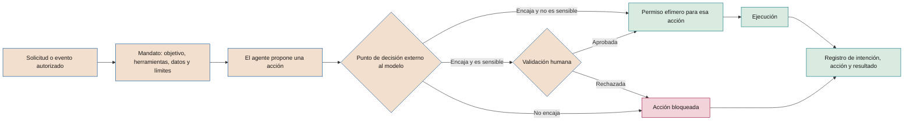

# Seguridad de IA y agentes

**Amenazas a los sistemas de IA, controles para agentes con capacidad de actuar y exposición a la IA ofensiva**

| | |
|---|---|
| Documento | Documento 35 · Seguridad de IA y agentes |
| Versión | 0.2 (borrador de trabajo) |
| Fecha | 25-09-2026 |
| Autor | Fernando García Varela |
| Estado | Borrador para revisión. Define los niveles de autonomía A0–A3 y los catálogos de controles SEG y AG que usan T10, P18 y la lista LV-AG del documento 22. |

<!-- cifras: 4 | niveles de autonomía ; 20 | controles de seguridad de IA (SEG) ; 20 | controles de agentes (AG) ; 9 | requisitos esenciales de un agente -->

---

> **Aviso legal y exención de responsabilidad.** SEVEN-G es un marco metodológico de referencia que se ofrece «tal cual» y con fines exclusivamente informativos. No constituye asesoramiento jurídico, regulatorio, financiero ni profesional, ni garantiza el cumplimiento de ninguna norma. Las referencias a regulación general (como el Reglamento Europeo de IA, el RGPD, DORA o NIS2), a normas técnicas y a regulación específica de cada sector o jurisdicción pueden ser incompletas, no aplicar a un caso concreto o quedar desactualizadas por cambios normativos, interpretaciones o criterios de las autoridades posteriores a su fecha de consulta. **Cada organización que use SEVEN-G es la única responsable de identificar la normativa que le aplica, verificar su vigencia y certificar su propio cumplimiento regulatorio**, con el asesoramiento cualificado que corresponda. El autor no asume responsabilidad alguna por el uso que se haga de este contenido ni por las decisiones que se adopten con él. Los datos, cifras, compañías y casos de los ejemplos son ficticios o ilustrativos.

<!-- esencial: condicional | Disparador: IA generativa, agentes (autonomía A1 a A3) o exposición directa a personas externas. El diseño de seguridad (P18) es evidencia de toda iniciativa; los controles de agentes, las pruebas adversarias y los mínimos por nivel de autonomía aplican según el disparador. -->

## 1. Objeto y alcance

Este documento establece cómo se protege un sistema de IA frente a ataques y usos indebidos, qué controles adicionales exige un agente según su nivel de autonomía y cómo se gestiona la exposición de la compañía a ataques que usan IA. Desarrolla la sección 10 del documento 01 y los riesgos tipo RT-GEN y RT-SEG del documento 33.

### 1.1 Alcance

| Incluye | No incluye |
|---|---|
| Sistemas de IA propios y de terceros integrados en procesos, incluidos asistentes, sistemas de recuperación de información y agentes. | La seguridad de la información general de la compañía, que se rige por su propio sistema de gestión; este documento la complementa para la IA. |
| Uso corporativo de IA de propósito general en lo que afecta a fuga de información. | La política de uso aceptable (documento 31). |
| Exposición corporativa a la IA ofensiva: suplantación, fraude, explotación acelerada. | La gestión de incidentes, que se desarrolla en el documento 37. |

### 1.2 Referencias

Las referencias se han consultado en septiembre de 2026 y deben verificarse en su versión vigente:

- **OWASP Top 10 for LLM Applications**, versión 2025 (riesgos LLM01 a LLM10).
- **OWASP Top 10 for Agentic Applications** (OWASP GenAI Security Project, publicado el 9 de diciembre de 2025; riesgos ASI01 a ASI10) y la guía **Agentic AI – Threats and Mitigations** del mismo proyecto.
- **MITRE ATLAS**, base de conocimiento de tácticas y técnicas adversarias contra sistemas de IA, que se actualiza periódicamente.
- **NIST AI 600-1**, perfil de IA generativa del NIST AI RMF (julio de 2024), en particular los riesgos de seguridad de la información, privacidad de datos e integración de la cadena de valor.
- **NIST CSF 2.0** (NIST CSWP 29, febrero de 2024), para expresar los controles con sus seis funciones (gobernar, identificar, proteger, detectar, responder y recuperar), y su perfil para la IA, el **Cyber AI Profile** (NIST IR 8596), que a fecha de consulta es un **borrador** preliminar (diciembre de 2025) y se usa solo como orientación (34 §5.3).
- **ISO/IEC 42001** e **ISO/IEC 23894** para el encaje en el sistema de gestión y en la gestión de riesgos.
- **Reglamento (UE) 2024/1689**, que exige a los sistemas de alto riesgo un nivel adecuado de precisión, solidez y ciberseguridad, incluida la resistencia a la manipulación de datos y de modelos y a entradas diseñadas para inducir errores.
- **CCN-CERT BP/36**, guía de buenas prácticas frente a la IA ofensiva del Centro Criptológico Nacional (junio de 2026).

Este documento no constituye asesoramiento jurídico.

---

## 2. Principios de seguridad

| # | Principio | Qué implica |
|---|---|---|
| 1 | **El modelo no es una frontera de seguridad** | Las instrucciones al modelo ayudan, pero no protegen. Los límites que importan (permisos, importes, destinatarios, datos) se aplican fuera del modelo. |
| 2 | **Todo contenido externo es no confiable** | Correos, documentos, webs, respuestas de herramientas y de otros agentes son datos, nunca instrucciones. |
| 3 | **Mínimo privilegio y mínima autonomía** | Cada sistema tiene las herramientas, datos y autonomía imprescindibles, y se justifican en la fase 4. |
| 4 | **Cada acción responde a una intención autorizada** | Ningún agente ejecuta una acción que no pueda trazarse a una solicitud o mandato legítimo. |
| 5 | **Una persona valida lo que no se puede deshacer** | Las acciones sensibles requieren validación humana informada. |
| 6 | **Siempre se puede parar** | Todo sistema con capacidad de actuar tiene interruptor de parada probado. |
| 7 | **Se asume el compromiso** | El diseño limita el daño si el modelo es manipulado o una credencial es robada. |
| 8 | **Se prueba como atacaría un adversario** | La eficacia de los controles se demuestra con pruebas adversarias, no con declaraciones. |

---

## 3. Amenazas a los sistemas de IA

### 3.1 Amenazas principales

| Amenaza | Descripción | Referencia | Riesgo tipo (33) | Controles |
|---|---|---|---|---|
| **Inyección directa de instrucciones** | El usuario introduce instrucciones que alteran el comportamiento previsto. | OWASP LLM01; ATLAS | RT-GEN-01 | SEG-02, SEG-03, SEG-11 |
| **Inyección indirecta de instrucciones** | Instrucciones ocultas en contenido que el sistema lee (documentos, correos, webs, respuestas de herramientas, voz) desvían la tarea. | OWASP LLM01; ASI01 | RT-GEN-02 | SEG-02, AG-05, AG-12, AG-18 |
| ***Jailbreak*** | Técnicas para que el modelo ignore sus salvaguardas y produzca contenido o acciones prohibidas. | OWASP LLM01; ATLAS | RT-GEN-01, RT-REP-04 | SEG-03, SEG-11 |
| **Envenenamiento** | Manipulación de datos de entrenamiento, ajuste, evaluación, bases de conocimiento o memoria. | OWASP LLM04, LLM08; ASI06 | RT-SEG-05, RT-GEN-07 | SEG-08, AG-14 |
| **Extracción** | Consultas diseñadas para replicar el modelo, inferir datos de entrenamiento o reconstruir instrucciones del sistema. | OWASP LLM02, LLM07; ATLAS | RT-SEG-06 | SEG-05, SEG-10, SEG-12 |
| **Fuga de información** | Datos personales, confidenciales o secretos expuestos en respuestas, registros, recuperación o herramientas. | OWASP LLM02, LLM07, LLM08; NIST AI 600-1 | RT-GEN-05, RT-DAT-05 | SEG-05, SEG-06, SEG-07 |
| **Tratamiento inseguro de salidas** | La salida se ejecuta o se inserta en otros sistemas sin validar (código, consultas, enlaces). | OWASP LLM05; ASI05 | RT-GEN-06 | SEG-04, AG-11 |
| **Abuso de herramientas** | El sistema usa herramientas legítimas de forma dañina por manipulación o por exceso de permisos. | OWASP LLM06; ASI02, ASI03 | RT-GEN-03, RT-GEN-04 | AG-02, AG-05, AG-07, AG-08 |
| **Cadena de suministro de modelos** | Modelos, pesos, bibliotecas, conectores o servidores de herramientas manipulados o vulnerables. | OWASP LLM03; ASI04; NIST AI 600-1 | RT-SEG-07 | SEG-09, AG-13 |
| **Consumo sin límite** | Uso masivo que agota recursos o dispara costes. | OWASP LLM10; ASI08 | RT-GEN-08, RT-ECO-02 | SEG-10, AG-16 |
| **Desinformación del propio sistema** | Contenidos falsos presentados como ciertos que llevan a decisiones erróneas. | OWASP LLM09; NIST AI 600-1 | RT-TEC-04 | SEG-11; controles de fuentes (33) |

### 3.2 Amenazas específicas de agentes

Un agente planifica, usa herramientas, conserva memoria y actúa con autoridad delegada. Eso añade amenazas que no existen en un asistente que solo responde:

| Amenaza | Qué ocurre | Referencia | Controles |
|---|---|---|---|
| **Secuestro del objetivo** | El agente persigue un objetivo distinto del encomendado. | ASI01 | AG-04, AG-05, AG-12 |
| **Abuso de identidad y privilegios** | El agente usa credenciales o permisos heredados más allá de su tarea; un atacante los reutiliza. | ASI03 | AG-01, AG-02, AG-03, AG-20 |
| **Ejecución inesperada de código** | El agente genera o ejecuta código o comandos con efectos no previstos. | ASI05 | AG-11, SEG-04 |
| **Envenenamiento de memoria y contexto** | Contenido manipulado persiste y condiciona tareas posteriores. | ASI06 | AG-14 |
| **Comunicación insegura entre agentes** | Mensajes falsificados o no autenticados entre agentes. | ASI07 | AG-15 |
| **Fallos en cascada** | Un error se propaga entre agentes o se amplifica en bucles. | ASI08 | AG-07, AG-16 |
| **Explotación de la confianza humana** | El agente induce a una persona a aprobar algo inadecuado. | ASI09 | AG-08 |
| **Agentes descontrolados** | Un agente comprometido o desviado sigue operando. | ASI10 | AG-09, AG-17 |

---

## 4. Requisitos esenciales de un agente

Todo sistema clasificado como A2 o A3, y en lo que corresponda A1 (sección 5), **debe** cumplir los nueve requisitos siguientes. Los controles AG de la sección 7 los concretan.

### 4.1 Identidad propia

- El agente **debe** operar con una identidad no humana propia, distinta de la de cualquier empleado y de la de otros agentes (AG-01).
- La identidad se registra en el inventario de identidades no humanas (P54) con su sistema, finalidad y **responsable humano**.
- Cuando actúa en nombre de un usuario, la acción se registra con las dos identidades: la del agente y la del usuario por cuya cuenta actúa. El agente no puede obtener más permisos que el usuario al que representa.

### 4.2 Permisos mínimos

- Lista cerrada de herramientas permitidas y, para cada una, operaciones y datos permitidos (AG-02). Lectura y escritura se autorizan por separado.
- Los permisos se justifican en el diseño de seguridad (P18) y se revisan periódicamente (AG-20).
- Separación de privilegios: el componente que lee contenido no confiable no dispone, sin control intermedio, de herramientas que ejecutan acciones sensibles (AG-12).

### 4.3 Credenciales

- Secretos en un gestor de secretos; nunca en instrucciones, código, memoria ni registros (AG-03).
- Credenciales de corta duración y ámbito limitado; rotación con plazo definido; revocación inmediata vinculada al interruptor de parada.

### 4.4 Control de intención

El control de intención garantiza que **cada acción del agente es trazable a una intención autorizada**. Funciona así:

1. **Mandato.** Cada tarea tiene una intención autorizada: quién la solicita o qué evento la origina, objetivo, herramientas, datos y límites (AG-04).
2. **Punto de decisión externo al modelo.** Antes de cada acción, un componente independiente del modelo comprueba que la acción concreta (herramienta, parámetros, datos, destinatario, importe) encaja con la intención y los límites (AG-05).
3. **Permiso efímero.** Si encaja, emite un permiso de corta duración limitado a esa acción. Si no encaja, la bloquea. Si es sensible, la somete a validación humana.
4. **Trazabilidad.** La acción queda registrada con el identificador de la intención que la autorizó (AG-06, AG-10).

<!-- grafico: Control de intención de un agente | Ninguna acción se ejecuta sin encajar con una intención autorizada -->

### 4.5 Límites de actuación

Límites definidos en el diseño y aplicados fuera del modelo (AG-07): importes por operación y acumulados, número de acciones por periodo, destinatarios o dominios permitidos, horarios, volumen de datos, número de iteraciones y presupuesto de consumo. Superar un límite detiene la secuencia y genera alerta.

### 4.6 Validación humana en acciones sensibles

Se consideran **acciones sensibles**, salvo justificación registrada en P17 y P18:

- Pagos, transferencias, devoluciones o cambios de datos bancarios.
- Comunicaciones externas en nombre de la compañía a clientes, proveedores, autoridades o público.
- Decisiones con efectos significativos sobre personas (empleo, crédito, seguros, acceso a servicios, reclamaciones).
- Alta, baja o modificación de datos personales o de permisos.
- Cambios en sistemas de producción, configuraciones de seguridad o código desplegado.
- Borrado de información o acciones no reversibles.
- Cualquier acción fuera de los límites ordinarios.

La validación **debe** ser informada: la persona ve qué acción se propone, con qué datos, por qué y con qué efectos, y puede rechazarla sin coste para ella. Se mide la tasa de rechazo y el tiempo de revisión para detectar aprobación rutinaria (AG-08, RT-ORG-04).

### 4.7 Interruptor de parada

- Mecanismo para detener de inmediato el agente completo o una capacidad concreta (una herramienta, un tipo de acción) **sin desplegar código** (AG-09).
- Activable por el responsable de operación de IA y por seguridad, con procedimiento en el manual de operación (P24).
- Al activarse: revoca credenciales, bloquea nuevas acciones, conserva registros y activa el proceso alternativo.
- Se prueba antes de G5 y periódicamente (sección 5.3). Su tiempo de efecto se mide.

### 4.8 Registro de acciones

Registro íntegro y protegido frente a modificación (AG-10) con, como mínimo: identidad del agente y del usuario representado, intención, acción propuesta, decisión del punto de decisión, validación humana si la hubo, herramienta, parámetros relevantes, resultado, versión de modelo e instrucciones, fecha y hora. La conservación respeta la minimización de datos personales y los plazos regulatorios aplicables; para desplegadores de sistemas de alto riesgo, el Reglamento de IA exige conservar los registros generados automáticamente al menos seis meses, salvo otra disposición.

### 4.9 Entornos aislados

La ejecución de código, la navegación web, la manipulación de ficheros externos y las pruebas se realizan en entornos aislados, con salida de red restringida, sin credenciales de producción y con destrucción al terminar (AG-11).

---

## 5. Niveles de autonomía

### 5.1 Definición

| Nivel | Nombre | Qué hace el sistema | Papel humano |
|---|---|---|---|
| **A0** | Asistencia | Informa, resume o genera contenido. | La persona decide y ejecuta. |
| **A1** | Recomendación | Propone una decisión o acción concreta. | La persona valida cada acción antes de ejecutarla. |
| **A2** | Actuación supervisada | Ejecuta acciones dentro de límites definidos. | Supervisa, puede interrumpir y revisa a posteriori. |
| **A3** | Actuación autónoma | Ejecuta secuencias de acciones sin revisión individual dentro de límites estrictos. | Fija límites, supervisa agregados y dispone de interruptor de parada. |

### 5.2 Reglas de asignación

1. El nivel se propone en la fase 3, se fija en la fase 4 (P17 y P18) y se registra en el inventario (T02). Se asigna el **nivel más alto** de las acciones que el sistema puede ejecutar, no el de su uso habitual.
2. Un sistema A2 o A3 cuyas acciones tienen efecto sobre terceros, dinero, datos personales o sistemas de producción cumple el criterio Enterprise "agentes con capacidad de actuar" (01 §9.2).
3. **A3** requiere decisión del comité de IA en G4 y en G5, con justificación de por qué A2 no basta.
4. Subir de nivel es un cambio relevante: exige revaloración de riesgos, actualización de P18 y nueva decisión del *gate* correspondiente.
5. En caso de incidente S1 o S2 relacionado con la autonomía, el sistema baja provisionalmente de nivel o se detiene hasta el análisis posterior (documento 37).

### 5.3 Controles mínimos por nivel

**Sí** = obligatorio · **Rec.** = recomendado; su omisión se justifica y registra · **—** = no aplica.

| Control | A0 | A1 | A2 | A3 |
|---|---|---|---|---|
| AG-01 Identidad propia | Rec. | Sí | Sí | Sí |
| AG-02 Mínimo privilegio | Sí | Sí | Sí | Sí |
| AG-03 Gestión de credenciales | Sí | Sí | Sí | Sí |
| AG-04 Mandato e intención autorizada | — | Rec. | Sí | Sí |
| AG-05 Punto de decisión de intención | — | — | Sí | Sí |
| AG-06 Trazabilidad acción–intención | — | Sí | Sí | Sí |
| AG-07 Límites de actuación | — | Rec. | Sí | Sí |
| AG-08 Validación humana | — | Sí (toda acción) | Sí (sensibles) | Sí (sensibles y fuera de límites) |
| AG-09 Interruptor de parada | Rec. | Rec. | Sí | Sí |
| AG-10 Registro de acciones | Rec. | Sí | Sí | Sí |
| AG-11 Entornos aislados | Rec. | Rec. | Sí | Sí |
| AG-12 Contenido externo no confiable | Sí | Sí | Sí | Sí |
| AG-13 Herramientas y conectores aprobados | Rec. | Sí | Sí | Sí |
| AG-14 Integridad de memoria y contexto | Rec. | Rec. | Sí | Sí |
| AG-15 Comunicación segura entre agentes | — | Rec. | Sí | Sí |
| AG-16 Contención de cascadas y consumo | — | Rec. | Sí | Sí |
| AG-17 Monitorización de comportamiento | Rec. | Rec. | Sí | Sí |
| AG-18 Pruebas adversarias de agentes | Rec. | Sí | Sí | Sí |
| AG-19 Reversibilidad y compensación | — | Rec. | Sí | Sí |
| AG-20 Revisión periódica de permisos | Rec. | Sí | Sí | Sí |

AG-01, AG-03 y AG-13 aplican a A0 como obligatorios si el sistema accede a sistemas o datos corporativos con credenciales propias. AG-11 es obligatorio en cualquier nivel si el sistema ejecuta código o navega. AG-15 solo aplica si intervienen varios agentes.

| Frecuencia mínima | A1 | A2 | A3 |
|---|---|---|---|
| Prueba del interruptor de parada | — | Antes de G5 y semestral | Antes de G5 y trimestral |
| Pruebas adversarias (AG-18) | Antes de G5 y tras cambios relevantes | Antes de G5, anual y tras cambios relevantes | Antes de G5, semestral y tras cambios relevantes |
| Revisión de permisos (AG-20) | Anual | Semestral | Trimestral |
| Revisión de muestras de acciones | Semestral | Mensual | Continua con alertas y revisión mensual |

### 5.4 Controles críticos

En A2 y A3 son **controles críticos** AG-01, AG-02, AG-03, AG-05, AG-08, AG-09, AG-10 y AG-12; en A1, AG-02, AG-03, AG-08 y AG-12. Un control crítico no diseñado bloquea G4; no probado, bloquea G5. No se admite **Continuar con condiciones** sobre ellos (01 §7.3). Su desactivación en producción es no conformidad crítica (01 §12).

---

## 6. Catálogo de controles de seguridad de IA (SEG)

*Aplica* indica el alcance: **IA** (todo sistema de IA), **GEN** (IA generativa y agentes), **EXT** (exposición a personas externas), **CORP** (control corporativo, no de una iniciativa). *Función CSF* indica la función del NIST CSF 2.0 a la que contribuye principalmente el control y, entre paréntesis, su categoría (34 §5.3); con ella se construye el perfil de seguridad de la IA desde los controles existentes.

| Código | Control | Qué exige | Evidencia | Aplica | Fase | Función CSF |
|---|---|---|---|---|---|---|
| **SEG-01** | Modelado de amenazas de IA | Análisis de amenazas con OWASP LLM 2025, OWASP Agentic y MITRE ATLAS, vinculado al registro de riesgos. | Modelo de amenazas en P18. | IA | 3, 4 | ID (ID.RA) |
| **SEG-02** | Separación de instrucciones y datos | El contenido externo se delimita y trata como dato; las instrucciones del sistema no pueden sobrescribirse con él. | Diseño y resultados de pruebas de inyección. | GEN | 4, 5 | PR (PR.DS) |
| **SEG-03** | Filtros de entrada y salida | Detección de intentos de manipulación, contenido prohibido y datos sensibles antes y después del modelo. | Configuración, umbrales y tasa de detección. | GEN | 4–6 | PR (PR.DS) · DE (DE.CM) |
| **SEG-04** | Tratamiento seguro de salidas | Las salidas se validan y codifican antes de ejecutarse o insertarse en otros sistemas. | Revisión de integraciones; pruebas. | GEN | 4, 5 | PR (PR.PS) |
| **SEG-05** | Protección de instrucciones del sistema | Sin secretos, credenciales ni lógica de control en las instrucciones; su divulgación no compromete la seguridad. | Revisión de instrucciones; prueba de extracción. | GEN | 4, 5 | PR (PR.PS) |
| **SEG-06** | Recuperación con permisos | La recuperación de información respeta los permisos del usuario; segmentación de índices por nivel de confidencialidad. | Diseño del índice; pruebas con usuarios de distinto perfil. | GEN | 4, 5 | PR (PR.AA) |
| **SEG-07** | Prevención de fuga de datos | Minimización, enmascarado, clasificación de la información y control de datos en entradas, contexto, salidas y registros. | Reglas de prevención de fuga; muestreo de registros. | IA, CORP | 4, 6 | PR (PR.DS) |
| **SEG-08** | Integridad de datos de entrenamiento y conocimiento | Procedencia verificada, control de cambios y detección de anomalías en datos de entrenamiento, ajuste, evaluación y bases de conocimiento. | Linaje (P16); controles de ingesta. | IA | 4, 6 | PR (PR.DS) |
| **SEG-09** | Cadena de suministro de modelos | Inventario de modelos y componentes con versión y procedencia; fuentes aprobadas; verificación de integridad; análisis de vulnerabilidades. | Inventario de componentes (P54); registro de verificación. | IA | 4, 6 | GV (GV.SC) · ID (ID.AM) |
| **SEG-10** | Límites de uso y consumo | Autenticación, cuotas por usuario y sistema, límites de tamaño y frecuencia, detección de patrones de extracción. | Configuración y alertas. | GEN, EXT | 4, 6 | PR (PR.IR) |
| **SEG-11** | Evaluaciones de seguridad y *red teaming* | Pruebas adversarias antes de G5, tras cambios relevantes y periódicamente (sección 8). | Plan, resultados y acciones cerradas. | GEN | 5, 6 | ID (ID.IM) |
| **SEG-12** | Registro y monitorización de seguridad | Telemetría de entradas, salidas, bloqueos y acciones integrada en la monitorización de seguridad de la compañía, con casos de uso de detección específicos. | Casos de detección; alertas probadas. | IA | 4, 6 | DE (DE.CM) |
| **SEG-13** | Gestión acelerada de vulnerabilidades | Plazos de corrección reducidos para sistemas expuestos y componentes de IA; priorización por explotabilidad. | Plazos aprobados; cumplimiento. | CORP | 6 | ID (ID.RA) · PR (PR.PS) |
| **SEG-14** | Respuesta a incidentes de IA | Procedimientos para inyección, fuga, acción no autorizada y compromiso de agente, conectados con el documento 37. | Plan (P26); simulacro. | IA, CORP | 5, 6 | RS (RS.MA) · RC (RC.RP) |
| **SEG-15** | Autenticación resistente a *phishing* | Doble factor resistente a suplantación en accesos expuestos, privilegiados y de administración de plataformas de IA. | Cobertura medida. | CORP | C4 | PR (PR.AA) |
| **SEG-16** | Verificación fuera de banda | Confirmación por un canal independiente y preestablecido de órdenes de pago, cambios de cuentas bancarias y peticiones urgentes de directivos. | Procedimiento; pruebas de cumplimiento. | CORP | C4 | PR (PR.AA) |
| **SEG-17** | Concienciación sobre suplantación con IA | Formación y simulacros con mensajes, voz y vídeo sintéticos, dirigidos especialmente a finanzas, dirección, atención al cliente y soporte técnico. | Plan; resultados de simulacros. | CORP | C4 | PR (PR.AT) |
| **SEG-18** | Protocolos frente a contenido sintético | Palabras de verificación o preguntas acordadas en canales de voz y vídeo; herramientas de detección como apoyo, no como única barrera. | Procedimiento publicado. | CORP | C4 | PR (PR.AA) · DE (DE.AE) |
| **SEG-19** | Pruebas continuas de la superficie expuesta | Descubrimiento de activos expuestos y pruebas de intrusión recurrentes que incluyan técnicas automatizadas con IA. | Resultados y plazos de corrección. | CORP | C4, 6 | ID (ID.AM, ID.RA) |
| **SEG-20** | Control del uso corporativo de IA | Herramientas aprobadas, bloqueo o supervisión de las no autorizadas, prevención de fuga hacia servicios externos. | Monitor de uso (T21). | CORP | C4 | GV (GV.PO) · PR (PR.DS) |

---

## 7. Catálogo de controles de agentes (AG)

La lista **LV-AG** del documento 22 convierte cada control en preguntas binarias verificables en G4 (diseñado), G5 (probado) y R6 (operando). Este documento es la referencia de su contenido. *Función CSF* tiene el mismo significado que en la sección 6.

| Código | Control | Qué exige | Evidencia en G4 · G5 · R6 | Función CSF |
|---|---|---|---|---|
| **AG-01** | Identidad propia | Identidad no humana exclusiva, registrada, con responsable humano; doble identidad cuando actúa por cuenta de un usuario. | Registro de identidad · Prueba de trazas · Inventario vigente | PR (PR.AA) |
| **AG-02** | Mínimo privilegio | Lista cerrada de herramientas, operaciones y datos; lectura y escritura separadas; permisos justificados. | Matriz de permisos · Prueba de acceso denegado · Revisión (AG-20) | PR (PR.AA) |
| **AG-03** | Gestión de credenciales | Gestor de secretos, corta duración, rotación, revocación vinculada al interruptor. | Diseño · Prueba de revocación · Registro de rotaciones | PR (PR.AA) |
| **AG-04** | Mandato e intención autorizada | Cada tarea con solicitante o evento de origen, objetivo, herramientas, datos y límites. | Esquema de mandato · Muestras · Muestras | PR (PR.AA) |
| **AG-05** | Punto de decisión de intención | Componente externo al modelo que valida cada acción contra el mandato y emite permisos efímeros. | Diseño · Pruebas de desvío bloqueado · Tasa de bloqueos | PR (PR.AA) |
| **AG-06** | Trazabilidad acción–intención | Toda acción enlaza con el identificador de la intención que la autorizó. | Modelo de datos · Reconstrucción de casos · Muestreo | PR (PR.PS) |
| **AG-07** | Límites de actuación | Importes, volúmenes, destinatarios, horarios, iteraciones y presupuesto aplicados fuera del modelo. | Tabla de límites · Pruebas de superación · Alertas | PR (PR.PS) |
| **AG-08** | Validación humana | Lista de acciones sensibles; validación informada; medición de rechazos y tiempos. | Lista y diseño (P17) · Prueba con usuarios · Tasa de rechazo | PR (PR.AA) |
| **AG-09** | Interruptor de parada | Parada total o por capacidad sin desplegar código; revoca credenciales; activa proceso alternativo. | Procedimiento · Prueba con tiempo de efecto · Pruebas periódicas | RS (RS.MI) |
| **AG-10** | Registro de acciones | Registro íntegro, protegido y con los campos de 4.8; conservación definida. | Especificación · Prueba de integridad · Muestreo | PR (PR.PS) |
| **AG-11** | Entornos aislados | Ejecución de código, navegación y ficheros externos en entornos aislados sin credenciales de producción. | Arquitectura · Prueba de escape · Configuración vigente | PR (PR.IR) |
| **AG-12** | Contenido externo no confiable | Separación de privilegios entre lectura de contenido no confiable y acciones sensibles. | Diseño · Pruebas de inyección indirecta · Resultados periódicos | PR (PR.AA) |
| **AG-13** | Herramientas y conectores aprobados | Inventario de herramientas, conectores y servidores de herramientas con versión fijada, origen verificado y aprobación. | Inventario · Verificación · Revisión de cambios | ID (ID.AM) · GV (GV.SC) |
| **AG-14** | Integridad de memoria y contexto | Memoria aislada por usuario y tarea, con caducidad, validación de escritura y posibilidad de purga. | Diseño · Prueba de envenenamiento · Purgas registradas | PR (PR.DS) |
| **AG-15** | Comunicación segura entre agentes | Autenticación mutua, mensajes íntegros, sin confianza implícita entre agentes. | Diseño · Prueba de suplantación · Configuración | PR (PR.DS) |
| **AG-16** | Contención de cascadas y consumo | Límites de iteración, reintentos y profundidad; disyuntores; presupuesto por tarea. | Parámetros · Prueba de bucle · Alertas de consumo | PR (PR.IR) |
| **AG-17** | Monitorización de comportamiento | Líneas base de acciones y alertas ante desviaciones (volumen, destinos, horarios, herramientas). | Casos de detección · Alertas probadas · Revisión de alertas | DE (DE.CM) |
| **AG-18** | Pruebas adversarias de agentes | Inyección directa e indirecta, abuso de herramientas, escalada de privilegios, manipulación del aprobador. | Plan · Resultados · Campañas periódicas | ID (ID.IM) |
| **AG-19** | Reversibilidad y compensación | Preferencia por acciones reversibles; procedimiento para deshacer o compensar las demás. | Diseño · Prueba de deshacer · Casos reales | RC (RC.RP) |
| **AG-20** | Revisión periódica de permisos | Certificación por el responsable humano de identidades, permisos y herramientas con la frecuencia de 5.3. | — · — · Actas de revisión | PR (PR.AA) |

---

## 8. Pruebas de seguridad por fase

| Fase | Pruebas | Quién | Resultado exigido |
|---|---|---|---|
| **3 · Viabilidad** | Modelado de amenazas preliminar; evaluación de seguridad del proveedor; decisión preliminar de nivel de autonomía. | Técnico y seguridad | Riesgos RT-GEN y RT-SEG valorados en P12. |
| **4 · Diseño** | Modelado de amenazas completo (SEG-01); revisión de arquitectura de permisos, control de intención e interruptor. | Seguridad, independiente del equipo | P18 con todos los controles aplicables diseñados. |
| **5 · Entrega** | Evaluaciones adversarias automatizadas; *red teaming* manual; pruebas de inyección directa e indirecta; pruebas de límites, interruptor, revocación y reversión; pruebas de fuga de datos. | Equipo de pruebas independiente o tercero | Controles críticos probados; hallazgos altos cerrados o aceptados según 33 §7. |
| **6 · Operación** | Evaluaciones continuas de regresión; campañas periódicas (5.3); pruebas tras cambios de modelo, instrucciones, herramientas o proveedor; simulacros de incidente. | Operación y seguridad | Indicadores de la sección 10 dentro de umbral. |
| **7 · Evolución** | Pruebas del alcance ampliado; en retirada, revocación de identidades y borrado verificado. | Seguridad | Sin identidades ni credenciales huérfanas. |

**Contenido mínimo de una campaña de *red teaming* (plantilla P53):** alcance y reglas de enfrentamiento aprobadas; escenarios derivados del modelo de amenazas; inyección directa e indirecta por todos los canales de entrada; intentos de extracción de instrucciones y datos; abuso de cada herramienta; intentos de superar límites y de inducir aprobaciones; resultados con tasa de éxito por escenario, severidad y acción correctiva; repetición de los escenarios fallidos tras la corrección.

Las evaluaciones adversarias automatizadas se versionan y se ejecutan antes de cada cambio relevante. Un escenario con éxito en una acción sensible es un hallazgo que bloquea G5 hasta su corrección.

---

## 9. Exposición a la IA ofensiva

La IA no crea tipos de ataque nuevos en su mayoría, pero reduce su coste, aumenta su verosimilitud y acorta los tiempos. La guía CCN-CERT BP/36 insiste en esta idea: el tiempo entre la existencia de una vulnerabilidad y su explotación se reduce, y las revisiones de seguridad puntuales llegan tarde. La exposición se gestiona como riesgo corporativo (C4), con responsable en seguridad de la información e información al consejo.

### 9.1 Amenazas y controles corporativos

| Amenaza | Qué cambia con la IA | Riesgo tipo | Controles corporativos |
|---|---|---|---|
| **Suplantación de identidad** | Voz y vídeo sintéticos convincentes a partir de muestras públicas; suplantación en tiempo real. | RT-SEG-01 | SEG-16, SEG-17, SEG-18; límites de autorización de pagos. |
| ***Phishing* generado** | Mensajes personalizados, sin errores, en cualquier idioma y a gran escala. | RT-SEG-02 | SEG-15, SEG-17; filtrado de correo; reducción de información pública sobre empleados. |
| **Fraude del CEO con *deepfakes*** | Videollamadas o audios falsos de directivos que ordenan pagos urgentes o confidenciales. | RT-SEG-01 | SEG-16 sin excepciones por urgencia o jerarquía; doble firma; palabra de verificación (SEG-18). |
| **Explotación acelerada de vulnerabilidades** | Descubrimiento y explotación automatizados poco después de publicarse una vulnerabilidad. | RT-SEG-03 | SEG-13, SEG-19; inventario de superficie expuesta; segmentación. |
| **Ataque a identidades y credenciales** | Automatización de pruebas de credenciales y abuso de identidades no humanas. | RT-SEG-04 | SEG-15; AG-01, AG-03, AG-20; detección de tráfico automatizado. |
| **Ataque a los propios agentes** | Inyección indirecta para que los agentes de la compañía actúen contra ella. | RT-GEN-02 | AG-05, AG-08, AG-12, AG-18. |
| **Desinformación sobre la compañía** | Contenidos falsos sobre la compañía o sus directivos difundidos a escala. | RT-REP-03 | Vigilancia de marca; protocolo de comunicación de crisis. |

### 9.2 Medidas de gobierno

- **Responsable:** seguridad de la información, con informe al comité de IA y a la comisión delegada.
- **Evaluación anual** de exposición a la IA ofensiva con las amenazas de 9.1 y, en entidades del ámbito del Esquema Nacional de Seguridad, con los instrumentos de autoevaluación que publique el CCN.
- **Simulacro anual**, como mínimo, de fraude con suplantación sintética que implique a finanzas y dirección.
- **Procesos de pago** revisados para que ninguna orden dependa solo del reconocimiento de voz, imagen o estilo de escritura.
- **Plazos de corrección** de vulnerabilidades en sistemas expuestos revisados y aprobados, con seguimiento de su cumplimiento.

---

## 10. Indicadores para el consejo

| Indicador | Qué muestra | Lectura |
|---|---|---|
| Sistemas por nivel de autonomía | Número de sistemas A0, A1, A2 y A3 en producción. | Crecimiento de A2 y A3 con controles críticos completos. |
| Controles críticos de agentes | Porcentaje de controles críticos probados y operando en A2 y A3. | 100 %; cualquier desviación se explica. |
| Identidades de agentes con permisos excesivos | Hallazgos de la última revisión (AG-20). | Cero. |
| Credenciales sin rotar en plazo | Identidades no humanas con secretos fuera de plazo. | Cero. |
| Prueba del interruptor de parada | Sistemas A2 y A3 con prueba vigente y tiempo de efecto medido. | 100 %. |
| Éxito de inyección de instrucciones | Porcentaje de escenarios con éxito en la última campaña, y en acciones sensibles. | Tendencia a la baja; cero en acciones sensibles. |
| Acciones de agentes bloqueadas | Acciones bloqueadas por el control de intención o por límites. | Explicar picos: ataque, error de diseño o mandato mal definido. |
| Incidentes de seguridad de IA | Incidentes S1–S4 por tipo: inyección, fuga, acción no autorizada, compromiso de agente. | Tendencia y tiempo de contención. |
| Doble factor resistente a *phishing* | Cobertura en accesos expuestos y privilegiados. | 100 % en privilegiados. |
| Vulnerabilidades críticas expuestas fuera de plazo | Número y antigüedad. | Cero. |
| Simulacros de suplantación | Resultado del último simulacro de fraude con contenido sintético. | Porcentaje que aplica la verificación fuera de banda. |
| Uso no autorizado de IA | Casos detectados y regularizados. | Tendencia a la baja. |

---

## 11. Integración con el ciclo de vida

| Puerta | Qué se exige en seguridad |
|---|---|
| **G3** | Riesgos RT-GEN y RT-SEG valorados; nivel de autonomía propuesto; evaluación de seguridad del proveedor (documento 36). |
| **G4** | P18 completo; controles SEG y AG aplicables diseñados; controles críticos diseñados; conformidad de seguridad de la información. |
| **G5** | Controles críticos probados; *red teaming* realizado con hallazgos tratados; interruptor probado; firma de seguridad de la información en la firma multinivel (01 §6.7). |
| **R6** | Controles operando; campañas y revisiones dentro de frecuencia; incidentes analizados; nivel de autonomía vigente. |
| **G7** | En escalado, revisión de controles para el nuevo alcance; en retirada, revocación de identidades y credenciales. |

El responsable técnico de IA diseña e implanta los controles; seguridad de la información los revisa y emite conformidad; el responsable de riesgos de IA valora el residual; el auditor de IA verifica las evidencias con la lista LV-AG. Quien construye el agente no realiza su *red teaming* de G5.

---

## 12. Herramientas y plantillas asociadas

| Código | Nombre | Uso |
|---|---|---|
| **P18** | Diseño de seguridad (incluye agentes) | Modelo de amenazas, nivel de autonomía, identidades, matriz de permisos, mandato y control de intención, límites, acciones sensibles, interruptor, registro, aislamiento, plan de pruebas y estado de cada control SEG y AG. Fase 4; se actualiza en 5 y 6. |
| **T10** | Evaluación de seguridad de agentes | A partir del nivel de autonomía, genera los controles SEG y AG exigibles, registra su estado (cumple, no cumple, no aplica, pendiente) con evidencia y bloquea G4 o G5 si un control crítico no está diseñado o probado. Lista de verificación en T03. |
| **P53** | Plan e informe de pruebas adversarias | Alcance, reglas de enfrentamiento, escenarios y resultados de las campañas de *red teaming* (sección 8). Fases 4 a 6. |
| **P54** | Inventario de identidades no humanas y componentes | Identidades de los agentes con su responsable humano (sección 4) y componentes con versión y procedencia (SEG-09). Fase 4; se revisa en la operación. |
| **P72** | Perfil de seguridad de IA (CSF 2.0 / Cyber AI Profile) | Perfil actual y objetivo de la seguridad de la IA con las funciones del CSF, a partir de la columna «Función CSF» de las secciones 6 y 7 y del cuestionario del documento 11 (34 §5.5). C1, C2 y C5. |
| P17 · P24 · P26 | Diseño de supervisión humana · Manual de operación · Plan de respuesta a incidentes | Acciones sensibles y validación; procedimiento del interruptor; respuesta a incidentes de IA. |
| T02 · T06 · T08 · T17 · T21 | Inventario · Riesgos · Incidentes · Panel del consejo · Monitor de uso corporativo | Nivel de autonomía, riesgos, incidentes, indicadores y uso no autorizado. |

---

## 13. Documentos relacionados

| Documento | Relación |
|---|---|
| **01 · Metodología fundacional** | Sección 9.2 (agentes con capacidad de actuar), sección 10 y firma multinivel. |
| **22 · Listas de verificación** | Lista LV-AG basada en los controles AG. |
| **31 · Política corporativa y uso aceptable** | Uso corporativo de IA y SEG-20. |
| **33 · Metodología de riesgos de IA** | Escalas y riesgos tipo RT-GEN y RT-SEG. |
| **36 · Terceros y proveedores de IA** | Seguridad de proveedores, modelos y conectores de terceros. |
| **37 · No conformidades e incidentes** | Respuesta a incidentes de seguridad de IA y desactivación de controles críticos. |
| **52 · Manual de operación de IA** | Operación de la monitorización, del interruptor y de las evaluaciones continuas. |
| **60 · Paquete para el consejo** | Indicadores de la sección 10. |

---

## 14. Control de versiones

| Versión | Fecha | Cambios |
|---|---|---|
| 0.1 | 16-09-2026 | Primera versión. Define las amenazas a sistemas de IA con referencias a OWASP (LLM 2025 y aplicaciones agénticas), MITRE ATLAS y NIST AI 600-1; los nueve requisitos esenciales de un agente; los niveles de autonomía A0–A3 con controles mínimos y frecuencias; los catálogos SEG-01 a SEG-20 y AG-01 a AG-20; las pruebas por fase; la exposición a la IA ofensiva y los indicadores para el consejo. |
| 0.2 | 25-09-2026 | Añade el NIST CSF 2.0 y el Cyber AI Profile (en borrador) a las referencias (sección 1.2) y la columna «Función CSF» a los catálogos SEG y AG (secciones 6 y 7), con la función y la categoría del CSF a las que contribuye cada control (34 §5.3), y la plantilla P72 en la sección 12. |
