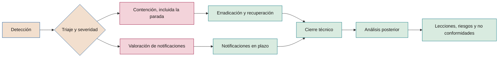

# No conformidades, incidentes de IA y remediación

**Cómo se detectan, contienen, analizan, notifican y corrigen los incumplimientos del marco y los incidentes de los sistemas de IA**

| | |
|---|---|
| Documento | Documento 37 · No conformidades e incidentes |
| Versión | 0.1 (borrador de trabajo) |
| Fecha | 16-09-2026 |
| Autor | Fernando García · SEACHAD |
| Estado | Borrador para revisión. Desarrolla la sección 12 del documento 01 y fija la escala de severidad S1–S4. |

<!-- cifras: 3 | tipos de no conformidad ; 4 | niveles de severidad de incidentes ; 4 | regímenes de notificación analizados ; 8 | fases de respuesta a un incidente -->

---

> **Aviso legal y exención de responsabilidad.** SEVEN-G es un marco metodológico de referencia que se ofrece «tal cual» y con fines exclusivamente informativos. No constituye asesoramiento jurídico, regulatorio, financiero ni profesional, ni garantiza el cumplimiento de ninguna norma. Las referencias a regulación general (como el Reglamento Europeo de IA, el RGPD, DORA o NIS2), a normas técnicas y a regulación específica de cada sector o jurisdicción pueden ser incompletas, no aplicar a un caso concreto o quedar desactualizadas por cambios normativos, interpretaciones o criterios de las autoridades posteriores a su fecha de consulta. **Cada organización que use SEVEN-G es la única responsable de identificar la normativa que le aplica, verificar su vigencia y certificar su propio cumplimiento regulatorio**, con el asesoramiento cualificado que corresponda. El autor y SEACHAD no asumen responsabilidad alguna por el uso que se haga de este contenido ni por las decisiones que se adopten con él. Los datos, cifras, compañías y casos de los ejemplos son ficticios o ilustrativos.

## 1. Objeto y alcance

Este documento establece dos procesos conectados:

1. El **proceso de no conformidades**, que trata cualquier incumplimiento de un requisito obligatorio del marco (01 §12).
2. El **proceso de incidentes de IA**, que trata cualquier suceso en el que un sistema de IA causa, o puede causar, un daño o una interrupción, incluidos los que obligan a notificar a autoridades.

Se aplica a todos los sistemas del inventario —propios, de terceros y de uso corporativo— y a todas las iniciativas, con independencia de su intensidad. Complementa, sin sustituirlos, los procesos corporativos de gestión de incidentes de seguridad, de brechas de datos personales y de continuidad de negocio: cuando un incidente de IA es también un incidente de seguridad o una brecha, se gestiona **una sola vez**, con un único coordinador y con las especificidades de IA de este documento.

### 1.1 Definiciones

| Término | Definición en SEVEN-G |
|---|---|
| **No conformidad** | Incumplimiento de un requisito obligatorio del marco ("debe"), clasificado como menor, mayor o crítico. |
| **Incidente de IA** | Suceso en el que un sistema de IA, por su funcionamiento, fallo, manipulación o uso, causa o puede causar daño a personas, a la compañía o a terceros, o interrumpe o degrada un proceso. |
| **Cuasi incidente** | Suceso que pudo causar daño y no lo causó gracias a un control o por azar. Se registra como S4. |
| **Incidente grave** (Reglamento de IA) | Incidente o defecto de funcionamiento de un sistema de IA que, directa o indirectamente, causa el fallecimiento o un perjuicio grave para la salud de una persona; una alteración grave e irreversible de la gestión o el funcionamiento de infraestructuras críticas; el incumplimiento de obligaciones del Derecho de la Unión destinadas a proteger los derechos fundamentales; o daños graves a la propiedad o al medio ambiente (art. 3.49). |
| **Brecha de datos personales** | Violación de la seguridad que ocasiona la destrucción, pérdida o alteración accidental o ilícita de datos personales, o su comunicación o acceso no autorizados (RGPD art. 4.12). |
| **Incidente grave relacionado con las TIC** | Incidente que cumple los criterios de clasificación de DORA (art. 18 y su desarrollo). |
| **Incidente significativo** | Incidente que cumple los criterios del art. 23.3 de NIS2 según su transposición nacional. |

### 1.2 Referencias

Consultadas en septiembre de 2026; deben verificarse en su versión vigente antes de aplicarse:

- **Reglamento (UE) 2024/1689** (Reglamento de IA), arts. 3.49, 26.5, 72 y 73, modificado por el Reglamento (UE) 2026/1744 (Ómnibus digital sobre IA), que no altera el art. 73 pero aplaza al 2 de diciembre de 2027 las obligaciones de los sistemas de alto riesgo del anexo III.
- **Reglamento (UE) 2016/679 (RGPD)**, arts. 33 y 34.
- **Reglamento (UE) 2022/2554 (DORA)**, arts. 17 a 19, y Reglamento Delegado (UE) 2025/301 sobre contenido y plazos de las notificaciones.
- **Directiva (UE) 2022/2555 (NIS2)**, art. 23. En España, la ley de transposición seguía en tramitación en la última información consultada (julio de 2026).
- **ISO/IEC 42001**, requisito de no conformidad y acción correctiva (cláusula 10.2).

Este documento no constituye asesoramiento jurídico. La decisión de notificar y su contenido deben validarse con asesoría jurídica y con el delegado de protección de datos cuando corresponda. Los criterios de clasificación y las obligaciones de notificación descritos son orientativos: la responsabilidad de la clasificación regulatoria de cada incidente y del cumplimiento, incluidos los regímenes sectoriales aplicables, es de la organización (documento 93, sección 11).

---

## 2. Principios

| # | Principio | Consecuencia |
|---|---|---|
| 1 | **Primero contener, después explicar** | La contención no espera al análisis de causa; incluye parar el sistema si es necesario. |
| 2 | **Ante la duda, severidad mayor** | Se clasifica al alza y se rebaja con evidencia. |
| 3 | **Los relojes regulatorios empiezan pronto** | Los plazos se cuentan desde que se tiene constancia, no desde que se termina el análisis. |
| 4 | **Sin culpables, con responsables** | El análisis busca causas sistémicas; "error humano" no es una causa raíz final. |
| 5 | **Quien causó no cierra** | Solo el auditor de IA cierra una no conformidad; quien la origina no verifica su corrección. |
| 6 | **Corregir aquí y en todas partes** | Toda acción correctiva valora si el mismo fallo existe en otros sistemas. |
| 7 | **Las evidencias se conservan** | Registros, versiones y datos del momento del incidente se preservan antes de cambiar el sistema. |

---

## 3. Proceso de no conformidades

<!-- figura: no-conformidades -->

### 3.1 Detección

Una no conformidad puede detectarse en: verificaciones de *gate* por el auditor de IA o la oficina de IA; revisiones de continuidad (R6); auditorías internas o externas; alertas del registro de iniciativas (condiciones vencidas, evidencias pendientes, revisiones caducadas); pruebas de eficacia de controles (33 §5.3); análisis de incidentes; detección de uso no autorizado de IA; comunicaciones de empleados, clientes, proveedores o supervisores. Cualquier persona **puede** comunicar una posible no conformidad; la oficina de IA **debe** registrarla o motivar por qué no lo es.

### 3.2 Registro

Toda no conformidad se registra en **T08** con el código **NC-AAAA-NNN** (año de detección y número correlativo que no se reinicia dentro del año).

| Campo | Contenido |
|---|---|
| Código | NC-AAAA-NNN |
| Requisito incumplido | Documento, sección y texto del requisito; criterio de *gate* (`G<n>.<nn>`) o control (SEG, AG) si aplica. |
| Descripción | Qué se ha observado, con evidencia objetiva. |
| Alcance | Iniciativa (IA-AAAA-NNN), sistema, proveedor, área. |
| Detección | Fecha, fuente y persona que detecta. |
| Tipo | Menor, mayor o crítica, con justificación (3.3). |
| Responsable de la acción | Persona nominal, distinta del auditor que cerrará. |
| Contención | Acciones, fecha y efecto. |
| Causa raíz | Método usado y conclusión (3.5). |
| Acciones | Correctivas y preventivas, con responsable, plazo y estado (3.6). |
| Verificación de eficacia | Criterio, fecha, resultado y evidencia (3.7). |
| Cierre | Fecha y auditor de IA (3.8). |
| Vínculos | Incidentes (INC-AAAA-NNN), riesgos, decisiones de *gate*, recomendaciones del consejo. |
| Estado e historial | Estado actual y eventos con fecha, autor y motivo. |

**Estados:** Abierta · Contenida · En análisis · Plan aprobado · En ejecución · Pendiente de verificación · Cerrada · Reabierta. Cualquier estado distinto de Cerrada con un plazo superado genera la marca **Vencida**.

### 3.3 Clasificación

| Tipo | Criterio (basta uno) | Ejemplos |
|---|---|---|
| **Crítica** | El incumplimiento expone a la compañía o a personas a un daño grave inmediato, a una infracción legal grave o anula el control del marco sobre un sistema en producción. | Sistema en producción sin *gate* aprobado; práctica prohibida; incidente grave o brecha notificable sin notificar; control crítico de agentes desactivado (35 §5.4); riesgo residual Crítico sin aprobación del consejo; interruptor de parada inoperante en un sistema A2 o A3. |
| **Mayor** | El incumplimiento afecta a la validez de una decisión, a la separación de funciones o a un control relevante, sin daño grave inmediato. | Evidencias elaboradas a posteriori; autoaprobación; condición vencida en un control relevante; revisión de continuidad omitida; clasificación regulatoria no revisada tras un cambio de finalidad; proveedor N3 sin contrato con las cláusulas del nivel; control de riesgo Alto ineficaz. |
| **Menor** | Incumplimiento puntual sin impacto en decisiones ni en controles relevantes. | Evidencia incompleta sin impacto en la decisión; retraso en la actualización de registros; campo obligatorio vacío en el inventario. |

Reglas de clasificación:

- **Reincidencia:** una no conformidad menor que se repite tres veces en doce meses en la misma iniciativa o proceso se clasifica como mayor; una mayor repetida en doce meses, como crítica si afecta a sistemas en producción.
- **Acumulación:** varias no conformidades de la misma causa se tratan con un único análisis, pero se registran por separado.
- **Uso no autorizado de IA:** se clasifica según los datos y usos implicados; es mayor, como mínimo, si implica datos personales o confidenciales.
- El tipo lo propone quien detecta y lo confirma el auditor de IA; la discrepancia la resuelve el comité de IA.

### 3.4 Contención

La contención limita el efecto mientras se analiza la causa. Opciones, de menor a mayor intensidad: restricción de uso o de alcance; validación humana adicional temporal; bajada del nivel de autonomía; suspensión de una capacidad con el interruptor de parada; suspensión del sistema con proceso alternativo; retirada de producción. Si la no conformidad invalida un *gate*, la iniciativa vuelve al estado anterior a ese *gate* hasta su corrección. Toda contención queda registrada con fecha, decisor y efecto.

### 3.5 Análisis de causa raíz

El análisis es obligatorio en las no conformidades mayores y críticas y recomendado en las menores repetidas. Se aplica uno de estos métodos, o ambos:

**Cinco porqués.** Se pregunta sucesivamente por qué ocurrió cada causa hasta llegar a una causa sobre la que se puede actuar y que explica el fallo del sistema de gestión, no solo el hecho. *Ejemplo ilustrativo:* un sistema pasó a producción sin *gate* → porque el equipo lo consideró un cambio menor → porque no había criterio de qué es un cambio relevante → porque el manual de operación no lo definía → porque la plantilla no lo pedía. Causa raíz: la plantilla P24 no exige criterios de cambio relevante. Acción: corregir la plantilla y revisar los sistemas afectados.

**Diagrama de causa y efecto (Ishikawa).** Se exploran las causas posibles en categorías adaptadas a la IA:

| Categoría | Preguntas guía |
|---|---|
| **Personas y capacidades** | ¿Conocían el requisito? ¿Tenían formación y tiempo? ¿Había presión para avanzar? |
| **Proceso y método** | ¿El requisito estaba claro? ¿La plantilla o la lista de verificación lo recogía? ¿El flujo permitía saltarlo? |
| **Datos** | ¿Cambiaron los datos, su calidad o su origen? ¿Había linaje? |
| **Modelo y tecnología** | ¿Cambió el modelo, las instrucciones o la configuración? ¿Falló la monitorización? |
| **Proveedores** | ¿Hubo cambios del proveedor no notificados? ¿El contrato lo cubría? |
| **Gobierno y controles** | ¿Había separación de funciones? ¿El control estaba diseñado y probado? ¿El registro alertó? |
| **Entorno** | ¿Cambió la regulación, el uso, el volumen o apareció un atacante? |

Una causa raíz es válida cuando: explica todos los hechos observados; al eliminarla, el fallo no se habría producido o se habría detectado; es accionable; y no se limita a atribuir la responsabilidad a una persona.

### 3.6 Acción correctiva y preventiva

| Tipo | Objetivo | Ejemplo ilustrativo |
|---|---|---|
| **Corrección** | Subsanar el hecho concreto. | Completar la evidencia; revocar el permiso excesivo. |
| **Acción correctiva** | Eliminar la causa raíz para que no se repita. | Añadir el criterio de cambio relevante a P24 y a T03. |
| **Acción preventiva** | Evitar que la misma causa produzca el fallo en otros sistemas o iniciativas. | Revisar todos los sistemas en producción con la nueva definición. |

Cada acción tiene responsable, plazo, criterio de eficacia y evidencia esperada. El plan lo aprueba el comité de IA en las críticas, el responsable de riesgos de IA en las mayores y la oficina de IA en las menores. Una acción que depende de otra área se acuerda con su responsable antes de aprobar el plan.

### 3.7 Verificación de eficacia

La eficacia se verifica tras un periodo de funcionamiento suficiente para demostrar que la causa no se repite: por ejemplo, el siguiente *gate* o R6, una muestra de operaciones o una prueba del control. El criterio de eficacia se fija al aprobar el plan, no al verificar. Si la acción no es eficaz, la no conformidad vuelve a **En análisis**.

### 3.8 Cierre

**Solo el auditor de IA cierra una no conformidad.** En intensidad Lite, puede cerrar las menores sobre la verificación documental de la oficina de IA. El cierre exige: contención realizada, causa raíz documentada (mayores y críticas), acciones ejecutadas, eficacia verificada con evidencia y registro actualizado. Una no conformidad cerrada que reaparece por la misma causa en doce meses se **reabre**, no se registra como nueva.

### 3.9 Reauditoría

Las no conformidades críticas y mayores se reauditan: el auditor de IA comprueba, en una fecha posterior al cierre (orientativamente entre tres y seis meses), que la corrección sigue operando. Las menores se reauditan por muestreo en la auditoría del marco (documento 38).

### 3.10 Plazos

Los plazos son de referencia; la compañía puede ajustarlos en C2 sin superar los que establezca la regulación aplicable (01 §12). Se cuentan desde la detección salvo indicación.

| Paso | Crítica | Mayor | Menor |
|---|---|---|---|
| **Registro** | Mismo día | 2 días hábiles | 5 días hábiles |
| **Contención** | Inmediata, máximo 48 horas, incluida la parada del sistema si es necesario | Máximo 10 días | No requerida |
| **Causa raíz y plan de acción** | Máximo 10 días | Máximo 30 días | Antes del siguiente *gate* o revisión |
| **Ejecución de acciones** | Según plan; orientativamente 60 días | Según plan; orientativamente 90 días | Antes del siguiente *gate* o revisión |
| **Verificación de eficacia** | En el plazo fijado en el plan | En el plazo fijado en el plan | En el siguiente *gate* o revisión |
| **Reauditoría** | Obligatoria | Obligatoria | Por muestreo |
| **Informa a** | Comité de IA y comisión delegada del consejo | Comité de IA | Oficina de IA |

Una no conformidad vencida se eleva un nivel en la línea de información: las menores vencidas, al comité de IA; las mayores vencidas, a la comisión delegada.

---

## 4. Proceso de incidentes de IA

<!-- grafico: Ciclo de un incidente de IA | La contención y la valoración de notificaciones empiezan a la vez -->

### 4.1 Tipos de incidente de IA

| Tipo | Ejemplos |
|---|---|
| **Rendimiento y degradación** | Deriva fuera de umbral; aumento de errores; confabulación con efecto en decisiones. |
| **Resultado dañino** | Decisiones discriminatorias; contenido ofensivo o peligroso; recomendaciones erróneas con perjuicio. |
| **Fuga de información** | Datos personales o confidenciales en respuestas, registros o hacia terceros. |
| **Acción no autorizada** | Un agente ejecuta una acción sin intención autorizada o fuera de límites. |
| **Manipulación** | Inyección de instrucciones con éxito; envenenamiento; extracción. |
| **Compromiso de identidad** | Robo o abuso de credenciales de agentes o de identidades no humanas. |
| **Indisponibilidad** | Caída del sistema, del modelo o del proveedor con efecto en el proceso. |
| **Incidente de proveedor** | Incidente de seguridad, cambio no notificado o fallo de un tercero que afecta al sistema. |
| **Ataque con IA ofensiva** | Fraude con suplantación sintética, *phishing* generado, explotación acelerada. |
| **Uso indebido** | Uso para una finalidad no autorizada o por personas no autorizadas. |

### 4.2 Severidad

La severidad se asigna en el triaje con el criterio más grave que se cumpla y se revisa durante el incidente. Los ejes de impacto son los del documento 33 §4.2.

| Severidad | Criterios (basta uno) | Ejemplos ilustrativos |
|---|---|---|
| **S1 · Crítica** | Posible incidente grave según el Reglamento de IA; posible incidente grave de DORA o significativo de NIS2 cuando apliquen; brecha de datos personales con probable alto riesgo para las personas; acción no autorizada de un agente con efecto sobre dinero, terceros, datos personales o sistemas de producción; daño a personas o discriminación a escala; interrupción de una función crítica fuera de su tolerancia; impacto 5 en cualquier eje. | Un agente emite pagos no autorizados; un sistema de selección descarta sistemáticamente a un colectivo; fuga masiva de datos de clientes por la recuperación de información; fraude consumado mediante videollamada suplantada. |
| **S2 · Alta** | Impacto 4 en algún eje; brecha de datos personales notificable a la autoridad sin alto riesgo para las personas; errores repetidos visibles para clientes; compromiso de una identidad de agente contenido antes de causar efecto; fallo de un control crítico sin daño; incidente relevante de un proveedor N3. | Credencial de un agente expuesta y revocada sin uso detectado; asistente a clientes con respuestas erróneas sobre condiciones durante horas. |
| **S3 · Media** | Impacto 3; degradación fuera de umbral en un proceso relevante; inyección de instrucciones con éxito sin acción sensible; fuga interna limitada sin riesgo para las personas. | Deriva que eleva los errores de clasificación de documentos internos; un usuario obtiene las instrucciones del sistema. |
| **S4 · Baja** | Impacto 1–2; cuasi incidentes; intentos bloqueados que revelan una amenaza nueva. | Intentos de inyección bloqueados por el control de intención; indisponibilidad breve sin efecto. |

### 4.3 Tiempos de respuesta orientativos

Se aprueban en C2 y deben ser compatibles con los plazos regulatorios de la sección 5.

| Actividad | S1 | S2 | S3 | S4 |
|---|---|---|---|---|
| Triaje y severidad desde la detección | 1 hora | 4 horas | 1 día hábil | 5 días hábiles |
| Coordinador de incidente designado | Inmediato | Inmediato | En el triaje | No requerido |
| Valoración de notificaciones regulatorias | Inmediata, en paralelo a la contención | En 24 horas | En el triaje | En el triaje |
| Información al comité de IA | 4 horas | 24 horas | Informe mensual | Informe mensual |
| Información a la comisión delegada del consejo | 24 horas | Informe trimestral | Informe trimestral | Agregado |
| Análisis posterior | 10 días hábiles tras el cierre técnico | 20 días hábiles | 30 días, simplificado | En R6 |

### 4.4 Roles durante el incidente

| Rol | Quién | Función |
|---|---|---|
| **Coordinador del incidente** | Responsable de operación de IA o gestor de incidentes corporativo | Dirige la respuesta, decide la contención dentro de su autoridad, mantiene la cronología. |
| **Responsable técnico** | Responsable técnico de IA | Diagnóstico, contención técnica, recuperación, conservación de evidencias. |
| **Seguridad de la información** | Equipo de seguridad | Incidentes con componente de ataque, compromiso de identidades, forense. |
| **Riesgos y cumplimiento** | Responsable de riesgos de IA y cumplimiento | Valoración regulatoria y de notificaciones; conexión con no conformidades. |
| **Protección de datos** | Delegado de protección de datos | Brechas de datos personales; notificación a la autoridad de control y comunicación a interesados. |
| **Jurídico** | Asesoría jurídica | Validación de notificaciones, relación con autoridades, proveedores y afectados. |
| **Comunicación** | Comunicación corporativa | Comunicación interna y externa coordinada. |
| **Decisor de parada** | Patrocinador de IA o, en S1 fuera de horario, el responsable de operación con ratificación posterior | Autoriza la parada del sistema cuando excede la autoridad del coordinador. |

### 4.5 Fases

**1. Detección.** Fuentes: monitorización y alertas (P25), controles de agentes (bloqueos, límites, anomalías), usuarios y clientes, supervisión humana, proveedores, equipo de seguridad, auditoría, autoridades o terceros. Toda posible incidencia se registra en T08 con fecha y hora de detección: es el inicio de los relojes regulatorios.

**2. Triaje.** Confirmar el incidente, asignar tipo y severidad, identificar sistemas, datos, personas y proveedores afectados, designar coordinador y abrir la valoración de notificaciones.

**3. Contención.** Limitar el daño de inmediato. Criterios para **parar el sistema** (total o por capacidad con el interruptor de parada):

- Daño en curso a personas, dinero, datos o terceros que los controles no detienen.
- Acción no autorizada de un agente o sospecha de agente comprometido.
- Fuga de datos activa.
- Resultados discriminatorios o peligrosos que siguen produciéndose.
- Imposibilidad de determinar en poco tiempo si el sistema es seguro.

La parada activa el proceso alternativo previsto en el plan de reversión (P19) y el manual de operación (P24). Antes de modificar el sistema se **conservan las evidencias**: registros, versiones de modelo e instrucciones, configuraciones, entradas y salidas relevantes. El Reglamento de IA exige que el proveedor de un sistema de alto riesgo no altere el sistema de forma que pueda afectar a la evaluación posterior de las causas antes de informar a las autoridades (art. 73.6).

**4. Erradicación y recuperación.** Eliminar la causa inmediata (revocar credenciales, corregir configuración, retirar contenido envenenado, revertir versión), validar que el sistema funciona dentro de umbrales con pruebas —incluidas pruebas adversarias si hubo manipulación— y reanudar con autorización del decisor. Tras un S1 o S2 relacionado con la autonomía de un agente, la reanudación se hace con un nivel de autonomía inferior hasta completar el análisis posterior (35 §5.2).

**5. Comunicación.** Interna, al comité de IA y al consejo según 4.3; a afectados y clientes cuando proceda o lo exija la regulación; a proveedores implicados. Toda comunicación externa la valida jurídico y comunicación.

**6. Notificaciones regulatorias.** Según la sección 5, en paralelo a la contención.

**7. Análisis posterior.** Cronología; causa inmediata y causa raíz (3.5); eficacia de controles y de la respuesta; cumplimiento de plazos; daño y coste con su estado de validación; riesgos del registro que debían haberlo previsto; acciones. Se realiza sin buscar culpables y lo revisa el responsable de riesgos de IA.

**8. Lecciones.** Actualización del registro de riesgos (33), de los controles (35), de los proveedores (36), de las plantillas y de los escenarios de prueba; apertura de no conformidades cuando proceda (sección 6); comunicación de lecciones a otras iniciativas con tecnología o proveedores comunes.

---

## 5. Notificaciones regulatorias

Un mismo incidente puede activar varios regímenes a la vez. El responsable de riesgos y cumplimiento **debe** valorarlos todos en paralelo y registrar tanto las notificaciones realizadas como la **decisión motivada de no notificar**. Se admite, y es preferible, una notificación inicial incompleta en plazo a una completa fuera de plazo, cuando la norma lo prevé.

| Régimen | Quién notifica | Qué | A quién | Plazos |
|---|---|---|---|---|
| **Reglamento de IA, art. 73** | Proveedor del sistema de alto riesgo. El responsable del despliegue que detecta un incidente grave informa **inmediatamente** primero al proveedor y después al importador o distribuidor y a las autoridades de vigilancia del mercado (art. 26.5). | Incidente grave (art. 3.49). | Autoridad de vigilancia del mercado del Estado miembro donde se produjo. Tras el Ómnibus, los proveedores de sistemas de competencia de la Oficina de IA notifican a esta. | Inmediatamente después de establecer un vínculo causal o una probabilidad razonable de tal vínculo y, en todo caso, **no más tarde de 15 días** desde que se tiene conocimiento. **2 días** si hay infracción generalizada o alteración grave e irreversible de infraestructuras críticas. **10 días** en caso de fallecimiento. Se puede presentar un informe inicial incompleto y completarlo después. |
| **RGPD, arts. 33 y 34** | Responsable del tratamiento. El encargado notifica al responsable sin dilación indebida. | Brecha de datos personales, salvo que sea improbable que constituya un riesgo para los derechos y libertades. | Autoridad de control competente (en España, la Agencia Española de Protección de Datos, salvo tratamientos transfronterizos con otra autoridad principal). Comunicación a los interesados si es probable un alto riesgo. | Autoridad: sin dilación indebida y, a más tardar, **72 horas** desde que se tiene constancia; fuera de plazo, con motivación; información por fases si no está disponible. Interesados: sin dilación indebida. Todas las brechas se documentan, se notifiquen o no. |
| **DORA, art. 19** | Entidad financiera sujeta a DORA. | Incidente grave relacionado con las TIC; notificación voluntaria de ciberamenazas significativas. | Autoridad competente. Información a clientes cuando el incidente afecta a sus intereses financieros. | Notificación inicial en **4 horas** desde la clasificación como grave y no más tarde de **24 horas** desde que se tiene conocimiento; informe intermedio en **72 horas** desde la notificación inicial; informe final **un mes** después del último informe intermedio (Reglamento Delegado (UE) 2025/301). |
| **NIS2, art. 23** | Entidad esencial o importante según la transposición nacional. | Incidente significativo. | CSIRT o autoridad competente. Destinatarios del servicio cuando proceda. | Alerta temprana en **24 horas**; notificación del incidente en **72 horas**; informe final **un mes** después de la notificación; informes intermedios a petición. Verificar la norma nacional de transposición. |

Reglas adicionales:

- **DORA y NIS2.** Para las entidades financieras, DORA actúa como norma sectorial específica respecto de NIS2 en la notificación de incidentes; se confirma el régimen aplicable en el mapeo regulatorio (documento 34).
- **Aplicabilidad del art. 73.** Afecta a los sistemas de alto riesgo, cuyas obligaciones del anexo III se aplican desde el 2 de diciembre de 2027. Hasta entonces, la compañía **debería** aplicar el criterio de incidente grave como umbral interno de S1 y documentar su valoración. El art. 73 prevé un régimen limitado cuando existen obligaciones sectoriales de notificación equivalentes (art. 73.9 y 73.10).
- **Modelos de propósito general con riesgo sistémico.** Sus proveedores tienen obligaciones propias de notificación a la Oficina de IA (art. 55); la compañía, como usuaria, colabora a través del contrato (documento 36).
- **Regulación sectorial y contractual.** Supervisores sectoriales, esquemas de seguridad del sector público y contratos con clientes pueden imponer notificaciones adicionales. Se recogen en la declaración de contexto (P02) y en el plan de respuesta (P26).
- **Proveedores.** Los contratos N2 y N3 deben asegurar que el proveedor notifica en un plazo que permita cumplir estos plazos (36 §6, cláusula 7).
- **Ensayo.** Las notificaciones se ensayan, como mínimo, una vez al año en un simulacro de incidente S1.

Omitir o retrasar una notificación obligatoria es una no conformidad crítica (01 §12).

---

## 6. Relación entre incidentes y no conformidades

| Situación | Tratamiento |
|---|---|
| El incidente revela que un requisito del marco no se cumplía (control no implantado, *gate* omitido, contrato sin cláusula). | Se abre una no conformidad vinculada al incidente. El tipo se determina por el requisito incumplido, no por la severidad del incidente. |
| El incidente ocurre con todos los requisitos cumplidos. | No hay no conformidad. Las lecciones actualizan riesgos, controles y, si procede, el propio marco. |
| La gestión del incidente incumple el proceso (notificación fuera de plazo, evidencias no conservadas, análisis posterior omitido). | No conformidad de la gestión, además de las que revele el incidente. |
| Una no conformidad crítica se detecta antes de causar daño. | Se registra un cuasi incidente S4 si hubo exposición real, además de la no conformidad. |
| Un riesgo registrado se materializa. | Incidente; el riesgo pasa a estado *Materializado* y se revalora (33 §7.2). |

Un incidente se cierra cuando se completan el análisis posterior y la asignación de acciones; las acciones se siguen en las no conformidades o en el registro de riesgos, sin mantener el incidente abierto.

---

## 7. Registros

### 7.1 Registro de incidentes

Se implanta con la plantilla **P27** y la herramienta **T08**, con el código **INC-AAAA-NNN**.

| Bloque | Campos |
|---|---|
| **Identificación** | Código; título; descripción comprensible; sistema e iniciativa; proveedor implicado. |
| **Clasificación** | Tipo (4.1); severidad inicial y final con justificación; origen (atacante externo, agente propio manipulado, proveedor, interno, fallo técnico). |
| **Tiempos** | Fecha y hora de inicio estimado, detección, triaje, contención, recuperación y cierre; horas hasta detectar, contener y resolver. |
| **Afectación** | Personas afectadas (número y tipo); datos personales afectados (sí o no, categorías); procesos y funciones; impacto por eje (33 §4.2). |
| **Respuesta** | Coordinador; acciones de contención; activación del interruptor de parada (sí o no, hora, tiempo de efecto); reversión; proceso alternativo. |
| **Notificaciones** | Por régimen: aplica o no con motivo; fecha y hora; autoridad; referencia; plazo cumplido. Comunicaciones a afectados. |
| **Análisis** | Causa inmediata; causa raíz; controles que fallaron o funcionaron; riesgos del registro vinculados. |
| **Coste** | Daño y coste de respuesta, con estado validado, declarado o estimado. |
| **Seguimiento** | No conformidades abiertas (NC-AAAA-NNN); acciones; lecciones; estado. |

**Estados:** Detectado · En triaje · En contención · Contenido · En recuperación · Resuelto · Cerrado.

### 7.2 Registro de cambios

La plantilla P27 incluye también el registro de cambios relevantes en producción, porque muchos incidentes de IA se originan en cambios: fecha, sistema, tipo de cambio (modelo, versión del proveedor, instrucciones, herramientas, permisos, nivel de autonomía, datos, umbrales), motivo, evaluación previa realizada, aprobador, resultado y vínculo con incidentes posteriores.

---

## 8. Indicadores

| Indicador | Definición | Uso |
|---|---|---|
| Incidentes por severidad y tipo | Número por periodo, sistema, proveedor y tipo. | Tendencia y focos. |
| Tiempo hasta detectar | Mediana de horas entre inicio estimado y detección. | Eficacia de la monitorización. |
| Tiempo hasta contener | Mediana de horas entre detección y contención, por severidad. | Eficacia de la respuesta y del interruptor de parada. |
| Notificaciones en plazo | Porcentaje de notificaciones regulatorias dentro de plazo. | Objetivo: 100 %. |
| Incidentes sin riesgo previo | Porcentaje de incidentes cuyo riesgo no estaba en el registro. | Calidad de la identificación de riesgos. |
| Recurrencia | Incidentes con la misma causa raíz en doce meses. | Eficacia de las acciones correctivas. |
| No conformidades abiertas | Por tipo y antigüedad. | Carga de corrección. |
| No conformidades vencidas | Por tipo. | Disciplina de corrección. |
| Eficacia a la primera | Porcentaje de no conformidades cerradas sin volver a análisis. | Calidad del análisis de causa. |
| Reaperturas | No conformidades reabiertas en doce meses. | Solidez de los cierres. |
| Tiempo medio de cierre | Días desde la detección hasta el cierre, por tipo. | Agilidad. |
| Simulacros | Simulacros de S1 realizados y hallazgos. | Preparación. |

---

## 9. Información al consejo

| Momento | Contenido |
|---|---|
| **Incidente S1** | Comunicación a la comisión delegada en 24 horas: qué ha ocurrido, a quién afecta, qué se ha contenido, qué notificaciones se han hecho o están en plazo, qué decisiones pueden requerirse. |
| **Trimestral** | Incidentes S1 y S2 con estado; notificaciones regulatorias y su cumplimiento; no conformidades críticas y mayores abiertas y vencidas; tendencias de los indicadores; lecciones sistémicas; incidentes de proveedores; decisiones solicitadas. |
| **Anual (C5)** | Eficacia de los procesos de incidentes y no conformidades; recurrencias; resultados de simulacros; ajustes propuestos a plazos y umbrales. |

La información al consejo usa el formato del documento 60 y distingue siempre hechos confirmados de valoraciones en curso.

---

## 10. Herramientas y plantillas asociadas

| Código | Nombre | Uso |
|---|---|---|
| **P26** | Plan de respuesta a incidentes | Tipos y severidad aplicables al sistema; contactos y roles; criterios y procedimiento de parada; conservación de evidencias; matriz de notificaciones con plazos y responsables; plantillas de comunicación; calendario de simulacros. Fase 6; se prepara antes de G5. |
| **P27** | Registro de incidentes y cambios | Campos de la sección 7. Fase 6. |
| **T08** | Registro de no conformidades e incidentes | Registro de NC-AAAA-NNN e INC-AAAA-NNN con estados, plazos, relojes de notificación, alertas de vencimiento, vínculos con riesgos y *gates*, e indicadores de la sección 8. Módulo de T01. |
| P19 · P24 · P25 | Plan de reversión · Manual de operación · Monitorización y alertas | Proceso alternativo, interruptor de parada y detección. |
| T06 · T09 · T17 | Riesgos · Proveedores · Panel del consejo | Riesgos materializados, incidentes de terceros e información al consejo. |

---

## 11. Documentos relacionados

| Documento | Relación |
|---|---|
| **01 · Metodología fundacional** | Sección 12 (no conformidades), reglas de *gate* y firma multinivel. |
| **21 · Criterios de *gate* y auditoría** · **38 · Marco de auditoría de IA** | Detección de no conformidades en *gates* y auditorías; reauditoría. |
| **33 · Metodología de riesgos de IA** | Ejes de impacto, riesgos materializados y controles ineficaces. |
| **34 · Mapeo regulatorio** | Regímenes de notificación aplicables a cada sistema. |
| **35 · Seguridad de IA y agentes** | Controles críticos, interruptor de parada e incidentes de seguridad. |
| **36 · Terceros y proveedores de IA** | Notificación de incidentes por proveedores. |
| **52 · Manual de operación de IA** | Operación diaria de la detección y la respuesta. |
| **60 · Paquete para el consejo** | Formato de la información al consejo. |

---

## 12. Control de versiones

| Versión | Fecha | Cambios |
|---|---|---|
| 0.1 | 16-09-2026 | Primera versión. Desarrolla el proceso de no conformidades de 01 §12 con registro, clasificación, contención, análisis de causa raíz, acciones, verificación, cierre por el auditor de IA, reauditoría y plazos; define el proceso de incidentes de IA con severidad S1–S4, tiempos de respuesta, criterios de parada y conservación de evidencias; analiza las notificaciones del Reglamento de IA, el RGPD, DORA y NIS2; y fija registros, indicadores e información al consejo. |
