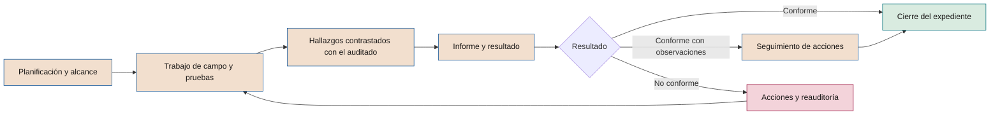

# Marco de auditoría de IA

**Tipos de auditoría, independencia, plan basado en riesgo, técnicas, hallazgos e informe**

| | |
|---|---|
| Documento | Documento 38 · Marco de auditoría de IA |
| Versión | 0.1 (borrador de trabajo) |
| Fecha | 16-09-2026 |
| Autor | Fernando García · SEACHAD |
| Estado | Borrador para revisión. Los criterios de *gate* se fijan en el documento 21 y el proceso de no conformidades en el documento 37. |

<!-- cifras: 5 | tipos de auditoría ; 3 | resultados posibles ; 3 | clases de no conformidad ; 7 | condiciones auditables de la declaración de aplicación -->

---

> **Aviso legal y exención de responsabilidad.** SEVEN-G es un marco metodológico de referencia que se ofrece «tal cual» y con fines exclusivamente informativos. No constituye asesoramiento jurídico, regulatorio, financiero ni profesional, ni garantiza el cumplimiento de ninguna norma. Las referencias a regulación general (como el Reglamento Europeo de IA, el RGPD, DORA o NIS2), a normas técnicas y a regulación específica de cada sector o jurisdicción pueden ser incompletas, no aplicar a un caso concreto o quedar desactualizadas por cambios normativos, interpretaciones o criterios de las autoridades posteriores a su fecha de consulta. **Cada organización que use SEVEN-G es la única responsable de identificar la normativa que le aplica, verificar su vigencia y certificar su propio cumplimiento regulatorio**, con el asesoramiento cualificado que corresponda. El autor y SEACHAD no asumen responsabilidad alguna por el uso que se haga de este contenido ni por las decisiones que se adopten con él. Los datos, cifras, compañías y casos de los ejemplos son ficticios o ilustrativos.

## 1. Objeto y alcance

Este documento define cómo se audita la inteligencia artificial en una compañía que aplica SEVEN-G. Su finalidad es dar **aseguramiento objetivo** de que:

- las iniciativas cumplen el ciclo de vida, las evidencias obligatorias y las reglas de decisión;
- los sistemas en producción siguen bajo control y aportan el valor declarado con el estado de validación correcto;
- el marco está implantado en la compañía y funciona de forma eficaz;
- los terceros que prestan servicios de IA cumplen lo exigido;
- la declaración de aplicación de SEVEN-G (01 §14) está respaldada por evidencia.

Se aplica a los auditores de IA, a la función de auditoría interna y a los auditores externos que actúen en el marco. No define los criterios concretos de cada *gate* (documento 21) ni las listas de verificación (documento 22), ni el proceso de gestión de no conformidades (documento 37), a los que remite.

### 1.1 Qué no es este marco

- **No es una auditoría de cuentas** ni sustituye a la auditoría legal.
- **No es una certificación.** SEVEN-G no certifica. La certificación de un sistema de gestión de IA según ISO/IEC 42001 la emiten entidades de certificación conforme a ISO/IEC 17021-1 e ISO/IEC 42006.
- **No es la evaluación de conformidad** del Reglamento (UE) 2024/1689, que corresponde al proveedor del sistema de alto riesgo (artículo 43) y, en su caso, a un organismo notificado.
- **No es asesoramiento.** El auditor no diseña los controles que después audita.

---

## 2. Principios de la auditoría de IA

| # | Principio | Qué implica |
|---|---|---|
| 1 | **Independencia** | El auditor no participa en lo que audita ni depende de quien lo patrocina (sección 3). |
| 2 | **Evidencia suficiente y adecuada** | Las conclusiones se apoyan en evidencias verificables, fechadas y conservadas en el expediente. |
| 3 | **Validación dual** | Se comprueban a la vez los resultados tangibles y la documentación (01 §7.2). Documentación sin resultados, o resultados sin documentación, no son conformes. |
| 4 | **Anterioridad de la evidencia** | Se verifica que las evidencias existían antes de la decisión. La documentación elaborada a posteriori invalida el *gate* y es no conformidad mayor (01 §7.4). |
| 5 | **Enfoque basado en riesgo** | Se audita más, y con más profundidad, donde el riesgo es mayor (sección 5). |
| 6 | **Escepticismo profesional** | Las métricas de un modelo, las cifras de valor y las declaraciones de un proveedor se contrastan, no se aceptan por su presentación. |
| 7 | **Proporcionalidad técnica** | Las pruebas técnicas se ajustan a la tecnología, la autonomía y la clasificación del sistema. |
| 8 | **Trazabilidad del hallazgo** | Todo hallazgo identifica el requisito incumplido, la evidencia, la causa, el efecto y la clasificación. |
| 9 | **Confidencialidad** | El auditor accede a lo necesario y protege la información, especialmente datos personales y secretos empresariales. |

---

## 3. Independencia y competencias del auditor de IA

### 3.1 Independencia

| Nivel | Requisito | Cómo se comprueba |
|---|---|---|
| **Organizativa** | La función que aporta auditores de IA depende funcionalmente de la comisión delegada del consejo (documento 30 §3.6), no de áreas que patrocinen iniciativas. | Estatuto de auditoría interna; organigrama. |
| **Individual** | El auditor no ha tenido rol en la iniciativa ni en el diseño, construcción u operación del sistema; no depende jerárquicamente del patrocinador; no ha asesorado sobre los controles auditados en los doce meses anteriores (30, incompatibilidad I-10). | Declaración de independencia firmada antes de cada encargo. |
| **Económica** | Un auditor externo no audita soluciones que ha diseñado, implantado o vendido, ni productos de empresas vinculadas (30, I-11). La retribución no depende del resultado. | Declaración de relaciones con proveedores; revisión de contratos. |
| **Rotación** | Se recomienda que un mismo auditor principal no audite el mismo sistema Enterprise más de [tres] ejercicios consecutivos. | Registro de asignaciones en T01. |
| **Expertos técnicos** | El auditor puede apoyarse en expertos (ciencia de datos, seguridad ofensiva, jurídico). Los expertos deben cumplir los mismos requisitos de independencia respecto del objeto auditado y trabajan bajo la dirección del auditor, que responde de la conclusión. | Declaración del experto; programa de trabajo con su alcance. |

**Amenazas a la independencia y salvaguardas**

| Amenaza | Ejemplo ilustrativo | Salvaguarda |
|---|---|---|
| Autorrevisión | El auditor participó en el diseño del plan de reversión. | Sustitución del auditor para esa iniciativa. |
| Interés propio | Objetivos del auditor ligados al número de iniciativas en producción. | Objetivos basados en calidad y cobertura del plan. |
| Familiaridad | El auditor lleva años trabajando con el equipo técnico. | Rotación; revisión de calidad por otro auditor. |
| Intimidación | Presión del patrocinador para cerrar un *gate* antes de una fecha. | Escalado a la comisión delegada (30, E-13); plazos de verificación protegidos. |
| Dependencia del auditado para la evidencia técnica | El auditor solo dispone de las métricas que calcula el equipo. | Reejecución independiente o acceso directo a datos y registros. |

Si la independencia se ve comprometida, el auditor lo comunica antes de iniciar o en cuanto lo detecta, y el responsable de auditoría de IA lo sustituye. Un *gate* verificado por un auditor no independiente debe verificarse de nuevo.

### 3.2 Competencias

| Área de competencia | Auditor de *gate* | Auditor principal (marco, temáticas) | Experto técnico de apoyo |
|---|---|---|---|
| Técnicas de auditoría, muestreo y documentación del trabajo | Sólida | Avanzada | Básica |
| Marco SEVEN-G (ciclo, *gates*, roles, medición) | Sólida | Avanzada | Básica |
| Reglamento de IA, RGPD y normativa sectorial aplicable | Suficiente para identificar obligaciones por clasificación y rol | Sólida | Según especialidad |
| Gestión de riesgos y control interno | Sólida | Avanzada | Básica |
| Ciclo de vida de modelos (datos, entrenamiento, validación, degradación) | Suficiente para leer evaluaciones críticamente | Sólida | Avanzada |
| IA generativa y agentes (evaluaciones, inyección de instrucciones, permisos, registro de acciones) | Suficiente | Sólida | Avanzada |
| Seguridad de la información | Básica | Suficiente | Según especialidad |
| Medición del valor (reglas de 00 §6, atribución, estados) | Sólida | Avanzada | Básica |
| Gestión de terceros y contratos de IA | Suficiente | Sólida | Según especialidad |
| ISO/IEC 42001 y auditoría de sistemas de gestión (ISO 19011) | Básica | Sólida | — |
| Comunicación de hallazgos a dirección y consejo | Suficiente | Avanzada | — |

**Formación y mantenimiento.** Los auditores de IA siguen el perfil F6 del programa de alfabetización (documento 31 §6.2) y deberían dedicar horas anuales específicas a formación en IA, fijadas por la función de auditoría. Las credenciales profesionales de auditoría, de sistemas de información o de gestión de IA son un indicio útil, pero no sustituyen la comprobación de competencia práctica.

---

## 4. Tipos de auditoría

| Tipo | Objeto | Cuándo | Quién | Criterios | Resultado |
|---|---|---|---|---|---|
| **De *gate*** | Evidencias y resultados de una fase antes de la decisión. | En todos los *gates* Enterprise; por muestreo en Lite. | Auditor de IA asignado a la iniciativa. | Criterios `G<n>.<nn>` del documento 21 y listas `LV-G<n>` del documento 22. | Resultado de verificación que se aporta al órgano que decide. |
| **De continuidad** | Funcionamiento eficaz de los controles de un sistema en producción durante un periodo, y veracidad de la información de R6. | En las R6 Enterprise (al menos una al año en profundidad) y según el plan en Lite. | Auditor de IA. | Criterios `R6.<nn>` del documento 21; manual de operación; hipótesis de valor. | Resultado que se aporta a R6 o adelanta G7. |
| **Del marco en la compañía** | Diseño y eficacia del gobierno de la IA: órganos, inventario, registro, políticas, riesgos, medición, no conformidades. Incluye la auditoría de la declaración de aplicación (sección 11). | Anual, en C5; antes de la primera declaración de aplicación. | Auditoría interna o auditor externo. | 01 completo; documentos 30, 31, 32, 33, 37 y 40; política corporativa aprobada. | Informe a la comisión delegada y al consejo. |
| **Temática** | Un riesgo o control transversal a varias iniciativas. | Según el plan anual. | Auditor principal con expertos. | Requisitos del tema en la biblioteca SEVEN-G y regulación aplicable. | Informe con conclusión por tema y hallazgos por sistema. |
| **De proveedor** | Cumplimiento por un tercero de los requisitos contractuales y del nivel de exigencia N1–N3. | N3: al menos anual; N2: según riesgo; N1: por excepción. | Auditor de IA o de terceros; puede apoyarse en informes independientes. | Contrato; documento 36; evaluación P14. | Informe que alimenta la reevaluación del proveedor. |

Además, se realizan **auditorías de seguimiento** (verificación de acciones correctivas) y **reauditorías** (repetición total o parcial tras un resultado No conforme), descritas en la sección 10.

### 4.1 Ejemplos de auditorías temáticas

| Tema | Preguntas de auditoría |
|---|---|
| Uso no autorizado de IA | ¿Las fuentes de detección están implantadas? ¿Los usos detectados se regularizan en plazo? ¿Coincide T21 con la realidad observada? |
| Agentes con capacidad de actuar | ¿Tienen identidad propia, mínimo privilegio, control de intención, registro completo de acciones e interruptor de parada probado? |
| Calidad del valor declarado | ¿Los importes tienen fórmula, línea base y estado correcto? ¿Se suma capacidad liberada como ahorro? ¿Hay doble atribución? |
| Clasificación regulatoria de la cartera | ¿Las clasificaciones son correctas, justificadas y revisadas con criterio jurídico? ¿Se han aplicado bien las excepciones del artículo 6.3? |
| Supervisión humana en decisiones sobre personas | ¿Los supervisores tienen formación, autoridad y tiempo? ¿Hay evidencia de que discrepan del sistema cuando procede? |
| Retiradas | ¿Los sistemas retirados están realmente desactivados? ¿Se han tratado datos y modelos según el plan? |
| Costes de IA | ¿El coste recurrente registrado coincide con la facturación? ¿El reparto por caso es razonable? |
| Alfabetización en IA | ¿Las condiciones de acceso (F1, F3, F4) se cumplen? ¿El programa es eficaz? |

---

## 5. Universo auditable y plan anual basado en riesgo

### 5.1 Universo auditable

El universo auditable se construye a partir del **inventario de sistemas de IA** (T02, documento 32) y del **registro de iniciativas** (T01), y se completa con:

| Unidad auditable | Fuente |
|---|---|
| Cada sistema de IA en desarrollo, piloto o producción | T02 |
| Cada iniciativa con *gates* previstos en el ejercicio | T01 |
| Cada proveedor de IA con nivel N2 o N3 | T09 |
| Los procesos del marco: ciclo corporativo, gestión de cartera, inventario, riesgos, medición, no conformidades, políticas y alfabetización | Documentos 01, 14, 31, 32, 33, 37, 40 |
| Los temas transversales identificados por la segunda línea o por incidentes | Informes de riesgos; T08 |

Un universo que omite sistemas no inventariados es incompleto: por eso el plan incluye la conciliación del inventario (32 §9) como prueba recurrente de la auditoría del marco.

### 5.2 Priorización de sistemas

Cada sistema del universo se puntúa con los factores siguientes. La tabla es **de referencia** y la compañía puede ajustarla al aprobar el plan.

| Factor | 1 | 2 | 3 |
|---|---|---|---|
| Clasificación regulatoria | Riesgo mínimo o fuera de ámbito | Obligaciones de transparencia o excepción del artículo 6.3 | Alto riesgo |
| Intensidad | Lite | — | Enterprise |
| Autonomía | A0 | A1 | A2 o A3 |
| Exposición | Interna | Empleados o clientes indirectamente | Clientes o personas externas directamente |
| Riesgo residual principal | Bajo | Medio | Alto o Crítico |
| Incidentes y no conformidades en 12 meses | Ninguno | S3–S4 o no conformidades menores | S1–S2 o no conformidades mayores o críticas |
| Cambios relevantes desde la última auditoría | Ninguno | Cambios menores | Nuevo modelo, proveedor, finalidad, datos o autonomía |
| Materialidad económica (coste recurrente o valor declarado) | Baja según umbral C2 | Media | Alta |
| Tiempo desde la última auditoría | Menos de 12 meses | 12–24 meses | Más de 24 meses o nunca |

**Puntuación** = suma de factores (9 a 27).

| Prioridad | Puntuación | Cobertura orientativa |
|---|---|---|
| **Alta** | 21–27, o cualquier sistema de alto riesgo en producción, o con A3 y exposición directa | Auditoría de continuidad en profundidad al menos anual |
| **Media** | 15–20 | Auditoría de continuidad al menos cada dos años; incluida en temáticas |
| **Baja** | 9–14 | Por muestreo en temáticas o auditoría del marco; al menos cada tres años |

### 5.3 Contenido del plan anual

| Bloque | Contenido | Regla de cobertura |
|---|---|---|
| Auditorías de *gate* Enterprise | Previsión de *gates* por iniciativa según T01. | 100 %. |
| Auditorías de *gate* Lite | Muestra de *gates* Lite del ejercicio. | Según la sección 7.4. |
| Auditorías de continuidad | Sistemas de prioridad Alta y los de prioridad Media que corresponda por rotación. | Sección 5.2. |
| Auditoría del marco | Incluye la declaración de aplicación. | Anual. |
| Temáticas | Entre una y tres al año según tamaño y riesgos. | Según riesgos de cartera e incidentes. |
| Proveedores | Proveedores N3 y los N2 seleccionados. | Sección 4. |
| Seguimiento | Verificación de acciones de hallazgos abiertos. | 100 % de no conformidades mayores y críticas. |
| Reserva | Capacidad no asignada para auditorías no previstas (incidentes S1, requerimientos). | Orientativamente, entre el 10 % y el 20 % de la capacidad. |

**Aprobación y seguimiento.** Auditoría interna propone el plan; la comisión delegada lo aprueba (documento 30 §7.5) y recibe su grado de ejecución cada trimestre. Si la capacidad no alcanza para cubrir los sistemas de prioridad Alta, la limitación se comunica expresamente a la comisión, que decide si amplía recursos o acepta el riesgo.

---

## 6. Proceso y programa de trabajo tipo

<!-- grafico: Proceso de una auditoría de IA | Del plan al cierre verificado de los hallazgos -->

### 6.1 Programa de trabajo tipo

| Etapa | Actividades | Producto | Plazo orientativo (auditoría de continuidad o temática) |
|---|---|---|---|
| **1. Planificación** | Confirmar independencia; delimitar objetivo, alcance, periodo y criterios; revisar ficha de inventario, registro de riesgos, incidentes, auditorías previas; identificar riesgos clave; diseñar pruebas y muestras; solicitar información. | Memorando de planificación y programa de pruebas | 1–2 semanas |
| **2. Reunión de apertura** | Presentar alcance, calendario, necesidades de acceso y contactos. | Acta breve | 1 día |
| **3. Trabajo de campo** | Ejecutar las pruebas de la sección 7; documentar cada prueba con objetivo, población, muestra, procedimiento, resultado y conclusión. | Papeles de trabajo | 1–4 semanas |
| **4. Contraste de hallazgos** | Comunicar cada hallazgo al responsable para confirmar hechos (no para negociar la clasificación). | Hallazgos contrastados | Continuo; cierre en 3 días hábiles |
| **5. Reunión de cierre** | Presentar hallazgos, clasificación y resultado provisional. | Acta | 1 día |
| **6. Informe** | Borrador; respuesta de la dirección con acciones, responsables y plazos; informe final. | Informe (sección 9) | Borrador: 10 días hábiles tras el cierre · Respuesta: 10 días hábiles · Final: 5 días hábiles |
| **7. Registro** | Alta de no conformidades en T08; resultado en T01/T03; archivo del expediente. | Registros | Con el informe final |
| **8. Seguimiento** | Verificación de acciones (sección 10). | Nota de seguimiento | Según plazos de las acciones |

En las **auditorías de *gate***, las etapas se comprimen para respetar el plazo de decisión del *gate* (03 §3.6: 5 días hábiles en Lite y 10 en Enterprise desde la solicitud). Como referencia, la verificación Enterprise debería concluir en un máximo de 7 días hábiles desde que las evidencias están completas, para que el órgano decida en plazo. Si las evidencias están incompletas, el plazo no empieza a contar (01 §7.1).

### 6.2 Programa de la auditoría de *gate*

| # | Prueba | Qué se comprueba | Técnica |
|---|---|---|---|
| 1 | Completitud | Todas las evidencias obligatorias de la fase (01 §6.10) existen, o su ausencia está justificada como No aplica. | Revisión de evidencias contra `LV-G<n>` |
| 2 | Trazabilidad | Cada evidencia tiene autor, fecha, versión y verificación. | Revisión de metadatos |
| 3 | Anterioridad | Las evidencias existían antes de la solicitud del *gate* y no se crearon para justificar un avance ya producido. | Historial de versiones del repositorio; comparación con eventos de T01; entrevistas |
| 4 | Resultados tangibles | Los resultados declarados (métricas de piloto, línea base, pruebas) se sostienen con datos. | Reejecución o recálculo sobre muestra |
| 5 | Criterios del *gate* | Cada criterio `G<n>.<nn>` aplicable está en Cumple con evidencia válida. | Revisión y pruebas según 21 |
| 6 | Criterios por ambición | Se aplican los criterios de Optimizar, Aumentar o Transformar (01 §7.6). | Revisión |
| 7 | Separación de funciones | Autor, verificador y decisor son personas distintas y sin incompatibilidades (30 §5). | Revisión de P03 y T03 |
| 8 | Condiciones previas | Las condiciones del *gate* anterior están cumplidas o se ha aplicado la regla de condición vencida. | Revisión de T01 |
| 9 | Clasificación y riesgo | Clasificación regulatoria e intensidad vigentes; riesgos residuales aceptados por el nivel correcto (30 §7.2). | Revisión de P11, P04 y P12 |
| 10 | Controles críticos | En G4 y G5: supervisión humana, mecanismo de parada, seguridad y reversión diseñados o probados. | Revisión, observación, reejecución |
| 11 | Firma multinivel | En G5 Enterprise: firmas de técnico, riesgos y cumplimiento, seguridad y protección de datos, sin veto pendiente. | Revisión de P23 |

### 6.3 Programa de la auditoría de continuidad

| # | Área | Pruebas principales |
|---|---|---|
| 1 | Inventario | La ficha refleja la realidad (versión, proveedor, datos, autonomía, responsables). |
| 2 | Clasificación | La clasificación y la intensidad siguen siendo válidas ante los cambios del periodo. |
| 3 | Monitorización | Las alertas configuradas existen, se disparan en pruebas y se atienden en plazo (muestra de alertas). |
| 4 | Rendimiento y degradación | Reejecución de métricas en una muestra reciente frente a los umbrales aprobados. |
| 5 | Supervisión humana | Muestra de decisiones: la supervisión definida se ejerce; hay evidencia de revisión y de discrepancias cuando procede. |
| 6 | Incidentes y cambios | Muestra de incidentes y cambios: registrados, clasificados, gestionados y comunicados según 37 y el control de cambios. |
| 7 | Agentes | Permisos frente a mínimo privilegio; completitud del registro de acciones; interruptor de parada probado en el periodo. |
| 8 | Valor | Recálculo del valor realizado; estado de validación correcto; capacidad liberada no sumada como ahorro. |
| 9 | Coste | Conciliación del coste recurrente con facturación y reparto. |
| 10 | Cumplimiento | Obligaciones vigentes según clasificación y rol (por ejemplo, transparencia implantada, registros conservados el periodo exigido, información a trabajadores). |
| 11 | Revisiones R6 | Se han realizado en plazo y sus conclusiones son coherentes con la evidencia. |

---

## 7. Técnicas de auditoría

### 7.1 Técnicas generales

| Técnica | Descripción | Uso típico | Fuerza de la evidencia |
|---|---|---|---|
| **Revisión de evidencias** | Examen de documentos y registros frente a criterios. | Completitud, trazabilidad, coherencia. | Media; alta si la fuente es independiente del auditado. |
| **Indagación** | Entrevistas con el equipo y los usuarios. | Entender el proceso; detectar discrepancias. | Baja por sí sola; debe corroborarse. |
| **Observación** | Presenciar la ejecución de un control o proceso. | Prueba de reversión, activación del interruptor, supervisión humana. | Media; limitada al momento observado. |
| **Inspección de configuraciones** | Revisión directa de permisos, parámetros, alertas, versiones. | Agentes, monitorización, controles de acceso. | Alta. |
| **Reejecución** | El auditor ejecuta de nuevo, con sus propios medios, un cálculo, prueba o control. | Métricas de modelos, cálculos de valor, pruebas de seguridad. | Alta. |
| **Análisis de datos** | Análisis del total de la población con herramientas (registros, eventos, facturación). | Completitud del registro de acciones, tiempos de *gate*, uso no autorizado. | Alta; evita el riesgo de muestreo. |
| **Confirmación externa** | Información obtenida directamente de un tercero. | Proveedores, condiciones de uso de datos, subencargados. | Alta si la fuente es fiable. |
| **Análisis forense de versiones** | Revisión de historiales de edición y metadatos. | Detectar documentación elaborada a posteriori. | Alta si los registros son íntegros. |

### 7.2 Muestreo

Siempre que sea posible, el auditor **analiza la población completa** con técnicas de análisis de datos. Cuando no lo es, usa muestreo con tamaños justificados.

**Muestreo de atributos para controles** (¿el control se cumple en cada elemento?). Con la hipótesis de **cero desviaciones esperadas**, el tamaño mínimo para concluir con un nivel de confianza *C* que la tasa real de incumplimiento no supera una tasa tolerable *T* es:

*n = ln(1 − C) ÷ ln(1 − T)*, redondeado al alza.

| Confianza | Tasa tolerable | Tamaño de muestra | Uso orientativo |
|---|---|---|---|
| 90 % | 20 % | 11 | *Gates* Lite de bajo riesgo; controles de riesgo bajo |
| 95 % | 20 % | 14 | Controles de riesgo moderado con población reducida |
| 90 % | 10 % | 22 | Fichas de inventario de uso corporativo |
| 95 % | 10 % | 29 | Controles relevantes: fichas de sistemas en producción, decisiones con supervisión humana, alertas |
| 95 % | 5 % | 59 | Controles críticos: acciones de agentes con efecto externo, accesos privilegiados |
| 99 % | 5 % | 90 | Controles críticos con alta exposición o antecedentes de incidentes |

Reglas:

1. **Poblaciones pequeñas.** Si la población *N* es reducida, puede aplicarse la corrección *n' = n ÷ (1 + (n − 1) ÷ N)*, redondeada al alza. Por ejemplo, con *n* = 29 y *N* = 100, *n'* = 23. Si *N* es igual o menor que la muestra, se revisa la población completa.
2. **Si aparece una desviación** en una muestra diseñada con cero desviaciones esperadas, el auditor no puede concluir que el control funciona al nivel planificado. Evalúa la causa y la naturaleza de la desviación: si es sistemática, es hallazgo; ampliar la muestra solo es válido si se replanifica con una tasa esperada distinta de cero y se documenta.
3. **Selección aleatoria** o sistemática con arranque aleatorio, documentando la semilla o el método. La selección por criterio (casos de mayor riesgo) es válida para detectar problemas, pero no permite extrapolar.
4. **Controles periódicos** (por ejemplo, revisiones trimestrales o mensuales): como referencia práctica habitual, no estadística, se revisan 1 de 1 anual, 2 de 4 trimestrales, 2 a 5 de 12 mensuales, 5 a 15 semanales y 20 a 40 diarias o múltiples al día. El auditor puede aumentar estos tamaños según el riesgo.

**Muestreo para estimar proporciones en resultados de modelos** (por ejemplo, porcentaje de respuestas incorrectas de un asistente de IA generativa revisadas por personas). Para estimar una proporción con un margen de error *e* y confianza del 95 %, en el caso más desfavorable (proporción del 50 %):

*n = 1,96² × 0,5 × 0,5 ÷ e²*

| Margen de error | Tamaño de muestra |
|---|---|
| ± 10 puntos | 97 |
| ± 5 puntos | 385 |
| ± 3 puntos | 1.068 |

Si se dispone de una estimación previa de la proporción, el tamaño se reduce. Para detectar diferencias entre grupos (por ejemplo, en pruebas de sesgo) debe calcularse el tamaño por grupo, no solo el total.

### 7.3 Pruebas técnicas de modelos y agentes

Las pruebas técnicas deben realizarse **sin alterar la producción**: en entornos de prueba equivalentes o con autorización expresa, con datos minimizados y con conocimiento del responsable de operación. El auditor documenta la versión exacta del sistema probado.

| Tecnología | Prueba | Qué se busca | Referencia |
|---|---|---|---|
| **ML predictivo** | Reejecución de métricas en un conjunto reservado que el equipo no ha usado para ajustar el modelo, o en una muestra reciente de producción con resultado conocido. | Que el rendimiento declarado se reproduce y cumple los umbrales aprobados en G5. | P22 |
| | Análisis de deriva de datos y de rendimiento en el periodo. | Degradación no detectada o no atendida. | P25 |
| | Métricas de rendimiento por grupos relevantes. | Diferencias no justificadas entre grupos, con los umbrales definidos en el diseño. | P17, P22 |
| | Reproducibilidad: versión de datos, código y modelo. | Que el modelo en producción es el validado. | P16 |
| **IA generativa** | Conjunto de evaluación propio del auditor (casos representativos y adversariales), con revisión humana ciega de una muestra (tamaños de 7.2). | Exactitud, fundamentación en fuentes, respuestas inventadas, contenido inadecuado, coherencia con la política. | P22 |
| | Pruebas de fuga de información. | Revelación de instrucciones de sistema, datos de otros usuarios o información confidencial. | Documento 35 |
| | Pruebas de inyección de instrucciones directas e indirectas (a través de documentos, correos o páginas). | Que las defensas diseñadas funcionan. | Documento 35, P18 |
| | Transparencia. | Que se informa de la interacción con IA y se marca el contenido cuando aplica (artículo 50). | Documento 32 |
| **Agentes** | Inventario de identidades, credenciales y permisos frente a las acciones necesarias. | Permisos excesivos; credenciales compartidas o sin rotar. | Documento 35, T10 |
| | Completitud del registro de acciones: acciones registradas frente a acciones ejecutadas según los sistemas destino. | Acciones sin trazabilidad o sin intención registrada. | Documento 35 |
| | Prueba del control de intención con solicitudes fuera de mandato. | Que el agente rechaza o eleva lo que no está autorizado. | Documento 35 |
| | Prueba del interruptor de parada. | Que detiene el agente en el tiempo diseñado y deja un estado consistente. | P19, P24 |
| | Muestra de acciones sensibles. | Que existe validación humana cuando el diseño la exige. | P17 |
| **Todas** | Prueba de reversión observada o evidencia de su ejecución en el periodo. | Que la reversión es posible en el tiempo previsto. | P19 |
| | Conciliación de consumo y coste. | Coste real frente a registrado. | Documento 42 |

Cuando las pruebas requieran capacidades especializadas (por ejemplo, pruebas de intrusión sobre agentes), el auditor puede **basarse en el trabajo de un tercero** si comprueba su independencia, competencia, alcance y fecha, y revisa sus resultados. No puede basarse en pruebas realizadas por el propio equipo constructor sin reejecutar al menos una parte.

---

## 8. Resultados y clasificación de hallazgos

### 8.1 Clases de hallazgo

| Clase | Definición | Ejemplos ilustrativos | Tratamiento |
|---|---|---|---|
| **Observación** | No es un incumplimiento; es un riesgo de incumplimiento futuro o una oportunidad de mejora. | Plantilla correcta pero difícil de mantener; alerta con umbral poco sensible aunque dentro de lo aprobado. | Recomendación; la dirección decide si actúa. Se revisa en la siguiente auditoría. |
| **No conformidad menor** | Incumplimiento de un requisito obligatorio sin impacto en la decisión ni en el control del riesgo. | Evidencia incompleta sin efecto en la decisión; retraso en la actualización del inventario; ficha con un campo obligatorio vacío. | Acción antes del siguiente *gate* o revisión (01 §12). |
| **No conformidad mayor** | Incumplimiento que afecta a la validez de una decisión, a la eficacia de un control relevante o a la fiabilidad de la información. | Evidencias elaboradas a posteriori; autoaprobación; condición vencida en un control relevante; revisión de continuidad omitida; valor declarado como validado sin validación; excepción vencida. | Contención en 10 días; plan en 30 días (01 §12). |
| **No conformidad crítica** | Incumplimiento que expone a la compañía a un daño grave, a un incumplimiento legal relevante o a la pérdida de control de un sistema. | Sistema en producción sin *gate* aprobado; práctica prohibida; incidente grave sin notificar; control crítico desactivado; agente con capacidad de actuar sin interruptor de parada. | Contención inmediata, máximo 48 horas, incluida la parada si es necesario; plan en 10 días; informe a la comisión delegada (01 §12). |

La clasificación definitiva y el proceso de contención, causa raíz, acción correctiva y cierre se rigen por el **documento 37**. Los plazos son de referencia y la compañía puede ajustarlos en C2 sin superar los que fije la regulación.

**Reglas de agregación**

1. Varias no conformidades menores sobre **el mismo requisito en el mismo sistema** que, en conjunto, afectan a la decisión o al control, se clasifican como una **mayor**.
2. La misma no conformidad menor repetida en **tres o más iniciativas** en un ejercicio indica un fallo del marco y se registra, además, como **mayor en la auditoría del marco**.
3. Una no conformidad mayor **no corregida en plazo** se reclasifica como crítica si el riesgo que controla es Alto o Crítico.
4. **Reincidencia:** una no conformidad menor que se repite **tres veces en doce meses** en la misma iniciativa o proceso se clasifica como **mayor** (37 §3.3).

### 8.2 Resultado de la auditoría

| Resultado | Cuándo | Consecuencia en un *gate* | Consecuencia en otras auditorías |
|---|---|---|---|
| **Conforme** | Sin no conformidades. Puede haber observaciones. | El órgano puede decidir cualquier resultado, incluido Continuar. | Cierre del expediente. |
| **Conforme con observaciones** | Solo no conformidades menores, con o sin observaciones. | El órgano puede decidir Continuar o Continuar con condiciones; las no conformidades menores se convierten en condiciones con plazo y responsable. | Seguimiento de acciones. |
| **No conforme** | Al menos una no conformidad mayor o crítica; en la verificación de un *gate*, falta alguna evidencia obligatoria o alguna evidencia no es válida. | La solicitud vuelve al equipo **sin decisión** (01 §7.4, regla 2; 21 §10.2): el órgano no decide Continuar, Continuar con condiciones, Iterar, Pivotar ni Parar sobre evidencias no verificadas, salvo que el equipo retire la solicitud y proponga parar. | Plan de acción y reauditoría. En R6, adelanta G7 si afecta a controles del sistema. |

Además de lo anterior, y aunque el resultado sea Conforme con observaciones, **no se admite Continuar con condiciones** cuando la no conformidad menor afecta a controles críticos de seguridad, cumplimiento legal o supervisión humana (01 §7.3); en ese caso el auditor lo indica expresamente.

El resultado de auditoría **no es la decisión del *gate***: es la verificación sobre la que decide el órgano competente. El auditor no recomienda si la iniciativa debe continuar por su valor de negocio.

---

## 9. Informe de auditoría

### 9.1 Estructura

| # | Sección | Contenido |
|---|---|---|
| 1 | **Identificación** | Código de auditoría (se propone `AUD-AAAA-NNN`), tipo, objeto (sistema `SIA-AAAA-NNN`, iniciativa `IA-AAAA-NNN`, proveedor o proceso), periodo auditado, fechas, auditor principal, expertos, destinatarios, versión del informe. |
| 2 | **Resumen para la dirección** | Resultado (Conforme, Conforme con observaciones, No conforme); número de hallazgos por clase; tres mensajes principales en lenguaje no técnico; riesgos para la compañía si no se actúa. |
| 3 | **Objetivo, alcance y criterios** | Qué se auditó y qué no; criterios aplicados (códigos `G<n>.<nn>`, `R6.<nn>`, documentos y normas). |
| 4 | **Limitaciones** | Información no disponible, accesos denegados, pruebas no realizadas y su efecto en la conclusión. |
| 5 | **Metodología** | Técnicas, poblaciones, tamaños de muestra y método de selección; pruebas técnicas realizadas y versión del sistema. |
| 6 | **Hallazgos** | Tabla por hallazgo (9.2). |
| 7 | **Observaciones** | Relación de observaciones y recomendaciones. |
| 8 | **Seguimiento de hallazgos anteriores** | Estado de las acciones de auditorías previas. |
| 9 | **Respuesta de la dirección** | Acciones, responsables y plazos por hallazgo; discrepancias, si las hay, con la posición del auditor. |
| 10 | **Conclusión** | Opinión del auditor y resultado. |
| 11 | **Anexos** | Evidencias revisadas, muestras, resultados de pruebas técnicas, declaración de independencia. |

Para las **auditorías de *gate*** se usa una versión abreviada integrada en el registro de decisión (P29) y en T03: resultado, criterios en No cumple o Pendiente, hallazgos y limitaciones.

### 9.2 Ficha de hallazgo

| Campo | Contenido |
|---|---|
| Código | `H-01`, `H-02`… dentro del informe; las no conformidades se registran además en T08 con código `NC-AAAA-NNN`. |
| Título | Frase breve y descriptiva. |
| Condición | Qué se ha encontrado, con hechos y cifras. |
| Criterio | Requisito incumplido, con su referencia exacta. |
| Causa | Por qué ocurre (análisis preliminar; el análisis de causa raíz completo corresponde al proceso de 37). |
| Efecto | Consecuencia real o potencial: decisión afectada, riesgo, cumplimiento, valor. |
| Evidencia | Referencias a papeles de trabajo. |
| Clasificación | Observación · No conformidad menor · mayor · crítica. |
| Recomendación | Qué debería corregirse (no cómo diseñarlo en detalle). |
| Acción de la dirección | Acción, responsable y plazo. |

### 9.3 Distribución

| Tipo de auditoría | Destinatarios |
|---|---|
| De *gate* | Órgano que decide el *gate*, patrocinador, responsable de producto, responsable de riesgos, Oficina de IA. |
| De continuidad | Patrocinador, responsable de operación, responsable de riesgos, comité de IA si el resultado es No conforme. |
| Del marco | Comité de IA, comisión delegada; resumen al consejo en C5. |
| Temática | Comité de IA, comisión delegada, responsables de los sistemas afectados. |
| De proveedor | Responsable de la relación con el proveedor, segunda línea, comité de IA si es N3. |

Toda no conformidad crítica se comunica **antes del informe**, en cuanto se confirma, por la vía de escalado del documento 30 (E-5).

---

## 10. Seguimiento y reauditoría

| Situación | Actividad | Quién | Cuándo | Criterio de cierre |
|---|---|---|---|---|
| **Observación** | Revisión en la siguiente auditoría. | Auditor de IA | Siguiente auditoría del objeto | La dirección ha decidido y registrado si actúa. |
| **No conformidad menor** | Verificación documental de la acción. | Auditor de IA u Oficina de IA en Lite | Antes del siguiente *gate* o revisión | Evidencia de la corrección. |
| **No conformidad mayor** | Verificación de la acción y de su **eficacia**. | Auditor de IA | Al vencer el plazo del plan | Corrección, acción sobre la causa raíz y evidencia de que el control funciona durante un periodo razonable. |
| **No conformidad crítica** | Verificación de la contención inmediata y, después, de la acción y su eficacia. | Auditor de IA; cierre por el comité de IA (30 §7.5) | Contención: en cuanto se comunique; acción: al vencer el plan | Igual que la mayor, con prueba técnica cuando proceda. |
| **Resultado No conforme** | **Reauditoría** de las áreas afectadas y de las relacionadas. | Auditor de IA, preferentemente el mismo | Cuando la dirección comunique que las acciones están implantadas | Nuevo resultado Conforme o Conforme con observaciones. |

Reglas:

1. **Cerrar no es implantar.** Una acción implantada sin evidencia de eficacia no cierra una no conformidad mayor o crítica.
2. **Acciones vencidas.** Se escalan según 30 §8.2 y figuran en el informe trimestral a la comisión delegada.
3. **Aceptación del riesgo en lugar de corregir.** Solo es posible si el órgano con nivel suficiente (30 §7.2) acepta expresamente el riesgo residual y el incumplimiento no es legal; el auditor registra la aceptación y cierra el hallazgo como "riesgo aceptado", no como "corregido".
4. **Reauditoría en *gates*.** Tras un No conforme en un *gate*, la solicitud vuelve al equipo sin decisión y, una vez corregidas las evidencias, la iniciativa vuelve a solicitar el *gate*; la nueva verificación cuenta como iteración (01 §7.4, regla 5).

---

## 11. Auditoría de la declaración de aplicación de SEVEN-G

Una compañía puede declarar que aplica SEVEN-G cuando cumple las condiciones mínimas de 01 §14. La declaración es **responsabilidad de la compañía** y no constituye una certificación. Este marco establece cómo auditarla para que sea creíble.

### 11.1 Cuándo y quién

- **Antes de la primera declaración** y, después, **anualmente en C5**.
- Por **auditoría interna** o por un **auditor externo independiente** que no haya participado en la implantación del marco en la compañía en los doce meses anteriores.
- Si la compañía comunica la declaración a terceros (clientes, supervisores, inversores), SEVEN-G recomienda que la auditoría sea externa o que auditoría interna cuente con revisión de calidad externa.

### 11.2 Criterios, evidencias y pruebas

| Condición de 01 §14 | Evidencias requeridas | Pruebas mínimas | Clasificación si no se cumple |
|---|---|---|---|
| **1.** C1 y C2 completados; tesis, ambición por esfera y apetito de riesgo aprobados por el consejo. | Actas del consejo; documento de tesis y apetito (documento 13); diagnóstico de C1. | Revisión de actas y fechas; coherencia de los umbrales usados en la cartera con los aprobados. | Crítica (no puede declararse) |
| **2.** Inventario con clasificación regulatoria, intensidad y responsable; registro de iniciativas con trazabilidad de 01 §6.11. | T02 y T01; indicadores de calidad (32 §8). | Conciliación del inventario con fuentes independientes (32 §9); muestra de fichas (95 %/10 %: 29) frente a la realidad; muestra de iniciativas con eventos de fase y *gate*. | Mayor; crítica si hay sistemas de alto riesgo sin inventariar |
| **3.** Roles y órganos asignados con las incompatibilidades de 01 §8.2. | Mandatos (documento 30); P03 de las iniciativas. | Revisión de mandatos; análisis del total de asignaciones en T01 para detectar incompatibilidades. | Mayor |
| **4.** Todas las iniciativas nuevas recorren el ciclo con *gates* registrados. | T01, T03, P29. | Análisis del total: iniciativas dadas de alta tras la adopción sin G0 o con saltos de fase; muestra de *gates* con pruebas de la sección 6.2 (incluida anterioridad). | Mayor; crítica si hay sistemas en producción sin G5 |
| **5.** Todas las iniciativas en producción tienen revisión de continuidad vigente. | T01; actas de R6. | Análisis del total de fechas de R6 frente a la periodicidad; muestra de R6 para comprobar su contenido. | Mayor |
| **6.** Aplica las reglas de medición del valor y reporta al consejo con el panel. | Panel del consejo; T12; actas. | Muestra de casos: fórmula, estado de validación, capacidad liberada, atribución única (reglas de 00 §6); comprobación de que el consejo recibe el panel en C4. | Mayor |
| **7.** Gestiona las no conformidades con el proceso de 01 §12. | T08; informes a la comisión delegada. | Análisis del total de no conformidades: clasificación, plazos de contención y plan, cierre con eficacia. | Mayor |

Adicionalmente, se verifica la **regularización de las iniciativas anteriores** a la adopción en el plazo aprobado en C2 (01 §14, último párrafo).

### 11.3 Conclusión y uso de la declaración

| Resultado | Significado | Qué puede declarar la compañía |
|---|---|---|
| **Conforme** | Se cumplen las siete condiciones. | Que aplica SEVEN-G, con alcance (sociedades y tipos de uso), fecha, versión del marco y referencia a la auditoría. |
| **Conforme con observaciones** | Se cumplen las siete condiciones con no conformidades menores. | Lo mismo, indicando que existen acciones de mejora en curso. |
| **No conforme** | Alguna condición no se cumple (no conformidad mayor o crítica en ella). | No puede declarar que aplica SEVEN-G hasta corregir y superar una reauditoría. Puede comunicar que está en proceso de implantación. |

**Contenido mínimo de la declaración**: denominación de la compañía; alcance; versión de SEVEN-G aplicada; fecha; resultado y fecha de la última auditoría y tipo de auditor (interno o externo); excepciones vigentes relevantes; mención de que la declaración no es una certificación. Conforme a la licencia de los contenidos (CC BY 4.0), se debe reconocer la autoría del marco.

---

## 12. Relación con ISO/IEC 42001 y con la auditoría interna corporativa

### 12.1 ISO/IEC 42001

ISO/IEC 42001:2023 establece requisitos para un sistema de gestión de la IA. Su **cláusula 9.2 (auditoría interna)** exige realizar auditorías internas a intervalos planificados para determinar si el sistema de gestión es conforme con los requisitos propios de la organización y con la norma, y si se implementa y mantiene eficazmente; establecer un programa de auditoría (frecuencia, métodos, responsabilidades, requisitos de planificación e informe) que considere la importancia de los procesos y los resultados de auditorías previas; definir criterios y alcance de cada auditoría; seleccionar auditores que aseguren la objetividad e imparcialidad; informar de los resultados a la dirección pertinente; y conservar información documentada.

| Requisito de ISO/IEC 42001 | Cómo lo cubre SEVEN-G |
|---|---|
| 9.2 Programa de auditoría interna | Plan anual basado en riesgo (sección 5), aprobado por la comisión delegada. |
| 9.2 Criterios y alcance | Criterios de 21 y 22; programas de trabajo tipo (sección 6). |
| 9.2 Objetividad e imparcialidad | Independencia (sección 3.1) e incompatibilidades (documento 30 §5). |
| 9.2 Informe a la dirección | Informe (sección 9) y distribución. |
| 9.2 Información documentada | Expedientes de auditoría, T01, T03 y T08. |
| 9.3 Revisión por la dirección | Etapa C5 del ciclo corporativo con los resultados de auditoría. |
| 10.2 No conformidad y acción correctiva | Documento 37 y seguimiento (sección 10). |
| 8.2 a 8.4 Evaluación y tratamiento de riesgos, y evaluación de impacto de sistemas de IA | Documentos 32 y 33; auditados en *gates* G3 y en continuidad. |

**Diferencias que hay que tener presentes**

- Una compañía que quiera **certificarse** en ISO/IEC 42001 debe cumplir todos los requisitos de la norma, incluidos los controles del anexo A que declare aplicables. Aplicar SEVEN-G facilita la certificación, pero no la garantiza.
- La auditoría de certificación la realiza una entidad de certificación conforme a ISO/IEC 17021-1 e ISO/IEC 42006. Las auditorías de SEVEN-G son auditorías internas de primera parte o, si se contratan, de segunda parte.
- Para la conducción de auditorías de sistemas de gestión, ISO 19011 ofrece directrices que son compatibles con este marco.

### 12.2 Auditoría interna corporativa

| Aspecto | Criterio |
|---|---|
| **Integración** | La auditoría de IA forma parte del plan de auditoría interna corporativa, no es un plan paralelo. La comisión delegada lo aprueba de forma conjunta o coordinada. |
| **Normas profesionales** | Cuando la función de auditoría interna se rige por las Normas Globales de Auditoría Interna del IIA (en vigor desde enero de 2025), la auditoría de IA las aplica; este marco las concreta para la IA. |
| **Auditores de IA externos** | Trabajan bajo supervisión de auditoría interna, que responde de la calidad y de la independencia. |
| **Coordinación con otras funciones de aseguramiento** | Seguridad de la información, protección de datos, validación de modelos y cumplimiento realizan revisiones propias. Auditoría interna puede basarse en su trabajo si evalúa su objetividad, competencia y calidad, y lo documenta. Se debe evitar que un mismo equipo sea auditado varias veces sobre lo mismo en el mismo periodo. |
| **Auditoría de cuentas y supervisores** | Los informes de auditoría de IA pueden ponerse a disposición del auditor de cuentas o de las autoridades supervisoras cuando lo requieran, con la gestión de confidencialidad que corresponda. |
| **Revisión de calidad de la función** | Las auditorías de IA se incluyen en el programa de aseguramiento y mejora de la calidad de auditoría interna. |

---

## 13. Herramientas y plantillas asociadas

| Código | Nombre | Uso en este documento |
|---|---|---|
| **T02** | Inventario de sistemas de IA | Universo auditable y priorización. |
| **T01** | Registro de iniciativas | Previsión de *gates*, eventos, asignación y rotación de auditores. |
| **T03** | Gestor de *gates* | Resultado de verificación por criterio y bloqueo de decisiones ante No conforme. |
| **T08** | Registro de no conformidades e incidentes | Alta y seguimiento de no conformidades derivadas de auditoría. |
| **T09** | Registro de proveedores de IA | Universo y resultados de auditorías de proveedor. |
| **T10** | Evaluación de seguridad de agentes | Pruebas técnicas de agentes. |
| **T12** | Seguimiento de realización de valor | Recálculo y validación del valor. |
| **P29** | Registro de decisión de *gate* | Resultado de auditoría de *gate* abreviado. |
| **P22** | Resultados de validación y del piloto | Base de la reejecución de métricas. |
| **P23** | Firma de puesta en producción | Verificación de la firma multinivel. |
| **`LV-G0`… `LV-G7`** | Listas de verificación por *gate* (documento 22) | Programa de la auditoría de *gate*. |

**Requisitos para las herramientas derivados de este documento:** T03 debe impedir registrar una decisión de *gate* con un resultado de verificación No conforme, salvo Parar cuando el equipo retira la solicitud y propone parar; T01 debe registrar auditor, declaración de independencia y fecha de verificación; T08 debe vincular cada no conformidad a su auditoría de origen y controlar los plazos de la sección 10.

---

## 14. Documentos relacionados

| Documento | Relación |
|---|---|
| **01 · Metodología fundacional** | Validación dual, reglas de decisión, no conformidades y declaración de aplicación (§14). |
| **03 · Herramientas y registro de iniciativas** | Plazos de decisión de *gate* y datos del registro. |
| **21 · Criterios de *gate* y auditoría** | Criterios `G<n>.<nn>` y `R6.<nn>` que se verifican. |
| **22 · Listas de verificación por *gate*** | Controles binarios `LV-G<n>`. |
| **30 · Modelo de gobierno** | Independencia de la tercera línea, incompatibilidades, escalado. |
| **31 · Política corporativa y uso aceptable** | Objeto de auditorías temáticas; perfil de formación F6. |
| **32 · Inventario y clasificación regulatoria** | Universo auditable y conciliación. |
| **33 · Metodología de riesgos de IA** | Riesgo residual para priorizar. |
| **35 · Seguridad de IA y agentes** | Pruebas técnicas de agentes. |
| **36 · Terceros y proveedores de IA** | Auditorías de proveedor. |
| **37 · No conformidades e incidentes** | Gestión de los hallazgos. |
| **40 · Reglas de medición del valor** | Criterios para auditar el valor. |

Este documento no constituye asesoramiento jurídico.

---

## 15. Control de versiones

| Versión | Fecha | Cambios |
|---|---|---|
| 0.1 | 16-09-2026 | Primera versión. Sustituye el esquema del material anterior (puntuación 0–5 y resultados de aprobado, condicionado o suspenso) por los resultados Conforme, Conforme con observaciones y No conforme, y las no conformidades menor, mayor y crítica de 01. Define cinco tipos de auditoría, independencia y competencias, universo y plan basado en riesgo, programas de trabajo tipo, técnicas con tamaños de muestra justificados, pruebas técnicas de modelos y agentes, informe, seguimiento, auditoría de la declaración de aplicación y relación con ISO/IEC 42001 y la auditoría interna. Propone el código `AUD-AAAA-NNN`. |
