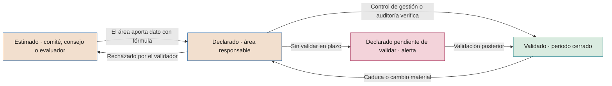

# Reglas de medición del valor

**Cómo se mide, se valida y se presenta el valor de la IA para que resista una auditoría**

| | |
|---|---|
| Documento | Documento 40 · Reglas de medición del valor |
| Versión | 0.1 (borrador de trabajo) |
| Fecha | 16-09-2026 |
| Autor | Fernando García · SEACHAD |
| Estado | Borrador para revisión. Desarrolla la sección 6 del documento 00 y la sección 11 del documento 01. |

<!-- cifras: 10 | reglas de medición ; 3 | estados del importe ; 5 | métodos de atribución ; 1 | criterio económico único sobre beneficio neto -->

---

> **Aviso legal y exención de responsabilidad.** SEVEN-G es un marco metodológico de referencia que se ofrece «tal cual» y con fines exclusivamente informativos. No constituye asesoramiento jurídico, regulatorio, financiero ni profesional, ni garantiza el cumplimiento de ninguna norma. Las referencias a regulación general (como el Reglamento Europeo de IA, el RGPD, DORA o NIS2), a normas técnicas y a regulación específica de cada sector o jurisdicción pueden ser incompletas, no aplicar a un caso concreto o quedar desactualizadas por cambios normativos, interpretaciones o criterios de las autoridades posteriores a su fecha de consulta. **Cada organización que use SEVEN-G es la única responsable de identificar la normativa que le aplica, verificar su vigencia y certificar su propio cumplimiento regulatorio**, con el asesoramiento cualificado que corresponda. El autor y SEACHAD no asumen responsabilidad alguna por el uso que se haga de este contenido ni por las decisiones que se adopten con él. Los datos, cifras, compañías y casos de los ejemplos son ficticios o ilustrativos.

## 1. Objeto y alcance

Este documento desarrolla las diez reglas de medición del valor de SEVEN-G (documento 00, sección 6) y fija las definiciones, fórmulas y procedimientos que deben aplicar todas las iniciativas, la cartera y los informes al consejo.

Se aplica a toda iniciativa registrada en el registro de iniciativas (T01), en todas las fases, y a toda cifra de valor que se presente al comité de IA o al consejo. Los indicadores que se derivan de estas reglas están en el documento 41; el cálculo de costes, en el documento 42; y el proceso de realización de beneficios, en el documento 43.

Las cifras de los ejemplos son **ficticias e ilustrativas**. No son referencias de mercado.

---

## 2. Principios de la medición

| Principio | Qué significa |
|---|---|
| **Incrementalidad** | Solo cuenta el efecto que no se habría producido sin la iniciativa. Lo que habría ocurrido de todos modos (tendencia, estacionalidad, otras iniciativas) no es valor del caso. |
| **Base anual** | Eficiencias, retorno y coste recurrente se expresan en euros al año. La inversión de construcción y la de adopción inicial, que se producen una vez, se presentan aparte. |
| **Esperado frente a realizado** | El valor **esperado** es la hipótesis (fases 2 y 3). El valor **realizado** es el medido en un periodo cerrado (fases 5, 6 y 7). Son magnitudes distintas y nunca se suman entre sí. |
| **Prudencia asimétrica** | Los costes se imputan completos desde el primer día, con independencia de su estado. El valor solo se considera validado cuando lo valida quien corresponde. |
| **Separación de funciones** | Quien se beneficia de la cifra no la valida. El área declara; control de gestión o auditoría validan (principio 7 de 01 §3). |
| **Trazabilidad** | Toda cifra se puede reconstruir desde su fórmula, sus fuentes y su periodo, y enlaza con la evidencia en T01. |

---

## 3. Las diez reglas de medición

La numeración es la del documento 00, sección 6, y no se modifica.

### 3.1 Regla 1 · Todo importe tiene fórmula y es incremental

> Todo importe tiene fórmula (unidades × valor unitario) y es incremental frente a una línea base o un grupo de control.

| | |
|---|---|
| **Fundamento** | Un importe sin fórmula no se puede revisar ni actualizar, y un importe no incremental atribuye a la IA lo que habría ocurrido igualmente. |
| **Cómo se aplica** | Cada línea de valor se descompone en una magnitud física medible (horas, expedientes, errores, clientes, unidades vendidas) y un valor unitario con fuente (coste horario completo, coste por error, margen por unidad). La magnitud física es la diferencia frente a la línea base medida en la fase 2 o frente al grupo de control (fórmula F1, sección 6). |
| **Ejemplo correcto** *(ilustrativo)* | Línea base: 9.000 reprocesos al año. Grupo de control en el mismo periodo: 8.800 (tendencia a la baja ajena a la IA). Con IA: 5.800. Reprocesos evitados incrementales: 8.800 − 5.800 = 3.000. Coste unitario de un reproceso según contabilidad analítica: 42 €. **Eficiencia = 3.000 × 42 € = 126.000 €/año.** |
| **Ejemplo incorrecto** | "La IA ahorra un 30 % del tiempo del equipo, unos 200.000 € al año." No hay unidades, ni línea base, ni comparación, ni fuente del valor unitario. |
| **Cómo se verifica** | La fórmula existe en T01; las unidades proceden de un sistema identificado; la línea base se midió antes de G2 (01 §6.4); el valor unitario tiene fuente y fecha; el método de atribución aplicado es el aprobado en G2. |

### 3.2 Regla 2 · Todo importe tiene estado y el consejo ve la proporción validada

> Todo importe tiene estado: validado, declarado o estimado. Los informes al consejo muestran siempre la proporción de valor validado.

| | |
|---|---|
| **Fundamento** | Una cifra agregada que mezcla valor comprobado con valor declarado transmite una seguridad que no tiene. El consejo necesita saber cuánto de lo que ve está verificado. |
| **Cómo se aplica** | Cada importe de valor realizado lleva uno de los tres estados de la sección 4. Todo total de valor que se presente al comité o al consejo muestra al lado la proporción validada (fórmula F6). Un importe sin estado se trata como estimado y genera alerta. |
| **Ejemplo correcto** *(ilustrativo)* | Valor bruto realizado del ejercicio: 540.000 €, de los que 210.000 € están validados, 250.000 € declarados y 80.000 € estimados. **Proporción validada: 210.000 ÷ 540.000 = 38,9 %.** |
| **Ejemplo incorrecto** | "Valor aportado por la IA en el ejercicio: 540.000 €", sin desglose por estado. |
| **Cómo se verifica** | Ningún importe de T01 o T12 tiene el estado vacío; todos los totales del paquete del consejo muestran la proporción validada; los importes validados tienen validador, fecha y evidencia. |

### 3.3 Regla 3 · La capacidad liberada no suma hasta que se materializa o se reasigna

> La capacidad liberada no suma como ahorro hasta que se materializa (menor coste real) o se reasigna de forma explícita. Se informa por separado.

| | |
|---|---|
| **Fundamento** | Liberar horas no reduce ningún coste por sí mismo. Si las personas siguen en plantilla haciendo lo mismo con más holgura, la cuenta de resultados no cambia. Sumar horas liberadas como ahorro es la principal fuente de inflado en iniciativas de eficiencia. |
| **Cómo se aplica** | Las horas liberadas netas se valoran (fórmula F4) y se informan en una línea separada. Solo pasan a **eficiencia** cuando hay una reducción real de coste verificable (externalización no renovada, horas extraordinarias eliminadas, vacante presupuestada no cubierta) o cuando se **reasignan de forma explícita** a una actividad identificada, con responsable y fecha. La capacidad reasignada a una actividad que evita un coste previsto y presupuestado cuenta como eficiencia; la reasignada a una actividad nueva se informa como capacidad reasignada, y su valor solo se contabiliza a través del resultado medido de esa actividad (sección 5.3). |
| **Ejemplo correcto** *(ilustrativo)* | 20.000 expedientes al año × 15 minutos netos ahorrados = 5.000 horas liberadas netas; a 32 € de coste horario completo = 160.000 € de capacidad liberada. Destino: 2.000 horas cubren una externalización que no se renueva (reducción del contrato: 76.000 €, **eficiencia materializada**); 1.000 horas se reasignan a revisión de calidad (32.000 €, **capacidad reasignada**, informada aparte); 2.000 horas sin destino (64.000 €, **capacidad liberada no materializada**, informada aparte). Tasa de materialización: 2.000 ÷ 5.000 = 40 %. |
| **Ejemplo incorrecto** | "Ahorro de 160.000 € al año por las horas liberadas." |
| **Cómo se verifica** | La eficiencia materializada tiene reflejo en la contabilidad (menor gasto en el centro de coste) o evidencia del coste evitado presupuestado; la capacidad no materializada no entra en el valor neto; existe plan de materialización antes de G5 en Optimizar (01 §7.6). |

### 3.4 Regla 4 · Un potencial sin inversión, hipótesis y plazo no es un dato

> Un potencial sin su inversión adicional, su hipótesis y su plazo no es un dato.

| | |
|---|---|
| **Fundamento** | Los potenciales sin coste ni plazo son promesas. Comparados con valores realizados, distorsionan la priorización a favor de quien promete más. |
| **Cómo se aplica** | Todo valor potencial se registra con cuatro elementos: neto anual potencial, inversión adicional necesaria para alcanzarlo, hipótesis explícitas (volumen, tasa de uso, precio, efecto esperado) y plazo. Si falta alguno, el potencial no se muestra en los informes ni se usa para priorizar. |
| **Ejemplo correcto** *(ilustrativo)* | "Neto anual potencial de 180.000 € al extender el caso a las tres regiones restantes. Inversión adicional: 120.000 €. Hipótesis: tasa de uso igual o superior al 70 % y 45.000 solicitudes al año. Plazo: 9 meses desde la nueva fase 0." |
| **Ejemplo incorrecto** | "Potencial de 2 M€ si se escala a toda la compañía." |
| **Cómo se verifica** | En T01 el potencial tiene los cuatro campos cumplimentados; el paquete del consejo no muestra potenciales incompletos; el potencial se revisa en G7 frente a lo realizado. |

### 3.5 Regla 5 · Cada euro se atribuye a un solo caso

> Cada euro se atribuye a un solo caso. Cuando varios casos comparten un resultado, se declara el reparto.

| | |
|---|---|
| **Fundamento** | Cuando dos iniciativas actúan sobre el mismo proceso o el mismo cliente, cada una tiende a atribuirse el efecto total. La suma de la cartera supera entonces el efecto real. |
| **Cómo se aplica** | En la fase 2 cada iniciativa declara con qué otros casos comparte métrica, proceso o población. El efecto conjunto se mide una vez y se reparte con una clave declarada (documento 43, sección 6). La clave se aprueba por control de gestión y se registra en ambos casos. |
| **Ejemplo correcto** *(ilustrativo)* | Dos casos reducen el coste del mismo proceso. Efecto conjunto medido: 400.000 €. Efectos declarados por separado: 280.000 € y 220.000 € (suma 500.000 €). Reparto proporcional: 400.000 × 280/500 = **224.000 €** y 400.000 × 220/500 = **176.000 €**. Suma: 400.000 €. |
| **Ejemplo incorrecto** | Cada caso reporta su cifra por separado y la cartera muestra 500.000 €. |
| **Cómo se verifica** | Los casos con solape declarado tienen clave de reparto registrada; la suma de los importes repartidos no supera el efecto conjunto medido; la oficina de IA revisa solapes por proceso y población al consolidar. |

### 3.6 Regla 6 · Se separan eficiencias, retorno y coste recurrente

> Se separan eficiencias, retorno y coste recurrente. El valor neto anual es la suma de eficiencias y retorno menos el coste recurrente.

| | |
|---|---|
| **Fundamento** | Eficiencias y retorno tienen distinto riesgo, distinta forma de validarse y distinta lectura estratégica (eficiencia frente a transformación, documento 00 §5). Mezclarlos, o compensar costes dentro de las eficiencias, impide leer la cartera. |
| **Cómo se aplica** | Cada caso registra tres bloques separados y calcula el valor neto anual con la fórmula F2. El coste recurrente es el coste completo del documento 42, incluidos los costes compartidos repartidos. La inversión de construcción y adopción no forma parte del neto anual; se usa en el criterio económico de la sección 8. |
| **Ejemplo correcto** *(ilustrativo)* | Eficiencias materializadas: 76.000 €. Retorno: 95.000 €. Coste recurrente: 60.000 €. **Valor neto anual = 76.000 + 95.000 − 60.000 = 111.000 €.** |
| **Ejemplo incorrecto** | "Beneficio de 171.000 € al año", sin restar el coste recurrente; o "eficiencias netas de 16.000 €", restando el coste dentro de las eficiencias. |
| **Cómo se verifica** | T01 tiene los tres bloques con importes separados; el neto se recalcula automáticamente y coincide con el informado; el coste recurrente concilia con T13. |

### 3.7 Regla 7 · Toda magnitud se traduce a dinero

> Toda magnitud se traduce a dinero. Las mejoras de retención, calidad o satisfacción se convierten en su efecto económico, o se indica que no se ha podido cuantificar.

| | |
|---|---|
| **Fundamento** | Los indicadores no monetarios no se pueden comparar con el coste ni priorizar. Pero convertirlos con supuestos no declarados es peor que no convertirlos. |
| **Cómo se aplica** | Cada mejora no monetaria se traduce con una cadena explícita: magnitud física incremental × valor económico unitario con fuente. Si no existe una relación demostrable, el importe se registra como **no cuantificado**, con la métrica física y la razón. Un valor no cuantificado no es cero ni se estima sin indicarlo (regla 8). |
| **Ejemplo correcto** *(ilustrativo)* | 300 clientes retenidos incrementales frente al grupo de control × 450 € de margen anual medio por cliente = **135.000 €/año de retorno**. Mejora de satisfacción de 4 puntos: **no cuantificada**; no hay relación demostrada entre esa métrica y el comportamiento de compra en la compañía. |
| **Ejemplo incorrecto** | "La satisfacción sube 4 puntos, lo que equivale a 1 M€ de valor de marca", sin fórmula; o "la retención mejora 2 puntos", sin traducción económica ni indicación de que no se ha cuantificado. |
| **Cómo se verifica** | Cada métrica no monetaria de la hipótesis tiene importe con fórmula o marca de no cuantificada con motivo; los valores unitarios tienen fuente. |

### 3.8 Regla 8 · "Sin dato" no es cero

> "Sin dato" no es cero. Los datos ausentes se muestran como ausentes y nunca se estiman sin indicarlo.

| | |
|---|---|
| **Fundamento** | Un cero oculta la ausencia de medición y hace que un caso sin medir parezca un caso sin valor, o que un coste desconocido parezca nulo. |
| **Cómo se aplica** | Los campos sin dato se registran como nulos y se muestran como "sin dato". Los totales indican cuántos casos no aportan dato. Si se sustituye un dato ausente por una estimación, la estimación lleva estado **estimado**, autor y fórmula. Un coste recurrente sin dato impide calcular el neto: el neto se muestra como "sin dato", no como el valor bruto. |
| **Ejemplo correcto** *(ilustrativo)* | "Retorno: sin dato (el área no ha facilitado las ventas atribuidas del periodo). Neto anual: sin dato. 3 de los 11 casos en producción no aportan dato de retorno." |
| **Ejemplo incorrecto** | "Retorno: 0 €"; o un retorno estimado por la oficina de IA presentado sin marca de estimación. |
| **Cómo se verifica** | T01 distingue nulo de cero; el panel muestra "sin dato"; los totales informan del número de casos sin dato; ninguna estimación carece de estado. |

### 3.9 Regla 9 · Para priorizar se usa el neto adicional por euro

> Para priorizar se usa el neto adicional por euro de inversión adicional, no los indicadores agregados que ocultan casos con valor negativo.

| | |
|---|---|
| **Fundamento** | La decisión relevante es dónde rinde más el siguiente euro. Los indicadores agregados (ROI de la cartera, valor total) mezclan casos excelentes con casos que destruyen valor, y no dicen dónde invertir. |
| **Cómo se aplica** | Cada propuesta de inversión adicional (nueva iniciativa, ampliación, escalado) calcula el neto adicional por euro (fórmula F3). La cartera se ordena por ese indicador, con restricciones de riesgo, capacidad y equilibrio de ambición (documento 14). Los casos con neto anual negativo se muestran siempre de forma individual. |
| **Ejemplo correcto** *(ilustrativo)* | Caso X: neto actual 31.000 €, neto potencial 151.000 €, inversión adicional 200.000 € → (151.000 − 31.000) ÷ 200.000 = **0,60 €** de neto anual por euro. Caso Y: neto adicional 90.000 €, inversión adicional 60.000 € → **1,50 €**. Se prioriza Y. |
| **Ejemplo incorrecto** | "La cartera tiene un ROI del 85 %; se propone ampliar la inversión en todos los casos", sin mostrar que un caso tiene un neto anual de −40.000 €. |
| **Cómo se verifica** | Las propuestas de inversión al comité incluyen F3; los casos con neto negativo aparecen individualmente en el paquete del consejo; las decisiones de C3 registran el orden de priorización. |

### 3.10 Regla 10 · Cada caso explica qué es y para qué se usa

> Cada caso explica qué es y para qué se usa, en lenguaje comprensible para quien no es especialista.

| | |
|---|---|
| **Fundamento** | Quien no entiende qué hace un caso no puede juzgar si su valor es plausible ni si su riesgo es aceptable. Es la condición previa para supervisar. |
| **Cómo se aplica** | Cada caso tiene una descripción de una o dos frases que responde a: qué hace, quién lo usa, sobre qué proceso o decisión actúa y qué papel tiene la persona. Se registra en la ficha de caso de uso (P31) y en T01. Sin descripción, el caso no se presenta al consejo. |
| **Ejemplo correcto** *(ilustrativo)* | "Propone la clasificación contable y el centro de coste de cada factura recibida. Una persona del equipo de cuentas a pagar revisa la propuesta antes de contabilizarla." |
| **Ejemplo incorrecto** | "Solución de IA generativa con recuperación aumentada y orquestación multiagente sobre un modelo fundacional." |
| **Cómo se verifica** | El campo de descripción de T01 está cumplimentado y revisado por la oficina de IA; una persona ajena al área entiende el caso al leerlo. |

---

## 4. Estados del importe

### 4.1 Definición, responsables y evidencia

| Estado | Quién puede asignarlo | Requisitos mínimos de evidencia | Caducidad orientativa | Uso permitido |
|---|---|---|---|---|
| **Validado** | Control de gestión (o la función financiera equivalente) o auditoría interna o externa. Nunca el área que se beneficia de la cifra ni el equipo de la iniciativa. | Fórmula completa; línea base medida; método de atribución aprobado y aplicado (sección 7); datos trazables a los sistemas de origen o a la contabilidad; periodo cerrado; en eficiencias, reflejo contable o evidencia del coste evitado; firma del validador con fecha; evidencia enlazada en T01. | **12 meses** desde el cierre del periodo validado. Caduca antes si hay un cambio material: modelo, proceso, alcance, población, precio o volumen fuera del intervalo de la hipótesis. | Todos los informes y *gates*. Único estado que acredita "ahorro materializado" o "retorno medido" en G7 (01 §7.6). |
| **Declarado** | El área responsable del beneficio (responsable de negocio del documento 43), con conformidad del patrocinador. | Fórmula; fuente de las unidades y del valor unitario; periodo; método de atribución utilizado; autor y fecha. | **6 meses** sin someterse a validación. Pasado ese plazo se muestra como "declarado pendiente de validar" con alerta. | Informes y R6, siempre identificado. En G5 y G7 no sustituye a la validación cuando el criterio exige valor validado. |
| **Estimado** | El comité de IA, el consejo o quien le asesore, o un equipo evaluador (por ejemplo, la oficina de IA), cuando el área no aporta dato o cuando se contrasta un dato declarado. | Fórmula; hipótesis explícitas; fuente de los parámetros; autor y fecha; motivo de la estimación. | **6 meses** o hasta que el área declare el dato, lo que ocurra antes. | Informes, siempre identificado. No acredita el cumplimiento de ningún criterio de *gate* de valor realizado. |

Reglas complementarias:

1. El estado se asigna **por importe y por periodo**, no por caso. Un caso puede tener la eficiencia validada y el retorno declarado.
2. **El valor esperado no se valida.** Los importes de la hipótesis (fases 2 y 3) son estimados o declarados; control de gestión puede revisar su cálculo, pero el estado validado solo se aplica a valor realizado en un periodo cerrado.
3. **El coste no tiene rebaja por estado.** El coste recurrente se imputa completo aunque no esté validado; si se desconoce, el neto es "sin dato" (regla 8).
4. **Degradación, no borrado.** Un importe validado que caduca pasa a declarado hasta su revalidación; un declarado que el validador rechaza se corrige o pasa a estimado con motivo. Todo cambio de estado es un evento en T01.
5. **El valor recurrente se revalida cada año.** Validar un ejercicio no valida los siguientes.
6. Los plazos de caducidad son **orientativos** y la compañía los fija en C2 (documento 13). No pueden ampliarse para una iniciativa concreta.

<!-- grafico: Ciclo de estados de un importe | El estado mejora con evidencia y se degrada con el tiempo o con cambios materiales -->

### 4.2 Qué comprueba el validador

| Prueba | Pregunta | Evidencia típica |
|---|---|---|
| **Existencia** | ¿Ha ocurrido el efecto en el periodo? | Extracción del sistema de origen con fecha y consulta reproducible. |
| **Incrementalidad** | ¿Se compara con la línea base o el grupo de control aprobados? | Informe del método de atribución con datos de ambos grupos. |
| **Valoración** | ¿El valor unitario es correcto y vigente? | Contabilidad analítica, tarifas, contratos, margen por producto. |
| **Materialización** | En eficiencias, ¿hay menor coste real o coste evitado presupuestado? | Mayor contable, contrato modificado, presupuesto de plantilla. |
| **Exclusividad** | ¿El efecto no está ya atribuido a otro caso? | Registro de solapes y clave de reparto. |
| **Corte y coste** | ¿El importe corresponde al periodo, no se repite y el coste recurrente es completo? | Conciliación con periodos anteriores en T12 y con T13. |

---

## 5. Tipos de valor

### 5.1 Tipos sumables

| Tipo | Qué incluye | Ejemplos de concepto | Condición para sumar |
|---|---|---|---|
| **Eficiencias** | Menor coste real o coste evitado presupuestado. | Menor coste de personas o de externalización (materializado); herramientas o licencias retiradas; pérdidas evitadas (fraude, mermas, impagos); otros costes operativos evitados; errores y penalizaciones evitados. | Incremental, con fórmula y, para validarse, con reflejo contable o evidencia del coste evitado. |
| **Retorno** | Más ingresos o más margen. | Venta nueva; venta cruzada; retención (margen de los clientes retenidos incrementales); precio y margen; cobros recuperados; nuevos servicios. | Incremental, valorado en **margen** cuando la compañía lo pueda calcular; si se usa ingreso, se indica. Nunca se mezcla margen e ingreso en el mismo total. |
| **Coste recurrente** | Coste anual completo para operar el caso. | Las nueve categorías del documento 42 en su parte recurrente, incluidos los costes compartidos repartidos. | Se resta siempre, completo, con independencia de su estado. |

### 5.2 Tipos no sumables salvo traducción a dinero con fórmula

| Tipo | Qué es | Cómo se informa | Cuándo pasa a sumable |
|---|---|---|---|
| **Riesgo evitado** | Reducción de la probabilidad o del impacto de un suceso adverso. | Por separado, con la métrica de riesgo (nivel inherente y residual, documento 33) y, si se calcula, la pérdida esperada evitada como estimación. | Cuando se traduce en un menor coste observable y atribuible (pérdidas operativas, sanciones, primas, provisiones) medido con un método de la sección 7. Entonces se registra como **eficiencia**. |
| **Cumplimiento** | Capacidad de cumplir una obligación regulatoria o contractual. | Por separado, vinculado a la obligación (documento 34). | Cuando sustituye un coste de cumplimiento real (horas de control manual, servicio externo) medido con fórmula. Entonces es **eficiencia**. |

### 5.3 Magnitudes que se informan aparte y nunca suman en el neto

| Magnitud | Por qué no suma | Cómo se informa |
|---|---|---|
| **Capacidad liberada no materializada** | No reduce ningún coste (regla 3). | En euros (F4) y en horas, con su tasa de materialización (F5). |
| **Capacidad reasignada a actividad nueva** | Su valor, si existe, aparece en el resultado de la actividad de destino; sumarla sería contar dos veces. | En horas y euros, con actividad de destino, responsable y fecha. |
| **Valor potencial** | No ha ocurrido (regla 4). | Con inversión adicional, hipótesis y plazo; solo para priorizar (F3). |
| **Valor de opción** | Apuestas de Transformar cuyo valor depende de decisiones futuras. | Descripción cualitativa documentada en G3 (01 §7.6), hitos de aprendizaje y límite de inversión por etapa. |
| **Valor no cuantificado** | No existe relación económica demostrable (regla 7). | Métrica física y motivo. |

---

## 6. Fórmulas oficiales

Estas fórmulas son las únicas válidas en SEVEN-G. Los documentos 41, 42 y 43, las plantillas y las herramientas las referencian por su código.

| Código | Magnitud | Fórmula | Notas |
|---|---|---|---|
| **F1** | Importe de una línea de valor | Importe = unidades incrementales × valor unitario | Unidades incrementales = resultado con IA − resultado de referencia (línea base ajustada o grupo de control). |
| **F2** | **Valor neto anual** | **Valor neto anual = eficiencias + retorno − coste recurrente** | Eficiencias solo materializadas. Capacidad liberada no materializada excluida. Se calcula para el valor realizado (actual) y para el potencial. |
| **F2v** | Valor neto validado | Valor neto validado = eficiencias validadas + retorno validado − coste recurrente | El coste se resta completo. Puede ser negativo aunque F2 sea positivo. |
| **F3** | **Neto adicional por euro** | **Neto adicional por euro = (neto anual potencial − neto anual actual) ÷ inversión adicional necesaria** | Unidad: euros de neto anual por euro invertido. Si la inversión adicional es cero o no existe, no se calcula y se prioriza por neto adicional absoluto. |
| **F4** | **Capacidad liberada** | Horas liberadas netas = volumen tratado con IA × (tiempo unitario de referencia − tiempo unitario con IA) · Capacidad liberada (€) = horas liberadas netas × coste horario completo | El tiempo con IA incluye la revisión humana, las excepciones y las correcciones. El coste horario completo lo fija control de gestión. |
| **F5** | **Materialización** | Tasa de materialización = horas materializadas ÷ horas liberadas netas · Tasa de reasignación = horas reasignadas a actividad nueva ÷ horas liberadas netas | Horas materializadas: las que se traducen en menor coste real o en coste evitado presupuestado. Se calcula en horas para no mezclar tarifas internas y externas. |
| **F6** | **Proporción validada** | Proporción validada = valor validado ÷ (valor validado + declarado + estimado) | Sobre el valor bruto realizado (eficiencias materializadas + retorno) del periodo. Los importes sin dato no entran en el denominador y se informan aparte. |
| **F7** | Valor actual neto | VAN = −I + Σ (neto anual del año t ÷ (1 + r)^t), para t = 1…H | I, r y H según la sección 8. |
| **F8** | Retorno de la inversión | ROI(H) = (Σ neto anual del año t − I) ÷ I, para t = 1…H | Siempre sobre neto anual (F2), nunca sobre valor bruto. |
| **F9** | Plazo de recuperación | Primer año en que Σ neto anual acumulado ≥ I, interpolado linealmente dentro del año | Con neto anual constante equivale a I ÷ neto anual. |
| **F10** | Realización del valor | Realización = valor realizado del periodo ÷ valor esperado del periodo según el plan de realización | Documento 43. Se calcula en total y solo con valor validado. |

**Coste por unidad de resultado** (coste recurrente del periodo ÷ unidades de resultado útil) se define en el documento 42.

---

## 7. Métodos de atribución

### 7.1 Elección del método

El método de atribución se elige en la fase 2, se aprueba en G2 y no se cambia sin aprobación del órgano que decidió G2 (01 §7.4, regla 6). Condiciona el estado máximo que puede alcanzar el valor.

| Método | En qué consiste | Cuándo usarlo | Requisitos | Estado máximo |
|---|---|---|---|---|
| **Grupo de control aleatorizado** | Se asignan al azar unidades (clientes, expedientes, oficinas) a un grupo con IA y otro sin IA durante el mismo periodo. | Siempre que sea ética, legal y operativamente posible. Método preferente para retorno (conversión, retención, precio). | Tamaño suficiente para detectar el efecto esperado; asignación registrada; sin contaminación entre grupos; duración que cubra el ciclo del negocio. | Validado |
| **Prueba A/B** | Variante del anterior en canales digitales o procesos de alto volumen, con reparto continuo del tráfico entre versiones. | Interacciones digitales, recomendaciones, contenidos, asistentes con clientes. | Métrica principal fijada antes; periodo mínimo fijado antes; no detener la prueba al ver un resultado favorable. | Validado |
| **Diferencias en diferencias** | Se compara la evolución de un grupo tratado con la de un grupo comparable no tratado, antes y después de la implantación. | Despliegues por fases (regiones, oficinas, líneas) en los que no cabe aleatorizar. | Tendencias paralelas verificadas en el periodo previo; ausencia de otros cambios que afecten solo a un grupo. | Validado |
| **Antes y después con ajuste** | Se compara el periodo posterior con la línea base, corrigiendo volumen, estacionalidad, mezcla y precios. | Procesos internos sin grupo comparable; iniciativas de Optimizar con efecto grande y rápido. | Línea base de al menos un ciclo completo; ajustes documentados y aprobados por control de gestión; registro de otros cambios en el periodo. | Validado si los ajustes están documentados y no hubo cambios concurrentes relevantes; en otro caso, declarado |
| **Estimación experta** | Personas conocedoras del proceso estiman el efecto con un procedimiento estructurado. | **Último recurso**: cuando no hay datos ni posibilidad de comparación, o para la hipótesis inicial de la fase 2. | Al menos dos expertos independientes del equipo; hipótesis explícitas; intervalo, no punto; plan para sustituirla por un método de medición. | Declarado o estimado. **Nunca validado** |

Criterios de elección, en este orden:

1. Si se puede aleatorizar, se aleatoriza.
2. Si el despliegue es escalonado, se diseña para permitir diferencias en diferencias.
3. Si no hay grupo comparable, antes y después con ajuste, con línea base medida.
4. La estimación experta solo se admite con plan y fecha para sustituirla. En Optimizar no permite acreditar G5 ni G7; en Aumentar y Transformar puede sostener la hipótesis de G2, no el valor realizado.

En las iniciativas de **Transformar** la atribución se aplica por etapa y se centra en la evidencia de mercado o de cliente exigida en G5 (01 §7.6): uso, conversión, ingresos iniciales o cambio operativo verificado.

### 7.2 Iniciativas transversales y plataformas habilitadoras

Algunas iniciativas no pertenecen a una sola unidad de negocio. Son **transversales**, como una herramienta que usan varias unidades (por ejemplo, un asistente generativo integrado en la suite ofimática), o son **plataformas habilitadoras**: capacidades comunes de datos, conocimiento o decisión que usan otros casos. Su valor no se mide igual que el de un caso de negocio.

| Tipo | Ejemplo *(ilustrativo)* | Cómo se registra en T01 | Cómo se mide |
|---|---|---|---|
| **Plataforma habilitadora** | Plataforma común de datos para varios casos de IA | Una iniciativa que indica los casos que la usan (`alcance.habilita`) | Su valor se imputa a los casos que la usan (documento 10 §4.1, regla 3). En la plataforma solo cuentan su coste, su disponibilidad y los casos a los que sirve. |
| **Transversal** | Asistente generativo en la suite ofimática para varias unidades | **Una sola iniciativa** con despliegue por unidad (`alcance.reparto`) e importes por unidad (`valores[].area`). No se abre una iniciativa por unidad. | Por unidad de negocio, con la escalera de medición de esta sección. |

**Escalera de medición por unidad.** Cada peldaño solo cuenta si se cumple el anterior.

| Peldaño | Qué se mide | Fuente | Estado máximo | ¿Suma en el neto? |
|---|---|---|---|---|
| **1. Coste** | Licencias, formación y gobierno. Cada unidad asume sus licencias; lo común (oficina de adopción, formación continua, revisión de permisos) va sin unidad. | Contratos y contabilidad | Validado | Se resta completo desde el primer día (prudencia asimétrica, sección 2) |
| **2. Adopción** | Licencias activas sobre asignadas y usuarios activos semanales, por unidad | Informes de uso de la plataforma, no encuestas | Indicador, sin importe | No |
| **3. Capacidad liberada** | Horas liberadas que declaran las personas, valoradas con la fórmula F4 | Encuestas o estimación de cada unidad | Declarado o estimado. **Nunca validado.** | No (regla 3) |
| **4. Valor materializado** | Menor coste real (contratación evitada, menos horas extraordinarias, externalización no renovada, licencias retiradas) o capacidad reasignada a una actividad identificada | Contabilidad y control de gestión | Validado | Sí |

Reglas:

1. **Una iniciativa, varias unidades.** La iniciativa transversal tiene un patrocinador corporativo. Cada unidad tiene su responsable de negocio del beneficio, que declara la parte de su unidad (documento 43 §6.4).
2. **Despliegue que permita medir.** El despliegue se hace escalonado por unidades, para poder medir con diferencias en diferencias (sección 7.1, criterio 2). Otra opción es asignar las licencias al azar entre las personas elegibles. Si se despliega en toda la compañía de una vez, solo cabe la estimación experta, que nunca permite validar.
3. **Umbral de adopción.** G2 fija un porcentaje mínimo de licencias activas sobre asignadas. En cada unidad en uso por debajo del umbral se revisa el despliegue o se retiran las licencias sin uso. Una unidad sigue pagando la herramienta porque la usa, no por inercia.
4. **Sin doble conteo con los casos de cada unidad.** Si una unidad tiene además un caso propio sobre el mismo proceso, se aplica el documento 43 §6: el ahorro genérico de la herramienta transversal no se reclama otra vez.
5. **Neto con y sin transversales.** En los informes al consejo, el neto de la cartera se muestra con y sin las iniciativas transversales y las plataformas (sección 11.1). Así, un coste grande y seguro no oculta ni infla el resultado de los casos de negocio.
6. **El valor indirecto no se convierte en euros.** La cultura de uso, la madurez o la mejora de los permisos y de los datos se recogen en el modelo de madurez (documento 11) y en la esfera 05 Datos. El riesgo principal de estas herramientas es mostrar a una persona información a la que tenía acceso por permisos heredados o excesivos. Va en la matriz de riesgos (P12) y se revisa antes de cada ola del despliegue.

**Ejemplo ilustrativo** (datos ficticios, los mismos del registro de demostración de T01):

| Unidad | Despliegue | Licencias activas / asignadas | Horas liberadas al mes (declaradas) | Coste anual | Valor materializado |
|---|---|---|---|---|---|
| Finanzas | En uso | 792 / 900 (88 %) | 7.200 | 324.000 € | 540.000 €, validado (externalización del cierre contable no renovada) |
| Comercial | En uso | 624 / 1.200 (52 %) | 5.100 | 432.000 € | 180.000 €, declarado (herramienta anterior retirada) |
| Atención al cliente | Piloto | 356 / 400 (89 %) | 1.900 | 144.000 € | — |
| Común (sin unidad) | — | — | — | 260.000 € | — |
| **Total** | | | **14.200** | **1.160.000 €** | **720.000 €** |

Lectura para el consejo: el neto anual de la iniciativa es 720.000 − 1.160.000 = **−440.000 €**. Las 14.200 horas declaradas al mes no son ahorro mientras no se materialicen. Comercial está por debajo del umbral de adopción del 60 % y declara horas liberadas sin destino. Por eso, ampliar la herramienta a nuevas unidades queda condicionado a revisar las licencias de Comercial y a que declare en qué se materializan sus horas.

> **Por qué importa.** Una herramienta transversal tiene un coste grande, seguro y visible desde el primer día, y un valor repartido entre muchas personas y unidades. Si se mide como un caso más, pasa una de dos cosas: se suman las horas declaradas y se infla la cartera, o no se mide nada y se sigue pagando por inercia. La escalera por unidad deja ver dónde se usa la herramienta, dónde produce valor y dónde conviene retirar licencias. Así el comité y el consejo deciden sobre la ampliación con datos y no con encuestas.

---

## 8. Horizonte, descuento y criterio económico único

### 8.1 El problema que resuelve

El material anterior a SEVEN-G combinaba varios umbrales de retorno (porcentajes de ROI objetivo a distintos plazos y un plazo máximo de recuperación) con dos fórmulas de ROI distintas: una dividía el valor bruto entre la inversión y otra dividía el beneficio neto entre el coste. Con esa mezcla, el mismo caso podía aprobarse o rechazarse según el umbral y la fórmula que se eligieran. SEVEN-G lo sustituye por **un criterio económico único sobre beneficio neto**.

### 8.2 Definiciones

| Elemento | Definición |
|---|---|
| **I · Inversión inicial** | Coste de construcción más coste de adopción inicial (documento 42), incurridos una vez. No incluye coste recurrente, que ya está restado en el neto anual. |
| **Neto anual del año t** | Valor neto anual (F2) esperado o realizado en el año t, con la curva de adopción (rampa) prevista en el plan de realización. Si hay coste de retirada previsto, se resta en el año en que se produce. |
| **H · Horizonte** | Número de años de evaluación. Lo fija la compañía en C2 (01 §5.1). No puede superar la vida útil esperada de la solución. |
| **r · Tasa de descuento** | Tasa anual que fija la función financiera en C2. Si la compañía no fija ninguna, r = 0. |

### 8.3 Regla

1. **El criterio de viabilidad económica es único: VAN (F7) ≥ 0 con la H y la r aprobadas en C2.** Con r = 0 equivale a recuperar la inversión inicial dentro del horizonte.
2. **ROI (F8) y plazo de recuperación (F9) son informativos.** Se calculan siempre con las mismas I, H y neto anual, y no tienen umbrales propios.
3. **Nunca se calcula un retorno sobre valor bruto.** Todo retorno parte del neto anual.
4. **Para priorizar entre casos se usa F3** (regla 9), no el VAN ni el ROI.
5. **Por nivel de ambición** (01 §7.6):
   - **Optimizar**: VAN ≥ 0 en G3 con valores esperados; en G7 se recalcula con valores realizados validados.
   - **Aumentar**: el mismo criterio, más la viabilidad de la adopción y del cambio de rol.
   - **Transformar**: no se exige VAN ≥ 0 del conjunto en G3. Se exige el límite de inversión de la etapa, criterios de parada por etapa y valor de opción documentado. El VAN se calcula a título informativo cuando haya hipótesis de retorno.
6. **No se usan umbrales de mercado.** Ningún porcentaje de ROI ajeno a la compañía sustituye al criterio de C2.

### 8.4 Ejemplo ilustrativo

Construcción: 150.000 €. Adopción inicial: 30.000 €. **I = 180.000 €.** Horizonte aprobado en C2: H = 3 años. Tasa de descuento: r = 8 %. Neto anual esperado con rampa: año 1, 40.000 €; año 2, 110.000 €; año 3, 120.000 €.

| Año | Neto anual | Factor de descuento | Valor actual | Acumulado sin descontar |
|---|---|---|---|---|
| 0 | −180.000 € | 1,000000 | −180.000,00 € | −180.000 € |
| 1 | 40.000 € | 1,080000 | 37.037,04 € | −140.000 € |
| 2 | 110.000 € | 1,166400 | 94.307,27 € | −30.000 € |
| 3 | 120.000 € | 1,259712 | 95.259,87 € | 90.000 € |

- **VAN** = −180.000,00 + 37.037,04 + 94.307,27 + 95.259,87 = **46.604,18 €** → cumple el criterio.
- **ROI(3)** = (40.000 + 110.000 + 120.000 − 180.000) ÷ 180.000 = 90.000 ÷ 180.000 = **50 %** (informativo).
- **Plazo de recuperación** = 2 + 30.000 ÷ 120.000 = **2,25 años** (informativo).

---

## 9. Agilidad del sistema de decisión

### 9.1 Qué se mide

La agilidad mide cuánto tarda el sistema de gobierno en decidir y en llevar a producción, no la velocidad de los equipos técnicos. Se calcula a partir de los eventos de T01 (03 §3.3).

| Tramo | Desde | Hasta | Para qué |
|---|---|---|---|
| **Idea → aprobación** | Registro de la iniciativa | Decisión de G3 con resultado Continuar o Continuar con condiciones | Agilidad para arrancar una apuesta. |
| **Aprobación → producción** | Decisión favorable de G3 | Decisión favorable de G5 | Agilidad para entregarla. |
| **Idea → producción** | Registro | Decisión favorable de G5 | Tiempo total hasta producción (03 §3.5). |
| **Tiempo de decisión** | Solicitud de un *gate* | Decisión | Agilidad del propio órgano decisor. |

Todos los tramos excluyen el tiempo en espera con motivo externo registrado, que se informa aparte. Se muestran como **mediana y percentil 80**, nunca solo como media.

### 9.2 Segmentación por riesgo y ambición

Los tiempos se segmentan siempre por **nivel de riesgo residual** (Bajo, Medio, Alto, documento 33), por **nivel de ambición** y por **intensidad**. Un gobierno ágil tarda poco en lo sencillo y dedica tiempo a lo que tiene riesgo; tardar lo mismo en todo es señal de un proceso que no discrimina.

Referencias iniciales, calculadas como suma de los plazos de referencia por fase del documento 03 §3.6 (orientativas, sin incluir tiempos de decisión):

| Tramo | Lite | Enterprise |
|---|---|---|
| Idea → aprobación (fases 0 a 3) | 70 días | 125 días |
| Aprobación → producción (fases 4 y 5) | 80 días | 135 días |
| Idea → producción | 150 días | 260 días |
| Decisión de un *gate* | 5 días hábiles | 10 días hábiles |

La compañía aprueba sus referencias en C2 y puede fijar una **vía rápida** para iniciativas Lite con riesgo residual Bajo (por ejemplo, agrupando G0–G2 y G4–G5, 01 §7.5). Las referencias se recalibran en C5 con datos propios.

### 9.3 Reglas de lectura

1. **La agilidad se lee junto con la calidad.** Un acortamiento de plazos acompañado de más incidentes en los primeros meses de producción, más condiciones vencidas o más no conformidades no es mejora.
2. **Las apuestas de Transformar se comparan con el resto.** Si tardan mucho más en llegar a producción, o no llegan, es la señal 7 del índice de transformación (00 §5.3).
3. **El tiempo de decisión es responsabilidad del órgano**, no del equipo. Se informa al comité de IA y al consejo.

---

## 10. Errores frecuentes que inflan el valor

| # | Error | Cómo se detecta | Corrección |
|---|---|---|---|
| 1 | Sumar horas liberadas como ahorro. | Eficiencias de "personas" sin reflejo contable ni coste evitado presupuestado. | Reclasificar como capacidad liberada (F4) y exigir plan de materialización. |
| 2 | Valor bruto sin restar coste recurrente. | Totales de "beneficio" que no concilian con F2. | Aplicar F2 con el coste completo del documento 42. |
| 3 | Atribuir la tendencia a la IA. | Antes y después sin ajuste en un periodo con cambios de volumen, precio o estacionalidad. | Método de la sección 7 con ajuste o grupo de control. |
| 4 | Doble conteo entre casos. | Varios casos que reclaman el efecto del mismo proceso o población. | Medición conjunta y clave de reparto (regla 5). |
| 5 | Valorar el retorno en ingresos brutos en lugar de margen. | Retorno igual a ventas atribuidas. | Valorar en margen o indicarlo expresamente sin mezclarlo. |
| 6 | Tiempo con IA que omite la revisión humana. | Ahorro unitario igual al tiempo de la tarea original. | Medir el tiempo real con revisión, excepciones y correcciones. |
| 7 | Extrapolar el piloto a toda la compañía. | Potencial calculado multiplicando el resultado del piloto sin hipótesis de adopción ni inversión. | Aplicar la regla 4 con tasa de uso y coste de extensión. |
| 8 | Imputar solo costes directos. | Costes de licencias compartidas, plataforma o equipos comunes no repartidos. | Reparto analítico del documento 42. |
| 9 | Usar el importe bruto declarado por un proveedor. | Cifras de "recuperado" o "detectado" tomadas del informe del proveedor. | Medir el incremento frente a lo que ya se detectaba o recuperaba. |
| 10 | Cambiar la métrica o el umbral tras ver los resultados. | Diferencias entre la hipótesis aprobada en G2 y la medida en G5. | Volver a la hipótesis aprobada; el cambio requiere aprobación (01 §7.4). |
| 11 | Presentar valor esperado como realizado. | Importes del lienzo de hipótesis en informes de producción. | Separar esperado y realizado; el esperado nunca está validado. |
| 12 | Contar el riesgo evitado como ahorro. | Pérdidas esperadas evitadas sumadas al neto. | Informarlo aparte salvo traducción a coste observable (sección 5.2). |
| 13 | Convertir en ahorro las horas que declaran los usuarios de una herramienta transversal. | Eficiencias iguales a horas de encuesta × coste horario, sin reflejo contable ni desglose por unidad. | Escalera de la sección 7.2: coste y adopción por unidad; solo suma el valor materializado. |

Presentar al comité o al consejo como validado un importe que no lo está constituye una **no conformidad mayor** (documento 37). Relajar criterios de parada o cambiar el método de atribución sin aprobación se trata conforme a 01 §7.4 y §12.

---

## 11. Presentación al consejo

### 11.1 Reglas

1. **La proporción validada es siempre visible** junto a cada total de valor, en el panel completo, en la versión móvil y en cualquier documento del paquete del consejo (documento 60).
2. **Eficiencias, retorno y coste recurrente se muestran por separado**, con el valor neto anual (F2) y el valor neto validado (F2v).
3. **La capacidad liberada no materializada y la reasignada se muestran en líneas separadas**, fuera del neto.
4. **Los casos con neto anual negativo se identifican individualmente.**
5. **"Sin dato" se muestra como tal**, con el número de casos afectados.
6. **Los potenciales solo aparecen completos** (regla 4) y separados del valor realizado.
7. **Se compara con el periodo anterior** y se explican las variaciones relevantes, incluidas las de estado.
8. **Cada caso presentado en detalle incluye su descripción comprensible** (regla 10). Se presentan como máximo tres casos en detalle por sesión y se responde con los formatos de la especificación común: "Sí", "Sí, con una condición: …", "Todavía no, porque falta …" o "No, porque …".
9. **La composición del valor por nivel de ambición** (eficiencias frente a retorno) se muestra para alimentar las señales 1 y 2 del índice de transformación.
10. **Las iniciativas transversales y las plataformas habilitadoras se muestran aparte**, con su desglose por unidad de negocio (coste, adopción, capacidad liberada y valor materializado), y el neto de la cartera se da con y sin ellas (sección 7.2).

### 11.2 Modelo de resumen de valor

*Datos ilustrativos.*

| Concepto | Importe anual | Validado | Proporción validada |
|---|---|---|---|
| Eficiencias materializadas | 620.000 € | 380.000 € | 61,3 % |
| Retorno | 410.000 € | 90.000 € | 22,0 % |
| **Valor bruto realizado** | **1.030.000 €** | **470.000 €** | **45,6 %** |
| Coste recurrente | 520.000 € | — | Se resta completo |
| **Valor neto anual (F2)** | **510.000 €** | | |
| **Valor neto validado (F2v)** | **−50.000 €** | | |
| Capacidad liberada no materializada (no suma) | 290.000 € | | |
| Casos con neto anual negativo | 2 de 11 | | |
| Casos sin dato de retorno | 3 de 11 | | |

Lectura para el consejo: la cartera genera un neto anual positivo según lo declarado, pero **con el valor validado hasta la fecha no cubre su coste recurrente**. La prioridad es validar el retorno declarado y materializar la capacidad liberada antes de aprobar nuevas ampliaciones.

---

## 12. Responsabilidades en la medición

| Actividad | Responsable | Verifica o valida |
|---|---|---|
| Hipótesis de valor, línea base y método de atribución | Responsable de producto de IA, con el responsable de negocio del beneficio | Oficina de IA (Lite) o auditor de IA (Enterprise) en G2 |
| Declaración del valor realizado | Responsable de negocio del beneficio | Control de gestión |
| Validación del valor | Control de gestión o auditoría | Auditor de IA por muestreo |
| Coste completo y reparto | Control de gestión con la oficina de IA (documento 42) | Auditoría interna |
| Consolidación de cartera y eliminación de doble conteo | Oficina de IA | Control de gestión |
| Presentación al consejo | Oficina de IA y patrocinador | Comité de IA |

---

## 13. Herramientas y plantillas asociadas

| Código | Nombre | Uso en este documento |
|---|---|---|
| **T01** | Registro de iniciativas | Importes, estados, eventos de cambio de estado, fechas para agilidad; alcance de las iniciativas transversales y plataformas, con despliegue, adopción e importes por unidad (sección 7.2). |
| **T11** | Lienzo y calculadora de hipótesis de valor | Fórmulas F1–F4 y F7–F9 en fase 2 y 3; método de atribución; escenarios (P10 §6.2) y criterio de C2 como información. Importa la iniciativa desde T01 y exporta sus valores esperados. |
| **T12** | Seguimiento de realización de valor | Estados por periodo, caducidades, F5, F6 y F10. |
| **T13** | Calculadora de costes por caso | Coste recurrente completo e inversión inicial. |
| **T17** | Panel de IA para el consejo | Presentación con proporción validada visible; tarjeta de iniciativas transversales y plataformas con el neto de la cartera con y sin ellas. |
| **P08** | Lienzo de hipótesis de valor | Hipótesis, método de atribución y criterios de parada. |
| **P09** | Línea base | Medición de referencia. |
| **P22** | Resultados de validación y del piloto | Valor medido frente a la hipótesis en G5. |
| **P28** | Seguimiento de realización de valor | Valor por periodo y estado. |
| **P31** | Ficha de caso de uso | Descripción comprensible (regla 10). |

---

## 14. Documentos relacionados

| Documento | Relación |
|---|---|
| **00 · Qué es SEVEN-G y para qué sirve** | Origen de las diez reglas (§6) y de las señales de transformación (§5.3). |
| **01 · Metodología fundacional** | Criterios por ambición (§7.6), medición en el ciclo (§11) y reglas de decisión (§7.4). |
| **03 · Herramientas y registro de iniciativas** | Eventos, métricas del embudo y plazos de referencia. |
| **13 · Tesis de IA y apetito de riesgo** | Horizonte, tasa de descuento, caducidades y referencias de agilidad aprobadas en C2. |
| **14 · Gestión de cartera** | Priorización con el neto adicional por euro. |
| **37 · No conformidades e incidentes** | Tratamiento de los incumplimientos de estas reglas. |
| **41 · Catálogo de indicadores** | Indicadores derivados de las fórmulas oficiales. |
| **42 · Costes de IA** | Coste recurrente completo, inversión inicial y coste por unidad de resultado. |
| **43 · Realización de beneficios** | Plan de realización, seguimiento, doble conteo, materialización y auditoría del valor. |
| **60 · Paquete para el consejo** | Aplicación de las reglas de presentación. |

---

## 15. Control de versiones

| Versión | Fecha | Cambios |
|---|---|---|
| 0.1 | 16-09-2026 | Primera versión. Desarrolla las diez reglas de medición, fija los estados del importe con responsables, evidencia y caducidad, las fórmulas oficiales F1–F10, los métodos de atribución con su estado máximo, el criterio económico único sobre beneficio neto (VAN con horizonte y tasa de C2; ROI y plazo de recuperación informativos), la medición de la agilidad por riesgo y ambición, los errores de inflado y las reglas de presentación al consejo. |
| 0.1 | 18-09-2026 | Añade la sección 7.2: iniciativas transversales y plataformas habilitadoras, con la escalera de medición por unidad (coste, adopción, capacidad liberada y valor materializado), el umbral de adopción y el neto de la cartera con y sin ellas; el error 13 y la regla de presentación 10. |
