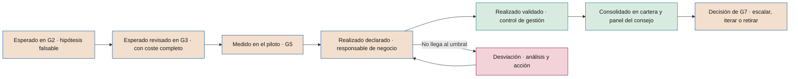

# Realización de beneficios

**Del valor esperado al valor validado: responsables de negocio, seguimiento, materialización y auditoría del valor**

| | |
|---|---|
| Documento | Documento 43 · Realización de beneficios |
| Versión | 0.1 (borrador de trabajo) |
| Fecha | 16-09-2026 |
| Autor | Fernando García · SEACHAD |
| Estado | Borrador para revisión. Desarrolla el seguimiento de realización de valor (P28, T12) y su vínculo con R6 y G7. |

<!-- cifras: 1 | responsable de negocio por beneficio ; 2 | revisiones posteriores a la implantación (6 y 12 meses) ; 3 | estados del importe ; 0 | euros contados dos veces en la cartera -->

---

> **Aviso legal y exención de responsabilidad.** SEVEN-G es un marco metodológico de referencia que se ofrece «tal cual» y con fines exclusivamente informativos. No constituye asesoramiento jurídico, regulatorio, financiero ni profesional, ni garantiza el cumplimiento de ninguna norma. Las referencias a regulación general (como el Reglamento Europeo de IA, el RGPD, DORA o NIS2), a normas técnicas y a regulación específica de cada sector o jurisdicción pueden ser incompletas, no aplicar a un caso concreto o quedar desactualizadas por cambios normativos, interpretaciones o criterios de las autoridades posteriores a su fecha de consulta. **Cada organización que use SEVEN-G es la única responsable de identificar la normativa que le aplica, verificar su vigencia y certificar su propio cumplimiento regulatorio**, con el asesoramiento cualificado que corresponda. El autor y SEACHAD no asumen responsabilidad alguna por el uso que se haga de este contenido ni por las decisiones que se adopten con él. Los datos, cifras, compañías y casos de los ejemplos son ficticios o ilustrativos.

<!-- esencial: recomendado | El plan de realización de beneficios (P62) es evidencia de G3 (en borrador) y de G4 (firmado), con un responsable de negocio del beneficio, y el seguimiento por periodo alimenta R6 y G7. El resto —doble conteo entre casos, revisiones posteriores, auditoría del valor— se aplica según el tamaño de la cartera. -->

## 1. Objeto y alcance

Este documento establece cómo SEVEN-G convierte el valor esperado de una iniciativa en valor realizado y validado, y cómo lo consolida en la cartera y en el panel del consejo. Aplica las reglas y fórmulas del documento 40 y los indicadores del documento 41.

Responde a seis preguntas:

1. ¿Quién responde de que el beneficio llegue?
2. ¿Qué plan lo hace posible y cómo se sigue periodo a periodo?
3. ¿Cómo se evita contar dos veces el mismo euro?
4. ¿Cómo se materializa la capacidad liberada?
5. ¿Qué se hace cuando el valor no llega?
6. ¿Cómo se consolida y se audita el valor que ve el consejo?

Se aplica a toda iniciativa desde la fase 2 hasta su retirada. En Lite se aplica con el plan y el seguimiento simplificados que se indican en cada sección.

Las cifras de los ejemplos son **ficticias e ilustrativas**.

---

## 2. Del valor esperado al valor validado

### 2.1 Recorrido

| Momento | Qué valor existe | Estado posible | Quién lo elabora | Quién lo revisa o valida | Evidencia |
|---|---|---|---|---|---|
| **G2 · Hipótesis** | Valor esperado con fórmula, línea base y método de atribución. | Estimado o declarado | Responsable de producto con el responsable de negocio | Oficina de IA o auditor de IA | P08, P09 |
| **G3 · Viabilidad** | Valor esperado revisado con costes completos y plan de realización en borrador. | Estimado o declarado | Responsable de producto; control de gestión revisa el cálculo | Responsable de riesgos o auditor de IA | P10, T11, T13 |
| **G4 · Diseño** | Plan de realización completo, incluido el plan de materialización. | — | Responsable de negocio | Oficina de IA | Plan de realización (sección 4) |
| **G5 · Puesta en producción** | Valor medido en el piloto con el método de atribución. | Declarado; validado si control de gestión verifica el periodo del piloto | Responsable de producto | Control de gestión y auditor de IA | P22 |
| **Fase 6 · Cada periodo** | Valor realizado del periodo. | Declarado → validado | Responsable de negocio | Control de gestión | P28, T12 |
| **Revisiones a 6 y 12 meses** | Valor realizado acumulado frente al plan. | Validado y declarado, identificados | Oficina de IA | Comité de IA o patrocinador | Informe de revisión (sección 8) |
| **G7 · Escalado o retirada** | Valor realizado validado y ambición real frente a declarada. | Validado para acreditar criterios | Responsable de producto | Auditor de IA | P28, P30 |

<!-- grafico: Del valor esperado al valor validado | Cada paso exige más evidencia y cambia quién firma -->

### 2.2 Reglas del recorrido

1. **El esperado y el realizado nunca se suman.** Conviven en T12 como columnas distintas.
2. **El valor esperado no se valida** (documento 40 §4.1). Control de gestión puede revisar su cálculo en G3, pero el estado validado solo se aplica a valor realizado en un periodo cerrado.
3. **La hipótesis aprobada es la referencia.** El plan de realización, las desviaciones y G7 se miden frente a la hipótesis aprobada en G2 y revisada en G3. Cambiarla exige aprobación del órgano que autorizó la iniciativa (01 §7.4, regla 6).

---

## 3. Responsables del beneficio

### 3.1 Principio

**El beneficio es responsabilidad de negocio, no de tecnología.** El equipo técnico entrega una solución que funciona; el valor aparece en un proceso, un presupuesto o una cuenta de resultados que gestiona un área de negocio. Solo quien controla ese proceso y ese presupuesto puede hacer que el beneficio se materialice.

### 3.2 Roles

| Rol | Quién | Responsabilidad en la realización | No puede |
|---|---|---|---|
| **Responsable de negocio del beneficio** | Directivo del área en la que se produce el beneficio (el área que ve reducido su coste o aumentados sus ingresos). Puede coincidir con el patrocinador. | Firma el plan de realización; ejecuta los cambios habilitadores y la materialización; declara el valor realizado cada periodo; explica las desviaciones y propone acciones. | Validar su propio valor. Ser el responsable técnico de la iniciativa. |
| **Patrocinador de IA** | Según 01 §8.1. | Responde del valor ante los órganos; resuelve conflictos entre áreas; decide acciones dentro de su autoridad. | Validar el valor. |
| **Responsable de producto de IA** | Según 01 §8.1. | Responde del uso real y de la adopción; mantiene T12 al día; prepara las revisiones. | Declarar valor en nombre del área de negocio. |
| **Control de gestión** | Función financiera independiente del área. | Valida el valor realizado; fija valores unitarios y costes horarios; aprueba claves de reparto; concilia con contabilidad. | Participar en la construcción de la iniciativa. |
| **Oficina de IA** | Según 01 §8.3. | Consolida la cartera; detecta solapes; prepara la información del comité y del consejo. | Validar valor. |
| **Auditor de IA y auditoría interna** | Tercera línea. | Verifica en G5 y G7; audita el valor por muestreo (sección 12). | Participar en la iniciativa. |

### 3.3 Requisitos del responsable de negocio

- Tiene **autoridad sobre el presupuesto o el proceso** donde aparece el beneficio.
- Está **identificado por nombre y cargo** en T01 antes de G3.
- Si el beneficio aparece en varias áreas, **cada área tiene su responsable** para su parte, y el reparto se declara.
- **Cuando cambia la persona**, el nuevo responsable firma el plan vigente en el plazo de un periodo de seguimiento o propone su revisión.
- Cuando una eficiencia se valida, el responsable de negocio **acuerda con control de gestión su incorporación al presupuesto** del área en el siguiente ejercicio. Un ahorro que no se refleja en el presupuesto tiende a reabsorberse.

---

## 4. Plan de realización de beneficios

### 4.1 Contenido

El plan se documenta en la plantilla P62 y se registra en T12; P28 recoge su seguimiento por periodo. En Lite, los campos marcados como **(Enterprise)** pueden omitirse.

| Bloque | Campo | Guía |
|---|---|---|
| **Beneficio** | Descripción y tipo | Eficiencia o retorno; no se mezclan en una misma línea. |
| | Fórmula | Unidades incrementales × valor unitario (documento 40, F1). |
| | Línea base y método de atribución | Los aprobados en G2. |
| | Valor esperado anual en régimen | Coherente con la hipótesis aprobada. |
| **Responsables** | Responsable de negocio del beneficio | Nombre, cargo y área. |
| | Validador | Persona de control de gestión. |
| **Curva de realización** | Valor esperado por periodo | Refleja la rampa de adopción; no se supone el régimen desde el primer periodo. |
| | Fecha de régimen | Periodo en que se espera el 100 % del valor anual. |
| **Cambios habilitadores** | Cambios de proceso, roles, políticas, sistemas o contratos sin los que el beneficio no llega | Cada uno con responsable y fecha. |
| **Materialización** | Destino de la capacidad liberada | Palanca, horas, fecha y evidencia prevista (sección 7). |
| **Indicadores** | Indicadores adelantados | Uso, calidad, volumen (familias ADO y OPE del documento 41). |
| | Indicadores de resultado | Los de la fórmula del beneficio. |
| **Solapes** | Casos o programas que comparten métrica, proceso o población | Clave de reparto propuesta (sección 6). |
| **Riesgos del beneficio** | Qué puede impedir que llegue | Vinculados al registro de riesgos (T06). **(Enterprise)** |
| **Criterios de parada** | Umbral por debajo del cual se propone iterar o retirar | Los aprobados en G2. |
| **Revisiones** | Fechas de las revisiones a 6 y 12 meses y de R6 | Según la sección 8. |
| **Dependencias** | Otras iniciativas, proveedores o proyectos de los que depende | **(Enterprise)** |

### 4.2 Aprobación

| Momento | Estado del plan | Firma |
|---|---|---|
| G3 | Borrador con curva de realización, responsables y solapes identificados. | Responsable de negocio; revisión de cálculo por control de gestión. |
| G4 | Completo, con cambios habilitadores y plan de materialización. | Responsable de negocio y patrocinador. |
| G5 | Vigente, ajustado con los resultados del piloto sin rebajar el objetivo aprobado sin autorización. | Responsable de negocio y patrocinador; verificado en G5. |

---

## 5. Seguimiento por periodo

### 5.1 Periodicidad

| Intensidad | Registro del valor realizado | Validación | Información al comité de IA |
|---|---|---|---|
| **Enterprise** | Mensual | Trimestral | Trimestral y en R6 |
| **Lite** | Trimestral | Semestral | Semestral y en R6 |

### 5.2 Qué se registra en cada periodo

| Campo | Contenido |
|---|---|
| Periodo | Mes o trimestre cerrado. |
| Valor esperado del periodo | Según la curva de realización. |
| Valor realizado del periodo | Por línea de beneficio, con fórmula y fuentes. |
| Estado | Validado, declarado o estimado, con validador y fecha si procede. |
| Coste recurrente real | Desde T13 (documento 42). |
| Capacidad liberada | Horas liberadas netas, materializadas, reasignadas y sin destino (documento 40, F4 y F5). |
| Indicadores adelantados | Uso, calidad y volumen del periodo. |
| Realización | Del periodo y acumulada (F10), en total y solo con validado. |
| Desviación y causa | Si la realización está fuera de tolerancia (sección 9). |
| Acciones | Con responsable y fecha. |

### 5.3 Ejemplo ilustrativo

Eficiencia esperada en régimen: 300.000 € al año (75.000 € por trimestre). Curva de realización: 25 %, 50 %, 75 % y 100 % en los cuatro primeros trimestres. Coste recurrente real del año: 90.000 €.

| Trimestre | Esperado | Realizado | Estado | Realización del trimestre | Realización acumulada |
|---|---|---|---|---|---|
| T1 | 18.750 € | 15.000 € | Validado | 80,0 % | 15.000 ÷ 18.750 = 80,0 % |
| T2 | 37.500 € | 30.000 € | Validado | 80,0 % | 45.000 ÷ 56.250 = 80,0 % |
| T3 | 56.250 € | 41.000 € | Declarado | 72,9 % | 86.000 ÷ 112.500 = 76,4 % |
| T4 | 75.000 € | 52.000 € | Declarado | 69,3 % | 138.000 ÷ 187.500 = 73,6 % |
| **Año** | **187.500 €** | **138.000 €** | | | **73,6 %** |

Lectura:

- **Realización acumulada: 73,6 %**, en ámbar con los umbrales orientativos del documento 41 (IND-VAL-14). Pero la realización del periodo cae dos trimestres seguidos por debajo del 90 % (72,9 % y 69,3 %): es una **desviación relevante** según la sección 9.1, se informa al comité de IA y la siguiente R6 valora adelantar G7.
- **Proporción validada: 45.000 ÷ 138.000 = 32,6 %.** La realización solo con validado es 45.000 ÷ 187.500 = 24,0 %.
- **Valor neto anual (F2): 138.000 − 90.000 = 48.000 €. Valor neto validado (F2v): 45.000 − 90.000 = −45.000 €.**
- Acciones: validar los trimestres T3 y T4 antes de R6 y analizar la causa de la caída de realización (sección 9).

### 5.4 Reglas del seguimiento

1. **Periodo cerrado.** Solo se registra valor de periodos cerrados. No se anticipa el valor del periodo en curso.
2. **Sin dato no es cero.** Si el área no declara, el periodo queda "sin dato" y se genera alerta; la oficina de IA puede registrar una estimación identificada como tal.
3. **No se compensan periodos.** Un periodo con mayor realización no oculta otro con menor; se informan ambos.
4. **Las correcciones de periodos anteriores se registran como ajuste**, con fecha y motivo, sin sobrescribir el dato original.

---

## 6. Atribución y doble conteo entre casos

### 6.1 Identificación de solapes

En la fase 2 y en cada R6, la oficina de IA revisa los solapes de la cartera con tres criterios:

| Criterio | Pregunta | Ejemplo |
|---|---|---|
| **Proceso** | ¿Actúan dos casos sobre el mismo proceso o la misma partida de coste? | Un clasificador documental y un asistente de redacción en la misma tramitación. |
| **Población** | ¿Actúan sobre los mismos clientes, empleados o transacciones? | Dos modelos de propensión dirigidos a la misma cartera de clientes. |
| **Métrica** | ¿Usan la misma métrica de resultado? | Dos casos que reclaman la reducción del tiempo medio de resolución. |

También se identifican los **programas sin IA** que actúan sobre la misma métrica (rediseños de procesos, cambios de precio, campañas, reorganizaciones), porque su efecto no es atribuible a la IA.

### 6.2 Métodos de reparto

| Método | Cómo funciona | Cuándo usarlo |
|---|---|---|
| **Medición conjunta y reparto proporcional** | Se mide el efecto conjunto con un método del documento 40 §7 y se reparte en proporción a los efectos medidos o esperados de cada caso por separado. | Casos implantados a la vez sobre el mismo proceso. |
| **Incremental secuencial** | El primer caso implantado se mide frente a la línea base; el segundo, frente a la situación con el primero ya implantado. | Implantaciones escalonadas con medición en cada paso. Tiende a favorecer al primero; se declara. |
| **Reparto acordado previo** | Los responsables de negocio acuerdan en la fase 2 un porcentaje de reparto justificado, aprobado por control de gestión. | Cuando no es posible medir por separado. Estado máximo: declarado, salvo que la medición conjunta esté validada. |

En todos los casos: **la suma de lo atribuido no supera el efecto conjunto medido**, y la clave se registra en todos los casos afectados (IND-VAL-18).

### 6.3 Ejemplo ilustrativo

El coste de un proceso de tramitación se reduce en 500.000 € en el año. Sobre ese proceso actúan un programa de rediseño sin IA y dos casos de IA (A y B).

1. El programa sin IA se aplicó también en oficinas sin IA. La comparación entre oficinas (diferencias en diferencias) atribuye al programa **100.000 €**.
2. Efecto atribuible a la IA: 500.000 − 100.000 = **400.000 €**.
3. Efectos de A y B medidos por separado en el piloto: 280.000 € y 220.000 € (suma 500.000 €, superior al efecto conjunto).
4. Reparto proporcional: A = 400.000 × 280/500 = **224.000 €**; B = 400.000 × 220/500 = **176.000 €**.
5. Comprobación: 100.000 + 224.000 + 176.000 = 500.000 €.

### 6.4 Iniciativas transversales: realización por unidad de negocio

Una iniciativa transversal (documento 40 §7.2) tiene un solo plan de realización, con un bloque por unidad de negocio:

| Elemento | Qué se exige |
|---|---|
| **Responsables** | El patrocinador es corporativo. Cada unidad nombra su **responsable de negocio del beneficio**, que firma la parte del plan de su unidad y declara cada periodo su coste, su adopción y su valor materializado. |
| **Coste** | Cada unidad asume sus licencias desde el primer día. Lo común (oficina de adopción, formación continua, revisión de permisos) se registra sin unidad y suma en el coste de la iniciativa. |
| **Adopción** | Licencias activas sobre asignadas y usuarios activos semanales, tomados de los informes de uso de la plataforma. Por debajo del umbral aprobado en G2, la unidad revisa el despliegue o retira licencias. |
| **Materialización** | Cada unidad indica la palanca de la sección 7.2 con la que convierte las horas liberadas en menor coste o en capacidad reasignada. Sin palanca, las horas son capacidad liberada y no suman. |
| **Validación** | Control de gestión valida unidad por unidad. La suma de las unidades y de lo común es el valor de la iniciativa; lo que ya reclama un caso propio de la unidad sobre el mismo proceso no se cuenta otra vez (secciones 6.1 y 6.2). |

En T01, el despliegue y la adopción de cada unidad se registran en el alcance de la iniciativa y el coste y el valor, como importes con su unidad. El panel del consejo (T17) los muestra por unidad y da el neto de la cartera con y sin las iniciativas transversales.

---

## 7. Materialización de la capacidad liberada

### 7.1 Principio

La capacidad liberada no es ahorro hasta que se materializa o se reasigna de forma explícita (documento 40, regla 3). En Optimizar, **G5 exige un plan para materializarla y G7 exige ahorro materializado** (01 §7.6). En Aumentar, G7 exige capacidad reasignada.

### 7.2 Palancas

| Palanca | Qué es | Cómo se contabiliza | Evidencia |
|---|---|---|---|
| **Reducción de externalización** | Menos servicios externos contratados para el mismo trabajo. | Eficiencia materializada. | Contrato modificado o no renovado; menor gasto en contabilidad. |
| **Eliminación de horas extraordinarias o refuerzos temporales** | Menos horas pagadas por encima de la jornada o menos contratos temporales. | Eficiencia materializada. | Nómina y contratación del área frente a la línea base. |
| **Vacantes presupuestadas no cubiertas** | Salidas naturales o vacantes previstas que no se cubren porque la capacidad ya existe. | Eficiencia (coste evitado presupuestado). | Presupuesto de plantilla aprobado y decisión registrada de no cubrir. |
| **Absorción de crecimiento** | Aumento de volumen atendido sin aumentar recursos que el presupuesto preveía. | Eficiencia (coste evitado presupuestado), solo si el aumento de recursos estaba presupuestado. | Presupuesto aprobado con el aumento previsto. |
| **Reasignación a actividad nueva** | Las horas se dedican de forma explícita a una actividad identificada de mayor valor. | Capacidad reasignada; su valor solo cuenta a través del resultado medido de la actividad de destino. | Actividad, responsable, fecha y horas registradas en T20. |

La materialización que afecte a personas se planifica con la función de personas y respeta las obligaciones legales y convencionales aplicables, así como el plan de adopción (documento 23). Este documento no constituye asesoramiento jurídico.

### 7.3 Reglas

1. **El plan de materialización existe antes de G5** en Optimizar y antes de G7 en Aumentar.
2. **Cada hora tiene un único destino**: materializada, reasignada o sin destino (F5).
3. **La valoración de la eficiencia es el menor coste real**, no las horas por el coste horario interno. Por eso la tasa de materialización se calcula en horas y la eficiencia en euros de coste real.
4. **La capacidad sin destino se informa** en cada periodo y en el panel del consejo, separada del neto.
5. **Capacidad sin destino persistente.** Si tras dos periodos de validación la capacidad sigue sin destino, el comité de IA revisa la hipótesis de valor y el nivel de ambición de la iniciativa.

### 7.4 Ejemplo ilustrativo

Continuación del ejemplo del documento 40 §3.3: 5.000 horas liberadas netas al año, valoradas en 160.000 € (32 € por hora).

| Destino | Horas | Registro | Importe |
|---|---|---|---|
| Externalización no renovada | 2.000 | Eficiencia materializada (reducción real del contrato) | 76.000 € |
| Reasignación a revisión de calidad | 1.000 | Capacidad reasignada (no suma en el neto) | 32.000 € de capacidad |
| Sin destino | 2.000 | Capacidad liberada no materializada (no suma en el neto) | 64.000 € de capacidad |
| **Total** | **5.000** | | |

Tasa de materialización: 2.000 ÷ 5.000 = **40 %**. Tasa de reasignación: 1.000 ÷ 5.000 = **20 %**. Si la revisión de calidad reduce las reclamaciones y ese efecto se mide, su valor se registra como eficiencia o retorno de esa actividad, no como valor de las horas.

---

## 8. Revisiones posteriores a la implantación

### 8.1 Calendario

| Revisión | Cuándo | Objetivo | Coincidencia con R6 |
|---|---|---|---|
| **Revisión a 6 meses** | Primer cierre de periodo posterior a los 6 meses desde G5. | Confirmar que el uso, la calidad y el primer valor siguen la curva; activar acciones tempranas. | Sustituye a la R6 de ese periodo si incluye sus comprobaciones. |
| **Revisión a 12 meses** | Primer cierre de periodo posterior a los 12 meses desde G5. | Valor anual realizado y validado, materialización, coste real y ambición real; preparar G7 si procede. | Sustituye a la R6 de ese periodo si incluye sus comprobaciones. |

En Enterprise, las R6 trimestrales intermedias continúan (01 §6.8). En Lite, la revisión a 6 meses coincide con la primera R6 semestral y la de 12 meses con la segunda.

### 8.2 Contenido

| Pregunta | Revisión a 6 meses | Revisión a 12 meses |
|---|---|---|
| ¿Se usa como se preveía? | Tasa de uso y usuarios activos frente al plan. | Uso estable y adopción consolidada. |
| ¿Funciona con la calidad aprobada? | Indicadores OPE frente a umbrales de G5. | Estabilidad, deriva, incidentes del año. |
| ¿Llega el valor? | Realización acumulada y tendencia. | Valor anual realizado; proporción validada; valor neto anual y validado. |
| ¿Se materializa la capacidad? | Avance del plan de materialización. | Tasa de materialización y de reasignación. |
| ¿Cuesta lo previsto? | Coste recurrente real frente al estimado en G3. | Coste anual real; coste por unidad de resultado frente a la línea base. |
| ¿Hay solapes nuevos? | Revisión de la cartera. | Revisión de la cartera y de programas sin IA. |
| ¿La ambición es la declarada? | — | Cinco preguntas de clasificación con la evidencia real (00 §5.2). |
| ¿Qué se decide? | Continuar el plan o acciones correctivas. | Continuar, acciones correctivas o adelantar G7. |

### 8.3 Resultado

Cada revisión genera un **informe breve** con conclusiones, acciones, responsables y fechas, registrado en T01 como evento y enlazado en T12. Lo prepara la oficina de IA con el responsable de producto; lo aprueba el patrocinador (Lite) o el comité de IA (Enterprise). Si las acciones cambian la curva, los responsables o los habilitadores, se actualiza el plan de realización (P62). Las lecciones se incorporan al registro de lecciones aprendidas de la cartera (P37 §9).

---

## 9. Desviaciones y acciones

### 9.1 Umbrales

La realización (F10) se clasifica con los umbrales orientativos del documento 41 (IND-VAL-14), que la compañía fija en C2:

| Situación | Realización acumulada (orientativa) | Respuesta mínima |
|---|---|---|
| **Dentro de tolerancia** | ≥ 90 % | Seguimiento ordinario. |
| **Desviación moderada** | 70–90 % | Análisis de causa y acciones del responsable de negocio antes del siguiente periodo. |
| **Desviación relevante** | < 70 %, o dos periodos seguidos con realización del periodo decreciente por debajo del 90 % | Informe al comité de IA; R6 valora adelantar G7 (01 §6.8). |
| **Criterio de parada alcanzado** | Según los criterios aprobados en G2 | Se propone iterar o retirar; no se relajan los criterios sin aprobación (01 §7.4, regla 6). |

La misma lectura se aplica a la realización solo con valor validado cuando se preparan R6 y G7.

### 9.2 Causas habituales y acciones

| Causa | Señales | Acciones posibles |
|---|---|---|
| **Adopción insuficiente** | Tasa de uso por debajo del plan; aceptación baja de propuestas. | Formación, rediseño de la experiencia de uso, cambios de proceso que integren la herramienta, patrocinio visible. |
| **Proceso no rediseñado** | Uso alto pero el tiempo total del proceso no baja. | Rediseño de extremo a extremo; eliminación de pasos duplicados. |
| **Calidad del sistema** | Indicadores OPE fuera de umbral; más revisión humana de la prevista. | Mejora del modelo, de los datos o de la base de conocimiento; revisión del umbral de automatización. |
| **Volumen inferior al previsto** | Menos transacciones de las de la hipótesis. | Revisar la hipótesis con aprobación; ampliar el alcance solo por la vía de G7. |
| **Materialización no ejecutada** | Capacidad sin destino creciente. | Ejecutar las palancas de la sección 7; escalar al patrocinador. |
| **Coste superior al previsto** | Coste recurrente real por encima del estimado; consumo desbocado. | Medidas del documento 42 §8; renegociación; optimización. |
| **Atribución discutida** | Solapes no declarados; efecto de programas sin IA. | Aplicar la sección 6; recalcular con control de gestión. |
| **Hipótesis errónea** | El efecto medido con buen uso y buena calidad es menor que el esperado. | Iterar o retirar en G7; registrar la lección. |

### 9.3 Reglas

1. **Toda desviación tiene causa y acción**, con responsable y fecha, registradas en T12.
2. **No se rebaja el objetivo para cerrar una desviación.** La revisión de la hipótesis es una decisión del órgano que la aprobó y queda registrada con el motivo.
3. **Las acciones vencidas se tratan como condiciones vencidas** (IND-EMB-08) cuando se impusieron en un *gate* o en R6.

---

## 10. Vínculo con R6 y G7

### 10.1 Qué comprueba R6 sobre el valor

| Comprobación | Evidencia |
|---|---|
| El valor realizado se registra cada periodo con estado. | T12 al día; sin periodos "sin dato" sin explicación. |
| La realización está dentro de tolerancia o tiene acciones. | Realización acumulada y acciones registradas. |
| Las validaciones están vigentes. | Ningún importe validado caducado (documento 40 §4.1). |
| La capacidad liberada tiene destino o plan. | Tasas de materialización y reasignación. |
| El coste real concilia con T13. | Conciliación del documento 42 §11.3. |
| Los solapes están declarados y repartidos. | IND-VAL-18. |
| Procede adelantar G7. | Desviación relevante o criterio de parada alcanzado. |

### 10.2 Qué exige G7 sobre el valor

G7 aplica los criterios diferenciados por nivel de ambición de 01 §7.6, con estas exigencias de evidencia:

| Ambición | Criterio de G7 (01 §7.6) | Evidencia de valor exigida | Estado mínimo |
|---|---|---|---|
| **Optimizar** | Ahorro materializado, no solo capacidad liberada. | Eficiencias materializadas con reflejo contable o coste evitado presupuestado; tasa de materialización; valor neto anual; VAN recalculado con valores realizados (documento 40 §8). | Validado |
| **Aumentar** | Rendimiento sostenido y capacidad reasignada. | Indicadores de rendimiento sostenidos en al menos dos periodos; tasa de reasignación con actividades de destino; valor neto anual. | Validado para los importes; indicadores verificados por el auditor de IA |
| **Transformar** | Retorno medido y cambio del modelo operativo o de la oferta verificado. | Retorno medido con grupo de control, prueba A/B o diferencias en diferencias; evidencia del cambio operativo o de oferta; cumplimiento de hitos de aprendizaje y límites por etapa. | Validado para el retorno; cambio verificado por el auditor de IA |

Si la decisión es **Escalar**, el valor realizado validado y el plan de realización actualizado forman parte de la nueva fase 0 del alcance ampliado. Si es **Retirar**, se registran el valor realizado final, el coste de retirada (documento 42 §10) y las lecciones.

---

## 11. Consolidación en cartera y en el panel del consejo

### 11.1 Proceso de consolidación

| Paso | Actividad | Responsable | Control |
|---|---|---|---|
| 1 | Cierre del periodo en T12 para todos los casos. | Responsables de negocio | Casos sin declaración identificados. |
| 2 | Validación de los importes del periodo que corresponda. | Control de gestión | Estados y caducidades actualizados. |
| 3 | Revisión de solapes y aplicación de claves de reparto. | Oficina de IA | Suma de lo atribuido ≤ efecto conjunto medido. |
| 4 | Incorporación del coste recurrente real desde T13. | Control de gestión | Conciliación con contabilidad. |
| 5 | Cálculo de F2, F2v, F5, F6 y F10 por caso y en cartera. | Oficina de IA | Recalculado automáticamente; sin ajustes manuales no registrados. |
| 6 | Separación de capacidad liberada, reasignada, potenciales y valor no cuantificado. | Oficina de IA | Nada de esto entra en el neto. |
| 7 | Comparación con el periodo anterior y con la foto guardada del panel. | Oficina de IA | Variaciones explicadas, incluidas las de estado. |
| 8 | Exportación al panel del consejo (T17). | Oficina de IA | Proporción validada visible junto a cada total. |

### 11.2 Qué ve el consejo

Las reglas de presentación están en el documento 40 §11. Para la realización de beneficios, el panel del consejo debería mostrar además:

- **Realización acumulada de la cartera** (IND-VAL-14) en total y solo con validado.
- **Casos con desviación relevante**, con causa y acción.
- **Capacidad sin destino** de la cartera y su evolución.
- **Valor por nivel de ambición**, separando eficiencias y retorno, para las señales 2 y 3 del índice de transformación.
- **Fotos históricas** que permitan comparar periodos sin reescribir cifras ya presentadas; las correcciones se muestran como ajuste.

### 11.3 Reglas de agregación

1. **Solo se suman magnitudes homogéneas**: eficiencias con eficiencias, retorno con retorno; y retorno en margen con retorno en margen.
2. **El total de cartera es la suma después del reparto de solapes**, nunca la suma de lo declarado por cada caso.
3. **Los casos sin dato no se sustituyen por cero**; se informa su número.
4. **Los casos retirados** conservan su valor realizado histórico en los periodos en que estuvieron en producción, y dejan de sumar desde la retirada.

---

## 12. Auditoría del valor

### 12.1 Objeto y responsables

La auditoría del valor verifica que las cifras de valor que se presentan al comité de IA y al consejo cumplen las reglas del documento 40. La realiza la **tercera línea** (auditoría interna o auditor externo), con independencia de la oficina de IA y de control de gestión, al menos **una vez al año antes de C5**, y cuando el consejo o la comisión delegada lo pidan.

### 12.2 Alcance y muestra

| Elemento | Criterio orientativo |
|---|---|
| **Importes validados materiales** | Todos los importes validados que superen el umbral de materialidad fijado por auditoría con control de gestión. |
| **Resto de importes** | Muestra aleatoria de importes validados, declarados y estimados de todas las intensidades. |
| **Casos Transformar** | Todos, por la exigencia de retorno medido en G7. |
| **Solapes** | Todos los casos con solape declarado y una muestra de casos sobre procesos comunes sin solape declarado. |
| **Consolidación** | Recalculo completo de los totales presentados al consejo en el último periodo. |

### 12.3 Pruebas

| Prueba | Qué verifica |
|---|---|
| **Fórmula y fuentes** | Que el importe se reconstruye desde la fórmula y los sistemas de origen (regla 1). |
| **Línea base y atribución** | Que la línea base se midió antes de G2 y que el método aplicado es el aprobado, con su estado máximo (documento 40 §7). |
| **Estado y vigencia** | Que cada estado lo asignó quien puede asignarlo, con la evidencia exigida y sin caducar (documento 40 §4). |
| **Materialización** | Que las eficiencias tienen reflejo contable o coste evitado presupuestado (regla 3). |
| **Exclusividad** | Que no hay doble conteo y que las claves de reparto están aprobadas (regla 5). |
| **Coste completo** | Que el coste recurrente incluye los costes compartidos y concilia con contabilidad (documento 42). |
| **Presentación** | Que los informes al consejo muestran la proporción validada, la capacidad separada, los casos con neto negativo y los "sin dato" (documento 40 §11). |

### 12.4 Hallazgos

| Hallazgo | Tratamiento mínimo |
|---|---|
| Error de cálculo o de registro sin impacto en decisiones | No conformidad menor (documento 37). |
| Importe presentado como validado sin validación o con validación caducada | No conformidad mayor. |
| Doble conteo o capacidad liberada sumada en el neto con impacto en decisiones del comité o del consejo | No conformidad mayor. |
| Alteración deliberada de cifras o de criterios de parada | Al menos no conformidad mayor; se comunica a la comisión delegada del consejo. |

Cuando un hallazgo afecta a cifras ya presentadas al consejo, la oficina de IA presenta en la siguiente sesión la **cifra corregida junto a la presentada**, con la explicación. El informe de auditoría del valor se incorpora a C5. Los hallazgos se documentan con la ficha de P60 §8.1.

---

## 13. Herramientas y plantillas asociadas

| Código | Nombre | Uso en este documento |
|---|---|---|
| **T12** | Seguimiento de realización de valor | Plan de realización, registro por periodo, estados, realización, desviaciones. |
| **T01** | Registro de iniciativas | Responsables, eventos de revisión, decisiones de R6 y G7. |
| **T13** | Calculadora de costes por caso | Coste recurrente real. |
| **T17** | Panel de IA para el consejo | Consolidación y presentación. |
| **T20** | Plan de adopción y capacidad | Materialización y reasignación de la capacidad. |
| **T22** | Gestor de retiradas | Valor final y retirada. |
| **P08 · P09** | Lienzo de hipótesis de valor · Línea base | Referencia del plan. |
| **P20** | Plan de adopción y capacidad | Cambios habilitadores y destino de la capacidad. |
| **P22** | Resultados de validación y del piloto | Valor medido en G5. |
| **P28** | Seguimiento de realización de valor | Seguimiento por periodo. |
| **P62** | Plan de realización de beneficios | Plan de realización: curva, responsables y habilitadores (sección 4). |
| **P29** | Registro de decisión de *gate* | Decisiones de R6 y G7. |
| **P30** | Decisión de escalado o retirada | Evidencia de valor en G7. |

---

## 14. Documentos relacionados

| Documento | Relación |
|---|---|
| **01 · Metodología fundacional** | R6 (§6.8), G7 (§6.9) y criterios por ambición (§7.6). |
| **14 · Gestión de cartera** | Uso del valor realizado en la priorización y la retirada. |
| **21 · Criterios de gate y auditoría** | Criterios detallados de G5, R6 y G7. |
| **23 · Adopción y cambio** | Adopción y cambios habilitadores. |
| **37 · No conformidades e incidentes** | Tratamiento de los hallazgos. |
| **38 · Marco de auditoría de IA** | Encaje de la auditoría del valor. |
| **40 · Reglas de medición del valor** | Reglas, estados, fórmulas y métodos de atribución. |
| **41 · Catálogo de indicadores** | Indicadores VAL, COS y ADO del seguimiento. |
| **42 · Costes de IA** | Coste recurrente real y coste de retirada. |
| **50 · Personas y organización** | Materialización y reasignación que afectan a personas. |
| **60 · Paquete para el consejo** | Presentación de la realización de beneficios. |

---

## 15. Control de versiones

| Versión | Fecha | Cambios |
|---|---|---|
| 0.1 | 16-09-2026 | Primera versión. Define el recorrido del valor esperado al validado, el responsable de negocio del beneficio, el plan de realización, el seguimiento por periodo, los métodos para evitar el doble conteo, las palancas de materialización de la capacidad liberada, las revisiones a 6 y 12 meses, el tratamiento de desviaciones, el vínculo con R6 y G7, la consolidación en cartera y en el panel del consejo y la auditoría del valor. |
