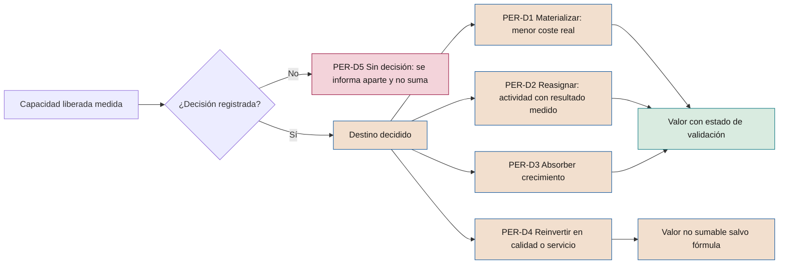

# Personas y organización

**Efecto de la IA sobre el trabajo, capacidades, capacidad liberada, relaciones laborales y decisiones sobre personas**

| | |
|---|---|
| Documento | Documento 50 · Personas y organización |
| Versión | 0.1 (borrador de trabajo) |
| Fecha | 16-09-2026 |
| Autor | Fernando García · SEACHAD |
| Estado | Borrador para revisión. Los umbrales de los indicadores son orientativos y deben calibrarse con la aplicación del marco. |

<!-- cifras: 3 | efectos sobre el trabajo: sustituye, aumenta, reorganiza ; 5 | destinos posibles de la capacidad liberada ; 15 | indicadores con fórmula ; 6 | perfiles del plan de alfabetización -->

---

> **Aviso legal y exención de responsabilidad.** SEVEN-G es un marco metodológico de referencia que se ofrece «tal cual» y con fines exclusivamente informativos. No constituye asesoramiento jurídico, regulatorio, financiero ni profesional, ni garantiza el cumplimiento de ninguna norma. Las referencias a regulación general (como el Reglamento Europeo de IA, el RGPD, DORA o NIS2), a normas técnicas y a regulación específica de cada sector o jurisdicción pueden ser incompletas, no aplicar a un caso concreto o quedar desactualizadas por cambios normativos, interpretaciones o criterios de las autoridades posteriores a su fecha de consulta. **Cada organización que use SEVEN-G es la única responsable de identificar la normativa que le aplica, verificar su vigencia y certificar su propio cumplimiento regulatorio**, con el asesoramiento cualificado que corresponda. El autor y SEACHAD no asumen responsabilidad alguna por el uso que se haga de este contenido ni por las decisiones que se adopten con él. Los datos, cifras, compañías y casos de los ejemplos son ficticios o ilustrativos.

## 1. Objeto y alcance

Este documento desarrolla la **esfera 03 · Personas** del mapa de impacto y el principio 10 del marco (*las personas en el centro del cambio*). Establece cómo una organización que aplica SEVEN-G debe:

- Evaluar, iniciativa por iniciativa, si la IA **sustituye, aumenta o reorganiza** el trabajo.
- Definir los **roles y capacidades** que la IA exige, desde el consejo hasta los equipos.
- Planificar la **alfabetización en IA** y las capacidades por perfil.
- Decidir, registrar y seguir el destino de la **capacidad liberada**.
- Cumplir los derechos de **información y consulta** de la representación de los trabajadores y ser transparente con los empleados sobre los algoritmos que les afectan.
- Controlar el uso de la IA en **decisiones sobre personas** (selección, evaluación, promoción, disciplina, despido).
- Proteger el **bienestar, la autonomía** y la calidad de la supervisión humana.
- Comunicar internamente con coherencia y medir todo lo anterior con **indicadores con fórmula**.

**Alcance.** Se aplica a todas las iniciativas de IA y a los usos corporativos de IA de propósito general que afectan al trabajo de los empleados, a sus condiciones laborales o a decisiones sobre candidatos y empleados. La gestión del cambio y la adopción se desarrollan en el documento 23; las reglas de uso aceptable de la IA por los empleados, en el documento 31. Este documento no las repite: fija lo que es específico de las personas y de la organización.

**Límites.** Las referencias normativas laborales se limitan a España y a la Unión Europea, con la fecha de consulta indicada. **Otras jurisdicciones tienen reglas distintas** y deben incorporarse en la declaración de contexto (fase 0). Este documento no constituye asesoramiento jurídico.

---

## 2. Esfera 03 · Personas

### 2.1 Pregunta de referencia

> **¿La IA sustituye, aumenta o reorganiza el trabajo de las personas?**

La respuesta no es técnica. Define la cultura, la propuesta al empleado, la capacidad de atraer y retener talento y la relación con la representación de los trabajadores. Por eso SEVEN-G exige que la compañía adopte en **C2** una **posición explícita** sobre el efecto que busca en el trabajo (documento 13) y que cada iniciativa la respete o justifique la excepción.

### 2.2 Los tres papeles del empleado ante la IA

| Papel | Qué significa | Qué exige a la compañía |
|---|---|---|
| **Receptor** | La IA le cambia herramientas, procesos y expectativas de productividad sin que lo haya elegido. | Formación, acompañamiento, tiempo para aprender y canales para señalar problemas (documento 23). |
| **Sujeto** | La IA puede reorganizar, reasignar o eliminar tareas o puestos, o intervenir en decisiones sobre su empleo. | Evaluación de efecto, información y consulta, controles en decisiones sobre personas y trato justo en la transición (secciones 3, 7 y 8). |
| **Promotor** | Conoce su proceso mejor que nadie y puede proponer usos de IA que nadie externo vería. | Canal de propuestas conectado al registro de iniciativas (T01), reconocimiento y reglas de uso claras (documento 31). |

Un mismo empleado puede ocupar los tres papeles a la vez. Los planes de personas deben tratar los tres y no solo el primero.

### 2.3 Niveles de ambición en la esfera 03

Los ejemplos son **ilustrativos** y no implican recomendación.

| Nivel | Qué cambia para las personas | Ejemplos ilustrativos |
|---|---|---|
| **Optimizar** | Se eliminan o aceleran tareas; el puesto y la organización no cambian. | Automatizar informes, captura de datos y triaje; acelerar la incorporación con asistentes de conocimiento; formación adaptada al nivel de cada empleado. |
| **Aumentar** | Las personas hacen lo que antes no podían; el rol cambia. | Asistentes especializados por función; empleados que proponen y despliegan usos de IA en su ámbito con control; recualificación continua ligada al nuevo rol. |
| **Transformar** | Cambian la estructura, los roles o quién decide qué. | Rediseño de equipos y niveles jerárquicos; desaparición de funciones y creación de otras nuevas; personas que pasan de ejecutar a supervisar sistemas que actúan (autonomía A2 o A3). |

### 2.4 Qué se evalúa en la esfera 03

Se evalúan siete dimensiones, cada una con su evidencia e indicadores (sección 11): **posición** aprobada en C2; **efecto por iniciativa** (P20, PER-01); **capacidades** (PER-02, PER-03); **capacidad liberada** (PER-04 a PER-06); **relaciones laborales** (PER-08); **decisiones sobre personas** (P11, P17, PER-09 a PER-12); y **bienestar** (PER-15).

Los indicadores de la sección 11 alimentan la dimensión **D5 Personas y adopción** del modelo de madurez (documento 11) y las señales **3 · Materialización** y **5 · Modelo operativo** del índice de transformación (documento 12).

---

## 3. Efecto de la IA sobre el trabajo

### 3.1 Tres efectos

| Efecto | Definición en SEVEN-G | Señal típica |
|---|---|---|
| **Sustituye** | El sistema realiza tareas que antes hacía una persona, y la persona deja de hacerlas. | Horas liberadas en tareas concretas; menor necesidad de dotación para el mismo volumen. |
| **Aumenta** | La persona sigue haciendo el trabajo, pero con mayor calidad, alcance o velocidad gracias al sistema. | Mejora de rendimiento por persona; nuevas tareas antes imposibles. |
| **Reorganiza** | Cambian los roles, la secuencia del proceso, la estructura del equipo o el reparto de decisiones entre personas y sistemas. | Nuevas descripciones de puesto; cambios de dependencia; puntos de supervisión humana nuevos. |

Una iniciativa suele combinar efectos. Se registra **el efecto sobre cada tarea** y el **efecto dominante** sobre cada colectivo afectado.

El efecto sobre el trabajo **no es lo mismo que el nivel de ambición**. Una iniciativa de Optimizar puede sustituir muchas tareas; una de Transformar puede no reducir ninguna dotación. Las dos clasificaciones se registran por separado.

### 3.2 Unidad de análisis

El efecto se evalúa en tres niveles, de lo concreto a lo agregado:

1. **Tarea.** Qué tareas del proceso cambian, cuánto tiempo consumen hoy (línea base, fase 2) y qué hará el sistema.
2. **Puesto o rol.** Qué proporción del tiempo del puesto se ve afectada y cómo cambian sus responsabilidades, su autonomía y su supervisión.
3. **Colectivo y organización.** Cuántas personas, en qué áreas, centros y categorías, y con qué efecto previsible en dotación, estructura, cualificación requerida y condiciones de trabajo.

### 3.3 Cómo se evalúa por iniciativa

| Fase | Actividad | Resultado registrado |
|---|---|---|
| **1** | Identificar colectivos afectados y efecto previsible. | Ficha de oportunidad (P06, P31). |
| **2** | Medir la línea base de tiempo por tarea y personas; declarar si el valor depende de capacidad liberada. | P08, P09. |
| **3** | **Evaluación de efecto sobre el trabajo** completa (sección 3.4), con la dirección de personas y conformidad del responsable de riesgos. | P20 / T20; riesgos RT-ORG en P12; P11. |
| **4** | Rediseñar roles y supervisión humana; plan de capacidades y de comunicación; destino previsto de la capacidad liberada. | P17, P20. |
| **5** | Medir en el piloto el efecto real; formar a usuarios y supervisores; informar a la representación cuando proceda. | P22; registro de información. |
| **6** | Seguir adopción, capacidad liberada, bienestar e incidencias; revisar en R6. | P28; registro de capacidad liberada. |
| **7** | Contrastar efecto real con declarado; prever efecto del escalado o la vuelta al proceso anterior si se retira. | P30. |

El responsable de producto realiza la evaluación; el patrocinador responde de ella.

### 3.4 Preguntas de la evaluación de efecto

1. ¿Qué tareas deja de hacer una persona y cuáles aparecen, incluida la supervisión del sistema?
2. ¿Cuántas personas y qué puestos se ven afectados, y en qué proporción de su tiempo?
3. ¿Cambian ritmo, jornada, objetivos, control, autonomía o ubicación? (secciones 7 y 9)
4. ¿Interviene el sistema en decisiones sobre candidatos o empleados? (sección 8)
5. ¿Qué capacidades nuevas se requieren y quién las tiene hoy? (sección 5)
6. ¿Qué capacidad se libera, cuándo y con qué destino previsto? (sección 6)
7. ¿Qué conocimiento se pierde o se concentra? (documento 51, sección 10)
8. ¿Se conserva la capacidad de volver al proceso manual? (documento 52, sección 10)
9. ¿Es coherente con la posición de C2? Si no, la excepción se eleva al comité de IA.

### 3.5 Regla de intensidad

El efecto sobre el trabajo no crea por sí solo un criterio Enterprise, pero **debe revisarse la intensidad** (T04) cuando la evaluación detecta decisiones sobre personas, cambios significativos en condiciones de trabajo o reducciones de dotación. En esos casos la iniciativa **debería** tratarse como Enterprise aunque no cumpla otro criterio, y si se mantiene en Lite se registra la justificación.

---

## 4. Nuevos roles y capacidades

### 4.1 Del consejo a los equipos

| Nivel | Papel respecto a las personas |
|---|---|
| **Consejo o comisión delegada** | Aprueba la posición sobre el efecto en el trabajo; supervisa las transformaciones que cambian la organización; vigila riesgos laborales y reputacionales. |
| **Alta dirección** | Traduce la posición en planes de dotación, cualificación y relaciones laborales; decide destinos relevantes de capacidad liberada. |
| **Comité de IA** | Con la dirección de personas, revisa el efecto agregado en la cartera y las excepciones a la posición de C2. |
| **Oficina de IA** | Mantiene el método de evaluación de efecto y consolida indicadores y registro de capacidad liberada. |
| **Dirección de personas** | Corresponsable de la evaluación de efecto, del plan de capacidades y de la relación con la representación. |
| **Mandos intermedios** | Rediseñan el trabajo diario, lideran equipos mixtos persona-sistema y ejecutan la reasignación. |
| **Equipos de iniciativa** | Construyen y operan con criterio sobre el efecto en las personas. |
| **Usuarios y supervisores humanos** | Usan el sistema y validan, corrigen o interrumpen sus resultados con autoridad para discrepar. |
| **Representación de los trabajadores** | Recibe información comprensible y participa en consulta cuando proceda (sección 7). |

Las capacidades que cada nivel necesita se concretan en los perfiles de la sección 5.

### 4.2 Roles nuevos o ampliados

Los roles de SEVEN-G (documento 01 §8) no cambian. Las funciones siguientes **pueden** asignarse a personas existentes o crearse como roles nuevos, según tamaño e intensidad:

| Función | Qué hace | Obligatoria |
|---|---|---|
| **Supervisor humano designado** (área usuaria) | Valida, corrige o interrumpe resultados de un sistema A1–A3 con competencia, formación y autoridad. | Sí, en alto riesgo y en A2–A3. |
| **Referente de IA del área** | Dudas, propuestas y detección de usos no autorizados; enlace con la oficina de IA. | Recomendada. |
| **Responsable de contenido o de conocimiento** | Calidad, vigencia y permisos de las fuentes de la IA generativa (documento 51). | Sí, con IA generativa sobre fuentes internas. |
| **Analista de efecto sobre el trabajo** | Evaluación de efecto y registro de capacidad liberada. | Recomendada en Enterprise. |
| **Responsable de relaciones laborales para IA** | Información a la representación y consultas. | Recomendada si hay representación legal. |

**Regla de autoridad.** Un supervisor humano sin autoridad real para discrepar del sistema, o evaluado por la rapidez con la que acepta sus propuestas, **no** es supervisión humana. El diseño de objetivos e incentivos del supervisor forma parte de P17.

---

## 5. Plan de capacidades y alfabetización por perfil

### 5.1 Obligación de partida

El Reglamento Europeo de IA exige a proveedores y responsables del despliegue adoptar medidas para apoyar el desarrollo de la **alfabetización en IA** de su personal y de otras personas que operan o usan sistemas de IA en su nombre (art. 4, aplicable desde el 2 de febrero de 2025; con la redacción del Reglamento (UE) 2026/1744 no se exige un nivel concreto, pero la política y el plan de formación siguen siendo evidencia). Para los sistemas de alto riesgo, los responsables del despliegue deben encomendar la supervisión humana a personas con la **competencia, formación y autoridad necesarias** (art. 26.2). Las modificaciones del Reglamento (UE) 2026/1744 (ómnibus digital sobre IA, en vigor desde el 27 de julio de 2026) y el calendario de aplicación se detallan en el documento 34 (§3.1 y §3.2).

SEVEN-G trata la alfabetización como un **requisito de C2** (política, documento 31) y como una **evidencia por iniciativa** (plan de capacidades en P20).

### 5.2 Perfiles y contenidos

| Perfil | Contenidos mínimos | Evidencia |
|---|---|---|
| **PER-PA · Consejo y alta dirección** | Tipos de IA y límites; esferas y ambición; riesgos y regulación; panel del consejo; efecto sobre el trabajo. | Sesión registrada; revisión anual. |
| **PER-PB · Mandos intermedios** | Lo anterior aplicado al área; evaluación de efecto; supervisión humana; transición y comunicación. | Formación y participación en una evaluación de efecto. |
| **PER-PC · Todos los empleados** | Qué es y qué no es la IA; uso aceptable (documento 31); datos que no se introducen; verificar resultados; informar de problemas. | Formación antes del acceso; renovación periódica. |
| **PER-PD · Usuarios y supervisores de un sistema** | Finalidad y límites; interpretación de resultados; sesgo de automatización; cómo discrepar o interrumpir; incidentes. | Formación del sistema y prueba práctica antes de supervisar. |
| **PER-PE · Equipos que construyen y operan** | Ciclo de vida SEVEN-G; documentos 35, 51 y 52; pruebas de sesgo y robustez. | Aplicación acreditada en una iniciativa. |
| **PER-PF · Control y personas** | Riesgos; clasificación regulatoria; decisiones sobre personas; auditoría; información a la representación. | Participación supervisada en *gates*. |

### 5.3 Plan de capacidades por iniciativa

El plan forma parte de P20 y **debe** incluir, para cada colectivo afectado: colectivo y número de personas; capacidades requeridas (técnicas, de supervisión, de proceso, de relación con el cliente); brecha actual medida; acción (formación, práctica acompañada, rotación, recualificación); horas reservadas dentro de la jornada; momento (usuarios y supervisores antes del piloto, resto antes de producción); responsable; y criterio de suficiencia con su evidencia.

**Regla.** Ningún supervisor humano designado **debe** ejercer la supervisión de un sistema A1–A3 en producción sin la formación específica del perfil PER-PD completada y registrada.

### 5.4 Conservación de capacidades críticas

Cuando un sistema sustituye tareas que requieren juicio experto, la compañía **debería** conservar las capacidades necesarias para supervisar el sistema, detectar sus errores y operar sin él en caso de reversión. El plan identifica esas capacidades y cómo se mantienen (práctica periódica, casos de revisión manual, rotación).

---

## 6. Reasignación de la capacidad liberada

### 6.1 Principio

La **regla 3 de medición** (documento 00 §6) establece que la capacidad liberada **no suma como ahorro** hasta que se materializa en menor coste real o se reasigna de forma explícita. SEVEN-G convierte esa regla en un proceso: **toda capacidad liberada tiene una decisión explícita sobre su destino, un registro y un seguimiento**. Sin decisión, la capacidad liberada se muestra como tal y no como valor.

### 6.2 Destinos posibles

| Destino | Qué significa | Cómo cuenta en la medición |
|---|---|---|
| **PER-D1 · Materializar** | Reducción de coste real: menos horas extraordinarias, menor contratación externa o temporal, vacantes no cubiertas, redimensionamiento. | Eficiencia, validada cuando el menor coste aparece en la contabilidad de gestión. |
| **PER-D2 · Reasignar a una actividad definida** | Las horas pasan a una actividad concreta con responsable y métrica de resultado. | Valor medido en el resultado de la actividad destino, atribuido a un solo caso (regla 5). |
| **PER-D3 · Absorber crecimiento** | El mismo equipo atiende más volumen sin aumentar dotación. | Coste evitado solo si el crecimiento está medido y la necesidad de dotación estaba documentada antes. |
| **PER-D4 · Reinvertir en calidad, servicio o cumplimiento** | Más tiempo por cliente, más revisión, más control. | No sumable salvo traducción a dinero con fórmula (regla 7). |
| **PER-D5 · Sin decisión** | No se ha decidido el destino. | **No suma.** Se informa por separado, con alerta por antigüedad. |

Los destinos pueden combinarse con porcentajes declarados sobre las horas liberadas.

<!-- grafico: Destino de la capacidad liberada | Sin decisión explícita, la capacidad liberada no se convierte en valor -->

### 6.3 Quién decide y cuándo

| Momento | Decisión | Decide |
|---|---|---|
| **Fase 2** | Se declara si la hipótesis de valor depende de capacidad liberada y con qué destino previsto. | Patrocinador |
| **Fase 4** | Destino previsto por colectivo, con porcentajes, plazo y responsable. | Patrocinador con dirección de personas y control de gestión |
| **G5** | En Optimizar, plan para materializar la capacidad liberada (01 §7.6); en Aumentar, plan de reasignación. | Órgano del *gate* |
| **R6** | Seguimiento: horas liberadas medidas frente a materializadas y reasignadas; decisión sobre PER-D5 con antigüedad. | Patrocinador; comité de IA en Enterprise |
| **G7** | Optimizar: ahorro materializado, no solo capacidad liberada. Aumentar: capacidad reasignada y rendimiento sostenido. | Órgano del *gate* |

Cuando el destino implica **reducción de dotación, cambios de funciones o de condiciones de trabajo**, la decisión corresponde a la alta dirección con la dirección de personas y **debe** respetar los procedimientos legales y convencionales aplicables. En España pueden entrar en juego, entre otros, los procedimientos de modificación sustancial de condiciones de trabajo (art. 41 del Estatuto de los Trabajadores) o de despido colectivo (art. 51), además de los derechos de información y consulta de la sección 7. Esa valoración requiere criterio jurídico laboral.

### 6.4 Registro de capacidad liberada

El registro se mantiene en T20 y alimenta T12 (seguimiento de valor).

| Campo | Guía |
|---|---|
| Iniciativa (IA-AAAA-NNN) y periodo | Mes o trimestre. |
| Colectivo o área | Área, categoría, centro; sin datos individuales. |
| Horas liberadas medidas y equivalente a jornada completa | Tiempo por tarea × volumen frente a línea base. |
| Estado de la medición | Validado · declarado · estimado (regla 2). |
| Destino (PER-D1–PER-D5) y porcentaje; decisor y fecha | Nadie decide sobre su propio trabajo. |
| Actividad destino y responsable (PER-D2) | Actividad concreta, no "tareas de mayor valor" genéricas. |
| Fecha efectiva; horas materializadas o reasignadas | Real del periodo. |
| Efecto económico | Importe con fórmula y estado (regla 1). |
| Información o consulta a la representación | Fecha y referencia, si procede (sección 7). |
| Observaciones sobre las personas | Recualificación, movilidad, bienestar. |

### 6.5 Reglas de seguimiento

1. Las horas liberadas **medidas** se informan siempre, aunque no tengan destino.
2. La capacidad en **PER-D5 con más de 90 días** (plazo orientativo, se fija en C2) genera alerta en T01 y se revisa en R6.
3. Una reasignación **PER-D2 sin actividad destino verificable** se reclasifica como PER-D5.
4. La reasignación no puede presentarse como materialización ni sumarse dos veces (en la iniciativa origen y en la actividad destino).
5. Los informes al consejo muestran las horas liberadas, materializadas, reasignadas y sin decisión por separado.

---

## 7. Relaciones laborales, información y consulta, transparencia algorítmica

### 7.1 Marco de referencia en España y en la Unión Europea

Consulta realizada en septiembre de 2026. Debe verificarse la vigencia antes de aplicar y consultarse el documento 34.

| Referencia | Contenido relevante para este documento |
|---|---|
| **Estatuto de los Trabajadores, art. 64.4.d)** (introducido por el Real Decreto-ley 9/2021 y la Ley 12/2021) | El comité de empresa tiene derecho a ser informado por la empresa de *"los parámetros, reglas e instrucciones en los que se basan los algoritmos o sistemas de inteligencia artificial que afectan a la toma de decisiones que pueden incidir en las condiciones de trabajo, el acceso y mantenimiento del empleo, incluida la elaboración de perfiles"*. Los delegados sindicales pueden tener derechos equivalentes en los términos de la Ley Orgánica de Libertad Sindical. |
| **Estatuto de los Trabajadores, art. 64** (resto) y convenio colectivo aplicable | Derechos generales de información y consulta sobre cambios en la organización del trabajo, que pueden activarse por iniciativas de IA aunque no sean algoritmos de decisión. El convenio puede ampliar obligaciones. |
| **Reglamento Europeo de IA, art. 26.7** | Antes de poner en servicio o utilizar un sistema de IA de alto riesgo en el lugar de trabajo, los responsables del despliegue que sean empleadores deben informar a los representantes de los trabajadores y a los trabajadores afectados. |
| **Reglamento Europeo de IA, anexo III, punto 4** | Sistemas de alto riesgo en empleo y gestión de trabajadores (sección 8). |
| **Reglamento Europeo de IA, art. 5.1.f)** | Prohibición de sistemas de reconocimiento de emociones en el lugar de trabajo, salvo por motivos médicos o de seguridad. |
| **RGPD, arts. 13, 14, 15, 22 y 88** | Información a los interesados, derecho de acceso, decisiones individuales automatizadas y tratamiento en el ámbito laboral. |
| **Ley Orgánica 3/2018 (LOPDGDD), arts. 87 a 91** | Derechos digitales en el ámbito laboral: uso de dispositivos digitales, desconexión digital, videovigilancia, geolocalización y negociación colectiva de estos derechos. |
| **Directiva (UE) 2024/2831**, relativa a la mejora de las condiciones laborales en el trabajo en plataformas | Reglas de gestión algorítmica (información, supervisión y revisión humanas) para el trabajo en plataformas. Plazo de transposición: 2 de diciembre de 2026. Verificar el estado de la transposición. |

**Otras jurisdicciones difieren.** Fuera de la Unión Europea las obligaciones pueden ser distintas en contenido y en destinatario; por ejemplo, algunas normas locales exigen auditorías independientes de sesgo de las herramientas automatizadas de selección antes de usarlas. Cada compañía **debe** identificar las normas aplicables en cada país donde tenga empleados o candidatos e incorporarlas en la declaración de contexto (P02).

Este documento no constituye asesoramiento jurídico.

### 7.2 Proceso de información y consulta en SEVEN-G

| Paso | Momento | Qué se hace | Evidencia |
|---|---|---|---|
| 1 · Identificación | Fase 3 | La evaluación de efecto determina si el sistema afecta a condiciones de trabajo, acceso o mantenimiento del empleo, perfiles, o si es de alto riesgo en el lugar de trabajo. | Evaluación de efecto (P20). |
| 2 · Análisis jurídico | Fase 3 | Relaciones laborales y asesoría jurídica determinan las obligaciones de información y, en su caso, consulta, su contenido y su plazo. | Nota jurídica enlazada en P11. |
| 3 · Preparación | Fase 4 | Se elabora la ficha informativa del sistema para la representación (sección 7.3). | Ficha informativa (P46). |
| 4 · Información o consulta | Antes del piloto con personas reales y, en todo caso, antes del uso en producción | Se entrega la ficha y se atienden las preguntas; se documenta la consulta si procede. | Registro de entrega, actas. |
| 5 · Actualización | En cada cambio relevante (documento 52, sección 6) | Si cambian parámetros, reglas, finalidad o colectivos, se actualiza la información. | Nueva versión de la ficha. |

**Regla de *gate*.** En los sistemas que requieren información previa, G5 **no** puede resolverse con *Continuar* sin evidencia de que la información se ha realizado. Esta condición no admite *Continuar con condiciones*, porque es cumplimiento legal (01 §7.3).

### 7.3 Ficha informativa para la representación y para los empleados

Debe ser comprensible para quien no es especialista (regla 10 de medición) y no requiere revelar código fuente.

1. **Identificación:** sistema, finalidad, área, responsable y proveedor.
2. **Decisiones afectadas:** qué decisiones apoya o toma, sobre quién y con qué autonomía (A0–A3).
3. **Datos:** categorías, origen y periodo; exclusión o justificación de categorías especiales.
4. **Parámetros y reglas:** variables principales y su importancia relativa en términos comprensibles; reglas y umbrales; instrucciones dadas al sistema.
5. **Intervención humana:** quién revisa, con qué autoridad y cómo discrepar.
6. **Controles:** pruebas de sesgo y resultado resumido; monitorización; revisión.
7. **Derechos:** cómo pedir información, explicación o revisión humana; canal de reclamación.
8. **Cambios:** versión, fecha y cambios.

### 7.4 Transparencia algorítmica hacia los empleados

Además de la información a la representación, la compañía **debería** mantener accesible a todos los empleados un **registro interno de sistemas de IA que les afectan**, derivado del inventario (T02), con la ficha de la sección 7.3 en versión resumida. Los empleados afectados por decisiones apoyadas en IA deben poder saber que el sistema se usa, para qué, y cómo pedir revisión humana.

---

## 8. Uso de IA en decisiones sobre personas

### 8.1 Por qué se trata aparte

El Reglamento Europeo de IA clasifica como de **alto riesgo** (anexo III, punto 4) los sistemas destinados a:

- La **contratación o selección** de personas, en particular para publicar anuncios dirigidos, analizar y filtrar solicitudes y evaluar a candidatos.
- Tomar **decisiones que afecten a las condiciones** de las relaciones laborales, a la **promoción o rescisión** de relaciones contractuales, **asignar tareas** a partir de comportamientos o rasgos personales, o **supervisar y evaluar el rendimiento y el comportamiento** de las personas.

Las obligaciones para estos sistemas se aplican desde el 2 de diciembre de 2027, tras el aplazamiento introducido por el Reglamento (UE) 2026/1744 (calendario en el documento 34 §3.1). La clasificación concreta de cada sistema y sus excepciones requieren criterio jurídico (documentos 32 y 34).

Con independencia de la clasificación regulatoria, en SEVEN-G **toda iniciativa que influye de forma significativa en decisiones sobre candidatos o empleados cumple el criterio Enterprise "decisiones sobre personas"** (01 §9.2).

### 8.2 Autonomía máxima por tipo de decisión

| Decisión | Autonomía máxima admitida | Controles mínimos adicionales |
|---|---|---|
| **Difusión de ofertas y captación** | A2 | Pruebas de sesgo en el alcance de los anuncios; revisión periódica de criterios de segmentación. |
| **Cribado y evaluación de candidatos** | A1 | Revisión humana de rechazos; pruebas de impacto adverso por grupo; explicación comprensible; prohibición de inferir rasgos no pertinentes. |
| **Asignación de turnos, tareas o rutas** | A2 | Límites de jornada y descanso integrados; canal de reclamación; información previa (sección 7). |
| **Evaluación del desempeño y del comportamiento** | A1 | La evaluación final es humana; la persona evaluada conoce qué indicadores se usan; contraste con el mando. |
| **Retribución variable y promoción** | A1 | Revisión humana con autoridad; pruebas de sesgo; trazabilidad de la recomendación y de la decisión. |
| **Medidas disciplinarias y despido** | **A0** | El sistema solo puede aportar información. La decisión, su motivación y su comunicación son siempre humanas. |
| **Reconocimiento de emociones en el trabajo** | **No admitido**, salvo las excepciones médicas o de seguridad previstas en el Reglamento. | Práctica prohibida: no pasa de fase 3 (01 §6.5). |

La compañía puede fijar en C2 límites más estrictos, nunca más laxos.

### 8.3 Controles obligatorios

| # | Control | Fase | Evidencia |
|---|---|---|---|
| 1 | Clasificación regulatoria con criterio jurídico. | 3 | P11 |
| 2 | Evaluación de impacto en protección de datos, cuando el tratamiento lo exija. | 3–4 | P11 |
| 3 | Evaluación de impacto en derechos fundamentales, cuando sea exigible al responsable del despliegue. | 3–4 | P11 |
| 4 | Justificación de pertinencia de cada variable y exclusión de variables que actúan como sustitutas de características protegidas. | 4 | P16, P17 |
| 5 | Pruebas de sesgo antes del piloto y periódicas en producción, con métrica, grupos, umbral y acción. | 5–6 | P22, P25 |
| 6 | Supervisión humana con competencia, formación y autoridad; medición de la tasa de modificación humana (PER-10). | 4–6 | P17, P25 |
| 7 | Explicación comprensible a la persona afectada y vía de revisión humana. | 4–6 | P17 |
| 8 | Información a la representación y a los afectados (sección 7). | 4–5 | Ficha informativa |
| 9 | Conservación de registros de recomendación y decisión (documento 52, sección 11). | 6 | P24 |
| 10 | Evaluación del proveedor si el sistema es de terceros, con acceso a la información necesaria para cumplir los controles anteriores. | 3 | P14 |

El Reglamento Europeo de IA reconoce además, en determinadas condiciones, el **derecho a obtener una explicación** de decisiones individuales adoptadas sobre la base de resultados de sistemas de alto riesgo del anexo III (art. 86). El diseño de P17 **debe** prever cómo se atiende.

### 8.4 Pruebas de sesgo en decisiones sobre personas

| Elemento | Guía |
|---|---|
| **Grupos** | Los que protege la normativa antidiscriminación aplicable, en la medida en que puedan analizarse lícitamente. El tratamiento de categorías especiales para detectar sesgos tiene condiciones propias (documento 51, sección 6). |
| **Métricas** | Tasas de selección por grupo, errores por grupo y ratio de impacto adverso (PER-11). |
| **Umbral** | Se fija por sistema en fase 4. Como **indicio** de posible impacto adverso se usa con frecuencia una ratio inferior a 0,8 entre tasas de selección (conocida como regla de los cuatro quintos en la práctica estadounidense). No es un umbral legal en la Unión Europea ni prueba por sí sola discriminación. |
| **Acción** | Todo resultado por debajo del umbral se analiza, se registra en P12 y, si no se explica por factores pertinentes, bloquea G5 o activa un incidente en producción. |

---

## 9. Bienestar, autonomía y supervisión

### 9.1 Riesgos para las personas

| Riesgo | Señal de alerta |
|---|---|
| **Intensificación:** la IA eleva el ritmo esperado sin revisar objetivos ni cargas. | Más volumen por persona sin cambio de objetivos; horas fuera de jornada. |
| **Vigilancia excesiva:** datos de uso empleados para controlar a personas más allá de la finalidad declarada. | Informes individuales de actividad no previstos en la ficha informativa. |
| **Pérdida de autonomía:** la persona ejecuta lo que el sistema propone sin margen de criterio. | Tasa de modificación humana cercana a cero. |
| **Descualificación:** pérdida de la pericia necesaria para supervisar o sustituir al sistema. | Incapacidad de operar sin el sistema en pruebas de reversión. |
| **Sesgo de automatización:** confianza excesiva en los resultados del sistema; el Reglamento Europeo de IA lo menciona expresamente en la supervisión humana (art. 14.4.b). | Errores del sistema aceptados sin revisión. |
| **Carga de supervisión:** grandes volúmenes generan fatiga y revisiones superficiales. | Tiempo de revisión por caso muy bajo o decreciente. |
| **Incertidumbre sobre el empleo:** anuncios ambiguos generan ansiedad y rotación. | Clima y rotación voluntaria en colectivos afectados. |

### 9.2 Controles

1. **Evaluación de riesgos laborales.** Cuando una iniciativa cambia ritmo, contenido o control del trabajo, la evaluación de riesgos laborales, incluidos los psicosociales, **debe** revisarse con el servicio de prevención.
2. **Limitación de finalidad.** Los datos de uso de los sistemas no se emplean para evaluar individualmente a las personas salvo que esa finalidad esté declarada, sea lícita y haya sido informada.
3. **Diseño de la supervisión.** P17 fija volumen máximo razonable de revisiones por persona, tiempo mínimo esperado por caso cuando proceda, muestreo de control de calidad de la revisión y rotación.
4. **Margen de criterio.** Se documenta cuándo la persona puede apartarse de la propuesta del sistema sin necesidad de justificarlo más que brevemente, y se protege a quien lo hace de buena fe.
5. **Desconexión digital.** Los agentes y sistemas que generan tareas o avisos respetan la política de desconexión digital (LOPDGDD, art. 88, en España).
6. **Pulso periódico.** Encuesta breve a los colectivos afectados en fase 5, a los tres meses de producción y en cada R6 Enterprise (PER-15).

---

## 10. Comunicación interna

La comunicación de la adopción se desarrolla en el documento 23. Este apartado fija lo que es específico del efecto sobre las personas.

### 10.1 Principios

1. **Verdad antes que entusiasmo:** no se promete que "nadie se verá afectado" si la evaluación de efecto dice otra cosa.
2. **Primero los afectados:** los colectivos afectados y su representación conocen los cambios antes que el resto y que el exterior.
3. **Coherencia con la posición de C2** en todos los niveles.
4. **Concreción:** qué cambia, para quién, cuándo, qué apoyo habrá y a quién preguntar.
5. **Doble dirección:** canales para preguntas y propuestas, con respuesta registrada.
6. **Sin datos individuales:** los resultados se comunican por colectivos.

### 10.2 Calendario tipo

| Momento | Destinatarios | Mensaje principal |
|---|---|---|
| C2 aprobado | Toda la organización (alta dirección) | Posición sobre IA y trabajo; uso aceptable. |
| Fases 3–4 | Mandos y representación, cuando proceda | Evaluación de efecto, calendario, plan de capacidades. |
| Antes del piloto | Colectivos afectados | Qué se prueba, cómo participar, cómo se medirá. |
| G5 | Afectados y organización (patrocinador) | Qué entra en producción, formación, canales, derechos. |
| R6, G7 y retirada | Colectivos afectados | Resultados, destino de la capacidad liberada, sustituto y cambios en el trabajo. |

---

## 11. Indicadores

Los códigos son provisionales hasta su consolidación en el catálogo de indicadores (documento 41). Los umbrales son **orientativos y a calibrar**. Todos se calculan sin datos individuales identificables y con un tamaño mínimo de grupo fijado por la compañía.

| Código | Indicador | Fórmula | Frecuencia | Fuente | Referencia orientativa |
|---|---|---|---|---|---|
| **PER-01** | Cobertura de la evaluación de efecto | Iniciativas en fase 3 o posterior con evaluación de efecto registrada ÷ iniciativas en fase 3 o posterior | Trimestral | T01, T20 | 100 % |
| **PER-02** | Alfabetización por perfil | Personas del perfil con formación vigente ÷ personas del perfil | Trimestral | Sistema de formación | PER-PC ≥ 90 %; PER-PA y PER-PD 100 % |
| **PER-03** | Supervisores cualificados | Sistemas A1–A3 en producción cuyos supervisores designados tienen formación PER-PD registrada ÷ sistemas A1–A3 en producción | Trimestral | T02, formación | 100 % |
| **PER-04** | Capacidad liberada materializada | Horas liberadas materializadas (PER-D1) ÷ horas liberadas medidas | Trimestral | T20 | Según hipótesis |
| **PER-05** | Capacidad liberada reasignada | Horas reasignadas (PER-D2) con actividad destino verificada ÷ horas liberadas medidas | Trimestral | T20 | Según hipótesis |
| **PER-06** | Capacidad liberada sin decisión | Horas en PER-D5 con antigüedad superior al plazo de C2 ÷ horas liberadas medidas | Trimestral | T20 | Tendencia decreciente |
| **PER-07** | Adopción efectiva | Usuarios activos según el criterio de uso definido en P20 ÷ usuarios destinatarios | Mensual | Registros de uso | Según hipótesis (documento 23) |
| **PER-08** | Información previa a la representación | Sistemas con efecto en condiciones de trabajo o empleo informados antes de su uso ÷ sistemas con ese efecto | Trimestral | Registro de información | 100 % |
| **PER-09** | Revisión humana en decisiones sobre personas | Decisiones sobre personas asistidas por IA con revisión humana documentada ÷ decisiones sobre personas asistidas por IA | Mensual | Registros del sistema | 100 % en A1 |
| **PER-10** | Tasa de modificación humana | Recomendaciones modificadas o rechazadas por el supervisor ÷ recomendaciones revisadas | Mensual | Registros del sistema | Se vigilan valores próximos a 0 % (posible aceptación automática) y valores altos (posible bajo rendimiento) |
| **PER-11** | Ratio de impacto adverso | Tasa de resultado favorable del grupo con menor tasa ÷ tasa del grupo con mayor tasa | En cada validación y trimestral | Pruebas de sesgo | Indicio si < 0,8 (sección 8.4) |
| **PER-12** | Impugnaciones de decisiones asistidas | Solicitudes de revisión o reclamaciones ÷ decisiones comunicadas; y proporción estimadas | Trimestral | Canal de reclamaciones | Tendencia y causas |
| **PER-13** | Roles rediseñados | Puestos afectados con descripción y objetivos actualizados ÷ puestos afectados según la evaluación de efecto | Semestral | Dirección de personas | 100 % antes de G7 en Aumentar y Transformar |
| **PER-14** | Propuestas de empleados | Iniciativas registradas en T01 originadas en propuestas de empleados ÷ iniciativas registradas; y tasa de paso de G1 | Semestral | T01 | Tendencia |
| **PER-15** | Percepción de los colectivos afectados | Respuestas favorables en las preguntas de utilidad, confianza, apoyo, carga y autonomía (P44) ÷ respuestas válidas | En fase 5, a los 3 meses y en R6 Enterprise | Encuesta de pulso | Tendencia; acción si empeora |

**Relación con el índice de transformación.** PER-04 y PER-05 alimentan la señal 3 (materialización); PER-13 alimenta la señal 5 (modelo operativo).

---

## 12. Riesgos organizativos

Los códigos y nombres son los del catálogo de riesgos tipo del documento 33; algunos riesgos organizativos figuran allí en otras categorías (ECO, REP, TEC). Los tres riesgos específicos de personas que no tenían equivalente (información y consulta, conflicto laboral y bienestar) se han incorporado al catálogo del documento 33 como RT-ORG-07, RT-ORG-08 y RT-ORG-09, relacionados con RT-ORG-03. Todos se valoran con la escala común (probabilidad × impacto).

| Código (documento 33) | Riesgo | Señal temprana | Controles principales |
|---|---|---|---|
| **RT-ORG-01** | Falta de adopción | PER-07 por debajo de hipótesis en el piloto. | P20, documento 23, usuarios en el diseño. |
| **RT-ECO-03** | Valor no materializado (capacidad liberada no materializada) | PER-06 creciente. | Sección 6, alertas en T20, criterio de G7. |
| **RT-ORG-02** | Dependencia de personas clave (pérdida de conocimiento crítico) | Dependencia alta (documento 51, CNC-06). | Captura de conocimiento; sección 5.4. |
| **RT-ORG-04** | Supervisión humana ineficaz (supervisión nominal) | PER-10 próximo a cero; PER-03 < 100 %. | P17; secciones 4.2 y 9.2. |
| **RT-ORG-07** | Incumplimiento de información y consulta | PER-08 < 100 %. | Sección 7.2; bloqueo de G5. |
| **RT-REP-01** | Resultados discriminatorios (en decisiones sobre personas) | PER-11 < umbral; PER-12 creciente en un grupo. | Secciones 8.3 y 8.4. |
| **RT-ORG-08** | Conflicto laboral | Consultas o reclamaciones colectivas. | Secciones 7 y 10; decisión de alta dirección en destinos PER-D1 relevantes. |
| **RT-ORG-09** | Deterioro del bienestar | PER-15 decreciente; bajas o rotación en el colectivo. | Sección 9.2. |
| **RT-ORG-05** | Uso no autorizado de IA (*shadow AI*) | Detecciones en T21. | Documento 31; herramientas autorizadas; formación PER-PC. |
| **RT-TEC-08** | Irreversibilidad (por falta de personas capacitadas) | Prueba de reversión fallida por falta de personas capacitadas. | Sección 5.4; documento 52, sección 10. |

El riesgo tipo **RT-ORG-03 · Efecto no gestionado sobre las personas** del documento 33 engloba el efecto general sobre roles, carga y empleo que se evalúa en la sección 3.4, y **RT-ORG-06 · Roles sin separación de funciones** se controla con P03 y 01 §8.2.

---

## 13. Qué se comprueba en las puertas de decisión

Los criterios codificados `G<n>.<nn>` y `R6.<nn>` se fijan en el documento 21. Este documento aporta su contenido en materia de personas.

- **G1:** colectivos y efecto previsible identificados. **G2:** dependencia del valor respecto a la capacidad liberada y destino previsto.
- **G3:** evaluación de efecto completa; decisiones sobre personas clasificadas; información y consulta analizadas; riesgos RT-ORG; intensidad revisada.
- **G4:** roles rediseñados; supervisión con autoridad y carga razonable; plan de capacidades y de comunicación; destino previsto.
- **G5:** formación PER-PD; información previa cuando es obligatoria (sin condiciones); pruebas de sesgo superadas; plan de materialización (Optimizar) o reasignación (Aumentar).
- **R6:** PER-04 a PER-06, PER-09, PER-10 y PER-15; actualización de la información a la representación.
- **G7:** ahorro materializado (Optimizar), capacidad reasignada (Aumentar), cambio del modelo operativo verificado (Transformar).

---

## 14. Herramientas y plantillas asociadas

| Código | Nombre | Uso en este documento |
|---|---|---|
| **T20** | Plan de adopción y capacidad | Evaluación de efecto, plan de capacidades, registro de capacidad liberada y seguimiento. Herramienta principal de este documento. |
| **T01 · T02 · T04 · T12 · T21** | Registro, inventario, intensidad, valor y uso corporativo | Alertas y propuestas (PER-14); registro interno de sistemas que afectan a empleados; revisión de intensidad; importes materializados y reasignados; uso no autorizado. |
| **P20** | Plan de adopción y capacidad | Evaluación de efecto, plan de capacidades, destino previsto de la capacidad liberada, comunicación. |
| **P11** | Clasificación regulatoria y evaluaciones de impacto | Decisiones sobre personas y alto riesgo. |
| **P12** | Matriz y registro de riesgos | Riesgos RT-ORG. |
| **P17** | Diseño de gobierno y supervisión humana | Autonomía máxima, autoridad y carga del supervisor, explicación y revisión. |
| **P22** | Resultados de validación y del piloto | Pruebas de sesgo y efecto real en el piloto. |
| **P28** | Seguimiento de realización de valor | Capacidad liberada materializada y reasignada. |
| **P30** | Decisión de escalado o retirada | Efecto real frente a declarado y comunicación de la retirada. |
| **P44** | Encuesta de uso y percepción de la IA | Encuesta de pulso a los colectivos afectados (PER-15). |
| **P46** | Información a los trabajadores y a su representación | Ficha informativa del sistema (sección 7.3) y registro de información y consultas. |

La **ficha informativa para la representación** (sección 7.3) y el registro de información y consultas están en P46.

---

## 15. Documentos relacionados

| Documento | Relación |
|---|---|
| **00 y 01 · Presentación y metodología** | Esfera 03, regla 3 de medición, principio 10, criterio Enterprise y criterios de G5 y G7 por ambición. |
| **10, 11 y 12 · Esferas, madurez e índice** | Esfera 03, dimensión PER-D5 y señales 3 y 5. |
| **13 · Tesis de IA y apetito de riesgo** | Posición sobre el efecto en el trabajo. |
| **21 · Criterios de *gate* y auditoría** | Codificación de la sección 13. |
| **23 · Adopción y cambio** | Gestión del cambio, adopción y comunicación general. |
| **31 · Política corporativa y uso aceptable** | Uso de la IA por los empleados y alfabetización obligatoria. |
| **32, 33 y 34 · Clasificación, riesgos y regulación** | Sistemas de empleo de alto riesgo, riesgos RT-ORG y obligaciones en detalle. |
| **40, 41 y 43 · Medición, indicadores y beneficios** | Capacidad liberada e indicadores PER. |
| **51 · Datos y conocimiento** | Conocimiento dependiente de pocas personas; datos de empleados. |
| **52 · Manual de operación de IA** | Registros, cambios y reversión. |

---

## 16. Control de versiones

| Versión | Fecha | Cambios |
|---|---|---|
| 0.1 | 16-09-2026 | Primera versión. Desarrolla la esfera 03 con indicadores; la evaluación del efecto sobre el trabajo por iniciativa; roles y capacidades del consejo a los equipos; el plan de alfabetización por perfil; el proceso de decisión, registro y seguimiento de la capacidad liberada con cinco destinos; información y consulta con referencia al art. 64.4.d) del Estatuto de los Trabajadores y al Reglamento Europeo de IA; autonomía máxima y controles en decisiones sobre personas; bienestar y supervisión; comunicación interna; quince indicadores con fórmula y diez riesgos organizativos tipo. Ajustes de coherencia con 01 (separación de funciones en Lite, resultados de R6, criterio de agentes) y con 34 y 37; riesgos alineados con los códigos del documento 33; los tres riesgos propuestos se incorporan a 33 como RT-ORG-07 a RT-ORG-09. |
